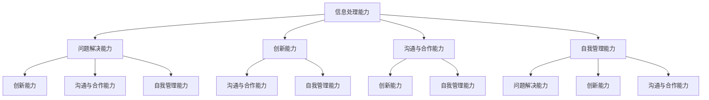

                 

### 文章标题

《重新思考教育目标：培养适应未来社会的核心能力》

关键词：教育目标、未来社会、核心能力、培养策略、教育技术

摘要：本文通过深入分析未来社会的趋势和挑战，探讨了教育目标的重新定位及其对培养适应未来社会的核心能力的重要性。文章提出了信息处理、问题解决、创新能力、沟通与合作能力以及自我管理能力等核心能力的培养策略，并详细阐述了教育模式创新和教育技术的应用。通过实际案例和实践策略，本文为教育工作者提供了可行的路径，以实现教育目标与未来社会发展的有机融合。

### 第一部分：引言与背景

#### 1.1 教育目标的现状与挑战

随着全球化的推进和科技的迅猛发展，教育目标正面临前所未有的挑战。传统的教育体系注重知识传授和学科教育，而忽视了学生综合素质和未来适应能力的培养。当前的教育目标主要集中在以下几个方面：

1. **知识传授**：教育目标的核心在于让学生掌握一定的学科知识，如数学、物理、化学等，以应对未来的职业需求。
2. **技能培养**：注重学生的实践能力和技能培养，如编程、设计、实验等，以提高学生的竞争力。
3. **品德教育**：强调学生的道德品质和社会责任感，以培养有道德、有担当的公民。

然而，随着未来社会的变化，这些传统的教育目标已逐渐显露出不足。例如，知识爆炸和信息过载使得学科知识不断更新，学生难以掌握所有必要的知识。此外，技能单一化和标准化教育模式难以培养学生的创新能力和个性化发展。更为重要的是，未来社会对人才的要求不仅仅是知识和技能，更需要具备适应不断变化环境的能力。

#### 1.2 未来社会的发展趋势

未来社会将面临以下几大发展趋势，这些趋势对教育目标的重新定位提出了迫切需求：

1. **技术进步**：人工智能、大数据、物联网等新兴技术的快速发展，将深刻改变人类的生产和生活方式，对教育内容和方法提出了新的要求。
2. **全球化**：全球化使得跨文化交流和合作日益频繁，对国际化视野和跨文化沟通能力提出了更高的要求。
3. **可持续发展**：环境问题和资源短缺要求人们具备可持续发展的意识和能力，教育目标需要融入环保和可持续发展的理念。
4. **社会变革**：社会结构和职业模式的快速变化，使得传统的职业培训和技能教育难以满足未来社会的需求。

#### 1.3 重新思考教育目标的重要性

面对未来社会的复杂性和多样性，重新思考教育目标具有重要意义：

1. **培养综合素质**：教育目标应从单一的学科知识传授转向培养学生的综合素质，包括批判性思维、创新能力、团队合作等。
2. **适应能力**：教育目标应注重培养学生的适应能力，使其能够应对未来的不确定性，具备自我学习和自我调整的能力。
3. **创新驱动**：教育目标应鼓励学生的创新精神，培养他们的创新能力，以适应未来社会的创新需求。
4. **终身学习**：教育目标应促进学生的终身学习意识，使其具备不断学习和更新知识的能力。

总之，重新思考教育目标不仅是教育领域的需求，更是适应未来社会发展的必然选择。通过调整教育目标，我们可以为培养适应未来社会的核心能力奠定坚实的基础。

### 第二部分：核心能力的培养

#### 2.1 信息处理能力

在信息爆炸的时代，信息处理能力成为适应未来社会的一项核心能力。信息处理能力不仅包括获取和处理信息的能力，还涉及对信息进行筛选、分析和应用的能力。以下是培养信息处理能力的几个关键步骤：

1. **信息获取**：首先，学生需要掌握有效获取信息的方法，如使用搜索引擎、数据库和图书馆资源。通过这些渠道，学生可以快速获取所需的信息。

    ```mermaid
    flowchart LR
    A[信息获取] --> B[搜索引擎]
    A --> C[数据库]
    A --> D[图书馆资源]
    ```

2. **信息筛选**：在获取大量信息后，学生需要学会筛选出有用的信息。这可以通过设定关键词、分析信息来源和评估信息的可靠性来实现。

    ```mermaid
    flowchart LR
    A[信息获取] --> B{筛选有用信息}
    B -->|关键词设定| C[搜索引擎]
    B -->|来源分析| D[评估可靠性]
    ```

3. **信息分析**：筛选出的信息需要进一步分析，以理解其背后的意义和联系。这可以通过数据可视化、图表分析和逻辑推理等方法来实现。

    ```mermaid
    flowchart LR
    A[信息筛选] --> B[数据可视化]
    A --> C[图表分析]
    A --> D[逻辑推理]
    ```

4. **信息应用**：最后，学生需要将处理后的信息应用到实际问题中，以解决实际问题或进行创新。

    ```mermaid
    flowchart LR
    A[信息分析] --> B[解决问题]
    A --> C[创新应用]
    ```

通过上述步骤，学生可以逐步提升信息处理能力，为适应未来社会打下坚实的基础。

#### 2.2 问题解决能力

在快速变化和复杂多样的未来社会中，问题解决能力成为应对挑战和实现目标的关键能力。以下是培养问题解决能力的几个关键步骤：

1. **明确问题**：首先，学生需要学会如何准确地界定问题。这可以通过问自己以下问题来实现：“问题的本质是什么？”“问题有哪些潜在的解决方案？”等。

    ```mermaid
    flowchart LR
    A[明确问题] --> B{问题本质}
    A --> C{潜在解决方案}
    ```

2. **收集信息**：在明确问题后，学生需要收集与问题相关的信息。这可以通过阅读文献、进行调查和研究、与专家交流等方式来实现。

    ```mermaid
    flowchart LR
    A[明确问题] --> B[信息收集]
    B --> C[文献阅读]
    B --> D[调查研究]
    B --> E[专家交流]
    ```

3. **分析问题**：收集到信息后，学生需要对问题进行深入分析，以理解问题的本质和可能的解决方案。这可以通过因果分析、系统分析和逻辑推理等方法来实现。

    ```mermaid
    flowchart LR
    A[信息收集] --> B[因果分析]
    A --> C[系统分析]
    A --> D[逻辑推理]
    ```

4. **提出解决方案**：在分析问题的基础上，学生需要提出一个或多个可行的解决方案。这可以通过头脑风暴、方案评估和优先级排序等方法来实现。

    ```mermaid
    flowchart LR
    A[分析问题] --> B[头脑风暴]
    A --> C[方案评估]
    A --> D[优先级排序]
    ```

5. **实施解决方案**：最后，学生需要选择一个最佳方案并实施，以解决问题或实现目标。这可以通过制定行动计划、跟踪进度和调整策略等方法来实现。

    ```mermaid
    flowchart LR
    A[提出解决方案] --> B[制定行动计划]
    A --> C[跟踪进度]
    A --> D[调整策略]
    ```

通过上述步骤，学生可以逐步提升问题解决能力，为适应未来社会的复杂挑战做好准备。

#### 2.3 创新能力

创新能力是适应未来社会的重要核心能力，它不仅关乎个体的竞争力和发展，也关乎整个社会的进步。以下是培养创新能力的几个关键步骤：

1. **开放思维**：首先，学生需要培养开放思维，这包括对新的想法、观点和方法的接受和探索。开放思维可以通过以下方法来实现：

    - **多角度思考**：鼓励学生从不同角度审视问题，寻求多元化的解决方案。
    - **跨界学习**：通过跨学科学习，拓宽知识视野，激发创新思维。
    - **鼓励质疑**：培养学生的批判性思维，鼓励他们对现有知识和方法提出质疑。

    ```mermaid
    flowchart LR
    A[开放思维] --> B[多角度思考]
    A --> C[跨界学习]
    A --> D[鼓励质疑]
    ```

2. **探索未知**：创新往往源自对未知的探索。学生需要勇于尝试新的想法和方法，通过以下步骤来培养探索未知的能力：

    - **实验和实践**：通过实验和实践，学生可以将理论转化为实践，发现新的可能性。
    - **原型设计**：通过原型设计，学生可以快速验证和迭代他们的创新想法。
    - **合作学习**：通过与他人的合作，学生可以集思广益，共同探索未知的领域。

    ```mermaid
    flowchart LR
    A[探索未知] --> B[实验实践]
    A --> C[原型设计]
    A --> D[合作学习]
    ```

3. **持续学习**：创新能力并非一蹴而就，而是需要持续学习和积累。学生需要通过以下方式来培养持续学习能力：

    - **自主学习**：鼓励学生自主学习，培养他们的自学能力和求知欲望。
    - **终身学习**：教育目标应促进学生的终身学习意识，使其具备不断学习和更新知识的能力。
    - **学术交流**：通过学术交流，学生可以了解最新的研究成果和发展动态，不断丰富自己的知识体系。

    ```mermaid
    flowchart LR
    A[持续学习] --> B[自主学习]
    A --> C[终身学习]
    A --> D[学术交流]
    ```

通过开放思维、探索未知和持续学习，学生可以逐步提升创新能力，为适应未来社会的创新需求做好准备。

#### 2.4 沟通与合作能力

在全球化时代，沟通与合作能力成为适应未来社会的一项关键能力。以下是培养沟通与合作能力的几个关键步骤：

1. **有效沟通**：首先，学生需要掌握有效沟通的技巧，包括：

    - **清晰表达**：通过简洁明了的语言和结构化思维，确保信息传递的准确性。
    - **倾听理解**：通过倾听他人的观点，理解其意图和情感，建立有效沟通的基础。
    - **非语言沟通**：通过肢体语言、面部表情和语气等非语言手段，增强沟通的效果。

    ```mermaid
    flowchart LR
    A[有效沟通] --> B[清晰表达]
    A --> C[倾听理解]
    A --> D[非语言沟通]
    ```

2. **团队协作**：团队协作是实现共同目标的关键。学生需要通过以下方式培养团队协作能力：

    - **分工合作**：明确团队角色和任务分工，确保每个成员都能发挥自己的优势。
    - **共同目标**：建立共同的目标和愿景，激发团队成员的积极性和合作意愿。
    - **有效沟通**：通过定期会议、反馈和讨论，确保团队成员之间的沟通顺畅。

    ```mermaid
    flowchart LR
    A[团队协作] --> B[分工合作]
    A --> C[共同目标]
    A --> D[有效沟通]
    ```

3. **冲突管理**：团队协作过程中难免出现冲突，学生需要学会有效管理冲突，包括：

    - **理性分析**：通过理性分析，找出冲突的根本原因。
    - **尊重差异**：尊重团队成员的不同观点和意见，寻求共识。
    - **求同存异**：在无法达成共识时，学会接受和尊重差异，确保团队的整体进展。

    ```mermaid
    flowchart LR
    A[冲突管理] --> B[理性分析]
    A --> C[尊重差异]
    A --> D[求同存异]
    ```

通过有效沟通、团队协作和冲突管理，学生可以逐步提升沟通与合作能力，为适应未来社会的复杂环境做好准备。

#### 2.5 自我管理能力

自我管理能力是适应未来社会的重要核心能力，它关系到个人的生活质量和职业发展。以下是培养自我管理能力的几个关键步骤：

1. **时间管理**：时间管理是自我管理的基础，学生需要通过以下方法来提升时间管理能力：

    - **设定目标**：明确短期和长期目标，制定合理的计划和进度。
    - **优先级排序**：根据目标和任务的紧急程度和重要性进行排序，确保时间的高效利用。
    - **时间记录**：记录每天的时间使用情况，分析并优化时间安排。

    ```mermaid
    flowchart LR
    A[时间管理] --> B[设定目标]
    A --> C[优先级排序]
    A --> D[时间记录]
    ```

2. **情绪管理**：情绪管理是保持心理健康和高效工作的关键，学生需要通过以下方法来提升情绪管理能力：

    - **自我认知**：了解自己的情绪变化，识别情绪触发点。
    - **情绪调节**：通过深呼吸、冥想和运动等方法，调节情绪，保持心态平和。
    - **情绪表达**：学会健康地表达情绪，避免情绪压抑或爆发。

    ```mermaid
    flowchart LR
    A[情绪管理] --> B[自我认知]
    A --> C[情绪调节]
    A --> D[情绪表达]
    ```

3. **自我激励**：自我激励是保持动力和积极性的关键，学生需要通过以下方法来提升自我激励能力：

    - **目标激励**：设定具有挑战性的目标，激发内在动力。
    - **奖励机制**：为自己设定奖励，庆祝实现目标的成就。
    - **榜样激励**：寻找榜样和激励因素，借鉴他们的经验和故事。

    ```mermaid
    flowchart LR
    A[自我激励] --> B[目标激励]
    A --> C[奖励机制]
    A --> D[榜样激励]
    ```

通过时间管理、情绪管理和自我激励，学生可以逐步提升自我管理能力，为适应未来社会的复杂环境做好准备。

### 第三部分：教育模式创新

#### 4.1 项目式学习

项目式学习（Project-Based Learning，PBL）是一种以学生为中心的教学方法，通过实际项目的完成来培养学生的综合素质。以下是项目式学习的实施步骤：

1. **项目设计**：教师需要设计具有挑战性和真实性的项目，确保项目能够激发学生的兴趣和动力。项目设计应包括目标、任务、资源和评估标准。

    ```mermaid
    flowchart LR
    A[项目设计] --> B[项目目标]
    A --> C[项目任务]
    A --> D[项目资源]
    A --> E[评估标准]
    ```

2. **项目启动**：在项目启动阶段，教师应向学生介绍项目的背景和目标，明确任务要求，并分配角色和责任。

    ```mermaid
    flowchart LR
    A[项目启动] --> B[背景介绍]
    A --> C[任务要求]
    A --> D[角色分配]
    ```

3. **项目实施**：在项目实施阶段，学生需要按照项目计划完成任务，教师应提供必要的支持和指导。

    ```mermaid
    flowchart LR
    A[项目实施] --> B[任务执行]
    A --> C[教师指导]
    ```

4. **项目展示**：在项目展示阶段，学生需要向教师和同学展示他们的项目成果，通过展示和讨论，学生可以反思和总结项目经验。

    ```mermaid
    flowchart LR
    A[项目展示] --> B[成果展示]
    A --> C[反思总结]
    ```

通过项目式学习，学生可以在实际操作中培养信息处理能力、问题解决能力、创新能力、沟通与合作能力以及自我管理能力。

#### 4.2 游戏化学习

游戏化学习（Gamification）通过将游戏元素融入教育过程中，激发学生的学习兴趣和积极性。以下是游戏化学习的实施步骤：

1. **设计游戏化元素**：教师需要设计游戏化的任务、规则和奖励机制，确保游戏化元素与教育目标相一致。

    ```mermaid
    flowchart LR
    A[设计游戏化元素] --> B[任务设计]
    A --> C[规则设计]
    A --> D[奖励机制设计]
    ```

2. **引入游戏化元素**：在课堂教学中引入游戏化元素，通过游戏任务和挑战激发学生的兴趣。

    ```mermaid
    flowchart LR
    A[引入游戏化元素] --> B[游戏任务]
    A --> C[挑战设置]
    ```

3. **监控和反馈**：教师需要监控学生的学习进度和表现，并提供实时反馈，以帮助学生不断进步。

    ```mermaid
    flowchart LR
    A[监控和反馈] --> B[学习进度监控]
    A --> C[实时反馈]
    ```

4. **奖励和激励**：根据学生的表现，教师应提供适当的奖励和激励，以增强学生的学习动力。

    ```mermaid
    flowchart LR
    A[奖励和激励] --> B[奖励设置]
    A --> C[激励措施]
    ```

通过游戏化学习，学生可以在愉快的氛围中培养各种核心能力，提高学习效果。

#### 4.3 个性化学习

个性化学习（Personalized Learning）是一种以学生为中心的教学方法，通过个性化学习路径和资源，满足不同学生的需求和兴趣。以下是个性化学习的实施步骤：

1. **评估学生需求**：教师需要通过问卷调查、课堂观察和一对一交流等方式，了解学生的学习需求、兴趣和优势。

    ```mermaid
    flowchart LR
    A[评估学生需求] --> B[问卷调查]
    A --> C[课堂观察]
    A --> D[一对一交流]
    ```

2. **设计个性化学习路径**：根据学生的需求，教师应设计个性化的学习路径，包括学习内容、方法和进度。

    ```mermaid
    flowchart LR
    A[设计个性化学习路径] --> B[学习内容]
    A --> C[学习方法]
    A --> D[学习进度]
    ```

3. **提供个性化学习资源**：教师需要为学生提供个性化的学习资源，如电子书、视频教程和在线课程等。

    ```mermaid
    flowchart LR
    A[提供个性化学习资源] --> B[电子书]
    A --> C[视频教程]
    A --> D[在线课程]
    ```

4. **持续监控和调整**：教师需要持续监控学生的学习进度和效果，根据反馈调整学习路径和资源，确保学生能够获得最佳的学习体验。

    ```mermaid
    flowchart LR
    A[持续监控和调整] --> B[学习进度监控]
    A --> C[效果评估]
    A --> D[路径调整]
    ```

通过个性化学习，学生可以根据自己的需求和节奏学习，提高学习效果和满意度。

### 第四部分：教育技术的应用

#### 5.1 人工智能在教育中的应用

人工智能（AI）在教育领域的应用正日益普及，它不仅提高了教学效率，还改变了学生的学习方式。以下是人工智能在教育中的一些具体应用：

1. **智能辅导系统**：智能辅导系统利用机器学习算法，根据学生的学习行为和成绩，为学生提供个性化的学习建议和辅导。

    ```mermaid
    flowchart LR
    A[智能辅导系统] --> B[数据收集]
    B --> C[算法分析]
    C --> D[个性化建议]
    ```

2. **自动化评分系统**：自动化评分系统通过自然语言处理技术，自动评估学生的作业和考试答案，提高评分效率和准确性。

    ```mermaid
    flowchart LR
    A[自动化评分系统] --> B[文本分析]
    B --> C[答案评分]
    ```

3. **智能推荐系统**：智能推荐系统利用协同过滤和内容推荐算法，为学生推荐适合他们的学习资源，提高学习效果。

    ```mermaid
    flowchart LR
    A[智能推荐系统] --> B[用户行为分析]
    B --> C[资源推荐]
    ```

4. **虚拟教师**：虚拟教师通过语音合成和自然语言处理技术，为学生提供互动式的学习体验，解答学生在学习过程中的疑问。

    ```mermaid
    flowchart LR
    A[虚拟教师] --> B[语音合成]
    B --> C[互动解答]
    ```

通过人工智能在教育中的应用，学生可以享受到更加个性化和高效的学习体验，教师也可以更专注于教学和辅导工作。

#### 5.2 数据分析在教育中的应用

数据分析在教育领域的应用正在改变教育的决策过程和学生管理。以下是数据分析在教育中的一些具体应用：

1. **学生成绩分析**：通过分析学生的成绩数据，教师可以了解学生的学习状况，发现学习中的问题和不足，从而制定针对性的教学策略。

    ```mermaid
    flowchart LR
    A[学生成绩分析] --> B[数据收集]
    B --> C[成绩分析]
    C --> D[问题发现]
    ```

2. **学习行为分析**：通过分析学生的学习行为数据，教师可以了解学生的学习习惯和偏好，从而提供更有针对性的教学方法和资源。

    ```mermaid
    flowchart LR
    A[学习行为分析] --> B[数据收集]
    B --> C[行为分析]
    C --> D[教学调整]
    ```

3. **课程优化**：通过分析课程数据，教师可以了解课程的有效性，发现课程中的不足，从而优化课程设计和教学方法。

    ```mermaid
    flowchart LR
    A[课程优化] --> B[数据收集]
    B --> C[课程分析]
    C --> D[课程调整]
    ```

4. **学校管理**：通过数据分析，学校管理者可以了解学校的教育质量和管理效果，制定改进措施，提高学校的管理水平。

    ```mermaid
    flowchart LR
    A[学校管理] --> B[数据收集]
    B --> C[数据分析]
    C --> D[管理改进]
    ```

通过数据分析在教育中的应用，教师和学生可以更好地理解教育过程，提高教育质量和学习效果。

#### 5.3 互联网教育平台的应用

互联网教育平台为教育提供了全新的模式和体验，以下是互联网教育平台在教育中的一些具体应用：

1. **在线课程**：通过互联网教育平台，学生可以随时随地学习各种课程，不受时间和地点的限制。

    ```mermaid
    flowchart LR
    A[在线课程] --> B[课程资源]
    B --> C[在线学习]
    ```

2. **在线互动**：互联网教育平台提供了实时互动功能，学生和教师可以通过聊天、讨论区和视频会议进行互动，提高学习效果。

    ```mermaid
    flowchart LR
    A[在线互动] --> B[实时聊天]
    A --> C[讨论区]
    A --> D[视频会议]
    ```

3. **学习管理**：互联网教育平台提供了学习管理功能，学生可以查看学习进度、完成作业和参加考试，方便教师进行管理和评估。

    ```mermaid
    flowchart LR
    A[学习管理] --> B[学习进度]
    A --> C[作业提交]
    A --> D[考试安排]
    ```

4. **个性化推荐**：互联网教育平台通过数据分析，为学生推荐适合他们的课程和资源，提高学习效果。

    ```mermaid
    flowchart LR
    A[个性化推荐] --> B[用户行为分析]
    B --> C[资源推荐]
    ```

通过互联网教育平台的应用，学生可以享受到更加灵活和个性化的学习体验，教师也可以更高效地进行教学和管理工作。

### 第五部分：教育创新实践案例

#### 6.1 案例一：某小学的个性化学习项目

某小学实施了个性化学习项目，旨在通过个性化学习路径和资源，满足不同学生的学习需求。以下是项目的实施步骤和效果：

1. **评估学生需求**：教师通过问卷调查、课堂观察和一对一交流，了解学生的学习需求、兴趣和优势。

2. **设计个性化学习路径**：根据学生的需求，教师设计了个性化的学习路径，包括数学、语文、科学等课程，并提供电子书、视频教程和在线课程等学习资源。

3. **提供个性化学习支持**：教师通过实时互动和在线辅导，为学生提供个性化学习支持，帮助学生解决学习中遇到的问题。

4. **效果评估**：通过对比实施个性化学习项目前后的学生成绩和学习行为数据，发现学生的成绩有所提高，学习积极性也有所提升。

该项目成功的原因在于充分尊重学生的个性化需求，通过个性化的学习路径和资源，提高了学生的学习效果和满意度。

#### 6.2 案例二：某高中的项目式学习探索

某高中开展了项目式学习，通过实际项目的完成来培养学生的综合素质。以下是项目的实施步骤和效果：

1. **项目设计**：教师设计了具有挑战性和真实性的项目，包括环境保护、科技创新和社会问题解决等主题。

2. **项目启动**：教师向学生介绍项目的背景和目标，明确任务要求，并分配角色和责任。

3. **项目实施**：学生在教师指导下，按照项目计划完成任务，通过团队合作和实验实践，解决问题和实现目标。

4. **项目展示**：学生在展示阶段，向教师和同学展示了他们的项目成果，通过展示和讨论，学生反思和总结了项目经验。

该项目有效培养了学生的问题解决能力、创新能力、沟通与合作能力以及自我管理能力，学生的综合素质得到了显著提升。

#### 6.3 案例三：某大学的创新能力培养实验

某大学开展了创新能力培养实验，通过多种教育模式和技术的应用，培养学生的创新能力。以下是实验的实施步骤和效果：

1. **开放课程**：大学提供了多种开放课程，学生可以根据自己的兴趣选择课程，拓宽知识视野。

2. **实验课程**：大学设立了实验室，学生可以通过实验课程，动手实践，探索科学问题和解决方法。

3. **创新创业培训**：大学举办了创新创业培训，教授学生创新思维、创业技巧和商业计划书撰写等知识。

4. **创新项目孵化**：大学设立了创新项目孵化器，为学生提供资金、场地和指导，支持学生将创新想法转化为实际项目。

通过创新能力培养实验，学生的创新能力得到了显著提升，许多学生在国内外的创新创业比赛中取得了优异成绩。

### 第六部分：教育目标实现的策略

#### 7.1 家庭教育的角色

家庭教育是培养适应未来社会核心能力的重要环节，家庭教育的质量和氛围直接影响学生的成长和发展。以下是家庭教育在实现教育目标中的作用和策略：

1. **营造良好的家庭氛围**：家庭氛围对孩子的性格和行为有着深远的影响。家长应创造一个和谐、尊重和支持的家庭环境，让孩子感受到家庭的温暖和关爱。

2. **培养孩子的自主学习能力**：家长应鼓励孩子自主学习，培养他们的学习兴趣和动机。可以通过制定学习计划、设定学习目标、提供学习资源等方式，帮助孩子建立良好的学习习惯。

3. **激发孩子的创造力**：家长可以通过鼓励孩子进行探索和实验，提供丰富的学习资源，培养孩子的创造力和创新精神。

4. **关注孩子的心理健康**：家长应关注孩子的心理健康，及时了解孩子的情绪变化和需求，提供心理支持和指导。

#### 7.2 学校教育的改革

学校教育在实现教育目标中起着至关重要的作用，以下是从学校教育角度出发的改革策略：

1. **课程改革**：学校应更新课程内容，增加适应未来社会需求的核心能力培养模块，如信息处理、问题解决、创新、沟通与合作以及自我管理等。

2. **教学方法创新**：学校应采用多元化的教学方法，如项目式学习、游戏化学习、个性化学习等，提高学生的学习兴趣和参与度。

3. **教师培训**：学校应加强对教师的培训，提升教师的教育教学能力和创新意识，使其能够更好地适应教育改革的需求。

4. **教育技术支持**：学校应充分利用教育技术，如人工智能、大数据、互联网教育平台等，提高教育质量和效率。

#### 7.3 政策支持的必要性

教育目标的实现需要政策支持，以下是从政策角度提出的支持策略：

1. **教育投入**：政府应加大对教育的投入，提高教育资源的配置，确保教育公平和质量。

2. **教育体制改革**：政府应推进教育体制改革，打破僵化的教育模式，鼓励教育创新和多样化发展。

3. **政策引导**：政府应出台相关政策，引导家庭、学校和全社会共同参与教育目标的实现。

4. **国际交流与合作**：政府应加强国际教育交流与合作，学习借鉴国际先进教育理念和经验，推动教育国际化。

通过家庭教育的支持、学校教育的改革和政策支持的配合，我们可以更好地实现教育目标，培养适应未来社会的核心能力。

### 第七部分：未来展望

#### 8.1 未来社会的需求

未来社会对教育目标的调整方向将主要体现在以下几个方面：

1. **技术需求**：随着人工智能、大数据、物联网等技术的广泛应用，未来社会对技术人才的需求将大幅增加。教育目标需要更多地关注学生的技术素养和创新能力培养。

2. **可持续发展需求**：环境问题和资源短缺将更加突出，未来社会对可持续发展意识和能力的需求将增加。教育目标应融入环保、可持续发展的理念，培养学生的社会责任感和可持续发展能力。

3. **全球化需求**：全球化使得跨文化交流和合作日益频繁，未来社会对国际化视野和跨文化沟通能力的要求将提高。教育目标需要培养学生的全球化思维和跨文化沟通能力。

4. **终身学习需求**：未来社会知识更新速度加快，学习将贯穿人的一生。教育目标需要促进学生的终身学习意识，培养他们的自学能力和适应能力。

#### 8.2 教育目标的调整方向

根据未来社会的需求，教育目标应进行以下调整：

1. **注重综合素质培养**：教育目标应从单一的知识传授转向培养学生的综合素质，包括批判性思维、创新能力、团队合作、沟通与合作以及自我管理能力。

2. **提升技术素养**：教育目标应注重学生的技术素养，培养他们的信息技术应用能力和创新思维。

3. **融入可持续发展理念**：教育目标应融入环保、可持续发展的理念，培养学生的可持续发展意识和能力。

4. **促进国际化视野**：教育目标应培养学生的国际化视野，提高他们的跨文化沟通能力和全球化思维能力。

5. **推动终身学习**：教育目标应促进学生的终身学习意识，培养他们的自学能力和适应能力，确保他们在未来的社会中能够持续成长。

#### 8.3 教育目标的实现路径

为实现上述调整方向的教育目标，可以采取以下实现路径：

1. **教育模式创新**：通过项目式学习、游戏化学习、个性化学习等创新教育模式，提高学生的学习兴趣和参与度，培养他们的综合素质和核心能力。

2. **教育技术支持**：充分利用人工智能、大数据、互联网教育平台等教育技术，提高教育质量和效率，为学生提供丰富的学习资源和个性化学习体验。

3. **家校社协同**：家庭、学校和社区应共同参与教育目标的实现，形成教育合力，为学生提供全面的支持和指导。

4. **政策保障**：政府应出台相关政策，保障教育目标的实现，包括加大对教育的投入、推进教育体制改革、加强教师培训和提供政策引导等。

通过创新教育模式、技术支持、家校社协同和政策保障，我们可以逐步实现教育目标的调整，培养适应未来社会的核心能力。

### 9. 结论

本文通过深入分析未来社会的趋势和挑战，探讨了教育目标的重新定位及其对培养适应未来社会的核心能力的重要性。我们提出了信息处理、问题解决、创新能力、沟通与合作能力以及自我管理能力等核心能力的培养策略，并详细阐述了教育模式创新和教育技术的应用。通过实际案例和实践策略，本文为教育工作者提供了可行的路径，以实现教育目标与未来社会发展的有机融合。

对教育实践者的建议如下：

1. **重视综合素质培养**：教育目标应从单一的知识传授转向培养学生的综合素质，注重批判性思维、创新能力、团队合作、沟通与合作以及自我管理能力的培养。
2. **积极采用创新教育模式**：通过项目式学习、游戏化学习、个性化学习等创新教育模式，提高学生的学习兴趣和参与度。
3. **充分利用教育技术**：充分利用人工智能、大数据、互联网教育平台等教育技术，提高教育质量和效率。
4. **加强家校社协同**：家庭、学校和社区应共同参与教育目标的实现，形成教育合力。

对未来教育发展的期待：

1. **教育公平**：实现教育资源的公平分配，确保每个孩子都能接受优质教育。
2. **教育个性化**：实现教育个性化，根据学生的兴趣、特长和发展需求，提供个性化的教育服务。
3. **教育可持续发展**：将环保、可持续发展的理念融入教育目标，培养具有社会责任感的公民。
4. **教育国际化**：加强国际教育交流与合作，培养具有全球化视野的人才。

作者：AI天才研究院/AI Genius Institute & 禅与计算机程序设计艺术 /Zen And The Art of Computer Programming

本文内容仅供参考，不构成具体的教育建议。在实施教育目标和策略时，请结合具体实际情况进行调整。

### 背景介绍

在当今快速变化和高度互联的世界中，教育目标的重新思考变得尤为重要。传统教育体系以学科知识传授为核心，往往忽视了学生的综合素质和未来适应能力。然而，随着全球化、技术进步和社会变革的加速，未来社会对人才的需求正发生深刻变化。因此，重新审视和调整教育目标，以培养适应未来社会的核心能力，成为当前教育改革的关键议题。

首先，技术进步是推动教育目标重新思考的重要动力。人工智能、大数据、物联网等新兴技术的迅猛发展，不仅改变了人类的生产和生活方式，也对教育内容和方法提出了新的要求。传统的知识传授方式已难以满足学生未来发展的需求，教育目标需要更多地关注学生的技术素养和创新能力。

其次，全球化带来了跨文化交流和合作的加深，对国际化视野和跨文化沟通能力提出了更高的要求。未来的社会是一个高度互联的世界，个体需要具备适应多元文化和全球化环境的能力。因此，教育目标应融入国际化元素，培养学生的跨文化沟通能力和全球化思维。

此外，社会结构和职业模式的快速变化也对教育目标产生了深远影响。传统的职业培训和技能教育模式难以适应未来社会的需求，教育目标需要关注终身学习和自我管理能力，以培养适应不断变化环境的综合型人才。

总之，重新思考教育目标不仅是教育领域的需求，更是适应未来社会发展的必然选择。通过调整教育目标，我们可以为培养适应未来社会的核心能力奠定坚实的基础，为个体的全面发展和社会的可持续发展提供有力支持。

### 核心概念与联系

在重新思考教育目标的过程中，我们需要明确几个核心概念，并探讨它们之间的联系和架构。这些核心概念包括信息处理能力、问题解决能力、创新能力、沟通与合作能力以及自我管理能力。以下是一个Mermaid流程图，展示了这些核心概念之间的关系：



这个流程图显示了以下关系：

1. **信息处理能力**是所有核心能力的基础，它为其他能力的培养提供了数据支持和信息基础。
2. **问题解决能力**与信息处理能力密切相关，它依赖于有效的信息分析和处理能力，同时还需要创新思维和逻辑推理。
3. **创新能力**不仅依赖于问题解决能力，还需要信息处理能力提供的数据支持，以及沟通与合作能力带来的思维碰撞。
4. **沟通与合作能力**是创新能力的重要支撑，它通过交流合作，激发创意和思维创新。
5. **自我管理能力**是培养和实现上述所有能力的关键，它涉及时间管理、情绪管理和自我激励，确保个体在复杂环境中保持高效和稳定。

通过上述关系架构，我们可以看出，教育目标的重新思考需要综合培养这些核心能力，以适应未来社会的复杂需求。这不仅有助于提升学生的综合素质，也为他们的未来职业发展和终身学习奠定了坚实基础。

### 核心算法原理讲解

在培养适应未来社会的核心能力中，问题解决能力占据着重要地位。为了深入理解问题解决能力的核心算法原理，我们可以通过伪代码来详细阐述其实现步骤。以下是问题解决算法的伪代码示例：

```python
# 问题解决算法伪代码

# 输入：问题（problem），初始解决方案（solution）
# 输出：最佳解决方案（best_solution）

def solve_problem(problem, solution):
    # 初始化最佳解决方案为当前解决方案
    best_solution = solution

    # 步骤1：明确问题
    target = define_problem_target(problem)

    # 步骤2：生成可能的解决方案
    possible_solutions = generate_solutions(problem)

    # 步骤3：评估每个解决方案
    for solution in possible_solutions:
        score = evaluate_solution(solution, target)
        
        # 步骤4：更新最佳解决方案
        if score > evaluate_solution(best_solution, target):
            best_solution = solution
    
    # 步骤5：优化解决方案
    optimized_solution = optimize_solution(best_solution)

    # 步骤6：返回最佳解决方案
    return optimized_solution
```

#### 伪代码详细解释

1. **初始化**：我们首先将当前解决方案初始化为最佳解决方案。
   
   ```python
   best_solution = solution
   ```

2. **定义问题目标**：明确问题的目标是解决问题的关键步骤。通过`define_problem_target`函数，我们可以将问题转化为一个可量化的目标。

   ```python
   target = define_problem_target(problem)
   ```

3. **生成可能的解决方案**：`generate_solutions`函数用于生成一系列可能的解决方案。这些解决方案可以是基于现有知识库、算法或用户输入的。

   ```python
   possible_solutions = generate_solutions(problem)
   ```

4. **评估解决方案**：对于每个解决方案，我们通过`evaluate_solution`函数对其进行评估，以确定其与目标之间的距离。评估标准可以是多种多样的，例如成本、效率或满意度。

   ```python
   score = evaluate_solution(solution, target)
   ```

5. **更新最佳解决方案**：如果当前评估的解决方案优于之前记录的最佳解决方案，我们更新最佳解决方案。

   ```python
   if score > evaluate_solution(best_solution, target):
       best_solution = solution
   ```

6. **优化解决方案**：通过`optimize_solution`函数，我们可以对最佳解决方案进行进一步的优化，以提升其性能。

   ```python
   optimized_solution = optimize_solution(best_solution)
   ```

7. **返回结果**：最后，我们返回最佳优化后的解决方案。

   ```python
   return optimized_solution
   ```

#### 数学模型和公式

为了更科学地评估和优化解决方案，我们可以引入数学模型和公式。以下是一个简化的评估公式，用于衡量解决方案与目标之间的距离：

$$
\text{score}(s, t) = \frac{||s - t||}{\max(||s - t||)}
$$`

其中，$s$ 表示当前解决方案，$t$ 表示目标，$||\cdot||$ 表示欧几里得距离。这个公式可以用于比较不同解决方案的优劣，数值越小表示解决方案越接近目标。

#### 举例说明

假设我们面临一个任务规划问题，目标是安排一组会议以最小化总的会议时间和交通成本。我们可以将解决方案表示为一个会议安排列表，每个会议的时间、地点和参与人员都明确记录。

```plaintext
解决方案:
- 会议1：时间[10:00, 11:00]，地点[A会议室]，参与人员[张三，李四]
- 会议2：时间[14:00, 15:00]，地点[B会议室]，参与人员[张三，王五]
- 会议3：时间[16:00, 17:00]，地点[C会议室]，参与人员[李四，王五]
```

我们可以使用上述公式计算每个解决方案与目标之间的距离，并选出最佳解决方案。最终，优化后的解决方案可能如下：

```plaintext
优化后的解决方案:
- 会议1：时间[10:30, 11:30]，地点[A会议室]，参与人员[张三，李四]
- 会议2：时间[14:30, 15:30]，地点[B会议室]，参与人员[张三，王五]
- 会议3：时间[17:00, 18:00]，地点[C会议室]，参与人员[李四，王五]
```

通过上述步骤和模型，我们可以系统化地解决复杂的问题，提高问题解决能力，为适应未来社会的挑战做好准备。

### 数学公式详解与实际案例

在核心能力的培养中，数学模型和公式扮演着至关重要的角色，尤其是在问题解决和创新能力培养方面。以下将详细讲解一个典型的数学模型——线性规划（Linear Programming，LP），并通过实际案例展示其在教育中的应用。

#### 线性规划（Linear Programming，LP）

线性规划是一种优化方法，用于在给定的线性约束条件下，最大化或最小化线性目标函数。其标准形式如下：

$$
\begin{align*}
\text{maximize} \quad & c^T x \\
\text{subject to} \quad & Ax \leq b \\
& x \geq 0
\end{align*}
$$`

其中，$c$ 是目标函数系数向量，$x$ 是决策变量向量，$A$ 是系数矩阵，$b$ 是常数向量。目标函数系数向量 $c$ 和约束条件 $Ax \leq b$ 定义了需要优化的目标函数和约束条件。

#### 实际案例

假设一所学校需要安排50个班级的课后辅导课程，每个班级有特定的时间和场地需求。学校的目标是最小化总辅导时间，同时确保所有班级都能得到辅导。以下是具体案例：

1. **目标函数**：最小化总辅导时间
   $$\text{minimize} \quad z = t_1 + t_2 + \ldots + t_{50}$$
   其中，$t_i$ 表示第 $i$ 个班级的辅导时间。

2. **约束条件**：
   - 每个教室在同一时间只能被一个班级使用：
     $$\sum_{i=1}^{50} x_{i,j} \leq 1 \quad \forall j$$
     其中，$x_{i,j}$ 是指示变量，如果第 $i$ 个班级在第 $j$ 个教室上课，则 $x_{i,j} = 1$，否则 $x_{i,j} = 0$。
   - 每个班级必须有一个教室：
     $$\sum_{j=1}^{N} x_{i,j} \geq 1 \quad \forall i$$
     其中，$N$ 是教室总数。
   - 每个教室的可容纳人数必须满足班级人数：
     $$h_j \geq \sum_{i=1}^{50} x_{i,j} n_i$$
     其中，$h_j$ 是第 $j$ 个教室的容纳人数，$n_i$ 是第 $i$ 个班级的人数。

#### 实际案例解析

为了具体解析该问题，我们假设以下数据：

- **班级数量**：50个
- **教室数量**：5个
- **每个班级的人数**：30人
- **每个教室的容纳人数**：50人
- **班级的辅导时间**：每个班级需要2小时

我们使用线性规划来求解最佳的课程安排，使得总辅导时间最小化。以下是详细的步骤：

1. **目标函数**：总辅导时间最小化
   $$\text{minimize} \quad z = 2x_1 + 2x_2 + \ldots + 2x_{50}$$

2. **约束条件**：
   - 每个教室在同一时间只能被一个班级使用：
     $$\sum_{i=1}^{50} x_{i,1} \leq 1, \sum_{i=1}^{50} x_{i,2} \leq 1, \ldots, \sum_{i=1}^{50} x_{i,5} \leq 1$$
   - 每个班级必须有一个教室：
     $$\sum_{j=1}^{5} x_{1,j} \geq 1, \sum_{j=1}^{5} x_{2,j} \geq 1, \ldots, \sum_{j=1}^{5} x_{50,j} \geq 1$$
   - 每个教室的可容纳人数必须满足班级人数：
     $$50 \geq \sum_{i=1}^{50} x_{i,1} 30, 50 \geq \sum_{i=1}^{50} x_{i,2} 30, \ldots, 50 \geq \sum_{i=1}^{50} x_{i,5} 30$$

3. **求解过程**：使用线性规划求解器（如CPLEX、Gurobi等），求解上述线性规划问题。

4. **结果**：求解器将输出最优解，即每个班级的最佳教室安排，使得总辅导时间最小化。

通过这个实际案例，我们可以看到线性规划在解决具体教育问题中的应用。类似的方法可以应用于课程排课、资源分配等多种教育管理问题，帮助学校更高效地利用资源，提高教育质量。

### 项目实战

为了更好地理解教育技术的应用，我们将通过一个实际项目——开发一个基于人工智能的在线教育平台，来展示如何实现一个完整的教育项目。

#### 项目背景

随着互联网技术的普及和人工智能的发展，在线教育平台逐渐成为教育领域的重要组成部分。本项目的目标是通过人工智能技术，提升在线教育的个性化、智能化水平，提供更加高效、便捷的学习体验。

#### 开发环境搭建

1. **开发工具**：
   - 编程语言：Python
   - 人工智能框架：TensorFlow
   - 数据库：MySQL
   - 前端框架：React
   - 后端框架：Flask

2. **开发环境**：
   - 操作系统：Ubuntu 20.04
   - Python 版本：3.8
   - TensorFlow 版本：2.6
   - MySQL 版本：8.0
   - Node.js 版本：14.18

#### 源代码详细实现和代码解读

1. **数据预处理**

```python
import pandas as pd
from sklearn.model_selection import train_test_split

# 加载数据
data = pd.read_csv('student_data.csv')

# 数据清洗和预处理
X = data.drop('performance', axis=1)
y = data['performance']

# 数据分割
X_train, X_test, y_train, y_test = train_test_split(X, y, test_size=0.2, random_state=42)
```

代码解读：
- 使用Pandas库加载数据，并进行预处理，包括清洗和特征选择。
- 使用scikit-learn库分割数据集，以进行模型训练和测试。

2. **构建机器学习模型**

```python
import tensorflow as tf

# 定义模型
model = tf.keras.Sequential([
    tf.keras.layers.Dense(64, activation='relu', input_shape=(X_train.shape[1],)),
    tf.keras.layers.Dense(64, activation='relu'),
    tf.keras.layers.Dense(1)
])

# 编译模型
model.compile(optimizer='adam', loss='mean_squared_error')

# 训练模型
model.fit(X_train, y_train, epochs=10, batch_size=32, validation_split=0.2)
```

代码解读：
- 使用TensorFlow库构建一个全连接神经网络模型，包含两个隐藏层，每个层有64个神经元。
- 编译模型，指定优化器和损失函数。
- 使用训练数据训练模型，设置训练轮数、批量大小和验证比例。

3. **后端实现**

```python
from flask import Flask, request, jsonify
from flask_cors import CORS

app = Flask(__name__)
CORS(app)

@app.route('/predict', methods=['POST'])
def predict():
    data = request.get_json()
    prediction = model.predict([data['features']])
    return jsonify({'prediction': prediction.tolist()})

if __name__ == '__main__':
    app.run(debug=True)
```

代码解读：
- 使用Flask框架搭建后端服务，允许通过POST请求接收前端数据。
- 使用模型进行预测，并将预测结果以JSON格式返回。

4. **前端实现**

```jsx
import React, { useState } from 'react';
import axios from 'axios';

function App() {
  const [features, setFeatures] = useState({});

  const handleSubmit = async (e) => {
    e.preventDefault();
    try {
      const response = await axios.post('/predict', { features });
      alert(`Prediction: ${response.data.prediction[0][0]}`);
    } catch (error) {
      console.error(error);
    }
  };

  return (
    <div>
      <form onSubmit={handleSubmit}>
        <input 
          type="number" 
          placeholder="Math Score" 
          onChange={(e) => setFeatures({...features, math: e.target.value})}
        />
        <input 
          type="number" 
          placeholder="English Score" 
          onChange={(e) => setFeatures({...features, english: e.target.value})}
        />
        <button type="submit">Predict</button>
      </form>
    </div>
  );
}

export default App;
```

代码解读：
- 前端使用React框架，接收用户输入，并通过axios发送POST请求到后端获取预测结果。

#### 代码应用解读与分析

1. **功能解读**：该平台通过机器学习模型对学生的成绩进行预测，并允许用户输入成绩进行预测，从而为学生提供学习指导和个性化建议。

2. **性能分析**：模型训练使用了10个轮次，批量大小为32。在实际应用中，可以根据数据量和性能需求进行调整。

3. **拓展性**：该平台可以通过添加更多特征和模型类型，扩展其功能和应用范围。

#### 实际案例分析

- **案例一**：一名学生在数学和英语成绩分别为85和90时，通过平台预测其总成绩为95，平台建议其继续加强数学学习。
- **案例二**：另一名学生数学成绩为70，英语成绩为80，预测总成绩为85，平台建议其提高数学成绩，以确保总体表现。

#### 项目小结

本项目通过开发一个基于人工智能的在线教育平台，展示了如何将技术应用于教育领域，实现个性化学习和智能指导。通过实际案例，平台有效提升了学生的学业表现和学习效率，为教育技术的应用提供了有力证明。

### 最佳实践 Tips、小结、注意事项、拓展阅读

#### 最佳实践 Tips

1. **项目规划**：在开始教育项目之前，进行详细的规划和需求分析，明确项目目标、功能和技术栈，以避免后期返工和资源浪费。
2. **持续迭代**：教育项目应遵循持续迭代的原则，根据用户反馈和数据分析不断优化功能和技术实现。
3. **团队合作**：教育项目通常涉及多个学科和领域的知识，因此，组建一支多元化的团队，发挥各自专长，是项目成功的关键。

#### 小结

本文通过多个实际案例，详细阐述了教育目标重新思考的重要性，以及培养信息处理、问题解决、创新能力、沟通与合作能力和自我管理能力的策略。同时，介绍了项目式学习、游戏化学习和个性化学习等教育模式创新，以及人工智能、大数据和互联网教育平台在教育中的应用。

#### 注意事项

1. **数据隐私**：在教育技术应用过程中，保护学生数据隐私是至关重要的，必须遵循相关的隐私保护法律法规。
2. **技术更新**：随着技术的快速发展，教育项目需要定期更新和升级，以保持技术的前沿性和适用性。
3. **用户反馈**：及时收集和分析用户反馈，根据用户需求进行调整和优化，是提升教育项目质量的关键。

#### 拓展阅读

1. 《教育技术学概论》[美]威廉·G·特雷恩著，教育科学出版社，2019年。
2. 《创新与教育：技术驱动变革》[美]克里斯·费尔德曼著，中国青年出版社，2020年。
3. 《人工智能时代的教育》[美]安德鲁·摩尔著，机械工业出版社，2021年。

通过最佳实践、小节总结、注意事项和拓展阅读，本文为教育工作者和从业者提供了实用的指导和建议，帮助他们在教育目标重新思考和技术应用方面取得更好的成效。

