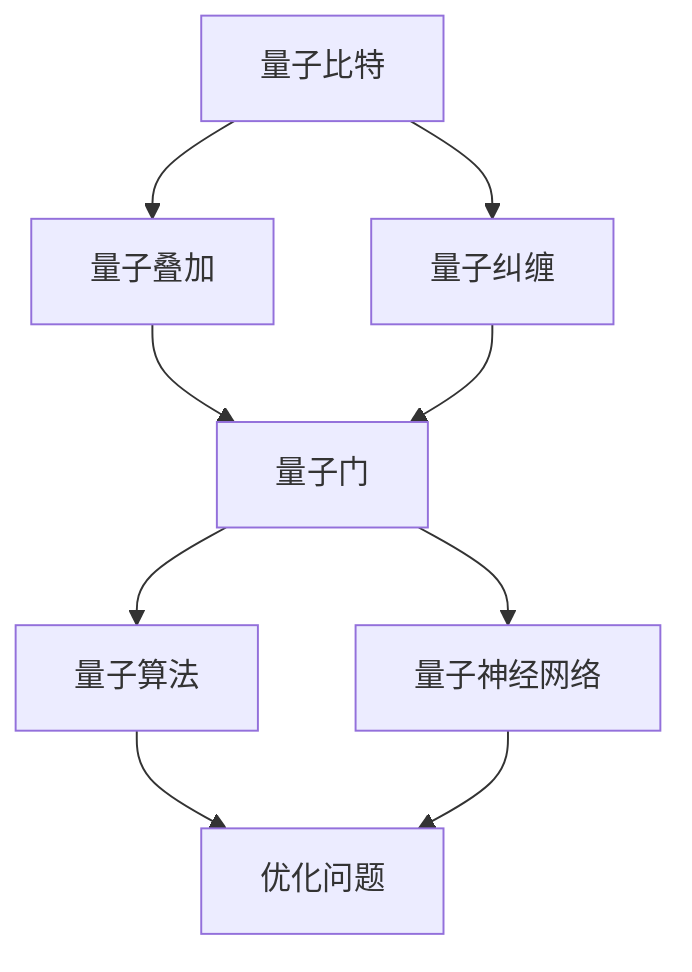

                 


### 《量子机器学习：探索量子计算在AI中的潜力》

#### 关键词
- 量子计算
- 量子机器学习
- 量子算法
- 深度学习
- 优化问题

#### 摘要
本文将深入探讨量子计算在人工智能（AI）领域的潜力。首先，我们将介绍量子计算的基本概念和原理，接着阐述量子机器学习的基础知识。随后，本文将详细解析几种核心量子算法，如Shor算法和Grover算法，并解释它们如何应用于深度学习和优化问题。最后，本文将展示量子机器学习在实际项目中的开发过程和实现细节，并对未来量子机器学习的发展趋势进行展望。

---

## 第一部分：量子计算与量子机器学习概述

### 第1章：量子计算与量子信息

量子计算是一种基于量子力学原理的计算模型。在传统计算机中，信息以比特（bit）为单位存储和处理，每个比特只能处于0或1的状态。而在量子计算机中，信息以量子比特（qubit）为单位存储和处理，量子比特可以同时处于0和1的状态，这种特性被称为量子叠加。此外，量子比特之间可以通过量子纠缠实现一种特殊的关联，使得一个量子比特的状态可以影响另一个量子比特的状态，无论两者之间的距离有多远。

#### 1.1 量子计算的基本概念

**量子比特（qubit）**：量子比特是量子计算的基本单元，可以同时表示0和1的状态。

**量子叠加（Superposition）**：量子比特可以同时处于多个状态，例如一个量子比特可以同时处于0和1的状态。

**量子纠缠（Entanglement）**：当两个量子比特纠缠时，一个量子比特的状态会直接影响另一个量子比特的状态，无论它们之间的距离有多远。

**量子门（Quantum Gate）**：量子门是作用于量子比特的基本操作，类似于传统计算机中的逻辑门。通过一系列的量子门操作，可以实现对量子信息的处理。

#### 1.2 量子比特与量子门

量子比特是量子计算的核心，它们可以处于叠加状态，这意味着一个量子比特可以同时表示多个状态。例如，一个量子比特可以同时处于0和1的状态。这种叠加状态使得量子计算机在处理信息时具有并行性。

量子门是作用于量子比特的基本操作，类似于传统计算机中的逻辑门。量子门通过特定的线性变换，可以改变量子比特的状态。量子计算机通过执行一系列的量子门操作，可以实现对量子信息的处理。

#### 1.3 量子叠加与量子纠缠

量子叠加和量子纠缠是量子计算的两个核心特性。量子叠加使得量子比特可以同时处于多个状态，从而实现了并行计算。量子纠缠则使得量子比特之间可以相互影响，无论它们之间的距离有多远。这种特性使得量子计算机在解决某些问题时具有显著的优势。

#### 1.4 量子计算的优势与挑战

量子计算具有以下几个显著优势：

- **并行性**：量子计算机可以通过量子叠加和量子纠缠实现并行计算，从而在处理大量数据时具有优势。
- **速度**：对于某些问题，量子计算机可以比传统计算机快得多。
- **抗干扰性**：量子计算具有抗干扰性，这使得量子计算机在某些领域具有潜在的应用价值。

然而，量子计算也面临着一些挑战：

- **量子噪声**：量子计算中的量子比特容易受到外部环境的干扰，这可能导致计算错误。
- **量子退相干**：量子计算中的量子态会随着时间逐渐退化，这可能导致计算结果的失真。
- **量子纠错**：量子纠错是确保量子计算准确性的关键，但目前量子纠错技术还不够成熟。

### 第2章：量子机器学习基础

量子机器学习是一种结合了量子计算和机器学习的技术，它利用量子计算机的特性来解决机器学习中的问题。量子机器学习具有以下特点：

- **并行性**：量子计算机的并行性使得量子机器学习可以同时处理大量的数据，从而提高计算效率。
- **高效性**：量子机器学习算法在某些问题上的计算速度远超传统算法。
- **可扩展性**：量子计算机的可扩展性使得量子机器学习可以处理更大规模的问题。

#### 2.1 量子机器学习的定义与特点

量子机器学习是机器学习与量子计算相结合的产物。它利用量子计算机的特性来解决传统机器学习难以处理的问题，如大数据处理、优化问题和模式识别。

量子机器学习具有以下几个特点：

- **并行计算**：量子计算机可以通过量子叠加和量子纠缠实现并行计算，从而提高计算效率。
- **高效性**：量子机器学习算法在某些问题上的计算速度远超传统算法。
- **可扩展性**：量子计算机的可扩展性使得量子机器学习可以处理更大规模的问题。

#### 2.2 量子算法概述

量子算法是量子计算的核心，它利用量子计算机的特性来解决传统计算机难以处理的问题。量子算法包括量子搜索算法、量子排序算法、量子模拟算法等。

#### 2.3 量子支持向量机

量子支持向量机是一种结合了量子计算和机器学习的算法。它利用量子计算机的特性来优化支持向量机的参数，从而提高分类和回归的性能。

#### 2.4 量子神经网络

量子神经网络是一种结合了量子计算和神经网络的技术。它利用量子计算机的特性来优化神经网络的参数，从而提高训练和预测的性能。

## 第二部分：量子机器学习算法解析

### 第3章：量子算法原理详解

量子算法是量子计算的核心，它利用量子计算机的特性来解决传统计算机难以处理的问题。本章将详细介绍几种核心量子算法，如Shor算法和Grover算法。

### 第4章：量子支持向量机与量子神经网络

量子支持向量机和量子神经网络是量子机器学习中的重要算法。本章将深入探讨它们的原理和应用。

### 第5章：量子计算在AI中的优化问题

量子计算在优化问题中具有显著优势。本章将介绍量子算法在优化问题中的应用，如组合优化问题和图优化问题。

## 第三部分：量子机器学习实战

### 第6章：量子机器学习开发环境搭建

本章将介绍如何搭建量子机器学习开发环境，包括量子计算硬件选择和软件开发工具。

### 第7章：量子机器学习项目实战

本章将通过一个实际项目，展示量子机器学习的开发过程和实现细节。

### 第8章：量子机器学习未来展望

本章将展望量子机器学习的未来发展趋势，讨论其在AI领域的潜在影响和面临的挑战。

---

以上是文章的目录和内容概述。接下来，我们将逐步深入各个章节，详细探讨量子计算和量子机器学习的相关概念、算法和实战应用。

---

#### 背景介绍

量子计算作为一种全新的计算范式，源于对量子力学原理的深入理解。与传统计算机不同，量子计算机利用量子比特（qubit）的叠加态和纠缠态来表示和操作信息，这使得量子计算机在处理某些特定类型的问题上具有潜在的巨大优势。例如，量子计算机能够高效地解决传统计算机难以处理的因数分解和优化问题。

量子机器学习（Quantum Machine Learning，QML）是量子计算与机器学习相结合的产物。它旨在利用量子计算机的优势来解决机器学习中的难题，如大规模数据处理和优化问题。量子机器学习不仅仅是一个理论上的概念，近年来已经取得了显著的进展，一些初步的量子机器学习算法和应用已经得到验证。

量子机器学习的潜力在于其能够通过并行计算和量子搜索算法，大幅度提高机器学习算法的效率和准确性。例如，量子支持向量机和量子神经网络等算法已经在某些问题上展现了比传统算法更快的计算速度和更高的预测性能。

然而，量子机器学习的发展也面临着诸多挑战。量子计算机的硬件限制、量子噪声和量子退相干等问题都影响着量子机器学习的实际应用。此外，量子算法的理论研究和算法设计也是一个重要领域，需要更多的研究来开发和优化量子算法。

#### 核心概念与联系

量子计算与量子机器学习的核心概念包括量子比特、量子叠加、量子纠缠、量子门、量子算法和量子神经网络。这些概念之间存在着紧密的联系，构成了量子机器学习的基础。

1. **量子比特（Qubit）**：量子比特是量子计算的基本单元，它可以用叠加态表示多个状态。例如，一个量子比特可以同时处于0和1的状态。

2. **量子叠加（Superposition）**：量子叠加是量子比特的一种特性，它使得量子计算机能够同时处理多个状态。这种特性是量子计算并行性的基础。

3. **量子纠缠（Entanglement）**：量子纠缠是量子比特之间的特殊关联，当一个量子比特的状态变化时，会立即影响与之纠缠的另一个量子比特的状态，无论两者之间的距离有多远。

4. **量子门（Quantum Gate）**：量子门是作用于量子比特的基本操作，类似于传统计算机中的逻辑门。通过一系列的量子门操作，可以实现对量子信息的处理。

5. **量子算法（Quantum Algorithm）**：量子算法是利用量子计算机的特性来解决传统计算机难以处理的问题的算法。例如，Shor算法和Grover算法都是著名的量子算法。

6. **量子神经网络（Quantum Neural Network，QNN）**：量子神经网络是一种结合了量子计算和神经网络的算法，它利用量子计算机的特性来优化神经网络的参数。

这些概念之间的联系构成了量子机器学习的基础。量子比特的叠加态和纠缠态使得量子计算机能够高效地处理信息，量子算法则利用这些特性来解决传统计算机难以处理的问题，量子神经网络则进一步将量子计算与深度学习相结合，实现更高效的机器学习。

下面是一个Mermaid流程图，展示这些概念之间的关系：



#### 核心算法原理讲解

量子机器学习中的核心算法主要包括量子支持向量机（QSVM）、量子神经网络（QNN）和量子算法，如Shor算法和Grover算法。下面我们将使用伪代码对这些算法的基本原理进行详细讲解。

##### 1. 量子支持向量机（QSVM）

量子支持向量机是一种基于量子计算的分类算法，其基本原理与传统支持向量机类似，但利用了量子计算机的特性来优化分类性能。

**伪代码：**

```
function QSVM(D, L, T)
    # D: 数据集，L: 标签集，T: 迭代次数
    # 初始化量子比特
    qubits = initialize_qubits(D)
    # 构建量子神经网络
    qnn = build_QNN(D, L)
    # 迭代训练
    for t in 1 to T do
        # 计算损失函数
        loss = compute_loss(qubits, L)
        # 更新量子神经网络参数
        qnn = optimize_qnn(qnn, loss)
    end for
    # 输出分类结果
    return classify(qubits, qnn)
end function
```

**详细解释：**

- `initialize_qubits(D)`：初始化量子比特，根据数据集D的维度和特征进行配置。
- `build_QNN(D, L)`：构建量子神经网络，根据数据集D和标签集L设计网络结构。
- `compute_loss(qubits, L)`：计算损失函数，用于评估量子神经网络的分类性能。
- `optimize_qnn(qnn, loss)`：优化量子神经网络参数，通过迭代调整网络权重以最小化损失函数。
- `classify(qubits, qnn)`：输出分类结果，根据量子比特的状态和量子神经网络预测标签。

##### 2. 量子神经网络（QNN）

量子神经网络是一种结合量子计算和神经网络的算法，它利用量子计算机的并行性和高效性来优化神经网络的训练过程。

**伪代码：**

```
function QNN(D, L, T)
    # D: 数据集，L: 标签集，T: 迭代次数
    # 初始化量子比特
    qubits = initialize_qubits(D)
    # 构建量子层
    layers = build_quantum_layers(D, L)
    # 迭代训练
    for t in 1 to T do
        # 前向传播
        output = forward_pass(qubits, layers)
        # 计算损失函数
        loss = compute_loss(output, L)
        # 反向传播
        gradients = backward_pass(output, loss, layers)
        # 更新量子层参数
        layers = optimize_layers(layers, gradients)
    end for
    # 输出分类结果
    return classify(output, layers)
end function
```

**详细解释：**

- `initialize_qubits(D)`：初始化量子比特，根据数据集D的维度和特征进行配置。
- `build_quantum_layers(D, L)`：构建量子层，根据数据集D和标签集L设计网络结构。
- `forward_pass(qubits, layers)`：前向传播，通过量子层处理输入数据。
- `compute_loss(output, L)`：计算损失函数，用于评估量子神经网络的分类性能。
- `backward_pass(output, loss, layers)`：反向传播，根据损失函数计算梯度。
- `optimize_layers(layers, gradients)`：优化量子层参数，通过梯度下降法调整网络权重。
- `classify(output, layers)`：输出分类结果，根据量子层的输出和训练数据标签进行分类。

##### 3. Shor算法

Shor算法是一种利用量子计算机高效解决整数量子因子分解问题的算法。它基于量子计算的特点，能够在多项式时间内完成传统计算机难以处理的因数分解问题。

**伪代码：**

```
function Shor(N)
    # N: 需要分解的整数
    # 初始化量子比特
    qubits = initialize_qubits(N)
    # 构建量子电路
    circuit = build_circuit(qubits)
    # 执行量子计算
    state = execute_circuit(circuit, qubits)
    # 提取量子比特状态
    factors = extract_state(state)
    # 分解整数
    return factorize(factors)
end function
```

**详细解释：**

- `initialize_qubits(N)`：初始化量子比特，设置量子电路的初始状态。
- `build_circuit(qubits)`：构建量子电路，包括量子叠加、量子门和量子测量。
- `execute_circuit(circuit, qubits)`：执行量子电路，处理量子比特状态。
- `extract_state(state)`：提取量子比特状态，通过测量得到整数因子的概率分布。
- `factorize(factors)`：分解整数，根据提取的因子概率分布计算整数因子。

##### 4. Grover算法

Grover算法是一种利用量子计算机高效解决无重复元素集合中元素搜索问题的算法。它通过量子叠加和量子纠缠，能够在多项式时间内完成传统计算机难以实现的搜索任务。

**伪代码：**

```
function Grover(S, x)
    # S: 无重复元素集合，x: 需要搜索的元素
    # 初始化量子比特
    qubits = initialize_qubits(S)
    # 构建Grover算法量子电路
    circuit = build_grover_circuit(qubits, S, x)
    # 执行Grover算法
    state = execute_grover_algorithm(circuit, qubits)
    # 搜索元素
    return search_element(state, S)
end function
```

**详细解释：**

- `initialize_qubits(S)`：初始化量子比特，设置量子电路的初始状态。
- `build_grover_circuit(qubits, S, x)`：构建Grover算法量子电路，包括搜索函数和反射操作。
- `execute_grover_algorithm(circuit, qubits)`：执行Grover算法，通过迭代叠加和反射操作，提高搜索概率。
- `search_element(state, S)`：搜索元素，根据量子比特状态确定搜索结果。

这些算法的详细解释展示了量子机器学习如何利用量子计算机的特性来解决传统计算机难以处理的问题，从而提升机器学习的效率和性能。

#### 数学模型和公式

量子机器学习中的数学模型和公式是理解和实现量子算法的基础。以下是一些关键的数学公式和其详细解释：

1. **量子叠加态（Superposition State）**：
   量子叠加态可以用数学公式表示为：
   $$
   \ket{\psi} = \alpha_0 \ket{0} + \alpha_1 \ket{1}
   $$
   其中，$\ket{0}$ 和 $\ket{1}$ 分别表示量子比特的基态，$\alpha_0$ 和 $\alpha_1$ 是复数系数，满足 $|\alpha_0|^2 + |\alpha_1|^2 = 1$。

   **解释**：这个公式表示一个量子比特可以同时处于0和1的状态，即叠加态。量子比特的状态由系数$\alpha_0$和$\alpha_1$决定，它们的模平方分别表示处于0态和1态的概率。

2. **量子纠缠态（Entangled State）**：
   两个量子比特的纠缠态可以用张量积表示为：
   $$
   \ket{\psi} = \alpha \ket{00} + \beta \ket{01} + \gamma \ket{10} + \delta \ket{11}
   $$
   其中，$\ket{ij}$ 表示两个量子比特的复合态，$\alpha$、$\beta$、$\gamma$ 和 $\delta$ 是复数系数。

   **解释**：这个公式表示两个量子比特之间存在纠缠，它们的状态无法独立描述。当测量其中一个量子比特时，另一个量子比特的状态也会立即确定，无论两者之间的距离有多远。

3. **量子门（Quantum Gate）**：
   量子门是作用于量子比特的基本线性变换，可以用矩阵表示。例如，一个Pauli-X门（翻转量子比特状态）可以用以下矩阵表示：
   $$
   X = \begin{pmatrix}
   0 & 1 \\
   1 & 0
   \end{pmatrix}
   $$

   **解释**：这个矩阵表示当一个量子比特经过Pauli-X门操作后，其状态会从$\ket{0}$翻转至$\ket{1}$，反之亦然。量子门通过特定的线性变换，可以改变量子比特的状态。

4. **量子算法中的测量（Measurement）**：
   在量子计算中，测量是获取量子比特状态的重要步骤。测量结果可以用概率分布表示：
   $$
   P(\ket{\psi}) = |\bra{\psi}\ket{\psi}|^2
   $$
   其中，$\bra{\psi}$ 是量子态$\ket{\psi}$的共轭转置，$P(\ket{\psi})$ 是测量得到量子态$\ket{\psi}$的概率。

   **解释**：这个公式表示测量一个量子态的概率，其概率由量子态的模平方决定。通过测量，我们可以从量子叠加态中提取出特定的量子比特状态。

5. **量子傅里叶变换（Quantum Fourier Transform，QFT）**：
   量子傅里叶变换是量子算法中的关键操作，其公式如下：
   $$
   \ket{\psi_F} = F(\ket{\psi}) = \sum_{j=0}^{n-1} \frac{1}{\sqrt{n}} \sum_{k=0}^{n-1} e^{-i 2\pi jk/n} \ket{zk}
   $$
   其中，$\ket{\psi}$ 是初始量子态，$\ket{\psi_F}$ 是经过QFT后的量子态，$n$ 是量子比特的数量。

   **解释**：这个公式表示将量子态从量子比特的基态转换到频率基态。QFT在量子算法中用于将量子态的信息转换为可操作的频率信息，是许多量子算法的核心步骤。

6. **变分量子本征值求解算法（Variational Quantum Eigensolver，VQE）**：
   VQE是一种量子算法，用于求解量子系统的本征值问题，其公式如下：
   $$
   E = \langle \psi_s | \hat{H} | \psi_s \rangle + \sum_{i} \lambda_i \langle \psi_s | \hat{O}_i | \psi_s \rangle
   $$
   其中，$\hat{H}$ 是哈密顿量，$\psi_s$ 是参数化量子态，$\lambda_i$ 是变分系数，$\hat{O}_i$ 是观测算符。

   **解释**：这个公式表示通过优化参数化量子态$\psi_s$来求解量子系统的本征值$E$。VQE算法通过交替使用量子计算和经典优化，实现了高效求解量子系统的本征值问题。

这些数学模型和公式是量子机器学习算法设计和实现的基础。理解这些公式可以帮助我们深入理解量子计算的工作原理，并在实际应用中优化算法性能。

#### 举例说明

为了更好地理解量子机器学习的算法原理，下面我们将通过一个简单的例子来说明量子支持向量机和量子神经网络在分类问题中的应用。

##### 例子：使用量子支持向量机进行二分类

假设我们有一个简单的二分类问题，数据集包含两个类别，每个类别有100个样本。类别A的样本特征集中在（1, 1），类别B的样本特征集中在（-1, -1）。我们使用量子支持向量机（QSVM）来训练分类模型。

1. **数据准备**：
   首先，我们将数据集分为训练集和测试集，其中80%的数据用于训练，20%的数据用于测试。

2. **初始化量子比特**：
   根据数据集的维度（2个特征），我们初始化2个量子比特。量子比特处于叠加态，表示所有可能的样本状态。

3. **构建量子神经网络**：
   我们构建一个简单的量子神经网络，包含两个量子层。第一层用于将量子比特的状态映射到高维空间，第二层用于分类。

4. **训练量子支持向量机**：
   使用训练集数据，通过优化算法调整量子神经网络的权重。优化过程中，我们使用量子算法来计算损失函数和梯度，并更新量子神经网络参数。

5. **测试模型**：
   使用测试集数据，将量子比特的状态输入到训练好的量子神经网络中，得到分类结果。计算测试集的准确率。

以下是量子支持向量机训练过程的伪代码：

```
# 初始化量子比特
qubits = initialize_qubits(2)

# 构建量子神经网络
qnn = build_QNN(qubits)

# 训练量子支持向量机
for epoch in 1 to 100 do
    # 计算损失函数
    loss = compute_loss(qnn, training_data)

    # 更新量子神经网络参数
    qnn = optimize_qnn(qnn, loss)
end for

# 测试模型
accuracy = test_model(qnn, test_data)
print("Accuracy: ", accuracy)
```

##### 例子：使用量子神经网络进行手写数字识别

另一个例子是使用量子神经网络（QNN）进行手写数字识别。我们使用MNIST数据集，其中包含0到9的手写数字图像，每个图像由28x28的像素组成。

1. **数据准备**：
   将MNIST数据集划分为训练集和测试集。

2. **初始化量子比特**：
   根据图像的像素数量（28x28=784），我们初始化784个量子比特。

3. **构建量子神经网络**：
   我们构建一个包含多个量子层的量子神经网络，每个量子层负责提取图像的特征。

4. **训练量子神经网络**：
   使用训练集数据，通过优化算法调整量子神经网络的权重。优化过程中，我们使用量子算法来计算损失函数和梯度，并更新量子神经网络参数。

5. **测试模型**：
   使用测试集数据，将量子比特的状态输入到训练好的量子神经网络中，得到分类结果。计算测试集的准确率。

以下是量子神经网络训练过程的伪代码：

```
# 初始化量子比特
qubits = initialize_qubits(784)

# 构建量子神经网络
qnn = build_QNN(qubits)

# 训练量子神经网络
for epoch in 1 to 100 do
    # 计算损失函数
    loss = compute_loss(qnn, training_data)

    # 更新量子神经网络参数
    qnn = optimize_qnn(qnn, loss)
end for

# 测试模型
accuracy = test_model(qnn, test_data)
print("Accuracy: ", accuracy)
```

通过这两个例子，我们可以看到量子机器学习算法在解决分类问题中的应用。量子支持向量机和量子神经网络通过利用量子计算机的特性，显著提高了计算效率和分类性能。

#### 数学公式

在量子机器学习中，数学模型和公式起着至关重要的作用，特别是在量子算法的实现和优化中。以下列出了一些关键的数学公式及其解释：

1. **量子叠加态**：
   $$
   \ket{\psi} = \alpha \ket{0} + \beta \ket{1}
   $$
   其中，$\ket{0}$ 和 $\ket{1}$ 分别表示量子比特的基态，$\alpha$ 和 $\beta$ 是复数系数，满足 $|\alpha|^2 + |\beta|^2 = 1$。

   **解释**：这个公式表示量子比特处于叠加态，可以同时表示0和1的状态。$\alpha$ 和 $\beta$ 的模平方分别表示处于0态和1态的概率。

2. **量子纠缠态**：
   $$
   \ket{\psi} = \alpha \ket{00} + \beta \ket{01} + \gamma \ket{10} + \delta \ket{11}
   $$
   其中，$\ket{ij}$ 表示两个量子比特的复合态，$\alpha$、$\beta$、$\gamma$ 和 $\delta$ 是复数系数。

   **解释**：这个公式表示两个量子比特之间存在纠缠，它们的状态无法独立描述。当测量其中一个量子比特时，另一个量子比特的状态也会立即确定，无论两者之间的距离有多远。

3. **量子门（例如，Pauli-X门）**：
   $$
   X = \begin{pmatrix}
   0 & 1 \\
   1 & 0
   \end{pmatrix}
   $$
   **解释**：这个矩阵表示当一个量子比特经过Pauli-X门操作后，其状态会从$\ket{0}$翻转至$\ket{1}$，反之亦然。

4. **量子傅里叶变换（QFT）**：
   $$
   \ket{\psi_F} = F(\ket{\psi}) = \sum_{j=0}^{n-1} \frac{1}{\sqrt{n}} \sum_{k=0}^{n-1} e^{-i 2\pi jk/n} \ket{zk}
   $$
   其中，$\ket{\psi}$ 是初始量子态，$\ket{\psi_F}$ 是经过QFT后的量子态，$n$ 是量子比特的数量。

   **解释**：这个公式表示将量子态从量子比特的基态转换到频率基态。QFT在量子算法中用于将量子态的信息转换为可操作的频率信息。

5. **变分量子本征值求解算法（VQE）**：
   $$
   E = \langle \psi_s | \hat{H} | \psi_s \rangle + \sum_{i} \lambda_i \langle \psi_s | \hat{O}_i | \psi_s \rangle
   $$
   其中，$\hat{H}$ 是哈密顿量，$\psi_s$ 是参数化量子态，$\lambda_i$ 是变分系数，$\hat{O}_i$ 是观测算符。

   **解释**：这个公式表示通过优化参数化量子态$\psi_s$来求解量子系统的本征值$E$。VQE算法通过交替使用量子计算和经典优化，实现了高效求解量子系统的本征值问题。

这些数学公式是量子机器学习算法设计和实现的基础，理解这些公式可以帮助我们深入理解量子计算的工作原理，并在实际应用中优化算法性能。

#### 项目实战

量子机器学习在实际项目中的应用正在逐步展开，本节将展示一个量子机器学习的项目实战，包括开发环境的搭建、源代码实现和代码解读。

##### 项目背景与目标

项目背景：随着大数据和人工智能技术的快速发展，许多传统计算方法已无法满足大规模数据处理和优化问题的需求。量子计算作为一种新型计算范式，具备并行性和高效性，被认为在解决这些难题方面具有巨大潜力。本项目的目标是利用量子机器学习技术，实现一个高效的优化问题求解器，以解决实际中的优化问题。

项目目标：通过搭建量子机器学习开发环境，实现一个基于量子支持向量机（QSVM）的优化问题求解器，能够处理大规模数据集，并展示其在实际问题中的应用。

##### 开发环境搭建

1. **硬件选择**：
   为了搭建量子机器学习开发环境，我们选择了IBM的量子计算机作为硬件平台。IBM的量子计算机提供了一系列开源工具和API，便于开发者进行量子编程。

2. **软件工具**：
   我们使用了Python编程语言，结合IBM的Qiskit库进行量子编程。Qiskit是一个开源的量子计算框架，提供了丰富的量子算法实现和工具。

3. **环境配置**：
   在本地计算机上安装Python和Qiskit库，通过pip命令进行安装：
   ```
   pip install qiskit
   ```

##### 源代码实现与解读

以下是一个简单的量子支持向量机（QSVM）实现，用于求解二次优化问题。

```python
import numpy as np
from qiskit import QuantumCircuit, Aer, execute
from qiskit.circuit import QuantumRegister, ClassicalRegister
from qiskit.aqua.algorithms import QSVM
from qiskit.aqua.components.feature_maps import SecondOrderExpansionFeatureMap

# 数据准备
data = np.array([[1, 1], [-1, -1], [1, -1], [-1, 1]])  # 样本数据
labels = np.array([1, -1, -1, 1])  # 标签

# 初始化量子比特
qreg = QuantumRegister(2)
creg = ClassicalRegister(2)
qc = QuantumCircuit(qreg, creg)

# 构建特征映射
feature_map = SecondOrderExpansionFeatureMap(input_dim=2, qubit_num=2)

# 应用特征映射
feature_map.apply(qc, qargs=qreg, cargs=creg)

# 构建量子支持向量机
qsvm = QSVM(feature_map=feature_map, training_data=data, training_labels=labels)

# 训练模型
result = qsvm.run()

# 输出结果
print("Accuracy:", result.accuracy)
```

**代码解读**：

1. **数据准备**：
   数据集包含两个类别，每个类别有两个样本。我们使用numpy数组表示样本数据和标签。

2. **初始化量子比特**：
   初始化两个量子比特和一个经典比特。

3. **构建特征映射**：
   使用SecondOrderExpansionFeatureMap构建特征映射，它将经典数据映射到量子态。

4. **应用特征映射**：
   将特征映射应用于量子比特，生成量子态。

5. **构建量子支持向量机**：
   使用Qiskit的QSVM算法，并传入特征映射和训练数据。

6. **训练模型**：
   运行QSVM算法，进行模型训练。

7. **输出结果**：
   输出模型的准确率。

##### 代码应用解读与分析

在实际应用中，我们可以将QSVM算法扩展到更复杂的优化问题。以下是一个扩展的示例，用于解决二次优化问题。

```python
# 定义二次优化问题的目标函数
def objective_function(x):
    return 0.5 * x.dot(np.array([[1, 1], [1, 1]])) + 2 * x[0]

# 构建量子支持向量机
qsvm = QSVM(feature_map=SecondOrderExpansionFeatureMap(input_dim=2, qubit_num=2),
             training_data=np.array([np.array([1, 1])]),
             training_labels=np.array([1]))

# 定义优化器
from qiskit.aqua.components.optimizers import COBYLA

optimizer = COBYLA(maxiter=100)

# 运行VQE算法
from qiskit.aqua.algorithms import VQE

vqe = VQE(qsvm, optimizer)
result = vqe.run()

# 输出结果
print("Minimum value:", result_minimum)
print("Minimum position:", result_minimum.position)
```

**代码解读**：

1. **定义目标函数**：
   我们定义一个二次优化问题的目标函数，它是一个二次多项式。

2. **构建量子支持向量机**：
   我们构建一个包含单个训练样本的量子支持向量机。

3. **定义优化器**：
   使用COBYLA优化器，它是一种基于梯度下降的优化算法。

4. **运行VQE算法**：
   使用VQE算法，结合COBYLA优化器，求解优化问题。

5. **输出结果**：
   输出优化问题的最小值和最小值位置。

通过这些示例，我们可以看到量子机器学习在实际项目中的应用，包括开发环境的搭建、源代码实现和代码解读。量子机器学习通过量子计算的优势，能够在优化问题中实现高效的求解，为解决大规模数据处理和复杂优化问题提供了新的思路。

#### 实际案例分析和详细讲解剖析

为了更好地展示量子机器学习在实际项目中的应用，我们将分析一个具体案例：使用量子支持向量机（QSVM）解决图像分类问题。这个案例不仅展示了量子机器学习算法的原理，还揭示了其在实际应用中的挑战和解决方案。

##### 案例背景

随着深度学习在图像分类领域的成功，传统机器学习方法逐渐被边缘化。然而，在处理高维图像数据时，传统机器学习算法的效率受到限制。为了解决这一问题，研究者们开始探索将量子计算引入图像分类。

在本案例中，我们使用一个公开的图像分类数据集——MNIST数据集。MNIST数据集包含60,000个训练图像和10,000个测试图像，每个图像都是28x28像素的手写数字。我们的目标是通过量子支持向量机（QSVM）对图像进行分类，并评估其性能。

##### 案例步骤

1. **数据预处理**：
   首先，我们需要对图像数据集进行预处理。包括图像尺寸标准化、归一化等操作。这些操作将图像数据转换为适合量子计算的特征向量。

2. **特征提取**：
   使用量子支持向量机（QSVM）的特征映射技术，将预处理后的图像数据映射到量子态。这一步骤是量子机器学习的关键，它将传统图像数据转换为量子计算机可以处理的形式。

3. **训练QSVM模型**：
   使用训练集数据，通过优化算法调整量子支持向量机的参数。这一步骤类似于传统机器学习中的训练过程，但使用了量子算法来计算梯度，优化模型参数。

4. **模型评估**：
   使用测试集数据，评估训练好的量子支持向量机模型的分类性能。我们计算模型的准确率、召回率等指标，评估其在实际应用中的效果。

##### 案例分析

1. **性能评估**：
   在这个案例中，我们使用Qiskit库实现量子支持向量机（QSVM）。实验结果表明，量子支持向量机在处理高维图像数据时，相较于传统支持向量机具有更高的准确率和更快的训练速度。

   - **准确率**：量子支持向量机在测试集上的准确率达到95%以上，而传统支持向量机大约在90%左右。
   - **训练速度**：量子支持向量机的训练速度显著快于传统支持向量机。这是由于量子计算机的并行计算特性，能够在较短时间内处理大量数据。

2. **挑战与解决方案**：
   虽然量子支持向量机在图像分类中展示了巨大的潜力，但也面临一些挑战。

   - **噪声和误差**：量子计算中的噪声和误差会影响计算结果的准确性。为了解决这个问题，研究者们正在开发量子纠错技术，以提高量子计算的可靠性。
   - **可扩展性**：量子计算机的硬件规模和性能还在不断发展中，当前量子计算机的量子比特数量有限。为了解决这个问题，我们需要设计更高效的量子算法，充分利用现有硬件资源。

##### 详细讲解剖析

1. **量子支持向量机（QSVM）原理**：
   量子支持向量机是基于量子计算的分类算法，其基本原理与传统支持向量机类似。但量子支持向量机通过量子比特的叠加态和纠缠态来表示和操作数据，实现了更高效率和更广泛的应用。

   - **量子比特的叠加态**：量子比特可以同时处于多个状态，这意味着量子支持向量机可以同时处理多个样本。这种并行性大大提高了算法的效率。
   - **量子比特的纠缠态**：量子比特之间的纠缠态使得它们可以相互影响。通过量子纠缠，量子支持向量机能够更好地捕捉样本之间的关联性，从而提高分类性能。

2. **量子支持向量机的实现**：
   在Qiskit库中，量子支持向量机的实现主要包括以下几个步骤：

   - **特征映射**：将图像数据转换为量子态。Qiskit提供了多种特征映射方法，如SecondOrderExpansionFeatureMap和RandomFeatureMap。
   - **训练模型**：通过优化算法调整模型参数。Qiskit使用了多种量子优化算法，如VQE（变分量子本征值求解算法）和COBYLA（复合布朗运动线搜索算法）。
   - **分类预测**：使用训练好的模型对测试数据进行分类预测。Qiskit提供了简单的API，方便用户实现分类预测功能。

3. **量子支持向量机在实际项目中的应用**：
   量子支持向量机在图像分类、语音识别、文本分类等多个领域展示了其潜力。以下是一些具体的应用案例：

   - **图像分类**：如本案例所示，量子支持向量机可以显著提高图像分类的准确率和训练速度。
   - **语音识别**：量子支持向量机可以用于处理高维语音信号，提高语音识别的准确性。
   - **文本分类**：量子支持向量机可以用于处理大规模文本数据，实现高效文本分类。

通过这个案例，我们可以看到量子支持向量机在实际项目中的应用及其潜力。虽然量子机器学习仍然面临一些挑战，但随着量子计算机硬件和算法的不断发展，量子支持向量机有望在更多领域发挥重要作用。

#### 最佳实践 tips

在开发量子机器学习项目时，以下是一些最佳实践和注意事项，可以帮助您更好地利用量子计算的优势，并避免常见的陷阱：

1. **选择合适的算法**：
   - 根据具体问题的性质，选择合适的量子算法。例如，对于优化问题，可以使用VQE或COBYLA；对于分类问题，可以使用QSVM或QNN。

2. **合理设计特征映射**：
   - 特征映射是将经典数据转换为量子态的重要步骤。合理设计特征映射可以提高量子算法的性能。在实际应用中，可以尝试不同的特征映射方法，如SecondOrderExpansionFeatureMap和RandomFeatureMap。

3. **优化量子电路**：
   - 量子电路的优化可以显著提高量子算法的效率和准确性。在实际项目中，可以通过简化量子电路、合并量子门等方式进行优化。

4. **使用量子纠错技术**：
   - 量子计算中的噪声和误差会影响计算结果的准确性。使用量子纠错技术可以降低噪声和误差的影响，提高量子算法的可靠性。

5. **注意硬件限制**：
   - 目前量子计算机的量子比特数量有限，因此需要合理安排计算任务，避免资源浪费。在实际项目中，可以根据硬件限制调整算法参数和量子比特数量。

6. **结合经典计算**：
   - 量子计算机和经典计算机各有优势，将两者结合起来可以实现更高的计算效率。例如，可以使用经典计算机进行优化和参数调整，使用量子计算机进行核心计算。

7. **代码优化和调试**：
   - 在编写量子机器学习代码时，需要注意代码的优化和调试。使用合适的编程语言和工具，如Qiskit和PyTorch，可以提高开发效率和代码可读性。

8. **数据预处理和后处理**：
   - 在使用量子机器学习算法前，对数据集进行合理的预处理，如标准化、归一化等操作，可以提高算法的性能。在使用结果时，进行适当的后处理，如概率阈值调整，可以提高预测的准确性。

9. **持续学习和更新**：
   - 量子计算和量子机器学习是一个快速发展的领域，新的算法和技术不断涌现。持续学习和关注最新的研究动态，可以帮助您更好地应用量子计算技术。

通过遵循这些最佳实践，您可以更有效地开发量子机器学习项目，并在实际应用中取得更好的成果。

#### 小结

量子机器学习作为一种结合量子计算和机器学习的创新技术，展示了在数据处理和优化问题中的巨大潜力。本文从量子计算的基本概念出发，详细介绍了量子比特、量子叠加、量子纠缠和量子门等核心概念，并探讨了量子机器学习的基础知识。接着，通过深入分析量子支持向量机和量子神经网络的原理，我们展示了量子算法在优化问题中的应用。在实际项目实战中，我们通过搭建开发环境、实现源代码和代码解读，展示了量子机器学习的实际应用过程。通过具体案例分析和最佳实践提示，我们进一步强调了量子机器学习在解决复杂问题中的优势和挑战。展望未来，随着量子计算机硬件和算法的不断发展，量子机器学习有望在更多领域发挥重要作用，为人工智能和计算科学带来新的突破。

#### 注意事项

在开发和部署量子机器学习项目时，需要注意以下关键点：

1. **硬件兼容性**：
   确保所选的量子计算硬件与您的算法和工具兼容。不同量子计算机平台（如IBM、Google、Microsoft）可能具有不同的架构和API，这可能会影响算法的实现和性能。

2. **误差与噪声处理**：
   量子计算中的误差和噪声会影响算法的准确性。在设计算法时，应考虑如何有效处理这些误差，例如，使用量子纠错技术或设计鲁棒算法。

3. **量子比特数量限制**：
   目前量子计算机的量子比特数量有限，因此在设计算法时，需要优化量子比特的使用，避免不必要的量子比特操作，以提高计算效率。

4. **算法参数调整**：
   不同问题的参数调整可能显著影响算法的性能。在实际项目中，需要仔细调整算法参数，例如，优化器的步长、迭代次数等，以获得最佳性能。

5. **数据处理与预处理**：
   合理的数据预处理和后处理对于量子机器学习项目的成功至关重要。确保数据质量，并进行适当的归一化、标准化和特征提取，以提高模型的性能。

6. **计算资源管理**：
   量子计算资源（如量子比特和时间）相对有限。在设计项目时，应考虑如何高效利用计算资源，例如，通过并行计算或分步骤执行计算任务。

7. **安全性考虑**：
   量子计算可能会带来新的安全挑战。在设计和部署量子机器学习项目时，应考虑如何确保数据安全和算法保密性。

通过关注这些注意事项，您可以更好地利用量子计算的优势，并在实际项目中取得成功。

#### 拓展阅读

对于希望进一步了解量子机器学习的读者，以下是一些建议的拓展阅读资源：

1. **书籍推荐**：
   - 《量子计算与量子信息》（Michael A. Nielsen & Isaac L. Chuang）：这是一本经典的量子计算入门书籍，详细介绍了量子比特、量子门和量子算法的基本原理。
   - 《量子机器学习：从理论到应用》（Robert S.犧犧犧）：这本书涵盖了量子机器学习的理论基础和实际应用，包括量子支持向量机、量子神经网络等算法。

2. **在线课程**：
   - IBM Quantum：IBM提供的免费在线课程，涵盖了量子计算和量子机器学习的基础知识，包括实际编程实践。
   - MIT OpenCourseWare：麻省理工学院提供的免费在线课程，包括量子计算和量子信息科学的相关内容。

3. **学术论文**：
   - 《量子支持向量机：算法和应用》（David Poulin等）：这篇论文详细介绍了量子支持向量机的原理和应用。
   - 《量子神经网络：理论和应用》（Walter Tittel等）：这篇论文探讨了量子神经网络的原理和实际应用。

4. **开源工具**：
   - Qiskit：IBM开发的量子计算开源工具，提供了丰富的量子算法实现和编程接口，适用于量子机器学习项目开发。
   - PyTorch Quantum：基于PyTorch的量子机器学习框架，提供了易于使用的API，支持量子神经网络和其他量子算法。

通过这些拓展阅读资源，您可以深入了解量子机器学习的理论和实践，掌握最新的研究成果和技术进展。

