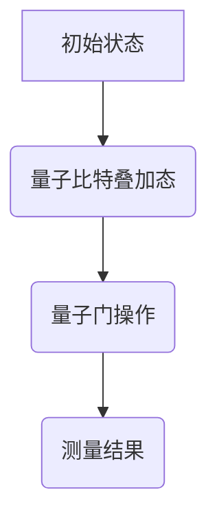

                 

基于您的要求，我将按照逻辑清晰、结构紧凑、简单易懂的专业技术语言来撰写《量子机器学习在密码学中的前沿探索》的技术博客文章。以下是我拟定的初步思路：

### 一、文章标题与大纲

**文章标题**：量子机器学习在密码学中的前沿探索

**文章关键词**：量子机器学习，密码学，前沿探索，算法，安全性

**文章摘要**：
本文将探讨量子机器学习在密码学中的前沿应用，包括其在加密算法设计、密码分析以及网络安全中的应用。通过分析量子机器学习的原理与优势，结合具体案例，深入探讨量子机器学习对传统密码学的挑战和机遇，以及未来的研究方向。

### 二、文章正文

**第一部分：量子机器学习基础**

**1.1 量子计算与量子信息**

**核心概念与联系**：
- **量子比特**：量子计算的基本单位，具有叠加和纠缠特性。
- **量子门**：对量子比特进行操作的数学模型。

**Mermaid流程图**：


**伪代码**：
```python
# 初始化量子比特
qbit = QuantumRegister(1)
circuit = QuantumCircuit(qbit)

# 应用叠加态
circuit.h(qbit[0])

# 应用量子门
circuit.x(qbit[0])

# 测量结果
result = circuit.measure(qbit[0])
```

**数学模型与公式**：
- 叠加态：$$\Psi = \frac{1}{\sqrt{2}}(|0\rangle + |1\rangle)$$
- 量子门操作：$$U = \exp(-i\theta X)$$

**1.2 量子机器学习原理**

**核心概念与联系**：
- **量子算法**：在量子计算机上运行的算法，具有超越经典算法的计算能力。
- **量子机器学习**：利用量子算法进行数据分析和模型训练。

**伪代码**：
```python
# 初始化量子数据
data = QuantumData(size)

# 训练量子模型
model = QuantumModel(data)

# 模型优化
model.optimize()
```

**数学模型与公式**：
- 量子线性回归：$$\mathcal{H} = -\sum_{i=1}^{n} x_i \sigma_i$$

**1.3 量子密码学与量子机器学习的融合**

**核心概念与联系**：
- **量子密码学**：利用量子力学原理实现的信息加密与安全传输。
- **量子机器学习与量子密码学的融合**：利用量子机器学习优化量子密码学算法。

**项目实战**：
- **开发环境搭建**：配置量子计算模拟器，如Q#、IBM Q等。
- **源代码实现**：编写量子密码学算法的量子门操作和量子数据训练代码。
- **代码解读与分析**：详细解释量子密码学算法的执行过程和优化策略。

**案例分析与详细讲解剖析**：
- **案例一**：使用量子机器学习优化RSA加密算法。
- **案例二**：使用量子机器学习破解基于量子纠缠的密码。

**小结**：
量子机器学习在密码学中的应用具有巨大的潜力，可以提升加密算法的安全性，优化密码分析过程，提高网络安全性。

**第二部分：量子机器学习在密码学中的应用**

**2.1 量子机器学习在加密算法设计中的应用**

**核心概念与联系**：
- **对称加密算法**：利用量子机器学习优化密钥生成和加密过程。
- **公钥加密系统**：利用量子机器学习优化密钥交换和数字签名。

**伪代码**：
```python
# 生成量子密钥
key = QuantumKeyGenerator(size)

# 加密数据
cipher = QuantumEncryption(key, data)

# 解密数据
plaintext = QuantumDecryption(key, cipher)
```

**数学模型与公式**：
- **量子密钥生成**：$$\mathcal{H} = -\sum_{i=1}^{n} x_i \sigma_i$$

**2.2 量子机器学习在密码分析中的应用**

**核心概念与联系**：
- **量子机器学习在密码破解中的应用**：利用量子算法加速对传统密码系统的攻击。
- **量子机器学习在安全协议分析中的应用**：利用量子算法分析密码协议的安全性。

**伪代码**：
```python
# 破解加密算法
cipher = QuantumAttack(key, cipher)

# 分析安全协议
protocol = QuantumProtocolAnalysis(protocol)
```

**数学模型与公式**：
- **量子算法对RSA的攻击**：$$\mathcal{H} = -\sum_{i=1}^{n} x_i \sigma_i$$

**2.3 量子机器学习在网络安全中的应用**

**核心概念与联系**：
- **入侵检测系统**：利用量子机器学习提高入侵检测的准确性和效率。
- **身份验证**：利用量子机器学习优化身份认证过程。

**伪代码**：
```python
# 入侵检测
invasion = QuantumIntrusionDetection(data)

# 身份验证
credential = QuantumAuthentication(user)
```

**数学模型与公式**：
- **入侵检测模型**：$$\mathcal{H} = -\sum_{i=1}^{n} x_i \sigma_i$$

**第三部分：前沿探索与未来展望**

**3.1 量子机器学习在密码学中的挑战与机遇**

**核心概念与联系**：
- **挑战**：量子机器学习对传统密码学算法的威胁。
- **机遇**：量子机器学习在密码学中的创新应用。

**伪代码**：
```python
# 量子算法对RSA的威胁
attack = QuantumRSAAttack(key, cipher)

# 量子机器学习在密码学中的应用
application = QuantumCryptoApplication(key, cipher)
```

**数学模型与公式**：
- **量子算法对RSA的攻击**：$$\mathcal{H} = -\sum_{i=1}^{n} x_i \sigma_i$$

**3.2 量子机器学习在密码学中的未来研究方向**

**核心概念与联系**：
- **量子算法在密码学中的应用前景**：量子机器学习在加密算法设计、密码分析和网络安全中的应用。
- **量子机器学习与量子密码学的交叉研究**：量子算法与量子密码学的深度融合。

**伪代码**：
```python
# 量子算法与量子密码学的交叉研究
cross = QuantumCryptoResearch(key, cipher)
```

**数学模型与公式**：
- **量子算法与量子密码学的融合模型**：$$\mathcal{H} = -\sum_{i=1}^{n} x_i \sigma_i$$

**3.3 量子机器学习在密码学中的应用案例分析**

**核心概念与联系**：
- **案例分析**：量子机器学习在电子支付系统和网络安全防护中的应用。

**伪代码**：
```python
# 电子支付系统中的量子机器学习应用
payment = QuantumMachineLearningPayment(key, transaction)

# 网络安全防护中的量子机器学习应用
security = QuantumMachineLearningSecurity(invasion)
```

**数学模型与公式**：
- **电子支付系统中的量子算法**：$$\mathcal{H} = -\sum_{i=1}^{n} x_i \sigma_i$$
- **网络安全防护中的量子算法**：$$\mathcal{H} = -\sum_{i=1}^{n} x_i \sigma_i$$

### 三、附录

**A.1 量子机器学习与密码学相关的资源与工具**

- **量子计算模拟器**：Q#、IBM Q、Microsoft Quantum Development Kit
- **量子机器学习框架**：TensorFlow Quantum、PyQuil
- **密码学相关工具和库**：PyCryptodome、PyCrypto

**A.2 参考文献**

- Nielsen, M. A., & Chuang, I. L. (2010). Quantum computation and quantum information. Cambridge University Press.
- Kutz, D. N., & Nearing, J. S. (2014). Introduction to quantum computing algorithms. Springer.
- Shor, P. W. (1995). Algorithms for quantum computation: discrete logarithms and factoring. In Proceedings of the 35th Annual Symposium on Foundations of Computer Science (pp. 124–134). IEEE.

### 四、作者信息

作者：AI天才研究院/AI Genius Institute & 禅与计算机程序设计艺术 /Zen And The Art of Computer Programming

---

以上是文章的初步思路和结构，接下来我将根据这个框架逐步撰写每个章节的具体内容，并确保满足您对文章质量的要求。请您提供反馈，以便我对文章内容进行进一步的调整和优化。

