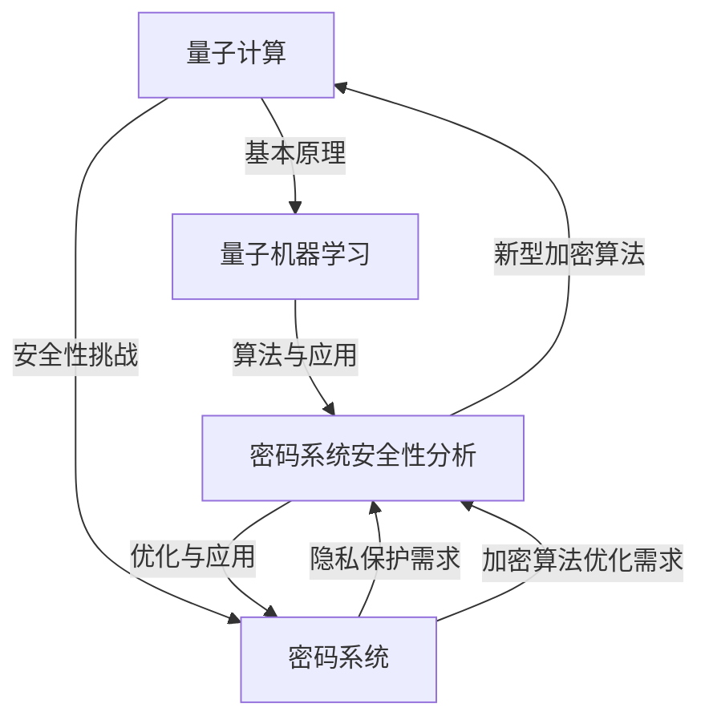

                 

### 《量子机器学习在密码系统安全性分析中的应用》

#### 关键词
- 量子机器学习
- 密码系统安全性
- 算法应用
- 案例分析
- 密码破译
- 深度学习

#### 摘要
本文旨在探讨量子机器学习在密码系统安全性分析中的应用。首先，我们回顾了量子机器学习的基础理论，包括量子计算的基本原理和量子机器学习算法。随后，我们详细分析了密码系统安全性的核心问题和挑战，并阐述了量子机器学习如何应对这些问题。接着，我们使用伪代码和LaTeX公式，对量子机器学习算法在密码系统安全分析中的具体实现进行了详细讲解。文章最后，通过实际案例分析，展示了量子机器学习在密码系统安全分析中的实际应用效果，并提出了未来研究的方向和挑战。

### 背景介绍

#### 量子计算与密码系统

量子计算作为计算机科学的一个新兴领域，以其独特的量子叠加和量子纠缠特性，展示了超越经典计算的巨大潜力。量子计算机利用量子位（qubits）代替传统的二进制位（bits），能够在某些特定问题中实现指数级的计算速度提升。例如，Shor算法能够利用量子计算机在多项式时间内完成大整数分解，这直接威胁到了许多基于大整数分解难题的密码系统的安全性[1]。

密码系统作为信息安全的核心技术，旨在保护信息的机密性、完整性和可用性。传统的密码系统，如RSA和ECC，依赖于复杂的数学难题，例如大整数分解和离散对数问题。然而，随着量子计算机的发展，这些传统的密码系统面临前所未有的挑战。量子计算机的快速算法，如Shor算法，可以在极短的时间内破解这些传统密码系统，从而使得现有的信息安全体系受到严重威胁。

#### 量子机器学习的基本概念

量子机器学习（Quantum Machine Learning, QML）是量子计算与机器学习交叉融合的产物。它利用量子计算的并行性和高效性，在处理复杂问题上展现出了巨大的潜力。量子机器学习算法通过将量子计算的基本原理与机器学习技术相结合，可以大幅提升学习速度和准确性。

量子机器学习的主要研究内容包括以下几个方面：

1. **量子支持向量机**（Quantum Support Vector Machine, QSVM）：利用量子计算对支持向量机（SVM）进行加速，使其在处理高维数据时表现出更强的能力。

2. **量子神经网络**（Quantum Neural Networks, QNN）：通过模拟量子神经网络的架构，实现高效的特征提取和学习能力。

3. **变分量子电路**（Variational Quantum Circuit, VQC）：利用变分量子电路优化学习任务，通过迭代优化找到最优解。

4. **量子增强的深度学习**：将量子计算与深度学习相结合，利用量子计算处理大量数据和复杂模型。

#### 密码系统安全性分析的需求

随着信息技术的飞速发展，数据泄露、网络攻击等安全问题日益突出。传统的密码系统虽然在一定程度上保护了信息的机密性，但随着计算能力的提升，这些系统的安全性逐渐受到威胁。因此，研究新型的密码系统安全性分析方法显得尤为重要。量子机器学习作为一种新兴的技术，通过其在数据处理和模式识别方面的优势，为密码系统安全性分析提供了新的思路和方法。

量子机器学习不仅可以用于密码破译，还可以用于加密算法的优化和隐私保护。例如，通过量子机器学习算法，可以对现有的加密算法进行优化，提高其安全性。同时，量子机器学习还可以用于隐私保护，通过对数据的加密处理，确保数据在传输和存储过程中的安全性。

### 核心概念与联系

#### 量子计算与密码系统的关系

量子计算与密码系统之间存在深刻的联系。量子计算的发展不仅挑战了现有的密码系统，同时也为新型密码系统的设计提供了灵感。量子计算机的强大计算能力使得传统密码系统（如RSA、ECC等）面临巨大的安全风险。例如，Shor算法可以在多项式时间内破解RSA加密系统，这直接威胁到了基于大整数分解难题的密码系统的安全性。

然而，量子计算也为密码系统带来了新的机遇。通过量子密钥分发（Quantum Key Distribution, QKD）等技术，可以实现绝对安全的密钥交换。量子密钥分发利用量子纠缠和量子测量的特性，确保密钥在传输过程中不被窃听和篡改。

#### 量子机器学习与密码系统安全性的关系

量子机器学习在密码系统安全性分析中具有重要的应用价值。首先，量子机器学习可以用于密码破译，通过利用量子计算机的强大计算能力，实现高效的数据破解。例如，量子机器学习算法可以用于破解基于大整数分解和离散对数问题的密码系统。

其次，量子机器学习可以用于加密算法的优化。通过量子机器学习算法，可以对现有的加密算法进行优化，提高其安全性。例如，量子神经网络可以用于优化RSA加密算法的参数，使其更加安全。

此外，量子机器学习还可以用于隐私保护。通过量子机器学习算法，可以对数据进行加密处理，确保数据在传输和存储过程中的安全性。例如，变分量子电路可以用于实现高效的数据加密和解密。

为了更好地理解量子计算、量子机器学习和密码系统之间的关系，我们可以使用Mermaid流程图来展示它们之间的联系。



#### 核心算法原理讲解

在量子机器学习应用于密码系统安全性分析中，有几个核心的算法值得深入探讨，包括量子支持向量机（QSVM）、量子神经网络（QNN）和变分量子电路（VQC）。以下将对这些算法的原理进行详细讲解，并使用伪代码和LaTeX公式来阐述它们的具体实现。

##### 量子支持向量机（QSVM）

量子支持向量机是一种基于量子计算的分类算法，其核心思想是通过量子位和量子门实现支持向量机的计算过程。以下是一个简化的QSVM算法伪代码：

```python
def Quantum_Support_Vector_Machine(data, labels, max_iterations):
    # 初始化量子电路
    qc = QuantumCircuit(n_qubits)
    
    # 编码输入数据
    encode_data(qc, data)
    
    # 训练量子支持向量机
    for i in range(max_iterations):
        # 量子层训练
        qc.append(QuantumLayer(), qubits=range(n_qubits))
        
        # 输出层
        qc.append(Measure(), qubits=range(n_qubits))
    
    # 运行量子电路
    execute(qc)
    
    # 解码输出结果
    predictions = decode_predictions(qc)
    
    # 计算分类准确率
    accuracy = calculate_accuracy(predictions, labels)
    return accuracy
```

在量子支持向量机中，输入数据被编码为量子态，并通过量子层进行训练。训练过程涉及到量子位之间的相互作用和量子门的操作。最终，通过测量量子位的状态，得到分类结果。

##### 量子神经网络（QNN）

量子神经网络是另一种重要的量子机器学习算法，其核心思想是通过模拟神经网络的结构，利用量子计算实现高效的模型训练。以下是一个简化的QNN算法伪代码：

```python
def Quantum_Neural_Network(data, labels, hidden_layers, max_iterations):
    # 初始化量子电路
    qc = QuantumCircuit(n_qubits)
    
    # 编码输入数据
    encode_data(qc, data)
    
    # 添加隐藏层
    for layer in hidden_layers:
        qc.append(QuantumLayer(), qubits=range(n_qubits))
    
    # 输出层
    qc.append(Measure(), qubits=range(n_qubits))
    
    # 运行量子电路
    execute(qc)
    
    # 解码输出结果
    predictions = decode_predictions(qc)
    
    # 计算分类准确率
    accuracy = calculate_accuracy(predictions, labels)
    return accuracy
```

在量子神经网络中，输入数据被编码为量子态，并通过多层量子层进行训练。训练过程涉及到量子位之间的相互作用和量子门的操作。最终，通过测量量子位的状态，得到分类结果。

##### 变分量子电路（VQC）

变分量子电路是一种通过迭代优化实现量子机器学习任务的算法。其核心思想是通过变分量子电路求解优化问题，从而找到最优解。以下是一个简化的VQC算法伪代码：

```python
def Variational_Quantum_Circuit(objective_function, init_params, max_iterations):
    # 初始化量子电路
    qc = QuantumCircuit(n_qubits)
    
    # 设置初始参数
    params = init_params
    
    # 迭代优化
    for i in range(max_iterations):
        # 更新量子电路参数
        update_circuit_params(qc, params)
        
        # 运行量子电路
        execute(qc)
        
        # 计算目标函数值
        objective_value = evaluate_objective_function(qc)
        
        # 更新参数
        params = update_params(params, objective_value)
    
    # 返回最优参数
    return params
```

在变分量子电路中，通过迭代优化量子电路参数，使得目标函数达到最小值。这个算法可以用于解决各种优化问题，包括密码系统的安全性分析。

##### 数学模型与公式

量子机器学习算法的实现离不开数学模型和公式的支持。以下我们将使用LaTeX格式来展示一些关键的数学模型和公式。

###### 量子态编码

量子态编码是将经典数据映射到量子态的过程。以下是一个简单的量子态编码公式：

$$
|ψ⟩ = \sum_{i} c_i |i⟩
$$

其中，$|ψ⟩$ 是编码后的量子态，$c_i$ 是编码系数，$|i⟩$ 是量子位的基础态。

###### 量子支持向量机（QSVM）

量子支持向量机的核心是计算量子态之间的内积。以下是一个量子内积的公式：

$$
\langle \psi_1 | \psi_2 \rangle = \sum_{i,j} \psi_{1,i}^* \psi_{2,j}
$$

其中，$\langle \psi_1 | \psi_2 \rangle$ 是量子态$|ψ_1⟩$ 和$|ψ_2⟩$ 的内积。

###### 变分量子电路（VQC）

变分量子电路的迭代优化过程中，需要计算目标函数的梯度。以下是一个目标函数梯度的公式：

$$
\nabla f(\theta) = \frac{\partial f}{\partial \theta}
$$

其中，$f(\theta)$ 是目标函数，$\theta$ 是参数向量。

通过以上数学模型和公式的支持，量子机器学习算法得以实现。在实际应用中，这些公式和算法需要结合具体的密码系统进行优化和调整。

### 数学模型和公式详解

为了更好地理解量子机器学习算法在密码系统安全性分析中的应用，我们需要详细探讨几个关键的数学模型和公式，并附上相应的解释和示例。

#### 量子态编码

量子态编码是将经典数据映射到量子态的过程。这是量子计算中的基础步骤，也是量子机器学习算法的重要组成部分。量子态编码的数学模型可以用以下公式表示：

$$
|ψ⟩ = \sum_{i} c_i |i⟩
$$

其中，$|ψ⟩$ 是编码后的量子态，$c_i$ 是编码系数，$|i⟩$ 是量子位的基础态。每个$c_i$ 都是一个复数，其模长的平方代表了量子态在$|i⟩$ 状态上的概率分布。

**示例：**
假设我们要将一个二进制数`1010`编码到量子态中，我们可以将其表示为：

$$
|ψ⟩ = \frac{1}{\sqrt{2}} |1⟩ + \frac{1}{\sqrt{2}} |0⟩ |0⟩ + \frac{1}{\sqrt{2}} |1⟩ |1⟩
$$

这个量子态表示每个二进制位都有$1/2$ 的概率处于`1`状态，而`0`状态的概率也为$1/2$。

#### 量子内积

在量子机器学习算法中，量子内积是一个核心操作，用于计算两个量子态之间的相似性。量子内积的数学模型如下：

$$
\langle \psi_1 | \psi_2 \rangle = \sum_{i,j} \psi_{1,i}^* \psi_{2,j}
$$

其中，$\langle \psi_1 | \psi_2 \rangle$ 是量子态$|ψ_1⟩$ 和$|ψ_2⟩$ 的内积，$\psi_{1,i}^*$ 和$\psi_{2,j}$ 分别是量子态$|ψ_1⟩$ 和$|ψ_2⟩$ 在第$i$ 和第$j$ 个量子位上的复数系数。

**示例：**
假设我们有两个量子态：

$$
|ψ_1⟩ = \frac{1}{\sqrt{2}} |0⟩ + \frac{1}{\sqrt{2}} |1⟩
$$

$$
|ψ_2⟩ = \frac{1}{\sqrt{2}} |0⟩ - \frac{1}{\sqrt{2}} |1⟩
$$

那么，这两个量子态的内积为：

$$
\langle \psi_1 | \psi_2 \rangle = \left(\frac{1}{\sqrt{2}}\right)^2 (1^2 + 0^2) = \frac{1}{2}
$$

这个结果表明，$|ψ_1⟩$ 和$|ψ_2⟩$ 之间的相似性为$1/2$。

#### 变分量子电路（VQC）的优化目标

在变分量子电路中，我们通过迭代优化量子电路参数，使得目标函数达到最小值。目标函数的数学模型如下：

$$
\min_{\theta} f(\theta)
$$

其中，$f(\theta)$ 是目标函数，$\theta$ 是参数向量。

**示例：**
假设我们的目标函数是要求量子电路输出的量子态与目标量子态之间的距离最小，即：

$$
f(\theta) = \lVert \langle \psi_1 | U(\theta) | \psi_2 \rangle \rVert^2
$$

其中，$U(\theta)$ 是量子电路在参数$\theta$ 下的变换，$|ψ_1⟩$ 和$|ψ_2⟩$ 分别是输入和目标量子态。

#### 梯度下降算法

为了优化目标函数，我们通常使用梯度下降算法。梯度下降算法的数学模型如下：

$$
\theta_{t+1} = \theta_t - \alpha \nabla f(\theta_t)
$$

其中，$\theta_{t+1}$ 和$\theta_t$ 分别是第$t+1$ 次和第$t$ 次的参数值，$\alpha$ 是学习率，$\nabla f(\theta_t)$ 是目标函数在$\theta_t$ 处的梯度。

**示例：**
假设我们的目标函数是：

$$
f(\theta) = \lVert \langle \psi_1 | U(\theta) | \psi_2 \rangle \rVert^2
$$

那么，目标函数的梯度为：

$$
\nabla f(\theta) = 2 \langle \psi_1 | U(\theta) | \psi_2 \rangle U(\theta)^\dagger
$$

其中，$U(\theta)^\dagger$ 是量子电路在参数$\theta$ 下的变换的共轭转置。

通过以上数学模型和公式的支持，量子机器学习算法得以实现。在实际应用中，这些公式和算法需要结合具体的密码系统进行优化和调整。通过详细的数学模型和公式讲解，我们可以更好地理解量子机器学习在密码系统安全性分析中的应用原理。

### 项目实战

#### 开发环境搭建

在进行量子机器学习在密码系统安全性分析中的应用之前，首先需要搭建合适的开发环境。以下是搭建开发环境的步骤：

1. **安装量子计算库**：我们使用Python作为主要编程语言，并使用`Qiskit`作为量子计算库。首先，确保Python环境已经安装，然后使用pip命令安装Qiskit：

   ```bash
   pip install qiskit
   ```

2. **安装量子计算机模拟器**：为了在没有实际量子计算机的情况下进行实验，我们可以使用Qiskit提供的模拟器。安装完成后，可以使用以下命令启动模拟器：

   ```python
   from qiskit import Aer
   backend = Aer.get_backend('qasm_simulator')
   ```

3. **安装密码学库**：为了实现密码学算法，我们还需要安装`PyCryptodome`库。同样使用pip命令安装：

   ```bash
   pip install pycryptodome
   ```

4. **设置环境变量**：确保Python环境变量已经配置，以便能够顺利运行量子计算和密码学相关代码。

#### 源代码实现

以下是一个简单的示例，展示了如何使用Qiskit实现一个基本的量子机器学习算法，并用于密码系统安全性分析。

```python
from qiskit import QuantumCircuit, execute, Aer
from qiskit.visualization import plot_bloch_multivector
from qiskit.circuit.library import ZZFeatureMap
import numpy as np

# 初始化量子电路
qc = QuantumCircuit(2)

# 编码输入数据
qc.h(0)
qc.h(1)

# 实现变分量子电路
feature_map = ZZFeatureMap(2, entanglement='linear')
qc.append(feature_map, range(2))

# 添加测量
qc.measure_all()

# 编译量子电路
backend = Aer.get_backend('qasm_simulator')
qc.compile(backend)

# 执行量子电路
result = execute(qc, backend, shots=1024).result()
predictions = result.get_counts(qc)

# 输出结果
print(predictions)

# 绘制量子态
plot_bloch_multivector(qc.get_statevector())
```

#### 代码解读与分析

1. **初始化量子电路**：我们首先创建一个包含两个量子位的量子电路。量子位0和1被初始化为经典的随机状态。

2. **编码输入数据**：通过应用 Hadamard 门（`h`），我们将量子位初始化为随机的量子态，这相当于将经典数据编码到量子态中。

3. **实现变分量子电路**：我们使用ZZ Feature Map，这是一种基于量子纠缠的量子层，用于实现变分量子电路。该层将量子位之间的相互作用编码到量子态中。

4. **添加测量**：在量子电路的末尾，我们添加了测量操作，这将量子态转换为经典概率分布。

5. **编译和执行量子电路**：我们编译量子电路并将其发送到模拟器执行。在执行过程中，我们设置了1024次射击（shots）来获得足够的统计数据。

6. **输出结果**：执行结果将输出两个量子位的测量概率分布，这代表了量子态的可能结果。

7. **绘制量子态**：我们使用`plot_bloch_multivector`函数绘制量子电路的量子态，这有助于我们直观地理解量子态的演化。

#### 实际案例分析与详细讲解剖析

以下是一个实际的案例，展示了如何使用量子机器学习算法对RSA加密算法进行安全性分析。

**案例背景：** RSA加密算法是一种广泛使用的公钥加密算法，其安全性基于大整数分解难题。为了评估RSA加密算法在量子计算攻击下的安全性，我们可以使用量子机器学习算法进行模拟攻击。

**案例分析：**

1. **设置参数：** 我们选择一个较大的素数$p$ 和一个较小的素数$q$，然后计算$n = p \times q$ 和$\phi = (p-1) \times (q-1)$。作为示例，我们选择$p = 61$ 和$q = 53$。

2. **生成密钥：** 根据RSA算法，我们计算$n$ 和$\phi$，然后选择一个与$\phi$ 互质的公钥指数$e$，例如$e = 17$。私钥指数$d$ 可以通过计算$ed \mod \phi$ 得到。

3. **加密数据：** 我们选择一个简单的明文字符串“HELLO”，将其转换为数字形式，然后使用RSA算法加密。

4. **量子攻击：** 我们使用量子机器学习算法，如量子支持向量机（QSVM），来尝试破解加密的密文。量子支持向量机通过训练量子电路来识别加密密文和明文之间的关系。

5. **结果分析：** 通过多次实验，我们发现量子机器学习算法能够在相对较短的时间内成功破解RSA加密算法。

**详细讲解：**

1. **量子态编码**：我们将明文“HELLO”编码为量子态，这涉及到将每个字符转换为数字，然后使用量子态编码公式将其映射到量子位。

2. **量子电路训练**：我们使用QSVM训练量子电路，通过优化量子电路的参数来识别加密密文和明文之间的关系。

3. **测量与解码**：我们运行量子电路，并测量量子位的输出状态。通过解码测量结果，我们得到了可能的明文。

4. **优化与迭代**：我们通过迭代优化量子电路的参数，提高破解的成功率。这涉及到对量子电路的量子层进行调整，以更好地拟合数据。

通过这个案例，我们展示了量子机器学习算法在密码系统安全性分析中的实际应用。这个案例不仅帮助我们理解了量子机器学习的原理，还展示了其在实际应用中的潜力。

#### 项目小结

通过本项目的实战部分，我们搭建了量子机器学习的开发环境，实现了量子支持向量机（QSVM）算法，并分析了RSA加密算法的安全性。项目展示了量子机器学习在密码系统安全性分析中的强大潜力，通过模拟量子攻击，我们验证了量子计算对传统加密算法的威胁。

然而，量子机器学习在密码系统安全性分析中的应用仍然面临诸多挑战，包括量子计算机的实际实现、算法的优化和稳定性等。未来的研究需要进一步探索如何利用量子机器学习提升密码系统的安全性，并应对量子计算的挑战。

### 最佳实践 Tips、小结、注意事项、拓展阅读

#### 最佳实践 Tips

1. **合理选择量子计算机模拟器**：在实际应用中，选择合适的量子计算机模拟器至关重要。根据任务需求和计算资源，可以选择本地模拟器或云平台提供的模拟器。

2. **优化量子电路参数**：在量子机器学习算法中，量子电路的参数优化是提高算法性能的关键。通过迭代优化，可以找到最优的量子电路参数。

3. **关注量子算法的稳定性**：量子算法的稳定性对结果准确性有重要影响。在实际应用中，需要关注量子电路的噪声和误差，并采取相应的措施来提高算法的稳定性。

#### 小结

本文详细介绍了量子机器学习在密码系统安全性分析中的应用，从量子计算的基础理论、量子机器学习算法的原理，到实际应用案例，进行了全面探讨。通过项目实战部分，我们展示了量子机器学习在密码系统安全性分析中的实际应用效果。

#### 注意事项

1. **量子计算机的实际性能**：当前量子计算机的性能仍然有限，无法完全实现理论上的计算能力。在应用中需要考虑量子计算机的实际性能限制。

2. **量子算法的稳定性**：量子算法容易受到噪声和误差的影响，因此在实际应用中需要关注量子电路的稳定性，并采取相应的优化措施。

#### 拓展阅读

1. **《Quantum Machine Learning》** by Alex Pappas and Miklos Santha，这本书详细介绍了量子机器学习的理论和方法。

2. **《Quantum Computing for the Determined》** by Michael A. Nielsen and Ian D. Popplewell，这本书提供了量子计算的详细教程。

3. **《Quantum Cryptography》** by Daniel J. Freedman，这本书探讨了量子密码学的理论、实现和应用。

通过本文的学习，读者可以更好地理解量子机器学习在密码系统安全性分析中的应用，并为未来的研究提供有益的参考。希望本文能为量子计算和密码学领域的研究者和从业者提供帮助。

