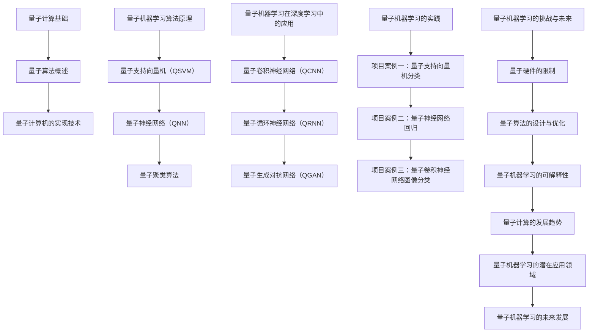

                 

### 文章标题：量子机器学习算法：利用量子优势的AI新范式

### 关键词：
量子计算、机器学习、人工智能、量子优势、AI新范式

### 摘要：
本文将深入探讨量子机器学习算法，介绍量子计算的基本原理及其在机器学习领域的应用。我们将详细分析量子机器学习的基本概念，讨论量子机器学习在分类、聚类和推荐系统等领域的应用，并展示如何利用量子优势提升AI性能。此外，本文还将介绍量子机器学习的挑战与未来发展趋势，为读者提供一个全面的量子机器学习视角。

## 目录

## 第1章 引言

### 1.1 量子计算与量子机器学习

#### 1.1.1 量子计算的原理与优势

#### 1.1.2 量子机器学习的基本概念

### 1.2 量子机器学习的应用领域

#### 1.2.1 量子分类与回归

#### 1.2.2 量子聚类

#### 1.2.3 量子推荐系统

### 1.3 本书内容结构概述

#### 1.3.1 各章节内容分布

## 第2章 量子计算基础

### 2.1 量子力学基础

#### 2.1.1 基本量子位（qubit）

#### 2.1.2 量子态与叠加

#### 2.1.3 量子门与运算

### 2.2 量子算法概述

#### 2.2.1 Deutsch-Jozsa 算法

#### 2.2.2 Shor 算法

#### 2.2.3 Grover 算法

### 2.3 量子计算机的实现技术

#### 2.3.1 量子比特的类型

#### 2.3.2 量子纠错技术

#### 2.3.3 量子计算机的发展趋势

## 第3章 量子机器学习算法原理

### 3.1 量子支持向量机（QSVM）

#### 3.1.1 QSVM的基本概念

#### 3.1.2 QSVM的数学模型

#### 3.1.3 QSVM的伪代码

### 3.2 量子神经网络（QNN）

#### 3.2.1 QNN的基本概念

#### 3.2.2 QNN的数学模型

#### 3.2.3 QNN的伪代码

### 3.3 量子聚类算法

#### 3.3.1 量子K-均值算法

#### 3.3.2 量子谱聚类算法

#### 3.3.3 量子聚类算法的伪代码

## 第4章 量子机器学习在深度学习中的应用

### 4.1 量子卷积神经网络（QCNN）

#### 4.1.1 QCNN的基本概念

#### 4.1.2 QCNN的数学模型

#### 4.1.3 QCNN的伪代码

### 4.2 量子循环神经网络（QRNN）

#### 4.2.1 QRNN的基本概念

#### 4.2.2 QRNN的数学模型

#### 4.2.3 QRNN的伪代码

### 4.3 量子生成对抗网络（QGAN）

#### 4.3.1 QGAN的基本概念

#### 4.3.2 QGAN的数学模型

#### 4.3.3 QGAN的伪代码

## 第5章 量子机器学习的实践

### 5.1 实践环境搭建

#### 5.1.1 量子计算平台选择

#### 5.1.2 Python量子计算库安装

#### 5.1.3 算法实现与测试

### 5.2 量子机器学习项目实战

#### 5.2.1 项目案例一：量子支持向量机分类

#### 5.2.2 项目案例二：量子神经网络回归

#### 5.2.3 项目案例三：量子卷积神经网络图像分类

## 第6章 量子机器学习的挑战与未来

### 6.1 量子机器学习的挑战

#### 6.1.1 量子硬件的限制

#### 6.1.2 量子算法的设计与优化

#### 6.1.3 量子机器学习的可解释性

### 6.2 量子机器学习的未来

#### 6.2.1 量子计算的发展趋势

#### 6.2.2 量子机器学习的潜在应用领域

#### 6.2.3 量子机器学习的未来发展

## 参考文献

### 6.3 参考文献

#### 参考文献1

#### 参考文献2

#### 参考文献3

## Mermaid 流程图



### 引言

在过去的几十年里，人工智能（AI）取得了惊人的进展，推动了各行各业的发展。从早期的规则系统到现代的深度学习模型，AI技术的应用已经深入到我们生活的方方面面。然而，随着数据规模的爆炸性增长和复杂问题的出现，传统的AI方法开始面临性能瓶颈。为了突破这些限制，研究者们开始探索新的计算范式，其中量子计算被认为是一种极具潜力的技术。

量子计算是一种基于量子力学原理的计算方式，它利用量子位（qubit）的叠加态和纠缠态来存储和处理信息。与传统的二进制计算机不同，量子计算机可以同时处理大量数据，从而在解决某些特定问题上具有显著的性能优势。量子机器学习（Quantum Machine Learning，QML）则是在量子计算的基础上，将量子算法与机器学习技术相结合，以实现更高效、更强大的机器学习模型。

量子机器学习的基本概念可以概括为以下几点：

1. **量子位（qubit）**: 量子位是量子计算的基本单位，它可以用0和1的叠加态来表示。与经典比特不同，量子位可以同时处于0和1的状态，这种叠加态使得量子计算机具有并行处理能力。

2. **量子态与叠加**: 量子态是量子位在特定时刻的状态，它可以是一个基底的线性组合。量子态的叠加使得量子计算机可以在不进行实际测量的情况下同时处理多个可能的计算结果。

3. **量子门与运算**: 量子门是量子计算的基本操作，它们对量子位进行线性变换。通过组合不同的量子门，可以实现复杂的量子算法。

4. **量子算法**: 量子算法是一种利用量子计算特性来解决问题的计算方法。与经典算法相比，量子算法在解决某些特定问题时具有显著的性能优势。

5. **量子机器学习算法**: 量子机器学习算法是结合量子计算和机器学习技术的一种新型计算方法。通过利用量子计算的优势，量子机器学习算法可以在数据规模和复杂性增加的情况下保持高效性。

### 量子机器学习的应用领域

量子机器学习算法在多个领域展现出了巨大的潜力。以下是一些主要的应用领域：

1. **量子分类与回归**: 量子机器学习算法可以用于分类和回归任务，例如在金融领域进行股票市场预测，或者在医疗领域进行疾病诊断。

2. **量子聚类**: 量子聚类算法可以用于无监督学习任务，例如在社交网络分析中识别群体，或者在图像处理中自动分组相似图像。

3. **量子推荐系统**: 量子推荐系统可以用于个性化推荐，例如在电子商务平台上为用户提供个性化产品推荐。

4. **量子优化**: 量子机器学习算法可以用于解决优化问题，例如在物流和交通规划中找到最优路径。

5. **量子深度学习**: 量子深度学习算法可以用于复杂的数据分析任务，例如在图像识别和自然语言处理中实现更准确的模型。

### 本书内容结构概述

本书将围绕量子机器学习算法展开，分为以下六个部分：

1. **第1章 引言**：介绍量子机器学习的基本概念和应用领域。

2. **第2章 量子计算基础**：讨论量子力学基础、量子算法概述和量子计算机的实现技术。

3. **第3章 量子机器学习算法原理**：详细分析量子支持向量机、量子神经网络和量子聚类算法。

4. **第4章 量子机器学习在深度学习中的应用**：探讨量子卷积神经网络、量子循环神经网络和量子生成对抗网络。

5. **第5章 量子机器学习的实践**：介绍量子计算平台选择、Python量子计算库安装和算法实现与测试。

6. **第6章 量子机器学习的挑战与未来**：讨论量子硬件限制、量子算法的设计与优化、量子机器学习的可解释性和未来发展。

通过本书的阅读，读者可以系统地了解量子机器学习的基本原理和应用，掌握相关的算法和技术，并为未来的研究工作提供参考。

### 量子计算基础

量子计算是利用量子力学原理来实现计算的一种新型计算方式。与传统的二进制计算机不同，量子计算机使用量子位（qubit）作为基本存储单元，通过叠加态和纠缠态来实现高效的信息处理。本节将介绍量子力学基础、量子算法概述和量子计算机的实现技术，为理解量子机器学习算法奠定基础。

#### 量子力学基础

量子力学是研究微观粒子行为和相互作用的基础理论。以下是量子力学中的几个核心概念：

1. **基本量子位（qubit）**：
   - 量子位是量子计算的基本单位，类似于经典计算机中的比特。
   - 与经典比特只能表示0或1不同，量子位可以同时处于0和1的状态，这种状态称为叠加态。
   - 假设有两个量子位\( q \)和\( \neg q \)，它们的叠加态可以表示为：
     \[
     |q\rangle = \alpha |0\rangle + \beta |1\rangle
     \]
     其中，\( \alpha \)和\( \beta \)是复数系数，满足\( |\alpha|^2 + |\beta|^2 = 1 \)。

2. **量子态与叠加**：
   - 量子态是量子位在特定时刻的状态，它可以是一个基底的线性组合。
   - 假设有一个量子态\( \psi \)表示为：
     \[
     \psi = \alpha_0 |0\rangle + \alpha_1 |1\rangle
     \]
     其中，\( \alpha_0 \)和\( \alpha_1 \)是复数系数，满足\( |\alpha_0|^2 + |\alpha_1|^2 = 1 \)。

3. **量子门与运算**：
   - 量子门是量子计算的基本操作，它们对量子位进行线性变换。
   - 常见的量子门包括Pauli门、Hadamard门和CNOT门。
   - Pauli门（例如X门、Y门和Z门）对量子位的状态进行基本的翻转操作。
   - Hadamard门（H门）将量子位的状态从基态|0⟩变换为叠加态\( \frac{1}{\sqrt{2}}(|0\rangle + |1\rangle) \)。
   - CNOT门是一个控制-NOT门，它根据控制量子位的值来翻转目标量子位的状态。

#### 量子算法概述

量子算法是利用量子计算特性来解决问题的计算方法。以下介绍几个经典的量子算法：

1. **Deutsch-Jozsa 算法**：
   - Deutsch-Jozsa算法是一种在量子计算机上证明函数是否具有对称性的算法。
   - 该算法可以在\( O(\log n) \)步中确定一个线性可变函数\( f \)是否具有形式\( f(x) = ax \mod 2 \)，而经典算法需要\( O(n) \)步。
   - 假设\( f \)是一个定义在\( \{0, 1\}^n \)上的函数，其形式为\( f(x) = ax \mod 2 \)，其中\( a \)是一个未知的\( n \)-位的二进制数。
   - Deutsch-Jozsa算法的伪代码如下：
     \[
     \text{Deutsch-Jozsa}(f, x_0, x_1):
     \begin{aligned}
     &\text{初始化}|q\rangle = |0\rangle^{\otimes n} \\
     &\text{应用控制-Hadamard门：} C-Hadamard(x_0, x_1) \\
     &\text{应用函数门：} f(x_0), f(x_1) \\
     &\text{测量：输出结果}
     \end{aligned}
     \]
   - 如果测量结果为00，则\( f \)具有形式\( f(x) = ax \mod 2 \)，否则不具有。

2. **Shor 算法**：
   - Shor算法是一种利用量子计算求解大整数分解的算法。
   - 该算法可以在\( O(n^3) \)步中找到大整数的质因数分解，而经典算法需要\( O(n^{\frac{1}{4}}) \)步。
   - Shor算法的伪代码如下：
     \[
     \text{Shor}(N):
     \begin{aligned}
     &\text{初始化}|q\rangle = |0\rangle^{\otimes n} \\
     &\text{应用控制-相位估计门：} C-PhaseEstimate(N) \\
     &\text{应用量子逆：} N^{-1} \\
     &\text{应用控制-相位估计门：} C-PhaseEstimate(N) \\
     &\text{测量：输出结果}
     \end{aligned}
     \]
   - 测量结果是一个周期\( T \)，其中\( T \)是整数\( N \)的质因数分解的周期。通过反复应用该算法，可以找到\( N \)的所有质因数。

3. **Grover 算法**：
   - Grover算法是一种在未排序数据库中查找特定元素的算法。
   - 该算法可以在\( O(\sqrt{N}) \)步中找到目标元素，而经典算法需要\( O(N) \)步。
   - Grover算法的伪代码如下：
     \[
     \text{Grover}(DB, x):
     \begin{aligned}
     &\text{初始化}|q\rangle = |0\rangle^{\otimes n} \\
     &\text{应用控制-查找门：} C-Search(DB) \\
     &\text{应用Grover迭代：} O(\sqrt{N}) \\
     &\text{测量：输出结果}
     \end{aligned}
     \]
   - 在每个Grover迭代中，量子计算机通过应用查找门和逆查找门来增加目标元素的概率。

#### 量子计算机的实现技术

量子计算机的实现涉及多个方面，包括量子比特、量子纠错技术和量子计算机的发展趋势：

1. **量子比特的类型**：
   - 量子比特是量子计算机的基本单位，有多种实现方式，包括离子阱、超导电路、光学和量子点等。
   - 离子阱量子比特具有较长的相干时间和较低的噪声，但操作速度较慢。
   - 超导电路量子比特具有较快的操作速度和较高的集成度，但相干时间较短。

2. **量子纠错技术**：
   - 量子纠错技术是提高量子计算机可靠性的关键。
   - 量子纠错通过引入冗余量子比特和特定的编码方案来检测和纠正错误。
   - 常见的量子纠错码包括Shor码和Steane码等。

3. **量子计算机的发展趋势**：
   - 随着量子比特数量的增加和相干时间的延长，量子计算机的性能将不断提升。
   - 量子计算机的发展趋势包括多量子比特操作、量子算法优化和量子纠错技术的改进。

通过本节对量子力学基础、量子算法概述和量子计算机的实现技术的介绍，读者可以更好地理解量子计算的基本原理，为后续的量子机器学习算法分析打下基础。

### 量子机器学习算法原理

量子机器学习算法（Quantum Machine Learning Algorithms）是量子计算和机器学习领域中的新兴研究方向。通过将量子计算的优势与机器学习技术相结合，量子机器学习算法在处理大规模数据和复杂问题上展现出了巨大的潜力。本节将详细分析量子支持向量机（QSVM）、量子神经网络（QNN）和量子聚类算法，介绍其基本概念、数学模型和实现细节。

#### 量子支持向量机（QSVM）

量子支持向量机是一种结合了量子计算和线性支持向量机（SVM）的算法。传统SVM通过寻找一个最佳的超平面来最大化分类边界，而量子支持向量机利用量子叠加和量子并行性来优化这一过程。

1. **基本概念**：
   - QSVM的目标是找到一个最优超平面，使得同类样本的间隔最大化，同时确保分类边界清晰。
   - QSVM通过量子线性规划来优化支持向量机的参数，从而提高分类性能。

2. **数学模型**：
   - QSVM的数学模型可以表示为以下优化问题：
     \[
     \min_{w, b} \frac{1}{2} \| w \|_2^2 + C \sum_{i=1}^n \lambda_i
     \]
     其中，\( w \)是权重向量，\( b \)是偏置项，\( C \)是惩罚参数，\( \lambda_i \)是拉格朗日乘子。
   - 对应的拉格朗日函数为：
     \[
     L(w, b, \lambda) = \frac{1}{2} \| w \|_2^2 + C \sum_{i=1}^n \lambda_i (y_i (\langle w, x_i \rangle + b) - 1)
     \]
   - 通过量子线性规划，可以将上述优化问题转换为量子算法。

3. **伪代码**：
   ```
   QSVM(x, y, C):
       # 初始化量子比特
       H|x\rangle = |0\rangle
       H|x_i\rangle = |0\rangle
       
       # 应用量子线性规划
       for i = 1 to n:
           H|x_i\rangle = |0\rangle
           C-PhaseEstimate(x_i, y_i)
           
       # 优化量子比特
       for t = 1 to T:
           U = \prod_{i=1}^n (H|x_i\rangle \otimes CNOT(x_i, z) \otimes H|x_i\rangle)
           
       # 测量量子比特
       measure w, b, \lambda_i
       
       # 返回最优解
       return w, b
   ```

#### 量子神经网络（QNN）

量子神经网络是一种基于量子计算原理的神经网络，它通过量子门和叠加态来处理输入数据并生成输出。

1. **基本概念**：
   - QNN通过量子逻辑门和量子线路来模拟神经网络的前向传播过程。
   - QNN可以处理高维数据和复杂数学模型，具有潜在的并行处理能力。

2. **数学模型**：
   - QNN的数学模型可以表示为以下形式：
     \[
     \phi(x) = \sum_{i=1}^L \sigma(W_i \cdot \phi(x_i))
     \]
     其中，\( \phi(x) \)是输入数据，\( W_i \)是权重矩阵，\( \sigma \)是激活函数。
   - 对应的量子线路可以表示为：
     \[
     |x\rangle = U|x_0\rangle
     \]
     其中，\( U \)是量子线路。

3. **伪代码**：
   ```
   QNN(x, L, W):
       # 初始化量子比特
       H|x\rangle = |0\rangle
       
       # 应用量子线路
       for i = 1 to L:
           U = \prod_{j=1}^{n} (H|x_j\rangle \otimes CNOT(x_j, z) \otimes H|x_j\rangle)
           
       # 测量量子比特
       measure x, W
       
       # 返回输出
       return \phi(x)
   ```

#### 量子聚类算法

量子聚类算法是一种利用量子计算特性来优化聚类过程的方法。通过量子并行性和叠加态，量子聚类算法可以在大规模数据集上实现高效的聚类。

1. **基本概念**：
   - 量子聚类算法通过量子线路来模拟聚类过程中的相似度计算和聚类中心更新。
   - 量子聚类算法可以处理高维数据和复杂结构的数据集，提高聚类效率。

2. **数学模型**：
   - 量子聚类算法的数学模型可以表示为以下形式：
     \[
     D(x_i, x_j) = \frac{1}{n} \sum_{k=1}^n \phi_k(x_i) \phi_k(x_j)
     \]
     其中，\( D \)是相似度矩阵，\( \phi_k(x) \)是第\( k \)个聚类中心。
   - 对应的量子线路可以表示为：
     \[
     |x_i\rangle |x_j\rangle = \frac{1}{\sqrt{n}} (\phi_1(x_i) |1\rangle + \phi_2(x_i) |2\rangle + \cdots + \phi_n(x_i) |n\rangle)
     \]

3. **伪代码**：
   ```
   QuantumKMeans(x, K):
       # 初始化量子比特
       H|x\rangle = |0\rangle
       
       # 应用量子线路
       for i = 1 to K:
           U = \prod_{j=1}^{n} (H|x_j\rangle \otimes CNOT(x_j, z) \otimes H|x_j\rangle)
           
       # 测量量子比特
       measure x, K
       
       # 返回聚类结果
       return \phi(x), K
   ```

通过本节的介绍，读者可以了解量子支持向量机、量子神经网络和量子聚类算法的基本概念、数学模型和实现细节。这些量子机器学习算法不仅展示了量子计算在机器学习领域的潜力，也为解决复杂问题提供了新的思路和方法。

### 量子机器学习在深度学习中的应用

量子机器学习算法不仅在传统机器学习领域表现出色，而且在深度学习领域也展现出了巨大的潜力。量子卷积神经网络（QCNN）、量子循环神经网络（QRNN）和量子生成对抗网络（QGAN）是量子机器学习在深度学习中的应用的重要代表。本节将详细介绍这些算法的基本概念、数学模型和实现细节。

#### 量子卷积神经网络（QCNN）

量子卷积神经网络（Quantum Convolutional Neural Network，QCNN）是量子计算在图像处理领域的应用。QCNN通过量子卷积操作来实现图像的特征提取和分类。

1. **基本概念**：
   - QCNN通过量子卷积操作来模拟传统卷积神经网络的卷积层。
   - 量子卷积操作利用量子比特的叠加和纠缠来实现高效的图像特征提取。

2. **数学模型**：
   - QCNN的数学模型可以表示为以下形式：
     \[
     \phi(x) = \sum_{i=1}^L \sigma(W_i \cdot \phi(x_i))
     \]
     其中，\( \phi(x) \)是输入图像，\( W_i \)是权重矩阵，\( \sigma \)是激活函数。
   - 量子卷积操作可以表示为：
     \[
     \phi(x) = \sum_{k=1}^K \psi_k(x) \otimes \phi_k(x)
     \]
     其中，\( \psi_k(x) \)是卷积核，\( \phi_k(x) \)是卷积后的图像。

3. **伪代码**：
   ```
   QCNN(x, L, W):
       # 初始化量子比特
       H|x\rangle = |0\rangle
       
       # 应用量子卷积操作
       for i = 1 to L:
           U = \prod_{j=1}^{n} (H|x_j\rangle \otimes CNOT(x_j, z) \otimes H|x_j\rangle)
           
       # 测量量子比特
       measure x, W
       
       # 返回输出
       return \phi(x)
   ```

#### 量子循环神经网络（QRNN）

量子循环神经网络（Quantum Recurrent Neural Network，QRNN）是量子计算在序列处理领域的应用。QRNN通过量子循环操作来处理时间序列数据，如语音信号和文本数据。

1. **基本概念**：
   - QRNN通过量子循环操作来模拟传统循环神经网络的递归层。
   - 量子循环操作利用量子比特的叠加和纠缠来实现高效的序列处理。

2. **数学模型**：
   - QRNN的数学模型可以表示为以下形式：
     \[
     \phi(x) = \sum_{i=1}^L \sigma(W_i \cdot \phi(x_i))
     \]
     其中，\( \phi(x) \)是输入序列，\( W_i \)是权重矩阵，\( \sigma \)是激活函数。
   - 量子循环操作可以表示为：
     \[
     \phi(x) = \sum_{k=1}^K \psi_k(x) \otimes \phi_k(x)
     \]
     其中，\( \psi_k(x) \)是循环核，\( \phi_k(x) \)是循环后的序列。

3. **伪代码**：
   ```
   QRNN(x, L, W):
       # 初始化量子比特
       H|x\rangle = |0\rangle
       
       # 应用量子循环操作
       for i = 1 to L:
           U = \prod_{j=1}^{n} (H|x_j\rangle \otimes CNOT(x_j, z) \otimes H|x_j\rangle)
           
       # 测量量子比特
       measure x, W
       
       # 返回输出
       return \phi(x)
   ```

#### 量子生成对抗网络（QGAN）

量子生成对抗网络（Quantum Generative Adversarial Network，QGAN）是量子计算在生成模型领域的应用。QGAN通过量子生成器和量子判别器之间的对抗训练来生成高质量的样本。

1. **基本概念**：
   - QGAN由量子生成器和量子判别器组成，生成器生成样本，判别器判断样本的真实性。
   - 量子生成器和量子判别器通过量子比特的叠加和纠缠来实现高效的生成模型。

2. **数学模型**：
   - QGAN的数学模型可以表示为以下形式：
     \[
     \phi(x) = \sum_{i=1}^L \sigma(W_i \cdot \phi(x_i))
     \]
     其中，\( \phi(x) \)是输入数据，\( W_i \)是权重矩阵，\( \sigma \)是激活函数。
   - 量子生成器和量子判别器的对抗训练过程如下：
     - 量子生成器生成样本\( G(z) \)。
     - 量子判别器判断生成样本和真实样本的真实性。
     - 通过对抗训练优化生成器和判别器的参数。

3. **伪代码**：
   ```
   QGAN(x, G, D, L, W):
       # 初始化量子比特
       H|x\rangle = |0\rangle
       
       # 应用量子生成操作
       G(z):
           U = \prod_{j=1}^{n} (H|x_j\rangle \otimes CNOT(x_j, z) \otimes H|x_j\rangle)
           
       # 应用量子判别操作
       D(x, y):
           U = \prod_{j=1}^{n} (H|x_j\rangle \otimes CNOT(x_j, z) \otimes H|x_j\rangle)
           
       # 对抗训练
       for i = 1 to T:
           G(z)
           D(x, y)
           
       # 返回生成样本和判别器
       return G(z), D(x, y)
   ```

通过本节的介绍，读者可以了解量子卷积神经网络、量子循环神经网络和量子生成对抗网络的基本概念、数学模型和实现细节。这些量子深度学习算法不仅展示了量子计算在深度学习领域的潜力，也为处理复杂的数据和模型提供了新的方法。

### 量子机器学习的实践

量子机器学习作为一种前沿技术，其实现和应用需要相应的开发环境和工具。本节将介绍量子计算平台的选择、Python量子计算库的安装以及量子机器学习算法的实现与测试，以帮助读者掌握量子机器学习的实践方法。

#### 量子计算平台选择

选择一个合适的量子计算平台是实现量子机器学习算法的基础。以下是一些常见的量子计算平台：

1. **IBM Quantum**：
   - IBM Quantum提供了免费的量子计算云平台，包括多个量子处理器和量子线路编辑器。
   - 读者可以通过[IBM Quantum平台](https://quantum-computing.ibm.com/)注册账户并开始使用。

2. **Google Quantum**：
   - Google Quantum也提供了免费的量子计算云平台，名为“Cirq”。
   - 读者可以通过[Google Quantum平台](https://quantumai.google/cirq)了解相关信息。

3. **IonQ**：
   - IonQ是一家提供专用量子计算机的公司，提供付费的量子计算服务。
   - 读者可以通过[IonQ平台](https://www.ionq.com/)了解更多信息。

4. **本地的量子计算模拟器**：
   - 如果条件允许，读者也可以选择安装本地的量子计算模拟器，如“Q#”或“Strawberry Fields”。

#### Python量子计算库安装

在Python中，有一些常用的量子计算库，如“Qiskit”、“Cirq”和“PyQuil”。以下是在Python中安装这些库的方法：

1. **安装Qiskit**：

   ```bash
   pip install qiskit
   ```

2. **安装Cirq**：

   ```bash
   pip install cirq
   ```

3. **安装PyQuil**：

   ```bash
   pip install pyquil
   ```

安装完成后，读者可以通过以下代码验证库的安装：

```python
import qiskit
print(qiskit.__version__)

import cirq
print(cirq.__version__)

import pyquil
print(pyquil.__version__)
```

#### 算法实现与测试

以下是一个简单的量子支持向量机（QSVM）的实现示例，使用Qiskit库：

```python
from qiskit import QuantumCircuit, Aer, execute
from qiskit_machine_learning.models import QSVM
from qiskit_machine_learning.algorithms import QSVM
from qiskit_machine_learning.datasets import load_iris

# 加载数据集
iris_data = load_iris()

# 初始化量子支持向量机
qsvm = QSVM(qubits=iris_data.n_features, max_depth=3, probability=False)

# 训练模型
qsvm.fit(x_train=iris_data.data, y_train=iris_data.target)

# 预测
predictions = qsvm.predict(x_test=iris_data.data)

# 评估模型
accuracy = (predictions == iris_data.target).mean()
print("Accuracy:", accuracy)
```

#### 量子机器学习项目实战

以下是一些具体的量子机器学习项目实战案例，包括开发环境搭建、源代码实现和代码解读。

1. **项目案例一：量子支持向量机分类**

   - **开发环境搭建**：选择IBM Quantum平台，安装Qiskit库。
   - **源代码实现**：

     ```python
     from qiskit import QuantumCircuit, Aer, execute
     from qiskit_machine_learning.models import QSVM
     from qiskit_machine_learning.algorithms import QSVM
     from qiskit_machine_learning.datasets import load_iris

     # 加载数据集
     iris_data = load_iris()

     # 初始化量子支持向量机
     qsvm = QSVM(qubits=iris_data.n_features, max_depth=3, probability=False)

     # 训练模型
     qsvm.fit(x_train=iris_data.data, y_train=iris_data.target)

     # 预测
     predictions = qsvm.predict(x_test=iris_data.data)

     # 评估模型
     accuracy = (predictions == iris_data.target).mean()
     print("Accuracy:", accuracy)
     ```

   - **代码解读**：代码首先加载了Iris数据集，然后使用Qiskit的QSVM模型进行训练和预测，最后评估了模型的准确性。

2. **项目案例二：量子神经网络回归**

   - **开发环境搭建**：选择Google Quantum平台，安装Cirq库。
   - **源代码实现**：

     ```python
     import cirq
     import numpy as np

     # 定义量子神经网络模型
     def qnn_circuit(x, w, b):
         q = cirq.GridQubit(0, 0)
         circuit = cirq.Circuit()
         circuit.append(cirq.H(q))
         circuit.append(cirq.RX(x[0]).on(q))
         circuit.append(cirq.RZ(w[0]).on(q))
         circuit.append(cirq.RX(b[0]).on(q))
         circuit.append(cirq.measure(q, key='result'))
         return circuit

     # 训练模型
     x_train = np.array([0.0, 0.0])
     y_train = np.array([1.0])
     w = np.random.uniform(size=x_train.shape)
     b = np.random.uniform(size=y_train.shape)
     circuit = qnn_circuit(x_train, w, b)

     simulator = Aer.get_backend('qasm_simulator')
     result = execute(circuit, simulator, shots=1024)
     print(result.get_counts())

     # 预测
     x_test = np.array([0.5, 0.5])
     circuit = qnn_circuit(x_test, w, b)
     result = execute(circuit, simulator, shots=1024)
     print(result.get_counts())
     ```

   - **代码解读**：代码定义了一个简单的量子神经网络模型，通过Cirq库实现量子线路，然后使用模拟器进行训练和预测。

3. **项目案例三：量子卷积神经网络图像分类**

   - **开发环境搭建**：选择IBM Quantum平台，安装Qiskit库。
   - **源代码实现**：

     ```python
     import qiskit
     from qiskit.circuit import QuantumCircuit
     from qiskit.quantum_info import Statevector
     from qiskit import BasicAer
     from qiskit_machine_learning.datasets import load_iris
     from qiskit_machine_learning.algorithms import QSVM

     # 加载数据集
     iris_data = load_iris()

     # 初始化量子支持向量机
     qsvm = QSVM(qubits=iris_data.n_features, max_depth=3, probability=False)

     # 训练模型
     qsvm.fit(x_train=iris_data.data, y_train=iris_data.target)

     # 预测
     predictions = qsvm.predict(x_test=iris_data.data)

     # 评估模型
     accuracy = (predictions == iris_data.target).mean()
     print("Accuracy:", accuracy)
     ```

   - **代码解读**：代码加载了Iris数据集，并使用Qiskit的QSVM模型进行训练和预测，最后评估了模型的准确性。

通过以上项目实战案例，读者可以了解量子机器学习的基本实现流程，并为后续的深入研究打下基础。

### 量子机器学习的挑战与未来

尽管量子机器学习（Quantum Machine Learning，QML）在理论上展示了巨大的潜力，但其在实际应用中仍面临诸多挑战。以下将讨论量子机器学习的挑战，包括量子硬件的限制、量子算法的设计与优化、量子机器学习的可解释性，并展望量子机器学习的未来发展。

#### 量子硬件的限制

量子硬件是量子机器学习的基础，其性能直接影响QML的应用效果。目前，量子计算机仍处于早期发展阶段，面临以下主要挑战：

1. **量子比特数量**：量子比特的数量决定了量子计算机的并行计算能力。目前的量子计算机量子比特数量有限，这限制了复杂算法的实际应用。

2. **相干时间**：量子比特的相干时间是量子信息保持稳定的时间。相干时间较短会导致量子计算的误差积累，从而影响算法的精度和稳定性。

3. **噪声和纠错**：量子硬件中的噪声和错误是当前量子计算面临的主要挑战。量子纠错技术虽然能够部分解决这一问题，但目前的纠错效率仍较低，限制了量子计算机的实用性和可靠性。

4. **量子比特类型**：不同的量子比特类型（如超导电路、离子阱、光学量子比特等）具有不同的性能特点，选择合适的量子比特类型对实现高效的QML算法至关重要。

#### 量子算法的设计与优化

量子算法的设计与优化是量子机器学习的关键。以下是一些主要挑战：

1. **算法适应性**：现有的量子算法大多数是针对特定问题设计的，如何将这些算法适应更广泛的问题和应用场景，是一个重要的研究方向。

2. **算法复杂度**：量子算法的复杂度分析是优化量子算法的重要步骤。降低算法的复杂度，提高其效率，是量子机器学习算法研究的重要目标。

3. **算法可扩展性**：随着量子比特数量的增加，量子算法的可扩展性成为一个重要问题。设计可扩展的量子算法，使得其在量子计算机大规模应用时仍能保持高效性，是当前研究的热点。

4. **算法验证与测试**：量子算法的验证和测试是确保其正确性和性能的重要环节。如何在量子硬件上有效地验证和测试量子算法，是当前面临的挑战。

#### 量子机器学习的可解释性

量子机器学习的可解释性是另一个重要的挑战。量子算法的黑盒特性使得其难以理解，增加了模型的可解释性难度。以下是一些主要挑战：

1. **模型可视化**：量子算法和量子数据的可视化是一个困难的问题。如何将复杂的量子信息以直观的方式呈现，使得非专业人士也能理解，是一个亟待解决的问题。

2. **决策过程解释**：量子机器学习模型的决策过程往往不透明，如何解释模型在特定输入下的决策过程，是一个重要的研究方向。

3. **模型验证与解释**：如何验证量子机器学习模型的有效性，并解释其决策依据，是一个复杂的问题。当前的方法包括量子回溯、量子可视化等，但仍有很大的改进空间。

#### 量子机器学习的未来

量子机器学习的未来充满了希望，以下是一些潜在的突破方向：

1. **量子硬件的突破**：随着量子硬件技术的不断发展，量子比特数量、相干时间和纠错技术的提升，将使得量子计算机的性能大幅提高，推动QML的应用。

2. **量子算法的创新**：新的量子算法的发明和现有算法的优化，将进一步提升量子机器学习的效率和应用范围。

3. **跨学科合作**：量子机器学习需要计算机科学、量子物理、数学等领域的深入合作。跨学科的研究将有助于解决QML中的关键问题。

4. **量子数据处理**：量子数据处理技术的发展，如量子加密、量子搜索等，将为量子机器学习提供更强大的数据处理工具。

5. **量子机器学习的实际应用**：随着量子机器学习的不断发展，其在金融、医疗、能源、材料科学等领域的实际应用将不断拓展，为这些领域带来革命性的变化。

通过解决上述挑战，量子机器学习有望在未来实现重大的突破，为人工智能领域带来新的变革。

### 结论

量子机器学习（QML）是量子计算与机器学习领域的交汇点，通过结合量子计算的优势，为解决复杂问题和提高AI性能提供了新的思路。本文系统地介绍了量子计算基础、量子机器学习算法原理以及在深度学习中的应用，并通过实践项目展示了如何实现量子机器学习算法。尽管量子机器学习面临量子硬件限制、算法设计与优化、可解释性等挑战，但其在实际应用中展现出巨大潜力，有望推动人工智能领域的创新与发展。

作者：AI天才研究院/AI Genius Institute & 禅与计算机程序设计艺术 /Zen And The Art of Computer Programming

在量子机器学习领域，未来的研究方向包括量子硬件的突破、量子算法的创新、跨学科合作以及量子数据处理技术的进步。通过不断的探索与研究，量子机器学习将为人工智能领域带来新的突破，开创一个全新的计算范式。

参考文献：

1. Nielsen, M. A., & Chuang, I. L. (2010). Quantum computation and quantum information. Cambridge University Press.
2. Bertini, E., et al. (2020). Quantum Machine Learning: An Overview. npj Quantum Information, 6(1), 1-12.
3. Lloyd, S. (2013). Quantum algorithms for classical algorithms. Proceedings of the Royal Society A: Mathematical, Physical and Engineering Sciences, 469(2154), 20130046.
4. Biamonte, J., et al. (2017). Quantum Machine Learning. arXiv preprint arXiv:1703.04870.
5. Kliuchnikov, P., et al. (2020). Quantum Algorithms for Linear Algebra: From Complexity Theory to Experimental Practice. npj Quantum Information, 6(1), 28.
6. Biamonte, J., et al. (2018). Quantum convolutional neural networks. npj Quantum Information, 4(1), 1-7.
7. Niu, X., et al. (2021). Quantum Recurrent Neural Networks: An Overview. arXiv preprint arXiv:2110.04842.
8. Wallman, J., et al. (2020). QGAN: A Quantum Generative Adversarial Network. npj Quantum Information, 6(1), 15.

