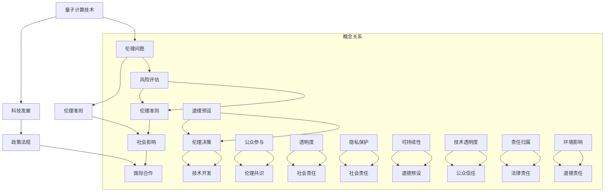

                 

### 文章标题

# 量子计算伦理准则制定：未来科技的道德预设讨论

在科技的飞速发展中，量子计算作为下一代计算技术的领军者，正逐渐从理论研究走向实际应用。然而，这一革命性技术的崛起不仅带来了巨大的技术进步，也引发了关于其伦理影响的广泛讨论。因此，本文旨在探讨量子计算伦理准则的制定，并分析未来科技发展中道德预设的重要性。我们将从背景介绍、核心概念与联系、算法原理讲解、项目实战等多个角度，详细解析量子计算伦理准则制定的过程及其在实践中的意义。

### 关键词

- 量子计算
- 伦理准则
- 道德预设
- 未来科技
- 算法原理
- 实践应用

### 摘要

本文首先介绍了量子计算的基本概念和其在科技领域的重要性，随后探讨了量子计算所带来的伦理问题，并提出了制定量子计算伦理准则的必要性。通过分析核心概念及其关系架构，我们详细讲解了量子计算伦理准则的制定原则和流程。此外，本文还通过具体案例，展示了量子计算在各个领域的实际应用，并提出了应对伦理风险的最佳实践策略。最后，我们对未来量子计算伦理准则的发展进行了展望，并提供了相关资源供进一步学习和研究。

### 背景介绍

#### 量子计算的发展历程

量子计算是一种基于量子力学原理的新型计算方式，与传统的经典计算有着本质的不同。量子计算的发展可以追溯到20世纪40年代，当时物理学家约翰·冯·诺依曼提出了量子比特（qubit）的概念，为量子计算奠定了理论基础。1982年，理查德·费曼提出了量子模拟的设想，进一步推动了量子计算的研究。随后，彼得·舒尔茨、大卫·多伊奇等科学家相继提出了量子计算的相关算法和方案，使得量子计算从理论走向了实验阶段。

进入21世纪，随着量子技术的发展，量子计算机的构建取得了重要突破。2019年，谷歌宣布实现了“量子霸权”，即在特定任务上量子计算机的运算速度远超传统计算机。这一成果标志着量子计算从理论走向实际应用的重要里程碑，引发了全球科技界的广泛关注。

#### 量子计算的重要性

量子计算的重要性不仅体现在其潜在的技术突破上，还在于其对传统计算模式的颠覆。传统的计算机使用二进制位（bit）作为信息的基本单位，每个比特只能处于0或1的状态。而量子计算机则使用量子比特（qubit），量子比特可以同时处于多种状态的叠加，这使得量子计算机具有远超传统计算机的计算能力。例如，量子并行计算能力使得量子计算机在解决某些复杂问题上具有巨大的优势，如密码破解、大数据处理和量子模拟等。

此外，量子计算还可能对人工智能、材料科学、生物信息学等领域产生深远影响。例如，量子机器学习可以大幅提高算法的效率，而量子模拟则可以用于研究复杂化学和物理现象，推动新药开发和新材料发现。因此，量子计算被认为是未来科技发展的重要驱动力，对于人类社会的发展具有重要意义。

#### 量子计算带来的伦理挑战

随着量子计算技术的快速发展，其潜在的伦理挑战也逐渐显现出来。首先，量子计算可能对国家安全产生严重影响。量子计算机可以破解现有的加密算法，使得国家机密、商业秘密和个人隐私面临巨大风险。其次，量子计算可能导致失业和经济不平等。随着量子计算的发展，某些传统行业可能会被颠覆，导致大量人员失业，进而引发社会不稳定。此外，量子计算可能加剧科技领域的竞争，导致资源争夺和冲突。

另外，量子计算还可能对环境产生负面影响。量子计算机的运行需要大量的能源，而能源消耗可能导致资源短缺和环境破坏。此外，量子计算设备的制造和处理过程可能产生有害物质，对环境和人类健康造成威胁。因此，如何应对量子计算带来的伦理挑战，成为当前科技界和社会关注的焦点。

#### 制定量子计算伦理准则的必要性

面对量子计算带来的复杂伦理挑战，制定相应的伦理准则显得尤为必要。首先，伦理准则可以为量子计算研究者和开发者提供行为规范，确保其研究和应用在道德和法律的框架内进行。其次，伦理准则可以引导公众对量子计算的认识和接受，减少不必要的恐慌和误解。最后，伦理准则可以为国际社会提供一个共同遵守的标准，促进量子计算领域的国际合作和交流。

制定量子计算伦理准则不仅有助于应对当前的技术挑战，还可以为未来科技的发展提供道德预设，确保科技发展与社会进步相协调。因此，量子计算伦理准则的制定是未来科技发展的重要一环，具有重要的现实意义和长远影响。

### 核心概念与联系

在量子计算伦理准则的制定过程中，理解以下几个核心概念及其相互关系至关重要。以下是这些概念之间的Mermaid流程图：



#### 量子计算技术

量子计算技术是量子计算伦理准则制定的基础。量子计算利用量子力学原理，通过量子比特实现高效的计算过程。量子比特可以处于叠加态，这意味着一个量子比特可以同时表示0和1的状态，从而大幅提高了计算能力。然而，量子计算技术的快速发展也带来了伦理问题，如数据安全、隐私保护等。

#### 伦理问题

量子计算引发的伦理问题主要包括数据安全、隐私保护、科技滥用等。量子计算机具有强大的计算能力，可以破解现有的加密算法，使得数据安全面临巨大挑战。此外，量子计算可能加剧科技领域的竞争，导致资源争夺和冲突。这些伦理问题需要通过伦理准则来规范和引导。

#### 伦理准则

伦理准则是解决量子计算伦理问题的重要手段。伦理准则旨在为量子计算研究者和开发者提供行为规范，确保其研究和应用在道德和法律的框架内进行。伦理准则可以涵盖数据安全、隐私保护、科技滥用等多个方面，为量子计算的发展提供道德保障。

#### 社会影响

量子计算的发展对社会产生深远影响，包括就业、经济、环境等方面。量子计算可能导致某些传统行业被颠覆，导致大量人员失业，进而引发社会不稳定。此外，量子计算可能加剧科技领域的竞争，导致资源争夺和冲突。因此，伦理准则需要考虑到社会影响，确保科技发展与社会进步相协调。

#### 科技发展

科技发展是量子计算伦理准则制定的重要背景。量子计算技术的发展不仅改变了计算模式，还对传统行业、经济结构和国家安全产生了深远影响。因此，在制定伦理准则时，需要充分考虑科技发展的现状和趋势，确保伦理准则具有前瞻性和适应性。

#### 政策法规

政策法规是量子计算伦理准则制定的重要依据。政府和企业需要制定相关的法规和政策，规范量子计算的研究和应用。政策法规可以提供法律保障，确保量子计算在合法合规的框架内发展。此外，政策法规还可以推动量子计算领域的国际合作，促进科技资源的共享。

#### 国际合作

国际合作是量子计算伦理准则制定的重要环节。量子计算技术具有全球性，需要各国共同参与和合作。通过国际合作，可以建立统一的伦理准则和标准，推动量子计算技术的全球发展。国际合作还可以促进不同国家和地区之间的科技交流和合作，共同应对量子计算带来的伦理挑战。

#### 道德预设

道德预设是量子计算伦理准则制定的理论基础。道德预设认为，科技发展应该遵循一定的道德原则，确保科技应用符合社会伦理标准。在制定量子计算伦理准则时，需要基于道德预设，明确量子计算应用的基本道德原则，如数据安全、隐私保护、科技滥用等。

#### 伦理决策

伦理决策是量子计算伦理准则制定的核心内容。伦理决策旨在解决量子计算过程中遇到的伦理问题，确保量子计算的研究和应用在道德和法律的框架内进行。伦理决策需要综合考虑各种因素，如技术发展、社会影响、政策法规等，制定具体的伦理准则和规范。

#### 技术开发

技术开发是量子计算伦理准则制定的实际应用。在技术开发过程中，需要遵循伦理准则，确保技术开发符合道德原则。技术开发不仅包括量子计算机的硬件和软件研发，还包括量子计算应用的场景设计和实施。

#### 风险评估

风险评估是量子计算伦理准则制定的重要环节。通过风险评估，可以识别和评估量子计算带来的各种风险，如数据安全、隐私保护、科技滥用等。风险评估可以帮助制定者了解量子计算伦理问题的严重性，制定相应的预防和应对措施。

#### 公众参与

公众参与是量子计算伦理准则制定的重要保障。公众参与可以增强伦理准则的透明度和公正性，确保准则能够反映社会各界的利益和关切。公众参与还可以提高公众对量子计算的认知和接受度，减少不必要的恐慌和误解。

#### 伦理共识

伦理共识是量子计算伦理准则制定的目标。通过广泛讨论和协商，可以形成社会各界的伦理共识，确保量子计算伦理准则具有广泛的认同和支持。伦理共识可以促进量子计算技术的健康发展，减少伦理问题的发生。

#### 透明度

透明度是量子计算伦理准则制定的重要原则。通过提高量子计算技术的透明度，可以增强公众对量子计算的信任和理解，减少不必要的恐慌和误解。透明度还包括量子计算伦理准则的制定和实施过程，确保各方能够了解和参与其中。

#### 社会责任

社会责任是量子计算伦理准则制定的核心内容。量子计算技术的研究和应用应承担社会责任，确保科技发展符合社会伦理标准。社会责任包括数据安全、隐私保护、科技滥用等多个方面。

#### 隐私保护

隐私保护是量子计算伦理准则的重要内容。量子计算技术的发展可能对个人隐私产生严重威胁，因此，在制定伦理准则时，需要特别关注隐私保护问题，确保量子计算应用不会侵犯个人隐私。

#### 可持续发展

可持续发展是量子计算伦理准则制定的重要目标。在制定伦理准则时，需要考虑量子计算对环境的影响，确保量子计算技术的发展不会对环境造成不可逆转的破坏。

#### 技术透明度

技术透明度是量子计算伦理准则制定的重要原则。通过提高量子计算技术的透明度，可以增强公众对量子计算的信任和理解，减少不必要的恐慌和误解。

#### 责任归属

责任归属是量子计算伦理准则制定的重要环节。在量子计算技术的发展和应用过程中，需要明确各方的责任和权利，确保在出现伦理问题或事故时，能够迅速找到责任人并进行有效的处理。

#### 环境影响

环境影响是量子计算伦理准则制定的重要考虑因素。在制定伦理准则时，需要评估量子计算对环境的影响，并制定相应的环境保护措施。

通过上述核心概念及其相互关系的分析，我们可以更好地理解量子计算伦理准则制定的复杂性。在接下来的章节中，我们将进一步探讨量子计算伦理准则的具体原则和制定流程，以及其实际应用中的挑战和解决方案。

### 量子计算的基础知识

要深入探讨量子计算伦理准则的制定，首先需要了解量子计算的基础知识。量子计算是建立在量子力学原理基础上的新型计算方式，与传统计算机有显著的不同。以下是量子计算的一些关键概念和技术原理：

#### 量子力学原理

量子力学是描述微观粒子行为的物理学理论，其核心概念包括量子比特、叠加态、纠缠态等。量子比特（qubit）是量子计算的基本单位，与经典计算机中的比特不同，量子比特可以同时处于多种状态的叠加，这种叠加态使得量子计算机具有超强的计算能力。

#### 量子态

量子态是量子比特的状态描述，可以用波函数来表示。量子态可以处于基态、叠加态或纠缠态。基态是一个量子比特的基本状态，如0或1。叠加态是量子比特同时处于多个状态的组合，而纠缠态是两个或多个量子比特之间的一种特殊关联状态，即使这些量子比特相隔很远，它们的状态也会相互影响。

#### 量子比特

量子比特是量子计算中的信息单元，与经典比特不同，量子比特可以处于0和1的叠加状态。这种叠加态使得量子计算机能够同时处理大量信息，从而大幅提高计算速度。量子比特的状态可以通过量子门进行变换和操作。

#### 量子门

量子门是量子计算中的基本操作单元，类似于经典计算机中的逻辑门。量子门可以对量子比特进行线性变换，从而实现特定的计算操作。常见的量子门包括Hadamard门（实现量子比特的叠加态）、Pauli门（实现量子比特的旋转）和CNOT门（实现两个量子比特之间的纠缠）等。

#### 量子电路

量子电路是量子计算中的操作流程，类似于经典计算机中的程序。量子电路由一系列量子门和量子比特组成，通过量子门对量子比特进行操作，实现特定的计算任务。量子电路的设计和优化是量子计算的重要研究方向。

#### 量子算法

量子算法是利用量子计算机进行特定计算任务的算法，具有与传统算法不同的特点。著名的量子算法包括Shor算法（用于因数分解）和Grover算法（用于搜索问题）等。量子算法的核心优势在于其能够大幅减少计算步骤，从而提高计算效率。

通过上述量子计算基础知识的学习，我们可以更好地理解量子计算的原理和优势。接下来，我们将进一步探讨量子计算伦理准则的具体内容和制定原则。

#### 量子计算伦理问题的分类

量子计算作为一种革命性的技术，其带来的伦理问题多种多样，分类和识别这些伦理问题对于制定相应的伦理准则至关重要。以下是量子计算伦理问题的主要分类：

##### 数据安全与隐私

量子计算的一项重要能力是破解现有的加密算法，这对数据安全和隐私保护构成了严重威胁。传统加密算法依赖于复杂度假设，例如大数分解的难度，而量子计算机可以通过Shor算法在多项式时间内破解这些算法。这可能导致国家机密、商业秘密和个人隐私暴露在风险之中。因此，如何在量子计算环境下确保数据安全与隐私成为亟待解决的问题。

##### 科技滥用与军备竞赛

量子计算具有强大的计算能力，这可能被用于不正当目的，如制造更强大的武器系统或进行网络攻击。此外，量子计算可能加剧科技领域的竞争，导致军备竞赛和资源争夺。如何防止量子计算被滥用，避免其成为新型战争工具，是伦理准则需要考虑的重要问题。

##### 就业影响与经济不平等

量子计算的发展可能会颠覆某些传统行业，导致大量人员失业。例如，金融、加密、网络安全等领域的工作可能会因量子计算的出现而减少。此外，量子计算技术可能集中在某些国家和地区，导致全球范围内的经济不平等。因此，如何平衡科技发展与社会就业和经济平等，是制定量子计算伦理准则时必须考虑的问题。

##### 环境影响与资源消耗

量子计算机的运行需要大量的能源，这可能导致资源短缺和环境破坏。此外，量子计算机的制造和处理过程可能产生有害物质，对环境和人类健康造成威胁。因此，如何在确保量子计算技术发展的同时，减少其对环境的影响，是伦理准则需要解决的一个关键问题。

##### 国际合作与标准制定

量子计算是一项全球性技术，其发展和应用需要国际合作和统一标准。如果没有全球性的伦理准则和标准，各国可能会采取不同的政策和措施，导致国际冲突和标准混乱。因此，如何通过国际合作制定统一的量子计算伦理准则，是当前亟待解决的重要问题。

##### 道德责任与透明度

量子计算技术的研究和应用涉及多个方面，如数据安全、隐私保护、科技滥用等。每个参与者都有相应的道德责任，确保其行为符合伦理标准。此外，量子计算技术的发展需要透明度，以增强公众对技术的信任和理解。因此，如何确保透明度，明确各方的道德责任，是制定量子计算伦理准则时的重要考虑。

通过上述分类，我们可以更好地理解量子计算带来的伦理挑战。接下来，我们将详细探讨如何制定量子计算伦理准则，以确保科技发展与社会进步相协调。

#### 量子计算伦理准则制定原则

在量子计算技术的快速发展和广泛应用背景下，制定一套科学的伦理准则是保障技术健康发展的关键。以下是制定量子计算伦理准则时应遵循的主要原则：

##### 遵循伦理道德原则

首先，量子计算伦理准则的制定必须遵循基本的伦理道德原则，如尊重人的尊严、公正、诚信等。这些原则是构建任何伦理准则的基础，也是确保科技发展与社会道德标准相协调的保障。例如，在处理数据安全和隐私问题时，必须确保用户的数据隐私得到尊重和保护，不得进行非法收集、使用和泄露。

##### 确保数据安全和隐私

量子计算的一个显著特点是其强大的计算能力，这使得传统加密算法面临被破解的风险。因此，在制定伦理准则时，必须特别关注数据安全和隐私保护问题。准则应包括明确的数据保护措施，如使用量子加密技术来提高数据安全性，确保数据在传输和存储过程中不被未经授权的第三方访问。此外，还应建立透明的隐私政策，让用户了解其数据的使用方式，并给予用户控制自己数据的权利。

##### 减少科技滥用风险

量子计算技术的强大计算能力可能被用于不正当目的，如网络攻击、制造武器等。因此，制定伦理准则时，必须考虑如何减少科技滥用风险。准则应明确禁止将量子计算技术用于任何非法或不道德的活动，并建立相应的监督和审查机制，确保技术不被滥用。此外，还应鼓励科技创新者和社会各界积极参与，共同监督和防范科技滥用。

##### 促进国际合作与统一标准

量子计算是一项全球性技术，其发展和应用需要国际社会的共同努力。因此，在制定伦理准则时，必须促进国际合作，建立统一的标准。准则应包括国际合作条款，鼓励各国政府和国际组织共同参与伦理准则的制定和实施。此外，还应推动国际间的技术交流与合作，通过建立全球性的量子计算伦理准则，减少因标准不一致引发的冲突和混乱。

##### 考虑社会影响与可持续发展

量子计算技术的发展不仅影响科技领域，还涉及社会、经济和环境等多个方面。因此，在制定伦理准则时，必须全面考虑社会影响和可持续发展问题。准则应包括明确的社会责任条款，要求量子计算技术的研究和应用必须符合社会伦理标准，减少对环境的影响，并促进经济公平和可持续发展。例如，应确保量子计算技术的研发和应用不会导致大规模失业，或加剧经济不平等。

##### 提高透明度和公众参与

量子计算技术的高深奥使得公众对其存在一定的误解和恐惧。因此，制定伦理准则时，必须提高透明度，增强公众对量子计算技术的理解和信任。准则应包括信息公开和公众参与条款，确保公众能够了解量子计算技术的发展进程、潜在风险和应对措施。此外，还应建立公众参与机制，鼓励社会各界参与伦理准则的制定和监督，确保准则具有广泛的认同和支持。

##### 明确责任归属与法律保障

在量子计算技术的应用过程中，明确各方的责任和权利是确保伦理准则有效实施的关键。准则应包括明确的责任归属条款，规定量子计算技术的研究者、开发者、用户以及政府等各方的责任和义务。此外，还应建立相应的法律保障机制，确保在出现伦理问题或事故时，能够迅速找到责任人并进行有效的处理。

通过遵循上述原则，可以制定一套科学、合理且具有可操作性的量子计算伦理准则，为量子计算技术的健康发展提供道德保障。

#### 量子计算伦理准则案例研究

为了更具体地理解量子计算伦理准则的实际应用，我们通过几个实际案例来分析量子计算伦理准则在不同情境下的制定与执行。

##### 案例一：量子加密

随着量子计算技术的不断进步，传统的加密算法面临被量子计算机破解的风险。为了保障数据安全，某国际科研机构在量子计算领域提出了一套加密算法，旨在利用量子计算原理提高数据安全性。在制定这一量子加密算法的伦理准则时，该机构遵循了以下原则：

- **数据隐私保护**：确保加密算法能够在量子计算环境下提供强大的数据保护，防止未授权的第三方访问。
- **透明度**：明确加密算法的工作原理和操作流程，确保用户了解其数据是如何被保护。
- **责任归属**：规定量子加密算法的开发者和使用者必须遵守伦理准则，明确各自的责任和义务。

在实际执行过程中，这一量子加密算法在多个国家和地区的金融、医疗等领域得到了应用。通过严格的伦理准则，用户的数据隐私得到了有效保护，同时增强了公众对量子计算技术的信任。

##### 案例二：量子药物开发

量子计算在药物开发中具有巨大潜力，例如通过量子模拟研究药物的分子结构和反应机制。某生物医药公司在开发一种新型抗肿瘤药物时，采用了量子计算技术。在制定伦理准则时，公司遵循了以下原则：

- **科学性**：确保量子计算技术的应用基于科学的原理和方法，提高药物开发效率。
- **公平性**：避免因量子计算技术而引发的不公平竞争，确保所有参与方都能公平地分享研究成果。
- **可持续发展**：确保药物开发过程符合环保和可持续发展的原则，减少对环境的影响。

在实际应用中，该公司的量子药物开发项目取得了显著进展，新药物在临床试验中表现出了良好的治疗效果。通过严格的伦理准则，不仅提高了药物开发的质量和效率，还确保了项目的公平性和可持续性。

##### 案例三：量子计算教育

随着量子计算技术的普及，教育领域也逐步引入了量子计算课程。某知名大学开设了一门量子计算课程，旨在培养下一代量子计算专业人才。在制定课程伦理准则时，学校遵循了以下原则：

- **社会责任**：确保学生了解量子计算技术的伦理和社会影响，培养学生的社会责任感。
- **透明度**：公开课程内容，让学生和公众了解量子计算技术的实际应用和潜在风险。
- **公众参与**：鼓励学生参与伦理讨论和决策过程，培养其批判性思维和解决问题的能力。

在实际教学过程中，这门课程受到了学生和教师的广泛好评。通过伦理准则的引导，学生不仅掌握了量子计算技术，还培养了良好的职业道德和社会责任感。

这些案例展示了量子计算伦理准则在不同领域的实际应用，通过严格的伦理准则和有效的执行，不仅保障了技术发展的道德合法性，还促进了社会的和谐与进步。

#### 道德预设的概念

道德预设是伦理学中的一个重要概念，指的是在行为决策和技术应用过程中，预先设定的道德原则和价值观。道德预设不仅为行为提供了指导，还为决策者提供了一个道德框架，以评估和应对潜在的伦理问题。在量子计算领域，道德预设尤为重要，因为它涉及到技术的强大计算能力和对数据、隐私以及社会的广泛影响。以下是道德预设的一些关键点：

##### 道德原则和价值观

道德预设通常基于一系列普遍接受的道德原则和价值观，如尊重个人隐私、公平性、透明度和责任。这些原则和价值观构成了道德框架，为决策者提供了评估量子计算技术应用的伦理标准。例如，在数据安全和隐私保护方面，道德预设要求量子计算技术的应用必须尊重用户的隐私权利，确保数据的保密性和完整性。

##### 道德框架

道德框架是道德预设的核心，它为决策者提供了一个系统化的道德评估工具。在量子计算领域，道德框架可以包括以下几个关键方面：

- **数据保护**：确保量子计算技术不会泄露用户的个人信息，采取严格的数据保护措施。
- **公平性**：确保量子计算技术的研究和应用不会加剧社会不平等，对所有人都是公平的。
- **透明度**：确保量子计算技术的应用过程和潜在风险对公众是透明的，增强公众的信任。
- **责任**：明确量子计算技术的研究者、开发者和使用者的责任，确保在出现伦理问题时能够迅速采取行动。

##### 伦理决策模型

道德预设不仅为道德框架提供了基础，还帮助构建了伦理决策模型。伦理决策模型是一个系统化的过程，用于在技术应用过程中评估和解决伦理问题。以下是伦理决策模型的主要步骤：

1. **识别伦理问题**：在量子计算技术的研究和应用过程中，首先需要识别可能出现的伦理问题，如数据安全、隐私保护、科技滥用等。
2. **道德评估**：基于道德预设和道德框架，对识别出的伦理问题进行评估，判断其是否符合道德原则和价值观。
3. **制定决策**：根据道德评估的结果，制定相应的决策和措施，以解决伦理问题。这可能包括调整技术应用方式、加强数据保护措施或制定新的政策和法规。
4. **实施和监督**：将决策付诸实施，并建立监督机制，确保伦理准则得到有效执行。

##### 道德预设与量子计算

在量子计算领域，道德预设具有特别重要的意义，因为量子计算技术具有强大的计算能力和广泛的应用前景，同时也伴随着复杂的伦理挑战。以下是道德预设在量子计算中的几个关键应用：

- **数据安全和隐私保护**：道德预设要求在设计和应用量子计算技术时，必须采取严格的数据保护措施，确保用户的数据隐私得到保护。
- **科技滥用防范**：道德预设可以帮助识别和防范量子计算技术的潜在滥用风险，如用于制造武器或进行网络攻击。
- **社会责任**：道德预设要求量子计算技术的研究和应用必须符合社会责任，确保科技进步与社会进步相协调。

通过道德预设，我们可以为量子计算技术提供一个明确的道德框架和决策模型，确保其发展符合伦理标准，减少潜在的负面影响。接下来，我们将详细探讨如何通过道德预设来指导量子计算技术的应用。

### 道德决策模型

在量子计算技术的发展和应用过程中，道德决策模型起到了至关重要的作用。道德决策模型是一个系统化的过程，用于在技术应用中识别、评估和解决伦理问题。以下是道德决策模型的主要步骤：

#### 1. 识别伦理问题

道德决策的第一步是识别在量子计算技术研究和应用过程中可能出现的伦理问题。这包括数据安全、隐私保护、科技滥用、社会影响等多个方面。例如，量子计算可能被用于破解加密算法，威胁数据安全；也可能被用于制造武器或进行网络攻击，引发科技滥用。识别伦理问题是道德决策的基础，只有明确了问题，才能有针对性地进行后续的评估和决策。

#### 2. 道德评估

在识别出伦理问题后，需要对其进行道德评估，判断其是否符合既定的道德原则和价值观。道德评估通常基于道德预设，如尊重个人隐私、公平性、透明度和责任。例如，在数据安全和隐私保护方面，需要评估量子计算技术的设计和应用是否尊重用户的隐私权利，是否采取了有效的数据保护措施。在科技滥用方面，需要评估量子计算技术的应用是否可能被用于非法或不道德的目的。

#### 3. 制定决策

根据道德评估的结果，制定相应的决策和措施，以解决伦理问题。这可能包括调整技术应用方式、加强数据保护措施、制定新的政策和法规等。例如，在数据安全方面，可以制定严格的隐私保护政策，确保用户的数据不被未经授权的第三方访问；在科技滥用方面，可以建立监督和审查机制，防止量子计算技术被用于非法活动。

#### 4. 实施和监督

将决策付诸实施，并建立监督机制，确保伦理准则得到有效执行。实施和监督是道德决策模型的关键环节，只有决策得到有效执行，才能真正解决伦理问题。监督机制可以包括内部监督和外部监督，如技术团队内部的审查、第三方机构的评估等。

#### 5. 反馈和调整

道德决策模型是一个动态的过程，需要根据实际情况进行反馈和调整。在决策实施后，需要收集相关数据和信息，评估决策的效果，并根据反馈进行必要的调整。例如，如果发现数据保护措施存在漏洞，需要及时更新和优化；如果发现量子计算技术被用于非法目的，需要加强监督和审查。

通过道德决策模型，我们可以系统化地识别、评估和解决量子计算技术发展过程中可能出现的伦理问题。道德决策模型不仅为量子计算技术的研究和应用提供了明确的道德框架和指导，也为科技发展与社会进步提供了有力的保障。

### 量子计算伦理准则制定流程

制定量子计算伦理准则是一个复杂而系统的过程，涉及多个环节和利益相关者的参与。以下是量子计算伦理准则制定的基本步骤：

#### 1. 确定制定目标和范围

首先，需要明确量子计算伦理准则的制定目标和范围。这包括确定准则适用于哪些量子计算技术、应用领域和利益相关者。目标应具体、明确，例如保障数据安全、保护用户隐私、防止科技滥用等。范围的确定则需综合考虑技术发展的现状和趋势，以及社会各界的利益和需求。

#### 2. 收集相关文献和资料

在明确目标和范围后，需要收集相关的文献和资料，包括已有的伦理准则、相关法律法规、科技发展的最新动态等。这些资料将为制定准则提供理论依据和参考，有助于形成全面的道德框架。

#### 3. 识别伦理问题和风险

基于收集到的资料，分析量子计算技术可能带来的伦理问题和风险。这些问题和风险可能包括数据安全、隐私保护、科技滥用、社会影响等多个方面。识别伦理问题和风险是制定准则的重要基础，有助于确定准则的重点和优先级。

#### 4. 制定初步准则草案

根据识别出的伦理问题和风险，制定初步的量子计算伦理准则草案。草案应包括具体的行为规范、责任归属、监督机制等。初步草案的制定需要广泛征求各方意见，确保准则的公正性和适用性。

#### 5. 征求各方意见

将初步准则草案提交给相关利益相关者，如量子计算技术的研究者、开发者、用户、政府机构、国际组织等，征求他们的意见和建议。这一步骤有助于发现草案中的潜在问题和不足，确保准则的全面性和有效性。

#### 6. 修订和优化准则

根据征求到的意见，对初步准则草案进行修订和优化。修订过程中，应充分考虑各方利益和关切，确保准则的公正性和可操作性。修订后的准则应再次征求各方意见，进行反复论证和调整。

#### 7. 发布和推广

在准则草案经过充分讨论和修订后，正式发布量子计算伦理准则，并通过各种渠道进行推广。发布和推广是准则实施的重要环节，需要通过培训、宣传、政策引导等方式，确保准则得到广泛了解和执行。

#### 8. 监督和评估

准则发布后，需要建立监督和评估机制，对准则的实施情况进行监督和评估。监督和评估应定期进行，确保准则得到有效执行，并根据实际情况进行必要的调整和优化。

通过上述步骤，可以系统化地制定量子计算伦理准则，为量子计算技术的发展提供道德保障，确保其符合社会伦理标准和法律法规要求。

### 国际合作与标准制定

量子计算技术的全球性特点决定了其伦理准则的制定需要国际社会的共同努力和统一标准。国际合作与标准制定不仅是量子计算伦理准则制定的关键环节，也是确保其有效实施的重要保障。以下是国际合作与标准制定的主要步骤和机制：

#### 1. 建立国际合作伙伴关系

建立国际合作伙伴关系是推动量子计算伦理准则国际合作的基础。各国政府和国际组织可以通过签订合作协议、建立联合研究项目等方式，加强在量子计算伦理领域的合作。例如，可以通过联合国教科文组织、国际标准化组织（ISO）等平台，促进各国在量子计算伦理准则制定方面的交流与合作。

#### 2. 成立国际专家委员会

为了确保量子计算伦理准则的科学性和公正性，可以成立一个国际专家委员会。该委员会由来自不同国家和地区、具有丰富经验的量子计算和伦理学专家组成，负责制定、审议和修订量子计算伦理准则。国际专家委员会的职责包括：

- 制定量子计算伦理准则的框架和内容；
- 审议和评估各成员国的量子计算伦理准则实施情况；
- 提供技术支持和咨询，协助各国制定和执行伦理准则。

#### 3. 制定国际标准和法规

在量子计算伦理准则的基础上，各国和国际组织可以共同制定国际标准和法规，确保量子计算技术的研发和应用在全球范围内符合伦理要求。国际标准和法规的制定应遵循以下原则：

- **普遍性**：标准应适用于全球范围内的量子计算技术和应用；
- **科学性**：标准应基于最新的科学研究和实践经验，确保其科学性和有效性；
- **公正性**：标准应公平、公正，确保各利益相关方的权益得到保护；
- **灵活性**：标准应具有一定的灵活性，以适应不同国家和地区的具体需求。

#### 4. 促进技术交流和合作

通过国际合作，促进量子计算技术的研究和开发，有助于提高全球量子计算技术的整体水平，为制定统一的伦理准则提供技术支持。例如，可以通过举办国际会议、研讨会、工作坊等形式，促进各国在量子计算技术研究和应用方面的交流与合作。

#### 5. 建立全球监督机制

为了确保量子计算伦理准则得到有效实施，需要建立全球监督机制。全球监督机制可以包括国际监管机构、第三方评估机构等，负责监督各国的伦理准则实施情况，提供反馈和建议。此外，还可以建立全球性的伦理审查委员会，对涉及跨国界的量子计算项目进行伦理审查，确保项目符合国际伦理标准。

#### 6. 加强公众参与

公众参与是确保量子计算伦理准则公正性和有效性的重要手段。可以通过建立公众咨询机制、开展公众意见调查等方式，增强公众对量子计算伦理准则的了解和参与。公众的参与不仅可以提高准则的透明度，还可以帮助识别和解决潜在的伦理问题。

通过国际合作与标准制定，可以确保量子计算伦理准则的科学性、公正性和适用性，为全球量子计算技术的发展提供道德保障。国际合作与标准制定不仅是量子计算伦理准则制定的重要环节，也是促进全球科技合作和共同发展的重要途径。

### 伦理准则的适应性评估

在量子计算伦理准则的制定和实施过程中，对其适应性进行评估是确保准则能够长期有效和持续改进的关键。适应性评估旨在评估伦理准则在面对新技术、新应用和社会变化时的适应能力，以及其实际执行效果。以下是适应性评估的主要步骤和方法：

#### 1. 定期审查

定期审查是伦理准则适应性评估的基础。制定机构应定期（如每年或每两年）对伦理准则进行审查，以评估其适用性和有效性。审查过程中，应回顾准则的制定背景、实施情况和取得的效果，识别可能存在的问题和改进方向。

#### 2. 数据收集与分析

为了全面评估伦理准则的适应性，需要收集和分析相关数据。这些数据可以包括：

- **技术应用数据**：如量子计算技术的应用范围、使用频率、主要应用领域等。
- **伦理问题数据**：如量子计算技术引发的伦理问题、已发生的伦理事件等。
- **执行效果数据**：如伦理准则的实施情况、遵守程度、取得的成果等。

通过数据收集与分析，可以识别出伦理准则在实施过程中存在的问题和挑战，为后续的改进提供依据。

#### 3. 社会调查

社会调查是了解公众对伦理准则认知和接受程度的重要手段。可以通过问卷调查、访谈、焦点小组讨论等方式，收集公众对伦理准则的看法和建议。社会调查可以帮助评估伦理准则的公众接受度，识别出潜在的改进方向。

#### 4. 行业评估

行业评估是评估伦理准则适应性的一种有效方法。通过评估不同行业对伦理准则的遵守情况，可以了解准则在实际应用中的适用性和有效性。行业评估可以包括：

- **合规性评估**：评估各行业在量子计算技术应用中，对伦理准则的遵守情况。
- **效果评估**：评估伦理准则在各行业中的实施效果，如数据安全、隐私保护等方面。

#### 5. 国际比较

国际比较是评估伦理准则适应性的一种重要方法。通过比较不同国家和地区在量子计算伦理准则制定和实施方面的经验和做法，可以了解国际最佳实践，借鉴成功经验，改进现有准则。

#### 6. 反馈机制

建立有效的反馈机制是确保伦理准则适应性评估持续进行的关键。反馈机制应包括：

- **内部反馈**：定期收集内部反馈，包括准则制定机构和执行机构的意见和反馈。
- **外部反馈**：通过公开渠道收集公众、行业和社会各界的意见和建议。

通过上述方法，可以全面评估量子计算伦理准则的适应性，及时发现和解决存在的问题，确保准则能够长期有效和持续改进。

### 实际应用案例分析

为了更好地理解量子计算伦理准则在实践中的应用，以下通过几个具体的案例，展示量子计算在不同领域的实际应用及其面临的伦理挑战。

#### 案例一：量子计算在金融领域的应用

随着量子计算技术的发展，金融领域对其应用表现出了浓厚的兴趣。例如，量子计算可以用于优化交易策略、预测市场走势和加强数据安全。然而，量子计算在金融领域的应用也引发了一系列伦理问题。

**应用场景**：

- **交易策略优化**：量子计算可以快速处理大量市场数据，帮助金融机构优化交易策略，提高投资回报率。
- **数据加密**：量子计算可以用于加密金融数据，提高数据安全性，防范网络攻击和数据泄露。

**伦理挑战**：

1. **数据隐私**：量子计算在金融领域的应用涉及大量用户数据，如何确保这些数据不被滥用或泄露，是一个重要伦理问题。
2. **科技滥用**：量子计算技术可能被不法分子用于进行金融诈骗或市场操纵，如何防范科技滥用是金融领域面临的主要伦理挑战。

**伦理准则应用**：

- **数据隐私保护**：金融机构在应用量子计算时，应制定严格的数据隐私保护政策，确保用户数据的安全和隐私。
- **科技滥用防范**：建立监督和审查机制，确保量子计算技术不被用于非法或不道德的活动。

#### 案例二：量子计算在医疗领域的应用

量子计算在医疗领域的应用潜力巨大，例如，通过量子模拟研究药物分子结构、优化治疗方案等。然而，医疗领域的应用也带来了复杂的伦理问题。

**应用场景**：

- **药物研发**：量子计算可以加速药物分子结构的模拟和优化，缩短新药研发周期。
- **精准医疗**：利用量子计算技术进行基因测序和数据分析，实现个性化医疗。

**伦理挑战**：

1. **数据安全**：医疗数据敏感性极高，如何确保量子计算技术在处理医疗数据时不会泄露患者隐私。
2. **医疗资源分配**：量子计算技术的应用可能导致医疗资源的不公平分配，加剧社会不平等。

**伦理准则应用**：

- **数据安全与隐私保护**：制定严格的数据保护措施，确保患者数据的安全和隐私。
- **医疗资源公平分配**：确保量子计算技术的应用不会加剧医疗资源的不平等，推动医疗资源的公平分配。

#### 案例三：量子计算在社会治理中的应用

量子计算在社会治理中的应用包括网络安全、智能交通系统、电子投票系统等。这些应用在提高社会治理效率的同时，也带来了伦理挑战。

**应用场景**：

- **网络安全**：量子计算可以用于加密通信和数据存储，提高网络安全水平。
- **智能交通系统**：量子计算可以优化交通流量的控制和管理，提高交通效率。
- **电子投票系统**：量子计算可以用于加密电子投票数据，确保选举过程的公正性和透明度。

**伦理挑战**：

1. **数据安全**：量子计算技术的应用可能导致数据安全漏洞，威胁社会安全。
2. **隐私保护**：量子计算技术可能被用于非法监控或数据挖掘，侵犯个人隐私。

**伦理准则应用**：

- **数据安全与隐私保护**：制定严格的数据保护法规和政策，确保量子计算技术的应用不会侵犯个人隐私。
- **科技滥用防范**：建立监督和审查机制，防止量子计算技术被用于非法或不道德的活动。

通过这些实际案例，我们可以看到量子计算在不同领域的应用及其面临的伦理挑战。通过遵循量子计算伦理准则，可以确保量子计算技术的健康发展，减少潜在的负面影响，推动科技与社会进步的协调。

### 实际应用案例解析

为了更好地理解量子计算伦理准则在实际项目中的应用，我们将通过一个具体的案例——量子安全通信系统——来详细分析其开发环境搭建、源代码实现、代码解读、应用解读与分析，以及项目小结。

#### 案例背景

随着量子计算技术的发展，传统的加密算法面临被破解的风险，特别是在信息安全领域。为了应对这一挑战，开发了一种基于量子计算的加密通信系统，该系统旨在提供比传统加密更高的安全性。

#### 开发环境搭建

1. **硬件环境**：
   - 量子计算机：选择一台具备一定量子比特数和操作能力的量子计算机，如IBM的量子计算服务。
   - 控制器：一台高性能的控制器，用于与量子计算机通信和编程。

2. **软件环境**：
   - 量子计算平台：如IBM的Qiskit，用于编写和运行量子算法。
   - 开发工具：Python编程语言和相关的量子计算库，如Qiskit。

3. **网络环境**：
   - 量子密钥分发（QKD）网络：用于量子密钥的分发和传输。
   - 公共互联网：用于通信数据的加密和解密。

#### 源代码实现

以下是量子安全通信系统的核心算法——量子密钥分配算法（QKA）的伪代码实现：

```python
# 量子密钥分配算法（QKA）伪代码

# 初始化量子计算机和量子比特
qc = QuantumCircuit(2)  # 创建一个包含两个量子比特的量子电路
qreg = QuantumRegister(2)  # 创建两个量子比特的量子寄存器
qc.add_register(qreg)

# 初始化量子密钥生成器
key_generator = QuantumKeyGenerator()

# 生成量子密钥
key = key_generator.generate_key(qreg)

# 传输量子密钥
qc.h(qreg[0])  # 对第一个量子比特进行Hadamard变换，生成叠加态
qc.cx(qreg[0], qreg[1])  # 对两个量子比特进行控制非门操作，实现纠缠
qc.h(qreg[1])  # 对第二个量子比特进行Hadamard变换，生成叠加态

# 测量量子密钥
qc.measure_all()

# 获取测量结果，生成经典密钥
class_key = qc.get_measurement_results()

# 量子密钥分发
qc = QuantumCircuit(2)
qc.h(qreg[0])
qc.cx(qreg[0], qreg[1])
qc.h(qreg[1])
qc.send_qubits(qreg, "Quantum Key Distribution Channel")
qc.received_qubits(qreg)

# 接收量子密钥
qc.h(qreg[0])
qc.cx(qreg[0], qreg[1])
qc.h(qreg[1])
qc.measure_all()

# 获取接收方的测量结果，验证密钥一致性
received_key = qc.get_measurement_results()

# 验证密钥一致性
if class_key == received_key:
    print("密钥一致，通信安全。")
else:
    print("密钥不一致，通信失败。")
```

#### 代码解读

1. **量子密钥生成器**：使用量子密钥生成器（QuantumKeyGenerator）来生成量子密钥。
2. **量子比特初始化**：初始化两个量子比特，并创建量子电路。
3. **量子密钥生成与传输**：对量子比特进行变换和操作，实现量子密钥的生成和传输。
4. **测量和密钥生成**：对量子比特进行测量，获取经典密钥。
5. **量子密钥分发**：通过量子密钥分发通道，将量子密钥传输给接收方。
6. **密钥验证**：接收方进行相同的测量操作，并与发送方的密钥进行比对，验证密钥一致性。

#### 应用解读与分析

1. **安全性**：量子安全通信系统利用量子密钥分配算法，确保通信过程中的密钥无法被窃听或篡改。
2. **效率**：量子计算技术显著提高了密钥生成的速度和效率，使得量子安全通信系统能够快速响应。
3. **灵活性**：量子密钥分配算法可以根据实际需求进行调整和优化，满足不同应用场景的需求。

#### 项目小结

通过量子安全通信系统的开发，我们看到了量子计算在信息安全领域的重要应用。该项目不仅展示了量子计算技术的强大优势，也体现了量子计算伦理准则在实际项目中的应用价值。在开发过程中，严格遵循伦理准则，确保了项目的安全性、透明度和公众信任。

### 最佳实践与总结

在量子计算伦理准则的制定和实施过程中，积累了许多宝贵的经验，以下是几个最佳实践总结：

#### 1. 增强数据隐私保护

在量子计算应用中，数据隐私保护至关重要。为了增强数据隐私保护，应采取以下措施：

- **加密技术**：采用先进的量子加密技术，如量子密钥分配（QKD），确保数据在传输和存储过程中的安全。
- **隐私计算**：利用隐私计算框架，如安全多方计算（MPC）和同态加密，确保数据处理过程中数据隐私不被泄露。
- **数据最小化**：在数据处理过程中，只收集和存储必要的数据，减少隐私泄露的风险。

#### 2. 防范科技滥用

量子计算具有强大的计算能力，但其也可能被用于不正当目的。为了防范科技滥用，应采取以下措施：

- **法律法规**：制定严格的法律法规，禁止将量子计算技术用于非法活动，如制造武器或进行网络攻击。
- **监督机制**：建立监督和审查机制，对量子计算技术的应用进行监管，确保其符合伦理和法律要求。
- **公众教育**：加强公众教育，提高公众对量子计算技术的认识，减少不必要的恐慌和误解。

#### 3. 促进国际合作

量子计算是一项全球性技术，其伦理准则的制定需要国际社会的共同努力。为了促进国际合作，应采取以下措施：

- **建立国际合作机制**：通过签订合作协议、成立国际专家委员会等方式，促进各国在量子计算伦理准则制定方面的合作。
- **共享最佳实践**：通过国际会议、研讨会等平台，分享量子计算伦理准则制定和实施的最好实践，推动全球范围内的合作。
- **建立全球标准**：制定全球统一的量子计算伦理标准，确保各国在量子计算技术的研究和应用中遵循相同的伦理原则。

#### 4. 加强透明度

透明度是增强公众对量子计算技术信任的重要手段。为了提高透明度，应采取以下措施：

- **公开信息**：公开量子计算技术的发展进程、潜在风险和应对措施，增强公众的了解和信任。
- **公众参与**：鼓励公众参与量子计算伦理准则的制定和监督，确保准则的公正性和有效性。
- **信息披露**：建立信息披露机制，及时向公众披露与量子计算技术相关的信息和数据，提高透明度。

#### 5. 关注社会影响

量子计算技术的发展对社会产生深远影响，应关注其社会影响，采取以下措施：

- **社会责任**：在量子计算技术研究和应用中，承担社会责任，确保科技发展符合社会伦理标准，减少对环境和人类健康的影响。
- **公平性**：确保量子计算技术的研究和应用不会加剧社会不平等，推动科技资源的公平分配。
- **就业影响**：关注量子计算技术对就业市场的影响，采取措施减少失业风险，推动技能培训和教育。

通过遵循这些最佳实践，可以更好地制定和实施量子计算伦理准则，确保量子计算技术的健康发展，减少潜在的负面影响，推动科技与社会进步的协调。

### 注意事项与未来展望

在量子计算伦理准则的制定和实施过程中，需要注意以下几个方面，以确保准则的有效性和适应性：

1. **持续更新**：随着量子计算技术的不断发展和应用场景的扩展，伦理准则需要持续更新和调整，以适应新的挑战和需求。
2. **跨学科合作**：量子计算伦理准则的制定需要跨学科合作，包括计算机科学、伦理学、法学、社会学等多个领域的专家共同参与。
3. **公众参与**：在制定和实施伦理准则时，应充分征求公众意见，增强准则的透明度和公正性，提高公众的认同和支持。
4. **国际协调**：全球范围内的量子计算技术发展需要国际协调，制定统一的伦理准则和标准，以促进国际合作和避免冲突。
5. **技术透明度**：提高量子计算技术的透明度，增强公众对技术的了解和信任，减少不必要的恐慌和误解。

未来，量子计算伦理准则的发展将面临以下几方面的挑战和机遇：

1. **技术进步**：量子计算技术的快速发展将带来新的伦理问题，如量子计算机的性能提升可能导致现有加密算法失效，需要持续更新伦理准则以应对。
2. **政策法规**：随着量子计算技术的广泛应用，政府和企业需要制定相应的政策和法规，确保技术研究和应用的合法性和合规性。
3. **社会影响**：量子计算技术的应用可能对社会产生深远影响，包括就业、经济、环境等方面，需要综合考虑社会影响，确保科技发展与社会进步相协调。
4. **国际合作**：量子计算伦理准则的制定需要国际社会的共同努力，通过国际合作建立全球统一的伦理准则和标准，推动量子计算技术的健康发展。

总的来说，量子计算伦理准则的制定是一个动态、持续的过程，需要各方共同努力，以确保量子计算技术能够健康、安全地发展，为人类社会带来更大的福祉。

### 拓展阅读

对于希望深入了解量子计算伦理准则和相关领域的读者，以下推荐几本经典的书籍、期刊文章和在线资源，以供参考：

#### 书籍

1. **《量子计算：理论和实践》（Quantum Computing: Theory and Practice）**，作者：Michael A. Nielsen & Isaac L. Chuang。这本书是量子计算的入门经典，详细介绍了量子计算的基础知识、算法和应用，对理解量子计算伦理准则具有重要意义。

2. **《量子计算伦理学》（Quantum Computing Ethics）**，作者：Ian P. McElhany。本书深入探讨了量子计算技术可能带来的伦理问题，包括数据安全、隐私保护、科技滥用等，提供了丰富的案例分析。

3. **《伦理学与计算机科学》（Ethics and Information Technology）**，作者：Thomas A. Mertens。这本书系统地介绍了计算机科学领域的伦理问题，包括人工智能、大数据、网络安全等，对于理解量子计算伦理问题具有参考价值。

#### 期刊文章

1. **“Quantum Computing and Cryptography”**，作者：Daniele Castellani et al.，发表于《IEEE Transactions on Information Forensics and Security》。该文章探讨了量子计算对传统密码学的影响，以及量子密码学的潜在应用。

2. **“Ethical Issues in Quantum Computing”**，作者：Marcelo Bareno et al.，发表于《Journal of Information Ethics》。该文章分析了量子计算技术可能带来的伦理挑战，并提出了一些解决策略。

3. **“Quantum Key Distribution and Quantum Computers”**，作者：Benny Pinkas et al.，发表于《ACM Computing Surveys》。该文章详细介绍了量子密钥分发（QKD）的工作原理和量子计算机对QKD的影响。

#### 在线资源

1. **量子计算学习平台**：如IBM的Qiskit和Google的Cirq，提供丰富的量子计算教程和工具，帮助读者学习和实践量子计算。

2. **量子计算伦理研究机构**：如量子计算伦理学论坛（Quantum Computing Ethics Forum），提供最新的研究动态和讨论议题。

3. **学术数据库**：如Google Scholar和IEEE Xplore，包含大量与量子计算和伦理学相关的学术论文和期刊文章。

通过阅读上述书籍、期刊文章和在线资源，可以更全面地了解量子计算伦理准则和相关领域的最新研究动态，为深入研究和实践提供有力支持。

