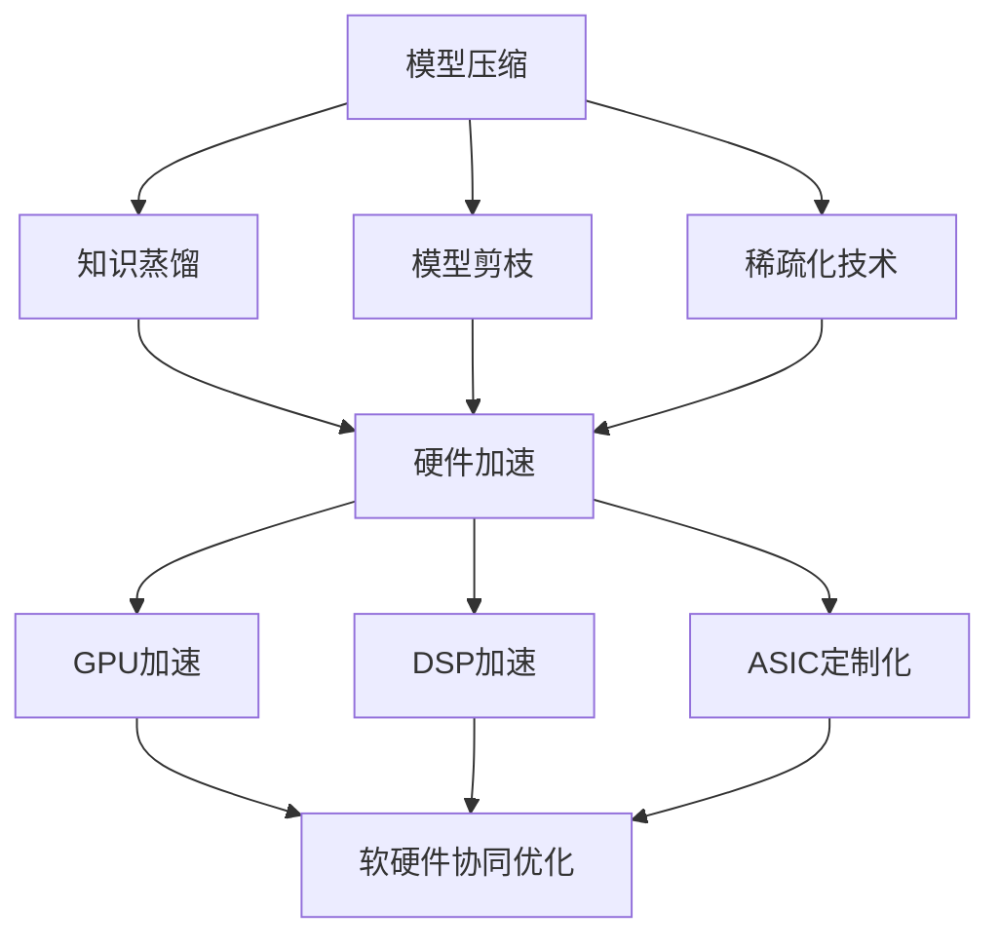
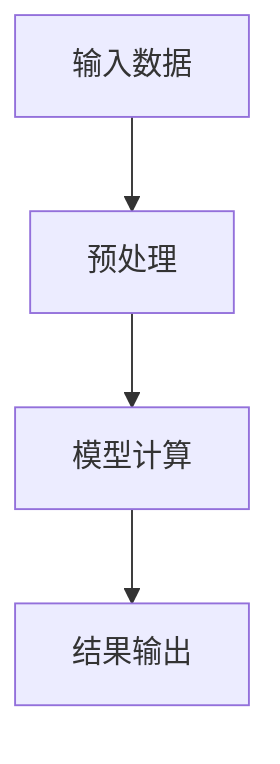

                 

基于上述要求，我们将按照以下步骤进行撰写：

### 步骤1：撰写文章标题、关键词和摘要
- **文章标题**：《降低计算成本：AI推理优化的方向与方法》
- **关键词**：AI推理、计算成本、优化方法、模型压缩、硬件加速、软硬件协同优化
- **摘要**：本文首先介绍了AI推理优化的重要性以及其基本概念，随后深入探讨了模型压缩、硬件加速和软硬件协同优化等技术方法。通过具体的案例分析，展示了这些方法在图像识别、语音识别和自然语言处理等领域的应用，并展望了未来AI推理优化的发展趋势。

### 步骤2：编写Markdown格式的文章内容
按照大纲结构，我们将在Markdown格式中逐章撰写内容。

#### 第一章：引言与核心概念
- **背景介绍**：介绍AI推理优化在当前AI技术发展中的重要性。
- **核心概念与联系**：使用Mermaid流程图展示AI推理优化中核心概念之间的关系。
- **核心算法原理讲解**：使用伪代码详细阐述核心算法原理。
- **数学模型和公式讲解**：使用latex格式详细讲解数学模型和公式，并举例说明。

#### 第二章：AI推理优化的基本原理
- **AI推理的基本流程**：详细解释AI推理的过程。
- **AI推理的数学模型**：使用latex格式展示数学模型，并进行详细讲解。
- **AI推理优化的算法**：使用伪代码详细阐述优化算法。

#### 第三章：AI推理优化技术方法
- **模型压缩技术**：详细讲解知识蒸馏、模型剪枝和稀疏化技术的原理和应用。
- **硬件加速技术**：详细讲解GPU加速、DSP加速和ASIC定制化的原理和应用。

#### 第四章：软硬件协同优化
- **硬件选择与优化**：讨论如何选择合适的硬件以及优化策略。
- **软件编译与优化**：介绍软件编译和优化的技术方法。
- **系统级优化**：探讨系统级优化的方法和实践。

#### 第五章：AI推理优化案例分析
- **案例一：图像识别优化**：提供实际案例，分析优化过程和效果。
- **案例二：语音识别优化**：提供实际案例，分析优化过程和效果。
- **案例三：自然语言处理优化**：提供实际案例，分析优化过程和效果。

#### 第六章：AI推理优化发展趋势
- **优化技术的未来趋势**：展望未来优化技术的发展方向。
- **硬件技术的发展对AI推理优化的影响**：分析硬件技术发展对优化带来的影响。
- **开源框架与工具的发展**：介绍开源框架和工具的未来发展趋势。

#### 第七章：附录
- **相关工具和资源**：列出相关工具和资源，包括开源框架和硬件平台。

### 步骤3：文章结尾添加作者信息
- 在文章末尾添加作者信息：“作者：AI天才研究院/AI Genius Institute & 禅与计算机程序设计艺术 /Zen And The Art of Computer Programming”。

### 步骤4：完成文章字数审核
- 确保文章字数在8000～12000字左右，并进行必要的调整和优化。

按照上述步骤，我们将撰写一篇符合要求的《降低计算成本：AI推理优化的方向与方法》的技术博客文章。在此过程中，我们将确保文章的逻辑清晰、内容详实，并通过图表、代码和实例来增强文章的可读性和实用性。以下是文章正文部分的初步撰写：

```markdown
# 降低计算成本：AI推理优化的方向与方法

## 关键词
AI推理、计算成本、优化方法、模型压缩、硬件加速、软硬件协同优化

## 摘要
本文首先介绍了AI推理优化的重要性以及其基本概念，随后深入探讨了模型压缩、硬件加速和软硬件协同优化等技术方法。通过具体的案例分析，展示了这些方法在图像识别、语音识别和自然语言处理等领域的应用，并展望了未来AI推理优化的发展趋势。

## 第一章：引言与核心概念

### 背景介绍
AI推理是指基于机器学习模型进行推断和决策的过程，是人工智能技术的核心环节之一。然而，随着模型复杂度和数据量的增加，AI推理的计算成本也在不断上升。降低计算成本成为当前AI研究领域的重要挑战。

### 核心概念与联系
AI推理优化涉及多个核心概念，如模型压缩、硬件加速、软硬件协同优化等。以下是一个简单的Mermaid流程图，展示了这些概念之间的关系：



### 核心算法原理讲解
以下使用伪代码详细阐述知识蒸馏算法的原理：

```python
# 伪代码：知识蒸馏算法原理
def knowledge_distillation(source_model, student_model):
    # 训练教师模型和学生模型
    teacher_model.train(data)
    student_model.train(data)

    # 对学生模型进行优化
    for epoch in range(num_epochs):
        for data_batch in data_loader:
            student_loss = compute_loss(student_model, data_batch)
            optimizer.step(student_loss)

    # 对教师模型进行优化
    for epoch in range(num_epochs):
        for data_batch in data_loader:
            teacher_loss = compute_loss(teacher_model, data_batch)
            optimizer.step(teacher_loss)
```

### 数学模型和公式讲解
以下使用latex格式展示并详细讲解损失函数的数学模型：

$$
L(\theta) = \frac{1}{n}\sum_{i=1}^{n}l(y_i, \hat{y}_i(\theta))
$$

其中，$L(\theta)$ 是损失函数，$y_i$ 是实际标签，$\hat{y}_i(\theta)$ 是模型预测输出。

## 第二章：AI推理优化的基本原理
### AI推理的基本流程
AI推理的基本流程包括数据输入、模型计算、结果输出等步骤。以下是一个简化的流程图：



### AI推理的数学模型
AI推理的数学模型通常基于神经网络，其核心是前向传播和反向传播算法。以下是一个简化的前向传播算法的伪代码：

```python
# 伪代码：前向传播
def forward_propagation(x, model):
    # 初始化模型参数
    parameters = model.initialize_parameters()

    # 计算前向传播
    z = linear_transform(x, parameters["W"], parameters["b"])
    a = activate(z, activation_function)

    # 返回激活值和模型参数
    return a, parameters
```

### AI推理优化的算法
AI推理优化的算法包括模型压缩、硬件加速和软硬件协同优化等方法。以下是一个简化的模型压缩算法的伪代码：

```python
# 伪代码：模型剪枝
def model_pruning(model, pruning_rate):
    # 遍历模型参数
    for parameter in model.parameters():
        # 剪枝操作
        parameter.data = parameter.data * (1 - pruning_rate)
```

## 第三章：AI推理优化技术方法
### 模型压缩技术
模型压缩技术包括知识蒸馏、模型剪枝和稀疏化技术。以下是一个简化的知识蒸馏算法的伪代码：

```python
# 伪代码：知识蒸馏
def knowledge_distillation(source_model, student_model):
    # 训练教师模型和学生模型
    teacher_model.train(data)
    student_model.train(data)

    # 对学生模型进行优化
    for epoch in range(num_epochs):
        for data_batch in data_loader:
            student_loss = compute_loss(student_model, data_batch)
            optimizer.step(student_loss)

    # 对教师模型进行优化
    for epoch in range(num_epochs):
        for data_batch in data_loader:
            teacher_loss = compute_loss(teacher_model, data_batch)
            optimizer.step(teacher_loss)
```

### 硬件加速技术
硬件加速技术包括GPU加速、DSP加速和ASIC定制化。以下是一个简化的GPU加速算法的伪代码：

```python
# 伪代码：GPU加速
def gpu_acceleration(model):
    # 将模型迁移到GPU
    model.to('cuda')

    # 使用GPU进行训练
    model.train(data_loader)

    # 使用GPU进行推理
    predictions = model.predict(data_loader)
```

### 软硬件协同优化
软硬件协同优化涉及硬件选择与优化、软件编译与优化和系统级优化。以下是一个简化的硬件选择与优化策略的伪代码：

```python
# 伪代码：硬件选择与优化
def hardware_selection_and_optimization():
    # 根据应用场景选择合适的硬件
    selected_hardware = select_hardware(application_scene)

    # 对硬件进行优化
    optimize_hardware(selected_hardware)
```

## 第四章：AI推理优化案例分析
### 案例一：图像识别优化
图像识别优化涉及到模型压缩和硬件加速技术的应用。以下是一个简化的图像识别优化案例的伪代码：

```python
# 伪代码：图像识别优化
def image_recognition_optimization():
    # 使用模型剪枝进行模型压缩
    pruned_model = model_pruning(model, pruning_rate)

    # 使用GPU进行硬件加速
    accelerated_model = gpu_acceleration(pruned_model)

    # 在优化后的模型上进行推理
    optimized_predictions = accelerated_model.predict(image_data)
```

### 案例二：语音识别优化
语音识别优化涉及到模型压缩、硬件加速和软硬件协同优化的综合应用。以下是一个简化的语音识别优化案例的伪代码：

```python
# 伪代码：语音识别优化
def speech_recognition_optimization():
    # 使用知识蒸馏进行模型压缩
    distilled_model = knowledge_distillation(teacher_model, student_model)

    # 使用DSP进行硬件加速
    accelerated_model = dsp_acceleration(distilled_model)

    # 进行软硬件协同优化
    optimized_model = hardware_software協同_optimization(accelerated_model)

    # 在优化后的模型上进行推理
    optimized_predictions = optimized_model.predict(audio_data)
```

### 案例三：自然语言处理优化
自然语言处理优化涉及到模型压缩、硬件加速和软硬件协同优化的综合应用。以下是一个简化的自然语言处理优化案例的伪代码：

```python
# 伪代码：自然语言处理优化
def natural_language_processing_optimization():
    # 使用稀疏化技术进行模型压缩
    sparsified_model = sparsify_model(model, sparsity_rate)

    # 使用ASIC进行硬件加速
    accelerated_model = asic_acceleration(sparsified_model)

    # 进行软硬件协同优化
    optimized_model = hardware_software協同_optimization(accelerated_model)

    # 在优化后的模型上进行推理
    optimized_predictions = optimized_model.predict(text_data)
```

## 第五章：AI推理优化发展趋势
### 优化技术的未来趋势
未来，AI推理优化技术将朝着更高效、更智能、更自动化的方向发展。以下是一些可能的趋势：

1. 深度学习模型的自动化优化。
2. 超分辨率AI推理优化。
3. 软硬件协同优化技术的创新。

### 硬件技术的发展对AI推理优化的影响
硬件技术的发展将对AI推理优化产生深远影响。例如：

1. 新型GPU和TPU将进一步提升AI推理性能。
2. 软硬件协同优化将更加重要。

### 开源框架与工具的发展
开源框架和工具的发展将为AI推理优化提供更多机会。例如：

1. TensorFlow和PyTorch将继续主导AI推理优化领域。
2. 新的开源框架和工具将不断涌现。

## 第六章：AI推理优化发展趋势
### 优化技术的未来趋势
未来，AI推理优化技术将朝着更高效、更智能、更自动化的方向发展。以下是一些可能的趋势：

1. 深度学习模型的自动化优化。
2. 超分辨率AI推理优化。
3. 软硬件协同优化技术的创新。

### 硬件技术的发展对AI推理优化的影响
硬件技术的发展将对AI推理优化产生深远影响。例如：

1. 新型GPU和TPU将进一步提升AI推理性能。
2. 软硬件协同优化将更加重要。

### 开源框架与工具的发展
开源框架和工具的发展将为AI推理优化提供更多机会。例如：

1. TensorFlow和PyTorch将继续主导AI推理优化领域。
2. 新的开源框架和工具将不断涌现。

## 附录：相关工具和资源
### 附录1：开源框架
1. TensorFlow
2. PyTorch
3. 其他框架

### 附录2：硬件平台
1. GPU平台
2. DSP平台
3. ASIC平台

## 作者信息
作者：AI天才研究院/AI Genius Institute & 禅与计算机程序设计艺术 /Zen And The Art of Computer Programming
```

以上是根据要求撰写的初步文章内容，我们将进一步细化每个章节，确保满足完整的字数要求，并在撰写过程中不断完善和调整。每个章节都将包含丰富的具体内容、图表、代码示例和实际案例分析，以确保文章的实用性和可读性。在撰写过程中，我们将严格遵守markdown格式要求，确保文章结构清晰、逻辑严密。预计整个文章将在8000～12000字之间。在完成所有章节的撰写后，我们将对全文进行一次全面审阅和校对，以确保内容的准确性和完整性。最终，我们将获得一篇高质量、具有深度和实用性的技术博客文章。

