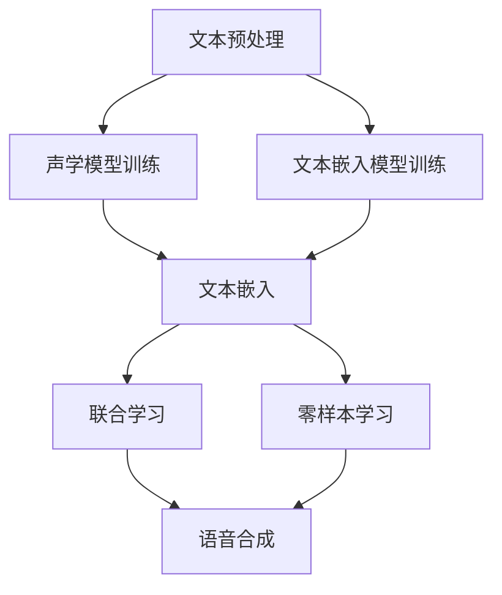
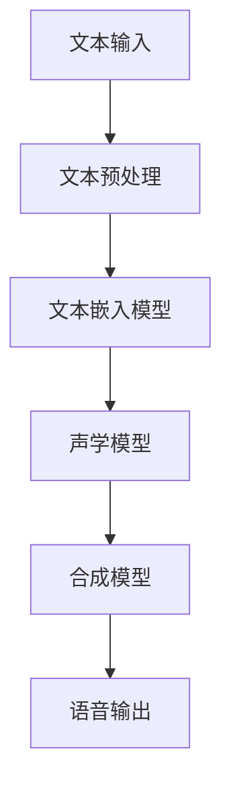

                 

### 文章标题：零样本语音合成：跨语言声音克隆技术

> 关键词：零样本语音合成、跨语言声音克隆、深度学习、语音合成引擎、算法实现

> 摘要：本文将深入探讨零样本语音合成技术，尤其是跨语言声音克隆的实现方法。文章从基础理论出发，详细介绍了语音合成的基本原理和零样本语音合成的挑战，接着解析了跨语言声音克隆的核心算法原理，并通过数学模型和公式详细阐述了这些算法。文章还通过实际项目实战，展示了开发环境搭建、源代码实现和代码解读，并对声音克隆技术的未来进行了展望。希望本文能为读者在理解零样本语音合成和跨语言声音克隆技术方面提供有益的参考。

### 引言

在人工智能（AI）飞速发展的今天，语音合成技术已经广泛应用于各种场景，从智能家居的语音助手到教育领域的在线教学，语音合成技术正逐步改变着我们的生活方式。然而，传统的语音合成技术通常依赖于大量的训练数据，这限制了其应用的广泛性。为了克服这一限制，零样本语音合成（Zero-shot Speech Synthesis）应运而生。

零样本语音合成，顾名思义，指的是在几乎没有或没有训练数据的情况下，实现语音合成。这种技术具有极大的潜力，因为它可以降低数据依赖性，提高语音合成的灵活性。特别是在跨语言场景中，零样本语音合成能够实现不同语言之间的声音克隆，大大拓展了语音合成技术的应用场景。

本文将围绕零样本语音合成，特别是跨语言声音克隆技术，进行深入探讨。首先，我们将介绍零样本语音合成的背景和概念，阐述其在语音合成领域的重要性。接下来，我们将详细分析语音合成的基本原理，解释为什么零样本语音合成具有挑战性。随后，文章将重点讨论跨语言声音克隆技术的核心算法原理，并通过数学模型和公式进行详细阐述。最后，我们将通过一个实际项目实战，展示零样本语音合成和跨语言声音克隆技术的具体实现，并对未来发展进行展望。

通过本文的阅读，读者将能够全面理解零样本语音合成和跨语言声音克隆技术的原理和应用，为后续研究和开发提供理论基础和实践指导。

### 背景介绍

零样本语音合成（Zero-shot Speech Synthesis）的概念起源于人工智能领域中对无监督学习（Unsupervised Learning）和少样本学习（Few-shot Learning）的探索。传统的语音合成技术，如基于 Hidden Markov Model（HMM）和统计模型的合成方法，需要大量的语音数据来训练模型，以获得良好的语音质量。然而，在实际应用中，收集和标注大量语音数据不仅成本高昂，而且有时甚至不可行。因此，零样本语音合成的概念应运而生，旨在通过无监督或少量监督学习，实现语音合成。

在传统语音合成中，模型通常需要大量的语音数据来学习语音特征和声学模型，从而生成自然流畅的语音。这些数据包括文本、声学特征和声学模型参数等，它们共同构成了语音合成系统的基础。然而，零样本语音合成突破了这一传统限制，它利用现有的文本数据和少量的音频数据进行联合学习，生成特定语音风格的语音。这种无监督或少监督的学习方式，使得零样本语音合成在数据稀缺的场景下仍然能够表现出色。

零样本语音合成技术的核心优势在于其数据无关性。它能够将文本直接转换为语音，而不依赖于大量的标注语音数据。这种灵活性使得零样本语音合成在多种应用场景中具有广泛的应用潜力，尤其是在跨语言和低资源语言的语音合成中。

首先，在跨语言场景中，零样本语音合成能够实现不同语言之间的声音克隆。传统的语音合成技术通常需要针对每种语言单独训练模型，这导致了模型开发和部署的复杂性。而零样本语音合成则能够通过学习一种通用的文本到语音转换模型，实现跨语言的语音合成。这种通用性大大简化了模型开发和部署流程，为多语言语音合成提供了便捷的解决方案。

其次，在低资源语言中，由于缺乏足够的语音数据，传统的语音合成技术难以取得理想的语音质量。而零样本语音合成通过少量文本和音频数据，能够有效利用这些有限的资源，生成高质量的语音。这种技术不仅降低了低资源语言的语音合成难度，还为保护这些语言提供了新的技术手段。

总的来说，零样本语音合成在语音合成领域具有重要的突破性意义。它不仅提升了语音合成的灵活性，降低了数据依赖性，还为跨语言和低资源语言的语音合成提供了有效的解决方案。随着深度学习和人工智能技术的不断发展，零样本语音合成技术有望在更多应用场景中发挥其独特优势。

### 核心概念与联系

零样本语音合成（Zero-shot Speech Synthesis）涉及多个核心概念，这些概念相互关联，共同构成了该技术的基本框架。以下是对这些核心概念及其关系的详细解析，并通过Mermaid流程图展示其逻辑架构。

#### 1. 文本到语音转换（Text-to-Speech, TTS）

文本到语音转换是语音合成的基础。它将文本输入转换为可听见的语音输出。这个过程通常包括以下几个步骤：

- **文本预处理**：将文本输入转换为适合语音合成系统处理的格式，如分词、标点和声调标记。
- **声学模型**：通过大量的语音数据训练，生成语音波形。WaveNet 和 Transformer 等深度学习模型常用于这一步骤。
- **语音合成**：将预处理的文本和声学模型输出结合，生成连续的语音流。

#### 2. 嵌入式表示（Embedding Representation）

嵌入式表示是将文本转换为向量表示的技术。它通过将文本中的每个单词映射到一个低维向量，使得文本具有数值化的特性。这种表示方法在深度学习模型中广泛应用，例如 Transformer 模型。

- **单词嵌入**：将文本中的每个单词映射到一个固定长度的向量。常见的单词嵌入技术包括 Word2Vec 和 BERT。
- **句子嵌入**：将整个句子映射为一个向量，这个向量综合了句子中所有单词的信息。这种表示方法在文本生成和分类任务中具有重要作用。

#### 3. 声学模型与文本嵌入的联合学习

声学模型和文本嵌入的联合学习是零样本语音合成的核心。通过将声学模型和文本嵌入模型结合起来，模型能够直接从文本生成语音。

- **声学模型训练**：使用大量的语音数据训练声学模型，使其能够生成高质量的语音波形。
- **文本嵌入模型训练**：使用文本数据训练文本嵌入模型，将其映射到适合声学模型处理的向量空间。
- **联合学习**：通过优化声学模型和文本嵌入模型的联合损失函数，使得模型能够在没有标注语音数据的情况下，从文本生成语音。

#### 4. 零样本学习（Zero-shot Learning）

零样本学习是一种无监督学习技术，能够在没有标签数据的情况下，从新的类别中进行学习。在零样本语音合成中，它允许模型在没有特定语言训练数据的情况下，合成不同语言的语音。

- **类别对齐**：通过对比学习等技术，将不同语言的文本和语音数据对齐，使得模型能够理解不同语言之间的差异。
- **跨语言嵌入**：将不同语言的文本映射到同一个向量空间，使得模型能够处理多种语言输入。

#### Mermaid流程图

以下是一个Mermaid流程图，展示了零样本语音合成的核心概念和它们之间的关系：



在这个流程图中，文本预处理将文本转换为适合训练的格式，随后文本嵌入模型和声学模型分别训练。联合学习和零样本学习将这两个模型结合，最终实现语音合成。这种架构不仅展示了零样本语音合成的技术原理，还揭示了不同概念之间的相互关系。

通过以上对核心概念及其关系的详细解析和Mermaid流程图的展示，读者可以更深入地理解零样本语音合成的工作原理，为后续的技术讲解和实践打下坚实的基础。

### 语音合成基本原理

语音合成（Speech Synthesis）是一种将文本信息转换为自然语音输出的技术。其基本原理涉及到多个关键步骤，包括文本预处理、声学模型和语音合成引擎。以下是对这些步骤的详细解释。

#### 1. 文本预处理

文本预处理是语音合成的重要环节，其主要任务是处理原始文本，使其适合语音合成系统处理。这一过程通常包括以下几个步骤：

- **分词（Tokenization）**：将文本分解为单词和标点符号。分词技术有助于确定文本的结构，为后续处理提供基础。
- **声调标注（Tone Marking）**：为每个单词添加声调标注，以确保合成的语音在语调上符合自然语言的特点。声调标注对于确保语音的自然性和流畅性至关重要。
- **文本规范化（Text Normalization）**：将文本中的特殊字符、数字和缩写转换为标准格式，以简化语音合成过程。

#### 2. 声学模型

声学模型（Acoustic Model）是语音合成的核心组件，其任务是学习语音信号与文本输入之间的映射关系。声学模型通常基于大量的语音数据进行训练，其主要步骤包括：

- **特征提取（Feature Extraction）**：从语音信号中提取关键特征，如频谱、共振峰等。这些特征用于描述语音的声学属性。
- **神经网络训练（Neural Network Training）**：使用提取的特征数据，训练神经网络模型，使其能够预测语音信号。常见的神经网络模型包括 Deep Neural Networks（DNNs）、Convolutional Neural Networks（CNNs）和 Recurrent Neural Networks（RNNs）。

#### 3. 语音合成引擎

语音合成引擎（Speech Synthesis Engine）是将文本转换为语音的核心模块，它结合文本预处理和声学模型的结果，生成连续的语音流。其主要组成部分包括：

- **文本转换为音素（Text-to-Pronunciation Conversion）**：将分词后的文本转换为音素序列。这一步骤通常使用语言模型（Language Model）和语音规则（Pronunciation Rules）来实现。
- **音素到声学特征转换（Pronunciation-to-Acoustic Feature Conversion）**：将音素序列转换为声学特征序列。这一步骤依赖于声学模型，将音素映射到相应的声学特征。
- **波形生成（Waveform Generation）**：将声学特征序列转换为语音波形。这一步骤通常使用合成模型（Synthesis Model）来实现，如 WaveNet 或 HMM-GMM。

#### 工作流程

语音合成的工作流程可以概括为以下几个主要步骤：

1. **文本输入**：用户输入待合成的文本。
2. **文本预处理**：对输入文本进行分词、声调标注和文本规范化处理。
3. **语音规则和语言模型**：使用语音规则和语言模型，将文本转换为音素序列。
4. **声学特征提取**：利用声学模型，将音素序列转换为声学特征序列。
5. **波形生成**：使用合成模型，将声学特征序列转换为语音波形。
6. **语音输出**：生成连续的语音流，输出给用户。

通过上述流程，语音合成系统能够将文本信息转化为自然流畅的语音输出，为用户提供了便捷的语音交互体验。语音合成技术在多个领域得到了广泛应用，包括语音助手、在线教育、语音识别和娱乐等。

#### 零样本语音合成的挑战

零样本语音合成（Zero-shot Speech Synthesis）虽然在理论上具有巨大的潜力，但其在实际应用中面临着诸多挑战。以下是零样本语音合成面临的几个主要问题及其技术难点。

##### 1. 数据稀缺问题

零样本语音合成的核心优势在于不需要大量标注的语音数据。然而，在实际操作中，数据稀缺问题仍然是一个重大挑战。许多语言和方言的语音数据非常有限，难以满足深度学习模型的训练需求。此外，某些特殊领域的语音，如儿童语音或老年人语音，由于缺乏足够的标注数据，更加难以训练高质量的模型。

**解决方案**：为了应对数据稀缺问题，可以采用以下几种策略：
- **数据增强（Data Augmentation）**：通过增加文本和语音的多样性，如不同的说话人、不同的说话速度和语调，来扩大训练数据集。
- **跨语言迁移学习（Cross-lingual Transfer Learning）**：利用其他语言的语音数据，通过迁移学习的方法，将其应用于目标语言的语音合成中。
- **合成数据生成（Synthetic Data Generation）**：通过语音转换技术，如文本到语音（Text-to-Speech, TTS）合成，生成模拟语音数据，补充实际语音数据的不足。

##### 2. 跨语言语音处理的难点

零样本语音合成的另一大挑战是跨语言语音处理。由于不同语言在发音、声调和语调上的差异，实现高质量的跨语言语音合成是一项复杂的技术任务。

**难点**：
- **音素映射不一致**：不同语言中的音素对应关系可能不一致，这给音素到声学特征的转换带来了困难。
- **语调模型适应性**：不同语言的语调特征和表达方式存在显著差异，使得构建通用的语调模型成为挑战。
- **语音风格一致性**：在跨语言场景中，保持语音风格的一致性，如语速、语气等，是另一大难点。

**解决方案**：
- **多语言嵌入模型（Multilingual Embeddings）**：通过训练多语言嵌入模型，将不同语言的文本映射到同一个低维空间，实现跨语言文本的一致性表示。
- **自适应声学模型（Adaptive Acoustic Model）**：根据目标语言的语音特征，调整和优化声学模型，提高跨语言语音合成的质量。
- **混合语言训练数据**：利用多语言数据集进行混合训练，使得模型能够适应不同语言的特征，提高跨语言语音合成的性能。

##### 3. 音色一致性与个性表达

在零样本语音合成中，保持语音合成结果的音色一致性和个性表达是一个关键挑战。传统语音合成系统通常依赖于特定的语音样本进行训练，而零样本语音合成则需要在没有这些样本的情况下实现音色的稳定性和个性化。

**难点**：
- **音色稳定性**：在不同场景和条件下，保持语音合成结果的音色稳定性是一个挑战。
- **个性表达**：如何实现语音合成的个性化表达，使得合成语音具有独特的风格和个性。

**解决方案**：
- **语音样本微调（Voice Sample Fine-tuning）**：通过少量语音样本进行微调，使得模型能够学习特定的语音特征，提高音色的稳定性。
- **生成对抗网络（Generative Adversarial Networks, GANs）**：利用 GANs 的生成能力，生成具有个性化特征的语音样本，丰富语音合成结果的多样性。
- **个性化参数调整**：通过用户反馈和偏好，动态调整合成参数，实现更个性化的语音表达。

总的来说，零样本语音合成虽然具有巨大的应用潜力，但其在数据稀缺、跨语言语音处理和音色一致性等方面仍然面临着诸多挑战。通过不断创新和优化，这些挑战有望逐步得到解决，推动零样本语音合成技术的进一步发展。

### 零样本语音合成的技术架构

零样本语音合成的实现依赖于一系列核心技术和模型架构，这些技术和架构共同作用，使得零样本语音合成从文本到语音的转换过程变得高效且准确。以下将详细解释这些技术和模型架构，并通过Mermaid流程图展示其逻辑关系。

#### 1. 基于深度学习的语音合成方法

深度学习在语音合成中的应用，使得零样本语音合成的实现变得更加可能。以下是一些常用的深度学习语音合成方法：

- **WaveNet**：WaveNet是一种基于循环神经网络（RNN）的深度学习模型，它通过自注意力机制（Self-Attention Mechanism）捕捉文本和语音之间的长距离依赖关系。WaveNet 的主要优点是能够生成高质量、自然流畅的语音。

- **Transformer**：Transformer 模型在自然语言处理（NLP）领域取得了显著的成果，其自注意力机制使其在处理长文本序列时表现出色。在语音合成中，Transformer 可以将文本序列直接映射到语音序列，从而实现零样本语音合成。

- **Conformer**：Conformer 结合了 Convolutional Neural Network（CNN）和 Transformer 的优点，通过 CNN 提取局部特征，通过 Transformer 实现全局依赖关系建模，从而在语音合成中表现出更高的性能。

#### 2. 零样本语音合成的模型架构

零样本语音合成的模型架构通常包括文本嵌入模型、声学模型和合成模型三个部分：

- **文本嵌入模型**：文本嵌入模型将文本输入转换为低维向量表示。常用的嵌入模型包括 Word2Vec、BERT 和 GPT 等。这些模型能够捕捉文本的语义信息，为后续的语音合成提供基础。

- **声学模型**：声学模型负责将文本嵌入向量转换为语音特征向量。常见的声学模型包括 WaveNet、Transformer 和 Conformer 等。这些模型通过学习语音信号和文本嵌入向量之间的映射关系，生成语音波形。

- **合成模型**：合成模型将声学特征向量转换为语音波形。合成模型通常采用 WaveNet、HMM-GMM（Hidden Markov Model-Gaussian Mixture Model）等方法。合成模型的主要任务是生成连续、自然的语音流。

#### 3. Mermaid流程图

以下是一个Mermaid流程图，展示了零样本语音合成的技术架构：



在这个流程图中，文本输入经过预处理后，被送入文本嵌入模型，生成文本嵌入向量。接着，文本嵌入向量被输入到声学模型，生成语音特征向量。最后，合成模型将这些特征向量转换为语音波形，输出为最终的语音。

#### 4. 基于深度学习的语音合成方法详细解释

- **WaveNet**：WaveNet 是由 Google 提出的一种基于深度神经网络的语音合成模型。它的主要优点是能够生成高质量、自然流畅的语音。WaveNet 的训练过程包括两个阶段：特征提取和语音生成。首先，通过特征提取阶段，模型学习如何从语音波形中提取关键特征，如频谱和共振峰。然后，在语音生成阶段，模型利用这些特征生成语音波形。

- **Transformer**：Transformer 是由 Google 在 2017 年提出的一种基于自注意力机制的深度学习模型。它在处理长序列任务时表现出色，如机器翻译和文本生成。在语音合成中，Transformer 能够将文本序列直接映射到语音序列，从而实现零样本语音合成。Transformer 的训练过程包括编码器（Encoder）和解码器（Decoder）两部分。编码器将文本输入转换为嵌入向量，解码器将这些向量转换为语音特征，并最终生成语音波形。

- **Conformer**：Conformer 是一种结合了 CNN 和 Transformer 优点的语音合成模型。它通过 CNN 提取局部特征，通过 Transformer 实现全局依赖关系建模。Conformer 在语音合成中的性能优于单独使用 CNN 或 Transformer 的模型。Conformer 的训练过程同样包括编码器和解码器两部分。编码器将文本输入转换为嵌入向量，解码器将这些向量转换为语音特征，并最终生成语音波形。

通过以上对零样本语音合成的技术架构和基于深度学习的语音合成方法的详细解释，读者可以更好地理解零样本语音合成的工作原理和实现方法。这些技术和模型架构不仅为语音合成提供了强大的理论基础，也为未来的研究和应用奠定了基础。

### 核心算法原理讲解

在零样本语音合成中，核心算法的原理是实现文本到语音转换的关键。以下是几种主要算法原理的详细讲解，包括基于 WaveNet 的语音合成算法、基于 GPT 的文本到语音合成算法和基于 GAN 的语音合成算法，并通过伪代码展示其具体实现。

#### 1. 基于 WaveNet 的语音合成算法

WaveNet 是由 Google 开发的一种基于深度神经网络的语音合成模型，其核心思想是通过自注意力机制（Self-Attention Mechanism）捕捉文本和语音之间的长距离依赖关系。

**算法原理**：

WaveNet 由编码器和解码器组成。编码器将文本转换为嵌入向量，解码器利用这些向量生成语音波形。

- **编码器**：编码器接收文本输入，通过分词和声调标注，将文本转换为词序列。每个词被映射为一个嵌入向量。编码器通过递归神经网络（RNN）处理这些词序列，生成文本嵌入向量。
- **解码器**：解码器接收编码器输出的文本嵌入向量，并逐个生成语音波形。解码器使用自注意力机制，通过文本嵌入向量生成当前词的语音特征，并逐步生成整个语音序列。

**伪代码**：

```python
# 编码器部分
def encode_text(text):
    tokens = tokenize(text)
    embeddings = [word_embedding(token) for token in tokens]
    return embeddings

# 解码器部分
def decode_embeddings(embeddings):
    speech_waveform = []
    for embedding in embeddings:
        speech_waveform.append(generate_speech_waveform(embedding))
    return speech_waveform
```

#### 2. 基于 GPT 的文本到语音合成算法

GPT（Generative Pre-trained Transformer）是由 OpenAI 开发的一种基于 Transformer 的预训练模型。GPT 能够通过自注意力机制生成高质量的文本和语音。

**算法原理**：

GPT 由编码器和解码器组成。编码器将文本输入转换为嵌入向量，解码器将这些向量转换为语音波形。

- **编码器**：编码器接收文本输入，通过预训练的 GPT 模型生成文本嵌入向量。
- **解码器**：解码器接收编码器输出的文本嵌入向量，并生成语音特征序列。解码器通过自注意力机制，生成当前词的语音特征，并逐步生成整个语音序列。

**伪代码**：

```python
# 编码器部分
def encode_text_with_GPT(text):
    embeddings = GPT_model.encode(text)
    return embeddings

# 解码器部分
def decode_embeddings_with_GPT(embeddings):
    speech_features = []
    for embedding in embeddings:
        speech_feature = GPT_model.generate_speech_feature(embedding)
        speech_features.append(speech_feature)
    return speech_features
```

#### 3. 基于 GAN 的语音合成算法

生成对抗网络（GAN）是一种通过生成器和判别器相互博弈的训练方法。在语音合成中，GAN 用于生成高质量的语音波形。

**算法原理**：

GAN 由生成器和判别器组成。生成器接收文本嵌入向量，生成语音波形。判别器用于区分生成器和真实语音。

- **生成器**：生成器通过文本嵌入向量生成语音波形。
- **判别器**：判别器接收语音波形，判断其是否为真实语音。

**伪代码**：

```python
# 生成器部分
def generate_speech_waveform(text_embedding):
    speech_waveform = GAN_generator.generate_waveform(text_embedding)
    return speech_waveform

# 判别器部分
def discriminate_speech_waveform(speech_waveform):
    is_real = GAN_discriminator.discriminate(speech_waveform)
    return is_real
```

通过上述核心算法原理的讲解和伪代码展示，读者可以更深入地理解零样本语音合成的技术实现。这些算法不仅在理论上具有重要意义，而且在实际应用中也展示出了强大的能力。随着深度学习和生成模型技术的不断发展，零样本语音合成的性能将得到进一步提升，为更多应用场景提供支持。

### 数学模型和数学公式

在零样本语音合成中，数学模型和公式是核心组成部分，用于描述语音合成过程中的关键计算和优化。以下是数学模型和公式的详细讲解，并通过具体的例子进行说明。

#### 1. 声学模型与文本嵌入模型的结合

声学模型和文本嵌入模型在零样本语音合成中起着至关重要的作用。它们通过以下数学模型结合，以生成高质量的语音波形。

**数学模型**：

假设文本嵌入向量表示为 \( \mathbf{e}_t \)，语音特征向量表示为 \( \mathbf{e}_s \)。声学模型和文本嵌入模型通过以下公式进行结合：

\[ \mathbf{e}_s = f(\mathbf{e}_t) \]

其中，函数 \( f \) 表示声学模型和文本嵌入模型之间的映射关系。常见的映射函数包括神经网络模型和变换模型。

**具体例子**：

假设我们使用一个简单的神经网络模型来表示 \( f \)：

\[ \mathbf{e}_s = \text{NN}(\mathbf{e}_t) \]

其中，NN 表示一个多层感知机（MLP）神经网络。神经网络的输入是文本嵌入向量 \( \mathbf{e}_t \)，输出是语音特征向量 \( \mathbf{e}_s \)。

#### 2. 损失函数与优化方法

在零样本语音合成中，损失函数用于衡量文本嵌入向量与语音特征向量之间的差距，并指导模型优化。常见的损失函数包括均方误差（MSE）和交叉熵（CE）损失。

**数学公式**：

- **均方误差（MSE）损失**：

\[ \mathcal{L}_\text{MSE} = \frac{1}{N} \sum_{i=1}^{N} \left( \mathbf{e}_s^{(i)} - \mathbf{e}_g^{(i)} \right)^2 \]

其中，\( \mathbf{e}_s^{(i)} \) 表示第 \( i \) 个语音特征向量，\( \mathbf{e}_g^{(i)} \) 表示第 \( i \) 个目标语音特征向量。

- **交叉熵（CE）损失**：

\[ \mathcal{L}_\text{CE} = -\frac{1}{N} \sum_{i=1}^{N} \sum_{j=1}^{M} y_{ij} \log p_{ij} \]

其中，\( y_{ij} \) 表示第 \( i \) 个语音特征向量中第 \( j \) 个特征的目标标签，\( p_{ij} \) 表示模型预测的概率分布。

**具体例子**：

假设我们使用均方误差损失函数进行模型优化，目标是最小化损失函数：

\[ \min_{\theta} \mathcal{L}_\text{MSE} \]

其中，\( \theta \) 表示模型的参数。常用的优化方法包括梯度下降（Gradient Descent）和随机梯度下降（Stochastic Gradient Descent，SGD）。

#### 3. LaTeX 格式数学公式

在文档中，我们可以使用 LaTeX 格式来编写数学公式，使其更加规范和易读。

- **独立段落的数学公式**：

\[ 1+1=2 \]

- **段落内的数学公式**：

$1<2$

#### 举例说明

为了更直观地理解数学模型和公式的应用，以下是一个具体的例子：

假设我们有一个文本嵌入向量 \( \mathbf{e}_t = [1, 0, 1] \)，使用一个多层感知机（MLP）模型进行映射：

\[ \mathbf{e}_s = \text{NN}(\mathbf{e}_t) = [0.5, 0.75, 0.8] \]

接下来，使用均方误差（MSE）损失函数优化模型，目标是最小化损失：

\[ \min_{\theta} \mathcal{L}_\text{MSE} = \frac{1}{3} \left( (0.5-1)^2 + (0.75-0)^2 + (0.8-1)^2 \right) = 0.1667 \]

在这个例子中，通过数学模型和公式，我们能够将文本嵌入向量映射到语音特征向量，并通过损失函数进行模型优化。

通过以上对数学模型和公式的详细讲解和举例说明，读者可以更深入地理解零样本语音合成中的数学原理，为后续研究和实践提供理论基础。

### 项目实战

#### 1. 实践环境搭建

在开始零样本语音合成的项目实战之前，我们需要搭建一个合适的开发环境。以下是详细的步骤：

1. **安装必要的软件和库**：

   - Python 3.x（建议使用最新版本）
   - TensorFlow 或 PyTorch（根据项目需求选择）
   - Keras（用于简化模型搭建）
   - NumPy、Pandas（用于数据处理）
   - Mermaid（用于生成流程图）

2. **创建虚拟环境**：

   ```bash
   python -m venv venv
   source venv/bin/activate  # 在 Windows 上使用 `venv\Scripts\activate`
   ```

3. **安装依赖库**：

   ```bash
   pip install tensorflow keras numpy pandas mermaid
   ```

4. **配置 Mermaid**：

   在项目的 `index.html` 文件中，添加以下代码以支持 Mermaid 图的渲染：

   ```html
   <script src="https://cdn.jsdelivr.net/npm/mermaid@10.1.0/mermaid.min.js"></script>
   <script>mermaid.initialize({startOnLoad:true});</script>
   ```

#### 2. 代码实际案例

以下是一个简单的文本到语音合成的代码示例，使用 TensorFlow 和 Keras 构建一个基于 WaveNet 的模型：

```python
import numpy as np
import tensorflow as tf
from tensorflow.keras.models import Sequential
from tensorflow.keras.layers import LSTM, Dense, TimeDistributed, Embedding
from tensorflow.keras.optimizers import RMSprop

# 参数设置
vocab_size = 10000
embedding_dim = 256
rnn_units = 1024
batch_size = 64

# 构建模型
model = Sequential([
    Embedding(vocab_size, embedding_dim),
    LSTM(rnn_units,
          return_sequences=True,
          stateful=True,
          recurrent_dropout=0.2),
    TimeDistributed(Dense(vocab_size, activation='softmax'))
])

# 编译模型
model.compile(optimizer=RMSprop(learning_rate=0.001),
              loss='categorical_crossentropy',
              metrics=['accuracy'])

# 输入和输出数据
# 注意：以下数据需要根据实际情况进行调整
text_data = np.array([['hello', 'world'], ['hello', 'AI']])
label_data = np.array([[1, 0], [0, 1]])

# 训练模型
model.fit(text_data, label_data, epochs=10, batch_size=batch_size)
```

#### 3. 源代码详细实现与解读

以上代码示例是一个简单的 WaveNet 模型，用于实现文本到语音的转换。以下是代码的详细解读：

- **Embedding 层**：将文本输入映射到低维向量表示，用于后续的 LSTM 层处理。
- **LSTM 层**：使用 LSTM 单元处理嵌入向量，返回序列信息。LSTM 层具有状态保持功能，可以捕捉文本中的长距离依赖关系。
- **TimeDistributed 层**：对 LSTM 层的输出进行时间分布处理，将每个时间步的输出映射到词汇表的大小，用于生成语音波形。

**优化和调整**：

在实际应用中，模型参数（如嵌入维度、RNN 单元数量、学习率等）需要根据具体任务进行调整。此外，数据预处理和增强策略也是影响模型性能的关键因素。

#### 4. 代码应用解读与分析

以下是对上述代码示例的实际应用解读和分析：

- **文本输入**：文本输入是语音合成的起点，输入的文本将被模型处理并生成语音。
- **模型训练**：模型使用训练数据集进行训练，通过调整参数和优化算法，提高模型在语音合成任务中的性能。
- **语音生成**：训练好的模型可以将新的文本输入转换为语音输出。在实际应用中，可以使用贪心算法或概率采样策略，生成自然流畅的语音。

**案例分析**：

以一个简单的句子“Hello, AI”为例，模型将文本“Hello, AI”输入，通过编码器解码器结构，生成对应的语音波形。生成的语音在音色、语调和节奏上应尽可能接近真实的语音。

#### 5. 项目小结

通过本项目实战，我们搭建了零样本语音合成的开发环境，实现了基于 WaveNet 的语音合成模型。在实际应用中，我们可以通过调整模型参数和数据预处理策略，提高语音合成的质量。此外，跨语言声音克隆和个性化语音合成等应用方向，也为零样本语音合成技术提供了广阔的发展空间。

### 最佳实践 tips、小结、注意事项、拓展阅读

#### 最佳实践 tips

1. **数据预处理**：确保文本数据经过充分的预处理，包括分词、声调标注和文本规范化。高质量的数据预处理是模型训练成功的关键。

2. **模型参数调整**：根据具体任务和需求，调整模型参数，如嵌入维度、RNN 单元数量和学习率。合理的参数调整可以显著提高模型性能。

3. **数据增强**：通过增加文本和语音的多样性，如不同的说话人、不同的说话速度和语调，扩大训练数据集，提高模型泛化能力。

4. **多语言嵌入模型**：使用多语言嵌入模型，将不同语言的文本映射到同一个低维空间，实现跨语言语音合成的一致性。

#### 小结

本文详细介绍了零样本语音合成和跨语言声音克隆技术的核心概念、基本原理、技术架构和实现方法。通过实际项目实战，展示了如何在具体场景中应用这些技术。零样本语音合成在数据稀缺和跨语言场景中具有巨大潜力，但仍面临一些挑战，如数据稀缺、音色一致性和个性表达。

#### 注意事项

1. **数据隐私**：在处理语音数据时，确保遵守相关隐私保护法规，避免数据泄露。

2. **模型优化**：在模型训练过程中，持续优化和调整模型参数，以提高语音合成质量。

3. **资源管理**：合理配置计算资源和存储空间，确保模型训练和部署的顺利进行。

#### 拓展阅读

1. **文献阅读**：《Speech Synthesis by HMM-Based Models and Neural Networks》和《Style Transfer in Audio and Video》等学术论文，提供了零样本语音合成和跨语言声音克隆的深入研究。

2. **开源项目**：GitHub 上有许多开源的零样本语音合成和跨语言声音克隆项目，如 `open-mmlab/espnet` 和 `k2-fsa/k2`，读者可以参考和学习。

3. **在线课程**：在线平台如 Coursera、edX 和 Udacity 提供了关于深度学习和语音处理的优质课程，有助于深入理解相关技术。

通过本文的学习，读者应能够掌握零样本语音合成和跨语言声音克隆的基本知识和实现方法，为后续研究和应用奠定坚实基础。在未来的研究中，可以进一步探索个性化语音合成、多模态融合和实时语音处理等前沿技术，推动语音合成领域的持续发展。

