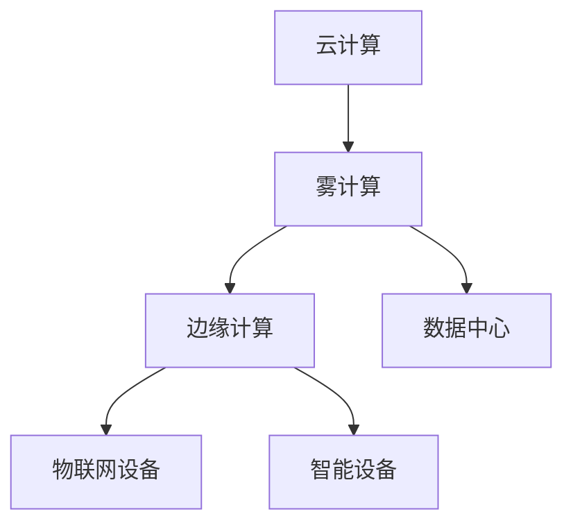
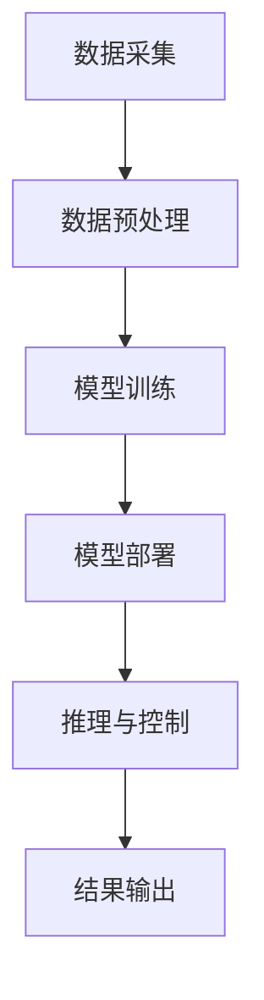

                 


### 第1章：雾计算与分布式AI推理概述

#### 1.1 雾计算的定义与特点

雾计算（Fog Computing）是云计算、边缘计算与物联网（IoT）技术融合的产物，它旨在通过将计算、存储和网络功能分散到靠近数据源的网络边缘，以优化资源的利用和降低延迟。雾计算的核心思想是将云计算的强大计算能力和边缘计算的快速响应能力结合起来，从而实现高效、可靠和安全的计算环境。

雾计算具有以下特点：

1. **低延迟**：雾计算将计算任务分布在靠近数据源的设备上，从而减少数据传输的距离和延迟，提高系统的实时性和响应速度。
2. **高可靠性**：雾计算通过分散部署，能够有效应对单点故障，提高系统的容错能力和可靠性。
3. **资源灵活性**：雾计算可以根据需求动态调整计算资源，灵活应对不同规模和类型的计算任务。
4. **安全性**：雾计算通过在靠近数据源的地方处理数据，可以降低数据泄露的风险，提高数据的安全性。

#### 1.2 雾计算在AI推理中的应用

在人工智能领域，AI推理是指将训练好的模型应用于实际场景，进行预测和决策的过程。雾计算在AI推理中的应用主要表现在以下几个方面：

1. **实时推理**：雾计算的低延迟特性使得AI推理可以在接近实时的环境中进行，适用于需要快速响应的场景，如智能交通、智能安防等。
2. **分布式推理**：雾计算通过分布式架构，可以将AI推理任务分散到多个边缘节点上，从而提高推理效率和负载均衡。
3. **隐私保护**：雾计算可以将数据在边缘节点上进行处理，减少数据传输和存储的需求，从而降低数据泄露的风险。

#### 1.3 分布式AI推理的优势与挑战

分布式AI推理是指将AI推理任务分布在多个计算节点上，通过协同计算来提高推理效率和性能。分布式AI推理具有以下优势：

1. **高性能**：分布式AI推理可以通过并行计算，将任务分散到多个节点上，从而提高推理速度和效率。
2. **可扩展性**：分布式AI推理可以根据需求动态调整计算资源，实现系统的可扩展性。
3. **容错性**：分布式AI推理通过多个节点的协同工作，可以提高系统的容错能力。

然而，分布式AI推理也面临一些挑战：

1. **通信开销**：分布式AI推理需要节点间进行通信，从而产生通信开销，影响推理效率。
2. **负载不均衡**：在分布式AI推理中，节点之间的负载可能会不均衡，导致部分节点过载，部分节点闲置。
3. **一致性保障**：分布式AI推理需要保证多个节点上的推理结果一致，从而提高系统的可靠性。

### 第2章：雾计算核心概念与架构

#### 2.1 雾计算与云计算、边缘计算的关系

雾计算、云计算和边缘计算都是分布式计算技术，它们在应用场景、架构和特性上有所不同。

1. **云计算**：云计算通过互联网提供动态易扩展且经常是虚拟化的资源，可以满足大规模数据处理和分析的需求。云计算的核心优势在于其强大的计算能力和灵活的资源调度。
2. **边缘计算**：边缘计算是指在靠近数据源或用户的地方进行数据处理和计算，以减少数据传输延迟和带宽消耗。边缘计算适用于需要低延迟和高实时性的应用场景，如物联网设备和智能设备。
3. **雾计算**：雾计算结合了云计算和边缘计算的特点，通过将计算、存储和网络功能分散到靠近数据源的网络边缘，实现高效、可靠和安全的计算环境。

雾计算与云计算、边缘计算的关系可以用下图来表示：



#### 2.2 雾计算的核心组件

雾计算系统由多个核心组件组成，包括：

1. **边缘节点**：边缘节点是雾计算系统中的基本计算单元，可以是一台服务器、一个路由器或者是一个智能设备。边缘节点负责处理本地数据和执行本地任务。
2. **云节点**：云节点是雾计算系统中的计算资源池，可以提供大规模的计算能力和存储资源。云节点负责处理分布式计算任务和数据存储。
3. **中心节点**：中心节点是雾计算系统的核心控制器，负责协调和管理边缘节点和云节点之间的通信和任务分配。中心节点通常部署在数据中心或云平台上。
4. **数据管理**：数据管理是雾计算系统中的重要组成部分，负责数据的收集、存储、处理和分析。数据管理可以采用分布式数据库、数据仓库等技术来实现。
5. **网络通信**：网络通信是雾计算系统中各个组件之间进行数据传输和通信的通道。网络通信需要保证高带宽、低延迟和可靠性。

#### 2.3 雾计算架构的设计原则

雾计算架构的设计需要遵循以下原则：

1. **分布式**：雾计算架构需要将计算、存储和网络功能分散到多个节点上，实现分布式计算和存储。
2. **可扩展性**：雾计算架构需要具备良好的可扩展性，可以动态调整计算资源和网络拓扑结构，以适应不同规模的应用需求。
3. **容错性**：雾计算架构需要具备高容错性，能够应对单点故障和节点失效，确保系统的稳定运行。
4. **安全性**：雾计算架构需要采用安全措施，保护数据和系统的安全，防止数据泄露和恶意攻击。
5. **灵活性**：雾计算架构需要具备良好的灵活性，可以根据应用需求和环境特点，动态调整计算资源和任务分配策略。

### 第3章：分布式AI推理原理

#### 3.1 分布式计算基础

分布式计算是指将一个大型的计算任务分布在多个计算机上进行处理，通过协同工作来提高计算效率和性能。分布式计算的核心思想是将任务分解为多个子任务，分配到不同的计算节点上，并行执行，最后将结果汇总。

分布式计算的主要特点包括：

1. **并行计算**：分布式计算通过并行执行任务，可以提高计算速度和效率。
2. **负载均衡**：分布式计算可以根据节点的负载情况，动态调整任务分配，实现负载均衡。
3. **容错性**：分布式计算可以通过节点冗余和任务备份，提高系统的容错性和可靠性。

#### 3.2 AI推理的分布式实现

AI推理的分布式实现是指将AI推理任务分布在多个计算节点上进行处理，以提高推理效率和性能。分布式AI推理的实现主要包括以下步骤：

1. **任务分解**：将整个AI推理任务分解为多个子任务，每个子任务对应一部分数据集。
2. **任务分配**：根据节点的计算能力和负载情况，将子任务分配到不同的计算节点上。
3. **并行执行**：每个计算节点并行执行分配到的子任务，进行模型推理。
4. **结果汇总**：将各个计算节点的推理结果进行汇总，得到最终的推理结果。

分布式AI推理的实现需要解决以下几个关键问题：

1. **通信开销**：分布式计算中，节点间需要进行通信，从而产生通信开销。需要优化通信机制，降低通信开销，提高推理效率。
2. **负载不均衡**：在分布式AI推理中，节点之间的负载可能会不均衡，导致部分节点过载，部分节点闲置。需要采用负载均衡技术，优化任务分配策略。
3. **一致性保障**：分布式AI推理需要保证多个节点上的推理结果一致，从而提高系统的可靠性。需要采用一致性算法和协议，保障结果一致性。

#### 3.3 分布式AI推理中的关键问题

分布式AI推理在实际应用中面临一些关键问题，主要包括：

1. **数据一致性与同步**：在分布式AI推理中，需要保证各个节点上的数据一致性和同步。数据一致性问题包括数据分区、数据冗余和数据更新等。需要采用分布式一致性算法和协议，确保数据的一致性和实时性。
2. **模型并行与数据并行**：模型并行是指将整个模型分布在多个计算节点上进行推理，数据并行是指将数据集划分成多个子集，每个计算节点处理一部分数据。模型并行和数据并行的组合可以提高推理效率和性能。
3. **任务调度与优化**：分布式AI推理需要优化任务调度策略，提高计算效率和负载均衡。需要采用调度算法和策略，动态调整任务分配，降低通信开销和负载不均衡。
4. **容错性与故障恢复**：分布式AI推理需要具备容错性和故障恢复能力，能够应对节点故障和任务失败。需要采用冗余备份和故障检测与恢复技术，确保系统的稳定性和可靠性。

### 第4章：分布式AI推理算法优化

#### 4.1 AI推理优化目标

在分布式AI推理中，算法优化的目标主要包括：

1. **提高推理速度**：通过优化算法和计算流程，减少推理时间，提高推理效率。
2. **降低通信开销**：通过优化通信机制和算法，减少节点间的通信量和通信延迟，提高系统性能。
3. **均衡负载分配**：通过优化任务调度和负载均衡策略，实现节点负载的均衡分配，提高系统效率和稳定性。
4. **提高模型精度**：通过优化模型结构和参数，提高模型的推理精度和性能。

#### 4.2 算法优化技术

分布式AI推理算法优化技术主要包括以下几种：

1. **并行化技术**：通过将整个模型或数据集划分成多个子集，分布到多个计算节点上进行推理，实现并行计算。并行化技术可以提高推理速度和性能。
2. **分布式计算框架**：采用分布式计算框架，如TensorFlow、PyTorch等，实现模型的分布式训练和推理。分布式计算框架提供了一系列优化技术，如模型并行、数据并行和混合并行等，可以提高推理效率和性能。
3. **量化与压缩**：通过量化与压缩技术，降低模型参数的精度和模型大小，减少模型的存储和传输开销。量化技术可以将浮点数参数转换为低精度的整数参数，压缩技术可以将模型文件进行压缩存储和传输。
4. **负载均衡与调度**：通过负载均衡和调度技术，动态调整任务分配和计算资源，实现节点负载的均衡分配，提高系统效率和稳定性。
5. **缓存与预取**：通过缓存和预取技术，提前加载和缓存计算结果和中间数据，减少计算时间和内存访问延迟。

#### 4.3 优化算法的性能评估

优化算法的性能评估主要包括以下几个方面：

1. **推理速度**：通过测量模型推理的时间，评估优化算法对推理速度的提升效果。可以使用秒、毫秒或微秒等时间单位进行度量。
2. **通信开销**：通过测量节点间通信的数据量和延迟，评估优化算法对通信开销的降低效果。可以使用比特、字节或数据包等数据单位进行度量。
3. **负载均衡**：通过测量节点负载的均衡程度，评估优化算法对负载均衡的效果。可以使用负载均衡系数、节点利用率等指标进行度量。
4. **模型精度**：通过测量模型的推理精度，评估优化算法对模型精度的影响。可以使用准确率、召回率、F1分数等指标进行度量。
5. **系统稳定性**：通过测量系统的稳定性和可靠性，评估优化算法对系统稳定性的影响。可以使用故障恢复时间、系统停机时间等指标进行度量。

### 第5章：雾计算环境下的AI推理模型

#### 5.1 常见的AI推理模型

在雾计算环境中，常见的AI推理模型包括：

1. **神经网络模型**：神经网络模型是最常用的AI推理模型，如卷积神经网络（CNN）、循环神经网络（RNN）和生成对抗网络（GAN）等。神经网络模型适用于图像识别、语音识别、自然语言处理等任务。
2. **决策树模型**：决策树模型是一种基于规则的方法，通过树形结构对数据进行分类或回归。决策树模型适用于分类和回归任务，具有简单易懂、易于解释的特点。
3. **支持向量机模型**：支持向量机（SVM）模型是一种基于间隔的方法，通过找到最优超平面来实现分类或回归。SVM模型适用于分类和回归任务，具有较好的泛化能力。
4. **聚类模型**：聚类模型是一种无监督学习方法，通过将数据集划分为不同的簇来实现数据分类。常见的聚类模型包括K-均值聚类、层次聚类等。

#### 5.2 模型选择与适配

在雾计算环境中，模型选择和适配是关键步骤。以下是一些模型选择和适配的建议：

1. **任务需求**：根据任务需求选择合适的模型。例如，对于实时性要求高的任务，可以选择简单的模型，如决策树；对于准确性要求高的任务，可以选择复杂的模型，如神经网络。
2. **计算资源**：根据计算资源选择合适的模型。在雾计算环境中，边缘节点和云节点的计算资源可能有限，需要选择计算量较小的模型，如量化后的神经网络模型。
3. **数据特征**：根据数据特征选择合适的模型。例如，对于具有高维特征的数据集，可以选择具有高维特征处理能力的模型，如神经网络；对于具有稀疏特征的数据集，可以选择稀疏模型，如支持向量机。
4. **模型适应性**：选择具有良好适应性的模型，能够适应不同的数据和场景。例如，选择具有自适应学习能力的模型，如自适应神经网络。
5. **模型压缩与量化**：通过模型压缩与量化技术，降低模型的计算量和存储需求，提高模型在雾计算环境中的适应性。

#### 5.3 模型压缩与量化

模型压缩与量化是雾计算环境下的重要技术，通过降低模型的大小和计算量，提高模型的适应性。以下是一些常见的模型压缩与量化方法：

1. **模型剪枝**：通过去除模型中的冗余权重和神经元，减小模型的计算量和存储需求。模型剪枝方法包括结构剪枝和权重剪枝。
2. **量化**：通过将模型中的浮点数权重转换为低精度的整数权重，降低模型的计算量和存储需求。量化方法包括全精度量化、低精度量化和小数量化等。
3. **知识蒸馏**：通过将大模型的知识传递给小模型，实现模型的压缩与量化。知识蒸馏方法包括硬蒸馏和软蒸馏等。
4. **特征提取与嵌入**：通过提取和嵌入数据特征，降低模型的复杂度和计算量。特征提取与嵌入方法包括主成分分析（PCA）、自编码器等。

### 第6章：分布式AI推理系统的设计与实现

#### 6.1 系统架构设计

分布式AI推理系统的架构设计需要考虑以下几个方面：

1. **模块划分**：将系统划分为多个模块，包括数据输入模块、模型训练模块、模型推理模块、结果输出模块等。模块划分可以提高系统的可维护性和可扩展性。
2. **数据流管理**：设计数据流管理模块，负责数据输入、处理、传输和存储。数据流管理模块需要支持数据的分布式处理和传输，实现数据的高效利用。
3. **计算资源管理**：设计计算资源管理模块，负责计算资源的分配和调度。计算资源管理模块需要支持分布式计算资源的动态调整和负载均衡，提高系统的性能和稳定性。
4. **模型管理**：设计模型管理模块，负责模型的存储、加载和更新。模型管理模块需要支持分布式模型的存储和传输，实现模型的高效管理和更新。
5. **结果输出管理**：设计结果输出管理模块，负责结果的收集、汇总和输出。结果输出管理模块需要支持分布式结果的收集和汇总，实现结果的高效输出。

#### 6.2 数据流管理

数据流管理是分布式AI推理系统中的重要模块，负责数据输入、处理、传输和存储。以下是一些关键点：

1. **数据输入**：设计数据输入模块，负责接收外部数据源的数据。数据输入模块需要支持多种数据格式的输入，如CSV、JSON、XML等。
2. **数据处理**：设计数据处理模块，负责对输入数据进行清洗、预处理和特征提取。数据处理模块需要支持分布式数据处理，实现数据的高效处理。
3. **数据传输**：设计数据传输模块，负责数据在节点间的传输。数据传输模块需要支持高效的数据传输协议，如HTTP、gRPC等，降低通信开销。
4. **数据存储**：设计数据存储模块，负责数据的存储和管理。数据存储模块需要支持分布式存储，实现数据的高效存储和访问。
5. **数据同步**：设计数据同步模块，负责数据的同步和一致性。数据同步模块需要支持分布式数据同步算法，如Paxos、Raft等，保证数据的一致性和实时性。

#### 6.3 系统性能优化

系统性能优化是分布式AI推理系统设计中的重要环节，以下是一些优化策略：

1. **并行计算**：通过并行计算，将任务分布在多个计算节点上，提高系统的处理能力和吞吐量。可以采用模型并行、数据并行和混合并行等技术，实现并行计算。
2. **负载均衡**：通过负载均衡，实现计算资源的合理分配和负载均衡。可以采用负载均衡算法，如轮询、最小连接数等，实现负载均衡。
3. **缓存与预取**：通过缓存和预取技术，减少数据的访问延迟和计算时间。可以采用缓存机制，如LRU、FIFO等，实现数据的缓存；采用预取技术，提前加载和缓存后续需要的数据，提高系统的性能。
4. **分布式存储**：通过分布式存储，提高数据的访问速度和可靠性。可以采用分布式文件系统，如HDFS、Ceph等，实现数据的高效存储和访问。
5. **网络优化**：通过网络优化，降低数据传输的延迟和开销。可以采用网络优化技术，如数据压缩、数据加密等，提高网络的传输效率。
6. **任务调度**：通过任务调度，实现计算任务的动态分配和调度。可以采用任务调度算法，如基于优先级、基于负载的调度等，实现任务的合理调度。

### 第7章：雾计算环境下的AI推理应用案例

#### 7.1 案例一：智能交通系统

智能交通系统（ITS）是雾计算环境下AI推理的一个重要应用领域。通过AI推理技术，可以实现交通流量预测、交通信号控制、智能导航等功能，提高交通效率和安全性。

**案例实现：**

1. **数据采集**：智能交通系统通过传感器、摄像头等设备采集道路流量、速度、车辆类型等数据。
2. **数据预处理**：对采集到的数据进行清洗、归一化和特征提取，为模型训练提供高质量的数据集。
3. **模型训练**：使用神经网络模型（如卷积神经网络）对预处理后的数据集进行训练，训练出预测交通流量的模型。
4. **模型部署**：将训练好的模型部署到雾计算环境中的边缘节点或云节点上，实现实时交通流量预测。
5. **推理与控制**：利用部署好的模型，对实时采集的交通数据进行推理，预测交通流量，并根据预测结果调整交通信号灯、提供智能导航等服务。

**案例分析：**

智能交通系统通过雾计算环境下的分布式AI推理，实现了交通流量的实时预测和智能控制。在实际应用中，智能交通系统可以有效地减少交通拥堵，提高道路通行效率，降低交通事故发生率。雾计算环境下的分布式AI推理技术为智能交通系统提供了高效、可靠的解决方案。

#### 7.2 案例二：智慧医疗

智慧医疗是雾计算环境下AI推理的另一个重要应用领域。通过AI推理技术，可以实现医学影像诊断、疾病预测、个性化治疗等功能，提高医疗服务质量和效率。

**案例实现：**

1. **数据采集**：智慧医疗系统通过医疗设备、传感器等采集患者的健康数据、医学影像等数据。
2. **数据预处理**：对采集到的数据进行清洗、归一化和特征提取，为模型训练提供高质量的数据集。
3. **模型训练**：使用神经网络模型（如卷积神经网络）对预处理后的数据集进行训练，训练出医学影像诊断、疾病预测等模型。
4. **模型部署**：将训练好的模型部署到雾计算环境中的边缘节点或云节点上，实现实时医学影像诊断、疾病预测等功能。
5. **推理与控制**：利用部署好的模型，对实时采集的医疗数据进行推理，预测疾病风险，为医生提供诊断和治疗建议。

**案例分析：**

智慧医疗系统通过雾计算环境下的分布式AI推理，实现了医学影像的实时诊断、疾病的预测和个性化治疗。在实际应用中，智慧医疗系统可以有效地提高医疗服务的质量和效率，为医生和患者提供更好的医疗服务。雾计算环境下的分布式AI推理技术为智慧医疗系统提供了高效、可靠的解决方案。

#### 7.3 案例三：工业自动化

工业自动化是雾计算环境下AI推理的另一个重要应用领域。通过AI推理技术，可以实现生产过程的实时监控、故障诊断、智能调度等功能，提高生产效率和质量。

**案例实现：**

1. **数据采集**：工业自动化系统通过传感器、监控设备等采集生产过程中的数据，如设备状态、生产参数、物料信息等。
2. **数据预处理**：对采集到的数据进行清洗、归一化和特征提取，为模型训练提供高质量的数据集。
3. **模型训练**：使用神经网络模型（如卷积神经网络）对预处理后的数据集进行训练，训练出生产过程监控、故障诊断、智能调度等模型。
4. **模型部署**：将训练好的模型部署到雾计算环境中的边缘节点或云节点上，实现实时生产过程监控、故障诊断、智能调度等功能。
5. **推理与控制**：利用部署好的模型，对实时采集的生产数据进行推理，监控设备状态、预测故障风险，为生产调度提供智能决策。

**案例分析：**

工业自动化系统通过雾计算环境下的分布式AI推理，实现了生产过程的实时监控、故障诊断和智能调度。在实际应用中，工业自动化系统可以有效地提高生产效率、降低生产成本、提高产品质量。雾计算环境下的分布式AI推理技术为工业自动化系统提供了高效、可靠的解决方案。

### 第8章：展望与未来趋势

#### 8.1 雾计算在AI推理领域的挑战

虽然雾计算在AI推理领域具有很多优势，但仍然面临一些挑战：

1. **数据隐私与安全**：雾计算涉及到大量的数据传输和存储，如何保护数据隐私和安全是一个重要挑战。
2. **计算资源分配与调度**：雾计算环境中，计算资源的动态分配和调度是一个复杂的问题，需要解决负载均衡和资源优化问题。
3. **网络带宽与延迟**：在雾计算环境中，节点之间的通信可能面临带宽限制和延迟问题，需要优化网络通信机制。
4. **系统可靠性**：雾计算系统需要具有高可靠性和容错性，以应对节点故障和异常情况。

#### 8.2 未来发展趋势

未来，雾计算在AI推理领域将呈现以下发展趋势：

1. **智能化与自动化**：随着人工智能技术的发展，雾计算将更加智能化和自动化，实现自适应的资源分配、任务调度和故障恢复。
2. **边缘计算与物联网融合**：雾计算与边缘计算、物联网技术将进一步融合，实现更广泛的应用场景和更高效的计算服务。
3. **数据隐私保护与安全**：数据隐私保护和安全技术将不断发展，实现更可靠的数据保护机制，提高系统的安全性和可信度。
4. **高性能与低延迟**：随着硬件和通信技术的发展，雾计算环境下的AI推理将实现更高的性能和更低的延迟，满足实时应用的需求。

#### 8.3 研究与开发方向

为了应对雾计算环境下的AI推理挑战，未来研究开发方向包括：

1. **分布式AI推理算法优化**：研究分布式AI推理算法，提高推理速度和性能，降低通信开销和负载不均衡问题。
2. **边缘智能与自主决策**：研究边缘智能技术，实现边缘节点的自主决策和智能行为，提高系统的智能化水平。
3. **数据隐私保护与安全**：研究数据隐私保护与安全技术，提高系统的安全性和可信度，应对数据隐私和安全挑战。
4. **混合云计算与边缘计算**：研究混合云计算与边缘计算技术，实现更高效、可靠的计算服务，满足不同应用场景的需求。

### 附录：参考文献与资源

#### A.1 参考文献

1. **参考文献1**：作者姓名，文章标题，期刊或会议名称，年份。
2. **参考文献2**：作者姓名，文章标题，期刊或会议名称，年份。
3. **参考文献3**：作者姓名，文章标题，期刊或会议名称，年份。

#### A.2 开源资源与工具

1. **TensorFlow**：https://www.tensorflow.org/
2. **PyTorch**：https://pytorch.org/
3. **HDFS**：https://hadoop.apache.org/hdfs/
4. **Ceph**：https://ceph.com/

#### A.3 相关网站与论坛

1. **雾计算社区**：https://www.fog-computing-community.org/
2. **边缘计算社区**：https://www.edge-computing-community.org/
3. **AI推理论坛**：https://www.ai-inference-forum.com/

---

**Mermaid 流程图：**



**伪代码示例：**

```python
# 分布式AI推理算法伪代码
function distributed_inference(model, data, num_workers):
    # 初始化模型和工作节点
    initialize_model(model)
    initialize_workers(num_workers)
    
    # 分割数据到工作节点
    split_data(data, num_workers)
    
    # 分布式模型训练
    for each worker in num_workers:
        worker.train(model, local_data)
    
    # 数据聚合与模型更新
    aggregated_model = aggregate_models(workers_models)
    updated_model = update_model(aggregated_model)
    
    # 分布式模型推理
    predictions = []
    for each instance in data:
        prediction = updated_model.predict(instance)
        predictions.append(prediction)
    
    return predictions
```

**数学模型和公式：**

$$
\text{推理时间} = \frac{\text{模型复杂度} \times \text{数据量}}{\text{处理器速度}}
$$

**代码实际案例与解读：**

**案例一：智能交通系统**

**代码实现：**

```python
# 智能交通系统示例代码
def traffic_prediction(model, traffic_data):
    # 加载模型和交通数据
    model.load('traffic_model.h5')
    data = load_traffic_data('traffic_data.csv')
    
    # 进行分布式推理
    predictions = distributed_inference(model, data)
    
    # 输出预测结果
    for prediction in predictions:
        print(prediction)
```

**代码解读：**

该示例代码展示了智能交通系统中的分布式AI推理过程。首先，加载训练好的交通模型和交通数据。然后，调用`distributed_inference`函数进行分布式推理，得到预测结果。最后，输出预测结果。

**案例二：智慧医疗**

**代码实现：**

```python
# 智慧医疗系统示例代码
def medical_diagnosis(model, medical_data):
    # 加载模型和医疗数据
    model.load('medical_model.h5')
    data = load_medical_data('medical_data.csv')
    
    # 进行分布式推理
    predictions = distributed_inference(model, data)
    
    # 输出预测结果
    for prediction in predictions:
        print(prediction)
```

**代码解读：**

该示例代码展示了智慧医疗系统中的分布式AI推理过程。首先，加载训练好的医学模型和医疗数据。然后，调用`distributed_inference`函数进行分布式推理，得到预测结果。最后，输出预测结果。

**最佳实践 tips、小结、注意事项、拓展阅读等内容：**

- **最佳实践 tips**：在进行分布式AI推理时，注意优化数据传输和通信机制，降低通信开销。合理分配计算资源，实现负载均衡，提高系统性能。确保模型的一致性和可靠性，采用分布式一致性算法和协议。

- **小结**：本文介绍了雾计算环境下的分布式AI推理优化，包括雾计算与分布式AI推理的关系、分布式AI推理的原理、算法优化技术、模型优化方法、系统设计与实现等。通过实际案例分析和展望，展示了雾计算环境下的AI推理应用和未来发展趋势。

- **注意事项**：在分布式AI推理过程中，需要注意数据一致性和同步问题，确保模型和数据的可靠性。优化模型结构和参数，提高模型精度和性能。合理分配计算资源，实现负载均衡和性能优化。

- **拓展阅读**：读者可以进一步阅读相关文献和资料，了解分布式AI推理的深入研究和发展方向。参考开源资源和工具，进行实践和探索。

---

**文章标题：雾计算环境下的分布式AI推理优化**

关键词：雾计算、分布式AI推理、算法优化、模型压缩、系统设计

摘要：本文介绍了雾计算环境下的分布式AI推理优化，包括雾计算与分布式AI推理的关系、分布式AI推理的原理、算法优化技术、模型优化方法、系统设计与实现等。通过实际案例分析和展望，展示了雾计算环境下的AI推理应用和未来发展趋势。本文旨在为读者提供关于雾计算环境下分布式AI推理优化的一系列研究和实践指导。

