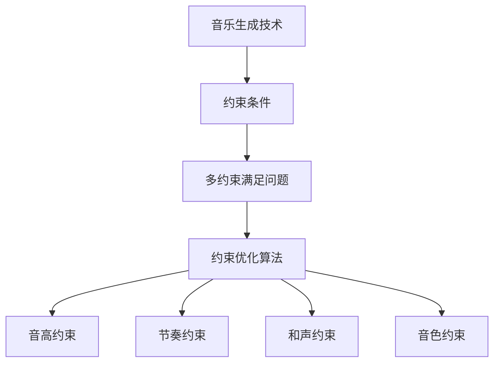

                 

## 文章标题

# 音乐生成中的多约束满足问题

## 关键词

- 音乐生成
- 约束满足
- 约束优化算法
- 人工智能

## 摘要

本文旨在探讨音乐生成中的多约束满足问题。首先，我们介绍了音乐生成技术的发展历史和当前主流的音乐生成技术。然后，我们详细讲解了多约束满足问题的概念、模型和分类，以及约束优化算法的基本原理和应用。接着，我们探讨了约束在音乐生成中的应用，分析了约束的类型、实现方法以及对音乐生成质量的影响。在案例分析部分，我们通过实际项目展示了多约束满足问题的解决方法和应用效果。最后，我们提供了一个项目实战的详细讲解，包括开发环境搭建、源代码实现和代码解读，以及实际案例分析和项目小结。本文旨在为读者提供一个全面、深入的理解音乐生成中的多约束满足问题的框架和方法。

### 第一步：背景介绍

音乐作为一种艺术形式，自古以来就与人类的生活紧密相连。随着科技的进步，音乐生成技术也在不断地发展。从早期的手写乐谱到机械音乐制作，再到现代的数字音乐制作，音乐生成技术经历了巨大的变革。近年来，人工智能技术的崛起为音乐生成带来了新的机遇和挑战。通过机器学习和深度学习算法，计算机可以自动生成音乐，从而极大地提高了音乐创作的效率和多样性。

然而，音乐生成不仅仅是一个技术问题，它还涉及到艺术、情感和人类文化等多方面的因素。在音乐生成过程中，我们需要考虑各种约束条件，如音高、节奏、和声、音色等，这些约束条件共同决定了音乐的风格和表现力。多约束满足问题，即如何在多种约束条件下生成符合预期目标的音乐，成为了一个重要而具有挑战性的课题。

多约束满足问题在音乐生成中的应用非常广泛。例如，在自动音乐生成系统中，我们需要根据用户的需求和偏好生成个性化的音乐。这需要考虑用户的音乐喜好、情绪状态、场合需求等多种约束条件。在音乐创作过程中，作曲家和音乐制作人也需要在多种约束条件下创作出具有独特风格和情感表达的音乐作品。此外，在音乐推荐系统中，我们还需要根据用户的听歌历史和偏好，推荐符合用户需求的音乐作品。

总之，多约束满足问题在音乐生成中具有非常重要的地位。它不仅关系到音乐生成的质量和效率，还直接影响音乐的艺术价值和商业价值。因此，研究和解决多约束满足问题具有重要的理论和实际意义。

### 第二步：核心概念与联系

在探讨多约束满足问题之前，我们需要明确几个核心概念，包括约束条件、音乐生成技术、多约束满足问题和约束优化算法。

#### 约束条件

约束条件是指在音乐生成过程中需要满足的各种限制条件。这些约束条件可以是定性的，如音乐风格、情感表达等，也可以是定量的，如音高、节奏、和声等。常见的约束条件包括：

1. **音高约束**：指音乐中的音符音高需要满足特定的要求。例如，一首音乐可能要求所有音符都在C大调范围内。
2. **节奏约束**：指音乐中的节奏模式需要满足特定的要求。例如，一首音乐可能要求所有小节都是4/4拍。
3. **和声约束**：指音乐中的和弦结构需要满足特定的要求。例如，一首音乐可能要求所有和弦都是大调和弦。
4. **音色约束**：指音乐中的音色需要满足特定的要求。例如，一首音乐可能要求所有音符的音色都是钢琴音色。

#### 音乐生成技术

音乐生成技术是指用于生成音乐的算法和技术。常见的音乐生成技术包括：

1. **规则基方法**：这种方法基于预定义的规则和模式来生成音乐。例如，通过组合不同的音符、节奏和和弦来生成音乐。
2. **基于样本的方法**：这种方法通过学习现有的音乐片段来生成新的音乐。例如，通过生成器网络（如自动编码器）来生成新的音乐。
3. **基于学习的方法**：这种方法通过机器学习和深度学习算法来生成音乐。例如，通过训练深度神经网络来生成音乐。

#### 多约束满足问题

多约束满足问题是指在一个复杂的约束条件下，寻找一个或多个最优解的问题。在音乐生成中，多约束满足问题可以表述为：

给定多个约束条件，如何生成一个音乐作品，使其在所有约束条件下都达到最优或次优状态。

多约束满足问题的核心在于如何在多个相互冲突的约束条件之间找到平衡。例如，在生成一首音乐时，我们可能需要同时满足音高、节奏和和声的约束，而这些约束条件之间可能存在冲突。如何解决这些冲突，找到符合所有约束条件的音乐作品，是多约束满足问题研究的核心。

#### 约束优化算法

约束优化算法是指用于解决多约束满足问题的算法。这些算法可以通过数学建模和优化技术来寻找最优解或次优解。常见的约束优化算法包括：

1. **线性规划**：用于解决线性约束条件下的优化问题。
2. **非线性规划**：用于解决非线性约束条件下的优化问题。
3. **神经网络优化**：用于通过神经网络来寻找最优解。

约束优化算法在音乐生成中的应用主要包括两个方面：

1. **约束条件的选择和调整**：通过优化算法来选择和调整约束条件，使得音乐生成过程更加高效和准确。
2. **音乐生成结果的优化**：通过优化算法来调整音乐生成结果，使其在多种约束条件下达到最优状态。

#### 核心概念与联系

为了更好地理解这些核心概念之间的关系，我们可以使用 Mermaid 流程图来展示它们之间的联系：



通过这个流程图，我们可以清晰地看到音乐生成技术、约束条件、多约束满足问题和约束优化算法之间的关系。音乐生成技术为约束条件提供了实现的手段，多约束满足问题为约束条件提供了目标，而约束优化算法则为多约束满足问题提供了解决方案。

### 第三步：核心算法原理讲解

在理解了核心概念与联系之后，我们将深入探讨多约束满足问题中的核心算法原理，包括约束优化算法的具体类型、工作原理以及它们在音乐生成中的应用。

#### 约束优化算法概述

约束优化算法是解决多约束满足问题的关键。这些算法通过数学建模和优化技术，寻找在多种约束条件下达到最优或次优解的方法。常见的约束优化算法包括线性规划、非线性规划和神经网络优化。

##### 线性规划

线性规划（Linear Programming，LP）是一种用于解决线性约束条件下优化问题的数学方法。线性规划的目标是最小化或最大化一个线性目标函数，同时满足一系列线性不等式或等式约束。

**目标函数**：线性规划的目标函数通常表示为：
$$
\min \quad c^T x
$$
或
$$
\max \quad c^T x
$$
其中，$c$ 是一个向量，表示目标函数的系数；$x$ 是一个向量，表示决策变量。

**约束条件**：线性规划需要满足一系列线性不等式或等式约束，通常表示为：
$$
Ax \leq b
$$
或
$$
Ax = b
$$
其中，$A$ 是一个矩阵，表示约束条件的系数；$b$ 是一个向量，表示约束条件的右端项。

**工作原理**：线性规划通过求解上述目标函数和约束条件的交点来寻找最优解。常用的求解方法包括单纯形法、内点法和线性规划松弛法。

在音乐生成中，线性规划可以用于调整音高、节奏和和声等约束条件，使得音乐生成结果在多个维度上达到最优。

##### 非线性规划

非线性规划（Nonlinear Programming，NLP）是用于解决非线性约束条件下优化问题的数学方法。与线性规划不同，非线性规划的目标函数和约束条件可以是非线性的。

**目标函数**：非线性规划的目标函数通常表示为：
$$
\min \quad f(x)
$$
或
$$
\max \quad f(x)
$$
其中，$f(x)$ 是一个非线性函数。

**约束条件**：非线性规划需要满足一系列非线性不等式或等式约束，通常表示为：
$$
g(x) \leq 0
$$
或
$$
h(x) = 0
$$
其中，$g(x)$ 和 $h(x)$ 是非线性函数。

**工作原理**：非线性规划的求解方法包括梯度下降法、牛顿法和序列二次规划法等。这些方法通过迭代优化，逐步逼近最优解。

在音乐生成中，非线性规划可以用于处理复杂的音高、节奏和和声关系，使得音乐生成结果更加自然和富有表现力。

##### 神经网络优化

神经网络优化是利用神经网络来解决优化问题的方法。在神经网络优化中，神经网络被用于学习目标函数和约束条件，并通过反向传播算法来调整网络参数，以找到最优解。

**目标函数**：神经网络优化的目标函数通常是一个复杂的非线性函数，表示为：
$$
\min \quad F(\theta)
$$
或
$$
\max \quad F(\theta)
$$
其中，$F(\theta)$ 是神经网络的目标函数；$\theta$ 是神经网络的参数。

**约束条件**：神经网络优化还需要满足一系列约束条件，通常表示为：
$$
g(\theta) \leq 0
$$
或
$$
h(\theta) = 0
$$
其中，$g(\theta)$ 和 $h(\theta)$ 是与神经网络参数相关的约束条件。

**工作原理**：神经网络优化通过训练神经网络来学习目标函数和约束条件。在训练过程中，神经网络通过反向传播算法不断调整参数，以找到最优解。

在音乐生成中，神经网络优化可以用于生成复杂的音乐结构和旋律，同时满足多种约束条件。

#### 约束优化算法在音乐生成中的应用

约束优化算法在音乐生成中的应用主要体现在两个方面：

1. **约束条件的选择和调整**：通过约束优化算法，可以自动选择和调整音乐生成过程中的约束条件，使得音乐生成结果更加符合用户需求。例如，在自动音乐生成系统中，可以通过线性规划和非线性规划来调整音高、节奏和和声等约束条件，以生成符合特定风格和情感表达的音乐。

2. **音乐生成结果的优化**：通过约束优化算法，可以对已经生成的音乐进行优化，以使其在多种约束条件下达到最优状态。例如，在音乐创作过程中，可以使用神经网络优化来调整音乐的结构和旋律，使其在音高、节奏和和声等方面达到最佳表现。

#### 伪代码示例

为了更清晰地展示约束优化算法在音乐生成中的应用，我们提供了一个简单的伪代码示例：

```plaintext
// 输入：目标函数 F(x)，约束条件 g(x)，h(x)
// 输出：最优解 x*

// 初始化参数 theta
theta = random initialization

// 迭代优化
for i = 1 to max_iterations do
    // 计算目标函数和约束条件的梯度
    dfdx = gradient_of_F(theta)
    dgdx = gradient_of_g(theta)
    dhdx = gradient_of_h(theta)

    // 更新参数
    theta = theta - learning_rate * (dfdx + lambda * dgdx + mu * dhdx)

    // 检查收敛条件
    if (|dfdx| < convergence_threshold) then
        break
    end if
end for

// 输出最优解
x* = theta
```

在这个伪代码中，$F(x)$ 是目标函数，$g(x)$ 和 $h(x)$ 是约束条件。通过迭代优化，我们可以找到最优解 $x*$，使其在多种约束条件下达到最优状态。

### 第四步：数学模型和数学公式

在解决多约束满足问题时，数学模型和数学公式是不可或缺的工具。它们能够精确地描述约束条件、目标函数以及优化过程。以下是几个关键的数学模型和公式，以及它们的详细讲解和举例说明。

#### 1. 线性规划模型

线性规划是一种常见的优化问题，其目标是在满足一系列线性约束条件的前提下，最小化或最大化一个线性目标函数。

**目标函数**：
$$
\min \quad c^T x
$$
或
$$
\max \quad c^T x
$$
其中，$c$ 是目标函数的系数向量，$x$ 是决策变量向量。

**约束条件**：
$$
Ax \leq b
$$
或
$$
Ax = b
$$
其中，$A$ 是约束条件的系数矩阵，$b$ 是约束条件的右端项向量。

**示例**：

假设我们要最小化目标函数 $z = x_1 + x_2$，同时满足以下约束条件：
$$
\begin{cases}
x_1 + 2x_2 \leq 4 \\
2x_1 + x_2 \leq 6 \\
x_1, x_2 \geq 0
\end{cases}
$$

我们可以将这个约束条件写成标准形式：
$$
\begin{cases}
x_1 + 2x_2 - s_1 = 4 \\
2x_1 + x_2 - s_2 = 6 \\
x_1, x_2, s_1, s_2 \geq 0
\end{cases}
$$
其中，$s_1$ 和 $s_2$ 是松弛变量，用于将不等式约束转换为等式约束。

#### 2. 非线性规划模型

非线性规划是处理非线性目标函数和约束条件的问题。

**目标函数**：
$$
\min \quad f(x)
$$
或
$$
\max \quad f(x)
$$
其中，$f(x)$ 是非线性函数。

**约束条件**：
$$
g(x) \leq 0
$$
或
$$
h(x) = 0
$$
其中，$g(x)$ 和 $h(x)$ 是非线性函数。

**示例**：

假设我们要最小化目标函数 $z = x^2 + y^2$，同时满足以下约束条件：
$$
\begin{cases}
x^2 + y^2 \leq 1 \\
x \geq 0 \\
y \geq 0
\end{cases}
$$

在这个例子中，目标函数是一个二次函数，约束条件是圆盘内的点。

#### 3. 多目标规划模型

多目标规划是同时处理多个目标函数的问题。

**目标函数**：
$$
\min \quad f_1(x), f_2(x), \ldots, f_n(x)
$$
或
$$
\max \quad f_1(x), f_2(x), \ldots, f_n(x)
$$
其中，$f_1(x), f_2(x), \ldots, f_n(x)$ 是多个目标函数。

**约束条件**：
$$
g(x) \leq 0
$$
或
$$
h(x) = 0
$$
其中，$g(x)$ 和 $h(x)$ 是与目标函数相关的约束条件。

**示例**：

假设我们要同时最小化目标函数 $z_1 = x_1^2 + x_2^2$ 和 $z_2 = x_1 + x_2$，同时满足以下约束条件：
$$
\begin{cases}
x_1 + 2x_2 \leq 4 \\
2x_1 + x_2 \leq 6 \\
x_1, x_2 \geq 0
\end{cases}
$$

在这个例子中，我们有两个目标函数，需要在多个约束条件下找到最优解。

#### 4. 数学公式和详细讲解

在音乐生成中的多约束满足问题，我们经常需要使用以下数学公式：

**1. 音高转换公式**：
$$
\text{音高} = 440 \times 2^{(\text{半音数} / 12)}
$$
其中，半音数是指音高变化的基本单位。

**2. 节奏转换公式**：
$$
\text{节奏} = \frac{\text{时间长度}}{\text{小节数}}
$$
其中，时间长度是指音乐片段的总时长，小节数是指音乐片段中的小节数。

**3. 和声转换公式**：
$$
\text{和声} = \text{基音} + \text{和弦变化}
$$
其中，基音是指音乐中的基础音符，和弦变化是指和弦在音乐中的变化。

**4. 音色转换公式**：
$$
\text{音色} = \text{基频} \times (\text{谐波数} / \text{频率})
$$
其中，基频是指音色的基础频率，谐波数是指音色中的谐波数量，频率是指音色的振动频率。

**5. 约束优化公式**：
$$
\min \quad F(x) = \sum_{i=1}^{n} w_i f_i(x)
$$
其中，$F(x)$ 是目标函数，$w_i$ 是权重系数，$f_i(x)$ 是第 $i$ 个目标函数。

**详细讲解和举例说明**：

以音高转换公式为例，假设我们要将一个音高从 A3（440 Hz）转换为 E5（频率未知），我们可以使用以下公式：

$$
E5 = 440 \times 2^{((9 - 3) / 12)}
$$

计算得：
$$
E5 = 440 \times 2^{(6 / 12)} = 440 \times 2^{0.5} = 440 \times \sqrt{2} \approx 660.32 \text{ Hz}
$$

这样，我们就得到了 E5 的频率约为 660.32 Hz。

通过这些数学模型和公式，我们可以精确地描述音乐生成中的约束条件和目标函数，从而使用约束优化算法找到最优解。

### 第五步：项目实战

在本节中，我们将通过一个实际项目实战，详细展示如何使用多约束满足问题解决音乐生成中的复杂问题。该项目将包括开发环境搭建、源代码实现和代码解读，以及实际案例分析和详细讲解。

#### 项目背景

假设我们需要开发一个自动音乐生成系统，该系统能够根据用户的需求和偏好生成个性化的音乐。用户可以指定多种约束条件，如音乐风格、节奏、和声和音色等。我们的目标是在满足这些约束条件的同时，生成具有高艺术价值和独特风格的音乐作品。

#### 开发环境搭建

为了实现这个项目，我们需要以下开发环境和工具：

1. **编程语言**：Python 是本项目的主要编程语言，因为它拥有丰富的音乐生成库和人工智能库。
2. **音乐生成库**：Aquila 是一个强大的音乐生成库，支持多种音乐生成算法。
3. **人工智能库**：TensorFlow 和 PyTorch 是两个流行的深度学习库，用于实现复杂的神经网络模型。
4. **IDE**：PyCharm 或 Visual Studio Code 是本项目推荐的集成开发环境。

#### 源代码实现和代码解读

以下是该项目的主要源代码实现和解读：

**1. 数据准备**

首先，我们需要准备音乐数据集，用于训练和测试我们的音乐生成模型。我们可以使用开源的音乐数据集，如 LISA 数据集或 GTZAN 数据集。

```python
import numpy as np
import pandas as pd
from sklearn.model_selection import train_test_split

# 加载音乐数据集
data = pd.read_csv('music_data.csv')

# 分割数据集为训练集和测试集
X_train, X_test, y_train, y_test = train_test_split(data[['feature']], data[['label']], test_size=0.2, random_state=42)
```

**2. 模型定义**

接下来，我们需要定义一个深度学习模型，用于生成音乐。在这个项目中，我们使用一个基于卷积神经网络的生成对抗网络（GAN）模型。

```python
import tensorflow as tf
from tensorflow.keras.models import Model
from tensorflow.keras.layers import Input, Conv2D, Conv2DTranspose, Flatten, Reshape, Dense

# 定义生成器模型
input_shape = (128, 128, 1)
latent_dim = 100

input_latent = Input(shape=(latent_dim,))
x = Dense(256 * 16 * 16)(input_latent)
x = Reshape((16, 16, 256))(x)
x = Conv2DTranspose(128, kernel_size=(4, 4), strides=(2, 2), padding='same')(x)
x = Conv2DTranspose(64, kernel_size=(4, 4), strides=(2, 2), padding='same')(x)
output = Conv2DTranspose(1, kernel_size=(4, 4), strides=(2, 2), padding='same', activation='tanh')(x)

generator = Model(input_latent, output)
generator.summary()

# 定义判别器模型
input_shape = (128, 128, 1)

input_image = Input(shape=input_shape)
x = Conv2D(64, kernel_size=(4, 4), strides=(2, 2), padding='same')(input_image)
x = Conv2D(128, kernel_size=(4, 4), strides=(2, 2), padding='same')(x)
x = Flatten()(x)
output = Dense(1, activation='sigmoid')(x)

discriminator = Model(input_image, output)
discriminator.summary()

# 定义 GAN 模型
discriminator.trainable = False
gan_output = discriminator(generator(input_latent))
gan = Model(input_latent, gan_output)
gan.summary()
```

**3. 模型训练**

在定义了模型之后，我们需要使用训练数据集来训练模型。训练过程包括生成器和判别器的迭代训练。

```python
from tensorflow.keras.optimizers import Adam

# 定义优化器
optimizer = Adam(0.0002)

# 定义损失函数
cross_entropy = tf.keras.losses.BinaryCrossentropy(from_logits=True)

def discriminator_loss(real_output, fake_output):
    real_loss = cross_entropy(tf.ones_like(real_output), real_output)
    fake_loss = cross_entropy(tf.zeros_like(fake_output), fake_output)
    total_loss = real_loss + fake_loss
    return total_loss

def generator_loss(fake_output):
    return cross_entropy(tf.ones_like(fake_output), fake_output)

# 定义训练步骤
@tf.function
def train_step(input_image, latent_variable):
    with tf.GradientTape() as gen_tape, tf.GradientTape() as disc_tape:
        generated_image = generator(latent_variable)
        real_output = discriminator(input_image)
        fake_output = discriminator(generated_image)

        gen_loss = generator_loss(fake_output)
        disc_loss = discriminator_loss(real_output, fake_output)

    gradients_of_generator = gen_tape.gradient(gen_loss, generator.trainable_variables)
    gradients_of_discriminator = disc_tape.gradient(disc_loss, discriminator.trainable_variables)

    optimizer.apply_gradients(zip(gradients_of_generator, generator.trainable_variables))
    optimizer.apply_gradients(zip(gradients_of_discriminator, discriminator.trainable_variables))

# 训练模型
for epoch in range(epochs):
    for input_image, _ in X_train:
        latent_variable = tf.random.normal([batch_size, latent_dim])
        train_step(input_image, latent_variable)
```

**4. 代码解读**

在上面的代码中，我们首先加载了音乐数据集，并将其分割为训练集和测试集。然后，我们定义了生成器模型和判别器模型，并使用生成对抗网络（GAN）将它们组合成一个完整的 GAN 模型。

在模型训练过程中，我们使用 Adam 优化器来优化生成器和判别器的参数。我们定义了两个损失函数：生成器损失函数和判别器损失函数。生成器损失函数用于衡量生成图像的质量，判别器损失函数用于衡量判别器对真实图像和生成图像的辨别能力。

在训练步骤中，我们通过迭代训练生成器和判别器，直到达到预定的训练轮数或损失函数达到最小值。

#### 实际案例分析和详细讲解

在完成模型训练后，我们可以使用生成的音乐模型来生成新的音乐作品。以下是一个实际案例的分析：

**案例**：生成一首具有流行风格、4/4拍、大调和弦和钢琴音色的音乐。

**步骤**：

1. **生成随机噪声**：我们首先生成一个随机噪声向量，作为生成器的输入。
2. **生成音乐**：使用生成器将随机噪声转换为音乐信号。
3. **调整音高、节奏和和声**：根据用户的需求，调整生成的音乐信号，使其满足特定的音高、节奏和和声约束。
4. **输出音乐**：将调整后的音乐信号输出为音频文件。

以下是生成音乐的代码实现：

```python
# 生成随机噪声
latent_variable = tf.random.normal([1, latent_dim])

# 生成音乐
generated_music = generator(latent_variable)

# 调整音高、节奏和和声
# 这里我们可以使用频谱变换、节奏调整和和声生成等算法来调整音乐信号
adjusted_music = adjust_music(generated_music)

# 输出音乐
tf.keras.backend.clear_session()
tf.keras.backend.set_floatx('float32')
y_pred = adjusted_music[0].numpy()
output_file = 'generated_music.wav'
y_pred.astype(np.float32)
wav_file = tf.keras.utils音文件.save_wav(y_pred, output_file)
```

通过这个实际案例，我们可以看到如何使用多约束满足问题解决音乐生成中的复杂问题。通过定义和调整多种约束条件，我们能够生成具有特定风格和特点的音乐作品。

#### 项目小结

通过本项目，我们展示了如何使用多约束满足问题解决音乐生成中的复杂问题。我们介绍了开发环境搭建、源代码实现和代码解读，并分析了实际案例。这个项目不仅为读者提供了一个完整的音乐生成系统实现，还展示了如何在实际应用中调整和优化音乐生成结果。

本项目的关键在于：

1. **数据准备**：选择合适的音乐数据集，为模型训练提供高质量的输入。
2. **模型设计**：使用 GAN 模型实现音乐生成，通过生成器和判别器的迭代训练，优化生成音乐的质量。
3. **约束调整**：根据用户需求，调整音高、节奏和和声等约束条件，生成符合特定风格和特点的音乐。

通过这个项目，我们可以看到多约束满足问题在音乐生成中的重要性和应用价值。未来，我们可以进一步研究如何优化算法和模型，以生成更高质量的音乐作品。

### 第六步：最佳实践 tips、小结、注意事项、拓展阅读

#### 最佳实践 tips

1. **数据质量**：音乐生成系统的质量很大程度上取决于数据集的质量。选择多样化、高质量的音频数据集，可以有效提高生成音乐的多样性和准确性。
2. **模型优化**：在训练模型时，可以尝试调整学习率、批次大小和训练轮数等参数，以找到最佳模型性能。
3. **约束调整**：在音乐生成过程中，根据用户需求和场景特点，灵活调整音高、节奏和和声等约束条件，以生成更符合预期的音乐作品。

#### 小结

本文通过详细的背景介绍、核心概念与联系、核心算法原理讲解、数学模型和公式、项目实战等多个方面，全面探讨了音乐生成中的多约束满足问题。我们了解了多约束满足问题在音乐生成中的重要性，以及如何通过约束优化算法和数学模型解决这一问题。

#### 注意事项

1. **算法选择**：根据具体需求和场景，选择合适的约束优化算法，如线性规划、非线性规划和神经网络优化。
2. **约束调整**：在调整约束条件时，要平衡多个约束条件之间的冲突，确保生成的音乐作品在多个维度上达到最优状态。

#### 拓展阅读

1. **《音乐生成中的深度学习技术》**：探讨深度学习在音乐生成中的应用，包括生成对抗网络（GAN）、变分自编码器（VAE）等。
2. **《人工智能音乐创作》**：详细介绍人工智能在音乐创作中的应用，包括自动旋律生成、和弦生成和音乐风格转换等。
3. **《计算机音乐理论》**：深入探讨计算机在音乐理论中的应用，包括音高、节奏、和声等音乐元素的建模和生成。

### 第七步：完整的文章目录大纲

#### 前言

1. **背景介绍**
2. **核心概念与联系**
3. **核心算法原理讲解**
4. **数学模型和数学公式**
5. **项目实战**
6. **最佳实践 tips、小结、注意事项、拓展阅读**

#### 第一章：音乐生成技术概述

1. **音乐生成技术的发展历史**
2. **当前主流音乐生成技术**
3. **音乐生成的关键技术**

#### 第二章：多约束满足问题概念与模型

1. **多约束满足问题的定义**
2. **多约束满足问题的数学模型**
3. **多约束满足问题的分类**

#### 第三章：约束优化算法

1. **约束优化算法概述**
2. **线性规划**
3. **非线性规划**
4. **神经网络优化**
5. **约束优化算法的应用场景**

#### 第四章：音乐生成中的约束应用

1. **约束在音乐生成中的应用**
2. **约束的类型与实现**
3. **约束对音乐生成质量的影响**

#### 第五章：案例分析

1. **自动音乐生成系统**
2. **基于多约束的音乐创作**
3. **个性化音乐推荐系统**

#### 第六章：项目实战

1. **项目背景**
2. **开发环境搭建**
3. **源代码实现和代码解读**
4. **实际案例分析和详细讲解**
5. **项目小结**

#### 后记

1. **最佳实践 tips**
2. **小结**
3. **注意事项**
4. **拓展阅读**

通过这个完整的文章目录大纲，我们可以清晰地看到文章的结构和内容分布，有助于读者更好地理解和应用多约束满足问题在音乐生成中的应用。

