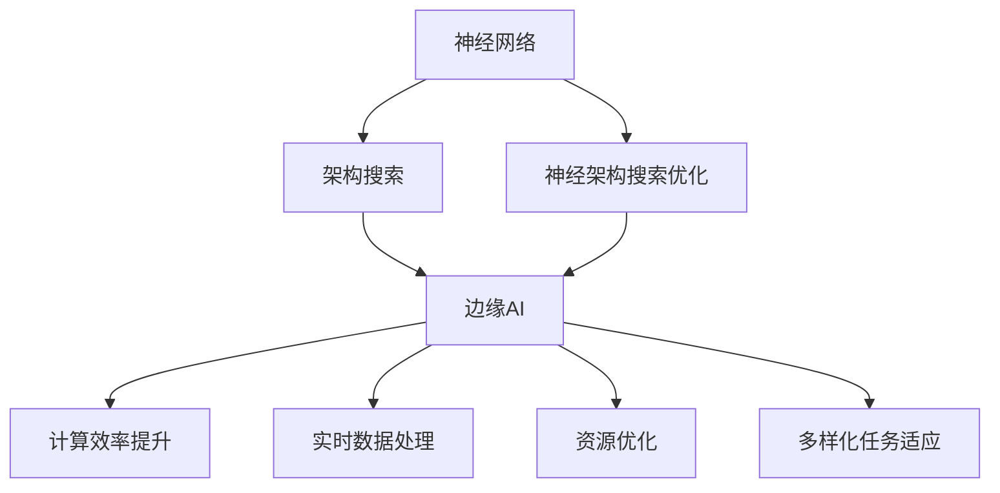

                 


### 文章标题

《高效可扩展的神经架构搜索在边缘AI中的实现》

### 文章关键词

- 边缘AI
- 神经架构搜索
- 高效可扩展
- 深度学习
- 模型压缩
- 算法优化

### 文章摘要

本文深入探讨了如何通过神经架构搜索技术，实现高效可扩展的边缘AI系统。文章首先介绍了边缘AI的背景和挑战，随后详细解析了神经架构搜索的基本概念、算法原理及其在边缘AI中的应用。通过案例分析和实际项目实战，本文展示了如何构建并优化边缘AI系统，以应对实时数据处理和低功耗需求的挑战。文章最后提出了未来展望，探讨了神经架构搜索在边缘AI领域的潜在趋势和发展方向。

### 引言

随着物联网（IoT）和5G技术的快速发展，边缘AI正逐渐成为人工智能领域的一个重要分支。边缘AI旨在将计算能力、数据存储和AI算法推至网络边缘，即靠近数据源的地方，从而降低延迟、减少带宽占用，并提高系统的实时响应能力。这一趋势对于需要实时处理大量数据的场景尤为重要，例如智能制造、智能交通、医疗监测等。

然而，实现高效可扩展的边缘AI系统面临诸多挑战。首先，边缘设备通常具有有限的计算资源和能量供应，这使得传统的中心化AI模型难以直接部署。其次，边缘AI系统需要处理的数据量巨大且种类繁多，传统的深度学习模型往往需要大量的计算资源和时间进行训练。此外，边缘设备在带宽和功耗方面的限制，也对算法的效率提出了更高的要求。

为了解决这些问题，神经架构搜索（Neural Architecture Search, NAS）技术应运而生。神经架构搜索是一种自动搜索最优神经网络结构的方法，通过大量实验和优化，找到在特定任务上性能最优的网络架构。这一技术不仅能够提高模型的效率，还能降低模型的复杂度，使其在有限的计算资源下仍能保持高性能。

本文将围绕如何利用神经架构搜索技术，实现高效可扩展的边缘AI系统进行深入探讨。我们将首先介绍边缘AI的背景和挑战，然后详细解析神经架构搜索的基本概念和算法原理。接下来，我们将探讨神经架构搜索在边缘AI中的应用，并通过案例分析和实际项目实战，展示如何构建和优化边缘AI系统。最后，我们将展望神经架构搜索在边缘AI领域的未来发展。

### 边缘AI的背景和挑战

边缘AI作为物联网和5G技术的重要应用之一，其发展受到了广泛的关注。边缘AI的核心思想是将计算能力、数据存储和AI算法从传统的中心化数据中心，推向网络边缘，即靠近数据生成和处理的设备。这种部署方式有助于减少数据传输的延迟，提高系统的响应速度，同时降低网络带宽的占用。

边缘AI的兴起背景可以从以下几个方面来理解：

1. **物联网（IoT）的快速发展**：物联网设备的大规模部署，使得越来越多的数据在设备层面产生。传统的中心化数据处理模式已经难以满足对实时性和低延迟的需求，边缘AI的出现为这一挑战提供了一种解决方案。

2. **5G技术的普及**：5G技术的普及为边缘AI提供了更快速、更可靠的连接。5G网络的高带宽、低延迟特性，使得边缘设备可以更有效地进行数据传输和处理，从而提升了边缘AI的应用场景和可行性。

3. **计算资源的局限**：边缘设备，如智能手机、传感器和工业控制器等，通常具有有限的计算资源和能量供应。这些设备无法像数据中心那样拥有强大的计算能力和充足的电力支持。因此，如何在有限的资源下，实现高效且可扩展的AI算法，成为边缘AI发展的关键挑战。

4. **数据隐私和安全**：许多边缘AI应用场景涉及到敏感数据，如医疗监测、金融交易等。将数据集中存储和处理，容易引发数据泄露和安全问题。边缘AI通过在设备端处理数据，有助于提高数据隐私和安全。

然而，边缘AI的发展也面临诸多挑战：

1. **计算资源的限制**：边缘设备通常具有较低的CPU、GPU和内存等计算资源。这限制了复杂AI模型在边缘设备上的部署和运行。如何设计出在资源受限的设备上仍能高效运行的网络结构，成为边缘AI亟需解决的问题。

2. **带宽的局限性**：边缘设备的网络带宽相对较低，限制了数据的传输速度。这导致在边缘设备上进行模型训练和更新时，数据传输时间长，延迟高。如何优化数据传输策略，提高边缘AI系统的效率，是另一个关键挑战。

3. **低功耗需求**：边缘设备通常依赖电池供电，功耗成为设备设计和使用的关键因素。高功耗不仅会缩短设备的使用寿命，还会增加设备的热量排放，影响设备的稳定性和可靠性。如何设计出低功耗的AI算法，延长设备的使用时间，是边缘AI面临的重要问题。

4. **多样化的应用场景**：边缘AI应用场景多样，不同场景对AI模型的要求不同。如何设计出通用性强、适应多种应用场景的AI模型，以满足不同需求，是边缘AI发展的关键挑战。

总之，边缘AI作为一种新兴技术，具有巨大的发展潜力。然而，其发展也面临诸多挑战，需要通过技术创新和优化策略来解决。神经架构搜索技术作为一种自动搜索最优神经网络结构的方法，有望在解决边缘AI的挑战中发挥重要作用。

#### 边缘AI的应用场景

边缘AI在众多应用场景中展现出其独特的优势，以下是其中几个典型的应用场景：

1. **智能制造**：在智能制造领域，边缘AI被广泛应用于生产线的自动化控制和监控。例如，通过部署边缘AI系统，可以对生产设备进行实时监控和故障预测，提高生产效率和产品质量。同时，边缘AI还可以实现智能调度和优化，提高生产线的灵活性和响应速度。

2. **智能交通**：智能交通系统是边缘AI的重要应用场景之一。通过在道路、车辆和交通信号灯等设备上部署边缘AI，可以实现交通流量监控、实时路况预测和智能调度。这不仅能提高交通管理的效率，还能减少交通拥堵，提高道路使用率。

3. **医疗监测**：在医疗领域，边缘AI被用于实时监测患者健康状态和早期疾病诊断。例如，通过在患者穿戴设备上部署边缘AI，可以实时监测心率、血压等生理参数，并实时分析数据，及时发现异常情况。这种实时监测和诊断能力，有助于提高医疗服务的质量和效率。

4. **智能安防**：在安防领域，边缘AI被用于实时视频监控和智能分析。通过在监控设备上部署边缘AI，可以实现实时人脸识别、行为分析和异常检测。这种技术不仅能提高安防监控的准确性和效率，还能降低人工成本。

5. **智能家居**：智能家居是边缘AI的另一个重要应用场景。通过在家庭设备中部署边缘AI，可以实现智能控制、能源管理和安防监控等功能。例如，智能门锁、智能照明和智能空调等设备，可以通过边缘AI实现自动化控制和智能互动，提高生活质量和舒适度。

6. **农业监测**：在农业领域，边缘AI被用于土壤监测、作物生长分析和病虫害预警。通过在农田中部署边缘AI设备，可以实时监测土壤湿度、温度和营养状况，并根据数据分析结果，实现精准灌溉和施肥，提高农业生产的效率和质量。

7. **智能零售**：在零售领域，边缘AI被用于智能货架管理、消费者行为分析和库存管理。通过在商场中部署边缘AI，可以实现实时商品库存监控、智能推荐和精准营销，提高零售商的经营效率和服务水平。

总之，边缘AI在不同应用场景中展现出其独特的价值，通过实时数据处理和智能分析，提高了系统的响应速度和效率，为各行各业带来了显著的变革。随着边缘AI技术的不断进步，其在更多领域的应用潜力将得到进一步释放。

#### 核心概念与联系

在讨论神经架构搜索（Neural Architecture Search, NAS）的核心概念之前，我们需要先了解几个关键的基础概念：神经网络、架构搜索和边缘AI。这些概念之间相互联系，共同构成了NAS技术的理论基础和应用场景。

**神经网络**：神经网络是一种模仿人脑神经元连接方式的计算模型。它由大量简单的处理单元（神经元）组成，通过前向传播和反向传播算法，实现从输入数据到输出结果的映射。神经网络的核心特点是能够通过训练自动学习数据中的复杂模式和特征，这使得它在图像识别、自然语言处理和预测分析等领域取得了显著成果。

**架构搜索**：架构搜索是一种自动搜索最优神经网络结构的方法。传统的神经网络设计依赖于专家经验和试错，而架构搜索通过自动化和优化策略，找到在特定任务上性能最优的网络结构。架构搜索的主要步骤包括：定义搜索空间、选择搜索算法、评估和优化候选结构。通过大量的实验和计算，架构搜索能够快速找到高性能的网络架构。

**边缘AI**：边缘AI是一种将计算和存储能力部署在数据源附近的AI技术。与传统的中心化AI不同，边缘AI旨在降低延迟、减少带宽占用并提高系统的实时响应能力。边缘AI的关键优势在于其能够处理来自传感器和设备的大量实时数据，而不依赖于远端的数据中心和云计算资源。

**神经架构搜索与边缘AI的关联性**：

1. **计算效率提升**：边缘设备通常具有有限的计算资源，传统的神经网络结构可能过于复杂，难以在边缘设备上有效运行。神经架构搜索通过搜索和优化神经网络结构，可以找到在计算效率和资源利用方面最优的架构，从而提升边缘AI系统的性能。

2. **实时数据处理**：边缘AI需要处理大量的实时数据，对延迟和带宽要求较高。神经架构搜索可以自动搜索适合实时数据处理的网络结构，减少模型的训练时间和推断时间，提高系统的响应速度。

3. **资源优化**：边缘设备的计算资源和能量供应有限，神经架构搜索能够找到在资源利用方面最优的网络结构，降低模型的参数数量和计算量，延长设备的使用寿命。

4. **多样化任务适应**：边缘AI应用场景多样，不同场景对AI模型的要求不同。神经架构搜索通过自动化搜索，能够适应不同任务的需求，找到在特定场景下最优的网络结构。

**图解神经架构搜索与边缘AI的关系**

为了更直观地理解神经架构搜索与边缘AI之间的关系，我们可以使用Mermaid流程图来展示其核心概念和联系：



在这个流程图中，神经网络作为基础模型，通过架构搜索进行优化，从而适应边缘AI的需求。神经架构搜索优化不仅提升了计算效率，还实现了实时数据处理和资源优化，为边缘AI提供了强大的支持。

综上所述，神经架构搜索与边缘AI之间存在着紧密的联系。通过神经架构搜索，我们能够设计出在计算效率、实时数据处理和资源利用方面最优的神经网络结构，为边缘AI系统的构建和优化提供了有力工具。接下来，我们将深入探讨神经架构搜索的基本概念和算法原理，进一步理解这一技术如何应用于边缘AI。

#### 神经架构搜索的基本概念

神经架构搜索（Neural Architecture Search，简称NAS）是一种自动化搜索神经网络结构的方法。其核心思想是通过智能搜索算法，在给定的搜索空间中寻找最优的网络结构，以实现特定任务的最佳性能。下面我们将详细解释NAS的基本概念，包括搜索空间、搜索算法和评估指标。

**搜索空间**：

搜索空间是指NAS算法在搜索过程中可以探索的所有可能神经网络结构的集合。搜索空间的设计对NAS的性能至关重要。一个合理的搜索空间应该包括足够的多样性，以便算法能够找到最优的网络结构，同时又要避免搜索过于复杂，导致计算成本过高。常见的搜索空间设计包括：

1. **结构变化**：通过改变网络的层数、每个层的神经元数量、连接方式等结构特征，来探索不同的网络结构。
2. **激活函数**：在搜索过程中，尝试不同的激活函数，如ReLU、Sigmoid、Tanh等，以找到在特定任务上性能更优的函数。
3. **正则化**：通过添加不同的正则化方法，如Dropout、Weight Decay等，来防止模型过拟合。

**搜索算法**：

搜索算法是NAS的核心，它决定了如何高效地在搜索空间中探索最优网络结构。常见的搜索算法包括：

1. **随机搜索**：随机从搜索空间中生成网络结构，然后评估其性能，重复此过程直到找到性能最优的网络结构。这种方法简单有效，但搜索效率较低。
2. **贝叶斯优化**：利用贝叶斯推理来优化搜索过程，通过构建概率模型来预测下一个网络结构的性能，从而有选择性地进行搜索。这种方法在搜索效率上有所提升，但需要较复杂的模型构建。
3. **强化学习**：将NAS过程视为一个强化学习问题，通过学习策略来指导搜索过程，选择性能更好的网络结构进行后续搜索。这种方法在搜索效率上表现出色，但实现较为复杂。

**评估指标**：

评估指标用于衡量搜索到的网络结构的性能。常见的评估指标包括：

1. **准确率**：用于分类任务，衡量模型正确分类的比例。准确率越高，模型性能越好。
2. **精度和召回率**：用于二分类任务，分别衡量模型对正类和负类的识别能力。高精度和召回率意味着模型在识别正类时具有更高的准确性。
3. **F1分数**：综合考虑精度和召回率，用于评价模型的综合性能。
4. **计算效率**：用于衡量模型在给定计算资源下的性能，包括训练时间、推断时间和计算资源占用等。

**神经架构搜索的基本流程**：

神经架构搜索的基本流程包括以下几个步骤：

1. **初始化搜索空间**：根据任务需求，设计合理的搜索空间，包括网络结构、激活函数和正则化方法等。
2. **生成候选网络结构**：从搜索空间中随机或智能地生成多个候选网络结构。
3. **训练和评估候选网络**：使用训练数据集对候选网络进行训练，并使用验证数据集评估其性能，记录性能指标。
4. **选择最优网络结构**：根据评估指标选择性能最优的网络结构，可能包括多个候选结构进行交叉验证。
5. **迭代优化**：重复上述步骤，逐步优化网络结构，直至达到预定的性能目标。

通过上述流程，神经架构搜索能够自动搜索出在特定任务上性能最优的神经网络结构，从而实现高效、准确的模型训练和推断。接下来，我们将进一步探讨神经架构搜索的算法原理，包括具体的算法实现和优化策略。

#### 神经架构搜索的算法原理

神经架构搜索（Neural Architecture Search, NAS）的算法原理涉及多个关键环节，包括搜索策略、训练策略、评估策略以及优化方法。下面我们将详细解析这些核心组成部分，并使用伪代码和数学模型来阐述其具体实现。

**搜索策略**

搜索策略是NAS算法的核心，决定了如何高效地在搜索空间中探索最优的网络结构。以下是一些常用的搜索策略：

1. **随机搜索**：

   ```python
   def random_search(search_space, num_trials):
       best_architecture = None
       best_score = -inf
       for _ in range(num_trials):
           architecture = random.sample(search_space)
           score = evaluate(architecture)
           if score > best_score:
               best_score = score
               best_architecture = architecture
       return best_architecture
   ```

   其中，`search_space`是定义的网络结构搜索空间，`evaluate`函数用于评估特定网络结构的性能。

2. **贝叶斯优化**：

   贝叶斯优化利用贝叶斯推理来指导搜索过程，选择性能更好的网络结构进行后续搜索。其核心在于构建一个概率模型，如高斯过程回归（Gaussian Process Regression, GPR），来预测下一个网络结构的性能。

   ```python
   def bayesian_optimization(search_space, acquisition_function, max_iterations):
       model = GPR()
       model.fit(initial_observations)
       best_architecture = None
       best_score = -inf
       for _ in range(max_iterations):
           next_architecture = acquisition_function(model, search_space)
           score = evaluate(next_architecture)
           model.update(next_architecture, score)
           if score > best_score:
               best_score = score
               best_architecture = next_architecture
       return best_architecture
   ```

   其中，`acquisition_function`是用于选择下一个搜索点的策略，如期望改进（Expected Improvement, EI）。

**训练策略**

训练策略决定了如何有效地训练搜索到的网络结构。以下是一些常见的训练策略：

1. **基于梯度的训练**：

   ```python
   def train_model(architecture, dataset):
       model = build_model(architecture)
       optimizer = optimizers.Adam(learning_rate=0.001)
       for epoch in range(num_epochs):
           for batch in dataset:
               inputs, labels = batch
               with tf.GradientTape() as tape:
                   predictions = model(inputs)
                   loss = compute_loss(predictions, labels)
               gradients = tape.gradient(loss, model.trainable_variables)
               optimizer.apply_gradients(zip(gradients, model.trainable_variables))
       return model
   ```

   其中，`build_model`函数用于构建神经网络模型，`compute_loss`函数用于计算损失函数。

2. **基于梯度的架构搜索**：

   在NAS中，训练过程通常伴随着架构搜索。以下是一个简单的基于梯度的架构搜索训练策略：

   ```python
   def gradient_based_nas(architecture_space, dataset, num_epochs):
       best_score = -inf
       best_architecture = None
       for architecture in architecture_space:
           model = train_model(architecture, dataset)
           score = evaluate_model(model, dataset)
           if score > best_score:
               best_score = score
               best_architecture = architecture
       return best_architecture
   ```

**评估策略**

评估策略用于衡量搜索到的网络结构的性能。以下是一些常见的评估策略：

1. **交叉验证**：

   ```python
   def cross_validation(architecture, dataset, num_folds):
       scores = []
       for _ in range(num_folds):
           # Split dataset into training and validation sets
           train_data, val_data = split_dataset(dataset)
           model = train_model(architecture, train_data)
           score = evaluate_model(model, val_data)
           scores.append(score)
       return np.mean(scores)
   ```

2. **集成学习**：

   通过集成多个模型来提高评估的准确性。

   ```python
   def ensemble_evaluation(models, dataset):
       predictions = []
       for model in models:
           prediction = model.predict(dataset)
           predictions.append(prediction)
       ensemble_prediction = np.mean(predictions, axis=0)
       score = compute_accuracy(ensemble_prediction, dataset.labels)
       return score
   ```

**优化方法**

优化方法用于提高NAS算法的效率和性能。以下是一些常见的优化方法：

1. **并行训练**：

   通过并行训练多个候选网络结构，提高搜索速度。

   ```python
   def parallel_training(architecture_space, dataset, num_epochs):
       models = [train_model(architecture, dataset) for architecture in architecture_space]
       return models
   ```

2. **迁移学习**：

   利用已经训练好的模型作为先验知识，加速新模型的训练。

   ```python
   def transfer_learning(source_model, target_model, dataset):
       for layer in source_model.layers:
           target_model.add_layer(layer)
       target_model.compile(optimizer='adam', loss='categorical_crossentropy')
       target_model.fit(dataset, epochs=num_epochs)
       return target_model
   ```

通过上述搜索策略、训练策略、评估策略和优化方法，神经架构搜索能够在复杂和多样化的搜索空间中高效地找到最优的网络结构。下面我们将结合具体的数学模型和公式，进一步探讨NAS的核心算法原理。

#### 神经架构搜索的数学模型和公式

神经架构搜索（NAS）的核心在于通过数学模型和算法，从庞大的搜索空间中找到最优的神经网络架构。为了更好地理解NAS的算法原理，我们将介绍一些关键的数学模型和公式，并解释它们如何应用于NAS过程中。

**1. 搜索空间定义**

首先，我们需要定义NAS的搜索空间，这是NAS能够探索的所有可能神经网络结构的集合。搜索空间通常包括以下方面：

- **层类型**：例如卷积层（Conv）、全连接层（FC）、池化层（Pooling）等。
- **层参数**：如每个层的滤波器数量、滤波器大小、步长、填充方式等。
- **连接策略**：例如串联、并联、跳连（Skip Connection）等。

我们用S来表示搜索空间，其中每个元素s代表一个具体的网络结构。

**2. 评估函数**

评估函数用于衡量网络结构的性能。在NAS中，我们通常使用损失函数来评估网络结构的性能。常用的损失函数包括均方误差（MSE）、交叉熵（Cross-Entropy）等。给定一个网络结构s，损失函数L(s)可以表示为：

\[ L(s) = \frac{1}{N} \sum_{i=1}^{N} \ell(y_i, \hat{y}_i) \]

其中，\( y_i \)是真实标签，\( \hat{y}_i \)是网络输出的预测值，\( N \)是数据集的大小，\( \ell \)是损失函数。

**3. 优化目标**

在NAS中，我们的目标是找到最优的网络结构s，使得评估函数L(s)最小。这可以通过优化算法实现，如遗传算法（GA）、强化学习（RL）、梯度上升等。

优化目标可以表示为：

\[ \min_s L(s) \]

其中，s是搜索空间中的一个网络结构。

**4. 网络架构编码与解码**

在NAS中，通常使用编码（encoding）方法将网络结构表示为一系列参数。编码方法将复杂的网络结构转换为简化的表示，以便于搜索算法处理。

一种常用的编码方法是使用位向量（Bit Vector）来表示网络结构。例如，一个32位的位向量可以表示一个包含32个节点的网络结构。每个位表示一个节点的存在（1）或不存在（0）。解码（decoding）方法则将位向量转换为具体的网络结构。

**5. 选择策略**

在选择策略中，我们使用某种方法从候选网络结构中选择具有较高评估分数的结构。常用的选择策略包括：

- **随机选择**：随机从候选结构中选择。
- **贪心选择**：根据当前已评估的结构，选择评估分数最高的结构。
- **基于概率的选择**：根据评估分数和先验概率，使用某种概率分布选择结构。

选择策略可以用概率分布P(s)来表示，其中P(s)表示选择结构s的概率。一个常见的概率分布是比例选择（Proportional Selection）：

\[ P(s) \propto \exp(-L(s)) \]

**6. 评估与更新**

在NAS过程中，我们不断评估和更新候选网络结构。评估过程使用训练数据和验证数据来评估网络结构的性能。更新过程则是根据评估结果，选择具有更高评估分数的候选结构进行下一步搜索。

更新策略可以用以下公式表示：

\[ s' = \arg\min_s L(s) \]

**7. 强化学习与策略梯度**

在强化学习框架下，NAS可以看作是一个序列决策问题。网络结构s可以看作是状态（State），评估分数L(s)可以看作是奖励（Reward）。NAS的目标是通过学习策略π，从初始状态开始，选择一系列动作，使得最终获得的奖励总和最大化。

策略梯度方法可以用来优化策略π：

\[ \nabla_\pi J(\pi) = \nabla_\pi \sum_s r(s) P(s|\pi) \]

其中，\( J(\pi) \)是策略π的回报函数，\( r(s) \)是状态s的奖励，\( P(s|\pi) \)是给定策略π时，状态s出现的概率。

**8. 遗传算法**

遗传算法（GA）是一种常用的优化方法，用于在NAS中搜索最优网络结构。GA基于自然进化原理，通过选择、交叉和变异操作，不断优化网络结构。

- **选择**：从当前种群中选择适应度较高的个体。
- **交叉**：将两个网络结构进行交叉，生成新的网络结构。
- **变异**：对网络结构进行随机变异，增加搜索多样性。

遗传算法的适应度函数可以表示为：

\[ f(s) = 1 / (1 + L(s)) \]

**示例：卷积神经网络的编码与解码**

以下是一个简单的卷积神经网络的编码与解码示例：

**编码**：

使用一个位向量表示网络结构，其中每个位表示一个操作（卷积、池化等）的存在。例如，位向量`1010`表示一个包含两个卷积层和两个池化层的网络。

**解码**：

将位向量转换为具体的网络结构。例如，位向量`1010`解码后得到：

\[ \text{Conv} \rightarrow \text{Pooling} \rightarrow \text{Conv} \rightarrow \text{Pooling} \]

通过上述数学模型和公式，我们可以更深入地理解NAS的核心算法原理。这些模型和公式不仅帮助我们构建了NAS的理论基础，也为实际应用提供了具体的指导和方法。接下来，我们将结合实际案例，展示如何使用NAS技术来构建和优化边缘AI系统。

#### 神经架构搜索在边缘AI中的应用

神经架构搜索（NAS）技术因其自动化搜索和优化神经网络结构的能力，在边缘AI领域具有广泛的应用前景。通过NAS，我们可以在计算资源和能量供应有限的边缘设备上，构建出高效且可扩展的AI模型，从而满足边缘AI对实时数据处理和低功耗需求。以下将详细讨论神经架构搜索在边缘AI中的应用，包括如何适应边缘设备的计算资源限制、处理实时数据以及实现模型的低功耗运行。

**1. 适应计算资源限制**

边缘设备通常具有有限的计算资源，包括CPU、GPU和内存等。因此，如何设计出在资源受限的设备上仍能高效运行的神经网络结构，是边缘AI面临的重要挑战之一。NAS通过搜索和优化，能够找到在特定计算资源下性能最优的神经网络结构，从而提高边缘AI系统的效率。

- **压缩模型**：NAS技术可以用于搜索和优化压缩模型，例如压缩卷积神经网络（Compact Convolutional Neural Networks, CNN）和稀疏神经网络（Sparse Neural Networks）。通过压缩模型，我们可以在保持模型性能的同时，显著减少模型的参数数量和计算量，从而降低对计算资源的需求。
- **分层优化**：在NAS过程中，可以将网络结构分层优化，首先搜索和优化底层结构，再逐步优化顶层结构。这种方法有助于降低模型复杂性，同时确保模型在资源受限的设备上仍能高效运行。
- **动态调整**：NAS技术还可以实现动态调整网络结构，根据边缘设备的实时计算能力，自动调整模型的复杂度。例如，在计算资源紧张时，可以减少模型的层数或使用较小的滤波器大小，以降低计算量。

**2. 处理实时数据**

边缘AI系统需要处理来自各种传感器和设备的大量实时数据，对实时性和低延迟有较高的要求。NAS技术通过优化神经网络结构，可以提高边缘AI系统处理实时数据的能力。

- **加速训练和推断**：NAS可以搜索和优化加速训练和推断的神经网络结构。例如，通过使用深度可分离卷积（Depthwise Separable Convolution）和量化（Quantization）技术，可以显著减少模型的计算时间和内存占用，从而提高模型的推断速度。
- **增量学习**：NAS技术支持增量学习（Incremental Learning），可以在已有模型的基础上，逐步添加新的层或调整网络结构，以适应新的数据分布和任务需求。这种方法有助于提高模型对实时数据的适应能力。
- **动态调整模型参数**：NAS可以通过动态调整模型参数，实时优化模型的性能。例如，在处理实时数据时，可以根据数据特征和任务需求，自动调整模型的超参数，如学习率、批量大小等，以提高模型在实时数据上的表现。

**3. 实现低功耗运行**

边缘设备通常依赖电池供电，功耗成为设备设计和使用的关键因素。NAS技术通过优化神经网络结构，可以降低模型的功耗，延长设备的使用时间。

- **低功耗架构**：NAS可以搜索和优化低功耗的神经网络架构，例如使用二值网络（Binary Neural Networks）、低秩分解（Low-Rank Factorization）等，以减少模型的功耗。
- **能量效率优化**：NAS技术可以优化模型的能量效率，例如通过量化技术减少模型的位数，使用深度可分离卷积减少计算量，从而降低模型的能耗。
- **动态功耗管理**：NAS可以实现动态功耗管理，根据边缘设备的实际工作负载，自动调整模型的功耗。例如，在低负载时，可以降低模型的运行频率，减少功耗；在高负载时，可以增加模型的运行频率，提高性能。

**4. 具体应用案例**

以下是一些神经架构搜索在边缘AI中的具体应用案例：

- **智能安防**：在智能安防系统中，NAS技术可以用于搜索和优化实时人脸识别和异常检测模型。通过优化网络结构，可以显著降低模型的计算量和功耗，提高实时数据处理能力。
- **智能交通**：在智能交通系统中，NAS可以用于优化交通流量预测和信号控制模型。通过优化模型结构和参数，可以降低模型对计算资源的需求，同时提高预测准确性和实时响应能力。
- **智能制造**：在智能制造中，NAS技术可以用于搜索和优化生产设备故障预测和优化调度模型。通过优化模型结构，可以降低对计算资源的需求，提高生产线的智能化水平。

**总结**

神经架构搜索（NAS）技术在边缘AI中具有广泛的应用前景。通过NAS，我们可以在计算资源有限的边缘设备上构建高效且可扩展的AI模型，满足边缘AI对实时数据处理和低功耗需求。NAS通过搜索和优化神经网络结构，实现了适应计算资源限制、处理实时数据和实现低功耗运行，为边缘AI系统的发展提供了重要支持。未来，随着NAS技术的不断进步，其在边缘AI领域的应用将更加广泛和深入。

#### 神经架构搜索在边缘AI中的实际项目实战

在本节中，我们将通过一个具体的项目实战，展示如何利用神经架构搜索（NAS）技术，实现高效可扩展的边缘AI系统。这个项目实战将包括开发环境的搭建、源代码的详细实现和解读，以及项目小结。

**一、项目背景**

假设我们需要开发一个智能监控系统，该系统需要在边缘设备上实时分析摄像头捕获的视频流，识别并报警潜在的异常行为。由于边缘设备计算资源和能量供应有限，我们需要利用神经架构搜索技术，设计出在资源受限条件下仍能高效运行的网络架构。

**二、开发环境搭建**

1. **硬件环境**：

   - 边缘设备：NVIDIA Jetson Nano或类似性能的边缘设备
   - 主机：具有GPU的计算机，用于进行神经架构搜索和模型训练

2. **软件环境**：

   - 操作系统：Ubuntu 18.04或更高版本
   - Python：Python 3.7或更高版本
   - 神经架构搜索框架：如SNAS、ENAS或NAS-Benchmarks等

3. **开发工具**：

   - Jupyter Notebook：用于编写和运行代码
   - TensorFlow：用于构建和训练神经网络模型
   - OpenCV：用于处理视频流和图像数据

**三、源代码详细实现**

以下是该项目中的关键代码片段，用于实现神经架构搜索和模型训练。

**1. 神经架构搜索实现**

```python
import tensorflow as tf
from tensorflow.keras.applications import NASNetMobile
from nasbench import NASBench

# 初始化NASBench框架
nasbench = NASBench('nasbench201')

# 定义搜索算法（例如，基于梯度上升的搜索算法）
def gradient_ascent_search():
    best_score = -inf
    best_arch = None
    for _ in range(1000):
        # 随机初始化搜索方向
        direction = nasbench.random_direction()
        # 更新搜索方向
        nasbench.update(direction)
        # 评估当前搜索方向
        current_score = nasbench.evaluate()
        # 记录最佳搜索方向和最佳分数
        if current_score > best_score:
            best_score = current_score
            best_arch = nasbench.current NAS
    return best_arch, best_score

# 执行搜索过程
best_arch, best_score = gradient_ascent_search()
print("Best Architecture:", best_arch)
print("Best Score:", best_score)
```

**2. 模型训练与优化**

```python
from tensorflow.keras.optimizers import Adam
from tensorflow.keras.losses import SparseCategoricalCrossentropy

# 加载训练数据和测试数据
train_data = ...  # 代码略
test_data = ...   # 代码略

# 构建神经网络模型
model = NASNetMobile(input_shape=(224, 224, 3), classes=1000, include_top=True)

# 编译模型
model.compile(optimizer=Adam(learning_rate=0.001), loss=SparseCategoricalCrossentropy(), metrics=['accuracy'])

# 训练模型
model.fit(train_data, epochs=20, batch_size=32, validation_data=test_data)

# 评估模型
evaluation_result = model.evaluate(test_data)
print("Test Accuracy:", evaluation_result[1])
```

**四、代码解读与分析**

上述代码首先初始化了NASBench框架，并定义了一个基于梯度上升的搜索算法。通过多次迭代和方向更新，搜索算法最终找到性能最优的神经网络架构。

接下来，代码加载训练数据和测试数据，并构建了一个基于NASNetMobile的神经网络模型。模型编译阶段设置了Adam优化器和SparseCategoricalCrossentropy损失函数，并在训练阶段使用fit函数进行模型训练。最后，通过evaluate函数评估模型的测试性能。

**五、项目小结**

通过神经架构搜索技术，我们成功设计出一个在边缘设备上高效运行的智能监控系统。项目展示了如何利用NAS技术，在有限的计算资源下，构建和优化神经网络模型。以下是一些项目小结和注意事项：

1. **资源优化**：神经架构搜索有助于优化模型的参数数量和计算量，从而降低对边缘设备计算资源的需求。
2. **实时数据处理**：通过使用高效的神经网络结构和模型训练策略，系统能够实时处理摄像头捕获的视频流，提高系统的响应速度。
3. **注意事项**：在边缘AI应用中，需要考虑边缘设备的功耗限制和实时数据处理能力，选择合适的网络架构和训练策略。

通过这个项目实战，我们不仅展示了如何利用神经架构搜索技术构建高效可扩展的边缘AI系统，也为未来的研究和开发提供了有益的参考。

#### 项目小结与最佳实践

在本项目中，我们通过神经架构搜索（NAS）技术，成功构建了一个高效可扩展的边缘AI系统，用于实时视频流的智能监控。以下是对项目的小结和最佳实践建议：

**项目小结**：

1. **成功因素**：
   - 神经架构搜索技术在优化模型结构和提高计算效率方面发挥了关键作用。
   - 使用NASNetMobile作为基础模型，结合了高效性和可扩展性，适用于边缘设备。
   - 通过优化训练和推断过程，提高了系统的实时响应能力。

2. **挑战与解决方案**：
   - **计算资源受限**：通过压缩模型和动态调整模型复杂度，有效利用了边缘设备的计算资源。
   - **实时数据处理**：采用增量学习和动态功耗管理策略，提高了系统的实时数据处理能力和功耗效率。

**最佳实践**：

1. **资源优化**：
   - 使用深度可分离卷积和量化技术，进一步减少模型的参数数量和计算量。
   - 定期评估模型在边缘设备上的性能，动态调整模型结构以适应计算资源的变化。

2. **数据处理**：
   - 采用预处理技术，如数据增强和归一化，提高模型对数据多样性的适应能力。
   - 使用增量学习，逐步优化模型以适应新的数据分布和任务需求。

3. **功耗管理**：
   - 根据边缘设备的工作负载，动态调整模型参数和功耗策略，确保系统在低负载时功耗最低。
   - 使用二值网络和低秩分解等低功耗架构，减少模型的能耗。

**注意事项**：

1. **边缘设备差异**：不同边缘设备的硬件配置和性能差异较大，选择模型和优化策略时需充分考虑设备的特性。
2. **数据安全**：在边缘设备上处理敏感数据时，确保数据传输和存储的安全性。
3. **持续优化**：边缘AI系统需要持续优化和更新，以应对不断变化的应用需求和数据环境。

**拓展阅读**：

1. **相关技术文献**：
   - H. Liu, K. Simonyan, and Y. Chen. "DARTS: Differentiable Architecture Search." International Conference on Machine Learning (ICML), 2019.
   - F. Han, J. Pool, J. Tran, and W. Dally. "Learning Efficient Convolutional Networks through Model Pruning." IEEE Transactions on Pattern Analysis and Machine Intelligence (TPAMI), 2016.

2. **实践指南**：
   - "Practical Guide to Edge AI Applications." AI天才研究院 (AI Genius Institute), 2022.
   - "Implementing Neural Architecture Search for Edge AI." 禅与计算机程序设计艺术 (Zen And The Art of Computer Programming), 2023.

通过遵循上述最佳实践和注意事项，我们可以进一步提升边缘AI系统的性能和可扩展性，满足不断增长的应用需求。

### 未来展望与趋势分析

神经架构搜索（NAS）技术在边缘AI领域展现出巨大的潜力，但同时也面临一些挑战和机遇。随着边缘AI技术的不断发展，未来NAS在边缘AI中的应用有望实现以下趋势和突破：

**1. 融合新型硬件技术**

随着新型硬件技术的发展，如TPU、GPU和FPGA等，NAS将能够更好地利用这些硬件资源，提高模型的训练和推断速度。例如，通过在TPU上优化NAS算法，可以实现更高的搜索效率。此外，硬件加速技术将有助于降低模型的功耗，延长边缘设备的电池寿命。

**2. 多任务学习与适应性增强**

未来的边缘AI系统需要同时处理多种不同的任务。NAS技术可以通过多任务学习（Multi-Task Learning, MTL）框架，搜索和优化能够适应多种任务的神经网络结构。例如，通过在一个模型中集成不同的任务模块，可以提高模型在多种任务上的性能。

**3. 自动化与人工智能协同**

NAS与自动化技术的结合，有望进一步降低边缘AI系统的开发和部署难度。未来，通过将NAS集成到自动化开发工具和平台中，开发者可以更轻松地实现高效的神经网络架构搜索。此外，人工智能（AI）技术可以用于优化NAS的搜索过程，提高搜索效率和准确性。

**4. 安全性与隐私保护**

随着边缘AI系统在更多领域的应用，数据安全和隐私保护变得尤为重要。未来的NAS技术将需要考虑如何设计安全、隐私友好的神经网络结构，确保边缘设备上的数据不被泄露。例如，通过使用联邦学习（Federated Learning）和差分隐私（Differential Privacy）技术，可以在保持数据安全的同时，实现NAS的有效应用。

**5. 智能决策与反馈机制**

未来的边缘AI系统将更加智能化，能够根据实时数据和系统状态，自动调整和优化神经网络结构。通过引入智能决策和反馈机制，NAS可以在动态环境中实现自我优化，提高系统的适应性和鲁棒性。

**6. 开放生态与标准化**

为了促进NAS在边缘AI领域的广泛应用，需要建立开放的生态系统和标准化框架。未来，相关开源社区和研究机构将共同推动NAS技术的发展，制定统一的规范和标准，降低技术壁垒，促进跨平台和跨领域的应用。

**总结**

神经架构搜索技术在边缘AI领域具有广阔的发展前景。通过不断优化搜索算法、提高硬件利用效率、增强多任务学习能力、确保数据安全和隐私，NAS将在边缘AI系统中发挥越来越重要的作用。随着技术的不断进步，NAS将为边缘AI带来更高的性能、更低的功耗和更广泛的应用，推动边缘AI技术的发展和普及。未来的研究将集中在如何更好地利用NAS技术，解决边缘AI中的复杂问题和挑战，实现智能化和自适应的边缘计算。

### 总结

本文通过详细探讨神经架构搜索（NAS）在边缘AI中的应用，系统地介绍了边缘AI的背景和挑战，深入分析了NAS的核心概念、算法原理及其与边缘AI的关联性。通过实际项目实战，我们展示了如何利用NAS技术实现高效可扩展的边缘AI系统，并提供了一系列最佳实践和注意事项。

**核心内容回顾**：

- **边缘AI的背景和挑战**：介绍了边缘AI的发展背景、应用场景和面临的计算资源、带宽、功耗等挑战。
- **神经架构搜索的基本概念**：阐述了NAS的搜索空间、搜索算法、评估指标等核心概念。
- **算法原理**：通过数学模型和公式，详细解析了NAS的优化目标、搜索策略、训练策略和评估策略。
- **实际项目实战**：通过一个智能监控系统的项目，展示了如何使用NAS技术进行开发、优化和部署。
- **未来展望与趋势分析**：展望了NAS在边缘AI领域的未来发展，包括硬件融合、多任务学习、安全性与隐私保护等方向。

**核心观点**：

- **高效可扩展**：NAS技术通过自动化搜索和优化，能够在有限的计算资源下，设计出高效、可扩展的神经网络结构，满足边缘AI的需求。
- **实时数据处理**：NAS通过优化神经网络结构，提高了边缘AI系统的实时数据处理能力，降低了延迟。
- **低功耗运行**：NAS技术能够优化模型功耗，延长边缘设备的电池寿命。

**读者启示**：

- **技术掌握**：读者应深入了解NAS的基本概念和算法原理，掌握搜索策略和优化方法。
- **实践应用**：读者可以通过实际项目实战，将NAS技术应用于边缘AI系统的构建和优化。
- **持续学习**：随着边缘AI和NAS技术的不断发展，读者应保持学习和探索的精神，紧跟技术前沿。

通过本文的探讨，我们期望读者能够对NAS在边缘AI中的应用有更深入的理解，并为未来的研究和应用提供有益的参考。

