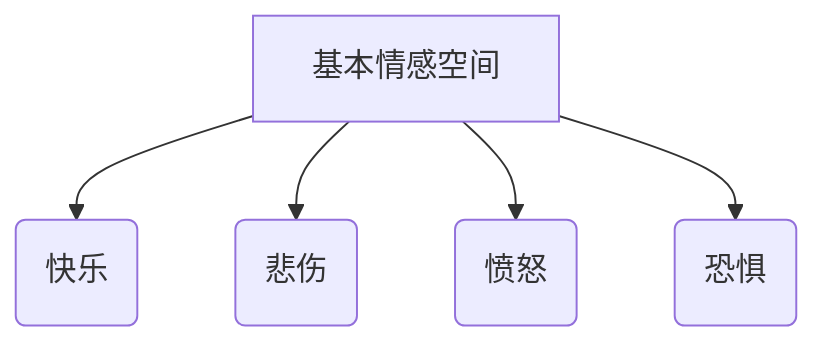
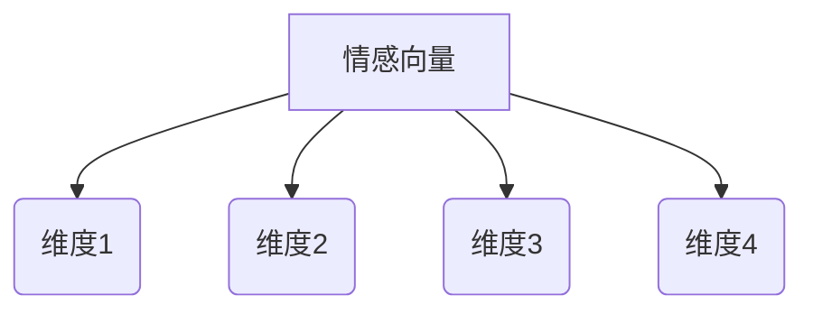

                 

### 第1章: AI与人类情感共鸣：基础概念与历史

情感共鸣，作为人类情感交流的核心机制之一，指的是个体在感受到他人的情感状态时，能够体验到相似的情感体验。近年来，随着人工智能技术的飞速发展，情感计算领域逐渐兴起，研究者们致力于让AI系统具备理解和产生情感的能力，从而实现与人类的情感共鸣。本章将介绍情感共鸣的基础概念，回顾其历史发展，以及探讨现代科技如何推动AI与人类情感的共鸣。

#### 1.1 核心概念介绍

##### 1.1.1 什么是情感

情感（Emotion）是一种复杂的心理状态，通常由认知评价、生理反应和表情行为组成。情感与情绪（Mood）紧密相关，但有所不同。情绪是持续的、较为微弱的心理状态，如愉悦、悲伤或愤怒，而情感则是一种短暂且强烈的心理体验，往往与特定情境相关联。例如，在看到朋友的成功时，我们可能会感到高兴，这是一种情感。

###### 1.1.1.1 情感的定义

情感的定义可以追溯到古代哲学。古希腊哲学家亚里士多德认为，情感是灵魂的部分与身体的部分相结合而产生的。而中国哲学中的情感概念则更多地与道德和伦理相联系，如儒家的仁爱和道家的无为。

###### 1.1.1.2 情感与情绪的关系

情感与情绪之间的关系复杂且多维。情绪通常被视为情感的核心部分，而情感则包括更广泛的认知和情感体验。情绪可能引起情感，但情感不一定引起情绪。例如，当我们听到一则悲伤的故事时，我们可能会感到悲伤，这是一种情绪，但同时，我们可能会因为故事中的情境而感到共鸣，这是一种情感。

##### 1.1.2 人类情感共鸣

情感共鸣（Emotional Contagion）是指个体在接触他人的情感表达时，不自觉地体验相似情感的现象。这种共鸣可以通过多种方式实现，包括语言、面部表情、身体语言和情境。

###### 1.1.2.1 情感共鸣的概念

情感共鸣最早由心理学家罗伯特·索伦森（Robert Sorgenfrey）在20世纪60年代提出，他认为情感共鸣是人类社交互动的基础。情感共鸣不仅有助于建立社交联系，还能增强团队合作和沟通效果。

###### 1.1.2.2 情感共鸣的重要性

情感共鸣在人类社交生活中扮演着至关重要的角色。它不仅帮助我们理解他人的情感状态，还能增强信任和同情心，促进社会和谐。此外，情感共鸣对于心理治疗和情感干预也非常重要，因为它能够帮助个体更好地处理情感问题。

#### 1.2 历史与演变

情感共鸣的概念虽然近年来受到广泛关注，但其实其根源可以追溯到古代哲学和心理学。

##### 1.2.1 古代哲学与情感

在古希腊哲学中，情感被视为灵魂与身体相互作用的产物。亚里士多德在其著作《论灵魂》中详细探讨了情感的本质和功能。而中国哲学中的情感概念则更多地与道德和伦理相联系，如儒家的仁爱和道家的无为。

##### 1.2.2 近代心理学与情感

19世纪末，心理学开始对情感进行系统研究。威廉·詹姆斯和卡尔·兰格等心理学家提出了情感的外周理论，强调情感与生理反应的密切关系。而在20世纪初，精神分析学派则将情感与潜意识联系起来，强调情感对于个体心理和行为的影响。

##### 1.2.3 现代科技与情感

随着现代科技的进步，情感计算（Affective Computing）成为了一个新兴领域。情感计算致力于开发能够理解、感知和表达人类情感的人工智能系统。情感计算技术包括情感识别、情感模拟和情感推理等，这些技术在社交媒体分析、智能交互系统和医疗保健等领域有着广泛的应用。

#### 1.3 本章总结

本章介绍了情感共鸣的基础概念和其历史发展，探讨了情感与情绪的关系，以及情感共鸣在人类社交生活中的重要性。通过回顾古代哲学、近代心理学和现代科技对情感的研究，我们能够更好地理解情感共鸣的复杂性和多样性。在接下来的章节中，我们将进一步探讨情感计算技术如何推动AI与人类情感的共鸣。

### 第2章: 情感计算技术基础

情感计算（Affective Computing）是指计算机系统通过感知、理解和表达人类情感来增强人机交互的能力。这一领域结合了心理学、认知科学和人工智能技术，旨在实现计算机对人类情感的理解和响应。本章将介绍情感计算的基本概念、技术基础以及其在实际应用中的发展。

#### 2.1 情感计算概述

##### 2.1.1 情感计算的定义

情感计算是指通过计算机系统感知、理解和表达人类情感的能力。它不仅仅限于识别和分类情感，还包括对情感强度的评估和情感状态的跟踪。

###### 2.1.1.1 情感计算的定义

情感计算的定义可以追溯到1995年，由美国麻省理工学院的计算机科学教授罗莎琳德·佩斯（Rosalind Picard）首次提出。她将情感计算描述为“使计算机具有感知、理解、表达和模拟人类情感的能力”。

###### 2.1.1.2 情感计算的目标

情感计算的目标是提高人机交互的自然性和情感相关性。具体来说，包括以下几个方面：

1. **情感感知**：通过传感器技术，如面部表情、语音和生理信号，感知用户情感状态。
2. **情感理解**：使用机器学习和自然语言处理技术，理解用户情感背后的含义。
3. **情感表达**：通过语音、文本和视觉反馈，模拟和表达计算机的情感状态。
4. **情感模拟**：通过生成模拟用户情感的响应，实现更加自然和个性化的交互。

##### 2.1.2 情感计算的技术基础

情感计算涉及多种技术的融合，包括机器学习与深度学习、自然语言处理和计算机视觉。

###### 2.1.2.1 机器学习与深度学习

机器学习与深度学习是情感计算的核心技术，它们用于情感识别、情感分类和情感预测。深度学习模型，如卷积神经网络（CNN）和循环神经网络（RNN），在处理大规模情感数据时表现出色。

###### 2.1.2.2 自然语言处理

自然语言处理（NLP）技术用于理解和分析文本中的情感信息。情感分析（Sentiment Analysis）是NLP的一个重要分支，它通过文本情感极性分类和情感强度估计，实现情感的理解。

###### 2.1.2.3 计算机视觉

计算机视觉技术用于分析面部表情、身体语言和场景情感。面部识别和表情识别是计算机视觉在情感计算中的重要应用。

#### 2.2 情感识别技术

情感识别是指通过传感器和技术手段，识别和分类用户的情感状态。情感识别技术主要分为以下几类：

##### 2.2.1 语音情感识别

语音情感识别通过分析语音信号中的情感特征，识别用户的情感状态。关键技术包括声音特征提取和情感分类算法。

###### 2.2.1.1 语音情感识别的概念

语音情感识别是指通过分析语音的声学特征，如音高、音强、时长和频谱特征，识别用户的情感状态。

###### 2.2.1.2 语音情感识别的挑战与解决方案

语音情感识别面临的主要挑战包括语音的变异性、背景噪声和情感表达的复杂度。解决方案包括使用深度学习模型、多模态融合和语音增强技术。

##### 2.2.2 文本情感分析

文本情感分析通过分析文本内容，识别文本的情感极性和情感强度。关键技术包括词袋模型、情感词典和深度学习模型。

###### 2.2.2.1 文本情感分析的概念

文本情感分析是指通过自然语言处理技术，识别文本中的情感极性（正面、负面或中性）和情感强度（强、中或弱）。

###### 2.2.2.2 文本情感分析的方法

文本情感分析的方法包括基于规则的方法、基于机器学习的方法和基于深度学习的方法。其中，深度学习模型在处理复杂情感任务时表现出色。

##### 2.2.3 视频情感识别

视频情感识别通过分析视频中的面部表情、身体语言和场景情感，识别用户的情感状态。关键技术包括计算机视觉和情感计算算法。

###### 2.2.3.1 视频情感识别的概念

视频情感识别是指通过计算机视觉技术，分析视频中的面部表情、身体语言和场景情感，识别用户的情感状态。

###### 2.2.3.2 视频情感识别的挑战与解决方案

视频情感识别面临的主要挑战包括视频数据的高维度性和情感表达的复杂性。解决方案包括使用多模态融合和深度学习模型。

#### 2.3 情感计算应用场景

情感计算技术在多个领域有着广泛的应用，包括社交媒体分析、娱乐与游戏、医疗保健等。

##### 2.3.1 社交媒体分析

社交媒体分析通过情感计算技术，分析用户在社交媒体上的情感状态，为市场营销、品牌管理和社会分析提供支持。

###### 2.3.1.1 社交媒体情感分析的应用

社交媒体情感分析可以用于分析用户对产品、服务和事件的情感反应，帮助企业了解市场需求和消费者行为。

###### 2.3.1.2 社交媒体情感分析的案例

例如，Facebook使用情感计算技术分析用户在社交媒体上的情感状态，为广告投放和内容推荐提供数据支持。

##### 2.3.2 娱乐与游戏

娱乐与游戏领域通过情感计算技术，实现更加个性化和情感化的用户体验。例如，情感化的游戏角色和互动场景，可以提升用户的游戏体验。

###### 2.3.2.1 情感化游戏的设计

情感化游戏设计通过分析用户情感状态，调整游戏难度、角色互动和故事情节，以提升用户的情感体验。

###### 2.3.2.2 情感互动技术的应用

情感互动技术，如语音和面部表情识别，可以用于实现更加自然和丰富的用户交互。

##### 2.3.3 医疗保健

医疗保健领域通过情感计算技术，辅助心理治疗和情感干预，为患者提供个性化的关怀和治疗方案。

###### 2.3.3.1 情感识别在心理治疗中的应用

情感识别技术可以用于实时监测患者的情感状态，帮助心理医生了解患者的心理状况，制定个性化的治疗计划。

###### 2.3.3.2 情感计算辅助诊断

情感计算技术可以辅助医生分析患者的情感反应，预测患者的疾病风险和治疗效果。

#### 2.4 本章总结

本章介绍了情感计算的基本概念、技术基础和实际应用。情感计算通过结合机器学习、自然语言处理和计算机视觉技术，实现了对人类情感的感知、理解和表达。在社交媒体分析、娱乐与游戏、医疗保健等领域，情感计算技术正在发挥越来越重要的作用，为人们提供更加个性化和情感化的体验。随着技术的不断进步，情感计算将在未来实现更多的应用，为人类生活带来更多便利。

### 第3章: AI与情感共鸣的实现方法

随着情感计算技术的不断发展，人工智能（AI）系统在理解和模拟人类情感方面取得了显著进展。本章将详细介绍实现AI与人类情感共鸣的方法，包括情感模型构建、情感识别与交互、情感引导的应用，并探讨情感计算的伦理问题。

#### 3.1 情感模型构建

构建情感模型是实现AI与人类情感共鸣的基础。情感模型用于表示、识别和模拟情感状态，以下为几种常见的情感模型构建方法：

##### 3.1.1 情感表示方法

情感表示是构建情感模型的第一步，其目标是将情感状态转化为计算机可以处理的形式。常见的情感表示方法包括情感空间表示和情感向量表示。

###### 3.1.1.1 情感空间表示

情感空间表示将情感视为多维空间中的点，每个维度代表一种情感特征。例如，使用四维空间表示基本情感（快乐、悲伤、愤怒、恐惧）。



###### 3.1.1.2 情感向量表示

情感向量表示将情感状态表示为高维向量，通常使用机器学习算法进行训练。情感向量表示可以用于情感分类和情感推理。



##### 3.1.2 情感模型训练

情感模型训练是通过大量数据学习情感特征和关系的过程。以下为两种常见的情感模型训练方法：

###### 3.1.2.1 情感分类模型

情感分类模型用于将文本、语音或视频数据分类为不同的情感类别。常见的算法包括支持向量机（SVM）、朴素贝叶斯（Naive Bayes）和深度学习模型（如卷积神经网络CNN、循环神经网络RNN）。

```python
# 情感分类模型的伪代码
def classify_emotion(text):
    # 预处理文本
    preprocessed_text = preprocess(text)
    
    # 使用深度学习模型进行情感分类
    emotion_vector = embedding(preprocessed_text)
    predicted_emotion = emotion_classifier.predict(emotion_vector)
    
    return predicted_emotion
```

###### 3.1.2.2 情感回归模型

情感回归模型用于预测情感强度或情感状态的变化。常见的算法包括线性回归、多项式回归和支持向量回归（SVR）。

```python
# 情感回归模型的伪代码
def predict_emotion_intensity(text):
    # 预处理文本
    preprocessed_text = preprocess(text)
    
    # 使用情感回归模型预测情感强度
    emotion_vector = embedding(preprocessed_text)
    emotion_intensity = emotion_regressor.predict(emotion_vector)
    
    return emotion_intensity
```

##### 3.1.3 情感推理与交互

情感推理是指基于情感模型和情感数据，进行逻辑推理和决策的过程。情感交互是指AI系统与用户之间基于情感的理解和表达进行互动。

###### 3.1.3.1 情感推理方法

情感推理方法包括基于规则的方法、基于机器学习的方法和基于深度学习的方法。基于规则的方法通过定义情感规则库进行推理，而基于机器学习的方法和基于深度学习的方法通过训练情感模型进行推理。

```python
# 基于规则的情感推理方法
def rule_based_emotion推理(text):
    # 检查文本中的情感关键词
    if "happy" in text:
        return "happy"
    elif "sad" in text:
        return "sad"
    else:
        return "neutral"
```

###### 3.1.3.2 情感交互设计

情感交互设计旨在实现AI系统与用户之间的自然、情感化交互。关键要素包括情感感知、情感表达和情感适应。

1. **情感感知**：通过语音、文本和面部表情识别技术，感知用户的情感状态。
2. **情感表达**：通过语音合成、文本生成和视觉反馈技术，模拟和表达AI的情感状态。
3. **情感适应**：根据用户的情感状态，动态调整AI的行为和交互方式，以提供更个性化的服务。

```python
# 情感交互设计的伪代码
class EmotionRobot:
    def __init__(self):
        self.emotion_perception = EmotionPerception()
        self.emotion_expression = EmotionExpression()
        
    def interact(self, user_input):
        # 感知用户情感
        user_emotion = self.emotion_perception.perceive(user_input)
        
        # 表达情感
        response = self.emotion_expression.generate_response(user_emotion)
        
        return response
```

#### 3.2 情感引导的AI应用

情感引导的AI应用是指利用情感计算技术，为用户提供个性化、情感化的服务。以下为几种常见的情感引导的AI应用：

##### 3.2.1 情感识别与个性化推荐

情感识别与个性化推荐是指通过情感计算技术，分析用户的情感状态，为用户推荐符合其情感需求的商品、内容或服务。

```python
# 情感识别与个性化推荐的伪代码
class EmotionBasedRecommender:
    def __init__(self):
        self.emotion_recognizer = EmotionRecognizer()
        self.recommender_model = RecommenderModel()
        
    def recommend(self, user_input):
        # 感知用户情感
        user_emotion = self.emotion_recognizer.recognize(user_input)
        
        # 根据用户情感推荐内容
        recommended_items = self.recommender_model.recommend(user_emotion)
        
        return recommended_items
```

##### 3.2.2 情感驱动的聊天机器人

情感驱动的聊天机器人是指通过情感计算技术，实现自然、情感化的对话交互，为用户提供咨询、娱乐或情感支持。

```python
# 情感驱动的聊天机器人的伪代码
class EmotionDrivenChatbot:
    def __init__(self):
        self.emotion_perception = EmotionPerception()
        self.dialogue_manager = DialogueManager()
        
    def handle_message(self, user_message):
        # 感知用户情感
        user_emotion = self.emotion_perception.perceive(user_message)
        
        # 根据用户情感处理对话
        response = self.dialogue_manager.generate_response(user_emotion)
        
        return response
```

##### 3.2.3 情感分析与情感治疗

情感分析在心理治疗中的应用是指通过情感计算技术，分析患者的情感状态，辅助心理医生进行诊断和治疗。

```python
# 情感分析在心理治疗中的应用伪代码
class EmotionAnalysisInPsychotherapy:
    def __init__(self):
        self.emotion_analyzer = EmotionAnalyzer()
        
    def analyze_patient_emotion(self, patient_input):
        # 分析患者情感
        patient_emotion = self.emotion_analyzer.analyze(patient_input)
        
        # 辅助心理医生诊断和治疗
        therapy_plan = self.generate_therapy_plan(patient_emotion)
        
        return therapy_plan
```

#### 3.3 情感计算与伦理问题

情感计算技术的发展带来了许多伦理挑战，包括情感数据的隐私保护、情感计算的社会影响和伦理规范。

##### 3.3.1 情感计算的伦理挑战

情感计算的伦理挑战主要包括：

1. **情感数据的隐私保护**：情感数据可能包含个体的敏感信息，如何保护这些数据不被滥用是一个重要的伦理问题。
2. **情感计算的社会影响**：情感计算技术可能会加剧社会不平等，例如通过情感分析进行歧视性决策。
3. **情感模拟的真实性**：AI系统如何真实、准确地模拟情感，以避免误导用户。

##### 3.3.2 情感计算的伦理规范

为了应对情感计算的伦理挑战，需要制定一系列伦理规范：

1. **伦理指导原则**：制定明确的伦理指导原则，确保情感计算技术的研发和应用符合道德标准。
2. **透明度和问责性**：确保情感计算系统的决策过程透明，并对决策结果负责。
3. **隐私保护措施**：采取有效的隐私保护措施，保护用户的情感数据不被滥用。

```plaintext
伦理指导原则示例：
1. 尊重用户隐私和尊严。
2. 保障用户知情权和选择权。
3. 确保情感计算技术公正、无歧视。
4. 鼓励透明度和问责性。
5. 遵守相关法律法规和伦理标准。
```

#### 3.4 本章总结

本章介绍了实现AI与人类情感共鸣的方法，包括情感模型构建、情感识别与交互、情感引导的应用，并探讨了情感计算的伦理问题。通过情感模型构建，AI系统能够理解和模拟人类情感；通过情感识别与交互，AI系统能够实现自然、情感化的用户交互；通过情感引导的应用，AI系统能够为用户提供个性化、情感化的服务。同时，本章还强调了情感计算技术发展过程中面临的伦理挑战，并提出了相应的伦理规范。随着技术的不断进步，AI与人类情感共鸣的实现将为人类生活带来更多便利和可能性。

### 第4章: AI与情感共鸣：动物与人类的比较

情感共鸣作为人类情感交流的核心机制，不仅存在于人类之间，也存在于其他动物之间。然而，动物与人类在情感共鸣的实现机制、情感表达和共鸣方式上存在显著差异。本章将探讨动物情感与人类情感的异同，分析实现跨物种情感共鸣的可能性和技术挑战，并介绍跨物种情感共鸣在实际应用中的案例。

#### 4.1 动物情感与人类情感

动物情感与人类情感有许多相似之处，但也存在显著差异。

##### 4.1.1 动物情感概述

动物情感是指动物在特定情境下产生的情绪体验，包括快乐、悲伤、愤怒、恐惧等基本情感。研究表明，许多动物，如哺乳动物和鸟类，都表现出类似人类的情感反应。

###### 4.1.1.1 动物情感的识别

动物情感的识别主要通过观察动物的行为、生理反应和面部表情。例如，狗的面部表情和声音可以表达快乐、悲伤和愤怒等情感。

###### 4.1.1.2 动物情感的表达

动物情感的表达方式与人类不同，通常通过身体语言、声音和特定行为来实现。例如，狗通过舔人面部或摇尾巴表达快乐，通过咆哮或咬人表达愤怒。

##### 4.1.2 动物与人类情感的异同

动物与人类情感的异同主要体现在以下几个方面：

1. **情感种类**：人类情感种类更为丰富，包括基本情感（快乐、悲伤、愤怒、恐惧）和复杂情感（厌恶、敬畏、羞耻等）。而动物情感种类相对较少，但研究表明，某些动物如大猩猩和海豚能够表现出类似复杂情感的体验。
2. **情感表达**：人类通过语言、面部表情和身体语言等多种方式表达情感，而动物通常通过身体语言和声音表达情感。
3. **情感理解**：人类具有高度的情感理解和共鸣能力，能够理解他人的情感状态，并通过情感共鸣建立社交联系。动物虽然也能通过某些方式理解同伴的情感状态，但程度和范围相对有限。
4. **情感认知**：人类具有复杂的情感认知能力，能够通过内省和反思理解自己的情感状态，而动物的情感认知能力相对较低。

#### 4.2 情感共鸣的跨物种实现

尽管动物与人类在情感表达和理解上存在差异，但实现跨物种情感共鸣仍然具有一定可能性。以下为跨物种情感共鸣的可能性、理论基础和技术挑战：

##### 4.2.1 跨物种情感共鸣的可能性

跨物种情感共鸣的可能性主要体现在以下几个方面：

1. **情感表达的相似性**：某些动物的情感表达方式与人类相似，如狗的面部表情和声音，这使得人类可以更容易地理解它们的情感状态。
2. **情感认知的共同点**：研究表明，某些基本情感如快乐、悲伤和愤怒在人类和其他动物中具有相似的认知机制。
3. **情感共鸣的文化传承**：人类通过文化传承，将情感共鸣扩展到其他物种，如宠物文化中人们对宠物的情感投入和互动。

##### 4.2.2 跨物种情感共鸣的理论基础

跨物种情感共鸣的理论基础主要包括以下几个方面：

1. **进化论**：进化论认为，情感共鸣是生物进化过程中适应环境的结果。通过情感共鸣，个体能够更好地理解同伴的情感状态，提高生存和繁衍的机会。
2. **神经科学**：神经科学研究表明，人类和某些动物在情感处理上具有相似的神经回路。例如，人类和狗的大脑中与情感处理相关的区域具有相似的结构和功能。
3. **认知科学**：认知科学认为，情感共鸣是认知能力的一部分，通过共享的情感体验，个体能够建立共同的认知框架。

##### 4.2.3 实现跨物种情感共鸣的技术挑战

实现跨物种情感共鸣面临以下技术挑战：

1. **情感识别的准确性**：准确识别动物的情感状态是实现跨物种情感共鸣的关键。然而，动物的情感表达方式复杂多变，难以准确识别。
2. **情感理解的多样性**：动物与人类在情感体验和理解上存在差异，如何在不同物种之间建立共同的情感理解框架是一个挑战。
3. **技术融合与适应**：将情感计算技术应用于不同物种的互动中，需要考虑到不同物种的生理、心理和行为特点，以实现有效的情感共鸣。

#### 4.3 案例研究：跨物种情感共鸣的应用

跨物种情感共鸣在实际应用中具有广泛前景，以下为两个典型案例：

##### 4.3.1 跨物种情感共鸣在动物福利中的应用

在动物福利领域，情感共鸣的应用可以帮助人类更好地理解动物的痛苦和需求，从而提高动物的福祉。例如，通过情感计算技术，研究人员可以分析动物的面部表情、声音和行为，识别动物的痛苦和恐惧情绪。这些信息有助于改进动物的饲养和管理方法，减少动物的痛苦。

###### 4.3.1.1 跨物种情感共鸣在动物福利中的应用

1. **动物情感识别**：通过情感计算技术，识别动物的情感状态，如痛苦、恐惧和快乐。
2. **动物情感分析**：分析动物的情感数据，了解动物的痛苦和需求，为动物福利改善提供依据。
3. **动物情感干预**：根据动物的情感状态，采取适当的干预措施，如改善饲养环境、提供安慰等。

##### 4.3.2 跨物种情感共鸣在医疗保健中的应用

在医疗保健领域，情感共鸣可以帮助医生更好地理解患者的情感状态，提高治疗效果。例如，通过情感计算技术，医生可以分析患者的面部表情、语音和行为，识别患者的情绪波动。这些信息有助于医生调整治疗方案，提供更个性化的医疗服务。

###### 4.3.2.1 跨物种情感共鸣在医疗保健中的应用

1. **患者情感识别**：通过情感计算技术，识别患者的情感状态，如焦虑、抑郁和愤怒。
2. **患者情感分析**：分析患者的情感数据，了解患者的情绪波动和需求，为医生提供治疗建议。
3. **患者情感干预**：根据患者的情感状态，采取适当的干预措施，如心理疏导、药物治疗等。

#### 4.4 本章总结

本章探讨了动物情感与人类情感的异同，分析了实现跨物种情感共鸣的可能性和技术挑战，并介绍了跨物种情感共鸣在实际应用中的案例。通过情感共鸣，人类可以更好地理解动物的情感状态，提高动物福利；同时，情感共鸣在医疗保健等领域也有广泛应用，有助于提高治疗效果和患者满意度。随着情感计算技术的不断发展，跨物种情感共鸣的应用前景将更加广阔，为人类与动物、人类与自然的和谐共处提供新的可能性。

