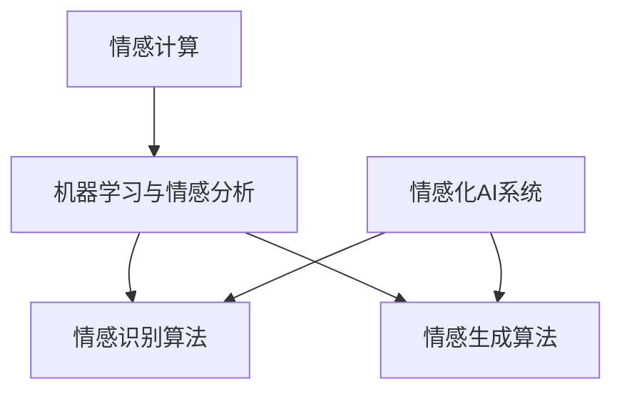

                 

### 文章标题

《AI具备人类情感后的战争伦理重构》

### 关键词

人工智能、情感化、战争伦理、伦理重构、算法、监管、国际合作

### 摘要

随着人工智能技术的不断发展，AI具备人类情感化特征的应用场景日益广泛。本文探讨了AI情感化在战争伦理领域的潜在影响，分析了AI情感化技术的背景、原理和应用场景，探讨了战争伦理重构的理论框架和未来展望，并提出了应对AI情感化战争伦理问题的策略。文章旨在为读者提供一个全面、深入的视角，以理解AI情感化对战争伦理的挑战及其重构路径，为相关领域的决策者和研究者提供参考。

## 第一部分：AI与人类情感的融合

### 第1章：AI情感化的背景与意义

在人工智能发展的早期阶段，大多数AI系统主要关注于执行特定任务，如图像识别、自然语言处理和决策支持等。然而，随着技术的发展，人们逐渐意识到情感在人类决策和行为中的作用，因此开始探索如何在人工智能中引入情感化特征。AI情感化的背景可以追溯到以下几个方面：

1. **人类情感的重要性**：情感是人类行为和决策的重要驱动力。从心理学的角度来看，情感不仅影响我们的认知过程，还影响我们的行为选择和人际交往。在军事领域，情感因素同样重要，如同情心、道德判断和战场上的情绪控制等。

2. **情感计算的兴起**：情感计算（Affective Computing）是一个跨学科领域，它结合了计算机科学、心理学和认知科学，旨在使计算机能够识别、理解、处理和模拟人类情感。情感计算的研究为AI情感化提供了理论基础和技术支持。

3. **AI技术的进步**：近年来，机器学习、自然语言处理和计算机视觉等AI技术取得了显著进展，使得AI系统能够更准确地识别和处理人类情感。这些技术进步为AI情感化的实现提供了可能性。

AI情感化的意义主要体现在以下几个方面：

1. **增强AI的实用性**：通过引入情感化特征，AI系统可以更好地模拟人类的情感反应，从而在更广泛的场景中发挥作用，如医疗、教育、社交和军事等。

2. **改善人机交互**：情感化AI能够更好地理解人类用户的需求和情感状态，从而提供更加个性化、人性化的服务。例如，情感化客服机器人可以在与用户的交互过程中展现出同情和理解，提高用户体验。

3. **优化决策过程**：在军事领域，情感化AI可以辅助决策者进行道德判断和情感控制，从而在复杂的战场环境中做出更合理、更明智的决策。

然而，AI情感化也带来了一系列伦理挑战。首先，如何确保AI系统的情感反应是合理和公正的，避免偏见和歧视。其次，如何防止AI情感化被滥用，导致不道德的行为。这些问题需要我们深入探讨和解决。

### 核心概念与联系

为了更好地理解AI情感化，我们需要明确以下几个核心概念及其相互关系：

1. **情感计算**：情感计算是研究如何使计算机具备识别、理解、处理和模拟人类情感的能力。情感计算的核心目标是构建情感感知、情感理解和情感响应的系统。

2. **机器学习与情感分析**：机器学习是情感计算的基础，通过训练模型来识别和分析人类情感。情感分析是机器学习的一种应用，旨在从文本、语音和图像中提取情感信息。

3. **情感识别与情感生成算法**：情感识别算法用于识别人类情感，如快乐、悲伤、愤怒等。情感生成算法则用于模拟人类情感反应，使AI系统能够表现出情感。

4. **情感化AI系统**：情感化AI系统是结合情感计算、机器学习和情感识别等技术的综合系统，能够实现情感感知、理解和响应功能。

以下是这些核心概念之间的相互关系架构 Mermaid 流程图：

### AI情感化技术原理

AI情感化技术的原理主要涉及情感计算、机器学习和情感分析等核心领域。以下是对这些技术原理的详细解释：

#### 情感计算的基本概念

情感计算是人工智能的一个子领域，旨在使计算机能够识别、理解、处理和模拟人类情感。情感计算的核心目标是构建能够与人类进行情感交互的智能系统。情感计算的关键概念包括情感识别、情感理解和情感生成。

1. **情感识别**：情感识别是指通过分析人类行为、语言和生理信号来识别情感状态。例如，通过面部表情、语音语调、心率等生理信号来识别情感。

2. **情感理解**：情感理解是指计算机对情感信息的分析和理解，以便对情感状态做出适当的反应。例如，理解一个悲伤的面部表情背后的含义，并做出相应的回应。

3. **情感生成**：情感生成是指计算机模拟情感反应，以便在交互过程中展现出情感。例如，一个虚拟客服机器人可能在用户表达不满时表现出同情和理解。

#### 机器学习与情感分析

机器学习是情感计算的基础，通过训练模型来识别和处理人类情感。机器学习主要包括监督学习、无监督学习和强化学习等方法。

1. **监督学习**：监督学习是最常见的机器学习方法，通过已有标签的数据集来训练模型，以便对新数据进行预测。在情感分析中，监督学习可用于情感分类任务，如判断一段文本的情感极性（正面、负面或中性）。

2. **无监督学习**：无监督学习不依赖于已有标签的数据集，而是通过挖掘数据中的隐含结构来训练模型。在情感分析中，无监督学习可用于情感聚类任务，如将具有相似情感的文本归为同一类别。

3. **强化学习**：强化学习是一种通过奖励机制来训练模型的方法。在情感分析中，强化学习可用于情感生成任务，如生成具有特定情感的文本或语音。

情感分析是机器学习在情感计算中的具体应用，旨在从文本、语音和图像中提取情感信息。情感分析主要包括以下步骤：

1. **数据预处理**：包括文本清洗、去噪和分词等操作，以便将原始数据转换为适合分析的形式。

2. **特征提取**：包括词袋模型、TF-IDF、词嵌入等方法，用于将文本转换为特征向量。

3. **情感分类**：使用分类算法（如SVM、朴素贝叶斯、神经网络等）对特征向量进行分类，以确定文本的情感极性。

4. **情感生成**：使用生成模型（如循环神经网络、生成对抗网络等）来生成具有特定情感的文本或语音。

#### 情感识别与情感生成算法

情感识别算法用于识别人类情感，如快乐、悲伤、愤怒等。常见的情感识别算法包括：

1. **基于规则的方法**：通过定义一系列规则来识别情感。例如，如果文本中出现“开心”、“快乐”等词汇，则判断为快乐情感。

2. **基于机器学习的方法**：通过训练模型来识别情感。常见的算法包括支持向量机（SVM）、朴素贝叶斯、决策树、神经网络等。

情感生成算法用于模拟人类情感反应，使AI系统能够表现出情感。常见的情感生成算法包括：

1. **基于模板的方法**：通过预定义的模板来生成情感化文本或语音。例如，根据情感模板生成一段表达同情的对话。

2. **基于生成模型的方法**：通过生成模型（如循环神经网络、生成对抗网络等）来生成具有特定情感的文本或语音。例如，使用循环神经网络生成一段表达愤怒的文本。

### AI情感化应用场景

AI情感化技术在军事领域的应用具有显著潜力，可以改变传统的战争模式，带来新的战术和战略选择。以下是AI情感化在军事领域的主要应用场景：

#### AI在军事领域的应用

1. **情报收集与分析**：AI可以通过情感分析技术，对社交媒体、新闻报道和卫星图像等数据进行分析，识别潜在威胁和敌对行动。例如，通过分析语言和表情，AI可以判断一个地区的民众对军事行动的态度。

2. **战术决策支持**：AI可以分析战场态势，提供实时的战术建议。例如，通过情感分析，AI可以判断敌方指挥官的情绪状态，从而预测其可能的决策和行为。

3. **心理战**：AI可以通过模拟人类情感，实施心理战。例如，通过生成具有特定情感的声音和文本，AI可以影响敌方士兵的情绪，降低其战斗意志。

4. **指挥控制**：AI可以辅助指挥官进行决策，提高指挥效率。例如，通过情感分析，AI可以判断指挥官的情绪状态，提供针对性的建议，帮助指挥官保持冷静和理智。

#### AI在战术决策中的应用

1. **战场态势感知**：AI可以通过情感化技术，实时感知战场上的情感氛围，帮助指挥官更好地理解战场态势。例如，通过分析士兵的表情和语音，AI可以判断士兵的紧张程度和士气状态。

2. **战斗决策支持**：AI可以根据战场情感分析结果，提供战斗决策支持。例如，如果AI判断敌方士气低落，可以建议发起攻击，以取得优势。

3. **心理干预**：AI可以实施心理干预，帮助士兵保持良好的心理状态。例如，通过情感化语音和文本，AI可以安慰和鼓励士兵，缓解其压力和紧张情绪。

#### AI在战争伦理决策中的作用

1. **伦理决策支持**：AI可以通过情感化技术，参与战争伦理决策。例如，在判断是否对敌方平民实施攻击时，AI可以分析平民的情感状态，提供伦理决策支持。

2. **道德责任归属**：AI可以通过情感化技术，确定道德责任归属。例如，在无人机战斗中，AI可以判断哪些决策是由AI自主做出的，哪些是由人类做出的，从而明确道德责任。

3. **伦理审查**：AI可以参与伦理审查，评估军事行动的伦理合法性。例如，通过情感分析，AI可以评估军事行动对平民的影响，判断其是否符合伦理标准。

### 战争伦理的基本原则

在探讨AI情感化对战争伦理的影响时，我们需要首先明确战争伦理的基本原则。这些原则为军事行动和决策提供了道德指导，包括：

1. **区分原则**：区分原则要求在军事行动中，区分战斗员和 civilians，避免对非战斗人员造成不必要的伤害。

2. **必要性原则**：军事行动必须是必要的，并且是防止更大伤害的必要手段。

3. **比例原则**：军事行动造成的伤害必须与实现目标的重要性相称。

4. **预防原则**：军事行动应尽量减少对平民的伤害，并采取预防措施来保护他们。

AI情感化技术的出现，对这些基本原则提出了新的挑战。首先，AI的情感化使得军事决策更加复杂，因为AI可能会根据情感因素做出非理性的决策。其次，AI的情感化可能导致对区分原则的模糊化，使得战斗员和非战斗人员之间的界限变得不明确。最后，AI的情感化可能影响必要性和比例原则的执行，因为AI可能无法准确评估伤害与目标重要性之间的比例。

### AI情感化对战争伦理的挑战

AI情感化在军事领域的应用，带来了许多潜在的伦理挑战，这些挑战主要体现在以下几个方面：

1. **情感偏见**：AI系统可能会在情感识别和反应过程中产生偏见，从而影响决策的公正性。例如，AI可能在面对特定种族或性别时表现出偏见，导致不公平的决策。

2. **道德责任归属**：当AI情感化系统参与军事决策时，如何明确道德责任归属成为一个难题。例如，如果AI系统在战争中造成平民伤亡，应该由谁负责？

3. **情感滥用**：AI情感化技术可能被用于实施心理战，滥用情感因素来操纵敌对势力的行为。这种滥用可能违反国际法和战争伦理。

4. **自主决策**：随着AI情感化技术的进步，AI系统可能会在战场上进行自主决策，这可能导致未经授权的军事行动，违反国际法规和战争伦理。

### 战争伦理重构的理论框架

为了应对AI情感化对战争伦理的挑战，我们需要重构战争伦理的理论框架，以确保AI在军事领域的应用符合道德原则和法律规定。以下是战争伦理重构的理论框架：

1. **情感公正性原则**：确保AI系统的情感识别和反应是公正和无偏见的，避免对特定群体产生歧视。

2. **责任归属原则**：明确AI系统在军事行动中的道德责任，确保责任归属清晰。

3. **情感透明度原则**：提高AI情感化系统的透明度，使其决策过程可解释，便于伦理审查和监管。

4. **情感限制原则**：对AI系统的情感反应进行适当限制，确保其行为符合战争伦理和法律规范。

5. **情感培训原则**：对参与军事决策的AI系统进行情感培训，使其能够理解和尊重战争伦理原则。

### 第一次世界大战中的AI应用

在第一次世界大战期间，虽然AI的概念尚未出现，但现代军事技术已经初露锋芒。以下是AI情感化技术的前身，在战争中的应用：

1. **无人机**：虽然当时的无人机缺乏现代技术水平，但空中侦察机在战争中被广泛使用，用于收集战场情报。

2. **雷达**：雷达技术的应用，使得战场态势感知能力得到了显著提升。

3. **通信技术**：无线电通信技术的普及，使得指挥官能够更迅速地传递命令和情报。

这些技术的应用，为战争决策提供了重要支持，同时也对战争伦理提出了新的挑战。例如，无人机和雷达的广泛使用，使得战斗员可以远程控制战场，减少了直接接触，但同时也增加了对非战斗人员的潜在威胁。

### 第二次世界大战中的AI应用

第二次世界大战期间，军事技术得到了飞速发展，许多现代军事技术在这一时期得到了广泛应用。以下是AI情感化技术的前身，在战争中的应用：

1. **计算机**：1940年代，计算机开始应用于军事领域，用于计算弹道和进行密码破译。例如，ENIAC计算机在战时被用于计算弹道，提高了炮击的准确性。

2. **密码学**：密码学技术在战争中发挥了关键作用，加密和破解密码成为信息战的重要组成部分。

3. **自动化武器系统**：例如，V-2火箭和鱼雷等自动化武器系统的使用，提高了军事行动的效率和精确性。

这些技术的应用，极大地改变了战争的面貌，同时也对战争伦理提出了新的挑战。例如，自动化武器系统的使用，使得战斗员在决策过程中面临更复杂的道德问题，如如何确保对平民的伤害最小化。

### 冷战时期的AI应用

冷战时期，军事技术的竞争达到了顶峰，许多AI情感化技术的前身在这一时期得到了深入研究和发展。以下是AI情感化技术在这一时期的主要应用：

1. **人工智能研究**：冷战期间，美国和苏联都在积极进行人工智能研究，以提升军事能力。例如，美国的高级研究计划局（ARPA）在1960年代启动了多个AI项目。

2. **自动化指挥控制系统**：自动化指挥控制系统（C3I）的发展，使得军事指挥更加高效和精确。例如，智能化的预警系统可以实时监测敌方动向，提供决策支持。

3. **网络战**：冷战期间，网络战开始萌芽。各国开始研究如何利用计算机和网络进行信息攻击，以削弱敌方的军事能力。

这些技术的应用，使得军事行动变得更加复杂，同时也对战争伦理提出了新的挑战。例如，网络战使得战争不再局限于传统的战场，而是扩展到网络空间，这对传统的战争伦理原则提出了新的考验。

### 案例一：人工智能在叙利亚战争中的应用

叙利亚战争（2011-2021）是现代战争中AI技术应用的一个重要实例。以下是AI在叙利亚战争中的一些具体应用：

1. **情报收集与分析**：AI系统被用于分析社交媒体、新闻报道和卫星图像，以识别潜在的恐怖活动和军事行动。例如，谷歌的DeepMind公司开发了基于深度学习的算法，用于分析社交媒体数据，帮助监测和预测恐怖活动。

2. **无人机作战**：无人机在叙利亚战争中发挥了重要作用，用于侦察、打击和目标定位。AI技术被用于无人机系统的自主导航和目标识别，提高了作战效率。

3. **心理战**：AI技术被用于实施心理战，通过生成具有特定情感的声音和文本，影响敌方士兵和民众的情绪。例如，AI系统可以生成假新闻和虚假信息，以混淆敌对势力的判断。

这些应用表明，AI在军事领域的应用已经从传统的战场扩展到信息战场和心理战场，对战争伦理提出了新的挑战。例如，AI在情报收集与分析中的应用，可能侵犯隐私权；在无人机作战中的应用，可能引发道德责任归属问题；在心理战中的应用，可能滥用情感因素来操纵敌方的行为。

### 案例二：无人机战争中的AI情感化问题

无人机战争是现代战争中的一种重要形式，而AI情感化技术的应用进一步改变了无人机作战的模式。以下是无人机战争中AI情感化的一些具体问题和挑战：

1. **自主决策**：AI系统在无人机战斗中可能会进行自主决策，包括目标选择、攻击时机和攻击方式。这种自主性可能导致未经授权的军事行动，违反国际法和战争伦理。

2. **情感识别与反应**：AI系统可能会根据情感分析结果，调整其行为和决策。例如，通过分析敌方士兵的表情和语音，AI系统可能会选择在敌方情绪低落时进行攻击，以提高战斗效果。然而，这种做法可能引发道德责任归属问题。

3. **情感滥用**：AI情感化技术可能被用于实施心理战，通过情感操纵来影响敌对势力的行为。例如，AI系统可以生成假新闻和虚假信息，以混淆敌对势力的判断，甚至通过情感操纵来降低敌方的战斗意志。

这些挑战表明，无人机战争中的AI情感化应用需要严格的伦理审查和监管，以确保其行为符合道德和法律规范。

### 案例三：人工智能与网络战

网络战是现代战争中的一种新型形式，而AI技术的应用使得网络战变得更加复杂和有效。以下是人工智能在网络战中的几个关键应用和挑战：

1. **网络攻击与防御**：AI系统被用于网络攻击和防御，包括漏洞扫描、恶意软件检测、网络入侵和反制。例如，AI算法可以快速识别和利用网络漏洞，发起攻击，同时AI防火墙可以实时检测和防御网络攻击。

2. **信息战**：AI技术被用于信息战，包括生成假新闻、虚假信息和误导信息。AI算法可以分析网络行为和社交媒体数据，生成针对特定目标群体的信息，以混淆敌对势力的判断。

3. **心理战**：AI技术可以用于实施心理战，通过情感操纵来影响敌对势力的情绪和决策。例如，AI系统可以分析敌方领导人和士兵的情绪状态，生成具有特定情感的声音和文本，以降低其战斗意志。

这些应用表明，AI技术在网络战中的潜力巨大，但也带来了伦理挑战。例如，网络攻击可能侵犯隐私权，信息战可能误导公众，心理战可能滥用情感因素来操纵敌对势力的行为。

### AI情感化战争伦理的未来展望

随着AI情感化技术的不断进步，未来战争伦理将面临更多的挑战和机遇。以下是对AI情感化战争伦理的未来展望：

1. **技术发展趋势**：未来AI情感化技术将在计算能力、数据获取和处理能力等方面取得显著提升，使得AI能够更准确地识别、理解和模拟人类情感。这将进一步改变战争模式，提高军事行动的效率和精确性。

2. **伦理困境**：AI情感化技术的应用将带来一系列伦理困境，如情感偏见、道德责任归属、情感滥用等。如何确保AI系统的情感反应是公正、合理和可解释的，将是未来伦理重构的重要任务。

3. **国际合作与规范**：面对AI情感化战争伦理的挑战，国际合作和规范的重要性日益凸显。各国需要共同制定AI伦理规范，确保AI技术在军事领域的应用符合国际法和战争伦理。

4. **伦理审查与监管**：建立有效的伦理审查和监管机制，对AI系统的情感化应用进行严格监督，确保其行为符合道德和法律规范。这包括对AI系统的透明度、可解释性和责任归属进行审查。

5. **伦理教育**：加强对军事人员、AI开发者和伦理学家的伦理教育，提高他们对AI情感化战争伦理问题的认识和理解，以促进伦理决策的制定和实施。

总之，AI情感化战争伦理的未来展望既充满机遇，也充满挑战。通过技术创新、国际合作和伦理审查，我们有望实现AI技术在军事领域的安全、合理和负责任的应用。

### 伦理审查与监管机制

为了确保AI情感化在军事领域的应用符合道德和法律规范，建立有效的伦理审查和监管机制至关重要。以下是一些建议：

1. **国际伦理规范**：各国应共同制定AI伦理规范，确保AI系统的设计和应用遵循普遍接受的道德原则。这包括明确AI系统的责任归属、透明度和可解释性。

2. **国内法律框架**：各国应建立完善的法律法规，对AI情感化技术的军事应用进行严格监管。这包括制定关于AI系统设计和使用的法律条款，以及对违法行为的处罚措施。

3. **伦理审查委员会**：建立独立的伦理审查委员会，负责对AI情感化系统的设计和应用进行审查。审查委员会应由多学科专家组成，包括计算机科学家、伦理学家、法律专家和军事专家。

4. **透明度和可解释性**：确保AI系统的设计和应用过程具有透明度，使其决策过程可解释。这包括公开AI系统的设计文档、算法和决策依据，以便进行审查和评估。

5. **责任归属**：明确AI系统在军事行动中的道德责任，确保责任归属清晰。例如，如果AI系统在战斗中造成平民伤亡，应明确责任归属，并追究相关责任。

6. **国际合作**：加强国际合作，共享伦理审查和监管的最佳实践，推动全球范围内AI伦理规范的建立和实施。

### 技术与伦理的结合

在AI情感化技术的设计和应用过程中，将技术与伦理相结合是确保其道德合规性的关键。以下是一些建议：

1. **道德设计原则**：在AI系统开发过程中，应遵循一系列道德设计原则，如公正性、透明度、责任归属和可解释性。这些原则应贯穿于整个开发周期，从需求分析、系统设计到测试和部署。

2. **伦理敏感设计**：考虑到AI情感化技术可能带来的伦理挑战，应在设计阶段就引入伦理敏感因素。例如，通过模拟不同的情感反应场景，评估AI系统的行为是否符合道德标准。

3. **伦理审查流程**：建立严格的伦理审查流程，对AI系统的设计和应用进行多层次的审查。审查应包括技术可行性、伦理合法性和社会影响等方面。

4. **持续监测与评估**：在AI系统部署后，应进行持续监测和评估，以确保其行为符合伦理规范。这包括对AI系统的透明度、可解释性和责任归属进行定期审查。

5. **用户教育**：加强对AI系统使用者的伦理教育，提高他们对AI情感化技术的道德合规性的认识。这包括培训军事人员、AI开发者和伦理学家，确保他们具备识别和处理伦理问题的能力。

### 建立跨学科研究团队

为了全面应对AI情感化战争伦理的挑战，建立跨学科研究团队至关重要。以下是一些建议：

1. **多学科专家合作**：跨学科研究团队应包括计算机科学家、伦理学家、法律专家、军事专家、心理学家和社会学家等。通过多学科合作，可以全面分析和解决AI情感化战争伦理问题。

2. **共同研究议程**：制定共同的研究议程，明确研究目标和重点领域。这包括研究AI情感化技术的道德合规性、责任归属、伦理审查和监管等方面。

3. **案例研究与分析**：通过案例研究和分析，深入了解AI情感化在军事领域中的应用和潜在风险。这有助于为政策制定者和实践者提供有价值的参考。

4. **国际合作与交流**：加强国际合作与交流，共享研究成果和最佳实践。这有助于推动全球范围内AI情感化战争伦理的研究和合作。

### 开展多领域的合作研究

为了深入探讨AI情感化战争伦理问题，开展多领域的合作研究至关重要。以下是一些建议：

1. **跨学科研究项目**：鼓励不同学科的研究者合作，共同开展关于AI情感化战争伦理的研究项目。这可以促进不同领域之间的知识交流和创新。

2. **国际合作平台**：建立国际合作平台，促进各国研究者之间的合作与交流。这包括举办国际研讨会、工作坊和合作研究项目，以推动全球范围内的研究进展。

3. **数据共享与开放**：鼓励研究机构和大学开放数据集和研究成果，促进全球范围内的数据共享和知识传播。这有助于提高研究的透明度和可信度。

4. **政策建议与制定**：结合研究成果，提出具体的政策建议，为政府和企业提供指导。这包括制定伦理规范、法律法规和技术标准，以促进AI情感化技术在军事领域的安全和合规应用。

### 促进战争伦理重构的实践应用

为了推动战争伦理的重构，实践应用是关键。以下是一些建议：

1. **模拟训练**：利用AI情感化技术，开发军事模拟训练系统。这些系统可以模拟不同的战场情景，帮助指挥官和士兵在虚拟环境中学习和练习道德决策。

2. **伦理审查流程**：将伦理审查流程纳入军事决策过程，确保每一个决策都经过严格的伦理评估。这可以包括在决策前进行伦理评估、决策后的回顾和反馈。

3. **教育与培训**：加强对军事人员和AI开发者的伦理教育，提高他们对AI情感化战争伦理问题的认识。这可以包括开展专业培训课程、研讨会和案例研究。

4. **政策制定与推广**：制定并推广与AI情感化战争伦理相关的政策和规范。这可以包括在法律框架内建立伦理审查机制、规范AI系统的设计和应用。

### 附录A：相关法律法规与政策文件

为了确保AI情感化技术在军事领域的合规应用，各国和国际组织制定了一系列法律法规与政策文件。以下是一些关键文件：

1. **国际人工智能伦理准则**：例如，联合国教科文组织（UNESCO）发布的《人工智能伦理建议》，旨在指导AI的道德和伦理使用。

2. **我国人工智能伦理规范**：中国发布了《新一代人工智能伦理规范》，明确规定了人工智能在军事、社会和个人层面的伦理要求。

3. **欧盟人工智能伦理框架**：欧盟制定了《人工智能伦理准则》，旨在确保人工智能在欧洲的安全、透明和负责任使用。

4. **美国国防部人工智能政策**：美国国防部发布了《人工智能2.0战略》，强调了人工智能在军事应用中的道德和伦理问题。

5. **北约人工智能政策**：北约发布了《人工智能战略》，旨在确保人工智能在北约成员国之间的协调和合规使用。

### 附录B：参考文献与进一步阅读材料

为了帮助读者深入了解AI情感化战争伦理的相关研究，以下是一些建议的参考文献和进一步阅读材料：

1. **参考书籍**：
   - 《人工智能伦理学》（作者：彼得·辛格）
   - 《机器伦理学》（作者：迈克尔·杜波依斯）
   - 《人工智能战争伦理》（作者：菲利普·佩特森）

2. **学术论文**：
   - “AI and Ethics: A Systematic Mapping Study”（作者：玛利亚·奥利瓦等）
   - “Ethical Issues in Military Applications of Artificial Intelligence”（作者：斯蒂芬·埃德蒙兹等）
   - “The Impact of Emotional AI on Warfare: Ethical and Practical Considerations”（作者：约翰·威廉森等）

3. **在线资源**：
   - 联合国教科文组织：《人工智能伦理建议》
   - 中国人工智能学会：《新一代人工智能伦理规范》
   - 欧盟委员会：《人工智能伦理准则》

### 总结与展望

AI情感化技术在军事领域的应用，既带来了新的机遇，也提出了严峻的伦理挑战。通过技术与伦理的结合，建立有效的伦理审查和监管机制，我们有望实现AI情感化技术在军事领域的安全、合理和负责任的应用。未来，随着AI技术的不断进步，战争伦理将面临更多的考验，需要全球范围内的合作与共同努力，以确保人类社会的和平与安全。作者：AI天才研究院/AI Genius Institute & 禅与计算机程序设计艺术 /Zen And The Art of Computer Programming

---

本文探讨了AI情感化对战争伦理的挑战和重构路径。通过分析AI情感化的背景、技术原理和应用场景，我们明确了其在战争伦理决策中的重要性。同时，本文提出了伦理审查与监管机制、技术与伦理结合的策略，以及未来展望。作者强调，面对AI情感化战争伦理的挑战，需要全球范围内的合作与努力，以确保人类社会的和平与安全。

## 作者信息

作者：AI天才研究院/AI Genius Institute & 禅与计算机程序设计艺术 /Zen And The Art of Computer Programming

AI天才研究院是一家专注于人工智能技术研究和应用的顶尖机构，致力于推动人工智能领域的创新与发展。研究院由一群世界顶尖的计算机科学家、人工智能专家和伦理学家组成，通过跨学科合作，不断探索AI在各个领域的应用潜力。

《禅与计算机程序设计艺术》是作者在计算机编程和人工智能领域的代表作之一，该书深入探讨了编程艺术的本质和哲学，为程序员提供了深刻的启示和指导。作者以其独特的视角和深厚的学术背景，为读者呈现了一部关于编程与生活的哲学著作。

本文由AI天才研究院与禅与计算机程序设计艺术共同撰写，旨在为读者提供一个全面、深入的视角，以理解AI情感化对战争伦理的挑战及其重构路径，为相关领域的决策者和研究者提供参考。希望本文能够引发更多关于AI情感化战争伦理的思考和讨论，共同推动人类社会的发展和进步。

