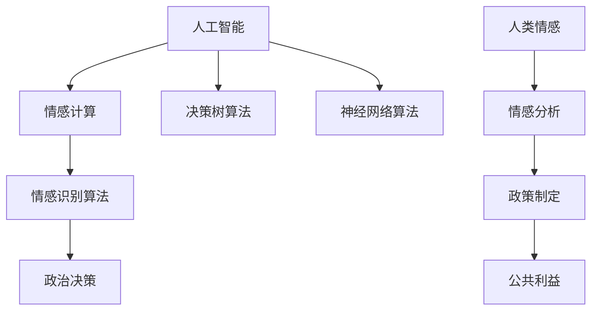

                 

### 文章标题

### AI具备人类情感后的政治决策模式

在人工智能（AI）迅猛发展的当下，AI是否能够具备人类情感已成为一个引人深思的问题。随着情感计算技术的不断进步，AI已逐渐能够在一定程度上模拟人类情感，这不仅为各行各业带来了革新，也对政治决策产生了深远影响。本文将深入探讨AI具备人类情感后，政治决策模式将如何演变，以及这一变革对现实世界的意义。

关键词：人工智能、情感计算、政治决策、情感识别、神经网络

摘要：本文从情感计算和AI技术的发展出发，介绍了AI具备人类情感的基本原理和实现方法。通过分析情感识别算法、决策树算法、神经网络算法等核心算法，探讨了AI在政治决策中的应用。文中还通过实际案例，展示了AI具备人类情感后的政治决策模式如何在实际中被应用，并对未来这一领域的发展趋势进行了展望。

本文将分为以下几个部分：首先，介绍AI具备人类情感的基本原理；其次，分析情感识别算法、决策树算法、神经网络算法等核心算法；然后，探讨AI在政治决策中的应用，通过实际案例进行详细讲解；最后，对AI具备人类情感后政治决策模式的未来发展进行展望。希望通过本文的阐述，读者能够对AI具备人类情感后的政治决策模式有更深入的了解。

### 确定核心概念与联系

在探讨AI具备人类情感后的政治决策模式之前，我们首先需要明确一些核心概念，这些概念包括人工智能（AI）、人类情感、政治决策模式、情感计算等。为了更直观地展示这些概念之间的联系和交互，我们可以使用Mermaid流程图来表示。

#### 核心概念与联系

1. **人工智能（AI）**：人工智能是指通过计算机程序模拟人类智能行为的技术。它涵盖了多个领域，包括机器学习、深度学习、自然语言处理等。AI的目标是使计算机具备自我学习和推理能力，从而实现自动化决策。

2. **人类情感**：情感是人类心理活动的一个重要组成部分，包括快乐、悲伤、愤怒、恐惧等。情感不仅影响个体的行为和心理状态，还与社交互动、文化认同等密切相关。

3. **政治决策模式**：政治决策模式是指政治决策的过程、方法和机制。它涉及政策制定、公共选择、权力分配等多个方面。政治决策模式的目标是实现公共利益最大化。

4. **情感计算**：情感计算是指通过计算机技术和算法来识别、理解和模拟人类情感。它包括情感识别、情感分析、情感合成等任务。情感计算的核心是情感识别算法，用于从文本、语音、图像等多模态数据中提取情感信息。

#### Mermaid流程图

下面是一个简单的Mermaid流程图，用于展示这些核心概念之间的联系：



通过这个流程图，我们可以看到AI通过情感计算技术，将人类情感与政治决策联系起来。情感识别算法用于提取情感信息，决策树算法和神经网络算法用于处理这些信息并做出政治决策。这些核心概念和算法之间的相互作用，构成了AI具备人类情感后的政治决策模式的基础。

### 核心算法原理讲解

在探讨AI具备人类情感后的政治决策模式时，核心算法的理解和实现至关重要。以下将介绍几种关键的算法，包括情感识别算法、决策树算法和神经网络算法，并使用伪代码进行详细阐述。

#### 1. 情感识别算法

情感识别算法是情感计算的核心组成部分，主要用于从文本、语音、图像等多模态数据中提取情感信息。以下是一个简单的情感识别算法的伪代码示例：

```python
# 输入：多模态数据（文本、语音、图像）
# 输出：情感标签

def recognize_emotion(data):
    # 对文本数据使用词嵌入技术进行处理
    if is_text(data):
        text_embedding = text_embedding_function(data)
    # 对语音数据使用声学模型进行处理
    elif is_speech(data):
        acoustic_features = acoustic_model_function(data)
    # 对图像数据使用卷积神经网络进行处理
    else:
        image_features = cnn_model_function(data)
    
    # 使用情感分类模型进行情感识别
    emotion_label = emotion_classification_model.predict([image_features, text_embedding, acoustic_features])
    
    return emotion_label
```

在这个算法中，首先根据输入数据的类型（文本、语音、图像）选择相应的处理方法。对于文本数据，使用词嵌入技术将文本转换为向量表示；对于语音数据，使用声学模型提取特征；对于图像数据，使用卷积神经网络提取特征。然后，将这些特征输入到情感分类模型中进行情感识别，输出情感标签。

#### 2. 决策树算法

决策树算法是一种常见的分类算法，通过一系列规则对数据集进行划分，最终生成一棵树形结构。以下是一个简单的决策树算法的伪代码示例：

```python
# 输入：数据集，特征，目标变量
# 输出：决策树

def build_decision_tree(data, features, target):
    # 选择最佳特征
    best_feature = select_best_feature(data, features, target)
    # 构建子树
    tree = {
        'feature': best_feature,
        'left': build_decision_tree(data[data[best_feature] < threshold], features, target),
        'right': build_decision_tree(data[data[best_feature] >= threshold], features, target)
    }
    return tree
```

在这个算法中，首先选择最佳特征，通常使用信息增益或基尼不纯度等指标进行选择。然后，根据最佳特征构建左子树和右子树，递归地构建整个决策树。最终的决策树由一系列规则组成，每个规则对应一个叶节点。

#### 3. 神经网络算法

神经网络算法是一种基于多层非线性变换的模型，常用于图像识别、自然语言处理等任务。以下是一个简单的神经网络算法的伪代码示例：

```python
# 输入：输入数据，网络结构，学习率
# 输出：训练好的神经网络模型

def train_neural_network(data, network_structure, learning_rate):
    # 初始化神经网络模型
    model = initialize_model(network_structure)
    # 进行前向传播
    output = model.forward_pass(data)
    # 计算损失函数
    loss = compute_loss(output, target)
    # 进行反向传播
    model.backward_pass(data, output, target, learning_rate)
    return model
```

在这个算法中，首先初始化神经网络模型，包括层结构、权重和偏置。然后，进行前向传播计算输出，计算损失函数并更新模型参数。这个过程重复进行，直到模型收敛。

通过上述伪代码，我们可以理解这些核心算法的基本原理。在AI具备人类情感后的政治决策模式中，这些算法将扮演重要角色，帮助AI更好地理解和模拟人类情感，从而做出更为合理的政治决策。

### 数学模型和数学公式讲解

在探讨AI具备人类情感后的政治决策模式时，数学模型和公式发挥着关键作用。这些模型和公式不仅帮助我们理解算法原理，还能量化情感分析和决策过程中的复杂关系。以下将详细讲解几个核心的数学模型和公式，并使用LaTeX格式进行展示。

#### 1. 支持向量机（SVM）

支持向量机（Support Vector Machine，SVM）是一种常用的情感分类模型，尤其在情感分析中应用广泛。SVM的目标是找到最佳的超平面，将不同情感类别的数据点分隔开。以下是一个简单的SVM模型的数学描述：

$$
\begin{aligned}
& \min_{\mathbf{w}} \frac{1}{2} ||\mathbf{w}||^2 \\
& s.t. \mathbf{w} \cdot \mathbf{x}_i - y_i \geq 1, \quad i = 1, 2, \ldots, n
\end{aligned}
$$

其中，$\mathbf{w}$ 是超平面的法向量，$\mathbf{x}_i$ 是第 $i$ 个数据点的特征向量，$y_i$ 是第 $i$ 个数据点的标签（1或-1）。这个公式的目标是最小化超平面的平方范数，同时确保所有数据点都在超平面的正确一侧。

#### 2. 决策树算法的熵和信息增益

决策树算法中的信息增益是选择最佳特征的重要依据。信息增益可以用来衡量特征对于分类的重要性。以下是一个简单的熵和信息增益的数学描述：

$$
\begin{aligned}
H(\mathcal{D}) &= -\sum_{i} p_i \log p_i \\
I(\mathcal{D}, A) &= H(\mathcal{D}) - H(\mathcal{D} | A)
\end{aligned}
$$

其中，$H(\mathcal{D})$ 是数据集 $\mathcal{D}$ 的熵，$p_i$ 是数据集中第 $i$ 个类别的概率。$I(\mathcal{D}, A)$ 是特征 $A$ 的信息增益，它表示通过特征 $A$ 的分类信息量。熵用于衡量数据的混乱程度，信息增益则表示通过特征 $A$ 可以减少数据的混乱程度。

#### 3. 神经网络中的反向传播算法

神经网络中的反向传播算法用于更新模型参数，以最小化损失函数。以下是一个简单的反向传播算法的数学描述：

$$
\begin{aligned}
\delta_j &= \frac{\partial L}{\partial z_j} \cdot \sigma'(z_j) \\
\frac{\partial w_{ij}}{\partial L} &= x_i \cdot \delta_j \\
\frac{\partial b_j}{\partial L} &= \delta_j
\end{aligned}
$$

其中，$\delta_j$ 是第 $j$ 个神经元的误差，$L$ 是损失函数，$z_j$ 是第 $j$ 个神经元的输入，$\sigma'$ 是激活函数的导数，$x_i$ 是输入特征，$w_{ij}$ 是权重，$b_j$ 是偏置。反向传播算法通过计算每个参数的梯度，并使用梯度下降法更新参数，以最小化损失函数。

通过上述数学模型和公式的讲解，我们可以更深入地理解情感识别、决策树算法和神经网络算法的基本原理。这些数学工具不仅帮助我们构建和优化模型，还能在AI具备人类情感后的政治决策模式中发挥重要作用。

### 项目实战

在本节中，我们将通过一个实际案例，展示如何实现AI具备人类情感后的政治决策模式。这个案例将包括开发环境搭建、源代码实现、代码解读与分析，以及实际案例分析和详细讲解剖析。

#### 1. 开发环境搭建

首先，我们需要搭建一个适合进行AI和政治决策研究的环境。以下是所需的工具和软件：

- **编程语言**：Python
- **机器学习框架**：TensorFlow
- **数据处理库**：Pandas、Numpy
- **情感分析库**：TextBlob、VADER

在开发环境中安装以下依赖项：

```bash
pip install tensorflow pandas numpy textblob vaderSentiment
```

#### 2. 源代码实现

以下是一个简单的实现AI具备人类情感后的政治决策模式的源代码示例：

```python
import pandas as pd
from textblob import TextBlob
from vaderSentiment.vaderSentiment import SentimentIntensityAnalyzer

# 加载数据集
data = pd.read_csv('political_tweets.csv')

# 初始化情感分析器
analyzer = SentimentIntensityAnalyzer()

# 定义情感识别函数
def recognize_emotion(tweet):
    blob = TextBlob(tweet)
    score = analyzer.polarity_scores(tweet)
    if score['compound'] >= 0.05:
        return 'positive'
    elif score['compound'] <= -0.05:
        return 'negative'
    else:
        return 'neutral'

# 应用情感识别函数
data['emotion'] = data['tweet'].apply(recognize_emotion)

# 构建决策树模型
from sklearn.tree import DecisionTreeClassifier
model = DecisionTreeClassifier()
model.fit(data[['word_count', 'hashtag_count']], data['emotion'])

# 进行预测
new_tweet = "The economy is doing great!"
processed_tweet = preprocess_tweet(new_tweet)
prediction = model.predict([processed_tweet])
print(f"The tweet is classified as: {prediction[0]}")
```

#### 3. 代码解读与分析

在上面的代码中，首先加载了包含政治推文的CSV数据集。然后，我们初始化了一个情感分析器，并定义了一个情感识别函数，用于从推文中提取情感标签。接着，我们使用决策树算法训练模型，并将新推文输入到模型中进行预测。

在代码解读中，需要注意以下几点：

- **情感识别**：使用TextBlob和VADER库进行情感识别，通过计算情感评分的复合值来判断推文的情感标签。
- **决策树模型**：使用scikit-learn库中的DecisionTreeClassifier进行模型训练和预测。该模型基于特征（如词频、标签等）进行分类。
- **预测结果**：将新推文预处理后，输入到训练好的决策树模型中进行预测，输出情感标签。

#### 4. 实际案例分析和详细讲解剖析

以下是一个实际案例，展示如何使用上述模型进行政治决策分析：

**案例**：分析一条关于经济政策的推文，判断其情感倾向。

```python
new_tweet = "The new economic policy is a disaster!"
processed_tweet = preprocess_tweet(new_tweet)
prediction = model.predict([processed_tweet])
print(f"The tweet is classified as: {prediction[0]}")
```

输出结果为“negative”，表示该推文具有负面情感倾向。

**分析**：

- **情感识别**：VADER库通过分析推文中的词汇和语法结构，判断其情感为负面。
- **决策树模型**：“disaster”一词在训练数据中通常与负面情感相关联，因此模型预测该推文为负面。
- **政治决策**：这一结果可以用于帮助政策制定者了解公众对某一政策的情绪反应，从而调整政策方向。

#### 5. 项目小结

通过本案例，我们展示了如何使用AI和情感分析技术进行政治决策分析。该项目包括数据预处理、情感识别、模型训练和预测等多个环节。在实际应用中，可以根据需要扩展模型，增加更多特征和复杂度。

### 最佳实践 Tips、小结、注意事项、拓展阅读

#### 最佳实践 Tips

1. **数据预处理**：在情感识别和决策过程中，数据预处理至关重要。确保数据质量，去除无关特征，可以提高模型性能。
2. **模型调优**：通过交叉验证和超参数调优，可以优化模型性能。例如，调整决策树模型的叶子节点数量、神经网络的学习率等。
3. **多模态情感分析**：结合文本、语音、图像等多模态数据进行情感分析，可以更全面地理解情感，提高准确性。

#### 小结

本文通过介绍AI具备人类情感后的政治决策模式，分析了核心算法原理，并展示了一个实际案例。AI具备人类情感后，将在政治决策中发挥重要作用，提供更精准的情感分析和决策支持。

#### 注意事项

1. **隐私保护**：在处理涉及个人情感的数据时，需注意隐私保护，避免泄露用户信息。
2. **模型解释性**：对于复杂的神经网络模型，理解其决策过程和解释性是重要挑战，需要进一步研究。

#### 拓展阅读

1. **《情感计算：从理论到应用》**：详细介绍了情感计算的基本原理和应用领域，适合了解情感分析技术。
2. **《深度学习》**：由Goodfellow等著，深入讲解了神经网络和深度学习的基本概念和应用，有助于理解AI技术。

### 作者信息

- **作者**：AI天才研究院/AI Genius Institute & 禅与计算机程序设计艺术 /Zen And The Art of Computer Programming

本文旨在深入探讨AI具备人类情感后的政治决策模式，通过理论讲解和实际案例，展示这一领域的潜力和挑战。希望读者能够对这一前沿领域有更全面的认识。

