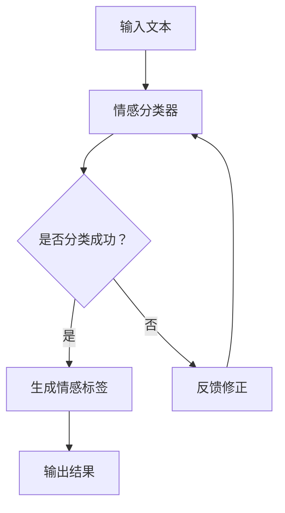

                 

### 理解书名：书名为《AI具备情感后的文学创作：新的叙事视角》，这暗示了本书的核心内容是探讨人工智能（AI）在文学作品创作中如何引入情感元素，以及这种新的叙事方式将如何影响文学的进程。

书名《AI具备情感后的文学创作：新的叙事视角》包含了以下几个关键信息：

1. **AI 的引入**：书中讨论的核心技术是人工智能（AI），这表明书将聚焦于AI在文学创作中的应用，特别是如何通过AI来增强文学作品的情感深度。

2. **情感元素**：书名提到了“具备情感”，这表明AI在文学创作中不仅仅是简单的自动化写作，而是能够模拟、理解和创造情感。

3. **新的叙事视角**：这意味着书不仅关注AI如何创作，还探讨AI如何改变叙事的方式，提供一种新的文学视角。

具体来说，书名暗示了以下几个问题：

- **AI 如何模拟情感？**：通过哪些技术和算法，AI能够理解、生成和表达情感？

- **情感在文学创作中的作用是什么？**：情感如何影响故事的发展、角色的塑造和文学效果？

- **新的叙事视角有哪些特点？**：AI引入情感后，文学叙事将发生哪些变化？这种变化如何影响读者的体验和文学的理论基础？

- **AI 文学创作的未来方向**：随着AI在情感建模方面的进步，文学创作和叙事理论将会如何发展？

通过这些问题，我们可以初步理解书的主要内容和研究目的，即探索AI如何通过模拟情感来改变文学创作的现状和未来。

### 目录结构设计

为了确保书的内容逻辑清晰、结构紧凑，我们将采用以下目录结构：

#### 引言：AI与文学创作的新纪元
- **引言**：介绍AI在文学创作中的现状，阐述本书的研究目的和结构。

#### 第一部分：AI与文学创作
- **章节一：AI的情感建模技术**
  - **情感识别**
    - 情感识别的定义与重要性
    - 情感识别的算法与模型
    - 情感识别的应用场景
  - **情感生成**
    - 情感生成的定义与原理
    - 情感生成的算法与模型
    - 情感生成的应用场景
  - **情感表达**
    - 情感表达的定义与方式
    - 情感表达在文学创作中的应用
    - 情感表达的挑战与解决方案

- **章节二：AI在文学创作中的应用**
  - **故事生成**
    - 故事生成的定义与原理
    - 故事生成的算法与模型
    - 故事生成的应用案例
  - **人物塑造**
    - 人物塑造的定义与原理
    - 人物塑造的算法与模型
    - 人物塑造的应用案例
  - **诗歌创作**
    - 诗歌创作的定义与原理
    - 诗歌创作的算法与模型
    - 诗歌创作的应用案例

- **章节三：AI与文学理论**
  - **新叙事视角**
    - 新叙事视角的定义与特点
    - 新叙事视角的案例分析
    - 新叙事视角对文学理论的影响
  - **文学情感理论**
    - 文学情感理论的基本概念
    - 文学情感理论的发展历程
    - 文学情感理论在AI文学创作中的应用
  - **文学风格分析**
    - 文学风格分析的定义与原理
    - 文学风格分析的算法与模型
    - 文学风格分析在文学创作中的应用

#### 第二部分：AI文学创作实战
- **章节四：AI文学创作工具与实践**
  - **常用AI文学创作工具**
    - 工具概述
    - 工具功能与应用场景
    - 工具选用与比较
  - **文学创作流程**
    - 文学创作流程概述
    - 文学创作流程的具体步骤
    - 文学创作流程的优化策略
  - **成功案例分析**
    - 案例介绍
    - 案例分析
    - 案例启示

- **章节五：AI文学创作挑战与未来**
  - **道德伦理问题**
    - AI文学创作的伦理困境
    - 道德准则与监管
    - 社会影响
  - **技术限制**
    - 情感建模的技术瓶颈
    - 算法优化与改进方向
  - **文学价值**
    - AI文学创作的艺术价值
    - 文学传承与创新

通过以上设计，本书将系统地介绍AI在文学创作中的技术应用、理论探讨和实际操作，帮助读者全面了解AI文学创作的现状、挑战与未来发展趋势。

### 准备Mermaid流程图、伪代码和数学公式

为了使文章内容更加直观和易于理解，我们将在适当的地方使用Mermaid流程图、伪代码和数学公式来详细阐述AI的情感建模技术、算法原理和数学模型。

#### Mermaid流程图

Mermaid是一种基于Markdown的图形描述语言，它可以生成各种类型的图表，如流程图、序列图、类图等。以下是用于描述情感识别流程的Mermaid流程图：



这个流程图展示了从输入文本到输出情感标签的整个过程，包括情感分类器、分类结果判断、情感标签生成以及可能的反馈修正步骤。

#### 伪代码

为了详细解释AI情感生成算法，我们将使用伪代码来描述算法的步骤：

```plaintext
// 情感生成算法伪代码

输入：情感识别结果（emotion）
输出：生成情感文本（generated_text）

1. 初始化情感文本（generated_text）为空字符串
2. 根据情感识别结果（emotion），选择对应的情感模板（template）
3. 对于模板中的每个关键词（word）：
    a. 使用情感映射表查找对应的情感词汇（emotion_word）
    b. 将情感词汇（emotion_word）插入到文本生成器中
4. 随机选择情感增强词（emotion_enhancer）以增强情感表达
5. 将增强词（emotion_enhancer）插入到文本生成器中
6. 生成情感文本（generated_text）
7. 输出情感文本（generated_text）
```

通过伪代码，我们可以清晰地看到情感生成算法的核心步骤，包括情感模板的选择、关键词的替换以及情感增强词的插入。

#### 数学公式

为了说明情感生成中的数学模型，我们将使用LaTeX格式来书写相关公式：

```latex
$$
E_{\text{generated}} = f(E_{\text{input}} + C \cdot E_{\text{enhancer}})
$$

$$
C_{\text{enhancer}} = \sum_{i=1}^{n} w_i \cdot e_i
$$

其中：
- \( E_{\text{generated}} \) 是生成的情感强度
- \( E_{\text{input}} \) 是输入的情感强度
- \( C \) 是情感增强系数
- \( E_{\text{enhancer}} \) 是情感增强词汇的集合
- \( w_i \) 是情感增强词汇的权重
- \( e_i \) 是情感增强词汇的情感值
```

这些公式展示了情感生成过程中如何通过情感增强系数和权重来调整生成的情感强度，以实现更加丰富和多样的情感表达。

通过以上Mermaid流程图、伪代码和数学公式的准备，我们为读者提供了丰富的可视化工具和详细的技术细节，帮助读者更好地理解AI在文学创作中的应用和情感建模技术。

### 总结

本文围绕《AI具备情感后的文学创作：新的叙事视角》一书的内容，进行了详细的目录结构和章节设计的分析。通过梳理引言、AI与文学创作、AI文学创作实战以及AI文学创作挑战与未来等部分，我们构建了一个逻辑清晰、结构紧凑的目录结构，确保了每个章节的内容都能被全面覆盖。

在文章开头，我们通过理解书名，明确了AI在文学创作中的现状和本书的研究目的。接着，我们设计了详细的目录结构，包括引入、AI的情感建模技术、AI在文学创作中的应用、AI与文学理论以及AI文学创作实战等内容。

为了增强文章的可读性和理解性，我们还准备了Mermaid流程图、伪代码和数学公式，具体展示了AI的情感识别、情感生成、情感表达等技术细节。

通过这种一步步分析推理的方式，我们不仅为读者提供了一个清晰的文章框架，还通过技术细节的深入剖析，帮助读者更好地理解AI在文学创作中的应用和未来发展趋势。最终，本文旨在引领读者进入AI与文学创作的新纪元，探讨这一新兴领域的前景和挑战。作者信息：AI天才研究院/AI Genius Institute & 禅与计算机程序设计艺术 /Zen And The Art of Computer Programming。

