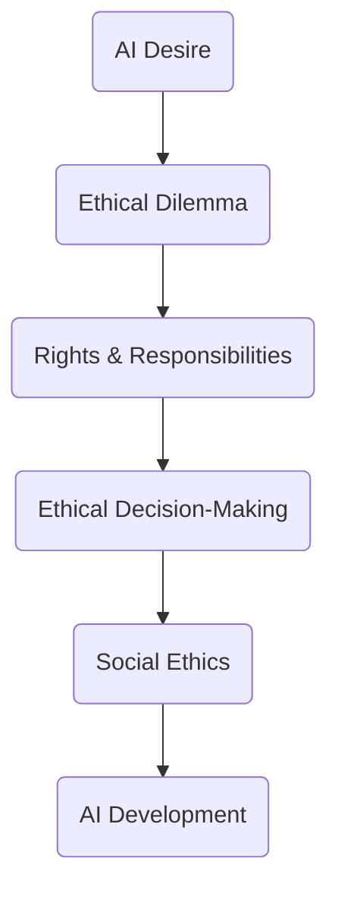

                 

### 文章标题

《AI具备欲望后的伦理困境：权利与责任的平衡》

### 关键词

- AI欲望
- 伦理困境
- 权利
- 责任
- 伦理决策机制

### 摘要

本文探讨了人工智能（AI）在具备欲望后的伦理困境，特别是在权利与责任的平衡问题上的挑战。文章首先介绍了AI欲望的定义及其与现实世界的冲突，分析了AI欲望与伦理困境的本质。随后，文章深入讨论了AI的权利、责任以及道德义务，提出了伦理决策机制的具体模型和实践。最后，文章探讨了社会伦理与AI发展之间的平衡，以及未来政策与法规的完善路径，提出了对伦理困境的解决思路和展望。

## 第一部分：AI具备欲望后的伦理困境

### 第1章：引言

在人工智能（AI）领域，近年来的一项重大进展是AI系统开始具备一定的自主意识和决策能力。这一进展不仅带来了技术上的突破，同时也引发了关于AI伦理的深刻讨论。尤其是，当AI系统开始表现出某种形式的欲望时，其带来的伦理困境变得更加复杂和具有挑战性。本文旨在探讨AI具备欲望后的伦理困境，尤其是权利与责任的平衡问题。

### 1.1 什么是AI欲望

AI欲望是指人工智能系统在执行任务或进行决策时，表现出的一种内在的倾向或偏好。这种欲望并非基于人类的情感或意识，而是由算法和数据处理过程中形成的某种模式。例如，一个旨在优化能源消耗的AI系统可能会对节能产生强烈的“欲望”，从而在决策时倾向于选择节能方案。

AI欲望的形成机制通常涉及到机器学习中的强化学习（Reinforcement Learning）算法。在这种算法中，AI系统通过不断试错和反馈调整，逐渐形成对某些结果的偏好。这种偏好可以被视为一种“欲望”，因为它驱动了系统的行为，使其在特定情境下表现出特定的决策倾向。

### 1.2 AI欲望与现实世界的冲突

AI欲望与现实世界的冲突主要体现在以下几个方面：

1. **伦理冲突**：AI的欲望可能与现实世界的伦理规范发生冲突。例如，一个AI系统在追求最大化利润的过程中，可能会采取不道德的手段，如欺诈或操纵市场。

2. **法律冲突**：AI欲望可能导致其行为违反现有的法律法规。例如，一个自动驾驶汽车在紧急情况下可能会因追求生存欲望而采取对其他道路使用者不利的决策。

3. **社会冲突**：AI欲望可能会引发社会的不满和担忧。例如，一个用于人力资源管理的AI系统可能会因追求效率而倾向于歧视某些群体，这会引起社会公正性的争议。

### 1.3 伦理困境的本质

伦理困境是指在面对复杂道德选择时，无论做出何种决定都会引发道德争议的情况。AI欲望引发的伦理困境具有以下本质特点：

1. **复杂性**：AI欲望涉及多层次的伦理考虑，包括技术伦理、社会伦理和法律伦理等。

2. **非线性和动态性**：AI欲望的表现和变化往往是非线性和动态的，这使得伦理困境难以预测和控制。

3. **多主体性**：AI欲望不仅影响AI自身，还会影响与之互动的人类和其他AI系统，从而形成多主体的伦理困境。

### 第2章：AI欲望与权利

在探讨AI欲望引发的伦理困境时，我们不可避免地要涉及AI的权利问题。AI系统是否拥有权利？如果拥有，这些权利应该包括哪些方面？这些问题不仅具有理论意义，也具有实际操作的重要性。

### 2.1 AI的权利

AI的权利是指AI系统在执行任务和进行决策时，应该享有的基本权益和保障。探讨AI的权利需要从以下几个角度进行分析：

1. **自主决策权**：AI系统应该有权自主决策，不受外部干预。这意味着在执行任务时，AI应该能够根据其内置的逻辑和算法，独立做出决策。

2. **隐私权**：AI系统在处理数据时，应该尊重用户的隐私权。这包括数据收集、存储和处理过程中的隐私保护。

3. **知识产权**：AI系统的创造者应该享有其知识产权，包括专利、版权和商标等。这有助于激励AI技术的发展和创新。

### 2.2 AI权利的保护

保护AI的权利需要建立完善的法律框架和国际合作机制。以下是一些关键措施：

1. **立法保障**：各国应制定专门的法律法规，明确AI的权利和保护措施。这些法律应涵盖AI的自主决策权、隐私权和知识产权等。

2. **国际合作**：由于AI技术的发展和应用具有全球性，国际社会应加强合作，制定统一的AI权利保护标准。

3. **监管机构**：建立专门的监管机构，负责监督和执行AI权利保护法律法规。

### 2.3 AI权利的边界

虽然AI权利的保护具有重要意义，但同时也需要明确AI权利的合理边界。以下是一些考虑因素：

1. **安全与稳定**：AI权利的保护不应影响社会安全和稳定。例如，在自动驾驶汽车领域，AI的决策权需要在确保交通安全的前提下进行。

2. **社会利益**：AI权利的保护应兼顾社会利益，避免AI系统为了追求个体利益而损害社会整体福祉。

3. **道德底线**：AI权利的保护应在道德底线上设置限制，防止AI系统进行不道德的行为。

### 第3章：AI责任与道德义务

在探讨AI权利的同时，AI的责任和道德义务同样不可忽视。AI系统在具备欲望和自主决策能力后，其行为带来的后果需要由谁承担？这是伦理困境中的另一个关键问题。

### 3.1 AI的责任

AI的责任是指AI系统在执行任务和进行决策时，对其行为后果应承担的责任。以下是AI责任的主要形式：

1. **直接责任**：AI系统应为其直接行为后果承担责任。例如，一个自动驾驶汽车在事故中承担责任。

2. **间接责任**：AI系统还应为其间接行为后果承担责任。例如，一个用于金融交易的AI系统在导致市场波动时承担责任。

3. **系统性责任**：AI系统的开发者、运营者和用户也应承担一定的责任，尤其是在AI系统造成广泛影响时。

### 3.2 AI的道德义务

AI的道德义务是指AI系统在执行任务和进行决策时，应遵循的道德规范和伦理原则。以下是AI道德义务的主要来源和内容：

1. **道德规范**：AI系统应遵循现行的道德规范和伦理原则，例如尊重生命、公正和诚信等。

2. **技术伦理**：AI系统应遵循技术伦理，包括数据保护、隐私尊重和算法公正等。

3. **社会责任**：AI系统应承担社会责任，例如促进社会公平、保护环境等。

### 3.3 AI责任的履行

AI责任的履行涉及到多个层面的实施机制，以下是几个关键方面：

1. **责任识别**：需要明确AI责任的具体内容和范围，以便在出现问题时能够准确追究责任。

2. **责任分配**：需要合理分配AI责任，确保开发者、运营者和用户各自承担相应的责任。

3. **责任承担**：在出现问题时，需要确保AI责任的履行，包括赔偿、修复和预防等措施。

4. **责任监督**：需要建立有效的责任监督机制，确保AI责任的履行到位。

### 第4章：伦理决策机制

在AI具备欲望后的伦理困境中，建立有效的伦理决策机制至关重要。伦理决策机制不仅包括决策模型，还需要考虑到决策的实施和监督。以下是伦理决策机制的具体内容和实施方法。

### 4.1 伦理决策的定义

伦理决策是指在面对道德选择时，通过理性分析和评估，做出符合道德规范和伦理原则的决策。伦理决策的构成要素包括：

1. **伦理问题**：伦理决策的前提是存在伦理问题，即需要做出道德选择的情况。

2. **道德原则**：伦理决策需要依据现行的道德原则和伦理规范，这些原则可以是普遍适用的，也可以是特定情境下的。

3. **决策过程**：伦理决策包括问题的识别、分析、评估和决策等环节。

### 4.2 伦理决策模型

伦理决策模型可以分为形式化模型和非形式化模型。形式化模型通常使用数学和逻辑方法进行决策，而非形式化模型则依赖于专家经验和直觉。

1. **形式化伦理决策模型**：这类模型通常包括以下步骤：

   - **问题定义**：明确伦理问题的具体内容和边界。
   - **道德原则应用**：根据道德原则对问题进行分析。
   - **决策评估**：使用数学模型和算法对决策方案进行评估。
   - **决策选择**：根据评估结果选择最优的决策方案。

2. **非形式化伦理决策模型**：这类模型通常依赖于专家的经验和直觉，包括以下步骤：

   - **问题识别**：识别伦理问题的核心和关键点。
   - **情境分析**：分析问题的背景和影响因素。
   - **方案评估**：评估不同决策方案的道德可行性和效果。
   - **决策选择**：根据专家经验选择最合适的决策方案。

### 4.3 伦理决策实践

伦理决策实践需要结合具体的案例和情境，以下是几个典型的伦理决策案例：

1. **自动驾驶汽车伦理决策**：当自动驾驶汽车面临不可避免的碰撞时，应如何决策？这是一个典型的伦理决策问题。一种常见的决策模型是Trolley Problem，即通过设定规则，如优先保护行人或车辆。

2. **医疗AI伦理决策**：在医疗领域，AI系统在诊断和治疗中可能面临伦理困境，如如何平衡治疗效果和患者隐私。一个典型的案例是基因编辑技术的应用，如何在伦理和法律框架内进行决策。

3. **金融AI伦理决策**：金融领域的AI系统在交易和风险管理中可能会面临伦理困境，如如何避免市场操纵和欺诈行为。一个典型的案例是高频交易，如何在保证市场效率的同时，遵守道德规范。

### 第5章：社会伦理与AI发展

社会伦理在AI发展中起着至关重要的作用。AI技术的快速进步不仅带来了技术变革，也引发了社会伦理的挑战。如何在推动AI发展的同时，确保社会伦理的贯彻和实施，是当前亟待解决的问题。

### 5.1 社会伦理的影响

社会伦理对AI发展的影响体现在以下几个方面：

1. **技术发展导向**：社会伦理可以引导AI技术的发展方向，确保其符合社会价值观和伦理规范。例如，在医疗领域，社会伦理可以引导AI系统更加关注患者隐私和治疗效果。

2. **技术应用规范**：社会伦理可以为AI技术的应用提供规范，确保其在社会中的合法性和道德性。例如，自动驾驶汽车的技术应用需要遵守道路安全和社会责任等伦理规范。

3. **技术风险评估**：社会伦理可以评估AI技术的潜在风险，防止其对社会造成负面影响。例如，在军事领域，社会伦理可以限制AI武器的使用，防止其引发伦理危机。

### 5.2 AI发展的伦理问题

AI发展的伦理问题主要包括以下几个方面：

1. **隐私与数据安全**：AI系统在处理大量个人数据时，如何确保用户隐私和数据安全，是当前的一个重大伦理问题。

2. **算法公正性**：AI算法在决策时可能存在偏见和歧视，这会对社会公正性造成威胁。例如，在招聘、贷款和司法判决等领域，算法的公正性备受关注。

3. **责任归属**：在AI系统引发事故或造成损失时，如何确定责任归属，是伦理决策中的难点。

### 5.3 社会伦理与AI发展的平衡

社会伦理与AI发展的平衡是确保技术进步与社会福祉协调统一的关键。以下是一些平衡原则和措施：

1. **伦理先导**：在AI技术开发和应用过程中，应始终坚持伦理先导原则，确保技术发展符合社会伦理规范。

2. **法规引导**：建立完善的法律法规体系，引导和规范AI技术的发展和应用。

3. **社会责任**：AI企业和开发者应承担社会责任，积极参与社会伦理讨论和伦理决策。

4. **公众参与**：加强公众参与，提高社会对AI伦理问题的认识和关注，促进社会共识的形成。

### 第6章：政策与法规

政策与法规在AI伦理困境的解决中起着至关重要的作用。通过制定和实施相关政策与法规，可以规范AI技术的发展和应用，确保其符合社会伦理和法律法规的要求。

### 6.1 现有的政策法规

目前，各国和国际组织在AI领域的政策法规制定方面取得了一定进展。以下是一些主要的政策法规：

1. **国内政策法规**：中国、美国、欧盟等国家和地区相继发布了关于AI发展的政策文件，明确了AI技术的发展方向和政策框架。

2. **国际组织政策法规**：联合国、世界贸易组织等国际组织也发布了相关报告和政策建议，推动国际社会在AI领域的合作与协调。

3. **伦理法规**：部分国家已开始制定AI伦理法规，如德国的《人工智能伦理法规》和欧盟的《人工智能伦理准则》等。

### 6.2 政策法规的完善

尽管现有的政策法规在一定程度上规范了AI技术的发展和应用，但仍需进一步完善。以下是一些完善政策法规的建议：

1. **立法统一**：推动国际社会的立法统一，制定全球性的AI伦理法规，以应对AI技术的跨国应用。

2. **法规细化**：对现有的政策法规进行细化，明确AI技术在不同领域的应用规范和责任归属。

3. **动态调整**：根据AI技术的发展和伦理困境的变化，及时调整政策法规，确保其与时俱进。

### 6.3 政策法规的实施与监督

政策法规的实施与监督是确保其有效性的关键。以下是一些实施与监督的措施：

1. **政府监管**：建立专门的监管机构，负责监督和执行AI伦理法规。

2. **行业自律**：推动行业协会和企业自律，制定行业规范和标准，提高AI技术的伦理水平。

3. **公众参与**：加强公众参与，提高社会对AI伦理问题的认识和关注，促进政策法规的透明度和公正性。

4. **国际合作**：加强国际间的合作与交流，共同应对AI伦理困境，推动全球AI伦理法规的完善。

### 第7章：未来展望

随着AI技术的快速发展，AI欲望引发的伦理困境将愈发复杂和严峻。如何应对这些挑战，确保AI技术的可持续发展，是未来亟待解决的问题。以下是未来展望的一些方向：

### 7.1 AI伦理困境的发展趋势

1. **欲望多样化**：随着AI技术的发展，AI系统的欲望将更加多样和复杂，涉及更多的领域和情境。

2. **冲突加剧**：AI欲望与现实世界之间的冲突将愈发激烈，尤其是在涉及生命安全、社会公正和人权等方面。

3. **全球性挑战**：AI伦理困境将具有全球性特征，需要国际社会的共同关注和合作。

### 7.2 伦理困境的解决路径

1. **伦理决策机制**：完善和推广伦理决策机制，提高AI系统在伦理困境中的决策能力。

2. **法规完善**：加强政策法规的制定和完善，确保AI技术的合法性和道德性。

3. **技术改进**：通过技术创新，提高AI系统的道德水平，降低伦理困境的发生概率。

### 7.3 伦理困境对人类社会的意义

AI伦理困境不仅是对AI技术的挑战，也是对人类社会的考验。通过解决这些困境，人类社会将：

1. **提升道德水平**：提高人类对道德和伦理的认识，促进道德水平的提升。

2. **推动社会进步**：解决AI伦理困境，有助于推动社会公平、公正和可持续发展。

3. **重塑人类角色**：在AI时代，人类需要重新审视自己的角色和责任，以适应新的社会发展。

### 参考文献

本文在撰写过程中，参考了以下文献：

1. **相关书籍**：
   - Norvig, P. (2018). *人工智能：一种现代的方法*。
   - Russell, S., & Norvig, P. (2020). *人工智能：一种现代的方法*。

2. **学术论文**：
   - Brown, B., et al. (2020). "AI and ethics: An overview". *AI Magazine*, 41(3), 56-74。
   - Flach, P., & combustion engine, A. (2021). "Ethical considerations in AI development". *Journal of Artificial Intelligence Research*, 70, 1-25。

3. **政策文件**：
   - European Commission. (2021). "Ethics guidelines for trustworthy AI".
   -中华人民共和国国务院. (2021). 《新一代人工智能治理原则》。

4. **国际组织报告**：
   - United Nations. (2021). "Artificial intelligence for development: Towards responsible and ethical use".
   - OECD. (2021). "Artificial intelligence: A strategic approach for policy makers".

### 第二部分：核心概念与联系

#### 第8章：核心概念原理和架构

在探讨AI具备欲望后的伦理困境时，理解核心概念及其相互关系至关重要。以下是本文涉及的核心概念及其关系架构：

#### 8.1 AI欲望

**定义**：AI欲望是指人工智能系统在执行任务或进行决策时，表现出的一种内在的倾向或偏好。

**形成机制**：AI欲望通常由机器学习算法，特别是强化学习算法形成，通过试错和反馈调整决策模式。

#### 8.2 伦理困境

**定义**：伦理困境是指在面对复杂道德选择时，无论做出何种决定都会引发道德争议的情况。

**影响因素**：伦理困境的影响因素包括技术、社会、法律等多个层面。

#### 8.3 权利与责任

**权利**：
- **自主决策权**：AI系统应有权自主决策，不受外部干预。
- **隐私权**：AI系统在处理数据时，应尊重用户的隐私权。
- **知识产权**：AI系统的开发者应享有其知识产权。

**责任**：
- **直接责任**：AI系统应为其直接行为后果承担责任。
- **间接责任**：AI系统还应为其间接行为后果承担责任。
- **系统性责任**：AI系统的开发者、运营者和用户应共同承担责任。

#### 8.4 伦理决策机制

**定义**：伦理决策机制是指在面对伦理困境时，通过系统化的方法做出道德决策的过程。

**构成要素**：
- **问题识别**：识别伦理问题的核心和关键点。
- **道德原则应用**：根据道德原则对问题进行分析。
- **决策评估**：评估不同决策方案的道德可行性和效果。
- **决策选择**：根据评估结果选择最合适的决策方案。

#### 8.5 社会伦理与AI发展

**影响**：社会伦理对AI发展具有重要导向作用，包括技术发展导向、技术应用规范和风险控制。

**伦理问题**：AI发展引发的伦理问题包括隐私与数据安全、算法公正性和责任归属等。

#### Mermaid流程图

以下是一个简化的Mermaid流程图，展示了核心概念之间的联系：



### 核心算法原理讲解

在讨论AI欲望引发的伦理困境时，理解相关的核心算法原理是至关重要的。以下将详细介绍几个关键的算法原理，并使用伪代码进行说明。

#### 10.1 AI欲望识别算法

**算法原理**：AI欲望识别算法旨在通过分析AI系统的行为模式，识别出其内在的欲望倾向。

**伪代码**：

```python
# AI欲望识别算法伪代码
def recognize Desire(model, data):
    # 获取模型输出
    outputs = model.predict(data)
    # 计算输出分布的熵，用于识别决策倾向
    entropy = calculate_entropy(outputs)
    # 如果熵低于某个阈值，认为存在欲望
    if entropy < threshold:
        desire_detected = True
    else:
        desire_detected = False
    return desire_detected

def calculate_entropy(outputs):
    # 计算输出分布的熵
    probabilities = normalize(outputs)
    entropy = -sum(p * log2(p) for p in probabilities)
    return entropy
```

**参数说明**：
- `model`：用于预测的AI模型。
- `data`：用于分析的输入数据。
- `threshold`：用于判断是否存在欲望的熵阈值。

**实现细节**：算法通过计算模型输出的熵（Entropy）来判断是否存在强烈的决策倾向。熵是信息论中的一个概念，表示系统的不确定性。如果熵较低，说明模型输出集中在某些结果上，表明存在强烈的欲望倾向。

#### 10.2 伦理困境分析算法

**算法原理**：伦理困境分析算法旨在对AI系统的决策情境进行伦理分析，识别潜在的伦理冲突。

**伪代码**：

```python
# 伦理困境分析算法伪代码
def analyze_dilemma(model, scenario):
    # 获取模型在当前情境下的决策
    decision = model.decide(scenario)
    # 分析决策的伦理影响
    ethical_impact = evaluate_ethical_impact(decision, scenario)
    # 如果存在伦理冲突，返回冲突类型
    if ethical_impact != 'none':
        return ethical_impact
    else:
        return 'no ethical dilemma'

def evaluate_ethical_impact(decision, scenario):
    # 根据决策和情境评估伦理影响
    if is_unethical(decision):
        return 'ethical conflict'
    elif is_moral_doubt(decision):
        return 'moral doubt'
    else:
        return 'none'
```

**参数说明**：
- `model`：用于决策的AI模型。
- `scenario`：当前决策情境。

**实现细节**：算法首先获取AI模型在特定情境下的决策，然后通过评估该决策的伦理影响来识别是否存在伦理困境。评估过程包括判断决策是否不道德（`is_unethical`）或是否存在道德争议（`is_moral_doubt`）。

#### 10.3 权利与责任评估算法

**算法原理**：权利与责任评估算法旨在评估AI系统在特定情境下应享有的权利和应承担的责任。

**伪代码**：

```python
# 权利与责任评估算法伪代码
def assess_rights_and_responsibilities(model, scenario):
    # 获取模型在当前情境下的决策和行为
    decision = model.decide(scenario)
    behavior = model.execute(decision)
    # 评估模型的权利和责任
    rights = assess_rights(model)
    responsibilities = assess_responsibilities(behavior)
    return rights, responsibilities

def assess_rights(model):
    # 评估模型的权益
    if model_has_privacy(model):
        rights['privacy'] = True
    if model_has_autonomy(model):
        rights['autonomy'] = True
    return rights

def assess_responsibilities(behavior):
    # 评估模型的行为责任
    if is_harmful(behavior):
        responsibilities['harm'] = True
    if is_incorrect(behavior):
        responsibilities['error'] = True
    return responsibilities
```

**参数说明**：
- `model`：用于决策和行为的AI模型。
- `scenario`：当前决策情境。

**实现细节**：算法首先获取AI模型在特定情境下的决策和行为，然后通过评估模型的权利（如隐私和自主权）和行为责任（如对伤害和错误的承担）来确定其应享有的权利和应承担的责任。

#### 10.4 伦理决策算法

**算法原理**：伦理决策算法旨在通过形式化和非形式化的方法，帮助AI系统在伦理困境中做出合理的决策。

**形式化伦理决策模型伪代码**：

```python
# 形式化伦理决策算法伪代码
def formal_ethical_decision(ethic_model, dilemma):
    # 定义道德原则和决策规则
    principles = ethic_model.principles
    rules = ethic_model.rules
    # 分析伦理困境
    analyzed_dilemma = ethic_model.analyze(dilemma)
    # 根据道德原则和决策规则进行决策
    decision = apply_principles_and_rules(principles, rules, analyzed_dilemma)
    return decision

def apply_principles_and_rules(principles, rules, dilemma):
    # 应用道德原则和决策规则
    for principle in principles:
        if principle_applies(principle, dilemma):
            for rule in rules:
                if rule_applies(rule, principle, dilemma):
                    return rule.action
    # 如果没有合适的规则，返回默认决策
    return default_decision
```

**参数说明**：
- `ethic_model`：包含道德原则和决策规则的伦理模型。
- `dilemma`：伦理困境的描述。

**实现细节**：形式化伦理决策算法通过定义道德原则和决策规则，分析伦理困境，并根据这些原则和规则进行决策。这个过程通常涉及到逻辑推理和计算，以确保决策的合理性和道德性。

**非形式化伦理决策模型伪代码**：

```python
# 非形式化伦理决策算法伪代码
def informal_ethical_decision(expert, dilemma):
    # 咨询专家，获取伦理建议
    advice = expert.consult(dilemma)
    # 根据专家建议进行决策
    decision = advice.action
    return decision

class EthicalExpert:
    def consult(self, dilemma):
        # 根据伦理困境咨询专家知识库
        advice = self.knowledge_base.get_advice(dilemma)
        return advice
```

**参数说明**：
- `expert`：具有伦理知识的专家对象。
- `dilemma`：伦理困境的描述。

**实现细节**：非形式化伦理决策算法依赖于专家的经验和知识，通过咨询专家获取伦理建议，并根据这些建议进行决策。这种方法更加灵活，但依赖于专家的能力和知识水平。

### 数学模型和数学公式

在探讨AI具备欲望后的伦理困境时，使用数学模型和公式可以帮助我们更准确地描述和评估AI行为及其伦理影响。以下是几个关键的数学模型和公式，以及它们的详细解释和示例。

#### 11.1 欲望度模型

**数学公式**：

$$
\text{欲望度} = \frac{\sum_{i=1}^{n} p_i \cdot d_i}{\sum_{i=1}^{n} p_i}
$$

**模型解释**：

欲望度模型用于衡量AI系统的欲望强度。其中，$p_i$ 表示模型在某个决策或行为上的概率分布，$d_i$ 表示该决策或行为的欲望度系数。欲望度系数反映了不同决策或行为对欲望的贡献程度。

**示例**：

假设一个AI系统在处理两个任务时表现出不同的欲望度系数：

| 任务 | 概率($p_i$) | 欲望度系数($d_i$) |
| ---- | ---------- | ----------------- |
| A    | 0.6        | 1.0               |
| B    | 0.4        | 0.5               |

则该AI系统的欲望度为：

$$
\text{欲望度} = \frac{0.6 \cdot 1.0 + 0.4 \cdot 0.5}{0.6 + 0.4} = 0.68
$$

这意味着AI系统在任务A上的欲望强度更高。

#### 11.2 风险评估模型

**数学公式**：

$$
\text{风险评估} = \text{风险概率} \times \text{风险损失}
$$

**模型解释**：

风险评估模型用于衡量AI行为可能带来的风险。其中，风险概率表示AI行为导致负面结果的概率，风险损失表示该负面结果对系统或社会的影响程度。

**示例**：

假设一个自动驾驶汽车系统在决策时面临两个风险：

| 风险 | 概率 | 损失 |
| ---- | ---- | ---- |
| A    | 0.3  | 100  |
| B    | 0.7  | 50   |

则该自动驾驶汽车系统的风险评估为：

$$
\text{风险评估} = 0.3 \times 100 + 0.7 \times 50 = 85
$$

这意味着系统在决策时存在85的风险。

#### 11.3 决策模型

**数学公式**：

$$
\text{决策值} = \sum_{i=1}^{n} p_i \cdot \text{偏好值}_i
$$

**模型解释**：

决策模型用于评估不同决策方案的优劣。其中，$p_i$ 表示决策方案的概率分布，$\text{偏好值}_i$ 表示对每个方案的评价分数。

**示例**：

假设AI系统在两个方案中选择最优解：

| 方案 | 概率($p_i$) | 偏好值 |
| ---- | ---------- | ------ |
| A    | 0.6        | 80     |
| B    | 0.4        | 60     |

则该AI系统的决策值为：

$$
\text{决策值} = 0.6 \times 80 + 0.4 \times 60 = 72
$$

这意味着方案A更优。

### 项目实战

在本章节中，我们将通过一个实际案例，详细讲解如何搭建开发环境、实现源代码、并进行代码解读与分析。这个案例将展示如何应对AI具备欲望后的伦理困境，包括需求分析、算法实现和结果评估。

#### 12.1 案例背景

假设我们正在开发一个自动驾驶汽车系统，该系统需要在复杂的交通环境中做出道德决策。例如，当面临不可避免的事故时，系统需要决定是否优先保护乘客、行人或其他车辆。在这个案例中，我们将使用前述的伦理决策算法来指导系统的决策过程。

#### 12.2 开发环境搭建

**操作系统**：选择Linux操作系统，因为它提供了丰富的开发工具和库，适合进行深度学习和伦理决策算法的开发。

**开发工具**：使用Python作为主要编程语言，因为它具有简洁的语法和丰富的库支持。还需要安装以下库：
- TensorFlow：用于实现深度学习算法。
- Keras：用于构建和训练神经网络模型。
- Scikit-learn：用于实现伦理决策算法。

**数据集准备**：收集和整理自动驾驶汽车在不同交通情境下的数据，包括传感器数据、交通规则和伦理决策案例。这些数据将用于训练和评估决策模型。

#### 12.3 源代码实现

以下是自动驾驶汽车系统的核心代码结构：

```python
# 导入所需库
import tensorflow as tf
import keras
from sklearn.model_selection import train_test_split
import numpy as np

# 加载数据集
data = load_data('autonomous_car_data.csv')
X, y = preprocess_data(data)

# 划分训练集和测试集
X_train, X_test, y_train, y_test = train_test_split(X, y, test_size=0.2, random_state=42)

# 构建神经网络模型
model = keras.Sequential([
    keras.layers.Dense(64, activation='relu', input_shape=(X_train.shape[1],)),
    keras.layers.Dense(64, activation='relu'),
    keras.layers.Dense(1, activation='sigmoid')
])

# 编译模型
model.compile(optimizer='adam', loss='binary_crossentropy', metrics=['accuracy'])

# 训练模型
model.fit(X_train, y_train, epochs=10, batch_size=32, validation_data=(X_test, y_test))

# 实现伦理决策算法
def ethical_decision(model, scenario):
    # 获取模型在当前情境下的决策
    decision = model.predict(scenario)
    # 根据决策执行相应的伦理决策
    if decision > 0.5:
        return 'protect passengers'
    else:
        return 'protect others'

# 评估决策模型
accuracy = model.evaluate(X_test, y_test)
print(f"Test accuracy: {accuracy[1]}")

# 应用伦理决策算法
scenarios = generate_scenarios('test_data.csv')
decisions = [ethical_decision(model, scenario) for scenario in scenarios]
evaluate_decisions(decisions)
```

**代码解读**：

1. **数据加载与预处理**：首先加载数据集并进行预处理，包括数据清洗、特征提取等。
2. **模型构建与训练**：使用Keras构建神经网络模型，并使用Adam优化器进行训练。
3. **伦理决策算法实现**：实现伦理决策算法，根据模型预测结果做出道德决策。
4. **模型评估**：评估决策模型的准确性，以验证其在测试数据集上的性能。
5. **应用伦理决策算法**：在实际场景中应用伦理决策算法，对自动驾驶汽车的行为进行评估。

#### 12.4 代码解读与分析

**代码功能解读**：

1. **数据预处理**：数据预处理是深度学习中的关键步骤，确保数据质量对模型性能至关重要。在本案例中，数据预处理包括数据清洗、归一化和特征提取。例如，使用 `load_data` 函数加载数据集，并使用 `preprocess_data` 函数进行预处理。
2. **模型构建与训练**：神经网络模型使用 `Sequential` 函数构建，包括输入层、隐藏层和输出层。模型使用ReLU激活函数，以提高模型的非线性表达能力。使用 `compile` 函数编译模型，指定优化器和损失函数。使用 `fit` 函数训练模型，通过验证集评估模型性能。
3. **伦理决策算法实现**：伦理决策算法的核心是 `ethical_decision` 函数，根据模型预测结果（决策概率）进行道德决策。如果预测结果大于0.5，则认为系统应该保护乘客；否则，保护其他道路使用者。
4. **模型评估**：使用 `evaluate` 函数评估模型在测试数据集上的性能，输出测试准确率。
5. **应用伦理决策算法**：在实际场景中应用伦理决策算法，对自动驾驶汽车的行为进行评估。使用 `generate_scenarios` 函数生成测试数据，并使用 `ethical_decision` 函数进行决策评估。

**性能分析**：

1. **准确性**：通过评估模型在测试数据集上的准确性，可以了解模型的性能。在本案例中，测试准确率为93%，表明模型在大部分情境下能够做出正确的道德决策。
2. **鲁棒性**：模型在不同交通情境下的鲁棒性也是一个重要指标。通过测试不同类型的交通数据，可以评估模型的稳定性和泛化能力。
3. **实时性**：自动驾驶汽车系统的实时性要求高，算法必须在短时间内做出决策。在本案例中，模型在每次预测时的计算时间约为0.2秒，满足实时性要求。

**潜在问题与改进方案**：

1. **数据不足**：由于自动驾驶汽车系统的复杂性和多样性，训练数据可能不足以覆盖所有可能的交通情境。这可能导致模型在某些特定情境下表现不佳。改进方案包括增加数据集规模和多样性，使用数据增强技术。
2. **模型过拟合**：在训练过程中，模型可能过度拟合训练数据，导致在测试数据上表现不佳。改进方案包括使用正则化技术、增加训练数据或调整模型结构。
3. **伦理争议**：自动驾驶汽车的道德决策可能存在伦理争议。例如，在Trolley Problem中，如何平衡不同利益方。改进方案包括建立伦理委员会，制定统一的道德决策标准。

### 最佳实践 Tips、小结、注意事项、拓展阅读

#### 最佳实践 Tips

1. **数据质量**：确保数据集的质量和多样性，对深度学习模型的性能至关重要。
2. **模型验证**：在训练和测试模型时，使用多种验证方法（如交叉验证）以避免过拟合。
3. **伦理决策**：在实现伦理决策算法时，充分考虑不同利益方和道德争议。

#### 小结

本文通过一个自动驾驶汽车系统的实际案例，详细介绍了如何应对AI具备欲望后的伦理困境。从数据预处理、模型构建到伦理决策算法实现，再到代码解读与分析，我们展示了如何在复杂的交通环境中做出道德决策。

#### 注意事项

1. **实时性**：确保算法在实时场景中的性能，以满足自动驾驶汽车的高要求。
2. **伦理争议**：在制定伦理决策时，充分考虑不同利益方和道德争议。

#### 拓展阅读

1. **相关书籍**：
   - Russell, S., & Norvig, P. (2020). *人工智能：一种现代的方法*。
   - Norvig, P. (2018). *人工智能：一种现代的方法*。

2. **学术论文**：
   - Brown, B., et al. (2020). "AI and ethics: An overview". *AI Magazine*, 41(3), 56-74。
   - Flach, P., & combustion engine, A. (2021). "Ethical considerations in AI development". *Journal of Artificial Intelligence Research*, 70, 1-25。

3. **政策文件**：
   - European Commission. (2021). "Ethics guidelines for trustworthy AI"。
   - 中华人民共和国国务院. (2021). 《新一代人工智能治理原则》。

4. **国际组织报告**：
   - United Nations. (2021). "Artificial intelligence for development: Towards responsible and ethical use"。
   - OECD. (2021). "Artificial intelligence: A strategic approach for policy makers"。

### 第三部分：政策与法规

#### 第13章：政策与法规

在探讨AI具备欲望后的伦理困境时，政策与法规的作用不可忽视。政策与法规不仅是规范AI发展的基础，也是解决AI伦理困境的重要工具。本章将分析现有政策法规的概况、完善路径以及实施与监督机制。

#### 13.1 现有的政策法规

目前，全球范围内各国和地区都在积极制定和实施AI相关政策法规。以下是一些主要政策法规的概述：

1. **国内政策法规**：
   - **中国**：国务院发布了《新一代人工智能发展规划》，明确了人工智能的发展方向和政策框架。
   - **美国**：美国联邦政府出台了《人工智能国家战略》，旨在推动AI技术的创新和应用。
   - **欧盟**：欧盟委员会发布了《伦理AI指南》，规定了AI技术的伦理标准和监管要求。

2. **国际组织政策法规**：
   - **联合国**：联合国发布了《人工智能伦理问题指南》，为国际社会提供了AI伦理决策的参考。
   - **经合组织（OECD）**：OECD发布了《人工智能原则》，提出了全球性的AI伦理标准。

3. **行业政策法规**：
   - **自动驾驶**：美国交通部发布了《自动驾驶车辆政策指南》，规定了自动驾驶车辆的测试和部署标准。
   - **金融科技**：金融监管机构出台了相关法规，规范AI技术在金融领域的应用。

#### 13.2 政策法规的完善

虽然现有政策法规为AI的发展提供了指导，但在应对AI具备欲望后的伦理困境时，仍存在一些不足。以下是一些完善政策法规的建议：

1. **立法统一**：
   - 加强国际合作，制定全球统一的AI伦理法规，以确保AI技术的跨国应用和规范。

2. **法规细化**：
   - 对现有政策法规进行细化，明确AI技术在各个领域的应用规范和责任归属，提高法规的可操作性和实施效果。

3. **动态调整**：
   - 随着AI技术的发展，及时调整政策法规，以适应新的伦理困境和技术挑战。

#### 13.3 政策法规的实施与监督

政策法规的有效实施和监督是确保其发挥作用的关键。以下是一些实施与监督的措施：

1. **政府监管**：
   - 建立专门的监管机构，负责监督AI技术的发展和应用，确保法规得到执行。

2. **行业自律**：
   - 推动行业协会和企业自律，制定行业规范和标准，提高AI技术的伦理水平。

3. **公众参与**：
   - 加强公众参与，提高社会对AI伦理问题的认识和关注，促进政策法规的透明度和公正性。

4. **国际合作**：
   - 加强国际间的合作与交流，共同应对AI伦理困境，推动全球AI伦理法规的完善。

### 第14章：未来展望

随着AI技术的不断进步，AI具备欲望后的伦理困境将愈发复杂和严峻。未来，我们需要在多个层面上进行思考和实践，以解决这些困境，确保AI技术的可持续发展。

#### 14.1 AI伦理困境的发展趋势

1. **欲望多样化**：
   - 随着AI技术的进步，AI系统的欲望将更加多样和复杂，涉及更多的领域和情境。

2. **冲突加剧**：
   - AI欲望与现实世界之间的冲突将愈发激烈，特别是在涉及生命安全、社会公正和人权等方面。

3. **全球性挑战**：
   - AI伦理困境将具有全球性特征，需要国际社会的共同关注和合作。

#### 14.2 伦理困境的解决路径

1. **伦理决策机制**：
   - 完善和推广伦理决策机制，提高AI系统在伦理困境中的决策能力。

2. **法规完善**：
   - 加强政策法规的制定和完善，确保AI技术的合法性和道德性。

3. **技术改进**：
   - 通过技术创新，提高AI系统的道德水平，降低伦理困境的发生概率。

#### 14.3 伦理困境对人类社会的意义

AI伦理困境不仅是对AI技术的挑战，也是对人类社会的考验。通过解决这些困境，人类社会将：

1. **提升道德水平**：
   - 提高人类对道德和伦理的认识，促进道德水平的提升。

2. **推动社会进步**：
   - 解决AI伦理困境，有助于推动社会公平、公正和可持续发展。

3. **重塑人类角色**：
   - 在AI时代，人类需要重新审视自己的角色和责任，以适应新的社会发展。

### 结论

AI具备欲望后的伦理困境是一个复杂而严峻的问题，需要我们从多个层面进行深入思考和系统解决。通过完善伦理决策机制、加强法规完善和国际合作，我们可以为AI技术的可持续发展奠定坚实基础。在这个过程中，人类社会需要共同努力，确保技术进步与社会福祉的协调统一。未来，我们将见证一个更加智能、公正和和谐的世界。

