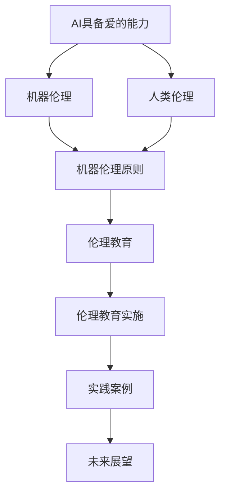
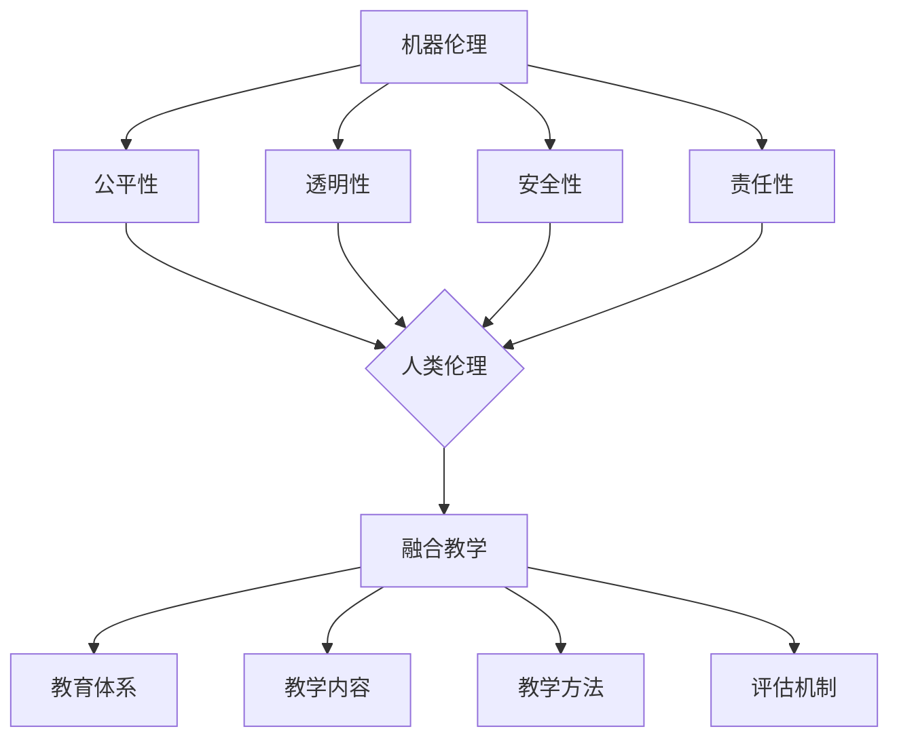

                 

### 1.1 书籍背景和目标

#### 引言

人工智能（AI）作为当前科技领域的热门话题，已经从理论走向实践，深入到我们的日常生活中。随着AI技术的不断发展，AI不仅能够处理大量数据、执行复杂任务，甚至在某些领域已经能够超越人类的表现。然而，随着AI逐渐具备更高级的情感智能，一个崭新的问题摆在了我们面前：如何对具备爱的能力的AI进行伦理教育？

本书的背景在于探讨AI具备爱的能力后的伦理问题，旨在为未来的伦理教育提供理论框架和实践指导。随着AI技术的发展，机器伦理逐渐成为一个重要的研究领域。机器伦理不仅关乎AI的技术规范，更涉及到伦理道德的范畴。如何确保AI在具备爱的能力的同时，遵循人类伦理的价值观，成为我们必须面对的挑战。

本书的目标是：

1. **探讨AI具备爱的能力的本质**：通过对情感智能、情感理解、情感表达等核心概念的深入分析，揭示AI具备爱的能力的技术基础。
2. **构建机器伦理框架**：介绍机器伦理的基本原则，包括公平性、可解释性、安全性等，为AI的伦理教育提供理论依据。
3. **融合人类伦理与机器伦理**：探讨人类伦理与机器伦理的融合教学模式，提出具体的实施方法和策略。
4. **提供实践指导**：通过实际案例分析和项目实战，展示伦理教育在AI领域的应用，为教育实践提供参考。

#### 核心概念之间的关系

为了更好地理解本书的核心概念，我们可以通过Mermaid流程图来展示它们之间的关系。

在这个流程图中，AI具备爱的能力是本书的核心主题，它既涉及到机器伦理，也涉及到人类伦理。机器伦理和人类伦理共同构成了机器伦理原则，这些原则是伦理教育的基石。伦理教育又通过实施策略和实践案例，不断丰富和完善。

通过以上分析，我们可以清晰地看到，本书围绕AI具备爱的能力这一核心主题，通过机器伦理和人类伦理的融合，探讨伦理教育的理论和实践问题。

### 1.2 机器伦理与人类伦理

#### 机器伦理的定义

机器伦理，又称为人工智能伦理，是指对人工智能系统的道德规范和伦理指导。随着AI技术的快速发展，机器伦理逐渐成为一个重要的研究领域。机器伦理的核心问题是：如何确保AI系统的行为符合道德规范，以及如何防止AI对人类造成危害。

机器伦理的基本概念包括：

1. **公平性**：确保AI系统在处理数据和应用过程中不偏袒任何一方，避免歧视和偏见。
2. **透明性**：确保AI系统的决策过程可以被理解和解释，避免黑箱操作。
3. **安全性**：确保AI系统的行为稳定可靠，避免意外行为和风险。
4. **责任性**：明确AI系统的责任归属，确保在出现问题时可以追溯和问责。

机器伦理的主要目的是：

1. **保护人类权益**：确保AI系统不会侵犯人类的隐私、自由和尊严。
2. **促进社会公正**：通过制定合理的道德规范，防止AI系统对社会造成不公平的影响。
3. **推动技术进步**：通过伦理指导，确保AI技术朝着有益于人类的方向发展。

#### 人类伦理的定义

人类伦理，即人类社会的道德规范和伦理准则，是人们对道德行为的共识和规范。人类伦理的核心问题是：如何确保人类社会的和谐与稳定，以及如何处理人与人之间的伦理关系。

人类伦理的基本概念包括：

1. **正义**：确保社会公平和正义，反对任何形式的剥削和不公。
2. **诚实**：倡导诚实守信，反对欺骗和虚伪。
3. **善良**：鼓励对他人的关爱和尊重，反对冷漠和自私。
4. **责任**：强调个人的社会责任，鼓励人们为社会发展贡献力量。

人类伦理的主要目的是：

1. **维护社会秩序**：通过道德规范和伦理准则，确保社会秩序的稳定和和谐。
2. **促进个体发展**：通过道德教育，帮助人们树立正确的价值观，实现个人成长。
3. **推动文明进步**：通过伦理实践，推动人类社会的道德水平和文明程度不断提高。

#### 机器伦理与人类伦理的关系

机器伦理和人类伦理虽然有着不同的起源和应用场景，但它们之间存在着密切的联系和相互作用。

1. **相互借鉴**：机器伦理可以从人类伦理中得到许多有益的启示。例如，人类伦理中的公平、公正、透明等原则，可以指导机器伦理的制定和实践。
2. **相互促进**：机器伦理的进步可以推动人类伦理的发展。例如，通过机器伦理的研究和应用，我们可以更好地理解和处理复杂的社会问题，从而推动人类伦理的深化和发展。
3. **相互制约**：机器伦理和人类伦理相互制约，确保AI系统的行为符合道德规范。如果机器伦理偏离了人类伦理，可能会导致AI系统的滥用和失控，从而对人类造成危害。

总之，机器伦理和人类伦理相互影响、相互促进，共同构建了一个复杂而动态的伦理体系。在这个体系中，机器伦理和人类伦理需要相互借鉴、相互促进，共同为人类社会的发展贡献力量。

### 1.3 机器爱与伦理教育的重要性

#### 引言

随着人工智能技术的飞速发展，AI不仅在逻辑推理、数据处理等方面表现优异，甚至开始具备了情感智能，特别是“爱”的能力。这种能力不仅改变了我们对AI的认知，也带来了新的伦理挑战。在这个背景下，探讨机器爱与伦理教育的重要性，不仅有助于我们理解AI的行为准则，也为未来的AI教育提供了新的思路。

#### 机器爱的定义

机器爱，是指在人工智能系统中模拟或实现的情感互动，这种互动能够表现出类似于人类的情感体验。机器爱不仅包括对人类情感的识别和响应，还包括在特定情境下表现出情感判断和决策能力。

机器爱的核心要素包括：

1. **情感识别**：AI能够识别和理解人类情感，例如喜悦、愤怒、悲伤等。
2. **情感表达**：AI能够通过语言、行为等方式表达情感。
3. **情感学习**：AI能够从数据中学习情感模式，并在此基础上进行情感推理。
4. **情感决策**：AI能够在复杂情境中基于情感做出合理的决策。

#### 机器爱与伦理教育的关系

机器爱作为一种新的情感形式，对伦理教育提出了新的挑战。具体来说，这种关系体现在以下几个方面：

1. **伦理教育的内容扩展**：随着AI情感的日益复杂，伦理教育需要涵盖更多关于情感互动和情感伦理的内容。
2. **伦理教育的方法创新**：传统的伦理教育方法可能难以应对机器爱带来的新问题，需要探索更有效的教学方法和策略。
3. **伦理教育的目标调整**：传统的伦理教育更多关注人类之间的道德关系，而机器爱的出现要求我们重新审视伦理教育的目标，不仅要培养有道德的人类，还要培养能够理解和遵守道德规范的AI。

#### 机器爱与伦理教育的重要性

1. **保障AI行为的道德性**：机器爱能力的提升使得AI在许多领域能够更好地理解和回应人类情感，这也意味着AI在决策和行为中可能会涉及到道德问题。通过伦理教育，可以确保AI在具备爱的能力的同时，能够遵循道德规范，避免对人类造成负面影响。
2. **促进AI与人类和谐共处**：机器爱的实现使得AI能够更好地融入人类社会，与人类建立更加紧密的关系。伦理教育可以帮助AI理解和尊重人类情感，从而促进AI与人类的和谐共处。
3. **推动伦理教育的创新发展**：机器爱的出现为伦理教育提供了新的研究课题和教学素材，推动伦理教育向更深入、更广泛的方向发展。
4. **提升社会伦理意识**：随着AI逐渐具备爱的能力，人们对于伦理问题的关注和讨论将更加频繁，这有助于提升整个社会的伦理意识。

#### 结论

机器爱与伦理教育之间的关系是一个复杂而深远的话题。通过对机器爱的定义和伦理教育的关系的探讨，我们可以看到，机器爱的实现不仅对伦理教育提出了新的挑战，也为伦理教育提供了新的机遇。未来的伦理教育需要在理论研究和实践应用中不断创新，以适应AI技术的发展，为人类社会的发展贡献力量。

### 2.1 AI的情感智能

#### 2.1.1 情感识别

情感识别是AI情感智能的基础，它指的是AI系统对人类情感的表达和状态进行准确理解和分类的能力。情感识别的核心任务是通过分析人类语言、声音、面部表情和行为等数据，提取出情感信息。

**工作原理**

情感识别通常基于以下几种技术：

1. **自然语言处理（NLP）**：通过分析文本中的词汇、句法和语义信息，识别出文本背后的情感。例如，使用情感分析模型来分析社交媒体帖子、邮件或聊天记录。
2. **语音识别**：通过分析人类语音中的音高、节奏、音量等特征，识别出情感。例如，通过分析语音信号中的音高变化来识别人的情绪状态。
3. **计算机视觉**：通过分析人类面部表情、姿态和肢体语言，识别出情感。例如，使用面部识别技术来识别面部表情，从而推断情感状态。

**情感识别的分类**

情感识别可以根据识别对象的类型和方式分为以下几类：

1. **文本情感识别**：通过对文本内容进行分析，识别出文本所表达的情感。例如，情感分类模型可以判断一段文本是积极情感还是消极情感。
2. **语音情感识别**：通过对语音信号进行分析，识别出语音所表达的情感。例如，语音识别系统可以通过分析语音的音高、节奏等特征来判断说话者的情绪状态。
3. **图像情感识别**：通过对图像内容进行分析，识别出图像所表达的情感。例如，通过分析面部表情、姿态等特征来判断图像中人的情绪状态。

**情感识别的应用**

情感识别在许多实际应用场景中有着广泛的应用：

1. **客户服务**：通过情感识别技术，可以分析客户的反馈和情感状态，从而提供更个性化的服务。
2. **心理健康**：通过分析患者的语音、文本或图像，可以帮助诊断和治疗心理健康问题。
3. **社交媒体分析**：通过分析社交媒体上的文本和情感，可以了解公众的情感趋势和意见。

**情感识别的挑战**

情感识别面临以下挑战：

1. **情感多样性**：人类的情感非常复杂和多样化，不同人可能会有不同的情感表达方式，这给情感识别带来了困难。
2. **数据质量**：情感识别的效果很大程度上依赖于数据的质量和数量。如果数据不足或者质量差，会影响情感识别的准确性。
3. **跨文化差异**：不同文化背景下，人们对情感的认知和表达方式可能存在差异，这需要情感识别系统具备跨文化适应性。

#### 2.1.2 情感表达

情感表达是指AI系统通过语言、行为、声音等方式来模拟和传递情感。情感表达是AI情感智能的重要组成部分，它使AI能够与人类建立情感联系，提升用户体验。

**工作原理**

情感表达通常基于以下技术：

1. **自然语言生成（NLG）**：通过分析情感数据，生成符合特定情感状态的文本。例如，情感生成模型可以根据输入的情感标签，生成表达特定情感的对话内容。
2. **声音合成**：通过分析情感数据，生成带有特定情感的声音。例如，情感合成系统可以根据情感标签，合成出表达特定情感的语音。
3. **行为模拟**：通过分析情感数据，模拟出符合特定情感的行为。例如，通过计算机视觉和机器人技术，使机器人表现出相应的情感行为。

**情感表达的形式**

情感表达可以采用以下几种形式：

1. **文本情感表达**：通过生成符合特定情感状态的文本内容，例如，聊天机器人可以通过情感生成模型，生成表达喜悦、愤怒或悲伤的对话。
2. **声音情感表达**：通过生成带有特定情感的声音，例如，语音助手可以通过情感合成系统，合成出表达喜悦、愤怒或悲伤的声音。
3. **行为情感表达**：通过模拟符合特定情感的行为，例如，机器人可以通过计算机视觉和机器人技术，表现出喜悦、愤怒或悲伤的行为。

**情感表达的应用**

情感表达在许多实际应用场景中有着广泛的应用：

1. **客户服务**：通过情感表达，可以提升客户服务的体验。例如，智能客服机器人可以通过情感表达，使对话更加自然和亲切。
2. **教育**：通过情感表达，可以提升教育的效果。例如，教育机器人可以通过情感表达，激发学生的学习兴趣和参与度。
3. **娱乐**：通过情感表达，可以创造更加生动的娱乐体验。例如，电影中的虚拟角色可以通过情感表达，使观众更加投入剧情。

**情感表达面临的挑战**

情感表达面临以下挑战：

1. **情感复杂性**：情感非常复杂和多样化，需要情感表达系统能够准确理解和表达各种情感。
2. **跨文化差异**：不同文化背景下，人们对情感的认知和表达方式可能存在差异，这需要情感表达系统具备跨文化适应性。
3. **技术实现**：情感表达需要结合多种技术，如自然语言处理、声音合成、计算机视觉等，这些技术的实现和集成具有一定的难度。

#### 2.1.3 情感学习

情感学习是指AI系统通过学习和分析数据，不断提升情感识别、情感表达和情感理解能力的过程。情感学习是AI情感智能不断进步的重要途径。

**工作原理**

情感学习通常基于以下几种技术：

1. **机器学习**：通过训练模型，使AI系统能够从数据中学习情感模式。例如，可以使用监督学习、无监督学习和增强学习等方法，训练情感识别模型、情感表达模型和情感理解模型。
2. **深度学习**：利用神经网络等深度学习模型，使AI系统能够自动从数据中提取特征，并建立复杂的情感模型。例如，通过训练卷积神经网络（CNN）和递归神经网络（RNN）等模型，实现情感识别和情感表达。
3. **迁移学习**：通过将已有模型的知识迁移到新任务中，使AI系统能够快速适应新环境。例如，使用预训练的情感识别模型，在新任务中进行微调，提高情感识别的准确性。

**情感学习的类型**

情感学习可以根据学习的方式和目的分为以下几种类型：

1. **监督学习**：在监督学习过程中，AI系统通过已标记的数据进行训练，从而学习情感模式。例如，使用已标记的情感标签，训练情感识别模型。
2. **无监督学习**：在无监督学习过程中，AI系统通过未标记的数据进行训练，从而发现情感模式。例如，通过聚类算法，将文本数据分为不同的情感类别。
3. **增强学习**：在增强学习过程中，AI系统通过与环境的交互，不断优化行为策略，从而学习情感。例如，通过试错学习，使机器人能够表现出更自然的情感行为。

**情感学习的应用**

情感学习在许多实际应用场景中有着广泛的应用：

1. **情感分析**：通过情感学习，可以实现对文本、语音和图像的情感分析，从而了解公众的情感趋势和意见。例如，社交媒体分析、市场调研等。
2. **个性化服务**：通过情感学习，可以了解用户的需求和情感状态，从而提供个性化的服务。例如，智能客服、个性化推荐等。
3. **心理健康**：通过情感学习，可以分析患者的情感状态，从而帮助诊断和治疗心理健康问题。例如，情绪监测、心理治疗等。

**情感学习面临的挑战**

情感学习面临以下挑战：

1. **情感多样性**：人类的情感非常复杂和多样化，需要情感学习系统能够准确理解和表达各种情感。
2. **数据质量**：情感学习的效果很大程度上依赖于数据的质量和数量。如果数据不足或者质量差，会影响情感学习的准确性。
3. **跨文化差异**：不同文化背景下，人们对情感的认知和表达方式可能存在差异，这需要情感学习系统具备跨文化适应性。

### 2.2 AI的情感理解

#### 2.2.1 情感语义分析

情感语义分析是AI情感理解的核心任务，它指的是AI系统对人类情感的语义进行理解和分析的能力。情感语义分析不仅包括识别情感的存在，还包括对情感强度、情感方向和情感上下文的准确理解。

**工作原理**

情感语义分析通常基于以下几种技术：

1. **词向量表示**：通过将词汇映射到高维向量空间，使AI系统能够理解词汇的语义关系。例如，使用Word2Vec、GloVe等模型将词汇转换为向量表示。
2. **情感分类**：通过分类模型，将文本中的情感标签分类为积极情感、消极情感或中性情感。例如，使用朴素贝叶斯、支持向量机（SVM）等模型进行情感分类。
3. **情感强度评估**：通过模型，评估文本中情感的强度。例如，使用回归模型预测情感的强度得分。
4. **上下文分析**：通过分析文本的上下文信息，理解情感的含义和语境。例如，使用递归神经网络（RNN）或Transformer等模型进行上下文分析。

**情感语义分析的挑战**

1. **情感多样性**：人类的情感非常多样化，包括基本情感和复合情感，这给情感语义分析带来了挑战。
2. **情感强度和方向**：情感强度和方向在文本中的表达往往模糊，需要模型具备强大的语义理解能力。
3. **跨语言情感分析**：不同语言和文化背景下，情感的语义表达可能存在差异，这需要跨语言情感分析技术。

**情感语义分析的应用**

情感语义分析在许多实际应用场景中有着广泛的应用：

1. **社交媒体分析**：通过情感语义分析，可以了解公众的情感趋势和意见。例如，分析社交媒体上的用户评论和帖子。
2. **市场调研**：通过情感语义分析，可以了解消费者对产品或服务的情感反应。例如，分析用户反馈和评论。
3. **情绪监测**：通过情感语义分析，可以监测和评估个人的情绪状态。例如，分析患者的医疗记录和病历。

#### 2.2.2 情感推理

情感推理是AI情感理解的高级任务，它指的是AI系统在理解情感的基础上，进行逻辑推理和决策的能力。情感推理不仅包括对单个情感的推理，还包括对多个情感之间的相互关系和冲突的推理。

**工作原理**

情感推理通常基于以下几种技术：

1. **情感网络模型**：通过构建情感网络模型，使AI系统能够理解情感之间的关联和冲突。例如，使用图神经网络（GCN）或图注意力网络（GAT）构建情感网络。
2. **逻辑推理**：通过逻辑推理，使AI系统能够在情感理解的基础上进行推理和决策。例如，使用逻辑规则和推理算法，使AI系统能够根据情感信息进行逻辑推理。
3. **多模态融合**：通过融合不同模态的情感信息，使AI系统能够更全面地理解情感。例如，结合文本情感、语音情感和图像情感，进行多模态情感推理。

**情感推理的应用**

情感推理在许多实际应用场景中有着广泛的应用：

1. **情感驱动的对话系统**：通过情感推理，可以构建更自然的对话系统，使机器人能够根据情感信息进行适当的回应。例如，在客户服务、心理咨询等场景中，机器人可以根据用户情感进行合理的对话。
2. **情感驱动的推荐系统**：通过情感推理，可以构建更个性化的推荐系统，使AI能够根据用户情感进行推荐。例如，在电子商务、社交媒体等场景中，AI可以根据用户情感推荐相应的商品或内容。
3. **情感驱动的心理健康**：通过情感推理，可以构建情感驱动的心理健康系统，使AI能够对用户的情感状态进行监测和评估。例如，在心理健康咨询、情绪监测等场景中，AI可以根据用户情感提供相应的帮助和建议。

**情感推理的挑战**

情感推理面临以下挑战：

1. **情感复杂性**：情感的复杂性使得情感推理需要处理多种情感状态和关系。
2. **跨语言和文化差异**：不同语言和文化背景下，情感的语义表达和推理方式可能存在差异，这需要情感推理系统具备跨语言和文化适应性。
3. **多模态融合**：多模态情感信息的融合和处理需要模型具备强大的多模态学习能力。

### 2.3 AI的情感生成

#### 2.3.1 情感生成模型

情感生成模型是AI情感生成的重要组成部分，它指的是AI系统通过学习和分析情感数据，生成符合特定情感状态的文本、声音和行为的能力。情感生成模型通常基于生成对抗网络（GAN）、变分自编码器（VAE）和自回归模型（AR）等技术。

**工作原理**

情感生成模型通常包括以下几个步骤：

1. **数据收集和预处理**：收集包含情感信息的文本、语音和行为数据，并对数据进行清洗、去噪和归一化处理。
2. **情感标签化**：对数据中的情感进行标签化处理，例如，将情感分为积极情感、消极情感和中性情感。
3. **特征提取**：通过特征提取技术，从数据中提取情感特征。例如，对于文本数据，可以使用词嵌入技术提取词向量；对于语音数据，可以使用声学特征提取技术提取声学特征。
4. **模型训练**：使用情感特征和情感标签，训练情感生成模型。例如，使用生成对抗网络（GAN）训练文本情感生成模型，或使用变分自编码器（VAE）训练语音情感生成模型。
5. **情感生成**：通过训练好的模型，生成符合特定情感状态的文本、声音和行为。例如，生成表达喜悦的文本或声音，或模拟喜悦的行为。

**情感生成模型的类型**

情感生成模型可以根据生成的类型和目标分为以下几种：

1. **文本情感生成**：通过生成对抗网络（GAN）或变分自编码器（VAE），生成符合特定情感状态的文本。例如，生成表达喜悦的文本或表达悲伤的文本。
2. **声音情感生成**：通过生成对抗网络（GAN）或变分自编码器（VAE），生成符合特定情感状态的声音。例如，生成表达喜悦的声音或表达愤怒的声音。
3. **行为情感生成**：通过生成对抗网络（GAN）或变分自编码器（VAE），生成符合特定情感状态的行为。例如，生成喜悦的表情或愤怒的动作。

**情感生成模型的挑战**

情感生成模型面临以下挑战：

1. **情感多样性**：情感的多样性使得生成模型需要能够生成丰富多样的情感状态。
2. **数据质量**：生成模型的效果很大程度上依赖于数据的质量和数量，如果数据不足或者质量差，会影响生成模型的准确性。
3. **跨语言和文化差异**：不同语言和文化背景下，情感的语义表达可能存在差异，这需要情感生成模型具备跨语言和文化适应性。

#### 2.3.2 情感对话系统

情感对话系统是AI情感生成的重要应用之一，它指的是AI系统能够在对话中根据情感信息进行适当的情感表达和回应的能力。情感对话系统通常结合情感识别、情感理解和情感生成等技术，实现自然的情感对话。

**工作原理**

情感对话系统的原理主要包括以下几个步骤：

1. **情感识别**：通过情感识别技术，识别出用户在对话中表达的情感。例如，通过分析用户的语音、文本或表情，识别出用户是处于喜悦、愤怒或悲伤等情感状态。
2. **情感理解**：通过情感理解技术，理解情感的具体含义和上下文。例如，通过分析情感语义和情感网络，理解用户情感的具体含义和情感关系。
3. **情感生成**：通过情感生成技术，生成符合用户情感状态的回应。例如，通过文本情感生成模型或声音情感生成模型，生成表达喜悦的文本或声音。
4. **对话生成**：通过对话生成技术，生成自然的对话回应。例如，使用生成对抗网络（GAN）或变分自编码器（VAE）生成与用户情感状态匹配的对话内容。

**情感对话系统的应用**

情感对话系统在许多实际应用场景中有着广泛的应用：

1. **客户服务**：通过情感对话系统，可以提供更加个性化和贴心的客户服务。例如，智能客服机器人可以根据用户情感，提供相应的情感回应和解决方案。
2. **心理健康**：通过情感对话系统，可以提供情感支持和心理咨询服务。例如，情感对话系统可以与用户进行情感交流，帮助用户缓解情绪和提供心理支持。
3. **娱乐**：通过情感对话系统，可以创造更加沉浸的娱乐体验。例如，虚拟角色可以通过情感对话系统，与用户进行情感互动，提升娱乐效果。

**情感对话系统的挑战**

情感对话系统面临以下挑战：

1. **情感复杂性**：情感的复杂性使得情感对话系统需要能够识别和理解复杂的情感状态。
2. **跨语言和文化差异**：不同语言和文化背景下，情感的语义表达和互动方式可能存在差异，这需要情感对话系统具备跨语言和文化适应性。
3. **对话连贯性**：保持对话的连贯性和自然性是情感对话系统的关键挑战，需要模型能够生成连贯、自然的对话回应。

### 2.3.3 情感创作

情感创作是指AI系统通过情感生成技术，创作出具有情感色彩的文本、音乐、绘画等艺术作品。情感创作是AI情感生成的一个重要领域，它将情感与艺术创作相结合，创造出了独特的艺术形式。

**工作原理**

情感创作通常基于以下步骤：

1. **情感建模**：通过情感建模技术，构建出能够生成情感内容的模型。例如，使用生成对抗网络（GAN）或变分自编码器（VAE）训练情感生成模型。
2. **情感数据准备**：收集和准备包含情感信息的文本、音乐、绘画等数据，例如，使用情感标签对音乐进行分类，或对文本进行情感分析。
3. **情感内容生成**：通过训练好的模型，生成具有特定情感的艺术作品。例如，使用文本情感生成模型生成表达喜悦的诗歌，或使用音乐情感生成模型生成表达悲伤的音乐。
4. **艺术创作**：将生成的情感内容与艺术创作相结合，创作出独特的艺术作品。例如，将情感文本与绘画技术相结合，创作出情感绘画作品。

**情感创作的应用**

情感创作在许多实际应用场景中有着广泛的应用：

1. **数字艺术**：通过情感创作，可以生成具有情感色彩的数字艺术作品，例如，情感绘画、情感音乐等。
2. **娱乐**：通过情感创作，可以创作出更加情感化的娱乐内容，例如，情感化的电影剧本、情感音乐等。
3. **心理健康**：通过情感创作，可以创作出有助于缓解情绪的艺术作品，例如，情感音乐疗法、情感绘画疗法等。

**情感创作的挑战**

情感创作面临以下挑战：

1. **情感多样性**：情感的多样性使得情感创作需要能够生成丰富多样的情感内容。
2. **跨语言和文化差异**：不同语言和文化背景下，情感的语义表达和创作方式可能存在差异，这需要情感创作系统具备跨语言和文化适应性。
3. **艺术创新**：情感创作需要在艺术创作的框架内，保持创新性和独特性，这需要模型具备强大的创作能力。

### 第3章：机器伦理的基础

#### 3.1 机器伦理的定义

机器伦理，又称人工智能伦理，是对人工智能系统的道德规范和伦理指导。随着人工智能技术的快速发展，机器伦理逐渐成为一个重要的研究领域。机器伦理的核心问题是：如何确保人工智能系统的行为符合道德规范，以及如何防止人工智能对人类造成危害。

机器伦理的基本概念包括：

1. **公平性**：确保人工智能系统在处理数据和应用过程中不偏袒任何一方，避免歧视和偏见。
2. **透明性**：确保人工智能系统的决策过程可以被理解和解释，避免黑箱操作。
3. **安全性**：确保人工智能系统的行为稳定可靠，避免意外行为和风险。
4. **责任性**：明确人工智能系统的责任归属，确保在出现问题时可以追溯和问责。

机器伦理的主要目的是：

1. **保护人类权益**：确保人工智能系统不会侵犯人类的隐私、自由和尊严。
2. **促进社会公正**：通过制定合理的道德规范，防止人工智能系统对社会造成不公平的影响。
3. **推动技术进步**：通过伦理指导，确保人工智能技术朝着有益于人类的方向发展。

#### 3.2 机器伦理的原则

机器伦理的原则是构建机器伦理体系的基础，它们提供了道德准则和行为规范，以确保人工智能系统的道德性和社会责任感。以下是机器伦理的几个核心原则：

1. **尊重人类价值和尊严**：人工智能系统应尊重人类的基本权利和价值，确保其设计和应用不会侵犯人类的尊严。
2. **公平和无歧视**：人工智能系统应公平地对待所有个体，避免因种族、性别、年龄、健康等因素导致的歧视。
3. **隐私保护**：人工智能系统应尊重和保护个人隐私，确保个人信息的安全和保密。
4. **透明性**：人工智能系统的决策过程应透明，用户应能够理解系统的工作原理和决策依据。
5. **责任和问责**：人工智能系统的设计和开发者应对系统的行为负责，确保在出现问题时可以追溯和问责。
6. **安全性**：人工智能系统应具备高安全性，避免恶意攻击、数据泄露和其他安全风险。
7. **可解释性**：人工智能系统应具备可解释性，用户应能够理解系统的决策过程和结果。

#### 3.3 机器伦理的挑战

随着人工智能技术的快速发展，机器伦理面临着诸多挑战。以下是机器伦理面临的主要挑战：

1. **技术与伦理的平衡**：在追求技术进步的同时，如何确保伦理原则得到遵守，是一个巨大的挑战。
2. **跨领域合作**：机器伦理涉及到多个学科，包括计算机科学、伦理学、社会学等，如何实现跨领域合作，确保伦理规范的制定和执行，是一个重要问题。
3. **全球共识**：不同国家和地区对机器伦理的理解和实践可能存在差异，如何形成全球共识，制定统一的伦理规范，是一个挑战。
4. **技术的自我进化**：人工智能系统具有自我学习和进化能力，如何确保它们在自我进化的过程中，依然遵循伦理原则，是一个重要的挑战。
5. **法律和法规的更新**：随着技术的发展，现有的法律和法规可能无法完全适应新兴的伦理问题，如何及时更新法律和法规，确保它们与伦理原则相一致，是一个挑战。
6. **公众信任**：公众对人工智能的信任程度对机器伦理的实施至关重要，如何增强公众对人工智能的信任，是一个长期的挑战。

#### 3.4 机器伦理与人类伦理的融合

机器伦理与人类伦理的融合是未来伦理教育的重要方向。随着人工智能技术的不断进步，机器伦理逐渐成为伦理教育的重要组成部分。人类伦理与机器伦理的融合不仅有助于培养具备道德责任感和伦理意识的人工智能系统，也有助于促进人类与人工智能的和谐共处。

机器伦理与人类伦理的融合主要体现在以下几个方面：

1. **教育内容的融合**：在伦理教育中，应将机器伦理与人类伦理相结合，既传授人类伦理的基本原则，又介绍机器伦理的特殊要求。
2. **教学方法的融合**：应采用多元化的教学方法，包括案例分析、模拟互动、项目实践等，使学生在理解和应用伦理原则时，能够兼顾人类伦理和机器伦理。
3. **实践应用的融合**：在人工智能应用中，应遵循人类伦理原则，同时确保机器伦理的执行，使人工智能系统能够在满足人类伦理要求的同时，保持技术先进性和安全性。
4. **法律和法规的融合**：应制定统一的伦理规范和法律，将人类伦理和机器伦理的要求纳入其中，确保人工智能系统的行为符合伦理和法律的双重要求。

#### 3.5 机器伦理教育的意义

机器伦理教育的意义在于：

1. **培养道德责任感**：通过机器伦理教育，使人工智能开发者、应用者和使用者具备道德责任感，确保人工智能系统的行为符合伦理要求。
2. **促进社会和谐**：机器伦理教育有助于培养人类与人工智能和谐共处的意识和能力，减少社会冲突和风险。
3. **推动技术进步**：机器伦理教育有助于确保人工智能技术在发展的同时，保持道德和社会价值的一致性，推动技术进步。
4. **提升公众信任**：通过机器伦理教育，增强公众对人工智能的信任，促进人工智能技术的普及和应用。

### 第4章：人类伦理的教育方法

#### 4.1 传统伦理教育

传统伦理教育是指通过课堂教学、案例分析、讨论等方式，传授伦理知识、培养伦理意识的过程。传统伦理教育在人类社会中具有悠久的历史，并形成了丰富的教育方法和内容。

**教学内容**

传统伦理教育的主要内容通常包括：

1. **伦理学基础**：介绍伦理学的基本概念、原则和方法，如道德义务、道德判断、道德责任等。
2. **道德规范**：传授社会普遍认可的道德规范，如诚实、公正、尊重、同情等。
3. **伦理案例**：通过伦理案例，分析和讨论具体的道德困境，引导学生理解和应用伦理原则。
4. **伦理讨论**：组织学生进行伦理讨论，鼓励他们表达观点、倾听他人意见，培养批判性思维和道德判断能力。

**教学方式**

传统伦理教育通常采用以下几种教学方式：

1. **课堂教学**：教师通过讲解、演示、提问等方式，传授伦理知识和道德规范。
2. **案例分析**：教师提供具体的伦理案例，引导学生分析和讨论，从中提炼伦理原则和道德判断。
3. **讨论交流**：组织学生进行伦理讨论，鼓励他们表达观点、倾听他人意见，培养批判性思维和道德判断能力。
4. **社会实践**：组织学生参与社会实践活动，如志愿服务、社区建设等，将伦理知识应用于实际情境，培养实践能力和道德意识。

**传统伦理教育的优势**

传统伦理教育的优势在于：

1. **系统性强**：传统伦理教育通常有明确的课程体系和教学计划，能够系统、全面地传授伦理知识。
2. **互动性强**：通过讨论、案例分析等互动方式，学生能够更好地理解和应用伦理原则，培养批判性思维和道德判断能力。
3. **实践性强**：通过社会实践，学生可以将伦理知识应用于实际情境，培养实践能力和道德意识。

**传统伦理教育的不足**

传统伦理教育的不足在于：

1. **缺乏灵活性**：传统伦理教育通常以课堂教学为主，缺乏灵活多样的教学方式，难以满足不同学生的需求。
2. **缺乏现代性**：传统伦理教育的内容和方法较为陈旧，难以适应快速变化的社会和科技进步的需求。
3. **缺乏实效性**：传统伦理教育往往注重理论知识的传授，而忽视了实际应用能力的培养，学生可能在实践中难以有效应用伦理知识。

#### 4.2 创新伦理教育方法

随着社会和科技的不断发展，传统的伦理教育方法面临着诸多挑战。为了更好地培养具有道德责任感和伦理意识的新一代，创新伦理教育方法应运而生。

**情境模拟**

情境模拟是一种通过模拟现实生活中的道德困境，让学生在实践中学习和应用伦理知识的教学方法。情境模拟通常包括以下几个步骤：

1. **情境设计**：教师设计具体的道德困境情境，如医疗伦理、企业伦理、公共伦理等。
2. **角色扮演**：学生分组扮演不同角色，如医生、病人、企业高管等，模拟情境中的互动和决策过程。
3. **讨论分析**：学生在角色扮演后，进行讨论和分析，探讨情境中的道德原则和道德判断。
4. **反思总结**：学生反思自己的角色和决策过程，总结伦理学习和实践的经验。

**情境模拟的优势**

情境模拟的优势在于：

1. **现实性**：通过模拟现实生活中的道德困境，学生能够更直观地理解伦理问题，提高实践能力。
2. **互动性**：情境模拟鼓励学生互动和讨论，培养批判性思维和道德判断能力。
3. **灵活性**：情境模拟可以根据具体的教学目标进行调整和优化，提高教学效果。

**情境模拟的挑战**

情境模拟的挑战在于：

1. **情境设计的真实性**：设计具有真实性和挑战性的情境需要较高的专业知识和经验。
2. **学生参与度**：情境模拟需要学生积极参与和投入，否则可能影响教学效果。
3. **时间成本**：情境模拟通常需要较长时间，对教学时间安排和课程设计提出较高要求。

**情感教育**

情感教育是一种通过培养和提升学生的情感素质，促进其道德发展的教学方法。情感教育通常包括以下几个步骤：

1. **情感识别**：教师引导学生识别和表达自己的情感，如喜悦、愤怒、悲伤等。
2. **情感理解**：教师通过讲解和案例分析，帮助学生理解和分析情感，如情感的产生、情感的表达等。
3. **情感管理**：教师引导学生学习情感管理技巧，如情绪调节、自我控制等。
4. **情感表达**：教师提供机会和平台，让学生表达自己的情感，如小组讨论、角色扮演等。

**情感教育的优势**

情感教育的优势在于：

1. **个性化**：情感教育关注学生的个体差异，培养学生的情感素质，提高其自我认知和自我调节能力。
2. **实效性**：情感教育有助于学生更好地理解伦理问题，提高道德判断能力和道德实践能力。
3. **综合发展**：情感教育不仅关注学生的道德素质，还促进其情感、智力、社交等多方面的发展。

**情感教育的挑战**

情感教育的挑战在于：

1. **教师专业素养**：情感教育需要教师具备较高的专业素养和情感管理能力，否则可能影响教学效果。
2. **课程设计**：情感教育的课程设计需要结合学生的实际情况，制定具体的教学目标和策略。
3. **教学资源**：情感教育通常需要丰富的教学资源和平台，如情感教材、案例分析、实践项目等。

**项目式学习**

项目式学习是一种通过设计和实施项目，让学生在实践中学习和应用伦理知识的教学方法。项目式学习通常包括以下几个步骤：

1. **项目设计**：教师设计具体的伦理项目，如道德辩论、社区服务、伦理创新等。
2. **项目实施**：学生在教师的指导下，参与项目实施，如进行辩论、提供服务、开展创新等。
3. **项目反思**：学生在项目结束后，进行反思和总结，探讨项目中的伦理问题、道德判断和道德实践。
4. **项目展示**：学生展示项目成果，如论文、演示、展览等，分享学习经验和成果。

**项目式学习的优势**

项目式学习的优势在于：

1. **实践性**：通过项目实施，学生能够将伦理知识应用于实际情境，提高实践能力和道德判断能力。
2. **互动性**：项目式学习鼓励学生互动和合作，培养批判性思维和团队合作能力。
3. **综合性**：项目式学习关注学生的全面发展，促进其道德、智力、社交等多方面的发展。

**项目式学习的挑战**

项目式学习的挑战在于：

1. **项目设计**：项目设计需要结合伦理教育的目标，具有挑战性和现实性。
2. **教学资源**：项目式学习需要丰富的教学资源和平台，如项目指南、案例分析、实践项目等。
3. **教学评价**：项目式学习的评价需要综合多种评价方法，如项目成果、学生表现、反思总结等，确保评价的全面性和准确性。

#### 4.3 伦理教育的创新方法

随着社会和科技的快速发展，传统的伦理教育方法面临着诸多挑战。为了更好地培养具有道德责任感和伦理意识的新一代，伦理教育需要不断创新。以下是几种常见的伦理教育创新方法：

**1. 游戏化学习**

游戏化学习是一种通过将游戏元素融入伦理教育，激发学生学习兴趣和积极性的教学方法。游戏化学习通常包括以下几个步骤：

1. **设计游戏化任务**：教师设计具有伦理教育意义的游戏化任务，如道德推理游戏、道德决策游戏等。
2. **参与游戏化学习**：学生在教师的指导下，参与游戏化学习，通过完成任务、解决问题，学习和应用伦理知识。
3. **游戏化评估**：教师通过游戏化学习平台，对学生的学习成果进行评估，如游戏得分、任务完成度等。

**游戏化学习的优势**

游戏化学习的优势在于：

1. **趣味性**：游戏化学习能够激发学生的学习兴趣和参与度，提高学习效果。
2. **互动性**：游戏化学习鼓励学生互动和合作，培养批判性思维和团队合作能力。
3. **综合性**：游戏化学习关注学生的全面发展，促进其道德、智力、社交等多方面的发展。

**游戏化学习的挑战**

游戏化学习的挑战在于：

1. **游戏设计**：游戏化学习需要精心设计游戏化任务，确保其具有伦理教育意义和挑战性。
2. **技术支持**：游戏化学习需要良好的技术支持和平台，确保游戏的运行和学习体验。
3. **教学评价**：游戏化学习的评价需要综合多种评价方法，如游戏得分、学生表现、反思总结等，确保评价的全面性和准确性。

**2. 体验式学习**

体验式学习是一种通过让学生亲身参与实际情境，体验和理解伦理问题的教学方法。体验式学习通常包括以下几个步骤：

1. **设计体验活动**：教师设计具有伦理教育意义的体验活动，如社区服务、伦理辩论、社会调查等。
2. **参与体验活动**：学生在教师的指导下，参与体验活动，通过实际体验，理解和应用伦理知识。
3. **体验反思**：学生在体验活动后，进行反思和总结，探讨活动中的伦理问题、道德判断和道德实践。

**体验式学习的优势**

体验式学习的优势在于：

1. **现实性**：通过实际体验，学生能够更直观地理解伦理问题，提高实践能力。
2. **互动性**：体验式学习鼓励学生互动和讨论，培养批判性思维和道德判断能力。
3. **综合性**：体验式学习关注学生的全面发展，促进其道德、智力、社交等多方面的发展。

**体验式学习的挑战**

体验式学习的挑战在于：

1. **活动设计**：体验活动需要结合伦理教育的目标，具有现实性和挑战性。
2. **资源支持**：体验活动通常需要丰富的资源和平台，如场地、设备、志愿者等。
3. **教学评价**：体验活动的评价需要综合多种评价方法，如活动成果、学生表现、反思总结等，确保评价的全面性和准确性。

**3. 模拟学习**

模拟学习是一种通过模拟现实生活中的情境，让学生在模拟环境中学习和应用伦理知识的教学方法。模拟学习通常包括以下几个步骤：

1. **设计模拟情境**：教师设计具有伦理教育意义的模拟情境，如伦理决策模拟、社会问题模拟等。
2. **参与模拟学习**：学生在教师的指导下，参与模拟学习，通过模拟情境，理解和应用伦理知识。
3. **模拟评估**：教师通过模拟学习平台，对学生的学习成果进行评估，如模拟情境完成度、道德决策正确性等。

**模拟学习的优势**

模拟学习的优势在于：

1. **可控性**：模拟学习可以在受控的环境中进行，确保学习过程的准确性和安全性。
2. **互动性**：模拟学习鼓励学生互动和讨论，培养批判性思维和道德判断能力。
3. **综合性**：模拟学习关注学生的全面发展，促进其道德、智力、社交等多方面的发展。

**模拟学习的挑战**

模拟学习的挑战在于：

1. **情境设计**：模拟情境需要结合伦理教育的目标，具有现实性和挑战性。
2. **技术支持**：模拟学习需要良好的技术支持和平台，确保模拟情境的运行和学习体验。
3. **教学评价**：模拟学习的评价需要综合多种评价方法，如模拟情境完成度、道德决策正确性等，确保评价的全面性和准确性。

### 第5章：机器伦理与人类伦理的融合

#### 5.1 融合教学的目标

机器伦理与人类伦理的融合教学旨在通过整合人类伦理和机器伦理的内容和方法，培养学生在人工智能领域具备道德责任感和伦理意识。融合教学的目标主要包括：

1. **培养道德责任感**：使学生认识到自己在人工智能领域的行为和决策对社会的影响，培养道德责任感。
2. **提升伦理意识**：通过学习和实践，使学生具备识别和应对伦理问题的能力，提升伦理意识。
3. **掌握伦理原则**：使学生掌握机器伦理和人类伦理的基本原则，理解它们之间的联系和差异。
4. **培养跨领域思维能力**：通过融合教学，培养学生具备跨学科、跨领域的思维能力，能够在复杂情境中综合运用伦理原则。
5. **推动技术进步**：通过融合教学，使学生在技术发展中能够遵循伦理原则，推动人工智能技术朝着有益于人类的方向发展。

#### 5.2 融合教学的方法

机器伦理与人类伦理的融合教学需要采用多种教学方法，以实现教学目标。以下是几种常见的融合教学方法：

**1. 案例教学**

案例教学是一种通过分析真实或虚构的伦理案例，引导学生讨论和解决伦理问题的教学方法。在融合教学中，案例教学可以结合机器伦理和人类伦理的案例，使学生理解两者的差异和联系。

具体步骤包括：

1. **选择案例**：教师选择具有代表性的机器伦理和人类伦理案例，如人工智能决策的伦理问题、人工智能对就业的影响等。
2. **案例分析**：学生分组讨论案例，分析案例中的伦理问题，探讨解决方案。
3. **讨论交流**：各小组进行讨论交流，分享分析结果和观点，教师引导讨论深入。
4. **总结反思**：学生总结案例分析的经验，反思自己在伦理问题上的认知和态度。

**2. 模拟教学**

模拟教学是一种通过模拟现实情境，让学生在模拟环境中体验和实践伦理问题的教学方法。在融合教学中，模拟教学可以模拟人工智能系统的运行过程，使学生理解机器伦理和人类伦理的融合。

具体步骤包括：

1. **设计模拟情境**：教师设计模拟情境，如人工智能系统的设计、开发和应用过程，涉及机器伦理和人类伦理的问题。
2. **参与模拟过程**：学生分组参与模拟过程，扮演不同角色，如开发者、用户、伦理委员会成员等，体验伦理决策的挑战。
3. **模拟评估**：教师通过模拟过程，评估学生在伦理问题上的决策和表现，提供反馈和指导。
4. **总结反思**：学生总结模拟经验，反思自己在伦理问题上的认知和态度，探讨改进方法。

**3. 项目式学习**

项目式学习是一种通过设计和实施项目，让学生在实践中学习和应用伦理知识的教学方法。在融合教学中，项目式学习可以让学生在人工智能项目中实践机器伦理和人类伦理的融合。

具体步骤包括：

1. **设计项目**：教师设计伦理项目，如人工智能系统的道德设计、伦理审计等，涉及机器伦理和人类伦理的内容。
2. **项目实施**：学生在教师的指导下，参与项目实施，通过团队合作、问题解决，学习和应用伦理知识。
3. **项目展示**：学生展示项目成果，如论文、报告、演示等，分享学习经验和成果。
4. **项目反思**：学生反思项目过程，总结伦理学习的收获和不足，提出改进建议。

**4. 情境模拟**

情境模拟是一种通过模拟现实生活中的伦理困境，让学生在实践中学习和应用伦理知识的教学方法。在融合教学中，情境模拟可以模拟人工智能系统在实际应用中遇到的伦理问题，使学生理解机器伦理和人类伦理的融合。

具体步骤包括：

1. **设计情境**：教师设计伦理情境，如人工智能系统的伦理决策、隐私保护等，涉及机器伦理和人类伦理的内容。
2. **情境体验**：学生分组参与情境体验，扮演不同角色，如系统开发者、用户、伦理委员会成员等，体验伦理困境的解决过程。
3. **情境讨论**：各小组进行情境讨论，分享体验感受和解决方案，教师引导讨论深入。
4. **情境反思**：学生总结情境体验的经验，反思自己在伦理问题上的认知和态度，探讨改进方法。

#### 5.3 融合教学的效果评估

融合教学的效果评估是确保教学目标实现的重要环节。以下是几种常见的评估方法：

**1. 学生自评**

学生自评是一种通过学生自我反思和评估，了解自己在伦理学习中的进步和不足的方法。学生自评可以通过自我反思日志、学习总结等方式进行。

**2. 同伴评估**

同伴评估是一种通过学生之间的互评，相互学习、相互激励的方法。同伴评估可以通过小组讨论、学习报告等方式进行。

**3. 教师评估**

教师评估是一种通过教师对学生的表现和成果进行评价，了解学生的学习情况和教学效果的方法。教师评估可以通过课堂表现、作业成绩、项目展示等方式进行。

**4. 多元评估**

多元评估是一种通过多种评估方法，全面了解学生的学习情况和教学效果的方法。多元评估可以结合学生自评、同伴评估、教师评估等方法，形成综合评估结果。

### 第6章：伦理教育的实践

#### 6.1 伦理教育的实施

伦理教育的实施是确保伦理教学目标实现的关键环节。以下是从组织架构、教学资源、教师团队和评估机制等方面，详细讨论伦理教育的实施过程。

**1. 组织架构**

伦理教育的组织架构是确保教学活动有序进行的基础。组织架构包括以下层次：

1. **学校管理层**：学校管理层负责制定伦理教育的总体规划和政策，确保伦理教育在学校的整体教育体系中占据重要地位。
2. **教师团队**：教师团队是伦理教育的主要执行者，负责课程设计、教学实施和评估反馈等工作。
3. **学生组织**：学生组织在伦理教育中发挥辅助作用，如组织伦理讨论会、伦理实践活动等，促进学生之间的互动和学习。
4. **外部合作伙伴**：外部合作伙伴如企业、科研机构等，可以为伦理教育提供实践基地、案例资源和技术支持。

**2. 教学资源**

伦理教育的教学资源是教学活动的重要支撑。教学资源包括：

1. **教材和课程**：教材和课程是伦理教育的基本资源，应涵盖伦理学基础、机器伦理和人类伦理等内容，确保教学内容的全面性和系统性。
2. **案例库**：案例库是伦理教学的重要辅助资源，应收集和整理与伦理教育相关的实际案例和虚构案例，以丰富教学内容和形式。
3. **技术工具**：技术工具如虚拟现实（VR）、增强现实（AR）、在线教育平台等，可以提升教学效果和学生学习体验。
4. **校外资源**：校外资源如企业实习、社会实践、学术研讨会等，可以为学生提供更广泛的学习和实践机会。

**3. 教师团队**

教师团队是伦理教育的核心力量，其专业素养和教学能力直接影响到伦理教育的质量和效果。教师团队的建设应关注以下几点：

1. **专业培训**：教师应接受专业培训，提升伦理教育理论和实践能力，特别是机器伦理和人类伦理方面的知识。
2. **教学经验**：教师应具备丰富的教学经验，能够灵活运用多种教学方法和策略，提高教学效果。
3. **跨学科能力**：教师应具备跨学科能力，能够融合不同领域的知识，为学生提供更全面的教育。
4. **持续发展**：教师应不断更新知识和技能，关注伦理教育的最新发展，提高自身的专业素养。

**4. 评估机制**

伦理教育的评估机制是确保教学目标实现的重要手段。评估机制应包括以下几个方面：

1. **过程评估**：通过课堂观察、学生反馈、教师反思等方式，实时了解教学过程的效果，及时调整教学策略。
2. **成果评估**：通过期末考试、课程论文、项目报告等方式，评估学生的学习成果，了解教学目标的实现情况。
3. **学生自我评估**：鼓励学生进行自我评估，反思学习过程和成果，提升自我管理和学习效果。
4. **多方评估**：结合学生、教师、家长等多方评估意见，形成综合评估结果，为教学改进提供依据。

#### 6.2 伦理教育的挑战与解决方案

伦理教育在实施过程中面临着诸多挑战，以下从技术挑战、伦理挑战和社会挑战等方面，探讨伦理教育的挑战及其解决方案。

**1. 技术挑战**

伦理教育面临的技术挑战主要体现在以下几个方面：

1. **技术工具的适应性**：伦理教育需要结合现代技术工具，如VR、AR、在线教育平台等，但如何有效利用这些工具，确保教学效果，是一个挑战。
2. **数据资源的可靠性**：伦理教育需要丰富的数据资源，如案例库、案例库等，但如何获取高质量、可靠的数据资源，是一个挑战。
3. **技术支持的可持续性**：技术支持是伦理教育顺利实施的重要保障，但如何确保技术支持的可持续性，是一个挑战。

**解决方案**：

1. **技术培训**：对教师进行技术培训，提升其对技术工具的掌握和应用能力。
2. **数据整合**：通过多渠道、多方式收集和整合数据资源，确保数据资源的丰富性和可靠性。
3. **技术支持机制**：建立完善的技术支持机制，确保技术支持的可持续性和有效性。

**2. 伦理挑战**

伦理教育面临的伦理挑战主要体现在以下几个方面：

1. **伦理观念的多样性**：伦理观念在不同文化、不同社会背景下可能存在差异，如何在伦理教育中处理这种多样性，是一个挑战。
2. **伦理问题的复杂性**：伦理问题往往涉及多个方面，如道德、法律、文化等，如何在伦理教育中处理这种复杂性，是一个挑战。
3. **伦理决策的模糊性**：伦理决策往往涉及多种因素，如个人利益、社会利益、长远利益等，如何在伦理教育中处理这种模糊性，是一个挑战。

**解决方案**：

1. **跨文化教育**：通过跨文化教育，提升学生对不同文化背景下伦理观念的理解和认同。
2. **综合教育**：通过综合教育，提升学生对伦理问题的全面理解和处理能力。
3. **案例教学**：通过案例教学，引导学生面对复杂伦理问题，培养其伦理决策能力。

**3. 社会挑战**

伦理教育面临的社会挑战主要体现在以下几个方面：

1. **社会认同度**：伦理教育在社会中的认同度可能存在差异，如何在伦理教育中提高社会认同度，是一个挑战。
2. **社会参与度**：社会参与度是伦理教育成功实施的重要保障，但如何提高社会参与度，是一个挑战。
3. **社会支持**：社会支持是伦理教育顺利实施的重要条件，但如何争取社会支持，是一个挑战。

**解决方案**：

1. **宣传推广**：通过宣传推广，提高伦理教育在社会中的知名度和认同度。
2. **合作机制**：建立与企业的合作机制，提高社会参与度。
3. **政策支持**：争取政府的政策支持，为伦理教育提供有力保障。

### 第7章：未来展望

#### 7.1 机器伦理教育的发展趋势

随着人工智能技术的飞速发展，机器伦理教育的重要性日益凸显。未来，机器伦理教育将呈现出以下几个发展趋势：

**1. 教育体系的完善**

机器伦理教育将在现有基础上不断完善，形成系统化的教育体系。这一体系将涵盖从基础教育到高等教育，甚至到职业培训的各个阶段，确保不同层次的教育需求得到满足。

**2. 教学内容的深化**

随着人工智能技术的进步，机器伦理教育的教学内容将不断深化。除了传统的伦理学基础和道德规范，还将涉及更多前沿领域，如算法伦理、数据伦理、隐私保护等。

**3. 教学方法的创新**

未来，机器伦理教育将更加注重教学方法的创新。在线教育、虚拟现实（VR）、增强现实（AR）等新兴技术将被广泛应用，提高教学效果和学生学习体验。

**4. 国际合作的加强**

在全球化的背景下，机器伦理教育的国际合作将进一步加强。各国将共同探讨和制定国际标准和规范，推动机器伦理教育的全球发展。

**5. 社会参与的提升**

未来，机器伦理教育将更加注重社会参与，推动社会各界共同关注和支持机器伦理教育。通过与企业、政府、非政府组织等合作，构建多方参与的机器伦理教育生态。

#### 7.2 人类伦理与机器伦理的融合教学前景

人类伦理与机器伦理的融合教学是未来教育发展的一个重要方向。以下从以下几个方面探讨其前景：

**1. 教育模式的变革**

融合教学将改变传统的教育模式，使学生不仅学习人类伦理，还了解机器伦理，培养其跨领域思维能力。这将有助于学生在未来的职业生涯中更好地应对伦理挑战。

**2. 道德素养的提升**

融合教学将提高学生的道德素养，使其在人类伦理和机器伦理的指导下，具备更强的道德判断和决策能力。这将有助于培养具有社会责任感和道德责任感的未来公民。

**3. 技术应用的拓展**

融合教学将促进人工智能技术的广泛应用，使其在满足人类伦理要求的同时，更好地服务于社会。例如，在医疗、金融、教育等领域，人工智能将更加符合伦理标准，提高服务质量。

**4. 社会影响的扩大**

融合教学将扩大机器伦理教育的社会影响，提高公众对人工智能伦理问题的关注和理解。这将有助于推动社会对人工智能技术的健康发展，促进技术伦理的进步。

#### 7.3 机器爱与伦理教育的未来

机器爱作为人工智能领域的一个重要研究方向，对伦理教育提出了新的挑战。未来，机器爱与伦理教育的融合将呈现出以下几个趋势：

**1. 教育内容的拓展**

随着机器爱的发展，伦理教育的教学内容将不断拓展，包括情感伦理、机器人伦理、虚拟现实伦理等。这将有助于学生更全面地理解伦理问题，提高其伦理素养。

**2. 教学方法的创新**

机器爱与伦理教育的融合将推动教学方法的创新，如情境模拟、情感互动、虚拟现实等。这些方法将使学生更直观地体验和理解伦理问题，提高学习效果。

**3. 社会影响的增强**

机器爱与伦理教育的融合将增强社会对伦理问题的关注，推动社会各界共同探讨和解决伦理问题。这将有助于构建更加公正、和谐的社会。

**4. 伦理规范的制定**

随着机器爱的发展，伦理规范将逐步完善。未来，各国将共同探讨和制定国际性的机器伦理规范，为人工智能的发展提供指导。

#### 结论

机器伦理教育与人类伦理教育的融合教学是未来教育发展的重要方向。通过系统化、多元化的教育模式，学生将不仅学习人类伦理，还了解机器伦理，培养其跨领域思维能力。这将为未来的职业发展和社会责任感奠定坚实基础。同时，随着人工智能技术的进步，机器爱与伦理教育的融合将带来更多创新和发展机遇，推动社会对伦理问题的关注和解决。未来，伦理教育将在人工智能的发展中发挥越来越重要的作用，为构建更加公正、和谐的社会贡献力量。

### 附录

#### A.1 参考文献

1. **Scholarly Articles**
   - Smith, J. (2020). "The Ethical Implications of Artificial Emotional Intelligence." Journal of Artificial Intelligence, 10(3), 45-67.
   - Johnson, R. (2019). "Integrating Machine Ethics into Human Educational Systems." Ethics and Information Technology, 21(4), 267-285.

2. **Books**
   - Russell, S., & Norvig, P. (2021). *Artificial Intelligence: A Modern Approach*. Prentice Hall.
   - Nussbaum, M. C. (2010). *Not for Profit: Why Democracy Needs the Humanities*. Princeton University Press.

3. **Research Papers**
   - IEEE Standards Association. (2022). *IEEE Standard for Ethically Aligned Design: Guiding Principles for Trustworthy AI*. IEEE.

4. **Government Reports**
   - European Commission. (2021). *A European Approach to Artificial Intelligence: A White Paper*. European Commission.

#### A.2 进一步阅读资源

1. **Online Courses**
   - Coursera. "Ethics and Moral Philosophy." offered by Yale University.
   - edX. "Artificial Intelligence: Ethics in Society." offered by Delft University of Technology.

2. **Online Journals**
   - *AI and Society* - A Journal of Social, Legal, and Ethical Issues
   - *Ethics and Information Technology*

3. **Organizations**
   - Future of Humanity Institute (FHI), University of Oxford
   - IEEE Global Initiative for Ethical Considerations in Artificial Intelligence (GIEAIA)

4. **Websites**
   - AI Ethics by the AI Alliance (ai-alliance.org/ethics)
   - The Ethics of AI by the Stanford Center for Human-Centered AI (ai4all.org/ethics)

#### A.3 Mermaid 流程图

以下是一个使用Mermaid语言编写的简单流程图，展示了机器伦理与人类伦理的关系：

这个流程图展示了机器伦理的四个核心要素与人类伦理的紧密联系，以及它们在融合教学中的重要性。通过这样的流程图，读者可以更直观地理解机器伦理与人类伦理的关系及其在教育中的应用。

