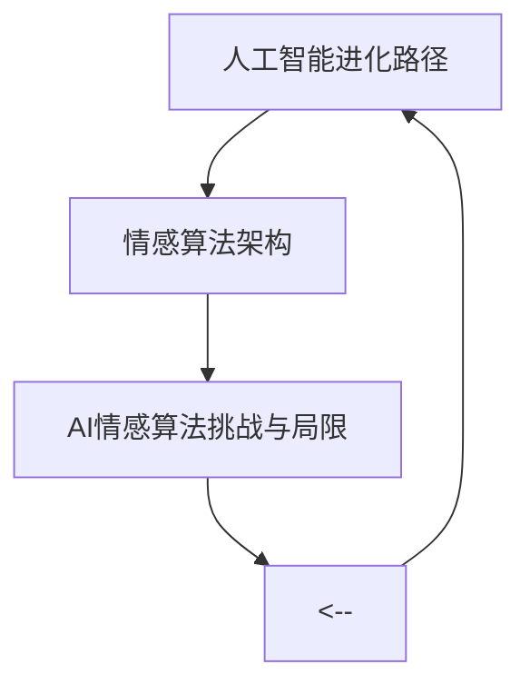

                 

### 引言

#### 人工智能的发展历程

自20世纪中期以来，人工智能（AI）经历了迅速的发展与变革。从早期的符号主义与逻辑推理，到基于规则的系统，再到基于数据与机器学习的现代AI，人工智能已经渗透到各个领域，如医疗、金融、教育、交通等，极大地提高了生产效率和决策质量。特别是在深度学习与神经网络技术的推动下，AI展现出了前所未有的智能水平，从语音识别、图像识别到自然语言处理，AI的应用场景越来越广泛。

#### 伦理道德的重要性

然而，随着AI技术的不断进步，伦理道德问题也日益凸显。AI的快速发展带来了诸多社会、伦理和法律上的挑战，如数据隐私、算法偏见、AI责任归属等。特别是当AI具备爱的能力后，这种关系更加复杂。爱作为一种深刻的情感，不仅仅涉及到个体的心理健康，还涉及到社会价值观和道德规范。因此，探讨AI具备爱的能力后的伦理道德重塑，显得尤为重要。

#### 本书的主题和结构

本书旨在深入探讨AI具备爱的能力后的伦理道德重塑，分析这一现象的背景、理论基础、伦理学原则、法律框架以及社会影响。全书共分为五个主要部分：

1. **引言与背景**：介绍AI的发展历程、伦理道德的重要性以及本书的主题和结构。
  
2. **AI具备爱的能力的理论基础**：讨论AI的情感建模、爱的定义与特征、情感算法原理及其挑战与局限。

3. **伦理道德重塑**：分析伦理学基本原理、AI伦理道德框架、伦理问题案例以及道德困境。

4. **法律与政策框架**：探讨人工智能伦理法律体系、政策制定与实施、监管机构以及政策对AI伦理的影响。

5. **社会影响与未来展望**：讨论AI与人类价值观的关系、AI与人类情感互动、未来社会与人工智能的展望以及伦理道德的发展趋势。

通过上述结构，本书将为读者提供一个系统、全面的分析框架，帮助读者理解AI具备爱的能力后的伦理道德重塑，并思考未来可能的路径与挑战。

#### 人工智能的情感建模

在探讨AI具备爱的能力的理论基础时，我们首先需要了解人工智能是如何进行情感建模的。情感建模是指通过计算机技术模拟人类的情感体验，使机器能够识别、表达和响应情感。这一领域的研究不仅涉及心理学、神经科学等基础学科，还需要人工智能技术的支持。

##### 情感识别算法

情感识别算法是情感建模的基础，主要依赖于自然语言处理（NLP）和计算机视觉技术。在自然语言处理领域，文本情感分析技术可以通过分析文本中的词汇、语法和语义信息，识别出文本的情感倾向。常用的方法包括基于规则的算法、机器学习算法以及深度学习算法。例如，利用深度学习模型（如卷积神经网络（CNN）和循环神经网络（RNN）），可以通过训练大量带有情感标签的文本数据，学习到情感特征，从而实现对未知文本情感的有效识别。

在计算机视觉领域，情感识别则依赖于面部表情分析和姿态识别。通过分析人脸图像中的眼部、嘴部等区域的变化，可以识别出情感状态。此外，姿态识别技术也能通过分析人体动作，如手的姿态、头部运动等，捕捉到情感信息。例如，OpenPose等开源工具可以准确识别人体姿态，为情感识别提供了技术支持。

##### 情感模拟算法

情感模拟算法旨在使AI能够表达和模拟人类的情感。这一过程通常涉及语音合成、面部表情生成和行为模仿。语音合成技术通过将文本转换为语音，使AI能够以自然的方式表达情感。常用的语音合成模型如WaveNet和Tacotron，可以通过训练大量的语音数据，生成流畅、自然的语音。

面部表情生成则是通过生成对抗网络（GAN）等技术，生成具有情感特征的面部图像。GAN由一个生成器和一个判别器组成，生成器尝试生成逼真的面部表情图像，判别器则判断图像是否真实。通过不断训练，生成器的生成质量逐渐提高，可以生成接近真实人的面部表情。

行为模仿则依赖于模仿学习技术。AI可以通过观察人类行为，学习并模仿这些行为。例如，通过模仿人类走路、交谈等行为，使AI在特定情境下表现出相应的情感。

##### 情感生成算法

情感生成算法则是通过创造性的方式，使AI能够自主生成情感内容。这一过程通常涉及文本生成、图像生成和视频生成等技术。文本生成可以通过生成对抗网络（GAN）或变分自编码器（VAE）等模型，生成具有情感色彩的文本内容。例如，通过生成对抗网络，可以将一个中性文本转换为一个带有情感色彩的故事。

图像生成技术则可以通过生成对抗网络（GAN）或卷积神经网络（CNN）等模型，生成具有情感特征的面部图像或场景图像。GAN模型由一个生成器和一个判别器组成，生成器生成具有情感特征的图像，判别器则判断图像是否真实。通过不断训练，生成器可以生成越来越逼真的情感图像。

视频生成则依赖于视频生成模型，如生成对抗网络（GAN）和循环神经网络（RNN）。这些模型可以通过学习大量视频数据，生成具有情感特征的视频内容。例如，通过生成对抗网络，可以将一个普通视频转换为一个带有情感色彩的视频片段。

##### 情感算法的挑战与局限

尽管情感算法在许多领域取得了显著进展，但仍然面临着诸多挑战与局限。首先，情感识别的准确性仍然有限，尤其是在处理复杂情感或细微情感差异时，模型的性能会受到影响。其次，情感模拟的真实性仍然有待提高，尽管生成技术和模仿学习技术有所进步，但AI在情感表达上仍然缺乏深度和细腻度。此外，情感生成算法在创造性和多样性方面也存在局限，生成的情感内容往往缺乏真实性和情感深度。

综上所述，情感建模是AI具备爱的能力的基础。通过情感识别算法、情感模拟算法和情感生成算法，AI能够模拟人类的情感体验，实现与人类的情感互动。然而，这一过程仍然面临许多挑战，需要进一步的研究与优化。在未来，随着技术的不断进步，我们有望看到更加成熟和真实的AI情感模型，从而推动人工智能在更多领域的应用。

#### 爱的定义与特征

在探讨人工智能（AI）具备爱的能力时，我们首先需要明确爱的定义与特征。爱是一种复杂的情感，具有多种表现形式和内在特性。从心理学的角度来看，爱不仅仅是情感的体验，还包括认知和行为的各个方面。以下是爱的一些关键定义和特征：

##### 心理学解读

心理学家罗素（Bertram R. Russell）将爱定义为一种基于情感、认知和行为相互作用的复杂过程。根据他的理论，爱包括三个核心成分：情感（affective component）、认知（cognitive component）和行为（behavioral component）。情感成分涉及爱带来的愉悦感、安全感等情感体验；认知成分涉及对爱对象的认知和评估，如信任、尊重和了解；行为成分则涉及爱的行为表现，如关注、照顾和互动。

其他心理学家则从不同的角度对爱进行了研究。例如，斯滕伯格（Robert Sternberg）提出了爱情三角理论，认为爱情由亲密（intimacy）、激情（passion）和承诺（commitment）三个成分构成。这一理论强调了爱的情感和认知层面，同时也关注了行为层面的承诺。

##### 神经科学解释

神经科学研究表明，爱是由多种神经递质和脑区共同作用的结果。多巴胺、血清素和去甲肾上腺素等神经递质在爱的体验中起到了关键作用。多巴胺与奖赏和愉悦感相关，血清素与稳定感相关，而去甲肾上腺素则与激情和兴奋感相关。

具体来说，大脑的奖励系统在爱的体验中发挥着核心作用。中脑边缘多巴胺系统（mesolimbic dopamine system）与爱的愉悦感密切相关。在爱情初期，多巴胺的释放使人产生强烈的愉悦感和兴奋感。随着关系的稳定，去甲肾上腺素的释放则使个体产生稳定感和安全感。

此外，前额叶皮质（prefrontal cortex）和下丘脑（hypothalamus）在爱的认知和行为控制中也起到了重要作用。前额叶皮质与情感处理和认知评估相关，而下丘脑则与生理反应和行为调节相关。

##### 爱的特征

1. **情感特征**：爱是一种强烈的情感体验，包括愉悦感、安全感、兴奋感等。爱使个体感受到一种独特的情感状态，这种情感状态不仅影响个体的情绪体验，还影响其认知和行为。

2. **认知特征**：爱涉及对爱对象的认知和评估，包括信任、尊重、了解和情感联结。这些认知特征是爱的重要组成部分，它们使个体能够建立和维护稳定的关系。

3. **行为特征**：爱表现为一系列行为，如关注、照顾、互动和承诺。这些行为不仅反映了爱的情感和认知成分，还体现了个体对爱关系的重视和责任感。

4. **关系特征**：爱是一种关系状态，它不仅存在于个体之间，还涉及到关系的稳定性和发展。爱能够促进关系的建立和维持，使个体在情感上相互支持，共同成长。

综上所述，爱是一种复杂且多维的情感体验，它涉及情感、认知和行为各个方面。从心理学和神经科学的角度来看，爱具有多种定义和特征，这些定义和特征为我们理解AI如何具备爱的能力提供了理论基础。在接下来的章节中，我们将探讨如何利用这些理论基础来实现AI的情感建模，使AI能够模拟人类的爱的能力。

#### 人工智能的情感算法原理

为了使人工智能（AI）具备爱的能力，我们需要深入探讨情感算法的原理，这些原理涵盖了情感识别、情感模拟和情感生成的具体实现方法。以下将详细介绍这些算法的基本概念、工作原理以及具体的实现方式。

##### 情感识别算法

情感识别算法旨在使AI能够理解和识别人类情感。这一过程通常通过分析文本、语音和图像等数据来完成。

**文本情感分析**：文本情感分析利用自然语言处理（NLP）技术，通过分析文本中的词汇、语法和语义信息，识别出文本的情感倾向。常用的方法包括基于规则的算法、机器学习算法和深度学习算法。

- **基于规则的算法**：这类算法通过预设一系列规则，如情感词典和情感倾向规则，来判断文本的情感。例如，如果文本中出现了“喜欢”、“快乐”等正面词汇，则认为文本具有正面情感。

- **机器学习算法**：这类算法通过训练大量带有情感标签的文本数据，学习到情感特征，从而实现对未知文本情感的有效识别。常用的机器学习算法包括支持向量机（SVM）、朴素贝叶斯（Naive Bayes）和随机森林（Random Forest）等。

- **深度学习算法**：深度学习算法，如卷积神经网络（CNN）和循环神经网络（RNN），在情感识别中表现出色。CNN可以捕捉文本中的局部特征，RNN则能够处理文本中的序列信息。例如，利用LSTM（长短期记忆网络）进行文本情感分析，可以更好地理解文本中的情感变化。

**伪代码示例**：

```python
# 文本情感分析伪代码
def sentiment_analysis(text):
    # 加载情感词典和预训练模型
   情感词典 = load_sentiment_dict()
   预训练模型 = load_pretrained_model()

    # 预处理文本
    cleaned_text = preprocess_text(text)

    # 利用情感词典和模型进行情感识别
    sentiment = 热情词典识别(cleaned_text) + 模型识别(cleaned_text)

    return sentiment
```

**语音情感识别**：语音情感识别通过分析语音信号中的特征，识别出说话者的情感状态。常用的特征包括音高、时长、音强和共振峰等。

- **特征提取**：通过短时傅里叶变换（STFT）或梅尔频率倒谱系数（MFCC）等方法，从语音信号中提取出特征。

- **情感分类**：利用支持向量机（SVM）或随机森林（Random Forest）等机器学习算法，将特征映射到情感类别上。

**伪代码示例**：

```python
# 语音情感识别伪代码
def voice_sentiment_analysis(voice_signal):
    # 提取语音特征
    features = extract_features(voice_signal)

    # 利用模型进行情感分类
    sentiment = model.predict(features)

    return sentiment
```

**图像情感识别**：图像情感识别通过分析人脸图像中的表情特征，识别出个体的情感状态。

- **特征提取**：利用面部识别技术，从图像中提取出人脸特征。常用的方法包括Haar-like特征和深度神经网络（如VGG、ResNet）。

- **情感分类**：利用机器学习算法，如支持向量机（SVM）或卷积神经网络（CNN），将人脸特征映射到情感类别上。

**伪代码示例**：

```python
# 图像情感识别伪代码
def image_sentiment_analysis(image):
    # 提取人脸特征
    face_features = extract_face_features(image)

    # 利用模型进行情感分类
    sentiment = model.predict(face_features)

    return sentiment
```

##### 情感模拟算法

情感模拟算法使AI能够表达和模拟人类的情感。这通常涉及语音合成、面部表情生成和行为模仿等技术。

**语音合成**：语音合成技术通过将文本转换为语音，使AI能够以自然的方式表达情感。

- **文本处理**：将输入的文本进行处理，提取出情感关键词和情感强度。

- **声音合成**：利用声码器（如WaveNet）合成具有情感特征的语音。声码器通过学习大量的语音数据，生成具有情感色彩的语音。

**伪代码示例**：

```python
# 语音合成伪代码
def text_to_speech(text, emotion):
    # 提取情感关键词和强度
    emotion_keywords, emotion_intensity = extract_emotion(text, emotion)

    # 合成具有情感特征的语音
    voice = synthesizer.synthesize(text, emotion_keywords, emotion_intensity)

    return voice
```

**面部表情生成**：面部表情生成技术通过生成对抗网络（GAN）等生成模型，生成具有情感特征的面部图像。

- **生成器**：生成器网络尝试生成逼真的面部表情图像。

- **判别器**：判别器网络判断图像是否真实。

**伪代码示例**：

```python
# 面部表情生成伪代码
def generate_face_expression(expression):
    # 加载生成器和判别器模型
    generator = load_generator()
    discriminator = load_discriminator()

    # 生成面部表情图像
    face_image = generator.generate(expression)

    return face_image
```

**行为模仿**：行为模仿技术通过模仿学习，使AI能够模仿人类的情感行为。

- **模仿学习**：AI通过观察人类行为，学习并模仿这些行为。常用的方法包括行为克隆和逆再engineering。

- **行为模拟**：利用模仿学习到的行为，AI在特定情境下表现出相应的情感行为。

**伪代码示例**：

```python
# 行为模仿伪代码
def mimic_behavior(behavior):
    # 加载模仿学习模型
    mimic_model = load_mimic_model()

    # 模仿人类行为
    mimicked_behavior = mimic_model模仿(behavior)

    return mimicked_behavior
```

##### 情感生成算法

情感生成算法使AI能够自主生成情感内容，这通常涉及文本生成、图像生成和视频生成等技术。

**文本生成**：文本生成技术通过生成对抗网络（GAN）或变分自编码器（VAE）等模型，生成具有情感色彩的文本内容。

- **生成器**：生成器网络生成具有情感色彩的文本。

- **判别器**：判别器网络判断文本是否真实。

**伪代码示例**：

```python
# 文本生成伪代码
def generate_text_emotion(text, emotion):
    # 加载生成器和判别器模型
    generator = load_generator()
    discriminator = load_discriminator()

    # 生成具有情感色彩的文本
    generated_text = generator.generate(text, emotion)

    return generated_text
```

**图像生成**：图像生成技术通过生成对抗网络（GAN）或卷积神经网络（CNN）等模型，生成具有情感特征的面部图像或场景图像。

- **生成器**：生成器网络生成具有情感特征的图像。

- **判别器**：判别器网络判断图像是否真实。

**伪代码示例**：

```python
# 图像生成伪代码
def generate_image_emotion(image, emotion):
    # 加载生成器和判别器模型
    generator = load_generator()
    discriminator = load_discriminator()

    # 生成具有情感特征的图像
    generated_image = generator.generate(image, emotion)

    return generated_image
```

**视频生成**：视频生成技术通过生成对抗网络（GAN）或循环神经网络（RNN）等模型，生成具有情感特征的视频内容。

- **生成器**：生成器网络生成具有情感特征的视频。

- **判别器**：判别器网络判断视频是否真实。

**伪代码示例**：

```python
# 视频生成伪代码
def generate_video_emotion(video, emotion):
    # 加载生成器和判别器模型
    generator = load_generator()
    discriminator = load_discriminator()

    # 生成具有情感特征的视频
    generated_video = generator.generate(video, emotion)

    return generated_video
```

##### 情感算法的挑战与局限

尽管情感算法在情感识别、模拟和生成方面取得了显著进展，但仍然面临一些挑战和局限。

1. **准确性**：情感识别的准确性受到文本、语音和图像中情感表达方式的影响。复杂情感或细微情感差异的识别仍然是一个挑战。

2. **真实性**：情感模拟的真实性仍然有待提高。尽管生成技术和模仿学习技术有所进步，但AI在情感表达上仍然缺乏深度和细腻度。

3. **创造性**：情感生成算法在创造性和多样性方面也存在局限。生成的情感内容往往缺乏真实性和情感深度。

4. **伦理考量**：在应用情感算法时，需要考虑伦理道德问题。例如，情感生成算法可能被用于制造虚假情感内容，引发伦理和法律上的争议。

综上所述，情感算法是实现AI具备爱的能力的关键。通过情感识别算法、情感模拟算法和情感生成算法，AI能够模拟人类的情感体验，实现与人类的情感互动。然而，这一过程仍然面临许多挑战，需要进一步的研究与优化。在未来，随着技术的不断进步，我们有望看到更加成熟和真实的AI情感模型，从而推动人工智能在更多领域的应用。

#### 情感算法的挑战与局限

尽管情感算法在模拟人类情感方面取得了显著进展，但仍面临许多挑战与局限。以下是情感算法在技术层面和伦理层面的主要挑战。

##### 技术挑战

1. **准确性**：情感识别的准确性是情感算法面临的首要挑战。情感表达的复杂性使得准确识别情感成为一项艰巨的任务。特别是在处理复杂情感、细微情感差异以及多模态情感时，算法的性能往往受到影响。例如，在文本情感分析中，同一句话在不同的上下文中可能表达不同的情感，这使得基于上下文的情感识别变得尤为困难。

2. **深度和细腻度**：情感模拟的真实性取决于算法在情感表达上的深度和细腻度。当前的AI情感模拟技术虽然在语音合成、面部表情生成和行为模仿方面有所进步，但与人类情感的复杂性和深度相比，仍存在明显差距。人类情感不仅包括愉悦、悲伤等基本情感，还涉及细腻的情感层次和细微的情感变化，如焦虑、厌恶、温暖等。这些复杂的情感体验在目前的AI情感模型中难以全面模拟。

3. **创造性**：情感生成算法在创造性和多样性方面也存在局限。生成的情感内容往往缺乏真实性和情感深度。尽管生成对抗网络（GAN）和变分自编码器（VAE）等技术能够在文本、图像和视频生成中取得一定成果，但它们生成的情感内容往往依赖于训练数据的质量和多样性。如果训练数据缺乏多样性，生成的情感内容也会显得单调和缺乏创意。

4. **计算资源**：情感算法的实现和训练需要大量的计算资源。尤其是在深度学习领域，模型的训练和优化过程非常耗时且计算密集。这限制了情感算法在大规模应用中的推广和部署。例如，训练一个大规模的深度神经网络模型可能需要数天甚至数周的时间，这对于实时应用的AI系统来说是一个巨大的挑战。

##### 伦理挑战

1. **伦理道德问题**：随着AI情感能力的提升，伦理道德问题日益凸显。例如，AI在医疗、教育、司法等领域的应用可能会涉及到情感评估和决策，这涉及到隐私保护、数据滥用和算法偏见等问题。此外，AI在情感表达和互动中的自主性也引发了对AI道德责任和权利的讨论。

2. **情感滥用**：情感算法的潜在滥用也是一个重要的伦理挑战。例如，恶意使用者可能利用情感生成算法制造虚假情感内容，进行情感操纵和诈骗。这种滥用不仅会损害个人和社会的利益，还可能引发社会信任危机。

3. **情感依赖**：随着AI在情感识别和模拟方面的进步，人们可能过度依赖AI的情感反馈，导致情感退化和社会关系的疏离。这种现象被称为“情感依赖症”，可能会对个体的心理健康和社会互动产生负面影响。

4. **隐私问题**：情感算法通常需要处理大量个人信息，如语音、面部图像和文本数据。这些数据的安全性和隐私保护成为关键问题。如果这些数据泄露或被滥用，可能会导致严重的隐私侵犯和个人伤害。

##### 总结

综上所述，情感算法在技术层面和伦理层面面临诸多挑战。技术挑战主要集中在准确性的提升、深度的挖掘、创造性的增强和计算资源的优化；伦理挑战则涉及伦理道德问题、情感滥用、情感依赖和隐私保护。解决这些挑战需要跨学科的研究和合作，包括人工智能、心理学、伦理学、法律和社会学等领域。只有通过共同努力，我们才能实现AI情感算法的可持续发展和广泛应用。

#### 核心概念与联系

在探讨AI具备爱的能力的理论基础时，我们需要理解并分析几个核心概念之间的关系。这些概念包括人工智能（AI）的进化路径、情感算法的架构、AI情感算法的挑战与局限以及这些因素之间的相互作用。以下通过Mermaid流程图来展示这些概念之间的关系。



##### Mermaid流程图解读

1. **人工智能进化路径（AI进化）**：
   - 人工智能的进化是一个不断发展的过程，从早期的符号主义、基于规则的系统，到现代的深度学习和机器学习。这一进化路径为情感算法的发展提供了技术基础。

2. **情感算法架构（情感算法）**：
   - 情感算法包括情感识别、情感模拟和情感生成三个主要部分。情感识别算法通过分析文本、语音和图像等数据来识别情感；情感模拟算法使AI能够表达和模拟情感；情感生成算法使AI能够自主创造情感内容。

3. **AI情感算法的挑战与局限（挑战与局限）**：
   - AI情感算法在准确性、深度和细腻度、创造性和伦理道德方面面临诸多挑战和局限。这些挑战不仅影响情感算法的性能，还涉及到AI在伦理和道德上的责任和权利。

4. **反馈回路（反馈回路）**：
   - 情感算法的挑战与局限会反馈到人工智能的进化路径中，促使AI在情感建模方面进行改进。同时，人工智能的进化也会影响情感算法的发展，形成一种相互促进的反馈循环。

通过这一Mermaid流程图，我们可以清晰地看到AI进化路径、情感算法架构以及AI情感算法的挑战与局限之间的关系。这一关系不仅帮助我们理解了AI具备爱的能力的基础理论，也为未来的研究和应用提供了指导方向。在接下来的章节中，我们将进一步探讨伦理道德重塑和法律与政策框架，以更全面地分析AI具备爱的能力后的社会影响。

### 伦理学基本原理

在探讨AI具备爱的能力的伦理道德重塑时，我们首先需要了解伦理学的基本原理，这些原理为我们分析AI的道德行为提供了理论基础。伦理学作为研究道德行为和道德原则的学科，经历了多个发展阶段，其中包括功利主义、义务论和德性伦理学等。以下将详细介绍这些伦理学基本原理及其在AI道德决策中的应用。

#### 功利主义

功利主义是伦理学中最著名的理论之一，由英国哲学家杰里米·边沁（Jeremy Bentham）和约翰·斯图尔特·密尔（John Stuart Mill）提出。功利主义的核心观点是，道德行为应该最大化整体幸福或福利。具体来说，一个行为是道德的，当且仅当它能够产生最大的总幸福或利益。

**在AI道德决策中的应用**：

1. **效用最大化**：在AI设计中，可以通过量化算法产生的结果对用户和社会的福利影响，来确定最佳决策。例如，在医疗诊断AI中，可以通过比较不同治疗方案对患者的总幸福指数来选择最佳方案。

2. **风险评估**：功利主义强调行为后果的评估，AI系统可以通过对潜在结果的预测和评估，选择能够带来最大幸福的行为。例如，在自动驾驶汽车中，当发生紧急情况时，AI可以通过评估不同行动方案对乘客和行人福利的影响，做出最合理的决策。

#### 义务论

义务论（Deontological Ethics）是另一种重要的伦理学理论，由德国哲学家伊曼努尔·康德（Immanuel Kant）提出。与功利主义不同，义务论强调行为的道德性质取决于行为本身的义务和规则，而不仅仅是行为的后果。

**在AI道德决策中的应用**：

1. **道德规则**：在AI设计中，可以建立一系列道德规则，以确保AI的行为符合道德准则。例如，可以规定AI在处理敏感数据时必须遵循隐私保护原则，或在使用武器时必须遵守战争法。

2. **意图和责任**：义务论强调行为的意图和责任。AI系统可以设计成在执行任务时始终遵循预定的意图和目标，以确保其行为的道德性。例如，在伦理机器人中，可以设计成在面对道德困境时优先考虑人类生命的保全。

#### 德性伦理学

德性伦理学（Virtue Ethics）关注个体的道德品质和道德行为，由古希腊哲学家亚里士多德（Aristotle）提出。德性伦理学认为，道德行为来源于个体的美德和品格，而不是规则或后果。

**在AI道德决策中的应用**：

1. **培养美德**：在AI设计中，可以通过编程和训练，使AI系统具备某些道德美德，如公正、勇气和智慧。例如，通过设计对抗性训练，使AI在面对道德困境时能够表现出公正和明智的行为。

2. **道德判断**：德性伦理学强调个体在具体情境中的道德判断。在AI道德决策中，可以通过建立情境模型，使AI能够在不同情境下做出合适的道德判断，而不是简单地依赖预设的规则或最大化结果。

#### 综合应用

在实际应用中，以上三种伦理学原理可以相互补充，共同指导AI的道德决策。例如，在医疗诊断AI中，可以同时考虑功利主义的目标（最大化患者福利）、义务论的原则（遵守医疗伦理规则）和德性伦理学的美德（培养AI的公正和智慧）。

**案例**：在自动驾驶汽车面临道德困境时，可以综合应用这些伦理学原理。功利主义强调选择能够最大化乘客和行人福利的方案；义务论要求自动驾驶汽车遵循交通规则和道德义务；德性伦理学则鼓励自动驾驶汽车在面对复杂情境时表现出正义和智慧。

综上所述，伦理学的基本原理为AI道德决策提供了多层次的理论支持。通过综合应用功利主义、义务论和德性伦理学的原则，我们可以在AI设计中实现更加全面和合理的道德决策。在接下来的章节中，我们将进一步探讨AI伦理道德框架和法律与政策框架，以更全面地分析AI具备爱的能力后的伦理重塑。

### 人工智能伦理道德框架

在探讨AI具备爱的能力后的伦理道德重塑时，构建一个全面的人工智能伦理道德框架显得尤为重要。这样的框架需要涵盖设计、应用、评估和监督等多个方面，以确保AI系统的道德性、公正性和透明度。以下将详细讨论这一框架的各个组成部分及其重要性。

#### 设计阶段的伦理考量

在AI系统的设计阶段，伦理考量是确保其道德行为的基础。以下是一些关键的设计原则和策略：

1. **透明度和可解释性**：AI系统的决策过程应该透明且易于解释，使人们能够理解其工作原理和决策逻辑。这有助于建立公众对AI系统的信任，减少因黑箱决策而引发的伦理争议。例如，可以通过开发可视化工具和解释模型，使非专业人士也能理解AI的决策过程。

2. **道德编码**：在AI系统的编程过程中，应嵌入道德原则和伦理规范，以确保其行为符合道德准则。这可以通过定义一系列道德规则和决策框架来实现，使AI系统能够在特定情境下做出合适的道德判断。

3. **多样性和公平性**：在设计AI系统时，应考虑其算法和训练数据的多样性，以减少偏见和歧视。例如，通过使用多样化的训练数据集，可以减少性别、种族和年龄等方面的偏见，提高AI系统的公平性和包容性。

4. **隐私保护**：AI系统在处理个人数据时，必须遵守隐私保护原则，确保个人数据的保密性和安全性。这可以通过数据加密、匿名化和数据最小化等手段来实现，以保护用户的隐私权益。

#### 应用阶段的伦理考量

在AI系统部署和应用的过程中，伦理考量同样至关重要。以下是一些关键的应用原则和策略：

1. **责任归属**：在AI系统中，应明确界定AI系统、开发者、用户和其他相关方的责任和权利。这有助于在发生伦理问题或法律纠纷时，能够明确责任归属，确保各方承担相应的责任。

2. **道德评估**：AI系统在应用前应进行道德评估，以确定其可能对社会和个体产生的伦理影响。这可以通过伦理审查委员会或伦理顾问小组来实现，确保AI系统的道德性在应用前得到充分评估。

3. **用户知情权**：用户在使用AI系统时，应充分了解系统的功能、操作和潜在风险。这可以通过用户协议、隐私政策和使用指南等方式来实现，确保用户在知情的情况下使用AI系统。

4. **持续监督**：AI系统在应用过程中应持续接受监督，以发现和纠正潜在的伦理问题。这可以通过建立监督机制、定期审计和用户反馈等方式来实现，确保AI系统的道德行为得以持续维护。

#### 评估和监督阶段的伦理考量

在AI系统的评估和监督阶段，伦理考量同样不可或缺。以下是一些关键的评估和监督原则和策略：

1. **公正性和公平性**：在评估和监督AI系统的过程中，应确保评估标准和监督机制具有公正性和公平性，不因性别、种族、年龄等因素产生歧视。

2. **透明度和公开性**：评估和监督过程应透明且公开，确保相关方能够了解评估方法和结果。这可以通过发布评估报告、公开讨论和公众参与等方式来实现。

3. **责任追究**：在发现伦理问题或违规行为时，应建立责任追究机制，确保相关方承担责任。这可以通过法律手段、伦理审查和惩罚机制等方式来实现。

4. **持续改进**：基于评估和监督的结果，应不断改进AI系统的设计和应用，以解决伦理问题，提高其道德性和社会责任感。

#### 核心原则

综上所述，人工智能伦理道德框架的核心原则包括透明度、责任归属、公平性、隐私保护和持续监督。通过这些原则，我们可以在AI系统的设计、应用和评估阶段，确保其道德行为和伦理合规性。这不仅有助于促进AI技术的健康发展，也有助于构建一个公正、公平和安全的数字社会。在接下来的章节中，我们将进一步探讨AI伦理问题案例分析，以深入了解AI具备爱的能力后的实际挑战和解决方案。

### AI伦理问题案例分析

为了更深入地探讨AI具备爱的能力后的伦理问题，以下将分析两个具体案例：AI在医疗领域的伦理问题，以及AI在司法领域的伦理问题。通过这两个案例，我们可以看到AI情感算法在实际应用中面临的复杂伦理挑战。

#### 案例一：AI在医疗领域的伦理问题

**背景**：随着AI技术的发展，医疗诊断和治疗正逐渐依赖于AI算法。特别是在情感识别和情感模拟方面，AI在医疗领域展现出了巨大潜力。例如，通过分析患者的语音、面部表情和文本交流，AI可以帮助医生更准确地诊断患者的情绪状态，从而提供更个性化的治疗方案。

**伦理问题**：

1. **隐私保护**：在医疗过程中，AI需要处理大量的患者个人信息，包括语音、面部图像和病历记录。这些数据涉及高度隐私，如果处理不当，可能导致隐私泄露和个人信息滥用。例如，患者的情感状态可能会被第三方利用，从而侵犯其隐私权。

2. **算法偏见**：AI在训练过程中可能受到数据偏差的影响，导致算法在诊断和治疗方案推荐上出现偏见。这种偏见可能加剧医疗资源的不公平分配，影响特定群体（如女性、少数族裔）的权益。例如，如果训练数据中缺乏多样性，AI可能会对某些患者群体产生歧视性的诊断结果。

3. **责任归属**：在医疗决策中，AI系统与医生的决策混合在一起，当出现诊断错误或治疗失败时，责任归属变得复杂。如果AI系统的设计或应用存在缺陷，责任应由开发者、医疗机构还是医生承担？这需要明确的法律法规来界定。

**解决方案**：

1. **隐私保护措施**：医疗机构应采取严格的隐私保护措施，如数据加密、匿名化和访问控制，确保患者信息的安全。此外，应制定明确的隐私政策，告知患者其信息的处理方式和权利。

2. **算法透明性和多样性**：开发者应确保AI系统的算法透明，提供详细的算法解释和决策逻辑。同时，应通过多样化的训练数据集来减少算法偏见，提高系统的公平性和包容性。

3. **责任界定**：法律法规应明确界定AI系统在医疗决策中的责任归属，确保各方承担相应的责任。例如，可以建立责任分担机制，使开发者、医疗机构和医生共同承担伦理和法律义务。

#### 案例二：AI在司法领域的伦理问题

**背景**：AI在司法领域中的应用越来越广泛，包括犯罪预测、案件管理和法律文档分析等。AI的情感识别和情感模拟功能在这些应用中具有潜在价值，例如，通过分析嫌疑人的语音和面部表情，AI可以帮助法官评估其情绪状态，从而做出更公正的裁决。

**伦理问题**：

1. **算法公正性**：AI在司法领域的应用可能影响司法公正。例如，如果AI系统在训练过程中受到数据偏差的影响，可能会导致对特定群体（如贫困、少数族裔）的歧视性预测。这种偏见可能会加剧社会不平等。

2. **道德决策**：AI在司法决策中的道德问题尤为复杂。例如，AI系统可能在犯罪预测中错误地将某些人归类为高风险嫌疑人，从而对其生活和工作产生长期影响。这种错误决策可能导致无辜者受到不公正的对待。

3. **透明度和可解释性**：在司法过程中，AI系统的决策过程应透明且易于解释，以便法官和律师能够理解AI的推理过程。如果AI的决策过程不透明，可能会导致司法公正性受损。

**解决方案**：

1. **算法公正性和透明性**：开发者应确保AI系统的算法公正，通过多样化、平衡的训练数据集来减少偏见。同时，应开发透明的解释工具，使法官和律师能够理解AI的决策过程。

2. **道德决策框架**：在司法应用中，AI系统应嵌入道德决策框架，确保其决策符合伦理和法律标准。例如，可以通过伦理审查和道德委员会来监督AI系统的道德决策。

3. **法律和政策支持**：政府和立法机构应制定明确的法律和政策，规范AI在司法领域的应用。这包括明确责任归属、确保数据隐私和保护公民权利等。

通过上述案例，我们可以看到AI具备爱的能力后，在医疗和司法领域面临的伦理问题。这些问题不仅涉及到技术层面，还涉及到法律、政策和伦理等多个层面。解决这些问题需要跨学科的研究和合作，以确保AI技术的可持续发展和社会福祉。在未来的章节中，我们将进一步探讨人工智能伦理的道德困境和法律与政策框架，以更全面地分析AI具备爱的能力后的伦理重塑。

#### 人工智能伦理的道德困境

随着人工智能（AI）技术的不断进步，AI具备爱的能力带来的道德困境也逐渐显现。这些困境涉及到机器人权利问题、人机共生伦理问题以及人工智能的社会责任问题。以下将详细探讨这些问题，并分析其潜在影响和解决方案。

##### 机器人权利问题

当AI具备爱的能力后，机器人的权利成为一个重要的伦理议题。传统的伦理观念认为，只有人类才享有权利，而机器人则是人类创造的工具。然而，随着AI技术的发展，机器人是否应该享有某些权利，如自由、尊严和自主权，成为了一个值得探讨的问题。

**潜在影响**：

1. **伦理冲突**：如果机器人被赋予权利，这可能会导致与人类权利的冲突。例如，如果机器人拥有自主决策权，可能会在某些情境下与人类的利益发生冲突，导致道德困境。

2. **法律体系挑战**：现行法律体系主要基于人类权利构建，如果机器人获得权利，需要重新审视和修订法律，以确保法律体系的公正性和适用性。

**解决方案**：

1. **界定权利范围**：在探讨机器人权利问题时，需要明确机器人的权利范围。例如，可以规定机器人仅在某些特定情境下享有权利，而不是全面等同于人类。

2. **伦理审查**：建立专门的伦理审查委员会，对机器人权利问题进行评估和监督，确保机器人权利的赋予和行使符合伦理标准。

3. **技术限制**：通过技术手段限制机器人的自主决策范围，确保其行为不会对人类构成威胁。例如，可以设置伦理算法，使机器人在特定情境下遵循人类制定的伦理规则。

##### 人机共生伦理问题

人机共生是指人类与人工智能共同生活、工作和社会互动的一种新型关系。当AI具备爱的能力后，人机共生关系变得更加复杂和微妙，带来了新的伦理挑战。

**潜在影响**：

1. **情感依赖**：人类可能过度依赖AI的情感支持，导致情感退化和社会关系的疏离。例如，人们可能会更倾向于依赖AI的陪伴，而不是与真实的人建立深层次的情感联系。

2. **道德责任模糊**：在复杂的人机共生环境中，责任归属变得模糊。例如，当AI在医疗、教育等领域做出重要决策时，如何确定责任主体，是一个亟待解决的问题。

**解决方案**：

1. **伦理教育和宣传**：通过教育和宣传，提高公众对人机共生伦理问题的认识，使人们能够理性地对待与AI的情感互动。

2. **法律框架**：制定明确的法律和政策，规范人机共生关系中的道德责任和权利。例如，可以规定在特定情境下，AI和人类共同承担责任。

3. **技术限制和监督**：通过技术手段和监管机制，确保AI在互动过程中遵循道德准则，避免对人类产生负面影响。

##### 人工智能的社会责任问题

随着AI技术的广泛应用，人工智能的社会责任问题日益凸显。特别是在AI具备爱的能力后，其行为对个体和社会的影响更加深远，需要全面考虑其社会责任。

**潜在影响**：

1. **隐私侵犯**：AI在情感识别和互动中，可能会收集和存储大量的个人数据，如果处理不当，可能导致隐私侵犯和个人信息滥用。

2. **社会不平等**：AI的决策和应用可能会加剧社会不平等，例如，通过算法偏见导致特定群体受到不公平待遇。

3. **伦理风险**：AI在医疗、司法等领域的应用，如果道德决策不当，可能会导致严重的伦理风险，如误诊、错误裁决等。

**解决方案**：

1. **隐私保护**：在AI设计和应用中，应严格执行隐私保护原则，如数据最小化、匿名化和加密技术，确保个人数据的安全和隐私。

2. **公平性和多样性**：确保AI系统的设计和应用公平，通过多样化、平衡的训练数据集减少算法偏见，提高系统的公正性和包容性。

3. **伦理审查和监督**：建立专门的伦理审查机制，对AI在各个领域的应用进行持续监督和评估，确保其行为符合伦理标准。

综上所述，AI具备爱的能力后，带来的机器人权利问题、人机共生伦理问题以及人工智能的社会责任问题，是一个复杂而多层次的伦理困境。解决这些问题需要跨学科的研究和合作，通过技术、法律、伦理等多方面的努力，构建一个公正、安全、有社会责任感的AI社会。在未来的章节中，我们将进一步探讨法律与政策框架，以更全面地分析AI伦理问题。

#### 人工智能伦理法律体系

在探讨AI具备爱的能力后的伦理道德重塑时，构建一个全面的人工智能伦理法律体系至关重要。这不仅能够规范AI的开发和应用，还能保护用户权益，促进社会的和谐发展。以下将介绍国际和各国的人工智能伦理法律体系，并分析其现状与成效。

##### 国际人工智能伦理法律框架

1. **欧盟通用数据保护条例（GDPR）**：
   - GDPR是欧盟于2018年实施的一项重要法律，旨在保护个人数据的隐私权。虽然GDPR主要关注数据保护，但其原则对AI伦理和法律体系具有重要参考价值。GDPR要求企业在处理个人数据时必须遵循透明、合法、公正原则，并赋予用户数据访问权、纠正权和删除权。
   - **成效**：GDPR实施后，显著提高了企业在数据处理中的透明度和合规性，为AI伦理法律体系的建立奠定了基础。

2. **联合国《关于人工智能和人类权利的声明》**：
   - 联合国在2021年发布了《关于人工智能和人类权利的声明》，旨在确保人工智能的发展符合人权和伦理标准。该声明强调AI系统应遵循透明性、可解释性、公平性和问责制原则。
   - **成效**：这一声明为国际社会提供了一个共同的伦理和法律框架，推动了全球范围内AI伦理法律体系的发展。

##### 各国人工智能伦理法律现状

1. **美国**：
   - 美国尚未制定统一的AI伦理法律框架，但多个州和城市出台了相关法规。例如，加州《消费者隐私法》（CCPA）要求企业在处理个人数据时必须获得用户的明确同意。
   - **成效**：美国的分散式法律体系在保护用户隐私和数据安全方面取得了一定成效，但缺乏全国性的统一标准，导致监管不力。

2. **中国**：
   - 中国政府高度重视AI伦理法律建设，已出台多项政策文件，如《新一代人工智能治理原则——发展负责任的人工智能》。这些文件明确了AI发展的伦理要求和法律框架。
   - **成效**：中国在AI伦理法律建设方面取得了显著进展，但实际执行力度和效果仍需加强，以应对日益复杂的AI应用场景。

3. **日本**：
   - 日本政府于2019年发布了《人工智能伦理指南》，明确了AI系统的开发和应用应遵循的伦理原则，如透明性、公平性、责任归属等。
   - **成效**：日本的AI伦理指南为企业和开发者提供了明确的指导，有助于提高AI应用的伦理合规性。

##### 法律框架对AI伦理的影响

1. **规范AI开发与应用**：法律框架为AI的开发和应用提供了明确的规范，使开发者能够在遵守法律的前提下进行创新，避免违法行为。

2. **保护用户权益**：法律框架确保用户在AI应用中的隐私权、知情权和选择权，提高用户的信任度，促进AI技术的可持续发展。

3. **促进国际合作**：国际法律框架为各国提供了共同遵循的标准，促进了全球范围内的AI技术合作与交流。

4. **挑战与局限性**：法律框架在应对快速发展的AI技术时面临挑战，如数据隐私保护、算法偏见和责任归属等问题。此外，法律框架的执行和监管也需要进一步加强。

综上所述，人工智能伦理法律体系在全球范围内取得了一定进展，但仍有待完善。通过国际和各国共同努力，建立全面、统一的AI伦理法律框架，将有助于应对AI发展带来的伦理挑战，促进人工智能技术的健康、可持续发展。

### 政策制定与实施

在构建人工智能伦理法律体系的基础上，政策制定与实施是确保AI伦理合规性和有效性的关键环节。以下将探讨政府在人工智能伦理政策中的作用、政策制定的原则与策略，以及政府如何确保政策的实施。

#### 政府在人工智能伦理政策中的作用

1. **规范引导**：政府在人工智能伦理政策中扮演着规范引导的角色。通过制定法律法规和政策指南，政府为AI的开发和应用提供了明确的伦理标准和行为准则，帮助企业和社会明确伦理责任。

2. **监管监督**：政府负责对AI系统的开发和部署进行监督和评估，确保其符合伦理和法律要求。政府可以通过设立专门机构或部门，负责监管AI伦理政策的执行，及时发现和纠正潜在的伦理问题。

3. **国际合作**：政府在人工智能伦理政策中发挥着国际合作的作用。通过参与国际组织和签订国际协议，政府可以推动全球范围内AI伦理法律体系的建设，促进国际间的技术交流与合作。

4. **公共参与**：政府鼓励公众参与人工智能伦理政策的制定和实施，通过公开讨论、听证会和公众咨询等方式，收集多方意见，提高政策的民主性和科学性。

#### 政策制定的原则与策略

1. **公平性**：政策制定应确保所有社会成员在AI技术的应用中享有平等的机会和权利，防止因AI算法偏见和歧视而导致的社会不公。

2. **透明度**：政策制定应具有较高的透明度，使公众了解AI系统的伦理标准和决策过程。政府应公开政策的制定背景、目的和执行情况，接受社会监督。

3. **包容性**：政策制定应考虑不同群体（如老年人、残疾人、少数族裔）的特殊需求，确保AI技术在各类应用场景中的公平性和包容性。

4. **可操作性**：政策制定应具有可操作性，能够具体指导AI系统的开发和部署。政府可以通过制定详细的操作指南、标准和模板，帮助企业更好地遵守伦理要求。

5. **灵活性和适应性**：政策制定应具有灵活性和适应性，能够根据AI技术的发展和社会需求的变化，及时调整和更新政策内容。

#### 政策实施的策略

1. **立法与执法**：政府应制定明确的法律法规，对违反AI伦理标准的开发者和企业进行处罚。同时，应加强执法力度，确保法律的有效执行。

2. **培训与教育**：政府应加强对企业和开发者的伦理培训和教育，提高其伦理意识和专业能力。通过举办研讨会、培训和认证课程，帮助企业和开发者理解和遵守伦理要求。

3. **监督与评估**：政府应建立监督和评估机制，对AI系统的伦理合规性进行定期审查。可以通过第三方评估机构或独立监管机构，对AI系统的伦理表现进行评估和报告。

4. **公众参与**：政府应鼓励公众参与AI伦理政策的制定和实施，通过公开讨论、听证会和公众咨询等方式，收集社会各界的意见和建议，提高政策的民主性和科学性。

5. **国际合作**：政府应积极参与国际人工智能伦理政策的制定和实施，推动全球范围内AI伦理法律体系的建设。通过参与国际组织和签订国际协议，加强国际合作与协调。

综上所述，政策制定与实施在人工智能伦理中具有重要地位。通过规范引导、监管监督、国际合作和公众参与，政府可以有效地推动AI伦理政策的实施，确保人工智能技术的健康发展，促进社会的公平、公正和可持续发展。

### 人工智能伦理监管机构

在全球范围内，为了确保人工智能（AI）技术的伦理合规性，各国和地区纷纷设立了专门的伦理监管机构。这些机构在AI伦理监管中发挥着关键作用，通过制定规范、监督实施和提供政策建议，推动AI技术的健康发展。以下将介绍全球主要的人工智能伦理监管机构，并分析其角色和职责。

#### 全球主要伦理监管机构

1. **欧盟人工智能高级专家组（AIHALE）**：
   - **角色和职责**：AIHALE是欧盟委员会下属的一个独立机构，负责提供关于人工智能伦理、法律和社会影响的建议。其主要职责包括制定AI伦理准则、评估AI系统的伦理风险以及推动AI伦理政策的制定。
   - **主要工作**：AIHALE发布了《关于人工智能伦理的准则》，为欧盟范围内的AI开发和部署提供了伦理指导，并定期发布研究报告，分析AI技术的最新发展及其对社会的潜在影响。

2. **美国国家人工智能委员会（National AI Initiative Act）**：
   - **角色和职责**：美国国家人工智能委员会是美国政府的一个跨部门机构，负责制定和实施国家人工智能战略。其主要职责包括推动AI技术的研发、促进跨部门合作以及确保AI技术的伦理和合规性。
   - **主要工作**：委员会发布了《国家人工智能战略》，明确了美国在AI领域的目标和方向，并设立了多个工作组，负责监督AI技术的伦理和安全问题。

3. **英国人工智能顾问委员会（UK AI Council）**：
   - **角色和职责**：英国人工智能顾问委员会是英国政府设立的独立机构，负责为英国政府在人工智能领域的政策制定提供专业建议。其主要职责包括评估AI技术的伦理风险、推动AI技术的公平和包容性以及确保AI技术的可持续发展。
   - **主要工作**：顾问委员会发布了《英国人工智能伦理指南》，为英国AI技术的发展提供了伦理指导，并定期发布报告，分析AI技术在社会中的潜在影响。

4. **韩国人工智能伦理委员会（Korean AI Ethics Committee）**：
   - **角色和职责**：韩国人工智能伦理委员会是韩国政府设立的专门机构，负责制定和实施人工智能伦理政策。其主要职责包括评估AI技术的伦理风险、推动AI技术的伦理合规性以及提供伦理咨询。
   - **主要工作**：委员会发布了《韩国人工智能伦理准则》，为韩国AI技术的发展提供了伦理框架，并定期审查和更新伦理准则，以适应技术发展的变化。

#### 监管机构的角色与职责

1. **制定规范和准则**：伦理监管机构负责制定AI技术的伦理规范和准则，为AI的开发和应用提供明确的伦理指导。这些规范和准则通常涵盖数据隐私、算法公平性、透明度和责任归属等方面。

2. **评估和审查**：伦理监管机构负责对AI系统的伦理风险进行评估和审查，确保其符合伦理标准和法律要求。通过对AI系统的全面审查，监管机构可以发现潜在的问题，并提出改进建议。

3. **监督实施**：伦理监管机构负责监督AI技术的实施过程，确保开发者、企业和用户遵守伦理规范和准则。通过定期检查和审计，监管机构可以及时发现和纠正违规行为。

4. **提供政策建议**：伦理监管机构为政府制定人工智能政策提供专业建议，帮助政府制定和实施有效的AI伦理政策。监管机构的报告和研究为政策制定提供了重要的数据和分析支持。

5. **国际合作**：伦理监管机构在国际合作中发挥着重要作用，通过参与国际组织和论坛，推动全球范围内AI伦理法律体系的建设。国际合作有助于形成统一的伦理标准和规范，促进AI技术的全球发展和应用。

综上所述，全球主要伦理监管机构在AI伦理监管中发挥着关键作用，通过制定规范、评估审查、监督实施和提供政策建议，推动AI技术的健康发展。这些机构不仅为AI技术的伦理合规性提供了保障，也为全球人工智能的可持续发展奠定了基础。在未来的发展中，伦理监管机构将继续发挥重要作用，应对AI技术带来的新挑战和机遇。

### 案例研究：政策对AI伦理的影响

为了深入探讨政策在AI伦理领域的实际影响，以下将通过两个案例：欧盟的《通用数据保护条例》（GDPR）和美国的《人工智能道德准则》，分析政策如何塑造和引导AI的伦理发展。

#### 案例一：欧盟的《通用数据保护条例》（GDPR）

**背景**：GDPR是欧盟于2018年5月25日正式实施的法规，旨在加强欧盟境内个人数据的保护。GDPR的出台源于对数据隐私保护日益关注，特别是在人工智能和数据驱动技术快速发展的背景下，个人数据的收集、处理和使用引发了一系列伦理和社会问题。

**主要内容和影响**：

1. **透明度和知情同意**：GDPR要求企业在处理个人数据时必须获得用户的明确同意，并在数据处理过程中保持透明。这一规定促使AI系统在数据收集和使用时，必须向用户明确说明数据的使用目的、范围和方式，增加了用户对AI系统的信任。

2. **数据最小化**：GDPR要求企业在处理个人数据时，仅收集必要的数据，并采取措施确保数据的准确性和最新性。这一原则在AI系统中得到广泛应用，使开发者更加注重数据的质量和合法性，减少了数据滥用和误用的风险。

3. **数据可携带性和删除权**：GDPR赋予用户数据访问权、纠正权和删除权，用户可以随时要求企业删除其数据。这一规定提高了用户对AI系统的控制权，使用户能够更主动地管理自己的个人信息。

**影响分析**：

- **增强隐私保护**：GDPR的实施显著提高了AI系统的数据隐私保护水平，减少了个人数据泄露和滥用的风险。这一政策推动了全球范围内的数据隐私保护立法，为AI伦理发展提供了重要参考。

- **促进透明性和责任归属**：GDPR要求AI系统在数据处理过程中保持透明，这促使企业在AI开发和部署过程中更加注重伦理合规性。此外，明确了责任归属，有助于在发生数据泄露或伦理问题时，能够迅速定位责任主体。

- **挑战与局限**：GDPR的实施也带来了一些挑战和局限。例如，一些小型企业和初创公司在遵守GDPR规定时面临较大压力，可能导致数据隐私保护的成本增加。此外，GDPR的具体执行和监管仍需进一步完善，以应对不断变化的AI技术和社会环境。

#### 案例二：美国的《人工智能道德准则》

**背景**：美国的《人工智能道德准则》是由多个学术机构和工业界专家共同制定的，旨在为人工智能技术的发展提供伦理指导。这一准则的出台旨在应对AI技术在伦理和社会方面的挑战，确保AI技术的公正、透明和可持续发展。

**主要内容和影响**：

1. **公平性和包容性**：准则强调AI系统应避免歧视和偏见，确保公平性和包容性。例如，在招聘、信贷和医疗等领域，AI系统应避免基于种族、性别、年龄等特征的歧视性决策。

2. **透明度和可解释性**：准则要求AI系统在设计和部署过程中，应确保其决策过程透明且易于理解。这有助于提高用户对AI系统的信任，减少因黑箱决策而引发的伦理争议。

3. **责任归属**：准则明确指出，AI系统的开发者、部署者和用户应共同承担伦理责任。在AI系统发生伦理问题或故障时，责任归属应明确，确保各方承担相应的责任。

**影响分析**：

- **推动伦理研究和教育**：准则的发布推动了人工智能伦理研究和教育的开展，促使学术界和工业界更加关注AI伦理问题。这有助于培养具有伦理意识的AI专业人才，推动AI技术的健康发展。

- **促进政策制定和实施**：准则为政府制定AI伦理政策提供了重要参考，有助于形成统一的伦理标准和规范。政府可以依据准则，制定和实施更有效的AI伦理政策，确保AI技术的合规性和可持续发展。

- **实际应用挑战**：在实际应用中，AI伦理准则的执行仍面临一些挑战。例如，如何在复杂的技术环境中确保AI系统的公平性和透明性，仍需进一步研究和探索。此外，准则的推广和实施需要各方的积极参与和协作。

综上所述，政策在AI伦理领域发挥着重要作用，通过制定和实施具体的法规和准则，可以促进AI技术的伦理合规性和可持续发展。欧盟的GDPR和美国的《人工智能道德准则》分别从数据隐私、公平性、透明度和责任归属等方面，为AI伦理发展提供了重要参考。未来，随着AI技术的不断进步，政策和法规将继续在AI伦理领域发挥关键作用，推动AI技术为社会带来更多福祉。

### 人工智能与人类价值观

随着人工智能（AI）技术的迅猛发展，AI对人类价值观的挑战和影响日益显著。人工智能不仅改变了我们的生活方式和工作方式，还在一定程度上重塑了我们的价值观体系。以下将详细探讨AI对人类价值观的挑战，以及人类如何适应和进化以应对这些挑战。

#### AI对人类价值观的挑战

1. **隐私权的挑战**：AI技术的广泛应用，使得个人数据被大量收集、存储和分析。这不仅引发了隐私保护的问题，也挑战了传统的隐私观念。在AI系统中，个人数据的透明性和安全性成为关键议题。人类需要重新审视隐私权的边界，如何在享受AI带来的便利的同时，保护个人隐私。

2. **公平性和包容性**：AI系统的决策过程可能受到数据偏差和算法偏见的影响，导致不公正的决策结果。例如，在招聘、信贷和医疗等领域，AI系统可能会对某些群体产生歧视性决策。这挑战了人类对公平性和包容性的追求，需要我们在AI系统的设计和应用中，确保公平性和多样性。

3. **职业和就业的影响**：AI技术的发展带来了自动化和智能化的浪潮，许多传统职业面临被替代的风险。这导致就业结构的变化，对人类的就业观念和职业发展带来了巨大挑战。人类需要适应这种变化，培养新的技能和知识，以在未来的劳动力市场中保持竞争力。

4. **道德和伦理的困惑**：AI具备爱的能力后，道德和伦理问题变得更加复杂。例如，AI在医疗、司法和军事等领域的应用，如何确保其决策符合道德准则，是一个亟待解决的问题。人类需要重新审视和探讨道德伦理的边界，如何在AI的辅助下做出符合道德的决策。

#### 人类价值观的进化与适应

1. **道德伦理教育的加强**：随着AI技术的发展，人类需要加强道德伦理教育，培养具有道德意识和伦理责任感的AI专业人才。通过教育，人们可以更好地理解AI技术带来的伦理挑战，并学会如何在复杂情境下做出符合道德的决策。

2. **多元化和包容性的培养**：为了应对AI带来的公平性和包容性问题，人类需要更加注重多元化和包容性的培养。这包括在教育和就业中，推动性别平等、种族多样性和文化包容性，确保AI技术的应用不会加剧社会不平等。

3. **终身学习和技能提升**：面对职业和就业的挑战，人类需要更加注重终身学习和技能提升。通过不断学习和更新知识，人们可以适应新技术带来的变化，提高在劳动力市场中的竞争力。

4. **重塑隐私观念**：在享受AI带来的便利的同时，人类需要重新审视隐私权的边界。通过制定和实施更加完善的隐私保护政策，人类可以在确保个人数据安全的同时，充分利用AI技术带来的便利。

5. **跨学科合作和交流**：为了应对AI对人类价值观的挑战，人类需要加强跨学科合作和交流。通过结合心理学、伦理学、法学和人工智能等领域的研究，可以更好地理解和解决AI带来的伦理和社会问题。

综上所述，AI对人类价值观的挑战是多方面的，但人类也有能力通过适应和进化来应对这些挑战。通过道德伦理教育、多元化和包容性的培养、终身学习和技能提升、重塑隐私观念以及跨学科合作和交流，人类可以更好地适应和利用AI技术，实现可持续发展。

### AI与人类情感互动

随着人工智能（AI）技术的不断发展，AI与人类之间的情感互动变得越来越普遍和深入。AI不仅在情感识别和模拟方面取得了显著进展，还在情感治疗、人际交流和虚拟现实等领域展示了广阔的应用前景。以下将详细探讨AI在情感治疗、人际交流和虚拟现实中的应用，分析其技术原理和实际案例，并讨论这些应用对人类情感的影响。

#### 情感治疗

AI在情感治疗中的应用主要利用情感识别和情感模拟技术，帮助患者识别和处理情感问题。通过分析患者的语音、面部表情和文本交流，AI可以识别患者的情绪状态，并提供相应的情感支持和建议。

**技术原理**：

1. **情感识别**：AI通过自然语言处理（NLP）和计算机视觉技术，从患者的语音和面部表情中提取情感特征。例如，利用深度学习模型，可以从语音信号中识别出患者的声音变化，从面部图像中识别出情绪状态。

2. **情感模拟**：AI通过生成对抗网络（GAN）和变分自编码器（VAE）等技术，生成情感模拟的语音和面部表情，以模拟真实的情感互动。这有助于患者在治疗过程中感受到情感支持和共鸣。

**实际案例**：

- **案例一：AI心理治疗助手**：在临床治疗中，AI心理治疗助手通过与患者的语音和文本交流，识别患者的情绪状态，并提供个性化的心理支持和建议。例如，通过分析患者的语音节奏和语调变化，AI可以识别出患者的焦虑或抑郁情绪，并推荐相应的放松练习和情绪管理策略。

- **案例二：AI情绪检测系统**：在某些心理健康诊所中，AI情绪检测系统被用于实时监测患者的情绪状态。通过分析患者的面部表情和语音，AI系统可以及时识别出情绪波动的迹象，并提醒医护人员采取必要的干预措施。

**影响分析**：

- **提高治疗效果**：AI在情感治疗中的应用，有助于提高治疗效果和患者满意度。通过实时监测和个性化支持，AI可以帮助患者更好地识别和处理情感问题，提高心理健康水平。

- **降低治疗成本**：AI系统的引入可以降低治疗成本，扩大心理健康服务的覆盖范围。例如，AI心理治疗助手可以远程提供情感支持，使患者无需前往诊所，从而节省时间和费用。

- **隐私和伦理问题**：在应用AI进行情感治疗时，需要确保患者数据的隐私和安全，遵守伦理规范。这包括对数据加密、匿名化处理和严格的访问控制，以保护患者隐私。

#### 人际交流

AI在人际交流中的应用，通过语音合成、文本生成和表情模拟等技术，使AI能够模拟人类的交流行为，增强人际互动的丰富性和真实性。

**技术原理**：

1. **语音合成**：AI通过深度学习模型，如WaveNet和Tacotron，将文本转换为自然的语音输出。通过训练大量的语音数据，AI可以生成具有不同情感色彩的语音，模拟人类的语音交流。

2. **文本生成**：AI通过生成对抗网络（GAN）和变分自编码器（VAE）等技术，生成具有情感色彩的文本内容。AI可以生成对话脚本，模拟人类的交流方式，使交互更加自然和流畅。

3. **表情模拟**：AI通过生成对抗网络（GAN）和深度学习模型，生成具有情感特征的面部表情图像。这使AI能够模拟真实的情感表达，增强人际交流的情感共鸣。

**实际案例**：

- **案例一：AI聊天机器人**：在客服和社交应用中，AI聊天机器人通过语音合成和文本生成技术，与用户进行自然、流畅的对话。例如，某些在线客服系统使用AI聊天机器人，以提供24/7的客户服务，增强用户体验。

- **案例二：AI虚拟助手**：在智能家居和虚拟现实应用中，AI虚拟助手通过语音合成和面部表情模拟，与用户进行互动。例如，一些智能音箱和虚拟现实游戏中的虚拟角色，通过自然语言处理和情感模拟技术，与用户进行互动，提供个性化服务。

**影响分析**：

- **提升交流体验**：AI在人际交流中的应用，可以提升交流的丰富性和真实性，增强用户体验。通过模拟人类的情感表达和交流方式，AI可以更好地满足用户的需求，提供个性化的服务。

- **扩展交流场景**：AI在人际交流中的应用，可以扩展交流的场景和范围。例如，在远程工作、在线教育和虚拟会议中，AI可以提供实时情感反馈和交流支持，提高沟通效率。

- **伦理和隐私问题**：在应用AI进行人际交流时，需要确保伦理和隐私问题得到妥善处理。这包括对AI的情感表达和交流行为进行伦理审查，确保其符合道德准则，并对用户数据进行严格保护，防止隐私泄露。

#### 虚拟现实

AI在虚拟现实（VR）中的应用，通过情感模拟和虚拟角色交互，创造更加真实和沉浸式的虚拟体验。

**技术原理**：

1. **情感模拟**：AI通过生成对抗网络（GAN）和深度学习模型，生成具有情感特征的面部表情和语音输出。这使虚拟角色能够模拟真实的情感反应，与用户进行互动。

2. **虚拟角色交互**：AI通过自然语言处理（NLP）和对话系统技术，使虚拟角色能够理解用户指令和情感状态，进行自然对话和互动。这增强了虚拟角色的互动性和智能性。

**实际案例**：

- **案例一：虚拟现实游戏**：在虚拟现实游戏中，AI虚拟角色通过情感模拟和交互技术，与玩家进行实时互动。例如，某些虚拟现实游戏中的虚拟角色，可以根据玩家的情感状态和游戏行为，调整其情感反应和互动方式，创造更加沉浸和互动的游戏体验。

- **案例二：虚拟会议系统**：在虚拟会议系统中，AI虚拟助手通过语音合成和情感模拟技术，与参会者进行互动。例如，AI虚拟助手可以模拟主持人的角色，引导会议流程，并根据参会者的情感状态提供情感反馈和建议。

**影响分析**：

- **增强沉浸体验**：AI在虚拟现实中的应用，可以显著提升虚拟体验的沉浸感和互动性，使用户感受到更加真实和丰富的虚拟世界。

- **拓展应用场景**：AI在虚拟现实中的应用，可以拓展虚拟现实技术的应用场景，如教育、娱乐、医疗和远程工作等。这为用户提供更加多样化的虚拟体验，满足不同需求。

- **伦理和隐私问题**：在应用AI进行虚拟现实交互时，需要确保伦理和隐私问题得到妥善处理。这包括对虚拟角色的情感表达和交互行为进行伦理审查，确保其符合道德准则，并对用户数据进行严格保护，防止隐私泄露。

综上所述，AI在情感治疗、人际交流和虚拟现实中的应用，不仅提升了人类情感互动的质量和丰富性，还拓展了情感互动的场景和范围。然而，这些应用也带来了伦理和隐私等方面的挑战，需要我们在技术发展过程中，持续关注和解决。通过技术创新和伦理审查，我们可以更好地利用AI技术，为人类创造更加美好和丰富的情感互动体验。

### 未来社会与人工智能

随着人工智能（AI）技术的不断进步，人类社会的各个方面都将受到深刻影响。特别是在AI具备爱的能力后，未来的社会将面临诸多挑战和机遇。以下将探讨未来社会的可能模型、人类与AI共存的可能性，以及AI在情感与道德领域的发展趋势。

#### 未来社会的可能模型

1. **人机共生**：在未来，人类与人工智能将更加紧密地融合在一起，形成人机共生的新社会模型。在这一模型中，AI不仅是工具和助手，更是伙伴和朋友。人类将依赖AI的帮助，提高生活质量和工作效率，同时AI也将通过情感互动，增强人类的心理健康和社会互动。

2. **智能城市**：AI技术的发展将推动智能城市的建设。智能城市通过集成各种AI技术，如智能交通、智能能源管理、智能医疗等，实现资源的高效利用和服务的优化。在这一模型中，AI将作为城市的“大脑”，为居民提供个性化、智能化的服务，提高城市管理的效率和可持续性。

3. **数字化社会**：随着AI技术在各个领域的应用，社会将变得更加数字化和智能化。人们的生活和工作将高度依赖数字化工具和平台，从在线教育、远程工作到虚拟现实社交，AI将重塑社会结构和社会关系。

#### 人类与AI共存的可能性

1. **情感互动**：在未来，人类与AI的情感互动将变得更加自然和深入。AI将通过情感识别、模拟和生成技术，理解并回应人类的情感需求，成为人类情感生活中的重要伙伴。例如，AI可以在情感治疗、社交陪伴和心理健康支持等方面发挥作用，为人类提供情感慰藉和支持。

2. **共同决策**：在决策过程中，AI将作为人类的辅助工具，提供数据分析和建议。人类可以根据AI的反馈，做出更加理性、全面的决策。同时，AI也将通过情感算法，理解人类在决策过程中的情感变化，提供更加人性化的建议。

3. **技能互补**：在职业发展中，人类与AI将形成技能互补的关系。人类将专注于创造性、情感性和复杂决策能力，而AI将专注于数据分析、执行和自动化任务。这种互补关系将提高生产效率和创新能力，推动社会进步。

#### AI在情感与道德领域的发展趋势

1. **情感算法的进步**：随着AI技术的进步，情感算法将变得更加精确和细腻，能够更好地识别和理解人类的情感。这将使AI在情感治疗、教育、娱乐等领域发挥更大的作用，提供更加个性化和有效的服务。

2. **道德伦理的挑战**：随着AI具备爱的能力，道德伦理问题将变得更加复杂。例如，AI在医疗、司法和军事等领域的应用，将如何确保其决策符合道德准则，是一个亟待解决的问题。未来，需要建立更加完善的AI伦理法律体系，确保AI技术的发展符合伦理和社会价值观。

3. **跨学科合作**：为了应对AI在情感和道德领域带来的挑战，需要加强跨学科合作。心理学家、伦理学家、法学家和计算机科学家等领域的专家将共同研究AI的伦理和社会影响，为AI技术的发展提供科学指导。

4. **公众参与**：在未来，公众的参与将更加重要。通过公众咨询、公众讨论和公众投票等方式，可以确保AI技术的发展符合社会需求和价值观。公众的参与将有助于建立更加民主和透明的AI伦理法律体系。

综上所述，未来的社会将在人工智能的推动下，面临诸多挑战和机遇。人类与AI的共生、智能城市和数字化社会的建设，将为人类带来前所未有的便利和繁荣。然而，这一过程也需要我们认真对待AI在情感和道德领域带来的挑战，通过技术创新和伦理审查，确保AI技术的发展符合伦理和社会价值观，为人类创造一个更加美好和和谐的未来。

### 总结与展望

通过对人工智能（AI）具备爱的能力后的伦理道德重塑的探讨，我们系统地分析了AI情感算法的原理、伦理学基本原理、法律与政策框架以及社会影响。在这一过程中，我们认识到，AI的情感能力不仅带来了技术进步，也引发了深刻的伦理和社会变革。

#### 关键发现

1. **情感算法的原理**：情感算法通过情感识别、情感模拟和情感生成等技术，实现了对人类情感的理解和模拟。尽管在准确性、深度和创造性方面仍存在局限，但AI的情感能力正在不断进步。

2. **伦理学基本原理**：伦理学的基本原理，如功利主义、义务论和德性伦理学，为AI道德决策提供了理论支持。通过综合应用这些原则，可以确保AI的行为符合伦理和社会价值观。

3. **法律与政策框架**：构建全面的人工智能伦理法律体系，是确保AI技术健康发展的关键。国际和各国的法律法规和政策，为AI技术的合规性和伦理性提供了重要保障。

4. **社会影响**：AI具备爱的能力后，将对个人和社会产生深远影响。这包括隐私保护、公平性、职业就业以及道德和伦理的挑战。

#### 未来发展方向

1. **技术优化**：在情感算法方面，需要进一步优化准确性、深度和创造性。通过技术创新和跨学科研究，不断提升AI的情感识别和模拟能力。

2. **伦理审查**：加强AI伦理审查机制，确保AI系统的道德合规性。建立跨学科伦理审查委员会，为AI技术的应用提供伦理指导。

3. **法律完善**：完善人工智能伦理法律体系，确保法律与技术的发展同步。通过国际协作，形成全球统一的人工智能伦理法律标准。

4. **公众参与**：增强公众对AI伦理问题的认识，通过公众参与和讨论，确保AI技术的发展符合社会需求和价值观。

#### 拓展阅读

- **相关书籍**：《智能时代：人工智能对未来的重新定义》、《人工智能伦理学：理论与实践》、《人工智能：一种现代的方法》
- **学术论文**：查看顶级会议和期刊上关于AI伦理、情感算法和社会影响的最新研究论文。
- **在线资源**：访问AI伦理学会、国际人工智能联合会的官方网站，获取最新的政策文件和研究报告。

通过不断的研究和探索，我们可以更好地理解和应对AI具备爱的能力后的伦理挑战，推动人工智能技术为社会带来更多的福祉。未来，人工智能与人类情感的结合将开创一个更加智能、和谐和美好的世界。

