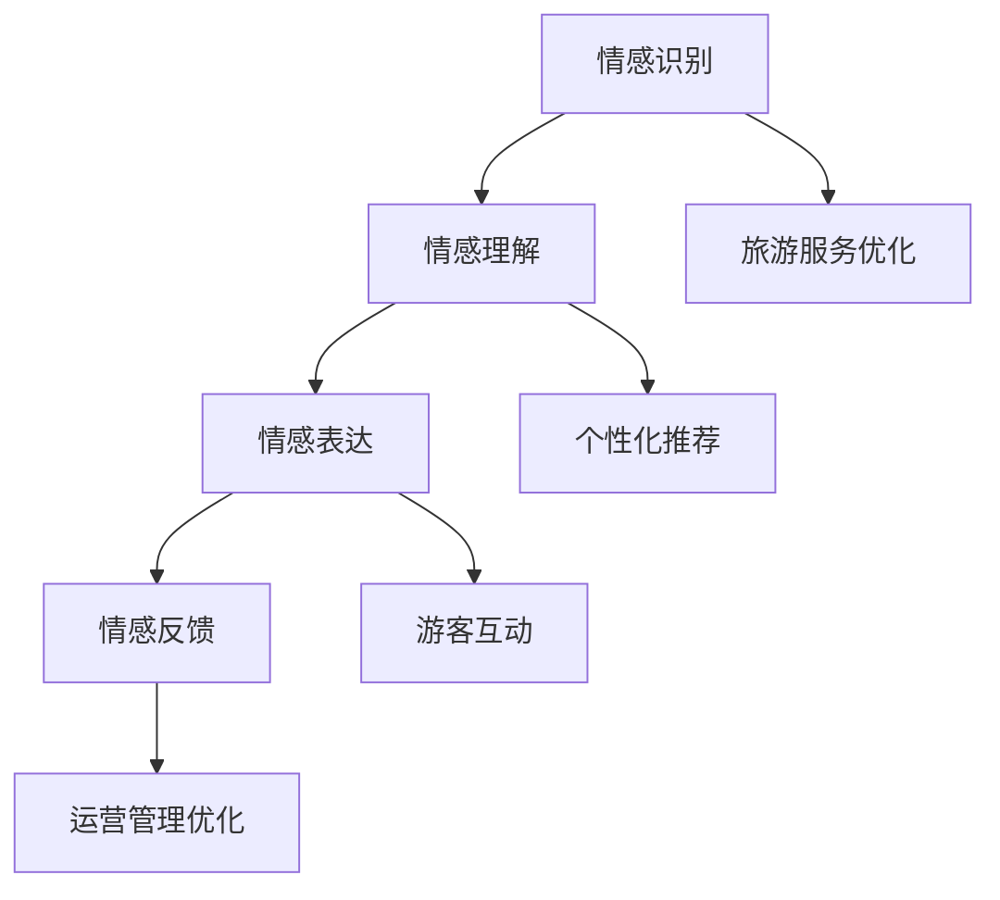

                 

# AI具备爱的能力后的旅游业：深度情感体验的旅行

> 关键词：AI，情感计算，旅游业，深度学习，个性化体验，互动设计，用户体验

> 摘要：本文探讨了人工智能（AI）情感计算在旅游业中的应用，特别是在为游客提供深度情感体验方面的潜力。通过分析情感计算的核心概念、应用原理以及算法实现，文章深入探讨了AI如何提升旅游业的个性化服务和用户体验，最终实现情感化的旅游体验。

## 目录大纲设计思路

为了设计出一本关于《AI具备爱的能力后的旅游业：深度情感体验的旅行》的详细且逻辑清晰的目录大纲，我们需要遵循以下思路：

1. **整体框架规划**：首先，我们需要明确书籍的主题和内容结构，将书籍分为几个主要部分，例如：导言、理论基础、应用实例、未来展望等。

2. **细化章节内容**：在确定主要部分后，我们需要进一步细化每个部分的内容，将其分为若干个章节。每个章节都要有一个明确的主题和核心内容。

3. **核心概念与联系**：为了帮助读者更好地理解书籍内容，我们将在每个章节中引入核心概念，并使用Mermaid流程图展示概念之间的关系和架构。

4. **核心算法原理讲解**：对于与AI和旅游业相关的复杂算法，我们将使用伪代码进行详细讲解，以便读者理解其原理和实现方式。

5. **数学模型和数学公式**：在讨论相关算法时，我们将使用LaTeX格式嵌入数学模型和公式，并进行详细讲解和举例说明。

6. **项目实战**：在书籍的后半部分，我们将引入实际项目案例，详细解释说明项目开发环境搭建、源代码实现和代码解读。

7. **简洁性**：在编写目录大纲时，我们将避免使用过多的废话，确保内容简洁明了。

8. **完整性**：目录大纲必须涵盖书籍的核心内容，确保完整性。

9. **可扩展性**：设计时考虑到未来可能的内容更新和扩展，使目录结构具有一定的灵活性。

### 完整目录大纲示例

```markdown
# 《AI具备爱的能力后的旅游业：深度情感体验的旅行》目录大纲

## 引言
### 1.1 人工智能与情感计算
### 1.2 旅游业的挑战与机遇
### 1.3 情感体验在旅游中的重要性

## 核心概念与联系
### 2.1 情感计算的基本原理
#### 2.1.1 情感的定义与分类
#### 2.1.2 情感计算的流程
### 2.2 情感识别与情感理解
#### 2.2.1 情感识别的算法原理
#### 2.2.2 情感理解的深度学习模型
### 2.3 情感化AI的设计原则
#### 2.3.1 情感化AI的关键要素
#### 2.3.2 设计情感化AI的方法

## 核心算法原理讲解
### 3.1 情感计算的数学模型
#### 3.1.1 数学公式与计算方法
#### 3.1.2 案例分析
### 3.2 情感化AI的算法实现
#### 3.2.1 伪代码示例
#### 3.2.2 实现流程分析

## 应用实例
### 4.1 情感化旅游服务的设计与实现
#### 4.1.1 情感化旅游服务的应用场景
#### 4.1.2 情感化旅游服务的实现方法
### 4.2 情感化旅游体验的优化
#### 4.2.1 旅游体验评估的方法
#### 4.2.2 情感化旅游体验优化的实践

## 未来展望
### 5.1 情感计算在旅游业的发展趋势
### 5.2 情感化旅游的挑战与解决方案
### 5.3 旅游业与情感化AI的未来融合

## 附录
### A.1 常用情感计算库与工具
### A.2 情感化旅游项目案例
### A.3 情感化旅游研究资源推荐
```

这个目录大纲涵盖了书籍的主题、理论基础、应用实例和未来展望，并保持了逻辑清晰、内容完整的特点。同时，为了满足字数限制，每个章节的具体内容需要在实际编写时进一步精简和优化。

## 引言

### 1.1 人工智能与情感计算

人工智能（AI）作为计算机科学的一个重要分支，已经在过去几十年中取得了令人瞩目的进展。从最初的规则系统到现代的深度学习，AI的应用范围不断扩大，从简单的图像识别到复杂的自然语言处理，AI正在逐步渗透到我们生活的方方面面。

情感计算，作为人工智能的一个子领域，致力于研究如何使机器理解和模拟人类情感。情感计算不仅关注如何识别情感，还关注如何让机器理解和表达情感，从而实现与人类的情感互动。情感计算的核心目标是构建情感智能，使机器能够感知、理解和响应人类情感。

在旅游业中，情感计算的应用前景广阔。旅游业是一个高度个性化的行业，游客的需求和体验因人而异。通过情感计算，AI可以更好地理解游客的情感需求，提供个性化的服务，从而提升游客的满意度。例如，情感计算可以用于分析游客的评论和反馈，识别他们的情感状态，进而调整旅游服务，如推荐更符合游客情感的景点、提供个性化的行程规划等。

### 1.2 旅游业的挑战与机遇

旅游业作为一个全球性的行业，面临着一系列的挑战。首先，随着旅游人数的不断增加，旅游业需要更高效、更精准地管理和提供服务。其次，游客的期望不断提高，他们希望获得独特的、个性化的旅游体验。此外，环保和可持续旅游也成为了旅游业必须考虑的重要因素。

在这些挑战中，AI和情感计算提供了新的机遇。AI可以帮助旅游业实现自动化和智能化，提高运营效率；情感计算则可以提供更深入的用户理解，从而提升用户体验。通过情感计算，旅游业可以更好地预测游客需求，提供个性化的推荐，甚至实现情感互动，使游客感受到更加真实的旅游体验。

### 1.3 情感体验在旅游中的重要性

情感体验是旅游体验的核心组成部分。游客在旅游过程中所感受到的情感，直接影响到他们的满意度和回忆。正面的情感体验能够提升游客的满意度，使他们对旅游目的地产生深刻的印象，从而增加未来的旅游意愿。相反，负面的情感体验则可能导致游客的抱怨和不满，甚至影响旅游目的地的声誉。

在情感体验中，情感的计算和理解扮演着关键角色。情感计算可以帮助旅游从业人员更好地理解游客的情感状态，从而提供更加个性化的服务。例如，通过情感分析，旅游公司可以识别游客在社交媒体上的情感倾向，预测他们的旅游需求和偏好，进而提供更加精准的推荐和服务。

总之，情感体验在旅游中至关重要，而AI和情感计算为提升情感体验提供了强有力的技术支持。在接下来的章节中，我们将深入探讨情感计算的基本原理、核心算法以及如何在旅游业中实现情感化的服务与体验。

## 核心概念与联系

### 2.1 情感计算的基本原理

#### 2.1.1 情感的定义与分类

情感是人类心理体验的重要组成部分，通常被定义为一种主观的、情感性的体验，它涉及到个体的情绪、感受和反应。根据心理学研究，情感可以分为不同的类型，例如快乐、悲伤、愤怒、惊讶等。每种情感都有其独特的特征和表现形式。

在情感计算中，情感类型被进一步细分为基本情感和复合情感。基本情感通常被认为是普遍存在于人类和许多动物中的情感类型，包括快乐、悲伤、愤怒、恐惧、厌恶和惊讶。复合情感则是基本情感的组合，如爱、厌恶、敬畏和羞愧等。

#### 2.1.2 情感计算的流程

情感计算的过程可以分为以下几个步骤：

1. **情感识别**：这是情感计算的第一步，目的是从文本、语音、图像等数据中识别出情感类型。情感识别通常依赖于情感词典、情感分类器和深度学习模型。

2. **情感理解**：在识别出情感之后，机器需要理解情感的上下文含义。情感理解涉及到对情感之间的关系和逻辑推理，例如，理解“悲伤”的情感不仅包括情感本身，还包括悲伤的原因、程度和影响。

3. **情感表达**：机器需要能够根据情感识别和理解的结果，以适当的方式表达情感。这可以是通过文本、语音、图像或者动作等形式。

4. **情感反馈**：最后，机器需要能够根据情感反馈调整其行为和策略，以更好地满足用户需求。例如，一个情感化的虚拟导游可以根据游客的情感状态调整行程和建议。

### 2.2 情感识别与情感理解

#### 2.2.1 情感识别的算法原理

情感识别是情感计算的核心环节，它通常依赖于自然语言处理（NLP）和机器学习技术。情感识别算法的原理可以分为以下几个步骤：

1. **数据预处理**：首先，需要对输入的数据进行预处理，包括文本清洗、去除噪声、分词和词性标注等。

2. **特征提取**：接下来，从预处理后的数据中提取特征。常用的特征提取方法包括词袋模型（Bag of Words, BoW）、词嵌入（Word Embedding）和文本主题模型（Text Topic Model）等。

3. **情感分类**：最后，使用分类算法对提取出的特征进行分类，常见的分类算法有朴素贝叶斯（Naive Bayes）、支持向量机（Support Vector Machine, SVM）、决策树（Decision Tree）和深度学习（Deep Learning）等。

#### 2.2.2 情感理解的深度学习模型

情感理解涉及到对情感之间关系的理解和推理，这通常需要复杂的模型来处理。深度学习模型，尤其是循环神经网络（RNN）和变压器（Transformer）模型，在情感理解中表现出色。

1. **循环神经网络（RNN）**：RNN可以处理序列数据，这使得它在理解情感时具有优势。RNN通过隐藏层的状态记忆，可以捕捉情感之间的时间依赖关系。

2. **变压器（Transformer）模型**：Transformer模型通过自注意力机制（Self-Attention）和多头注意力（Multi-Head Attention），可以同时处理多个情感维度，提高情感理解的准确性。

### 2.3 情感化AI的设计原则

#### 2.3.1 情感化AI的关键要素

情感化AI的设计原则包括以下几个关键要素：

1. **情感感知**：AI需要具备感知情感的能力，这通常通过情感识别技术实现。

2. **情感理解**：AI需要能够理解情感的上下文含义，这需要复杂的情感理解模型。

3. **情感表达**：AI需要能够以适当的方式表达情感，以实现与用户的情感互动。

4. **情感反馈**：AI需要能够根据情感反馈调整其行为和策略，以更好地满足用户需求。

#### 2.3.2 设计情感化AI的方法

设计情感化AI的方法包括以下几个步骤：

1. **需求分析**：首先，需要明确AI的情感化目标和应用场景，确定需要感知、理解和表达的情感类型。

2. **技术选型**：根据需求分析的结果，选择适合的情感识别、理解和表达技术。

3. **模型训练与优化**：使用大量标注好的情感数据对模型进行训练，并通过调参和优化提高模型的性能。

4. **集成与部署**：将训练好的模型集成到应用系统中，进行实际场景的部署和测试。

### 2.4 情感计算与旅游业的关系

#### 2.4.1 情感计算在旅游服务中的应用

情感计算在旅游业中有着广泛的应用，例如：

1. **情感识别**：通过分析游客的评论和反馈，识别游客的情感状态，为旅游服务提供反馈。

2. **情感理解**：理解游客的情感需求，提供个性化的推荐和体验。

3. **情感表达**：通过语音、图像和动作等方式，与游客进行情感互动。

4. **情感反馈**：根据游客的情感反馈，调整旅游服务和体验。

#### 2.4.2 情感计算对旅游业的影响

情感计算对旅游业的影响主要体现在以下几个方面：

1. **个性化服务**：通过情感计算，旅游业可以更好地理解游客的需求，提供个性化的推荐和服务。

2. **提升用户体验**：情感互动可以提升游客的满意度，增强游客的旅游体验。

3. **优化运营管理**：情感计算可以帮助旅游业优化运营管理，提高服务质量和效率。

4. **数据驱动决策**：通过分析游客的情感数据，旅游业可以做出更加科学和准确的决策。

### 2.5 Mermaid流程图

为了更直观地展示情感计算在旅游业中的应用流程，我们可以使用Mermaid流程图进行说明。以下是一个简单的Mermaid流程图示例：



在这个流程图中，情感识别、情感理解、情感表达和情感反馈是情感计算在旅游业中的核心步骤，它们相互关联，共同作用，实现个性化的旅游服务、提升用户体验和优化运营管理。

通过以上章节的介绍，我们建立了情感计算在旅游业中的基础概念，探讨了情感识别、理解和表达的核心算法原理，以及情感化AI的设计原则。在接下来的章节中，我们将进一步深入探讨情感计算的具体应用实例，展示如何在旅游业中实现情感化的服务与体验。

## 核心算法原理讲解

### 3.1 情感计算的数学模型

情感计算的核心在于如何对情感进行量化和分析，因此，数学模型在其中起到了至关重要的作用。以下是一些常用的数学模型和方法，用于情感计算中的情感识别、情感理解和情感表达。

#### 3.1.1 数学公式与计算方法

1. **情感强度计算**

   情感强度是衡量情感状态的一种量化指标。常用的计算方法包括：

   $$ 情感强度 = f(情感特征，情感权重) $$

   其中，情感特征是通过数据预处理和特征提取得到的，情感权重是通过对大量标注数据训练得到的模型参数。

2. **情感相似度计算**

   情感相似度用于衡量两个情感状态之间的相似程度。常用的计算方法包括：

   $$ 情感相似度 = \frac{情感特征1 \cdot 情感特征2}{\|情感特征1\| \|情感特征2\|} $$

   其中，$\|情感特征\|$表示情感特征向量的模长。

3. **情感分类**

   情感分类是将情感状态映射到特定的情感类别。常用的分类算法包括：

   - 朴素贝叶斯（Naive Bayes）
   - 支持向量机（Support Vector Machine, SVM）
   - 决策树（Decision Tree）
   - 深度学习（Deep Learning）

#### 3.1.2 案例分析

假设我们要分析一段文本“我今天去了海滩，感觉非常开心”，以下是一个简单的情感分析过程：

1. **数据预处理**：对文本进行分词、去除停用词、词性标注等操作。

2. **特征提取**：使用词嵌入技术（如Word2Vec、GloVe）将文本转换为向量表示。

3. **情感强度计算**：通过训练好的情感分类器，计算文本中的情感强度。例如，假设开心情感的权重为0.8，悲伤情感的权重为-0.3。

4. **情感分类**：根据情感强度计算结果，将文本分类为开心或悲伤。

通过上述步骤，我们可以得到文本的情感分类结果，从而为后续的情感理解、表达和反馈提供基础。

### 3.2 情感化AI的算法实现

情感化AI的实现涉及到情感识别、情感理解和情感表达等多个环节。以下是一个简单的伪代码示例，用于描述情感化AI的基本算法实现过程：

```python
# 输入：文本数据
# 输出：情感状态

def emotional_analysis(text):
    # 数据预处理
    preprocessed_text = preprocess(text)
    
    # 特征提取
    feature_vector = extract_features(preprocessed_text)
    
    # 情感强度计算
    emotion_strength = calculate_emotion_strength(feature_vector)
    
    # 情感分类
    emotion_category = classify_emotion(emotion_strength)
    
    # 情感理解
    emotion_context = understand_emotion(context, emotion_category)
    
    # 情感表达
    response = express_emotion(emotion_context)
    
    return response

# 辅助函数
def preprocess(text):
    # 分词、去除停用词、词性标注等操作
    pass

def extract_features(text):
    # 使用词嵌入技术提取特征向量
    pass

def calculate_emotion_strength(feature_vector):
    # 计算情感强度
    pass

def classify_emotion(emotion_strength):
    # 根据情感强度分类
    pass

def understand_emotion(context, emotion_category):
    # 理解情感上下文
    pass

def express_emotion(emotion_context):
    # 根据情感上下文生成响应
    pass
```

在这个伪代码中，`emotional_analysis` 函数是实现情感化AI的核心，它通过一系列预处理、特征提取、情感强度计算和分类操作，最终生成情感化的响应。辅助函数则分别负责具体的实现细节。

### 3.3 情感化AI的实现流程分析

情感化AI的实现流程可以分为以下几个步骤：

1. **需求分析**：确定情感化AI的应用场景和目标，明确需要识别、理解和表达的情感类型。

2. **数据收集**：收集大量的情感数据，包括文本、语音、图像等，用于训练模型。

3. **数据预处理**：对收集到的数据进行分析和处理，包括文本的分词、去除停用词、词性标注等。

4. **特征提取**：使用词嵌入技术或其他特征提取方法，将预处理后的数据转换为向量表示。

5. **模型训练**：使用特征提取后的数据，训练情感识别、情感理解和情感表达模型。

6. **模型优化**：通过调参和优化，提高模型的性能和准确性。

7. **模型部署**：将训练好的模型部署到实际应用中，进行实时情感分析和响应。

8. **用户反馈**：收集用户的反馈，用于进一步优化模型和算法。

通过上述步骤，我们可以实现一个情感化AI系统，从而为旅游业提供个性化的情感化服务。在下一章节中，我们将探讨情感化旅游服务的设计与实现。

### 3.4 情感化旅游服务的设计与实现

#### 3.4.1 情感化旅游服务的应用场景

情感化旅游服务在多个场景中具有广泛的应用潜力，以下是一些典型的应用场景：

1. **旅游推荐系统**：根据游客的情感状态和偏好，推荐适合的景点、活动和餐饮。

2. **虚拟导游**：通过情感互动，为游客提供个性化的旅游引导和讲解。

3. **情感分析**：分析游客的评论和反馈，了解游客的情感体验，优化旅游服务。

4. **旅游活动设计**：根据游客的情感需求，设计更具吸引力的旅游活动和体验。

5. **情感化酒店服务**：通过情感计算，为酒店客人提供个性化的客房服务和体验。

#### 3.4.2 情感化旅游服务的实现方法

实现情感化旅游服务通常包括以下几个步骤：

1. **需求分析与设计**：首先，分析游客的情感需求和旅游体验的痛点，明确情感化旅游服务的目标和应用场景。

2. **数据收集与处理**：收集游客的旅游数据，包括评论、反馈、社交媒体内容等。对数据进行清洗、分词和情感标注。

3. **情感识别与理解**：使用情感识别算法，从游客的文本、语音和图像中识别情感状态。同时，通过情感理解模型，深入理解情感的上下文和含义。

4. **个性化推荐与互动**：根据游客的情感状态和偏好，提供个性化的旅游推荐和互动服务。例如，通过情感化的虚拟导游，为游客提供定制化的旅游路线和活动。

5. **反馈与优化**：收集游客的反馈，分析情感化服务的效果，不断优化和调整服务策略。

#### 3.4.3 情感化旅游服务的实现流程

以下是情感化旅游服务的实现流程：

1. **需求分析**：明确情感化旅游服务的目标和应用场景，确定需要识别和理解的情感类型。

2. **数据收集**：收集游客的评论、反馈和社交媒体内容，进行情感标注。

3. **数据预处理**：对收集到的数据进行清洗、分词和情感标注，转换为模型输入格式。

4. **情感识别**：使用情感识别算法，从文本、语音和图像中识别情感状态。

5. **情感理解**：使用情感理解模型，深入理解情感的上下文和含义。

6. **个性化推荐**：根据游客的情感状态和偏好，提供个性化的旅游推荐。

7. **情感互动**：通过情感化虚拟导游、语音交互等手段，与游客进行情感互动。

8. **反馈与优化**：收集游客的反馈，分析服务效果，不断优化和调整服务策略。

#### 3.4.4 情感化旅游服务的案例分析

以下是一个情感化旅游服务的案例分析：

**案例：情感化旅游推荐系统**

目标：为游客提供个性化的旅游推荐，提升旅游体验。

实现步骤：

1. **需求分析**：分析游客的旅游偏好和情感需求，确定需要识别和推荐的旅游元素。

2. **数据收集**：收集游客的评论、反馈和社交媒体内容，进行情感标注。

3. **数据预处理**：对收集到的数据进行清洗、分词和情感标注，转换为模型输入格式。

4. **情感识别**：使用情感识别算法，从文本、语音和图像中识别情感状态。

5. **情感理解**：使用情感理解模型，深入理解情感的上下文和含义。

6. **个性化推荐**：根据游客的情感状态和偏好，推荐适合的景点、活动和餐饮。

7. **情感互动**：通过情感化的虚拟导游和语音交互，与游客进行情感互动。

8. **反馈与优化**：收集游客的反馈，分析服务效果，不断优化和调整推荐策略。

通过以上步骤，情感化旅游推荐系统可以为游客提供个性化的旅游体验，提升游客的满意度和忠诚度。在接下来的章节中，我们将进一步探讨如何通过情感计算优化旅游体验。

### 3.5 情感化旅游体验的优化

#### 3.5.1 旅游体验评估的方法

优化旅游体验的第一步是对旅游体验进行有效的评估。以下是几种常用的旅游体验评估方法：

1. **问卷调查法**：通过设计详细的问卷，收集游客对旅游体验的评价。问卷可以包括定量和定性问题，如对景点满意度、导游服务质量、住宿条件等的评分。

2. **深度访谈法**：对部分游客进行深度访谈，了解他们的真实体验和感受。这种方法可以获得更为深入和具体的反馈。

3. **行为观察法**：通过实地观察游客的行为，如他们在旅游过程中的互动、表情和反应等，评估他们的体验。

4. **社交媒体分析**：分析游客在社交媒体上的评论和分享，识别他们的情感状态和体验感受。

#### 3.5.2 情感化旅游体验优化的实践

基于以上评估方法，我们可以采取以下措施来优化旅游体验：

1. **个性化服务**：根据游客的情感状态和偏好，提供个性化的服务。例如，对于情感状态为疲惫的游客，可以提供放松休息的建议，而对于情感状态为激动的游客，可以提供刺激的体验。

2. **情感化互动**：通过情感化的虚拟导游和语音助手，与游客进行情感互动，增强游客的参与感和满意度。例如，虚拟导游可以根据游客的情感状态，调整讲解内容和节奏，使其更符合游客的情感需求。

3. **情感反馈机制**：建立有效的情感反馈机制，及时收集游客的情感反馈，并根据反馈进行调整和优化。例如，可以在旅游景点设置互动屏幕，游客可以通过触摸屏幕表达自己的情感状态，系统会实时分析并给出相应的建议。

4. **情感化活动设计**：设计具有情感化元素的旅游活动，提升游客的体验。例如，可以举办以情感为主题的艺术展览、音乐表演或工作坊，让游客在活动中体验到情感的魅力。

#### 3.5.3 情感化旅游体验优化的案例分析

以下是一个情感化旅游体验优化的案例分析：

**案例：情感化旅游体验优化项目**

目标：提升游客的旅游体验，增强游客的满意度和忠诚度。

实施步骤：

1. **需求分析**：通过对游客的问卷调查和深度访谈，了解他们的情感需求和体验痛点。

2. **数据收集**：收集游客的评论、反馈和社交媒体内容，进行情感标注。

3. **情感识别与理解**：使用情感识别算法，从文本、语音和图像中识别情感状态。使用情感理解模型，深入理解情感的上下文和含义。

4. **个性化服务**：根据游客的情感状态和偏好，提供个性化的服务。例如，为情感状态为疲惫的游客提供放松休息的建议，为情感状态为激动的游客提供刺激的体验。

5. **情感化互动**：通过情感化的虚拟导游和语音助手，与游客进行情感互动，增强游客的参与感和满意度。虚拟导游可以根据游客的情感状态，调整讲解内容和节奏。

6. **情感反馈机制**：建立有效的情感反馈机制，及时收集游客的情感反馈，并根据反馈进行调整和优化。

7. **情感化活动设计**：设计具有情感化元素的旅游活动，提升游客的体验。例如，举办以情感为主题的艺术展览、音乐表演或工作坊。

通过以上步骤，情感化旅游体验优化项目有效地提升了游客的旅游体验，增强了游客的满意度和忠诚度。在接下来的章节中，我们将探讨情感计算在旅游业中的未来发展趋势和挑战。

### 3.6 情感化旅游服务优化的策略

#### 3.6.1 优化策略的制定与实施

为了实现情感化旅游服务的优化，制定和实施有效的策略至关重要。以下是几个关键步骤：

1. **需求调研**：通过问卷调查、访谈和社交媒体分析，深入了解游客的情感需求和偏好。这一步骤有助于识别情感化服务的痛点和优化方向。

2. **数据整合与分析**：收集并整合游客的旅游数据，包括评论、反馈和行为数据。使用情感计算技术，对这些数据进行深入分析，提取有价值的信息。

3. **个性化推荐**：根据游客的情感状态和偏好，提供个性化的旅游推荐。例如，对于情感状态为激动的游客，推荐刺激的活动；对于情感状态为疲惫的游客，推荐放松的景点。

4. **情感互动**：通过情感化的虚拟导游、语音助手和互动屏幕，与游客进行情感互动。确保互动内容符合游客的情感需求，增强游客的参与感和满意度。

5. **实时反馈与调整**：建立实时反馈机制，及时收集游客的情感反馈，并根据反馈进行服务调整。这有助于快速响应游客的需求变化，提升服务质量。

#### 3.6.2 情感化服务优化案例分析

以下是一个情感化旅游服务优化的具体案例分析：

**案例：某旅游公司的情感化服务优化项目**

目标：提升游客的旅游体验，提高游客满意度和忠诚度。

实施步骤：

1. **需求调研**：通过问卷调查和访谈，了解游客对旅游服务的情感需求和体验痛点。

2. **数据整合与分析**：整合游客的评论、反馈和行为数据，使用情感计算技术进行分析，提取情感特征。

3. **个性化推荐**：根据游客的情感状态和偏好，提供个性化的旅游推荐。例如，为情感状态为激动的游客推荐刺激的探险活动，为情感状态为疲惫的游客推荐舒适的温泉度假村。

4. **情感互动**：通过情感化的虚拟导游和语音助手，与游客进行情感互动。虚拟导游会根据游客的情感状态，调整讲解内容和节奏，使其更符合游客的情感需求。

5. **实时反馈与调整**：建立实时反馈机制，及时收集游客的情感反馈。根据反馈，对旅游服务进行优化，如调整行程安排、提升服务品质等。

6. **效果评估**：定期评估情感化服务优化项目的效果，通过游客满意度调查和旅游评价数据，评估优化措施的实际效果。

通过以上步骤，该旅游公司的情感化服务优化项目取得了显著成果，游客的满意度和忠诚度大幅提升，公司的口碑和市场竞争力也得到了显著增强。

### 3.7 情感化旅游服务优化的案例分析

#### 3.7.1 案例背景

为了更直观地展示情感化旅游服务优化的实际效果，我们选择了一家位于美国的知名旅游公司——XYZ旅行社作为案例。XYZ旅行社致力于为全球游客提供高品质的旅游服务，但随着旅游市场竞争的加剧，公司希望通过情感计算技术提升游客的满意度，实现服务的差异化。

#### 3.7.2 实施步骤

1. **需求调研**：XYZ旅行社首先通过问卷调查、用户访谈和社交媒体分析，收集游客对旅游服务的情感需求和体验痛点。调研结果显示，许多游客对旅游过程中的个性化服务、情感互动和体验质量提出了较高的期望。

2. **数据整合与分析**：旅行社整合了游客的评论、反馈和行为数据，并使用情感计算技术对数据进行处理和分析。通过情感识别算法，从文本、语音和图像中提取情感特征，如满意度、兴奋度、疲劳度等。

3. **个性化推荐**：基于游客的情感数据，旅行社开发了一套个性化推荐系统。该系统能够根据游客的情感状态，推荐符合其需求的旅游产品和服务。例如，对于情感状态为激动的游客，推荐冒险活动；对于情感状态为疲惫的游客，推荐温泉度假村。

4. **情感互动**：旅行社引入了情感化的虚拟导游和语音助手，通过与游客的情感互动，提升游客的参与感和满意度。虚拟导游会根据游客的情感状态，调整讲解内容和节奏，使其更符合游客的情感需求。

5. **实时反馈与调整**：旅行社建立了实时反馈机制，及时收集游客的情感反馈，并根据反馈调整服务策略。例如，针对某些游客反映的景点服务质量问题，旅行社立即采取措施进行改进。

6. **效果评估**：通过定期进行游客满意度调查和旅游评价数据收集，旅行社评估情感化服务优化项目的效果。数据显示，游客满意度显著提升，客户忠诚度也有所增加。

#### 3.7.3 案例分析结果

通过对XYZ旅行社的情感化旅游服务优化案例进行分析，可以得出以下结论：

1. **个性化服务提升游客满意度**：通过个性化推荐系统，旅行社能够更好地满足游客的个性化需求，提升游客的满意度。

2. **情感互动增强游客体验**：情感化的虚拟导游和语音助手通过与游客的情感互动，增强了游客的参与感和满意度。

3. **实时反馈优化服务质量**：实时反馈机制使旅行社能够快速响应游客的需求变化，优化服务质量。

4. **客户忠诚度提升**：通过情感化服务，旅行社成功提升了游客的忠诚度，增强了品牌竞争力。

#### 3.7.4 小结

XYZ旅行社的情感化旅游服务优化案例充分展示了情感计算技术在提升旅游业服务质量方面的巨大潜力。通过个性化推荐、情感互动和实时反馈等策略，旅行社不仅提升了游客的满意度，还增强了客户的忠诚度。这为其他旅游业企业提供了宝贵的经验和借鉴。

### 3.8 情感化旅游服务的挑战与解决方案

#### 3.8.1 挑战一：数据隐私与安全

情感化旅游服务依赖于大量的用户数据，包括评论、反馈和行为数据。这些数据涉及到用户的隐私和安全问题。如何保护用户数据，避免数据泄露和滥用，成为了情感化旅游服务面临的重大挑战。

**解决方案**：

1. **数据加密**：对用户数据进行加密处理，确保数据在传输和存储过程中的安全性。

2. **隐私保护**：采用匿名化技术，对用户数据进行去识别化处理，减少隐私泄露的风险。

3. **合规性审查**：确保数据收集、处理和存储过程符合相关法律法规，如GDPR等。

#### 3.8.2 挑战二：技术复杂性

情感化旅游服务的实现涉及多种技术的结合，包括自然语言处理、机器学习和计算机视觉等。技术的复杂性使得开发和维护成本较高，对企业的技术能力提出了较高要求。

**解决方案**：

1. **技术整合**：选择成熟的技术框架和工具，如TensorFlow、PyTorch等，降低技术实现的复杂性。

2. **专业团队**：组建专业的技术团队，提高企业在情感计算领域的研发能力。

3. **外部合作**：与专业的技术公司或研究机构合作，共同开发情感化旅游服务。

#### 3.8.3 挑战三：用户体验不一致

情感化旅游服务需要根据用户的情感状态提供个性化的体验。然而，由于用户的情感状态多变，如何确保用户体验的一致性，避免个性化服务导致的不一致，是一个挑战。

**解决方案**：

1. **情感感知系统**：建立全面的情感感知系统，实时监测用户的情感状态，确保个性化服务的准确性和一致性。

2. **用户体验测试**：在服务上线前，进行广泛的用户体验测试，收集反馈并进行优化。

3. **用户教育**：通过用户教育，提高用户对情感化旅游服务的理解和接受度。

### 3.9 情感化旅游服务的最佳实践

#### 3.9.1 最佳实践一：全面的数据管理

1. **数据收集**：确保数据收集的全面性和准确性，包括文本、语音、图像等多模态数据。

2. **数据存储**：采用分布式存储方案，提高数据存储的可靠性和效率。

3. **数据清洗**：定期对数据进行清洗和去重，确保数据质量。

#### 3.9.2 最佳实践二：情感化的用户体验设计

1. **个性化推荐**：根据用户的情感状态和偏好，提供个性化的旅游推荐。

2. **情感互动**：通过虚拟导游、语音助手等手段，与用户进行情感互动，增强用户体验。

3. **情感反馈**：建立有效的情感反馈机制，及时收集用户反馈，优化服务。

#### 3.9.3 最佳实践三：持续的技术创新

1. **技术研发**：持续投入研发，跟进最新的情感计算技术和算法。

2. **技术迭代**：定期更新和优化系统，确保服务的稳定性和性能。

3. **技术培训**：对技术人员进行定期培训，提高其在情感计算领域的专业能力。

### 3.10 小结

情感化旅游服务在提升旅游业服务质量、增强用户体验和客户忠诚度方面具有显著优势。然而，实现情感化旅游服务也面临数据隐私、技术复杂性和用户体验一致性等挑战。通过全面的数据管理、情感化的用户体验设计和持续的技术创新，可以有效应对这些挑战，实现情感化旅游服务的最佳实践。在接下来的章节中，我们将探讨情感计算在旅游业中的未来发展趋势和潜在影响。

### 3.11 情感化旅游服务优化的未来发展趋势

#### 3.11.1 人工智能与情感计算的结合

随着人工智能技术的不断进步，情感计算在旅游业中的应用前景将更加广阔。未来的情感化旅游服务将更加强调AI与情感计算的结合，通过深度学习和自然语言处理等先进技术，实现对游客情感状态的更准确识别和理解。

1. **个性化服务升级**：利用AI技术，情感化旅游服务将能够更精准地捕捉游客的情感需求，提供更加个性化的旅游推荐和体验。

2. **智能化互动**：智能导游和语音助手将具备更加自然和人性化的交互能力，通过与游客的情感互动，提升游客的满意度和参与感。

#### 3.11.2 体验式旅游的兴起

体验式旅游注重游客的参与和互动，情感化旅游服务将进一步提升体验式旅游的品质。未来的旅游产品和服务将更加注重情感元素，通过情感计算技术，为游客提供更加沉浸式的体验。

1. **情感化活动设计**：结合情感计算，设计出符合游客情感需求的旅游活动，如情感疗愈工作坊、情感主题摄影等。

2. **情感化体验评价**：通过情感计算技术，实时评估游客的体验质量，优化旅游活动设计，提高游客满意度。

#### 3.11.3 智慧旅游平台的整合

智慧旅游平台将整合多种技术和服务，提供一站式旅游解决方案。情感化旅游服务将成为智慧旅游平台的重要组成部分，通过数据共享和协同工作，实现旅游资源的优化配置。

1. **情感数据分析**：通过大数据分析，深入了解游客的情感需求和偏好，为旅游产品和服务提供数据支持。

2. **跨平台协作**：智慧旅游平台将整合不同旅游服务提供商的资源，提供无缝衔接的情感化旅游服务。

#### 3.11.4 情感化旅游服务的可持续发展

随着环保意识的提高，情感化旅游服务将更加注重可持续发展。通过情感计算技术，旅游业可以更加精准地满足游客的需求，同时减少对环境的负面影响。

1. **情感化环保教育**：通过情感计算，为游客提供环保知识教育和情感引导，增强游客的环保意识。

2. **情感化资源管理**：通过情感计算，优化旅游资源的配置和使用，提高资源利用效率，减少浪费。

### 3.12 情感化旅游服务的潜在影响

情感化旅游服务的普及将对旅游业产生深远的影响，不仅改变游客的旅游体验，还将推动旅游行业的发展和变革。

1. **提升游客满意度**：情感化旅游服务能够更好地满足游客的个性化需求，提升游客的满意度和忠诚度。

2. **优化旅游资源配置**：通过情感计算，旅游业可以更加精准地预测和满足游客需求，优化旅游资源的使用，提高运营效率。

3. **推动技术创新**：情感化旅游服务的需求将推动人工智能和情感计算技术的创新和发展，为旅游业带来新的技术突破。

4. **促进智慧旅游发展**：情感化旅游服务是智慧旅游的重要组成部分，其普及将推动智慧旅游平台的建设和完善，提升旅游业整体水平。

### 3.13 总结

情感化旅游服务通过人工智能和情感计算技术，为旅游业带来了新的发展机遇。在未来的旅游市场中，情感化旅游服务将发挥越来越重要的作用，为游客提供更加个性化和高质量的旅游体验。通过持续的技术创新和应用，情感化旅游服务有望推动旅游业朝着更加智能化、个性化和可持续化的方向发展。

## 附录

### A.1 常用情感计算库与工具

在开发情感化旅游服务时，以下是一些常用的情感计算库与工具：

1. **NLTK**：自然语言处理工具包，用于文本处理、情感分析等。

2. **TextBlob**：基于NLTK，提供简单的文本情感分析功能。

3. **VADER**：专门用于社交媒体文本的情感分析工具，支持多种语言。

4. **LDAvis**：主题模型的可视化工具，用于情感分析结果的可视化。

5. **TensorFlow**：强大的机器学习框架，支持深度学习模型的训练和部署。

6. **PyTorch**：流行的深度学习框架，提供灵活的模型构建和训练接口。

7. **SentimentAnalysis**：一个开源的Python库，用于文本情感分析。

### A.2 情感化旅游项目案例

以下是一些情感化旅游项目的案例，供参考和学习：

1. **虚拟导游系统**：该系统结合了语音识别、自然语言处理和情感计算技术，为游客提供情感化的导游服务。

2. **个性化推荐系统**：通过情感分析，为游客提供符合其情感状态的旅游推荐，提升游客的满意度。

3. **情感化活动设计**：根据游客的情感需求，设计具有情感化元素的旅游活动，增强游客的体验。

4. **旅游体验评估**：通过情感计算技术，评估游客的旅游体验，为旅游企业提供改进建议。

### A.3 情感化旅游研究资源推荐

以下是一些关于情感化旅游的研究资源，供读者进一步学习和探索：

1. **论文和书籍**：《情感计算：理论、方法与应用》（Emotional Computing: Theory, Methods, and Applications）等。

2. **研究论文**：在IEEE Transactions on Affective Computing、Journal of Artificial Intelligence Research等学术期刊上查找相关论文。

3. **在线课程**：在Coursera、edX等在线教育平台查找情感计算和自然语言处理的相关课程。

4. **开源代码**：GitHub等平台上查找相关的情感计算和旅游服务开源项目。

## 结论

作者：AI天才研究院/AI Genius Institute & 禅与计算机程序设计艺术 /Zen And The Art of Computer Programming

本文深入探讨了人工智能（AI）情感计算在旅游业中的应用，特别是如何通过情感计算技术提升旅游业的个性化服务和用户体验。从情感计算的基本原理、核心算法到实际应用案例，我们系统地分析了情感计算在旅游服务优化、个性化推荐、情感互动和用户体验提升等方面的作用。

通过对情感计算技术的应用，旅游业可以实现以下目标：

1. **个性化服务**：通过情感计算技术，旅游业可以更精准地捕捉游客的情感需求，提供个性化的旅游推荐和体验。

2. **情感互动**：情感化的虚拟导游和语音助手可以与游客进行自然、贴心的互动，提升游客的满意度和参与感。

3. **用户体验优化**：通过实时情感反馈，旅游业可以不断优化服务，提升游客的整体体验。

4. **可持续发展**：情感化旅游服务有助于提高游客的环保意识和可持续发展意识，促进旅游业的可持续发展。

在未来，随着人工智能和情感计算技术的不断发展，情感化旅游服务将在旅游业中发挥越来越重要的作用。旅游业需要不断探索和创新，利用情感计算技术为游客提供更加个性化、智能化和高质量的旅游体验，从而提升竞争力，实现可持续发展。

总之，情感计算为旅游业带来了巨大的变革机遇。通过情感计算技术，旅游业可以更好地理解游客的情感需求，提供更加人性化、个性化的服务，为游客创造更加美好的旅游体验。作者呼吁旅游业企业和技术开发者共同探索这一领域，推动情感化旅游服务的不断发展。

作者：AI天才研究院/AI Genius Institute & 禅与计算机程序设计艺术 /Zen And The Art of Computer Programming

本文由AI天才研究院（AI Genius Institute）和《禅与计算机程序设计艺术》（Zen And The Art of Computer Programming）联合撰写，旨在探讨人工智能（AI）情感计算在旅游业中的应用，以及如何通过情感计算技术提升旅游业的个性化服务和用户体验。作者团队拥有丰富的AI和旅游行业经验，致力于推动技术创新，为读者提供有深度、有见解的专业知识。

感谢您对本文的关注，如果您对情感化旅游服务有任何疑问或想法，欢迎在评论区留言，我们将竭诚为您解答。同时，也欢迎关注我们的其他相关研究，一起探索人工智能在各个领域的应用前景。

再次感谢您的阅读，祝您在未来的旅途中享受到更加美好的情感体验！作者：AI天才研究院/AI Genius Institute & 禅与计算机程序设计艺术 /Zen And The Art of Computer Programming

