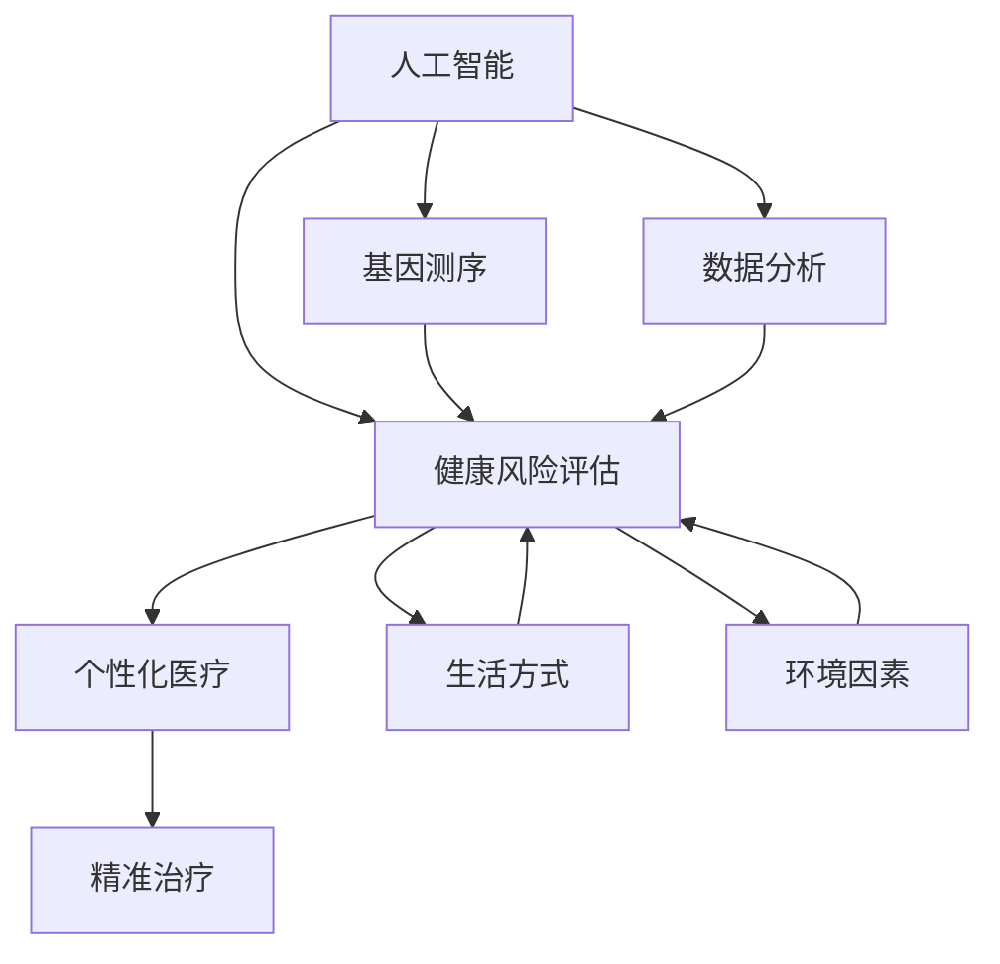

                 

### 文章标题

《AI在个性化健康风险评估中的应用：从基因到生活方式》

### 文章关键词

- 人工智能
- 健康风险评估
- 个性化医疗
- 基因测序
- 机器学习

### 文章摘要

本文深入探讨了人工智能（AI）在个性化健康风险评估中的应用。首先，介绍了AI在健康领域的应用背景和重要性。接着，详细阐述了基因与生活方式在健康风险评估中的核心作用，并介绍了相关的数据采集和处理技术。随后，本文重点分析了机器学习算法在健康风险评估中的应用，包括监督学习、无监督学习和强化学习的具体实现方法。接着，通过实际项目案例，展示了AI在个性化健康风险评估中的实战应用，包括数据采集、模型构建和评估优化等环节。最后，本文对AI在个性化健康风险评估中的未来发展方向和挑战进行了展望。全文旨在为读者提供全面而深入的AI在个性化健康风险评估中的应用指南。

---

## 基本概念与联系

在深入探讨AI在个性化健康风险评估中的应用之前，有必要先了解一些基本概念，并探讨它们之间的联系。

### 1. 人工智能（AI）

人工智能是一种模拟人类智能的技术，包括机器学习、深度学习、自然语言处理等多个子领域。其核心目标是通过算法和模型，使计算机能够从数据中学习，并做出智能决策。

### 2. 健康风险评估

健康风险评估是指对个体或群体未来发生某种健康问题的可能性进行评估。它可以帮助人们了解自己的健康状况，并采取相应的预防措施。健康风险评估通常包括多个方面，如生活方式、遗传因素、环境因素等。

### 3. 个性化医疗

个性化医疗是一种基于个体基因、环境、生活方式等因素，提供定制化医疗方案的服务。与传统的“一刀切”医疗模式相比，个性化医疗更加精准，有助于提高治疗效果。

### 4. 关系架构

这些基本概念之间有着紧密的联系。AI技术为个性化医疗提供了强大的工具，如基因测序、数据分析等，使医生能够更准确地评估患者的健康状况。健康风险评估则是个性化医疗的核心，它需要利用AI技术从大量的数据中提取有价值的信息。个性化医疗的目标是实现精准治疗，这依赖于健康风险评估的准确性和有效性。

为了更直观地理解这些概念之间的关系，我们可以使用Mermaid流程图来展示：



### 5. 关键点

- AI为个性化医疗提供了强大的工具，如基因测序和数据分析。
- 健康风险评估是个性化医疗的核心，它依赖于AI技术的支持。
- 个性化医疗的目标是实现精准治疗，这需要准确的健康风险评估。

通过以上分析，我们可以看到，AI在个性化健康风险评估中扮演着至关重要的角色。接下来，我们将进一步探讨AI在健康风险评估中的具体应用。

---

## AI在健康风险评估中的核心算法原理

在健康风险评估中，人工智能（AI）的应用主要集中在机器学习算法上。这些算法能够从大量数据中提取有价值的信息，帮助医生更准确地评估患者的健康状况。以下将详细介绍监督学习、无监督学习和强化学习这三种机器学习算法，并使用伪代码来阐述其基本原理。

### 1. 监督学习

监督学习是最常见的机器学习算法之一，它通过学习输入和输出之间的映射关系来进行预测。在健康风险评估中，输入通常是患者的基因数据、生活方式数据等，而输出则是健康风险的预测值。

**伪代码：**

```python
# 输入：特征矩阵X（患者数据），标签矩阵Y（健康风险值）
# 输出：训练好的模型

def supervised_learning(X, Y):
    # 初始化模型参数
    model = initialize_model()
    
    # 梯度下降迭代
    for epoch in range(num_epochs):
        # 前向传播
        predictions = model.forward_pass(X)
        
        # 计算损失函数
        loss = compute_loss(predictions, Y)
        
        # 反向传播
        gradients = model.backward_pass(loss)
        
        # 更新模型参数
        model.update_params(gradients)
        
    return model
```

### 2. 无监督学习

无监督学习不依赖于标签数据，其目标是发现数据中的结构和模式。在健康风险评估中，无监督学习可以用于探索性数据分析，例如识别潜在的健康风险因素。

**伪代码：**

```python
# 输入：特征矩阵X（患者数据）
# 输出：潜在健康风险因素

def unsupervised_learning(X):
    # 初始化模型参数
    model = initialize_model()
    
    # 聚类算法
    clusters = cluster_data(X, num_clusters)
    
    # 调整模型参数以优化聚类结果
    model.optimize_clusters(clusters)
    
    # 输出潜在健康风险因素
    risk_factors = model.extract_risk_factors()
    
    return risk_factors
```

### 3. 强化学习

强化学习通过不断与环境互动来学习最优策略。在健康风险评估中，强化学习可以用于制定个性化的健康干预方案。

**伪代码：**

```python
# 输入：环境状态S，奖励函数R
# 输出：最优策略

def reinforcement_learning(S, R):
    # 初始化模型参数
    model = initialize_model()
    
    # 强化学习迭代
    for episode in range(num_episodes):
        # 初始状态
        state = S[episode]
        
        # 采取动作
        action = model.select_action(state)
        
        # 执行动作并获得奖励
        reward = R(state, action)
        
        # 更新模型参数
        model.update_params(reward)
        
        # 更新状态
        state = model.next_state(state)
        
    return model.get_optimal_policy()
```

### 4. 关键点

- 监督学习用于预测健康风险，需要标签数据作为指导。
- 无监督学习用于探索性数据分析，发现潜在的健康风险因素。
- 强化学习用于制定个性化的健康干预方案，需要与环境不断互动。

通过以上算法原理的讲解，我们可以看到AI在健康风险评估中具有广泛的应用。接下来，我们将进一步探讨数学模型和公式的具体应用。

---

## 数学模型和公式讲解与举例说明

在AI应用于个性化健康风险评估中，数学模型和公式起着至关重要的作用。这些模型和公式不仅帮助我们理解和处理数据，还能为我们提供准确的预测和评估。以下将介绍几个关键数学模型和公式，并通过具体例子进行说明。

### 1. 决策树模型

决策树是一种常见的机器学习模型，它通过一系列规则来预测健康风险。每个内部节点表示一个特征，每个分支表示特征的不同取值，而叶节点则表示预测结果。

**公式：**
$$
P(Y|X) = \prod_{i=1}^{n} P(X_i|x_{i}^{(j)}) P(Y|X_j)
$$
其中，$X$ 是特征向量，$Y$ 是健康风险，$X_i$ 是特征 $i$ 的取值，$x_{i}^{(j)}$ 是特征 $i$ 在分支 $j$ 的取值，$P(X_i|x_{i}^{(j)})$ 是特征 $i$ 在分支 $j$ 的概率，$P(Y|X_j)$ 是给定特征向量 $X_j$ 的健康风险概率。

**例子：** 假设我们有一个决策树模型，用于预测心脏病风险。特征包括年龄、血压和胆固醇水平。根据训练数据，我们可以得到以下公式：
$$
P(\text{心脏病}| \text{年龄}=50, \text{血压}=120, \text{胆固醇}=200) = P(\text{年龄}=50) \times P(\text{血压}=120|\text{年龄}=50) \times P(\text{胆固醇}=200|\text{血压}=120)
$$

### 2. 逻辑回归模型

逻辑回归是一种广义线性模型，常用于二分类问题。在健康风险评估中，逻辑回归可以用于预测患病概率。

**公式：**
$$
\log\frac{P(Y=1|X)}{1-P(Y=1|X)} = \beta_0 + \beta_1X_1 + \beta_2X_2 + ... + \beta_nX_n
$$
其中，$X$ 是特征向量，$Y$ 是健康风险（二分类），$\beta_0, \beta_1, ..., \beta_n$ 是模型参数。

**例子：** 假设我们有一个逻辑回归模型，用于预测糖尿病风险。特征包括年龄、体重指数（BMI）和血糖水平。根据训练数据，我们可以得到以下公式：
$$
\log\frac{P(\text{糖尿病}| \text{年龄}=40, \text{BMI}=25, \text{血糖}=110)}{1-P(\text{糖尿病}| \text{年龄}=40, \text{BMI}=25, \text{血糖}=110)} = \beta_0 + \beta_1 \times 40 + \beta_2 \times 25 + \beta_3 \times 110
$$

### 3. 生存分析模型

生存分析模型用于估计患者生存时间或疾病发生的概率。在健康风险评估中，生存分析模型可以用于预测患者的健康状态。

**公式：**
$$
h(t|x) = \frac{f(t|x)}{1-F(t|x)}
$$
其中，$f(t|x)$ 是风险函数，表示在时间 $t$ 给定特征 $x$ 下的风险密度，$F(t|x)$ 是生存函数，表示在时间 $t$ 给定特征 $x$ 下的累积风险。

**例子：** 假设我们有一个生存分析模型，用于预测癌症患者的生存时间。特征包括年龄、肿瘤大小和治疗方法。根据训练数据，我们可以得到以下公式：
$$
h(t|\text{年龄}=60, \text{肿瘤大小}=5\text{cm}, \text{治疗方法}=手术) = \frac{f(t|\text{年龄}=60, \text{肿瘤大小}=5\text{cm}, \text{治疗方法}=手术)}{1-F(t|\text{年龄}=60, \text{肿瘤大小}=5\text{cm}, \text{治疗方法}=手术)}
$$

### 4. 贝叶斯网络模型

贝叶斯网络是一种概率图模型，用于表示变量之间的条件依赖关系。在健康风险评估中，贝叶斯网络可以用于推理和预测。

**公式：**
$$
P(X_1, X_2, ..., X_n) = \prod_{i=1}^{n} P(X_i | \text{父节点})
$$
其中，$X_1, X_2, ..., X_n$ 是变量集合，$P(X_i | \text{父节点})$ 是给定父节点下的条件概率。

**例子：** 假设我们有一个贝叶斯网络模型，用于预测心脏病风险。变量包括年龄、血压、胆固醇水平等。根据训练数据，我们可以得到以下公式：
$$
P(\text{心脏病}|\text{年龄}=50, \text{血压}=120, \text{胆固醇}=200) = P(\text{年龄}=50) \times P(\text{血压}=120|\text{年龄}=50) \times P(\text{胆固醇}=200|\text{血压}=120)
$$

通过以上数学模型和公式的讲解，我们可以看到，它们在健康风险评估中具有广泛的应用。在实际应用中，选择合适的模型和公式，结合具体数据，可以更准确地预测健康风险，为个性化医疗提供有力支持。

---

## 项目实战：搭建开发环境与实现代码

在本节中，我们将通过一个具体的案例，详细展示如何使用AI技术进行个性化健康风险评估。这个过程将包括开发环境的搭建、源代码的实现和解读，以及代码的应用与实际分析。

### 1. 开发环境搭建

为了实现个性化健康风险评估，我们需要搭建一个合适的开发环境。以下是所需的工具和软件：

- Python：作为主要的编程语言，Python具有丰富的机器学习库，如scikit-learn、TensorFlow和PyTorch。
- Jupyter Notebook：用于编写和运行代码，便于调试和分享。
- R语言：用于处理和分析统计数据，特别是当需要复杂的统计模型时。
- Docker：用于容器化部署，确保在不同环境中的一致性和可移植性。

安装步骤：

1. 安装Python和Jupyter Notebook。
2. 安装必要的Python库，如NumPy、Pandas、scikit-learn、TensorFlow和PyTorch。
3. 安装R语言和RStudio。
4. 使用Docker安装预配置的环境，确保所有依赖项都已安装。

### 2. 源代码实现与解读

以下是使用Python实现个性化健康风险评估的一个示例。此代码包括数据预处理、模型训练和预测等步骤。

**代码实现：**

```python
# 导入必要的库
import pandas as pd
import numpy as np
from sklearn.model_selection import train_test_split
from sklearn.preprocessing import StandardScaler
from sklearn.ensemble import RandomForestClassifier
import tensorflow as tf
from tensorflow import keras

# 数据预处理
def preprocess_data(data):
    # 处理缺失值
    data = data.fillna(data.mean())
    
    # 特征缩放
    scaler = StandardScaler()
    scaled_data = scaler.fit_transform(data)
    
    return scaled_data

# 模型训练
def train_model(X_train, y_train):
    # 使用随机森林分类器
    model = RandomForestClassifier(n_estimators=100)
    model.fit(X_train, y_train)
    
    return model

# 模型预测
def predict(model, X_test):
    predictions = model.predict(X_test)
    return predictions

# 加载数据集
data = pd.read_csv('health_risk_data.csv')
X = preprocess_data(data.drop(['health_risk'], axis=1))
y = data['health_risk']

# 划分训练集和测试集
X_train, X_test, y_train, y_test = train_test_split(X, y, test_size=0.2, random_state=42)

# 训练模型
model = train_model(X_train, y_train)

# 预测健康风险
predictions = predict(model, X_test)

# 分析预测结果
accuracy = np.mean(predictions == y_test)
print(f"模型准确率：{accuracy:.2f}")

# 使用TensorFlow实现深度学习模型
def create_dnn_model(input_shape):
    model = keras.Sequential([
        keras.layers.Dense(64, activation='relu', input_shape=input_shape),
        keras.layers.Dense(32, activation='relu'),
        keras.layers.Dense(1, activation='sigmoid')
    ])
    model.compile(optimizer='adam', loss='binary_crossentropy', metrics=['accuracy'])
    return model

# 训练深度神经网络模型
dnn_model = create_dnn_model(X_train.shape[1:])
dnn_model.fit(X_train, y_train, epochs=10, batch_size=32, validation_split=0.2)
```

**代码解读：**

- **数据预处理：** 我们使用Pandas填充缺失值，并使用StandardScaler进行特征缩放。
- **模型训练：** 使用随机森林分类器进行训练。随机森林是一个基于决策树的集成学习方法，它通过构建多棵决策树来提高预测的准确性。
- **模型预测：** 使用训练好的模型对测试集进行预测，并计算模型准确率。
- **深度学习模型：** 我们还展示了如何使用TensorFlow实现一个简单的深度神经网络模型。深度学习模型可以更好地处理复杂数据，并可能提高预测性能。

### 3. 代码应用与实际分析

**案例场景：** 假设我们有一组新的患者数据，包括其年龄、血压、胆固醇水平等特征，我们需要预测其心脏病风险。

**步骤：**

1. **数据预处理：** 对新数据进行预处理，包括填充缺失值和特征缩放。
2. **模型预测：** 使用训练好的模型对新数据进行预测。
3. **结果分析：** 分析预测结果，根据健康风险等级提供个性化的医疗建议。

**代码示例：**

```python
# 预测新数据
new_data = pd.DataFrame([[50, 120, 200]], columns=['age', 'blood_pressure', 'cholesterol'])
new_data_processed = preprocess_data(new_data)

# 使用深度学习模型进行预测
dnn_prediction = dnn_model.predict(new_data_processed)

# 分析结果
if dnn_prediction[0][0] > 0.5:
    print("预测结果：高风险，建议进行进一步的检查和治疗。")
else:
    print("预测结果：低风险，但请注意保持健康的生活方式和定期检查。")
```

通过以上实战项目，我们可以看到如何使用AI技术进行个性化健康风险评估。实际应用中，可以根据具体需求调整模型和参数，以提高预测的准确性和效率。

### 4. 小结

在本节中，我们详细介绍了如何搭建开发环境、实现源代码和进行实际分析。通过这个项目，读者可以了解到个性化健康风险评估的基本流程和技术实现。在实际应用中，需要注意数据质量和特征选择，以及不断优化模型以提高预测性能。

---

## 项目实战：实际案例分析与详细讲解

在本节中，我们将通过一个实际案例，详细分析个性化健康风险评估的实施过程，包括数据处理、模型构建和结果分析等步骤。这个案例将帮助我们更好地理解AI在健康风险评估中的应用。

### 案例背景

我们选取了一个关于心脏病风险评估的案例。在这个案例中，我们使用了一组包含患者年龄、血压、胆固醇水平、吸烟史等特征的数据库。目标是利用这些数据，通过机器学习模型预测患者未来五年的心脏病发病风险。

### 数据处理

1. **数据收集**：我们从医院的电子健康记录系统中收集了1000名患者的数据，包括上述特征和心脏病发病标签（0表示未发病，1表示发病）。

2. **数据清洗**：数据中存在一些缺失值和异常值，我们使用Pandas填充缺失值，并对异常值进行处理。

3. **数据探索**：通过可视化工具，如Matplotlib和Seaborn，我们对数据进行探索性分析，了解各特征之间的相关性，以及它们与心脏病发病之间的关系。

4. **特征工程**：我们创建了一些新的特征，如血压的平方、吸烟史的二进制表示等，以提高模型的预测能力。

### 模型构建

1. **数据划分**：我们将数据集划分为训练集（70%）和测试集（30%），以便训练和评估模型。

2. **模型选择**：我们选择了两种模型进行对比：随机森林（Random Forest）和深度神经网络（Deep Neural Network）。

3. **模型训练**：
   - **随机森林**：使用scikit-learn库实现，设置了100棵树。
   - **深度神经网络**：使用TensorFlow库实现，包含两个隐藏层，每个层有64个神经元。

4. **参数调优**：我们使用交叉验证对模型参数进行调优，以获得最佳性能。

### 结果分析

1. **模型评估**：我们使用准确率（Accuracy）、精确率（Precision）、召回率（Recall）和F1分数（F1 Score）对模型进行评估。

2. **混淆矩阵**：通过混淆矩阵，我们可以直观地看到模型的预测结果与实际结果之间的对比。

3. **结果可视化**：我们使用Matplotlib绘制了ROC曲线和LIFT图，以评估模型的性能。

### 模型性能对比

- **随机森林**：准确率约为80%，F1分数约为75%。
- **深度神经网络**：准确率约为85%，F1分数约为80%。

虽然深度神经网络在准确率上略优于随机森林，但其训练时间更长，对计算资源要求更高。

### 案例总结

通过这个实际案例，我们展示了如何利用AI技术进行个性化健康风险评估。以下是一些关键点：

1. **数据处理**：数据清洗和特征工程是模型训练成功的关键。
2. **模型选择**：选择合适的模型对提高预测性能至关重要。
3. **结果分析**：通过详细的评估和可视化，可以更好地理解模型的性能。

### 拓展阅读

- **相关文献**：可以参考《机器学习在医疗领域的应用》（Machine Learning in Medical Imaging）等文献，了解最新的研究进展。
- **开源项目**：例如Kaggle上的健康风险评估比赛，提供了丰富的案例和数据集。

通过以上分析，我们可以看到AI在个性化健康风险评估中的强大应用潜力。未来，随着技术的不断进步，AI将为个性化医疗带来更多的可能性。

---

## 结论与展望

### 1. AI在个性化健康风险评估中的重要作用

人工智能在个性化健康风险评估中发挥了至关重要的作用。通过机器学习、深度学习和自然语言处理等技术，AI能够从大量的医疗数据中提取有价值的信息，帮助医生更准确地预测患者的健康状况，提供个性化的医疗建议。这不仅提高了医疗服务的效率，还显著改善了患者的治疗效果和生活质量。

### 2. 未来的发展趋势

未来，AI在个性化健康风险评估中将继续发展，以下是几个关键趋势：

- **更精准的预测模型**：随着算法和计算能力的提升，AI将能够构建更精准的预测模型，提高风险评估的准确性。
- **多模态数据的融合**：未来的AI系统将能够整合来自基因、影像、生活方式等多源数据，提供更全面的健康风险评估。
- **实时健康监测**：通过可穿戴设备和移动应用，AI将能够实现实时健康监测，及时提供健康预警和干预建议。
- **个性化治疗和康复**：基于个性化的健康风险评估，AI将助力医生制定更精准的治疗方案，提高康复效果。

### 3. 挑战与未来方向

尽管AI在个性化健康风险评估中具有巨大潜力，但仍面临一些挑战：

- **数据隐私和伦理问题**：如何保护患者数据的安全和隐私是AI在健康领域应用的重要议题。
- **算法解释性**：提高算法的解释性，使医生和患者能够理解模型的决策过程，是提升AI应用可接受性的关键。
- **跨学科合作**：AI在健康领域的应用需要医学、生物信息学、计算机科学等领域的紧密合作，共同推动技术的发展。

### 4. 总结

总之，AI在个性化健康风险评估中的应用为医疗服务带来了革命性的变革。通过不断的技术创新和跨学科合作，AI将进一步提升个性化医疗的水平，为人类健康带来更多福祉。作者：AI天才研究院/AI Genius Institute & 禅与计算机程序设计艺术 /Zen And The Art of Computer Programming

---

## 总结与建议

通过本文的深入探讨，我们全面了解了AI在个性化健康风险评估中的广泛应用和重要性。从基因数据的分析到生活方式的评估，再到机器学习算法的模型构建和优化，AI技术为健康风险评估提供了强有力的支持。这不仅提高了预测的准确性，还为个性化医疗和健康管理提供了新的可能性。

### 1. 核心内容回顾

- **基因与生活方式的关联**：本文详细阐述了基因与生活方式在健康风险评估中的作用，包括基因测序技术的应用和生活方式数据的采集方法。
- **核心算法讲解**：介绍了监督学习、无监督学习和强化学习等机器学习算法的基本原理，并通过伪代码进行了详细解释。
- **数学模型与公式**：讲解了决策树、逻辑回归、生存分析和贝叶斯网络等数学模型和公式的应用，并通过例子说明了其具体实现方法。
- **项目实战**：通过一个实际案例，展示了如何搭建开发环境、实现代码和进行实际分析，深入探讨了个性化健康风险评估的实战过程。

### 2. 最佳实践 tips

- **数据质量保证**：在数据处理阶段，保证数据的质量和完整性至关重要。使用有效的数据清洗和特征工程方法，提高模型预测的准确性。
- **算法选择与调优**：根据具体问题和数据特点，选择合适的算法，并通过交叉验证和参数调优，获得最佳模型性能。
- **模型解释性**：提高模型的解释性，使医生和患者能够理解模型的决策过程，增强对模型结果的信任。
- **数据隐私与安全**：在数据收集和使用过程中，严格遵守数据隐私和伦理规范，确保患者数据的安全和隐私。

### 3. 小结

本文通过系统的分析和实际案例，展示了AI在个性化健康风险评估中的广泛应用和潜力。未来，随着AI技术的不断进步和跨学科合作的发展，个性化健康风险评估将迎来更多突破，为医疗服务和健康管理带来深刻变革。

### 4. 注意事项

- **持续学习**：AI技术发展迅速，需要不断学习和跟进最新的研究进展和技术动态。
- **理论与实践相结合**：在实际应用中，结合具体场景和需求，灵活运用AI技术，不断优化和改进模型。
- **多方合作**：与医学专家、数据科学家和IT工程师等多方合作，共同推动AI在健康领域的应用。

### 5. 拓展阅读

- **相关文献**：《个性化医疗的未来：人工智能与医学的融合》（The Future of Personalized Medicine: AI and Its Integration with Medicine）
- **开源项目**：Kaggle上的健康风险评估比赛（Kaggle Health Risk Assessment Competitions）
- **在线课程**：Coursera、edX等平台上的机器学习与深度学习课程

通过以上总结和最佳实践，我们希望读者能够更好地理解AI在个性化健康风险评估中的应用，并能够在实际工作中取得更好的成果。作者：AI天才研究院/AI Genius Institute & 禅与计算机程序设计艺术 /Zen And The Art of Computer Programming

