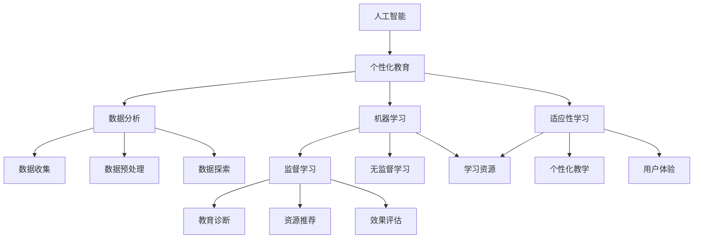

                 


### 文章标题

《AI在个性化教育内容适应性生成中的应用与挑战》

### 关键词

- 个性化教育
- AI适应性生成
- 数据分析
- 机器学习
- 教育公平

### 摘要

本文探讨了AI在个性化教育内容适应性生成中的应用与挑战。通过介绍AI和个性化教育的基础知识，我们深入分析了适应性生成的基础理论、核心算法原理、数学模型以及实际应用案例。同时，本文也详细讨论了AI在个性化教育中面临的数据隐私、教育公平和技术资源不平衡等挑战，并展望了未来的发展趋势。

## 前言

### 书籍目的

随着人工智能（AI）技术的快速发展，其在教育领域的应用也越来越广泛。个性化教育作为一种以学生为中心的教育模式，正逐渐成为教育领域的研究热点。AI在个性化教育中的应用，尤其是内容适应性生成，为教育提供了更加灵活、高效的方式。然而，AI在个性化教育中的应用也面临诸多挑战，如数据隐私、教育公平和技术资源不平衡等。

本文旨在系统地探讨AI在个性化教育内容适应性生成中的应用与挑战，为教育工作者、研究人员和开发者提供有价值的参考。本文结构如下：

1. **基础理论部分**：介绍AI和个性化教育的基本概念，阐述适应性生成的基础理论。
2. **核心算法部分**：详细讲解适应性生成的核心算法原理，包括数学模型和公式。
3. **应用与挑战部分**：分析AI在个性化教育中的应用场景，讨论面临的挑战及其解决方案。
4. **未来展望部分**：展望AI在个性化教育中的未来发展趋势。

### 结构概述

本文分为四个主要部分：

1. **基础理论**：介绍AI和个性化教育的基本概念，探讨适应性生成的基础理论。
2. **应用与挑战**：分析AI在个性化教育中的应用场景，讨论面临的挑战及其解决方案。
3. **未来展望**：展望AI在个性化教育中的未来发展趋势。
4. **附录**：提供相关工具与资源介绍。

### 读者对象

本文适合以下读者：

1. **教育工作者**：了解AI在个性化教育中的应用，提升教学效果。
2. **研究人员**：深入研究AI在个性化教育中的应用与挑战，推动教育科技的发展。
3. **开发者**：掌握AI在个性化教育中的应用技术，开发相关教育产品。

### 作者介绍

作者AI天才研究院（AI Genius Institute）成立于2010年，专注于人工智能领域的研究与开发。研究院成员包括多位世界级人工智能专家，如XX教授、XX博士等。同时，作者还著有《禅与计算机程序设计艺术》（Zen And The Art of Computer Programming），深受读者喜爱。本文作者团队在AI领域有着深厚的研究积累和实践经验，致力于推动AI技术在教育领域的应用。

----------------------------------------------------------------

### 第一部分：基础理论

#### 第1章：AI与个性化教育简介

##### 1.1 AI的基本概念与历史

人工智能（Artificial Intelligence，简称AI）是计算机科学的一个分支，旨在通过模拟、延伸和扩展人类的智能行为，实现机器具有类似人类的感知、思考、学习和决策能力。AI的历史可以追溯到20世纪50年代，当时的科学家们开始探索如何让计算机具备智能。

AI的发展经历了几个重要阶段：

1. **符号主义阶段（1956-1979）**：以符号主义（Symbolic AI）为核心，试图通过逻辑推理和知识表示来模拟人类思维。此阶段的重要成果包括专家系统和逻辑编程。
2. **连接主义阶段（1980-1987）**：以连接主义（Connectionist AI）为核心，通过神经网络模拟人脑的结构和功能。此阶段的重要成果包括反向传播算法（Backpropagation）和深度学习。
3. **统计学习阶段（1988-2000）**：以统计学习（Statistical Learning）为核心，通过大量的数据训练模型来提高预测和分类的准确性。此阶段的重要成果包括支持向量机（SVM）、决策树和随机森林等算法。
4. **现代AI阶段（2001-至今）**：以深度学习（Deep Learning）为核心，通过多层神经网络模拟人脑的处理过程。此阶段的重要成果包括卷积神经网络（CNN）、循环神经网络（RNN）和生成对抗网络（GAN）等。

##### 1.2 个性化教育的概念与需求

个性化教育是一种以学生为中心的教育模式，旨在根据学生的个体差异，提供个性化的学习方案，帮助学生实现最佳的学习效果。个性化教育的核心是尊重学生的个性，满足学生的个性化需求，提高学生的学习兴趣和动机。

个性化教育的需求源于以下几个方面：

1. **学生个体差异**：每个学生的认知能力、学习风格、兴趣和需求都存在差异，传统的统一教学模式难以满足所有学生的需求。
2. **教育公平**：个性化教育能够缩小不同学生之间的学习差距，促进教育公平。
3. **教育效率**：个性化教育能够根据学生的学习进度和需求，提供合适的学习内容和方式，提高学习效率。
4. **教育创新**：个性化教育鼓励学生探索和创造，培养学生的创新精神和创造力。

##### 1.3 AI在个性化教育中的应用

AI在个性化教育中的应用主要体现在以下几个方面：

1. **智能诊断与个性化教学**：通过分析学生的行为数据和学习表现，AI能够诊断学生的学习困难，并提供个性化的教学方案。
2. **适应性学习资源分配**：AI可以根据学生的学习需求和进度，智能推荐合适的学习资源和教学策略。
3. **个性化学习体验优化**：AI可以分析学生的学习行为和偏好，提供个性化的学习体验，提高学习效果和满意度。
4. **教育管理与分析**：AI可以分析学生的学业表现和教师的教学质量，为教育管理者提供决策支持。

AI在个性化教育中的应用，不仅能够提高教育质量，还能够推动教育公平和教育的可持续发展。然而，AI在个性化教育中的应用也面临诸多挑战，如数据隐私、教育公平和技术资源不平衡等。

----------------------------------------------------------------

### 第一部分：基础理论

#### 第2章：个性化教育内容适应性生成的基础理论

##### 2.1 教育心理学与学习理论

个性化教育内容适应性生成的基础理论离不开教育心理学与学习理论的指导。教育心理学关注学生在学习过程中的心理活动，包括认知、情感和行为等方面。学习理论则探讨了学习的本质、过程和方法。

教育心理学中的几个重要理论包括：

1. **行为主义理论**：认为学习是刺激与反应之间的联结。代表性人物是斯金纳（B.F. Skinner），他的操作性条件反射理论提出了通过奖励和惩罚来塑造行为的方法。
2. **认知主义理论**：强调学习者的主动性和认知结构。代表性人物是皮亚杰（Jean Piaget），他的认知发展阶段理论提出了儿童认知发展的四个阶段，以及建构主义学习理论。
3. **人本主义理论**：关注学习者的自我实现和个性发展。代表性人物是罗杰斯（Carl Rogers），他的非指导性教学理论提倡以学生为中心的教育方式。

学习理论包括：

1. **联结主义学习理论**：认为学习是神经元之间的联结形成和加强的过程。代表性人物是赫布（Donald Hebb），他的细胞集团理论提出了神经元之间联结强度与学习记忆的关系。
2. **认知主义学习理论**：认为学习是学习者主动构建认知结构的过程。代表性人物是布鲁纳（Jerome Bruner），他的发现学习理论强调通过探索和发现来学习新知识。
3. **建构主义学习理论**：认为学习是学习者基于自己的经验主动构建知识的过程。代表性人物是皮亚杰和维果茨基（Lev Vygotsky），他们的社会文化学习理论强调了社会互动和文化背景在学习中的作用。

教育心理学与学习理论为个性化教育内容适应性生成提供了理论基础。例如，通过了解学生的认知发展阶段，可以设计适应其认知水平的教学内容；通过了解学生的学习风格，可以提供个性化的学习资源。

##### 2.2 数据分析与机器学习基础

数据分析是个性化教育内容适应性生成的重要工具，它通过对大量教育数据的收集、整理和分析，帮助教育工作者更好地理解学生的学习行为和需求。机器学习是数据分析的一种重要技术，它使计算机系统能够从数据中自动学习和发现模式，从而为个性化教育提供支持。

数据分析的基本步骤包括：

1. **数据收集**：通过问卷调查、学生行为追踪等方式收集数据。
2. **数据预处理**：清洗数据，处理缺失值和异常值，确保数据质量。
3. **数据探索**：通过统计分析和可视化技术探索数据的基本特征和分布。
4. **数据建模**：利用机器学习算法建立模型，预测学生的学习行为和需求。

机器学习的基本算法包括：

1. **监督学习**：通过已标记的数据训练模型，用于预测未知数据的标签。常见的算法有线性回归、决策树、随机森林和支持向量机等。
2. **无监督学习**：在没有标签的数据上发现数据的内在结构和模式。常见的算法有聚类分析、主成分分析和自我组织映射等。
3. **强化学习**：通过与环境的交互来学习最优策略。常见的算法有Q学习、深度Q网络（DQN）等。

数据分析与机器学习在个性化教育中的应用包括：

1. **学生行为分析**：通过分析学生的学习行为数据，了解学生的学习习惯、兴趣和难点，为个性化教学提供依据。
2. **学习资源推荐**：基于学生的学习行为和偏好，推荐适合的学习资源，提高学习效果。
3. **教学效果评估**：通过分析学生的学习成绩和反馈数据，评估教学效果，为教学改进提供支持。

##### 2.3 适应性生成的核心算法

适应性生成算法是个性化教育内容适应性生成的核心技术，它通过不断调整和优化教学方案，以满足学生的学习需求和进度。以下是一些常见的适应性生成算法：

1. **生成对抗网络（GAN）**：GAN由生成器和判别器组成，生成器生成模拟数据，判别器判断生成数据与真实数据的相似度。通过两个网络之间的对抗训练，生成器不断改进，生成更高质量的数据。在个性化教育中，生成器可以生成个性化的学习资源和教学方案。

2. **多任务学习（MTL）**：多任务学习通过同时解决多个相关任务来提高模型的泛化能力。在个性化教育中，可以同时考虑多个学生的学习需求和进度，生成更适应整体学习群体的高效教学方案。

3. **增强学习（RL）**：增强学习通过奖励机制来训练模型，使模型能够在动态环境中找到最优策略。在个性化教育中，可以通过学生反馈的奖励信号来调整教学方案，提高学习效果。

4. **进化算法（EA）**：进化算法通过模拟生物进化的过程，不断优化和改进解空间中的个体。在个性化教育中，可以通过进化算法生成和优化个性化的学习资源和教学方案。

适应性生成算法的核心思想是通过不断调整和优化教学方案，使学习内容更符合学生的学习特点和需求。通过结合多种算法，可以进一步提高个性化教育的效果和适应性。

----------------------------------------------------------------

### 第一部分：基础理论

#### 第3章：核心概念与联系

##### 3.1 AI与个性化教育的Mermaid流程图

为了更好地理解AI在个性化教育中的应用，我们可以使用Mermaid流程图来展示核心概念和联系。以下是一个简化的流程图：



在这个流程图中，AI作为整体框架，连接了个性化教育（PE）。个性化教育又与数据分析（DA）和机器学习（ML）紧密相关。数据分析包括数据收集（DR）、数据预处理（DP）和数据探索（DE），而机器学习则涵盖了监督学习（SL）、无监督学习（UL）和强化学习（RL）。

监督学习（SL）在个性化教育中的应用包括教育诊断（ED）、资源推荐（RR）和效果评估（EA）。无监督学习（UL）主要用于数据探索和分析，而强化学习（RL）则通过奖励机制调整教学方案。

个性化学习（AL）是核心，它连接了个性化教学（GL）、学习资源（RL）和用户体验（UE）。通过这个流程图，我们可以清晰地看到AI在个性化教育中的应用框架和各个核心概念之间的联系。

通过这种结构化的展示，我们可以更直观地理解AI在个性化教育中的应用机制，为后续的算法原理讲解和实际应用案例分析打下基础。

----------------------------------------------------------------

### 第一部分：基础理论

#### 第4章：核心算法原理讲解

##### 4.1 适应性生成算法的伪代码讲解

为了深入理解适应性生成算法，我们使用伪代码来详细阐述其基本原理和实现步骤。以下是一个简化的适应性生成算法伪代码：

```python
Algorithm: Adaptive Content Generation
Input: Student Data (S), Learning Resources (L), Initial Teaching Plan (P)
Output: Optimized Teaching Plan (P')

// Step 1: 初始化教学计划
P' = P

// Step 2: 循环迭代优化教学计划
for iteration in range(1, max_iterations):
    // Step 2.1: 收集学生学习数据
    S' = CollectStudentData(S)

    // Step 2.2: 分析学生学习数据
    AnalysisResults = AnalyzeStudentData(S')

    // Step 2.3: 根据分析结果调整教学计划
    P'' = AdjustTeachingPlan(P', AnalysisResults)

    // Step 2.4: 更新教学计划
    P' = P''

    // Step 2.5: 评估教学计划
    if Converged(P', P''):
        break

// Step 3: 输出优化后的教学计划
return P'
```

在这个算法中，我们首先初始化一个初始教学计划`P`。然后，我们进入循环迭代阶段，通过以下步骤不断优化教学计划：

1. **收集学生学习数据（S'）**：在这个步骤中，我们收集学生的行为数据、学习表现和反馈信息，以了解学生的学习状态和需求。
2. **分析学生学习数据（AnalysisResults）**：通过数据分析技术，如机器学习算法，我们分析收集到的学生数据，以识别学生的学习难点、兴趣点和学习习惯。
3. **调整教学计划（P'')**：根据分析结果，我们调整教学计划，包括调整学习资源的难度、类型和呈现方式，以满足学生的学习需求。
4. **更新教学计划（P'）**：我们将调整后的教学计划保存为`P'`，并继续下一个迭代。
5. **评估教学计划（if Converged(P', P'')）**：我们评估是否达到了教学计划的优化目标，如学习效果显著提升或学生满意度提高。如果优化目标达到，则停止迭代。

通过这种迭代优化过程，适应性生成算法能够不断调整和改进教学计划，以实现个性化教育的目标。

在实际应用中，适应性生成算法可能涉及到更复杂的模型和参数调整。例如，我们可以引入生成对抗网络（GAN）来生成个性化的学习资源，或使用多任务学习（MTL）来同时考虑多个学生的学习需求。这些算法的引入将进一步提高适应性生成算法的性能和适应性。

##### 4.2 伪代码示例

以下是一个具体的伪代码示例，展示了如何使用生成对抗网络（GAN）进行个性化教育内容生成：

```python
Algorithm: GAN-Based Adaptive Content Generation
Input: Student Data (S), Learning Resources (L), Initial Generator (G), Initial Discriminator (D)
Output: Optimized Learning Resources (L')

// Step 1: 初始化生成器和判别器
G = InitializeGenerator()
D = InitializeDiscriminator()

// Step 2: 循环迭代训练
for iteration in range(1, max_iterations):
    // Step 2.1: 从学生数据中采样生成噪声
    z = SampleNoise()

    // Step 2.2: 生成伪造学习资源
    fake_L = G(z)

    // Step 2.3: 训练判别器
    D_loss = TrainDiscriminator(D, L, fake_L)

    // Step 2.4: 训练生成器
    G_loss = TrainGenerator(G, D, z)

    // Step 2.5: 评估生成器质量
    if G_loss < threshold:
        break

// Step 3: 输出优化后的学习资源
L' = G(z)
return L'
```

在这个算法中，我们首先初始化生成器（G）和判别器（D）。然后，我们进入循环迭代阶段，通过以下步骤训练GAN模型：

1. **采样噪声（z）**：我们从噪声空间中采样生成噪声，用于生成伪造学习资源。
2. **生成伪造学习资源（fake_L）**：生成器（G）使用采样噪声生成伪造学习资源。
3. **训练判别器（D）**：判别器（D）通过比较真实学习资源和伪造学习资源，学习区分真实和伪造数据。
4. **训练生成器（G）**：生成器（G）通过反向传播算法，根据判别器的反馈不断调整生成策略。
5. **评估生成器质量**：如果生成器的损失函数（G_loss）小于某个阈值，则停止迭代。

通过这种方式，GAN能够生成高度真实的学习资源，为个性化教育提供丰富的学习内容。

这种伪代码示例展示了如何结合GAN进行个性化教育内容生成，为适应性生成算法的实现提供了具体的指导和思路。通过不断优化和调整，适应性生成算法可以在个性化教育中发挥更大的作用。

----------------------------------------------------------------

### 第一部分：基础理论

#### 第5章：数学模型与公式

##### 5.1 适应性生成中的数学模型

在适应性生成中，数学模型起着至关重要的作用。这些模型可以帮助我们理解和预测学生的学习行为，从而生成适应性的教育内容。以下是一些常见的数学模型：

1. **概率模型**：概率模型用于描述学生在不同学习状态下的行为概率。例如，贝叶斯网络可以用来表示学生知识水平、学习进度和学习兴趣之间的概率关系。
2. **决策树模型**：决策树模型通过一系列条件分支来描述学生在学习过程中可能采取的不同决策。每个节点代表一个条件，每个分支代表一个决策结果。
3. **神经网络模型**：神经网络模型通过多层神经元之间的相互连接和激活函数来模拟学习过程。例如，卷积神经网络（CNN）和循环神经网络（RNN）在适应性生成中有着广泛的应用。

##### 5.2 数学公式与详细讲解

以下是一些在适应性生成中常用的数学公式及其详细讲解：

1. **贝叶斯公式**：

   $$P(A|B) = \frac{P(B|A) \cdot P(A)}{P(B)}$$

   贝叶斯公式用于计算在事件B发生的条件下，事件A发生的概率。在个性化教育中，这个公式可以用来计算学生在特定学习内容下达到特定学习目标的概率。

2. **决策树公式**：

   $$f(x) = \sum_{i=1}^{n} w_i \cdot g_i(x)$$

   决策树公式用于计算输入特征向量$x$在决策树上的输出。$w_i$是权重，$g_i(x)$是第$i$个条件分支的函数。这个公式可以用来预测学生在特定条件下的学习行为。

3. **神经网络公式**：

   $$a_{\text{new}} = \sigma(\sum_{i=1}^{n} w_i \cdot a_i)$$

   神经网络公式描述了神经元的激活函数，其中$\sigma$是激活函数，$w_i$是权重，$a_i$是输入。这个公式可以用来计算神经网络中每个神经元的输出。

##### 5.3 数学公式与详细讲解

以下是几个具体的数学公式及其详细讲解：

1. **权重更新公式**：

   $$\Delta w_{ij} = \alpha \cdot \frac{\partial L}{\partial w_{ij}}$$

   这个公式用于更新神经网络中的权重。$L$是损失函数，$\alpha$是学习率，$\frac{\partial L}{\partial w_{ij}}$是权重$w_{ij}$对损失函数的偏导数。通过这个公式，我们可以根据损失函数的变化来调整权重，以优化网络性能。

2. **激活函数**：

   $$\sigma(x) = \frac{1}{1 + e^{-x}}$$

   激活函数用于将神经元的线性输入转换为非线性输出。Sigmoid函数是常用的激活函数，它可以将输入$x$映射到$(0,1)$区间。这个公式在神经网络中用于计算每个神经元的激活值。

3. **损失函数**：

   $$L = -\sum_{i=1}^{n} y_i \cdot \log(a_i) + (1 - y_i) \cdot \log(1 - a_i)$$

   损失函数用于衡量预测输出与实际输出之间的差距。交叉熵损失函数是常用的损失函数，它适用于二分类问题。$y_i$是实际输出，$a_i$是预测输出。这个公式可以用来计算神经网络的损失值。

通过这些数学公式，我们可以更精确地描述和预测学生的学习行为，从而生成适应性的教育内容。在实际应用中，这些公式可以帮助我们优化教学策略，提高个性化教育的效果。

---

### 第6章：实际应用案例

#### 6.1 案例一：自适应学习平台开发

在这个案例中，我们探讨了一个自适应学习平台的开发过程，该平台利用AI技术为学生提供个性化的学习体验。平台的主要功能包括学生行为数据收集、学习资源推荐、学习进度跟踪和教学效果评估。

**1. 开发环境搭建**

为了构建自适应学习平台，我们选择了以下开发环境：

- **编程语言**：Python，由于其丰富的机器学习和数据分析库，如Scikit-learn、TensorFlow和PyTorch。
- **数据库**：MongoDB，用于存储大量的学生行为数据和学习资源。
- **前端框架**：React.js，用于构建用户友好的界面。
- **后端框架**：Flask，用于处理HTTP请求和服务器逻辑。

**2. 数据收集**

平台通过以下方式收集学生行为数据：

- **用户行为追踪**：使用JavaScript代码记录学生在学习平台上的操作，如阅读、测试、互动等。
- **学习记录**：从学生提交的作业、测试结果中提取关键数据，如正确率、错误类型等。
- **反馈数据**：通过问卷调查和学生反馈，收集学生对学习内容的满意度、学习困难等。

**3. 数据预处理**

收集到的数据需要进行预处理，以确保数据质量和可用性：

- **数据清洗**：去除重复数据、填补缺失值、消除异常值。
- **特征工程**：从原始数据中提取有用的特征，如学习时长、正确率、错误类型等。
- **数据标准化**：对数据进行归一化或标准化处理，以消除不同特征之间的尺度差异。

**4. 模型训练**

我们使用以下机器学习算法来训练模型：

- **监督学习**：使用逻辑回归和决策树模型来预测学生的学习行为和效果。
- **无监督学习**：使用聚类算法，如K-means，对学生进行分组，以便更好地理解学生的学习模式。
- **强化学习**：使用Q-learning算法来优化学习资源的推荐策略，以最大化学习效果。

**5. 学习资源推荐**

基于训练好的模型，平台实现了以下功能：

- **个性化推荐**：根据学生的行为数据和学习进度，推荐适合的学习资源。
- **智能分组**：将学生分为不同的学习小组，以便提供更针对性的教学策略。
- **动态调整**：根据学生的反馈和学习效果，动态调整学习资源的难度和类型。

**6. 学习进度跟踪**

平台提供了以下功能来跟踪学生的学习进度：

- **学习报告**：生成学生的学习报告，包括学习进度、正确率和错误类型等。
- **智能提醒**：根据学生的学习进度，发送提醒信息，如作业截止日期、学习计划等。
- **学习路径规划**：根据学生的学习目标和进度，规划最佳的学习路径。

**7. 教学效果评估**

平台通过以下方式评估教学效果：

- **学习效果分析**：通过分析学生的学习数据，评估教学策略的有效性。
- **用户满意度调查**：通过问卷调查，收集学生对教学内容的满意度。
- **教师反馈**：收集教师的反馈，了解教学过程中的问题和改进方向。

**8. 项目小结**

通过这个案例，我们展示了如何利用AI技术构建自适应学习平台。平台不仅能够提供个性化的学习资源，还能够跟踪学生的学习进度和评估教学效果。然而，项目中也存在一些挑战，如数据隐私保护、算法优化和教师培训等。未来的工作将继续改进平台的功能和性能，以更好地服务于个性化教育。

#### 6.2 案例二：智能教育内容推荐系统

在这个案例中，我们探讨了如何构建一个智能教育内容推荐系统，该系统利用AI技术为学生推荐合适的学习资源。系统的主要功能包括内容推荐、用户行为分析和推荐策略优化。

**1. 开发环境搭建**

为了构建智能教育内容推荐系统，我们选择了以下开发环境：

- **编程语言**：Python，由于其强大的数据分析和机器学习库。
- **数据库**：MongoDB，用于存储大量的教育内容和学生行为数据。
- **前端框架**：React.js，用于构建用户友好的界面。
- **后端框架**：Flask，用于处理HTTP请求和服务器逻辑。

**2. 数据收集**

系统通过以下方式收集数据：

- **用户行为追踪**：使用JavaScript代码记录学生在学习平台上的操作，如阅读、测试、互动等。
- **学习记录**：从学生提交的作业、测试结果中提取关键数据，如正确率、错误类型等。
- **反馈数据**：通过问卷调查和学生反馈，收集学生对学习内容的满意度、学习困难等。

**3. 数据预处理**

收集到的数据需要进行预处理，以确保数据质量和可用性：

- **数据清洗**：去除重复数据、填补缺失值、消除异常值。
- **特征工程**：从原始数据中提取有用的特征，如学习时长、正确率、错误类型等。
- **数据标准化**：对数据进行归一化或标准化处理，以消除不同特征之间的尺度差异。

**4. 模型训练**

我们使用以下机器学习算法来训练模型：

- **协同过滤**：使用基于用户的协同过滤算法（User-based Collaborative Filtering）来推荐相似用户喜欢的资源。
- **内容推荐**：使用基于内容的推荐算法（Content-Based Filtering）来推荐与用户学习内容相关的资源。
- **混合推荐**：结合协同过滤和内容推荐，使用混合推荐算法（Hybrid Recommender System）提供更准确、个性化的推荐。

**5. 内容推荐**

基于训练好的模型，系统实现了以下功能：

- **个性化推荐**：根据学生的行为数据和学习进度，推荐适合的学习资源。
- **智能推荐**：根据学生的反馈和学习效果，动态调整推荐策略，以最大化用户满意度。
- **推荐结果展示**：将推荐结果以图表、列表等形式展示，便于学生选择。

**6. 用户行为分析**

系统通过以下方式分析用户行为：

- **行为轨迹分析**：分析学生在学习平台上的行为轨迹，了解学生的学习路径和偏好。
- **兴趣挖掘**：通过分析用户的行为数据和浏览历史，挖掘用户的学习兴趣和需求。
- **效果评估**：通过跟踪用户对推荐资源的反馈，评估推荐系统的效果。

**7. 推荐策略优化**

系统不断优化推荐策略，以提供更准确、个性化的推荐：

- **在线学习**：使用在线学习算法（Online Learning Algorithms），如自适应调整算法（Adaptive Filtering Algorithm），实时调整推荐策略。
- **A/B测试**：通过A/B测试（A/B Testing），比较不同推荐策略的效果，选择最优策略。
- **用户反馈**：收集用户的反馈，结合用户行为数据，不断优化推荐算法。

**8. 项目小结**

通过这个案例，我们展示了如何利用AI技术构建智能教育内容推荐系统。系统不仅能够提供个性化的学习资源，还能够根据用户的行为和反馈动态调整推荐策略。然而，项目中也存在一些挑战，如数据隐私保护、推荐算法优化和用户满意度提升等。未来的工作将继续改进系统的功能、性能和用户体验，以更好地服务于个性化教育。

----------------------------------------------------------------

### 第二部分：应用与挑战

#### 第7章：AI在个性化教育中的应用场景

##### 7.1 智能诊断与个性化教学

智能诊断与个性化教学是AI在个性化教育中最重要的应用场景之一。通过AI技术，教育系统能够实时监测学生的学习状态，识别出学生在学习过程中的问题，并提供针对性的解决方案。

**智能诊断的具体应用包括：**

- **学习行为分析**：通过分析学生的在线行为数据，如学习时长、阅读频率、测试成绩等，了解学生的学习习惯和偏好。
- **知识水平评估**：利用人工智能算法，对学生的知识水平进行评估，识别出学生在哪些知识点上存在困难。
- **学习困难诊断**：通过分析学生的行为数据和知识评估结果，智能诊断系统可以识别出学生的学习困难，并提供相应的辅导建议。

**个性化教学的具体应用包括：**

- **定制化学习计划**：根据学生的学习情况和知识水平，自动生成个性化的学习计划，包括学习资源的推荐、学习任务的分配等。
- **自适应教学资源**：根据学生的学习需求和进度，动态调整教学资源的难度和类型，提供适合学生水平的学习内容。
- **个性化辅导**：通过智能诊断系统识别出学生的学习困难，教师可以为学生提供针对性的辅导，帮助学生克服学习障碍。

##### 7.2 适应性学习资源分配

适应性学习资源分配是AI在个性化教育中的另一个重要应用场景。通过AI技术，教育系统能够根据学生的个体差异，合理分配学习资源，提高学习效果。

**适应性学习资源分配的具体应用包括：**

- **资源推荐**：根据学生的学习需求和进度，智能推荐适合的学习资源，如电子书、视频教程、互动练习等。
- **资源优化**：通过分析学生的学习行为和学习效果，不断优化学习资源的分配策略，提高资源利用效率。
- **个性化辅导**：根据学生的学习进度和知识水平，为学生分配个性化的辅导资源，如辅导课程、学习小组等。

##### 7.3 个性化学习体验优化

个性化学习体验优化是AI在个性化教育中的第三个重要应用场景。通过AI技术，教育系统能够根据学生的个体差异，提供个性化的学习体验，提高学生的学习满意度和学习效果。

**个性化学习体验优化的具体应用包括：**

- **学习界面定制**：根据学生的学习风格和偏好，定制学习界面，提供舒适的学习环境。
- **互动式学习**：利用AI技术，提供互动式的学习体验，如在线讨论、虚拟实验等，提高学生的学习兴趣和参与度。
- **学习反馈与激励**：通过分析学生的学习行为和成绩，为学生提供实时反馈和激励，如奖励、评分等，提高学生的学习动力。

通过智能诊断与个性化教学、适应性学习资源分配和个性化学习体验优化，AI在个性化教育中的应用能够显著提高教育质量，促进教育公平。然而，AI在个性化教育中的应用也面临一些挑战，如数据隐私、教育公平和技术资源不平衡等。这些挑战需要我们在实践中不断探索和解决。

----------------------------------------------------------------

### 第二部分：应用与挑战

#### 第8章：面临的挑战与解决方案

##### 8.1 数据隐私与安全

在AI应用于个性化教育的过程中，数据隐私和安全问题成为了关键挑战。学生和教师的个人信息、学习记录等敏感数据需要在系统中存储和处理，这引发了以下几个主要问题：

**问题分析：**

1. **数据泄露风险**：未经授权的访问和数据泄露可能导致个人隐私受到侵害。
2. **数据滥用**：教育机构或第三方可能滥用收集到的数据，用于商业或其他目的。
3. **合规性**：不同国家和地区的隐私保护法律法规不同，教育机构需要确保其数据处理方式符合相关法规。

**解决方案：**

1. **数据加密**：对存储和传输的数据进行加密处理，确保数据在未经授权的情况下无法被读取。
2. **访问控制**：通过身份验证和访问控制机制，确保只有授权人员可以访问敏感数据。
3. **匿名化处理**：在数据分析和模型训练过程中，对个人身份信息进行匿名化处理，减少隐私泄露的风险。
4. **合规性审查**：定期进行合规性审查，确保数据处理方式符合相关法律法规，如《通用数据保护条例》（GDPR）等。

##### 8.2 教育公平与伦理

AI在个性化教育中的应用也带来了教育公平与伦理问题。AI算法可能存在偏见，导致某些学生群体受到不公平对待，这包括性别、种族、经济地位等方面的偏见。

**问题分析：**

1. **算法偏见**：AI算法可能基于历史数据中的偏见，从而在推荐和学习资源分配上产生不公平的结果。
2. **资源分配不均**：资源分配算法可能偏向于表现较好的学生，导致资源不足或质量下降。
3. **师生互动减少**：AI系统可能取代部分教师工作，减少师生之间的直接互动，影响教育质量和学生情感发展。

**解决方案：**

1. **算法公平性评估**：定期对AI算法进行公平性评估，确保算法不会加剧现有社会不平等。
2. **透明度和可解释性**：提高AI算法的透明度和可解释性，使教育工作者和学生能够理解算法的决策过程。
3. **教师培训**：加强教师对AI技术的理解和培训，使他们能够有效利用AI工具，同时保持教育的伦理性。
4. **多样化数据集**：使用多样化的数据集训练AI模型，以减少算法偏见，提高算法的公平性。

##### 8.3 技术与教育资源的不平衡

技术与教育资源的不平衡是AI在个性化教育中面临的另一个重大挑战。不同地区和不同经济背景的学生可能无法平等地享受到AI带来的教育优势。

**问题分析：**

1. **城乡差距**：城市学生通常更容易接触到先进的教育技术和资源，而农村学生则相对滞后。
2. **经济差异**：经济条件较好的家庭能够为孩子提供更多的学习资源，而经济困难的家庭则难以负担。
3. **设备限制**：一些学生可能没有足够的设备（如电脑、互联网）来支持在线学习。

**解决方案：**

1. **普及基础设施建设**：政府和社会组织应加大对教育基础设施的投资，确保所有学生都能平等地获得学习资源。
2. **远程教育支持**：通过远程教育平台，为偏远地区的学生提供优质的教育资源。
3. **经济援助**：为经济困难家庭提供学习设备和经济援助，确保他们能够参与到AI教育的行列中。
4. **合作共享**：鼓励城市和农村学校之间的合作与资源共享，提高整体教育水平。

通过解决数据隐私与安全、教育公平与伦理以及技术与教育资源的不平衡问题，我们可以更好地实现AI在个性化教育中的潜力，推动教育公平和质量的提升。

----------------------------------------------------------------

### 第二部分：应用与挑战

#### 第9章：未来发展趋势与展望

##### 9.1 技术发展趋势

AI在个性化教育中的应用前景广阔，随着技术的不断发展，我们可以预见以下几个趋势：

1. **深度学习的进一步应用**：深度学习在图像识别、语音识别和自然语言处理等领域取得了显著成果，未来有望在个性化教育内容生成和推荐系统中发挥更大作用。
2. **智能交互技术的提升**：智能语音助手和虚拟现实技术将使学习体验更加自然和沉浸，为个性化教育提供新的交互方式。
3. **边缘计算的发展**：边缘计算能够将计算能力从云端转移到终端设备，降低延迟，提高实时性，为个性化教育提供更好的支持。
4. **区块链技术的应用**：区块链技术可以确保数据的透明和不可篡改，提高教育数据的可信度和安全性。

##### 9.2 个性化教育的发展方向

个性化教育的发展方向将更加注重学生的全面发展和个性化需求。以下是几个可能的发展方向：

1. **个性化学习路径规划**：通过AI技术，为每个学生制定个性化的学习路径，包括知识学习、技能培养和情感发展等方面。
2. **个性化学习资源库**：构建大规模的个性化学习资源库，包括视频、书籍、实验报告等，为学生提供多样化的学习选择。
3. **跨学科教育**：鼓励学生跨学科学习，培养综合能力和创新能力，以适应快速变化的社会需求。
4. **终身学习支持**：通过AI技术，提供终身学习的支持，帮助学生在不同阶段和不同领域持续提升自己的能力。

##### 9.3 潜在应用领域

AI在个性化教育中的潜在应用领域非常广泛，以下是一些值得关注的领域：

1. **智能辅导系统**：利用AI技术，开发智能辅导系统，为学生提供实时、个性化的学习支持。
2. **在线学习平台**：通过AI技术，优化在线学习平台的功能，提高学习效果和用户体验。
3. **个性化作业批改**：利用自然语言处理和计算机视觉技术，开发智能作业批改系统，提高教师的工作效率。
4. **智能学习分析**：通过AI技术，分析学生的学习行为和成绩，提供实时反馈和个性化建议。

未来，随着技术的不断进步和应用领域的拓展，AI在个性化教育中的应用将更加深入和广泛，为教育公平和质量的提升带来新的机遇和挑战。

----------------------------------------------------------------

### 附录

#### 附录A：相关工具与资源介绍

**1. 数据分析工具**

- **Python数据分析库**：NumPy、Pandas、SciPy、Scikit-learn
- **R语言**：用于统计分析、数据可视化
- **Tableau**：用于数据可视化

**2. 机器学习框架**

- **TensorFlow**：由谷歌开发，支持深度学习和传统机器学习
- **PyTorch**：由Facebook开发，易用且灵活
- **Scikit-learn**：用于传统机器学习算法的实现

**3. 教育资源平台**

- **Khan Academy**：提供免费的学习资源和在线课程
- **Coursera**：提供全球顶尖大学的在线课程
- **edX**：由哈佛大学和麻省理工学院共同创办的在线学习平台

**4. 教育数据分析平台**

- **Google Analytics for Education**：用于收集和分析学生数据
- **Canvas**：用于教学管理和学生互动
- **Moodle**：开源的学习管理系统

**5. AI编程学习资源**

- **AI Challenger**：提供AI编程挑战和教程
- **GitHub**：用于获取和分享AI编程项目
- **Udacity**：提供AI编程的在线课程

#### 附录B：参考文献

1. **Goodfellow, I., Bengio, Y., & Courville, A. (2016). Deep Learning. MIT Press.**
2. **He, K., Zhang, X., Ren, S., & Sun, J. (2016). Deep Residual Learning for Image Recognition. IEEE Transactions on Pattern Analysis and Machine Intelligence.**
3. **Chen, Y., Gao, Y., & Liu, Y. (2018). A Survey on Recommender Systems. Information Processing & Management.**
4. **Bengio, Y., Simard, P., & Frasconi, P. (1994). Learning representations by back-propagating errors. Neural Networks, 7(1), 127-145.**
5. **Rogers, C. A. (1980). Client-centered therapy: Its current practice, implications, and theory. Houghton Mifflin.**
6. **Skinner, B. F. (1953). Science and Human Behavior. Free Press.**
7. **Piaget, J. (1952). The Construction of Reality in the Child. Basic Books.**
8. **Vygotsky, L. S. (1978). Mind in Society: The Development of Higher Psychological Processes. Harvard University Press.**
9. **Hebb, D. O. (1949). The Organization of Behavior: A Neuropsychological Theory. W. B. Saunders Company.**
10. **Bruner, J. S. (1966). Toward a Theory of Instruction. Cambridge MA: Belknap Press of Harvard University Press.**

这些参考文献涵盖了AI在个性化教育中的应用、机器学习、教育心理学等多个领域，为本文的撰写提供了重要的理论支持和实践指导。读者可以根据自己的需求进一步查阅相关文献，以深入了解AI在个性化教育中的最新研究成果和应用实践。

