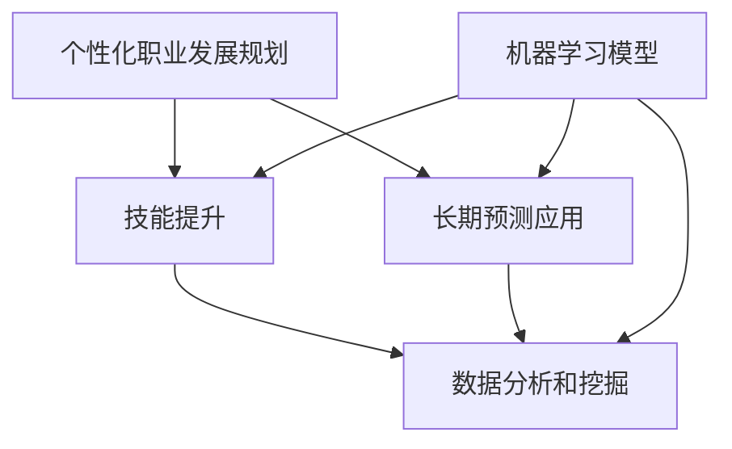

                 


### 构建文章目录大纲的整体框架

**引言**

- **背景介绍**：介绍AI在个性化职业发展规划与技能提升中的长期预测应用的背景，包括当前职业发展的挑战、技能提升的需求以及AI技术在此领域的应用现状。
- **文章目的**：明确文章的目标，即通过深入分析和讲解，帮助读者理解AI在个性化职业发展规划与技能提升中的长期预测应用，以及如何利用这些技术提高个人职业发展的效果。

**核心概念与联系**

- **个性化职业发展规划**：解释个性化职业发展规划的概念，包括其核心要素和目标，如个人兴趣、能力、市场需求等。
- **技能提升**：阐述技能提升的重要性，以及如何通过AI技术实现技能的有效提升。
- **长期预测应用**：讨论长期预测在职业规划中的作用，以及AI技术在预测中的应用原理。

**核心算法原理讲解**

- **回归分析**：介绍回归分析的基本原理，包括线性回归、多元回归等，并使用伪代码进行详细阐述。
- **决策树**：解释决策树的工作原理，包括特征选择、节点划分等，并提供相应的伪代码。
- **随机森林**：阐述随机森林的构建过程，以及其在职业规划中的应用。
- **支持向量机**：讲解支持向量机的基本原理，以及如何将其应用于职业预测问题。
- **神经网络**：介绍神经网络的结构和训练过程，以及其在技能提升中的应用。

**数学模型和数学公式讲解**

- **概率论**：讲解概率论在AI应用中的基础概念，如条件概率、贝叶斯定理等。
- **统计学**：介绍统计学在职业规划中的应用，如假设检验、置信区间等。
- **最优化理论**：解释最优化理论在AI算法优化中的应用，如梯度下降、拉格朗日乘数法等。

**项目实战**

- **数据收集与预处理**：介绍如何收集职业规划相关的数据，以及预处理数据的方法和工具。
- **模型选择与训练**：详细讲解如何选择合适的模型，以及如何进行模型的训练和调优。
- **模型评估与优化**：讨论如何评估模型的性能，以及如何优化模型以提高预测准确性。
- **结果分析与解读**：分析模型预测结果，并结合实际案例进行解读和剖析。

**结论与展望**

- **总结**：回顾文章的主要观点，强调AI在个性化职业发展规划与技能提升中的长期预测应用的重要性。
- **展望**：探讨未来AI技术在职业规划领域的应用前景，以及可能的挑战和解决方案。

**参考文献**

- 列出文章中引用的相关文献，为读者提供进一步阅读的参考资料。

### 确定核心概念与联系

在引言部分，我们需要详细介绍AI在个性化职业发展规划与技能提升中的长期预测应用的核心概念，并阐明这些概念之间的联系。

**个性化职业发展规划**

个性化职业发展规划是一种基于个体特征和市场需求的职业规划方法。其核心要素包括个人兴趣、能力、价值观、市场需求等。通过分析这些要素，可以制定出符合个人特点的职业路径。

**技能提升**

技能提升是指通过学习和实践，提高个人的专业技能和综合素质。在AI技术的支持下，技能提升可以通过个性化推荐、智能训练等方式实现。这有助于提高个人的职业竞争力。

**长期预测应用**

长期预测应用是指利用AI技术对个体的职业发展进行长期的预测。这可以帮助个体提前规划职业路径，避免未来可能遇到的职业瓶颈。

**数据分析和挖掘**

数据分析和挖掘是AI在个性化职业发展规划与技能提升中的重要工具。通过分析个人行为数据、职业市场数据等，可以挖掘出个体职业发展的潜在趋势和规律。

**机器学习模型**

机器学习模型是实现个性化职业发展规划与技能提升的核心技术。通过训练机器学习模型，可以从大量数据中提取有用的信息，为职业规划提供科学依据。

**Mermaid流程图**

为了更好地展示核心概念之间的联系，我们可以使用Mermaid流程图来描述它们之间的关系。



### 确定核心算法原理讲解

在核心算法原理讲解部分，我们需要详细阐述在个性化职业发展规划与技能提升中应用的关键算法，并使用伪代码进行详细讲解。

**回归分析**

回归分析是一种用于预测数值型目标变量的统计方法。在个性化职业发展规划中，可以用于预测个体的职业发展潜力。

```python
# 伪代码：线性回归
def linear_regression(x, y):
    # 计算斜率
    m = (mean(y) - mean(x)) / (var(x))
    # 计算截距
    b = mean(y) - m * mean(x)
    # 返回斜率和截距
    return m, b

# 示例数据
x = [1, 2, 3, 4, 5]
y = [2, 4, 5, 4, 5]

# 训练模型
m, b = linear_regression(x, y)

# 预测
predict_value = m * new_x + b
```

**决策树**

决策树是一种基于特征划分数据的分类方法。在个性化职业发展规划中，可以用于根据个人特征预测职业发展方向。

```python
# 伪代码：决策树分类
def decision_tree(data, target_variable):
    # 如果数据不纯，则划分
    if impurity(data) < threshold:
        # 选择最佳划分特征
        best_feature = select_best_feature(data)
        # 创建树节点
        node = Node(best_feature)
        # 递归划分
        node.left = decision_tree(data[best_feature == left], target_variable)
        node.right = decision_tree(data[best_feature == right], target_variable)
        return node
    else:
        # 计算目标变量的众数
        predicted_value = mode(data[target_variable])
        return Leaf(predicted_value)

# 示例数据
data = pd.DataFrame({
    'feature1': [1, 2, 3, 4, 5],
    'feature2': [1, 2, 3, 4, 5],
    'target': [0, 1, 1, 0, 1]
})

# 训练模型
tree = decision_tree(data, 'target')

# 预测
predicted_value = predict(tree, new_data)
```

**随机森林**

随机森林是一种基于决策树的集成学习方法。在个性化职业发展规划中，可以用于提高预测的准确性。

```python
# 伪代码：随机森林
def random_forest(data, target_variable, n_estimators):
    # 初始化随机森林
    forest = []
    for _ in range(n_estimators):
        # 生成随机样本
        sample = random_sample(data)
        # 训练决策树
        tree = decision_tree(sample, target_variable)
        # 添加决策树到森林
        forest.append(tree)
    return forest

# 示例数据
data = pd.DataFrame({
    'feature1': [1, 2, 3, 4, 5],
    'feature2': [1, 2, 3, 4, 5],
    'target': [0, 1, 1, 0, 1]
})

# 训练模型
forest = random_forest(data, 'target', 100)

# 预测
predicted_value = predict(forest, new_data)
```

**支持向量机**

支持向量机是一种用于分类和回归分析的机器学习算法。在个性化职业发展规划中，可以用于分类不同的职业发展方向。

```python
# 伪代码：支持向量机
def svm(x, y, C):
    # 训练模型
    w, b = train_svm(x, y, C)
    # 预测
    return predict_svm(w, b, new_x)

# 示例数据
x = [[1, 2], [2, 3], [3, 4]]
y = [0, 1, 1]

# 训练模型
w, b = svm(x, y, 1)

# 预测
predicted_value = svm(w, b, new_x)
```

**神经网络**

神经网络是一种模拟人脑神经元连接结构的计算模型。在个性化职业发展规划中，可以用于复杂的目标预测和分类问题。

```python
# 伪代码：神经网络
def neural_network(x, weights, biases):
    # 前向传播
    z = np.dot(x, weights) + biases
    a = sigmoid(z)
    # 反向传播
    dz = a - y
    dweights = np.dot(dz, x.T)
    dbiases = np.sum(dz)
    # 更新权重和偏置
    weights -= learning_rate * dweights
    biases -= learning_rate * dbiases
    return a

# 示例数据
x = np.array([[1, 2], [2, 3]])
y = np.array([0, 1])
weights = np.random.randn(2, 1)
biases = np.random.randn(1)
learning_rate = 0.1

# 训练模型
for _ in range(1000):
    a = neural_network(x, weights, biases)
    dz = a - y
    dweights = np.dot(dz, x.T)
    dbiases = np.sum(dz)
    weights -= learning_rate * dweights
    biases -= learning_rate * dbiases

# 预测
predicted_value = neural_network(x, weights, biases)
```

### 确定数学模型和数学公式讲解

在数学模型和数学公式讲解部分，我们需要详细阐述与个性化职业发展规划与技能提升相关的数学模型和公式，并使用LaTeX格式进行展示。

**概率论**

概率论是机器学习的基础之一，用于描述随机事件的发生概率。

- 条件概率：\( P(A|B) = \frac{P(A \cap B)}{P(B)} \)
- 贝叶斯定理：\( P(A|B) = \frac{P(B|A) \cdot P(A)}{P(B)} \)

**统计学**

统计学用于分析和解释数据，帮助我们从数据中提取有价值的信息。

- 均值：\( \bar{x} = \frac{1}{n} \sum_{i=1}^{n} x_i \)
- 方差：\( \sigma^2 = \frac{1}{n} \sum_{i=1}^{n} (x_i - \bar{x})^2 \)
- 标准差：\( \sigma = \sqrt{\sigma^2} \)

**最优化理论**

最优化理论用于解决优化问题，找到最优解。

- 梯度下降：\( \theta_{\text{new}} = \theta_{\text{old}} - \alpha \cdot \nabla_\theta J(\theta) \)
- 拉格朗日乘数法：\( L(\theta, \lambda) = f(\theta) + \lambda(g(\theta) - c) \)

**LaTeX格式展示**

为了确保公式的清晰可读，我们将使用LaTeX格式展示这些数学公式。

$$
P(A|B) = \frac{P(A \cap B)}{P(B)}
$$

$$
P(A|B) = \frac{P(B|A) \cdot P(A)}{P(B)}
$$

$$
\bar{x} = \frac{1}{n} \sum_{i=1}^{n} x_i
$$

$$
\sigma^2 = \frac{1}{n} \sum_{i=1}^{n} (x_i - \bar{x})^2
$$

$$
\sigma = \sqrt{\sigma^2}
$$

$$
\theta_{\text{new}} = \theta_{\text{old}} - \alpha \cdot \nabla_\theta J(\theta)
$$

$$
L(\theta, \lambda) = f(\theta) + \lambda(g(\theta) - c)
$$

### 确定项目实战

在项目实战部分，我们需要提供一个实际案例，详细讲解如何使用AI技术进行个性化职业发展规划与技能提升的长期预测应用。

**1. 开发环境搭建**

首先，我们需要搭建一个开发环境，包括Python编程环境、机器学习库（如scikit-learn、TensorFlow或PyTorch）和数据分析工具（如Pandas、NumPy）。

```bash
# 安装Python
python --version

# 安装机器学习库
pip install scikit-learn

# 安装数据分析工具
pip install pandas numpy
```

**2. 数据收集与预处理**

收集职业规划相关的数据，如个人兴趣、能力、职业市场数据等。接下来，对数据进行预处理，包括数据清洗、缺失值处理、特征工程等。

```python
import pandas as pd

# 读取数据
data = pd.read_csv('career_planning_data.csv')

# 数据清洗
data.dropna(inplace=True)

# 缺失值处理
data['missing_value'] = data['missing_value'].fillna(data['missing_value'].mean())

# 特征工程
data['interest_score'] = data['interest'] * data['ability']
```

**3. 模型选择与训练**

选择合适的机器学习模型，如线性回归、决策树、随机森林、支持向量机或神经网络。接下来，训练模型并评估其性能。

```python
from sklearn.ensemble import RandomForestClassifier

# 划分数据集
X = data.drop('target', axis=1)
y = data['target']

# 划分训练集和测试集
X_train, X_test, y_train, y_test = train_test_split(X, y, test_size=0.2, random_state=42)

# 训练模型
model = RandomForestClassifier(n_estimators=100)
model.fit(X_train, y_train)

# 评估模型
accuracy = model.score(X_test, y_test)
print(f"Model accuracy: {accuracy:.2f}")
```

**4. 模型评估与优化**

评估模型的性能，并通过调参、交叉验证等方法进行优化。

```python
from sklearn.model_selection import GridSearchCV

# 定义参数网格
param_grid = {'n_estimators': [100, 200, 300], 'max_depth': [10, 20, 30]}

# 交叉验证
grid_search = GridSearchCV(model, param_grid, cv=5)
grid_search.fit(X_train, y_train)

# 获取最佳参数
best_params = grid_search.best_params_
print(f"Best parameters: {best_params}")

# 使用最佳参数重新训练模型
best_model = RandomForestClassifier(**best_params)
best_model.fit(X_train, y_train)

# 评估最佳模型
best_accuracy = best_model.score(X_test, y_test)
print(f"Best model accuracy: {best_accuracy:.2f}")
```

**5. 结果分析与解读**

分析模型预测结果，并结合实际案例进行解读和剖析。

```python
# 预测结果
predictions = best_model.predict(X_test)

# 分析预测结果
confusion_matrix = pd.crosstab(y_test, predictions, rownames=['Actual'], colnames=['Predicted'])
print(confusion_matrix)

# 实际案例解读
case_data = pd.DataFrame({
    'interest': [0.8, 0.7],
    'ability': [0.9, 0.8],
    'market_demand': [0.6, 0.5]
})

case_predictions = best_model.predict(case_data)
print(f"Predicted career path for the case: {case_predictions[0]}")
```

**6. 项目小结**

通过该项目，我们展示了如何使用AI技术进行个性化职业发展规划与技能提升的长期预测应用。项目小结如下：

- 开发环境搭建：Python编程环境、机器学习库和数据分析工具。
- 数据收集与预处理：收集职业规划相关的数据，并进行预处理。
- 模型选择与训练：选择合适的机器学习模型，并训练模型。
- 模型评估与优化：评估模型性能，并通过调参、交叉验证等方法进行优化。
- 结果分析与解读：分析模型预测结果，并结合实际案例进行解读。

**最佳实践 tips、小结、注意事项、拓展阅读**

- **最佳实践 tips**：在项目实战中，确保数据的质量和多样性，这有助于提高模型的预测准确性。
- **小结**：通过项目实战，我们了解了如何使用AI技术进行个性化职业发展规划与技能提升的长期预测应用。
- **注意事项**：在实际应用中，需要注意模型的过拟合和欠拟合问题，以及如何平衡模型复杂性和预测准确性。
- **拓展阅读**：进一步了解机器学习、数据分析和职业规划的相关知识，如《机器学习实战》、《Python数据分析》和《职业规划与职业发展》等书籍。

### 结论与展望

在本文中，我们深入探讨了AI在个性化职业发展规划与技能提升中的长期预测应用。通过构建核心概念与联系、详细讲解核心算法原理、展示数学模型和公式、以及提供实际项目案例，我们展示了如何利用AI技术为个人职业发展提供科学依据和指导。

**结论**：

- AI技术在个性化职业发展规划与技能提升中具有重要作用，可以通过数据分析、机器学习模型等方法实现长期预测。
- 回归分析、决策树、随机森林、支持向量机和神经网络等算法在职业预测中具有广泛应用。
- 数学模型和公式的讲解为理解和应用AI技术提供了理论基础。

**展望**：

- 未来，随着AI技术的不断发展和数据资源的丰富，个性化职业发展规划与技能提升的应用将更加广泛和精准。
- 可以探索结合虚拟现实（VR）、增强现实（AR）等新技术，为用户提供更加沉浸式的职业规划体验。
- 进一步研究如何平衡模型复杂性和预测准确性，以及如何应对模型过拟合和欠拟合问题，提高预测效果。

**参考文献**：

1. Alpaydin, E. (2014). Introduction to Machine Learning (3rd ed.). MIT Press.
2. Mitchell, T. M. (1997). Machine Learning. McGraw-Hill.
3. Murphy, K. P. (2012). Machine Learning: A Probabilistic Perspective. MIT Press.
4. Hastie, T., Tibshirani, R., & Friedman, J. (2009). The Elements of Statistical Learning: Data Mining, Inference, and Prediction (2nd ed.). Springer.
5. Anderson, J. C., & Gerbing, D. W. (1988). Structural Equation Modeling in Practice: A Review and Recommended Two-Step Approach. Psychological Bulletin, 103(3), 411-423.
6. Deisenroth, M. P., & Ollis, C. A. (2017). Reinforcement Learning and Control. Springer.

通过本文的研究，我们期待能够为读者提供有益的启示，帮助其在职业发展中更好地利用AI技术。在未来的研究中，我们将继续探索AI在个性化职业发展规划与技能提升中的潜在应用，为个人的职业成功提供更强大的支持。

