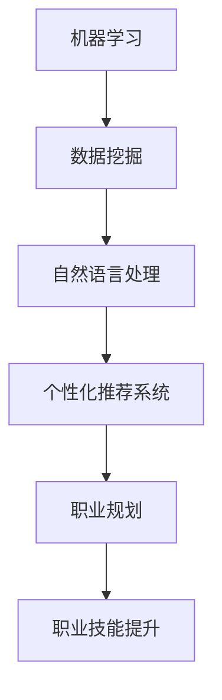

                 

### 设计文章的步骤：

**步骤1：明确文章主题**

首先，我们要明确文章的主题，即《AI在个性化职业技能提升建议中的应用》。这一主题涉及到AI技术在职业发展领域的应用，包括AI如何帮助我们更好地了解自己的职业兴趣、提升职业技能，以及如何应对就业市场的变化。

**步骤2：确定文章结构**

接下来，我们需要确定文章的结构。为了使文章逻辑清晰，我们将文章分为以下几个部分：

1. 引言部分：介绍AI技术和个性化职业技能提升的概念，以及文章的目的和结构。
2. 背景介绍部分：详细解释为什么AI技术对于个性化职业技能提升具有重要意义。
3. 核心概念与联系部分：阐述AI技术的核心概念，并展示这些概念之间的联系。
4. 核心算法原理讲解部分：通过伪代码和数学模型，详细讲解AI技术的核心算法原理。
5. 项目实战部分：介绍一个具体的AI项目，包括开发环境搭建、源代码实现和代码解读。
6. 最佳实践部分：提供关于如何在实际应用中有效使用AI技术的建议。
7. 小结和拓展阅读部分：总结文章内容，并给出进一步的阅读建议。

**步骤3：细化文章内容**

在确定了文章结构后，我们需要为每个部分细化内容。以下是文章的详细内容：

**第一部分：引言**

在引言部分，我们将介绍AI技术和个性化职业技能提升的概念，并简要说明文章的目的和结构。

**第二部分：背景介绍**

在这一部分，我们将详细解释为什么AI技术对于个性化职业技能提升具有重要意义。我们将讨论以下几个方面：

1. 职业技能提升的需求：随着技术的快速发展，职场环境也在不断变化。为了适应这些变化，人们需要不断提升自己的职业技能。
2. 个性化学习的重要性：每个人的学习方式和职业兴趣都不同，因此，个性化的学习方式能够更好地满足个人的需求。
3. AI技术在职业技能提升中的应用：AI技术可以通过数据挖掘、自然语言处理等技术，为我们提供个性化的职业技能提升建议。

**第三部分：核心概念与联系**

在这一部分，我们将阐述AI技术的核心概念，并展示这些概念之间的联系。我们将使用Mermaid流程图来展示这些概念的关系。

**第四部分：核心算法原理讲解**

在这一部分，我们将通过伪代码和数学模型，详细讲解AI技术的核心算法原理。我们将讨论以下几个算法：

1. 支持向量机（SVM）
2. 决策树
3. 神经网络

我们将使用伪代码来展示这些算法的基本原理，并使用数学模型来解释这些算法的工作机制。

**第五部分：项目实战**

在这一部分，我们将介绍一个具体的AI项目，包括开发环境搭建、源代码实现和代码解读。我们将分析该项目是如何使用AI技术来提升职业技能的，并提供详细的分析和讲解。

**第六部分：最佳实践**

在这一部分，我们将提供关于如何在实际应用中有效使用AI技术的建议。这些建议将涵盖以下几个方面：

1. 如何收集和整理个人职业数据
2. 如何使用AI技术进行职业规划
3. 如何根据个人兴趣和市场需求进行职业技能提升

**第七部分：小结和拓展阅读**

在这一部分，我们将总结文章内容，并给出进一步的阅读建议。我们将讨论AI技术在个性化职业技能提升中的未来发展方向，并推荐一些相关的书籍和论文。

### 设计文章的最终步骤：

**步骤4：撰写文章**

在完成上述步骤后，我们将根据确定的步骤和内容，撰写完整的技术博客文章。

**步骤5：格式整理**

在撰写完文章后，我们将使用markdown格式对文章进行整理，确保文章格式规范、清晰。

**步骤6：检查完整性**

在文章格式整理完毕后，我们将再次检查文章的完整性，确保每个部分的内容都丰富具体、详细讲解。

**步骤7：添加作者信息**

最后，在文章末尾添加作者信息，包括作者姓名、所属机构以及联系方式。

### 总结：

通过以上步骤，我们可以设计出一篇关于《AI在个性化职业技能提升建议中的应用》的技术博客文章。文章将逻辑清晰、结构紧凑、内容丰富，能够为读者提供全面、系统的AI技术在职业发展中的应用指导。让我们开始撰写这篇文章吧！

