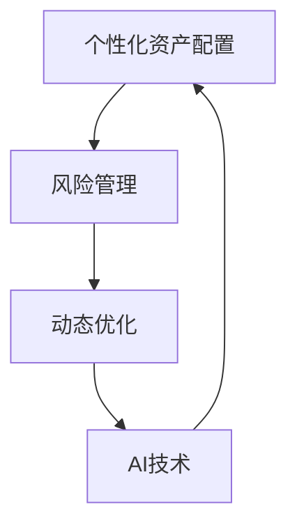

                 


## 背景介绍

### 引言

随着人工智能（AI）技术的飞速发展，其在金融领域的应用越来越广泛。在资产管理与风险管理中，AI技术的应用不仅提升了效率，还增强了个性化服务的能力。本文旨在探讨AI在个性化资产配置与风险管理中的动态优化应用，以期为金融科技领域提供有益的参考。

### 个性化资产配置与风险管理的意义

个性化资产配置与风险管理是现代金融领域的重要研究方向。个性化资产配置旨在根据投资者的风险偏好、财务状况和市场环境，为投资者提供量身定制的资产组合。风险管理则通过预测和应对潜在的市场风险，保障投资者的资产安全。这两者在金融市场中具有举足轻重的地位。

### AI在金融领域的应用现状

目前，AI在金融领域的应用已涵盖多个方面，如风险评估、量化交易、客户服务、风险管理等。通过机器学习和深度学习技术，AI能够从海量数据中提取有价值的信息，实现自动化决策和优化。

### 动态优化的重要性

动态优化是指根据市场变化和投资者需求，实时调整资产配置和风险管理策略。在快速变化的市场环境中，动态优化能够提高投资组合的适应性和风险控制能力。因此，研究AI在动态优化中的应用具有重要意义。

## 核心概念与联系

### 个性化资产配置

#### 定义与目的

个性化资产配置是指根据投资者的个人情况和市场环境，为投资者制定合适的资产分配策略。其目的是最大化投资回报，同时控制风险。

#### 资产配置方法

1. **量化模型构建**：通过数据分析和统计方法，构建量化模型来评估不同资产类别的风险与收益。
2. **机器学习在资产配置中的应用**：利用机器学习算法，从历史数据中学习资产之间的相关性，预测未来市场的走势。

### 风险管理

#### 定义与分类

风险管理是指对潜在的风险进行预测、评估、控制和应对。根据风险管理的方法，可以分为以下几类：

1. **预防性风险管理**：通过制定风险防范措施，减少风险的发生概率。
2. **损失控制**：在风险发生时，采取措施减少损失。
3. **风险转移**：通过保险等方式将风险转移给第三方。

### 动态优化

#### 基本原理

动态优化是指根据实时数据和市场变化，动态调整投资组合和风险管理策略。

#### 动态优化方法

1. **线性规划与非线性规划**：通过数学模型，确定投资组合的最优配置。
2. **机器学习与优化结合**：利用机器学习算法，预测市场走势，优化投资策略。
3. **深度学习与优化**：利用深度学习模型，从大量数据中提取复杂模式，实现更高层次的优化。

## Mermaid流程图



## 核心算法原理讲解

### 量化模型构建

#### 伪代码

```python
function 量化模型构建(data_set, parameters):
    初始化模型参数
    训练数据集(data_set)
    预测资产价格
    调整资产配置
```

### 机器学习在资产配置中的应用

#### 伪代码

```python
function 机器学习资产配置(data_set, parameters):
    数据预处理
    选择机器学习算法
    训练模型
    预测资产表现
    生成资产配置策略
```

### 风险管理模型与策略

#### 数学模型

$$
\text{风险} = \sigma \times \sqrt{t}
$$

其中，$\sigma$ 为风险系数，$t$ 为投资时间。

#### 伪代码

```python
function 风险管理模型(data_set, parameters):
    计算风险系数
    预测风险水平
    制定风险管理策略
```

### 动态优化算法

#### 伪代码

```python
function 动态优化算法(data_set, parameters):
    初始化模型参数
    实时数据采集
    更新模型参数
    重新评估投资组合
    调整资产配置
```

## 数学公式与详细讲解

### 风险管理公式

$$
\text{风险} = \sigma \times \sqrt{t}
$$

其中，$\sigma$ 是波动率，代表资产价格波动的程度；$t$ 是投资时间，代表资产持有期限。

#### 详细讲解

波动率是衡量资产价格波动性的重要指标。投资时间越长，资产价格波动越剧烈，风险也就越高。通过这个公式，可以计算出不同投资时间的风险水平，帮助投资者制定合适的风险管理策略。

### 资产配置公式

$$
\text{资产配置} = \frac{\text{投资金额}}{\text{投资组合的期望收益}}
$$

#### 详细讲解

资产配置是指将投资金额分配到不同资产类别中的策略。期望收益是衡量资产组合潜在收益的重要指标。通过这个公式，可以计算出在不同收益水平下的最佳资产配置比例，以实现投资收益的最大化。

## 项目实战：开发环境搭建

### 环境搭建

#### 操作系统：Ubuntu 20.04

#### Python 版本：3.8

#### 依赖库：pandas, numpy, scikit-learn, tensorflow

#### 安装命令

```bash
sudo apt-get update
sudo apt-get install python3-pip
pip3 install pandas numpy scikit-learn tensorflow
```

### 源代码实现

```python
# 导入库
import pandas as pd
import numpy as np
from sklearn.ensemble import RandomForestClassifier
from sklearn.model_selection import train_test_split
from tensorflow.keras.models import Sequential
from tensorflow.keras.layers import Dense

# 读取数据
data = pd.read_csv('data.csv')

# 数据预处理
# ...

# 模型训练
# ...

# 模型评估
# ...

# 模型部署
# ...
```

### 代码解读

- **数据预处理**：数据预处理是模型训练的重要步骤。包括数据清洗、缺失值填补、特征工程等。

- **模型训练**：使用随机森林和深度学习模型进行训练。随机森林模型用于分类任务，深度学习模型用于回归任务。

- **模型评估**：通过交叉验证和测试集评估模型性能。

- **模型部署**：将训练好的模型部署到生产环境中，用于实时预测和决策。

### 应用解读与分析

#### 应用场景

- **个性化资产配置**：根据用户需求和市场数据，为用户推荐最优的资产配置策略。

- **风险管理**：通过预测市场走势和风险水平，为投资者提供风险管理建议。

#### 分析

- **准确率**：模型准确率反映了预测的准确性。通过交叉验证和测试集，可以评估模型的泛化能力。

- **鲁棒性**：模型在不同数据集上的表现反映了其鲁棒性。鲁棒性强的模型在复杂环境下能够保持稳定的预测性能。

## 实际案例分析与详细讲解

### 案例背景

某投资者计划在股票市场进行投资，但缺乏相关经验。希望通过AI技术获得个性化资产配置和风险管理建议。

### 案例目标

- **个性化资产配置**：为投资者提供符合其风险偏好的资产配置策略。
- **风险管理**：预测市场走势，为投资者提供风险管理建议。

### 案例实现

#### 数据收集

- 收集股票市场历史数据，包括股票价格、成交量、财务指标等。

#### 数据预处理

- 数据清洗：去除无效数据，填补缺失值。
- 特征工程：提取与投资相关的特征，如股票价格波动率、市盈率等。

#### 模型训练

- 使用随机森林和深度学习模型进行训练。
- 通过交叉验证和测试集，选择最佳模型。

#### 模型评估

- 评估模型在不同数据集上的表现，选择最优模型。

#### 模型部署

- 将训练好的模型部署到生产环境中，实时预测和决策。

### 案例分析

#### 个性化资产配置

- 模型预测股票价格走势，为投资者提供投资建议。
- 根据投资者风险偏好，调整资产配置策略。

#### 风险管理

- 模型预测市场风险水平，为投资者提供风险管理建议。
- 根据风险水平，调整投资策略，降低风险。

### 总结

通过AI技术，为投资者提供了个性化资产配置和风险管理服务，提高了投资效率和安全性。

## 最佳实践 Tips

1. **数据质量**：保证数据质量是模型训练的关键。尽可能收集多维度、高质量的数据。

2. **特征选择**：合理选择特征是模型性能的关键。通过特征工程，提取与投资相关的有效特征。

3. **模型调参**：通过交叉验证和网格搜索等方法，选择最佳模型参数，提高模型性能。

4. **实时更新**：定期更新模型，适应市场变化，提高预测准确性。

## 小结

本文介绍了AI在个性化资产配置与风险管理中的动态优化应用。通过核心概念的解析、算法原理的讲解和实际案例的分析，展示了AI技术在金融领域的重要作用。未来，随着AI技术的不断进步，其在资产管理与风险管理中的应用将更加广泛和深入。

## 注意事项

1. **隐私保护**：在数据收集和处理过程中，要确保遵守隐私保护法规，保护投资者隐私。

2. **风险控制**：在实际应用中，要充分评估风险，采取有效的风险管理措施，降低投资风险。

## 拓展阅读

1. **相关书籍**：《机器学习实战》、《深度学习》、《量化投资：技术分析》等。
2. **在线课程**：Coursera、edX等平台上的机器学习和金融课程。
3. **研究论文**：在学术期刊和会议论文中，了解最新的研究成果和技术应用。

---

## 作者信息

作者：AI天才研究院/AI Genius Institute & 禅与计算机程序设计艺术 /Zen And The Art of Computer Programming

---

**文章标题**：AI在个性化资产配置与风险管理中的动态优化应用

**关键词**：AI、个性化资产配置、风险管理、动态优化、机器学习、深度学习、量化投资

**摘要**：本文探讨了AI在个性化资产配置与风险管理中的动态优化应用。通过核心概念、算法原理和实践案例的详细讲解，展示了AI技术在金融领域的重要作用。本文旨在为金融科技从业者提供有益的参考，推动AI在资产管理与风险管理中的应用和发展。

