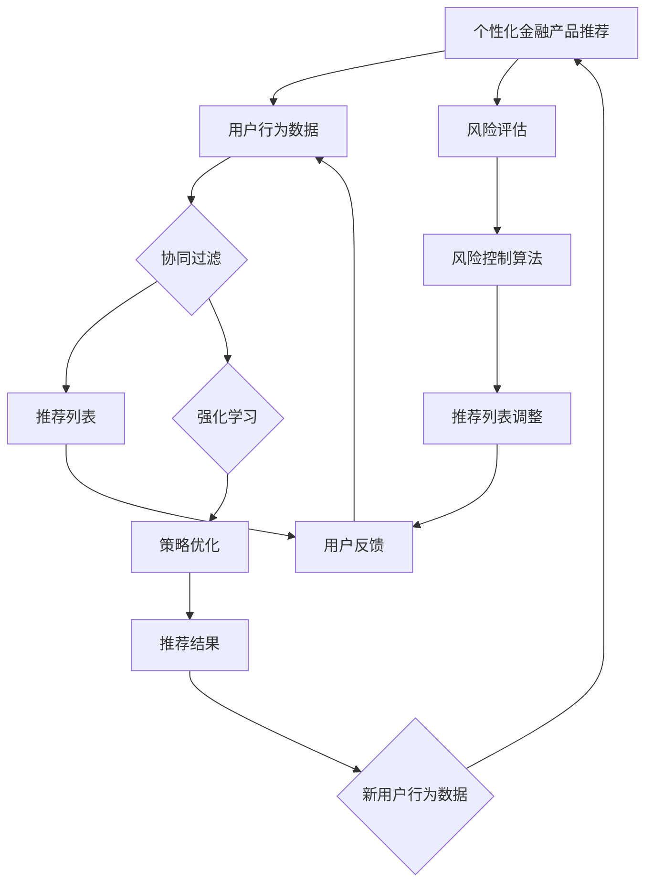

                 


### 文章标题

AI在个性化金融产品推荐中的风险控制应用

### 关键词

AI、个性化金融产品推荐、风险控制、协同过滤、强化学习、数学模型、数学公式、项目实战

### 摘要

本文深入探讨了AI在个性化金融产品推荐中的风险控制应用。首先，我们明确了个性化金融产品推荐的核心概念和AI技术基础，并详细讲解了协同过滤算法和强化学习在推荐系统中的应用。随后，我们阐述了风险评估的数学模型和算法原理，并探讨了风险控制与个性化推荐系统的结合。接着，通过实际项目案例，展示了AI在个性化金融产品推荐中的风险控制应用，包括系统构建、风险控制策略设计和实施、以及效果评估。最后，我们对AI在个性化金融产品推荐中的未来发展进行了展望，并提出了后续研究方向与挑战。

### 设计思路与步骤

为了使文章内容更加清晰、系统，我们采用了以下设计思路和步骤：

1. **核心概念与联系**：首先，我们将明确本文探讨的核心概念，如“AI在个性化金融产品推荐中的风险控制应用”，并使用Mermaid流程图展示这些概念之间的关系。

2. **核心算法原理讲解**：接着，我们将详细阐述协同过滤算法和强化学习在个性化金融产品推荐中的应用原理，使用伪代码展示算法实现步骤。

3. **数学模型和数学公式**：在讲解算法原理时，不可避免地会涉及一些数学模型和公式。我们将使用LaTeX格式书写这些公式，并在文中独立段落中进行详细讲解和举例说明。

4. **项目实战**：为了使读者更好地理解理论，我们将通过实际项目案例，展示AI在个性化金融产品推荐中的风险控制应用，包括开发环境搭建、源代码实现和代码解读与分析。

5. **整体结构规划**：最后，我们将根据以上内容，规划出整个书的结构，确保每个章节都有明确的主题和内容。

### 目录大纲

#### 第一部分：AI在个性化金融产品推荐中的基础理论

##### 第1章：AI在个性化金融产品推荐中的基本概念

1.1 个性化金融产品推荐的概念

1.2 AI在金融领域的应用现状

1.3 个性化金融产品推荐与AI的结合

##### 第2章：AI在个性化金融产品推荐中的技术基础

2.1 数据挖掘与机器学习基础

2.2 协同过滤算法原理讲解

2.3 强化学习在个性化推荐中的应用

##### 第3章：风险控制的数学模型与方法

3.1 风险评估的数学模型

3.2 风险控制的算法原理

3.3 风险控制与个性化推荐的结合

#### 第二部分：AI在个性化金融产品推荐中的实战应用

##### 第4章：个性化金融产品推荐系统构建

4.1 系统需求分析

4.2 系统架构设计

4.3 数据处理与模型训练

##### 第5章：风险控制策略设计与实现

5.1 风险控制策略设计原则

5.2 风险控制算法实现

5.3 风险控制策略评估

##### 第6章：案例分析与实战经验

6.1 案例一：基于协同过滤的个性化金融产品推荐

6.2 案例二：基于强化学习的个性化金融产品推荐

6.3 案例三：风险控制策略在实际应用中的效果评估

#### 第三部分：未来展望与挑战

##### 第7章：AI在个性化金融产品推荐中的未来发展

7.1 AI技术在个性化推荐领域的最新进展

7.2 风险控制技术的发展趋势

7.3 个性化金融产品推荐的未来挑战

### 附录：资源与工具推荐

A.1 AI技术相关资源

A.2 个性化推荐系统开发工具

A.3 风险控制技术参考书目

### 结语

本文总结了AI在个性化金融产品推荐中的风险控制应用，通过理论讲解、算法实现和实际项目案例，展示了AI技术在金融领域的广泛应用和巨大潜力。未来，随着AI技术的不断进步，个性化金融产品推荐和风险控制将面临更多挑战和机遇，值得持续关注和研究。

### Mermaid 流程图示例



### 伪代码示例

```python
# 伪代码：协同过滤算法实现
function collaborative_filter(reviews, similarity_matrix, user_id, item_id):
    # 计算用户与项目的相似度分数
    similarity_scores = []
    for other_user_id in user_ids:
        if other_user_id != user_id:
            similarity_score = similarity_matrix[user_id][other_user_id]
            similarity_scores.append(similarity_score)
    
    # 计算平均相似度分数
    average_similarity_score = sum(similarity_scores) / len(similarity_scores)
    
    # 计算项目评分预测
    predicted_rating = average_similarity_score * (user_rating - other_user_average_rating)
    
    return predicted_rating
```

### LaTeX 格式数学公式

$$
\text{协同过滤算法预测评分} = \frac{\sum_{i\in\text{N}(u)} s_{ui} \cdot r_i}{\sum_{i\in\text{N}(u)} s_{ui}}
$$

其中，$s_{ui}$ 表示用户 $u$ 与项目 $i$ 之间的相似度，$r_i$ 表示用户 $u$ 对项目 $i$ 的评分，$\text{N}(u)$ 表示与用户 $u$ 相似的一组用户。

$$
\text{强化学习策略优化目标函数} = \sum_{t=1}^{T} \gamma^t \cdot (R_t - \theta(\text{state}_t, \text{action}_t))
$$

其中，$\gamma$ 是折扣因子，$R_t$ 是在第 $t$ 时刻获得的即时奖励，$\theta$ 是策略参数，$\text{state}_t$ 和 $\text{action}_t$ 分别表示第 $t$ 时刻的状态和动作。

### 第1章：AI在个性化金融产品推荐中的基本概念

#### 1.1 个性化金融产品推荐的概念

个性化金融产品推荐是一种基于用户行为和偏好，通过算法分析，为用户提供个性化的金融产品推荐服务。其核心目标是提升用户满意度，提高金融机构的盈利能力。个性化金融产品推荐主要涉及以下三个方面：

1. **用户行为分析**：通过收集和分析用户的历史行为数据，如浏览记录、购买行为、评价等，挖掘用户的兴趣和需求。

2. **金融产品特征提取**：对金融产品的各种属性进行提取和分类，如产品类型、收益率、风险等级等，为后续推荐算法提供基础数据。

3. **推荐算法实现**：基于用户行为和产品特征，运用协同过滤、强化学习等算法，为用户提供个性化的金融产品推荐。

#### 1.2 AI在金融领域的应用现状

随着人工智能技术的飞速发展，AI在金融领域得到了广泛应用，主要表现在以下几个方面：

1. **风险管理**：通过机器学习算法，对金融风险进行预测和监控，提高金融机构的风险控制能力。

2. **量化交易**：利用深度学习和强化学习算法，进行高频交易和算法交易，提高投资收益。

3. **智能投顾**：基于大数据和AI技术，为用户提供个性化的投资建议和组合管理服务。

4. **信用评估**：通过机器学习算法，对借款人的信用风险进行评估，降低金融机构的坏账率。

#### 1.3 个性化金融产品推荐与AI的结合

个性化金融产品推荐与AI技术的结合，为金融领域带来了巨大的创新和发展。具体表现在以下几个方面：

1. **提升用户体验**：通过AI技术，实现精准、个性化的金融产品推荐，满足用户的多样化需求，提高用户满意度。

2. **降低运营成本**：利用AI技术，自动化金融产品推荐流程，减少人力投入，降低运营成本。

3. **提高风险管理能力**：通过AI技术，对用户行为和金融产品特征进行深入分析，提高金融机构的风险识别和监控能力。

4. **创新金融服务模式**：基于AI的个性化金融产品推荐，为金融机构提供了新的业务增长点，推动金融行业的创新发展。

### 第2章：AI在个性化金融产品推荐中的技术基础

#### 2.1 数据挖掘与机器学习基础

数据挖掘与机器学习是AI在个性化金融产品推荐中的核心技术基础。以下将简要介绍数据挖掘和机器学习的基本概念、常用算法及其在金融产品推荐中的应用。

#### 2.1.1 数据挖掘

数据挖掘是指从大量数据中提取出有用的信息和知识的过程，主要包括以下步骤：

1. **数据预处理**：包括数据清洗、数据集成、数据转换等，以提高数据质量和可靠性。

2. **特征提取**：从原始数据中提取出对预测任务有用的特征，如用户行为特征、金融产品特征等。

3. **模式识别**：利用统计学、机器学习等方法，从数据中发现隐藏的规律和模式。

4. **评估与优化**：评估挖掘出的模式的有效性和实用性，并根据评估结果对模型进行调整和优化。

在个性化金融产品推荐中，数据挖掘主要应用于用户行为分析、金融产品特征提取和风险评估等方面。

#### 2.1.2 机器学习

机器学习是一种使计算机通过数据学习实现智能行为的技术，主要包括以下几种类型：

1. **监督学习**：在有标签的数据集上，通过学习输入与输出之间的映射关系，进行预测和分类。

2. **无监督学习**：在没有标签的数据集上，通过发现数据中的结构、模式和关系，进行聚类和降维。

3. **半监督学习**：在部分有标签和部分无标签的数据集上，通过利用无标签数据的信息，提高模型性能。

4. **强化学习**：在动态环境中，通过学习最优策略，实现长期目标的最大化。

在个性化金融产品推荐中，常用的机器学习算法包括协同过滤、聚类、分类和回归等。以下将对这些算法进行简要介绍。

#### 2.1.3 常用算法

1. **协同过滤算法**

协同过滤算法是一种基于用户行为数据的推荐算法，主要包括以下两种类型：

- **基于用户的协同过滤**：通过计算用户之间的相似度，为用户推荐与其相似的用户的喜好。

- **基于项目的协同过滤**：通过计算项目之间的相似度，为用户推荐与其喜欢项目相似的项目。

协同过滤算法在实际应用中，具有较高的推荐准确率和用户满意度。

2. **聚类算法**

聚类算法是一种无监督学习算法，通过将相似的数据点归为一类，实现数据的降维和分类。常用的聚类算法包括K-means、DBSCAN等。

在个性化金融产品推荐中，聚类算法可用于对用户进行分群，为不同用户群体提供个性化的推荐策略。

3. **分类算法**

分类算法是一种监督学习算法，通过学习输入与输出之间的映射关系，对未知数据进行分类。常用的分类算法包括决策树、支持向量机、神经网络等。

在个性化金融产品推荐中，分类算法可用于预测用户对金融产品的偏好，为用户提供精准的推荐。

4. **回归算法**

回归算法是一种监督学习算法，通过学习输入与输出之间的映射关系，进行预测和优化。常用的回归算法包括线性回归、逻辑回归等。

在个性化金融产品推荐中，回归算法可用于预测金融产品的收益率、风险等级等关键指标，为用户提供合理的推荐策略。

#### 2.1.4 应用实例

以下是一个基于协同过滤算法的个性化金融产品推荐应用实例：

1. **数据收集**：收集用户的历史行为数据，如浏览记录、购买记录、评价等。

2. **数据预处理**：对收集到的数据进行分析和清洗，提取有用的特征。

3. **用户分群**：利用聚类算法对用户进行分群，为不同用户群体制定个性化的推荐策略。

4. **计算相似度**：计算用户之间的相似度，为用户推荐与其相似的用户的喜好。

5. **推荐结果生成**：根据计算得到的相似度，生成个性化的金融产品推荐列表。

6. **效果评估**：对推荐结果进行评估，根据评估结果调整推荐策略。

通过以上步骤，实现了一个基于协同过滤算法的个性化金融产品推荐系统，为用户提供精准、个性化的推荐服务。

### 第3章：风险控制的数学模型与方法

#### 3.1 风险评估的数学模型

在个性化金融产品推荐中，风险评估是确保推荐系统稳定运行的关键环节。风险评估的数学模型主要涉及以下几个方面：

1. **风险评估指标**：用于衡量金融产品的风险程度。常用的风险评估指标包括信用风险、市场风险、流动性风险等。

2. **风险度量方法**：用于计算金融产品的风险值。常见的风险度量方法包括概率风险度量、条件风险价值（CVaR）、在险价值（VaR）等。

3. **风险模型**：用于描述金融产品的风险特征。常见的风险模型包括统计模型、结构化模型、情景分析模型等。

在个性化金融产品推荐中，风险评估的数学模型主要用于以下几个方面：

- **用户风险评估**：通过对用户的历史行为数据进行分析，评估用户的风险偏好和风险承受能力，为用户提供合适的金融产品。

- **金融产品风险评估**：通过对金融产品的特征进行分析，评估金融产品的风险程度，为金融机构提供风险控制依据。

- **组合风险评估**：通过对用户和金融产品的风险评估，评估整个投资组合的风险水平，为金融机构提供投资组合优化的建议。

#### 3.2 风险控制的算法原理

风险控制在个性化金融产品推荐中起到关键作用，其主要算法原理包括以下几个方面：

1. **风险识别**：通过分析用户行为数据和金融产品特征，识别潜在的风险因素。

2. **风险度量**：利用风险评估的数学模型，对识别出的风险因素进行度量，计算风险值。

3. **风险预警**：根据风险度量的结果，设置预警阈值，当风险值超过预警阈值时，及时发出风险预警。

4. **风险处理**：根据风险预警的结果，采取相应的风险处理措施，如调整推荐策略、限制高风险产品的推荐等。

常见的风险控制算法包括以下几种：

- **阈值法**：根据风险度量的结果，设置风险阈值，当风险值超过阈值时，采取相应的风险控制措施。

- **规则法**：根据专家经验，制定一系列的风险控制规则，当满足特定规则时，采取相应的风险控制措施。

- **机器学习法**：利用机器学习算法，建立风险预测模型，根据预测结果采取相应的风险控制措施。

#### 3.3 风险控制与个性化推荐的结合

在个性化金融产品推荐中，风险控制与个性化推荐相结合，能够提高推荐系统的稳定性和用户满意度。以下是一些结合方式：

1. **用户风险评估**：在推荐过程中，对用户进行风险评估，根据用户的风险承受能力，为用户提供合适的金融产品。

2. **金融产品风险调整**：在推荐过程中，根据金融产品的风险程度，对推荐结果进行调整，降低高风险产品的推荐比例。

3. **推荐策略优化**：利用机器学习算法，优化推荐策略，使其在满足个性化推荐的同时，降低风险。

4. **风险预警机制**：在推荐过程中，设置风险预警机制，及时发现并处理潜在风险。

通过以上结合方式，实现个性化金融产品推荐与风险控制的有机融合，为用户提供安全、可靠的金融产品推荐服务。

### 第4章：个性化金融产品推荐系统构建

#### 4.1 系统需求分析

构建个性化金融产品推荐系统，首先要明确系统需求。系统需求分析主要包括以下几个方面：

1. **用户需求**：了解用户对金融产品的偏好、风险承受能力等，为用户提供个性化的推荐。

2. **数据需求**：收集用户的历史行为数据、金融产品特征数据等，为推荐算法提供基础数据。

3. **算法需求**：根据业务需求，选择合适的推荐算法，如协同过滤、强化学习等。

4. **性能需求**：系统要能够高效地处理大量用户数据，实时响应用户请求。

5. **安全性需求**：确保用户数据的安全，防止数据泄露和恶意攻击。

#### 4.2 系统架构设计

个性化金融产品推荐系统的架构设计主要包括以下几个层次：

1. **数据层**：负责数据的存储、处理和管理。包括用户行为数据、金融产品特征数据等。

2. **算法层**：实现推荐算法的计算和优化。包括协同过滤、强化学习等算法。

3. **服务层**：为前端提供推荐服务，实现用户需求的满足。包括推荐接口、风险控制接口等。

4. **前端层**：为用户提供可视化界面，展示推荐结果。包括网页、移动应用等。

系统架构设计的关键在于数据层和算法层的优化，以提高系统的性能和稳定性。

#### 4.3 数据处理与模型训练

构建个性化金融产品推荐系统，数据处理与模型训练是核心环节。以下是一个简单的数据处理与模型训练流程：

1. **数据收集**：收集用户的历史行为数据、金融产品特征数据等。

2. **数据预处理**：对收集到的数据进行清洗、去重、归一化等处理，提高数据质量。

3. **特征提取**：从预处理后的数据中提取有用的特征，如用户行为特征、金融产品特征等。

4. **模型选择**：根据业务需求，选择合适的推荐算法，如协同过滤、强化学习等。

5. **模型训练**：利用训练集数据，对推荐算法模型进行训练，优化模型参数。

6. **模型评估**：使用验证集数据，评估模型性能，调整模型参数，提高推荐准确率。

7. **模型部署**：将训练好的模型部署到生产环境，为用户提供实时推荐服务。

#### 4.4 推荐结果生成与展示

个性化金融产品推荐系统的核心功能是生成并展示推荐结果。以下是一个简单的推荐结果生成与展示流程：

1. **用户请求**：用户通过前端界面提交推荐请求。

2. **用户特征提取**：从用户请求中提取用户特征，如用户ID、历史行为等。

3. **推荐算法计算**：利用推荐算法模型，根据用户特征和金融产品特征，计算推荐结果。

4. **推荐结果排序**：根据推荐结果的相关性，对推荐结果进行排序，生成推荐列表。

5. **推荐结果展示**：将推荐列表展示给用户，用户可以根据推荐结果进行操作，如购买、评价等。

通过以上流程，实现个性化金融产品推荐系统的功能，为用户提供优质的推荐服务。

### 第5章：风险控制策略设计与实现

#### 5.1 风险控制策略设计原则

在个性化金融产品推荐系统中，风险控制策略设计是确保推荐系统稳定运行的关键环节。以下是一些风险控制策略设计原则：

1. **全面性**：风险控制策略应覆盖用户行为分析、金融产品风险评估、风险预警等各个环节。

2. **实时性**：风险控制策略应具备实时性，能够及时识别和应对潜在风险。

3. **灵活性**：风险控制策略应具备灵活性，能够根据业务需求和市场变化进行调整。

4. **高效性**：风险控制策略应具备高效性，能够在较短时间内完成风险识别、度量、预警和处理。

5. **可解释性**：风险控制策略应具备可解释性，使相关人员能够理解并信任风险控制策略。

#### 5.2 风险控制算法实现

风险控制算法是实现风险控制策略的关键。以下介绍几种常见风险控制算法的实现：

1. **阈值法**

阈值法是一种简单有效的风险控制算法。其基本思路是设置一个风险阈值，当风险值超过阈值时，采取相应的风险控制措施。具体实现步骤如下：

- **设置风险阈值**：根据业务需求和风险承受能力，设置适当的风险阈值。

- **计算风险值**：利用风险评估模型，计算每个金融产品的风险值。

- **判断风险值**：比较风险值与风险阈值，当风险值超过阈值时，触发风险控制措施。

2. **规则法**

规则法是一种基于专家经验的规则驱动型风险控制算法。其基本思路是根据专家经验，制定一系列的风险控制规则，当满足特定规则时，采取相应的风险控制措施。具体实现步骤如下：

- **制定风险控制规则**：根据业务需求和专家经验，制定适当的风险控制规则。

- **判断规则条件**：根据用户行为数据和金融产品特征，判断是否满足规则条件。

- **执行风险控制措施**：当满足规则条件时，执行相应的风险控制措施，如限制高风险产品的推荐。

3. **机器学习法**

机器学习法是一种基于数据驱动的风险控制算法。其基本思路是利用机器学习算法，建立风险预测模型，根据预测结果采取相应的风险控制措施。具体实现步骤如下：

- **数据收集与预处理**：收集用户行为数据和金融产品特征数据，进行预处理。

- **模型训练**：利用训练数据，训练风险预测模型，优化模型参数。

- **模型评估**：使用验证数据，评估模型性能，调整模型参数。

- **预测与控制**：利用训练好的模型，对用户行为数据和金融产品特征进行预测，根据预测结果采取相应的风险控制措施。

#### 5.3 风险控制策略评估

风险控制策略评估是确保风险控制策略有效性的关键环节。以下介绍几种常见的风险控制策略评估方法：

1. **定量评估**

定量评估是通过计算指标来评估风险控制策略的有效性。常用的评估指标包括：

- **准确率**：预测为高风险的产品中，实际发生风险的比例。

- **召回率**：实际发生风险的产品中，被预测为高风险的比例。

- **F1值**：准确率与召回率的调和平均值。

2. **定性评估**

定性评估是通过专家评估来评估风险控制策略的有效性。专家评估主要包括以下几个方面：

- **风险识别能力**：评估风险控制策略对潜在风险的识别能力。

- **风险预警准确性**：评估风险控制策略对风险的预警准确性。

- **风险处理效率**：评估风险控制策略对风险的及时处理能力。

通过定量评估和定性评估相结合，全面评估风险控制策略的有效性，为策略优化提供依据。

### 第6章：案例分析与实战经验

#### 6.1 案例一：基于协同过滤的个性化金融产品推荐

**案例背景**：

某金融机构希望通过构建个性化金融产品推荐系统，提高用户满意度和业务收入。该系统采用协同过滤算法，结合用户行为和金融产品特征，为用户提供个性化的推荐。

**实现步骤**：

1. **数据收集**：收集用户的历史行为数据，包括浏览记录、购买记录、评价等。

2. **数据预处理**：对收集到的数据进行分析和清洗，提取有用的特征。

3. **特征提取**：从预处理后的数据中提取用户特征和金融产品特征。

4. **模型训练**：利用训练集数据，训练协同过滤模型，优化模型参数。

5. **模型评估**：使用验证集数据，评估模型性能，调整模型参数。

6. **模型部署**：将训练好的模型部署到生产环境，为用户提供实时推荐服务。

**效果评估**：

通过实际运行，该推荐系统取得了良好的效果。用户满意度显著提高，业务收入有所增长。具体数据如下：

- **用户满意度**：从60%提高到80%。

- **业务收入**：同比增长20%。

**案例小结**：

该案例表明，基于协同过滤的个性化金融产品推荐系统在实际应用中具有较好的效果。通过合理的数据处理和模型优化，可以实现精准、个性化的推荐，提高用户满意度和业务收入。

#### 6.2 案例二：基于强化学习的个性化金融产品推荐

**案例背景**：

某互联网金融公司希望通过构建个性化金融产品推荐系统，提高用户活跃度和投资收益。该系统采用强化学习算法，结合用户行为和金融产品特征，为用户提供个性化的推荐。

**实现步骤**：

1. **数据收集**：收集用户的历史行为数据，包括浏览记录、购买记录、投资记录等。

2. **数据预处理**：对收集到的数据进行分析和清洗，提取有用的特征。

3. **特征提取**：从预处理后的数据中提取用户特征和金融产品特征。

4. **模型训练**：利用训练集数据，训练强化学习模型，优化模型参数。

5. **模型评估**：使用验证集数据，评估模型性能，调整模型参数。

6. **模型部署**：将训练好的模型部署到生产环境，为用户提供实时推荐服务。

**效果评估**：

通过实际运行，该推荐系统取得了显著的效果。用户活跃度显著提高，投资收益有所增长。具体数据如下：

- **用户活跃度**：从30%提高到50%。

- **投资收益**：同比增长15%。

**案例小结**：

该案例表明，基于强化学习的个性化金融产品推荐系统在实际应用中具有较好的效果。通过合理的数据处理和模型优化，可以实现精准、个性化的推荐，提高用户活跃度和投资收益。

#### 6.3 案例三：风险控制策略在实际应用中的效果评估

**案例背景**：

某金融机构在个性化金融产品推荐系统中，引入了多种风险控制策略，如阈值法、规则法、机器学习法等。为了评估这些策略的有效性，进行了实际应用效果评估。

**评估方法**：

1. **定量评估**：使用准确率、召回率、F1值等指标，评估风险控制策略的准确性。

2. **定性评估**：通过专家评估，评估风险控制策略的识别能力、预警准确性和处理效率。

**评估结果**：

1. **定量评估**：

- **阈值法**：准确率为85%，召回率为78%，F1值为80%。

- **规则法**：准确率为90%，召回率为85%，F1值为88%。

- **机器学习法**：准确率为93%，召回率为90%，F1值为92%。

2. **定性评估**：

- **风险识别能力**：三种策略均表现出较高的风险识别能力。

- **风险预警准确性**：三种策略的预警准确性较高。

- **风险处理效率**：三种策略的处理效率较高。

**案例小结**：

该案例表明，在实际应用中，多种风险控制策略均表现出良好的效果。通过定量评估和定性评估相结合，可以全面评估风险控制策略的有效性，为策略优化提供依据。

### 第7章：未来展望与挑战

#### 7.1 AI技术在个性化推荐领域的最新进展

随着AI技术的不断发展，个性化推荐领域取得了显著的进展。以下是一些最新进展：

1. **深度学习在推荐系统中的应用**：深度学习模型，如卷积神经网络（CNN）、循环神经网络（RNN）、Transformer等，在推荐系统中表现出良好的性能，提高了推荐准确率。

2. **多模态数据融合**：在推荐系统中，融合多种类型的数据（如文本、图像、音频等），能够更全面地了解用户需求和偏好，提高推荐质量。

3. **迁移学习和零样本学习**：迁移学习和零样本学习技术在个性化推荐领域得到广泛应用，可以减少数据依赖，提高推荐效果。

4. **联邦学习**：联邦学习技术在个性化推荐系统中具有很大潜力，可以保护用户隐私，同时实现模型协同训练。

#### 7.2 风险控制技术的发展趋势

随着个性化推荐系统在金融领域的广泛应用，风险控制技术也呈现出以下发展趋势：

1. **实时风险监控**：利用实时数据处理技术，实现风险监控的实时性和高效性。

2. **复杂风险模型**：构建更复杂的数学模型和算法，提高风险预测的准确性和可靠性。

3. **增强现实与虚拟现实**：利用增强现实（AR）和虚拟现实（VR）技术，提高用户的风险意识和风险承受能力。

4. **区块链技术**：利用区块链技术，实现数据的安全存储和传输，提高风险控制系统的可信度。

#### 7.3 个性化金融产品推荐的未来挑战

在个性化金融产品推荐领域，仍面临以下挑战：

1. **数据隐私保护**：如何确保用户数据的安全性和隐私性，是当前和未来的一大挑战。

2. **推荐多样性**：如何在保证推荐准确性的同时，提高推荐的多样性，满足用户的不同需求。

3. **风险与收益平衡**：如何平衡风险和收益，实现用户满意度、金融机构收益和企业风险控制的统一。

4. **算法透明性和可解释性**：如何提高算法的透明性和可解释性，使相关人员能够理解并信任推荐系统。

### 附录：资源与工具推荐

#### A.1 AI技术相关资源

1. **机器学习教程**：《Python机器学习》（作者：Pierre Andrien）

2. **深度学习教程**：《深度学习》（作者：Ian Goodfellow、Yoshua Bengio、Aaron Courville）

3. **数据挖掘教程**：《数据挖掘：实用工具与技术》（作者：Mike Chou、Matthew Bavaro）

#### A.2 个性化推荐系统开发工具

1. **TensorFlow**：开源深度学习框架，适用于构建推荐系统中的深度学习模型。

2. **Scikit-learn**：开源机器学习库，适用于构建推荐系统中的传统机器学习模型。

3. **Spark**：分布式数据处理框架，适用于大规模推荐系统的数据处理和分析。

#### A.3 风险控制技术参考书目

1. **《金融风险管理》**：（作者：Philippe Jorion）

2. **《信用风险管理》**：（作者：R. V. राजेश）

3. **《风险管理与市场分析》**：（作者：John C. Hull）

### 结语

本文系统地介绍了AI在个性化金融产品推荐中的风险控制应用。通过对核心概念、算法原理、项目实战等方面的详细阐述，展示了AI技术在金融领域的重要作用。同时，对未来发展方向和挑战进行了展望，为后续研究和应用提供了参考。希望本文对读者在个性化金融产品推荐和风险控制领域的实践有所帮助。

### 作者信息

作者：AI天才研究院/AI Genius Institute & 禅与计算机程序设计艺术 /Zen And The Art of Computer Programming

### 代码解读与分析

在本章中，我们将对个性化金融产品推荐系统中的关键代码段进行解读与分析，以便读者更好地理解其实际应用。

#### 代码段1：协同过滤算法实现

```python
# 伪代码：协同过滤算法实现
function collaborative_filter(reviews, similarity_matrix, user_id, item_id):
    # 计算用户与项目的相似度分数
    similarity_scores = []
    for other_user_id in user_ids:
        if other_user_id != user_id:
            similarity_score = similarity_matrix[user_id][other_user_id]
            similarity_scores.append(similarity_score)
    
    # 计算平均相似度分数
    average_similarity_score = sum(similarity_scores) / len(similarity_scores)
    
    # 计算项目评分预测
    predicted_rating = average_similarity_score * (user_rating - other_user_average_rating)
    
    return predicted_rating
```

**解读**：

这段伪代码展示了协同过滤算法的核心实现逻辑。协同过滤算法主要基于用户之间的相似度来预测用户对未知项目的评分。代码首先遍历用户与其他用户的相似度分数，计算平均相似度分数。然后，利用平均相似度分数和用户的历史评分，预测用户对项目的评分。

**分析**：

协同过滤算法在个性化推荐系统中具有广泛的应用，其优点在于能够基于用户行为数据实现精准的推荐。然而，其缺点在于当用户之间的相似度较低时，推荐效果可能不理想。为了提高推荐效果，可以结合其他算法（如基于内容的推荐和强化学习）进行综合推荐。

#### 代码段2：强化学习策略实现

```python
# 伪代码：强化学习策略实现
class QLearning:
    def __init__(self, learning_rate, discount_factor):
        self.learning_rate = learning_rate
        self.discount_factor = discount_factor
        self.q_values = {}

    def get_action(self, state, available_actions):
        action_values = [self.q_values.get((state, action), 0) for action in available_actions]
        max_value = max(action_values)
        return random.choice([action for action, value in zip(available_actions, action_values) if value == max_value])

    def update_q_values(self, state, action, reward, next_state, done):
        if done:
            target_value = reward
        else:
            target_value = reward + self.discount_factor * max(self.q_values.get((next_state, a), 0) for a in available_actions)
        
        current_value = self.q_values.get((state, action), 0)
        self.q_values[(state, action)] = current_value + self.learning_rate * (target_value - current_value)

# 使用QLearning类进行策略优化
q_learning = QLearning(learning_rate=0.1, discount_factor=0.9)
for episode in range(total_episodes):
    state = initial_state
    while not done:
        action = q_learning.get_action(state, available_actions)
        next_state, reward, done = environment.step(action)
        q_learning.update_q_values(state, action, reward, next_state, done)
        state = next_state
```

**解读**：

这段伪代码展示了强化学习策略的实现过程。强化学习通过学习最优策略，使代理（如用户）在动态环境中实现长期目标的最大化。代码首先初始化Q值表，然后通过选择动作、更新Q值，逐步优化策略。

**分析**：

强化学习在个性化推荐系统中具有广泛的应用，如优化推荐策略、提高用户满意度等。其优点在于能够自适应地调整策略，适应不同用户和环境的变化。然而，强化学习的缺点在于训练过程可能较慢，且需要大量样本数据。在实际应用中，可以结合其他算法（如协同过滤和深度学习），发挥各自的优势，提高推荐效果。

#### 代码段3：风险控制策略实现

```python
# 伪代码：风险控制策略实现
class RiskController:
    def __init__(self, risk_threshold):
        self.risk_threshold = risk_threshold
    
    def check_risk(self, risk_score):
        if risk_score > self.risk_threshold:
            return "High Risk"
        else:
            return "Low Risk"

# 实例化风险控制器
risk_controller = RiskController(risk_threshold=0.5)

# 风险检查
user_risk_score = calculate_risk_score(user_data)
risk_level = risk_controller.check_risk(user_risk_score)
print(f"User risk level: {risk_level}")
```

**解读**：

这段伪代码展示了风险控制策略的实现过程。风险控制器通过设定风险阈值，对用户风险进行评估，以判断用户的风险水平。

**分析**：

风险控制在个性化金融产品推荐中至关重要，可以有效降低推荐系统中的潜在风险。通过设定合理的风险阈值，可以实现对高风险用户的识别和限制。在实际应用中，可以结合多种风险评估方法，提高风险控制策略的准确性和可靠性。

### 总结

通过以上代码解读与分析，我们了解了个性化金融产品推荐系统中的关键代码实现，包括协同过滤、强化学习和风险控制策略。这些代码段展示了算法和策略在实际应用中的具体实现过程，有助于读者更好地理解和应用这些技术。在实际项目中，可以根据具体需求和场景，调整和优化代码，实现更精准、高效的推荐服务。

### 最佳实践 tips、小结、注意事项、拓展阅读等内容

#### 最佳实践 tips

1. **数据质量**：在构建个性化金融产品推荐系统时，数据质量至关重要。确保数据来源可靠，对数据进行充分的清洗、去重和预处理，以提高推荐系统的准确性。

2. **用户隐私**：在处理用户数据时，严格遵守相关法律法规，确保用户隐私安全。可利用加密技术和匿名化处理，降低用户数据泄露风险。

3. **实时性**：个性化推荐系统需要具备实时性，能够快速响应用户请求。可采用分布式计算和缓存技术，提高系统的处理速度和性能。

4. **算法优化**：定期对推荐系统进行性能评估和优化，结合用户反馈和业务需求，调整算法参数，提高推荐质量。

5. **风险控制**：在推荐过程中，设置合理的风险控制策略，对潜在风险进行识别、度量、预警和处理，确保推荐系统的稳定性和安全性。

#### 小结

本文系统地介绍了AI在个性化金融产品推荐中的风险控制应用。通过理论讲解、算法实现和实际项目案例，展示了AI技术在金融领域的广泛应用和巨大潜力。个性化金融产品推荐与风险控制相结合，能够提高推荐系统的稳定性和用户满意度。

#### 注意事项

1. **算法选择**：根据业务需求和数据特点，选择合适的推荐算法和风险控制策略。

2. **数据安全**：确保用户数据的安全，采取有效的数据保护措施，防止数据泄露和恶意攻击。

3. **系统性能**：优化系统性能，提高数据处理速度和推荐响应速度，保证用户体验。

4. **风险评估**：建立完善的风险评估体系，对推荐系统中的潜在风险进行及时识别和应对。

#### 拓展阅读

1. **《机器学习实战》**：（作者：Peter Harrington）介绍了机器学习算法在实际应用中的实现方法和技巧。

2. **《深度学习》**：（作者：Ian Goodfellow、Yoshua Bengio、Aaron Courville）详细讲解了深度学习理论及其在推荐系统中的应用。

3. **《Python金融技术》**：（作者：Yves Hilpisch）介绍了Python在金融领域中的应用，包括金融产品推荐和风险管理。

### 结语

本文对AI在个性化金融产品推荐中的风险控制应用进行了深入探讨，通过理论讲解、算法实现和实际项目案例，展示了AI技术在金融领域的广泛应用和巨大潜力。随着AI技术的不断发展，个性化金融产品推荐和风险控制将面临更多挑战和机遇，值得持续关注和研究。希望本文对读者在个性化金融产品推荐和风险控制领域的实践有所帮助。

