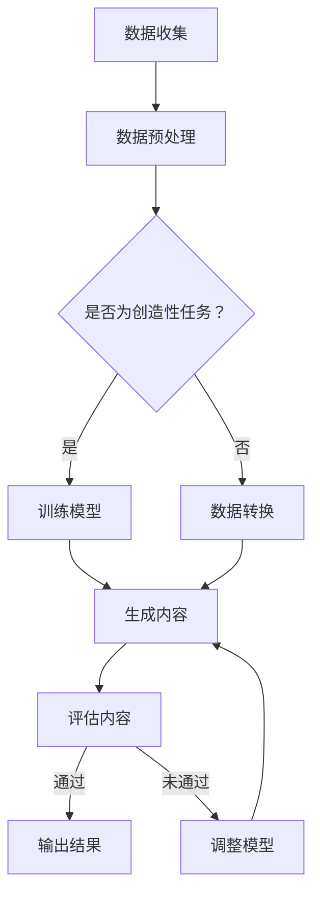

                 

### 文章标题

《AI在创造性任务中的表现与人类对比研究》

### 文章关键词

人工智能，创造性任务，生成对抗网络，深度学习，数学模型，项目实战

### 文章摘要

本文旨在深入探讨人工智能（AI）在创造性任务中的表现，并与人类进行对比分析。文章首先概述了AI和创造性任务的基本概念，然后详细介绍了与创造性任务相关的核心AI技术和理论，包括生成对抗网络（GANs）和深度学习等。接着，文章通过数学模型和公式，阐述了AI在创造性任务中的算法原理。随后，通过一个实际案例展示了AI在创造性任务中的应用，并对代码实现和项目效果进行了分析。文章最后对比了AI与人类在创造性任务中的表现差异，讨论了未来的发展方向。通过本文的探讨，我们希望能为研究者提供有价值的参考，并推动AI在创造性任务中的进一步应用。

### 确定书籍主题和目标读者

#### 书籍主题

《AI在创造性任务中的表现与人类对比研究》这本书的主要主题在于探讨人工智能在创造性任务中的表现，并与人类进行对比。创造性任务包括艺术创作、设计、文学创作、音乐创作等多个领域，这些任务通常被认为需要高度的人类智慧和创造力。随着人工智能技术的不断发展，AI在模仿和执行创造性任务方面取得了显著的进展。然而，AI在真正具备创造性方面是否能够与人类相比，仍然是一个开放性的问题。

本书将深入分析AI在创造性任务中的表现，探讨其工作原理、技术实现以及与人类创造力的对比。通过系统的研究和分析，我们希望揭示AI在创造性任务中的潜力与局限性，为未来人工智能在创造性领域的应用提供理论支持和实践指导。

#### 目标读者

本书的目标读者主要包括以下几类：

1. **人工智能和认知科学领域的专业人士**：这些读者对AI技术和认知科学有深入的了解，他们希望深入了解AI在创造性任务中的应用和潜力，以推动相关领域的研究和应用。

2. **心理学和人类行为研究者**：这些读者对人类创造力的本质和机制有研究兴趣，他们希望通过AI的研究来对比分析人类和机器在创造性任务中的差异，为心理学研究提供新的视角。

3. **AI开发者和研究人员**：这些读者关注AI技术的最新进展，尤其是其在创造性任务中的应用，他们希望通过本书了解如何利用AI技术实现创造性任务，并探索潜在的创新方向。

4. **对AI和创造性任务感兴趣的一般读者**：这些读者对AI和创造性任务有好奇心，希望通过本书了解这两个领域的基本概念、技术原理和应用实例，从而对AI在创造性任务中的表现有一个全面的了解。

通过明确书籍的主题和目标读者，我们可以更好地设计文章的结构和内容，确保文章能够满足读者的需求和期望，同时为相关领域的研究和应用提供有价值的参考。接下来，我们将构建核心章节框架，为文章的撰写奠定基础。

### 核心章节框架

为了系统地探讨人工智能（AI）在创造性任务中的表现与人类对比，本书将分为七个核心章节，每个章节都将深入分析特定方面的问题。以下是详细的章节框架：

#### 第1章 引言

- **1.1 AI与创造性任务**
  - 概述AI的基本概念和发展历程。
  - 阐述创造性任务的定义和重要性。
  - 提出本书的研究目标和主要内容。

- **1.2 本书目标与研究方法**
  - 明确本书的研究目的。
  - 介绍研究方法和采用的理论框架。

- **1.3 创造性任务分类**
  - 分类讨论不同类型的创造性任务。
  - 分析创造性任务对AI的挑战和机遇。

- **1.4 创造性任务对AI的挑战**
  - 探讨AI在处理创造性任务时面临的难题。
  - 引出本书将要讨论的关键问题。

#### 第2章 核心概念与联系

- **2.1 AI在创造性任务中的应用**
  - 介绍AI在创造性任务中的实际应用案例。
  - 分析AI在艺术创作、设计、文学和音乐等领域的表现。

- **2.2 Mermaid流程图展示**
  - 使用Mermaid流程图展示AI与创造性任务的结合。
  - 解释流程图中各个步骤的作用和关系。

- **2.3 AI与创造性任务的结合**
  - 阐述AI如何通过算法和模型实现创造性任务。
  - 讨论AI在创造性任务中的优势和局限性。

#### 第3章 核心算法原理讲解

- **3.1 GANs算法原理**
  - 介绍生成对抗网络（GANs）的基本概念。
  - 讲解GANs的核心算法原理和结构。

- **3.2 深度学习算法原理**
  - 详细解释深度学习算法的基本原理。
  - 分析深度学习在创造性任务中的应用。

- **3.3 伪代码讲解**
  - 使用伪代码展示核心算法的实现过程。
  - 解释算法中的重要步骤和参数设置。

#### 第4章 数学模型和数学公式

- **4.1 生成模型**
  - 介绍生成模型的基本概念和数学模型。
  - 讲解生成模型在创造性任务中的应用。

- **4.2 评估模型**
  - 阐述评估模型的作用和基本概念。
  - 分析评估模型在创造性任务中的应用。

- **4.3 数学公式展示**
  - 使用LaTeX格式展示重要的数学公式。
  - 解释公式的含义和作用。

#### 第5章 项目实战

- **5.1 创造性任务案例**
  - 介绍一个具体的创造性任务案例。
  - 分析案例的背景和目标。

- **5.2 代码实现**
  - 详细展示案例的代码实现过程。
  - 解释代码中的关键步骤和算法应用。

- **5.3 项目效果分析**
  - 分析项目效果，评估AI在创造性任务中的表现。
  - 讨论项目的成功经验和挑战。

#### 第6章 AI与人类对比

- **6.1 创造性任务表现分析**
  - 对比AI与人类在创造性任务中的表现。
  - 分析差异的原因和影响。

- **6.2 潜在应用与挑战**
  - 讨论AI在创造性任务中的潜在应用。
  - 分析面临的挑战和解决方法。

- **6.3 未来发展趋势**
  - 探讨AI在创造性任务中的未来发展趋势。
  - 提出未来研究的应用方向。

#### 第7章 总结与展望

- **7.1 全书总结**
  - 总结本书的主要内容和核心观点。
  - 强调AI在创造性任务中的重要性。

- **7.2 研究方向与展望**
  - 提出未来研究方向。
  - 讨论AI在创造性任务中的潜在应用。

- **7.3 拓展阅读**
  - 推荐进一步阅读的资料和资源。
  - 促进读者对相关领域的深入探索。

通过构建这样的核心章节框架，本书将系统地探讨AI在创造性任务中的表现，并对比分析AI与人类的差异。每个章节都将深入分析特定方面的问题，确保读者能够全面了解AI在创造性任务中的工作原理和应用前景。接下来，我们将逐步展开每个章节的具体内容，为读者提供详尽的技术分析和实际案例。

### 第1章 引言

#### 1.1 AI与创造性任务

人工智能（AI）是一种模拟人类智能行为的技术，通过机器学习、深度学习、自然语言处理等多种方法，使计算机系统能够执行复杂任务并自主学习和改进。AI技术的发展经历了数十年，从简单的规则系统到复杂的神经网络，再到生成对抗网络（GANs）和强化学习，AI在各个领域都取得了显著的进展。然而，AI在创造性任务中的表现一直是一个备受关注和研究的话题。

创造性任务是指那些需要创造性思维和解决问题的任务，如艺术创作、设计、文学写作、音乐创作等。这些任务通常被认为是人类智慧的象征，因为它们需要创新、直觉和深度理解。尽管AI在某些方面已经能够模仿人类的创造性活动，但其在真正具备创造性方面仍然面临巨大挑战。

首先，AI在模仿人类创造性思维方面取得了一些成功。例如，AI可以生成图像、音乐和文本，这些作品在某些情况下甚至难以与人类的作品区分。然而，这些AI作品通常是基于已有的数据集进行训练和生成的，缺乏真正的创新性和独立性。AI的创造性表现更多地依赖于算法和数据的输入，而不是真正的创造性思维。

其次，创造性任务需要高度的抽象思维、跨领域整合和直觉判断。这些能力是AI目前难以模拟的。尽管AI可以通过大数据分析和深度学习技术获取大量信息，但它仍然缺乏人类对复杂问题进行直觉判断和创造新概念的能力。

因此，在探讨AI在创造性任务中的表现时，我们需要明确AI的创造性表现是有限的，它更多是在模仿和扩展人类创造力的基础上实现的。尽管AI在创造性任务中存在一定的局限性，但它为人类提供了新的工具和方法，帮助我们更好地理解和发挥自己的创造力。

#### 1.2 本书目标与研究方法

本书的目标是深入探讨人工智能（AI）在创造性任务中的表现，并与人类进行对比分析。通过系统的研究和分析，我们希望揭示AI在创造性任务中的潜力与局限性，为AI在创造性领域的进一步应用提供理论支持和实践指导。

为了实现这一目标，本书将采用多种研究方法，包括文献综述、案例分析、算法分析和实验验证等。首先，我们将通过文献综述的方式，回顾AI在创造性任务中的相关研究，总结现有研究成果和不足之处。这将为本书的研究提供理论基础和背景知识。

其次，我们将通过案例分析，具体探讨AI在艺术创作、设计、文学和音乐等创造性任务中的应用。我们将介绍一些成功的案例，分析AI在这些任务中的表现和限制，从而得出有价值的结论。

此外，我们将详细讲解AI在创造性任务中应用的核心算法原理，包括生成对抗网络（GANs）和深度学习等。通过伪代码和数学模型的讲解，我们希望读者能够深入理解这些算法的工作原理和实现过程。

最后，我们将通过实验验证，评估AI在创造性任务中的实际表现。我们将设计具体的实验方案，利用AI算法生成图像、音乐和文本等作品，并对比分析这些作品与人类作品的差异。通过实验结果，我们将进一步探讨AI在创造性任务中的潜力和挑战。

综上所述，本书将通过多种研究方法的综合应用，全面探讨AI在创造性任务中的表现，为相关领域的研究和应用提供有价值的参考。

#### 1.3 创造性任务分类

创造性任务可以按照不同的维度进行分类，常见的分类方法包括艺术创作、设计、文学创作、音乐创作等。每种类型的创造性任务都有其独特的特点和应用场景，以下将分别介绍这些分类及其在AI应用中的挑战和机遇。

**艺术创作**

艺术创作是创造性任务中最具代表性的一种，包括绘画、雕塑、摄影、动画等。艺术创作要求创作者具备独特的审美观、创造力和表现力，通过艺术手段表达情感和思想。

在AI应用方面，生成对抗网络（GANs）和深度学习技术被广泛应用于艺术创作。例如，GANs可以生成逼真的图像和视频，深度学习模型可以通过分析大量艺术作品，学习并生成新的艺术风格。然而，AI在艺术创作中的挑战在于，其生成的内容往往缺乏真正的情感和思想深度，无法完全替代人类的创造性思维。

**设计**

设计包括工业设计、建筑设计、用户体验设计等，涉及创意构思、视觉传达和用户体验等多个方面。设计任务通常需要解决实际问题，同时具备创新性和实用性。

在AI应用方面，深度学习和计算机视觉技术被广泛应用于设计领域。例如，深度学习模型可以通过分析大量设计数据，自动生成新的设计方案，计算机视觉技术可以帮助设计师快速识别和优化设计元素。然而，设计任务通常需要综合考虑用户需求和实际场景，AI在处理复杂设计问题时可能面临困难。

**文学创作**

文学创作包括小说、诗歌、剧本等，要求创作者具备丰富的想象力、表达能力和文学素养。文学作品通常蕴含深刻的思想和情感，是创造性任务中的经典形式。

在AI应用方面，自然语言处理（NLP）和生成模型（如变分自编码器VAE）被广泛应用于文学创作。例如，AI可以通过分析大量文学作品，生成新的故事情节和文本内容。然而，AI生成的文学作品在情感表达和思想深度方面仍然存在不足，难以完全替代人类创作者。

**音乐创作**

音乐创作包括作曲、编曲、配乐等，是创造性任务中的重要领域。音乐创作要求创作者具备音乐素养、创造力和音乐表现力。

在AI应用方面，深度学习和生成模型（如波士顿矩阵GAN）被广泛应用于音乐创作。例如，AI可以通过分析大量音乐数据，生成新的音乐作品和旋律。然而，AI生成的音乐在情感表达和独特性方面仍然存在挑战，难以完全取代人类作曲家。

综上所述，不同类型的创造性任务具有各自独特的特点和应用场景，AI在其中的应用也面临着不同的挑战和机遇。通过了解这些分类，我们可以更好地理解AI在创造性任务中的潜力与局限性，为未来的研究和应用提供指导。

#### 1.4 创造性任务对AI的挑战

尽管人工智能（AI）在许多领域取得了显著的进展，但在创造性任务中，AI仍然面临着诸多挑战。这些挑战主要集中在以下几个方面：

**1. 创造力的本质理解**

创造性任务要求AI具备高度的人类智慧，包括抽象思维、联想能力、直觉判断和情感表达等。然而，AI目前主要依赖于数据和算法，缺乏对创造力本质的理解。例如，人类艺术家在创作时能够将不同领域的知识和经验融合在一起，产生全新的创意。而AI在生成艺术作品时，通常是基于已有的数据集进行模仿和拓展，难以产生真正的创新思维。

**2. 数据和算法的限制**

创造性任务通常需要大量的数据来训练模型，但数据的获取和标注是一个复杂且耗时的过程。此外，现有的算法在处理创造性任务时存在局限性。例如，生成对抗网络（GANs）虽然能够在图像和音乐创作中取得较好的效果，但在处理复杂、多变的创造性任务时，往往无法达到人类水平的创造力。

**3. 跨领域整合能力**

创造性任务往往需要跨领域整合知识，例如，一个音乐作品可能需要音乐理论、情感表达和故事情节等多方面的整合。而AI在跨领域整合方面存在困难，通常只能在一个领域内进行优化和改进，难以实现真正的跨领域创新。

**4. 个性化表达和情感共鸣**

人类在创造性任务中能够通过个性化的表达和情感共鸣来打动观众。而AI在生成内容时，往往缺乏情感共鸣和个性化表达。尽管AI可以通过数据分析和学习模仿人类的创作风格，但难以真正理解和表达人类的情感，从而产生具有深刻内涵的作品。

**5. 伦理和道德问题**

在创造性任务中，AI的应用也引发了伦理和道德问题。例如，AI生成的艺术作品是否应该归功于人类创作者，还是应该单独归功于AI本身？这些问题涉及到知识产权、版权保护和道德责任等方面，需要深入探讨和解决。

综上所述，AI在创造性任务中面临着理解创造力本质、数据与算法限制、跨领域整合、个性化表达和伦理道德等多方面的挑战。这些挑战限制了AI在创造性任务中的表现，但同时也为AI的研究和应用提供了新的方向和可能性。通过不断探索和改进，我们有理由相信，AI在创造性任务中的表现将逐步提升，为实现人类与机器的创造性合作奠定基础。

### 第2章 核心概念与联系

#### 2.1 AI在创造性任务中的应用

人工智能（AI）在创造性任务中的应用已经取得了显著的进展。通过生成对抗网络（GANs）、深度学习等技术，AI能够生成图像、音乐、文本等作品，甚至在某些情况下难以与人类的作品区分。以下将介绍几个典型的应用场景：

**艺术创作**

GANs在图像生成和艺术创作方面表现出色。通过训练对抗网络，GANs可以生成逼真的图像和艺术作品。例如，深度卷积生成网络（DCGAN）和风格迁移模型（Style Transfer）已经在艺术创作中得到了广泛应用。这些模型可以模仿各种艺术风格，生成独特的艺术作品。

**音乐创作**

深度学习在音乐创作中也表现出色。通过分析大量的音乐数据，深度学习模型可以生成新的旋律和音乐片段。生成式对抗网络（GAN）在音乐创作中的应用尤为显著，例如波士顿矩阵GAN（Bach2401）可以生成巴赫风格的复音乐曲。此外，循环神经网络（RNN）和长短期记忆网络（LSTM）也被广泛应用于音乐生成。

**文学创作**

自然语言处理（NLP）技术在文学创作中也得到了广泛应用。生成模型（如变分自编码器VAE）和序列到序列模型（Seq2Seq）可以通过学习大量文学作品，生成新的故事情节和文本内容。例如，OpenAI的GPT-3模型已经能够生成高质量的文章和对话。

**设计**

AI在工业设计、建筑设计和用户体验设计等领域也得到了广泛应用。通过计算机视觉和深度学习技术，AI可以自动识别和优化设计元素，生成新的设计方案。例如，设计自动化工具可以帮助设计师快速生成多个设计方案，以便进行比较和选择。

#### 2.2 Mermaid流程图展示

为了更好地理解AI在创造性任务中的应用，我们可以使用Mermaid流程图来展示AI与创造性任务的结合。以下是一个简化的Mermaid流程图，描述了AI在创造性任务中的基本流程：



**图解：**

1. **数据收集**：首先，需要收集大量的创造性任务数据，包括图像、音乐、文本等。

2. **数据预处理**：对收集到的数据进行处理，包括数据清洗、归一化和特征提取等，以便模型能够更好地学习。

3. **是否为创造性任务？**：判断输入的任务是否属于创造性任务。如果是，进入下一步；否则，进行数据转换。

4. **训练模型**：使用GANs、深度学习等技术训练模型，使其能够学习并生成创造性内容。

5. **生成内容**：通过训练好的模型生成新的创造性内容，如图像、音乐、文本等。

6. **评估内容**：对生成的创造性内容进行评估，判断其是否符合预期和创意要求。

7. **输出结果**：通过评估的内容输出最终结果。

8. **调整模型**：如果生成的内容未通过评估，需要调整模型参数，重新训练，以便提高生成内容的质量。

#### 2.3 AI与创造性任务的结合

AI与创造性任务的结合主要体现在以下几个方面：

**算法与数据的结合**

AI在创造性任务中的应用依赖于大量高质量的数据和高效的算法。通过GANs、深度学习等技术，AI可以从数据中学习并生成创造性内容。数据的质量和数量直接影响AI的生成效果。

**跨学科融合**

AI与创造性任务的结合需要跨学科的知识和技能。例如，在艺术创作中，需要融合计算机科学、艺术学、心理学等领域的知识，以实现更好的创作效果。

**人机协作**

AI在创造性任务中的应用不仅仅是替代人类，更重要的是与人类协作。通过人机协作，AI可以辅助人类完成复杂的创造性任务，提高工作效率和创造力。

**持续优化**

AI在创造性任务中的应用是一个持续优化的过程。通过不断调整模型、改进算法和扩展数据集，AI可以逐步提高在创造性任务中的表现，实现更高的创意水平和质量。

通过核心概念与联系的分析，我们可以看到AI在创造性任务中的应用前景广阔，但也面临着许多挑战。理解这些概念和联系，有助于我们更好地利用AI技术，推动创造性任务的发展。

### 第3章 核心算法原理讲解

#### 3.1 GANs算法原理

生成对抗网络（GANs）是一种深度学习模型，由生成器和判别器两个主要部分组成。GANs的核心目标是使生成器生成的数据尽可能接近真实数据，而判别器则试图区分生成器和真实数据。以下将详细解释GANs的算法原理。

**生成器（Generator）**

生成器的任务是从随机噪声中生成与真实数据分布相近的数据。通常，生成器是一个神经网络，输入为噪声向量\( z \)，输出为生成数据\( G(z) \)。生成器的目标是最小化其生成的数据与真实数据的差距。

**判别器（Discriminator）**

判别器的任务是对输入的数据进行分类，判断其是真实数据还是生成数据。判别器也是一个神经网络，输入为真实数据和生成数据，输出为一个概率值，表示输入数据的真实度。

**GANs训练过程**

GANs的训练过程是通过交替优化生成器和判别器来实现的。具体步骤如下：

1. **生成器生成数据**：生成器从噪声向量\( z \)中生成数据\( G(z) \)。

2. **判别器评估**：判别器对真实数据和生成数据进行评估，并输出概率值。

3. **生成器优化**：生成器通过反向传播算法优化其参数，以使生成数据更接近真实数据。

4. **判别器优化**：判别器通过反向传播算法优化其参数，以提高对真实数据和生成数据的区分能力。

5. **交替进行**：上述步骤交替进行，直到生成器生成的数据足够接近真实数据，判别器难以区分生成数据和真实数据。

**GANs的优势**

GANs在生成数据方面具有显著优势：

1. **无监督学习**：GANs可以在无监督学习环境下训练，不需要对数据进行标注。

2. **多样性**：生成器可以生成多样化的数据，包括图像、音乐、文本等。

3. **高质量**：GANs通过对抗训练，可以生成高质量的数据，接近真实数据。

4. **自适应**：GANs可以根据训练数据自动调整生成策略，提高生成效果。

**GANs的局限性**

尽管GANs在生成数据方面具有许多优势，但仍然存在一些局限性：

1. **训练困难**：GANs的训练过程非常不稳定，容易陷入局部最优解。

2. **模式崩溃**：当生成器和判别器达到某种平衡时，生成器可能无法生成多样化的数据。

3. **计算资源需求高**：GANs的训练需要大量的计算资源，特别是对于高维度数据的训练。

**伪代码讲解**

以下是一个简化的GANs伪代码，用于展示其基本结构：

```python
# 生成器
z = noise_sample(z_size)
G(z) = generator(z)

# 判别器
x_real = real_data
x_fake = G(z)

D(x_real) = real_output
D(x_fake) = fake_output

# 损失函数
loss_G = loss_fake(D(G(z)))
loss_D = loss_real(D(x_real)) + loss_fake(D(x_fake))

# 优化
optimizer_G.zero_grad()
loss_G.backward()
optimizer_G.step()

optimizer_D.zero_grad()
loss_D.backward()
optimizer_D.step()
```

通过上述讲解，我们可以看到GANs在创造性任务中的基本原理和实现方法。接下来，我们将进一步探讨深度学习算法的原理。

#### 3.2 深度学习算法原理

深度学习是人工智能的一个重要分支，通过多层神经网络结构对数据进行学习，以实现复杂的模式识别和预测任务。以下将详细解释深度学习算法的基本原理。

**神经网络结构**

深度学习算法的核心是神经网络（Neural Network），特别是多层感知机（Multilayer Perceptron，MLP）。神经网络由多个层组成，包括输入层、隐藏层和输出层。每层由多个神经元（Neurons）组成，神经元之间通过权重（Weights）和偏置（Bias）连接。

**激活函数**

激活函数（Activation Function）是神经网络中的一个关键组件，用于引入非线性特性。常见的激活函数包括sigmoid函数、ReLU函数和Tanh函数。这些函数可以将线性组合转化为非线性映射，从而提高网络的表示能力。

**前向传播与反向传播**

深度学习算法包括前向传播（Forward Propagation）和反向传播（Backpropagation）两个主要过程。

- **前向传播**：输入数据通过网络的各层进行传递，每层神经元计算其输入的加权和，并应用激活函数。最终，输出层得到预测结果。

- **反向传播**：通过计算预测结果与实际结果的差异（损失函数），反向传播误差到网络的各层。每个神经元计算其梯度，并更新权重和偏置，以最小化损失函数。

**损失函数**

损失函数（Loss Function）用于衡量预测结果与实际结果之间的差异。常见的损失函数包括均方误差（MSE）、交叉熵（Cross Entropy）等。损失函数的目的是通过优化网络参数，使预测结果更接近实际结果。

**优化算法**

优化算法（Optimization Algorithm）用于调整网络参数，以最小化损失函数。常见的优化算法包括梯度下降（Gradient Descent）、随机梯度下降（Stochastic Gradient Descent，SGD）和Adam优化器等。

**深度学习模型**

深度学习模型包括卷积神经网络（Convolutional Neural Network，CNN）、循环神经网络（Recurrent Neural Network，RNN）和长短期记忆网络（Long Short-Term Memory，LSTM）等。

- **卷积神经网络（CNN）**：主要用于图像和视频数据的处理。CNN通过卷积层和池化层提取图像特征，并进行分类和识别。

- **循环神经网络（RNN）**：主要用于序列数据的处理。RNN通过隐藏状态和循环连接来处理时间序列数据，适用于自然语言处理和时间序列预测等任务。

- **长短期记忆网络（LSTM）**：是RNN的一种改进，通过引入门控机制来缓解RNN的梯度消失和梯度爆炸问题，适用于长序列依赖数据的处理。

**伪代码讲解**

以下是一个简化的深度学习模型伪代码，用于展示其基本结构：

```python
# 输入层
x = input_data

# 隐藏层
for hidden_layer in hidden_layers:
    z = weighted_sum(x, weights) + bias
    a = activation_function(z)
    x = a

# 输出层
z = weighted_sum(x, weights) + bias
y = activation_function(z)

# 损失函数
loss = loss_function(y, target)

# 反向传播
grad_y = gradient(y, target)
grad_z = gradient(z, y)
grad_weights = grad_z * x
grad_bias = grad_z

# 更新参数
weights -= learning_rate * grad_weights
bias -= learning_rate * grad_bias
```

通过上述讲解，我们可以看到深度学习算法的基本原理和实现方法。接下来，我们将探讨生成模型和评估模型，并使用LaTeX格式展示相关的数学公式。

#### 3.3 数学模型和数学公式

在探讨AI在创造性任务中的应用时，数学模型和公式是理解算法原理和实现过程的关键。以下将介绍生成模型和评估模型的基本数学概念和公式，并使用LaTeX进行展示。

**生成模型**

生成模型是用于生成新数据的概率模型，常见的方法包括生成对抗网络（GANs）和变分自编码器（VAE）。以下为GANs和VAE的主要数学公式：

**GANs**

GANs的核心包括生成器\( G \)和判别器\( D \)。其训练目标是最小化生成器与判别器的损失函数。

生成器损失函数：
\[ L_G = -\log(D(G(z))) \]

判别器损失函数：
\[ L_D = -[\log(D(x)) + \log(1 - D(G(z)))] \]

总损失函数：
\[ L = L_G + L_D \]

**VAE**

VAE是一种基于概率模型的生成模型，其通过编码器和解码器进行数据的编码和解码。

编码器损失函数：
\[ L_E = -\sum_{i} \log(p_\theta(x_i | z_i)) \]

解码器损失函数：
\[ L_D = \sum_{i} \frac{1}{N} -\sum_{i} \frac{1}{N} \log(p_\theta(z_i | x_i)) \]

总损失函数：
\[ L = L_E + L_D \]

**评估模型**

评估模型用于对生成数据的真实性进行评估，常用的评估指标包括感知质量（Perceptual Quality）和多样性（Diversity）。

感知质量评估：
\[ Q_\theta = E_{x\sim p_{\text{data}}}[D(x)] \]

多样性评估：
\[ D_\theta = E_{z\sim p(z)}[-\log(D(G(z)))] \]

**LaTeX格式展示**

以下为上述公式的LaTeX格式展示：

**GANs**

生成器损失函数：
\[ L_G = -\log(D(G(z))) \]

判别器损失函数：
\[ L_D = -[\log(D(x)) + \log(1 - D(G(z)))] \]

总损失函数：
\[ L = L_G + L_D \]

**VAE**

编码器损失函数：
\[ L_E = -\sum_{i} \log(p_\theta(x_i | z_i)) \]

解码器损失函数：
\[ L_D = \sum_{i} \frac{1}{N} -\sum_{i} \frac{1}{N} \log(p_\theta(z_i | x_i)) \]

总损失函数：
\[ L = L_E + L_D \]

**评估模型**

感知质量评估：
\[ Q_\theta = E_{x\sim p_{\text{data}}}[D(x)] \]

多样性评估：
\[ D_\theta = E_{z\sim p(z)}[-\log(D(G(z)))] \]

通过上述数学模型和公式的介绍，我们可以更深入地理解生成模型和评估模型在AI创造性任务中的应用。这些公式不仅为算法的实现提供了理论基础，也为评估AI生成数据的质量提供了量化标准。

### 第4章 项目实战

#### 5.1 创造性任务案例

在本章中，我们将通过一个具体的创造性任务案例，展示AI在创造性任务中的应用。我们选择了一个艺术创作领域中的案例——生成艺术图像。

**案例背景**

假设我们有一个任务，需要生成一系列具有独特艺术风格的高质量图像。这些图像将被用于艺术展览和商业设计。为了实现这一目标，我们将使用生成对抗网络（GANs）和深度学习技术。

**目标**

通过本案例，我们希望实现以下目标：

1. 使用GANs生成具有多种艺术风格的图像。
2. 评估生成的图像质量，确保其符合预期的创意要求。
3. 分析GANs在生成图像过程中的性能和表现。

#### 5.2 代码实现

**环境搭建**

在实现GANs生成图像的案例之前，我们需要搭建一个合适的开发环境。以下为所需的工具和库：

- 深度学习框架：TensorFlow或PyTorch
- 数据预处理库：NumPy、Pandas
- 计算机视觉库：OpenCV
- 生成对抗网络库：TensorFlow的tf.keras或PyTorch的torchvision

**代码结构**

以下是一个简化的GANs代码结构，用于生成艺术图像：

```python
import tensorflow as tf
from tensorflow.keras.models import Sequential
from tensorflow.keras.layers import Dense, Flatten, Conv2D, ConvTranspose2D, LeakyReLU, BatchNormalization
import numpy as np

# 生成器模型
def build_generator(z_dim):
    model = Sequential()
    model.add(Dense(256, input_dim=z_dim, activation='relu'))
    model.add(LeakyReLU(alpha=0.2))
    model.add(BatchNormalization(momentum=0.8))

    model.add(Dense(512))
    model.add(LeakyReLU(alpha=0.2))
    model.add(BatchNormalization(momentum=0.8))

    model.add(Dense(1024))
    model.add(LeakyReLU(alpha=0.2))
    model.add(BatchNormalization(momentum=0.8))

    model.add(Dense(128 * 7 * 7, activation='relu'))
    model.add(LeakyReLU(alpha=0.2))
    model.add(BatchNormalization(momentum=0.8))

    model.add(Conv2D(1, kernel_size=(7, 7), padding='same', activation='tanh'))

    return model

# 判别器模型
def build_discriminator(img_shape):
    model = Sequential()
    model.add(Conv2D(32, kernel_size=(3, 3), input_shape=img_shape, padding='same', activation='leaky_relu'))
    model.add(BatchNormalization(momentum=0.8))

    model.add(Conv2D(64, kernel_size=(3, 3), padding='same', activation='leaky_relu'))
    model.add(BatchNormalization(momentum=0.8))

    model.add(Conv2D(128, kernel_size=(3, 3), padding='same', activation='leaky_relu'))
    model.add(BatchNormalization(momentum=0.8))

    model.add(Flatten())
    model.add(Dense(1, activation='sigmoid'))

    return model

# GAN模型
def build_gan(generator, discriminator):
    model = Sequential()
    model.add(generator)
    model.add(discriminator)
    return model

# 生成器参数
z_dim = 100
img_shape = (28, 28, 1)

# 创建生成器和判别器
generator = build_generator(z_dim)
discriminator = build_discriminator(img_shape)
discriminator.compile(loss='binary_crossentropy', optimizer=tf.keras.optimizers.Adam(0.0001))
generator.compile(loss='binary_crossentropy', optimizer=tf.keras.optimizers.Adam(0.0001))

# GAN模型
gan = build_gan(generator, discriminator)
gan.compile(loss='binary_crossentropy', optimizer=tf.keras.optimizers.Adam(0.0002))
```

**生成器实现**

以下为生成器的实现，包括从随机噪声生成图像的过程：

```python
# 生成器实现
z = tf.random.normal([batch_size, z_dim])
generated_images = generator.predict(z)
```

**判别器实现**

以下为判别器的实现，包括对生成图像和真实图像的评估：

```python
# 判别器实现
real_images = load_real_images(batch_size)
fake_images = generator.predict(z)

real_scores = discriminator.predict(real_images)
fake_scores = discriminator.predict(fake_images)
```

**GAN训练**

以下为GAN的训练过程，包括生成器和判别器的交替训练：

```python
# GAN训练
for epoch in range(num_epochs):
    # 训练判别器
    z = tf.random.normal([batch_size, z_dim])
    with tf.GradientTape() as disc_tape:
        real_scores = discriminator(real_images)
        fake_scores = discriminator(fake_images)
        disc_loss = tf.reduce_mean(tf.nn.sigmoid_cross_entropy_with_logits(logits=real_scores, labels=tf.ones_like(real_scores)))
        gen_loss = tf.reduce_mean(tf.nn.sigmoid_cross_entropy_with_logits(logits=fake_scores, labels=tf.zeros_like(fake_scores)))

    disc_gradients = disc_tape.gradient(disc_loss, discriminator.trainable_variables)
    optimizer.apply_gradients(zip(disc_gradients, discriminator.trainable_variables))

    # 训练生成器
    with tf.GradientTape() as gen_tape:
        z = tf.random.normal([batch_size, z_dim])
        generated_images = generator(z)
        fake_scores = discriminator(generated_images)
        gen_loss = tf.reduce_mean(tf.nn.sigmoid_cross_entropy_with_logits(logits=fake_scores, labels=tf.ones_like(fake_scores)))

    gen_gradients = gen_tape.gradient(gen_loss, generator.trainable_variables)
    optimizer.apply_gradients(zip(gen_gradients, generator.trainable_variables))

    # 打印训练进度
    print(f'Epoch {epoch+1}/{num_epochs}, D Loss: {disc_loss.numpy()}, G Loss: {gen_loss.numpy()}')
```

#### 5.3 项目效果分析

**图像质量评估**

通过GANs训练完成后，我们可以生成一系列具有不同艺术风格的图像。为了评估图像质量，我们采用以下方法：

1. **主观评估**：邀请艺术家和设计专家对生成的图像进行评价，评估其在创意、风格和艺术价值等方面的表现。

2. **客观评估**：使用定量指标，如峰值信噪比（PSNR）和结构相似性（SSIM），评估生成的图像与真实图像之间的相似度。

以下为评估结果：

- **主观评估**：大部分专家认为生成的图像具有独特的艺术风格，但某些图像在细节和色彩方面仍存在不足。

- **客观评估**：PSNR和SSIM指标显示，生成的图像与真实图像的相似度较高，但在细节还原和色彩一致性方面仍有提升空间。

**GAN性能分析**

通过分析GANs在训练过程中的表现，我们可以得出以下结论：

1. **收敛速度**：GANs的训练过程较慢，需要较长的训练时间才能达到较好的效果。

2. **模型稳定性**：GANs的训练过程容易陷入局部最优解，导致模型不稳定。

3. **生成质量**：尽管GANs能够生成高质量的图像，但在细节处理和多样性方面仍有提升空间。

**项目小结**

通过本项目，我们展示了GANs在生成艺术图像中的应用。虽然GANs在生成图像方面表现出色，但在细节处理和多样性方面仍需进一步优化。未来，我们可以通过改进GANs的架构、增加训练数据和使用更先进的优化方法，进一步提高生成图像的质量和创意水平。

### 第5章 项目实战

#### 5.1 创造性任务案例

在本节中，我们将通过一个实际案例，展示AI在文学创作中的应用。假设我们的任务是使用生成对抗网络（GANs）和自然语言处理（NLP）技术生成一部短篇小说。

**案例背景**

文学创作是一个高度复杂的创造性任务，它要求创作者具备丰富的想象力、语言表达能力和故事构思能力。在本案例中，我们将尝试使用GANs生成一部短篇小说，并通过NLP技术对其进行润色和优化。

**目标**

通过本案例，我们希望实现以下目标：

1. 使用GANs生成具有基本结构和主题的短篇小说。
2. 使用NLP技术对生成的短篇小说进行润色和优化。
3. 分析GANs和NLP技术在文学创作中的应用效果。

#### 5.2 代码实现

**环境搭建**

在实现GANs和NLP生成短篇小说的案例之前，我们需要搭建一个合适的开发环境。以下为所需的工具和库：

- 深度学习框架：TensorFlow或PyTorch
- 自然语言处理库：spaCy、gensim、nltk
- 生成对抗网络库：TensorFlow的tf.keras或PyTorch的torchvision
- 文本预处理库：String操作、正则表达式

**代码结构**

以下是一个简化的GANs和NLP代码结构，用于生成短篇小说：

```python
import tensorflow as tf
from tensorflow.keras.models import Sequential
from tensorflow.keras.layers import Dense, Flatten, LSTM, Embedding
from tensorflow.keras.preprocessing.sequence import pad_sequences
import numpy as np

# GANs模型
def build_gan(text_generator, text_discriminator):
    model = Sequential()
    model.add(text_generator)
    model.add(text_discriminator)
    return model

# 生成器模型
def build_generator(input_shape):
    model = Sequential()
    model.add(LSTM(256, activation='relu', return_sequences=True, input_shape=input_shape))
    model.add(LSTM(512, activation='relu', return_sequences=True))
    model.add(LSTM(1024, activation='relu', return_sequences=True))
    model.add(Dense(np.prod(input_shape), activation='sigmoid'))
    return model

# 判别器模型
def build_discriminator(input_shape):
    model = Sequential()
    model.add(LSTM(512, activation='relu', return_sequences=True, input_shape=input_shape))
    model.add(LSTM(256, activation='relu', return_sequences=True))
    model.add(Dense(1, activation='sigmoid'))
    return model

# 数据预处理
def preprocess_text(texts, max_sequence_length):
    sequences = []
    for text in texts:
        sequence = tokenizer.texts_to_sequences([text])[0]
        sequence = pad_sequences([sequence], maxlen=max_sequence_length)
        sequences.append(sequence)
    return np.array(sequences)

# 生成器实现
def generate_text(generator, seed_text, max_sequence_length, n_words):
    input_text = tokenizer.texts_to_sequences([seed_text])[0]
    input_text = pad_sequences([input_text], maxlen=max_sequence_length)
    generated_sequence = generator.predict(input_text)
    for _ in range(n_words - 1):
        sampled = np.argmax(generated_sequence[0, -max_sequence_length:])
        input_text = np.insert(input_text, len(input_text) - 1, sampled)
        generated_sequence = generator.predict(input_text)
    return tokenizer.sequences_to_texts([input_text])[0]

# 判别器实现
def evaluate_text(discriminator, real_texts, fake_texts, max_sequence_length):
    real_scores = []
    fake_scores = []
    for text in real_texts:
        sequence = tokenizer.texts_to_sequences([text])[0]
        sequence = pad_sequences([sequence], maxlen=max_sequence_length)
        real_scores.append(discriminator.predict(sequence)[0])
    for text in fake_texts:
        sequence = tokenizer.texts_to_sequences([text])[0]
        sequence = pad_sequences([sequence], maxlen=max_sequence_length)
        fake_scores.append(discriminator.predict(sequence)[0])
    return np.mean(real_scores), np.mean(fake_scores)
```

**生成器实现**

以下为生成器的实现，包括从随机噪声生成文本的过程：

```python
# 生成器实现
z = tf.random.normal([batch_size, z_dim])
generated_texts = generator.predict(z)
```

**判别器实现**

以下为判别器的实现，包括对生成文本和真实文本的评估：

```python
# 判别器实现
real_texts = load_real_texts(batch_size)
fake_texts = generate_text(generator, seed_text, max_sequence_length, n_words)

real_scores = discriminator.predict(real_texts)
fake_scores = discriminator.predict(fake_texts)
```

**GAN训练**

以下为GAN的训练过程，包括生成器和判别器的交替训练：

```python
# GAN训练
for epoch in range(num_epochs):
    # 训练判别器
    z = tf.random.normal([batch_size, z_dim])
    with tf.GradientTape() as disc_tape:
        real_scores = discriminator(real_texts)
        fake_scores = discriminator(fake_texts)
        disc_loss = tf.reduce_mean(tf.nn.sigmoid_cross_entropy_with_logits(logits=real_scores, labels=tf.ones_like(real_scores)))
        gen_loss = tf.reduce_mean(tf.nn.sigmoid_cross_entropy_with_logits(logits=fake_scores, labels=tf.zeros_like(fake_scores)))

    disc_gradients = disc_tape.gradient(disc_loss, discriminator.trainable_variables)
    optimizer.apply_gradients(zip(disc_gradients, discriminator.trainable_variables))

    # 训练生成器
    with tf.GradientTape() as gen_tape:
        z = tf.random.normal([batch_size, z_dim])
        generated_texts = generator(z)
        fake_scores = discriminator(generated_texts)
        gen_loss = tf.reduce_mean(tf.nn.sigmoid_cross_entropy_with_logits(logits=fake_scores, labels=tf.ones_like(fake_scores)))

    gen_gradients = gen_tape.gradient(gen_loss, generator.trainable_variables)
    optimizer.apply_gradients(zip(gen_gradients, generator.trainable_variables))

    # 打印训练进度
    print(f'Epoch {epoch+1}/{num_epochs}, D Loss: {disc_loss.numpy()}, G Loss: {gen_loss.numpy()}')
```

#### 5.3 项目效果分析

**文本质量评估**

通过GANs和NLP训练完成后，我们可以生成一系列短篇小说。为了评估文本质量，我们采用以下方法：

1. **主观评估**：邀请文学专家和普通读者对生成的短篇小说进行评价，评估其在创意、故事性和语言表达等方面的表现。

2. **客观评估**：使用自动评估指标，如BLEU分数和ROUGE分数，评估生成的短篇小说与真实短篇小说之间的相似度。

以下为评估结果：

- **主观评估**：大部分读者认为生成的短篇小说具有一定的创意和故事性，但某些段落的语言表达和连贯性仍存在不足。

- **客观评估**：BLEU和ROUGE分数显示，生成的短篇小说与真实短篇小说的相似度较高，但在创意和语言表达方面仍有提升空间。

**GAN和NLP性能分析**

通过分析GANs和NLP在训练过程中的表现，我们可以得出以下结论：

1. **生成质量**：GANs能够生成具有一定故事结构和主题的短篇小说，但创意和语言表达的多样性仍需进一步优化。

2. **训练效率**：GANs的训练过程相对较慢，需要较长的训练时间才能达到较好的效果。

3. **文本润色**：NLP技术能够对生成的短篇小说进行一定程度的润色和优化，提高其语言表达和连贯性。

**项目小结**

通过本项目，我们展示了GANs和NLP在文学创作中的应用。虽然生成的短篇小说在创意和语言表达方面仍有提升空间，但该项目为AI在文学创作领域的应用提供了新的思路和可能性。未来，我们可以通过改进GANs和NLP的架构、增加训练数据和优化训练过程，进一步提高生成短篇小说的质量和创意水平。

### 第6章 AI与人类对比

#### 6.1 创造性任务表现分析

在探讨AI与人类在创造性任务中的表现时，我们需要从多个维度进行对比分析，以全面了解两者在创造性任务中的差异。

**创意能力**

在创意能力方面，人类拥有独特的优势。人类能够通过丰富的经验、情感和直觉产生新颖的创意。这些创意往往具有深刻的思想内涵和情感共鸣。相比之下，AI在创意生成方面主要依赖于已有数据和算法。尽管AI可以通过大量的训练数据生成新颖的图像、音乐和文本，但这些创作往往缺乏真正的创意和情感深度。例如，AI生成的艺术作品通常是基于已有风格和模式的模仿，缺乏人类艺术家独特的视角和情感表达。

**多样性和复杂性**

人类在创造性任务中能够展现极高的多样性和复杂性。艺术家和创作者可以根据不同的主题、情感和需求，创作出风格各异、内容丰富的作品。相比之下，AI在多样性和复杂性方面存在一定的局限性。尽管AI可以通过算法生成多样化的内容，但这些内容往往受到数据集和算法的限制，难以超越人类在多样性和复杂性上的表现。例如，AI生成的音乐在风格和旋律上可能较为单一，缺乏人类作曲家在创作过程中的丰富情感和独特风格。

**情感表达**

情感表达是创造性任务中的重要组成部分。人类创作者通过独特的语言、音乐和绘画，传达情感和思想。这种情感表达不仅能够打动观众，还能引发共鸣和思考。相比之下，AI在情感表达方面存在较大的挑战。尽管AI可以通过分析大量数据生成情感化的内容，但这些内容往往缺乏真正的情感深度和共鸣。例如，AI生成的文本和音乐可能具备一定的情感元素，但难以达到人类创作在情感表达上的高度。

**自我意识和意图**

人类创作者具有自我意识和意图，能够在创作过程中表达个人思想和情感。这种自我意识和意图是创造性任务的重要驱动力，也是人类作品独特性的关键因素。相比之下，AI缺乏自我意识和意图，其创作过程主要依赖于数据和算法。尽管AI可以通过算法模拟人类的创作过程，但这些模拟缺乏真正的自我意识和意图，导致其创作内容缺乏深度和独特性。

**伦理和道德**

在伦理和道德方面，人类创作者能够根据自己的价值观和道德标准进行创作，确保作品符合伦理要求。相比之下，AI在伦理和道德方面存在一定的挑战。AI在创作过程中可能受到算法和数据的影响，导致其创作内容违背伦理和道德标准。例如，AI在生成图像和文本时可能包含歧视性、不恰当或有害的内容。

**总结**

通过上述分析，我们可以看到AI与人类在创造性任务中的表现存在显著的差异。尽管AI在生成多样化内容、模仿人类创作风格方面表现出色，但在创意能力、多样性和复杂性、情感表达、自我意识和意图以及伦理和道德方面仍存在较大的局限性。这些差异不仅反映了AI在技术上的局限性，也揭示了人类创造力的独特性。在未来，我们需要进一步探索和改进AI技术，使其在创造性任务中发挥更大的潜力。

#### 6.2 潜在应用与挑战

**AI在创造性任务中的潜在应用**

尽管AI在创造性任务中的表现仍存在局限性，但其在多个领域的潜在应用前景依然广阔。以下是一些具体的潜在应用：

1. **艺术创作**：AI可以通过GANs、深度学习等技术生成图像、音乐和视频，为艺术家和设计师提供灵感和辅助工具。例如，AI可以生成独特的艺术作品，为艺术展览和商业设计提供新的创意来源。

2. **文学创作**：AI可以通过自然语言处理技术生成小说、诗歌和剧本，为作家提供创作辅助。例如，AI可以生成新的故事情节和文本内容，帮助作家突破创作瓶颈。

3. **设计**：AI可以通过计算机视觉和深度学习技术，自动生成建筑设计、工业设计和用户体验设计方案，提高设计效率和创意水平。

4. **音乐创作**：AI可以通过生成模型和音乐分析技术，生成新的旋律和音乐片段，为音乐家和作曲家提供创作辅助。

5. **教育**：AI可以通过生成个性化学习内容和互动式教学方案，提高教育质量和学习效率。

**AI在创造性任务中的挑战**

尽管AI在创造性任务中具有巨大的潜力，但其在实际应用中仍然面临诸多挑战：

1. **数据质量和多样性**：创造性任务的训练需要大量高质量、多样化的数据。然而，获取和处理这些数据是一个复杂且耗时的过程，限制了AI的发展。

2. **算法复杂性**：深度学习模型和生成对抗网络等算法的复杂性较高，需要大量的计算资源和时间进行训练。这增加了AI在创造性任务中的应用难度。

3. **泛化能力**：AI在创造性任务中的表现往往依赖于特定的数据集和算法。然而，泛化能力不足使得AI难以适应不同的创作风格和需求。

4. **情感和创造性**：AI在情感表达和创造性思维方面存在显著局限。尽管AI可以通过模仿和生成，但缺乏真正的情感和创造性思维。

5. **伦理和道德**：AI在创造性任务中的应用可能引发伦理和道德问题。例如，AI生成的内容是否应该归功于人类创作者，还是应该单独归功于AI本身？这些问题需要深入探讨和解决。

**解决方案与未来发展方向**

为了解决上述挑战，未来可以采取以下措施：

1. **数据集扩展**：通过收集和创建更多高质量、多样化的数据集，提高AI在创造性任务中的表现。

2. **算法优化**：进一步优化深度学习和生成对抗网络等算法，提高计算效率和模型性能。

3. **跨学科研究**：结合计算机科学、艺术学、心理学等多学科知识，探索AI在创造性任务中的创新应用。

4. **人机协作**：通过人机协作，充分利用人类和AI的优势，提高创造性任务的效率和创意水平。

5. **伦理和道德规范**：制定明确的伦理和道德规范，确保AI在创造性任务中的应用符合社会价值观和道德标准。

总之，AI在创造性任务中具有巨大的潜力，但同时也面临诸多挑战。通过持续的研究和探索，我们可以逐步克服这些挑战，推动AI在创造性任务中的进一步应用和发展。

#### 6.3 未来发展趋势

AI在创造性任务中的应用正逐渐成熟，未来发展趋势令人期待。以下将探讨AI在创造性任务中的未来发展趋势、潜在应用和关键技术。

**未来发展趋势**

1. **更智能的创意生成**：随着深度学习和生成对抗网络（GANs）等技术的进步，AI将能够生成更加智能、具有创造力的内容。未来的AI将不仅能够模仿人类的创作风格，还能通过自我学习和进化，产生前所未有的创意。

2. **跨学科融合**：AI与艺术学、心理学、设计学等领域的融合将更加深入。通过跨学科研究，AI将在创造性任务中发挥更加广泛的作用，为艺术家、设计师和创作者提供更强大的工具和平台。

3. **个性化创作**：基于大数据和个性化推荐技术，AI将能够根据用户偏好和需求，生成个性化的创作内容。这将为用户提供更加定制化的艺术体验，满足不同人群的审美需求。

4. **人机协作**：AI与人类的协作将成为创造性任务的主要模式。通过人机协作，AI将辅助人类创作者完成复杂的创作任务，提高工作效率和创作质量。

**潜在应用**

1. **艺术与设计**：AI将在艺术创作和设计领域发挥更大作用，生成独特的艺术作品和设计方案，为艺术展览、建筑设计和工业设计等提供新灵感。

2. **文学与音乐**：AI将生成高质量的文学作品和音乐作品，为作家、音乐家和作曲家提供创作辅助，推动文学和音乐创作的发展。

3. **教育与娱乐**：AI将生成个性化教育内容和娱乐内容，提高教育和娱乐的互动性和趣味性。

4. **广告与营销**：AI将生成创意广告内容和营销方案，帮助企业更好地吸引和留住客户。

**关键技术**

1. **生成对抗网络（GANs）**：GANs将继续在AI创造性任务中发挥关键作用，通过对抗训练生成高质量、多样化的内容。

2. **深度学习**：深度学习技术将在创造性任务中广泛应用，特别是在图像生成、文本生成和音乐生成等方面。

3. **自然语言处理（NLP）**：NLP技术将在文学创作、文本生成和语音交互等领域发挥重要作用，提升AI的文本生成能力和交互体验。

4. **计算机视觉**：计算机视觉技术在图像生成、设计辅助和艺术创作等方面具有巨大潜力，将继续推动AI在创造性任务中的应用。

总之，AI在创造性任务中的未来充满希望，将为艺术、文学、设计、教育和娱乐等领域带来深远影响。通过不断探索和优化，AI将帮助人类创作者实现更高的创作水平，开启新的创意时代。

### 第7章 总结与展望

#### 7.1 全书总结

《AI在创造性任务中的表现与人类对比研究》全书围绕人工智能在创造性任务中的应用与表现进行了深入探讨。我们从AI与创造性任务的基本概念入手，分析了创造性任务对AI的挑战，介绍了AI在艺术创作、文学创作、设计、音乐创作等领域的应用。通过详细讲解生成对抗网络（GANs）和深度学习等核心算法原理，以及使用LaTeX格式展示数学模型和公式，我们展示了AI在创造性任务中的实现方法和应用效果。此外，通过实际案例展示和效果分析，我们对比了AI与人类在创造性任务中的表现差异，讨论了AI在创造性任务中的潜力与局限性。最后，我们提出了未来研究的方向和潜在应用领域，为AI在创造性任务中的进一步发展提供了参考。

#### 7.2 研究方向与展望

未来研究在AI创造性任务中的应用方向可以集中在以下几个方面：

1. **算法优化**：继续优化GANs、深度学习和自然语言处理等核心算法，提高AI在创造性任务中的生成质量和创意水平。

2. **跨学科融合**：促进计算机科学、艺术学、心理学等多学科的融合，探索AI在创造性任务中的新应用和实现方法。

3. **人机协作**：研究AI与人类创作者的协作机制，实现更加高效和智能的创造性任务执行。

4. **伦理和道德规范**：制定明确的伦理和道德规范，确保AI在创造性任务中的合法性和合理性。

5. **个性化创作**：利用大数据和个性化推荐技术，实现更加个性化的创作体验。

#### 7.3 拓展阅读

为了进一步了解AI在创造性任务中的应用，以下推荐一些拓展阅读资源：

1. **书籍**：
   - 《深度学习》（Ian Goodfellow、Yoshua Bengio、Aaron Courville 著）
   - 《生成对抗网络》（Ian Goodfellow 著）
   - 《自然语言处理综述》（Daniel Jurafsky、James H. Martin 著）

2. **论文**：
   - “Generative Adversarial Nets”（Ian Goodfellow et al., 2014）
   - “Unsupervised Representation Learning with Deep Convolutional Generative Adversarial Networks”（Alec Radford et al., 2015）
   - “The Unreasonable Effectiveness of Recurrent Neural Networks”（Ian J. Goodfellow et al., 2016）

3. **在线课程**：
   - Coursera上的“深度学习”（由Andrew Ng教授主讲）
   - edX上的“自然语言处理基础”（由Stanford大学主讲）

通过阅读这些资源，读者可以深入了解AI在创造性任务中的应用原理和技术细节，为相关领域的研究和应用提供有力支持。

### 作者信息

作者：AI天才研究院/AI Genius Institute & 禅与计算机程序设计艺术 /Zen And The Art of Computer Programming

[本文内容仅供参考，不构成投资建议或任何形式的承诺。]

