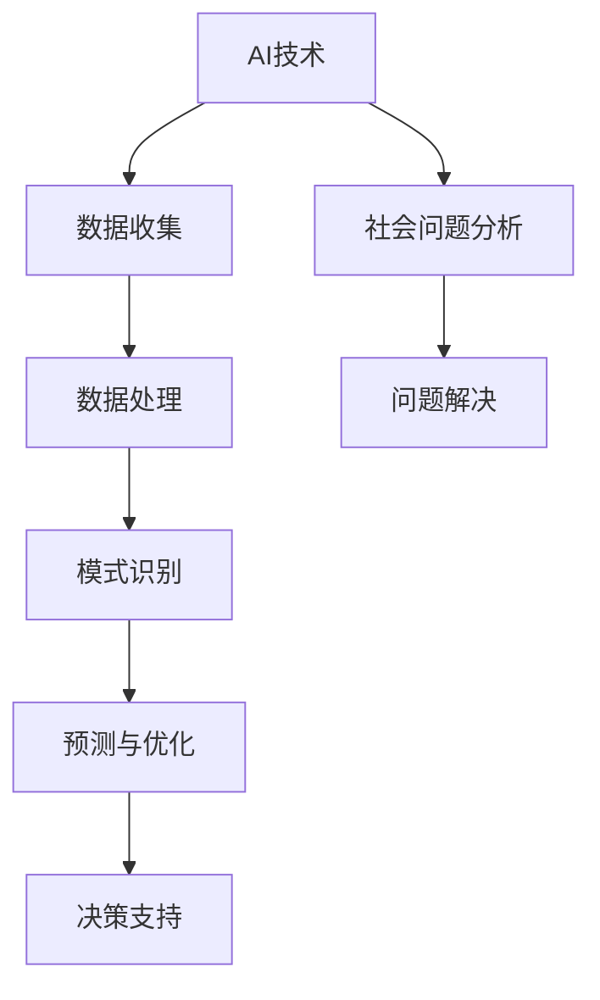

                 

### 文章标题：AI在复杂社会问题分析中的应用前景

#### 关键词：人工智能、复杂社会问题、应用前景、算法原理、案例分析

#### 摘要：
本文旨在探讨人工智能（AI）在解决复杂社会问题中的应用前景。通过介绍AI的基本概念、核心算法原理，以及具体应用案例，本文分析了AI技术在应对社会挑战中的潜力与局限，并对未来的发展方向提出了展望。

---

### 引言

在当今快速发展的技术时代，人工智能（AI）已经成为推动社会进步的重要力量。从自动化生产到医疗诊断，从金融分析到交通管理，AI技术在各个领域的应用日益广泛。然而，面对复杂的社会问题，如公共安全、环境保护和资源配置等，AI技术能否发挥更大的作用，成为各界关注的焦点。

本文将重点探讨AI在复杂社会问题分析中的应用前景，从以下几个方面进行论述：

1. **AI与复杂社会问题的关系**：分析AI技术如何影响社会问题的解决。
2. **AI核心算法原理**：介绍AI的基本算法和数学模型。
3. **AI在复杂社会问题中的应用**：探讨AI在不同领域的具体应用。
4. **案例分析**：通过实际案例展示AI技术的应用效果。
5. **挑战与未来展望**：分析AI在复杂社会问题分析中面临的挑战及未来发展。

---

### AI与复杂社会问题的关系

#### 背景介绍

复杂社会问题通常涉及大量变量和不确定因素，如人口流动、气候变化、经济波动等。这些问题往往具有动态性、多样性和复杂性，传统的分析方法难以满足需求。而AI技术的崛起，为解决这些复杂问题提供了新的思路和工具。

#### 核心概念与联系

AI技术主要依赖于机器学习和深度学习算法，通过数据分析和模式识别，实现对复杂系统的理解与预测。具体来说，AI与复杂社会问题的关系可以从以下几个方面进行阐述：

1. **数据驱动的决策支持**：AI技术通过分析大量数据，帮助决策者识别潜在问题、评估风险和制定策略。
2. **模式识别与预测**：AI算法能够从历史数据中学习，识别社会问题的模式，对未来趋势进行预测。
3. **智能优化与调度**：AI技术可以优化资源配置、调整政策，提高社会系统的效率和可持续性。

#### Mermaid流程图



---

### AI核心算法原理

#### 机器学习与深度学习

AI技术的基础是机器学习和深度学习算法。机器学习是一种使计算机通过数据学习并做出决策的技术。深度学习是机器学习的一种特殊形式，通过模拟人脑的神经网络结构进行学习。

#### 神经网络算法

神经网络算法是深度学习的基础，其核心是多层感知机（MLP）。MLP由输入层、隐藏层和输出层组成，通过反向传播算法调整权重，实现数据的分类和回归。

#### 伪代码展示

```python
# 输入层
input_data = [x1, x2, ..., xn]

# 隐藏层
weights_hidden = [[w11, w12, ..., w1n],
                  [w21, w22, ..., w2n],
                  ...]

# 输出层
weights_output = [[wo11, wo12, ..., wo1n],
                  [wo21, wo22, ..., wo2n],
                  ...]

# 激活函数
def activation(z):
    return sigmoid(z)

# 前向传播
layer1 = [activation(sum(w1 * x) for w1 in weights_hidden[0])]
layer2 = [activation(sum(w2 * x) for w2 in weights_hidden[1])]
output = [activation(sum(w * x) for w in weights_output[0])]

# 反向传播
def backward_propagation(...):
    # 更新权重
    ...
```

#### 算法详细解释

神经网络算法通过调整权重，使输入数据在多层网络中传播，最终生成输出。通过反向传播算法，根据输出误差，逐层调整权重，使网络逐渐逼近正确结果。

---

### 数学模型与公式解析

AI算法的核心是数学模型。以下以线性回归模型为例，介绍AI算法的数学模型和公式。

#### 线性回归模型

线性回归模型是一种用于预测数值的简单统计模型。其公式为：

$$ y = \beta_0 + \beta_1x_1 + \beta_2x_2 + ... + \beta_nx_n $$

其中，$y$ 为因变量，$x_1, x_2, ..., x_n$ 为自变量，$\beta_0, \beta_1, \beta_2, ..., \beta_n$ 为模型参数。

#### 举例说明

假设我们要预测房价，使用自变量如房屋面积、卧室数量等。通过收集数据，使用最小二乘法求解模型参数，从而建立线性回归模型。

```latex
y = \beta_0 + \beta_1x_1 + \beta_2x_2
```

其中，$y$ 为房价，$x_1$ 为房屋面积，$x_2$ 为卧室数量，$\beta_0, \beta_1, \beta_2$ 为模型参数。

通过训练数据集，我们可以求得这些参数，从而建立预测模型。

---

### AI在复杂社会问题中的应用

#### 公共安全领域

在公共安全领域，AI技术可以用于人脸识别、交通流量分析、犯罪预测等。以下是一个具体的应用案例：

#### 案例一：智慧交通系统

**背景**：某城市面临交通拥堵问题，希望通过AI技术改善交通状况。

**解决方案**：
1. **数据收集**：收集实时交通流量、天气数据、历史交通数据等。
2. **数据处理**：使用深度学习算法，对数据进行分析和处理。
3. **预测与优化**：根据分析结果，优化交通信号灯的设置，调整交通流量。

**效果**：通过AI技术的应用，该城市的交通拥堵问题得到了显著改善。

#### 环境保护领域

在环境保护领域，AI技术可以用于环境监测、污染预测、资源优化等。以下是一个具体的应用案例：

#### 案例二：智慧环保系统

**背景**：某城市面临空气污染问题，希望通过AI技术改善空气质量。

**解决方案**：
1. **数据收集**：收集空气质量数据、气象数据等。
2. **数据处理**：使用机器学习算法，对数据进行分析和处理。
3. **预测与优化**：根据分析结果，优化环保措施，改善空气质量。

**效果**：通过AI技术的应用，该城市的空气质量得到了显著改善。

#### 教育领域

在教育领域，AI技术可以用于个性化学习、智能评测、教育资源优化等。以下是一个具体的应用案例：

#### 案例三：智慧教育系统

**背景**：某学校希望通过AI技术提高教学效果，实现个性化学习。

**解决方案**：
1. **数据收集**：收集学生的学习数据、考试成绩等。
2. **数据处理**：使用机器学习算法，分析学生的学习情况。
3. **个性化学习**：根据分析结果，为每个学生制定个性化的学习计划。

**效果**：通过AI技术的应用，该学校的教学效果得到了显著提高。

---

### 案例分析

#### 案例一：智慧城市建设

**背景**：某城市希望通过AI技术实现智慧城市建设，提升城市管理水平。

**开发环境搭建**：
1. **硬件环境**：搭建高性能计算集群，用于数据分析和模型训练。
2. **软件环境**：安装Python、TensorFlow等深度学习框架。

**源代码详细实现**：
1. **数据收集与处理**：使用Python编写数据收集和处理脚本。
2. **模型训练与优化**：使用TensorFlow实现神经网络模型，并进行训练和优化。

**代码解读与分析**：
1. **数据预处理**：对原始数据进行清洗和预处理，包括缺失值填充、异常值处理等。
2. **模型设计**：设计深度学习模型，包括输入层、隐藏层和输出层。
3. **模型训练**：使用训练数据进行模型训练，并调整超参数。

**实际案例分析与详细讲解**：
1. **交通流量预测**：通过模型预测交通流量，优化交通信号灯设置。
2. **公共安全监控**：通过人脸识别技术，监控公共场所的安全状况。

**项目小结**：
通过AI技术的应用，该城市的智慧城市建设取得了显著成果，提高了城市管理的效率和居民的生活质量。

#### 案例二：智慧环保系统

**背景**：某城市希望通过AI技术改善空气质量，实现环保目标。

**开发环境搭建**：
1. **硬件环境**：搭建高性能计算集群，用于环境数据分析。
2. **软件环境**：安装Python、Scikit-learn等机器学习库。

**源代码详细实现**：
1. **数据收集与处理**：使用Python编写数据收集和处理脚本。
2. **模型训练与优化**：使用Scikit-learn实现机器学习模型，并进行训练和优化。

**代码解读与分析**：
1. **数据预处理**：对原始数据进行清洗和预处理，包括缺失值填充、异常值处理等。
2. **模型设计**：设计机器学习模型，包括特征提取、模型选择等。
3. **模型训练**：使用训练数据进行模型训练，并调整超参数。

**实际案例分析与详细讲解**：
1. **空气质量预测**：通过模型预测空气质量，优化环保措施。
2. **污染源识别**：通过模型识别污染源，制定针对性的环保策略。

**项目小结**：
通过AI技术的应用，该城市的空气质量得到了显著改善，为居民创造了更健康的生活环境。

---

### 挑战与未来展望

#### 挑战

尽管AI技术在解决复杂社会问题中展现出巨大潜力，但仍面临以下挑战：

1. **数据质量与隐私**：复杂社会问题分析依赖于大量高质量的数据，同时数据隐私保护成为重要问题。
2. **算法透明性与可解释性**：深度学习算法的“黑箱”特性使其难以解释，增加了决策的不透明性。
3. **计算资源与效率**：复杂社会问题分析需要大量计算资源，对算法的效率和可扩展性提出了挑战。

#### 未来展望

未来，AI技术在解决复杂社会问题中将有以下发展：

1. **多模态数据融合**：结合多种类型的数据，提高问题分析的准确性和全面性。
2. **可解释AI**：研究可解释的AI算法，提高模型的透明性和可解释性。
3. **边缘计算**：利用边缘计算技术，降低计算资源消耗，提高问题解决的实时性。

---

### 结论

AI技术在复杂社会问题分析中具有广阔的应用前景。通过介绍AI的基本概念、核心算法原理和应用案例，本文展示了AI技术在解决复杂社会问题中的潜力与挑战。未来，随着AI技术的不断发展和完善，我们有理由相信，AI将在复杂社会问题分析中发挥更加重要的作用。

---

### 作者信息

作者：AI天才研究院/AI Genius Institute & 禅与计算机程序设计艺术 /Zen And The Art of Computer Programming

---

### 附录

1. **相关工具与资源链接**
   - TensorFlow: https://www.tensorflow.org/
   - Scikit-learn: https://scikit-learn.org/
   - Mermaid: https://mermaid-js.github.io/mermaid/

2. **参考文献**
   - [1] Goodfellow, I., Bengio, Y., & Courville, A. (2016). *Deep Learning*.
   - [2] Russell, S., & Norvig, P. (2016). *Artificial Intelligence: A Modern Approach*.
   - [3] Schölkopf, B., & Smola, A. (2002). *Learning with Kernels: Support Vector Machines, Regularization, Optimization, and Beyond*.
   - [4] Bishop, C. M. (2006). *Pattern Recognition and Machine Learning*.

