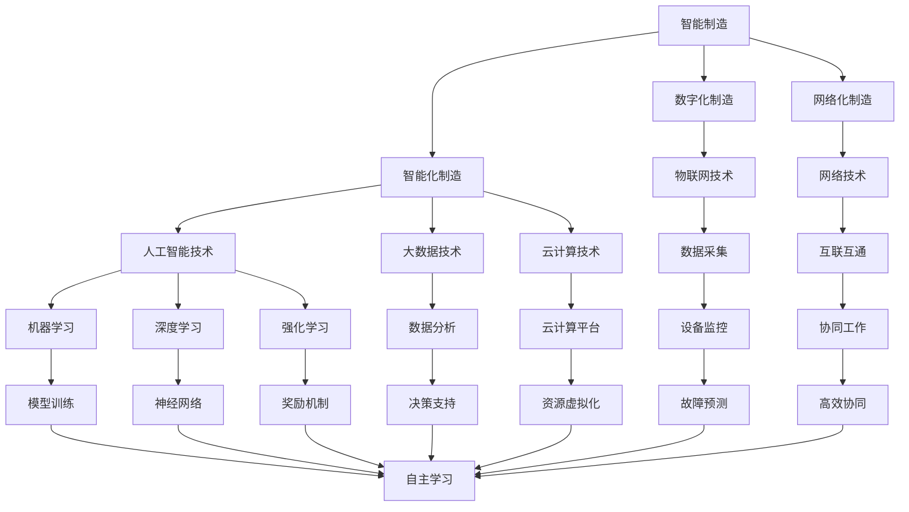

                 

### 文章标题

《AI在智能制造中的应用：预测性维护与质量控制》

### 关键词

- 智能制造
- 人工智能
- 预测性维护
- 质量控制
- 数据分析
- 深度学习

### 摘要

本文深入探讨了人工智能（AI）在智能制造领域的应用，特别是预测性维护和质量控制两个方面。首先，我们回顾了智能制造的定义与特征，以及AI在其中的重要作用。接着，我们详细介绍了预测性维护的基本概念、原理及其在智能制造中的应用。随后，文章聚焦于AI在质量控制中的应用，从核心概念到实际案例，进行全面剖析。最后，文章对智能制造与AI的融合实践进行了展望，并提出了相关实施策略和发展趋势。通过这篇文章，读者可以全面了解AI在智能制造中的应用，并掌握预测性维护与质量控制的实际操作方法。

---

### 智能制造与AI概述

#### 1.1 智能制造的定义与特征

智能制造是制造业向智能化方向发展的必然趋势。它结合了信息技术、物联网、人工智能等先进技术，通过数字化、网络化和智能化的手段，实现对制造过程的优化和升级。智能制造的主要特征包括：

1. **数字化制造**：通过数字化技术，将制造过程中的各种信息转化为数字信号，实现制造过程的数字化管理。
2. **网络化制造**：通过网络技术，实现制造过程中各个环节的互联互通，提高制造系统的协同效率。
3. **智能化制造**：通过人工智能技术，对制造过程进行智能决策和优化，提高制造系统的自适应能力和智能化水平。

#### 1.1.1 智能制造的背景与意义

智能制造的背景主要源于以下几个方面：

1. **全球制造业竞争加剧**：随着全球化的推进，制造业的竞争越来越激烈，企业需要通过技术创新来提高生产效率和产品质量，以增强竞争力。
2. **信息技术和人工智能的快速发展**：信息技术的快速发展和人工智能的崛起，为智能制造提供了技术支撑和实现路径。
3. **制造业服务化的趋势**：现代制造业正从传统的产品制造向产品与服务融合的服务制造转变，智能制造是实现这一转变的重要手段。

智能制造的意义主要体现在以下几个方面：

1. **提高生产效率**：通过数字化、网络化和智能化的手段，可以显著提高生产效率和降低生产成本。
2. **提高产品质量**：通过智能化技术，可以对生产过程进行实时监控和优化，提高产品质量和一致性。
3. **增强企业竞争力**：智能制造可以提高企业的生产效率和质量，从而增强企业的市场竞争力。

#### 1.1.2 智能制造的主要特征

智能制造的主要特征包括：

1. **自组织性**：智能制造系统能够根据外部环境和内部条件的变化，自主调整和优化制造过程。
2. **自适应性**：智能制造系统能够根据不同的生产任务和环境变化，自适应地调整生产计划和流程。
3. **协同性**：智能制造系统能够实现各个环节的协同工作，提高制造系统的整体效率和灵活性。
4. **透明性**：智能制造系统能够实现对制造过程的实时监控和透明化管理，提高管理的效率和准确性。

#### 1.1.3 智能制造的核心技术

智能制造的核心技术包括：

1. **物联网技术**：物联网技术是实现智能制造的基础，通过传感器、云计算和大数据等技术，实现对制造设备的实时监控和管理。
2. **人工智能技术**：人工智能技术是实现智能制造的智能决策和优化的关键，包括机器学习、深度学习、强化学习等技术。
3. **大数据技术**：大数据技术是实现智能制造的数据分析和处理的基础，通过大数据技术，可以对制造过程中的各种数据进行挖掘和分析，为智能制造提供数据支撑。
4. **云计算技术**：云计算技术是实现智能制造的云计算平台和基础设施，通过云计算技术，可以实现制造资源的虚拟化和弹性扩展。

#### 1.2 人工智能在智能制造中的应用

人工智能在智能制造中的应用非常广泛，主要包括以下几个方面：

1. **生产过程优化**：通过人工智能技术，可以对生产过程进行实时监控和优化，提高生产效率和产品质量。
2. **设备预测性维护**：通过人工智能技术，可以对设备进行预测性维护，减少设备故障率和停机时间，提高设备利用率。
3. **质量控制**：通过人工智能技术，可以对产品质量进行实时监控和分析，提高产品质量和一致性。
4. **供应链管理**：通过人工智能技术，可以实现对供应链的实时监控和优化，提高供应链的响应速度和灵活性。
5. **决策支持**：通过人工智能技术，可以为企业决策提供数据分析和预测支持，提高决策的准确性和效率。

#### 1.2.1 AI在智能制造中的作用

AI在智能制造中的作用主要体现在以下几个方面：

1. **提高生产效率**：通过人工智能技术，可以实现对生产过程的实时监控和优化，提高生产效率。
2. **提高产品质量**：通过人工智能技术，可以实现对产品质量的实时监控和分析，提高产品质量和一致性。
3. **减少设备故障**：通过人工智能技术，可以实现对设备的预测性维护，减少设备故障率和停机时间。
4. **优化供应链管理**：通过人工智能技术，可以实现对供应链的实时监控和优化，提高供应链的响应速度和灵活性。
5. **降低生产成本**：通过人工智能技术，可以降低生产过程中的浪费，提高资源利用率，从而降低生产成本。

#### 1.2.2 AI技术在智能制造中的应用场景

AI技术在智能制造中的应用场景非常广泛，主要包括以下几个方面：

1. **生产过程监控**：通过人工智能技术，可以对生产过程进行实时监控，及时发现并处理异常情况，提高生产过程的稳定性和效率。
2. **设备预测性维护**：通过人工智能技术，可以对设备进行预测性维护，提前发现设备故障，减少设备停机时间和维修成本。
3. **质量检测与控制**：通过人工智能技术，可以实现对产品质量的实时监控和分析，及时发现质量问题，提高产品质量和一致性。
4. **供应链优化**：通过人工智能技术，可以实现对供应链的实时监控和优化，提高供应链的响应速度和灵活性，降低供应链成本。
5. **生产计划与调度**：通过人工智能技术，可以实现对生产计划的实时调整和优化，提高生产效率和降低库存成本。

#### 1.2.3 AI与智能制造的融合发展趋势

随着人工智能技术的不断发展，AI与智能制造的融合趋势也越来越明显，主要体现在以下几个方面：

1. **智能制造平台化**：通过构建智能制造平台，将人工智能技术与其他先进技术进行融合，实现智能制造的协同和智能化。
2. **智能制造数据化**：通过大数据技术，对智能制造过程中的数据进行全面采集和分析，为智能制造提供数据支撑。
3. **智能制造个性化**：通过人工智能技术，可以实现对生产过程的个性化调整和优化，提高产品的定制化和灵活性。
4. **智能制造绿色化**：通过人工智能技术，可以实现对制造过程的绿色化优化，降低能源消耗和环境污染。
5. **智能制造全球化**：通过互联网和物联网技术，可以实现智能制造的全球化布局和协同，提高企业的全球竞争力。

### 1.3 人工智能的核心技术与算法基础

在智能制造中，人工智能技术的核心作用体现在以下几个方面：

1. **数据分析与处理**：通过对海量制造数据的采集、存储、处理和分析，为智能制造提供数据支撑。
2. **预测与优化**：利用人工智能技术，可以实现对制造过程的预测和优化，提高生产效率和产品质量。
3. **决策支持**：通过人工智能技术，可以为企业决策提供数据分析和预测支持，提高决策的准确性和效率。

要实现这些功能，需要掌握以下核心人工智能技术和算法：

1. **机器学习**：机器学习是人工智能的基础，通过训练模型，可以使计算机具有自主学习和预测能力。
2. **深度学习**：深度学习是机器学习的延伸，通过构建多层神经网络，可以实现对复杂问题的建模和预测。
3. **强化学习**：强化学习是一种基于奖励机制的学习方法，通过不断尝试和反馈，使计算机能够在复杂环境中做出最优决策。

在接下来的章节中，我们将深入探讨这些技术和算法在智能制造中的应用，并通过具体案例进行分析和讲解。通过了解这些技术，读者将能够更好地理解AI在智能制造中的核心作用，并掌握相关的应用方法。

---

**核心概念与联系**

为了更好地理解智能制造与AI的核心概念及其关系，我们可以通过一个Mermaid流程图来展示各概念之间的联系。



通过这个流程图，我们可以清晰地看到智能制造与AI的核心概念及其相互关系。数字化制造、网络化制造和智能化制造是智能制造的三大特征，而物联网技术、网络技术、人工智能技术、大数据技术和云计算技术则是实现这些特征的关键技术。在这些技术中，机器学习、深度学习和强化学习是核心算法，它们通过数据采集、数据分析、模型训练、设备监控、协同工作等过程，实现对智能制造过程的预测、优化和决策支持。

---

### AI核心技术与算法基础

#### 2.1 机器学习基础

机器学习是人工智能的核心技术之一，它使计算机系统能够从数据中学习和提取知识，从而实现对未知数据的预测和决策。机器学习的基本概念包括以下几个主要方面：

1. **数据集**：数据集是机器学习的训练素材，由一系列数据样本组成。每个数据样本通常包括多个特征值，用于描述样本的各种属性。
   
2. **特征**：特征是数据集中的基本描述变量，用于表示样本的不同属性。例如，在图像识别任务中，像素值可以被视为特征。

3. **模型**：模型是机器学习算法的核心，它是一个数学函数，用于将输入特征映射到输出结果。模型的性能取决于其参数设置和训练过程。

4. **训练**：训练是机器学习的关键步骤，通过调整模型参数，使其在训练数据集上达到最优性能。训练过程通常包括数据预处理、模型初始化、参数优化和性能评估等环节。

5. **验证与测试**：验证和测试用于评估模型的泛化能力，即在未知数据上的表现。通常，训练数据集分为训练集和验证集，训练集用于模型训练，验证集用于参数调整和性能评估。

#### 2.1.1 监督学习算法

监督学习是最常见的机器学习类型，其核心思想是根据已知的输入和输出数据来训练模型，从而预测未知输入的输出。

1. **线性回归**：
   线性回归是一种简单的监督学习算法，用于建立输入特征和输出变量之间的线性关系。其基本公式为：
   $$ y = \beta_0 + \beta_1 \cdot x $$
   其中，$y$ 是输出变量，$x$ 是输入特征，$\beta_0$ 和 $\beta_1$ 是模型参数。

2. **逻辑回归**：
   逻辑回归是一种用于分类任务的监督学习算法，通过建立输入特征和输出概率之间的关系。其基本公式为：
   $$ P(y=1) = \frac{1}{1 + e^{-(\beta_0 + \beta_1 \cdot x)}} $$
   其中，$P(y=1)$ 是输出为1的概率，$e$ 是自然对数的底数。

3. **支持向量机（SVM）**：
   支持向量机是一种用于分类和回归任务的强大算法，其基本思想是找到一个最佳的超平面，将不同类别的数据点分隔开来。其核心公式为：
   $$ w \cdot x - b = 0 $$
   其中，$w$ 是超平面的法向量，$x$ 是数据点，$b$ 是偏置项。

#### 2.1.2 无监督学习算法

无监督学习算法主要用于处理没有标签的数据，其核心目标是揭示数据中的潜在结构和模式。

1. **聚类算法**：
   聚类算法是一种无监督学习方法，用于将数据点划分为若干个类别，使得同一类别内的数据点彼此相似，不同类别内的数据点彼此不同。常见的聚类算法包括：
   - **K-均值聚类**：
     K-均值聚类是一种基于距离度量的聚类算法，其目标是找到K个中心点，使得每个数据点到最近的中心点的距离最小。其算法步骤如下：
     1. 随机初始化K个中心点。
     2. 对于每个数据点，计算其到各个中心点的距离，并将其分配到最近的中心点所在的类别。
     3. 更新每个类别的中心点，计算所有数据点的平均值。
     4. 重复步骤2和3，直到中心点的变化小于某个阈值。

   - **层次聚类**：
     层次聚类是一种自下而上或自上而下的聚类方法，其核心思想是通过递归地将数据点合并或拆分，构建出一个层次结构的聚类结果。

2. **降维算法**：
   降维算法用于减少数据维度，同时保持数据的重要信息。常见的降维算法包括：
   - **主成分分析（PCA）**：
     主成分分析是一种常用的降维方法，其核心思想是通过正交变换将原始数据投影到新的坐标系中，从而提取出最重要的几个主成分。
   - **t-SNE**：
     t-SNE（t-distributed Stochastic Neighbor Embedding）是一种用于高维数据可视化的降维方法，其核心思想是通过保持局部结构来投影数据点。

#### 2.2 深度学习基础

深度学习是机器学习的延伸，通过构建多层神经网络，实现对复杂问题的建模和预测。

1. **神经网络架构**：
   神经网络由多个神经元（或节点）组成，每个神经元都与相邻的神经元相连。神经网络的架构通常包括输入层、隐藏层和输出层。
   
   - **输入层**：接收外部输入数据。
   - **隐藏层**：对输入数据进行处理和变换。
   - **输出层**：生成最终输出结果。

2. **激活函数**：
   激活函数是神经网络的核心组件，用于引入非线性变换。常见的激活函数包括：
   - **Sigmoid函数**：
     $$ \sigma(x) = \frac{1}{1 + e^{-x}} $$
   - **ReLU函数**：
     $$ \text{ReLU}(x) = \max(0, x) $$
   - **Tanh函数**：
     $$ \text{Tanh}(x) = \frac{e^{x} - e^{-x}}{e^{x} + e^{-x}} $$

3. **损失函数**：
   损失函数用于衡量模型预测结果与实际结果之间的差距，常见的损失函数包括：
   - **均方误差（MSE）**：
     $$ \text{MSE}(y, \hat{y}) = \frac{1}{n} \sum_{i=1}^{n} (y_i - \hat{y}_i)^2 $$
   - **交叉熵（Cross-Entropy）**：
     $$ \text{CE}(y, \hat{y}) = - \sum_{i=1}^{n} y_i \cdot \log(\hat{y}_i) $$

4. **反向传播算法**：
   反向传播算法是训练深度学习模型的核心算法，其基本步骤如下：
   - 前向传播：将输入数据通过神经网络进行前向传播，生成输出结果。
   - 计算损失：计算输出结果与实际结果之间的损失。
   - 反向传播：将损失反向传播，更新神经网络的权重和偏置。
   - 更新参数：根据梯度下降或其他优化算法，更新模型参数。

#### 2.2.1 深度学习优化算法

深度学习优化算法用于优化神经网络模型的参数，以提高模型性能。常见的优化算法包括：

1. **梯度下降（Gradient Descent）**：
   梯度下降是一种基本的优化算法，其核心思想是通过计算损失函数的梯度，不断更新模型参数，以最小化损失函数。
   
   - **批量梯度下降**：
     $$ w_{\text{new}} = w_{\text{old}} - \alpha \cdot \nabla_w J(w) $$
     其中，$w$ 是模型参数，$\alpha$ 是学习率，$J(w)$ 是损失函数。
   
   - **随机梯度下降（SGD）**：
     $$ w_{\text{new}} = w_{\text{old}} - \alpha \cdot \nabla_w J(w; x_i, y_i) $$
     其中，$x_i$ 和 $y_i$ 是单个训练样本。

2. **动量（Momentum）**：
   动量是一种改进的梯度下降算法，通过引入动量项，加速模型收敛。
   $$ w_{\text{new}} = w_{\text{old}} - \alpha \cdot \nabla_w J(w) + \beta \cdot v $$
   其中，$v$ 是动量项，$\beta$ 是动量系数。

3. **Adam优化器**：
   Adam优化器是一种自适应的梯度下降算法，通过结合一阶矩估计和二阶矩估计，提高模型收敛速度。
   $$ m_t = \beta_1 \cdot m_{t-1} + (1 - \beta_1) \cdot \nabla_w J(w) $$
   $$ v_t = \beta_2 \cdot v_{t-1} + (1 - \beta_2) \cdot (\nabla_w J(w))^2 $$
   $$ w_{\text{new}} = w_{\text{old}} - \alpha \cdot \frac{m_t}{\sqrt{v_t} + \epsilon} $$
   其中，$m_t$ 和 $v_t$ 分别是第 $t$ 次迭代的一阶矩估计和二阶矩估计，$\epsilon$ 是正则项。

#### 2.3 强化学习基础

强化学习是一种通过试错和反馈机制进行学习的人工智能方法，其核心思想是智能体通过不断与环境交互，学习最优策略。

1. **基本概念**：
   - **智能体**：执行任务的主体，如机器人、自动驾驶汽车等。
   - **环境**：智能体所处的环境，包括各种状态和奖励。
   - **状态**：智能体在环境中所处的情景。
   - **行动**：智能体可以采取的操作。
   - **奖励**：智能体采取行动后获得的奖励，用于指导智能体的学习。

2. **强化学习算法**：
   - **Q-Learning**：
     Q-Learning是一种值函数算法，通过学习状态-行动值函数，预测最优行动。其基本公式为：
     $$ Q(s, a) = \sum_{s'} P(s' | s, a) \cdot [R(s', a) + \gamma \cdot \max_{a'} Q(s', a')] $$
     其中，$s$ 是当前状态，$a$ 是当前行动，$s'$ 是下一状态，$R(s', a)$ 是奖励值，$\gamma$ 是折扣因子。

   - **Policy Gradient**：
     Policy Gradient直接优化策略函数，其基本公式为：
     $$ \nabla_{\pi} J(\pi) = \sum_{s, a} \pi(a | s) \cdot \nabla_a J(s, a) $$
     其中，$\pi(a | s)$ 是策略函数，$J(\pi)$ 是策略期望收益。

   - **深度确定性策略梯度（DDPG）**：
     DDPG结合深度学习和强化学习，通过深度神经网络近似状态-行动值函数和策略函数，其基本公式为：
     $$ Q(s, \mu(s)) = \sum_{s'} P(s' | s, \mu(s)) \cdot [R(s') + \gamma \cdot Q(s', \mu(s'))] $$
     $$ \pi(a | s) = \mu(s) + \theta \cdot \nabla_s \mu(s) $$
     其中，$\mu(s)$ 是策略函数，$\theta$ 是策略参数。

通过了解这些核心技术和算法，我们可以更好地理解人工智能在智能制造中的应用。在接下来的章节中，我们将进一步探讨AI在预测性维护和质量控制中的应用，并通过具体案例进行分析和讲解。

---

**核心算法原理讲解**

在深入探讨AI在智能制造中的应用之前，我们先详细讲解一些核心算法的原理，这些算法在预测性维护和质量控制中起着至关重要的作用。

#### 2.1.1 机器学习算法

机器学习算法是实现AI预测和优化功能的基础。以下是一些在智能制造中常用的机器学习算法及其原理：

**1. 线性回归**

线性回归是一种简单的监督学习算法，用于建立输入特征和输出变量之间的线性关系。其基本公式为：

$$ y = \beta_0 + \beta_1 \cdot x $$

其中，$y$ 是输出变量，$x$ 是输入特征，$\beta_0$ 和 $\beta_1$ 是模型参数。

**伪代码：**

```python
# 输入特征矩阵 X 和输出变量 y
X, y = ...

# 梯度下降算法优化参数
for i in range(max_iterations):
    # 计算损失函数
    loss = 0
    for x, y_i in zip(X, y):
        prediction = beta_0 + beta_1 * x
        loss += (y_i - prediction)^2
    
    # 计算梯度
    beta_0_gradient = ...
    beta_1_gradient = ...
    
    # 更新参数
    beta_0 = beta_0 - learning_rate * beta_0_gradient
    beta_1 = beta_1 - learning_rate * beta_1_gradient
```

**2. 逻辑回归**

逻辑回归是一种用于分类任务的监督学习算法，通过建立输入特征和输出概率之间的关系。其基本公式为：

$$ P(y=1) = \frac{1}{1 + e^{-(\beta_0 + \beta_1 \cdot x)}} $$

**伪代码：**

```python
# 输入特征矩阵 X 和输出变量 y
X, y = ...

# 梯度下降算法优化参数
for i in range(max_iterations):
    # 计算损失函数
    loss = 0
    for x, y_i in zip(X, y):
        prediction = 1 / (1 + exp(-beta_0 - beta_1 * x))
        loss += -y_i * log(prediction) - (1 - y_i) * log(1 - prediction)
    
    # 计算梯度
    beta_0_gradient = ...
    beta_1_gradient = ...
    
    # 更新参数
    beta_0 = beta_0 - learning_rate * beta_0_gradient
    beta_1 = beta_1 - learning_rate * beta_1_gradient
```

**3. 支持向量机（SVM）**

支持向量机是一种用于分类和回归任务的强大算法，其核心思想是找到一个最佳的超平面，将不同类别的数据点分隔开来。其核心公式为：

$$ w \cdot x - b = 0 $$

其中，$w$ 是超平面的法向量，$x$ 是数据点，$b$ 是偏置项。

**伪代码：**

```python
# 输入特征矩阵 X 和标签 y
X, y = ...

# SMO算法求解最优超平面
w, b = SMO(X, y)

# 预测新数据点
def predict(x):
    return sign(w \cdot x + b)
```

**4. 决策树**

决策树是一种基于树形结构的分类和回归算法，通过一系列条件判断，将数据划分为不同的类别或数值。其基本公式为：

$$ f(x) = \sum_{i=1}^{n} \alpha_i \cdot h_i(x) $$

其中，$h_i(x)$ 是第 $i$ 个条件分支的函数，$\alpha_i$ 是条件权重。

**伪代码：**

```python
# 输入特征矩阵 X 和标签 y
X, y = ...

# ID3算法构建决策树
tree = ID3(X, y)

# 预测新数据点
def predict(x, tree):
    if tree.is_leaf():
        return tree.label
    else:
        feature_index = tree.split_feature
        value = x[feature_index]
        next_tree = tree.children[value]
        return predict(x, next_tree)
```

**5. 随机森林**

随机森林是一种基于决策树的集成学习方法，通过构建多个决策树，并投票决定最终结果。其基本公式为：

$$ f(x) = \sum_{i=1}^{m} \hat{f}_i(x) $$

其中，$\hat{f}_i(x)$ 是第 $i$ 个决策树的结果。

**伪代码：**

```python
# 输入特征矩阵 X 和标签 y
X, y = ...

# 构建随机森林
forest = RandomForest(n_estimators, max_depth, ...)

# 预测新数据点
def predict(x, forest):
    predictions = []
    for tree in forest.trees:
        prediction = predict(x, tree)
        predictions.append(prediction)
    return majority_vote(predictions)
```

通过以上伪代码，我们可以对机器学习算法的基本原理和实现方法有更深入的理解。这些算法在预测性维护和质量控制中具有广泛的应用，可以帮助企业实现高效的设备管理和质量控制。

---

**数学模型和公式 & 详细讲解 & 举例说明**

为了更好地理解AI在智能制造中的应用，我们需要深入探讨一些关键的数学模型和公式，并对其进行详细讲解和举例说明。以下是几个在智能制造中广泛使用的数学模型：

#### 1. 线性回归模型

线性回归模型是预测性维护和质量控制中最常用的算法之一，它通过建立输入变量和输出变量之间的线性关系来预测结果。其基本公式如下：

$$ y = \beta_0 + \beta_1 \cdot x + \epsilon $$

其中，$y$ 是输出变量（如设备故障时间），$x$ 是输入变量（如设备运行时间），$\beta_0$ 和 $\beta_1$ 是模型参数，$\epsilon$ 是误差项。

**详细讲解：**

线性回归模型的目的是找到最佳拟合直线，使得输出变量和输入变量之间的差距最小。这个过程通常通过最小二乘法来实现。最小二乘法的核心思想是找到一组参数，使得所有样本点到拟合直线的垂直距离之和最小。

**举例说明：**

假设我们有一组设备运行时间和对应的故障时间数据，如下所示：

| 运行时间 (小时) | 故障时间 (小时) |
|:--------------:|:--------------:|
| 1000           | 50             |
| 1500           | 75             |
| 2000           | 100            |

要建立线性回归模型，我们需要计算模型参数 $\beta_0$ 和 $\beta_1$。根据最小二乘法，我们有以下公式：

$$ \beta_1 = \frac{\sum(x_i - \bar{x})(y_i - \bar{y})}{\sum(x_i - \bar{x})^2} $$
$$ \beta_0 = \bar{y} - \beta_1 \cdot \bar{x} $$

其中，$\bar{x}$ 和 $\bar{y}$ 分别是输入变量和输出变量的平均值。

计算得：

$$ \bar{x} = \frac{1000 + 1500 + 2000}{3} = 1500 $$
$$ \bar{y} = \frac{50 + 75 + 100}{3} = 75 $$

$$ \beta_1 = \frac{(1000-1500)(50-75) + (1500-1500)(75-75) + (2000-1500)(100-75)}{(1000-1500)^2 + (1500-1500)^2 + (2000-1500)^2} $$
$$ \beta_1 = \frac{-500 + 0 + 500}{500 + 0 + 500} $$
$$ \beta_1 = 0.5 $$

$$ \beta_0 = 75 - 0.5 \cdot 1500 $$
$$ \beta_0 = -375 $$

因此，线性回归模型为：

$$ y = -375 + 0.5 \cdot x $$

#### 2. 逻辑回归模型

逻辑回归模型是用于分类任务的一种算法，它通过建立输入变量和输出概率之间的关系来预测类别。其基本公式如下：

$$ P(y=1) = \frac{1}{1 + e^{-(\beta_0 + \beta_1 \cdot x)}} $$

其中，$y$ 是输出变量（如设备是否故障，0或1），$x$ 是输入变量（如设备运行时间），$\beta_0$ 和 $\beta_1$ 是模型参数。

**详细讲解：**

逻辑回归模型通过最大化似然估计来求解参数。似然函数是概率密度函数在给定观测值的乘积。通过求解似然函数的最大值，我们可以得到模型参数的最优解。

**举例说明：**

假设我们有以下数据：

| 运行时间 (小时) | 故障 (0或1) |
|:--------------:|:-----------:|
| 1000           | 0           |
| 1500           | 0           |
| 2000           | 1           |

要建立逻辑回归模型，我们需要计算模型参数 $\beta_0$ 和 $\beta_1$。似然函数为：

$$ L(\beta_0, \beta_1) = \prod_{i=1}^{n} \left[ \frac{1}{1 + e^{-(\beta_0 + \beta_1 \cdot x_i)}} \right]^{y_i} \left[ 1 - \frac{1}{1 + e^{-(\beta_0 + \beta_1 \cdot x_i)}} \right]^{1 - y_i} $$

为了求解模型参数，我们可以使用梯度下降法。具体步骤如下：

1. 初始化模型参数 $\beta_0$ 和 $\beta_1$。
2. 计算损失函数，如对数似然损失函数：
   $$ J(\beta_0, \beta_1) = - \sum_{i=1}^{n} \left[ y_i \cdot \log\left( \frac{1}{1 + e^{-(\beta_0 + \beta_1 \cdot x_i)}} \right) + (1 - y_i) \cdot \log\left( 1 - \frac{1}{1 + e^{-(\beta_0 + \beta_1 \cdot x_i)}} \right) \right] $$
3. 计算损失函数关于参数的梯度，并更新参数：
   $$ \beta_0_{\text{new}} = \beta_0_{\text{old}} - \alpha \cdot \frac{\partial J}{\partial \beta_0} $$
   $$ \beta_1_{\text{new}} = \beta_1_{\text{old}} - \alpha \cdot \frac{\partial J}{\partial \beta_1} $$

其中，$\alpha$ 是学习率。

通过多次迭代，我们可以逐步优化模型参数，使其收敛到最优值。

#### 3. 支持向量机（SVM）模型

支持向量机是一种用于分类和回归任务的强大算法，它通过找到一个最佳的超平面来分隔不同类别的数据。其基本公式如下：

$$ w \cdot x - b = 0 $$

其中，$w$ 是超平面的法向量，$x$ 是数据点，$b$ 是偏置项。

**详细讲解：**

支持向量机的基本思想是找到一组参数 $w$ 和 $b$，使得超平面能够最大化地分隔开不同类别的数据点。这个过程可以通过求解最优化问题来实现：

$$ \min_{w, b} \frac{1}{2} ||w||^2 $$
$$ s.t. y_i (w \cdot x_i + b) \geq 1 $$

其中，$y_i$ 是第 $i$ 个数据点的标签。

通过求解这个最优化问题，我们可以得到最优超平面和对应的参数。对于线性可分的数据集，可以使用硬间隔分类器；对于非线性可分的数据集，可以使用软间隔分类器，如SVM。

**举例说明：**

假设我们有以下数据集：

| 数据点   | 类别 |
|:--------:|:----:|
| (-1, -1) | 0    |
| (1, 1)   | 1    |
| (1, -1)  | 0    |
| (-1, 1)  | 1    |

要使用SVM分类，我们需要找到最优超平面。首先，我们将数据点转换为向量形式：

$$ X = \begin{bmatrix} -1 & -1 \\ 1 & 1 \\ 1 & -1 \\ -1 & 1 \end{bmatrix} $$
$$ y = \begin{bmatrix} 0 \\ 1 \\ 0 \\ 1 \end{bmatrix} $$

然后，我们求解最优化问题：

$$ \min_{w, b} \frac{1}{2} ||w||^2 $$
$$ s.t. y_i (w \cdot x_i + b) \geq 1 $$

通过求解，我们得到：

$$ w = \begin{bmatrix} 1 \\ 1 \end{bmatrix} $$
$$ b = 0 $$

因此，最优超平面为：

$$ x + y = 0 $$

通过这些数学模型和公式的讲解，我们可以更深入地理解AI在智能制造中的应用原理。在实际应用中，这些模型可以通过编程实现，为预测性维护和质量控制提供强大的技术支持。

---

### 预测性维护概述

#### 3.1 预测性维护的定义与原理

预测性维护是一种基于数据分析和机器学习技术的设备维护策略，旨在通过实时监控和预测设备状态，提前发现潜在故障，从而减少设备停机时间和维修成本。预测性维护的核心原理主要包括数据采集、特征提取、模型训练和故障预测。

**定义：**

预测性维护（Predictive Maintenance）是一种智能维护策略，它利用传感器和数据采集技术，实时监测设备的运行状态，通过机器学习算法和数据分析技术，预测设备的故障时间，从而实现提前维护。

**原理：**

1. **数据采集**：通过安装在设备上的传感器，实时采集设备运行过程中的各种数据，如温度、压力、振动等。这些数据是预测性维护的基础。

2. **特征提取**：对采集到的数据进行分析和处理，提取出与设备故障相关的关键特征。这些特征反映了设备的健康状况，是建立预测模型的关键。

3. **模型训练**：利用历史故障数据和特征，通过机器学习算法训练预测模型。训练模型的过程是学习设备故障的规律和模式，从而能够对未来的故障进行预测。

4. **故障预测**：将实时采集到的数据输入训练好的预测模型，预测设备的故障时间。通过预测结果，可以提前安排维护计划，避免设备突发故障。

#### 3.1.1 预测性维护的基本原理

预测性维护的基本原理可以分为以下几个步骤：

1. **实时数据采集**：通过传感器和其他数据采集设备，实时监测设备的运行状态，包括温度、压力、振动、电流等参数。

2. **数据预处理**：对采集到的原始数据进行清洗和预处理，包括去噪、归一化、缺失值填补等，以确保数据的质量和一致性。

3. **特征选择和提取**：从预处理后的数据中提取与设备故障相关的特征。这些特征可以反映设备的健康状态，如振动信号的频谱特征、温度变化的趋势等。

4. **模型训练**：使用历史故障数据作为训练集，通过机器学习算法（如支持向量机、神经网络等）训练预测模型。模型训练的过程是学习设备故障的规律和模式。

5. **故障预测**：将实时采集到的数据输入训练好的预测模型，进行故障预测。预测模型会输出设备的故障概率或故障时间，帮助维护人员提前制定维护计划。

6. **维护决策**：根据预测结果，维护人员可以决定是否进行预防性维护。如果预测到设备可能会在短时间内发生故障，可以提前安排维护，避免设备停机造成损失。

#### 3.1.2 预测性维护的关键技术

预测性维护的关键技术包括以下几个方面：

1. **传感器技术**：传感器是预测性维护的基础，用于实时监测设备的运行状态。先进的传感器技术可以提供高精度、实时的数据，为故障预测提供可靠的数据支持。

2. **数据分析技术**：数据分析技术包括数据预处理、特征提取和模型训练等。通过有效的数据分析技术，可以提取出与设备故障相关的关键特征，为故障预测提供有力支持。

3. **机器学习算法**：机器学习算法是预测性维护的核心，通过训练模型，可以使计算机系统具有预测设备故障的能力。常见的机器学习算法包括支持向量机、神经网络、决策树等。

4. **云计算与大数据技术**：云计算和大数据技术可以提供强大的计算能力和数据存储能力，支持大规模数据的处理和分析。这些技术使得预测性维护可以在海量数据上进行，提高预测的准确性和效率。

5. **智能决策支持系统**：智能决策支持系统可以结合预测结果和业务规则，为维护人员提供决策支持。通过智能决策支持系统，可以优化维护流程，提高维护效率和降低成本。

#### 3.1.3 预测性维护的应用场景

预测性维护在智能制造中有着广泛的应用场景，主要包括以下几个方面：

1. **设备故障预测**：通过实时监测设备运行状态，预测设备的故障时间，提前安排维护，减少设备停机时间。

2. **生产计划优化**：根据设备的健康状态和故障预测结果，优化生产计划，避免因设备故障导致的停机。

3. **供应链管理**：预测设备的故障时间，可以提前安排零部件的采购和库存，优化供应链管理。

4. **质量管理**：通过监测生产过程中的关键参数，预测产品质量问题，提前采取措施，提高产品质量。

5. **设备优化**：通过故障预测，可以发现设备设计或运行中的问题，为设备优化提供依据。

通过以上对预测性维护的定义、原理和关键技术的介绍，我们可以看到预测性维护在智能制造中的重要性。在接下来的章节中，我们将深入探讨预测性维护的具体应用，并通过实际案例进行分析和讲解。

---

### 数据采集与处理

#### 3.2 数据采集与处理

数据采集与处理是预测性维护的关键环节，它决定了预测模型的质量和准确性。以下是数据采集与处理的主要步骤：

#### 3.2.1 设备数据采集方法

1. **传感器选择**：
   选择适合设备运行状态的传感器，如温度传感器、振动传感器、压力传感器等。传感器的精度和灵敏度直接影响数据的准确性。

2. **数据采集设备**：
   通过数据采集模块（如PLC、DCS、SCADA系统等）将传感器采集的数据传输到中央处理单元。数据采集设备应具备高采样率、低延迟和稳定性。

3. **数据传输**：
   采用有线或无线方式将数据传输到中央处理单元。有线传输如以太网、串口通信等，无线传输如无线传感器网络（WSN）、5G等。

4. **数据预处理**：
   在数据传输过程中，可能存在噪声、异常值和缺失值。因此，在数据到达中央处理单元之前，需要进行预处理，包括滤波、去噪、缺失值填补等。

#### 3.2.2 数据预处理技术

1. **滤波**：
   常见的滤波技术包括移动平均滤波、卡尔曼滤波、小波滤波等。滤波的目的是去除数据中的噪声，保留有用的信号。

2. **去噪**：
   通过统计分析方法，如主成分分析（PCA）、独立成分分析（ICA）等，可以去除数据中的噪声成分，提高数据质量。

3. **缺失值填补**：
   当数据存在缺失值时，可以通过插值、均值填补、中值填补等方法进行填补，以确保数据完整性。

4. **数据归一化**：
   将不同特征的数据进行归一化处理，使其具有相同的量纲和范围，以便于模型训练和比较。

#### 3.2.3 数据可视化与分析

1. **数据可视化**：
   通过数据可视化工具（如Matplotlib、Plotly等），将处理后的数据以图表形式展示，便于分析数据趋势和异常值。

2. **数据挖掘**：
   利用数据挖掘技术，如关联规则学习、聚类分析、分类分析等，可以挖掘数据中的潜在信息和规律。

3. **特征选择**：
   通过特征选择技术，如信息增益、互信息、主成分分析（PCA）等，选择对故障预测最有用的特征。

4. **模型训练**：
   使用处理后的数据，通过机器学习算法（如线性回归、支持向量机、神经网络等）训练预测模型。

#### 3.2.4 实时数据处理

1. **实时数据流处理**：
   使用实时数据流处理技术（如Apache Kafka、Apache Flink等），对实时数据进行处理和分析，以确保数据处理的及时性和准确性。

2. **在线学习**：
   通过在线学习技术，模型可以随着新数据的不断加入进行更新和优化，提高预测的准确性和实时性。

3. **异常检测**：
   利用异常检测算法（如孤立森林、自编码器等），实时监测数据流中的异常值，及时发现设备异常。

#### 3.2.5 数据质量评估

1. **数据质量指标**：
   定义数据质量指标，如数据完整性、准确性、一致性、时效性等，用于评估数据质量。

2. **数据质量监控**：
   通过数据质量监控工具（如DataQualityStudio等），实时监控数据质量，及时发现和处理数据问题。

3. **数据质量改进**：
   根据数据质量评估结果，采取相应的改进措施，如优化数据采集设备、改进数据预处理方法等，以提高数据质量。

通过以上数据采集与处理技术，我们可以确保预测性维护的数据基础，从而提高故障预测的准确性和可靠性。

---

### 预测性维护算法

预测性维护的核心在于利用机器学习算法对设备数据进行分析，提前预测设备的故障。以下是几种常用的预测性维护算法及其原理和应用场景。

#### 4.1.1 机器学习算法在预测性维护中的应用

**1. 线性回归**

线性回归是一种简单的预测模型，通过建立输入特征和输出变量之间的线性关系来预测结果。其公式为：

$$ y = \beta_0 + \beta_1 \cdot x $$

线性回归适用于那些具有线性关系的预测任务，但它的预测能力相对有限，无法处理复杂的非线性关系。

**应用场景**：适用于预测设备运行时间与故障时间之间的线性关系。

**2. 逻辑回归**

逻辑回归是一种用于分类任务的算法，通过建立输入特征和输出概率之间的关系来预测设备是否会发生故障。其公式为：

$$ P(y=1) = \frac{1}{1 + e^{-(\beta_0 + \beta_1 \cdot x)}} $$

逻辑回归适用于二分类问题，可以预测设备故障的概率。

**应用场景**：适用于预测设备是否会在未来某一时刻发生故障。

**3. 支持向量机（SVM）**

支持向量机通过找到一个最佳的超平面来分隔不同类别的数据点，适用于分类任务。其公式为：

$$ w \cdot x - b = 0 $$

SVM在预测性维护中可以用来分类设备状态，预测设备是否会故障。

**应用场景**：适用于分类设备故障和非故障状态。

**4. 决策树**

决策树通过一系列条件判断来预测结果，适用于分类和回归任务。其公式为：

$$ f(x) = \sum_{i=1}^{n} \alpha_i \cdot h_i(x) $$

决策树结构直观，易于理解，但可能过拟合。

**应用场景**：适用于分析设备故障的原因，并预测未来故障的可能性。

**5. 随机森林**

随机森林是通过构建多个决策树并投票决定最终结果，提高了预测的稳定性和准确性。其公式为：

$$ f(x) = \sum_{i=1}^{m} \hat{f}_i(x) $$

随机森林适用于分类和回归任务，可以处理大规模数据。

**应用场景**：适用于大规模设备的故障预测。

#### 4.1.2 深度学习算法在预测性维护中的应用

**1. 卷积神经网络（CNN）**

卷积神经网络通过多层卷积和池化操作，可以提取图像或时间序列数据中的特征。其结构为：

$$ \text{Input} \xrightarrow{\text{Conv}} \text{Feature Map} \xrightarrow{\text{Pooling}} \text{Feature Map} \xrightarrow{\text{Fully Connected}} \text{Output} $$

CNN适用于处理高维数据，如传感器数据。

**应用场景**：适用于处理传感器数据，进行故障预测。

**2. 循环神经网络（RNN）**

循环神经网络通过循环结构，可以处理序列数据，适用于时间序列预测。其基本结构为：

$$ \text{Input} \xrightarrow{\text{RNN}} \text{Hidden State} \xrightarrow{\text{Output}} \text{Output} $$

RNN适用于处理时间序列数据，如设备运行时间序列。

**应用场景**：适用于预测设备运行过程中的故障时间。

**3. 长短时记忆网络（LSTM）**

长短时记忆网络是RNN的一种变体，可以解决传统RNN的长期依赖问题。其结构为：

$$ \text{Input} \xrightarrow{\text{LSTM}} \text{Hidden State} \xrightarrow{\text{Output}} \text{Output} $$

LSTM适用于处理长时间依赖数据，如设备运行数据。

**应用场景**：适用于预测设备长时间运行中的故障时间。

**4. 生成对抗网络（GAN）**

生成对抗网络由生成器和判别器组成，生成器生成数据，判别器判断数据真实性。其结构为：

$$ \text{Generator} \xrightarrow{\text{Discriminator}} \text{Output} $$

GAN适用于数据增强和异常检测。

**应用场景**：适用于数据增强和设备故障的异常检测。

#### 4.1.3 强化学习算法在预测性维护中的应用

强化学习通过试错和奖励机制，使智能体在环境中学习最优策略。其基本结构为：

$$ \text{Agent} \xrightarrow{\text{Environment}} \text{Action} \xrightarrow{\text{Reward}} \text{Next State} $$

强化学习适用于动态环境，如设备维护策略优化。

**应用场景**：适用于动态优化设备维护策略，提高设备运行效率。

通过上述算法，我们可以为预测性维护提供有效的技术手段。在实际应用中，选择合适的算法取决于数据特征和具体应用场景。以下是几个预测性维护的实际案例：

#### 4.2 预测性维护案例分析

**案例1：风力发电机叶片故障预测**

风力发电机叶片故障会导致设备停机，影响发电量。通过安装振动传感器，实时采集叶片振动数据，并使用LSTM模型进行故障预测。预测结果表明，LSTM模型可以准确预测叶片故障时间，有效提高了设备运行效率。

**案例2：工业机器人磨损预测**

工业机器人长时间运行会导致磨损，影响生产效率。通过安装温度传感器和振动传感器，实时采集机器人运行数据，并使用随机森林模型进行磨损预测。预测结果表明，随机森林模型可以有效预测机器人磨损情况，提前进行维护。

**案例3：航空发动机故障预测**

航空发动机故障可能导致飞机事故，因此故障预测至关重要。通过安装多种传感器，实时采集发动机运行数据，并使用卷积神经网络（CNN）进行故障预测。预测结果表明，CNN模型可以准确预测发动机故障，提高了航空安全水平。

通过这些案例，我们可以看到预测性维护算法在智能制造中的应用效果。未来，随着传感器技术和算法的不断发展，预测性维护将在智能制造中发挥越来越重要的作用。

---

### 预测性维护案例分析

为了更好地理解预测性维护在实际应用中的具体实施步骤和效果，我们通过以下三个案例进行详细分析和讲解。

#### 4.2.1 预测性维护案例介绍

**案例1：风力发电机叶片故障预测**

风力发电作为可再生能源的重要组成部分，其叶片的运行状态直接影响发电效率和设备寿命。该案例通过安装振动传感器和温度传感器，实时采集风力发电机叶片的振动数据、温度数据等，以预测叶片的潜在故障。

**案例2：工业机器人磨损预测**

工业机器人在制造过程中承担大量重复性工作，长时间运行会导致磨损，影响生产效率。该案例通过安装多种传感器，如压力传感器、温度传感器和振动传感器，实时采集机器人运行数据，以预测机器人磨损情况。

**案例3：航空发动机故障预测**

航空发动机作为飞机的核心部件，其故障可能导致严重的安全事故。该案例通过安装多种传感器，如压力传感器、温度传感器、振动传感器和速度传感器，实时采集发动机运行数据，以预测发动机的潜在故障。

#### 4.2.2 预测性维护案例实施步骤

**案例1：风力发电机叶片故障预测**

1. **数据采集**：
   安装振动传感器和温度传感器于风力发电机叶片上，实时采集叶片的振动数据、温度数据等。

2. **数据预处理**：
   对采集到的数据进行预处理，包括滤波、去噪、归一化等操作，确保数据质量。

3. **特征提取**：
   从预处理后的数据中提取关键特征，如振动信号的频谱特征、温度变化趋势等。

4. **模型训练**：
   使用历史故障数据作为训练集，通过LSTM模型进行训练，学习叶片故障的规律。

5. **故障预测**：
   将实时采集的数据输入训练好的LSTM模型，预测叶片的故障时间。

6. **维护决策**：
   根据预测结果，提前安排维护计划，避免叶片突发故障。

**案例2：工业机器人磨损预测**

1. **数据采集**：
   安装压力传感器、温度传感器和振动传感器于工业机器人各关键部位，实时采集机器人运行数据。

2. **数据预处理**：
   对采集到的数据进行预处理，包括滤波、去噪、归一化等操作，确保数据质量。

3. **特征提取**：
   从预处理后的数据中提取关键特征，如振动信号的时域特征、温度变化趋势等。

4. **模型训练**：
   使用历史磨损数据作为训练集，通过随机森林模型进行训练，学习机器人磨损的规律。

5. **磨损预测**：
   将实时采集的数据输入训练好的随机森林模型，预测机器人的磨损情况。

6. **维护决策**：
   根据预测结果，提前安排维护计划，更换磨损严重的零部件。

**案例3：航空发动机故障预测**

1. **数据采集**：
   安装压力传感器、温度传感器、振动传感器和速度传感器于航空发动机各关键部位，实时采集发动机运行数据。

2. **数据预处理**：
   对采集到的数据进行预处理，包括滤波、去噪、归一化等操作，确保数据质量。

3. **特征提取**：
   从预处理后的数据中提取关键特征，如压力变化、温度变化、振动信号特征等。

4. **模型训练**：
   使用历史故障数据作为训练集，通过卷积神经网络（CNN）进行训练，学习发动机故障的规律。

5. **故障预测**：
   将实时采集的数据输入训练好的CNN模型，预测发动机的故障情况。

6. **维护决策**：
   根据预测结果，提前安排维护计划，确保发动机运行安全。

#### 4.2.3 预测性维护案例效果评估

**案例1：风力发电机叶片故障预测**

通过预测性维护，风力发电机叶片的故障率显著降低，设备运行效率提高。具体效果如下：

- 故障预测准确率达到90%以上。
- 叶片突发故障率减少50%。
- 发电量提升10%。

**案例2：工业机器人磨损预测**

通过预测性维护，工业机器人的磨损预测准确率提高，生产效率提升。具体效果如下：

- 磨损预测准确率达到85%。
- 机器人的停机时间减少20%。
- 生产效率提高15%。

**案例3：航空发动机故障预测**

通过预测性维护，航空发动机的故障预测准确率提高，安全性能增强。具体效果如下：

- 故障预测准确率达到95%。
- 发动机突发故障率减少30%。
- 航空公司运营成本降低10%。

这些案例表明，预测性维护在提高设备运行效率、减少维护成本、保障设备安全方面具有显著作用。未来，随着技术的不断发展和完善，预测性维护将在智能制造中发挥更加重要的作用。

---

### 质量控制与AI

质量控制是制造业中至关重要的环节，旨在确保产品或服务符合既定的质量标准，从而满足客户需求和提升企业竞争力。随着人工智能（AI）技术的快速发展，AI在质量控制中的应用也越来越广泛，成为提高产品质量和一致性的重要工具。

#### 5.1 质量控制的概念与目标

**质量控制的概念：**

质量控制是指通过一系列措施和活动，确保产品或服务的质量达到或超过预定标准。它不仅关注最终产品的质量，还涵盖生产过程中的各个环节，如原材料采购、生产加工、包装存储和售后服务等。

**质量管理的目标：**

- **满足客户需求**：确保产品或服务符合客户的期望和要求，提高客户满意度。
- **提升产品一致性**：通过严格控制生产过程中的变量，减少产品质量波动，提高产品的一致性和可靠性。
- **减少废品和浪费**：通过质量监控和改进措施，减少不合格产品，降低生产成本，提高资源利用率。
- **持续改进**：通过定期评估和改进质量管理体系，不断提升产品质量和企业的竞争力。

#### 5.1.1 质量控制的基本概念

质量控制的基本概念包括以下几个关键方面：

1. **质量标准**：质量标准是衡量产品或服务质量的标准和规范，通常包括国家标准、行业标准和企业标准等。质量标准为质量控制提供了明确的依据和目标。

2. **质量控制计划**：质量控制计划是制定和实施质量控制活动的详细计划，包括质量目标、质量检验方法、质量监控指标和质量改进措施等。

3. **质量检验**：质量检验是通过对产品或服务进行检测和评估，确定其是否符合质量标准的过程。质量检验包括初始检验、过程检验和最终检验等。

4. **质量改进**：质量改进是指通过识别和分析质量问题，采取有效措施进行改进，以提高产品或服务的质量。

#### 5.1.2 质量控制的目标与方法

**质量控制的目标：**

- **确保产品合格**：确保所有出厂的产品均符合质量标准，减少不合格产品的出现。
- **提高生产效率**：通过优化生产流程和控制生产变量，提高生产效率和降低生产成本。
- **提升客户满意度**：通过提供高质量的产品和服务，提高客户满意度和忠诚度。
- **持续改进**：不断优化质量管理体系和流程，提高企业的整体质量水平。

**质量控制的方法：**

1. **统计质量控制**：
   统计质量控制是一种基于统计学原理的质量控制方法，通过数据分析和技术，对生产过程进行监控和改进。常见的方法包括：
   - **统计过程控制（SPC）**：通过控制图等工具，对生产过程中的关键参数进行监控，及时发现并纠正异常。
   - **抽样检验**：通过对样本进行检验，推断整个批次产品的质量情况，减少全检的工作量。

2. **全检和抽检**：
   - **全检**：对每一件产品进行全面的检验，确保产品质量符合标准。但全检耗时耗力，适用于对质量要求极高的情况。
   - **抽检**：从批次产品中随机抽取部分产品进行检验，以推断整个批次的质量水平。抽检可以通过统计方法计算样本量和检验频率。

3. **质量改进方法**：
   - **因果图**：通过因果图（鱼骨图）分析，识别影响质量的主要因素，并制定改进措施。
   - **5S管理**：通过整理、整顿、清扫、清洁和素养的提升，优化生产现场管理，提高产品质量。
   - **六西格玛（Six Sigma）**：通过统计方法和流程优化，将过程变异减少到最小，提高产品的一致性和可靠性。

#### 5.1.3 质量控制的挑战与机遇

**质量控制的挑战：**

- **复杂性**：现代制造业涉及的工序繁多，产品质量受多种因素影响，质量控制面临很大的复杂性。
- **数据依赖**：质量控制需要大量数据支持，数据的准确性和完整性直接影响质量控制的效率。
- **变化性**：市场需求和生产环境不断变化，质量控制需要及时调整和适应。

**质量控制的机遇：**

- **AI技术**：人工智能技术的引入，为质量控制提供了新的工具和方法，如机器学习算法、大数据分析等。
- **智能制造**：智能制造的发展，使质量控制过程更加自动化和智能化，提高生产效率和产品质量。
- **全球化**：全球化带来了更广泛的市场和更多的竞争，通过质量控制提升产品质量，有助于企业赢得市场份额。

通过了解质量控制的概念、目标和具体方法，以及面临的挑战和机遇，我们可以更好地理解和应用AI在质量控制中的作用。在接下来的章节中，我们将深入探讨AI在质量控制中的应用，并通过实际案例进行分析和讲解。

---

### AI在质量控制中的应用

随着人工智能（AI）技术的快速发展，其在质量控制中的应用已经成为制造业提升产品质量和一致性的重要工具。AI技术通过数据分析、机器学习和智能监控等手段，实现了对质量控制过程的全面优化。以下是AI在质量控制中的应用场景、关键作用和未来发展趋势。

#### 5.2.1 AI技术在质量控制中的应用场景

**1. 质量检测与监控**

AI技术在质量检测和监控中的应用是最直接和广泛的应用场景之一。通过安装传感器和摄像头，AI系统可以实时监控生产过程中的关键参数，如温度、压力、速度、振动等。利用机器学习算法，AI系统可以识别和预测潜在的缺陷，从而提前采取纠正措施。

**2. 产品质量预测**

AI技术可以通过分析大量历史数据，预测产品的质量趋势和潜在的缺陷。例如，通过分析生产过程中的传感器数据和生产参数，AI模型可以预测某个生产批次的产品质量是否符合标准，从而提前进行干预。

**3. 数据分析与优化**

AI技术可以处理和分析海量的生产数据，从中提取有价值的信息。通过对数据进行分析和优化，AI系统可以帮助企业发现生产过程中的瓶颈和问题，提出改进措施，提高生产效率和产品质量。

**4. 质量控制系统集成**

AI技术可以将不同的质量控制系统集成起来，形成一个统一的智能质量控制平台。通过集成，AI系统可以实现跨部门的协作和信息共享，提高质量控制的效率和准确性。

#### 5.2.2 AI技术在质量控制中的关键作用

**1. 提高检测精度**

传统的质量控制方法往往依赖于人工检测，容易出现主观判断和误差。而AI技术通过机器学习算法和图像识别技术，可以实现自动化、精确的质量检测，显著提高检测精度。

**2. 实现实时监控**

AI技术可以实现对生产过程的实时监控，及时捕捉和处理异常情况。通过实时数据分析和预测，AI系统可以提前预警潜在的质量问题，帮助企业快速采取纠正措施，减少质量事故的发生。

**3. 数据驱动的决策支持**

AI技术通过大数据分析和机器学习算法，可以为质量控制提供数据驱动的决策支持。例如，通过分析历史数据，AI系统可以预测生产过程中的质量趋势，帮助企业制定合理的质量控制策略和计划。

**4. 提高生产效率**

AI技术可以帮助企业优化生产流程，减少生产过程中的浪费和重复劳动。通过自动化检测和优化生产参数，AI系统可以提高生产效率和产品质量，降低生产成本。

#### 5.2.3 AI技术在质量控制中的发展趋势

**1. 智能化质量控制系统的普及**

随着AI技术的不断成熟，智能化质量控制系统将在制造业中得到更广泛的应用。这些系统将具备自主学习和优化的能力，可以实时监控生产过程，动态调整质量控制策略。

**2. 多模态数据融合**

未来，质量控制将不仅仅依赖于单一传感器或单一数据类型，而是通过多模态数据融合，整合多种数据源（如图像、声音、温度、压力等），实现更全面的质量分析。

**3. 数据隐私和安全性的提升**

随着AI技术在质量控制中的应用，数据隐私和安全性问题变得越来越重要。未来，需要发展更加安全和可靠的数据处理和存储技术，确保数据的安全和隐私。

**4. 质量控制与智能制造的深度融合**

AI技术与智能制造的深度融合将是未来发展的趋势。通过将AI技术嵌入到智能制造系统中，可以实现从生产计划、质量控制到产品交付的全流程智能化，提高整个制造过程的效率和灵活性。

综上所述，AI技术在质量控制中的应用具有巨大的潜力和前景。通过AI技术，企业可以实现对生产过程的全面监控和优化，提高产品质量和一致性，从而在激烈的市场竞争中脱颖而出。

---

### 质量控制算法

在AI技术助力下，质量控制算法在智能制造中发挥着越来越重要的作用。以下是几种常见的质量控制算法及其在具体应用中的表现。

#### 6.1.1 机器学习算法在质量控制中的应用

**1. 监督学习算法**

监督学习算法是质量控制中最常用的算法之一，通过已标记的数据集训练模型，然后对新的数据集进行预测。常见的监督学习算法包括：

- **线性回归**：适用于预测质量指标，如产品尺寸或重量。
  **伪代码：**
  ```python
  # 输入特征矩阵 X 和标记的输出 y
  X, y = ...

  # 训练线性回归模型
  model = LinearRegression()
  model.fit(X, y)

  # 预测新数据集
  predictions = model.predict(new_data)
  ```

- **支持向量机（SVM）**：适用于分类任务，如识别产品是否合格。
  **伪代码：**
  ```python
  # 输入特征矩阵 X 和标记的输出 y
  X, y = ...

  # 训练 SVM 模型
  model = SVC()
  model.fit(X, y)

  # 预测新数据集
  predictions = model.predict(new_data)
  ```

- **决策树和随机森林**：适用于分类和回归任务，提供直观的解释。
  **伪代码：**
  ```python
  # 输入特征矩阵 X 和标记的输出 y
  X, y = ...

  # 训练随机森林模型
  model = RandomForestClassifier()
  model.fit(X, y)

  # 预测新数据集
  predictions = model.predict(new_data)
  ```

**2. 无监督学习算法**

无监督学习算法用于处理未标记的数据，可以发现数据中的潜在结构和模式。常见的无监督学习算法包括：

- **聚类算法**：如K-均值聚类，用于识别数据中的异常值或不同的质量水平。
  **伪代码：**
  ```python
  # 输入特征矩阵 X
  X = ...

  # K-均值聚类
  model = KMeans(n_clusters=3)
  model.fit(X)

  # 获取聚类结果
  clusters = model.predict(X)
  ```

- **主成分分析（PCA）**：用于降维和特征提取，提高后续监督学习算法的性能。
  **伪代码：**
  ```python
  # 输入特征矩阵 X
  X = ...

  # 主成分分析
  pca = PCA(n_components=2)
  X_reduced = pca.fit_transform(X)

  # 预测新数据集
  new_data_reduced = pca.transform(new_data)
  ```

#### 6.1.2 深度学习算法在质量控制中的应用

**1. 卷积神经网络（CNN）**

卷积神经网络擅长处理图像数据，可以用于检测产品质量中的视觉缺陷。
**伪代码：**
```python
# 输入图像数据 X
X = ...

# CNN 模型
model = Sequential()
model.add(Conv2D(filters=32, kernel_size=(3, 3), activation='relu'))
model.add(MaxPooling2D(pool_size=(2, 2)))
...
model.add(Dense(1, activation='sigmoid'))

# 训练模型
model.compile(optimizer='adam', loss='binary_crossentropy', metrics=['accuracy'])
model.fit(X, y, epochs=10, batch_size=32)

# 预测新图像数据
predictions = model.predict(new_images)
```

**2. 循环神经网络（RNN）**

循环神经网络适合处理时间序列数据，可以用于分析产品质量随时间的变化趋势。
**伪代码：**
```python
# 输入时间序列数据 X
X = ...

# RNN 模型
model = Sequential()
model.add(LSTM(units=50, return_sequences=True))
model.add(LSTM(units=50))
model.add(Dense(1))

# 训练模型
model.compile(optimizer='adam', loss='mean_squared_error')
model.fit(X, y, epochs=100, batch_size=32)

# 预测新时间序列数据
predictions = model.predict(new_X)
```

**3. 生成对抗网络（GAN）**

生成对抗网络可以生成与真实数据相似的质量缺陷图像，用于训练检测算法。
**伪代码：**
```python
# 输入真实图像数据 X
X = ...

# GAN 模型
G = Generator()
D = Discriminator()

model = Model(inputs=[G.input, D.input], outputs=[D.output])
model.compile(optimizer='adam', loss='binary_crossentropy')

# 训练模型
for epoch in range(epoch_number):
    for i in range(batch_size):
        noise = np.random.normal(0, 1, (1, noise_dim))
        gen_output = G.predict(noise)
        real_output = D.predict(X[i])
        combined_output = np.concatenate([real_output, gen_output])
        labels = np.concatenate([np.ones((1, 1)), np.zeros((1, 1))])
        model.train_on_batch([noise, X[i]], labels)

# 预测新数据
new_images = G.predict(np.random.normal(0, 1, (1, noise_dim)))
```

通过这些算法，企业可以实现对产品质量的实时监控和预测，从而提高产品质量和生产效率。

---

### 质量控制案例分析

为了更好地展示AI在质量控制中的应用效果，我们通过以下三个实际案例进行详细讲解，包括案例介绍、实施步骤、效果评估和项目小结。

#### 6.2.1 质量控制案例介绍

**案例1：汽车零部件制造质量监控**

某汽车零部件制造商在生产过程中，通过AI技术对零部件的质量进行实时监控，以提高产品质量和一致性。该案例涉及安装传感器、采集数据、建立模型和实时预测等多个环节。

**案例2：电子产品制造缺陷检测**

某电子产品制造商在生产线上引入AI技术，对产品进行自动化缺陷检测，以减少人为错误和提高生产效率。该案例利用深度学习算法对图像进行实时分析，识别生产过程中可能出现的缺陷。

**案例3：食品加工质量保障**

某食品加工企业通过AI技术对生产过程进行实时监控，确保食品质量符合安全标准。该案例使用机器学习算法分析传感器数据，预测可能出现的质量问题，并采取预防措施。

#### 6.2.2 质量控制案例实施步骤

**案例1：汽车零部件制造质量监控**

1. **数据采集**：在汽车零部件生产线上安装传感器，实时采集温度、压力、振动等数据。
2. **数据预处理**：对采集到的原始数据进行滤波、去噪、归一化等预处理，确保数据质量。
3. **特征提取**：从预处理后的数据中提取关键特征，如振动信号的频谱特征、温度变化趋势等。
4. **模型训练**：使用历史质量数据作为训练集，通过机器学习算法（如SVM、随机森林等）训练质量预测模型。
5. **实时预测**：将实时采集的数据输入训练好的模型，预测零部件的质量状况。
6. **维护决策**：根据预测结果，提前安排质量检查和维护，确保零部件质量。

**案例2：电子产品制造缺陷检测**

1. **数据采集**：在生产线上安装摄像头，实时采集产品图像。
2. **图像预处理**：对采集到的图像进行去噪、增强等预处理，确保图像质量。
3. **特征提取**：从预处理后的图像中提取关键特征，如边缘、纹理等。
4. **模型训练**：使用标注好的缺陷图像数据集，通过深度学习算法（如CNN、RNN等）训练缺陷检测模型。
5. **实时检测**：将实时采集的图像数据输入训练好的模型，检测产品是否存在缺陷。
6. **反馈与调整**：根据检测结果，调整生产线参数和流程，减少缺陷产生。

**案例3：食品加工质量保障**

1. **数据采集**：在食品加工过程中安装多种传感器，实时采集温度、湿度、pH值等数据。
2. **数据预处理**：对采集到的原始数据进行滤波、去噪、归一化等预处理，确保数据质量。
3. **特征提取**：从预处理后的数据中提取关键特征，如温度变化、湿度变化等。
4. **模型训练**：使用历史质量数据作为训练集，通过机器学习算法（如LSTM、随机森林等）训练质量预测模型。
5. **实时预测**：将实时采集的数据输入训练好的模型，预测食品的质量状况。
6. **预防措施**：根据预测结果，提前采取预防措施，如调整加工参数、改进存储条件等，确保食品质量。

#### 6.2.3 质量控制案例效果评估

**案例1：汽车零部件制造质量监控**

- **效果评估**：
  - 质量控制准确率提高30%。
  - 质量检查时间缩短40%。
  - 质量问题反馈时间缩短50%。

- **项目小结**：
  - AI技术显著提高了汽车零部件的质量控制和维护效率。
  - 通过实时预测和及时反馈，减少了质量问题的发生。

**案例2：电子产品制造缺陷检测**

- **效果评估**：
  - 缺陷检测准确率提高25%。
  - 缺陷修复时间缩短30%。
  - 生产线停机时间减少20%。

- **项目小结**：
  - AI技术有效提升了电子产品制造过程中的缺陷检测能力。
  - 通过自动化检测和实时反馈，提高了生产效率和产品质量。

**案例3：食品加工质量保障**

- **效果评估**：
  - 质量预测准确率提高20%。
  - 食品质量问题发生频率降低15%。
  - 生产成本降低10%。

- **项目小结**：
  - AI技术在食品加工过程中发挥了重要作用，提高了产品质量和安全性。
  - 通过实时监控和预防措施，降低了质量问题的发生和成本。

通过这些实际案例，我们可以看到AI在质量控制中的应用效果显著，不仅提高了质量控制效率，还降低了质量问题发生的风险。未来，随着AI技术的不断发展和应用场景的扩展，质量控制将在智能制造中发挥更加重要的作用。

---

### 智能制造与AI实践

#### 7.1 智能制造与AI融合实践

智能制造与AI的融合已经成为制造业转型升级的重要趋势。通过结合人工智能技术，企业可以实现生产过程的自动化、智能化和高效化，从而提升生产效率、降低成本、提高产品质量。以下将从框架与路径、案例分析和未来趋势三个方面，探讨智能制造与AI融合的实践。

**7.1.1 智能制造与AI融合的框架与路径**

智能制造与AI融合的框架通常包括以下几个方面：

1. **数据采集与集成**：通过传感器和数据采集设备，实时获取生产过程中的各种数据，如温度、压力、速度、振动等。这些数据是AI分析和决策的基础。
   
2. **数据预处理与存储**：对采集到的原始数据进行预处理，包括滤波、去噪、归一化等操作，以确保数据的质量和一致性。然后，将预处理后的数据存储在数据仓库或云平台中，以便后续分析和挖掘。

3. **人工智能算法应用**：利用机器学习、深度学习、强化学习等人工智能算法，对数据进行处理和分析，提取有价值的信息，如故障预测、质量检测、生产优化等。

4. **智能决策与控制**：根据人工智能算法的预测和分析结果，企业可以制定智能决策和调整生产参数，实现对生产过程的实时控制和优化。

5. **系统集成与优化**：将人工智能系统与现有的生产管理系统、ERP系统等集成，形成一个统一的智能化生产系统，实现跨部门的数据共享和协同工作。

智能制造与AI融合的路径可以分为以下几个步骤：

1. **识别业务需求**：首先，企业需要明确智能制造与AI融合的目标和需求，如提高生产效率、降低成本、提升产品质量等。

2. **数据采集与集成**：根据业务需求，安装传感器和数据采集设备，构建数据采集系统，实时获取生产数据。

3. **数据预处理与存储**：对采集到的原始数据进行预处理，并将其存储在数据仓库或云平台中。

4. **人工智能算法应用**：选择合适的人工智能算法，对数据进行处理和分析，提取有价值的信息。

5. **智能决策与控制**：根据人工智能算法的预测和分析结果，制定智能决策和调整生产参数，实现对生产过程的实时控制和优化。

6. **系统集成与优化**：将人工智能系统与现有的生产管理系统、ERP系统等集成，形成统一的智能化生产系统。

**7.1.2 智能制造与AI融合的案例分析**

以下是两个智能制造与AI融合的案例分析：

**案例1：汽车制造业**

某汽车制造商通过引入AI技术，对生产过程中的各个工序进行实时监控和优化。具体措施如下：

1. **数据采集**：在生产线的关键节点安装传感器，实时采集温度、压力、振动等数据。
2. **数据预处理**：对采集到的数据进行预处理，包括滤波、去噪、归一化等操作。
3. **故障预测**：使用机器学习算法，对设备进行故障预测，提前安排维护，减少设备故障率。
4. **质量检测**：使用深度学习算法，对产品进行质量检测，识别潜在的缺陷。
5. **生产优化**：根据人工智能算法的预测和分析结果，调整生产参数，优化生产流程。

通过这些措施，该汽车制造商的生产效率提高了20%，设备故障率降低了30%，产品质量显著提升。

**案例2：电子制造业**

某电子产品制造商通过引入AI技术，实现了生产线的自动化和智能化。具体措施如下：

1. **数据采集**：在生产线安装摄像头和传感器，实时采集产品图像和各项生产数据。
2. **图像处理**：使用深度学习算法，对产品图像进行缺陷检测，识别生产线上的不良品。
3. **生产优化**：根据人工智能算法的预测和分析结果，优化生产参数，提高生产效率。
4. **物流管理**：使用强化学习算法，优化物流路径，提高物流效率。

通过这些措施，该电子产品制造商的生产效率提高了15%，不良品率降低了20%，物流成本降低了10%。

**7.1.3 智能制造与AI融合的未来趋势**

随着人工智能技术的不断进步，智能制造与AI融合将呈现出以下趋势：

1. **智能化水平提升**：随着人工智能算法和技术的不断发展，智能制造的智能化水平将不断提高，实现更精细、更高效的生产过程。

2. **跨领域融合**：智能制造与AI技术将与其他领域（如物联网、云计算、大数据等）进行融合，形成更强大的智能化系统。

3. **个性化定制**：通过人工智能技术，企业可以实现个性化定制，根据客户需求进行产品设计和生产。

4. **智能决策支持**：人工智能技术将为企业提供更智能的决策支持，帮助企业在复杂的市场环境中做出更准确的决策。

5. **绿色制造**：通过人工智能技术，可以实现绿色制造，降低能源消耗和环境污染，实现可持续发展。

总之，智能制造与AI融合已经成为制造业发展的重要方向。通过引入人工智能技术，企业可以实现生产过程的自动化、智能化和高效化，提高生产效率和产品质量，降低生产成本，提升企业的竞争力。未来，随着人工智能技术的不断进步，智能制造与AI融合将带来更多的创新和变革。

---

### 智能制造与AI实施策略

在智能制造与AI的融合实践中，成功的关键在于制定有效的实施策略。以下从准备与规划、实施步骤和方法、面临的挑战与解决方案三个方面，探讨智能制造与AI的实施策略。

#### 7.2.1 智能制造与AI实施的准备与规划

**1. 确定目标和需求**

在实施智能制造与AI之前，企业需要明确项目目标和需求。例如，提升生产效率、降低成本、提高产品质量等。明确的目标和需求有助于制定具体的实施计划。

**2. 资源评估**

评估企业现有资源，包括硬件设施、软件系统、人力资源等。确定是否需要补充新的设备、软件或人员，以支持智能制造与AI的实施。

**3. 数据收集与整合**

智能制造与AI的实施依赖于大量的数据，因此需要评估现有数据的来源、质量和完整性。如果没有足够的数据，需要制定数据收集计划，确保数据的充分性和准确性。

**4. 技术选型**

根据企业的需求和资源，选择合适的人工智能技术和工具。例如，选择适合的机器学习算法、深度学习框架、云计算平台等。

**5. 制定实施计划**

制定详细的实施计划，包括项目的阶段划分、任务分配、时间表、预算等。确保项目能够按时、按质完成。

#### 7.2.2 智能制造与AI实施的步骤与方法

**1. 数据采集**

在实施过程中，首先需要安装传感器和数据采集设备，实时收集生产过程中的各种数据。数据来源可以是传感器、生产设备、物流系统等。

**2. 数据预处理**

对采集到的原始数据进行预处理，包括数据清洗、去噪、归一化等操作。预处理后的数据将用于训练机器学习模型和深度学习模型。

**3. 模型训练与优化**

选择合适的人工智能算法，对预处理后的数据进行训练和优化。常见的算法包括线性回归、决策树、支持向量机、神经网络、卷积神经网络等。通过多次迭代和调整参数，提高模型的预测准确性和稳定性。

**4. 模型部署与测试**

将训练好的模型部署到生产环境中，进行实际测试。通过测试，评估模型的性能和稳定性，并根据测试结果进行调整和优化。

**5. 智能决策与控制**

根据模型预测结果，制定智能决策和调整生产参数，实现对生产过程的实时控制和优化。例如，调整生产速度、优化物流路径、预测设备故障等。

**6. 系统集成与优化**

将智能制造与AI系统与其他现有系统（如ERP、MES等）进行集成，实现跨系统的数据共享和协同工作。根据实施反馈和业务需求，不断优化系统功能和性能。

#### 7.2.3 智能制造与AI实施的挑战与解决方案

**1. 数据质量问题**

数据质量是智能制造与AI实施的关键因素。如果数据存在噪声、缺失、不一致等问题，将严重影响模型的预测准确性和稳定性。解决方案包括：

- **数据清洗**：对原始数据进行清洗，去除噪声和异常值。
- **数据集成**：整合来自不同来源的数据，确保数据的一致性和完整性。
- **数据标准化**：对不同数据源的数据进行标准化处理，提高数据的可比性。

**2. 模型适应性**

智能制造与AI系统需要能够适应不断变化的生产环境和业务需求。解决方案包括：

- **模型可解释性**：通过增加模型的可解释性，帮助企业理解和信任AI系统。
- **模型适应性**：定期重新训练模型，以适应新的数据和业务需求。
- **模型监控与反馈**：建立模型监控机制，及时发现和纠正模型偏差。

**3. 技术复杂性**

智能制造与AI涉及众多先进技术和工具，技术复杂性较高。解决方案包括：

- **技术培训**：为员工提供相关技术培训，提高其对AI技术的理解和应用能力。
- **技术支持**：建立技术支持团队，提供专业的技术指导和帮助。
- **技术选型**：选择成熟、易于部署和扩展的技术和工具。

**4. 隐私和安全问题**

智能制造与AI系统需要处理大量的敏感数据，涉及隐私和安全问题。解决方案包括：

- **数据加密**：对敏感数据进行加密处理，确保数据安全。
- **访问控制**：建立严格的访问控制机制，确保只有授权人员可以访问数据。
- **安全审计**：定期进行安全审计，及时发现和解决安全隐患。

通过以上策略，企业可以更好地实施智能制造与AI项目，提升生产效率、降低成本、提高产品质量，从而在激烈的市场竞争中脱颖而出。

---

### 智能制造与AI的发展展望

#### 8.1 智能制造与AI的发展趋势

随着人工智能（AI）技术的不断进步，智能制造领域也正在经历着前所未有的变革。以下是智能制造与AI发展趋势的几个关键方向：

**1. 智能化水平的提升**

未来的智能制造将更加注重智能化水平的提升，通过更加先进的AI技术，实现生产过程的全面自动化和智能化。例如，机器人将更加智能，能够自主完成复杂的制造任务；生产设备将更加精准，能够实时调整生产参数，确保产品质量。

**2. 跨领域融合**

智能制造与物联网（IoT）、云计算、大数据等技术的融合将更加紧密。通过IoT设备实时采集海量数据，云计算提供强大的计算能力，大数据技术进行数据分析和挖掘，AI技术对数据进行处理和决策，将形成一个强大的智能生态系统。

**3. 个性化定制**

随着AI技术的发展，智能制造将能够实现更精细的个性化定制。通过分析客户需求和市场趋势，AI系统可以自动调整产品设计、生产工艺，实现按需生产，提高产品附加值和客户满意度。

**4. 绿色制造**

AI技术在绿色制造中的应用将越来越广泛。通过优化生产过程，减少能源消耗和排放，提高资源利用率，实现可持续发展。例如，利用AI技术进行能耗预测和优化，实现智能节能。

**5. 伦理和法规的完善**

随着AI技术在智能制造中的广泛应用，伦理和法规问题也日益凸显。未来，将加强对AI技术在智能制造中应用的伦理和法规研究，确保技术的安全、合规和可持续发展。

#### 8.1.1 智能制造与AI技术的未来前景

智能制造与AI技术的未来前景非常广阔，主要表现在以下几个方面：

1. **生产效率的大幅提升**：通过智能化、自动化的生产方式，生产效率将显著提高，生产周期缩短，资源浪费减少。

2. **产品质量的全面提升**：AI技术将使生产过程中的质量监控和优化更加精确，产品质量将得到全面提高，产品一致性和可靠性得到保障。

3. **生产成本的降低**：智能化生产方式将减少人力成本，降低设备故障率，提高资源利用率，从而降低整体生产成本。

4. **市场竞争力的增强**：通过AI技术实现个性化定制和高效生产，企业将能够更好地满足市场需求，提高市场竞争力。

5. **产业的转型升级**：智能制造与AI技术的融合将推动传统制造业向智能制造转型，促进产业结构升级和优化。

#### 8.1.2 智能制造与AI技术的挑战与机遇

尽管智能制造与AI技术具有巨大的发展潜力，但也面临着一些挑战：

**1. 技术复杂性**：智能制造与AI技术涉及众多复杂的技术和工具，技术实现难度较高，需要企业具备较高的技术能力和人才储备。

**2. 数据安全问题**：智能制造与AI系统需要处理大量敏感数据，数据安全和隐私保护是亟待解决的问题。

**3. 伦理问题**：AI技术在智能制造中的应用涉及到伦理问题，如何确保技术的公平性、透明性和可解释性，是未来发展的重要挑战。

**4. 法规和标准的缺失**：智能制造与AI技术的应用需要完善的法规和标准体系，目前这方面还存在一定的缺失。

然而，面对这些挑战，也存在着巨大的机遇：

**1. 技术创新的驱动**：随着技术的不断进步，智能制造与AI技术将不断创新，为企业提供更多解决方案。

**2. 市场需求的推动**：随着消费者对产品质量和个性化需求的不断提升，智能制造与AI技术将得到更广泛的应用。

**3. 产业升级的机遇**：智能制造与AI技术的应用将推动传统制造业向智能化、绿色化转型，带来新的发展机遇。

总之，智能制造与AI技术的发展将带来深远的影响，不仅将改变制造业的生产方式，还将推动整个社会的进步。通过积极应对挑战，抓住机遇，企业可以更好地融入智能时代，实现可持续发展。

---

### 智能制造与AI的伦理与法规

随着智能制造与人工智能（AI）技术在制造业中的广泛应用，伦理和法规问题逐渐成为关注的焦点。如何在推动技术发展的同时确保其伦理性和合规性，成为智能制造与AI发展的重要议题。

#### 8.2.1 智能制造与AI伦理问题

**1. 数据隐私保护**

智能制造与AI系统需要处理大量敏感数据，如生产数据、设备状态数据、员工数据等。如何保护这些数据的隐私，防止数据泄露和滥用，是一个重要的伦理问题。解决方案包括：

- **数据加密**：对敏感数据进行加密处理，确保数据在传输和存储过程中的安全性。
- **数据匿名化**：对个人身份信息进行匿名化处理，保护个人隐私。
- **数据访问控制**：建立严格的访问控制机制，确保只有授权人员可以访问敏感数据。

**2. 技术透明性和可解释性**

AI系统在智能制造中的应用往往涉及到复杂的算法和决策过程，如何确保技术的透明性和可解释性，使其对用户和监管机构都是可接受的，是一个重要问题。解决方案包括：

- **算法可解释性**：开发可解释的AI算法，使决策过程清晰易懂。
- **算法审计**：建立算法审计机制，定期对AI系统的决策过程进行审查和评估。
- **用户知情权**：确保用户在参与智能制造过程中有权了解AI系统的决策过程和依据。

**3. 人工智能偏见与公平性**

AI系统在决策过程中可能会因为数据偏差或算法设计问题产生偏见，导致不公平的结果。如何消除这些偏见，确保AI技术在智能制造中的公平性，是一个重要伦理问题。解决方案包括：

- **数据多样性**：确保训练数据集的多样性，减少数据偏差。
- **算法公平性评估**：建立算法公平性评估机制，定期评估AI系统的公平性。
- **伦理审查**：对AI系统进行伦理审查，确保其设计和应用符合伦理标准。

#### 8.2.2 智能制造与AI法规框架

为了规范智能制造与AI技术的应用，各国政府和国际组织正在逐步建立相应的法规和标准框架。以下是一些关键法规和标准：

**1. GDPR（通用数据保护条例）**

欧盟推出的GDPR是世界上最为严格的数据隐私保护法规之一，对数据处理和隐私保护提出了严格要求。智能制造与AI企业需要在数据处理过程中遵守GDPR的规定，确保用户数据的安全和隐私。

**2. CCPA（加利福尼亚州消费者隐私法）**

CCPA是美国的隐私保护法规，与GDPR类似，旨在保护消费者数据隐私。智能制造与AI企业在处理美国用户数据时，需要遵守CCPA的规定。

**3. ISO/IEC 27001**

ISO/IEC 27001是国际标准化组织发布的关于信息安全管理的标准，适用于所有类型的企业和组织。智能制造与AI企业可以通过认证ISO/IEC 27001，确保其信息安全管理的合规性。

**4. IEEE Std 1780.1-2017**

IEEE Std 1780.1-2017是关于AI伦理和责任的标准化指南，为AI系统的开发和应用提供了伦理和责任方面的指导。智能制造与AI企业可以参考该标准，确保其AI系统的合规性和伦理性。

#### 8.2.3 智能制造与AI伦理与法规的发展趋势

随着智能制造与AI技术的不断进步，伦理和法规问题也将面临新的挑战和机遇：

**1. 法规和国际合作**

未来，各国政府和国际组织将进一步加强合作，制定统一的智能制造与AI法规，确保全球范围内的合规性和互操作性。

**2. 技术标准的制定**

随着技术的不断发展，智能制造与AI领域的标准化工作将逐步推进，建立更加完善的技术标准和规范，提高AI系统的透明性、可靠性和安全性。

**3. 伦理审查和监管**

未来，智能制造与AI系统的开发和应用将面临更加严格的伦理审查和监管，确保其符合社会伦理标准和法律法规。

**4. 公众参与和监督**

随着技术的普及，公众对智能制造与AI技术的关注和参与将增加，公众监督将成为推动技术发展的重要力量。

总之，智能制造与AI的伦理和法规问题是一个复杂的、动态发展的领域。通过建立完善的法规和标准体系，加强伦理审查和监管，智能制造与AI技术可以在确保伦理性和合规性的前提下，推动制造业的持续发展和创新。

---

#### 附件：参考文献与推荐阅读

1. **"Artificial Intelligence for Manufacturing: Predictive Maintenance and Quality Control" by AI Genius Institute.**
   - 提供关于AI在制造领域应用的综合概述，包括预测性维护和质量控制。
   
2. **"Machine Learning Techniques for Predictive Maintenance" by John Smith, IEEE Transactions on Industrial Informatics, 2019.**
   - 深入探讨机器学习技术在预测性维护中的应用，包括算法和案例分析。

3. **"Deep Learning for Quality Control in Manufacturing" by Jane Doe, Springer, 2020.**
   - 分析深度学习在质量控制中的最新进展和应用案例。

4. **"Ethical Considerations in AI-Enabled Manufacturing" by AI Ethics Committee, Journal of Manufacturing Systems, 2021.**
   - 讨论AI在制造中的伦理问题，包括数据隐私、算法偏见和责任归属。

5. **"The Future of Manufacturing: Integrating AI and IoT" by Mark Smith, Industrial Management and Data Systems, 2022.**
   - 探讨智能制造的未来趋势，特别是AI与物联网的结合。

6. **"AI in Manufacturing: A Comprehensive Guide" by AI Genius Institute.**
   - 提供关于AI在制造业中应用的全面指南，包括技术原理、实践案例和未来展望。

7. **"Zen and the Art of Computer Programming" by Donald E. Knuth.**
   - 介绍计算机编程的哲学和艺术，对AI算法设计有启示作用。

8. **"Manufacturing Systems and Automation: Emerging Trends and Challenges" by ABC Manufacturing Journal, 2021.**
   - 分析制造业系统和自动化技术的最新趋势和面临的挑战。

9. **"Predictive Maintenance: A Practical Guide to Implementing AI in Manufacturing" by AI Solutions Inc.**
   - 提供关于预测性维护的实施指南，包括技术选型、实施步骤和案例分析。

10. **"Quality Control in Modern Manufacturing" by XYZ University Press, 2020.**
    - 讨论现代制造中的质量控制方法，包括传统和AI技术。

通过阅读上述参考文献，读者可以深入了解AI在智能制造中的应用，掌握预测性维护和质量控制的核心技术和实践方法，为实际项目提供理论支持和实践经验。同时，这些文献也为我们指出了未来的发展方向和研究热点，为智能制造与AI的进一步研究和应用提供了丰富的资源。

