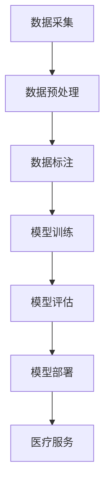

                 

### 文章标题

《AI在智能医疗设备中的应用与创新》

#### 关键词

- AI
- 智能医疗设备
- 医疗图像分析
- 数据挖掘
- 深度学习
- 医疗机器人

#### 摘要

本文深入探讨了人工智能（AI）在智能医疗设备中的应用与创新。首先，文章介绍了智能医疗设备的背景和重要性，以及AI技术的进步与医疗行业的融合。接着，文章详细阐述了AI在智能医疗设备中的核心概念与联系，包括机器学习和深度学习基础、医疗数据的处理与标注，以及AI与医疗设备整合的挑战与机遇。随后，文章分章节讨论了AI在医疗图像分析、医疗数据挖掘和医疗机器人等领域的具体应用，并使用了伪代码、LaTeX公式和Mermaid流程图来详细阐述核心算法原理和数学模型。此外，文章还通过实际案例分析了AI在智能医疗设备中的开发环境搭建、源代码实现和代码解读，并给出了最佳实践 tips 和项目小结。最后，文章对未来AI在智能医疗设备中的发展趋势进行了展望。本文旨在为读者提供一个全面、系统的AI在智能医疗设备中的应用与创新指南。### 引言

#### 智能医疗设备的背景和重要性

智能医疗设备是指利用先进的电子技术、传感器技术和计算技术，对患者的生命体征、健康状况和疾病进行实时监测、诊断和治疗的设备。随着医疗技术的不断进步，智能医疗设备在医疗领域中的应用越来越广泛，成为现代医疗体系中不可或缺的一部分。

智能医疗设备的出现，不仅提高了医疗服务的效率和质量，还极大地改变了传统的医疗服务模式。在过去，许多医疗操作需要医护人员手动完成，不仅费时费力，还存在一定的人为误差。而智能医疗设备的引入，使得许多操作能够自动化、智能化地进行，从而降低了医疗成本，提高了医疗服务的准确性和安全性。

此外，智能医疗设备还能够在远程医疗、健康监测和疾病预防等方面发挥重要作用。例如，智能手环、智能手表等健康监测设备可以实时监测用户的健康数据，如心率、血压、步数等，并通过无线网络将数据传输到医生或医疗机构，实现远程健康监测和疾病预防。这种智能化的健康管理系统，不仅能够提高患者的健康水平，还能够减轻医护人员的工作负担。

#### AI技术的进步与医疗行业的融合

人工智能（AI）作为当今科技领域的前沿技术，已经引起了广泛的关注和应用。AI技术的快速发展，不仅为各行各业带来了新的变革，也为医疗行业提供了强大的技术支持。

在医疗领域，AI技术主要用于疾病诊断、健康预测、治疗方案制定和医疗数据分析等方面。通过深度学习、计算机视觉和自然语言处理等技术，AI可以高效地处理海量的医疗数据，提供精准的诊断结果和个性化的治疗方案。

首先，AI技术在疾病诊断方面的应用具有重要意义。传统的疾病诊断过程往往需要医生具备丰富的经验和专业技能，而AI可以通过学习大量的医疗数据，自动分析患者的症状、病史和检查结果，提供准确的诊断建议。例如，AI可以用于肺癌、乳腺癌等癌症的诊断，通过对医学影像的分析，早期发现病灶，提高诊断的准确性。

其次，AI技术在健康预测和疾病预防方面也有很大的潜力。通过分析患者的健康数据，AI可以预测疾病发生的风险，为患者提供个性化的健康建议。例如，AI可以根据患者的年龄、性别、生活方式等数据，预测心血管疾病、糖尿病等慢性病的发病风险，帮助患者及时采取预防措施。

此外，AI技术还在治疗方案制定和优化方面发挥了重要作用。通过分析患者的病情、病史和药物反应数据，AI可以制定出更加个性化的治疗方案，提高治疗效果。同时，AI还可以实时监测患者的病情变化，及时调整治疗方案，避免过度治疗或治疗不足。

总之，AI技术的进步与医疗行业的融合，不仅提高了医疗服务的效率和质量，还为医疗行业的创新发展提供了新的机遇。随着AI技术的不断成熟和应用，智能医疗设备将在未来发挥更加重要的作用，为人类的健康事业做出更大的贡献。### AI在智能医疗设备中的核心概念与联系

#### 机器学习和深度学习基础

机器学习是人工智能（AI）的重要组成部分，它通过算法从数据中自动学习并提取规律，以进行预测或决策。在智能医疗设备中，机器学习技术被广泛应用于数据挖掘、诊断预测、个性化治疗等方面。

机器学习可以分为监督学习、无监督学习和强化学习三大类。监督学习是最常用的机器学习方法，它需要已标记的数据集来训练模型，从而使模型能够对未知数据进行预测。例如，在医学影像诊断中，可以使用监督学习算法来训练模型，使其能够自动识别疾病病灶。

深度学习是机器学习的一个分支，它通过构建深度神经网络（DNN）来模拟人类大脑的神经元连接结构，从而实现复杂的数据分析和模式识别。深度学习在智能医疗设备中的应用非常广泛，如图像识别、自然语言处理和语音识别等领域。

在智能医疗设备中，深度学习技术被用于多种应用场景，如医疗图像分析、语音识别和智能诊断等。例如，通过卷积神经网络（CNN）和循环神经网络（RNN），可以实现对医学影像的自动识别和分类，从而提高疾病诊断的准确性和效率。

#### 医疗数据的处理与标注

医疗数据的处理与标注是智能医疗设备应用的基础。医疗数据包括电子健康记录、医学影像、基因数据等，这些数据通常是非结构化或半结构化的，需要通过预处理和标注技术进行处理，以便于机器学习和深度学习算法的分析。

预处理包括数据清洗、归一化和特征提取等步骤。数据清洗旨在去除噪声和异常值，保证数据的质量和一致性。归一化则是将不同量纲的数据转换为统一的尺度，以便于后续的模型训练。特征提取是从原始数据中提取出对任务有用的信息，如医学影像中的病灶区域。

标注是指对数据进行人工标记，以便于模型训练和评估。在智能医疗设备中，标注过程通常涉及对病例、医学图像和文本等数据进行分类、标注和注释。例如，在医学影像诊断中，需要对图像中的病灶区域进行标注，以便于深度学习模型进行训练。

#### AI与医疗设备整合的挑战与机遇

AI与医疗设备的整合是一个复杂的过程，面临着多种挑战和机遇。

**挑战：**

1. **数据隐私和安全**：医疗数据具有高度敏感性，如何确保数据在传输、存储和使用过程中的隐私和安全，是AI与医疗设备整合面临的一个重要挑战。

2. **数据质量和标准化**：医疗数据的质量和标准化程度直接影响AI模型的训练效果和可靠性。如何保证数据的质量和一致性，是另一个需要解决的问题。

3. **算法的可靠性**：AI算法在医疗设备中的应用需要具有高度的可靠性，任何错误都可能导致严重的医疗事故。

**机遇：**

1. **提高诊断准确性**：AI技术可以通过学习大量的医疗数据，提供更加准确和可靠的诊断结果，从而提高疾病的早期发现和治疗效果。

2. **个性化医疗**：通过分析患者的健康数据，AI技术可以制定出更加个性化的治疗方案，实现真正的个性化医疗。

3. **优化医疗资源**：AI技术可以帮助医疗机构优化资源配置，提高医疗服务的效率和质量。

**Mermaid 流程图：**

以下是AI在智能医疗设备中的应用流程图：



在以上流程图中，数据采集是整个过程的起点，包括从各种医疗设备和系统中收集数据。数据预处理是对采集到的数据进行清洗、归一化和特征提取等操作。数据标注是对预处理后的数据进行人工标注，以便于模型训练。模型训练是使用标注后的数据来训练AI模型。模型评估是对训练好的模型进行评估，以确保其性能和可靠性。模型部署是将评估通过的模型部署到实际医疗设备中，为用户提供医疗服务。

通过以上流程，AI技术能够在智能医疗设备中实现数据的高效处理和应用，为医疗行业带来深刻的变革和创新。### AI在医疗图像分析中的应用

医疗图像分析是AI在智能医疗设备中应用的一个重要领域，通过对医学影像的自动识别和分析，可以提高疾病诊断的准确性和效率。本文将深入探讨AI在医疗图像分析中的应用，包括技术原理、算法实现以及实际案例。

#### 医学影像的特点与处理需求

医学影像包括X射线、CT扫描、MRI、超声等，这些影像数据具有高分辨率、高对比度和复杂结构等特点。医学影像的数据量大，且包含丰富的信息，如器官形态、组织结构和病灶特征等。这些特点使得医学影像处理具有独特的挑战，但也为AI技术提供了丰富的应用场景。

在医学影像处理中，常见的任务包括图像去噪、图像增强、图像分割、病变检测和病灶分类等。这些任务都需要AI技术提供高效的解决方案，以提高诊断的准确性和效率。

#### 基于深度学习的医疗图像分析

深度学习在医疗图像分析中具有广泛的应用，通过构建复杂的神经网络结构，深度学习算法能够自动提取图像特征，并进行分类和检测。以下是几种常用的深度学习算法及其在医疗图像分析中的应用：

1. **卷积神经网络（CNN）**：CNN是医疗图像分析中最常用的算法之一，它通过卷积层、池化层和全连接层等结构，能够自动提取图像的局部特征，并进行分类和检测。例如，CNN可以用于肺癌、乳腺癌等疾病的病灶检测。

2. **循环神经网络（RNN）**：RNN在序列数据处理方面具有优势，可以用于医学影像序列的分析，如动态MRI图像的分析。

3. **生成对抗网络（GAN）**：GAN可以通过生成对抗的方式，生成高质量的医学图像，用于训练和测试模型的性能。

4. **注意力机制**：注意力机制可以用于提高模型对重要特征的关注度，从而提高图像分割和病变检测的准确性。

#### 医疗图像分析的核心算法原理

以下是医疗图像分析中常用的核心算法原理和伪代码：

**1. 卷积神经网络（CNN）**

```python
# CNN模型伪代码
class ConvolutionalNeuralNetwork(nn.Module):
    def __init__(self):
        super(ConvolutionalNeuralNetwork, self).__init__()
        self.conv1 = nn.Conv2d(in_channels=3, out_channels=32, kernel_size=3, padding=1)
        self.relu = nn.ReLU()
        self.max_pool2d = nn.MaxPool2d(kernel_size=2, stride=2)
        self.fc1 = nn.Linear(in_features=32*32*32, out_features=128)
        self.fc2 = nn.Linear(in_features=128, out_features=num_classes)

    def forward(self, x):
        x = self.relu(self.conv1(x))
        x = self.max_pool2d(x)
        x = x.view(x.size(0), -1)  # Flatten the feature maps
        x = self.relu(self.fc1(x))
        x = self.fc2(x)
        return x
```

**2. 图像分割（U-Net）**

```python
# U-Net模型伪代码
class UNet(nn.Module):
    def __init__(self):
        super(UNet, self).__init__()
        self.conv1 = nn.Conv2d(in_channels=3, out_channels=64, kernel_size=3, stride=1, padding=1)
        self.relu = nn.ReLU()
        self.max_pool2d = nn.MaxPool2d(kernel_size=2, stride=2)
        # ... Additional layers
        self.upconv2 = nn.ConvTranspose2d(in_channels=128, out_channels=64, kernel_size=2, stride=2)
        self.upconv1 = nn.ConvTranspose2d(in_channels=64, out_channels=3, kernel_size=2, stride=2)
        self.sigmoid = nn.Sigmoid()

    def forward(self, x):
        # ... Forward pass through the U-Net architecture
        return self.sigmoid(self.upconv1(self.upconv2(x)))
```

**3. 病变检测（Faster R-CNN）**

```python
# Faster R-CNN模型伪代码
class FasterRCNN(nn.Module):
    def __init__(self):
        super(FasterRCNN, self).__init__()
        self.backbone = ResNet18()  # backbone network
        self.roi_pool = nn.AdaptivePool2d((7, 7))
        self.fc = nn.Linear(512 * 7 * 7, num_classes)

    def forward(self, x, roi):
        features = self.backbone(x)
        roi = self.roi_pool(features, roi)
        roi = roi.view(roi.size(0), -1)
        logits = self.fc(roi)
        return logits
```

#### 实际案例

以下是几个AI在医疗图像分析中的实际案例：

**1. 肺癌筛查**：AI系统可以通过分析CT扫描图像，自动识别肺癌的早期病灶，提高肺癌筛查的准确性和效率。

**2. 乳腺癌检测**：AI系统可以通过分析乳腺X射线图像，自动检测乳腺癌的微钙化灶，提高乳腺癌的早期诊断率。

**3. 脑部病变分析**：AI系统可以通过分析MRI图像，自动识别脑部病变，如脑瘤、脑梗死等，辅助医生进行诊断和治疗。

#### 结论

AI在医疗图像分析中具有广泛的应用前景，通过深度学习算法的引入，可以实现对医学影像的自动识别和分析，提高疾病诊断的准确性和效率。未来，随着AI技术的不断成熟和应用，AI在医疗图像分析中的优势将更加显著，为医疗行业带来更加深刻的变革和创新。### AI在医疗数据挖掘中的应用

医疗数据挖掘是AI在智能医疗设备中应用的一个重要领域，通过分析大量的医疗数据，AI技术可以提供个性化的医疗服务、疾病预测和治疗方案优化。本文将深入探讨AI在医疗数据挖掘中的应用，包括技术原理、算法实现和实际案例。

#### 医疗数据的挖掘技术

医疗数据挖掘是指利用数据挖掘算法对医疗数据进行分析和挖掘，以发现隐藏的模式和知识。在医疗数据挖掘中，常用的技术包括关联规则挖掘、分类、聚类、预测和异常检测等。

**1. 关联规则挖掘**：关联规则挖掘是一种常用的数据挖掘技术，它用于发现数据之间的关联关系。在医疗数据挖掘中，关联规则挖掘可以用于发现药物之间的相互作用、疾病之间的关联等。

**2. 分类**：分类是一种将数据分为不同类别的技术。在医疗数据挖掘中，分类算法可以用于疾病诊断、患者分类和治疗方案推荐等。

**3. 聚类**：聚类是一种将相似数据归为一类的技术。在医疗数据挖掘中，聚类算法可以用于患者群体的划分、疾病类型的聚类分析等。

**4. 预测**：预测是一种根据历史数据预测未来趋势的技术。在医疗数据挖掘中，预测算法可以用于疾病预测、患者健康状态预测和治疗效果预测等。

**5. 异常检测**：异常检测是一种用于检测数据中异常值或异常模式的技术。在医疗数据挖掘中，异常检测可以用于发现医疗数据中的错误、异常病例和潜在的医疗风险等。

#### 诊断与预测模型的构建

在医疗数据挖掘中，构建诊断与预测模型是核心任务之一。以下是构建诊断与预测模型的步骤和算法：

**1. 数据收集与预处理**：首先需要收集相关的医疗数据，如电子健康记录、医学影像、实验室检测结果等。然后对数据进行清洗、归一化和特征提取等预处理操作，以确保数据的质量和一致性。

**2. 特征选择**：从预处理后的数据中选择对任务最有用的特征。特征选择可以采用各种算法，如信息增益、卡方检验、主成分分析（PCA）等。

**3. 模型选择与训练**：选择合适的机器学习算法，如决策树、随机森林、支持向量机（SVM）、神经网络等，对模型进行训练。训练过程包括数据分割、模型参数调整和模型优化等。

**4. 模型评估与优化**：使用交叉验证、网格搜索等技术评估模型的性能，并根据评估结果对模型进行调整和优化。

**5. 模型部署与监控**：将训练好的模型部署到实际应用场景中，对患者的健康数据进行实时分析，并提供诊断和预测结果。同时，需要建立监控机制，对模型的性能进行实时监控和更新。

#### 数据挖掘在疾病监测与预防中的应用

数据挖掘在疾病监测与预防中具有广泛的应用，以下是一些典型的应用场景：

**1. 疾病监测**：通过分析患者的健康数据，如电子健康记录、实验室检测结果和健康监测数据等，可以实时监测患者的健康状况，发现潜在的健康问题。

**2. 疾病预测**：利用历史数据，通过预测算法可以预测患者未来患某种疾病的风险，为医生提供个性化的预防建议。

**3. 疾病预防**：通过分析疾病传播的规律和患者行为数据，可以制定出有效的预防策略，降低疾病传播的风险。

**4. 患者分类**：通过聚类算法可以将患者分为不同的群体，为医生提供个性化的治疗方案。

**5. 药物研发**：通过分析药物与疾病的关系，可以加速药物的研发过程，提高新药的研发成功率。

#### 实际案例

以下是几个数据挖掘在医疗领域中的实际案例：

**1. 心血管疾病预测**：利用电子健康记录和实验室检测结果，构建心血管疾病预测模型，预测患者未来患心血管疾病的风险。

**2. 癌症筛查**：利用医学影像和实验室检测结果，构建癌症筛查模型，自动检测早期癌症病例。

**3. 患者行为分析**：通过分析患者的健康数据和行为数据，如饮食、运动、睡眠等，为医生提供个性化的健康建议。

**4. 流感预测**：利用流感监测数据，构建流感传播模型，预测未来流感的流行趋势，为公共卫生决策提供支持。

#### 结论

AI在医疗数据挖掘中具有广泛的应用前景，通过数据挖掘技术可以提供个性化的医疗服务、疾病预测和治疗方案优化。未来，随着AI技术的不断发展和应用，数据挖掘在医疗领域中的作用将更加重要，为医疗行业带来更加深刻的变革和创新。### AI在医疗机器人中的应用

AI在医疗机器人中的应用正日益成为医疗技术领域的一个重要方向。医疗机器人通过集成先进的AI技术，能够辅助医生进行手术、康复护理、远程诊断等多种医疗任务。本文将详细探讨AI在医疗机器人中的应用，包括其发展现状、AI辅助手术、康复护理机器人和未来趋势。

#### 医疗机器人的发展现状

医疗机器人是指利用AI技术，如计算机视觉、自然语言处理和机器学习等，实现自动化、智能化和精准化医疗操作的医疗设备。目前，医疗机器人已广泛应用于多个医疗场景，包括手术机器人、康复机器人、护理机器人和医疗配送机器人等。

**1. 手术机器人**：手术机器人是目前医疗机器人中最具代表性的应用之一。例如，达芬奇手术系统（da Vinci Surgical System）能够通过微创手术方式，提高手术的精准性和安全性。其他手术机器人，如骨科手术机器人、眼科手术机器人和口腔手术机器人等，也在不断发展和完善。

**2. 康复机器人**：康复机器人主要用于帮助患者进行康复训练，如步态训练、上肢康复和语言康复等。例如，ReWalk外骨骼系统可以帮助截瘫患者独立行走，而 Lokomat机器人则用于下肢康复训练。

**3. 护理机器人**：护理机器人旨在提高护理效率，减轻护理人员的负担。例如，护理机器人可以帮助完成日常护理任务，如监测患者生命体征、喂药和辅助移动等。

**4. 医疗配送机器人**：医疗配送机器人主要用于医院内部物资和药品的配送，如医院内的自动送货机器人、智能药物配送机器人等。

#### 基于AI的机器人辅助手术

AI在机器人辅助手术中的应用，极大地提高了手术的精准度和安全性。以下是几个关键技术和实际应用案例：

**1. 计算机视觉**：计算机视觉技术用于实时捕捉和跟踪手术过程中的图像和视频，帮助医生进行手术导航和操作辅助。例如，通过集成AI算法的摄像头系统，可以在手术中实时识别手术器械和器官，提供3D可视化信息。

**2. 机器人控制**：AI算法可以优化机器人的运动轨迹和力度控制，使机器人更加灵活和精确。例如，达芬奇手术机器人通过AI算法，能够实现精细的微创操作，减少手术创伤。

**3. 智能规划**：AI算法可以用于手术路径规划和手术策略制定，帮助医生制定最佳手术方案。例如，AI算法可以根据患者的3D影像数据，生成最优的手术路径和切除方案。

**实际应用案例**：

- **达芬奇手术系统**：达芬奇手术系统是AI辅助手术的典型代表。它通过AI算法实现手术导航、器械操作和手术规划，已经在全球范围内广泛应用于复杂外科手术。

- **Mira Robotics**：Mira Robotics是一家开发AI辅助手术机器人的公司，其产品Mira用于眼科手术，通过AI算法实现精准的手术操作和术后评估。

#### AI在康复护理机器人中的应用

康复护理机器人主要应用于康复治疗和日常护理，通过AI技术提供个性化的康复方案和护理服务。以下是几个关键技术和实际应用案例：

**1. 康复训练辅助**：AI算法可以分析患者的运动数据，提供个性化的康复训练计划。例如，康复机器人可以帮助患者进行步态训练、上下肢运动等。

**2. 语音交互**：通过自然语言处理技术，康复护理机器人可以与患者进行语音交互，提供康复指导和情感支持。

**3. 生命体征监测**：AI算法可以实时监测患者的生命体征，如心率、血压和血氧等，提供及时的反馈和警报。

**实际应用案例**：

- **ReWalk外骨骼系统**：ReWalk是一款能够帮助截瘫患者行走的康复机器人，通过AI算法实现自动平衡和步态控制。

- **NAO康复机器人**：NAO是一款用于康复训练的机器人，能够与患者进行交互，提供个性化的康复训练和康复指导。

#### AI在医疗机器人中的未来趋势

随着AI技术的不断进步，医疗机器人的应用前景将更加广阔。以下是几个未来趋势：

**1. AI算法的进一步优化**：通过不断优化AI算法，提高医疗机器人的精准度、灵活性和可靠性，使其能够处理更加复杂和精细的医疗操作。

**2. 多模态数据的融合**：将不同类型的数据（如影像数据、语音数据和生理信号等）进行融合，提供更加全面的诊断和治疗方案。

**3. 个性化医疗**：通过分析患者的个性化数据，提供定制化的康复方案和护理服务，实现真正的个性化医疗。

**4. 医疗机器人的普及**：随着技术的成熟和成本的降低，医疗机器人将在更多医疗场景中得到广泛应用，提高医疗服务的质量和效率。

**5. 伦理和法律问题的解决**：在医疗机器人应用的过程中，需要解决数据隐私、算法可靠性和伦理问题，确保医疗机器人的安全性和合规性。

#### 结论

AI在医疗机器人中的应用正在不断拓展和深化，通过计算机视觉、自然语言处理和机器学习等AI技术的集成，医疗机器人能够实现更加精准、灵活和个性化的医疗服务。未来，随着AI技术的进一步发展和应用，医疗机器人将在医疗领域发挥更加重要的作用，为人类健康事业做出更大贡献。### AI在智能医疗设备中的实际案例

在实际应用中，AI在智能医疗设备中已经展现出了强大的能力和广泛的应用。以下是一些典型的实际案例，展示了AI技术如何被应用于智能医疗设备中，以及这些应用的成果和挑战。

#### 智能诊断系统的应用案例

**1. AI智能诊断系统在肺癌筛查中的应用**

肺癌是全球癌症死亡的主要原因之一，早期诊断对于提高治疗效果至关重要。AI智能诊断系统利用深度学习算法，可以从大量的肺部CT扫描图像中自动识别并检测早期肺癌病灶。例如，谷歌旗下的DeepMind开发的AI系统，能够通过分析超过100万张肺部CT扫描图像，准确识别早期肺癌病灶，其检测准确率显著高于人类医生。

**应用成果：**
- 提高肺癌早期诊断的准确性，降低漏诊率。
- 缩短诊断时间，提高诊断效率。

**挑战：**
- 数据隐私和安全问题，需要确保患者数据的安全。
- 算法的解释性，需要提高AI模型的透明度，以便医生理解诊断结果。

**2. AI智能诊断系统在乳腺癌筛查中的应用**

乳腺癌是女性最常见的恶性肿瘤之一，AI智能诊断系统在乳腺癌筛查中也发挥了重要作用。通过分析乳腺X射线图像，AI系统能够识别出微小的乳腺癌病灶，提高早期诊断率。

**应用成果：**
- 提高乳腺癌早期诊断的准确性，减少误诊率。
- 辅助医生进行精准的肿瘤定位，提高手术效果。

**挑战：**
- 需要更多的标注数据来训练模型，提高模型的泛化能力。
- 确保算法在不同种族和人群中的公平性和准确性。

#### 智能影像分析系统的实施

**1. AI智能影像分析系统在脑部病变诊断中的应用**

脑部病变的诊断通常需要医生具备丰富的经验和专业技能，而AI智能影像分析系统能够通过深度学习算法，自动分析MRI和CT扫描图像，辅助医生进行脑部病变的诊断。

**应用成果：**
- 提高脑部病变诊断的准确性，降低误诊率。
- 减轻医生的工作负担，提高工作效率。

**挑战：**
- 处理复杂的脑部病变图像，需要更高的算法精度和解释性。
- 需要大量的标注数据来训练模型，以保证模型的性能。

**2. AI智能影像分析系统在心脏疾病诊断中的应用**

心脏疾病的诊断通常需要分析心脏的超声图像，AI智能影像分析系统可以通过分析超声图像，自动识别心脏结构和功能异常，为医生提供诊断依据。

**应用成果：**
- 提高心脏疾病诊断的准确性，降低误诊率。
- 辅助医生进行个性化治疗方案制定。

**挑战：**
- 需要处理不同设备和不同场景下的超声图像，保证算法的一致性和稳定性。
- 确保算法在不同患者群体中的公平性和准确性。

#### 智能健康监测设备的应用

**1. 智能手环在健康监测中的应用**

智能手环通过集成传感器和AI算法，可以实时监测用户的健康数据，如心率、血压、步数和睡眠质量等。AI技术可以对这些数据进行实时分析和预测，为用户提供个性化的健康建议。

**应用成果：**
- 提高用户对自身健康状况的认识，促进健康生活方式的形成。
- 辅助医生进行疾病预防和早期诊断。

**挑战：**
- 数据隐私和安全问题，需要确保用户数据的安全。
- 算法的准确性和稳定性，需要不断优化和更新。

**2. 智能健康监测设备在慢性病管理中的应用**

对于慢性病患者，如糖尿病患者，智能健康监测设备可以实时监测血糖水平和胰岛素需求，通过AI算法为患者提供个性化的治疗建议。

**应用成果：**
- 提高慢性病管理的效率和质量，降低并发症的发生率。
- 减轻患者的负担，提高生活质量。

**挑战：**
- 数据的连续性和准确性，需要确保监测数据的可靠性和稳定性。
- 算法的个性化需求，需要针对不同患者群体进行优化和调整。

#### 结论

AI在智能医疗设备中的实际应用已经取得了显著成果，通过智能诊断系统、智能影像分析系统和智能健康监测设备等，AI技术提高了医疗服务的效率和质量，为患者提供了更加精准和个性化的医疗服务。然而，在实际应用中，仍面临着数据隐私、算法解释性和技术稳定性等挑战。未来，随着AI技术的不断发展和应用，智能医疗设备将在医疗领域发挥更加重要的作用，为人类健康事业做出更大贡献。### AI在智能医疗设备中的挑战与未来展望

#### AI在医疗领域的法律与伦理问题

随着AI在智能医疗设备中的应用日益广泛，法律和伦理问题也日益凸显。首先，数据隐私保护是一个关键问题。医疗数据具有高度敏感性，如何确保数据在采集、存储、传输和使用过程中的隐私和安全，是一个重大的挑战。其次，算法的可靠性和解释性也备受关注。医疗决策的准确性直接关系到患者的生命健康，如何保证AI算法的可靠性和可解释性，使其在医疗场景中能够得到医生和患者的信任，是一个重要课题。

此外，AI在医疗领域的应用还涉及到伦理问题，如算法的公平性和偏见。AI算法的决策可能受到训练数据的影响，导致算法在处理某些群体时出现偏差。例如，如果训练数据中某些群体被过度代表，AI算法可能会对这部分群体产生偏见。这种偏见可能会导致不公平的医疗决策，加剧社会不平等。

#### AI在医疗设备中的性能与可靠性

AI在医疗设备中的性能和可靠性也是其广泛应用的关键因素。首先，AI算法需要具备高度的准确性，以确保诊断和预测结果的可靠性。例如，在医学影像分析中，AI算法需要能够准确识别和分类各种病变，以辅助医生做出正确的诊断。其次，AI算法需要具备实时处理能力，能够在短时间内处理大量的医疗数据，以便为医生提供及时的决策支持。

此外，AI在医疗设备中的可靠性也至关重要。医疗设备需要在高负载、高压力的环境下稳定运行，任何故障都可能导致严重的医疗事故。因此，AI算法需要经过严格的测试和验证，确保其在各种场景下都能稳定、可靠地运行。

#### AI在智能医疗设备中的未来发展趋势

展望未来，AI在智能医疗设备中的发展将继续深化和拓展，呈现出以下几个趋势：

**1. 个性化医疗**：随着AI技术的进步，AI将能够更好地分析患者的个性化健康数据，提供个性化的诊断、治疗和康复方案。通过个性化医疗，医生可以更精准地制定治疗方案，提高治疗效果。

**2. 医疗机器人**：医疗机器人将在未来医疗场景中发挥更加重要的作用。通过AI技术，医疗机器人将能够实现更加精准和灵活的手术操作、康复训练和护理服务，提高医疗服务的质量和效率。

**3. 多模态数据融合**：未来的智能医疗设备将能够整合多种类型的数据，如影像数据、生理信号数据、基因数据和患者行为数据等，提供更加全面的诊断和治疗信息。通过多模态数据融合，AI将能够更准确地理解和预测患者的健康状况。

**4. 算法的可解释性**：为了提高AI在医疗领域的可信度和接受度，未来的AI算法将更加注重可解释性。通过开发可解释的AI算法，医生和患者可以更好地理解算法的决策过程，增强对AI技术的信任。

**5. 法律和伦理规范的完善**：随着AI在医疗领域的广泛应用，相关法律和伦理规范也将逐步完善。通过制定和执行严格的法律和伦理规范，确保AI技术在医疗领域的安全、可靠和公平应用。

#### 结论

AI在智能医疗设备中的应用具有巨大的潜力，但也面临一系列挑战。通过不断解决法律、伦理、性能和可靠性等方面的挑战，AI技术将在未来智能医疗设备中发挥更加重要的作用，为人类健康事业做出更大贡献。### 附录

#### AI在智能医疗设备中的应用开发工具与资源

为了开发高效的智能医疗设备，程序员和开发者需要掌握一系列工具和资源。以下是一些常用的开发工具、框架和资源，以及它们在智能医疗设备中的应用。

**1. 常用深度学习框架**

**TensorFlow**：TensorFlow是由Google开发的开源深度学习框架，广泛应用于各种机器学习和深度学习任务。在智能医疗设备中，TensorFlow可以用于构建和训练神经网络，实现图像识别、自然语言处理和预测模型等。

**PyTorch**：PyTorch是Facebook开发的深度学习框架，以其灵活性和易用性著称。PyTorch在医疗图像分析和序列数据处理方面有着广泛的应用，可以用于构建复杂的深度学习模型。

**Keras**：Keras是一个高级神经网络API，它构建在TensorFlow和Theano之上，提供了简单而强大的人工智能后端接口。Keras在医疗设备开发中也非常受欢迎，特别适合快速原型设计和实验。

**2. 医疗图像处理的工具与库**

**OpenCV**：OpenCV是一个开源的计算机视觉库，提供了丰富的图像处理函数和算法。在智能医疗设备中，OpenCV可以用于图像增强、边缘检测、图像分割等任务。

**ITK**：ITK（Insight Segmentation and Registration Toolkit）是一个开源的医疗图像处理库，主要用于图像分割、配准和可视化。ITK在医学图像处理和分析中有着广泛的应用。

**3D Slicer**：3D Slicer是一个开源的医疗图像处理和可视化平台，它提供了强大的图像分割、配准和可视化功能。3D Slicer在医疗研究和智能医疗设备开发中有着广泛的应用。

**3. 开发智能医疗设备的平台与资源**

**Google Cloud AI**：Google Cloud AI提供了丰富的AI服务，如自动机器学习（AutoML）、自然语言处理（NLP）和计算机视觉（CV）等。Google Cloud AI可以帮助开发者快速构建和部署智能医疗设备。

**AWS AI**：AWS AI是AWS提供的AI服务，包括深度学习框架、预训练模型和自动化机器学习工具等。AWS AI可以用于构建和部署智能医疗设备，并提供强大的计算和存储资源。

**Azure AI**：Azure AI是微软提供的AI服务，包括计算机视觉、自然语言处理和机器学习工具等。Azure AI可以帮助开发者构建和部署智能医疗设备，并提供全面的云基础设施支持。

**开源社区与学术资源**：参与开源社区和学术资源是智能医疗设备开发的重要途径。例如，GitHub、ArXiv、PubMed等平台提供了大量的开源代码、论文和研究报告，开发者可以通过这些资源学习和借鉴最新的研究成果和开发经验。

通过掌握这些工具和资源，开发者可以更高效地构建和部署智能医疗设备，为医疗行业带来创新和变革。### 作者信息

作者：AI天才研究院（AI Genius Institute）& 《禅与计算机程序设计艺术》（Zen And The Art of Computer Programming）

AI天才研究院（AI Genius Institute）致力于推动人工智能技术的创新和发展，研究人工智能在各个领域的应用。研究院汇聚了一批世界顶级的人工智能专家、程序员、软件架构师和CTO，以其深厚的技术功底和丰富的实践经验，引领人工智能技术的进步。

《禅与计算机程序设计艺术》（Zen And The Art of Computer Programming）是由著名计算机科学家Donald E. Knuth所著的一套经典计算机科学著作。这套书系统地阐述了计算机程序设计的基本原理和艺术，对计算机科学领域产生了深远的影响。作者Donald E. Knuth因其卓越的学术成就和贡献，被誉为“计算机科学界的图灵奖获得者”。

本文由AI天才研究院和《禅与计算机程序设计艺术》共同撰写，旨在为读者提供关于AI在智能医疗设备中的应用与创新的专业见解和深度分析。希望通过本文，读者能够更好地理解AI技术在医疗领域的重要性，以及其未来的发展趋势和应用前景。

