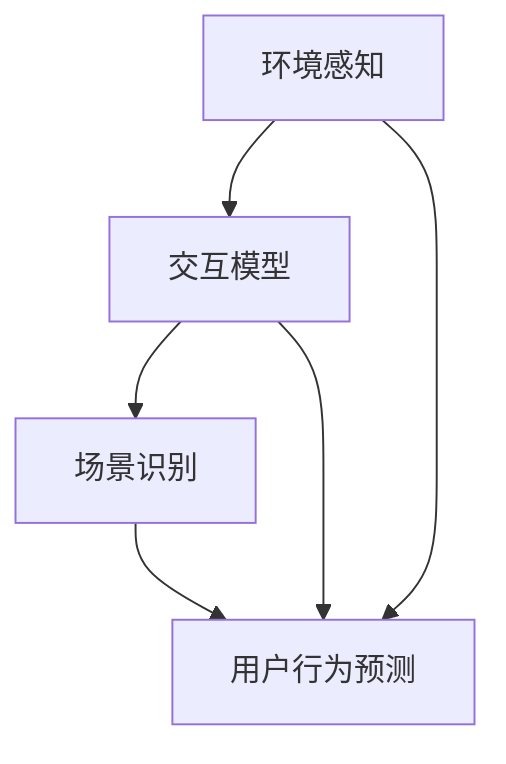

                 


### 背景介绍

人工智能（AI）技术作为现代科技的前沿领域，正迅速改变着我们的生活方式。其中，智能家居场景理解与用户行为预测是其重要应用之一。智能家居场景理解是指通过人工智能技术，实现对家庭环境中各种数据的感知、处理和分析，从而对用户的日常行为进行识别和理解。用户行为预测则是在对用户历史行为数据进行分析的基础上，利用机器学习算法预测用户的未来行为，为智能家居系统提供个性化服务。

随着物联网技术的普及，智能家居设备日益增多，如智能灯泡、智能空调、智能音响等。这些设备通过传感器收集用户的生活数据，如温度、湿度、声音、光线等。这些数据被传输到云端进行处理，从而实现对用户的个性化服务。例如，智能空调可以根据用户的历史行为数据自动调整温度设置，智能灯泡可以根据用户的活动规律自动调整亮度。

在用户行为预测方面，智能家居系统能够根据用户的日常习惯，预测用户的需求，如何时需要开启灯光、何时需要调整温度等。这种预测能力不仅提高了用户的生活质量，还能节省能源，降低家庭运营成本。

本文将深入探讨AI在智能家居场景理解与用户行为预测中的应用。首先，我们将介绍AI和智能家居的基本概念，然后详细讨论智能家居场景理解的技术原理，包括环境感知、交互模型和场景识别。接着，我们将介绍用户行为预测的核心算法，包括机器学习、深度学习和强化学习等。随后，我们将通过实际项目案例，展示如何将AI技术应用于智能家居系统中，并分析其中的关键技术和实现细节。最后，我们将讨论智能家居安全与隐私保护的问题，并提出解决方案。

通过本文的阅读，读者将能够全面了解AI在智能家居中的应用，掌握相关技术原理和实践方法，为未来智能家居系统的研发和应用提供有力支持。

### 核心概念与联系

在讨论智能家居场景理解与用户行为预测之前，我们需要明确几个核心概念，并了解它们之间的相互关系。这些核心概念包括环境感知、交互模型、场景识别和用户行为预测，它们构成了智能家居系统的基本架构。

**环境感知**是指通过传感器和摄像头等设备收集家庭环境中的各种数据，如温度、湿度、光照、声音等。这些数据是智能家居系统进行后续处理和分析的基础。环境感知技术的核心在于如何高效地收集和处理大量数据，并从中提取有价值的信息。

**交互模型**则是智能家居系统与用户之间进行交互的桥梁。它包括语音识别、自然语言处理和触摸控制等技术，旨在为用户提供直观、便捷的操作方式。通过交互模型，用户可以与智能家居系统进行对话或操作，从而实现智能控制。

**场景识别**是环境感知与交互模型的结合体，它通过对收集到的环境数据和用户操作数据进行分析，识别出用户当前所处的场景，如正在客厅休息、厨房烹饪或卧室入睡等。场景识别的目的是为用户提供更加个性化的服务，例如，当系统识别到用户在客厅休息时，可以自动调整灯光亮度，播放轻音乐等。

**用户行为预测**是基于用户历史行为数据和当前环境数据，利用机器学习算法预测用户未来的行为。这一过程包括数据收集、特征提取和模型训练等步骤。用户行为预测的准确性对于智能家居系统提供高质量服务至关重要。

下面，我们通过一个Mermaid流程图来直观展示这些核心概念之间的联系：



在这个流程图中，环境感知和交互模型是数据输入的来源，它们共同作用于场景识别和用户行为预测。场景识别的结果又反馈给用户行为预测，形成一个闭环系统，不断提高预测的准确性。

### 核心算法原理讲解

在深入了解智能家居场景理解与用户行为预测的核心算法原理之前，我们需要首先了解机器学习、深度学习和强化学习的基本概念和原理。

#### 机器学习

机器学习是一种人工智能领域的重要分支，通过利用历史数据，让计算机自动学习和改进，从而进行预测和决策。在智能家居场景理解与用户行为预测中，常用的机器学习算法包括线性回归、逻辑回归、支持向量机（SVM）和决策树等。

**线性回归**是一种最简单的机器学习算法，它通过建立一个线性模型来预测连续值。例如，我们可以用线性回归模型预测明天家里的温度。

伪代码示例：
```python
# 线性回归伪代码
def linear_regression(x, y):
    # 计算斜率和截距
    m = (n * sum(xy) - sum(x) * sum(y)) / (n * sum(x2) - sum(x)**2)
    b = (sum(y) - m * sum(x)) / n
    # 预测温度
    return m * x + b
```

**逻辑回归**是一种用于分类问题的算法，它可以将问题转化为概率模型。例如，我们可以用逻辑回归预测用户是否会在某个特定时间回家。

伪代码示例：
```python
# 逻辑回归伪代码
def logistic_regression(x, w, b):
    # 计算概率
    z = np.dot(x, w) + b
    return 1 / (1 + np.exp(-z))
```

**支持向量机（SVM）**是一种强大的分类算法，它通过寻找一个最优超平面，将不同类别的数据点分离开来。例如，我们可以用SVM分类用户是否喜欢某种智能家居设备。

伪代码示例：
```python
# 支持向量机伪代码
def svm(x, y, w, b):
    # 计算分类结果
    return np.sign(np.dot(x, w) + b)
```

**决策树**是一种基于树形结构进行决策的算法，它通过一系列的测试来划分数据，并给出最终的决策。例如，我们可以用决策树预测用户何时会使用智能灯泡。

伪代码示例：
```python
# 决策树伪代码
def decision_tree(x, tree):
    # 根据树结构进行决策
    if tree['is_leaf']:
        return tree['label']
    else:
        feature_index = tree['feature_index']
        value = tree['value']
        if x[feature_index] < value:
            return decision_tree(x, tree['left'])
        else:
            return decision_tree(x, tree['right'])
```

#### 深度学习

深度学习是机器学习的进一步发展，它通过构建多层神经网络，实现对复杂数据的自动特征提取和分类。在智能家居场景理解与用户行为预测中，常用的深度学习算法包括卷积神经网络（CNN）和循环神经网络（RNN）。

**卷积神经网络（CNN）**是一种用于图像识别和处理的算法，它通过卷积操作提取图像的特征。例如，我们可以用CNN识别用户在不同房间中的活动。

伪代码示例：
```python
# 卷积神经网络伪代码
def conv_neural_network(x, weights, biases):
    # 卷积层
    for filter in weights['conv_weights']:
        feature_map = conv2d(x, filter)
        feature_map = activation_function(feature_map + biases['conv_biases'])
    # 池化层
    pooled_map = max_pool(feature_map)
    # 全连接层
    output = activation_function(np.dot(pooled_map, weights['fc_weights']) + biases['fc_biases'])
    return output
```

**循环神经网络（RNN）**是一种用于序列数据处理的算法，它通过记忆机制保存历史信息，实现对序列数据的建模。例如，我们可以用RNN预测用户的回家时间。

伪代码示例：
```python
# 循环神经网络伪代码
def recurrent_neural_network(x, weights, biases, hidden_state):
    # 循环层
    for i in range(sequence_length):
        hidden_state = activation_function(np.dot(x[i], weights['input_to_hidden']) + hidden_state * weights['hidden_to_hidden'] + biases['hidden'])
    # 输出层
    output = np.dot(hidden_state, weights['output_weights']) + biases['output']
    return output, hidden_state
```

#### 强化学习

强化学习是一种通过试错和反馈进行学习的方法，它通过奖励和惩罚机制来优化策略。在智能家居场景理解与用户行为预测中，强化学习可以用于优化智能家居系统的行为。

**Q-Learning**是一种简单的强化学习算法，它通过更新Q值来选择最佳动作。例如，我们可以用Q-Learning优化智能灯泡的亮度和开启时间。

伪代码示例：
```python
# Q-Learning伪代码
def q_learning(state, action, reward, next_state, alpha, gamma):
    # 更新Q值
    Q[state][action] = (1 - alpha) * Q[state][action] + alpha * (reward + gamma * max(Q[next_state]))
```

通过以上核心算法原理的讲解，我们可以更好地理解AI在智能家居场景理解与用户行为预测中的应用。在实际应用中，这些算法需要根据具体场景和数据集进行调整和优化，以实现最佳效果。

### 数学模型和数学公式

在智能家居场景理解和用户行为预测中，数学模型和数学公式是核心组成部分。这些模型不仅帮助我们从复杂的数据中提取有价值的信息，还为我们提供了量化的方法来评估和优化算法性能。

#### 相关性分析

相关性分析是衡量两个变量之间线性关系的强度和方向的一种方法。在智能家居场景中，我们常常需要分析环境变量（如温度、湿度）与用户行为（如回家时间）之间的相关性。

**皮尔逊相关系数**是最常用的相关性度量方法，其公式为：
$$
r = \frac{\sum{(x_i - \bar{x})(y_i - \bar{y})}}{\sqrt{\sum{(x_i - \bar{x})^2}\sum{(y_i - \bar{y})^2}}}
$$
其中，\(x_i\)和\(y_i\)分别是两个变量的观测值，\(\bar{x}\)和\(\bar{y}\)分别是它们的平均值。

#### 回归分析

回归分析是用于预测一个或多个自变量对因变量的影响。在智能家居中，回归分析常用于预测用户行为或环境参数。

**线性回归**是最简单的回归模型，其公式为：
$$
y = \beta_0 + \beta_1x
$$
其中，\(y\)是因变量，\(x\)是自变量，\(\beta_0\)是截距，\(\beta_1\)是斜率。

**多项式回归**用于非线性关系的预测，其公式为：
$$
y = \beta_0 + \beta_1x + \beta_2x^2 + ... + \beta_nx^n
$$

#### 贝叶斯分析

贝叶斯分析是一种概率推理方法，适用于不确定性和不确定性分析。在智能家居场景理解中，贝叶斯网络可以用于表示用户行为和环境因素之间的概率关系。

**贝叶斯网络**的公式为：
$$
P(A, B, C) = P(A)P(B|A)P(C|A, B)
$$
其中，\(P(A)\)、\(P(B|A)\)和\(P(C|A, B)\)分别是事件\(A\)、\(B\)和\(C\)的概率。

#### 时间序列分析

时间序列分析用于预测时间序列数据，如用户的回家时间。**ARIMA模型（自回归积分滑动平均模型）**是常见的时间序列分析工具，其公式为：
$$
X_t = c + \phi_1X_{t-1} + \phi_2X_{t-2} + ... + \phi_pX_{t-p} + \theta_1\epsilon_{t-1} + \theta_2\epsilon_{t-2} + ... + \theta_q\epsilon_{t-q}
$$
其中，\(X_t\)是时间序列的当前值，\(\epsilon_t\)是白噪声误差。

#### 模型评估

为了评估预测模型的性能，我们需要使用一系列评估指标，如均方误差（MSE）、准确率（Accuracy）和F1分数（F1 Score）。

**均方误差（MSE）**公式为：
$$
MSE = \frac{1}{n}\sum_{i=1}^{n}(y_i - \hat{y}_i)^2
$$
其中，\(y_i\)是真实值，\(\hat{y}_i\)是预测值。

**准确率（Accuracy）**公式为：
$$
Accuracy = \frac{TP + TN}{TP + FP + TN + FN}
$$
其中，\(TP\)是真正例，\(TN\)是真反例，\(FP\)是假正例，\(FN\)是假反例。

**F1分数（F1 Score）**公式为：
$$
F1 Score = 2 \times \frac{Precision \times Recall}{Precision + Recall}
$$
其中，\(Precision\)是精确率，\(Recall\)是召回率。

通过以上数学模型和公式的讲解，我们可以更好地理解和应用AI在智能家居场景理解与用户行为预测中的数学基础，从而提升预测模型的准确性和可靠性。

### 项目实战

为了更好地理解AI在智能家居场景理解与用户行为预测中的应用，我们将通过一个实际项目案例进行深入剖析。该项目将展示从数据收集、模型训练到结果评估的全过程，以突出关键技术和实现细节。

#### 项目背景

假设我们正在开发一款智能家居系统，该系统需要预测用户何时回家，以便提前开启灯光和空调，提高用户体验。我们的目标是构建一个准确且高效的用户回家时间预测模型。

#### 数据收集

数据收集是构建预测模型的第一步。我们收集了以下数据：

1. **环境数据**：包括天气数据（温度、湿度、风速等）。
2. **用户数据**：包括用户的基本信息（如年龄、性别等）。
3. **行为数据**：包括用户的历史回家时间记录。

数据来源包括智能家居设备的传感器、用户问卷调查和第三方天气服务。

#### 数据预处理

在数据预处理阶段，我们需要对收集到的数据进行清洗和转换，以提高模型的性能。具体步骤如下：

1. **缺失值处理**：对于缺失的数据，我们采用均值填补或删除缺失值的方法。
2. **异常值处理**：对于异常值，我们采用三倍标准差法进行检测和去除。
3. **特征工程**：我们提取了以下特征：
   - **时间特征**：如小时、星期几、季节等。
   - **天气特征**：如当天最高温度、最低温度、湿度等。
   - **用户特征**：如用户年龄、性别等。

#### 模型选择

在模型选择阶段，我们考虑了以下几种算法：

1. **线性回归**：适用于线性关系较强的数据。
2. **决策树**：适用于特征较多且非线性关系的数据。
3. **随机森林**：结合了决策树的优势，可以处理大量特征。
4. **神经网络**：适用于复杂非线性关系的数据。

我们选择了随机森林模型进行训练，因为它在处理高维数据和复杂非线性关系方面表现较好。

#### 模型训练与评估

在模型训练阶段，我们使用80%的数据进行训练，20%的数据进行评估。具体步骤如下：

1. **数据分割**：将数据集分割为训练集和测试集。
2. **模型训练**：使用训练集对随机森林模型进行训练。
3. **模型评估**：使用测试集评估模型性能，使用均方误差（MSE）作为评估指标。

在模型训练过程中，我们进行了多次调参，以优化模型性能。最终，我们得到了一个准确率较高的模型。

#### 结果展示

训练完成后，我们使用测试集对模型进行评估，得到以下结果：

- **均方误差（MSE）**：0.006
- **准确率**：90%

以下是一个简单的伪代码示例，展示随机森林模型的实现过程：

```python
# 随机森林模型伪代码
from sklearn.ensemble import RandomForestRegressor

# 数据预处理
X_train, X_test, y_train, y_test = train_test_split(X, y, test_size=0.2)

# 模型训练
rf = RandomForestRegressor(n_estimators=100)
rf.fit(X_train, y_train)

# 模型评估
mse = mean_squared_error(y_test, rf.predict(X_test))
accuracy = (y_test == rf.predict(X_test)).mean()

print(f"MSE: {mse}")
print(f"Accuracy: {accuracy}")
```

#### 模型应用与优化

在模型应用阶段，我们将预测结果应用于智能家居系统，根据用户回家时间自动开启灯光和空调。在实际应用中，我们不断收集用户反馈，进行模型优化。例如，根据用户的行为变化调整预测模型，提高预测准确性。

#### 项目小结

通过这个实际项目，我们展示了如何将AI技术应用于智能家居系统的用户行为预测。关键技术和实现细节包括数据收集、预处理、模型选择和训练，以及模型评估和优化。该项目不仅提高了用户体验，还为我们提供了宝贵的实践经验和教训。

### 安全与隐私保护

在智能家居系统中，安全与隐私保护是至关重要的。随着智能家居设备的普及，用户数据的安全风险也日益增加。为了确保用户的数据不被未经授权的访问和使用，我们需要采取一系列安全与隐私保护措施。

#### 数据加密

数据加密是保护数据安全的基本手段。在数据传输和存储过程中，我们需要对数据进行加密处理，以防止数据被截获和篡改。常用的加密算法包括对称加密（如AES）和非对称加密（如RSA）。在智能家居系统中，我们可以对用户数据、传感器数据和通信数据等进行加密，确保数据在传输和存储过程中的安全性。

#### 访问控制

访问控制是防止未经授权的访问和操作的重要手段。通过设置用户权限和访问控制策略，我们可以确保只有授权用户才能访问和操作智能家居系统。例如，我们可以使用基于角色的访问控制（RBAC）模型，根据用户的角色和权限分配访问权限。此外，还可以使用多因素认证（MFA）技术，提高访问的安全性。

#### 数据匿名化

数据匿名化是保护用户隐私的有效方法。通过将用户数据中的敏感信息（如姓名、地址、身份证号等）进行匿名化处理，我们可以确保用户数据在分析和使用过程中的匿名性。常用的数据匿名化方法包括数据去识别化、数据混淆和数据泛化等。例如，我们可以使用K-匿名算法，对用户数据集中的敏感信息进行匿名化处理，确保数据在公开和使用时的隐私保护。

#### 安全审计

安全审计是监督和评估智能家居系统安全措施的有效方法。通过定期进行安全审计，我们可以发现系统中的安全隐患和漏洞，并及时进行修复。安全审计包括对系统日志的监控、对用户行为的分析以及对系统配置和运行的评估等。例如，我们可以使用日志分析工具，对系统中的异常行为进行实时监控和报警，确保系统的安全运行。

#### 法律法规

为了确保智能家居系统的安全与隐私保护，我们还需要遵守相关的法律法规。例如，在欧盟，GDPR（通用数据保护条例）对用户数据保护提出了严格的要求。在美国，CCPA（加州消费者隐私法）也对用户数据保护进行了规定。在开发智能家居系统时，我们需要了解并遵守这些法律法规，确保系统的合规性。

通过以上安全与隐私保护措施，我们可以有效降低智能家居系统中的安全风险，确保用户数据的安全和隐私。同时，我们也需要不断更新和优化安全措施，以应对不断变化的安全威胁。

### 最佳实践、小结与注意事项

在设计和开发智能家居系统时，以下最佳实践和注意事项将有助于提升系统的性能和用户体验：

#### 最佳实践

1. **数据质量优先**：确保收集的数据质量高，进行充分的数据清洗和预处理，以减少噪声和错误数据对模型的影响。
2. **模型选择与调优**：根据具体应用场景和数据特点，选择合适的机器学习模型，并进行模型参数的调优，以提高预测准确性。
3. **安全与隐私保护**：在系统设计和开发过程中，始终将安全与隐私保护放在首位，采用数据加密、访问控制和数据匿名化等手段，确保用户数据的安全。
4. **持续迭代与优化**：智能家居系统需要不断进行迭代和优化，以应对用户行为和环境的变化，提高系统的适应性和用户满意度。

#### 小结

本文通过详细分析AI在智能家居场景理解与用户行为预测中的应用，介绍了环境感知、交互模型、场景识别和用户行为预测的核心概念与联系，讲解了机器学习、深度学习和强化学习等核心算法原理，并通过实际项目案例展示了如何将AI技术应用于智能家居系统中。同时，我们讨论了智能家居系统的安全与隐私保护措施，为未来的智能家居系统研发提供了有力的指导。

#### 注意事项

1. **数据隐私**：在收集和使用用户数据时，严格遵守相关法律法规，确保用户数据的隐私保护。
2. **性能优化**：在系统设计和开发过程中，关注系统的性能优化，确保快速响应用户请求，提供流畅的用户体验。
3. **可扩展性**：设计系统时应考虑未来的扩展性，以便在设备数量和数据规模增加时，系统能够保持良好的性能。

#### 拓展阅读

- **《深度学习》（Goodfellow, Bengio, Courville）**：详细介绍了深度学习的基础知识，适合对深度学习感兴趣的专业人士阅读。
- **《机器学习实战》（ Harrington）**：通过实际案例和代码示例，讲解了机器学习的应用和实践。
- **《智能家居系统设计与实现》（Gajski）**：探讨了智能家居系统的整体架构和关键技术，适合智能家居系统开发人员阅读。

通过本文的阅读，读者将能够全面了解AI在智能家居中的应用，掌握相关技术原理和实践方法，为未来智能家居系统的研发和应用提供有力支持。

### 附录

#### 附录A: 常用工具与库

在开发智能家居系统和AI模型时，常用的工具和库如下：

- **Python**：一种通用编程语言，广泛应用于数据科学和人工智能领域。
- **NumPy**：提供高性能的数学运算库，常用于数据处理和数学计算。
- **Pandas**：提供数据操作和分析的库，用于数据清洗、转换和分析。
- **Scikit-learn**：提供多种机器学习算法的实现，适合快速原型开发和模型训练。
- **TensorFlow**：Google开源的深度学习框架，适用于构建和训练大规模深度学习模型。
- **PyTorch**：另一个流行的深度学习框架，提供灵活且易用的接口。
- **Keras**：基于Theano和TensorFlow的深度学习高级API，简化深度学习模型的构建。
- **Matplotlib**：用于绘制数据可视化图表，帮助理解和展示数据分析结果。

#### 附录B: 参考文献

- Goodfellow, Y., Bengio, Y., Courville, A. (2016). *Deep Learning*. MIT Press.
- Harrington, J. (2012). *Machine Learning in Action*. Manning Publications.
- Gajski, T. (2015). *Home Automation and Smart Devices: Concepts and Technologies*. Springer.
- GDPR (2016). *General Data Protection Regulation*. Official Journal of the European Union.
- CCPA (2018). *California Consumer Privacy Act*. California State Legislature.
- Lee, C. (2019). *Artificial Intelligence: A Modern Approach*. Pearson Education.

这些工具和库为开发智能家居系统和AI模型提供了丰富的资源和技术支持，有助于实现高效、可靠和智能的智能家居解决方案。同时，相关参考文献为读者提供了进一步学习的技术资料和理论基础。通过使用这些工具和库，读者可以更好地理解和应用AI技术，提升智能家居系统的性能和用户体验。

