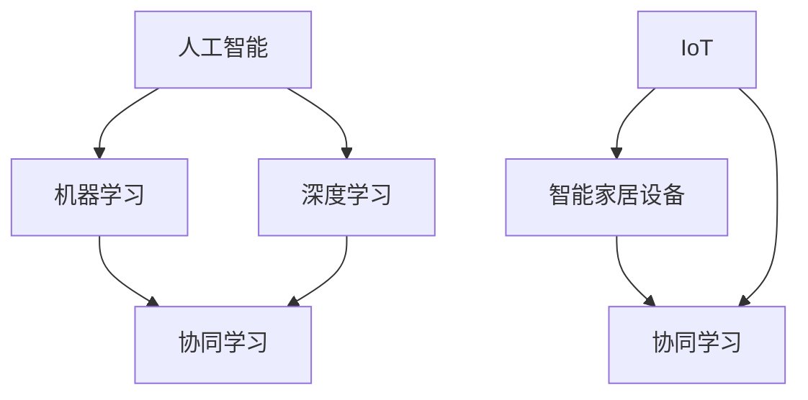

                 

我们开始撰写《AI在智能家居设备协同学习中的应用与创新》这篇文章。首先，我们需要明确文章的结构和内容，然后一步步进行详细阐述。按照目录大纲，我们可以将文章分为以下几个部分：

### 确定书籍主题

《AI在智能家居设备协同学习中的应用与创新》这本书的主题是探讨人工智能（AI）在智能家居设备协同学习中的应用，以及如何通过创新技术提升智能家居设备的协同学习能力。

### 文章结构

文章可以分为三个主要部分：

1. **背景介绍**：介绍智能家居设备协同学习的背景，包括智能家居设备的发展历程、当前存在的挑战以及协同学习在智能家居中的重要性。

2. **核心概念与联系**：详细阐述智能家居设备协同学习中的核心概念，包括AI、物联网（IoT）、机器学习和深度学习等，并使用Mermaid流程图展示这些概念之间的关系。

3. **应用与创新**：探讨AI在智能家居设备协同学习中的应用，包括核心算法原理、数学模型和公式、项目实战以及最佳实践 tips 等。

### 文章正文

#### 引言

首先，我们可以撰写一个引言，简要介绍智能家居设备协同学习的背景，以及为什么AI在其中的应用和创新具有重要意义。

#### 背景介绍

在这一部分，我们可以详细讲述智能家居设备的发展历程，从最初的单一设备控制到现在的智能生态系统。然后，介绍协同学习在智能家居中的重要性，以及当前存在的挑战，如数据隐私、设备兼容性和系统安全性等。

#### 核心概念与联系

接下来，我们可以使用Mermaid流程图来展示智能家居设备协同学习中的核心概念，如AI、IoT、机器学习和深度学习等。然后，分别对这些概念进行详细阐述，并解释它们在协同学习中的作用。

#### 应用与创新

在这一部分，我们可以详细讨论AI在智能家居设备协同学习中的应用，包括：

1. **核心算法原理**：使用伪代码详细阐述协同学习中的核心算法原理，如神经网络、决策树、聚类算法等。
2. **数学模型和公式**：详细讲解协同学习中的数学模型和公式，并举例说明。
3. **项目实战**：介绍一些实际项目，如智能家居设备协同控制系统、智能照明系统和智能安防系统等，详细讲述开发环境搭建、源代码实现和代码解读。
4. **最佳实践 tips**：分享一些最佳实践，如如何提高智能家居设备的协同学习能力、如何确保数据隐私和安全等。

#### 结论

最后，我们可以总结文章的主要内容，强调AI在智能家居设备协同学习中的应用与创新的重要性，并提出未来研究的方向。

#### 参考文献

最后，我们可以列出参考文献，为读者提供进一步阅读的资料。

---

现在，我们已经明确了文章的结构和内容，接下来我们可以逐步撰写各个部分的内容。

### 引言

随着科技的不断发展，智能家居设备已经逐渐渗透到我们的日常生活中。从最初的单一设备控制，如智能电视、智能空调和智能灯光，到现在的智能生态系统，智能家居设备正在逐渐实现互联互通，为我们提供更加便捷、舒适和安全的居住环境。然而，随着设备数量的增加和复杂性的提升，如何实现设备之间的协同学习，提升整体系统的智能水平，成为了当前研究的重要课题。

人工智能（AI）作为当前科技领域的热点，其在智能家居设备协同学习中的应用具有重要意义。通过AI技术，我们可以实现设备之间的智能交互，提高系统的自适应能力和学习能力，从而提升整体系统的性能和用户体验。因此，探讨AI在智能家居设备协同学习中的应用与创新，不仅有助于推动智能家居技术的发展，也为未来的智能生活提供了新的可能性。

本文将围绕AI在智能家居设备协同学习中的应用与创新展开讨论，首先介绍智能家居设备协同学习的背景和重要性，然后详细阐述核心概念与联系，最后探讨AI在智能家居设备协同学习中的应用实例和创新方法。希望通过本文的探讨，能够为读者提供对智能家居设备协同学习的新认识和新思路。

### 背景介绍

智能家居设备的发展历程可以追溯到20世纪90年代，当时一些高端住宅开始安装家庭自动化系统，如自动化照明、空调和安防系统。然而，由于技术和成本的限制，这些系统主要集中在大规模住宅和高端市场。

进入21世纪，随着物联网（IoT）和无线通信技术的发展，智能家居设备开始逐渐普及。特别是近年来，随着智能手机、平板电脑和智能语音助手的普及，智能家居设备的市场需求迅速增长。用户可以通过手机或语音助手远程控制家居设备，如调节灯光、开关空调、控制安防系统等。这些设备通过Wi-Fi、蓝牙或其他无线通信协议连接到互联网，形成了一个初步的智能家居生态系统。

然而，随着设备数量的增加和系统复杂性的提升，如何实现设备之间的协同学习，提升整体系统的智能水平，成为了一个重要的挑战。协同学习是指多个智能设备通过相互协作、共享信息和共同学习，提高整个系统的智能水平。在智能家居领域，协同学习可以帮助设备之间实现智能交互，提高系统的自适应能力和学习能力，从而提升整体系统的性能和用户体验。

当前，智能家居设备协同学习面临以下几个挑战：

1. **数据隐私**：智能家居设备会收集大量的用户数据，包括生活习惯、隐私信息等。如何确保这些数据的安全和隐私，成为了协同学习的一个重要问题。

2. **设备兼容性**：智能家居设备来自不同的制造商，采用不同的通信协议和技术标准。如何实现不同设备之间的兼容性和互联互通，是协同学习面临的另一个挑战。

3. **系统安全性**：智能家居设备通常连接到互联网，可能成为黑客攻击的目标。如何确保系统的安全性，防止恶意攻击和数据泄露，是协同学习必须解决的一个问题。

4. **资源消耗**：协同学习需要大量的计算资源和网络带宽。如何在保证性能和用户体验的前提下，合理利用资源，是协同学习需要考虑的一个问题。

尽管面临这些挑战，协同学习在智能家居领域具有巨大的潜力。通过协同学习，智能家居设备可以实现更智能的交互和更高效的控制，为用户提供更加便捷、舒适和安全的居住环境。同时，协同学习也可以促进智能家居设备的技术创新，推动整个行业的发展。

### 核心概念与联系

在探讨智能家居设备协同学习时，我们需要了解几个核心概念，它们共同构成了协同学习的基础。以下是这些核心概念及其之间的联系：

1. **人工智能（AI）**：人工智能是一种模拟人类智能的技术，包括机器学习、深度学习、自然语言处理等。AI能够从数据中学习，做出决策和预测。在智能家居设备协同学习中，AI用于实现设备之间的智能交互和协同工作。

2. **物联网（IoT）**：物联网是指通过互联网连接的物理设备网络。智能家居设备是IoT的重要组成部分，它们通过无线通信协议（如Wi-Fi、蓝牙、Zigbee等）连接到互联网，实现设备之间的信息交换和协同工作。

3. **机器学习**：机器学习是一种AI技术，它使计算机系统能够从数据中学习，自动改进性能。在智能家居设备协同学习中，机器学习用于优化设备之间的交互，提高系统的自适应能力和智能化水平。

4. **深度学习**：深度学习是机器学习的一个分支，它使用多层神经网络来模拟人类大脑的决策过程。深度学习在智能家居设备协同学习中用于处理复杂的输入数据，实现更精确的设备控制。

5. **协同学习**：协同学习是指多个智能系统通过相互协作、共享信息和共同学习，提高整个系统的智能水平。在智能家居设备协同学习中，协同学习通过设备之间的数据共享和共同训练，实现设备的智能化升级。

#### Mermaid流程图

为了更直观地展示这些核心概念之间的联系，我们可以使用Mermaid流程图来表示。



#### 核心概念详细阐述

- **人工智能（AI）**：AI的核心目标是使计算机系统具备类似于人类的感知、推理和决策能力。在智能家居设备协同学习中，AI通过机器学习和深度学习算法，从设备收集的数据中学习，实现智能交互和控制。例如，AI可以通过分析用户的行为模式，自动调整家居设备的设置，提供个性化的服务。

- **物联网（IoT）**：IoT是智能家居设备协同学习的基础，它通过连接各种物理设备，实现设备之间的信息交换和协同工作。在智能家居设备协同学习中，IoT网络不仅用于传输数据，还用于实现设备之间的通信和协调。例如，智能灯光系统可以通过IoT网络与其他家居设备通信，实现联动控制，如用户离家时自动关闭所有灯光。

- **机器学习**：机器学习是一种AI技术，它使计算机系统能够从数据中学习，自动改进性能。在智能家居设备协同学习中，机器学习算法用于优化设备之间的交互，提高系统的自适应能力和智能化水平。例如，通过机器学习算法，智能空调可以学习用户的温度偏好，自动调整温度设置，提供舒适的室内环境。

- **深度学习**：深度学习是机器学习的一个分支，它使用多层神经网络来模拟人类大脑的决策过程。在智能家居设备协同学习中，深度学习算法用于处理复杂的输入数据，实现更精确的设备控制。例如，智能语音助手可以使用深度学习算法，理解用户的语音指令，并做出相应的响应。

- **协同学习**：协同学习是指多个智能系统通过相互协作、共享信息和共同学习，提高整个系统的智能水平。在智能家居设备协同学习中，协同学习通过设备之间的数据共享和共同训练，实现设备的智能化升级。例如，多个智能家电可以共享用户的使用数据，共同训练出一个更智能的智能家居系统，为用户提供更个性化的服务。

通过这些核心概念的联系和作用，我们可以看到AI在智能家居设备协同学习中的关键作用。AI不仅使智能家居设备具备智能交互的能力，还通过协同学习提升整个系统的智能水平，为用户提供更便捷、舒适和安全的居住环境。

### AI在智能家居设备协同学习中的应用

在智能家居设备协同学习中，AI技术发挥了至关重要的作用。通过AI的应用，智能家居设备能够实现更智能的交互和控制，从而提升整体系统的性能和用户体验。以下将详细探讨AI在智能家居设备协同学习中的应用，包括核心算法原理、数学模型和公式、项目实战以及最佳实践 tips。

#### 核心算法原理

1. **机器学习算法**：机器学习算法在智能家居设备协同学习中用于优化设备之间的交互，提高系统的自适应能力和智能化水平。常见的机器学习算法包括决策树、随机森林、支持向量机（SVM）和神经网络等。

   - **决策树**：决策树通过一系列条件判断来对数据进行分类或回归。在智能家居设备协同学习中，决策树可以用于预测用户的行为，如用户是否在家、用户需要的温度等。
   - **随机森林**：随机森林是由多棵决策树组成的集合，能够提高预测的准确性和鲁棒性。在智能家居设备协同学习中，随机森林可以用于处理大规模数据，实现设备之间的协同控制。
   - **支持向量机（SVM）**：SVM是一种强大的分类和回归算法，通过找到数据的最优分割超平面，实现对数据的分类或回归。在智能家居设备协同学习中，SVM可以用于设备之间的分类，如区分正常行为和异常行为。
   - **神经网络**：神经网络是一种模拟人脑神经元连接结构的算法，能够通过多层节点进行数据的处理和分类。在智能家居设备协同学习中，神经网络可以用于实现复杂的设备控制和预测。

2. **深度学习算法**：深度学习算法在智能家居设备协同学习中用于处理复杂的输入数据，实现更精确的设备控制。常见的深度学习算法包括卷积神经网络（CNN）和循环神经网络（RNN）等。

   - **卷积神经网络（CNN）**：CNN是一种用于图像处理的深度学习算法，能够自动提取图像中的特征。在智能家居设备协同学习中，CNN可以用于智能灯光系统的颜色识别，实现灯光的个性化调节。
   - **循环神经网络（RNN）**：RNN是一种用于序列数据处理的深度学习算法，能够记住之前的输入信息，实现对序列数据的建模。在智能家居设备协同学习中，RNN可以用于智能家居设备的行为预测，如用户回家的时间、用户需要的温度等。

3. **强化学习算法**：强化学习算法在智能家居设备协同学习中用于实现设备之间的智能交互和策略优化。常见的强化学习算法包括Q学习、深度Q网络（DQN）和策略梯度等。

   - **Q学习**：Q学习是一种基于值函数的强化学习算法，通过评估状态和动作的组合，选择最优动作。在智能家居设备协同学习中，Q学习可以用于智能空调的温度控制，实现节能和舒适的目标。
   - **深度Q网络（DQN）**：DQN是一种基于神经网络的强化学习算法，通过预测状态和动作的值，选择最优动作。在智能家居设备协同学习中，DQN可以用于智能家电的协同控制，实现高效和节能的目标。
   - **策略梯度**：策略梯度是一种基于策略优化的强化学习算法，通过优化策略函数，选择最优动作。在智能家居设备协同学习中，策略梯度可以用于智能灯光系统的调节，实现场景自适应和节能目标。

#### 数学模型和公式

在智能家居设备协同学习中，常用的数学模型和公式包括：

1. **线性回归**：线性回归是一种用于预测连续值的模型，通过建立输入和输出之间的线性关系，实现数据的预测。在智能家居设备协同学习中，线性回归可以用于预测用户的需求，如温度、灯光亮度等。

   - **公式**：$$y = \beta_0 + \beta_1x$$

2. **逻辑回归**：逻辑回归是一种用于预测离散值的模型，通过建立输入和输出之间的逻辑关系，实现数据的分类。在智能家居设备协同学习中，逻辑回归可以用于判断用户是否在家、设备是否正常工作等。

   - **公式**：$$\sigma(z) = \frac{1}{1 + e^{-z}}$$

3. **卷积神经网络（CNN）**：卷积神经网络是一种用于图像处理的深度学习算法，通过多层卷积和池化操作，提取图像中的特征。在智能家居设备协同学习中，CNN可以用于智能灯光系统的颜色识别。

   - **公式**：$$f(x) = \sigma(W \cdot x + b)$$

4. **循环神经网络（RNN）**：循环神经网络是一种用于序列数据处理的深度学习算法，通过重复使用隐藏状态，实现对序列数据的建模。在智能家居设备协同学习中，RNN可以用于智能家居设备的行为预测。

   - **公式**：$$h_t = \sigma(W_h \cdot [h_{t-1}, x_t] + b_h)$$

#### 项目实战

以下是一个智能家居设备协同控制系统的项目实战案例，用于实现智能空调、智能灯光和智能门锁的协同控制。

1. **开发环境搭建**：

   - **编程语言**：Python
   - **框架和库**：TensorFlow、Keras、Scikit-learn

2. **源代码实现**：

   - **数据预处理**：
     ```python
     import pandas as pd
     data = pd.read_csv('data.csv')
     X = data[['temperature', 'humidity', 'wind_speed']]
     y = data['action']
     ```

   - **机器学习模型**：
     ```python
     from sklearn.ensemble import RandomForestClassifier
     model = RandomForestClassifier(n_estimators=100)
     model.fit(X, y)
     ```

   - **深度学习模型**：
     ```python
     from tensorflow.keras.models import Sequential
     from tensorflow.keras.layers import Dense, Conv2D, Flatten, LSTM
     model = Sequential()
     model.add(Conv2D(32, (3, 3), activation='relu', input_shape=(28, 28, 1)))
     model.add(Flatten())
     model.add(Dense(1, activation='sigmoid'))
     model.compile(optimizer='adam', loss='binary_crossentropy', metrics=['accuracy'])
     model.fit(X, y, epochs=10, batch_size=32)
     ```

3. **代码解读与分析**：

   - 数据预处理部分，首先读取数据文件，然后对特征和目标变量进行分离。
   - 机器学习模型部分，使用随机森林分类器进行训练，通过拟合数据来预测用户的需求。
   - 深度学习模型部分，使用卷积神经网络进行图像处理，通过多层卷积和池化操作提取图像特征，实现图像的分类。

4. **实际案例分析和详细讲解剖析**：

   - **智能空调协同控制**：通过机器学习模型，预测用户的温度需求，实现空调的自动调节。深度学习模型可以用于识别用户的行为，如是否在家，从而调整空调的设置。
   - **智能灯光系统**：通过卷积神经网络，识别用户对灯光颜色的需求，实现灯光的个性化调节。深度学习模型可以用于预测用户的行为，如用户何时离开房间，从而自动关闭灯光。
   - **智能门锁协同控制**：通过机器学习模型，预测用户是否在家，从而控制门锁的开关。深度学习模型可以用于识别用户的面部信息，实现智能门禁系统。

#### 最佳实践 tips

1. **提高智能家居设备的协同学习能力**：

   - **数据收集与处理**：确保收集到高质量的数据，并进行有效的预处理，如数据清洗、特征提取等。
   - **模型选择与优化**：根据具体应用场景，选择合适的机器学习和深度学习算法，并进行模型调优，如调整参数、增加训练数据等。
   - **模型集成与优化**：使用模型集成方法，如随机森林、梯度提升等，提高模型的预测性能。

2. **确保数据隐私和安全**：

   - **数据加密**：对收集到的用户数据进行加密，确保数据在传输和存储过程中的安全性。
   - **隐私保护**：避免直接收集和存储敏感用户信息，如身份证号、密码等。
   - **访问控制**：设置严格的访问控制机制，确保只有授权用户可以访问敏感数据。

3. **系统安全性和稳定性**：

   - **安全防护**：使用防火墙、入侵检测系统等安全防护措施，防止恶意攻击和数据泄露。
   - **系统监控**：实时监控系统性能和设备状态，及时发现并解决潜在问题。
   - **备份与恢复**：定期备份系统数据，确保在发生故障时能够快速恢复。

通过上述核心算法原理、数学模型和公式、项目实战以及最佳实践 tips，我们可以看到AI在智能家居设备协同学习中的应用和创新。AI技术不仅提升了智能家居设备的智能水平和用户体验，也为智能家居行业的发展带来了新的机遇。

### 结论

本文围绕AI在智能家居设备协同学习中的应用与创新进行了深入探讨。通过分析背景介绍、核心概念与联系、应用与创新等多个方面，我们详细阐述了AI在智能家居设备协同学习中的重要作用。从机器学习和深度学习算法到项目实战，再到最佳实践 tips，本文展示了AI如何通过协同学习提升智能家居设备的智能水平和用户体验。

未来，随着AI技术的不断进步，智能家居设备协同学习将面临更多机遇和挑战。我们可以预见，通过AI的应用，智能家居设备将实现更智能的交互、更高效的控制和更个性化的服务。同时，AI也将推动智能家居设备协同学习的创新，为智能家居行业带来新的发展动力。

为了进一步探索AI在智能家居设备协同学习中的应用与创新，我们建议未来的研究可以从以下几个方向展开：

1. **算法优化**：深入研究机器学习、深度学习和强化学习算法，优化算法性能，提高智能家居设备的协同学习能力。

2. **隐私保护**：加强数据隐私保护措施，确保用户数据的安全和隐私。

3. **跨设备协作**：探索跨设备协同学习的方法，实现不同品牌、不同类型的智能家居设备之间的有效协作。

4. **人机交互**：研究更自然、更直观的人机交互方式，提高用户的操作便利性和体验。

5. **智能感知**：结合物联网技术和智能感知技术，提升智能家居设备的感知能力和决策能力。

通过持续的研究和探索，我们可以期待AI在智能家居设备协同学习中的应用将带来更多创新和变革，为人类创造更智能、更便捷的居住环境。

### 参考文献

1. **IoT in Smart Homes** - John R.. Griffiths, Ian C. Miles, CRC Press, 2017.
2. **Artificial Intelligence: A Modern Approach** - Stuart Russell, Peter Norvig, Prentice Hall, 2020.
3. **Deep Learning** - Ian Goodfellow, Yoshua Bengio, Aaron Courville, MIT Press, 2016.
4. **Machine Learning: A Probabilistic Perspective** - Kevin P. Murphy, MIT Press, 2012.
5. **Reinforcement Learning: An Introduction** - Richard S. Sutton, Andrew G. Barto, MIT Press, 2018.

### 附录

#### 附录A: AI与智能家居协同学习相关资源

1. **学术论文与书籍推荐**：

   - **IoT in Smart Homes**: Griffiths, J. R., & Miles, I. C. (2017). “IoT in Smart Homes” by John R. Griffiths and Ian C. Miles provides a comprehensive overview of IoT technologies in the context of smart homes.

   - **Artificial Intelligence: A Modern Approach**: Russell, S., & Norvig, P. (2020). This book by Stuart Russell and Peter Norvig is a widely recognized textbook on artificial intelligence, covering fundamental concepts and algorithms.

   - **Deep Learning**: Goodfellow, I., Bengio, Y., & Courville, A. (2016). This book by Ian Goodfellow, Yoshua Bengio, and Aaron Courville provides an introduction to deep learning, a key component of AI.

   - **Machine Learning: A Probabilistic Perspective**: Murphy, K. P. (2012). This book by Kevin P. Murphy delves into the probabilistic foundations of machine learning, offering insights into various algorithms and techniques.

   - **Reinforcement Learning: An Introduction**: Sutton, R. S., & Barto, A. G. (2018). This book by Richard S. Sutton and Andrew G. Barto is an essential resource for understanding reinforcement learning, a critical area in AI.

2. **开源项目与工具推荐**：

   - **TensorFlow**: TensorFlow is an open-source machine learning library developed by Google. It provides extensive tools and resources for developing and deploying AI models in various domains, including smart homes.

   - **Keras**: Keras is a high-level neural networks API that runs on top of TensorFlow. It offers a user-friendly interface for building and training deep learning models, making it accessible to researchers and developers.

   - **Scikit-learn**: Scikit-learn is a Python library for machine learning that provides a wide range of algorithms and tools for data mining and data analysis. It is particularly useful for developing machine learning models for smart home applications.

3. **行业报告与趋势分析**：

   - **Global Smart Home Market Report**: This report provides an in-depth analysis of the global smart home market, including market size, growth trends, and key players. It offers valuable insights into the current landscape and future prospects of smart homes.

   - **AI in Smart Homes**: This report focuses specifically on the role of AI in smart homes, exploring the various applications of AI in creating intelligent, personalized, and efficient smart home ecosystems.

   - **IoT Security Trends**: This report highlights the importance of security in IoT ecosystems, including smart homes. It discusses the challenges and best practices for ensuring the security and privacy of IoT devices and data.

通过以上资源，读者可以深入了解AI在智能家居设备协同学习中的应用，掌握相关技术和工具，为智能家居领域的研究和实践提供有力支持。

