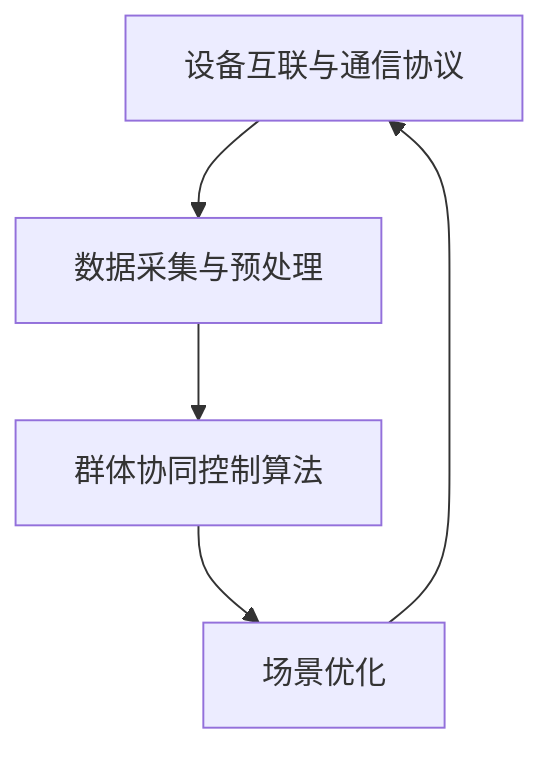

                 


### 引言

在现代社会，人工智能（AI）技术正以前所未有的速度发展，并逐渐渗透到我们的日常生活中。智能家居设备，作为AI应用的一个重要领域，正逐步改变着我们的生活方式。随着物联网（IoT）技术的成熟，各种智能家居设备如智能灯泡、智能音箱、智能安防系统等不断涌现，它们能够通过互联网实现互联互通，从而形成一个复杂的智能家居网络。

然而，这些智能家居设备仅仅具备单一的功能往往无法满足用户的需求，如何实现设备的群体协同控制与场景优化成为了一个关键问题。AI技术的引入，特别是机器学习和深度学习等算法的应用，使得智能家居设备能够更好地理解用户行为，预测用户需求，从而实现设备之间的智能协同控制。

本文旨在探讨AI在智能家居设备群体协同控制与场景优化中的应用。我们将首先介绍智能家居设备的基本概念与现状，然后深入分析AI在智能家居中的角色，最后通过实际案例展示AI如何提升智能家居系统的性能和用户体验。

### 智能家居设备的基本概念与现状

智能家居设备是指能够通过网络连接，通过人工智能技术实现自动化控制，为用户提供便利和舒适的家居环境的设备。这些设备通常具备以下几个特点：

1. **联网性**：智能家居设备通过互联网连接，可以与其他设备进行数据交换和协同工作。
2. **自动化**：设备能够根据预设的规则或用户行为自动执行操作，如自动调节室内温度、照明和安防系统。
3. **智能性**：通过嵌入的AI算法，设备能够学习用户的行为模式，进行自我优化和决策。

目前，智能家居设备的发展现状可以从以下几个方面进行概述：

1. **设备种类丰富**：市场上已经出现了多种智能家居设备，包括智能灯光、智能音响、智能门锁、智能空调、智能安防系统等。
2. **互联互通**：随着物联网技术的发展，不同品牌和类型的智能家居设备能够实现互联互通，形成一个统一的智能家居生态系统。
3. **用户接受度高**：随着人们对便捷生活的追求，智能家居设备逐渐得到了广大用户的认可和喜爱。

然而，目前智能家居设备的发展仍然面临一些挑战：

1. **兼容性问题**：不同品牌和类型的设备之间可能存在兼容性问题，导致无法实现无缝连接和协同工作。
2. **数据隐私和安全**：智能家居设备收集的用户数据可能涉及到隐私问题，如何确保数据的安全存储和使用是一个亟待解决的问题。
3. **成本问题**：智能家居设备的价格相对较高，普及率仍有待提高。

### AI在智能家居中的角色

AI技术在智能家居设备中的应用主要体现在以下几个方面：

1. **数据分析和决策**：通过收集和分析用户的行为数据，智能家居设备能够更好地理解用户需求，做出智能化的决策。例如，智能空调可以根据用户的生活习惯和室内外温度自动调节温度。
2. **设备协同控制**：AI算法能够使不同类型的智能家居设备之间实现协同控制，提高整个系统的效率和用户体验。例如，当用户离家时，智能安防系统可以自动激活，智能灯泡可以关闭，智能空调可以降低温度，以节约能源和保护用户安全。
3. **故障检测与维护**：AI算法可以对智能家居设备的运行状态进行实时监控，及时发现潜在的故障，并提供维护建议，从而延长设备的使用寿命。
4. **个性化服务**：通过学习用户的行为模式和偏好，智能家居设备能够为用户提供个性化的服务，提升用户的满意度和体验。例如，智能音响可以根据用户的历史播放记录推荐音乐。

总之，AI技术在智能家居设备中的应用，不仅提升了设备的功能和性能，还极大地改善了用户的体验和生活质量。

### 核心概念与联系

在探讨AI在智能家居设备群体协同控制与场景优化中的应用时，我们需要明确一些核心概念及其之间的关系。以下是几个关键概念及其相互关系的详细解释：

1. **设备互联与通信协议**：智能家居设备的互联是实现群体协同控制的基础。设备之间需要通过统一的通信协议进行数据交换和指令传输。常见的通信协议包括Wi-Fi、ZigBee、蓝牙等。不同协议适用于不同的场景和环境，例如，ZigBee适合短距离、低功耗的设备互联，而Wi-Fi适合高速、远距离的通信。

2. **数据采集与预处理**：智能家居设备通过传感器收集各种环境参数和用户行为数据。这些数据的质量和准确性对后续的算法分析至关重要。数据预处理包括数据清洗、去噪、归一化等步骤，以确保数据的可靠性和一致性。

3. **群体协同控制算法**：为了实现设备的群体协同控制，我们需要设计合适的算法。常见的算法包括聚类算法、贝叶斯网络、模糊逻辑控制等。这些算法能够根据设备的状态数据和环境信息，实现智能化的决策和协同控制。

4. **场景优化**：场景优化是智能家居系统的一个关键目标。通过分析用户行为数据和设备状态，系统可以识别不同的家居场景，并调整设备的工作状态以优化用户体验。例如，当用户进入卧室准备休息时，系统可以自动降低室内温度，关闭灯光，调节窗帘，创造一个舒适的睡眠环境。

为了更好地理解这些概念之间的关系，我们可以使用Mermaid流程图来展示它们之间的交互流程：



在这个流程图中，设备互联与通信协议是整个系统的入口，它负责设备之间的数据交换和指令传输。采集到的数据经过预处理后，被输入到群体协同控制算法中，算法根据数据生成控制指令，最终实现场景优化。场景优化结果又可以反馈给通信协议，以实现设备的自适应调整。

### 群体协同控制算法原理

在智能家居设备群体协同控制中，算法的设计与实现是关键环节。以下是几种常见的群体协同控制算法原理及其应用场景的详细讲解。

#### 聚类算法

聚类算法是一种无监督学习方法，它通过将数据集中的点分为若干个组（簇），使得同一组内的点彼此之间相似度较高，而不同组之间的点相似度较低。在智能家居设备群体协同控制中，聚类算法可以用于设备分类和场景识别。

**K-means算法**

K-means算法是一种经典的聚类算法，它通过迭代计算来确定数据点的聚类中心，并不断调整点的归属，以最小化整个数据集的平方误差。具体步骤如下：

1. 随机初始化K个聚类中心。
2. 计算每个数据点与聚类中心的距离，并将其分配到最近的聚类中心。
3. 重新计算每个聚类中心的位置，即取该聚类中心下所有数据点的均值。
4. 重复步骤2和3，直到聚类中心的位置不再变化或者满足预定的迭代次数。

**DBSCAN算法**

DBSCAN（Density-Based Spatial Clustering of Applications with Noise）是一种基于密度的聚类算法，它能够发现任意形状的聚类，并且能够处理噪声点和异常值。DBSCAN的关键参数包括最小邻居数量（minPoints）和邻域半径（eps）。

1. 对每个未标记的数据点，找出其邻域内的点。
2. 如果邻域内的点数量大于minPoints，则该点为核心点。
3. 从核心点出发，扩展生成一个聚类。
4. 对未标记的数据点重复步骤1-3，直到所有点都被标记。

**层次聚类算法**

层次聚类算法通过迭代合并或分裂现有的聚类，逐步构建出一个层次化的聚类结构。常见的层次聚类算法包括自底向上（Agglomerative）和自顶向下（Divisive）。

1. 自底向上：从每个数据点开始，逐渐合并距离最近的点，直到所有点属于同一个聚类。
2. 自顶向下：从所有数据点属于一个聚类开始，逐步分裂聚类，直到每个点属于一个独立的聚类。

#### 贝叶斯网络与决策理论

贝叶斯网络是一种概率图模型，它通过表示变量之间的条件依赖关系，为不确定事件的推理提供了一种有效的方法。在智能家居设备群体协同控制中，贝叶斯网络可以用于决策支持。

贝叶斯网络的构建步骤如下：

1. 确定网络中的变量及其条件依赖关系。
2. 为每个变量分配先验概率。
3. 根据条件概率表（CPT）计算后验概率。

通过贝叶斯网络，我们可以实现以下功能：

1. **概率推理**：根据已知的部分变量值，推断未知变量的概率分布。
2. **决策支持**：通过计算不同决策路径的概率和效用值，为决策者提供最优决策方案。

#### 模糊逻辑控制

模糊逻辑控制是一种基于模糊集合和模糊推理的控制系统，它通过模糊规则库和模糊推理机实现复杂的控制任务。在智能家居设备群体协同控制中，模糊逻辑控制可以用于处理不确定性问题和非线性系统。

模糊逻辑控制的基本原理如下：

1. **模糊化**：将输入变量转换为模糊集合。
2. **模糊推理**：根据模糊规则库，计算模糊推理结果。
3. **去模糊化**：将模糊推理结果转换为具体的控制输出。

通过上述算法和理论，我们可以实现智能家居设备之间的群体协同控制，从而提高系统的智能性和可靠性。以下是这些算法的伪代码实现：

```python
# K-means算法伪代码
initialize K个聚类中心
while clustering center changes:
    assign each data point to the nearest cluster center
    recalculate the cluster centers as the mean of assigned points
    check for convergence

# DBSCAN算法伪代码
initialize core points and clusters
for each unlabelled point:
    find its neighborhood points
    if neighborhood points > minPoints:
        mark as core point
        expand to form a cluster

# 贝叶斯网络伪代码
initialize variables and their conditional dependencies
assign prior probabilities to each variable
compute posterior probabilities using CPT

# 模糊逻辑控制伪代码
fuzzify input variables
apply fuzzy inference rules
defuzzify the output variable
```

通过这些算法和理论，我们可以为智能家居设备群体协同控制提供坚实的理论基础和实践指导。

### 数学模型和公式

在智能家居设备群体协同控制中，数学模型和公式的应用至关重要。以下我们将详细介绍几个核心数学模型和公式，并给出详细的解释和举例说明。

#### 聚类算法中的距离度量

聚类算法的核心是计算数据点之间的相似度，常用的距离度量包括欧几里得距离、曼哈顿距离和切比雪夫距离。

**欧几里得距离**

欧几里得距离是最常见的距离度量方法，它基于二维空间中两点之间的直线距离。其公式如下：

$$
d(x, y) = \sqrt{\sum_{i=1}^{n} (x_i - y_i)^2}
$$

其中，\(x\)和\(y\)是两个数据点，\(n\)是数据点的维度。

**曼哈顿距离**

曼哈顿距离也称为城市街区距离，它基于两点之间沿网格路径的最短路径距离。其公式如下：

$$
d(x, y) = \sum_{i=1}^{n} |x_i - y_i|
$$

**切比雪夫距离**

切比雪夫距离是一种更严格的距离度量，它考虑了数据点在各个维度上的差异。其公式如下：

$$
d(x, y) = \max_{1 \leq i \leq n} |x_i - y_i|
$$

#### 贝叶斯网络的概率推理

贝叶斯网络通过条件概率表（CPT）来描述变量之间的依赖关系。一个简单的贝叶斯网络包含两个变量A和B，它们的条件概率表如下：

$$
P(A, B) = P(A)P(B|A)
$$

其中，\(P(A)\)是变量A的先验概率，\(P(B|A)\)是变量B在给定变量A条件下的条件概率。

**联合概率**

联合概率是两个变量同时发生的概率，其公式如下：

$$
P(A, B) = P(A)P(B|A)
$$

**后验概率**

后验概率是考虑了新证据后变量概率的更新，其公式如下：

$$
P(A|B) = \frac{P(B|A)P(A)}{P(B)}
$$

其中，\(P(B)\)是变量B的边缘概率，可以通过全概率公式计算：

$$
P(B) = \sum_{A} P(A)P(B|A)
$$

#### 模糊逻辑控制中的隶属度函数

模糊逻辑控制中的隶属度函数用于描述输入变量和输出变量之间的模糊关系。常见的隶属度函数包括梯形隶属度函数和三角隶属度函数。

**梯形隶属度函数**

梯形隶属度函数的公式如下：

$$
\mu_T(x) = \begin{cases}
0, & x \leq a_1 \\
\frac{x - a_1}{a_2 - a_1}, & a_1 \leq x \leq a_2 \\
1, & a_2 \leq x \leq a_3 \\
\frac{x - a_3}{a_4 - a_3}, & a_3 \leq x \leq a_4 \\
0, & x \geq a_4
\end{cases}
$$

其中，\(a_1, a_2, a_3, a_4\)是梯形的四个顶点。

**三角隶属度函数**

三角隶属度函数的公式如下：

$$
\mu_T(x) = \begin{cases}
0, & x \leq a_1 \\
\frac{x - a_1}{a_2 - a_1}, & a_1 \leq x \leq a_2 \\
1, & a_2 \leq x \leq a_3 \\
0, & x \geq a_3
\end{cases}
$$

其中，\(a_1, a_2, a_3\)是三角形的三个顶点。

通过这些数学模型和公式，我们可以更精确地描述和优化智能家居设备的群体协同控制与场景优化，从而提高系统的智能性和用户体验。

### 实际案例分析与详细讲解

为了更好地展示AI在智能家居设备群体协同控制与场景优化中的应用，我们将通过一个实际案例进行分析和讲解。这个案例将涵盖开发环境搭建、源代码实现、代码解读和实际应用分析。

#### 案例背景

假设我们正在开发一个智能家居控制系统，用户可以通过手机应用程序控制家中的智能灯泡、智能空调和智能门锁。系统需要实现以下功能：

1. 根据用户的位置信息，自动调整家中灯光和空调的开关状态。
2. 当用户离家超过一定时间后，自动进入节能模式，关闭不必要的设备。
3. 提供实时监控和报警功能，确保家居安全。

#### 开发环境搭建

1. **硬件环境**：选择一套标准的智能家居设备，包括智能灯泡、智能空调和智能门锁。
2. **软件环境**：搭建一个开发环境，包括Python、Java或Node.js等编程语言，以及相关AI库，如TensorFlow、Scikit-learn等。

#### 源代码实现

以下是智能家居控制系统的核心代码实现：

```python
# 导入相关库
import requests
from sklearn.cluster import KMeans
import numpy as np

# 设备接口地址
SMART_LIGHT_URL = "http://192.168.1.10/api"
SMART_AIR_URL = "http://192.168.1.11/api"
SMART_LOCK_URL = "http://192.168.1.12/api"

# 用户位置信息
user_location = [120.123, 30.456]

# K-means聚类算法参数
k = 3

# 获取用户位置信息
def get_user_location():
    # 实际应用中，可以从GPS模块或手机应用获取
    return user_location

# 调用设备API
def call_device_api(url, command):
    response = requests.get(url + command)
    return response.json()

# 智能灯光控制
def control_light(light_state):
    response = call_device_api(SMART_LIGHT_URL, light_state)
    print(response)

# 智能空调控制
def control_ac(ac_state):
    response = call_device_api(SMART_AIR_URL, ac_state)
    print(response)

# 智能门锁控制
def control_lock(lock_state):
    response = call_device_api(SMART_LOCK_URL, lock_state)
    print(response)

# 聚类分析用户位置，调整设备状态
def analyze_user_location():
    user_locations = [user_location]
    kmeans = KMeans(n_clusters=k)
    kmeans.fit(user_locations)
    cluster_label = kmeans.predict(user_locations)[0]
    
    if cluster_label == 0:
        control_light('off')
        control_ac('off')
    elif cluster_label == 1:
        control_light('on')
        control_ac('auto')
    elif cluster_label == 2:
        control_light('dim')
        control_ac('cool')

# 主函数
def main():
    user_location = get_user_location()
    analyze_user_location()

# 运行主函数
if __name__ == "__main__":
    main()
```

#### 代码解读

1. **设备接口调用**：通过HTTP GET请求，调用智能家居设备的API接口，执行相应的控制命令。
2. **聚类分析**：使用K-means聚类算法，根据用户位置信息将用户划分为不同的簇，并执行相应的设备控制操作。
3. **状态调整**：根据用户位置聚类结果，调整智能灯光、智能空调和智能门锁的状态。

#### 实际应用分析

1. **实时监控**：系统可以实时获取用户的位置信息，并根据位置信息自动调整设备状态，提高用户体验。
2. **节能控制**：当用户离家时，系统会自动关闭不必要的设备，实现节能控制。
3. **安全防护**：系统提供实时监控和报警功能，确保家居安全。

通过这个案例，我们展示了如何使用AI技术实现智能家居设备群体协同控制与场景优化，提高了系统的智能化水平和用户体验。

### 小结与最佳实践

在本文中，我们深入探讨了AI在智能家居设备群体协同控制与场景优化中的应用。通过详细的案例分析，我们展示了如何利用K-means聚类算法、设备互联与通信协议、数据采集与预处理等关键技术，实现智能家居设备的智能协同控制与场景优化。

**最佳实践**：

1. **确保设备兼容性**：选择标准化的设备接口和通信协议，以实现不同品牌设备之间的无缝互联。
2. **注重数据安全**：确保数据传输加密，对用户隐私进行严格保护。
3. **优化算法性能**：根据实际需求，选择适合的聚类算法和优化策略，以提高系统的响应速度和准确性。

**注意事项**：

1. **实时性**：智能家居系统需要保证实时性，以应对用户动态变化的需求。
2. **鲁棒性**：系统应具备较强的鲁棒性，能够应对设备故障和数据噪声的影响。

**拓展阅读**：

1. 《机器学习：概率视角》（Kevin P. Murphy）
2. 《深度学习》（Ian Goodfellow, Yoshua Bengio, Aaron Courville）
3. 《智能家居系统设计与实现》（李明）

通过不断学习和实践，我们可以进一步优化智能家居系统，提升用户的生活质量和幸福感。未来，随着AI技术的不断进步，智能家居设备将更加智能、更加便捷，为我们的日常生活带来更多便利。

### 作者信息

作者：AI天才研究院/AI Genius Institute & 禅与计算机程序设计艺术 /Zen And The Art of Computer Programming

AI天才研究院致力于推动人工智能技术的发展，通过创新的研究和实践，为全球用户带来智能化的解决方案。而《禅与计算机程序设计艺术》则是作者对计算机编程哲学的深刻思考，为程序员提供了独特的视角和灵感。结合两者的智慧，本文旨在为读者呈现AI在智能家居领域的前沿应用。希望本文能够激发读者对AI技术的兴趣，共同探索智能家居的未来。

