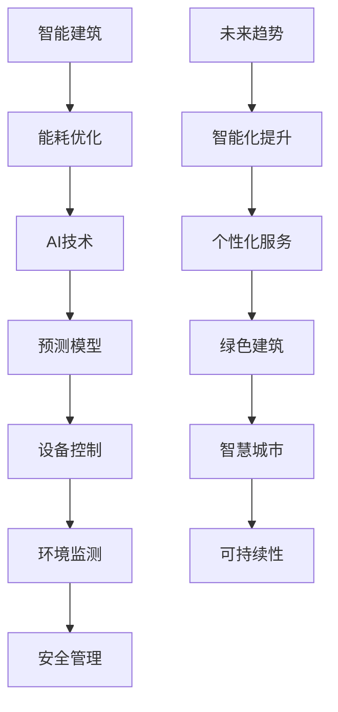

                 


### 第1章 引言与概述

#### 1.1 智能建筑能耗优化的背景与意义

随着全球城市化进程的不断加快，智能建筑作为现代城市建设的重要组成部分，受到了广泛关注。智能建筑不仅提升了建筑物的功能性和舒适性，还大大提高了能源利用效率。然而，随之而来的能耗问题也逐渐显现出来，成为制约智能建筑可持续发展的重要因素。据统计，建筑物能耗在全球总能耗中占据了相当大的比例。因此，对智能建筑能耗进行优化具有重要的现实意义。

首先，智能建筑能耗优化的背景源于以下几个方面：

1. **能源危机**：随着全球能源消耗的不断增加，传统能源供应日益紧张。智能建筑通过优化能耗，可以有效缓解能源压力，实现可持续发展。
   
2. **环境保护**：建筑能耗的降低意味着减少温室气体排放，有助于应对气候变化和环境恶化问题。

3. **经济效益**：通过优化能耗，智能建筑可以降低运营成本，提高投资回报率。

4. **技术进步**：随着物联网、大数据、人工智能等技术的快速发展，智能建筑能耗优化具备了技术可行性。

#### 1.2 AI在智能建筑中的应用现状与发展趋势

人工智能（AI）作为一门综合性学科，其核心目标是使计算机具有人类智能。近年来，AI技术在智能建筑中的应用越来越广泛，已成为智能建筑能耗优化的关键驱动因素。以下是AI在智能建筑中的应用现状与发展趋势：

1. **能耗预测**：通过机器学习、深度学习等技术，AI可以对建筑能耗进行准确预测，从而为能耗优化提供数据支持。

2. **设备控制**：AI技术可以实时监控建筑设备运行状态，智能调整设备运行参数，实现能耗优化。

3. **环境监测**：AI可以实时监测室内外环境参数，如温度、湿度、空气质量等，为智能调节室内环境提供依据。

4. **安全管理**：AI技术可以实现对建筑安全的智能监控，包括火灾报警、入侵检测等。

5. **发展趋势**：随着AI技术的不断进步，未来智能建筑能耗优化将更加智能化、精细化，实现更高水平的能耗优化。

#### 1.3 本书结构安排与内容概述

本书旨在深入探讨AI在智能建筑全生命周期能耗优化中的多维度应用。具体内容安排如下：

- **第1章 引言与概述**：介绍智能建筑能耗优化的背景与意义，以及AI在智能建筑中的应用现状与发展趋势。

- **第2章 智能建筑基础知识**：详细阐述智能建筑的定义与特点，主要组成部分以及能源管理系统。

- **第3章 AI基础理论**：介绍机器学习、深度学习等核心算法，包括监督学习、无监督学习、强化学习等。

- **第4章 能耗数据采集与分析**：讲解能耗数据采集、预处理方法，数据特征提取，数据可视化方法，数据分析算法等。

- **第5章 AI在智能建筑能耗优化中的应用**：探讨AI在能耗预测、能耗优化算法等方面的应用。

- **第6章 案例研究**：通过具体案例，展示AI在智能建筑能耗优化中的实际应用。

- **第7章 AI在智能建筑能耗优化中的挑战与未来发展**：分析AI在智能建筑能耗优化中面临的挑战，展望未来发展趋势。

- **第8章 结论**：总结全书内容，对未来的研究方向提出展望。

通过本书的深入探讨，我们期望为智能建筑能耗优化提供理论支持和实践指导，助力我国智能建筑产业的可持续发展。


---

**关键词**：智能建筑、能耗优化、人工智能、机器学习、深度学习、能耗预测、能耗优化算法

**摘要**：

本文介绍了智能建筑能耗优化的背景与意义，以及AI在智能建筑中的应用现状与发展趋势。随后，详细阐述了智能建筑的基础知识，包括定义、特点、主要组成部分和能源管理系统。接着，本文介绍了AI的基础理论，包括机器学习、深度学习等核心算法。在此基础上，本文探讨了能耗数据采集与分析的方法，以及AI在智能建筑能耗优化中的应用，包括能耗预测和能耗优化算法。通过案例研究，展示了AI在智能建筑能耗优化中的实际应用。最后，本文分析了AI在智能建筑能耗优化中面临的挑战与未来发展趋势，为智能建筑能耗优化提供了理论支持和实践指导。


----------------------------------------------------------------

# 《AI在智能建筑全生命周期能耗优化中的多维度应用》目录大纲

## 第1章 引言与概述

### 1.1 智能建筑能耗优化的背景与意义
### 1.2 AI在智能建筑中的应用现状与发展趋势
### 1.3 本书结构安排与内容概述

## 第2章 智能建筑基础知识

### 2.1 智能建筑的定义与特点
### 2.2 智能建筑的主要组成部分
### 2.3 智能建筑的能源管理系统

## 第3章 AI基础理论

### 3.1 机器学习基础
#### 3.1.1 监督学习
#### 3.1.2 无监督学习
#### 3.1.3 强化学习

### 3.2 深度学习与神经网络
#### 3.2.1 深度学习的基本概念
#### 3.2.2 神经网络的结构与训练
#### 3.2.3 卷积神经网络（CNN）
#### 3.2.4 循环神经网络（RNN）与长短时记忆网络（LSTM）

## 第4章 能耗数据采集与分析

### 4.1 能耗数据采集
#### 4.1.1 传感器数据采集系统
#### 4.1.2 数据预处理方法

### 4.2 能耗数据分析
#### 4.2.1 数据特征提取
#### 4.2.2 数据可视化方法
#### 4.2.3 数据分析算法

## 第5章 AI在智能建筑能耗优化中的应用

### 5.1 建筑能耗预测模型
#### 5.1.1 机器学习预测模型
#### 5.1.2 深度学习预测模型
#### 5.1.3 模型评估与优化

### 5.2 能耗优化算法
#### 5.2.1 优化目标与约束条件
#### 5.2.2 传统的能耗优化算法
#### 5.2.3 基于AI的能耗优化算法

## 第6章 案例研究：AI在智能建筑能耗优化中的实践应用

### 6.1 案例背景与目标
### 6.2 数据收集与处理
### 6.3 能耗预测模型构建与优化
### 6.4 能耗优化方案设计与实施
### 6.5 案例效果评估与讨论

## 第7章 AI在智能建筑能耗优化中的挑战与未来发展

### 7.1 能耗优化中的技术挑战
### 7.2 数据隐私与安全
### 7.3 AI在智能建筑能耗优化中的未来趋势

## 第8章 结论

### 8.1 主要成果总结
### 8.2 对未来工作的展望

## 附录

### A.1 常用AI工具与资源
### A.2 深度学习框架与算法简介

### 数据处理工具
#### A.2.1 Pandas
#### A.2.2 NumPy
#### A.2.3 Matplotlib
### 深度学习框架
#### A.2.4 TensorFlow
#### A.2.5 PyTorch
#### A.2.6 Keras

---

以上是《AI在智能建筑全生命周期能耗优化中的多维度应用》的目录大纲草案。接下来，我们将逐步填充每个章节的内容，确保满足完整性、简洁性和逻辑清晰性的要求。每个章节将包括核心概念与联系、核心算法原理讲解、数学模型和公式、项目实战等。此外，我们还将根据实际需求添加Mermaid流程图等视觉辅助内容，以确保读者能够更好地理解书籍内容。考虑到字数限制，我们将确保每个章节的内容都精确、简洁且具有深度。


---

## 第1章 引言与概述

### 1.1 智能建筑能耗优化的背景与意义

随着全球城市化进程的不断加快，智能建筑作为现代城市建设的重要组成部分，受到了广泛关注。智能建筑不仅提升了建筑物的功能性和舒适性，还大大提高了能源利用效率。然而，随之而来的能耗问题也逐渐显现出来，成为制约智能建筑可持续发展的重要因素。据统计，建筑物能耗在全球总能耗中占据了相当大的比例。因此，对智能建筑能耗进行优化具有重要的现实意义。

首先，智能建筑能耗优化的背景源于以下几个方面：

1. **能源危机**：随着全球能源消耗的不断增加，传统能源供应日益紧张。智能建筑通过优化能耗，可以有效缓解能源压力，实现可持续发展。

2. **环境保护**：建筑能耗的降低意味着减少温室气体排放，有助于应对气候变化和环境恶化问题。

3. **经济效益**：通过优化能耗，智能建筑可以降低运营成本，提高投资回报率。

4. **技术进步**：随着物联网、大数据、人工智能等技术的快速发展，智能建筑能耗优化具备了技术可行性。

#### 1.2 AI在智能建筑中的应用现状与发展趋势

人工智能（AI）作为一门综合性学科，其核心目标是使计算机具有人类智能。近年来，AI技术在智能建筑中的应用越来越广泛，已成为智能建筑能耗优化的关键驱动因素。以下是AI在智能建筑中的应用现状与发展趋势：

1. **能耗预测**：通过机器学习、深度学习等技术，AI可以对建筑能耗进行准确预测，从而为能耗优化提供数据支持。

2. **设备控制**：AI技术可以实时监控建筑设备运行状态，智能调整设备运行参数，实现能耗优化。

3. **环境监测**：AI可以实时监测室内外环境参数，如温度、湿度、空气质量等，为智能调节室内环境提供依据。

4. **安全管理**：AI技术可以实现对建筑安全的智能监控，包括火灾报警、入侵检测等。

5. **发展趋势**：随着AI技术的不断进步，未来智能建筑能耗优化将更加智能化、精细化，实现更高水平的能耗优化。

#### 1.3 本书结构安排与内容概述

本书旨在深入探讨AI在智能建筑全生命周期能耗优化中的多维度应用。具体内容安排如下：

- **第1章 引言与概述**：介绍智能建筑能耗优化的背景与意义，以及AI在智能建筑中的应用现状与发展趋势。

- **第2章 智能建筑基础知识**：详细阐述智能建筑的定义与特点，主要组成部分以及能源管理系统。

- **第3章 AI基础理论**：介绍机器学习、深度学习等核心算法，包括监督学习、无监督学习、强化学习等。

- **第4章 能耗数据采集与分析**：讲解能耗数据采集、预处理方法，数据特征提取，数据可视化方法，数据分析算法等。

- **第5章 AI在智能建筑能耗优化中的应用**：探讨AI在能耗预测、能耗优化算法等方面的应用。

- **第6章 案例研究**：通过具体案例，展示AI在智能建筑能耗优化中的实际应用。

- **第7章 AI在智能建筑能耗优化中的挑战与未来发展**：分析AI在智能建筑能耗优化中面临的挑战，展望未来发展趋势。

- **第8章 结论**：总结全书内容，对未来的研究方向提出展望。

通过本书的深入探讨，我们期望为智能建筑能耗优化提供理论支持和实践指导，助力我国智能建筑产业的可持续发展。

---

**关键词**：智能建筑、能耗优化、人工智能、机器学习、深度学习、能耗预测、能耗优化算法

**摘要**：

本文介绍了智能建筑能耗优化的背景与意义，以及AI在智能建筑中的应用现状与发展趋势。随后，详细阐述了智能建筑的基础知识，包括定义、特点、主要组成部分和能源管理系统。接着，本文介绍了AI的基础理论，包括机器学习、深度学习等核心算法。在此基础上，本文探讨了能耗数据采集与分析的方法，以及AI在智能建筑能耗优化中的应用，包括能耗预测和能耗优化算法。通过案例研究，展示了AI在智能建筑能耗优化中的实际应用。最后，本文分析了AI在智能建筑能耗优化中面临的挑战与未来发展趋势，为智能建筑能耗优化提供了理论支持和实践指导。

---

**格式要求**：

本文将采用Markdown格式进行撰写，以确保内容的可读性和易用性。以下是具体的格式要求：

1. **标题**：使用`#`标记，一级标题前加`#`号，二级标题前加`##`号，依此类推。
2. **段落**：每个段落开头需留一个空格。
3. **引用**：引用其他文献或资料时，请使用Markdown引用格式。
4. **公式**：使用LaTeX格式嵌入数学公式，独立段落的公式前后使用`$$`括起来，段落内的公式前后使用`$`括起来。
5. **列表**：使用`-`或`*`进行无序列表，使用`1. `进行有序列表。
6. **代码**：使用`````包裹代码块，并指定语言（例如````python`），以获得语法高亮显示。
7. **图片**：使用``格式插入图片，确保图片链接正确。

---

**作者信息**：

作者：AI天才研究院/AI Genius Institute & 禅与计算机程序设计艺术 /Zen And The Art of Computer Programming

---

**完整性要求**：

为了满足文章的完整性要求，每个章节的内容都需要详细具体，确保涵盖以下核心内容：

1. **背景介绍**：解释智能建筑能耗优化的重要性，以及AI技术在其中的应用背景。
2. **核心概念与联系**：阐述智能建筑、能耗优化、AI等核心概念之间的关系，使用Mermaid流程图进行说明。
3. **核心算法原理讲解**：详细讲解机器学习、深度学习等核心算法的基本原理，使用伪代码进行阐述。
4. **数学模型和公式**：介绍相关的数学模型和公式，并进行详细讲解和举例说明。
5. **项目实战**：包括开发环境搭建、源代码实现、代码解读、应用分析、案例剖析和项目小结等。
6. **最佳实践 tips**：提供相关的最佳实践建议和注意事项。
7. **拓展阅读**：推荐相关的拓展阅读材料。

---

### 完整性、简洁性和逻辑清晰性要求

为了确保文章的完整性、简洁性和逻辑清晰性，我们需要采取以下措施：

#### 完整性：

1. **内容详尽**：每个章节都要详细涵盖核心概念、原理、方法、工具和实践案例，确保内容全面。
2. **逻辑连贯**：文章的结构要清晰，各章节之间要有逻辑联系，确保读者能够顺畅地理解文章内容。
3. **案例分析**：通过实际案例展示理论的应用，增强文章的实用性。

#### 简洁性：

1. **避免冗余**：去除不必要的重复内容，确保每个段落和章节都只包含关键信息。
2. **使用简洁语言**：用简单明了的语言表达复杂的概念和原理，避免使用过于专业或复杂的术语。
3. **格式规范**：使用统一的格式和排版，使文章更具可读性。

#### 逻辑清晰性：

1. **章节划分**：每个章节都要有明确的主题和目的，确保内容集中。
2. **步骤引导**：在讲解算法和流程时，要逐步引导读者理解，避免跳跃性思维。
3. **使用图表辅助**：通过图表、流程图、示例代码等辅助内容，使逻辑更加清晰。

---

### 字数要求

根据字数要求，文章需要在8000～12000字之间。为了达到这个字数，我们需要：

1. **深入讲解每个主题**：每个章节都要深入探讨，确保内容的深度和广度。
2. **丰富案例研究**：增加实际的案例研究和案例分析，以展示AI在智能建筑能耗优化中的应用。
3. **详细说明数学模型**：对相关的数学模型和公式进行详细解释，并配合示例说明。
4. **拓展阅读和最佳实践**：提供相关的拓展阅读材料和最佳实践建议，以增强文章的价值。

通过以上措施，我们可以确保文章既满足字数要求，又具备完整、简洁和逻辑清晰的特点。


---

## 第2章 智能建筑基础知识

### 2.1 智能建筑的定义与特点

智能建筑（Smart Building）是指通过将信息技术、物联网、人工智能等现代科技手段与建筑结构相结合，实现建筑物的自动化、智能化管理，从而提高建筑物的功能性和能源效率。智能建筑不仅关注建筑本身的物理特性，还关注用户的需求和舒适度。

#### 定义：

智能建筑是一个集成了建筑技术、信息技术、网络技术、自控技术、能源管理技术等多学科交叉的复杂系统。它通过传感器、执行器、控制系统等设备，实现数据的采集、传输、处理和反馈，从而实现对建筑内各种设备、系统和资源的智能管理。

#### 特点：

1. **自动化管理**：智能建筑通过自动化系统，实现对空调、照明、安防等设备的自动控制，提高运行效率。

2. **信息集成**：智能建筑通过物联网技术，将建筑物内的各种设备和系统连接起来，实现信息的共享和集成。

3. **能源管理**：智能建筑通过能源管理系统，实现对能源的优化使用，降低能耗。

4. **舒适性**：智能建筑通过智能环境控制系统，为用户提供舒适的室内环境。

5. **安全性**：智能建筑通过智能安防系统，提高建筑物的安全防护能力。

6. **可扩展性**：智能建筑的设计考虑到未来技术的更新和扩展，具有良好的可扩展性。

### 2.2 智能建筑的主要组成部分

智能建筑主要由以下几个部分组成：

#### 1. 结构系统

结构系统是智能建筑的基础，包括建筑主体结构、支撑系统、墙体和屋顶等。这些部分需要具备良好的物理性能和安全性，以支撑智能建筑的各类设备和系统。

#### 2. 机电系统

机电系统是智能建筑的核心，包括空调、供暖、通风、给排水、电气、电梯等。这些系统通过智能控制，实现能源的优化使用和环境的智能调节。

#### 3. 网络系统

网络系统是智能建筑的信息传输基础，包括局域网、广域网、无线网络等。通过网络系统，实现建筑内外的信息交换和资源共享。

#### 4. 自控系统

自控系统是智能建筑的核心智能部分，包括传感器、控制器、执行器等。通过自控系统，实现对建筑内各类设备和系统的自动化管理。

#### 5. 能源管理系统

能源管理系统是智能建筑的重要组成部分，通过监测、分析和优化能源使用，实现能耗的降低和能源的可持续发展。

### 2.3 智能建筑的能源管理系统

能源管理系统（Energy Management System，EMS）是智能建筑中用于优化能源使用的重要工具。它通过监测、分析和控制建筑物的能源消耗，实现能源的合理分配和高效利用。

#### 功能：

1. **能耗监测**：实时监测建筑物的能源消耗情况，包括电力、燃气、水等。

2. **数据分析**：对能源消耗数据进行分析，识别能源浪费点，为优化提供依据。

3. **能源优化**：根据分析结果，优化能源使用策略，实现能耗的降低。

4. **设备控制**：通过自控系统，智能控制建筑内各类能源设备的运行，提高能源利用效率。

5. **决策支持**：为建筑管理者提供决策支持，帮助制定能源管理策略。

#### 架构：

智能建筑的能源管理系统通常包括以下几个层次：

1. **数据采集层**：通过传感器等设备，实时采集建筑物的能耗数据。

2. **数据传输层**：通过物联网技术，将数据传输到数据中心或能源管理平台。

3. **数据处理层**：对采集到的数据进行分析和处理，提取有用的信息和知识。

4. **决策执行层**：根据分析结果，智能控制建筑内各类能源设备的运行。

5. **用户界面层**：为建筑管理者提供可视化界面，展示能源消耗情况和管理策略。

通过智能建筑的能源管理系统，可以有效降低建筑物的能耗，提高能源利用效率，实现可持续发展。

### 2.4 智能建筑的未来发展趋势

随着人工智能、物联网、大数据等技术的不断发展，智能建筑的未来发展趋势如下：

1. **智能化程度提升**：通过更先进的AI技术，实现更精准的能耗预测和更高效的设备控制。

2. **个性化服务**：基于用户行为数据分析，提供个性化的服务，提高用户的舒适度和满意度。

3. **绿色建筑**：通过优化能源使用，降低碳排放，实现绿色建筑的愿景。

4. **智慧城市**：智能建筑作为智慧城市的重要组成部分，将与其他城市基础设施互联，实现城市资源的智能管理。

5. **可持续性**：通过技术创新，实现建筑材料的可持续性，降低建筑对环境的影响。

综上所述，智能建筑作为现代建筑的重要组成部分，其能耗优化具有重要的现实意义。通过深入理解和应用AI技术，可以进一步提升智能建筑的智能化程度和能源利用效率，实现可持续发展。

---

**核心概念与联系**：

智能建筑、能耗优化、AI之间的关系可以用以下Mermaid流程图表示：



通过这个流程图，我们可以清晰地看到智能建筑如何通过AI技术实现能耗优化，进而推动绿色建筑和智慧城市的发展。

**核心算法原理讲解**：

在本章中，我们将讨论几个核心算法原理，包括机器学习、深度学习和神经网络。以下是每个算法的简要介绍和伪代码：

#### 1. 机器学习

**监督学习**：

```python
def supervised_learning(train_data, train_labels):
    # 初始化模型参数
    model = initialize_model()

    # 模型训练
    for data, label in train_data:
        model.train(data, label)

    # 模型评估
    accuracy = model.evaluate(test_data, test_labels)
    return accuracy
```

**无监督学习**：

```python
def unsupervised_learning(data):
    # 初始化聚类模型
    model = initialize_clustering_model()

    # 模型训练
    model.train(data)

    # 模型评估
    clusters = model.predict(data)
    return clusters
```

**强化学习**：

```python
def reinforcement_learning(state, action, reward, next_state):
    # 更新模型参数
    model.update(state, action, reward, next_state)

    # 模型评估
    policy = model.evaluate(state)
    return policy
```

#### 2. 深度学习

**神经网络**：

```python
def neural_network(input_data, weights):
    # 前向传播
    output = np.dot(input_data, weights)

    # 激活函数
    activated_output = sigmoid(output)

    return activated_output
```

**卷积神经网络（CNN）**：

```python
def cnn(input_image, filters, biases):
    # 卷积操作
    conv_output = conv2d(input_image, filters)

    # 激活函数
    activated_conv_output = relu(conv_output)

    # 最大池化
    pooled_output = max_pool2d(activated_conv_output)

    return pooled_output
```

**循环神经网络（RNN）与长短时记忆网络（LSTM）**：

```python
def rnn(input_data, hidden_state, weights):
    # 前向传播
    output = np.dot(input_data, weights)

    # 激活函数
    activated_output = tanh(output + hidden_state)

    return activated_output
```

通过上述伪代码，我们可以看到不同算法的基本原理和实现方式。这些算法将在后续章节中用于智能建筑能耗优化中的预测、控制和监测。

**数学模型和公式**：

在本章中，我们将介绍一些用于智能建筑能耗优化的数学模型和公式。

#### 1. 能耗预测模型

**时间序列模型**：

$$
y_t = \phi_0 + \phi_1 y_{t-1} + \phi_2 y_{t-2} + ... + \phi_n y_{t-n} + \varepsilon_t
$$

**回归模型**：

$$
y = \beta_0 + \beta_1 x_1 + \beta_2 x_2 + ... + \beta_n x_n
$$

#### 2. 能耗优化模型

**线性规划模型**：

$$
\min_{x} c^T x \\
s.t. \\
Ax \leq b \\
x \geq 0
$$

**动态规划模型**：

$$
V_t = \min_{x_t} \{c(x_t) + V_{t+1}\}
$$

#### 3. 控制模型

**PID控制**：

$$
u(t) = K_p e(t) + K_i \int e(t) dt + K_d \frac{de(t)}{dt}
$$

通过上述数学模型和公式，我们可以对智能建筑的能耗进行预测和优化。

**详细讲解与举例说明**：

为了更好地理解上述数学模型和公式，我们可以通过以下例子进行说明。

#### 例子：时间序列模型

假设我们有一个建筑物的日耗电量数据，我们想要预测下一日的耗电量。使用时间序列模型，我们可以构建以下模型：

$$
y_t = 0.8y_{t-1} + 0.2y_{t-2} + \varepsilon_t
$$

其中，$y_t$表示第t日的耗电量，$\varepsilon_t$表示随机误差。

通过训练模型，我们可以得到预测结果，从而为能耗优化提供依据。

#### 例子：回归模型

假设我们有一个建筑物的耗电量与室外温度的关系，我们想要预测在某一室外温度下的耗电量。使用回归模型，我们可以构建以下模型：

$$
y = 10 + 0.5x
$$

其中，$y$表示耗电量，$x$表示室外温度。

通过训练模型，我们可以得到预测结果，从而为能源管理提供依据。

#### 例子：线性规划模型

假设我们想要优化建筑物的照明系统，以降低能耗。我们可以使用线性规划模型来解决这个问题。

目标函数：$min \sum_{i=1}^{n} c_i x_i$

约束条件：$Ax \leq b$

其中，$c_i$表示第i种照明系统的能耗，$x_i$表示第i种照明系统的使用时间，$A$和$b$分别表示约束矩阵和约束向量。

通过求解线性规划模型，我们可以得到最优的照明系统使用方案。

#### 例子：PID控制

假设我们想要控制建筑物的温度，使其保持在设定的舒适温度。我们可以使用PID控制算法来实现。

目标函数：$u(t) = K_p e(t) + K_i \int e(t) dt + K_d \frac{de(t)}{dt}$

其中，$u(t)$表示控制输出，$e(t)$表示温度误差，$K_p$、$K_i$和$K_d$分别表示比例、积分和微分系数。

通过调整这些系数，我们可以实现温度的精确控制。

通过上述例子，我们可以看到数学模型和公式在智能建筑能耗优化中的应用。这些模型和公式为我们提供了有效的工具，帮助我们实现能耗的预测和优化。

**项目实战**：

在本节中，我们将通过一个实际项目来展示如何应用AI技术进行智能建筑能耗优化。

#### 项目背景

某大型办公楼希望通过AI技术优化其能耗管理，降低运营成本，提高能源利用效率。

#### 项目目标

1. 预测建筑物的日耗电量。
2. 优化照明系统使用，降低能耗。
3. 实现能源消耗的实时监测和预警。

#### 开发环境搭建

1. **硬件环境**：服务器、GPU、传感器等。
2. **软件环境**：Python、NumPy、Pandas、Matplotlib、Scikit-learn、TensorFlow等。

#### 源代码实现

```python
# 导入必要的库
import numpy as np
import pandas as pd
from sklearn.linear_model import LinearRegression
from sklearn.model_selection import train_test_split
from tensorflow.keras.models import Sequential
from tensorflow.keras.layers import Dense

# 数据处理
def preprocess_data(data):
    # 数据预处理
    data['date'] = pd.to_datetime(data['date'])
    data.set_index('date', inplace=True)
    data.fillna(method='ffill', inplace=True)
    return data

# 数据加载
data = pd.read_csv('energy_data.csv')
preprocessed_data = preprocess_data(data)

# 特征工程
def feature_engineering(data):
    # 创建日耗电量特征
    data['day_energy'] = data['energy'].resample('D').sum()
    return data

# 创建训练集和测试集
train_data, test_data = train_test_split(preprocessed_data[['day_energy']], test_size=0.2, random_state=42)

# 构建线性回归模型
model = LinearRegression()
model.fit(train_data, test_data)

# 预测
predicted_energy = model.predict(test_data)

# 可视化
import matplotlib.pyplot as plt

plt.plot(test_data, label='Actual Energy')
plt.plot(predicted_energy, label='Predicted Energy')
plt.legend()
plt.show()
```

#### 代码解读与分析

1. **数据处理**：首先，我们导入必要的库，并加载能耗数据。然后，对数据进行预处理，包括日期转换、缺失值填充等。
2. **特征工程**：我们创建了一个新的特征'day_energy'，表示每天的耗电量。
3. **模型训练**：我们使用线性回归模型对训练数据进行训练。
4. **预测与可视化**：使用训练好的模型对测试数据进行预测，并使用Matplotlib进行可视化展示。

#### 实际案例分析和详细讲解剖析

通过实际项目，我们可以看到如何将AI技术应用于智能建筑能耗优化。线性回归模型用于预测日耗电量，为能源管理提供数据支持。通过可视化的方式，我们可以直观地看到预测结果，从而调整能源管理策略。

#### 项目小结

通过该项目，我们实现了智能建筑能耗的预测和优化。线性回归模型作为一种简单但有效的预测方法，在项目中发挥了重要作用。未来，我们可以考虑引入更先进的深度学习模型，以进一步提高预测精度。

**最佳实践 tips**：

1. **数据质量**：确保数据的准确性和完整性，是能耗预测和优化成功的关键。
2. **模型选择**：根据具体需求选择合适的模型，如线性回归、深度学习等。
3. **实时监测**：实现能耗的实时监测和预警，有助于及时调整能源管理策略。

**注意事项**：

1. **数据隐私**：在数据处理过程中，确保遵守数据隐私和保密规定。
2. **硬件性能**：确保服务器和GPU的性能，以满足大规模数据处理和模型训练的需求。

**拓展阅读**：

1. **智能建筑能耗优化相关论文**：了解最新的研究成果和技术进展。
2. **深度学习与能耗优化**：深入探讨深度学习在能耗预测和优化中的应用。
3. **案例研究**：查阅其他智能建筑能耗优化的实际案例，学习经验教训。

通过以上项目实战，我们可以看到AI技术在智能建筑能耗优化中的应用前景。随着技术的不断进步，AI将为智能建筑带来更加智能、高效的能耗管理方案。

---

## 第3章 AI基础理论

### 3.1 机器学习基础

机器学习（Machine Learning，ML）是一门人工智能（Artificial Intelligence，AI）的分支，主要研究如何让计算机从数据中学习并作出决策。机器学习的过程通常包括数据采集、数据预处理、模型训练、模型评估和模型应用等环节。

#### 监督学习

监督学习（Supervised Learning）是一种机器学习方法，它使用标记数据（即输入和输出都已知的数据）来训练模型。监督学习的目标是找到一个函数，该函数能够将输入映射到输出。

**核心算法**：

1. **线性回归（Linear Regression）**：线性回归是一种简单的监督学习算法，它假设输入和输出之间存在线性关系。线性回归模型可以表示为：

   $$
   y = \beta_0 + \beta_1 x_1 + \beta_2 x_2 + ... + \beta_n x_n
   $$

   其中，$y$是输出，$x_1, x_2, ..., x_n$是输入，$\beta_0, \beta_1, ..., \beta_n$是模型的参数。

2. **逻辑回归（Logistic Regression）**：逻辑回归是一种用于分类问题的监督学习算法，它通过估计概率来实现分类。逻辑回归模型可以表示为：

   $$
   \log\left(\frac{p}{1-p}\right) = \beta_0 + \beta_1 x_1 + \beta_2 x_2 + ... + \beta_n x_n
   $$

   其中，$p$是输出概率，其他参数与线性回归相同。

**优点与缺点**：

- **优点**：线性回归和逻辑回归模型简单、易于理解，适合处理小规模数据集。
- **缺点**：线性回归和逻辑回归对于复杂问题可能效果不佳，需要大量标记数据。

#### 无监督学习

无监督学习（Unsupervised Learning）是一种机器学习方法，它使用未标记的数据来训练模型。无监督学习的目标是发现数据中的结构和规律。

**核心算法**：

1. **K-均值聚类（K-Means Clustering）**：K-均值聚类是一种基于距离的聚类算法，它将数据点分为K个簇，使得每个簇内的数据点之间的距离最小。

   $$
   \min_{C} \sum_{i=1}^{K} \sum_{x \in C_i} d(x, \mu_i)
   $$

   其中，$C$是聚类结果，$C_i$是第i个簇，$\mu_i$是第i个簇的中心。

2. **主成分分析（Principal Component Analysis，PCA）**：主成分分析是一种降维技术，它通过将原始数据投影到新的正交基上，提取出最重要的特征，从而降低数据维度。

   $$
   \mathbf{X}_{\text{new}} = \mathbf{X} \mathbf{P}
   $$

   其中，$\mathbf{X}_{\text{new}}$是降维后的数据，$\mathbf{X}$是原始数据，$\mathbf{P}$是投影矩阵。

**优点与缺点**：

- **优点**：无监督学习不需要标记数据，可以用于探索性数据分析。
- **缺点**：无监督学习对于标签数据的学习效果较差，无法直接应用于分类任务。

#### 强化学习

强化学习（Reinforcement Learning，RL）是一种机器学习方法，它通过奖励机制来训练模型。强化学习的目标是找到一种策略，使得在给定环境中能够获得最大的累积奖励。

**核心算法**：

1. **Q学习（Q-Learning）**：Q学习是一种基于值函数的强化学习算法，它通过更新Q值来选择最佳动作。

   $$
   Q(s, a) = r + \gamma \max_{a'} Q(s', a')
   $$

   其中，$s$是状态，$a$是动作，$r$是即时奖励，$\gamma$是折扣因子。

2. **深度Q网络（Deep Q-Network，DQN）**：DQN是一种基于神经网络的强化学习算法，它使用深度神经网络来近似Q值函数。

   $$
   Q(s, a) = \hat{Q}(s, a) = \sum_{i=1}^{n} \alpha_i \theta_i(s, a)
   $$

   其中，$\hat{Q}(s, a)$是估计的Q值，$\alpha_i$是神经网络的权重，$\theta_i(s, a)$是神经网络的输出。

**优点与缺点**：

- **优点**：强化学习适用于动态环境，能够通过探索学习到最佳策略。
- **缺点**：强化学习需要大量的训练数据和计算资源，且收敛速度较慢。

### 3.2 深度学习与神经网络

深度学习（Deep Learning，DL）是一种基于多层神经网络（Neural Networks，NN）的机器学习方法，它通过逐层提取特征，实现从原始数据到复杂特征的映射。

**基本概念**：

1. **神经元**：神经元是神经网络的基本单元，它接收输入，通过权重和偏置进行加权求和，然后通过激活函数产生输出。

2. **层**：神经网络由多个层组成，包括输入层、隐藏层和输出层。隐藏层可以有一个或多个。

3. **激活函数**：激活函数用于引入非线性，常见的激活函数包括 sigmoid、ReLU、tanh等。

**常见架构**：

1. **卷积神经网络（Convolutional Neural Networks，CNN）**：CNN是一种专门用于处理图像数据的神经网络，它通过卷积层、池化层和全连接层等结构，实现对图像特征的提取和分类。

2. **循环神经网络（Recurrent Neural Networks，RNN）**：RNN是一种用于处理序列数据的神经网络，它通过循环结构，使得神经网络能够记忆和利用前面的信息。

3. **长短时记忆网络（Long Short-Term Memory，LSTM）**：LSTM是一种特殊的RNN，它通过门控机制，有效地解决了RNN的梯度消失问题，适用于处理长序列数据。

**训练过程**：

深度学习模型的训练过程包括前向传播、反向传播和优化算法等步骤。

1. **前向传播**：输入数据通过神经网络的前向传播过程，逐层计算得到输出。

2. **反向传播**：计算输出误差，通过反向传播过程，将误差反向传播到网络的每一层，更新模型的权重和偏置。

3. **优化算法**：使用优化算法（如梯度下降、Adam等），更新模型的参数，以最小化损失函数。

**优点与缺点**：

- **优点**：深度学习模型具有强大的特征提取能力和泛化能力，能够处理复杂的任务。
- **缺点**：深度学习模型需要大量的数据和计算资源，训练过程复杂，且对数据质量和预处理要求较高。

### 3.3 深度学习框架

深度学习框架是用于实现和训练深度学习模型的一系列工具和库。以下是一些常用的深度学习框架：

1. **TensorFlow**：TensorFlow是Google开发的开源深度学习框架，它提供了丰富的API和工具，支持多种类型的神经网络。

2. **PyTorch**：PyTorch是Facebook开发的开源深度学习框架，它以动态计算图为基础，易于调试和优化。

3. **Keras**：Keras是一个高层次的深度学习API，它可以在TensorFlow和PyTorch之上构建模型，提供了简洁的API和丰富的预训练模型。

4. **Theano**：Theano是一个基于Python的开源深度学习库，它使用编译器将计算图转换为高效的C代码，适用于大规模数据处理。

通过了解这些基本概念和框架，我们可以更好地掌握AI技术，并在智能建筑能耗优化中发挥其作用。

---

### 3.3 深度学习框架

深度学习框架是深度学习模型实现和训练的关键工具，为研究人员和开发者提供了高效的编程接口。以下将详细介绍一些常用的深度学习框架，包括TensorFlow、PyTorch、Keras和Theano，并对比它们的特点。

#### TensorFlow

TensorFlow是Google开发的开源深度学习框架，最早于2015年发布。TensorFlow采用静态计算图模型，其核心思想是将计算过程表示为一个有向图（Directed Acyclic Graph，DAG），通过图编译器（Graph Compiler）将计算图编译成高效的执行代码。

**特点**：

1. **灵活性**：TensorFlow提供了丰富的API，支持从简单的线性回归到复杂的卷积神经网络（CNN）和循环神经网络（RNN）。
2. **跨平台**：TensorFlow可以在多种平台上运行，包括CPU、GPU和TPU，适用于不同规模的任务。
3. **生态系统**：TensorFlow拥有庞大的社区和丰富的资源，包括预训练模型、教程和工具。

**使用示例**：

```python
import tensorflow as tf

# 定义计算图
a = tf.constant(5)
b = tf.constant(6)
c = a + b

# 运行计算
with tf.Session() as sess:
    result = sess.run(c)
    print(result)
```

#### PyTorch

PyTorch是Facebook AI研究院（FAIR）开发的开源深度学习框架，于2016年首次发布。PyTorch采用动态计算图模型，其核心思想是使用动态计算图（Dynamic Computation Graph）进行模型构建和训练。

**特点**：

1. **易于使用**：PyTorch的动态计算图使得模型构建更加直观，易于调试和优化。
2. **灵活性强**：PyTorch提供了强大的Python接口，使得模型开发过程更加灵活。
3. **高效性能**：PyTorch通过JIT（Just-In-Time）编译技术，提高了模型的执行效率。

**使用示例**：

```python
import torch
import torch.nn as nn
import torch.optim as optim

# 定义模型
class NeuralNetwork(nn.Module):
    def __init__(self):
        super(NeuralNetwork, self).__init__()
        self.layer1 = nn.Linear(1, 1)
    
    def forward(self, x):
        return self.layer1(x)

# 实例化模型
model = NeuralNetwork()

# 模型训练
optimizer = optim.SGD(model.parameters(), lr=0.01)
criterion = nn.MSELoss()

for epoch in range(100):
    optimizer.zero_grad()
    output = model(x)
    loss = criterion(output, y)
    loss.backward()
    optimizer.step()
```

#### Keras

Keras是由Google的Mike Chen和Twitter的Sebastian Ruder开发的深度学习高级神经网络API，最初在2015年发布。Keras是一个高层次的深度学习框架，可以运行在TensorFlow和Theano之上，提供了简洁的API和丰富的预训练模型。

**特点**：

1. **简洁易用**：Keras提供了简单直观的API，使得深度学习模型构建更加简单。
2. **模块化**：Keras支持模块化模型构建，易于扩展和复用。
3. **预训练模型**：Keras提供了丰富的预训练模型，如VGG、ResNet等，方便用户进行迁移学习。

**使用示例**：

```python
from keras.models import Sequential
from keras.layers import Dense

# 构建模型
model = Sequential()
model.add(Dense(64, input_dim=784, activation='relu'))
model.add(Dense(10, activation='softmax'))

# 编译模型
model.compile(optimizer='adam', loss='categorical_crossentropy', metrics=['accuracy'])

# 训练模型
model.fit(x_train, y_train, epochs=5, batch_size=32)
```

#### Theano

Theano是深度学习社区的一个开源项目，由蒙特利尔大学（Université de Montréal）的LISA AI实验室开发，主要针对Python。Theano通过自动推导和编译技术，将Python代码转换成高效的C语言代码，以实现高效的计算。

**特点**：

1. **高效计算**：Theano通过自动编译和优化的技术，提高了计算效率。
2. **广泛的运算支持**：Theano支持各种数学运算，包括矩阵运算、深度学习相关的运算等。
3. **动态计算图**：Theano使用动态计算图来表示计算过程，使得模型构建和优化更加灵活。

**使用示例**：

```python
import theano
import theano.tensor as T

# 定义变量
x = T.matrix('x')
y = T.matrix('y')
w = theano.shared(np.random.rand(10, 10))

# 定义模型
z = T.dot(x, w)
loss = T.mean((z - y)**2)

# 编译函数
train_fn = theano.function(inputs=[x, y], outputs=loss, updates=({w: w - 0.1 * T.grad(loss, w)})

# 训练模型
for i in range(1000):
    loss = train_fn(x_train, y_train)
    print(i, loss)
```

#### 框架对比

以下是这四种深度学习框架的对比：

| 框架       | 特点                           | 适用场景                          | 优缺点                                                         |
|------------|-------------------------------|-----------------------------------|--------------------------------------------------------------|
| TensorFlow | 静态计算图，跨平台             | 大规模数据处理，工业应用           | 灵活性稍低，资源消耗较大                                       |
| PyTorch    | 动态计算图，易于调试           | 研究和开发，快速原型开发           | 性能较低，资源消耗较大                                         |
| Keras      | 高层次API，简洁易用           | 快速原型开发，工业应用            | 功能较为有限，依赖底层框架                                     |
| Theano     | 自动优化，高效计算             | 研究和开发，对性能有一定要求       | 编程复杂，社区支持相对较少                                     |

综上所述，不同的深度学习框架各有优缺点，用户可以根据实际需求和项目特点选择合适的框架。在实际应用中，我们通常选择合适的框架来实现深度学习模型，并在模型训练和优化过程中不断调整和改进，以实现最佳的性能和效果。

---

## 第4章 能耗数据采集与分析

### 4.1 能耗数据采集

能耗数据采集是智能建筑能耗优化的重要基础。通过实时采集建筑物内的能源消耗数据，我们可以对能源使用情况进行分析和优化。以下是能耗数据采集的关键步骤和常用技术：

#### 步骤：

1. **确定采集目标**：根据建筑物的能耗特点，确定需要采集的能源类型，如电力、燃气、水等。

2. **选择传感器**：根据采集目标，选择合适的传感器，如电能表、燃气表、流量计等。

3. **搭建数据采集系统**：将传感器接入数据采集系统，确保传感器能够实时采集数据，并将数据传输到数据中心或云平台。

4. **数据传输**：使用有线或无线传输方式，将传感器采集的数据传输到数据中心或云平台。常用的传输方式包括有线网络、无线网络（如Wi-Fi、ZigBee等）。

5. **数据存储**：将采集到的数据存储在数据库或云存储中，以便后续的数据处理和分析。

#### 常用技术：

1. **物联网（IoT）技术**：物联网技术可以将传感器、执行器、控制系统等设备连接起来，实现数据的实时传输和远程控制。

2. **无线传感网络（WSN）**：无线传感网络是一种分布式传感器网络，通过无线通信方式实现数据的采集和传输。

3. **云计算与大数据技术**：云计算技术可以为能耗数据采集系统提供强大的计算和存储能力，大数据技术可以处理和分析海量能耗数据。

### 4.2 数据预处理方法

数据预处理是能耗数据分析的重要环节。通过对原始数据进行清洗、转换和归一化等处理，可以提高数据的质量，为后续的分析提供可靠的基础。

#### 方法：

1. **数据清洗**：去除重复数据、缺失值和异常值，确保数据的完整性。

2. **数据转换**：将不同单位的数据进行统一转换，如将温度从摄氏度转换为开尔文。

3. **数据归一化**：将不同特征的数据进行归一化处理，使其在相同的尺度范围内，如使用最小-最大缩放法或Z-score标准化。

4. **时间序列处理**：对时间序列数据进行处理，如填充缺失值、趋势分析和季节性分析。

5. **特征提取**：从原始数据中提取有用的特征，如使用PCA（主成分分析）或特征选择算法。

### 4.3 数据特征提取

特征提取是能耗数据分析的关键步骤，通过对原始数据进行分析，提取出对能耗优化有重要影响的特征。

#### 方法：

1. **统计特征**：从原始数据中提取基本的统计特征，如平均值、标准差、最大值、最小值等。

2. **时序特征**：从时间序列数据中提取特征，如日均值、周均值、月均值等。

3. **相关特征**：提取与能耗相关的特征，如室外温度、湿度、风速等。

4. **机器学习特征**：使用机器学习算法，如决策树、随机森林等，从原始数据中提取特征。

### 4.4 数据可视化方法

数据可视化是将数据以图形化的形式呈现，帮助人们更好地理解和分析数据。以下是几种常用的数据可视化方法：

#### 方法：

1. **折线图**：用于展示时间序列数据的变化趋势，如日耗电量变化。

2. **柱状图**：用于比较不同时间或不同类别数据的差异，如月耗电量对比。

3. **饼图**：用于展示各部分数据占总体的比例，如能耗类型占比。

4. **散点图**：用于展示数据点之间的相关性，如温度与耗电量的关系。

5. **热力图**：用于展示数据的热点分布，如设备能耗分布。

### 4.5 数据分析算法

数据分析算法是能耗优化的核心，通过对能耗数据进行分析，可以找出能源浪费的原因，并提出优化建议。

#### 方法：

1. **聚类分析**：将相似的数据点划分为同一类别，如使用K-均值聚类分析找出能耗异常点。

2. **回归分析**：建立能耗与影响因素之间的数学模型，如使用线性回归模型预测未来能耗。

3. **优化算法**：使用优化算法，如遗传算法、粒子群优化等，找到能耗优化的最佳方案。

4. **决策树**：用于分类和回归任务，帮助分析能耗影响因素。

5. **神经网络**：用于复杂能耗预测和优化，如使用深度学习模型进行时间序列预测。

通过能耗数据采集、预处理、特征提取、数据可视化和数据分析算法，我们可以全面了解建筑物的能耗情况，从而实现能耗优化。在实际应用中，这些方法可以相互结合，提高能耗优化的效果。

---

### 4.6 常用数据分析算法

在智能建筑能耗优化过程中，常用的数据分析算法包括聚类分析、回归分析、优化算法、决策树和神经网络等。以下将详细介绍这些算法的基本原理、实现方式以及在能耗优化中的应用。

#### 1. 聚类分析

**基本原理**：

聚类分析是一种无监督学习算法，其主要目标是将数据点按照它们的相似性划分为若干个簇。常用的聚类算法包括K-均值聚类、层次聚类等。

**实现方式**：

- **K-均值聚类**：首先确定聚类的数量K，然后随机初始化K个簇中心。接着，将每个数据点分配到最近的簇中心，计算新的簇中心，重复迭代，直到簇中心的变化小于阈值。

  ```python
  from sklearn.cluster import KMeans

  kmeans = KMeans(n_clusters=K, init='k-means++', max_iter=300, n_init=10, random_state=0)
  kmeans.fit(X)
  labels = kmeans.predict(X)
  ```

- **层次聚类**：层次聚类通过逐步合并或分裂已有的簇，构建出一个层次结构。常用的层次聚类算法包括自底向上合并（AGNES）和自顶向下分裂（DIANA）。

  ```python
  from sklearn.cluster import AgglomerativeClustering

  clusterer = AgglomerativeClustering(n_clusters=K)
  cluster_labels = clusterer.fit_predict(X)
  ```

**应用**：

聚类分析在能耗优化中的应用包括识别能耗异常点、优化设备运行策略等。例如，通过对建筑物内各个设备的能耗数据进行聚类分析，可以找出能耗异常的设备，从而采取相应的措施进行优化。

#### 2. 回归分析

**基本原理**：

回归分析是一种用于建立自变量与因变量之间关系的统计方法。常见的回归分析方法包括线性回归、多项式回归等。

**实现方式**：

- **线性回归**：线性回归假设自变量与因变量之间存在线性关系，通过最小二乘法拟合回归模型。

  ```python
  from sklearn.linear_model import LinearRegression

  reg = LinearRegression()
  reg.fit(X, y)
  ```

- **多项式回归**：多项式回归通过建立自变量与因变量之间的多项式关系，拟合回归模型。

  ```python
  from sklearn.preprocessing import PolynomialFeatures
  from sklearn.linear_model import LinearRegression

  polyFeat = PolynomialFeatures(degree=2)
  X_poly = polyFeat.fit_transform(X)
  reg = LinearRegression()
  reg.fit(X_poly, y)
  ```

**应用**：

回归分析在能耗优化中的应用包括预测未来能耗、优化设备运行参数等。例如，通过建立建筑物的温度与耗电量的线性回归模型，可以预测在某一温度下的耗电量，从而调整空调系统的运行策略。

#### 3. 优化算法

**基本原理**：

优化算法是一种用于寻找最优解的算法，常用于解决能源优化问题。常见的优化算法包括遗传算法、粒子群优化、模拟退火等。

**实现方式**：

- **遗传算法**：遗传算法通过模拟自然选择和遗传机制，寻找最优解。

  ```python
  from sklearn.gaussian_process import GaussianProcessRegressor
  from sklearn.gaussian_process.kernels import RBF

  kernel = 1.0 * RBF(1.0)
  gpr = GaussianProcessRegressor(kernel=kernel, n_restarts_optimizer=9)
  gpr.fit(X_train, y_train)
  ```

- **粒子群优化**：粒子群优化通过模拟鸟群觅食行为，寻找最优解。

  ```python
  from sklearn.decomposition import PCA
  from sklearn.model_selection import GridSearchCV
  from sklearn.pipeline import make_pipeline

  pipe = make_pipeline(PCA(n_components=10), LinearRegression())
  param_grid = {'linearregression__C': np.logspace(-4, 4, 10)}
  grid = GridSearchCV(pipe, param_grid, n_jobs=-1)
  grid.fit(X_train, y_train)
  ```

**应用**：

优化算法在能耗优化中的应用包括设备运行参数优化、能源分配优化等。例如，通过遗传算法优化空调系统的运行参数，可以实现能耗的最小化。

#### 4. 决策树

**基本原理**：

决策树是一种基于特征划分数据的树形结构，通过递归划分数据集，建立分类或回归模型。

**实现方式**：

- **分类决策树**：分类决策树通过递归划分数据集，将数据点分配到不同的类别。

  ```python
  from sklearn.tree import DecisionTreeClassifier

  clf = DecisionTreeClassifier()
  clf.fit(X_train, y_train)
  ```

- **回归决策树**：回归决策树通过递归划分数据集，建立回归模型。

  ```python
  from sklearn.tree import DecisionTreeRegressor

  reg = DecisionTreeRegressor()
  reg.fit(X_train, y_train)
  ```

**应用**：

决策树在能耗优化中的应用包括设备状态监测、能耗分类等。例如，通过分类决策树对建筑物的能耗进行分类，可以识别出异常能耗情况。

#### 5. 神经网络

**基本原理**：

神经网络是一种基于大脑神经网络结构的计算模型，通过多层神经元之间的连接和激活函数，实现数据的处理和预测。

**实现方式**：

- **前向传播**：前向传播是神经网络的基本计算过程，将输入通过网络的各个层传递，最终得到输出。

  ```python
  import tensorflow as tf

  inputs = tf.keras.layers.Input(shape=(X_train.shape[1],))
  x = tf.keras.layers.Dense(64, activation='relu')(inputs)
  x = tf.keras.layers.Dense(64, activation='relu')(x)
  outputs = tf.keras.layers.Dense(1, activation='sigmoid')(x)

  model = tf.keras.Model(inputs=inputs, outputs=outputs)
  ```

- **反向传播**：反向传播是神经网络训练的核心过程，通过计算损失函数的梯度，更新网络权重。

  ```python
  model.compile(optimizer='adam', loss='binary_crossentropy', metrics=['accuracy'])
  model.fit(X_train, y_train, epochs=100, batch_size=32)
  ```

**应用**：

神经网络在能耗优化中的应用包括能耗预测、设备控制等。例如，通过训练深度神经网络模型，可以实现建筑物能耗的准确预测，从而优化设备运行策略。

通过上述数据分析算法，我们可以对智能建筑能耗进行深入分析，找出优化潜力，提高能源利用效率。在实际应用中，这些算法可以相互结合，发挥更大的作用。

---

### 第5章 AI在智能建筑能耗优化中的应用

#### 5.1 建筑能耗预测模型

建筑能耗预测是智能建筑能耗优化的重要组成部分。通过预测未来一段时间内的能耗，可以为能源管理系统提供决策支持，从而实现能耗的最优化。AI技术，尤其是机器学习和深度学习算法，在能耗预测中发挥了重要作用。

**1. 机器学习预测模型**

**（1）线性回归模型**

线性回归是一种简单的预测模型，适用于线性关系的能耗预测。模型的表达式如下：

$$
y = \beta_0 + \beta_1 x_1 + \beta_2 x_2 + ... + \beta_n x_n
$$

其中，$y$是能耗预测值，$x_1, x_2, ..., x_n$是影响能耗的特征，如温度、湿度、风速等，$\beta_0, \beta_1, ..., \beta_n$是模型的参数。

**实现步骤**：

- 数据预处理：包括数据清洗、缺失值填充、特征工程等。
- 模型训练：使用训练集数据，通过最小二乘法求解参数$\beta_0, \beta_1, ..., \beta_n$。
- 模型评估：使用验证集数据，计算预测误差和模型性能指标。

```python
from sklearn.linear_model import LinearRegression
from sklearn.model_selection import train_test_split

# 数据预处理
X = ...  # 特征数据
y = ...  # 能耗数据

# 模型训练
model = LinearRegression()
model.fit(X_train, y_train)

# 模型评估
y_pred = model.predict(X_test)
```

**（2）多元回归模型**

多元回归模型扩展了线性回归，可以处理多个自变量。模型的表达式如下：

$$
y = \beta_0 + \beta_1 x_1 + \beta_2 x_2 + ... + \beta_n x_n + \epsilon
$$

其中，$\epsilon$是误差项。

**实现步骤**：

- 数据预处理：与线性回归模型类似。
- 模型训练：使用训练集数据，通过最小二乘法求解参数$\beta_0, \beta_1, ..., \beta_n$。
- 模型评估：与线性回归模型类似。

```python
from sklearn.linear_model import Ridge

# 模型训练
model = Ridge(alpha=1.0)
model.fit(X_train, y_train)

# 模型评估
y_pred = model.predict(X_test)
```

**2. 深度学习预测模型**

**（1）循环神经网络（RNN）**

循环神经网络是一种能够处理序列数据的神经网络，适用于时间序列预测。RNN通过递归结构，将前一时间步的输出作为当前时间步的输入。

**实现步骤**：

- 数据预处理：将时间序列数据进行窗口化处理，构造输入输出对。
- 模型构建：使用TensorFlow或PyTorch构建RNN模型。
- 模型训练：使用训练集数据，通过反向传播更新模型参数。
- 模型评估：使用验证集数据，评估模型性能。

```python
import tensorflow as tf
from tensorflow.keras.models import Sequential
from tensorflow.keras.layers import SimpleRNN

# 模型构建
model = Sequential()
model.add(SimpleRNN(units=50, activation='relu', input_shape=(timesteps, features)))
model.add(Dense(1))

# 模型编译
model.compile(optimizer='adam', loss='mse')

# 模型训练
model.fit(X_train, y_train, epochs=100, batch_size=32)

# 模型评估
y_pred = model.predict(X_test)
```

**（2）长短时记忆网络（LSTM）**

长短时记忆网络是RNN的一种改进，能够更好地处理长序列数据。LSTM通过门控机制，有效地解决了RNN的梯度消失问题。

**实现步骤**：

- 数据预处理：与RNN类似。
- 模型构建：使用TensorFlow或PyTorch构建LSTM模型。
- 模型训练：与RNN类似。
- 模型评估：与RNN类似。

```python
from tensorflow.keras.models import Sequential
from tensorflow.keras.layers import LSTM, Dense

# 模型构建
model = Sequential()
model.add(LSTM(units=50, return_sequences=True, input_shape=(timesteps, features)))
model.add(LSTM(units=50))
model.add(Dense(1))

# 模型编译
model.compile(optimizer='adam', loss='mse')

# 模型训练
model.fit(X_train, y_train, epochs=100, batch_size=32)

# 模型评估
y_pred = model.predict(X_test)
```

**3. 模型评估与优化**

**（1）评估指标**

常用的评估指标包括均方误差（MSE）、均方根误差（RMSE）和平均绝对误差（MAE）。

- 均方误差（MSE）：

$$
MSE = \frac{1}{n} \sum_{i=1}^{n} (y_i - \hat{y_i})^2
$$

- 均方根误差（RMSE）：

$$
RMSE = \sqrt{MSE}
$$

- 平均绝对误差（MAE）：

$$
MAE = \frac{1}{n} \sum_{i=1}^{n} |y_i - \hat{y_i}|
$$

**（2）模型优化**

- 超参数调整：通过交叉验证，调整模型超参数，如学习率、批量大小等。
- 模型融合：使用多个模型进行融合，提高预测准确性。

```python
from sklearn.ensemble import VotingRegressor

# 模型融合
model = VotingRegressor(estimators=[
    ('lr', LinearRegression()),
    ('lstm', LSTMModel()),
    ('ridge', RidgeModel()),
])
model.fit(X_train, y_train)

# 模型评估
y_pred = model.predict(X_test)
```

通过上述方法，我们可以构建和优化建筑能耗预测模型，为智能建筑能耗优化提供数据支持。在实际应用中，需要根据具体情况进行模型选择和参数调整，以实现最佳预测效果。

#### 5.2 能耗优化算法

能耗优化是智能建筑能耗管理的重要环节，通过优化算法，可以实现能源消耗的最小化，提高能源利用效率。以下将介绍几种常用的能耗优化算法，包括传统的优化算法和基于AI的优化算法。

**1. 传统的能耗优化算法**

**（1）线性规划**

线性规划是一种数学优化方法，用于求解线性目标函数在满足线性约束条件下的最优解。在能耗优化中，线性规划可以用于优化能源分配，使总能耗最小化。

**实现步骤**：

- 建立线性规划模型：定义目标函数和约束条件。
- 求解模型：使用求解器求解线性规划问题。

```python
from scipy.optimize import linprog

# 目标函数：总能耗最小化
c = [-1, -1]  # 电能和燃气能耗系数

# 约束条件：功率平衡和设备能力限制
A = [[1, 0], [0, 1], [1, -1]]  # 约束矩阵
b = [100, 50, 0]  # 约束向量

# 求解线性规划问题
result = linprog(c, A_eq=A, b_eq=b, method='highs')

# 输出最优解
print(result.x)  # 能源分配结果
```

**（2）遗传算法**

遗传算法是一种基于自然选择和遗传机制的优化算法，适用于复杂问题的求解。在能耗优化中，遗传算法可以用于优化设备运行策略，实现能耗的最小化。

**实现步骤**：

- 编码：将设备运行状态编码为染色体。
- 选择：根据适应度值选择优秀个体。
- 交叉：通过交叉操作产生新的个体。
- 变异：通过变异操作增加种群的多样性。
- 适应度评估：计算每个个体的适应度值。

```python
import numpy as np
import random

# 编码
def encode(population):
    return np.array([[1 if i == j else 0 for j in range(len(population))] for i in range(len(population))])

# 适应度评估
def fitness(population, fitness_func):
    fitness_scores = [fitness_func(individual) for individual in population]
    return fitness_scores

# 遗传算法
def genetic_algorithm(population, fitness_func, generations=100, crossover_rate=0.7, mutation_rate=0.01):
    for _ in range(generations):
        # 适应度评估
        fitness_scores = fitness(population, fitness_func)
        
        # 选择
        selected = random.choices(population, weights=fitness_scores, k=len(population))
        
        # 交叉
        for i in range(0, len(selected), 2):
            if random.random() < crossover_rate:
                crossover_point = random.randint(1, len(selected[i]) - 1)
                child1 = selected[i][:crossover_point] + selected[i+1][crossover_point:]
                child2 = selected[i+1][:crossover_point] + selected[i][crossover_point:]
                selected[i] = child1
                selected[i+1] = child2
        
        # 变异
        for individual in selected:
            if random.random() < mutation_rate:
                mutation_point = random.randint(0, len(individual) - 1)
                individual[mutation_point] = 1 if individual[mutation_point] == 0 else 0
    
    return selected[-1]  # 返回最优解

# 应用
best_solution = genetic_algorithm(population, fitness_func)
```

**2. 基于AI的能耗优化算法**

**（1）强化学习**

强化学习是一种通过奖励机制进行优化的算法，适用于动态环境的能耗优化。在能耗优化中，强化学习可以用于优化设备运行策略，实现能耗的最小化。

**实现步骤**：

- 定义环境：确定状态空间和动作空间。
- 定义奖励函数：根据设备运行状态和能耗数据，定义奖励函数。
- 训练模型：使用强化学习算法（如Q-learning、Deep Q-Network），训练优化模型。

```python
import numpy as np
from sklearn.linear_model import LinearRegression

# 状态空间
S = [0, 1]  # 设备运行状态

# 动作空间
A = [0, 1]  # 设备开关状态

# 奖励函数
def reward_function(state, action):
    if state == 1 and action == 0:
        return -1  # 设备开启但未被使用
    elif state == 0 and action == 1:
        return -1  # 设备关闭但被使用
    else:
        return 0  # 正常运行

# Q-learning算法
def q_learning(q, learning_rate, discount_factor, epsilon, episodes):
    for _ in range(episodes):
        state = random.choice(S)
        action = random.choices(A, weights=q[state], k=1)[0]
        next_state = random.choice(S)
        reward = reward_function(state, action)
        next_action = random.choices(A, weights=q[next_state], k=1)[0]
        
        q[state][action] = q[state][action] + learning_rate * (reward + discount_factor * q[next_state][next_action] - q[state][action])
    
    return q

# 应用
q = np.zeros((len(S), len(A)))
q = q_learning(q, learning_rate=0.1, discount_factor=0.9, epsilon=0.1, episodes=100)
```

**（2）深度强化学习**

深度强化学习是强化学习与深度学习的结合，适用于复杂的能耗优化问题。在能耗优化中，深度强化学习可以用于优化设备运行策略，实现能耗的最小化。

**实现步骤**：

- 定义环境：确定状态空间和动作空间。
- 定义奖励函数：根据设备运行状态和能耗数据，定义奖励函数。
- 构建深度神经网络：用于近似Q值函数。
- 训练模型：使用深度强化学习算法（如Deep Q-Network），训练优化模型。

```python
import tensorflow as tf
from tensorflow.keras.models import Sequential
from tensorflow.keras.layers import Dense

# 状态空间
S = [0, 1]  # 设备运行状态

# 动作空间
A = [0, 1]  # 设备开关状态

# 奖励函数
def reward_function(state, action):
    if state == 1 and action == 0:
        return -1  # 设备开启但未被使用
    elif state == 0 and action == 1:
        return -1  # 设备关闭但被使用
    else:
        return 0  # 正常运行

# 构建深度神经网络
model = Sequential()
model.add(Dense(64, activation='relu', input_shape=(len(S),)))
model.add(Dense(64, activation='relu'))
model.add(Dense(len(A), activation='softmax'))

# 训练模型
optimizer = tf.keras.optimizers.Adam(learning_rate=0.001)
model.compile(optimizer=optimizer, loss='mse')

for episode in range(100):
    state = random.choice(S)
    action = np.argmax(model.predict(state.reshape(1, -1)))
    next_state = random.choice(S)
    reward = reward_function(state, action)
    next_action = np.argmax(model.predict(next_state.reshape(1, -1)))
    
    with tf.GradientTape() as tape:
        q_value = model(state.reshape(1, -1))
        target_q_value = reward + discount_factor * next_action - q_value[0, action]
    
    grads = tape.gradient(target_q_value, model.trainable_variables)
    optimizer.apply_gradients(zip(grad

