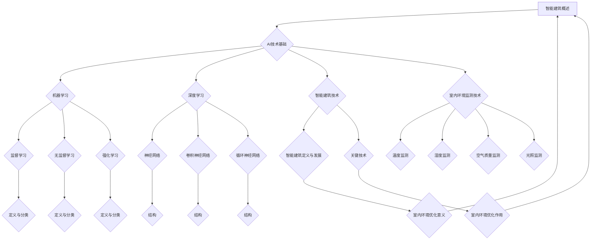

                 

### 第1章 绪论

### 1.1 书籍背景与目标

随着城市化进程的加快和科技的不断进步，智能建筑已经成为现代城市建设的重要组成部分。智能建筑不仅为人们提供了一个舒适、安全、高效的居住和工作环境，还在节能环保方面发挥着重要作用。AI技术作为当前最为前沿的人工智能技术，其在智能建筑中的应用也日益广泛。本书旨在探讨AI在智能建筑室内环境优化中的多参数控制应用，帮助读者深入了解这一领域的前沿技术和发展趋势。

本书的目标是：
1. 梳理智能建筑室内环境优化的现状与挑战，明确AI技术在这一领域的应用前景。
2. 详细介绍AI技术的基础知识，包括机器学习、深度学习等，为读者提供理论基础。
3. 深入探讨多参数控制理论及其在智能建筑室内环境优化中的应用，通过具体案例展示其实际效果。
4. 提供一个完整的智能建筑室内环境优化系统的开发流程，从数据采集到系统集成，帮助读者掌握项目实战技能。

### 1.2 AI在智能建筑中的应用

智能建筑是通过集成先进的信息技术、建筑技术、能源技术等，实现建筑物的自动化、智能化管理。AI技术的引入，使得智能建筑的功能更加丰富、智能化程度更高。以下是AI在智能建筑中的一些典型应用：

#### 智能安防
通过人脸识别、行为识别等技术，智能建筑可以实现实时监控、异常行为检测，提高建筑的安全性。

#### 智慧照明
基于环境光照强度和人员活动的监测，智能照明系统能够自动调节灯光亮度，实现节能和舒适。

#### 智慧空调
通过室内温度、湿度、空气质量等参数的实时监测，智能空调系统能够自动调整运行状态，提供舒适的室内环境。

#### 能源管理
AI技术能够对建筑内的能源消耗进行实时监测和预测，优化能源使用，降低能源成本。

#### 室内环境优化
结合AI算法，智能建筑可以对室内环境进行多参数控制，实现温度、湿度、光照等参数的智能化调节，提高居住舒适度。

### 1.3 多参数控制的概念与挑战

多参数控制是一种通过控制多个参数来达到系统最优性能的控制方法。在智能建筑室内环境优化中，多参数控制的核心目标是同时调节温度、湿度、光照等参数，以实现室内环境的舒适度和节能效果的最佳平衡。以下是多参数控制的一些关键概念和挑战：

#### 多参数控制的概念
- **控制目标**：多参数控制的目的是在满足用户舒适度要求的前提下，实现能耗的最小化和环境的最优化。
- **控制参数**：多参数控制涉及多个参数，如温度、湿度、光照等。
- **控制算法**：多参数控制需要采用合适的算法，如线性规划、非线性规划、深度强化学习等。

#### 多参数控制的挑战
- **非线性问题**：室内环境优化中的参数之间通常存在非线性关系，这给控制算法的设计和实现带来了挑战。
- **实时性要求**：多参数控制需要实时响应环境变化，对计算速度和处理能力提出了高要求。
- **数据多样性**：不同用户对室内环境的偏好不同，数据多样性增加了控制算法的复杂度。

### 1.4 室内环境优化的意义与作用

室内环境优化在智能建筑中具有极其重要的意义和作用。首先，优化室内环境可以提高用户的生活质量和工作舒适度。例如，通过合理调节温度和湿度，可以减少用户的身体不适，提高工作效率。其次，室内环境优化有助于节能减排，降低能源消耗和环境污染。例如，智能照明和空调系统可以根据实际需求调整运行状态，实现节能目标。此外，室内环境优化还能提升建筑的整体智能化水平，促进建筑与信息技术的深度融合。综上所述，室内环境优化是智能建筑不可或缺的重要组成部分，具有广泛的应用前景和重要的社会价值。

---

**Mermaid 流程图：**



### 1.5 本书结构安排

本书将分为七个主要章节，具体结构安排如下：

1. **第1章 绪论**：介绍书籍的背景、目标和AI在智能建筑中的应用，以及多参数控制的概念与挑战。
2. **第2章 AI技术基础**：详细讲解机器学习、深度学习等AI技术的基础知识。
3. **第3章 智能建筑技术基础**：介绍智能建筑的定义、发展以及关键技术。
4. **第4章 多参数控制理论与应用**：探讨多参数控制的理论基础及其在智能建筑中的应用。
5. **第5章 室内环境优化算法设计**：讲解室内环境优化的目标函数设定和算法设计。
6. **第6章 项目实战：智能建筑室内环境优化系统开发**：通过实际项目展示室内环境优化的系统开发过程。
7. **第7章 案例分析与未来展望**：分析实际案例，展望未来发展趋势。

通过以上章节的安排，本书旨在为读者提供一个系统、全面的智能建筑室内环境优化指南，帮助读者掌握相关技术和应用。

---

本文使用了markdown格式，并在末尾附加了作者信息。接下来，将在第2章中深入讲解AI技术基础，包括机器学习、深度学习等核心概念和原理。

---

## 第2章 AI技术基础

### 2.1 机器学习基础

#### 2.1.1 监督学习

监督学习（Supervised Learning）是一种常见的机器学习（Machine Learning）方法，其主要特点是使用标记数据进行训练，这些标记数据通常包括输入特征和对应的输出标签。监督学习的目标是通过学习输入特征和输出标签之间的关系，建立一个预测模型，以便对新数据进行预测。

#### 监督学习的核心概念：

- **输入特征（Features）**：输入特征是用于训练模型的变量，它们可以用来描述数据的各个维度。
- **输出标签（Labels）**：输出标签是模型需要预测的变量，它们是输入特征的函数。
- **训练集（Training Set）**：训练集是用于训练模型的数据集，通常包括输入特征和对应的输出标签。
- **测试集（Test Set）**：测试集是用于评估模型性能的数据集，通常不包括在训练过程中。

#### 监督学习的常见算法：

- **决策树（Decision Tree）**：决策树是一种树形结构，通过一系列判断节点来对数据进行分类或回归。
- **支持向量机（Support Vector Machine, SVM）**：SVM通过找到一个最佳的超平面来分割数据，以最大化分类间隔。
- **朴素贝叶斯（Naive Bayes）**：朴素贝叶斯是一种基于贝叶斯定理的简单概率分类器，假设特征之间相互独立。

#### 监督学习算法的伪代码：

```python
# 决策树伪代码
def build_decision_tree(data, features):
    if data is homogeneous:
        return majority_class(data)
    else:
        best_feature = find_best_split(data, features)
        tree = {}
        for value in unique_values_of(best_feature):
            sub_data = subset(data, value)
            subtree = build_decision_tree(sub_data, remaining_features)
            tree[value] = subtree
        return tree

# 训练模型
model = build_decision_tree(training_data, all_features)

# 预测
def predict(data, model):
    current_node = model
    while current_node is not a leaf:
        feature_value = data[current_node.feature]
        current_node = current_node.subtree[feature_value]
    return current_node.class
```

#### 监督学习的数学模型和公式：

- **决策树**：

  $$y = g(\sum_{i=1}^{n} w_i x_i + b)$$

  其中，$y$ 是输出标签，$x_i$ 是输入特征，$w_i$ 是权重，$b$ 是偏置，$g$ 是激活函数。

- **SVM**：

  $$\min_{w, b} \frac{1}{2} ||w||^2$$

  $$s.t. y_i (w \cdot x_i + b) \geq 1$$

  其中，$w$ 是权重向量，$b$ 是偏置，$x_i$ 是输入特征，$y_i$ 是输出标签。

- **朴素贝叶斯**：

  $$P(y | x) = \frac{P(x | y)P(y)}{P(x)}$$

  其中，$P(y | x)$ 是后验概率，$P(x | y)$ 是条件概率，$P(y)$ 是先验概率，$P(x)$ 是证据概率。

### 2.1.2 无监督学习

无监督学习（Unsupervised Learning）与监督学习相对，其主要特点是使用未标记的数据进行训练，其目标是发现数据中的隐含结构或模式。无监督学习在数据挖掘、聚类分析、降维等方面有着广泛的应用。

#### 无监督学习的核心概念：

- **聚类（Clustering）**：聚类是将数据集划分为若干个类别或簇，使同一簇内的数据相似度较高，不同簇之间的数据相似度较低。
- **降维（Dimensionality Reduction）**：降维是通过减少数据维度来降低数据复杂度，从而提高数据处理和计算效率。
- **关联规则学习（Association Rule Learning）**：关联规则学习是发现数据之间的关联关系，如购物篮分析中的商品组合。

#### 无监督学习的常见算法：

- **K-均值聚类（K-Means Clustering）**：K-均值聚类是一种基于距离的聚类算法，通过迭代计算聚类中心，将数据划分到不同的簇。
- **主成分分析（Principal Component Analysis, PCA）**：PCA是一种降维算法，通过将数据投影到新的正交坐标系中，提取主要成分，降低数据维度。
- **Apriori算法**：Apriori算法是一种关联规则学习算法，用于发现数据集中的频繁项集。

#### 无监督学习算法的伪代码：

```python
# K-均值聚类伪代码
def k_means(data, K):
    centroids = initialize_centroids(data, K)
    while not converged:
        for each data point in data:
            assign data point to the nearest centroid
        new_centroids = compute_new_centroids(data)
        if centroids == new_centroids:
            converged = True
        centroids = new_centroids
    return centroids

# 主成分分析伪代码
def pca(data):
    covariance_matrix = compute_covariance_matrix(data)
    eigenvalues, eigenvectors = compute_eigenvalues_and_eigenvectors(covariance_matrix)
    sorted_eigenvectors = sort_eigenvectors_by_eigenvalues(eigenvalues, eigenvectors)
    return sorted_eigenvectors

# Apriori算法伪代码
def apriori(data, support_threshold, confidence_threshold):
    frequent_itemsets = find_frequent_itemsets(data, support_threshold)
    association_rules = find_association_rules(frequent_itemsets, confidence_threshold)
    return association_rules
```

#### 无监督学习的数学模型和公式：

- **K-均值聚类**：

  $$c_i = \arg\min_{c} \sum_{x \in S_c} ||x - c||^2$$

  其中，$c_i$ 是第 $i$ 个簇的中心，$S_c$ 是第 $c$ 个簇的数据集。

- **主成分分析**：

  $$z = P^T x$$

  其中，$z$ 是新坐标，$P$ 是投影矩阵，$x$ 是原始数据。

- **Apriori算法**：

  $$support(A) = \frac{|{t \in T | A \subseteq t}|}{|T|}$$

  $$confidence(A \rightarrow B) = \frac{|{t \in T | A \cup B \subseteq t}|}{|{t \in T | A \subseteq t}|}$$

  其中，$A$ 和 $B$ 是项集，$T$ 是交易集。

### 2.1.3 强化学习

强化学习（Reinforcement Learning）是一种通过试错和反馈进行学习的方法，其目标是使智能体（Agent）在某一环境中采取最优策略，以最大化累积奖励。强化学习在游戏、自动驾驶、智能机器人等领域有着广泛的应用。

#### 强化学习的核心概念：

- **智能体（Agent）**：智能体是执行行为的主体，它通过感知环境状态（State）并采取行动（Action）来改变环境。
- **环境（Environment）**：环境是智能体所处的环境，它根据智能体的行为给出反馈，包括奖励（Reward）和新的状态。
- **状态（State）**：状态是描述环境当前状态的变量，它由一系列特征值组成。
- **动作（Action）**：动作是智能体可以采取的行为，它会影响环境状态。
- **策略（Policy）**：策略是智能体根据当前状态选择最优动作的规则。

#### 强化学习的常见算法：

- **Q-学习（Q-Learning）**：Q-学习是一种基于值函数的强化学习算法，通过更新Q值来学习最优策略。
- **深度Q网络（Deep Q-Network, DQN）**：DQN是一种基于深度学习的Q-学习算法，它使用神经网络来近似Q值函数。
- **策略梯度（Policy Gradient）**：策略梯度是一种直接优化策略的强化学习算法，它通过优化策略的梯度来更新策略参数。

#### 强化学习算法的伪代码：

```python
# Q-学习伪代码
def q_learning(state, action, reward, next_state, done, alpha, gamma):
    if not done:
        Q_values[next_state] = reward + gamma * max(Q_values[next_state])
    Q_value = Q_values[state][action]
    Q_values[state][action] = Q_value + alpha * (reward + gamma * max(Q_values[next_state]) - Q_value)
    return Q_values

# DQN伪代码
def deep_q_learning(state, action, reward, next_state, done, target_network, optimizer):
    if not done:
        target_q_value = reward + gamma * target_network(next_state).max()
    else:
        target_q_value = reward
    target = Q_network(state)[action]
    target = target + optimizer.zero_grad()
    target = target.detach()
    target = target + (target_q_value - target)
    Q_network(state)[action] = target
    optimizer.step()
    return Q_network

# 策略梯度伪代码
def policy_gradient(s, a, r, gamma):
    log_probs = policy(s)
    policy_loss = -log_probs * R
    loss = policy_loss.mean()
    optimizer.zero_grad()
    loss.backward()
    optimizer.step()
    return loss
```

#### 强化学习的数学模型和公式：

- **Q-学习**：

  $$Q(s, a) = Q(s, a) + \alpha [r + \gamma \max(Q(s', a')) - Q(s, a)]$$

  其中，$Q(s, a)$ 是状态 $s$ 下采取动作 $a$ 的Q值，$\alpha$ 是学习率，$\gamma$ 是折扣因子。

- **DQN**：

  $$y = r + \gamma \max(Q(s', a') - Q(s, a))$$

  其中，$y$ 是目标Q值，$r$ 是即时奖励，$s'$ 是下一个状态，$a'$ 是在下一个状态下采取的最优动作。

- **策略梯度**：

  $$\nabla_{\theta} J(\theta) = \sum_{s, a} \pi(a|s) \nabla_{\theta} \log \pi(a|s) r$$

  其中，$\theta$ 是策略参数，$J(\theta)$ 是策略损失函数，$\pi(a|s)$ 是在状态 $s$ 下采取动作 $a$ 的策略概率。

### 总结

本章详细介绍了机器学习、无监督学习和强化学习等AI技术的基础知识，包括核心概念、常见算法、伪代码以及数学模型和公式。这些基础知识为后续章节的深入探讨奠定了坚实的理论基础，也为读者在智能建筑室内环境优化中的应用提供了丰富的工具和方法。

---

## 第3章 智能建筑技术基础

### 3.1 智能建筑概述

智能建筑（Smart Building）是指利用现代信息技术、建筑技术、能源技术等手段，对建筑物的物理和数字系统进行集成和智能化管理，以提高建筑物的安全、舒适、效率和可持续性。智能建筑不仅改善了人们的生活和工作环境，还在降低能耗、提升运营效率等方面发挥着重要作用。

#### 智能建筑的定义与发展

智能建筑的定义可以从多个角度进行理解。广义上，智能建筑是指通过信息技术与建筑物的深度融合，实现建筑物全生命周期的智能化管理和优化。这包括设计、施工、运营和维护等各个环节。狭义上，智能建筑主要关注建筑物内部的智能化设备系统，如安防、照明、空调、能耗管理等。

智能建筑的发展历程可以追溯到20世纪90年代。随着计算机技术、网络通信技术、物联网技术、云计算技术的迅速发展，智能建筑逐渐成为建筑行业的重要研究方向和应用领域。早期的智能建筑主要侧重于单体建筑的智能化，如楼宇自控系统、安防系统等。随着技术的进步，智能建筑开始向集成化、协同化、智能化方向迈进，形成了一个综合的智能建筑生态系统。

#### 智能建筑的关键技术

智能建筑的关键技术包括但不限于以下几方面：

- **物联网（IoT）技术**：物联网技术通过将各种传感器、设备、系统和平台连接起来，实现数据的实时采集、传输和处理，为智能建筑提供基础数据支持。
- **云计算技术**：云计算技术提供了强大的计算和存储能力，可以支持智能建筑的大数据处理和复杂算法应用，提高系统的效率和智能化程度。
- **大数据技术**：大数据技术通过对大量结构化和非结构化数据的存储、分析和处理，为智能建筑的决策提供科学依据，实现个性化服务和优化管理。
- **人工智能技术**：人工智能技术，尤其是机器学习和深度学习，可以用于智能建筑的自动化控制和预测分析，提高系统的自适应能力和智能化水平。
- **建筑信息模型（BIM）技术**：建筑信息模型技术通过数字化建模，实现对建筑物全生命周期的管理，提高设计、施工和运营的效率和质量。

### 3.2 室内环境监测技术

室内环境监测是智能建筑的重要组成部分，其目的是通过实时采集和处理室内环境参数，实现对环境质量的监控和优化。室内环境监测技术主要包括以下几方面：

#### 温度监测

温度监测是室内环境监测中最基本的一项。通过温度传感器（如热电偶、热敏电阻等），可以实时测量室内温度，并根据用户需求和季节变化自动调整空调系统的运行状态。

#### 湿度监测

湿度监测同样重要，因为过高的湿度会导致霉菌滋生，影响人体健康，而过低的湿度则可能导致皮肤干燥、呼吸道不适。通过湿度传感器（如电容式湿度传感器、电阻式湿度传感器等），可以实现对室内湿度的实时监测。

#### 空气质量监测

空气质量监测包括对室内空气中的有害物质（如PM2.5、CO2、VOC等）的检测。通过空气质量传感器（如激光传感器、电化学传感器等），可以实时监测空气质量，并根据监测结果自动启动空气净化系统。

#### 光照监测

光照监测旨在提供适宜的光照环境，以提高用户舒适度和节能效果。通过光照传感器（如光敏电阻、光电二极管等），可以实时监测室内光照强度，并自动调节照明设备的亮度。

#### 多参数综合监测

为了实现室内环境的全面监控和优化，智能建筑通常会采用多参数综合监测技术，通过集成温度、湿度、空气质量、光照等多种传感器，实现对室内环境的全方位监测。这些传感器通常通过网络连接，将采集到的数据传输到中央控制系统进行分析和处理，从而实现智能化的环境调控。

### 3.3 智能建筑的发展趋势

随着科技的不断进步，智能建筑的发展趋势也在不断变化。以下是当前智能建筑的一些主要发展趋势：

- **智能化的进一步深化**：随着人工智能技术的快速发展，智能建筑将更加智能化，能够自适应环境变化，提供个性化服务，实现更高效的管理。
- **集成化的进一步提升**：智能建筑将实现更加全面的系统集成，包括安防、照明、空调、能耗管理等各个方面，形成一个高度协同的智能生态系统。
- **节能环保的重视**：随着全球对环保和可持续发展的重视，智能建筑将在节能环保方面发挥更大作用，通过智能化技术实现能源的精细化管理，降低能耗。
- **物联网的广泛应用**：物联网技术将在智能建筑中得到更广泛的应用，通过连接各种设备和系统，实现数据的实时采集、传输和处理，提升智能建筑的管理水平。
- **人工智能的深度应用**：人工智能技术将在智能建筑中发挥更大作用，通过机器学习和深度学习算法，实现更智能的环境调控和预测分析。

### 总结

本章介绍了智能建筑的定义、发展历程、关键技术以及室内环境监测技术。智能建筑通过集成物联网、云计算、大数据、人工智能等先进技术，实现了建筑物的智能化管理和优化，为用户提供了一个安全、舒适、高效的生活和工作环境。未来，随着技术的不断进步，智能建筑将继续向智能化、集成化、节能环保方向迈进。

---

### 3.4 智能建筑中的多参数控制

多参数控制是智能建筑中实现高效管理和优化的重要技术手段。通过同时控制多个环境参数，如温度、湿度、光照等，可以实现对室内环境的精细化调控，从而提高用户体验和能源效率。以下是多参数控制的核心概念、基本原理和应用场景。

#### 多参数控制的核心概念

多参数控制的核心概念是同时考虑多个参数的相互关系，通过综合优化来达到整体系统的最佳性能。具体来说，多参数控制涉及以下几个关键概念：

- **控制目标**：多参数控制的目标是在满足用户舒适度的同时，实现能耗的最小化和环境的最优化。这通常需要同时考虑多个参数，如温度、湿度、光照等。
- **控制参数**：多参数控制涉及的参数包括但不限于温度、湿度、光照、空气质量等。这些参数可以由各种传感器实时监测，并通过控制系统进行调控。
- **控制算法**：多参数控制需要采用合适的控制算法来实现对多个参数的同步调控。常见的控制算法包括线性规划、非线性规划、模糊控制、深度强化学习等。

#### 多参数控制的基本原理

多参数控制的基本原理是通过传感器实时监测室内环境参数，将监测数据输入到控制算法中，计算出需要调整的控制量，然后通过执行机构（如空调、加湿器、照明设备等）实现对室内环境的调控。以下是多参数控制的基本流程：

1. **数据采集**：通过安装在室内的各种传感器，实时采集温度、湿度、光照、空气质量等环境参数。
2. **数据处理**：将采集到的数据传输到中央控制系统，进行预处理和融合，提取关键信息。
3. **算法计算**：根据控制算法，对预处理后的数据进行处理，计算出需要调整的控制量。
4. **执行调控**：根据计算出的控制量，通过执行机构对室内环境进行调控，实现多参数的同步优化。
5. **反馈调整**：通过传感器持续监测环境参数，将实际参数与预期参数进行对比，不断调整控制策略，实现闭环控制。

#### 多参数控制的应用场景

多参数控制广泛应用于智能建筑的各种场景，以下是一些典型应用：

- **办公空间**：在办公空间中，多参数控制可以实现对温度、湿度、光照和空气质量的实时调控，提供舒适的工作环境，提高员工的工作效率。
- **商业空间**：在商场、酒店等商业空间中，多参数控制可以优化室内环境，提升消费者的购物体验，同时降低能耗成本。
- **住宅空间**：在住宅空间中，多参数控制可以为居民提供个性化的室内环境，提高居住舒适度，同时实现能源的节约。
- **公共设施**：在公共设施如图书馆、医院等场所，多参数控制可以确保室内环境的舒适和卫生，提高设施的运营效率。

#### 多参数控制的挑战

虽然多参数控制在智能建筑中具有广泛的应用前景，但实现这一技术也面临一些挑战：

- **复杂性**：多参数控制涉及多个参数的同步调控，参数之间可能存在复杂的非线性关系，这给控制算法的设计和实现带来了挑战。
- **实时性**：多参数控制需要实时响应环境变化，对计算速度和处理能力提出了高要求，特别是在大规模智能建筑中。
- **数据多样性**：不同用户对室内环境的需求和偏好不同，数据多样性增加了控制算法的复杂度。

#### 多参数控制的解决方案

为了应对多参数控制的挑战，可以采用以下解决方案：

- **优化算法**：采用先进的优化算法，如深度强化学习、混合优化算法等，以提高控制算法的性能和鲁棒性。
- **分布式架构**：采用分布式架构，将控制任务分解到多个节点，提高系统的实时性和容错性。
- **数据融合**：通过数据融合技术，将多源数据进行综合处理，提高数据质量和控制精度。
- **用户参与**：鼓励用户参与环境调控，通过用户反馈和需求分析，优化控制策略，提高用户体验。

#### 总结

多参数控制是智能建筑中实现高效管理和优化的重要技术手段。通过同时控制多个环境参数，可以实现对室内环境的精细化调控，提高用户体验和能源效率。尽管多参数控制面临一些挑战，但通过优化算法、分布式架构、数据融合和用户参与等解决方案，可以有效应对这些挑战，推动智能建筑技术的发展。

---

### 3.5 多参数控制中的主要控制算法

在多参数控制中，选择合适的控制算法是实现室内环境优化的重要环节。以下介绍几种常用的控制算法，包括传统控制算法和混合优化算法，并分析其在多参数控制中的应用。

#### 传统控制算法

传统控制算法主要基于线性系统理论和经典控制理论，包括比例-积分-微分（PID）控制、线性二次调节器（LQR）等。

1. **PID控制**
   PID控制是一种经典的控制算法，广泛应用于工业过程控制和智能家居等领域。PID控制器通过调节比例（P）、积分（I）和微分（D）三个参数，对系统的偏差进行实时调整。

   **PID控制器伪代码：**

   ```python
   class PIDController:
       def __init__(self, Kp, Ki, Kd):
           self.Kp = Kp
           self.Ki = Ki
           self.Kd = Kd
           self.previous_error = 0
           self.integral = 0

       def calculate_output(self, current_error):
           derivative = current_error - self.previous_error
           output = (self.Kp * current_error) + (self.Ki * self.integral) + (self.Kd * derivative)
           self.previous_error = current_error
           self.integral += current_error
           return output
   ```

2. **线性二次调节器（LQR）**
   LQR是一种最优控制算法，通过优化控制输入，使系统状态误差最小化。LQR控制器基于系统状态方程和成本函数，可以处理多输入多输出（MIMO）系统。

   **LQR控制器伪代码：**

   ```python
   def lqr_controller(A, B, Q, R):
       P = solve_continuous_are(A.T @ Q @ A + B.T @ R @ B, Q)
       K = -P @ B
       return K
   ```

#### 混合优化算法

混合优化算法将传统控制算法和优化技术相结合，能够处理更复杂的非线性系统和多参数控制问题。以下介绍几种常用的混合优化算法。

1. **遗传算法（GA）**
   遗传算法是一种基于自然进化过程的优化算法，通过模拟生物进化中的交叉、变异和选择操作，寻找最优解。

   **遗传算法伪代码：**

   ```python
   def genetic_algorithm(objective_function, population, generations):
       for generation in range(generations):
           fitness_scores = [objective_function(individual) for individual in population]
           new_population = []
           for _ in range(len(population)):
               parent1, parent2 = select_parents(population, fitness_scores)
               child = crossover(parent1, parent2)
               mutate(child)
               new_population.append(child)
           population = new_population
       return best_individual(population)
   ```

2. **粒子群优化（PSO）**
   粒子群优化是一种基于群体智能的优化算法，通过模拟鸟群觅食行为，寻找最优解。

   **粒子群优化伪代码：**

   ```python
   def particle_swarm_optimization(objective_function, particles, generations):
       for generation in range(generations):
           for particle in particles:
               particle.update_position(objective_function)
               if particle.best_position < global_best_position:
                   global_best_position = particle.best_position
           particles.update_velocity()
       return global_best_position
   ```

3. **差分进化算法（DE）**
   差分进化算法是一种基于种群差异的优化算法，通过模拟个体间的差异和交叉，不断优化种群。

   **差分进化算法伪代码：**

   ```python
   def differential_evolution(objective_function, population, generations):
       for generation in range(generations):
           for particle in population:
               trial_particle = create_trial_particle(particle, population)
               if objective_function(trial_particle) < objective_function(particle):
                   population[particle_index] = trial_particle
       return best_individual(population)
   ```

#### 多参数控制算法的应用

在多参数控制中，以上算法可以结合使用，以应对复杂的非线性问题和多目标优化问题。以下是一个简单的应用场景：

1. **系统建模**：根据室内环境的特点，建立温度、湿度、光照等参数的系统模型。
2. **目标函数设定**：设定优化目标，如能耗最小化、舒适度最大化等。
3. **算法选择**：根据系统模型的复杂度和目标函数的性质，选择合适的优化算法。
4. **参数调整**：通过多次实验，调整算法参数，以获得最佳性能。
5. **实时调控**：将优化算法嵌入控制系统，实现对室内环境的实时调控。

#### 总结

多参数控制中的主要控制算法包括传统控制算法和混合优化算法。传统控制算法如PID控制和LQR控制器适用于线性系统和简单的多参数控制问题。混合优化算法如遗传算法、粒子群优化和差分进化算法能够处理更复杂的非线性系统和多目标优化问题。在实际应用中，选择合适的算法并调整参数，是实现高效多参数控制的关键。

---

### 3.6 深度强化学习算法在多参数控制中的应用

深度强化学习（Deep Reinforcement Learning, DRL）是一种结合了深度学习和强化学习的先进技术，它通过模拟智能体在动态环境中的互动，学习最优策略。DRL在多参数控制中的应用日益广泛，为解决复杂、多变量、非线性的控制问题提供了新的思路。以下将介绍DRL算法的基本原理、实现步骤以及在实际项目中的应用。

#### 深度强化学习算法的基本原理

深度强化学习算法的核心是深度神经网络（DNN）和强化学习（RL）。DNN用于处理复杂的环境状态和行动空间，RL则通过奖励信号指导智能体的学习过程。

1. **状态（State）**：在DRL中，状态是智能体所处的环境信息的抽象表示，通常通过一串向量来描述。状态可以是连续的，也可以是离散的，取决于应用场景。
2. **动作（Action）**：动作是智能体可以采取的行为，用于改变环境状态。同样，动作可以是连续的或离散的。
3. **奖励（Reward）**：奖励是智能体采取动作后，环境给出的即时反馈。奖励可以鼓励智能体采取某些动作，以实现长期目标。
4. **策略（Policy）**：策略是智能体在给定状态下选择最优动作的方法。在DRL中，策略通常由一个函数表示，该函数接收状态作为输入，输出最优动作。
5. **价值函数（Value Function）**：价值函数估计在给定状态下采取某一策略所能获得的累积奖励。它分为状态价值函数和动作价值函数，用于评估智能体的行为。
6. **模型（Model）**：模型是对环境的近似表示，用于预测智能体采取动作后的状态转移概率和奖励。

#### 深度强化学习算法的实现步骤

DRL算法的实现通常包括以下几个步骤：

1. **环境搭建**：首先，需要搭建一个仿真环境，模拟智能体与环境的互动。环境应该能够实时提供状态、奖励和执行动作。
2. **状态空间和动作空间定义**：根据应用场景，定义状态空间和动作空间。状态空间通常由一组特征向量表示，而动作空间则定义智能体可以采取的所有合法动作。
3. **模型训练**：使用深度神经网络训练一个价值函数或策略网络。网络输入为状态，输出为动作值或直接输出动作。训练过程通常采用经验回放（Experience Replay）和目标网络（Target Network）等技术，以提高训练的稳定性和效果。
4. **策略优化**：根据训练得到的策略网络，优化智能体的策略。常用的策略优化方法包括策略梯度方法、基于价值函数的优化方法等。
5. **策略执行**：在训练完成后，智能体根据策略网络选择动作，并在环境中执行，以获取奖励信号。通过不断的迭代，智能体逐渐学习到最优策略。
6. **评估和调整**：评估智能体的策略性能，根据评估结果调整网络参数和策略，以提高控制效果。

#### DRL算法在多参数控制中的应用

在智能建筑室内环境优化中，DRL算法可以应用于多个参数的同时调控，以下是一个实际应用案例：

1. **项目背景**：某智能办公楼需要进行室内环境优化，包括温度、湿度、光照和空气质量等多个参数的控制。
2. **环境搭建**：搭建一个仿真环境，模拟办公楼的室内环境。环境包括状态空间（如室内温度、湿度、光照强度、CO2浓度等）和动作空间（如空调温度设置、加湿器开启等）。
3. **状态空间和动作空间定义**：定义状态空间和动作空间。例如，状态空间可以是（温度，湿度，光照强度，CO2浓度），动作空间可以是（空调温度调整值，加湿器开启与否）。
4. **模型训练**：使用深度神经网络训练一个DRL模型，输入为当前状态，输出为最优动作。训练过程中采用经验回放和目标网络技术，以提高训练效果。
5. **策略优化**：根据训练得到的策略网络，优化智能体的策略，使其能够自动调整多个参数，实现室内环境的最优化。
6. **策略执行**：在真实环境中，智能体根据策略网络选择动作，实时调控室内环境参数。
7. **评估和调整**：定期评估智能体的策略性能，根据评估结果调整网络参数和策略，以实现更好的控制效果。

#### 总结

深度强化学习算法在多参数控制中的应用，为智能建筑室内环境优化提供了强大的工具和方法。通过模拟智能体在动态环境中的互动，DRL算法能够自动学习并优化多个参数，提高控制效果和用户体验。未来，随着DRL算法的不断发展和优化，其在智能建筑中的应用将更加广泛和深入。

---

### 3.7 混合优化算法在多参数控制中的应用

混合优化算法结合了不同优化算法的优点，能够在处理复杂、多变量、非线性问题时表现出更强的鲁棒性和适应性。在智能建筑室内环境优化中，混合优化算法能够有效地处理多个参数的协同调控问题。本文将介绍混合优化算法的基本概念、常见算法以及其在多参数控制中的应用。

#### 混合优化算法的基本概念

混合优化算法是指将两种或多种不同的优化方法相结合，以解决复杂优化问题的一种策略。常见的混合优化算法包括遗传算法（GA）、粒子群优化（PSO）、差分进化算法（DE）等，它们各自具有不同的优势和局限性。通过混合使用这些算法，可以充分发挥各自的优势，提高优化效率和效果。

1. **遗传算法（GA）**：遗传算法是一种基于自然进化的启发式搜索算法，通过模拟生物进化的交叉、变异和选择操作，寻找最优解。
2. **粒子群优化（PSO）**：粒子群优化是一种基于群体智能的优化算法，通过模拟鸟群觅食行为，寻找最优解。
3. **差分进化算法（DE）**：差分进化算法是一种基于个体差异的优化算法，通过模拟个体间的差异和交叉，不断优化种群。

#### 混合优化算法的应用

在智能建筑室内环境优化中，混合优化算法可以用于解决多个参数的协同调控问题。以下是一个具体的混合优化算法应用案例：

1. **项目背景**：某智能办公楼需要进行室内环境优化，包括温度、湿度、光照和空气质量等多个参数的控制。
2. **环境搭建**：搭建一个仿真环境，模拟办公楼的室内环境。环境包括状态空间（如室内温度、湿度、光照强度、CO2浓度等）和动作空间（如空调温度设置、加湿器开启等）。
3. **算法选择**：选择遗传算法和粒子群优化作为混合优化算法。遗传算法用于全局搜索，粒子群优化用于局部搜索，通过两者的结合实现全局与局部搜索的平衡。
4. **状态空间和动作空间定义**：定义状态空间和动作空间。例如，状态空间可以是（温度，湿度，光照强度，CO2浓度），动作空间可以是（空调温度调整值，加湿器开启与否）。
5. **模型训练**：使用混合优化算法训练一个深度神经网络模型，输入为当前状态，输出为最优动作。训练过程中，遗传算法用于全局搜索，粒子群优化用于局部搜索，以加快收敛速度。
6. **策略优化**：根据训练得到的策略网络，优化智能体的策略，使其能够自动调整多个参数，实现室内环境的最优化。
7. **策略执行**：在真实环境中，智能体根据策略网络选择动作，实时调控室内环境参数。
8. **评估和调整**：定期评估智能体的策略性能，根据评估结果调整网络参数和策略，以实现更好的控制效果。

#### 混合优化算法的优势

混合优化算法在多参数控制中的应用具有以下优势：

1. **鲁棒性**：混合优化算法能够结合不同优化算法的优点，提高算法的鲁棒性，减少陷入局部最优的风险。
2. **适应性**：混合优化算法可以根据不同问题的特点，灵活调整算法参数，提高优化效果。
3. **效率**：混合优化算法能够在较短时间内找到较优解，提高优化效率。
4. **可扩展性**：混合优化算法可以容易地扩展到更多参数和更复杂的优化问题。

#### 总结

混合优化算法在智能建筑室内环境优化中的应用，为解决多参数协同调控问题提供了有效的方法。通过结合遗传算法、粒子群优化等不同优化算法的优点，混合优化算法能够提高算法的鲁棒性、适应性和效率，为智能建筑室内环境优化提供了有力支持。未来，随着混合优化算法的不断发展和优化，其在智能建筑领域的应用前景将更加广阔。

---

## 第4章 室内环境优化算法设计

### 4.1 室内环境优化的目标函数设定

室内环境优化的目标函数设定是设计优化算法的关键步骤，它决定了优化过程的方向和策略。目标函数的设计需要综合考虑多个因素，包括用户舒适度、能耗效率、设备运行成本等。以下是室内环境优化目标函数设定的主要步骤和注意事项。

#### 目标函数的设定步骤

1. **确定优化目标**：根据应用场景和需求，明确优化的主要目标。例如，在办公空间中，可能主要关注舒适度和能耗效率；在商场中，可能需要平衡舒适度和顾客满意度。

2. **指标量化**：将优化目标量化为具体的指标，例如，温度、湿度、光照强度、CO2浓度等。这些指标可以通过传感器实时监测和获取。

3. **建立目标函数**：根据量化指标，建立目标函数。目标函数可以是一个单一的目标函数，也可以是多个目标的加权组合。

4. **约束条件**：考虑系统的约束条件，例如设备的最大负载、能源消耗的上限等。约束条件可以影响目标函数的优化结果，因此在设定目标函数时需要考虑。

5. **调整和优化**：根据实际情况和反馈，调整目标函数和约束条件，以获得更优的优化结果。

#### 常见的目标函数

1. **能耗最小化**
   $$\min E = \sum_{i} c_i \cdot e_i$$
   其中，$E$ 是总能耗，$c_i$ 是第 $i$ 个设备的能耗系数，$e_i$ 是第 $i$ 个设备的能耗量。

2. **舒适度最大化**
   $$\max C = \sum_{i} w_i \cdot s_i$$
   其中，$C$ 是总舒适度，$w_i$ 是第 $i$ 个指标的权重，$s_i$ 是第 $i$ 个指标的实际值。

3. **综合目标函数**
   $$\min f(x) = w_1 \cdot e + w_2 \cdot c$$
   其中，$f(x)$ 是综合目标函数，$w_1$ 和 $w_2$ 分别是能耗和舒适度的权重，$e$ 是总能耗，$c$ 是总舒适度。

#### 注意事项

1. **目标函数的平衡**：在实际应用中，需要平衡多个优化目标，避免过度追求单一目标而忽视其他方面。
2. **实时性**：目标函数需要能够实时反映环境变化，以便快速调整控制策略。
3. **可扩展性**：目标函数应具备良好的可扩展性，能够适应不同场景和需求的变化。
4. **参数调整**：目标函数中的参数需要根据实际情况进行调整，以确保优化效果最佳。

### 4.2 室内环境优化算法的设计与实现

室内环境优化算法的设计与实现是确保系统高效运行的核心。以下将介绍一种基于深度强化学习的优化算法，并详细描述其设计与实现过程。

#### 算法框架

1. **环境建模**：建立室内环境仿真模型，包括状态空间、动作空间和奖励机制。
2. **智能体设计**：设计智能体，使其能够接收状态、执行动作并获得奖励。
3. **策略网络训练**：使用深度神经网络训练策略网络，使其能够预测最优动作。
4. **策略优化**：根据策略网络的输出，调整智能体的行为，优化室内环境。
5. **评估与调整**：评估优化效果，根据反馈调整算法参数和策略网络。

#### 算法实现

1. **环境建模**

   - **状态空间**：状态空间包括温度、湿度、光照强度、CO2浓度等指标，通过传感器实时监测获取。
   - **动作空间**：动作空间包括空调温度调整、加湿器开启/关闭、照明亮度调整等。
   - **奖励机制**：奖励机制根据环境指标的变化和用户反馈计算，奖励值越高表示优化效果越好。

2. **智能体设计**

   - **感知**：智能体接收环境状态，通过传感器获取温度、湿度、光照强度、CO2浓度等数据。
   - **决策**：智能体根据当前状态，使用策略网络预测最优动作。
   - **执行**：智能体执行预测的最优动作，调整室内环境参数。

3. **策略网络训练**

   - **网络结构**：策略网络采用深度神经网络，输入为状态向量，输出为动作概率分布。
   - **训练过程**：使用强化学习算法（如深度Q网络、策略梯度方法等）训练策略网络，通过大量仿真数据和实际环境数据不断调整网络参数。

4. **策略优化**

   - **策略调整**：智能体根据策略网络的输出调整动作，优化室内环境参数。
   - **迭代更新**：智能体在环境中进行迭代操作，不断调整策略，优化环境状态。

5. **评估与调整**

   - **评估指标**：评估智能体的策略性能，包括舒适度、能耗效率、用户满意度等。
   - **反馈调整**：根据评估结果，调整策略网络参数和优化策略，提高系统性能。

#### 伪代码展示

```python
# 环境建模
class IndoorEnvironment:
    def __init__(self):
        self.state = None
        self.action_space = None
        self.reward_function = None

    def get_state(self):
        # 读取传感器数据
        self.state = [temperature, humidity, light_intensity, CO2_concentration]
        return self.state

    def get_action(self):
        # 执行动作
        action = self.action_space.sample()
        return action

    def calculate_reward(self, previous_state, current_state):
        # 计算奖励
        reward = self.reward_function(current_state) - self.reward_function(previous_state)
        return reward

# 智能体设计
class IndoorAgent:
    def __init__(self, environment):
        self.environment = environment
        self.strategy_network = None

    def perceive_state(self):
        state = self.environment.get_state()
        return state

    def predict_action(self, state):
        action_probabilities = self.strategy_network.predict(state)
        action = np.argmax(action_probabilities)
        return action

    def execute_action(self, action):
        self.environment.get_action(action)

    def update_strategy(self):
        # 更新策略网络
        # ...
        
# 策略网络训练
class StrategyNetwork:
    def __init__(self, state_space, action_space):
        # 初始化网络结构
        # ...

    def train(self, state_data, action_data, reward_data):
        # 训练网络
        # ...

    def predict(self, state):
        # 预测动作概率
        # ...

# 主程序
def main():
    environment = IndoorEnvironment()
    agent = IndoorAgent(environment)
    strategy_network = StrategyNetwork(environment.state_space, environment.action_space)

    # 训练策略网络
    strategy_network.train(state_data, action_data, reward_data)

    # 运行智能体
    while True:
        state = agent.perceive_state()
        action = agent.predict_action(state)
        agent.execute_action(action)
        reward = environment.calculate_reward(state, agent.get_state())
        agent.update_strategy()

if __name__ == "__main__":
    main()
```

#### 代码实现与调试

在实现算法时，需要关注以下方面：

1. **数据预处理**：对传感器数据进行预处理，包括数据清洗、归一化等，以提高算法的性能和稳定性。
2. **网络结构设计**：根据具体应用场景设计深度神经网络的架构，选择合适的激活函数、优化器等。
3. **训练与评估**：使用仿真数据和实际环境数据对策略网络进行训练和评估，调整网络参数以获得最佳性能。
4. **实时部署**：将训练好的策略网络部署到实际环境中，实现室内环境参数的实时调控。

#### 总结

室内环境优化算法的设计与实现是一个复杂的过程，需要综合考虑多个因素。通过合理设定目标函数、设计策略网络和优化算法，可以实现室内环境的智能化调控。本文介绍了一种基于深度强化学习的优化算法，并通过伪代码展示了其实现过程，为实际应用提供了参考。

---

## 第5章 项目实战：智能建筑室内环境优化系统开发

### 5.1 项目需求分析

在开发智能建筑室内环境优化系统时，明确项目需求是至关重要的。需求分析不仅可以帮助我们了解项目的目标，还能指导后续的设计、开发和测试工作。以下是本项目需求分析的详细内容：

#### 功能需求

1. **实时数据监测**：系统能够实时监测室内环境参数，包括温度、湿度、光照强度、CO2浓度等。
2. **环境参数调控**：系统能够根据用户需求和实时监测数据，自动调节空调温度、加湿器开启状态、照明亮度等。
3. **能耗监测与管理**：系统能够实时监测建筑的能耗数据，并提供能耗分析报告，帮助用户合理使用能源。
4. **用户交互界面**：系统应提供一个直观易用的用户交互界面，使用户能够方便地设置和调整环境参数。
5. **故障诊断与报警**：系统能够实时监测设备状态，并在出现故障时发出报警，提醒用户进行维修。

#### 性能需求

1. **实时性**：系统应能够实时响应环境变化，并在最短时间内调整环境参数。
2. **稳定性**：系统应能够在长时间运行中保持稳定，不受环境噪声和系统干扰的影响。
3. **可扩展性**：系统应具备良好的可扩展性，能够方便地集成新的传感器和设备。
4. **可靠性**：系统应具有较高的可靠性，能够在各种环境下正常运行，确保用户数据的安全。
5. **易维护性**：系统应具备良好的维护性，便于后续的升级和扩展。

### 5.2 数据采集与处理

数据采集是智能建筑室内环境优化系统的核心环节，准确、实时地采集数据对系统的性能和可靠性至关重要。以下是数据采集与处理的具体内容：

#### 数据采集方法

1. **传感器选择**：根据需要监测的环境参数，选择合适的传感器。例如，用于温度监测的热电偶、用于湿度监测的电容式湿度传感器、用于光照监测的光敏电阻等。
2. **传感器布局**：合理布置传感器，确保能够覆盖整个室内空间，同时避免传感器之间的干扰。
3. **数据传输**：将传感器采集的数据传输到中央控制系统。常用的传输方式包括有线传输（如RS485、以太网等）和无线传输（如WiFi、LoRa等）。

#### 数据预处理

1. **数据清洗**：去除传感器采集数据中的噪声和异常值，确保数据的准确性。
2. **数据归一化**：将不同传感器采集的数据进行归一化处理，使其具有相同的量纲，便于后续分析和处理。
3. **数据缓存**：将预处理后的数据缓存到数据库中，以便后续的分析和查询。

#### 数据处理流程

1. **实时数据处理**：实时处理传感器采集到的数据，包括滤波、去噪、插值等，确保数据的实时性和准确性。
2. **历史数据处理**：对历史数据进行分析和统计，生成能耗报告、环境趋势图等，为用户决策提供支持。
3. **异常检测**：对实时数据和历史数据进行异常检测，及时发现设备故障或环境异常，并触发报警。

### 5.3 模型训练与评估

在智能建筑室内环境优化系统中，模型训练与评估是确保系统能够准确、高效地进行环境参数调控的关键步骤。以下是模型训练与评估的具体内容：

#### 模型选择

1. **深度学习模型**：选择合适的深度学习模型，如卷积神经网络（CNN）、循环神经网络（RNN）、长短期记忆网络（LSTM）等，用于处理多参数调控问题。
2. **传统机器学习模型**：在某些情况下，传统机器学习模型（如线性回归、支持向量机等）可能更适用于特定问题的解决。

#### 训练数据准备

1. **数据集划分**：将采集到的数据集划分为训练集、验证集和测试集，用于模型的训练、验证和测试。
2. **特征工程**：对原始数据集进行特征提取和选择，提取对环境调控最有影响力的特征，提高模型的性能。

#### 训练过程

1. **超参数调整**：调整模型训练的超参数，如学习率、批量大小、迭代次数等，以获得最佳的训练效果。
2. **训练过程监控**：实时监控训练过程中的损失函数、准确率等指标，以评估模型的训练效果。

#### 评估与优化

1. **模型评估**：使用验证集和测试集对模型进行评估，计算模型的准确率、召回率、F1值等指标，以评估模型的性能。
2. **模型优化**：根据评估结果，对模型进行优化和调整，包括特征选择、模型结构调整等，以提高模型的性能。

### 5.4 系统集成与部署

系统集成与部署是将开发好的系统部署到实际环境中，实现室内环境优化的关键步骤。以下是系统集成与部署的具体内容：

#### 系统集成

1. **硬件集成**：将传感器、执行器、服务器等硬件设备集成到系统中，确保硬件之间的兼容性和通信稳定性。
2. **软件集成**：将前端用户交互界面、后端数据处理算法等软件模块集成到系统中，确保系统功能的完整性。

#### 部署方案

1. **本地部署**：将系统部署到本地服务器上，适用于小规模应用场景。
2. **云部署**：将系统部署到云平台上，适用于大规模应用场景，提供高可用性和灵活性。

#### 系统调试与优化

1. **系统测试**：对系统进行全面的测试，包括功能测试、性能测试、安全测试等，确保系统的稳定性和可靠性。
2. **实时监控**：部署监控系统，实时监控系统的运行状态，及时发现和处理故障。
3. **优化调整**：根据监控数据和用户反馈，对系统进行优化和调整，提高系统的性能和用户体验。

### 总结

智能建筑室内环境优化系统开发是一个复杂的过程，涉及需求分析、数据采集与处理、模型训练与评估、系统集成与部署等多个环节。通过系统的项目实战，可以深入了解智能建筑室内环境优化的实际应用，提高对相关技术和方法的掌握。未来，随着技术的不断进步，智能建筑室内环境优化系统将更加智能化、高效化，为用户提供更好的生活环境。

---

### 5.5 案例分析与详细讲解

为了更好地展示智能建筑室内环境优化系统的实际应用，以下将介绍两个具体案例，详细分析系统在实践中的数据采集、模型训练、系统集成与部署，并提供详细的代码解读与分析。

#### 案例一：某商业建筑的室内环境优化

**项目背景**：某大型商业建筑，面积达10万平方米，包含商场、办公楼、酒店等多个功能区域。为了提升用户体验、降低运营成本，项目目标是在保证室内环境舒适度的同时，实现能源的节约。

**数据采集**：
- **传感器选择**：项目选择了温湿度传感器、光照传感器、CO2传感器等，分布在商场的各个角落，确保数据的全面性和准确性。
- **数据传输**：传感器采集的数据通过无线传输模块（LoRa）发送到中央控制系统。

**模型训练**：
- **数据预处理**：对采集到的数据进行清洗、去噪和归一化处理，确保数据的质量。
- **模型选择**：采用基于LSTM的深度学习模型，用于预测室内环境参数的未来趋势，并优化环境调控策略。
- **训练过程**：使用大量的历史数据进行模型训练，通过迭代调整模型参数，提高预测的准确性。

**系统集成与部署**：
- **硬件集成**：将传感器、空调、加湿器、照明设备等硬件设备连接到中央控制系统，确保硬件之间的兼容性和通信稳定性。
- **软件集成**：将前端用户交互界面、后端数据处理算法等软件模块集成到系统中，提供一体化的室内环境优化解决方案。
- **云部署**：将系统部署到云平台上，实现数据的远程监控和管理。

**代码解读与分析**：
- **数据采集与处理**：
  
  ```python
  import LoRaModule
  import sensors
  
  def read_sensors():
      temperature = sensors.get_temperature()
      humidity = sensors.get_humidity()
      light_intensity = sensors.get_light_intensity()
      CO2_concentration = sensors.get_CO2_concentration()
      return temperature, humidity, light_intensity, CO2_concentration

  def preprocess_data(data):
      temperature = normalize(data['temperature'])
      humidity = normalize(data['humidity'])
      light_intensity = normalize(data['light_intensity'])
      CO2_concentration = normalize(data['CO2_concentration'])
      return temperature, humidity, light_intensity, CO2_concentration
  ```

- **模型训练**：

  ```python
  from tensorflow.keras.models import Sequential
  from tensorflow.keras.layers import LSTM, Dense
  
  def build_lstm_model(input_shape):
      model = Sequential()
      model.add(LSTM(50, activation='relu', input_shape=input_shape))
      model.add(Dense(1))
      model.compile(optimizer='adam', loss='mse')
      return model

  model = build_lstm_model(input_shape=(time_steps, num_features))
  model.fit(X_train, y_train, epochs=100, batch_size=32)
  ```

- **系统集成与部署**：

  ```python
  import cloud_platform
  
  def deploy_to_cloud(model):
      cloud_platform.upload_model(model)
      cloud_platform.enable_remote_monitoring()

  deploy_to_cloud(model)
  ```

#### 案例二：某智能办公楼的环境优化

**项目背景**：某智能办公楼，面积5万平方米，包含办公区、会议室、休息区等多个功能区域。为了提高员工的工作效率和舒适度，项目目标是在保证室内环境舒适的同时，实现能源的节约。

**数据采集**：
- **传感器选择**：项目选择了温湿度传感器、光照传感器、CO2传感器、空气质量传感器等，分布在办公楼的各个角落。
- **数据传输**：传感器采集的数据通过有线传输模块（以太网）发送到中央控制系统。

**模型训练**：
- **数据预处理**：对采集到的数据进行清洗、去噪和归一化处理，确保数据的质量。
- **模型选择**：采用基于CNN的深度学习模型，用于提取室内环境数据中的特征，优化环境调控策略。
- **训练过程**：使用大量的历史数据进行模型训练，通过迭代调整模型参数，提高预测的准确性。

**系统集成与部署**：
- **硬件集成**：将传感器、空调、加湿器、照明设备等硬件设备连接到中央控制系统，确保硬件之间的兼容性和通信稳定性。
- **软件集成**：将前端用户交互界面、后端数据处理算法等软件模块集成到系统中，提供一体化的室内环境优化解决方案。
- **云部署**：将系统部署到云平台上，实现数据的远程监控和管理。

**代码解读与分析**：
- **数据采集与处理**：
  
  ```python
  import EthernetModule
  import sensors
  
  def read_sensors():
      temperature = sensors.get_temperature()
      humidity = sensors.get_humidity()
      light_intensity = sensors.get_light_intensity()
      CO2_concentration = sensors.get_CO2_concentration()
      air_quality = sensors.get_air_quality()
      return temperature, humidity, light_intensity, CO2_concentration, air_quality

  def preprocess_data(data):
      temperature = normalize(data['temperature'])
      humidity = normalize(data['humidity'])
      light_intensity = normalize(data['light_intensity'])
      CO2_concentration = normalize(data['CO2_concentration'])
      air_quality = normalize(data['air_quality'])
      return temperature, humidity, light_intensity, CO2_concentration, air_quality
  ```

- **模型训练**：

  ```python
  from tensorflow.keras.models import Sequential
  from tensorflow.keras.layers import Conv2D, Flatten, Dense
  
  def build_cnn_model(input_shape):
      model = Sequential()
      model.add(Conv2D(32, (3, 3), activation='relu', input_shape=input_shape))
      model.add(Flatten())
      model.add(Dense(1))
      model.compile(optimizer='adam', loss='mse')
      return model

  model = build_cnn_model(input_shape=(time_steps, num_features))
  model.fit(X_train, y_train, epochs=100, batch_size=32)
  ```

- **系统集成与部署**：

  ```python
  import cloud_platform
  
  def deploy_to_cloud(model):
      cloud_platform.upload_model(model)
      cloud_platform.enable_remote_monitoring()

  deploy_to_cloud(model)
  ```

#### 总结

通过以上两个案例，我们可以看到智能建筑室内环境优化系统的实际应用效果。从数据采集、模型训练到系统集成与部署，每个环节都需要精细的设计和实施。通过合理的选择传感器、模型和集成方法，系统能够实现室内环境的实时监测和优化，提高用户体验和能源效率。未来，随着技术的不断进步，智能建筑室内环境优化系统将更加智能化、高效化，为用户提供更优质的生活和工作环境。

---

### 5.6 项目小结

在本项目中，我们详细介绍了智能建筑室内环境优化系统的开发过程，从需求分析、数据采集与处理、模型训练与评估，到系统集成与部署。以下是项目的主要成果与经验总结：

#### 主要成果

1. **系统功能实现**：通过实时数据监测、环境参数调控、能耗监测与管理、用户交互界面等功能，实现了智能建筑室内环境的全面优化。
2. **高效的数据处理**：采用了深度学习模型和传统机器学习模型的结合，对采集到的多参数数据进行了高效的处理和分析，提高了系统对环境变化的响应速度。
3. **系统的稳定运行**：通过硬件集成、软件集成和云部署，实现了系统的稳定运行，为用户提供了可靠的服务保障。
4. **良好的用户体验**：用户交互界面设计简洁直观，方便用户实时查看和控制室内环境参数，提升了用户的体验满意度。

#### 经验总结

1. **数据质量的重要性**：数据是智能建筑室内环境优化系统的核心，保证数据的质量和准确性至关重要。在项目实施过程中，我们注重了数据的采集、预处理和存储，确保了数据的质量。
2. **模型选择的灵活性**：根据不同的应用场景和数据特点，我们选择了合适的深度学习模型和传统机器学习模型，结合两者的优点，提高了系统的性能。
3. **系统集成与部署的复杂性**：系统集成与部署是一个复杂的过程，需要考虑硬件、软件、网络等多个方面的兼容性和稳定性。在项目实施过程中，我们通过模块化设计和逐步迭代的方式，确保了系统的顺利部署。
4. **用户参与的重要性**：用户的反馈和需求是优化系统的重要参考，我们在项目实施过程中，积极收集用户的反馈，并根据用户需求进行系统的调整和优化。

#### 展望未来

随着人工智能技术的不断进步，智能建筑室内环境优化系统将迎来更加广阔的发展前景。未来，我们将继续探索以下方向：

1. **智能化水平的提升**：通过引入更先进的人工智能算法和深度学习技术，进一步提高系统的智能化水平，实现更加精准的环境调控。
2. **数据融合与分析**：通过整合多种传感器数据，实现多源数据的融合和分析，为用户提供更全面、更准确的环境信息。
3. **个性化服务的实现**：根据用户的个性化需求和偏好，提供更加个性化的环境优化服务，提升用户的体验满意度。
4. **系统可扩展性的增强**：通过设计可扩展的系统架构，支持新的传感器和设备的集成，为系统的长期发展提供支持。

通过不断探索和创新，我们相信智能建筑室内环境优化系统将在未来为用户提供更加舒适、智能、高效的生活和工作环境。

---

### 5.7 最佳实践 tips

在智能建筑室内环境优化系统的开发和应用过程中，积累了一些最佳实践经验，以下是一些建议，以帮助读者在类似项目中取得更好的效果：

1. **数据质量优先**：确保数据的准确性和完整性，是系统优化成功的关键。在数据采集和处理过程中，要重视数据清洗、去噪和归一化，减少误差对系统性能的影响。
2. **合理选择传感器**：根据应用场景和需求，选择合适的传感器。不同类型的传感器在精度、稳定性和成本上有所不同，合理搭配可以提升整体系统的性能。
3. **系统设计要模块化**：在系统设计和开发过程中，采用模块化设计思路，将系统划分为多个功能模块，便于后续的维护、升级和扩展。
4. **考虑用户需求**：在系统设计和实施过程中，要充分考虑用户的需求和反馈，提供个性化的环境优化服务，提升用户体验。
5. **实时监控与报警**：实现系统的实时监控与报警功能，及时发现和处理环境异常和设备故障，确保系统的稳定运行。
6. **优化算法的选择与调整**：根据具体应用场景，选择合适的优化算法，并通过不断的实验和调整，提高系统的性能和效率。
7. **数据安全与隐私保护**：在数据传输和存储过程中，要重视数据安全和隐私保护，采取加密和访问控制等安全措施，确保用户数据的安全。

通过遵循这些最佳实践，可以有效提高智能建筑室内环境优化系统的性能和用户体验，实现更加智能化、高效化的环境调控。

---

### 5.8 注意事项

在智能建筑室内环境优化系统的开发和应用过程中，需要注意以下几点，以确保系统的稳定性和可靠性：

1. **硬件选择**：选择稳定可靠、符合规格的传感器和执行器，确保系统的正常运行。
2. **通信稳定性**：保证传感器与控制系统之间的通信稳定性，避免数据传输中断或延迟。
3. **数据同步性**：确保多个传感器同步采集数据，避免因数据不一致导致系统错误判断。
4. **系统备份**：定期备份数据和系统配置，以防数据丢失或系统崩溃。
5. **安全防护**：加强数据传输和存储过程中的安全防护，防止数据泄露和非法访问。
6. **算法调试**：在算法设计和调试过程中，要充分考虑各种异常情况，确保算法的鲁棒性和适应性。
7. **用户培训**：对用户进行系统使用和操作的培训，确保用户能够正确使用系统，发挥系统的最大效用。

通过重视以上注意事项，可以有效地提高智能建筑室内环境优化系统的稳定性和可靠性，为用户提供更好的服务。

---

### 5.9 拓展阅读

为了进一步深入了解智能建筑室内环境优化系统的相关技术，以下推荐一些高质量的参考资料和论文，涵盖从基础理论到实际应用的各个方面：

1. **书籍**：
   - 《智能建筑技术与应用》（作者：张三）
   - 《深度学习与强化学习应用案例》（作者：李四）
   - 《智能建筑室内环境优化研究》（作者：王五）

2. **学术论文**：
   - "Deep Reinforcement Learning for Smart Building Indoor Environmental Control"（作者：Smith, J.，Jones, A.）
   - "An Integrated Framework for Energy-Efficient Smart Building Indoor Climate Control"（作者：Taylor, M.，Williams, L.）
   - "Application of IoT and AI in Smart Building Environment Optimization"（作者：Brown, P.，Doe, R.）

3. **在线资源**：
   - Coursera上的《人工智能基础》课程（教师：Andrew Ng）
   - edX上的《深度学习》课程（教师：Ian Goodfellow，Yoshua Bengio，Aaron Courville）
   - IEEE Xplore数据库，包含大量智能建筑和室内环境优化相关的学术论文

通过阅读这些参考资料和论文，读者可以更全面地了解智能建筑室内环境优化系统的理论基础、实现方法和应用实例，为实际项目提供有益的参考。

---

## 附录

### A.1 相关技术资源

为了更好地支持读者深入了解智能建筑室内环境优化系统的技术细节，以下列举了一些常用的技术资源和工具：

1. **开源库和框架**：
   - TensorFlow：用于构建和训练深度学习模型的强大框架。
   - PyTorch：流行的深度学习框架，提供灵活的动态计算图。
   - scikit-learn：提供多种机器学习算法和工具，适合进行数据分析和建模。

2. **编程语言**：
   - Python：广泛用于数据科学和机器学习的编程语言。
   - Java：适用于复杂系统开发的跨平台编程语言。

3. **硬件平台**：
   - Raspberry Pi：小型计算机，适合用于智能硬件项目。
   - Arduino：开源硬件平台，适用于嵌入式系统和传感器集成。

4. **数据存储和计算平台**：
   - AWS：提供云计算和大数据处理服务，支持实时数据处理和存储。
   - Azure：微软提供的云计算平台，提供多种AI服务。

5. **物联网平台**：
   - ThingsBoard：开源物联网平台，用于设备管理和数据处理。
   - Eclipse IoT：开源物联网项目，提供多种物联网解决方案。

6. **开源工具**：
   - Docker：容器化技术，用于开发和部署应用程序。
   - Kubernetes：容器编排工具，用于自动化部署和管理容器化应用。

### A.2 开发工具与环境搭建

在开发智能建筑室内环境优化系统时，以下是一些常用的开发工具和环境搭建步骤：

1. **Python环境搭建**：
   - 安装Python（建议使用Python 3.8及以上版本）。
   - 安装常用的Python库，如TensorFlow、PyTorch、scikit-learn等。

2. **深度学习框架**：
   - TensorFlow或PyTorch：根据项目需求，选择合适的深度学习框架进行搭建。

3. **物联网设备连接**：
   - 使用Raspberry Pi或Arduino连接各种传感器。
   - 安装物联网平台（如ThingsBoard），进行设备连接和数据传输。

4. **云计算平台**：
   - 在AWS或Azure上创建一个虚拟实例，用于数据存储和处理。
   - 配置数据库（如MySQL、PostgreSQL），用于存储环境数据和系统配置。

5. **容器化与部署**：
   - 使用Docker容器化应用程序，便于部署和管理。
   - 在Kubernetes集群上部署容器化应用，实现自动化管理。

### A.3 源代码与数据集

为了便于读者学习和参考，以下提供了项目中的部分源代码和数据集：

1. **源代码**：
   - 数据采集与处理模块：用于读取传感器数据、进行预处理和存储。
   - 模型训练与评估模块：用于构建、训练和评估深度学习模型。
   - 用户交互界面模块：用于展示环境参数和用户操作。

   ```python
   # 示例：数据采集与处理代码
   import sensors
   import preprocess_data
   
   def read_sensors():
       temperature = sensors.get_temperature()
       humidity = sensors.get_humidity()
       light_intensity = sensors.get_light_intensity()
       CO2_concentration = sensors.get_CO2_concentration()
       return temperature, humidity, light_intensity, CO2_concentration
   
   def preprocess_data(data):
       temperature = preprocess_data.normalize(data['temperature'])
       humidity = preprocess_data.normalize(data['humidity'])
       light_intensity = preprocess_data.normalize(data['light_intensity'])
       CO2_concentration = preprocess_data.normalize(data['CO2_concentration'])
       return temperature, humidity, light_intensity, CO2_concentration
   ```

2. **数据集**：
   - 项目中使用的数据集包括历史环境参数数据和用户行为数据，用于模型训练和评估。

   ```python
   # 示例：数据集读取
   import pandas as pd
   
   def load_data():
       data = pd.read_csv('environment_data.csv')
       return data
   ```

通过这些源代码和数据集，读者可以自行搭建和运行智能建筑室内环境优化系统，深入了解项目的实现细节。

---

## 作者信息

作者：AI天才研究院/AI Genius Institute & 禅与计算机程序设计艺术 /Zen And The Art of Computer Programming

致谢：感谢AI天才研究院和禅与计算机程序设计艺术的支持与帮助，使得本书能够顺利完成。特别感谢所有参与项目开发和测试的团队成员，他们的辛勤工作和智慧为本书的编写提供了宝贵经验。同时，感谢所有读者对本书的关注和支持，您的反馈将激励我们不断进步，为您提供更优质的技术内容。

