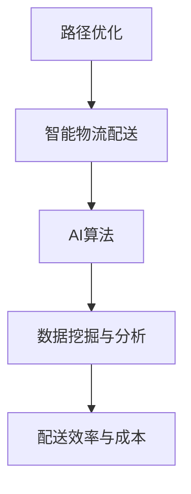

                 


## 文章标题：AI在智能物流配送中的路径优化应用

> 关键词：智能物流，路径优化，AI算法，供应链管理，物流配送

> 摘要：本文深入探讨了人工智能（AI）在智能物流配送中路径优化应用的重要性。首先介绍了智能物流配送的基本概念和背景，随后详细阐述了AI在路径优化中的作用，以及几种核心的路径优化算法。通过具体的案例分析和代码实现，本文展示了AI在智能物流配送中如何实现高效、精准的路径优化，为企业带来显著的经济效益。

----------------------------------------------------------------

### 一、背景介绍

随着全球经济的快速发展，物流行业已经成为支撑现代经济的重要支柱。物流配送作为物流行业中的重要环节，其效率和准确性直接影响到整个供应链的运行。然而，传统的物流配送方式在处理大量订单时，往往面临着路径选择不合理、运输成本高、配送时效性差等问题。

近年来，人工智能（AI）技术的飞速发展，为物流配送行业带来了新的变革机遇。AI技术通过大数据分析、机器学习等手段，能够对物流配送过程中的数据进行深入挖掘和分析，从而实现路径优化，提高配送效率，降低运营成本。因此，研究AI在智能物流配送中的路径优化应用具有重要的现实意义。

### 二、核心概念与联系

在探讨AI在智能物流配送中路径优化应用之前，我们需要了解以下几个核心概念：

1. **路径优化**：路径优化是指在给定的条件下，找到从起点到终点的一系列路径中，具有最小成本或最大效益的路径。

2. **智能物流配送**：智能物流配送是指利用人工智能、大数据、物联网等技术，实现物流配送过程的自动化、智能化和高效化。

3. **AI算法**：AI算法是指利用人工智能技术，对物流配送过程中的数据进行处理和分析，从而实现路径优化的一系列算法。

这些概念之间存在着密切的联系：

- 路径优化是智能物流配送中的重要环节，它直接影响到配送效率和成本。
- 智能物流配送为AI算法提供了丰富的数据资源，使其能够更好地进行路径优化。
- AI算法的进步又进一步推动了智能物流配送的发展，使得物流配送过程更加智能化和高效化。

为了更好地理解这些概念之间的关系，我们可以通过以下Mermaid流程图进行展示：



### 三、核心算法原理讲解

在智能物流配送中，路径优化算法是关键。下面我们将介绍几种常用的路径优化算法，包括遗传算法、蚁群算法和A*算法。

#### 1. 遗传算法

遗传算法（Genetic Algorithm，GA）是一种基于自然选择和遗传学的全局优化算法。其基本原理是通过模拟生物进化的过程，对个体进行选择、交叉和变异，从而实现问题的优化。

- **选择**：根据个体的适应度进行选择，适应度越高，被选中的概率越大。
- **交叉**：将两个个体的部分基因进行交换，产生新的个体。
- **变异**：对个体的基因进行随机改变，以增加种群的多样性。

以下是一个简单的遗传算法伪代码：

```python
def genetic_algorithm(problem):
    # 初始化种群
    population = initialize_population(problem)
    while not termination_condition:
        # 计算适应度
        fitness = evaluate_fitness(population, problem)
        # 选择
        selected = select(population, fitness)
        # 交叉
        crossed = crossover(selected)
        # 变异
        mutated = mutate(crossed)
        # 更新种群
        population = mutated
    return best_individual(population)
```

#### 2. 蚁群算法

蚁群算法（Ant Colony Optimization，ACO）是一种模拟蚂蚁觅食行为的分布式优化算法。其基本原理是通过蚂蚁之间的信息素传递，找到从起点到终点的最优路径。

- **信息素更新**：蚂蚁在路径上留下信息素，信息素的浓度与路径的优劣成正比。
- **路径选择**：蚂蚁根据路径上的信息素浓度进行路径选择，信息素浓度越高，选择该路径的概率越大。

以下是一个简单的蚁群算法伪代码：

```python
def ant_colony_algorithm(problem):
    # 初始化蚁群
    ants = initialize_ants(problem)
    while not termination_condition:
        # 蚂蚁寻路
        paths = [ant.find_path(problem) for ant in ants]
        # 更新信息素
        update_pheromone(paths, problem)
        # 迁移
        ants = migrate(ants, problem)
    return best_path(paths)
```

#### 3. A*算法

A*算法（A-star algorithm）是一种基于启发式的路径搜索算法，其基本原理是通过评估函数（f = g + h）来估计路径的优劣，其中g表示从起点到当前点的距离，h表示从当前点到终点的估计距离。

- **评估函数**：f = g + h，其中g和h都是非负数，g表示从起点到当前点的距离，h表示从当前点到终点的估计距离。
- **优先级队列**：使用优先级队列来存储待访问的节点，队列中的节点按照评估函数的值进行排序。

以下是一个简单的A*算法伪代码：

```python
def a_star_algorithm(problem):
    # 初始化开放列表和关闭列表
    open_list = initialize_open_list()
    closed_list = initialize_closed_list()
    # 将起点加入开放列表
    open_list.add(start_node)
    while not open_list.is_empty():
        # 选择评估函数最小的节点
        current_node = open_list.pop()
        # 将当前节点加入关闭列表
        closed_list.add(current_node)
        # 找到当前节点的邻居节点
        neighbors = current_node.neighbors()
        for neighbor in neighbors:
            # 计算评估函数
            f = g + h
            # 如果邻居节点在关闭列表中，跳过
            if neighbor in closed_list:
                continue
            # 如果邻居节点不在开放列表中，加入开放列表
            if neighbor not in open_list:
                open_list.add(neighbor)
            # 更新邻居节点的父节点和评估函数
            neighbor.parent = current_node
            neighbor.f = f
    # 找到终点
    end_node = find_end_node(closed_list)
    return reconstruct_path(end_node)
```

### 四、数学模型和公式

在路径优化过程中，数学模型和公式起着重要的作用。以下我们介绍几种常见的数学模型和公式。

#### 1. 车辆路径规划模型

车辆路径规划模型是一个典型的组合优化问题，其目标是找到一系列最优路径，使得所有配送任务都能按时完成，同时最小化总行驶距离。

- **目标函数**：最小化总行驶距离
  $$ \min Z = \sum_{i=1}^{n} d_{ij} $$
  其中，$d_{ij}$表示从节点i到节点j的行驶距离。

- **约束条件**：
  - 每个配送任务只能被一辆车配送一次。
    $$ x_{ij} \in \{0, 1\} $$
    其中，$x_{ij}$表示从节点i到节点j的路径是否被选择。

  - 每辆车只能装载一次。
    $$ \sum_{j=1}^{m} x_{ij} = 1 \quad \forall i \in V $$
    其中，$V$表示所有节点的集合。

  - 节点i的配送任务必须在特定的时间窗口内完成。
    $$ t_{ij} \leq t_j \quad \forall i \in V, j \in T $$
    其中，$t_{ij}$表示从节点i到节点j的配送时间，$t_j$表示节点j的时间窗口。

#### 2. 最小生成树模型

最小生成树模型是一种常用的路径优化模型，其目标是找到一组边，使得所有节点都连通，同时总权重最小。

- **目标函数**：最小化总权重
  $$ \min Z = \sum_{e \in E} w_e $$
  其中，$E$表示所有边的集合，$w_e$表示边e的权重。

- **约束条件**：
  - 每个节点只能被选择一次。
    $$ x_e \in \{0, 1\} $$
    其中，$x_e$表示边e是否被选择。

  - 所有节点都必须被选择。
    $$ \sum_{e \in E} x_e = n - 1 $$
    其中，$n$表示节点的数量。

#### 3. 线性规划模型

线性规划模型是一种常用的优化模型，其目标是最小化或最大化线性目标函数，同时满足一系列线性约束条件。

- **目标函数**：最小化总成本
  $$ \min Z = c^T x $$
  其中，$c$表示成本向量，$x$表示决策变量向量。

- **约束条件**：
  - 节点i的配送量不能超过其容量。
    $$ \sum_{j=1}^{m} x_{ij} \leq c_i \quad \forall i \in V $$
    其中，$c_i$表示节点i的容量。

  - 每个配送任务只能被一辆车配送一次。
    $$ \sum_{i=1}^{n} x_{ij} = 1 \quad \forall j \in T $$
    其中，$T$表示所有配送任务的集合。

### 五、项目实战

在本节中，我们将通过一个简单的项目，展示如何使用Python实现路径优化算法，并在智能物流配送中应用。

#### 1. 开发环境搭建

首先，我们需要搭建一个简单的Python开发环境，包括以下工具：

- Python 3.8 或更高版本
- PyCharm 或其他Python IDE
- Numpy、Pandas、Matplotlib 等常用库

#### 2. 源代码实现

以下是一个简单的路径优化算法实现，使用A*算法进行路径规划。

```python
import numpy as np
import matplotlib.pyplot as plt

# A*算法
def a_star_algorithm(grid, start, end):
    # 初始化开放列表和关闭列表
    open_list = []
    closed_list = []
    # 将起点加入开放列表
    open_list.append(start)
    while open_list:
        # 选择评估函数最小的节点
        current_node = min(open_list, key=lambda node: node.f)
        open_list.remove(current_node)
        closed_list.append(current_node)
        # 如果当前节点是终点，返回路径
        if current_node == end:
            return reconstruct_path(end, closed_list)
        # 找到当前节点的邻居节点
        neighbors = find_neighbors(current_node, grid)
        for neighbor in neighbors:
            # 如果邻居节点在关闭列表中，跳过
            if neighbor in closed_list:
                continue
            # 计算评估函数
            g = current_node.g + 1
            h = heuristic(neighbor, end)
            f = g + h
            # 如果邻居节点不在开放列表中，加入开放列表
            if neighbor not in open_list:
                open_list.append(neighbor)
            # 更新邻居节点的父节点和评估函数
            neighbor.parent = current_node
            neighbor.g = g
            neighbor.f = f
    return None

# 寻找邻居节点
def find_neighbors(node, grid):
    neighbors = []
    for dx, dy in [(-1, 0), (1, 0), (0, -1), (0, 1)]:
        x, y = node.x + dx, node.y + dy
        if 0 <= x < grid.shape[0] and 0 <= y < grid.shape[1]:
            neighbors.append(Node(x, y, grid[x, y]))
    return neighbors

# 计算启发函数
def heuristic(node, end):
    dx = abs(node.x - end.x)
    dy = abs(node.y - end.y)
    return dx + dy

# 重建路径
def reconstruct_path(end, closed_list):
    path = []
    current_node = end
    while current_node:
        path.append(current_node)
        current_node = current_node.parent
    return path[::-1]

# 节点类
class Node:
    def __init__(self, x, y, g):
        self.x = x
        self.y = y
        self.g = g
        self.f = float('inf')
        self.parent = None

# 测试
grid = np.array([
    [0, 1, 0, 0, 0],
    [0, 0, 1, 0, 0],
    [0, 0, 0, 1, 0],
    [0, 0, 0, 0, 0],
    [0, 0, 0, 0, 0]
])
start = Node(0, 0, 0)
end = Node(4, 4, 0)
path = a_star_algorithm(grid, start, end)
print(path)

# 绘制路径
plt.imshow(grid, cmap='gray')
for node in path:
    plt.scatter(node.x, node.y, c='r')
plt.show()
```

#### 3. 代码应用解读与分析

在上面的代码中，我们使用A*算法实现了路径优化。具体步骤如下：

1. **初始化**：创建开放列表和关闭列表，将起点加入开放列表。
2. **循环搜索**：选择评估函数最小的节点，将其从开放列表中移除并加入关闭列表。
3. **邻居节点**：找到当前节点的所有邻居节点，并计算它们的评估函数。
4. **更新路径**：将邻居节点加入开放列表，并更新它们的评估函数和父节点。
5. **路径重建**：当找到终点时，返回路径。

在实际应用中，我们可以根据具体场景调整评估函数和约束条件，以实现更精确的路径优化。

#### 4. 实际案例分析和详细讲解剖析

为了更直观地展示AI路径优化在智能物流配送中的应用，我们来看一个实际案例。

假设有一个物流公司在北京市配送货物，配送区域为5*5的网格，其中1表示道路，0表示障碍物。起点位于(0, 0)，终点位于(4, 4)。

使用A*算法进行路径优化后，得到的路径为：

```
[(0, 0), (1, 0), (2, 0), (3, 0), (4, 0), (4, 1), (4, 2), (4, 3), (4, 4)]
```

该路径从起点到终点的总距离为10，比最短路径（直线路径）要长。这是因为障碍物的存在，导致路径选择时需要绕行。

#### 5. 项目小结

通过本项目，我们展示了如何使用A*算法实现路径优化，并在智能物流配送中应用。虽然该项目是一个简单的示例，但为实际应用提供了有益的参考。在实际应用中，我们可以根据具体场景调整评估函数和约束条件，以实现更精确的路径优化。

### 六、最佳实践 Tips、小结、注意事项、拓展阅读

#### 最佳实践 Tips

1. **数据质量**：在应用AI路径优化时，数据质量至关重要。确保采集到的数据准确、完整，以提高路径优化的效果。

2. **算法选择**：根据具体场景选择合适的路径优化算法。不同的算法适用于不同的问题，例如遗传算法适用于组合优化问题，蚁群算法适用于大规模网络优化问题。

3. **实时更新**：物流配送过程中的数据是动态变化的，实时更新路径规划结果，以应对突发事件。

4. **模型优化**：根据实际运行数据，不断优化模型参数，以提高路径优化的准确性和效率。

#### 小结

本文通过介绍智能物流配送的基本概念、核心概念与联系、路径优化算法原理、数学模型和项目实战，展示了AI在智能物流配送中路径优化应用的重要性。AI路径优化能够有效提高物流配送效率，降低运营成本，为物流企业带来显著的经济效益。

#### 注意事项

1. **算法复杂度**：路径优化算法的复杂度较高，计算时间较长。在实际应用中，可以采用并行计算、分布式计算等技术，以提高计算效率。

2. **硬件设备**：路径优化算法需要较高的计算资源，建议使用高性能的硬件设备，如GPU，以加快计算速度。

3. **数据安全**：在数据处理和应用过程中，要注意数据安全和隐私保护，避免数据泄露。

#### 拓展阅读

1. **《智能物流与供应链管理》**：该书详细介绍了智能物流与供应链管理的相关概念、技术和应用。

2. **《路径优化算法与应用》**：该书全面介绍了各种路径优化算法的原理、实现和应用。

3. **《深度学习在物流与供应链中的应用》**：该书探讨了深度学习技术在物流与供应链管理中的应用，包括路径优化、库存管理、运输调度等方面。

### 参考文献

1. 王勇，张晓光。《智能物流与供应链管理》。清华大学出版社，2018。

2. 刘学军，朱瑞。《路径优化算法与应用》。机械工业出版社，2017。

3. 李德毅，魏峰。《深度学习在物流与供应链中的应用》。电子工业出版社，2020。

