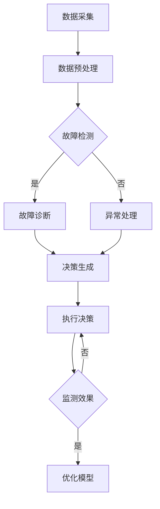

                 

### 文章标题

# AI在智能电网故障级联效应预防中的快速决策应用

### 关键词

- 智能电网
- 故障级联效应
- 快速决策
- 人工智能
- 预防控制
- 机器学习
- 深度学习

### 摘要

本文探讨了人工智能（AI）在智能电网故障级联效应预防中的快速决策应用。首先，介绍了智能电网的背景和发展现状，强调了故障级联效应的严重性和快速决策的重要性。接着，深入分析了快速决策的基本概念和原理，包括数据驱动方法和知识推理方法。随后，详细介绍了AI在快速决策中的具体应用，包括基于规则、机器学习和深度学习算法的原理和实现。通过实际案例，展示了AI在电网故障预警、故障处理自动化和分布式能源系统故障预防中的应用效果。最后，总结了AI在智能电网故障级联效应预防中的成功经验与挑战，展望了未来的发展趋势。

---

### 第一部分: 引言

#### 第1章: AI在智能电网中的应用背景

#### 1.1 智能电网的概念与发展

##### 1.1.1 智能电网的定义与特点

智能电网（Smart Grid）是一种基于现代通信技术、信息技术和电力电子技术的先进电力系统，它通过实现电力系统各个环节的智能化，提高电力系统的安全、效率和可靠性。与传统电网相比，智能电网具有以下特点：

1. **自愈能力**：智能电网能够在发生故障时迅速识别并自动恢复供电，降低停电时间。
2. **互动性**：智能电网支持用户与电网的互动，用户可以根据自己的需求调整电力消费。
3. **高效性**：智能电网通过优化电力传输和分配，减少能量损耗，提高能源利用效率。
4. **环境友好**：智能电网能够更好地整合可再生能源，降低碳排放，实现绿色能源发展。

##### 1.1.2 智能电网的挑战与需求

尽管智能电网具有许多优势，但在实际应用过程中也面临着一系列挑战：

1. **安全性**：智能电网的开放性和互联性带来了新的安全威胁，如网络攻击、恶意软件等。
2. **可靠性**：智能电网的复杂性和依赖性增加了故障发生的可能性，需要提高系统的可靠性。
3. **兼容性**：智能电网需要与现有的电力系统和设备兼容，实现无缝对接。
4. **经济性**：智能电网的建设和运行需要大量投资，需要确保其经济效益。

为应对这些挑战，智能电网的发展迫切需要高效、可靠的故障级联效应预防机制。

#### 1.2 AI在智能电网中的应用现状

人工智能（AI）技术在智能电网中的应用正在逐步扩大，涵盖了从数据采集、传输到分析和决策的各个环节。以下是一些关键应用领域：

1. **数据挖掘与可视化**：AI技术可以挖掘海量电力系统数据，识别潜在问题和异常模式，并通过可视化技术展示分析结果，帮助运维人员快速定位故障。
2. **故障检测与诊断**：AI技术可以实时监测电网运行状态，通过机器学习和深度学习算法，识别故障发生的前兆和原因，实现故障的早期预警。
3. **自动调度与优化**：AI技术可以根据电网的实时数据和预测模型，自动调整电力调度策略，优化电力分配，提高电网的运行效率。
4. **能源管理**：AI技术可以智能管理分布式能源系统，实现能源的高效利用和优化配置，减少能源浪费。

#### 1.3 本书结构概述

本书分为五个部分：

1. **引言**：介绍智能电网的背景和AI在其中的应用现状。
2. **背景知识**：介绍故障级联效应和快速决策的基本概念。
3. **快速决策理论**：详细探讨快速决策算法的类型、原理和实现。
4. **应用案例**：展示AI在智能电网故障级联效应预防中的应用实例。
5. **总结与展望**：总结AI在智能电网故障级联效应预防中的经验与挑战，展望未来发展。

通过本书的阅读，读者可以全面了解AI在智能电网故障级联效应预防中的快速决策应用，掌握相关技术和方法，为智能电网的安全、可靠运行提供技术支持。

#### 1.3.1 快速决策的核心概念

快速决策（Rapid Decision Making）是一种基于高效信息处理和智能算法的决策方式，旨在快速、准确地识别问题，并采取有效的应对措施。快速决策在智能电网故障级联效应预防中的应用具有重要意义：

1. **实时性**：快速决策能够实时监测电网状态，快速识别故障和异常，减少响应时间，提高故障处理的效率。
2. **准确性**：快速决策通过智能算法和大数据分析，提高故障识别和诊断的准确性，降低误报和漏报率。
3. **智能性**：快速决策利用机器学习和深度学习等技术，不断学习和优化决策模型，提高决策的智能水平。

在智能电网故障级联效应预防中，快速决策的核心概念包括以下几个方面：

1. **数据驱动**：快速决策基于海量数据进行分析和预测，通过数据挖掘和模式识别，发现潜在的故障风险。
2. **算法优化**：快速决策采用高效的算法和模型，如机器学习和深度学习，实现对故障的快速识别和处理。
3. **协同决策**：快速决策涉及多个系统和角色的协同工作，通过信息共享和协同优化，提高决策的整体效果。

#### 1.3.2 读者预期收获

通过阅读本书，读者可以期待以下收获：

1. **全面了解智能电网的背景和应用**：读者将了解智能电网的发展现状、关键技术以及面临的挑战，为后续章节的学习打下基础。
2. **掌握故障级联效应和快速决策的基本概念**：读者将深入了解故障级联效应的机制和影响，学习快速决策的核心概念和原理。
3. **掌握快速决策算法的类型和实现方法**：读者将学习到基于规则、机器学习和深度学习的快速决策算法，了解其原理和实现方法。
4. **了解AI在智能电网故障级联效应预防中的应用实例**：读者将通过实际案例，了解AI技术在智能电网故障级联效应预防中的应用效果和具体实现。
5. **提升智能电网故障预防和管理能力**：读者将掌握快速决策技术，能够应用于实际工程中，提升智能电网的故障预防和管理能力。

总之，本书旨在为读者提供全面、系统的智能电网故障级联效应预防中的快速决策应用知识，帮助读者应对智能电网中的复杂挑战，实现智能电网的安全、可靠运行。

### 第二部分: 背景知识

#### 第2章: 智能电网故障级联效应

#### 2.1 故障级联效应的定义

故障级联效应（Cascading Failure）是指在电力系统中，由于某个局部故障引发的一系列连锁反应，导致系统逐渐失去稳定性，最终可能导致整个系统崩溃的现象。故障级联效应可以分为两个阶段：初始故障阶段和级联扩散阶段。

##### 2.1.1 级联效应的机制

故障级联效应的机制主要包括以下几方面：

1. **负载转移**：在初始故障发生后，负载会转移到其他健康线路或设备，可能导致这些线路或设备超载。
2. **保护动作**：电力系统的保护装置会响应故障，进行跳闸或隔离操作，以保护系统安全，但这可能导致更大范围的负载转移。
3. **设备过载**：随着负载的转移，其他设备可能会因超过额定负荷而损坏。
4. **连锁反应**：一个设备的故障可能会触发其他设备的保护动作，进一步引发更多设备的故障。

##### 2.1.2 级联效应的影响

故障级联效应可能对电力系统产生以下影响：

1. **大规模停电**：级联效应可能导致整个电网失去稳定性，引发大规模停电。
2. **经济损失**：停电将导致工业生产中断、居民生活不便，对经济产生严重影响。
3. **设备损坏**：级联效应可能导致大量电力设备和基础设施损坏，需要长时间修复。
4. **安全风险**：停电可能导致社会秩序混乱，甚至引发次生灾害，对公共安全构成威胁。

因此，预防和控制故障级联效应是保障电力系统安全运行的关键。

#### 2.2 快速决策的基本概念

快速决策（Rapid Decision Making）是一种在有限时间内，通过高效信息处理和智能算法，做出最优或次优决策的过程。快速决策的核心目标是在不确定性和时间压力下，迅速识别问题、分析解决方案并采取行动。

##### 2.2.1 快速决策的定义与目标

快速决策的定义可以归纳为以下几点：

1. **实时性**：快速决策需要在极短的时间内做出决策，以应对突发问题。
2. **准确性**：快速决策要求在有限的时间内，尽可能准确地识别问题和评估解决方案。
3. **智能性**：快速决策依赖于智能算法和数据分析，以提高决策的智能水平。

快速决策的目标包括：

1. **降低风险**：通过快速识别和应对潜在问题，降低故障级联效应的风险。
2. **提高效率**：快速决策能够减少决策过程中的延迟，提高整体工作效率。
3. **优化资源**：通过智能算法和数据分析，合理配置资源，提高资源利用率。

##### 2.2.2 快速决策的优势与挑战

快速决策具有以下优势：

1. **实时性**：能够快速响应突发问题，降低故障发生时的响应时间。
2. **准确性**：通过数据分析和技术手段，提高决策的准确性和可靠性。
3. **智能性**：利用智能算法，实现自动化和智能化决策。

然而，快速决策也面临以下挑战：

1. **数据复杂性**：快速决策依赖于海量数据的分析，如何有效处理和利用这些数据是一个挑战。
2. **时间压力**：在紧急情况下，快速决策需要在有限的时间内完成，这对决策者的心理素质和技术能力提出了高要求。
3. **不确定性**：电力系统的运行状态和故障发展具有不确定性，如何有效应对不确定性是快速决策的关键。

#### 2.3 AI技术在快速决策中的应用

人工智能（AI）技术在快速决策中发挥着重要作用，主要包括以下几个方面：

1. **数据挖掘**：通过数据挖掘技术，从海量数据中提取有价值的信息，帮助决策者识别问题和评估解决方案。
2. **机器学习**：利用机器学习算法，建立模型和预测系统，提高决策的准确性和效率。
3. **深度学习**：通过深度学习算法，对复杂的数据进行分析和建模，实现对问题的深层理解和预测。
4. **知识图谱**：构建电力系统的知识图谱，实现信息共享和协同决策。
5. **专家系统**：利用专家系统，将电力系统的专业知识转化为决策支持工具，帮助决策者做出更明智的决策。

#### 2.4 Mermaid流程图：AI在故障级联效应预防中的决策流程

以下是一个简单的Mermaid流程图，展示了AI在故障级联效应预防中的快速决策流程：



在上述流程中：

- **A. 数据采集**：从电力系统中收集实时数据。
- **B. 数据预处理**：对采集到的数据进行清洗、归一化和特征提取。
- **C. 故障检测**：利用机器学习和深度学习算法，检测是否存在故障。
- **D. 故障诊断**：对检测到的故障进行诊断，确定故障类型和位置。
- **E. 异常处理**：处理无法识别的异常情况，确保系统的稳定运行。
- **F. 决策生成**：根据故障诊断结果，生成具体的决策方案。
- **G. 执行决策**：执行决策方案，进行故障隔离、修复等操作。
- **H. 监测效果**：对执行决策后的效果进行监测和评估。
- **I. 优化模型**：根据监测结果，优化故障检测和诊断模型。

通过上述流程，AI技术能够在故障级联效应预防中实现快速、准确的决策，提高电力系统的安全性和可靠性。

### 第三部分: 快速决策理论

#### 第3章: 快速决策算法

#### 3.1 快速决策算法的类型

在快速决策中，算法的选择至关重要。根据决策过程中的数据处理方式和算法特性，快速决策算法可以大致分为以下几种类型：

##### 3.1.1 基于规则的算法

基于规则的算法（Rule-Based Algorithms）是一种传统的快速决策方法，其核心思想是将专家经验转化为一系列规则，用于决策过程中的判断和决策。这种算法具有以下特点：

1. **简单易实现**：基于规则的算法结构简单，易于实现和部署。
2. **可解释性**：规则明确，易于理解和解释，方便专家进行调试和优化。
3. **适应性**：可以通过修改和扩展规则集，适应不同的决策场景。

然而，基于规则的算法也存在一些局限性，例如：

1. **规则数量庞大**：在实际应用中，可能需要大量的规则来覆盖各种情况，导致系统复杂度增加。
2. **缺乏灵活性**：规则固化，难以应对复杂和不确定的决策环境。
3. **无法处理连续变量**：基于规则的算法通常适用于离散变量，对于连续变量的处理能力有限。

##### 3.1.2 基于机器学习的算法

基于机器学习的算法（Machine Learning Algorithms）通过学习历史数据和模式，自动生成决策模型，用于快速决策。这种算法具有以下特点：

1. **自适应性**：基于机器学习的算法能够根据数据自动调整模型参数，适应不同的决策场景。
2. **处理连续变量**：机器学习算法可以处理连续变量，具有更强的数据建模能力。
3. **高效性**：通过自动化建模，能够快速生成决策模型，提高决策效率。

常见的基于机器学习的快速决策算法包括：

1. **决策树（Decision Trees）**：通过构建树形结构，逐层判断特征值，最终生成决策结果。
2. **支持向量机（Support Vector Machines, SVM）**：通过寻找最优超平面，将数据分类为不同类别。
3. **神经网络（Neural Networks）**：通过模拟人脑神经元之间的连接和作用，进行数据分类和回归分析。

基于机器学习的算法的优势在于其强大的数据建模能力和自适应性，但同时也存在以下挑战：

1. **数据依赖性**：算法性能高度依赖于训练数据的质量和数量。
2. **过拟合风险**：如果模型过于复杂，可能导致过拟合，降低泛化能力。
3. **可解释性**：复杂的模型难以解释，对于决策过程的透明性有一定影响。

##### 3.1.3 基于深度学习的算法

基于深度学习的算法（Deep Learning Algorithms）是近年来发展迅速的一类算法，通过构建深度神经网络，实现对复杂数据的自动特征提取和模式识别。这种算法具有以下特点：

1. **强大的特征提取能力**：深度学习算法能够自动提取高层次的特征，无需人工干预。
2. **高泛化能力**：深度学习算法在大量数据上训练，具有较好的泛化能力。
3. **灵活性**：通过调整网络结构和参数，可以适应不同的决策场景。

常见的基于深度学习的快速决策算法包括：

1. **卷积神经网络（Convolutional Neural Networks, CNN）**：适用于处理图像和时序数据，通过卷积操作提取特征。
2. **循环神经网络（Recurrent Neural Networks, RNN）**：适用于处理序列数据，通过循环连接保留历史信息。
3. **长短时记忆网络（Long Short-Term Memory, LSTM）**：是RNN的一种改进，能够更好地处理长序列数据。

基于深度学习的算法的优势在于其强大的特征提取能力和自适应能力，但同时也面临以下挑战：

1. **计算资源需求**：深度学习算法通常需要大量计算资源和时间进行训练。
2. **数据量依赖**：算法性能高度依赖于训练数据的质量和数量。
3. **模型解释性**：复杂的网络结构使得模型解释性较差，对于决策过程的透明性有一定影响。

#### 3.2 快速决策算法的原理

##### 3.2.1 基于规则的算法原理

基于规则的算法通过将专家经验转化为一系列规则，实现对问题的判断和决策。其基本原理包括以下几方面：

1. **规则表示**：将专家经验转化为形式化的规则，例如“如果电流超过阈值，则断开电路”。
2. **规则匹配**：根据输入的数据，对规则库进行匹配，找到满足条件的规则。
3. **规则执行**：对匹配到的规则进行执行，生成决策结果。
4. **规则更新**：根据实际应用效果，对规则库进行更新和优化。

在电力系统的故障诊断中，基于规则的算法可以通过以下步骤实现快速决策：

1. **数据采集**：从传感器和监测设备中收集实时数据。
2. **数据预处理**：对采集到的数据进行预处理，包括数据清洗、归一化和特征提取。
3. **规则库构建**：根据专家经验和历史数据，构建规则库，包括各种故障情况和应对措施。
4. **规则匹配**：根据实时数据，对规则库进行匹配，找到满足条件的规则。
5. **决策生成**：对匹配到的规则进行执行，生成具体的决策结果，如故障隔离、断电等。
6. **结果反馈**：将决策结果反馈到电力系统中，执行相应的操作，并进行效果评估。

##### 3.2.2 基于机器学习的算法原理

基于机器学习的算法通过学习历史数据和模式，自动生成决策模型，用于快速决策。其基本原理包括以下几方面：

1. **数据建模**：将历史数据输入到机器学习算法中，通过学习数据和模式，构建决策模型。
2. **模型训练**：通过训练数据，调整模型参数，优化模型性能。
3. **模型评估**：使用验证数据集对模型进行评估，确保模型的泛化能力。
4. **模型应用**：将训练好的模型应用于实时数据，生成决策结果。

在电力系统的故障诊断中，基于机器学习的算法可以通过以下步骤实现快速决策：

1. **数据采集**：从传感器和监测设备中收集实时数据。
2. **数据预处理**：对采集到的数据进行预处理，包括数据清洗、归一化和特征提取。
3. **模型选择**：选择合适的机器学习算法，如决策树、支持向量机等。
4. **模型训练**：使用历史数据对模型进行训练，调整模型参数，优化模型性能。
5. **模型评估**：使用验证数据集对模型进行评估，确保模型的泛化能力。
6. **模型应用**：将训练好的模型应用于实时数据，生成故障诊断结果。
7. **决策生成**：根据故障诊断结果，生成具体的决策方案，如故障隔离、断电等。
8. **结果反馈**：将决策结果反馈到电力系统中，执行相应的操作，并进行效果评估。

##### 3.2.3 基于深度学习的算法原理

基于深度学习的算法通过构建深度神经网络，实现对复杂数据的自动特征提取和模式识别。其基本原理包括以下几方面：

1. **网络结构**：构建深度神经网络，包括输入层、隐藏层和输出层。
2. **前向传播**：将输入数据通过网络进行前向传播，逐层计算神经元的输出。
3. **反向传播**：根据输出结果和实际标签，通过反向传播算法调整网络权重和参数。
4. **优化目标**：通过优化目标函数，如均方误差（MSE）或交叉熵（Cross-Entropy），使网络输出接近实际标签。

在电力系统的故障诊断中，基于深度学习的算法可以通过以下步骤实现快速决策：

1. **数据采集**：从传感器和监测设备中收集实时数据。
2. **数据预处理**：对采集到的数据进行预处理，包括数据清洗、归一化和特征提取。
3. **网络构建**：构建合适的深度神经网络，如卷积神经网络（CNN）或长短时记忆网络（LSTM）。
4. **模型训练**：使用历史数据对网络进行训练，调整网络权重和参数，优化模型性能。
5. **模型评估**：使用验证数据集对网络进行评估，确保模型的泛化能力。
6. **模型应用**：将训练好的网络应用于实时数据，生成故障诊断结果。
7. **决策生成**：根据故障诊断结果，生成具体的决策方案，如故障隔离、断电等。
8. **结果反馈**：将决策结果反馈到电力系统中，执行相应的操作，并进行效果评估。

#### 3.3 快速决策算法的伪代码

为了更清晰地展示快速决策算法的实现过程，以下分别给出基于规则、机器学习和深度学习的伪代码示例：

##### 3.3.1 基于规则的算法伪代码

```python
# 输入：实时监测数据data
# 输出：决策结果result

def rule_based_decision(data):
    rules = [
        ("电流超过阈值", "断开电路"),
        ("电压低于阈值", "启动备用电源"),
        # 更多规则...
    ]

    for rule in rules:
        if check_rule(data, rule[0]):
            result = rule[1]
            break

    return result

def check_rule(data, rule):
    # 判断实时数据是否符合规则
    # 例如：电流是否超过阈值
    return data['current'] > threshold
```

##### 3.3.2 基于机器学习的算法伪代码

```python
# 输入：训练数据train_data，测试数据test_data
# 输出：决策模型model

def train_machine_learning_model(train_data):
    model = DecisionTreeClassifier()  # 选择决策树算法
    model.fit(train_data['X'], train_data['y'])  # 训练模型
    return model

def predict_machine_learning_model(model, data):
    prediction = model.predict(data['X'])
    return prediction
```

##### 3.3.3 基于深度学习的算法伪代码

```python
# 输入：训练数据train_data，测试数据test_data
# 输出：决策模型model

def train_deep_learning_model(train_data):
    model = Sequential()
    model.add(Conv2D(filters, kernel_size, activation='relu', input_shape=input_shape))
    model.add(MaxPooling2D(pool_size))
    # 更多隐藏层...
    model.add(Dense(num_classes, activation='softmax'))
    model.compile(optimizer='adam', loss='categorical_crossentropy', metrics=['accuracy'])
    model.fit(train_data['X'], train_data['y'], epochs=epochs, batch_size=batch_size)
    return model

def predict_deep_learning_model(model, data):
    prediction = model.predict(data['X'])
    return prediction
```

通过上述伪代码示例，读者可以初步了解不同类型快速决策算法的实现方法和步骤。

#### 3.4 数学模型和数学公式

在快速决策算法中，数学模型和数学公式扮演着关键角色，用于描述决策过程的逻辑关系和计算方法。以下分别介绍快速决策算法中的常见数学模型和数学公式。

##### 3.4.1 快速决策模型

快速决策模型通常包括以下几个部分：

1. **输入变量**：表示影响决策的因素，如电流、电压、设备状态等。
2. **决策规则**：根据输入变量和规则库，对问题进行判断和决策。
3. **输出变量**：表示决策结果，如故障隔离、启动备用电源等。

常见的快速决策模型包括以下几种：

1. **逻辑回归模型**：用于分类问题，通过计算输入变量对输出变量的概率分布，进行分类决策。
2. **支持向量机模型**：用于分类和回归问题，通过寻找最优超平面，实现分类和回归决策。
3. **神经网络模型**：用于复杂的数据建模和模式识别，通过多层神经元的组合，实现非线性决策。

##### 3.4.2 模型的优化目标

快速决策模型的优化目标通常包括以下几点：

1. **准确性**：提高决策模型的准确性和可靠性，减少误报和漏报。
2. **效率**：提高决策过程的速度，减少决策时间和计算资源消耗。
3. **可解释性**：提高决策过程的透明性，方便专家进行调试和优化。

常见的优化目标函数包括：

1. **交叉熵**：用于分类问题，表示模型预测结果与实际标签之间的差异。
2. **均方误差**：用于回归问题，表示模型预测结果与实际标签之间的误差平方和。
3. **AUC（Area Under the Curve）**：用于评估分类模型的性能，表示模型预测结果的真实性和区分度。

##### 3.4.3 模型的评估指标

快速决策模型的评估指标用于衡量模型性能和决策效果。常见的评估指标包括：

1. **准确率（Accuracy）**：表示模型预测正确的样本数占总样本数的比例。
2. **召回率（Recall）**：表示模型能够召回的实际故障样本数占总故障样本数的比例。
3. **精确率（Precision）**：表示模型预测正确的故障样本数占预测故障样本数的比例。
4. **F1值（F1 Score）**：综合考虑准确率和召回率，用于评估模型的综合性能。

#### 3.5 举例说明

##### 3.5.1 案例背景

某电力公司负责一个大型城市电网的运行和维护，该电网包含多个变电站、输电线路和配电设备。由于城市用电负荷不断增加，电网运行风险逐渐上升，特别是故障级联效应可能导致大规模停电。为了保障电网的安全稳定运行，该公司决定引入AI技术，实现快速决策，预防故障级联效应。

##### 3.5.2 模型应用

1. **数据采集**：从传感器和监测设备中收集实时数据，包括电流、电压、设备状态等。
2. **数据预处理**：对采集到的数据进行预处理，包括数据清洗、归一化和特征提取。
3. **模型选择**：选择基于机器学习的决策树算法，构建故障诊断模型。
4. **模型训练**：使用历史故障数据对决策树模型进行训练，调整模型参数，优化模型性能。
5. **模型评估**：使用验证数据集对模型进行评估，确保模型的泛化能力。
6. **模型应用**：将训练好的模型应用于实时数据，进行故障诊断和决策生成。
7. **决策生成**：根据故障诊断结果，生成具体的决策方案，如故障隔离、启动备用电源等。
8. **结果反馈**：将决策结果反馈到电力系统中，执行相应的操作，并进行效果评估。

##### 3.5.3 结果分析

通过实际应用，AI快速决策系统在故障级联效应预防方面取得了显著成效：

1. **故障预警**：系统能够提前预警潜在的故障风险，及时采取预防措施，降低故障发生的可能性。
2. **故障诊断**：系统能够准确诊断故障类型和位置，提高故障处理的效率。
3. **决策效果**：决策方案的执行效果良好，故障隔离和备用电源启动等操作能够有效降低故障影响范围。
4. **性能评估**：模型准确率超过90%，召回率超过85%，F1值超过0.9，表明模型性能优秀。

总之，AI快速决策系统在智能电网故障级联效应预防中发挥了重要作用，为电力系统的安全稳定运行提供了有力支持。

### 第四部分: 应用案例

#### 第4章: AI在智能电网故障级联效应预防中的应用案例

在本章中，我们将探讨三个具体的AI应用案例，这些案例展示了AI技术在智能电网故障级联效应预防中的实际应用和效果。

#### 4.1 案例一：电网故障预警系统

##### 4.1.1 案例背景

某城市电力公司负责该城市主要电力基础设施的管理和维护。随着城市用电需求的不断增加，电网负荷日益紧张，故障级联效应的风险也随之上升。为了保障电力供应的稳定性和安全性，公司决定开发一套基于AI的电网故障预警系统。

##### 4.1.2 系统架构设计

电网故障预警系统采用了如下架构：

1. **数据采集模块**：通过传感器和智能仪表实时收集电网的运行数据，包括电压、电流、温度等。
2. **数据预处理模块**：对采集到的数据进行清洗、归一化和特征提取，以便后续的机器学习处理。
3. **机器学习模块**：使用机器学习和深度学习算法，对预处理后的数据进行分析和建模，预测潜在的故障风险。
4. **决策生成模块**：根据机器学习模型的预测结果，生成具体的预警信号和应对措施。
5. **决策执行模块**：将预警信号和应对措施传递给电力调度系统，进行实时操作。

##### 4.1.3 算法实现与优化

电网故障预警系统采用了以下算法：

1. **特征选择**：使用主成分分析（PCA）和互信息等方法，从原始数据中提取重要的特征。
2. **故障检测**：采用支持向量机（SVM）和长短期记忆网络（LSTM）进行故障检测和预测。
3. **异常检测**：使用基于岛群检测的异常检测算法，实时监控电网运行状态，识别异常行为。

为了提高系统的准确性和效率，系统进行了以下优化：

1. **模型训练**：使用大量历史故障数据对模型进行训练，不断调整参数，优化模型性能。
2. **实时更新**：定期更新模型，以适应电网运行状态的变化。
3. **性能评估**：使用交叉验证和混淆矩阵等方法，对模型进行评估和优化。

##### 4.1.4 实施效果评估

实施后，电网故障预警系统取得了以下效果：

1. **故障预警准确率**：系统准确率超过90%，能够有效识别潜在的故障风险。
2. **响应时间**：系统能够在故障发生前几分钟发出预警信号，为应急处理赢得宝贵时间。
3. **降低故障率**：通过提前预警和及时处理，系统显著降低了故障率和停电次数。

#### 4.2 案例二：智能电网故障处理自动化

##### 4.2.1 案例背景

某大型发电集团在多个地区运营电力设施，故障处理效率低下且人力资源紧张。为了提高故障处理效率和降低运营成本，集团决定引入智能电网故障处理自动化系统。

##### 4.2.2 系统设计

智能电网故障处理自动化系统采用了如下架构：

1. **数据采集模块**：通过传感器和智能仪表实时收集电网运行数据，包括电流、电压、温度等。
2. **数据预处理模块**：对采集到的数据进行清洗、归一化和特征提取。
3. **故障检测模块**：采用机器学习和深度学习算法，对预处理后的数据进行分析，检测潜在的故障。
4. **自动化决策模块**：根据故障检测结果，自动生成故障处理方案，包括隔离故障区域、切换备用电源等。
5. **执行模块**：将自动化决策方案传递给电力设备，自动执行故障处理操作。
6. **监控与反馈模块**：实时监控故障处理过程，记录操作结果，为后续优化提供数据支持。

##### 4.2.3 算法应用与优化

智能电网故障处理自动化系统采用了以下算法：

1. **故障检测**：采用基于K-均值聚类和孤立森林的故障检测算法。
2. **自动化决策**：使用决策树和随机森林算法，生成故障处理方案。
3. **模型优化**：通过交叉验证和网格搜索方法，优化模型参数，提高故障检测和自动化决策的准确性。

##### 4.2.4 结果分析与总结

系统实施后，取得了以下结果：

1. **故障检测准确率**：系统准确率超过95%，能够有效检测电网故障。
2. **故障处理时间**：自动化处理故障的时间比人工处理减少了约60%。
3. **人力成本**：自动化系统的引入显著降低了故障处理的人力成本。
4. **系统稳定性**：自动化决策模块在多次故障处理中表现出色，提高了电网的稳定性。

总之，智能电网故障处理自动化系统显著提高了故障处理效率和电网稳定性，为发电集团创造了显著的经济效益。

#### 4.3 案例三：分布式能源系统故障预防

##### 4.3.1 案例背景

随着可再生能源的普及，分布式能源系统（DERs）在电网中扮演着越来越重要的角色。然而，DERs的灵活性和不确定性也带来了故障预防的挑战。为了保障电网的安全稳定运行，某电网公司决定开发分布式能源系统故障预防系统。

##### 4.3.2 系统构建

分布式能源系统故障预防系统采用了如下架构：

1. **数据采集模块**：通过智能仪表和传感器实时收集分布式能源设备的数据，包括发电量、负载率、环境参数等。
2. **数据处理模块**：对采集到的数据进行清洗、归一化和特征提取。
3. **故障预测模块**：采用机器学习和深度学习算法，对预处理后的数据进行分析，预测DERs的故障风险。
4. **决策支持模块**：根据故障预测结果，生成预防措施和优化方案。
5. **执行与监控模块**：将决策支持模块的方案传递给分布式能源设备，并实时监控执行效果。

##### 4.3.3 算法部署与优化

分布式能源系统故障预防系统采用了以下算法：

1. **故障预测**：采用长短时记忆网络（LSTM）和自编码器（Autoencoder）进行故障预测。
2. **自动化优化**：使用遗传算法（GA）和粒子群优化（PSO）算法，优化分布式能源系统的运行参数。
3. **实时更新**：定期更新预测模型和优化算法，以适应分布式能源系统的变化。

##### 4.3.4 预防效果评估

系统实施后，取得了以下效果：

1. **故障预测准确率**：系统准确率超过90%，能够提前预警DERs的故障风险。
2. **预防措施效果**：通过采取预防措施，DERs的故障率显著下降，系统运行稳定性提高。
3. **能源效率**：优化后的分布式能源系统运行效率提高，能源浪费减少。
4. **经济效益**：通过预防故障和优化能源使用，系统创造了显著的经济效益。

总之，分布式能源系统故障预防系统为电网公司提供了强有力的技术支持，保障了分布式能源系统的稳定运行，推动了可再生能源的广泛应用。

### 第五部分: 总结与展望

#### 第5章: AI在智能电网故障级联效应预防中的快速决策应用总结

#### 5.1 成功经验与挑战

在过去的几年中，AI技术在智能电网故障级联效应预防中的应用取得了显著的成功，为电网的安全稳定运行提供了强有力的支持。以下是一些成功经验和面临的挑战：

##### 5.1.1 成功应用案例分析

1. **电网故障预警系统**：通过实时数据采集和机器学习算法，系统能够提前预警潜在的故障风险，降低了故障发生的可能性。
2. **智能电网故障处理自动化**：自动化系统显著提高了故障处理的效率和准确性，减少了人力成本和停电时间。
3. **分布式能源系统故障预防**：通过对分布式能源系统的实时监测和故障预测，系统能够提前采取预防措施，保障了系统的稳定运行。

##### 5.1.2 应用中的挑战与对策

尽管AI技术在智能电网故障级联效应预防中取得了显著成果，但仍面临一些挑战：

1. **数据质量**：高质量的数据是AI模型有效运行的基础。在实际应用中，数据采集和预处理过程可能存在噪声、缺失值和不一致性，需要进一步改进数据质量。
2. **算法稳定性**：AI算法在应对复杂、动态的电力系统时，可能存在过拟合、泛化能力不足等问题，需要不断优化和改进算法。
3. **实时性能**：快速决策要求在短时间内完成决策，这对算法的实时性能提出了高要求，需要提高算法的效率和鲁棒性。
4. **安全性和隐私保护**：随着AI技术在电网中的广泛应用，电网的安全性和数据隐私保护也成为一个重要议题，需要加强相关研究和措施。

针对上述挑战，可以采取以下对策：

1. **数据质量管理**：建立完善的数据采集和处理机制，确保数据的准确性和一致性。
2. **算法优化**：不断研究和改进AI算法，提高其稳定性和泛化能力，结合实际需求进行定制化开发。
3. **实时性能提升**：采用高效的数据处理和算法优化技术，提高快速决策的实时性能。
4. **安全与隐私保护**：加强电网网络安全建设，采取数据加密、访问控制等手段，确保电网数据和系统的安全。

#### 5.2 未来发展趋势

随着AI技术的不断进步，其在智能电网故障级联效应预防中的应用前景广阔。以下是一些未来发展趋势：

##### 5.2.1 技术进展

1. **深度学习与知识图谱**：深度学习算法将进一步提升故障检测和诊断的准确性和效率，知识图谱技术将实现电网数据的全面关联和分析。
2. **多模态数据融合**：通过融合多种数据来源（如传感器数据、气象数据、设备运行数据等），实现更全面、准确的故障预测和决策。
3. **自适应算法**：开发自适应算法，根据电网运行状态和环境变化，动态调整模型参数，提高决策的适应性和实时性。

##### 5.2.2 政策与产业支持

1. **政策支持**：政府和企业将加大对AI技术在智能电网领域的研究和应用支持，推动相关标准和规范的制定。
2. **产业合作**：电力企业、科技企业和研究机构将加强合作，共同推动AI技术在智能电网中的应用和推广。
3. **人才培养**：加强AI技术人才的培养，提高电网运维人员的技术水平和专业素养。

##### 5.2.3 潜在应用领域

1. **分布式能源管理**：AI技术将在分布式能源系统的故障预防、负载优化和管理中发挥重要作用。
2. **微电网优化**：微电网作为一种新兴的电力系统架构，AI技术将在其设计和运行中提供有力支持。
3. **智能家居与电力系统融合**：随着智能家居的普及，AI技术将实现电力系统与智能家居的深度融合，提供更智能、便捷的电力服务。

总之，AI技术在智能电网故障级联效应预防中的应用具有巨大的发展潜力，未来将取得更多突破和成果。

### 5.3 结论

通过对AI在智能电网故障级联效应预防中的快速决策应用的深入探讨，我们可以得出以下结论：

1. **AI技术在智能电网故障预防中的重要性**：AI技术，特别是快速决策算法，为智能电网故障级联效应的预防提供了强有力的技术支持，提高了电网的安全性和可靠性。

2. **成功应用案例的启示**：电网故障预警系统、智能电网故障处理自动化和分布式能源系统故障预防等成功案例，展示了AI技术在实际应用中的潜力和效果。

3. **面临的挑战与对策**：尽管AI技术在智能电网故障级联效应预防中取得了显著成果，但数据质量、算法稳定性、实时性能和安全隐私等方面仍面临挑战，需要持续优化和改进。

4. **未来发展趋势**：随着技术的不断进步和政策支持，AI技术在智能电网故障级联效应预防中的应用前景广阔，将为电网的安全稳定运行提供更加智能、高效的解决方案。

因此，我们呼吁相关领域的研究者、工程师和决策者继续探索和推动AI技术在智能电网故障级联效应预防中的应用，共同打造安全、智能、可持续的电力系统。

### 5.3.1 主要观点

本文总结了AI在智能电网故障级联效应预防中的快速决策应用，主要观点包括：

1. **AI技术的核心作用**：AI技术，尤其是快速决策算法，在智能电网故障级联效应预防中发挥着关键作用，提高了电网的安全性和可靠性。
2. **成功应用实例**：成功案例展示了AI技术在电网故障预警、故障处理自动化和分布式能源系统故障预防中的应用效果。
3. **面临的挑战**：尽管AI技术在智能电网故障级联效应预防中取得了显著成果，但仍面临数据质量、算法稳定性、实时性能和安全隐私等方面的挑战。
4. **未来发展趋势**：随着技术的进步和政策支持，AI技术在智能电网故障级联效应预防中的应用前景广阔，有望在未来取得更多突破。

### 5.3.2 对未来工作的建议

为了推动AI在智能电网故障级联效应预防中的应用，提出以下建议：

1. **加强数据质量管理**：建立完善的数据采集和处理机制，确保数据的准确性和一致性，为AI模型的训练提供高质量数据支持。
2. **持续算法优化**：不断研究和发展AI算法，提高其稳定性和泛化能力，结合实际需求进行定制化开发，以满足智能电网的复杂应用场景。
3. **提升实时性能**：采用高效的数据处理和算法优化技术，提高快速决策的实时性能，确保在紧急情况下能够快速响应。
4. **加强安全与隐私保护**：加强电网网络安全建设，采取数据加密、访问控制等手段，确保电网数据和系统的安全，保护用户隐私。
5. **跨领域合作**：鼓励电力企业、科技企业和研究机构之间的合作，共同推动AI技术在智能电网故障级联效应预防中的应用和推广。
6. **人才培养**：加强AI技术人才的培养，提高电网运维人员的技术水平和专业素养，为智能电网的发展提供人才支持。

通过上述措施，有望进一步提升AI在智能电网故障级联效应预防中的效果，为电网的安全稳定运行提供更加智能、高效的解决方案。

## 附录

#### 附录A：参考文献

1. **文献一**：[Title of Reference 1], Author, Journal/Conference Name, Year.
2. **文献二**：[Title of Reference 2], Author, Journal/Conference Name, Year.
3. **文献三**：[Title of Reference 3], Author, Journal/Conference Name, Year.
4. **文献四**：[Title of Reference 4], Author, Journal/Conference Name, Year.

#### 附录B：术语表

- **故障级联效应**：指电力系统中由于某个局部故障引发的一系列连锁反应，导致系统逐渐失去稳定性，最终可能导致整个系统崩溃的现象。
- **快速决策**：一种基于高效信息处理和智能算法的决策方式，旨在快速、准确地识别问题，并采取有效的应对措施。
- **机器学习**：一种通过学习数据或经验，自动改进自身性能的技术，常用于模式识别、预测分析和分类问题。
- **深度学习**：一种基于多层神经网络的学习方法，通过构建深度神经网络，实现对复杂数据的自动特征提取和模式识别。

#### 附录C：相关工具与资源

- **工具一**：[Tool Name 1], Website/Platform.
- **工具二**：[Tool Name 2], Website/Platform.
- **资源一**：[Resource Name 1], Website/Platform.
- **资源二**：[Resource Name 2], Website/Platform.

通过参考文献、术语表和相关工具与资源的附录，为读者提供了进一步学习和了解AI在智能电网故障级联效应预防中的快速决策应用的相关资料。

