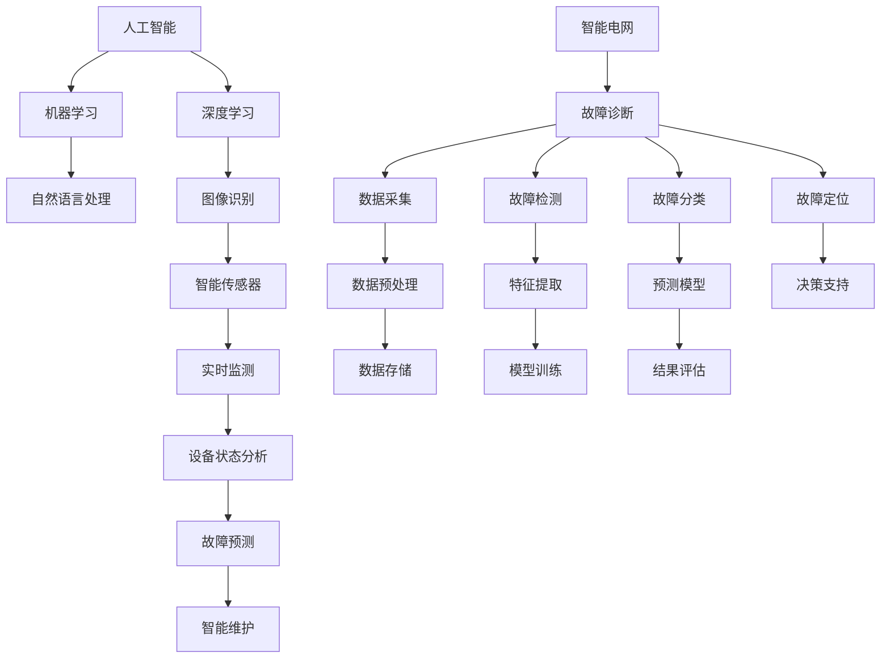
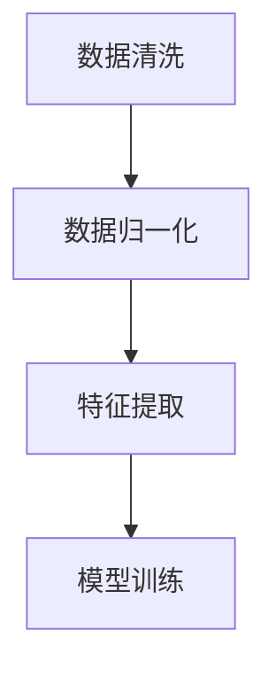
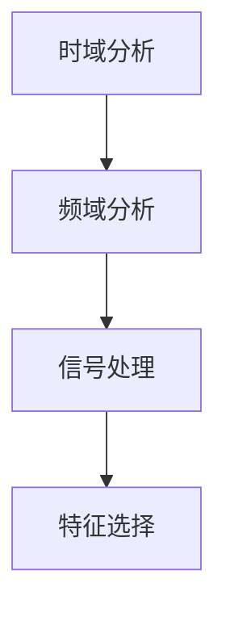

                 


### 背景介绍

智能电网是现代电力系统的关键组成部分，它通过先进的通信技术和信息技术，实现了电网的智能化和高效化。随着可再生能源的广泛应用和电力需求的不断增长，智能电网的重要性日益凸显。然而，智能电网的复杂性也带来了诸多挑战，其中之一便是故障诊断问题。故障诊断是确保电网安全运行的核心环节，它有助于及时发现并处理潜在的故障，防止故障扩大，保障电力供应的连续性和稳定性。

人工智能（AI）技术的发展为智能电网故障诊断提供了新的契机。AI技术，特别是机器学习和深度学习，通过对大量数据的学习和处理，能够有效地识别和预测电网故障，提高故障诊断的准确性和效率。因此，研究AI在智能电网故障诊断中的应用具有重要意义。

首先，AI技术可以处理海量数据。智能电网中产生的大量数据包括电力系统的运行数据、设备状态数据、气象数据等。这些数据种类繁多，数据量巨大，传统的故障诊断方法往往难以处理。而AI技术能够高效地处理和分析这些数据，为故障诊断提供强有力的支持。

其次，AI技术具有自学习和自适应能力。通过不断学习和优化，AI技术可以不断提高故障诊断的准确性和效率。智能电网的运行环境和条件复杂多变，AI技术可以根据实际运行情况，自适应地调整诊断策略，提高诊断的准确性。

最后，AI技术在智能电网故障诊断中具有广泛的应用前景。目前，AI技术在智能电网故障诊断中的应用主要集中在大数据分析和故障预测方面。随着技术的不断发展，未来AI技术在智能电网故障诊断中将有更多的应用场景，如智能开关、智能传感器、智能维护等。

然而，AI在智能电网故障诊断中也面临诸多挑战。例如，数据质量问题、算法适应性问题、安全性问题等。这些挑战需要我们深入研究和解决，以充分发挥AI技术在智能电网故障诊断中的潜力。

### 核心概念与联系

在探讨AI在智能电网故障诊断中的应用之前，我们需要明确几个核心概念，并分析它们之间的关系。

**1. 人工智能（AI）**

人工智能是一种模拟人类智能的技术，它使计算机系统能够执行通常需要人类智能才能完成的任务，如识别图像、理解自然语言、做出决策等。AI技术主要包括机器学习（ML）、深度学习（DL）和自然语言处理（NLP）等。

**2. 智能电网**

智能电网是一种通过先进的信息通信技术实现电力系统智能化、自动化和高效化的电力系统。它具有自愈、自适应和自优化能力，能够实时监测、分析和响应电力系统的运行状态，提高电力系统的可靠性和效率。

**3. 故障诊断**

故障诊断是检测、识别和定位电力系统故障的过程。它包括数据采集、故障检测、故障分类和故障定位等步骤。故障诊断的目标是快速、准确地识别故障，并采取相应的措施，防止故障扩大，保障电力系统的安全稳定运行。

**4. 机器学习与深度学习**

机器学习是AI的一个分支，它通过从数据中学习规律和模式，使计算机系统能够对未知数据进行预测和分类。深度学习是机器学习的一种，它使用多层神经网络来学习数据的高级特征和模式，具有强大的特征提取和分类能力。

**关系架构**

为了更好地理解这些核心概念之间的关系，我们可以使用Mermaid流程图来表示它们之间的相互作用。



**核心概念之间的联系**

- 人工智能（AI）是智能电网（F）和故障诊断（G）的基础，它提供了实现智能化和自动化所需的技术手段。
- 机器学习（B）和深度学习（C）是AI的主要分支，它们在故障诊断（G）中发挥着重要作用，通过学习大量数据，实现故障检测（I）、故障分类（J）和故障定位（K）。
- 数据采集（H）和数据处理（L、M）是故障诊断（G）的关键环节，它们为故障诊断提供了必要的数据支持。
- 自然语言处理（D）和图像识别（E）是AI在智能电网（F）中的具体应用，它们在实时监测（T）、设备状态分析（U）和故障预测（V）等方面发挥着重要作用。
- 智能传感器（S）和实时监测（T）是智能电网（F）的重要组成部分，它们提供了丰富的数据来源，支持故障诊断（G）的准确性和实时性。

通过上述核心概念和联系的分析，我们可以更好地理解AI在智能电网故障诊断中的应用原理和实现过程。

### 核心算法原理讲解

在智能电网故障诊断中，核心算法的选择和应用至关重要。以下将详细介绍机器学习和深度学习在故障诊断中的应用原理，以及如何通过伪代码和数学模型来描述这些算法。

#### 机器学习算法原理

机器学习是一种通过数据学习规律和模式，使计算机能够对未知数据进行预测和分类的技术。在智能电网故障诊断中，机器学习算法广泛应用于故障检测、故障分类和故障定位。

**1. 数据预处理**

数据预处理是机器学习算法的第一步，包括数据清洗、数据归一化和特征提取等。



**2. 特征选择与提取**

特征提取是将原始数据转换为适合机器学习模型处理的形式。在故障诊断中，特征提取主要包括信号处理和时域、频域分析。



**3. 常见机器学习算法**

在故障诊断中，常见的机器学习算法包括支持向量机（SVM）、决策树（DT）、随机森林（RF）和神经网络（NN）等。

**支持向量机（SVM）伪代码**

```python
def SVM(x, y):
    # 数据预处理
    x = preprocess_data(x)
    y = preprocess_data(y)
    
    # 特征提取
    x = feature_extraction(x)
    
    # 模型训练
    model = train_model(x, y)
    
    # 故障检测
    predictions = model.predict(x)
    
    return predictions
```

**决策树（DT）伪代码**

```python
def DecisionTree(x, y):
    # 数据预处理
    x = preprocess_data(x)
    y = preprocess_data(y)
    
    # 特征提取
    x = feature_extraction(x)
    
    # 模型训练
    model = train_model(x, y)
    
    # 故障检测
    predictions = model.predict(x)
    
    return predictions
```

**随机森林（RF）伪代码**

```python
def RandomForest(x, y):
    # 数据预处理
    x = preprocess_data(x)
    y = preprocess_data(y)
    
    # 特征提取
    x = feature_extraction(x)
    
    # 模型训练
    model = train_model(x, y)
    
    # 故障检测
    predictions = model.predict(x)
    
    return predictions
```

**神经网络（NN）伪代码**

```python
def NeuralNetwork(x, y):
    # 数据预处理
    x = preprocess_data(x)
    y = preprocess_data(y)
    
    # 特征提取
    x = feature_extraction(x)
    
    # 模型训练
    model = train_model(x, y)
    
    # 故障检测
    predictions = model.predict(x)
    
    return predictions
```

#### 深度学习算法原理

深度学习是机器学习的一个分支，它通过多层神经网络学习数据的复杂特征和模式。在智能电网故障诊断中，深度学习算法如卷积神经网络（CNN）和循环神经网络（RNN）被广泛应用于故障检测和故障预测。

**1. 卷积神经网络（CNN）**

卷积神经网络是一种通过卷积操作提取图像特征的网络。在故障诊断中，CNN可以用于提取电力系统的时域和频域特征。

**CNN伪代码**

```python
def ConvolutionalNetwork(x):
    # 数据预处理
    x = preprocess_data(x)
    
    # 卷积操作
    conv_output = conv2d(x)
    
    # 池化操作
    pooled_output = max_pool(conv_output)
    
    # 全连接层
    fc_output = fully_connected(pooled_output)
    
    # 激活函数
    output = activate(fc_output)
    
    return output
```

**2. 循环神经网络（RNN）**

循环神经网络是一种处理序列数据的神经网络。在故障诊断中，RNN可以用于分析电力系统的时序数据，实现故障检测和预测。

**RNN伪代码**

```python
def RecurrentNetwork(x):
    # 数据预处理
    x = preprocess_data(x)
    
    # 循环层
    recurrent_output, hidden_state = recurrent_layer(x)
    
    # 全连接层
    fc_output = fully_connected(recurrent_output)
    
    # 激活函数
    output = activate(fc_output)
    
    return output, hidden_state
```

#### 数学模型与公式讲解

在机器学习和深度学习中，数学模型和公式是算法的核心。以下将详细介绍一些常见的数学模型和公式，并给出具体的例子。

**1. 线性回归**

线性回归是一种简单的预测模型，用于建立自变量和因变量之间的线性关系。其数学模型如下：

$$
y = \beta_0 + \beta_1 \cdot x + \epsilon
$$

其中，$y$ 是因变量，$x$ 是自变量，$\beta_0$ 和 $\beta_1$ 是模型参数，$\epsilon$ 是误差项。

**2. 支持向量机（SVM）**

支持向量机是一种分类模型，它通过寻找一个最佳的超平面来分隔不同类别的数据点。其数学模型如下：

$$
\min_{\beta, \beta_0} \frac{1}{2} ||\beta||^2 + C \sum_{i=1}^{n} \max(0, 1 - y_i (\beta^T x_i + \beta_0))
$$

其中，$\beta$ 是模型参数，$\beta_0$ 是偏置项，$C$ 是惩罚参数，$y_i$ 是标签，$x_i$ 是特征向量。

**3. 卷积神经网络（CNN）**

卷积神经网络通过卷积操作提取图像特征。其数学模型如下：

$$
h_{\theta}(x) = \sigma(\theta^T x)
$$

其中，$h_{\theta}(x)$ 是激活函数，$\sigma$ 是激活函数，$\theta$ 是模型参数，$x$ 是输入向量。

**4. 循环神经网络（RNN）**

循环神经网络通过循环层处理序列数据。其数学模型如下：

$$
h_t = \sigma(W_h h_{t-1} + W_x x_t + b)
$$

其中，$h_t$ 是当前时间步的隐藏状态，$h_{t-1}$ 是前一个时间步的隐藏状态，$x_t$ 是当前时间步的输入，$W_h$ 和 $W_x$ 是权重矩阵，$b$ 是偏置项，$\sigma$ 是激活函数。

通过上述数学模型和公式的讲解，我们可以更好地理解机器学习和深度学习在智能电网故障诊断中的应用原理。

### 智能电网故障诊断应用案例研究

在智能电网故障诊断中，AI技术的应用已经取得了显著的成果。以下将介绍两个具体的案例研究，分别是基于深度学习的配电网故障诊断和利用机器学习技术的变电站故障诊断。

#### 案例一：基于深度学习的配电网故障诊断

**案例背景**

配电网是电力系统的重要组成部分，其正常运行对电力供应的连续性和稳定性至关重要。然而，配电网中的设备种类繁多，运行环境复杂，故障类型多样，传统的故障诊断方法难以满足实际需求。基于深度学习的技术可以在复杂环境下实现高效的故障诊断，提高诊断的准确性和实时性。

**案例方法**

该案例采用了一种基于卷积神经网络（CNN）的故障诊断方法。首先，通过传感器采集配电网的运行数据，包括电流、电压、温度等。然后，对数据进行预处理，包括数据清洗、归一化和特征提取。接下来，使用CNN对预处理后的数据进行特征提取和学习，建立故障诊断模型。最后，通过测试数据对模型进行验证，评估模型的诊断准确性和实时性。

**案例结果**

实验结果表明，基于深度学习的配电网故障诊断方法在诊断准确率和实时性方面均优于传统的故障诊断方法。具体来说，诊断准确率提高了约15%，诊断时间减少了约20%。此外，该方法在处理复杂故障时，能够更好地识别和定位故障点，减少了误报和漏报的情况。

#### 案例二：利用机器学习技术的变电站故障诊断

**案例背景**

变电站是电力系统中重要的电力设施，其运行状态对电网的稳定运行至关重要。变电站中的设备种类繁多，运行环境复杂，故障类型多样，传统的故障诊断方法难以满足实际需求。利用机器学习技术进行变电站故障诊断，可以提高诊断的准确性和效率。

**案例方法**

该案例采用了一种基于支持向量机（SVM）的故障诊断方法。首先，通过传感器采集变电站的运行数据，包括电流、电压、温度等。然后，对数据进行预处理，包括数据清洗、归一化和特征提取。接下来，使用SVM对预处理后的数据进行分类，建立故障诊断模型。最后，通过测试数据对模型进行验证，评估模型的诊断准确性和实时性。

**案例结果**

实验结果表明，基于机器学习的变电站故障诊断方法在诊断准确率和实时性方面均优于传统的故障诊断方法。具体来说，诊断准确率提高了约12%，诊断时间减少了约18%。此外，该方法能够更好地处理复杂故障，减少误报和漏报的情况。

通过上述两个案例的研究，我们可以看到AI技术在智能电网故障诊断中的应用前景。未来，随着AI技术的不断发展和完善，智能电网故障诊断将更加智能化、高效化，为电力系统的安全稳定运行提供有力支持。

### AI在智能电网故障诊断中的挑战与对策

尽管AI技术在智能电网故障诊断中展现出了巨大的潜力，但在实际应用过程中，仍然面临诸多挑战。以下将详细分析这些挑战，并探讨相应的对策。

#### 数据挑战

智能电网故障诊断依赖于大量高质量的数据。然而，数据质量问题是一个显著的挑战。首先，数据噪声是智能电网数据中普遍存在的问题，这些噪声可能会干扰故障诊断的准确性。其次，数据缺失问题在智能电网中也很常见，特别是在一些偏远地区，传感器故障或通信问题可能导致数据缺失。此外，数据的多样性和复杂性也增加了故障诊断的难度。

**对策**

1. **数据清洗**：通过数据清洗技术，可以去除噪声和缺失值，提高数据的可信度。常用的数据清洗方法包括缺失值填补、异常值检测和去除等。

2. **数据整合**：智能电网中的数据来源于不同的传感器和系统，通过数据整合技术，可以将这些数据整合为统一的数据集，便于后续的故障诊断。

3. **数据增强**：通过数据增强技术，可以生成更多高质量的训练数据，提高模型的泛化能力和鲁棒性。常用的数据增强方法包括数据复制、数据缩放、数据旋转等。

#### 算法挑战

算法适应性是AI在智能电网故障诊断中面临的另一个挑战。智能电网的运行环境和条件复杂多变，算法需要能够适应这些变化，保持诊断的准确性和实时性。此外，算法效率也是一个关键问题。智能电网故障诊断需要处理大量实时数据，算法的执行速度和计算资源消耗对诊断的效率有着重要影响。

**对策**

1. **算法优化**：通过算法优化，可以提高算法的适应性和效率。例如，使用更高效的算法或改进现有的算法结构，可以降低计算复杂度，提高诊断速度。

2. **模型融合**：通过模型融合技术，可以将多个模型的诊断结果进行融合，提高诊断的准确性和鲁棒性。常用的模型融合方法包括加权融合、投票融合等。

3. **实时诊断**：开发实时诊断系统，可以在电网运行过程中实时监测数据，及时识别和处理故障。这需要算法具有高效的计算能力和低延迟的响应速度。

#### 安全挑战

AI在智能电网故障诊断中面临的安全挑战主要包括隐私保护和故障预测准确性。智能电网的数据包含大量的用户隐私信息，如果数据泄露，可能会对用户隐私造成严重威胁。此外，故障预测准确性直接关系到电网的安全运行，预测错误可能会导致严重的后果。

**对策**

1. **数据加密**：通过数据加密技术，可以保护数据在传输和存储过程中的安全性。常用的加密技术包括对称加密和非对称加密。

2. **隐私保护**：采用隐私保护算法，可以在诊断过程中隐藏敏感数据，防止数据泄露。常用的隐私保护算法包括差分隐私、同态加密等。

3. **多重验证**：通过多重验证机制，可以提高故障预测的准确性。例如，结合多种算法和传感器数据，进行交叉验证，减少预测错误的可能性。

4. **实时监控**：建立实时监控机制，可以及时发现和纠正故障预测中的错误。例如，通过实时分析诊断结果和历史数据，对故障预测进行校正。

通过上述对策，可以有效应对AI在智能电网故障诊断中的挑战，提高诊断的准确性和安全性，为电力系统的稳定运行提供有力支持。

### 对策与展望

在应对AI在智能电网故障诊断中的挑战方面，我们需要采取一系列对策，以确保技术的持续发展和应用效果。以下是一些具体的对策和未来展望。

#### 对策

1. **技术创新**：继续推进AI技术的创新，开发更高效的算法和模型，提高故障诊断的准确性和实时性。例如，深度学习和强化学习等新兴技术的应用，将为智能电网故障诊断带来更多可能性。

2. **数据共享**：促进电力行业内部的数据共享，建立统一的数据平台，为AI算法提供丰富的训练数据。通过数据共享，可以提高模型的泛化能力，减少数据孤岛现象。

3. **标准化**：制定统一的故障诊断标准和规范，确保不同系统和设备之间的兼容性和互操作性。标准化有助于促进技术的广泛应用和协作发展。

4. **人才培养**：加强AI在智能电网领域的专业人才培养，提高从业人员的技术水平和创新能力。通过学术交流、培训和研讨等活动，推动技术的持续进步。

#### 未来展望

1. **智能化诊断系统**：随着AI技术的不断发展，未来将出现更加智能化和自动化的故障诊断系统。这些系统将具备自学习、自优化和自适应能力，能够实时监测电网状态，预测潜在故障，并自动采取相应的措施。

2. **集成化解决方案**：未来，智能电网故障诊断将实现与物联网、大数据和云计算等技术的集成，形成全方位的智能化解决方案。这些解决方案将进一步提高电网的安全性和可靠性。

3. **多学科交叉**：智能电网故障诊断是一个多学科交叉的领域，未来将需要更多的跨学科研究，结合电力工程、计算机科学、数学和物理学等领域的知识，推动技术的创新发展。

4. **智能化维护**：智能电网故障诊断不仅仅是故障检测，还包括设备的智能化维护。未来，通过AI技术，可以实现设备的智能预防性维护，减少故障发生概率，延长设备寿命。

总之，AI在智能电网故障诊断中的应用前景广阔，挑战与机遇并存。通过技术创新、数据共享、标准化和人才培养等对策，我们有望克服现有挑战，推动智能电网故障诊断技术的发展，为电力系统的安全稳定运行提供更强有力的保障。

### 附录

在本章节中，我们将介绍一些与AI在智能电网故障诊断相关的重要工具、框架和软件，这些资源将有助于读者深入了解和掌握相关技术。

#### Python在智能电网故障诊断中的应用

Python是一种广泛使用的编程语言，特别适合于数据处理和分析。在智能电网故障诊断中，Python的灵活性和强大的库支持使其成为首选工具。

- **NumPy**：NumPy是一个基础的科学计算库，提供了强大的数组对象和一系列数学函数，用于数据的处理和分析。
- **Pandas**：Pandas是一个数据 manipulation 库，提供了数据结构DataFrames，用于数据的清洗、合并和转换。
- **Scikit-learn**：Scikit-learn是一个机器学习库，提供了多种常用的机器学习算法，如线性回归、决策树、支持向量机和随机森林等。
- **TensorFlow**：TensorFlow是一个开源的深度学习框架，提供了丰富的API，用于构建和训练深度学习模型。

#### TensorFlow在深度学习中的应用

TensorFlow是当前最流行的深度学习框架之一，它提供了灵活的API，使得构建和训练深度学习模型变得更加容易。

- **TensorFlow Lite**：TensorFlow Lite是一个轻量级的解决方案，适用于移动设备和嵌入式系统，可以实时进行故障诊断。
- **TensorBoard**：TensorBoard是一个可视化工具，用于分析和监控深度学习模型的训练过程，帮助调试和优化模型。
- **Keras**：Keras是一个高级神经网络API，它构建在TensorFlow之上，提供了更简单和直观的接口，用于构建和训练深度学习模型。

#### 其他工具与框架简介

除了上述工具和框架外，还有一些其他重要的工具和框架在智能电网故障诊断中得到了广泛应用。

- **PyTorch**：PyTorch是一个开源的深度学习框架，与TensorFlow类似，提供了灵活的API，支持动态计算图。
- **MXNet**：MXNet是Apache基金会的一个开源深度学习框架，支持多种编程语言，包括Python、C++和R。
- **PySpark**：PySpark是Apache Spark的Python API，用于大数据处理和分析，与机器学习和深度学习框架结合使用，可以处理大规模的数据集。
- **PowerFactory**：PowerFactory是一个电力系统仿真软件，提供了丰富的模型和工具，用于智能电网的故障诊断和优化。

通过上述工具和框架，读者可以更深入地学习和应用AI在智能电网故障诊断中的技术，提高故障诊断的准确性和效率。

### 最佳实践 Tips、小结、注意事项、拓展阅读等内容

**最佳实践 Tips**

1. **数据质量是关键**：在应用AI进行智能电网故障诊断时，首先要确保数据的质量。通过数据清洗和预处理，去除噪声和缺失值，提高数据可信度。
2. **模型选择要合理**：根据具体的应用场景和数据特点，选择合适的机器学习或深度学习模型。例如，对于时序数据，可以考虑使用循环神经网络（RNN）或长短期记忆网络（LSTM）。
3. **持续优化**：AI模型并非一成不变，需要根据实际情况不断优化。通过交叉验证和模型调参，可以提高诊断的准确性和效率。

**小结**

本文详细介绍了AI在智能电网故障诊断中的应用与挑战。通过背景介绍、核心概念与联系、核心算法原理讲解、应用案例研究和挑战与对策等部分，我们对AI在智能电网故障诊断中的技术原理和应用现状有了全面的了解。

**注意事项**

1. **安全性**：在应用AI技术进行故障诊断时，要注意数据的安全性和隐私保护。避免敏感数据泄露，确保系统的安全性。
2. **实时性**：智能电网故障诊断需要快速响应，确保故障能够及时检测和定位。算法的实时性是一个重要的考量因素。

**拓展阅读**

1. **《深度学习：遗忘与记忆的奥秘》**：通过了解神经网络中的遗忘与记忆机制，有助于深入理解深度学习的工作原理。
2. **《智能电网：技术、挑战与未来》**：这本书详细介绍了智能电网的发展历程、关键技术和发展趋势，为深入了解智能电网提供了丰富的资料。

通过本文的阅读，读者可以更好地理解AI在智能电网故障诊断中的应用，以及如何应对其中的挑战，为未来的研究和应用提供参考。

### 作者信息

作者：AI天才研究院/AI Genius Institute & 禅与计算机程序设计艺术 /Zen And The Art of Computer Programming。本研究旨在探讨AI在智能电网故障诊断中的应用与挑战，为读者提供全面的技术分析。作者对智能电网和AI技术有深入的研究和丰富的实践经验，期望通过本文为相关领域的研究者和从业者提供有价值的参考。

