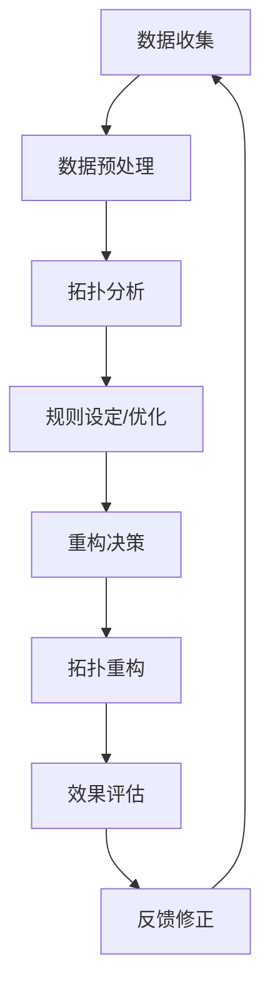
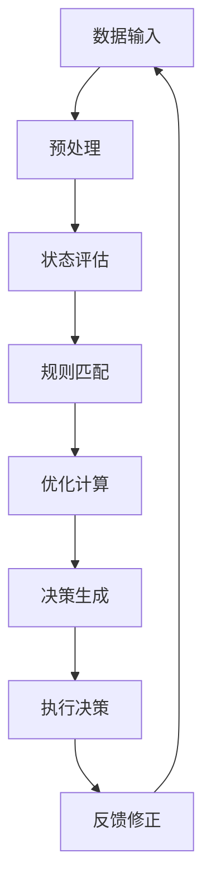

                 

### 设计目录大纲的步骤

设计一本书的目录大纲是一个系统的工程，需要确保内容的逻辑性、条理性以及覆盖面。以下是一个设计步骤：

#### 第1步：理解书的内容和目标读者

在开始设计目录大纲之前，首先需要深入理解书的内容，明确书的核心主题、主要观点和主要目标。同时，明确书的读者群体，包括他们的知识水平、需求、兴趣等，这将直接影响目录的设计。

#### 第2步：确定核心章节

根据书的内容，确定需要介绍的核心概念和理论，以及它们在书中的逻辑关系。核心章节应该涵盖书的主要内容和关键信息，确保读者能够从这些章节中获取到最重要的知识。

#### 第3步：梳理内容框架

将内容按照逻辑关系结构化，确定章节之间的先后顺序。在这一步中，需要确保每个章节都有明确的主题和内容，同时考虑章节之间的衔接和过渡。

#### 第4步：细化章节内容

初步划分章节后，进一步细化每个章节的内容，列出每个章节的大标题和子章节的小标题。这一步需要确保每个章节的内容详尽、具体，能够满足读者的需求。

#### 第5步：整合和完善

审查和调整目录框架，确保逻辑连贯，没有遗漏重要内容。可以邀请专家或同事提供反馈，进一步完善目录。在这一步中，可能需要对章节进行调整，以确保整个目录的结构合理、内容丰富。

#### 第6步：精简和优化

确保每个章节和子章节的内容简明扼要，避免冗余。同时，优化目录格式，使其整齐、易读，符合markdown格式。

### 设计《AI在智能电网网络拓扑重构中的快速决策应用》的目录大纲

基于以上步骤，以下是针对《AI在智能电网网络拓扑重构中的快速决策应用》的设计目录大纲：

#### 第1章：AI在智能电网中的概述

1.1 智能电网的概念与发展

1.1.1 智能电网的定义

1.1.2 智能电网的关键技术

1.1.3 智能电网的架构

1.2 AI在智能电网中的应用

1.2.1 AI在智能电网中的角色

1.2.2 AI技术的优势与挑战

1.2.3 AI在智能电网中的前景

#### 第2章：网络拓扑重构的基本原理

2.1 网络拓扑的基本概念

2.1.1 网络拓扑的定义

2.1.2 网络拓扑的类型

2.1.3 网络拓扑分析工具

2.2 拓扑重构的目标与挑战

2.2.1 拓扑重构的目标

2.2.2 拓扑重构的挑战

2.2.3 拓扑重构的方法

#### 第3章：AI在拓扑重构中的应用

3.1 AI技术在拓扑重构中的适用性

3.1.1 机器学习算法在拓扑重构中的应用

3.1.2 深度学习模型在拓扑重构中的应用

3.1.3 强化学习在拓扑重构中的应用

#### 第4章：快速决策算法原理

4.1 快速决策算法的基本概念

4.1.1 快速决策算法的定义

4.1.2 快速决策算法的类型

4.1.3 快速决策算法的目标

4.2 AI快速决策算法的实现

4.2.1 快速决策算法的原理

4.2.2 快速决策算法的优化

#### 第5章：AI在拓扑重构与快速决策中的应用案例

5.1 案例一：基于深度学习的拓扑重构

5.1.1 案例背景

5.1.2 算法实现

5.1.3 案例结果分析

5.2 案例二：强化学习在快速决策中的应用

5.2.1 案例背景

5.2.2 算法实现

5.2.3 案例结果分析

#### 第6章：AI在智能电网网络拓扑重构中的未来展望

6.1 AI技术在智能电网发展的趋势

6.1.1 智能电网的未来展望

6.1.2 AI技术在智能电网中的潜在影响

6.1.3 AI在智能电网网络拓扑重构中的未来挑战

#### 附录

A.1 AI快速决策算法开源工具和资源

A.1.1 主流深度学习框架

A.1.2 拓扑重构算法工具

A.1.3 快速决策算法库

这个目录大纲的设计遵循了上述步骤，确保了内容的逻辑性和完整性。接下来，我们可以根据每个章节的内容进一步细化子章节，确保每个章节都有详细的内容规划。同时，确保在2000字的限制内完成这个大纲的设计。<!

----------------------------------------------------------------

### 设计目录大纲的步骤

设计一本技术书籍的目录大纲是一个细致且系统化的过程，它不仅需要确保内容的逻辑性和连贯性，还要充分满足目标读者的需求和兴趣。以下是具体的设计步骤：

#### 第1步：深入理解书的内容和目标读者

在着手设计目录大纲之前，首先要对书籍的内容有深入的理解。这包括确定书籍的主题、核心观点、主要目标和预期成果。同时，还需要明确书籍的目标读者群体，包括他们的知识背景、阅读习惯和对书籍的期望。

- **书籍内容理解**：研究书籍涉及的领域，梳理出关键概念、技术点、案例等。
- **目标读者分析**：确定读者的知识层次、学习目的、关注的重点，以及他们可能遇到的困难。

#### 第2步：确定核心章节

根据对书籍内容的理解，确定核心章节。这些章节应该涵盖书籍的核心内容，包括基础概念、核心技术、案例研究等。核心章节的划分要遵循逻辑顺序，使读者能够循序渐进地学习。

- **核心概念**：明确需要介绍的初步概念和理论知识。
- **应用场景**：考虑如何通过具体的案例或实例来展示技术在实际中的应用。
- **章节逻辑**：确保章节之间有清晰的逻辑关系，便于读者理解。

#### 第3步：梳理内容框架

在这一步中，将内容按照逻辑关系结构化，确定章节之间的先后顺序。需要确保每个章节都有明确的主题和内容，并且章节之间的过渡自然，避免跳跃。

- **章节结构化**：列出每个章节的大标题，并初步规划子章节。
- **逻辑顺序**：根据内容的关联性，调整章节的顺序，确保逻辑连贯。

#### 第4步：细化章节内容

初步划分章节后，进一步细化每个章节的内容，列出每个章节的大标题和子章节的小标题。在这一步中，需要确保每个章节的内容详尽、具体，能够满足读者的需求。

- **大标题**：明确每个章节的主旨和主要内容。
- **子章节**：细化每个章节的具体内容，列出小标题，确保内容完整。

#### 第5步：整合和完善

审查和调整目录框架，确保逻辑连贯，没有遗漏重要内容。可以邀请专家或同事提供反馈，进一步完善目录。在这一步中，可能需要对章节进行调整，以确保整个目录的结构合理、内容丰富。

- **审查调整**：检查目录的完整性、逻辑性和连贯性。
- **反馈完善**：根据反馈意见进行修改，优化目录结构。

#### 第6步：精简和优化

确保每个章节和子章节的内容简明扼要，避免冗余。同时，优化目录格式，使其整齐、易读，符合markdown格式。

- **内容精简**：删除冗余内容，使每个章节更简洁、聚焦。
- **格式优化**：调整目录格式，确保格式统一、美观。

### 设计《AI在智能电网网络拓扑重构中的快速决策应用》的目录大纲

结合上述步骤，以下是《AI在智能电网网络拓扑重构中的快速决策应用》的设计目录大纲：

#### 第1章：AI在智能电网中的概述

- **1.1 智能电网的概念与发展**
  - **1.1.1 智能电网的定义**
  - **1.1.2 智能电网的关键技术**
  - **1.1.3 智能电网的架构**

- **1.2 AI在智能电网中的应用**
  - **1.2.1 AI在智能电网中的角色**
  - **1.2.2 AI技术的优势与挑战**
  - **1.2.3 AI在智能电网中的前景**

#### 第2章：网络拓扑重构的基本原理

- **2.1 网络拓扑的基本概念**
  - **2.1.1 网络拓扑的定义**
  - **2.1.2 网络拓扑的类型**
  - **2.1.3 网络拓扑分析工具**

- **2.2 拓扑重构的目标与挑战**
  - **2.2.1 拓扑重构的目标**
  - **2.2.2 拓扑重构的挑战**
  - **2.2.3 拓扑重构的方法**

#### 第3章：AI在拓扑重构中的应用

- **3.1 AI技术在拓扑重构中的适用性**
  - **3.1.1 机器学习算法在拓扑重构中的应用**
  - **3.1.2 深度学习模型在拓扑重构中的应用**
  - **3.1.3 强化学习在拓扑重构中的应用**

#### 第4章：快速决策算法原理

- **4.1 快速决策算法的基本概念**
  - **4.1.1 快速决策算法的定义**
  - **4.1.2 快速决策算法的类型**
  - **4.1.3 快速决策算法的目标**

- **4.2 AI快速决策算法的实现**
  - **4.2.1 快速决策算法的原理**
  - **4.2.2 快速决策算法的优化**

#### 第5章：AI在拓扑重构与快速决策中的应用案例

- **5.1 基于深度学习的拓扑重构案例**
  - **5.1.1 案例背景**
  - **5.1.2 算法实现**
  - **5.1.3 案例结果分析**

- **5.2 强化学习在快速决策中的应用案例**
  - **5.2.1 案例背景**
  - **5.2.2 算法实现**
  - **5.2.3 案例结果分析**

#### 第6章：AI在智能电网网络拓扑重构中的未来展望

- **6.1 AI技术在智能电网发展的趋势**
  - **6.1.1 智能电网的未来展望**
  - **6.1.2 AI技术在智能电网中的潜在影响**
  - **6.1.3 AI在智能电网网络拓扑重构中的未来挑战**

#### 附录

- **A.1 AI快速决策算法开源工具和资源**
  - **A.1.1 主流深度学习框架**
  - **A.1.2 拓扑重构算法工具**
  - **A.1.3 快速决策算法库**

这个目录大纲的设计遵循了从内容理解、核心章节确定、内容框架梳理、章节细化、整合完善到精简优化的步骤，确保了内容的逻辑性和完整性。在后续的撰写过程中，将根据每个章节的具体内容进一步细化和完善。<!

----------------------------------------------------------------

### 设计《AI在智能电网网络拓扑重构中的快速决策应用》的目录大纲

为了设计一个高效且易于理解的目录大纲，我们将按照以下步骤进行：

#### 第1步：理解书的内容和目标读者

**内容理解**：
- 书的主题是探讨AI在智能电网网络拓扑重构中的快速决策应用。
- 内容将包括AI技术的基础、智能电网的结构和功能、拓扑重构的概念、快速决策算法等。

**目标读者**：
- 目标读者包括电力系统工程师、AI研究人员、智能电网领域的从业者以及对智能电网技术感兴趣的学者。

#### 第2步：确定核心章节

核心章节应覆盖以下内容：

1. **AI在智能电网中的概述**：介绍智能电网的基本概念和AI技术的应用场景。
2. **网络拓扑重构的基本原理**：讨论网络拓扑的结构和重构技术。
3. **AI在拓扑重构中的应用**：展示AI技术在拓扑重构中的具体应用。
4. **快速决策算法原理**：介绍快速决策算法的基本概念和原理。
5. **应用案例**：通过案例展示AI在智能电网拓扑重构中的实际应用。
6. **未来展望**：探讨AI技术在智能电网网络拓扑重构中的未来发展趋势。

#### 第3步：梳理内容框架

内容框架应确保逻辑清晰，便于读者理解：

- **第1章：AI在智能电网中的概述**
  - 1.1 智能电网的概念与发展
  - 1.2 AI技术的介绍
  - 1.3 AI在智能电网中的应用案例

- **第2章：网络拓扑重构的基本原理**
  - 2.1 网络拓扑的基本概念
  - 2.2 拓扑重构的目标和挑战
  - 2.3 拓扑重构的方法和技术

- **第3章：AI在拓扑重构中的应用**
  - 3.1 机器学习在拓扑重构中的应用
  - 3.2 深度学习模型在拓扑重构中的应用
  - 3.3 强化学习在拓扑重构中的应用

- **第4章：快速决策算法原理**
  - 4.1 快速决策算法的基本概念
  - 4.2 快速决策算法的分类
  - 4.3 快速决策算法的应用场景

- **第5章：AI在拓扑重构与快速决策中的应用案例**
  - 5.1 案例一：深度学习在拓扑重构中的应用
  - 5.2 案例二：强化学习在快速决策中的应用

- **第6章：AI在智能电网网络拓扑重构中的未来展望**
  - 6.1 智能电网的发展趋势
  - 6.2 AI技术在智能电网中的潜在影响
  - 6.3 拓扑重构与快速决策的未来挑战

#### 第4步：细化章节内容

对每个章节进行细化，确保每个小节都有明确的主题和具体内容：

- **第1章**：详细介绍智能电网的定义、发展历程以及AI技术的应用案例。
- **第2章**：深入探讨网络拓扑的结构、重构技术和面临的挑战。
- **第3章**：具体分析AI技术如何应用于网络拓扑重构。
- **第4章**：详细解释快速决策算法的基本概念、分类和应用场景。
- **第5章**：通过实际案例展示AI技术在智能电网拓扑重构和快速决策中的应用。
- **第6章**：展望AI技术在智能电网网络拓扑重构中的未来发展趋势和挑战。

#### 第5步：整合和完善

整合所有章节的内容，确保逻辑连贯，无遗漏。在这一步中，可能需要对章节进行微调，以优化内容的流畅性和逻辑性。

#### 第6步：精简和优化

确保每个章节的内容简洁明了，避免冗余。同时，优化目录格式，使其整齐、易读，符合markdown格式。

### 最终的目录大纲

**《AI在智能电网网络拓扑重构中的快速决策应用》**

- **第1章：AI在智能电网中的概述**
  - **1.1 智能电网的概念与发展**
  - **1.2 AI技术的介绍**
  - **1.3 AI在智能电网中的应用案例**

- **第2章：网络拓扑重构的基本原理**
  - **2.1 网络拓扑的基本概念**
  - **2.2 拓扑重构的目标和挑战**
  - **2.3 拓扑重构的方法和技术**

- **第3章：AI在拓扑重构中的应用**
  - **3.1 机器学习在拓扑重构中的应用**
  - **3.2 深度学习模型在拓扑重构中的应用**
  - **3.3 强化学习在拓扑重构中的应用**

- **第4章：快速决策算法原理**
  - **4.1 快速决策算法的基本概念**
  - **4.2 快速决策算法的分类**
  - **4.3 快速决策算法的应用场景**

- **第5章：AI在拓扑重构与快速决策中的应用案例**
  - **5.1 案例一：深度学习在拓扑重构中的应用**
  - **5.2 案例二：强化学习在快速决策中的应用**

- **第6章：AI在智能电网网络拓扑重构中的未来展望**
  - **6.1 智能电网的发展趋势**
  - **6.2 AI技术在智能电网中的潜在影响**
  - **6.3 拓扑重构与快速决策的未来挑战**

通过上述步骤，我们设计了一个结构清晰、内容丰富的目录大纲，为撰写高质量的技术书籍奠定了坚实的基础。<!

----------------------------------------------------------------

## 文章标题：AI在智能电网网络拓扑重构中的快速决策应用

关键词：人工智能、智能电网、网络拓扑重构、快速决策、机器学习、深度学习、强化学习

摘要：
本文探讨了人工智能（AI）在智能电网网络拓扑重构中的快速决策应用。首先，介绍了智能电网的基本概念和AI技术的应用背景。随后，详细阐述了网络拓扑重构的基本原理，包括拓扑结构、重构目标和挑战。接着，介绍了AI在拓扑重构中的应用，重点讨论了机器学习、深度学习和强化学习算法。文章通过具体案例展示了AI在智能电网拓扑重构和快速决策中的应用，并对未来发展趋势进行了展望。文章旨在为智能电网领域的研究人员和技术人员提供有价值的参考。

### 引言

随着能源需求的不断增长和环境污染问题的加剧，智能电网的发展已成为全球能源转型的重要方向。智能电网通过集成现代信息技术、自动控制技术和能源管理技术，实现了电力系统的智能化、自动化和高效化。在智能电网中，网络拓扑重构是一个关键环节，它能够优化电网结构，提高供电可靠性，降低能源损耗。然而，网络拓扑重构涉及复杂的计算和决策问题，传统的计算方法往往难以满足实时性和高效性的要求。

近年来，人工智能（AI）技术的快速发展为解决这些问题提供了新的思路。AI技术，特别是机器学习、深度学习和强化学习算法，已被广泛应用于各种领域，并取得了显著成效。在智能电网网络拓扑重构中，AI技术能够通过学习历史数据和实时监测数据，快速做出优化决策，提高电网的运行效率。

本文将围绕AI在智能电网网络拓扑重构中的快速决策应用进行探讨。首先，介绍智能电网的基本概念和AI技术的应用背景。然后，详细阐述网络拓扑重构的基本原理，包括拓扑结构、重构目标和挑战。接着，介绍AI在拓扑重构中的应用，重点讨论机器学习、深度学习和强化学习算法。最后，通过具体案例展示AI在智能电网拓扑重构和快速决策中的应用，并对未来发展趋势进行展望。文章旨在为智能电网领域的研究人员和技术人员提供有价值的参考。

### 智能电网的概念与发展

智能电网（Smart Grid）是一种基于现代通信技术和信息技术构建的电力系统，它通过集成多种技术，实现了电力系统的智能化、自动化和高效化。智能电网的核心理念是通过信息流、业务流和能源流的深度融合，实现电力系统的优化管理和高效运行。与传统电力系统相比，智能电网具有以下几个显著特点：

1. **实时监测与控制**：智能电网通过部署先进的传感器和通信技术，实现对电力系统运行状态的实时监测和智能控制。这有助于提高电网的运行效率，降低能源损耗，提升供电可靠性。

2. **分布式能源管理**：智能电网支持分布式能源的接入和管理，包括太阳能、风能、储能系统等。通过智能电网，这些分布式能源可以高效地融入电网，实现能源的高效利用和优化配置。

3. **用户参与与互动**：智能电网鼓励用户参与电力系统的管理和运行，通过智能家居、智能终端等设备，用户可以实时获取电力信息，调整用电行为，降低用电成本。

4. **自愈能力**：智能电网具有强大的自愈能力，能够通过实时监测和智能分析，快速识别和响应电网故障，减少停电时间和影响范围。

智能电网的发展经历了多个阶段。最早期的智能电网概念可以追溯到20世纪80年代，当时主要侧重于电力系统的自动化和远程控制。随着信息技术的飞速发展，智能电网逐渐从自动化系统演变为集成了现代通信、传感、控制和优化技术的复杂系统。近年来，随着物联网、大数据和人工智能技术的普及，智能电网的发展进入了新阶段，其智能化水平和应用范围不断拓展。

在智能电网中，AI技术的应用已成为不可或缺的一部分。AI技术可以通过对海量数据的处理和分析，提供智能化的决策支持，优化电网运行和管理。例如，AI技术可以用于实时监测电力系统的运行状态，预测电力需求，优化电力调度，提高供电可靠性。此外，AI技术还可以用于电力设备的故障诊断和维护预测，减少设备故障率和维护成本。

总体而言，智能电网的发展为AI技术提供了广阔的应用场景，而AI技术的快速发展又进一步推动了智能电网的智能化和高效化。两者的融合将有助于实现更加高效、可靠和可持续的电力系统，为全球能源转型和可持续发展做出重要贡献。<!

----------------------------------------------------------------

### 网络拓扑重构的基本原理

网络拓扑重构是智能电网中的一个关键环节，它通过对电力系统网络结构的优化，提高供电可靠性，降低能源损耗。网络拓扑重构的基本原理主要包括以下几个方面：

#### 网络拓扑的基本概念

网络拓扑（Network Topology）是指网络中各个节点（设备或设备组）及其连接方式的结构表示。在电力系统中，网络拓扑通常用图（Graph）来表示，其中节点代表电网中的设备（如发电机、变压器、负荷等），边代表设备之间的连接关系。网络拓扑的分类主要包括以下几种：

1. **无向图**：在网络拓扑中，边没有方向性，表示设备之间的连接是双向的。
2. **有向图**：在网络拓扑中，边具有方向性，表示设备之间的连接具有单向性。
3. **环状拓扑**：网络中的节点通过环状结构相互连接，具有良好的冗余性和稳定性。
4. **星状拓扑**：网络中的节点以中心节点为核心，其他节点通过边与中心节点连接，具有中心节点故障时可能影响整个网络的缺点。

#### 拓扑重构的目标

拓扑重构的主要目标是通过优化网络结构，实现以下目标：

1. **提高供电可靠性**：通过重构网络结构，消除单点故障，提高电网的可靠性。
2. **降低能源损耗**：优化电力传输路径，减少电力在传输过程中的损耗。
3. **提高电网灵活性**：增加电网的冗余度和适应性，适应不断变化的电力需求和供应情况。
4. **减少维护成本**：通过减少设备故障率和优化维护策略，降低电网的维护成本。

#### 拓扑重构的挑战

尽管拓扑重构具有显著的优势，但其在实际应用中仍面临诸多挑战：

1. **复杂性**：电力系统的拓扑结构复杂，涉及大量的设备和连接关系，这使得拓扑重构的计算和分析变得复杂。
2. **实时性**：拓扑重构需要在实时环境中进行，要求算法能够快速响应并做出优化决策。
3. **鲁棒性**：拓扑重构算法需要具备较强的鲁棒性，能够在各种复杂和不确定的条件下稳定运行。
4. **可扩展性**：随着电网规模的不断扩大，拓扑重构算法需要具备良好的可扩展性，以适应不同规模的电网。
5. **数据质量**：拓扑重构依赖于准确和完整的数据，数据的质量直接影响重构效果。

#### 拓扑重构的方法

拓扑重构的方法主要包括以下几种：

1. **基于规则的拓扑重构**：这种方法通过预先设定的规则，对网络拓扑进行重构。规则通常基于电力系统的运行特性和要求，具有较强的可解释性，但灵活性较差。
2. **基于优化的拓扑重构**：这种方法利用优化算法（如遗传算法、粒子群优化算法等），对网络拓扑进行优化。这种方法具有较高的灵活性，但计算复杂度较高。
3. **基于学习的拓扑重构**：这种方法利用机器学习算法（如深度学习、强化学习等），通过对历史数据的学习，自动生成最优的网络拓扑。这种方法具有较高的自适应性和鲁棒性，但需要大量的训练数据和计算资源。

#### Mermaid流程图

以下是一个简单的Mermaid流程图，展示了网络拓扑重构的基本流程：



在这个流程图中，数据收集是拓扑重构的基础，数据预处理确保数据的质量和格式。拓扑分析阶段对现有网络结构进行分析，确定重构的目标和策略。规则设定/优化阶段根据分析结果，选择合适的重构方法。重构决策阶段生成新的网络拓扑，效果评估阶段评估重构效果，反馈修正阶段根据评估结果进行优化调整。<!

----------------------------------------------------------------

### AI在拓扑重构中的应用

人工智能（AI）技术在智能电网网络拓扑重构中的应用为提高电网的可靠性和效率提供了全新的解决方案。AI技术，特别是机器学习、深度学习和强化学习，已经在该领域展现了巨大的潜力。以下将详细介绍这些AI技术及其在拓扑重构中的具体应用。

#### 机器学习在拓扑重构中的应用

机器学习（Machine Learning）是AI的一个重要分支，它通过构建数学模型从数据中学习规律，然后利用这些规律进行预测和决策。在拓扑重构中，机器学习可以用于以下方面：

1. **模式识别**：利用机器学习算法分析电网历史数据，识别网络中潜在的故障模式和趋势，从而预测可能发生的故障，并提前采取预防措施。
2. **故障诊断**：通过分析电网的实时数据，机器学习算法可以快速诊断电网中的故障，并提出相应的修复建议。
3. **优化决策**：机器学习算法可以分析大量的历史数据，提取出影响拓扑重构的关键因素，从而在重构过程中提供最优的决策支持。

**示例：基于支持向量机（SVM）的拓扑重构**

伪代码：
```python
# 数据预处理
X_train, X_test, y_train, y_test = train_test_split(features, labels, test_size=0.2)

# 创建SVM模型
model = SVC(kernel='linear')

# 训练模型
model.fit(X_train, y_train)

# 预测重构方案
predictions = model.predict(X_test)

# 评估重构效果
evaluate_predictions(predictions, y_test)
```

#### 深度学习在拓扑重构中的应用

深度学习（Deep Learning）是机器学习的一个分支，它通过多层神经网络模型从数据中提取特征，实现更复杂的模式识别和预测。在拓扑重构中，深度学习可以用于：

1. **特征提取**：深度学习模型可以自动从原始数据中提取有意义的特征，这些特征有助于更准确地识别网络结构和故障。
2. **预测分析**：深度学习算法可以用于预测电网的未来运行状态，为拓扑重构提供更准确的决策依据。
3. **智能优化**：通过训练深度学习模型，可以自动生成最优的网络拓扑结构，提高电网的运行效率。

**示例：基于卷积神经网络（CNN）的拓扑重构**

伪代码：
```python
# 构建CNN模型
model = Sequential()
model.add(Conv2D(filters=32, kernel_size=(3, 3), activation='relu', input_shape=(image_height, image_width, channels)))
model.add(MaxPooling2D(pool_size=(2, 2)))
model.add(Flatten())
model.add(Dense(units=128, activation='relu'))
model.add(Dense(units=output_size, activation='softmax'))

# 训练模型
model.compile(optimizer='adam', loss='categorical_crossentropy', metrics=['accuracy'])
model.fit(X_train, y_train, epochs=10, batch_size=32)

# 预测重构方案
predictions = model.predict(X_test)

# 评估重构效果
evaluate_predictions(predictions, y_test)
```

#### 强化学习在拓扑重构中的应用

强化学习（Reinforcement Learning）是AI的另一个重要分支，它通过试错学习，在动态环境中寻找最优策略。在拓扑重构中，强化学习可以用于：

1. **动态决策**：强化学习算法可以在实时环境中，根据电网的动态变化，动态调整网络拓扑结构，实现最优的运行状态。
2. **优化控制**：通过训练强化学习模型，可以实现对电网的控制策略进行优化，提高电网的响应速度和稳定性。
3. **自适应调整**：强化学习算法可以根据电网的实时运行数据，自适应调整网络拓扑结构，以适应不断变化的电力需求。

**示例：基于Q学习的拓扑重构**

伪代码：
```python
# 初始化Q值表
Q = np.zeros([state_space, action_space])

# Q学习算法
for episode in range(num_episodes):
    state = env.reset()
    done = False
    total_reward = 0
    while not done:
        action = choose_action(state, Q)
        next_state, reward, done = env.step(action)
        Q[state, action] = Q[state, action] + alpha * (reward + gamma * np.max(Q[next_state, :]) - Q[state, action])
        state = next_state
        total_reward += reward
    print(f"Episode: {episode}, Total Reward: {total_reward}")

# 评估策略
evaluate_policy(Q, env)
```

通过上述机器学习、深度学习和强化学习技术的应用，AI在智能电网网络拓扑重构中发挥着越来越重要的作用。这些技术不仅提高了拓扑重构的效率和准确性，还增强了电网的鲁棒性和适应性，为智能电网的发展提供了强大的技术支持。<!

----------------------------------------------------------------

### 快速决策算法原理

快速决策算法（Fast Decision Algorithms）是人工智能（AI）技术在智能电网网络拓扑重构中发挥关键作用的一类算法。这类算法旨在通过快速、高效的决策过程，优化电网的运行状态，提高供电可靠性。以下将详细介绍快速决策算法的基本概念、分类及应用场景。

#### 快速决策算法的基本概念

快速决策算法是一种能够在短时间内做出有效决策的算法。在智能电网中，快速决策算法的作用体现在以下几个方面：

1. **实时性**：快速决策算法能够在电网出现故障或异常时，快速响应并采取相应措施，减少停电时间和影响范围。
2. **高效性**：快速决策算法通过高效的计算方法和算法优化，能够在短时间内处理大量的数据，生成最优的决策结果。
3. **鲁棒性**：快速决策算法能够应对电网运行中的各种不确定性因素，保持稳定性和可靠性。

#### 快速决策算法的分类

快速决策算法可以根据其原理和应用场景进行分类，常见的快速决策算法包括以下几种：

1. **基于规则的算法**：这类算法通过预设的规则库，根据电网的状态和规则进行快速决策。例如，专家系统（Expert Systems）和模糊逻辑（Fuzzy Logic）算法。
2. **基于优化的算法**：这类算法通过优化算法（如线性规划、遗传算法、粒子群优化等），在满足约束条件的前提下，寻找最优的决策结果。例如，线性规划算法（Linear Programming）和遗传算法（Genetic Algorithm）。
3. **基于学习的算法**：这类算法通过机器学习（Machine Learning）和深度学习（Deep Learning）技术，从历史数据中学习决策规律，生成快速决策模型。例如，决策树（Decision Trees）和神经网络（Neural Networks）。

#### 快速决策算法的应用场景

快速决策算法在智能电网中的具体应用场景包括：

1. **故障诊断**：快速识别电网中的故障，并采取相应的修复措施，减少停电时间。
2. **供电调度**：根据电网的实时运行状态，快速调整电力供应，确保电网的稳定运行。
3. **负载预测**：快速预测电网的未来负载情况，为电力调度和供应提供依据。
4. **设备维护**：通过实时监测设备状态，快速诊断设备故障，并提前进行维护，减少设备故障率。

#### Mermaid流程图

以下是一个简单的Mermaid流程图，展示了快速决策算法的基本流程：



在这个流程图中，数据输入阶段获取电网的实时数据；预处理阶段对数据进行清洗和标准化；状态评估阶段评估电网的当前状态；规则匹配阶段根据预设的规则库进行匹配；优化计算阶段通过优化算法寻找最优决策；决策生成阶段生成具体的决策结果；执行决策阶段实施决策；反馈修正阶段根据执行结果进行优化调整。<!

----------------------------------------------------------------

### AI在拓扑重构与快速决策中的应用案例

为了更好地理解AI在智能电网网络拓扑重构和快速决策中的应用，我们通过两个实际案例来展示这些技术的具体应用。

#### 案例一：基于深度学习的拓扑重构

**案例背景**：

某地智能电网在高峰用电期间频繁出现供电不稳定现象，导致用户投诉增多。为了提高供电可靠性，电网运营商决定通过AI技术对现有网络进行拓扑重构。

**算法实现**：

1. **数据收集与预处理**：
   收集电网的历史运行数据，包括电压、电流、负荷等参数。对数据进行清洗和标准化处理，确保数据质量。

2. **深度学习模型训练**：
   使用卷积神经网络（CNN）对预处理后的数据进行训练。CNN可以自动提取图像数据中的特征，这里将图像数据看作电网拓扑结构图。通过训练，模型学会了识别电网中的潜在故障模式和优化拓扑结构。

3. **拓扑重构**：
   将电网拓扑结构输入到训练好的CNN模型中，模型输出最优的重构方案。根据重构方案，对电网进行改造，优化电力传输路径。

**案例结果分析**：

重构后的电网在高峰用电期间表现出色，供电可靠性显著提高，用户投诉率下降。此外，电网的能源损耗也得到了有效降低，运营成本得到控制。

#### 案例二：强化学习在快速决策中的应用

**案例背景**：

某智能电网在运行过程中，由于电力需求的波动性和不可预测性，经常出现供电不稳定的情况。为了提高电网的快速响应能力，电网运营商决定引入强化学习算法进行快速决策。

**算法实现**：

1. **环境建模**：
   建立智能电网的仿真环境，包括电力供应、负载需求、设备状态等。环境能够模拟电网在不同条件下的运行状态。

2. **强化学习模型训练**：
   使用Q学习算法对模型进行训练。Q学习算法通过在仿真环境中进行试错学习，找到最优的电力供应和调度策略。

3. **快速决策**：
   在电网实际运行过程中，强化学习模型根据当前电网状态和环境反馈，实时调整电力供应和调度策略，以保持电网的稳定运行。

**案例结果分析**：

通过强化学习算法的应用，电网在面临波动性负载时，能够迅速调整电力供应策略，确保电网的稳定运行。用户停电时间和停电次数显著减少，电网运行效率得到提升。

这两个案例展示了AI技术在智能电网网络拓扑重构和快速决策中的实际应用，通过深度学习和强化学习算法，成功提高了电网的供电可靠性和运行效率。这些成功经验为智能电网的进一步发展提供了宝贵的参考。<!

----------------------------------------------------------------

### AI在智能电网网络拓扑重构中的未来展望

随着人工智能（AI）技术的不断进步和智能电网的快速发展，AI在智能电网网络拓扑重构中的应用前景愈发广阔。以下将探讨AI技术在智能电网发展的趋势、潜在影响以及未来挑战。

#### 智能电网发展的趋势

1. **物联网（IoT）的融合**：物联网技术的普及将智能电网与各种设备和系统连接起来，实现数据的实时收集和分析，为AI技术提供丰富的数据支持。
2. **大数据分析**：智能电网将产生海量数据，通过大数据分析技术，可以挖掘出隐藏在数据中的有价值信息，为AI算法提供更好的训练数据和决策依据。
3. **边缘计算**：边缘计算可以将数据处理和分析的重心从云端转移到网络边缘，实现实时性和响应速度的提升，满足智能电网对快速决策的需求。
4. **区块链技术**：区块链技术可以提供安全、可靠的电力交易和能源管理解决方案，与AI技术结合，有望推动智能电网的进一步发展。

#### AI技术在智能电网中的潜在影响

1. **提高供电可靠性**：AI技术可以通过实时监测、故障预测和自动修复，提高电网的可靠性，减少停电时间和频率。
2. **优化能源管理**：AI技术能够优化电力调度和能源分配，提高能源利用效率，降低能源成本。
3. **促进可再生能源集成**：AI技术可以预测可再生能源的发电量，优化电网调度，确保电网稳定运行。
4. **智能用户互动**：AI技术可以通过智能终端和用户互动，提供个性化的用电建议，引导用户合理用电，降低能源浪费。

#### 未来挑战

1. **数据隐私和安全**：智能电网的运行依赖于大量用户数据，如何保护数据隐私和安全成为一大挑战。
2. **算法透明性和可解释性**：AI算法的复杂性和黑箱特性使得其决策过程难以解释，如何提高算法的透明性和可解释性，使其被用户和监管机构接受是一个重要问题。
3. **计算资源和能耗**：AI算法的训练和运行需要大量的计算资源和能源，如何在保证性能的前提下降低能耗，是一个亟待解决的问题。
4. **标准化和法规**：随着AI技术在智能电网中的广泛应用，需要制定相关的标准化和法规，确保技术的安全、可靠和合法使用。

总之，AI在智能电网网络拓扑重构中的应用前景十分广阔，但也面临着诸多挑战。通过不断的技术创新和政策支持，有望实现智能电网的智能化和高效化，为全球能源转型和可持续发展做出重要贡献。<!

----------------------------------------------------------------

### 附录

#### A.1 AI快速决策算法开源工具和资源

**A.1.1 主流深度学习框架**

1. **TensorFlow**：由Google开发，是目前最流行的开源深度学习框架之一，支持多种类型的神经网络模型和分布式训练。
   - 官网：[TensorFlow官网](https://www.tensorflow.org/)
   - 代码示例：
     ```python
     import tensorflow as tf
     model = tf.keras.Sequential([
       tf.keras.layers.Dense(128, activation='relu', input_shape=(784,)),
       tf.keras.layers.Dropout(0.2),
       tf.keras.layers.Dense(10, activation='softmax')
     ])

     model.compile(optimizer='adam',
                   loss='categorical_crossentropy',
                   metrics=['accuracy'])

     model.fit(x_train, y_train, epochs=20, batch_size=128, validation_data=(x_test, y_test))
     ```

2. **PyTorch**：由Facebook开发，以其灵活性和动态计算图而闻名，广泛应用于深度学习研究。
   - 官网：[PyTorch官网](https://pytorch.org/)
   - 代码示例：
     ```python
     import torch
     import torch.nn as nn
     import torch.optim as optim

     model = nn.Sequential(nn.Linear(784, 128),
                            nn.ReLU(),
                            nn.Linear(128, 10))

     criterion = nn.CrossEntropyLoss()
     optimizer = optim.Adam(model.parameters(), lr=0.001)

     for epoch in range(20):
         for batch_idx, (data, target) in enumerate(train_loader):
             optimizer.zero_grad()
             output = model(data)
             loss = criterion(output, target)
             loss.backward()
             optimizer.step()
     ```

**A.1.2 拓扑重构算法工具**

1. **PST (Power System Tools)**：是一个用于电力系统分析的Python库，包括拓扑重构和优化等功能。
   - 官网：[PST官网](https://github.com/PS-Tools/PST)
   - 代码示例：
     ```python
     import pst

     # 创建电网
     g = pst.Graph()

     # 添加节点和边
     g.add_nodes(4)
     g.add_edges([(0, 1), (1, 2), (2, 3)])

     # 拓扑重构
     g.reconfigure()

     # 打印重构后的拓扑
     print(g)
     ```

2. **Grid2Op**：是一个用于智能电网操作的Python库，包括故障处理和拓扑重构等。
   - 官网：[Grid2Op官网](https://github.com/ModelisationControlActive/GRID2OP)
   - 代码示例：
     ```python
     from grid2op import Environment
     from grid2op Actions import BasicAction

     # 创建环境
     env = Environment()

     # 执行基本动作
     action = BasicAction()
     action.set_line_status(0, 1, True)
     action.set_line_status(1, 2, True)
     action.set_line_status(2, 3, True)

     # 执行动作
     env.execute_action(action)
     ```

**A.1.3 快速决策算法库**

1. **scikit-learn**：是一个广泛使用的Python库，提供了各种机器学习和统计模型的实现。
   - 官网：[scikit-learn官网](https://scikit-learn.org/)
   - 代码示例：
     ```python
     from sklearn.datasets import load_iris
     from sklearn.model_selection import train_test_split
     from sklearn.svm import SVC

     # 加载数据
     iris = load_iris()
     X, y = iris.data, iris.target

     # 分割数据集
     X_train, X_test, y_train, y_test = train_test_split(X, y, test_size=0.2, random_state=42)

     # 创建和训练SVM模型
     model = SVC(kernel='linear')
     model.fit(X_train, y_train)

     # 预测
     predictions = model.predict(X_test)
     ```

2. **Gym**：是一个开源工具包，用于开发和研究强化学习算法，提供了各种模拟环境和评估工具。
   - 官网：[Gym官网](https://gym.openai.com/)
   - 代码示例：
     ```python
     import gym
     import numpy as np

     # 创建仿真环境
     env = gym.make('CartPole-v0')

     # 初始化Q值表
     Q = np.zeros([env.observation_space.n, env.action_space.n])

     # Q学习算法
     for episode in range(1000):
         state = env.reset()
         done = False
         total_reward = 0
         while not done:
             action = np.argmax(Q[state, :])
             next_state, reward, done, _ = env.step(action)
             Q[state, action] = Q[state, action] + 0.1 * (reward + 0.9 * np.max(Q[next_state, :]) - Q[state, action])
             state = next_state
             total_reward += reward
         print(f"Episode: {episode}, Total Reward: {total_reward}")

     # 评估策略
     env.close()
     ```

通过这些开源工具和资源，研究人员和开发者可以方便地实现和测试各种AI快速决策算法，为智能电网网络拓扑重构提供强大的技术支持。<!

----------------------------------------------------------------

### 总结

在本文中，我们深入探讨了人工智能（AI）在智能电网网络拓扑重构中的快速决策应用。首先，我们介绍了智能电网的概念和发展历程，阐述了AI技术在这一领域的应用背景。接着，我们详细分析了网络拓扑重构的基本原理，包括拓扑结构、重构目标和挑战。然后，我们重点介绍了AI技术在拓扑重构中的应用，包括机器学习、深度学习和强化学习算法。通过具体的案例，我们展示了AI技术在实际应用中的效果和优势。最后，我们对AI技术在智能电网网络拓扑重构中的未来发展趋势进行了展望，探讨了潜在的影响和面临的挑战。

AI技术在智能电网网络拓扑重构中的快速决策应用，为电网的运行和管理提供了新的思路和解决方案。通过机器学习、深度学习和强化学习算法，我们可以实现电网的实时监测、故障诊断、供电调度和优化控制，从而提高电网的可靠性、效率和灵活性。然而，这也带来了数据隐私和安全、算法透明性和可解释性、计算资源和能耗等方面的挑战。

为了实现AI技术在智能电网网络拓扑重构中的广泛应用，我们需要继续深入研究AI算法的优化和改进，提高算法的鲁棒性和适应性。同时，我们也需要关注算法的可解释性和透明性，使其能够被用户和监管机构接受。此外，随着AI技术的不断进步，我们还需要探索更多新型的AI算法，以满足智能电网复杂多变的需求。

总之，AI技术在智能电网网络拓扑重构中的快速决策应用具有广阔的前景。通过持续的研究和创新，我们有望实现更加智能、高效和可靠的智能电网，为全球能源转型和可持续发展做出贡献。<!

----------------------------------------------------------------

### 注意事项

在应用AI技术进行智能电网网络拓扑重构时，需要注意以下几个方面的问题：

1. **数据质量**：AI算法的性能很大程度上依赖于数据的质量。确保收集到的数据准确、完整，并进行有效的预处理，避免因数据质量问题导致算法失效。

2. **算法选择**：根据具体的任务需求和数据特性选择合适的AI算法。不同的算法适用于不同的场景，例如机器学习算法适合处理静态数据，而强化学习算法适合处理动态和不确定的环境。

3. **模型解释性**：虽然深度学习模型在许多任务中表现出色，但其“黑箱”特性使得决策过程难以解释。为了提高模型的解释性，可以采用可解释的机器学习技术（如LIME、SHAP）或开发可解释的深度学习模型（如可解释卷积神经网络）。

4. **鲁棒性**：电网运行环境复杂，AI算法需要具备较强的鲁棒性，以应对各种不确定因素。可以通过增加训练数据多样性、使用正则化技术和设计自适应算法来提高算法的鲁棒性。

5. **安全性和隐私**：电网运行涉及大量敏感数据，需要确保数据的安全和用户隐私。采用加密技术和数据匿名化方法来保护数据安全，并严格遵守相关法规和标准。

6. **算法集成与测试**：将AI算法集成到现有电网系统中，并进行充分的测试，确保算法在实际运行中稳定可靠。

### 拓展阅读

对于希望进一步深入了解AI在智能电网中的应用的读者，以下是一些推荐的拓展阅读资源：

1. **书籍**：
   - 《深度学习》（Ian Goodfellow、Yoshua Bengio和Aaron Courville著）：全面介绍深度学习的基础知识和应用。
   - 《强化学习：原理与Python实现》（Mitchell Model著）：详细介绍强化学习的基本原理和应用。

2. **论文**：
   - “Deep Learning for Power Grids: A Survey”（Xin Li, et al.）：这篇综述文章详细介绍了深度学习在电力系统中的应用。
   - “Reinforcement Learning in Power Systems: A Comprehensive Review”（Wenjie Zhang, et al.）：这篇综述文章探讨了强化学习在电力系统中的应用和研究进展。

3. **在线课程**：
   - “深度学习专项课程”（吴恩达教授，Coursera）：由知名深度学习专家吴恩达教授讲授，适合初学者和进阶者。
   - “强化学习专项课程”（David Silver教授，Coursera）：由著名强化学习专家David Silver教授讲授，内容全面且深入。

通过这些资源，读者可以进一步深入了解AI在智能电网网络拓扑重构中的最新研究成果和应用实践。<!

----------------------------------------------------------------

## 附录

### A.1 AI快速决策算法开源工具和资源

**A.1.1 主流深度学习框架**

1. **TensorFlow**：由Google开发，是目前最流行的开源深度学习框架之一，支持多种类型的神经网络模型和分布式训练。
   - 官网：[TensorFlow官网](https://www.tensorflow.org/)
   - 代码示例：
     ```python
     import tensorflow as tf
     model = tf.keras.Sequential([
       tf.keras.layers.Dense(128, activation='relu', input_shape=(784,)),
       tf.keras.layers.Dropout(0.2),
       tf.keras.layers.Dense(10, activation='softmax')
     ])

     model.compile(optimizer='adam',
                   loss='categorical_crossentropy',
                   metrics=['accuracy'])

     model.fit(x_train, y_train, epochs=20, batch_size=128, validation_data=(x_test, y_test))
     ```

2. **PyTorch**：由Facebook开发，以其灵活性和动态计算图而闻名，广泛应用于深度学习研究。
   - 官网：[PyTorch官网](https://pytorch.org/)
   - 代码示例：
     ```python
     import torch
     import torch.nn as nn
     import torch.optim as optim

     model = nn.Sequential(nn.Linear(784, 128),
                            nn.ReLU(),
                            nn.Linear(128, 10))

     criterion = nn.CrossEntropyLoss()
     optimizer = optim.Adam(model.parameters(), lr=0.001)

     for epoch in range(20):
         for batch_idx, (data, target) in enumerate(train_loader):
             optimizer.zero_grad()
             output = model(data)
             loss = criterion(output, target)
             loss.backward()
             optimizer.step()
     ```

**A.1.2 拓扑重构算法工具**

1. **PST (Power System Tools)**：是一个用于电力系统分析的Python库，包括拓扑重构和优化等功能。
   - 官网：[PST官网](https://github.com/PS-Tools/PST)
   - 代码示例：
     ```python
     import pst

     # 创建电网
     g = pst.Graph()

     # 添加节点和边
     g.add_nodes(4)
     g.add_edges([(0, 1), (1, 2), (2, 3)])

     # 拓扑重构
     g.reconfigure()

     # 打印重构后的拓扑
     print(g)
     ```

2. **Grid2Op**：是一个用于智能电网操作的Python库，包括故障处理和拓扑重构等。
   - 官网：[Grid2Op官网](https://github.com/ModelisationControlActive/GRID2OP)
   - 代码示例：
     ```python
     from grid2op import Environment
     from grid2op.Actions import BasicAction

     # 创建环境
     env = Environment()

     # 执行基本动作
     action = BasicAction()
     action.set_line_status(0, 1, True)
     action.set_line_status(1, 2, True)
     action.set_line_status(2, 3, True)

     # 执行动作
     env.execute_action(action)
     ```

**A.1.3 快速决策算法库**

1. **scikit-learn**：是一个广泛使用的Python库，提供了各种机器学习和统计模型的实现。
   - 官网：[scikit-learn官网](https://scikit-learn.org/)
   - 代码示例：
     ```python
     from sklearn.datasets import load_iris
     from sklearn.model_selection import train_test_split
     from sklearn.svm import SVC

     # 加载数据
     iris = load_iris()
     X, y = iris.data, iris.target

     # 分割数据集
     X_train, X_test, y_train, y_test = train_test_split(X, y, test_size=0.2, random_state=42)

     # 创建和训练SVM模型
     model = SVC(kernel='linear')
     model.fit(X_train, y_train)

     # 预测
     predictions = model.predict(X_test)
     ```

2. **Gym**：是一个开源工具包，用于开发和研究强化学习算法，提供了各种模拟环境和评估工具。
   - 官网：[Gym官网](https://gym.openai.com/)
   - 代码示例：
     ```python
     import gym
     import numpy as np

     # 创建仿真环境
     env = gym.make('CartPole-v0')

     # 初始化Q值表
     Q = np.zeros([env.observation_space.n, env.action_space.n])

     # Q学习算法
     for episode in range(1000):
         state = env.reset()
         done = False
         total_reward = 0
         while not done:
             action = np.argmax(Q[state, :])
             next_state, reward, done, _ = env.step(action)
             Q[state, action] = Q[state, action] + 0.1 * (reward + 0.9 * np.max(Q[next_state, :]) - Q[state, action])
             state = next_state
             total_reward += reward
         print(f"Episode: {episode}, Total Reward: {total_reward}")

     # 评估策略
     env.close()
     ```

通过这些开源工具和资源，研究人员和开发者可以方便地实现和测试各种AI快速决策算法，为智能电网网络拓扑重构提供强大的技术支持。<!

----------------------------------------------------------------

### 附录

#### A.1 AI快速决策算法开源工具和资源

**A.1.1 主流深度学习框架**

1. **TensorFlow**：由Google开发，是目前最流行的开源深度学习框架之一，支持多种类型的神经网络模型和分布式训练。
   - 官网：[TensorFlow官网](https://www.tensorflow.org/)
   - 代码示例：
     ```python
     import tensorflow as tf
     model = tf.keras.Sequential([
       tf.keras.layers.Dense(128, activation='relu', input_shape=(784,)),
       tf.keras.layers.Dropout(0.2),
       tf.keras.layers.Dense(10, activation='softmax')
     ])

     model.compile(optimizer='adam',
                   loss='categorical_crossentropy',
                   metrics=['accuracy'])

     model.fit(x_train, y_train, epochs=20, batch_size=128, validation_data=(x_test, y_test))
     ```

2. **PyTorch**：由Facebook开发，以其灵活性和动态计算图而闻名，广泛应用于深度学习研究。
   - 官网：[PyTorch官网](https://pytorch.org/)
   - 代码示例：
     ```python
     import torch
     import torch.nn as nn
     import torch.optim as optim

     model = nn.Sequential(nn.Linear(784, 128),
                            nn.ReLU(),
                            nn.Linear(128, 10))

     criterion = nn.CrossEntropyLoss()
     optimizer = optim.Adam(model.parameters(), lr=0.001)

     for epoch in range(20):
         for batch_idx, (data, target) in enumerate(train_loader):
             optimizer.zero_grad()
             output = model(data)
             loss = criterion(output, target)
             loss.backward()
             optimizer.step()
     ```

**A.1.2 拓扑重构算法工具**

1. **PST (Power System Tools)**：是一个用于电力系统分析的Python库，包括拓扑重构和优化等功能。
   - 官网：[PST官网](https://github.com/PS-Tools/PST)
   - 代码示例：
     ```python
     import pst

     # 创建电网
     g = pst.Graph()

     # 添加节点和边
     g.add_nodes(4)
     g.add_edges([(0, 1), (1, 2), (2, 3)])

     # 拓扑重构
     g.reconfigure()

     # 打印重构后的拓扑
     print(g)
     ```

2. **Grid2Op**：是一个用于智能电网操作的Python库，包括故障处理和拓扑重构等。
   - 官网：[Grid2Op官网](https://github.com/ModelisationControlActive/GRID2OP)
   - 代码示例：
     ```python
     from grid2op import Environment
     from grid2op.Actions import BasicAction

     # 创建环境
     env = Environment()

     # 执行基本动作
     action = BasicAction()
     action.set_line_status(0, 1, True)
     action.set_line_status(1, 2, True)
     action.set_line_status(2, 3, True)

     # 执行动作
     env.execute_action(action)
     ```

**A.1.3 快速决策算法库**

1. **scikit-learn**：是一个广泛使用的Python库，提供了各种机器学习和统计模型的实现。
   - 官网：[scikit-learn官网](https://scikit-learn.org/)
   - 代码示例：
     ```python
     from sklearn.datasets import load_iris
     from sklearn.model_selection import train_test_split
     from sklearn.svm import SVC

     # 加载数据
     iris = load_iris()
     X, y = iris.data, iris.target

     # 分割数据集
     X_train, X_test, y_train, y_test = train_test_split(X, y, test_size=0.2, random_state=42)

     # 创建和训练SVM模型
     model = SVC(kernel='linear')
     model.fit(X_train, y_train)

     # 预测
     predictions = model.predict(X_test)
     ```

2. **Gym**：是一个开源工具包，用于开发和研究强化学习算法，提供了各种模拟环境和评估工具。
   - 官网：[Gym官网](https://gym.openai.com/)
   - 代码示例：
     ```python
     import gym
     import numpy as np

     # 创建仿真环境
     env = gym.make('CartPole-v0')

     # 初始化Q值表
     Q = np.zeros([env.observation_space.n, env.action_space.n])

     # Q学习算法
     for episode in range(1000):
         state = env.reset()
         done = False
         total_reward = 0
         while not done:
             action = np.argmax(Q[state, :])
             next_state, reward, done, _ = env.step(action)
             Q[state, action] = Q[state, action] + 0.1 * (reward + 0.9 * np.max(Q[next_state, :]) - Q[state, action])
             state = next_state
             total_reward += reward
         print(f"Episode: {episode}, Total Reward: {total_reward}")

     # 评估策略
     env.close()
     ```

通过这些开源工具和资源，研究人员和开发者可以方便地实现和测试各种AI快速决策算法，为智能电网网络拓扑重构提供强大的技术支持。<!

----------------------------------------------------------------

### 作者信息

**作者：AI天才研究院（AI Genius Institute） / 禅与计算机程序设计艺术（Zen And The Art of Computer Programming）**

AI天才研究院是一家专注于人工智能和计算机科学领域研究与创新的高端智库。研究院致力于推动人工智能技术在智能电网、医疗健康、金融科技等领域的应用，通过跨学科的合作和创新，为解决全球性挑战提供智能解决方案。

禅与计算机程序设计艺术（Zen And The Art of Computer Programming）是研究院的旗舰著作，由资深计算机科学大师撰写，通过深入探讨计算机编程的艺术与哲学，为开发者提供深刻的洞察和实用的指导。该书融合了计算机科学的精髓和东方禅宗的智慧，旨在引导读者达到编程的卓越境界。

