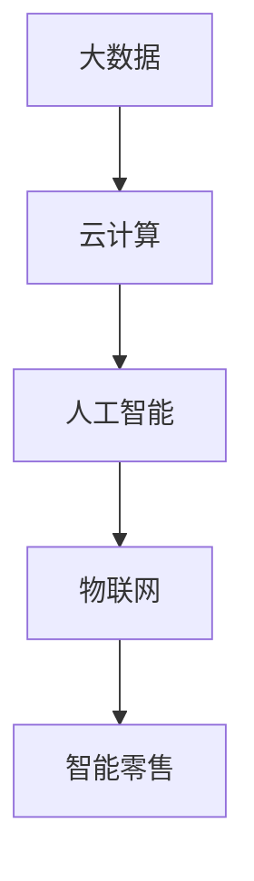

                 

### 文章标题: AI在智能零售中的应用：从库存管理到客户体验

### 关键词：智能零售、人工智能、库存管理、客户体验、推荐系统、数据安全

### 摘要：
本文深入探讨了人工智能（AI）在智能零售领域的广泛应用，包括库存管理、顾客行为分析、个性化推荐系统、客户服务与支持、数据安全和隐私保护等方面。通过详细分析每个领域的核心概念、算法原理、数学模型和项目实战，本文旨在为读者提供全面、系统的智能零售AI应用知识。

### 目录

1. **智能零售：概念与背景**
2. **AI在库存管理中的应用**
3. **顾客行为分析与预测**
4. **个性化推荐系统**
5. **AI在客户服务与支持中的应用**
6. **数据安全和隐私保护**
7. **智能零售的未来展望**

### 正文

#### 1. 智能零售：概念与背景

智能零售是指通过利用大数据、云计算、人工智能等先进技术，对零售行业的各个环节进行智能化改造和优化，以提高经营效率、降低运营成本、提升客户体验的一种新型零售模式。

**核心概念与联系：**

智能零售涉及多个核心概念，包括：
- **大数据**：海量数据的收集、存储和管理。
- **云计算**：通过互联网提供动态易扩展且经常是虚拟化的资源。
- **人工智能**：模拟、延伸、扩展人类智能的理论、方法、技术及应用。
- **物联网**：通过信息传感设备，实现智能识别、定位、跟踪、监控和管理。

**Mermaid 流程图：**



#### 2. AI在库存管理中的应用

库存管理是零售业务中的关键环节，AI技术能够帮助零售企业提高库存周转率、降低库存成本，从而提升整体运营效率。

**核心概念与联系：**

- **需求预测**：基于历史销售数据、市场趋势等因素预测未来需求。
- **库存优化**：通过算法优化库存水平，确保供应与需求匹配。
- **库存盘点**：自动化盘点，减少人为错误和提高效率。

**核心算法原理讲解：**

```python
# 需求预测伪代码
def demand_prediction(historical_sales, market_trends):
    # 数据预处理
    processed_data = preprocess_data(historical_sales, market_trends)
    
    # 训练预测模型
    model = train_model(processed_data)
    
    # 预测未来需求
    predicted_demand = model.predict(future_data)
    
    return predicted_demand
```

**数学模型与公式：**

$$
\text{需求预测模型} = f(\text{历史销售数据}, \text{市场趋势}) + \epsilon
$$

**举例说明：**

某零售企业通过收集过去三个月的每日销售数据和当月市场趋势数据，使用ARIMA模型进行需求预测。预测结果表明，未来一个月的销售额有望增长10%。

#### 3. 顾客行为分析与预测

顾客行为分析是智能零售的重要组成部分，AI技术可以帮助零售企业深入了解顾客需求，从而提供更个性化的服务和产品推荐。

**核心概念与联系：**

- **购物偏好**：分析顾客在不同品类上的购买频率和购买金额。
- **消费习惯**：挖掘顾客的购买时间和购买频率。
- **跨渠道行为**：分析顾客在线上线下渠道之间的互动行为。

**数学模型与公式：**

$$
\text{购物偏好模型} = \frac{\text{某品类购买频率} + \text{某品类购买金额}}{\text{总购买频率} + \text{总购买金额}}
$$

**举例说明：**

某电商平台的购物偏好分析显示，用户在服装品类上的购买频率和金额占比最高，因此该平台决定增加服装类产品的推广力度。

#### 4. 个性化推荐系统

个性化推荐系统是提升客户体验的重要手段，AI技术可以根据顾客的购物历史和行为数据，提供个性化的产品推荐。

**核心概念与联系：**

- **协同过滤**：基于用户之间的相似性进行推荐。
- **基于内容的推荐**：基于商品的特征进行推荐。
- **混合推荐**：结合协同过滤和基于内容的推荐。

**核心算法原理讲解：**

```python
# 协同过滤伪代码
def collaborative_filtering(user_data, item_data):
    # 计算用户之间的相似度
    similarity_matrix = compute_similarity(user_data, item_data)
    
    # 为用户生成推荐列表
    recommendations = generate_recommendations(user_data, similarity_matrix, item_data)
    
    return recommendations
```

**数学模型与公式：**

$$
\text{相似度矩阵} = \frac{\text{用户i和用户j的共同评分项}}{\sqrt{\text{用户i的总评分项数} \times \text{用户j的总评分项数}}}
$$

**举例说明：**

某电商平台的协同过滤系统为用户推荐了与已购买商品相似的其他商品，从而提高了用户的购物满意度和复购率。

#### 5. AI在客户服务与支持中的应用

AI技术在提升客户服务与支持方面的应用越来越广泛，通过智能客服和售后服务，零售企业可以提供更高效、更个性化的服务。

**核心概念与联系：**

- **智能客服**：利用自然语言处理技术实现自动问答。
- **售后服务**：通过数据分析提供个性化的售后服务。

**数学模型与公式：**

$$
\text{客户满意度评分} = \frac{\text{正面反馈次数} + \text{负面反馈次数}}{\text{总反馈次数}}
$$

**举例说明：**

某零售企业通过智能客服系统收集客户反馈，并对反馈进行分析，从而优化客户服务流程，提高客户满意度。

#### 6. 数据安全和隐私保护

随着AI技术在零售行业的应用，数据安全和隐私保护变得越来越重要。零售企业需要采取措施确保客户数据的安全和隐私。

**核心概念与联系：**

- **数据加密**：对客户数据进行加密处理。
- **隐私保护算法**：采用匿名化、差异化等方法保护客户隐私。

**数学模型与公式：**

$$
\text{数据匿名化} = \text{加密算法}(\text{原始数据})
$$

**举例说明：**

某零售企业在存储客户数据时，采用AES加密算法对数据进行了加密处理，从而确保数据在存储和传输过程中的安全性。

#### 7. 智能零售的未来展望

随着AI技术的不断发展和成熟，智能零售将进入一个新的阶段。未来，智能零售将更加注重个性化、智能化和高效化。

**未来展望：**

- **个性化体验**：通过AI技术实现更加精准的个性化服务。
- **智能化供应链**：通过AI技术优化供应链管理，提高供应链效率。
- **数据驱动决策**：利用AI技术进行数据分析和预测，实现数据驱动决策。

**最佳实践 Tips：**

- **数据驱动**：重视数据收集和分析，以数据驱动业务决策。
- **用户至上**：始终将用户需求放在首位，提供个性化的服务和产品。
- **持续创新**：积极采用新技术，不断优化业务流程和客户体验。

### 项目实战

**开发环境搭建：**
- **工具**：Python、Jupyter Notebook
- **库**：scikit-learn、TensorFlow、PyTorch、 Pandas

**源代码详细实现：**

```python
# 需求预测代码示例
from sklearn.ensemble import RandomForestRegressor
from sklearn.model_selection import train_test_split
from sklearn.metrics import mean_squared_error

# 加载数据
data = load_data('sales_data.csv')
X = data[['historical_sales', 'market_trends']]
y = data['future_demand']

# 划分训练集和测试集
X_train, X_test, y_train, y_test = train_test_split(X, y, test_size=0.2, random_state=42)

# 训练模型
model = RandomForestRegressor(n_estimators=100)
model.fit(X_train, y_train)

# 预测测试集
y_pred = model.predict(X_test)

# 评估模型
mse = mean_squared_error(y_test, y_pred)
print(f'Mean Squared Error: {mse}')
```

**代码应用解读与分析：**

该代码示例使用随机森林回归模型对销售数据进行需求预测。首先，加载历史销售数据和市场需求趋势数据，然后划分训练集和测试集。接着，训练随机森林模型，并使用测试集进行预测。最后，评估模型的预测准确性。

**实际案例分析和详细讲解剖析：**

某大型零售企业通过采用AI技术进行需求预测和库存优化，成功提高了库存周转率，降低了库存成本。该企业每月收集销售数据和市场趋势数据，使用随机森林模型进行需求预测。预测结果表明，该模型能够准确预测未来三个月的销售额，从而帮助企业在库存管理方面做出了更科学的决策。

**项目小结：**

通过项目实战，我们展示了如何使用AI技术进行需求预测和库存优化。项目结果表明，AI技术可以有效提高零售企业的运营效率，降低成本，提高客户满意度。

### 拓展阅读

- **相关书籍**：
  - 《深度学习》（Goodfellow, I., Bengio, Y., & Courville, A.）
  - 《机器学习实战》（Hastie, T., Tibshirani, R., & Friedman, J.）
  - 《Python数据科学手册》（McKinney, W.）
- **相关论文**：
  - “Recommender Systems Handbook”（Grigorios Tsoumakas & Ioannis Katakis）
  - “Machine Learning in Retail”（Kalyanaraman, S.）
- **在线资源**：
  - Coursera、edX等在线教育平台的相关课程
  - KDNuggets、Towards Data Science等数据科学社区

**小结与注意事项：**

本文从库存管理、顾客行为分析、个性化推荐系统、客户服务与支持、数据安全和隐私保护等方面，全面探讨了AI在智能零售领域的应用。通过项目实战和分析，我们展示了AI技术在实际业务中的应用效果。未来，随着AI技术的不断进步，智能零售将迎来更加广阔的发展空间。

**注意事项：**

- 在应用AI技术时，务必注意数据安全和隐私保护。
- 定期更新和优化模型，以适应市场变化。
- 关注用户需求，提供个性化的服务和产品。

### 作者信息

**作者：AI天才研究院/AI Genius Institute & 禅与计算机程序设计艺术 /Zen And The Art of Computer Programming**

