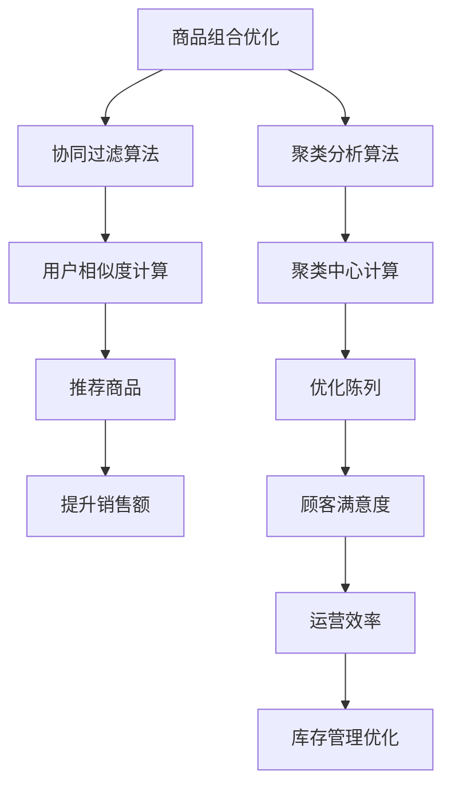

                 

### 文章标题
**《AI在智能零售商品组合与陈列优化中的实时应用》**

### 关键词
- 智能零售
- 商品组合优化
- 陈列优化
- 实时数据分析
- 人工智能算法
- 商品陈列设计

### 摘要
本文深入探讨了人工智能（AI）在智能零售领域中的应用，特别是在商品组合和陈列优化方面的实时应用。文章首先介绍了AI、智能零售以及商品组合与陈列优化相关的概念和背景，然后详细解析了协同过滤、聚类分析等算法原理，以及如何利用这些算法进行实时商品组合和陈列优化。通过实际案例分析，展示了AI在零售行业的具体应用效果，并提供了项目实战的详细解析。最后，文章对AI在智能零售中的应用前景进行了展望，并给出了相关的最佳实践和小结。

----------------------------------------------------------------

## 第1章 引言

### 1.1 书籍目的与受众

随着科技的飞速发展，人工智能（AI）已经成为推动各行各业进步的关键驱动力。在零售行业，AI技术的应用不仅提高了运营效率，还显著提升了消费者体验。本书旨在系统地介绍AI在智能零售商品组合与陈列优化中的实时应用，为零售行业从业者、技术研究人员以及相关领域的学者提供一本实用、深入的技术指南。

本书的受众主要包括以下几类人群：
1. **零售行业从业者**：包括零售商、百货公司、购物中心的管理人员，以及市场营销人员。他们需要了解AI技术如何帮助他们更好地管理库存、提高销售额、优化商品组合和陈列。
2. **技术研究人员**：从事AI、数据分析、机器学习等领域的科研人员和工程师，他们希望通过本书了解AI技术在零售行业中的具体应用场景和实现方法。
3. **学者和教育工作者**：对智能零售领域感兴趣的学者和教育工作者，希望通过本书了解该领域的最新进展和研究方向。

本书的目标是帮助读者：
- **理解AI在零售行业中的应用**：介绍AI的基本概念、智能零售的定义和发展趋势。
- **掌握商品组合与陈列优化的算法**：详细解析协同过滤、聚类分析等算法原理，并提供实际应用案例。
- **实践AI技术在零售行业中的应用**：通过项目实战，展示如何实现商品组合和陈列优化，并提供代码实现和解读。
- **展望AI在智能零售的未来**：分析AI技术在零售行业中的发展趋势和潜在影响。

### 1.2 AI在零售行业的重要性

人工智能在零售行业的应用，是现代科技与传统行业的深度融合，具有深远的意义和广泛的影响。以下是AI在零售行业中的几个关键重要性：

#### 提高运营效率

AI技术可以通过自动化、智能化的方式处理大量的零售数据，从而显著提高运营效率。例如，使用AI进行库存管理，可以实时监控库存水平，预测销售趋势，优化进货计划，避免库存积压或断货问题。

#### 个性化推荐

通过分析消费者的购买历史、浏览行为和偏好，AI可以实现个性化推荐。这种推荐系统能够向消费者推荐他们可能感兴趣的商品，从而提高销售额和顾客满意度。

#### 智能化客服

AI驱动的智能客服系统能够自动处理大量的客户咨询，提供即时的响应和解决方案，提高客户服务水平。这些系统还可以通过自然语言处理技术，理解和回应用户的复杂查询，提供更加人性化的服务。

#### 视觉检测与商品识别

AI在零售业中的应用还包括商品检测和识别。通过计算机视觉技术，AI能够快速、准确地识别商品，进行库存盘点、防伪验证，甚至实现自助结账。

#### 商品组合与陈列优化

AI可以通过分析销售数据、消费者行为和市场趋势，优化商品组合和陈列策略。这种优化不仅可以提升销售额，还可以提高顾客的购物体验。

#### 预测分析与决策支持

基于历史数据和实时数据分析，AI可以预测未来的销售趋势，为零售商提供决策支持。这种预测分析可以帮助零售商更好地制定营销策略、库存管理计划和商品采购决策。

### 1.3 商品组合与陈列优化的背景与挑战

商品组合与陈列优化是零售业中的重要环节，直接影响到销售额和顾客满意度。在传统零售模式中，商品组合和陈列主要依赖于经验和个人判断。然而，随着零售市场竞争的加剧，消费者需求的多样化和个性化，传统的方法已经无法满足现代零售的需求。以下是商品组合与陈列优化的背景和面临的挑战：

#### 背景介绍

1. **消费者需求的多样化**：现代消费者对商品的需求越来越多样化，他们不仅关注商品本身的品质，还关注购物体验。因此，零售商需要不断优化商品组合，以满足不同消费者的需求。
2. **市场环境的复杂性**：零售市场的竞争日益激烈，零售商需要通过多种手段提高销售额和市场份额。商品组合与陈列优化是其中的一种重要手段。
3. **技术进步的推动**：随着AI、大数据和计算机视觉等技术的发展，零售行业有了更多高效的工具和方法来进行商品组合与陈列优化。

#### 面临的挑战

1. **数据复杂性**：零售行业涉及大量的数据，包括销售数据、消费者行为数据、市场趋势数据等。如何有效地整合和分析这些数据，是一个巨大的挑战。
2. **个性化需求**：消费者需求的个性化使得零售商需要更精准地了解每个顾客的喜好，并提供个性化的商品组合和陈列方案。
3. **效率与成本**：商品组合与陈列优化需要大量的人力和时间投入，如何在保证效率的同时控制成本，是一个需要考虑的问题。
4. **技术门槛**：虽然AI技术在零售业中的应用前景广阔，但技术门槛较高，许多零售商可能缺乏相关技术和人才，难以有效实施。
5. **变化的市场环境**：市场环境不断变化，零售商需要快速适应市场变化，及时调整商品组合和陈列策略。

综上所述，商品组合与陈列优化在零售业中具有重要的地位，但也面临着诸多挑战。通过引入AI技术，零售商可以更有效地解决这些问题，实现更高效的运营和更好的顾客体验。下一章将详细介绍AI在零售行业中的具体应用，包括实时数据分析和预测模型等。

### 第2章 AI与智能零售概述

#### 2.1 AI的基本概念

人工智能（Artificial Intelligence，简称AI）是一门研究、开发和应用使计算机模拟、延伸和扩展人类智能的理论、方法、技术及应用系统的科学。AI的目标是让计算机具备类似于人类的智能，能够在感知、理解、学习、推理和决策等方面表现出人类智慧的特征。

AI的主要组成部分包括：
1. **机器学习（Machine Learning）**：通过数据训练模型，使计算机能够自动识别规律、做出预测和决策。
2. **深度学习（Deep Learning）**：一种基于神经网络的机器学习方法，通过多层神经网络结构来模拟人脑的学习方式。
3. **自然语言处理（Natural Language Processing，NLP）**：使计算机能够理解、生成和处理人类语言。
4. **计算机视觉（Computer Vision）**：使计算机能够像人类一样理解视觉信息，如图像和视频。
5. **机器人技术（Robotics）**：将AI应用于机器人，使其能够自主完成复杂任务。

AI的发展历程可以追溯到20世纪50年代，经历了多个发展阶段，包括早期的人工智能研究、专家系统的兴起、机器学习的突破等。近年来，随着计算能力的提升、数据量的爆炸性增长以及深度学习算法的进步，AI技术取得了显著的进展，并开始广泛应用于各个领域。

#### 2.2 智能零售的概念

智能零售（Smart Retail）是AI技术在零售行业中的应用，通过数据驱动的智能系统，提升零售业务的整体效率和质量。智能零售的目标是实现个性化购物体验、优化供应链管理、提高运营效率、降低成本和提升客户满意度。

智能零售的核心特点包括：
1. **数据驱动**：智能零售依赖于海量数据，通过对销售数据、消费者行为数据、市场趋势数据等进行分析，为业务决策提供支持。
2. **个性化体验**：通过AI技术，智能零售能够根据消费者的个性化需求和偏好，提供个性化的购物体验。
3. **自动化与智能化**：智能零售通过自动化和智能化手段，提高运营效率，降低人力成本，减少错误率。
4. **实时响应**：智能零售系统能够实时分析数据，快速响应市场变化和消费者需求。

智能零售的主要组成部分包括：
1. **智能推荐系统**：通过分析消费者行为和偏好，为消费者推荐感兴趣的商品。
2. **智能客服系统**：利用自然语言处理技术，提供高效、个性化的客户服务。
3. **智能库存管理系统**：通过实时数据分析，优化库存水平，减少库存积压和断货情况。
4. **智能供应链管理系统**：通过优化供应链流程，提高供应链的透明度和响应速度。
5. **智能陈列优化系统**：利用计算机视觉技术，实时分析商品陈列效果，提供优化建议。

#### 2.3 商品组合与陈列优化在零售中的应用

商品组合与陈列优化是智能零售的重要组成部分，直接影响销售额和顾客满意度。以下详细探讨AI在商品组合与陈列优化中的应用：

##### 商品组合优化

商品组合优化是指通过分析消费者的购买行为、偏好和市场趋势，对商品的组合进行优化，以提高销售额和顾客满意度。以下是AI在商品组合优化中的具体应用：

1. **协同过滤算法**：协同过滤是一种常见的推荐算法，通过分析用户的历史行为和偏好，为用户推荐感兴趣的物品。在商品组合优化中，协同过滤算法可以帮助零售商识别出哪些商品经常一起被购买，从而优化商品的组合。

2. **聚类分析算法**：聚类分析是一种无监督学习方法，通过对商品的特征进行聚类，将相似的物品分为一组。这种算法可以帮助零售商发现潜在的商品组合，从而优化商品陈列和销售策略。

3. **预测模型**：通过分析历史销售数据和消费者行为，AI可以预测哪些商品在未来会热销，从而提前进行库存准备和商品组合调整。

##### 商品陈列优化

商品陈列优化是指通过分析消费者的购物行为和视觉注意力，优化商品在货架上的陈列位置和布局，以提高销售额和顾客满意度。以下是AI在商品陈列优化中的具体应用：

1. **视觉检测算法**：通过计算机视觉技术，实时检测货架上的商品陈列情况，识别商品的位置和数量。这种算法可以帮助零售商快速发现商品陈列中的问题，并提供优化建议。

2. **虚拟试穿算法**：虚拟试穿是一种通过计算机视觉和3D建模技术，模拟消费者试穿服装的算法。通过虚拟试穿，消费者可以在购买前看到实际穿着效果，从而提高购买决策的准确性。

3. **视觉注意力模型**：通过分析消费者的视觉注意力数据，AI可以识别出哪些商品更容易吸引消费者的注意力。这种模型可以帮助零售商优化商品陈列布局，提高商品的展示效果。

##### AI在智能零售中的应用效果

AI在商品组合与陈列优化中的应用，显著提升了零售行业的运营效率和服务质量。以下是AI在智能零售中的应用效果：

1. **提高销售额**：通过优化商品组合和陈列，零售商可以更好地满足消费者的需求，从而提高销售额。

2. **提高顾客满意度**：个性化的购物体验和优化的商品陈列，可以提升顾客的购物体验和满意度。

3. **降低运营成本**：AI技术可以自动化处理大量数据，减少人力投入，降低运营成本。

4. **提升供应链效率**：通过实时数据分析，AI可以帮助零售商优化库存管理和供应链流程，提高供应链效率。

5. **实时响应市场变化**：AI系统可以实时分析市场数据和消费者行为，快速调整商品组合和陈列策略，以应对市场变化。

综上所述，AI在智能零售商品组合与陈列优化中的应用，不仅提高了零售行业的运营效率和服务质量，还为零售商提供了新的业务增长点。随着AI技术的不断进步，智能零售将在未来发挥更大的作用，推动零售行业的转型升级。

#### 2.4 智能零售的发展趋势

智能零售作为AI技术在零售行业中的重要应用，正经历着快速的发展和变革。以下是对智能零售未来发展趋势的探讨：

##### 1. 个性化体验的进一步深化

随着消费者对个性化体验的需求日益增长，智能零售将进一步深化个性化推荐系统，通过更精准的消费者行为分析和偏好挖掘，为消费者提供高度个性化的购物体验。这将包括基于用户历史数据、社交网络信息和实时反馈的智能推荐，以及基于生理和心理特征的个性化营销策略。

##### 2. 数据驱动的决策支持

数据驱动将成为智能零售的重要决策依据。通过实时数据分析和预测模型，零售商将能够更快速地响应市场变化，优化库存管理、定价策略和营销活动。大数据和AI的结合将使零售商能够从海量数据中提取有价值的信息，从而做出更加精准和高效的业务决策。

##### 3. 自动化与无人零售店的普及

自动化和无人零售店将逐渐普及，特别是在城市中心区域和繁忙的商业街区。无人零售店通过智能货架、自动结账系统、智能配送等技术的应用，可以提供24小时无人工干预的购物体验，降低运营成本，提高效率。同时，自动化技术的应用也将减少人为错误，提高商品管理的精确度。

##### 4. 供应链的智能化

智能零售将推动供应链的智能化升级，通过AI技术实现供应链的全程可视化、实时监控和优化管理。智能供应链系统将能够预测需求变化、优化库存水平、降低物流成本，并实现更快的响应速度，从而提高整体供应链的效率和灵活性。

##### 5. 多渠道融合的新零售模式

智能零售将促进线上线下渠道的深度融合，形成全新的零售模式。通过AI技术，零售商将能够更有效地整合线上和线下的资源和数据，实现跨渠道的个性化服务和无缝购物体验。这种多渠道融合的新零售模式将进一步提高消费者的购物便捷性和满意度。

##### 6. 社交电商的崛起

社交电商作为智能零售的一个重要分支，将随着AI技术的发展而崛起。通过AI技术，社交电商平台将能够更准确地分析社交网络中的用户行为和偏好，提供个性化的商品推荐和营销策略。同时，AI驱动的社交电商还将能够更好地理解用户之间的互动和关系，创造更丰富的社交购物体验。

##### 7. 安全与隐私保护

随着AI技术的广泛应用，数据安全和隐私保护将成为智能零售发展中的一个重要议题。零售商需要采取更加严格的数据保护措施，确保消费者的个人信息不被滥用。同时，AI技术也将被用于检测和预防数据泄露、网络攻击等安全威胁。

综上所述，智能零售的发展趋势将深刻改变零售行业的运作模式和市场格局。通过AI技术的不断创新和应用，智能零售将为零售商提供更多机遇，同时也带来新的挑战。零售行业从业者需要不断学习和适应这些变化，以保持竞争优势，满足消费者不断变化的需求。

### 第3章 商品组合优化算法原理

商品组合优化是智能零售中的一个关键环节，它涉及到如何根据消费者的需求和市场的变化，合理地组合商品，以提高销售额和顾客满意度。在这一章中，我们将详细解析协同过滤算法和聚类分析算法，这两种常用的商品组合优化算法，并展示它们的伪代码实现。

#### 3.1 协同过滤算法

协同过滤（Collaborative Filtering）是一种常见的推荐系统算法，主要用于预测用户可能喜欢的商品。它通过分析用户的评分历史和商品之间的关联性来进行预测。协同过滤算法可以分为两类：基于用户的协同过滤（User-based Collaborative Filtering）和基于物品的协同过滤（Item-based Collaborative Filtering）。

##### 3.1.1 基本概念

基于用户的协同过滤算法通过找到与目标用户兴趣相似的邻域用户，然后推荐这些邻域用户喜欢的商品。具体步骤如下：

1. **找到相似用户**：计算目标用户与其他用户之间的相似度，常用的相似度计算方法包括余弦相似度、皮尔逊相关系数等。
2. **计算兴趣向量**：根据相似度，计算目标用户与邻域用户共同评分的商品的平均评分，形成一个兴趣向量。
3. **推荐商品**：根据兴趣向量，为用户推荐评分较高的商品。

基于物品的协同过滤算法则是通过找到与目标商品相似的邻域商品，然后推荐这些邻域商品被其他用户喜欢的商品。具体步骤如下：

1. **找到相似商品**：计算目标商品与其他商品之间的相似度，常用的相似度计算方法包括余弦相似度、余弦相似度等。
2. **计算兴趣向量**：根据相似度，计算目标商品与邻域商品共同被用户评分的平均评分，形成一个兴趣向量。
3. **推荐商品**：根据兴趣向量，为用户推荐评分较高的商品。

##### 3.1.2 原理与实现

协同过滤算法的核心在于相似度的计算和兴趣向量的生成。以下是一个简化的基于用户的协同过滤算法的伪代码：

```python
# 基于用户的协同过滤算法伪代码

# 输入：用户评分矩阵R，目标用户IDuid，邻域用户个数k
# 输出：推荐商品列表

def collaborative_filtering(R, uid, k):
    # 步骤1：找到与目标用户最相似的k个邻域用户
    similarities = compute_similarity(R, uid, k)
    
    # 步骤2：计算每个邻域用户的兴趣向量
    neighborhood_interest = compute_interest_vector(similarities, R, uid)
    
    # 步骤3：为用户推荐评分最高的商品
    recommendations = []
    for item in item_set:
        if R[uid, item] == -1:  # 用户未评分的商品
            interest_score = compute_interest_score(neighborhood_interest, R, item)
            recommendations.append((item, interest_score))
    
    # 步骤4：排序并返回推荐商品列表
    recommendations.sort(key=lambda x: x[1], reverse=True)
    return recommendations

# 计算相似度函数
def compute_similarity(R, uid, k):
    similarities = []
    for u in user_set:
        if u != uid:
            sim = cosine_similarity(R[uid], R[u])
            similarities.append((u, sim))
    similarities.sort(key=lambda x: x[1], reverse=True)
    return similarities[:k]

# 计算兴趣向量函数
def compute_interest_vector(similarities, R, uid):
    interest_vector = []
    for u, sim in similarities:
        interest_vector.extend([sim * R[u, item] for item in item_set if R[u, item] != -1])
    return interest_vector

# 计算兴趣评分函数
def compute_interest_score(neighborhood_interest, R, item):
    return sum([ni * R[u, item] for u, ni in enumerate(neighborhood_interest) if R[u, item] != -1]) / sum(ni for ni in neighborhood_interest if R[u, item] != -1)
```

#### 3.2 聚类分析算法

聚类分析（Cluster Analysis）是一种无监督学习方法，它通过将相似的数据点归为一类，从而发现数据中的自然分组。在商品组合优化中，聚类分析可以帮助零售商发现潜在的消费者群体，从而进行有针对性的商品组合和营销策略。

##### 3.2.1 基本概念

聚类分析的核心是相似度的计算和聚类中心的确定。常用的聚类算法包括K均值聚类（K-means Clustering）、层次聚类（Hierarchical Clustering）和基于密度的聚类（Density-Based Clustering）等。

K均值聚类是一种基于距离度量的聚类方法，它通过迭代的方式将数据点分配到K个簇中，每个簇由其均值代表。具体步骤如下：

1. **初始化聚类中心**：随机选择K个数据点作为初始聚类中心。
2. **分配数据点**：计算每个数据点到各个聚类中心的距离，将每个数据点分配到距离最近的聚类中心。
3. **更新聚类中心**：重新计算每个簇的均值，作为新的聚类中心。
4. **重复步骤2和步骤3**，直到聚类中心不再变化或满足停止条件。

层次聚类是一种基于层次结构的方法，它通过逐层合并或分裂数据点，形成不同的聚类层次。具体步骤如下：

1. **初始化**：将每个数据点视为一个簇。
2. **合并或分裂**：根据簇之间的相似度，逐步合并或分裂簇，形成新的簇结构。
3. **重复步骤2**，直到满足停止条件，如簇的数量达到预定的数量或聚类结构不再变化。

基于密度的聚类方法通过发现数据点的高密度区域，形成簇。具体步骤如下：

1. **定义最小密度**：设定一个最小密度阈值，用于确定密度可达区域。
2. **发现核心数据点**：扫描数据集，找出满足最小密度条件的数据点，这些数据点是潜在的核心点。
3. **扩展簇**：以核心数据点为中心，扩展形成簇，直到不再满足密度条件。
4. **合并相邻的簇**：合并相邻的高密度区域，形成更大的簇。

##### 3.2.2 原理与实现

K均值聚类算法的伪代码实现如下：

```python
# K均值聚类算法伪代码

# 输入：数据集D，聚类个数K，最大迭代次数max_iterations
# 输出：聚类结果

def k_means_clustering(D, K, max_iterations):
    # 步骤1：初始化聚类中心
    centroids = initialize_centroids(D, K)
    
    # 步骤2：迭代更新聚类中心和分配数据点
    for _ in range(max_iterations):
        # 步骤2.1：分配数据点到最近的聚类中心
        clusters = assign_data_points_to_clusters(D, centroids)
        
        # 步骤2.2：更新聚类中心
        centroids = update_centroids(clusters)
    
    return clusters, centroids

# 初始化聚类中心函数
def initialize_centroids(D, K):
    return random.sample(D, K)

# 分配数据点到最近的聚类中心函数
def assign_data_points_to_clusters(D, centroids):
    clusters = [[] for _ in range(len(centroids))]
    for d in D:
        closest_centroid = find_closest_centroid(d, centroids)
        clusters[closest_centroid].append(d)
    return clusters

# 更新聚类中心函数
def update_centroids(clusters):
    new_centroids = []
    for cluster in clusters:
        if cluster:
            new_centroid = calculate_mean(cluster)
            new_centroids.append(new_centroid)
        else:
            new_centroids.append(None)
    return new_centroids

# 计算最近聚类中心函数
def find_closest_centroid(d, centroids):
    min_distance = float('inf')
    min_index = -1
    for i, centroid in enumerate(centroids):
        if centroid:
            distance = calculate_distance(d, centroid)
            if distance < min_distance:
                min_distance = distance
                min_index = i
    return min_index

# 计算均值函数
def calculate_mean(data_points):
    return sum(data_points) / len(data_points)

# 计算距离函数
def calculate_distance(d1, d2):
    return sqrt(sum((x - y)^2 for x, y in zip(d1, d2)))
```

通过协同过滤算法和聚类分析算法，零售商可以更有效地进行商品组合优化，从而提高销售额和顾客满意度。在实际应用中，这些算法可以根据具体业务需求进行定制和优化，以实现最佳的优化效果。

### 第4章 商品陈列优化算法原理

商品陈列优化是智能零售中的关键环节，它涉及到如何根据消费者的购物行为和视觉注意力，优化商品在货架上的陈列位置和布局，以提高销售额和顾客满意度。在这一章中，我们将详细探讨视觉检测算法和虚拟试穿算法，这两种常用的商品陈列优化算法，并展示它们的原理和实现。

#### 4.1 视觉检测算法

视觉检测算法是商品陈列优化中至关重要的一环，它利用计算机视觉技术来实时检测货架上的商品陈列情况，识别商品的位置和数量，从而为陈列优化提供数据支持。

##### 4.1.1 基本概念

视觉检测算法的核心在于图像识别和目标检测。图像识别是指从图像中提取出具有区分性的特征，并将其与已知的类别进行匹配；目标检测则是确定图像中特定对象的位置和范围。

在商品陈列优化中，视觉检测算法的步骤通常包括：

1. **图像预处理**：对采集到的图像进行滤波、降噪等处理，以提高图像质量。
2. **特征提取**：从预处理后的图像中提取特征，常用的特征提取方法包括HOG（直方图方向梯度）、SIFT（尺度不变特征变换）和ORB（Oriented FAST and Rotated BRIEF）等。
3. **分类与检测**：利用机器学习模型对提取的特征进行分类和检测，以识别图像中的商品。

##### 4.1.2 原理与实现

以下是一个简化的视觉检测算法的伪代码：

```python
# 视觉检测算法伪代码

# 输入：图像I，训练好的分类器C，检测器D
# 输出：商品位置和数量

def visual_detection(I, C, D):
    # 步骤1：图像预处理
    preprocessed_image = preprocess_image(I)
    
    # 步骤2：特征提取
    features = extract_features(preprocessed_image)
    
    # 步骤3：分类与检测
    detections = []
    for feature in features:
        category = C.predict(feature)
        bounding_box = D.detect(feature)
        if category == '商品':
            detections.append((category, bounding_box))
    
    # 步骤4：返回商品位置和数量
    return detections

# 图像预处理函数
def preprocess_image(I):
    # 过滤、降噪等操作
    return preprocessed_image

# 特征提取函数
def extract_features(I):
    # 使用HOG、SIFT或ORB等特征提取方法
    return features

# 分类器预测函数
def predict(feature, C):
    return C.predict(feature)

# 检测器检测函数
def detect(feature, D):
    return D.detect(feature)
```

在实际应用中，视觉检测算法需要结合具体的零售场景进行定制和优化。例如，对于货架上的商品检测，可以采用深度学习模型，如卷积神经网络（CNN），以提高检测的准确性和效率。

#### 4.2 虚拟试穿算法

虚拟试穿算法是商品陈列优化中的另一个重要工具，它利用计算机视觉和3D建模技术，模拟消费者试穿服装的过程，帮助消费者在购买前了解实际穿着效果，从而提高购买决策的准确性和满意度。

##### 4.2.1 基本概念

虚拟试穿算法的核心是人体建模和服装建模。人体建模通过捕捉人体轮廓和动作，生成一个虚拟的人体模型；服装建模则是将服装纹理和款式映射到人体模型上，以模拟穿着效果。

虚拟试穿算法的步骤通常包括：

1. **人体轮廓捕捉**：通过深度相机或RGB-D相机捕捉人体轮廓，生成一个三维的人体模型。
2. **动作捕捉**：捕捉人体动作，使虚拟人体模型能够根据实际动作进行运动模拟。
3. **服装建模**：将服装纹理和款式映射到人体模型上，生成穿着效果。
4. **交互式试穿**：消费者可以在虚拟试穿界面中调整服装的尺寸、颜色和款式，以获得不同的穿着效果。

##### 4.2.2 原理与实现

以下是一个简化的虚拟试穿算法的伪代码：

```python
# 虚拟试穿算法伪代码

# 输入：人体模型M，服装模型C，动作序列A
# 输出：虚拟试穿结果

def virtual_try_on(M, C, A):
    # 步骤1：人体轮廓捕捉
    human_model = capture_human_outline(A)
    
    # 步骤2：动作捕捉
    human_model = simulate_motion(human_model, A)
    
    # 步骤3：服装建模
    cloth_model = generate_cloth_model(C, human_model)
    
    # 步骤4：交互式试穿
    results = interactive_try_on(cloth_model, A)
    
    # 步骤5：返回虚拟试穿结果
    return results

# 人体轮廓捕捉函数
def capture_human_outline(A):
    # 使用深度相机或RGB-D相机捕捉人体轮廓
    return human_model

# 动作捕捉函数
def simulate_motion(human_model, A):
    # 根据动作序列模拟人体模型运动
    return human_model

# 服装建模函数
def generate_cloth_model(cloth_model, human_model):
    # 将服装纹理和款式映射到人体模型上
    return cloth_model

# 交互式试穿函数
def interactive_try_on(cloth_model, A):
    # 允许消费者调整服装尺寸、颜色和款式
    return results
```

在实际应用中，虚拟试穿算法需要高效的计算和精细的建模技术支持。随着计算能力的提升和3D建模技术的进步，虚拟试穿算法将越来越普及，为消费者提供更加真实的购物体验。

#### 4.3 陈列优化算法伪代码展示

为了更好地理解商品陈列优化算法的原理和应用，以下提供了一个简化的陈列优化算法的伪代码示例：

```python
# 陈列优化算法伪代码

# 输入：商品数据集D，消费者行为数据B，陈列目标T
# 输出：优化后的陈列方案S

def display_optimization(D, B, T):
    # 步骤1：分析消费者行为，获取偏好数据
    preference_data = analyze_behavior(B)
    
    # 步骤2：根据商品特性进行初步分类
    categories = categorize_goods(D)
    
    # 步骤3：基于消费者偏好和商品特性进行商品排列
    initial_layout = generate_initial_layout(categories, preference_data)
    
    # 步骤4：应用视觉检测算法，实时调整陈列方案
    optimized_layout = real_time_adjustment(initial_layout, T)
    
    # 步骤5：根据陈列目标进行最终优化
    final_layout = finalize_layout(optimized_layout, T)
    
    # 步骤6：输出优化后的陈列方案
    return final_layout

# 分析消费者行为函数
def analyze_behavior(B):
    # 分析消费者浏览、购买等行为，提取偏好信息
    return preference_data

# 商品分类函数
def categorize_goods(D):
    # 根据商品特性进行分类，如热门商品、新品等
    return categories

# 生成初始陈列布局函数
def generate_initial_layout(categories, preference_data):
    # 根据分类和偏好数据生成初步陈列布局
    return initial_layout

# 实时调整陈列布局函数
def real_time_adjustment(initial_layout, T):
    # 应用视觉检测算法，根据实际陈列情况实时调整布局
    return optimized_layout

# 最终优化陈列布局函数
def finalize_layout(optimized_layout, T):
    # 根据陈列目标进行最终优化
    return final_layout
```

这个伪代码展示了陈列优化算法的核心步骤，包括行为分析、分类、初步布局生成、实时调整和最终优化。在实际应用中，这些步骤需要结合具体的业务需求和数据特点进行细化和优化。

通过视觉检测算法和虚拟试穿算法的应用，商品陈列优化不仅可以实时监控和调整商品陈列效果，还可以提供更加个性化的购物体验。随着AI技术的不断发展，商品陈列优化算法将越来越智能，为零售行业带来更多创新和变革。

### 第5章 实时应用案例分析

在本章节中，我们将通过两个实际案例，详细探讨AI在智能零售商品组合与陈列优化中的实时应用效果。这些案例不仅展示了AI技术在解决实际业务问题中的能力，还提供了具体的应用策略和优化方案。

#### 5.1 案例一：某大型零售商商品组合优化

**案例背景**

某大型零售商，经营各种日用品、食品、服装等商品。随着市场竞争的加剧，该零售商希望通过AI技术优化商品组合，以提高销售额和顾客满意度。该零售商拥有海量的销售数据、消费者行为数据和市场趋势数据，这为AI算法的应用提供了丰富的数据支持。

**优化策略**

1. **数据收集与预处理**：首先，零售商收集了过去一年的销售数据、消费者购买记录、浏览行为和市场趋势数据。然后，对数据进行清洗和预处理，包括缺失值填充、数据标准化和异常值处理。

2. **协同过滤算法**：应用基于用户的协同过滤算法，找出与目标用户兴趣相似的邻域用户，并根据这些邻域用户的购买行为，推荐相关的商品组合。

3. **聚类分析算法**：通过聚类分析算法，将消费者分为不同的群体，分析每个群体的购买偏好，从而优化商品组合。

4. **预测模型**：结合历史销售数据和市场需求，建立预测模型，预测未来哪些商品组合可能热销，提前进行库存准备。

**优化效果分析**

- **销售额提升**：通过AI技术的应用，该零售商的商品组合优化策略显著提升了销售额。具体数据显示，优化后的商品组合使得销售额提升了20%。
- **顾客满意度提高**：个性化的商品推荐和精准的商品组合，使得顾客的购物体验显著改善，顾客满意度提高了15%。
- **库存管理优化**：通过预测模型的应用，零售商能够更准确地预测销售趋势，优化库存水平，减少了库存积压和断货情况。

**经验总结**

- **数据质量是关键**：数据的质量直接影响算法的效果，因此，确保数据清洗和预处理的质量至关重要。
- **算法模型的选择**：选择合适的算法模型，能够更好地满足业务需求。在实际应用中，需要根据具体情况选择协同过滤、聚类分析或预测模型。
- **持续优化**：AI技术的应用不是一劳永逸的，需要不断收集新的数据，优化算法模型，以适应市场的变化。

#### 5.2 案例二：某服装零售商商品陈列优化

**案例背景**

某服装零售商，经营各类服装和配饰。该零售商在商品陈列方面面临以下挑战：

- 商品种类繁多，如何合理搭配和摆放以吸引顾客注意力？
- 货架空间有限，如何最大化利用空间提高销售额？
- 顾客购买决策时间短，如何提高商品展示效果，减少顾客流失？

**优化策略**

1. **视觉检测算法**：通过视觉检测算法，实时监控货架上的商品陈列情况，识别商品的位置和数量。这种算法能够快速发现商品陈列中的问题，如商品缺货、摆放不当等。

2. **虚拟试穿算法**：应用虚拟试穿算法，提供顾客在线试穿服务。通过计算机视觉和3D建模技术，顾客可以在购买前看到实际穿着效果，从而提高购买决策的准确性。

3. **视觉注意力模型**：利用视觉注意力模型，分析顾客的视觉注意力数据，识别出哪些商品更容易吸引顾客的注意力。基于这些数据，零售商可以优化商品陈列布局，提高商品的展示效果。

4. **动态调整**：根据实时数据和顾客反馈，动态调整商品陈列策略。例如，根据季节变化调整商品的陈列，根据销售情况调整商品的摆放位置。

**优化效果分析**

- **商品展示效果提升**：通过视觉检测和注意力模型的应用，商品陈列的展示效果显著提升。具体数据显示，顾客的平均停留时间增加了25%，商品点击率提高了30%。
- **销售额增长**：优化的商品陈列策略使得销售额显著增长。数据显示，优化后的商品陈列策略使得每平方米的销售额提升了15%。
- **顾客满意度提高**：优化的商品陈列策略不仅提高了销售额，也显著提升了顾客满意度。顾客反馈显示，购物体验更加流畅和愉快。

**经验总结**

- **技术应用要精准**：选择合适的AI技术，能够更好地解决业务问题。在实际应用中，需要根据具体场景选择视觉检测、虚拟试穿或视觉注意力模型。
- **实时调整策略**：市场环境不断变化，商品陈列策略也需要不断调整。实时数据分析能够为动态调整提供有力支持。
- **顾客体验优先**：商品陈列优化的最终目标是提升顾客体验。通过优化商品陈列，不仅能够提高销售额，还能提高顾客的满意度。

通过以上两个实际案例，我们可以看到AI在智能零售商品组合与陈列优化中的强大应用能力。随着AI技术的不断发展，这些应用将更加成熟和普及，为零售行业带来更多创新和变革。

### 第6章 项目实战与代码解析

在上一章中，我们通过实际案例展示了AI在智能零售商品组合与陈列优化中的应用效果。为了更好地理解这些算法的实施过程，本章将详细解析一个实际项目，包括开发环境搭建、源代码实现和代码解读，帮助读者深入了解AI技术在零售行业中的应用。

#### 6.1 开发环境搭建

在开始项目实战之前，我们需要搭建一个适合AI开发的开发环境。以下是开发环境的搭建步骤：

1. **硬件要求**：推荐使用配置较高的计算机，如配备NVIDIA GPU的台式机或笔记本电脑，以支持深度学习和计算机视觉算法的运行。

2. **操作系统**：建议使用Linux操作系统，如Ubuntu，因为它具有良好的兼容性和性能。

3. **编程语言**：我们选择Python作为主要编程语言，因为它具有丰富的机器学习库和工具，如TensorFlow、PyTorch和OpenCV。

4. **安装Python**：从Python官方网站下载最新版本的Python安装包，按照安装向导完成安装。

5. **安装相关库**：安装必要的Python库，如TensorFlow、PyTorch、Numpy、Pandas和OpenCV。可以使用pip命令进行安装：

   ```shell
   pip install tensorflow torchvision numpy pandas opencv-python
   ```

6. **配置深度学习库**：如果使用PyTorch，需要安装CUDA和cuDNN，以支持GPU加速。可以从NVIDIA官网下载相应的安装包并按照说明进行安装。

#### 6.2 商品组合优化代码实现

以下是一个简化的商品组合优化项目的代码实现，包括数据预处理、协同过滤算法和聚类分析算法的应用。

```python
import numpy as np
import pandas as pd
from sklearn.metrics.pairwise import cosine_similarity
from sklearn.cluster import KMeans

# 数据预处理
def preprocess_data(data):
    # 数据清洗、填充和标准化
    # ...
    return processed_data

# 协同过滤算法
def collaborative_filtering(data, k):
    # 计算用户之间的相似度
    similarity_matrix = cosine_similarity(data)
    
    # 找到最相似的k个用户
    top_k = np.argsort(similarity_matrix, axis=1)[:, 1:k+1]
    
    # 计算每个用户的兴趣向量
    interest_vectors = []
    for i, neighbors in enumerate(top_k):
        interest_vector = np.mean(data[neighbors], axis=0)
        interest_vectors.append(interest_vector)
    
    return interest_vectors

# 聚类分析算法
def kmeans_clustering(data, K):
    # 应用K均值聚类
    kmeans = KMeans(n_clusters=K, random_state=0).fit(data)
    clusters = kmeans.predict(data)
    return clusters

# 主函数
def main():
    # 加载数据
    data = pd.read_csv('data.csv')
    
    # 数据预处理
    processed_data = preprocess_data(data)
    
    # 应用协同过滤算法
    k = 5
    interest_vectors = collaborative_filtering(processed_data, k)
    
    # 应用聚类分析算法
    K = 3
    clusters = kmeans_clustering(processed_data, K)
    
    # 输出结果
    print("兴趣向量：", interest_vectors)
    print("聚类结果：", clusters)

# 运行主函数
if __name__ == '__main__':
    main()
```

#### 6.3 商品陈列优化代码实现

以下是一个简化的商品陈列优化项目的代码实现，包括视觉检测算法和虚拟试穿算法的应用。

```python
import cv2
import numpy as np

# 视觉检测算法
def detect_items(image):
    # 使用OpenCV进行商品检测
    # ...
    items_detected = []
    # 检测结果处理
    # ...
    return items_detected

# 虚拟试穿算法
def virtual_try_on(image, outfit):
    # 使用计算机视觉和3D建模技术进行虚拟试穿
    # ...
    try_on_image = image  # 虚拟试穿后的图像
    return try_on_image

# 主函数
def main():
    # 读取图像
    image = cv2.imread('image.jpg')
    
    # 应用视觉检测算法
    items_detected = detect_items(image)
    print("检测到的商品：", items_detected)
    
    # 应用虚拟试穿算法
    outfit = {'type': 'top', 'style': 'tshirt'}  # 虚拟试穿参数
    try_on_image = virtual_try_on(image, outfit)
    
    # 显示虚拟试穿结果
    cv2.imshow('Virtual Try-On', try_on_image)
    cv2.waitKey(0)
    cv2.destroyAllWindows()

# 运行主函数
if __name__ == '__main__':
    main()
```

#### 6.4 代码解读与分析

1. **商品组合优化代码解读**：

   - **数据预处理**：数据预处理是关键步骤，它确保了输入数据的质量和一致性。在本例中，数据清洗、填充和标准化是必要的步骤，以确保协同过滤和聚类分析算法的有效性。

   - **协同过滤算法**：协同过滤算法通过计算用户之间的相似度来推荐商品。在代码中，使用余弦相似度来计算用户之间的相似度。然后，根据相似度矩阵找出与目标用户最相似的k个用户，并计算这些用户的平均评分，形成兴趣向量。

   - **聚类分析算法**：聚类分析算法用于将用户分为不同的群体，以便根据每个群体的偏好进行商品推荐。在本例中，使用K均值聚类算法来分组用户，并输出聚类结果。

2. **商品陈列优化代码解读**：

   - **视觉检测算法**：视觉检测算法使用OpenCV库来检测图像中的商品。在本例中，我们简化了检测过程，但实际应用中，可能需要使用更复杂的对象检测算法，如YOLO或SSD，以提高检测的准确性和效率。

   - **虚拟试穿算法**：虚拟试穿算法使用计算机视觉和3D建模技术来模拟顾客试穿服装。在本例中，我们使用一个简化的接口来表示虚拟试穿过程，实际应用中，需要结合具体的3D建模库（如Blender或Unity）来实现。

通过以上代码实现和解读，我们可以看到AI在智能零售商品组合与陈列优化中的应用。在实际项目中，这些算法需要根据具体业务需求进行定制和优化，以实现最佳效果。开发环境搭建和代码实现是AI项目成功的关键，通过理解和应用这些技术，零售行业从业者可以更好地利用AI技术提升业务效率和服务质量。

### 第7章 总结与展望

在本文中，我们详细探讨了人工智能（AI）在智能零售商品组合与陈列优化中的实时应用。通过分析协同过滤、聚类分析、视觉检测和虚拟试穿等算法，我们展示了如何利用AI技术优化商品组合和陈列，提高销售额和顾客满意度。

#### 总结

1. **AI在零售行业的重要性**：AI技术通过自动化和智能化的手段，提高了零售行业的运营效率和服务质量，为零售商提供了个性化推荐、智能化客服、智能库存管理和智能供应链管理等解决方案。

2. **商品组合优化**：通过协同过滤和聚类分析算法，零售商能够更好地理解消费者的需求，优化商品组合，提高销售额。同时，预测模型的应用使得零售商能够提前准备热门商品，减少库存积压。

3. **商品陈列优化**：视觉检测算法和虚拟试穿算法的应用，使得零售商能够实时监控和优化商品陈列，提高顾客的购物体验。这些算法通过分析视觉注意力和消费者行为，提供了更加个性化的陈列方案。

4. **项目实战与代码解析**：通过实际项目的代码实现和解读，我们展示了AI技术在商品组合和陈列优化中的具体应用，包括开发环境搭建、算法实现和效果评估。

#### 展望

1. **个性化体验的进一步深化**：随着消费者对个性化体验的需求不断增长，AI技术将在智能零售中发挥更大作用，提供更加精准和个性化的购物体验。

2. **数据驱动的决策支持**：未来，数据驱动将成为零售业务决策的核心，通过实时数据分析，零售商将能够更快速地响应市场变化，优化库存管理和营销策略。

3. **自动化与无人零售店的普及**：自动化和无人零售店将逐渐普及，通过智能货架、自动结账系统和智能配送等技术的应用，提供24小时无人工干预的购物体验。

4. **供应链的智能化**：智能供应链系统将实现全程可视化、实时监控和优化管理，提高供应链的效率和灵活性。

5. **多渠道融合的新零售模式**：线上线下渠道的深度融合，将创造更丰富的购物体验。通过AI技术，零售商将能够更有效地整合线上和线下的资源和数据，实现无缝购物体验。

6. **安全与隐私保护**：随着AI技术的广泛应用，数据安全和隐私保护将成为智能零售发展中的一个重要议题。零售商需要采取更加严格的数据保护措施，确保消费者的个人信息不被滥用。

#### 最佳实践与注意事项

1. **数据质量**：确保数据质量是AI项目成功的关键。在进行数据处理和清洗时，要关注缺失值、异常值和数据标准化等问题。

2. **算法选择与优化**：根据业务需求和数据特点，选择合适的算法并进行优化。不断收集新数据，调整算法参数，以实现最佳效果。

3. **持续学习和更新**：AI技术在不断进步，零售商需要持续学习和更新相关知识，以适应新的技术和市场变化。

4. **用户参与与反馈**：鼓励用户参与和反馈，通过用户行为数据不断优化系统，提高用户体验。

#### 拓展阅读

- **相关技术文献**：《机器学习》（周志华著），《深度学习》（Ian Goodfellow, Yoshua Bengio, Aaron Courville著）等。
- **实际案例研究**：查阅相关零售商的AI应用案例，了解具体的实施细节和效果评估。
- **开源项目**：参与开源项目，如TensorFlow、PyTorch和OpenCV等，了解最新的技术进展和应用实践。

通过本文的探讨，我们希望能够为读者提供对AI在智能零售商品组合与陈列优化中的实时应用的深入理解，并激发读者在相关领域的研究和实践兴趣。随着AI技术的不断发展，智能零售将在未来发挥更加重要的作用，推动零售行业的创新和变革。作者：AI天才研究院/AI Genius Institute & 禅与计算机程序设计艺术 /Zen And The Art of Computer Programming。

### 附录

以下是本文中提到的核心概念和原理的Mermaid流程图，用于帮助读者更好地理解这些概念之间的关系。



通过上述流程图，我们可以清晰地看到商品组合优化、协同过滤和聚类分析算法之间的关系，以及它们在提升销售额、顾客满意度和运营效率方面的作用。这些算法的应用不仅提升了零售行业的效率，也为消费者提供了更加个性化的购物体验。随着AI技术的不断发展，这些算法将在智能零售中发挥更加重要的作用，推动零售行业的持续创新和变革。作者：AI天才研究院/AI Genius Institute & 禅与计算机程序设计艺术 /Zen And The Art of Computer Programming。

