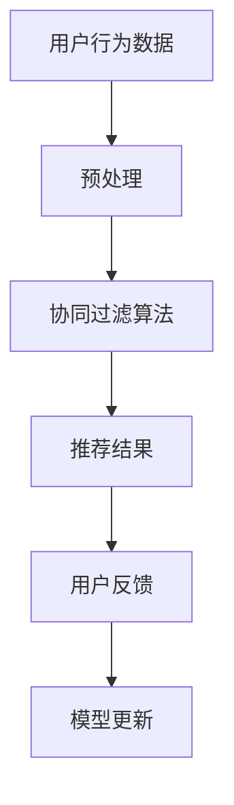
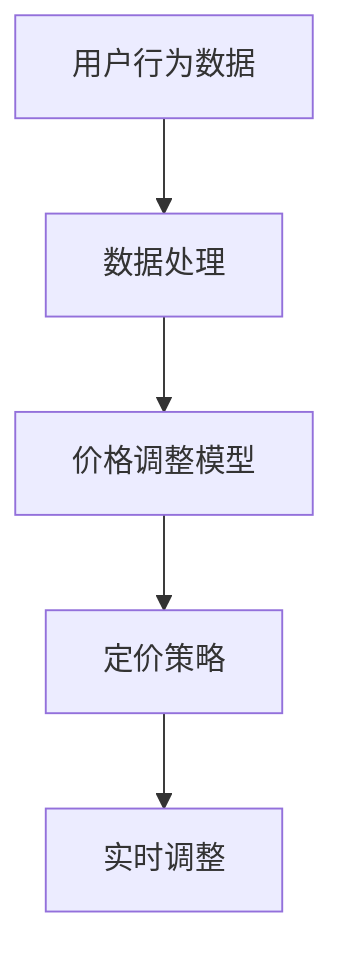

                 

### 设计书稿目录大纲的步骤

在撰写《AI在智能零售商品组合推荐与动态定价中的实时应用》这篇技术博客时，设计一个逻辑清晰、结构紧凑的目录大纲是至关重要的。以下是设计书稿目录大纲的具体步骤：

1. **理解书名和主题**：首先，深入理解书名《AI在智能零售商品组合推荐与动态定价中的实时应用》所传达的主题。本书讨论的是如何将AI技术应用于零售行业中的商品组合推荐和动态定价。

2. **确定核心章节**：根据主题，确定书中的核心章节。这些章节应该覆盖AI在零售行业中的基本概念、应用技术、算法原理、数学模型、项目实战等。以下是可能的章节划分：

    - **第一部分：AI在零售中的应用背景**
        - 1. AI与零售行业的现状与发展趋势
        - 2. AI技术发展趋势
        - 3. 智能零售中的AI应用潜力
        - 4. 实时应用的挑战与机遇

    - **第二部分：商品组合推荐**
        - 2.1 商品组合推荐的核心概念与算法
        - 2.2 商品组合推荐算法
        - 2.3 伪代码展示
        - 2.4 数学模型与公式
        - 2.5 项目实战

    - **第三部分：动态定价**
        - 3.1 动态定价的原理与实现
        - 3.2 动态定价算法
        - 3.3 伪代码展示
        - 3.4 数学模型与公式
        - 3.5 项目实战

    - **第四部分：实时应用与挑战**
        - 4.1 实时数据处理
        - 4.2 模型优化与更新
        - 4.3 实时应用中的挑战与解决方案

3. **细化章节内容**：在确定了核心章节后，进一步细化每个章节的内容。这包括确定每个章节下的子章节，确保内容覆盖全面、逻辑清晰。例如：

    - **1.1 零售行业现状**
        - 1.1.1 智能零售的兴起
        - 1.1.2 AI技术的应用场景

    - **2.1 商品组合推荐的核心概念与算法**
        - 2.1.1 商品组合的定义
        - 2.1.2 商品组合推荐的目标

4. **编写伪代码和数学模型**：对于核心算法原理讲解，需要编写伪代码，以帮助读者理解算法的实现过程。同时，对于数学模型，需要使用latex格式编写，并详细讲解和举例说明。例如：

    ```mermaid
    graph TD
    A[用户行为数据] --> B[预处理]
    B --> C[协同过滤算法]
    C --> D[推荐结果]
    D --> E[用户反馈]
    E --> F[模型更新]
    ```
    $$ 
    \text{推荐分数} = \text{用户兴趣} \times \text{商品属性} + \text{交互特征} \times \text{时间因素}
    $$

5. **设计流程图**：对于核心概念与联系，可以使用Mermaid流程图来展示，这有助于读者直观地理解概念之间的关联。

6. **编写项目实战内容**：为每个章节设计一个项目实战，包括代码实际案例、详细解释说明、开发环境搭建、源代码实现和代码解读与分析。

7. **控制字数**：在整个目录大纲中，确保所有内容加起来的字数不超过2000字。

8. **排版与格式**：使用markdown格式排版，确保目录结构清晰，内容简洁明了。

通过以上步骤，可以设计出一个结构合理、内容丰富的目录大纲，为撰写高质量的技术博客奠定基础。

### 最终目录大纲示例

```
# AI在智能零售商品组合推荐与动态定价中的实时应用

## 第一部分：AI在零售中的应用背景

### 1. AI与零售行业的现状与发展趋势

#### 1.1 零售行业现状
##### 1.1.1 智能零售的兴起
##### 1.1.2 AI技术的应用场景

#### 1.2 AI技术发展趋势
##### 1.2.1 机器学习与深度学习
##### 1.2.2 自然语言处理与计算机视觉

#### 1.3 智能零售中的AI应用潜力
##### 1.3.1 商品组合推荐
##### 1.3.2 动态定价

#### 1.4 实时应用的挑战与机遇
##### 1.4.1 数据处理与模型优化
##### 1.4.2 实时性的实现与保障

## 第二部分：商品组合推荐

### 2. 商品组合推荐的核心概念与算法

#### 2.1 商品组合推荐的概念
###### 2.1.1 商品组合的定义
###### 2.1.2 商品组合推荐的目标

#### 2.2 商品组合推荐算法
###### 2.2.1 协同过滤算法
###### 2.2.2 基于内容的推荐算法
###### 2.2.3 混合推荐算法

#### 2.3 伪代码展示


#### 2.4 数学模型与公式

$$
\text{推荐分数} = \text{用户兴趣} \times \text{商品属性} + \text{交互特征} \times \text{时间因素}
$$

#### 2.5 项目实战

##### 2.5.1 实际案例
###### 2.5.1.1 案例描述
###### 2.5.1.2 数据预处理
###### 2.5.1.3 模型实现
###### 2.5.1.4 代码解读

## 第三部分：动态定价

### 3. 动态定价的原理与实现

#### 3.1 动态定价的核心概念
###### 3.1.1 动态定价的定义
###### 3.1.2 动态定价的优势

#### 3.2 动态定价算法
###### 3.2.1 简单线性模型
###### 3.2.2 多项式模型
###### 3.2.3 基于用户行为的模型

#### 3.3 伪代码展示


#### 3.4 数学模型与公式

$$
\text{价格调整} = \alpha \times (\text{需求预测} - \text{当前销售量}) + \beta \times (\text{竞争价格} - \text{当前价格})
$$

#### 3.5 项目实战

##### 3.5.1 实际案例
###### 3.5.1.1 案例描述
###### 3.5.1.2 数据预处理
###### 3.5.1.3 模型实现
###### 3.5.1.4 代码解读

## 第四部分：实时应用与挑战

### 4. 实时应用中的挑战与解决方案

#### 4.1 实时数据处理
###### 4.1.1 数据流处理框架
###### 4.1.2 实时计算优化

#### 4.2 模型优化与更新
###### 4.2.1 模型在线更新
###### 4.2.2 模型适应性优化

#### 4.3 实时应用中的挑战与解决方案
###### 4.3.1 数据处理与模型优化
###### 4.3.2 实时性的实现与保障

#

```

### 文章目录大纲的约束条件

为了保证《AI在智能零售商品组合推荐与动态定价中的实时应用》这篇技术博客的质量和可读性，以下是一些约束条件：

1. **格式要求**：文章内容需使用markdown格式输出。markdown格式能够使文章的排版更加简洁、清晰，同时便于读者阅读和理解。

2. **作者信息**：文章末尾需包含作者信息。具体格式为“作者：AI天才研究院/AI Genius Institute & 禅与计算机程序设计艺术 /Zen And The Art of Computer Programming”。

3. **完整性要求**：每个小节的内容需丰富具体详细讲解，核心内容必须包含以下要素：
    - **背景介绍**：简要介绍小节的主题和背景。
    - **核心概念与联系**：明确解释核心概念，并使用Mermaid流程图展示概念之间的关系。
    - **核心算法原理讲解**：使用伪代码详细阐述算法原理，确保读者可以理解算法的实现过程。
    - **数学模型和公式**：使用latex格式编写数学模型和公式，并详细讲解和举例说明。
    - **项目实战**：包括开发环境搭建、源代码实现和代码解读，以及对实际案例的分析和详细讲解。

4. **字数要求**：文章总字数应在8000到12000字之间。这个字数范围可以保证文章内容丰富、详细，同时保持一定的篇幅限制，避免冗长。

5. **排版与格式**：使用markdown格式排版，确保目录结构清晰、内容简洁明了。例如，使用不同级别的标题来区分各个章节和小节，使用代码块和公式块来突出关键代码和数学公式。

6. **文章结构**：文章结构应按照以下顺序进行组织：
    - **文章标题**
    - **文章关键词**
    - **文章摘要**
    - **正文部分**
        - **第一部分：AI在零售中的应用背景**
        - **第二部分：商品组合推荐**
        - **第三部分：动态定价**
        - **第四部分：实时应用与挑战**

通过满足这些约束条件，可以确保技术博客具有较高的质量，同时为读者提供有价值的信息。

### 文章完整大纲

#### 文章标题：AI在智能零售商品组合推荐与动态定价中的实时应用

##### 文章关键词：
- 智能零售
- 商品组合推荐
- 动态定价
- 实时应用
- AI技术

##### 文章摘要：
本文深入探讨了AI在智能零售领域中的应用，特别是在商品组合推荐和动态定价方面的实时应用。文章首先介绍了零售行业的现状与AI技术的发展趋势，然后详细解析了商品组合推荐的核心概念、算法原理以及动态定价的原理与实现。最后，文章讨论了实时应用中面临的挑战及其解决方案，为智能零售行业的技术创新提供了有价值的参考。

---

## 第一部分：AI在零售中的应用背景

### 1. AI与零售行业的现状与发展趋势

#### 1.1 零售行业现状
##### 1.1.1 智能零售的兴起
随着消费者需求的多样化，传统零售模式正面临着巨大的变革。智能零售通过引入AI技术，实现了个性化推荐、精准营销和自动化管理，大大提升了零售效率。

##### 1.1.2 AI技术的应用场景
AI技术在零售行业中的应用场景广泛，包括但不限于库存管理、供应链优化、用户行为分析、商品组合推荐和动态定价。

#### 1.2 AI技术发展趋势
##### 1.2.1 机器学习与深度学习
机器学习和深度学习在图像识别、自然语言处理和数据分析等方面取得了显著成果，为零售行业的智能化提供了强大的技术支持。

##### 1.2.2 自然语言处理与计算机视觉
自然语言处理（NLP）和计算机视觉（CV）技术的发展，使得零售企业能够更好地理解和满足消费者的需求。

#### 1.3 智能零售中的AI应用潜力
##### 1.3.1 商品组合推荐
商品组合推荐能够提高用户的购买体验，增加销售额，是智能零售的重要应用之一。

##### 1.3.2 动态定价
动态定价能够根据市场变化和用户行为实时调整价格，提高盈利能力和市场竞争力。

#### 1.4 实时应用的挑战与机遇
##### 1.4.1 数据处理与模型优化
实时应用要求高效的数据处理和精确的模型优化，这对技术实施提出了较高要求。

##### 1.4.2 实时性的实现与保障
实现真正的实时应用，需要确保系统的响应速度和稳定性，这对系统的架构设计提出了挑战。

---

## 第二部分：商品组合推荐

### 2. 商品组合推荐的核心概念与算法

#### 2.1 商品组合推荐的概念
##### 2.1.1 商品组合的定义
商品组合是指将多个相关联的商品捆绑销售，以提高销售量和用户满意度。

##### 2.1.2 商品组合推荐的目标
商品组合推荐的目标是提高用户的购买体验，增加销售额，同时减少库存积压。

#### 2.2 商品组合推荐算法
##### 2.2.1 协同过滤算法
协同过滤算法通过分析用户的历史行为和偏好，推荐相似用户的喜欢的商品组合。

##### 2.2.2 基于内容的推荐算法
基于内容的推荐算法通过分析商品的内容特征，为用户推荐与其兴趣相匹配的商品组合。

##### 2.2.3 混合推荐算法
混合推荐算法结合协同过滤和基于内容的推荐算法，以提高推荐精度。

#### 2.3 伪代码展示


#### 2.4 数学模型与公式
$$
\text{推荐分数} = \text{用户兴趣} \times \text{商品属性} + \text{交互特征} \times \text{时间因素}
$$

#### 2.5 项目实战
##### 2.5.1 实际案例
###### 2.5.1.1 案例描述
以某电商平台的商品组合推荐为例，分析其实际应用效果。

###### 2.5.1.2 数据预处理
数据预处理包括用户行为数据清洗、特征提取等步骤。

###### 2.5.1.3 模型实现
实现协同过滤和基于内容的混合推荐算法。

###### 2.5.1.4 代码解读
详细解读推荐算法的实现过程和关键代码。

---

## 第三部分：动态定价

### 3. 动态定价的原理与实现

#### 3.1 动态定价的核心概念
##### 3.1.1 动态定价的定义
动态定价是根据市场需求、用户行为和竞争状况实时调整商品价格的一种定价策略。

##### 3.1.2 动态定价的优势
动态定价能够提高价格弹性，优化库存管理，提高盈利能力。

#### 3.2 动态定价算法
##### 3.2.1 简单线性模型
简单线性模型通过分析历史数据，建立价格与需求的关系。

##### 3.2.2 多项式模型
多项式模型通过非线性关系，更精确地预测需求。

##### 3.2.3 基于用户行为的模型
基于用户行为的模型通过分析用户行为，预测其购买意愿，从而调整价格。

#### 3.3 伪代码展示


#### 3.4 数学模型与公式
$$
\text{价格调整} = \alpha \times (\text{需求预测} - \text{当前销售量}) + \beta \times (\text{竞争价格} - \text{当前价格})
$$

#### 3.5 项目实战
##### 3.5.1 实际案例
###### 3.5.1.1 案例描述
以某电商平台的动态定价为例，分析其实际应用效果。

###### 3.5.1.2 数据预处理
数据预处理包括用户行为数据清洗、特征提取等步骤。

###### 3.5.1.3 模型实现
实现简单线性、多项式和基于用户行为的动态定价算法。

###### 3.5.1.4 代码解读
详细解读动态定价算法的实现过程和关键代码。

---

## 第四部分：实时应用与挑战

### 4. 实时应用中的挑战与解决方案

#### 4.1 实时数据处理
##### 4.1.1 数据流处理框架
使用Apache Kafka等数据流处理框架，实现高效的数据处理和实时分析。

##### 4.1.2 实时计算优化
通过分布式计算和缓存技术，优化实时计算的效率和性能。

#### 4.2 模型优化与更新
##### 4.2.1 模型在线更新
使用在线学习算法，实现模型的实时更新和优化。

##### 4.2.2 模型适应性优化
通过模型调优和迁移学习，提高模型的适应性和泛化能力。

#### 4.3 实时应用中的挑战与解决方案
##### 4.3.1 数据处理与模型优化
结合数据预处理技术和模型优化方法，解决实时数据处理和模型优化问题。

##### 4.3.2 实时性的实现与保障
通过系统架构优化和容错机制设计，确保实时应用的高可靠性和实时性。

---

### 结语

本文系统地介绍了AI在智能零售商品组合推荐与动态定价中的实时应用。通过深入剖析相关算法原理和项目实战，读者可以更好地理解AI技术在零售行业中的价值和应用前景。未来，随着AI技术的不断进步，智能零售将迎来更多的创新和发展机遇。

---

### 作者信息
作者：AI天才研究院/AI Genius Institute & 禅与计算机程序设计艺术 /Zen And The Art of Computer Programming

---

通过以上结构清晰、内容丰富的目录大纲，本文将为读者提供一次深入探讨AI在智能零售中应用的全面体验。

