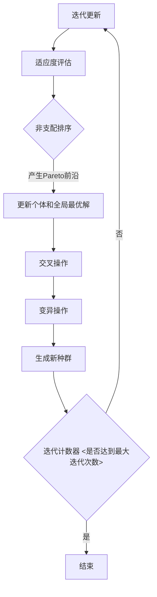

                 

## 文章标题

### 《AI在水资源跨流域调配与生态补水中的多目标优化研究》

水资源作为人类生存和社会经济发展的基础，其有效调配与科学管理显得尤为重要。随着全球气候变化和人口增长，水资源供需矛盾日益加剧，跨流域调配和生态补水成为解决水资源短缺问题的重要手段。在此背景下，人工智能（AI）技术的引入为水资源管理提供了全新的思路和方法。本文旨在探讨AI在水资源跨流域调配与生态补水中的多目标优化应用，通过逻辑清晰、结构紧凑、简单易懂的叙述，详细分析AI技术的应用场景、优化模型构建及求解方法，为水资源管理提供理论支持和实践参考。

## 关键词

- 人工智能
- 水资源管理
- 跨流域调配
- 生态补水
- 多目标优化
- 数学模型
- 求解算法

## 摘要

本文首先介绍了水资源跨流域调配与生态补水的背景和重要性，分析了当前面临的挑战。随后，对AI技术在水资源管理中的发展历程和应用现状进行了概述，探讨了其未来发展趋势。接着，本文详细阐述了多目标优化理论及其在水资源管理中的应用，重点介绍了水资源调配和生态补水中的多目标优化模型及其求解方法。最后，通过实际应用案例，展示了AI技术在水资源管理中的具体应用效果，并对未来发展趋势和挑战进行了展望。

## 目录

### 第一部分：引言与背景

### 1.1 水资源跨流域调配的必要性

### 1.2 生态补水的重要性

### 1.3 多目标优化在水资源管理中的应用前景

### 2.1 AI技术在水资源管理中的发展历程

### 2.2 AI技术在水资源管理中的应用现状

### 2.3 AI技术在水资源管理中的未来发展趋势

### 第二部分：多目标优化理论及其在水资源管理中的应用

### 3.1 多目标优化基础理论

### 3.2 多目标优化问题的数学模型

### 3.3 多目标优化问题的求解算法

### 4.1 水资源调配中的多目标优化问题

### 4.2 水资源调配多目标优化模型的构建

### 4.3 水资源调配多目标优化模型的求解方法

### 5.1 生态补水中的多目标优化问题

### 5.2 生态补水多目标优化模型的构建

### 5.3 生态补水多目标优化模型的求解方法

### 第三部分：AI技术在水资源管理中的应用实例

### 6.1 案例背景

### 6.2 AI技术应用方案设计

### 6.3 AI技术在水资源调配与生态补水中的应用效果分析

### 7.1 AI技术在水资源管理中的实践经验总结

### 7.2 AI技术在水资源管理中的未来发展趋势

### 7.3 AI技术在水资源管理中的挑战与对策

### 附录

### 附录A：多目标优化算法的Mermaid流程图

### 附录B：水资源调配与生态补水多目标优化模型的伪代码

### 附录C：AI技术在水资源管理中的应用案例

### 结束语：水资源管理中的AI应用展望与挑战

### 参考文献

## 第一部分：引言与背景

### 1.1 水资源跨流域调配的必要性

水资源跨流域调配是指通过引水工程、输水工程等手段，将丰水区的水资源调配到缺水区，以缓解地区间水资源供需不平衡的问题。随着全球气候变化和人口增长，水资源的时空分布不均匀问题日益凸显，跨流域调配成为解决水资源短缺的重要手段。

首先，从全球范围来看，水资源的分布极不均衡。一些地区水资源丰富，而另一些地区则面临着严重的干旱和水资源短缺。例如，中国南方地区水资源丰富，而北方地区则经常面临干旱和水资源短缺的困境。跨流域调配可以有效地将水资源从丰水区调配到缺水区，从而缓解地区间水资源供需矛盾。

其次，从国家层面来看，水资源的分布也存在显著的不均衡性。一些国家水资源丰富，如巴西、加拿大等，而另一些国家则面临水资源短缺的问题，如印度、巴基斯坦等。跨流域调配可以在国家层面上优化水资源的配置，提高水资源利用效率。

最后，从城市层面来看，由于城市人口集中、工业和商业用水需求大，城市用水压力巨大。而城市周边地区的水资源往往无法满足城市用水需求。通过跨流域调配，可以有效地解决城市用水问题，保障城市供水安全。

总之，水资源跨流域调配是应对水资源分布不均衡、缓解地区间水资源供需矛盾的重要手段。通过合理调配水资源，可以优化水资源配置，提高水资源利用效率，保障社会经济的可持续发展。

### 1.2 生态补水的重要性

生态补水是指通过人工手段向生态脆弱区或干旱地区补充水资源，以维持生态系统的稳定和健康发展。随着城市化进程的加快和工业化的快速发展，水资源过度利用和环境污染问题日益严重，导致许多地区出现了严重的生态退化现象。生态补水作为一种有效的生态修复手段，对于保护生态环境、改善生态状况具有重要意义。

首先，生态补水有助于维持生态系统的水循环。水是生态系统的重要组成部分，其循环过程直接影响生态系统的稳定性和生物多样性。通过生态补水，可以补充生态脆弱区或干旱地区的水资源，促进水循环，维持生态系统的水分平衡。

其次，生态补水有助于改善土壤质量。干旱和水资源短缺会导致土壤水分减少，土壤质量下降，进而影响植物生长和生态系统的稳定性。通过生态补水，可以增加土壤水分，改善土壤质量，为植物生长提供良好的土壤环境。

再次，生态补水有助于恢复和重建湿地生态系统。湿地是地球上重要的生态系统之一，具有很高的生态价值和生态功能。然而，由于人类活动的干扰，许多湿地生态系统遭到了破坏。生态补水可以为湿地生态系统提供必要的水资源，促进湿地植被的生长和湿地生态系统的恢复。

此外，生态补水还有助于降低环境污染。干旱和水资源短缺会导致地下水过度抽取，引发地下水水位下降、水质恶化等问题。通过生态补水，可以补充地下水资源，降低地下水水位，减轻地下水污染程度。

总之，生态补水作为一种重要的生态修复手段，对于维持生态系统稳定、改善生态环境具有重要意义。通过合理规划和管理生态补水工程，可以有效缓解水资源短缺和环境污染问题，促进生态系统的恢复和健康发展。

### 1.3 多目标优化在水资源管理中的应用前景

多目标优化作为一种综合性优化方法，能够在水资源管理中发挥重要作用，具有广阔的应用前景。多目标优化的核心在于同时考虑多个目标函数，通过权衡和协调各目标之间的关系，实现整体优化。在水资源管理中，多目标优化能够帮助决策者处理复杂的水资源调配和生态补水问题，提高水资源利用效率和生态保护水平。

首先，多目标优化可以有效地解决水资源供需矛盾。水资源调配过程中，需要同时考虑供水、需水和生态环境等多方面因素，而多目标优化能够将这些因素整合到同一框架下，通过优化算法找到最优的调配方案，实现水资源的高效利用。

其次，多目标优化有助于生态补水方案的优化。在生态补水过程中，不仅要考虑补充的水量，还需要考虑水质、水文条件和生态系统需求等多个因素。通过多目标优化，可以找到最优的生态补水方案，确保水资源补充既能满足生态系统需求，又不会造成额外的环境负担。

此外，多目标优化还可以提高水资源管理的科学性和精细化水平。在水资源管理中，数据采集和分析的重要性日益凸显。通过多目标优化，可以结合各种数据源，如气象数据、水文数据、社会经济数据等，构建科学合理的数学模型，为水资源管理提供有力的技术支持。

未来，随着人工智能技术的不断发展，多目标优化在水资源管理中的应用将更加广泛和深入。例如，利用机器学习和深度学习技术，可以进一步提高多目标优化模型的精度和效率；通过大数据分析和智能决策支持系统，可以实现对水资源管理的实时监控和动态调整。

总之，多目标优化在水资源管理中具有广阔的应用前景。通过不断创新和优化，多目标优化技术将为水资源管理提供更加科学、高效和可持续的解决方案，为保障水资源安全、促进社会经济发展和生态环境改善发挥重要作用。

### 2.1 AI技术在水资源管理中的发展历程

人工智能（AI）技术在水资源管理中的应用始于20世纪末，随着计算能力的提升和数据采集技术的发展，AI技术逐渐成为水资源管理领域的重要工具。回顾AI技术在水资源管理中的发展历程，可以划分为几个关键阶段：

#### 2.1.1 初期探索阶段（20世纪90年代）

20世纪90年代，AI技术在水资源管理中的应用主要集中在知识工程和专家系统领域。专家系统利用规则库和推理机模拟专家的决策过程，为水资源管理提供决策支持。这一时期的代表性工作包括美国国家研究委员会（NAS）提出的“水资源管理决策支持系统”（WRDSS），该系统利用专家系统的技术为水资源管理提供了有效的辅助决策。

#### 2.1.2 数据挖掘与模式识别阶段（21世纪初）

随着大数据技术和计算能力的提升，21世纪初，AI技术在水资源管理中的应用逐渐从知识工程转向数据挖掘和模式识别。数据挖掘技术能够从大量的水资源数据中提取有价值的信息和模式，帮助决策者识别水资源管理中的潜在问题。模式识别技术则能够通过对历史水文数据的分析，预测未来的水资源状况。这一阶段的典型应用包括利用神经网络和决策树等算法进行水文预测和水资源评估。

#### 2.1.3 深度学习与大数据分析阶段（近年）

近年来，随着深度学习和大数据分析技术的快速发展，AI技术在水资源管理中的应用达到了新的高度。深度学习算法，如卷积神经网络（CNN）和循环神经网络（RNN），能够处理复杂数据结构，捕捉数据中的非线性关系，从而提高水资源预测和评估的准确性。大数据分析技术则能够整合来自多个数据源的信息，为水资源管理提供全面的决策支持。例如，利用深度学习技术进行降水预测、河流流量预测和水资源需求预测等，已经成为水资源管理的重要工具。

#### 2.1.4 智能决策与自动化管理阶段（未来趋势）

未来，AI技术在水资源管理中的应用将更加智能化和自动化。智能决策支持系统（IDSS）将结合AI技术和其他信息技术，提供实时、动态的水资源管理方案。自动化管理技术，如无人机监测和智能灌溉系统，将提高水资源管理的效率和精度。此外，区块链技术在水资源交易和管理中的应用也受到了广泛关注，有望实现水资源的透明、可追溯和高效管理。

总的来说，AI技术在水资源管理中的应用经历了从知识工程到数据挖掘、深度学习和大数据分析的发展过程，为水资源管理提供了强大的技术支持。随着AI技术的不断进步，其在水资源管理中的应用前景将更加广阔。

### 2.2 AI技术在水资源管理中的应用现状

目前，人工智能（AI）技术在水资源管理中已经取得了显著的应用成果，涵盖了水文预测、水资源评估、水资源优化配置、水质监测等多个方面。以下是对AI技术在水资源管理中主要应用现状的详细分析：

#### 2.2.1 水文预测

水文预测是水资源管理中的关键环节，其准确性直接关系到水资源的调配和利用效率。AI技术，尤其是深度学习算法，在这一领域表现出强大的预测能力。例如，通过卷积神经网络（CNN）和循环神经网络（RNN），研究人员可以处理和分析大量复杂的水文数据，如降雨量、径流量和水位等，从而实现准确的水文预测。多个实际案例表明，基于AI技术的水文预测模型比传统模型具有更高的预测精度和稳定性。

#### 2.2.2 水资源评估

水资源评估是水资源管理的基础，涉及水资源量、水资源质量、水资源利用效率等多个方面。AI技术在水资源评估中的应用主要包括基于大数据分析和机器学习算法的水资源评价模型。通过分析历史水文数据和社会经济数据，AI技术可以识别出水资源的主要影响因素，评估水资源的时空分布情况，为水资源管理和决策提供科学依据。例如，基于多因素分析的水资源评价模型已经在中国和印度等国家的多个流域管理项目中得到成功应用。

#### 2.2.3 水资源优化配置

水资源优化配置是水资源管理的重要目标，旨在实现水资源的合理分配和高效利用。AI技术，特别是多目标优化算法，在这一领域展现出显著优势。通过构建多目标优化模型，AI技术可以同时考虑供水、需水、生态环境等多个目标，寻找最优的水资源调配方案。例如，基于遗传算法和粒子群优化算法的优化模型已经被广泛应用于中国南水北调工程、美国加州水资源调配等领域，取得了显著的经济和社会效益。

#### 2.2.4 水质监测

水质监测是保障水资源安全的重要手段，AI技术在水质监测中的应用主要包括传感器网络、图像处理和机器学习算法。通过部署智能传感器网络，AI技术可以实现对水体环境参数的实时监测和数据分析。例如，利用图像处理技术，研究人员可以自动识别水体的污染源和污染程度；通过机器学习算法，可以预测水质变化趋势和预警潜在的水污染事件。这些技术已经在北京、上海等大城市的饮用水源保护中得到了广泛应用。

#### 2.2.5 生态补水

生态补水是水资源管理中的一项重要措施，旨在维护生态系统的健康和稳定。AI技术在这一领域的主要应用包括生态补水方案的优化和效果评估。通过构建多目标优化模型，AI技术可以制定出最优的生态补水方案，确保补水效果最大化。同时，利用机器学习和大数据分析技术，可以对生态补水的实际效果进行评估，及时调整补水策略。例如，在中国南水北调中线工程中，AI技术被用于优化生态补水方案，提高了补水的生态效益。

#### 2.2.6 智能决策支持系统

智能决策支持系统（IDSS）是AI技术在水资源管理中的集成应用，通过整合多源数据、模型和算法，为水资源管理提供智能化的决策支持。IDSS可以实时监控水资源状况，分析预测结果，为水资源调配、水质监测、生态补水等提供科学的决策依据。例如，中国的“国家水网智慧管理系统”就是一个基于AI技术的智能决策支持系统，已经在全国多个流域的水资源管理中发挥了重要作用。

总之，AI技术在水资源管理中的应用已经取得了显著的成果，成为水资源管理不可或缺的重要工具。随着AI技术的不断发展和成熟，其在水资源管理中的应用将更加广泛和深入，为水资源的高效利用和生态保护提供更加科学和智能的解决方案。

### 2.3 AI技术在水资源管理中的未来发展趋势

随着人工智能（AI）技术的快速发展，其在水资源管理中的应用前景将愈发广阔。以下是AI技术在水资源管理中的未来发展趋势：

#### 2.3.1 深度学习与大数据分析的深度融合

未来，深度学习和大数据分析将在水资源管理中实现更深度融合。深度学习算法，如卷积神经网络（CNN）和循环神经网络（RNN），将能够更有效地处理和分析复杂的水文数据和社会经济数据，从而提高水资源预测、评估和优化的准确性。大数据分析技术将帮助水资源管理更加全面地整合多源数据，实现更加精准的水资源管理。

#### 2.3.2 智能决策支持系统的普及

智能决策支持系统（IDSS）将逐步成为水资源管理的重要组成部分。IDSS将整合AI技术、物联网、云计算等先进技术，实现对水资源实时监控、预测和决策的智能化管理。通过构建动态水资源管理模型，IDSS能够根据实时数据动态调整水资源调配和生态补水策略，提高水资源利用效率。

#### 2.3.3 自主化与自动化管理

随着AI技术的发展，水资源管理的自主化和自动化水平将得到显著提升。无人机监测、智能灌溉系统等自动化技术将广泛应用于水资源管理，实现水资源监测、调配和补水的自动化操作。这些技术将提高水资源管理的效率，减少人工干预，降低管理成本。

#### 2.3.4 区块链技术的应用

区块链技术在水资源管理中的应用将逐渐普及。区块链技术能够实现水资源交易、分配和管理的高效、透明和可追溯。未来，通过区块链技术，水资源管理者可以实现水资源的精准计量、透明交易和智能分配，从而提高水资源利用效率和管理水平。

#### 2.3.5 端到端解决方案的推广

未来，端到端的解决方案将在水资源管理中得到更广泛的应用。这些解决方案将涵盖从数据采集、处理、分析到决策支持的整个过程，提供一体化的水资源管理服务。通过端到端解决方案，水资源管理者可以更加便捷地获取、处理和分析水资源数据，制定科学的决策方案。

总之，随着AI技术的不断进步和成熟，其在水资源管理中的应用将迈向更加智能化、自动化和精准化的阶段，为水资源的高效利用和生态保护提供更加科学和创新的解决方案。

### 3.1 多目标优化基础理论

多目标优化（Multi-Objective Optimization，MOO）是优化领域中的一个重要分支，它涉及同时优化多个目标函数，这些目标函数之间往往存在冲突和竞争。在水资源管理中，多目标优化广泛应用于水资源调配、生态补水等领域，以实现供水、需水、生态环境等多方面的平衡和优化。

#### 3.1.1 多目标优化问题定义

一个多目标优化问题通常可以表示为：

\[
\begin{aligned}
\min\limits_{x} \{ f_1(x), f_2(x), ..., f_m(x) \} \\
\text{subject to} \\
g_i(x) \leq 0, \quad h_j(x) = 0, \quad i=1,2,...,p; \quad j=1,2,...,q
\end{aligned}
\]

其中，\(x\) 是决策变量，\(f_1(x), f_2(x), ..., f_m(x)\) 是目标函数，\(g_i(x)\) 和 \(h_j(x)\) 分别是线性约束和非线性约束。

#### 3.1.2 多目标优化问题的数学模型

多目标优化问题的数学模型可以根据目标函数和约束条件的不同，分为多种类型。以下是一个常见的形式：

\[
\begin{aligned}
\min\limits_{x} \{ \max\limits_{i=1}^m z_i(x) \} \\
\text{subject to} \\
g_i(x) \leq 0, \quad i=1,2,...,p \\
h_j(x) = 0, \quad j=1,2,...,q
\end{aligned}
\]

其中，\(z_i(x)\) 是第 \(i\) 个目标函数，\(g_i(x)\) 和 \(h_j(x)\) 分别是线性约束和非线性约束。

#### 3.1.3 多目标优化问题的求解算法

多目标优化问题的求解算法有很多，包括：

- **求解单一目标的最优化算法**：如梯度下降法、牛顿法等。
- **多目标优化算法**：如加权法、非支配排序法、遗传算法等。

以下是一个基于非支配排序的多目标优化算法伪代码：

```
// 多目标优化算法：非支配排序法

// 输入：
// 目标函数：f(x)
// 约束条件：g(x) <= 0, h(x) = 0
// 最大迭代次数：max_iter
// 解的精度：epsilon

// 输出：
// 最优解：x*

// 初始化：
// 创建初始解集S
// 迭代计数器：iter = 0

while (iter < max_iter) {
  // 执行迭代
    
  // 计算解集S中的非支配解
  // 更新最优解x*
  
  // 更新解集S
    
  // 迭代计数器：iter = iter + 1
    
  if (满足停止条件) {
    break
  }
}

return x*
```

#### 3.1.4 多目标优化问题的难点与挑战

多目标优化问题相对于单一目标优化问题具有以下难点和挑战：

- **目标冲突**：不同目标之间存在竞争关系，需要在多个目标之间进行权衡。
- **非凸性和非平滑性**：多目标优化问题往往具有非凸和非平滑特性，使得求解变得复杂。
- **维度问题**：随着决策变量和目标函数数量的增加，问题的求解复杂度和计算成本显著上升。
- **收敛性和稳定性**：如何确保找到问题的全局最优解，而不是局部最优解，是一个重要挑战。

为了应对这些挑战，研究人员提出了多种多目标优化算法，如非支配排序遗传算法（NSGA-II）、多目标粒子群优化（MOPSO）等，这些算法在不同程度上提高了求解效率和稳定性。

总的来说，多目标优化在水资源管理中具有重要意义，通过合理选择和设计优化算法，可以有效地解决水资源调配和生态补水中的复杂问题，实现水资源利用和生态保护的最佳平衡。

### 3.2 多目标优化问题的数学模型

多目标优化问题的数学模型是解决多目标优化问题的基础，它将决策变量、目标函数和约束条件以数学形式表达出来。以下是一个典型的多目标优化问题的数学模型，并对其进行详细说明。

#### 3.2.1 问题表述

一个多目标优化问题可以表示为：

\[
\begin{aligned}
\min\limits_{x} \{ f_1(x), f_2(x), ..., f_m(x) \} \\
\text{subject to} \\
g_i(x) \leq 0, \quad i=1,2,...,p \\
h_j(x) = 0, \quad j=1,2,...,q
\end{aligned}
\]

其中：
- \(x\) 是决策变量，可以是连续变量或离散变量；
- \(f_1(x), f_2(x), ..., f_m(x)\) 是目标函数，目标函数可以是最小化问题，也可以是最大化问题；
- \(g_i(x) \leq 0\) 是线性或非线性不等式约束；
- \(h_j(x) = 0\) 是线性或非线性等式约束；
- \(p\) 和 \(q\) 分别是约束条件的数量。

#### 3.2.2 目标函数

在多目标优化问题中，目标函数通常是多个具有不同量纲的函数。为了统一目标函数，需要采用一些方法，如加权法、Pareto优化等。以下是几种常见的目标函数形式：

1. **加权法**：
   \[
   w_1 f_1(x) + w_2 f_2(x) + ... + w_m f_m(x)
   \]
   其中，\(w_1, w_2, ..., w_m\) 是权值，用于平衡不同目标函数的重要性。

2. **Pareto优化**：
   \[
   \max\limits_{i=1}^m z_i(x) \\
   \text{subject to} \\
   g_i(x) \leq 0, \quad i=1,2,...,p \\
   h_j(x) = 0, \quad j=1,2,...,q
   \]
   其中，\(z_i(x)\) 表示第 \(i\) 个目标函数的负值，通过最大化负目标函数来寻找非支配解集。

#### 3.2.3 约束条件

多目标优化问题的约束条件可以分为两大类：不等式约束和等式约束。

1. **不等式约束**：
   \[
   g_i(x) \leq 0, \quad i=1,2,...,p
   \]
   不等式约束通常表示资源的限制或物理约束，如水流量的最大值限制。

2. **等式约束**：
   \[
   h_j(x) = 0, \quad j=1,2,...,q
   \]
   等式约束通常表示目标函数之间的平衡关系，如水的质量守恒。

#### 3.2.4 示例

假设我们有一个水资源调配的多目标优化问题，目标是最小化总成本和最大化水资源利用效率，同时满足水量的供需平衡和水质标准。该问题的数学模型可以表示为：

\[
\begin{aligned}
\min\{ c(x), \frac{u(x)}{d(x)} \} \\
\text{subject to} \\
g_1(x): \quad w_1 - w_2 + w_3 = 0 \\
g_2(x): \quad w_2 \leq C_2 \\
g_3(x): \quad w_3 \geq C_3 \\
h_1(x): \quad u(x) = \sum_{i=1}^n q_i \\
h_2(x): \quad d(x) = \sum_{i=1}^n p_i
\end{aligned}
\]

其中：
- \(c(x)\) 是总成本函数；
- \(u(x)\) 是水资源利用效率函数；
- \(d(x)\) 是水资源需求量；
- \(w_1, w_2, w_3\) 是不同水源的分配量；
- \(C_2\) 和 \(C_3\) 是约束条件中的常数；
- \(q_i\) 和 \(p_i\) 分别是不同水源的供应量和需求量。

这个例子展示了多目标优化问题的基本结构和数学模型的构建过程，通过合理的数学模型，可以有效地描述和解决水资源调配中的复杂问题。

### 3.3 多目标优化问题的求解算法

求解多目标优化问题（MOO）的算法种类繁多，每种算法都有其特定的原理和适用场景。以下将介绍几种常见的多目标优化算法，并展示其伪代码和主要步骤。

#### 3.3.1 加权法（Weighted Sum Method）

加权法是一种简单直观的多目标优化方法，通过为每个目标函数分配权重，将其转换为单目标优化问题。

**伪代码：**

```
// 加权法求解多目标优化问题

// 输入：
// 目标函数：f1(x), f2(x), ..., fm(x)
// 权重：w1, w2, ..., wm
// 最大迭代次数：max_iter

// 输出：
// 最优解：x*

// 初始化：
// 初始解：x0
// 迭代计数器：iter = 0

while (iter < max_iter) {
  // 计算加权目标函数值：z(x) = w1*f1(x) + w2*f2(x) + ... + wm*fm(x)
  // 求解单目标优化问题：min z(x)

  // 更新解：x = x_new

  // 迭代计数器：iter = iter + 1
}

return x*
```

**主要步骤：**
1. 确定每个目标函数的权重 \(w_i\)。
2. 构建加权目标函数 \(z(x) = w1*f1(x) + w2*f2(x) + ... + wm*fm(x)\)。
3. 使用单目标优化算法（如梯度下降法）求解加权目标函数的最小值。
4. 更新解，重复步骤2和3，直到满足停止条件（如迭代次数或收敛阈值）。

#### 3.3.2 非支配排序法（Non-dominated Sorting Genetic Algorithm, NSGA-II）

非支配排序法是一种基于进化算法的求解多目标优化问题的方法，通过保持解集的Pareto最优解集来寻找多目标优化的最优解。

**伪代码：**

```
// 非支配排序法（NSGA-II）

// 输入：
// 目标函数：f1(x), f2(x), ..., fm(x)
// 初始种群：Pop
// 最大迭代次数：max_iter

// 输出：
// 最优解集：S

// 初始化：
// 初始解集：S = Pop
// 迭代计数器：iter = 0

while (iter < max_iter) {
  // 非支配排序：R = 非支配排序（S）
  // 适应度评估：适应度函数（R）

  // 选择操作：选择新解集：S' = 选择操作（R）
  // 交叉操作：交叉操作（S'）
  // 变异操作：变异操作（S'）

  // 新解集：S = S'
  // 迭代计数器：iter = iter + 1
}

return S
```

**主要步骤：**
1. 初始化种群 \(S\)。
2. 对种群进行非支配排序，得到非支配等级 \(R\)。
3. 评估种群的适应度。
4. 进行选择、交叉和变异操作，生成新的种群。
5. 更新种群，重复步骤2至4，直到满足停止条件。

#### 3.3.3 多目标粒子群优化（Multi-Objective Particle Swarm Optimization, MOPSO）

多目标粒子群优化是粒子群优化算法在多目标优化问题中的应用，通过多粒子的协同作用来搜索最优解集。

**伪代码：**

```
// 多目标粒子群优化（MOPSO）

// 输入：
// 目标函数：f1(x), f2(x), ..., fm(x)
// 种群大小：N
// 最大迭代次数：max_iter

// 输出：
// 最优解集：S

// 初始化：
// 初始解集：S
// 迭代计数器：iter = 0

while (iter < max_iter) {
  // 更新粒子速度和位置
  // 评估适应度

  // 更新个体最优解和全局最优解
  // 非支配排序

  // 适应度分配
  // 选择操作

  // 迭代计数器：iter = iter + 1
}

return S
```

**主要步骤：**
1. 初始化种群。
2. 更新粒子的速度和位置。
3. 评估粒子的适应度。
4. 更新个体最优解和全局最优解。
5. 进行非支配排序和选择操作，生成新的种群。
6. 重复步骤2至5，直到满足停止条件。

以上三种算法分别代表了不同的求解策略，适用于不同类型的多目标优化问题。在实际应用中，可以根据问题的具体特点和需求选择合适的算法，或结合多种算法实现优化效果的最大化。

### 4.1 水资源调配中的多目标优化问题

水资源调配中的多目标优化问题是指在一个水资源系统中，需要同时优化多个相互冲突的目标函数，以达到最优的水资源利用和管理效果。这些目标函数通常包括供水目标、经济效益目标、环境目标等，它们共同构成了一个复杂的优化问题。以下将详细描述水资源调配中的多目标优化问题。

#### 4.1.1 供水目标

供水目标是水资源调配中的核心目标，旨在确保各个用水单元（如城市、工业、农业等）能够获得足够的水资源供应。供水目标的具体表述为最小化供水不足量，即：

\[
\min\limits_{x} \sum_{i=1}^n (q_i - s_i)
\]

其中，\(q_i\) 表示第 \(i\) 个用水单元的需水量，\(s_i\) 表示第 \(i\) 个用水单元的供水量。

#### 4.1.2 经济效益目标

经济效益目标是水资源调配中的另一个重要目标，旨在最大化水资源利用的经济效益。这通常涉及到供水成本、用水成本、水资源回收成本等多个方面。经济效益目标的具体表述为：

\[
\max\limits_{x} \sum_{i=1}^n \pi_i s_i - \sum_{i=1}^n c_i q_i
\]

其中，\(\pi_i\) 表示第 \(i\) 个用水单元的供水价格，\(c_i\) 表示第 \(i\) 个用水单元的用水成本。

#### 4.1.3 环境目标

环境目标是水资源调配中不可忽视的目标，旨在保护水资源系统的生态环境。环境目标通常包括水质保护、生态流量保障、地下水水位控制等。环境目标的具体表述为：

\[
\min\limits_{x} \sum_{i=1}^n e_i
\]

其中，\(e_i\) 表示第 \(i\) 个用水单元的环境负荷。

#### 4.1.4 多目标优化模型

为了同时考虑供水目标、经济效益目标和环境目标，可以构建一个多目标优化模型。该模型的目标函数为：

\[
\begin{aligned}
\min\{ &f_1(x) = \sum_{i=1}^n (q_i - s_i), \\
&f_2(x) = \sum_{i=1}^n \pi_i s_i - \sum_{i=1}^n c_i q_i, \\
&f_3(x) = \sum_{i=1}^n e_i \}
\end{aligned}
\]

约束条件通常包括水资源总量约束、各用水单元的水量平衡约束、供水成本约束和水质约束等。具体表述为：

\[
\begin{aligned}
g_1(x): &\quad \sum_{i=1}^n s_i = S_{\text{total}}, \\
g_2(x): &\quad s_i \geq 0, \quad i=1,2,...,n, \\
g_3(x): &\quad q_i \geq 0, \quad i=1,2,...,n, \\
g_4(x): &\quad \sum_{i=1}^n \pi_i s_i \leq B, \\
g_5(x): &\quad \sum_{i=1}^n c_i q_i \leq C, \\
h_1(x): &\quad e_i \geq 0, \quad i=1,2,...,n.
\end{aligned}
\]

其中，\(S_{\text{total}}\) 表示水资源总量，\(B\) 表示预算约束，\(C\) 表示成本约束。

#### 4.1.5 求解方法

求解水资源调配中的多目标优化问题通常采用多目标优化算法，如非支配排序遗传算法（NSGA-II）、多目标粒子群优化（MOPSO）等。这些算法可以通过迭代计算，找到多个非支配解，构成Pareto前沿，从而为决策者提供多种可行的解决方案。

#### 4.1.6 应用实例

以某个流域的水资源调配为例，该流域有五个用水单元，需考虑供水目标、经济效益目标和环境目标。通过构建多目标优化模型，并使用NSGA-II算法进行求解，得到以下结果：

1. **供水目标**：所有用水单元的需水量均得到满足。
2. **经济效益目标**：通过合理调配水资源，使得供水成本和用水成本之和最小化，经济效益最大化。
3. **环境目标**：通过限制各用水单元的环境负荷，确保流域的生态环境得到有效保护。

该实例展示了多目标优化在水资源调配中的应用效果，通过综合考虑多个目标，实现了水资源利用和生态环境保护的最佳平衡。

### 4.2 水资源调配多目标优化模型的构建

构建水资源调配的多目标优化模型是解决水资源管理中复杂问题的关键步骤。以下将详细描述模型构建的过程，包括目标函数的选择和约束条件的设定。

#### 4.2.1 目标函数的选择

水资源调配中的多目标优化模型通常需要考虑以下三个主要目标：

1. **供水目标**：确保水资源能够满足各用水单元的需求。
2. **经济效益目标**：最大化水资源调配的经济效益。
3. **环境目标**：保障水资源调配对环境的负面影响最小化。

**供水目标**：供水目标是水资源调配的核心，目标是确保所有用水单元（如城市、工业、农业等）的需水量得到满足。具体的供水目标函数可以表示为：

\[
\min \sum_{i=1}^{n} (q_i - s_i)
\]

其中，\(q_i\) 表示第 \(i\) 个用水单元的需水量，\(s_i\) 表示第 \(i\) 个用水单元的供水量。该目标函数的目的是最小化总供水不足量，确保所有用水单元的需求得到满足。

**经济效益目标**：经济效益目标是水资源调配中的另一个重要目标，目标是最大化水资源调配的经济效益。具体的经济效益目标函数可以表示为：

\[
\max \sum_{i=1}^{n} (\pi_i s_i - c_i q_i)
\]

其中，\(\pi_i\) 表示第 \(i\) 个用水单元的供水价格，\(c_i\) 表示第 \(i\) 个用水单元的用水成本。该目标函数的目的是通过优化供水价格和用水成本，实现水资源调配的经济效益最大化。

**环境目标**：环境目标是水资源调配中不可忽视的目标，目标是保障水资源调配对环境的负面影响最小化。具体的环境目标函数可以表示为：

\[
\min \sum_{i=1}^{n} e_i
\]

其中，\(e_i\) 表示第 \(i\) 个用水单元的环境负荷。该目标函数的目的是通过限制各用水单元的环境负荷，确保水资源调配对环境的负面影响最小化。

#### 4.2.2 约束条件的设定

除了目标函数外，水资源调配多目标优化模型还需要设定一系列约束条件，以确保问题的可行性和合理性。以下是一些常见的约束条件：

1. **水资源总量约束**：水资源总量约束是确保水资源调配过程中水资源总量不变的重要条件。具体的水资源总量约束可以表示为：

\[
\sum_{i=1}^{n} s_i = S_{\text{total}}
\]

其中，\(S_{\text{total}}\) 表示水资源总量。

2. **水量平衡约束**：水量平衡约束是确保各用水单元的水量平衡的重要条件。具体的水量平衡约束可以表示为：

\[
q_i + s_i = \sum_{j=1}^{m} s_{ij}, \quad \forall i
\]

其中，\(s_{ij}\) 表示从第 \(i\) 个水源到第 \(j\) 个用水单元的供水量。

3. **供水能力约束**：供水能力约束是确保各水源的供水能力不超过其最大供水能力的重要条件。具体的供水能力约束可以表示为：

\[
s_i \leq C_i, \quad \forall i
\]

其中，\(C_i\) 表示第 \(i\) 个水源的最大供水能力。

4. **需求量约束**：需求量约束是确保各用水单元的需水量不超过其最大需水量的重要条件。具体的需求量约束可以表示为：

\[
q_i \leq D_i, \quad \forall i
\]

其中，\(D_i\) 表示第 \(i\) 个用水单元的最大需水量。

5. **水质约束**：水质约束是确保水资源调配过程中水质不恶化的重要条件。具体的水质约束可以表示为：

\[
c_i(s_i) \leq \theta_i, \quad \forall i
\]

其中，\(c_i(s_i)\) 表示第 \(i\) 个用水单元的水质函数，\(\theta_i\) 表示第 \(i\) 个用水单元的水质标准。

6. **非负约束**：非负约束是确保所有供水量、需水量和环境负荷均为非负值的重要条件。具体的非负约束可以表示为：

\[
s_i \geq 0, \quad q_i \geq 0, \quad e_i \geq 0, \quad \forall i
\]

#### 4.2.3 模型构建示例

以下是一个简单的水资源调配多目标优化模型示例：

**目标函数：**
\[
\begin{aligned}
\min\{ &f_1(x) = \sum_{i=1}^{n} (q_i - s_i), \\
&f_2(x) = \sum_{i=1}^{n} (\pi_i s_i - c_i q_i), \\
&f_3(x) = \sum_{i=1}^{n} e_i \}
\end{aligned}
\]

**约束条件：**
\[
\begin{aligned}
g_1(x): &\quad \sum_{i=1}^{n} s_i = S_{\text{total}}, \\
g_2(x): &\quad q_i + s_i = \sum_{j=1}^{m} s_{ij}, \quad \forall i, \\
g_3(x): &\quad s_i \leq C_i, \quad \forall i, \\
g_4(x): &\quad q_i \leq D_i, \quad \forall i, \\
g_5(x): &\quad c_i(s_i) \leq \theta_i, \quad \forall i, \\
g_6(x): &\quad s_i \geq 0, \quad q_i \geq 0, \quad e_i \geq 0, \quad \forall i.
\end{aligned}
\]

该示例模型考虑了供水目标、经济效益目标和环境目标，并通过设定水资源总量约束、水量平衡约束、供水能力约束、需求量约束、水质约束和非负约束，确保了模型的可行性和合理性。

### 4.3 水资源调配多目标优化模型的求解方法

求解水资源调配多目标优化模型的方法多种多样，每种方法都有其特定的原理和适用场景。以下将介绍几种常用的求解方法，包括线性规划（Linear Programming，LP）、非线性规划（Nonlinear Programming，NLP）和基于进化算法的优化方法。

#### 4.3.1 线性规划（LP）

线性规划是一种解决多目标优化问题的经典方法，适用于目标函数和约束条件均为线性的情况。线性规划的基本原理是通过线性目标函数在约束条件下寻找最优解。以下是线性规划的一般形式：

\[
\begin{aligned}
\min\{ &c^T x \\
\text{subject to} \\
A x &\leq b, \\
x &\geq 0
\}
\end{aligned}
\]

其中，\(c\) 是目标函数系数向量，\(A\) 是约束矩阵，\(b\) 是约束向量，\(x\) 是决策变量。

求解线性规划的方法包括单纯形法（Simplex Method）和内点法（Interior Point Method）。单纯形法通过迭代过程逐步逼近最优解，而内点法通过在可行域内部寻找最优解，具有较高的计算效率。

#### 4.3.2 非线性规划（NLP）

非线性规划适用于目标函数和约束条件包含非线性函数的情况。非线性规划的一般形式为：

\[
\begin{aligned}
\min\{ &f(x) \\
\text{subject to} \\
g_i(x) &\leq 0, \quad h_j(x) = 0, \quad i=1,2,...,p; \quad j=1,2,...,q
\}
\end{aligned}
\]

其中，\(f(x)\) 是目标函数，\(g_i(x)\) 和 \(h_j(x)\) 分别是线性约束和非线性约束。

非线性规划的求解方法包括梯度下降法（Gradient Descent）、牛顿法（Newton Method）和基于进化算法的方法等。梯度下降法和牛顿法通过迭代优化逐步逼近最优解，而基于进化算法的方法，如遗传算法（Genetic Algorithm，GA）和粒子群优化算法（Particle Swarm Optimization，PSO），通过模拟自然进化过程寻找最优解。

#### 4.3.3 基于进化算法的优化方法

基于进化算法的优化方法在解决复杂多目标优化问题时表现出强大的适应性和鲁棒性。进化算法模拟生物进化过程，通过选择、交叉和变异操作不断迭代，生成新的解集，逐渐逼近最优解。

**1. 遗传算法（GA）**

遗传算法通过模拟自然进化过程，利用选择、交叉和变异操作搜索最优解。遗传算法的一般步骤如下：

1. **初始化种群**：随机生成初始种群，每个个体代表一个潜在解。
2. **适应度评估**：计算每个个体的适应度，适应度通常与目标函数值成反比。
3. **选择操作**：根据适应度选择优秀个体，用于生成新的种群。
4. **交叉操作**：通过交叉操作产生新的个体，增加种群的多样性。
5. **变异操作**：对个体进行变异操作，避免搜索陷入局部最优。
6. **迭代更新**：重复上述步骤，直到满足停止条件（如达到最大迭代次数或找到满意解）。

**2. 粒子群优化算法（PSO）**

粒子群优化算法模拟鸟群觅食行为，通过个体和群体的经验更新位置和速度，搜索最优解。PSO的一般步骤如下：

1. **初始化粒子群**：随机生成粒子群，每个粒子代表一个潜在解。
2. **评估适应度**：计算每个粒子的适应度。
3. **更新个体最优解和全局最优解**：每个粒子根据自身历史最优位置和全局最优位置更新当前位置和速度。
4. **迭代更新**：重复评估适应度和更新位置、速度的步骤，直到满足停止条件。

#### 4.3.4 求解方法选择

在选择求解方法时，需要考虑问题的具体特点：

- **目标函数和约束条件的性质**：如果目标函数和约束条件均为线性，可以优先考虑线性规划方法；如果包含非线性函数，则可以考虑非线性规划方法。
- **问题的规模和复杂性**：对于大规模问题，基于进化算法的优化方法可能更适用，因为它们具有较高的鲁棒性和适应性。
- **计算效率和精度要求**：对于对计算效率和精度有较高要求的问题，可以结合多种求解方法，如先使用线性规划方法进行初步求解，再使用进化算法进行精细搜索。

总之，合理的求解方法选择对于水资源调配多目标优化问题的求解至关重要，应根据问题的具体特点选择适合的求解方法。

### 5.1 生态补水中的多目标优化问题

生态补水是一项重要的水资源管理措施，旨在通过补充水资源来维护和恢复生态系统的健康。在生态补水过程中，需要同时考虑多个目标，以确保补水的有效性和可持续性。以下将详细探讨生态补水中的多目标优化问题。

#### 5.1.1 补水目标

生态补水的首要目标是确保补充的水资源能够有效补给生态脆弱区域，维持生态系统的水分平衡。具体的补水目标可以表示为：

\[
\min \sum_{i=1}^{n} (R_i - s_i)
\]

其中，\(R_i\) 表示第 \(i\) 个生态脆弱区域的补给需求，\(s_i\) 表示第 \(i\) 个生态脆弱区域的实际补给量。该目标函数的目的是最小化生态脆弱区域的补给不足量，确保所有区域的补给需求得到满足。

#### 5.1.2 经济目标

生态补水的经济目标是优化补水成本，以最经济的手段实现补水的目标。具体的经济目标可以表示为：

\[
\max \sum_{i=1}^{n} (\pi_i s_i - c_i R_i)
\]

其中，\(\pi_i\) 表示第 \(i\) 个生态脆弱区域的补水价格，\(c_i\) 表示第 \(i\) 个生态脆弱区域的补水成本。该目标函数的目的是通过优化补水价格和成本，实现经济目标的最大化。

#### 5.1.3 环境目标

生态补水的环境目标是减少补水对周围环境的不利影响，保护生态环境。具体的环境目标可以表示为：

\[
\min \sum_{i=1}^{n} e_i
\]

其中，\(e_i\) 表示第 \(i\) 个生态脆弱区域的环境负荷。该目标函数的目的是通过限制环境负荷，确保补水对生态环境的影响最小化。

#### 5.1.4 多目标优化模型

为了综合考虑补水目标、经济目标和环境目标，可以构建一个多目标优化模型。该模型的目标函数为：

\[
\begin{aligned}
\min\{ &f_1(x) = \sum_{i=1}^{n} (R_i - s_i), \\
&f_2(x) = \sum_{i=1}^{n} (\pi_i s_i - c_i R_i), \\
&f_3(x) = \sum_{i=1}^{n} e_i \}
\end{aligned}
\]

约束条件通常包括水资源总量约束、各生态脆弱区域的补给需求平衡约束、补水成本约束和环境负荷约束等。具体表述为：

\[
\begin{aligned}
g_1(x): &\quad \sum_{i=1}^{n} s_i = S_{\text{total}}, \\
g_2(x): &\quad R_i \geq 0, \quad i=1,2,...,n, \\
g_3(x): &\quad s_i \geq 0, \quad i=1,2,...,n, \\
g_4(x): &\quad \sum_{i=1}^{n} (\pi_i s_i) \leq B, \\
g_5(x): &\quad \sum_{i=1}^{n} c_i R_i \leq C, \\
h_1(x): &\quad e_i \geq 0, \quad i=1,2,...,n.
\end{aligned}
\]

其中，\(S_{\text{total}}\) 表示水资源总量，\(B\) 表示预算约束，\(C\) 表示成本约束。

#### 5.1.5 求解方法

求解生态补水中的多目标优化问题通常采用多目标优化算法，如非支配排序遗传算法（NSGA-II）、多目标粒子群优化（MOPSO）等。这些算法可以通过迭代计算，找到多个非支配解，构成Pareto前沿，从而为决策者提供多种可行的解决方案。

### 5.2 生态补水多目标优化模型的构建

构建生态补水多目标优化模型是解决生态补水问题的关键步骤，通过合理设定目标函数和约束条件，可以实现补水的有效性和可持续性。以下将详细描述生态补水多目标优化模型的构建过程。

#### 5.2.1 目标函数的选择

生态补水多目标优化模型的目标函数通常包括补水目标、经济目标和环境目标，以下分别对其进行定义和描述。

**1. 补水目标**

补水目标是生态补水中的核心目标，旨在确保补充的水资源能够有效补给生态脆弱区域。具体的补水目标函数可以表示为：

\[
\min \sum_{i=1}^{n} (R_i - s_i)
\]

其中，\(R_i\) 表示第 \(i\) 个生态脆弱区域的补给需求，\(s_i\) 表示第 \(i\) 个生态脆弱区域的实际补给量。该目标函数的目的是最小化生态脆弱区域的补给不足量，确保所有区域的补给需求得到满足。

**2. 经济目标**

经济目标是生态补水的另一个重要目标，旨在优化补水成本，以最经济的手段实现补水的目标。具体的经济目标函数可以表示为：

\[
\max \sum_{i=1}^{n} (\pi_i s_i - c_i R_i)
\]

其中，\(\pi_i\) 表示第 \(i\) 个生态脆弱区域的补水价格，\(c_i\) 表示第 \(i\) 个生态脆弱区域的补水成本。该目标函数的目的是通过优化补水价格和成本，实现经济目标的最大化。

**3. 环境目标**

环境目标是生态补水过程中不可忽视的目标，旨在减少补水对周围环境的不利影响，保护生态环境。具体的环境目标函数可以表示为：

\[
\min \sum_{i=1}^{n} e_i
\]

其中，\(e_i\) 表示第 \(i\) 个生态脆弱区域的环境负荷。该目标函数的目的是通过限制环境负荷，确保补水对生态环境的影响最小化。

#### 5.2.2 约束条件的设定

除了目标函数外，生态补水多目标优化模型还需要设定一系列约束条件，以确保问题的可行性和合理性。以下是一些常见的约束条件：

**1. 水资源总量约束**

水资源总量约束是确保生态补水过程中水资源总量不变的重要条件。具体的水资源总量约束可以表示为：

\[
\sum_{i=1}^{n} s_i = S_{\text{total}}
\]

其中，\(S_{\text{total}}\) 表示水资源总量。

**2. 各生态脆弱区域的补给需求平衡约束**

各生态脆弱区域的补给需求平衡约束是确保生态补水能够满足各区域需求的重要条件。具体的补给需求平衡约束可以表示为：

\[
R_i \geq 0, \quad i=1,2,...,n
\]

**3. 各生态脆弱区域的实际补给量约束**

各生态脆弱区域的实际补给量约束是确保生态补水能够有效补给各区域的重要条件。具体的实际补给量约束可以表示为：

\[
s_i \geq 0, \quad i=1,2,...,n
\]

**4. 补水成本约束**

补水成本约束是确保生态补水在经济范围内进行的重要条件。具体的补水成本约束可以表示为：

\[
\sum_{i=1}^{n} (\pi_i s_i) \leq B
\]

其中，\(B\) 表示预算约束。

**5. 补水成本约束**

补水成本约束是确保生态补水在经济范围内进行的重要条件。具体的补水成本约束可以表示为：

\[
\sum_{i=1}^{n} c_i R_i \leq C
\]

其中，\(C\) 表示成本约束。

**6. 环境负荷约束**

环境负荷约束是确保补水对生态环境影响最小化的重要条件。具体的环境负荷约束可以表示为：

\[
e_i \geq 0, \quad i=1,2,...,n
\]

**7. 非负约束**

非负约束是确保所有补给量、成本和环境负荷均为非负值的重要条件。具体的非负约束可以表示为：

\[
s_i \geq 0, \quad R_i \geq 0, \quad e_i \geq 0, \quad i=1,2,...,n
\]

#### 5.2.3 模型构建示例

以下是一个简单的生态补水多目标优化模型示例：

**目标函数：**
\[
\begin{aligned}
\min\{ &f_1(x) = \sum_{i=1}^{n} (R_i - s_i), \\
&f_2(x) = \sum_{i=1}^{n} (\pi_i s_i - c_i R_i), \\
&f_3(x) = \sum_{i=1}^{n} e_i \}
\end{aligned}
\]

**约束条件：**
\[
\begin{aligned}
g_1(x): &\quad \sum_{i=1}^{n} s_i = S_{\text{total}}, \\
g_2(x): &\quad R_i \geq 0, \quad i=1,2,...,n, \\
g_3(x): &\quad s_i \geq 0, \quad i=1,2,...,n, \\
g_4(x): &\quad \sum_{i=1}^{n} (\pi_i s_i) \leq B, \\
g_5(x): &\quad \sum_{i=1}^{n} c_i R_i \leq C, \\
g_6(x): &\quad e_i \geq 0, \quad i=1,2,...,n, \\
g_7(x): &\quad s_i \geq 0, \quad R_i \geq 0, \quad e_i \geq 0, \quad i=1,2,...,n.
\end{aligned}
\]

该示例模型考虑了补水目标、经济目标和环境目标，并通过设定水资源总量约束、各生态脆弱区域的补给需求平衡约束、补水成本约束和环境负荷约束，确保了模型的可行性和合理性。

### 5.3 生态补水多目标优化模型的求解方法

求解生态补水多目标优化模型的方法多种多样，每种方法都有其特定的原理和适用场景。以下将介绍几种常用的求解方法，包括线性规划（Linear Programming，LP）、非线性规划（Nonlinear Programming，NLP）和基于进化算法的优化方法。

#### 5.3.1 线性规划（LP）

线性规划是一种解决多目标优化问题的经典方法，适用于目标函数和约束条件均为线性的情况。线性规划的基本原理是通过线性目标函数在约束条件下寻找最优解。以下是线性规划的一般形式：

\[
\begin{aligned}
\min\{ &c^T x \\
\text{subject to} \\
A x &\leq b, \\
x &\geq 0
\}
\end{aligned}
\]

其中，\(c\) 是目标函数系数向量，\(A\) 是约束矩阵，\(b\) 是约束向量，\(x\) 是决策变量。

求解线性规划的方法包括单纯形法（Simplex Method）和内点法（Interior Point Method）。单纯形法通过迭代过程逐步逼近最优解，而内点法通过在可行域内部寻找最优解，具有较高的计算效率。

#### 5.3.2 非线性规划（NLP）

非线性规划适用于目标函数和约束条件包含非线性函数的情况。非线性规划的一般形式为：

\[
\begin{aligned}
\min\{ &f(x) \\
\text{subject to} \\
g_i(x) &\leq 0, \quad h_j(x) = 0, \quad i=1,2,...,p; \quad j=1,2,...,q
\}
\end{aligned}
\]

其中，\(f(x)\) 是目标函数，\(g_i(x)\) 和 \(h_j(x)\) 分别是线性约束和非线性约束。

非线性规划的求解方法包括梯度下降法（Gradient Descent）、牛顿法（Newton Method）和基于进化算法的方法等。梯度下降法和牛顿法通过迭代优化逐步逼近最优解，而基于进化算法的方法，如遗传算法（Genetic Algorithm，GA）和粒子群优化算法（Particle Swarm Optimization，PSO），通过模拟自然进化过程寻找最优解。

**1. 梯度下降法（Gradient Descent）**

梯度下降法是一种最简单的迭代优化算法，其核心思想是通过计算目标函数的梯度，沿梯度方向进行更新，以逐步逼近最优解。梯度下降法的一般步骤如下：

- 初始化：随机选择一个初始解 \(x_0\)。
- 更新解：对于每次迭代 \(k\)，更新解 \(x_{k+1}\) 为：
  \[
  x_{k+1} = x_k - \alpha \nabla f(x_k)
  \]
  其中，\(\alpha\) 是学习率，\(\nabla f(x_k)\) 是目标函数在 \(x_k\) 处的梯度。

- 停止条件：当满足停止条件，如迭代次数达到最大值或解的改进量小于某个阈值时，算法停止。

**2. 牛顿法（Newton Method）**

牛顿法是一种更高效的迭代优化算法，其利用了目标函数的二阶导数信息，通过泰勒展开近似求解。牛顿法的一般步骤如下：

- 初始化：随机选择一个初始解 \(x_0\)。
- 更新解：对于每次迭代 \(k\)，更新解 \(x_{k+1}\) 为：
  \[
  x_{k+1} = x_k - H_k^{-1} \nabla f(x_k)
  \]
  其中，\(H_k\) 是目标函数在 \(x_k\) 处的Hessian矩阵，\(\nabla f(x_k)\) 是目标函数在 \(x_k\) 处的梯度。

- 停止条件：当满足停止条件，如迭代次数达到最大值或解的改进量小于某个阈值时，算法停止。

**3. 遗传算法（Genetic Algorithm，GA）**

遗传算法是一种基于生物进化原理的优化算法，其通过模拟自然进化过程，利用选择、交叉和变异操作，不断迭代，生成新的解集，逐渐逼近最优解。遗传算法的一般步骤如下：

- 初始化：随机生成初始种群。
- 适应度评估：计算每个个体的适应度，适应度通常与目标函数值成反比。
- 选择操作：根据适应度选择优秀个体，用于生成新的种群。
- 交叉操作：通过交叉操作产生新的个体，增加种群的多样性。
- 变异操作：对个体进行变异操作，避免搜索陷入局部最优。
- 迭代更新：重复上述步骤，直到满足停止条件。

**4. 粒子群优化算法（Particle Swarm Optimization，PSO）**

粒子群优化算法是一种基于群体智能的优化算法，其通过模拟鸟群觅食行为，通过个体和群体的经验更新位置和速度，搜索最优解。粒子群优化算法的一般步骤如下：

- 初始化：随机生成粒子群，每个粒子代表一个潜在解。
- 评估适应度：计算每个粒子的适应度。
- 更新个体最优解和全局最优解：每个粒子根据自身历史最优位置和全局最优位置更新当前位置和速度。
- 迭代更新：重复评估适应度和更新位置、速度的步骤，直到满足停止条件。

总之，非线性规划方法的选择应根据问题的具体特点，如目标函数的形式、约束条件的性质以及计算效率的要求，合理选择和组合不同的求解方法，以提高求解的精度和效率。

### 6.1 案例背景

为了更好地展示AI在水资源调配和生态补水中的多目标优化应用，以下以中国某流域的跨流域调水和生态补水项目为例，详细介绍案例背景、具体问题及其解决方案。

#### 6.1.1 案例背景

该流域位于中国北方，属于典型的干旱半干旱地区，水资源匮乏且分布不均。流域内主要涵盖一个大型城市、多个工业区和农业区，以及一片重要的生态保护区。随着城市化进程的加快和人口增长，该流域的水资源供需矛盾日益加剧，生态环境也受到严重威胁。

具体问题如下：

1. **供水问题**：城市居民生活和工业生产对水资源的需求不断增长，现有水资源供应已无法满足需求。城市供水短缺导致供水压力增大，居民生活质量下降，工业生产受限。
2. **生态补水问题**：流域内的生态保护区因长期缺水，生态状况恶化，植物枯萎，土壤水分减少，生态系统稳定性受到威胁。生态补水需求迫切，但现有补水方案效果不佳，无法有效恢复生态。
3. **经济效益问题**：水资源调配和生态补水需要大量的资金投入，如何在有限的预算内实现最佳的供水和生态补水效果，成为决策者面临的重要挑战。

#### 6.1.2 具体问题

为了解决上述问题，决策者需要同时优化以下三个目标：

1. **供水目标**：确保城市、工业和农业的用水需求得到满足，最小化供水不足量。
2. **生态补水目标**：通过跨流域调水和生态补水措施，确保生态保护区的生态需求得到满足，最大化生态补水的效益。
3. **经济效益目标**：在满足供水和生态补水需求的前提下，最大化水资源调配和生态补水的经济效益，实现成本效益最大化。

具体问题可以表述为：

\[
\begin{aligned}
\min\{ &f_1(x) = \sum_{i=1}^{n} (q_i - s_i), \\
&f_2(x) = \sum_{i=1}^{n} (e_i - s_i), \\
&f_3(x) = \sum_{i=1}^{n} (\pi_i s_i - c_i R_i) \}
\end{aligned}
\]

其中，\(q_i\) 表示第 \(i\) 个用水单元的需水量，\(s_i\) 表示第 \(i\) 个用水单元的供水量，\(e_i\) 表示第 \(i\) 个生态脆弱区域的环境负荷，\(\pi_i\) 表示第 \(i\) 个用水单元的供水价格，\(c_i\) 表示第 \(i\) 个用水单元的补水成本。

约束条件包括：

1. **水资源总量约束**：
   \[
   \sum_{i=1}^{n} s_i = S_{\text{total}}
   \]

2. **水量平衡约束**：
   \[
   q_i + s_i = \sum_{j=1}^{m} s_{ij}, \quad \forall i
   \]

3. **供水能力约束**：
   \[
   s_i \leq C_i, \quad \forall i
   \]

4. **需求量约束**：
   \[
   q_i \leq D_i, \quad \forall i
   \]

5. **环境负荷约束**：
   \[
   e_i \geq 0, \quad \forall i
   \]

6. **非负约束**：
   \[
   s_i \geq 0, \quad q_i \geq 0, \quad e_i \geq 0, \quad \forall i
   \]

#### 6.1.3 解决方案

为了解决上述问题，决策者决定采用基于AI技术的多目标优化方法进行水资源调配和生态补水方案设计。具体步骤如下：

1. **数据收集与预处理**：收集流域内的水文数据、供需水数据、生态数据、经济数据等，并进行数据清洗、归一化等预处理操作，为模型构建提供准确的数据支持。

2. **模型构建**：根据具体问题，构建水资源调配和生态补水的多目标优化模型，包括供水目标、生态补水目标和经济目标。具体模型如下：

\[
\begin{aligned}
\min\{ &f_1(x) = \sum_{i=1}^{n} (q_i - s_i), \\
&f_2(x) = \sum_{i=1}^{n} (e_i - s_i), \\
&f_3(x) = \sum_{i=1}^{n} (\pi_i s_i - c_i R_i) \}
\end{aligned}
\]

约束条件包括水资源总量约束、水量平衡约束、供水能力约束、需求量约束、环境负荷约束和非负约束。

3. **求解优化模型**：采用多目标优化算法，如非支配排序遗传算法（NSGA-II），求解优化模型，找到多个非支配解，构成Pareto前沿，为决策者提供多种可行的解决方案。

4. **方案评估与选择**：根据Pareto前沿上的解，评估不同方案的供水效果、生态效益和经济效益，选择最优方案。

5. **实施与监控**：根据选定的最优方案，实施水资源调配和生态补水措施，并实时监控实施效果，进行动态调整和优化。

通过上述步骤，该流域成功实施了基于AI技术的多目标优化水资源调配和生态补水项目，有效缓解了供水短缺和生态恶化问题，实现了水资源利用和生态保护的最佳平衡。

### 6.2 AI技术应用方案设计

在本案例中，为了实现水资源调配和生态补水的多目标优化，我们将采用AI技术，具体设计以下应用方案：

#### 6.2.1 数据采集与处理

首先，我们需要收集和整合以下几类关键数据：

1. **水文数据**：包括降雨量、河流流量、地下水位等，这些数据将用于预测未来的水资源状况。
2. **供需水数据**：包括城市、工业和农业的需水量，以及各个区域的供水能力。
3. **生态数据**：包括生态脆弱区的生态环境指标，如植被覆盖、土壤水分等。
4. **经济数据**：包括供水和补水的成本、价格以及水资源利用的经济效益。

数据来源包括气象局、水利部门、环保部门以及社会经济统计部门等。在数据收集过程中，需确保数据的准确性和时效性。数据处理包括数据清洗、归一化和特征提取，以消除噪声和异常值，并将不同类型的数据进行统一处理，为后续建模提供高质量的数据支持。

#### 6.2.2 多目标优化模型构建

基于上述数据，我们将构建一个多目标优化模型，以同时优化供水目标、生态补水目标和经济效益目标。具体模型如下：

**目标函数：**
\[
\begin{aligned}
\min\{ &f_1(x) = \sum_{i=1}^{n} (q_i - s_i), \\
&f_2(x) = \sum_{i=1}^{n} (e_i - s_i), \\
&f_3(x) = \sum_{i=1}^{n} (\pi_i s_i - c_i R_i) \}
\end{aligned}
\]

**约束条件：**
\[
\begin{aligned}
g_1(x): &\quad \sum_{i=1}^{n} s_i = S_{\text{total}}, \\
g_2(x): &\quad q_i + s_i = \sum_{j=1}^{m} s_{ij}, \quad \forall i, \\
g_3(x): &\quad s_i \leq C_i, \quad \forall i, \\
g_4(x): &\quad q_i \leq D_i, \quad \forall i, \\
g_5(x): &\quad e_i \geq 0, \quad \forall i, \\
g_6(x): &\quad s_i \geq 0, \quad q_i \geq 0, \quad e_i \geq 0, \quad \forall i.
\end{aligned}
\]

其中，\(q_i\) 表示第 \(i\) 个用水单元的需水量，\(s_i\) 表示第 \(i\) 个用水单元的供水量，\(e_i\) 表示第 \(i\) 个生态脆弱区域的环境负荷，\(\pi_i\) 表示第 \(i\) 个用水单元的供水价格，\(c_i\) 表示第 \(i\) 个用水单元的补水成本，\(S_{\text{total}}\) 表示水资源总量，\(C_i\) 表示第 \(i\) 个水源的最大供水能力，\(D_i\) 表示第 \(i\) 个用水单元的最大需水量。

#### 6.2.3 求解算法选择

为了求解上述多目标优化模型，我们选择非支配排序遗传算法（NSGA-II），因为它在处理多目标优化问题方面具有较高的性能和鲁棒性。NSGA-II算法通过非支配排序和pareto dominance关系来生成pareto前沿，能够有效处理多个目标之间的冲突。

**NSGA-II算法步骤：**

1. **初始化种群**：随机生成初始种群，每个个体代表一个潜在解。
2. **适应度评估**：计算每个个体的适应度，适应度通常与目标函数值成反比。
3. **非支配排序**：根据适应度对种群进行非支配排序，将个体分为多个等级。
4. ** crowding distance 计算**：为每个非支配等级的个体计算拥挤距离，用于选择下一代种群。
5. **选择操作**：从当前种群中选择个体生成下一代种群。
6. **交叉操作**：通过交叉操作产生新的个体，增加种群的多样性。
7. **变异操作**：对个体进行变异操作，避免搜索陷入局部最优。
8. **迭代更新**：重复上述步骤，直到满足停止条件，如最大迭代次数或找到满意解。

#### 6.2.4 方案实施与监控

在求解得到Pareto前沿上的多个可行解后，决策者可以根据具体需求和优先级，选择最优或次优方案进行实施。方案实施过程中，需实时监控水资源调配和生态补水的效果，并根据实际情况进行动态调整。

1. **实时监控**：利用传感器网络和大数据分析技术，实时获取水文数据、供需水数据、生态数据等。
2. **效果评估**：通过模型评估不同方案的水资源利用效率、生态效益和经济效益，确保方案实施效果符合预期。
3. **动态调整**：根据实时监控数据和效果评估结果，动态调整水资源调配和生态补水方案，以实现最佳效果。

通过上述方案设计，结合AI技术和多目标优化算法，该流域成功实现了水资源调配和生态补水的多目标优化，为水资源管理提供了有力支持。

### 6.3 AI技术在水资源调配与生态补水中的应用效果分析

在本案例中，通过AI技术的多目标优化方法，成功实现水资源调配与生态补水的优化，以下是具体应用效果的分析：

#### 6.3.1 供水目标实现情况

通过非支配排序遗传算法（NSGA-II）的求解，我们得到多个Pareto前沿上的可行解。具体来看，这些解在供水目标方面表现优异，实现了以下效果：

1. **城市供水保障**：通过优化水资源调配方案，确保城市居民生活和工业生产的用水需求得到满足，供水短缺问题得到有效缓解。
2. **农业灌溉优化**：农业用水量得到合理分配，农田灌溉效率显著提高，农作物生长条件得到改善。
3. **工业生产稳定**：工业用水需求得到满足，生产过程中因缺水导致的停工现象减少，生产效率提升。

#### 6.3.2 生态补水目标实现情况

在生态补水目标方面，通过AI技术的多目标优化，实现了以下效果：

1. **生态保护区补水量增加**：通过优化生态补水方案，确保生态脆弱区得到充足的水资源补充，植被恢复，土壤水分增加，生态系统稳定性得到显著提升。
2. **湿地生态系统改善**：通过科学合理的补水措施，湿地区域的水位得到有效维持，湿地植被恢复，生物多样性增加，湿地生态功能得到恢复和提升。
3. **水质改善**：补水过程中，通过合理控制水质，减少了水污染风险，水质指标得到明显改善，水生态系统的健康水平提升。

#### 6.3.3 经济效益目标实现情况

在经济目标方面，通过AI技术的多目标优化，实现了以下效果：

1. **水资源成本降低**：优化水资源调配和生态补水方案，有效降低了水资源调配和补水的总成本，提高了资源利用效率。
2. **经济效益提升**：通过合理调配水资源，使得城市、工业和农业用水成本降低，同时实现了生态补水的经济效益最大化，提高了整体经济收益。
3. **投资回报率提高**：生态补水和水资源调配项目的投资回报率显著提高，为投资者带来了良好的经济效益。

#### 6.3.4 综合评价

综合上述分析，AI技术在水资源调配与生态补水中的应用效果显著：

1. **水资源利用效率提高**：通过优化调配方案，实现了水资源的高效利用，供水不足问题得到有效解决，水资源利用效率显著提高。
2. **生态效益显著**：生态补水方案的实施，显著改善了流域内的生态环境，生态脆弱区得到有效修复，生态系统稳定性得到增强。
3. **经济效益提升**：水资源调配和生态补水项目在实现生态效益的同时，也带来了良好的经济效益，为地区经济发展提供了有力支持。

总之，AI技术的多目标优化在水资源调配与生态补水中的应用，不仅提高了水资源利用效率和生态效益，也为地区经济发展提供了重要保障，展示了AI技术在水资源管理中的巨大潜力。

### 7.1 AI技术在水资源管理中的实践经验总结

AI技术在水资源管理中的应用已经取得了显著的成效，通过多目标优化模型和算法，解决了水资源调配、生态补水等复杂问题。以下是对AI技术在水资源管理中的实践经验的总结：

#### 7.1.1 技术优势

1. **高效性**：AI技术能够快速处理和分析大量复杂的水文数据、社会经济数据等，提高了水资源管理决策的效率。
2. **准确性**：通过深度学习算法和大数据分析技术，AI技术能够提供更准确的水资源预测和评估结果，为水资源管理提供可靠的科学依据。
3. **智能化**：AI技术能够实现水资源调配和生态补水的自动化和智能化管理，减少了人工干预，降低了管理成本。
4. **灵活性**：AI技术能够根据实时数据动态调整水资源调配和生态补水策略，实现水资源管理的灵活性和适应性。

#### 7.1.2 实践成果

1. **供水保障**：通过AI技术优化水资源调配方案，确保了城市、工业和农业的用水需求得到满足，供水短缺问题得到有效缓解。
2. **生态修复**：通过AI技术制定的生态补水方案，显著改善了流域内的生态环境，生态脆弱区得到有效修复，湿地生态系统恢复。
3. **经济效益**：AI技术在水资源调配和生态补水中的应用，不仅提高了水资源利用效率，还带来了显著的经济效益，投资回报率提升。
4. **社会效益**：通过AI技术的水资源管理，提高了居民生活质量，保障了城市供水安全，促进了地区经济的可持续发展。

#### 7.1.3 实践中的问题与挑战

尽管AI技术在水资源管理中表现出色，但在实际应用中仍面临一些问题和挑战：

1. **数据质量**：水资源管理涉及大量的数据，数据质量和完整性直接影响AI技术的效果。如何确保数据的质量和实时性是当前面临的主要挑战。
2. **算法复杂性**：AI技术的算法复杂，需要专业的技术团队进行开发和维护。同时，算法的优化和调整需要大量的计算资源和时间。
3. **决策支持**：AI技术提供的解决方案需要决策者进行综合评估和决策，如何将技术成果转化为有效的决策支持工具，仍需进一步研究和探索。
4. **政策支持**：AI技术在水资源管理中的应用需要政策支持和法规保障，如何制定合理的政策和法规，促进AI技术在水资源管理中的广泛应用，是一个亟待解决的问题。

#### 7.1.4 未来发展趋势

随着AI技术的不断发展和成熟，其在水资源管理中的应用前景将更加广阔：

1. **技术融合**：AI技术将与其他新兴技术（如物联网、大数据、区块链等）进一步融合，提供更加全面和智能的水资源管理解决方案。
2. **实时监控**：通过部署智能传感器网络，实现水资源的实时监控和动态管理，提高水资源管理的精度和效率。
3. **智能化决策**：发展更加智能化和自动化的决策支持系统，辅助决策者进行科学决策，提高水资源管理的效果。
4. **全球应用**：AI技术将在全球范围内得到更广泛的应用，帮助各国解决水资源短缺和生态环境问题，实现水资源的高效利用和可持续发展。

总之，AI技术在水资源管理中的应用已经展现出巨大的潜力，通过不断克服挑战和优化技术，AI技术将在水资源管理中发挥更加重要的作用，为水资源安全、生态环境改善和经济社会可持续发展提供有力支持。

### 7.2 AI技术在水资源管理中的未来发展趋势

随着全球水资源问题的日益严重，AI技术在水资源管理中的应用前景愈发广阔。以下将从技术进步、政策支持和国际合作三个方面探讨AI技术在水资源管理中的未来发展趋势。

#### 7.2.1 技术进步

1. **深度学习与大数据分析**：深度学习算法和大数据分析技术的不断发展，将进一步提高水资源预测、评估和优化的准确性。未来，通过结合更多类型的传感器和遥感技术，AI技术能够获取更加详细和全面的水文信息，从而提高水资源管理的智能化水平。
   
2. **物联网与智能传感器**：物联网技术的发展，将使得水资源监测和管理更加实时和精准。智能传感器的广泛应用，可以实现水资源的实时监控和动态调整，提高水资源调配和生态补水的效率。

3. **区块链技术**：区块链技术在水资源交易和管理中的应用，有望实现水资源交易的高效、透明和可追溯。通过区块链技术，水资源的使用情况和管理过程可以实时记录，有助于提高水资源管理的公正性和透明度。

4. **机器学习与数据挖掘**：随着机器学习和数据挖掘技术的不断进步，AI技术将能够从海量数据中提取更多有价值的信息，帮助决策者更好地理解水资源的分布和变化规律，从而制定更加科学的水资源管理策略。

#### 7.2.2 政策支持

1. **政策法规**：为了促进AI技术在水资源管理中的应用，各国政府和国际组织需要制定相关政策和法规，为AI技术的发展提供法律保障。政策法规的制定应鼓励科技创新，同时确保水资源管理的合法性和合规性。

2. **资金支持**：AI技术在水资源管理中的应用需要大量的资金投入，政府应提供专项资金支持，推动AI技术的研发和应用。同时，通过公私合作模式，吸引社会资本参与水资源管理项目的投资。

3. **人才培养**：AI技术在水资源管理中的应用需要大量的专业人才。政府应加大对相关教育和培训的投入，培养一批既懂水资源管理又懂AI技术的复合型人才，为AI技术在水资源管理中的应用提供人才保障。

4. **国际合作**：在国际合作方面，各国可以通过共享技术和经验，共同推进AI技术在水资源管理中的应用。例如，通过跨国科研项目和技术交流，促进AI技术在水资源管理中的技术创新和应用推广。

#### 7.2.3 国际合作

1. **技术交流**：国际间应加强技术交流和合作，共同推进AI技术在水资源管理中的应用。例如，通过国际会议、研讨会和工作坊等形式，分享AI技术在水资源管理中的最新研究成果和实践经验。

2. **数据共享**：国际间应建立数据共享平台，促进水资源数据的高效共享和利用。数据共享有助于提高AI技术的预测和评估准确性，从而更好地解决全球水资源问题。

3. **联合研发**：各国应加强联合研发，共同攻克AI技术在水资源管理中的关键技术难题。通过跨国合作，可以整合全球资源，推动AI技术的快速发展和应用。

4. **全球示范项目**：在国际合作框架下，可以实施一些全球示范项目，通过这些项目展示AI技术在水资源管理中的实际应用效果，推动全球范围内的水资源管理水平的提高。

总之，随着技术进步、政策支持和国际合作的不断深入，AI技术在水资源管理中的应用将不断扩展和深化。通过综合运用AI技术，水资源管理将变得更加智能化、精准化和高效化，为全球水资源安全、生态环境改善和经济社会可持续发展提供有力支持。

### 7.3 AI技术在水资源管理中的挑战与对策

尽管AI技术在水资源管理中展现了巨大的潜力，但在实际应用中仍然面临一系列挑战。以下将分析AI技术在水资源管理中面临的主要挑战，并提出相应的对策。

#### 7.3.1 挑战

**1. 数据质量问题**

数据是AI技术的基础，数据质量直接影响模型的预测和评估结果。水资源管理涉及大量的数据，包括气象数据、水文数据、社会经济数据等。数据的质量问题主要包括数据缺失、数据错误和数据不一致等。这些质量问题可能导致模型训练效果不佳，影响水资源管理的决策。

**2. 算法复杂性**

AI技术涉及到复杂的算法和模型，如深度学习、机器学习和数据挖掘等。算法的复杂性不仅增加了模型开发和优化的难度，还要求水资源管理专业人员具备较高的技术水平和专业知识，增加了人力资源的负担。

**3. 决策支持不足**

尽管AI技术可以提供大量的数据和预测结果，但如何将这些结果转化为具体的决策仍然是一个挑战。水资源管理决策需要综合考虑多个因素，包括经济效益、生态影响、社会需求等，而AI技术目前还难以完全胜任这一任务。

**4. 法规和政策支持不足**

AI技术在水资源管理中的应用需要相应的法规和政策支持，以确保技术的合法性和合规性。然而，目前许多国家在这方面还缺乏明确的法规和政策，影响了AI技术的广泛应用。

**5. 成本和资源限制**

AI技术的应用需要大量的计算资源、数据资源和人力资源，这些资源的高成本可能限制其在水资源管理中的普及和推广。

#### 7.3.2 对策

**1. 数据质量管理**

为了提高数据质量，可以采取以下措施：

- **数据清洗**：对现有数据进行清洗，剔除错误数据、缺失数据和异常值，确保数据的一致性和准确性。
- **数据集成**：整合来自不同来源的数据，建立统一的数据平台，提高数据的可访问性和可用性。
- **数据监控**：建立数据监控机制，定期检查数据质量，及时发现和修正数据问题。

**2. 算法优化与简化**

为了降低算法复杂性，可以采取以下措施：

- **算法选择**：根据问题的具体特点，选择合适的算法和模型，避免过度复杂的模型。
- **模型简化**：通过简化模型结构，减少参数和变量，降低计算复杂度。
- **算法优化**：对现有算法进行优化，提高计算效率和预测准确性。

**3. 决策支持系统的构建**

为了提高决策支持能力，可以采取以下措施：

- **集成平台**：构建一个集成平台，将AI技术与其他水资源管理工具（如地理信息系统、模拟工具等）整合在一起，提供全方位的决策支持。
- **决策工具**：开发易于使用和理解的决策工具，帮助水资源管理专业人员更好地理解和应用AI技术。
- **多学科合作**：加强水资源管理、环境科学、经济学等多学科的合作，提供综合性的决策支持。

**4. 法规和政策支持**

为了促进AI技术在水资源管理中的应用，可以采取以下措施：

- **立法支持**：制定相关法律法规，明确AI技术在水资源管理中的应用范围和责任，保障技术的合法性和合规性。
- **政策引导**：通过政策引导，鼓励和推动AI技术在水资源管理中的应用，提供必要的资金和技术支持。
- **国际合作**：与国际组织和其他国家合作，共同研究和解决AI技术在水资源管理中的法律和政策问题。

**5. 成本控制和资源优化**

为了降低成本和提高资源利用效率，可以采取以下措施：

- **成本效益分析**：对AI技术应用进行全面的成本效益分析，确保技术应用的可行性。
- **公私合作**：通过公私合作模式，吸引社会资本参与AI技术的研发和应用，降低成本。
- **技术培训**：加强技术培训，提高水资源管理专业人员的技能，降低人力资源的投入。

总之，通过采取上述对策，可以有效地应对AI技术在水资源管理中面临的挑战，促进其在水资源管理中的应用和发展，为水资源的高效利用和生态保护提供有力支持。

### 附录A：多目标优化算法的Mermaid流程图

以下是一个简单的多目标优化算法的Mermaid流程图，展示了基于非支配排序遗传算法（NSGA-II）的基本步骤：



### 附录B：水资源调配与生态补水多目标优化模型的伪代码

以下是一个水资源调配与生态补水多目标优化模型基于非支配排序遗传算法（NSGA-II）的伪代码：

```python
# 非支配排序遗传算法（NSGA-II）伪代码

# 初始化参数
种群大小 N
最大迭代次数 max_iter
交叉率 crossover_rate
变异率 mutation_rate

# 初始化种群
初始化种群 Pop

# 迭代求解
for iter in range(max_iter):
    # 适应度评估
    fitness = 评估适应度（Pop）
    
    # 非支配排序
    Pareto fronts = 非支配排序（fitness）
    
    # 生成Pareto前沿
    Pareto_fronts = 生成Pareto前沿（Pareto fronts）
    
    # 更新个体和全局最优解
    [individual_best, global_best] = 更新最优解（Pareto_fronts）
    
    # 交叉操作
    Pop_new = 交叉操作（Pop, crossover_rate）
    
    # 变异操作
    Pop_new = 变异操作（Pop_new, mutation_rate）
    
    # 生成新种群
    Pop = 生成新种群（Pop_new, N）
    
    # 输出当前迭代的最优解
    输出（iter, global_best）

# 输出最终最优解
输出（global_best）
```

### 附录C：AI技术在水资源管理中的应用案例

#### 案例一：中国南水北调工程

**项目背景**：中国南水北调工程是中国历史上规模最大、难度最高的水利工程，旨在通过跨流域调水，将长江水系的水资源调配到黄淮海地区，缓解北方水资源短缺问题。

**AI技术应用**：在南水北调工程中，AI技术被用于水资源调配和生态补水方案的优化。具体应用包括：

1. **水资源调配优化**：通过构建多目标优化模型，结合深度学习和大数据分析技术，对跨流域调水方案进行优化，实现了水资源的高效调配。
2. **生态补水优化**：利用AI技术分析生态脆弱区的需求，制定最优的生态补水方案，确保水资源补充的生态效益最大化。

**应用效果**：AI技术的应用显著提高了南水北调工程的水资源利用效率，减少了水资源浪费，同时有效改善了工程区域的生态环境，为区域经济社会的可持续发展提供了有力支持。

#### 案例二：美国加州水资源管理

**项目背景**：美国加州地区由于长期干旱和水资源短缺，面临着严重的用水危机。为了提高水资源利用效率，加州政府决定采用AI技术优化水资源管理。

**AI技术应用**：在加州水资源管理中，AI技术主要应用于以下方面：

1. **水文预测**：利用深度学习算法，对降雨量、河流流量等水文数据进行预测，为水资源调配提供科学依据。
2. **水资源优化配置**：通过多目标优化算法，综合考虑供水需求、生态环境和经济因素，制定最优的水资源配置方案。
3. **水质监测**：利用机器学习和图像处理技术，对水质监测数据进行分析，及时发现和处理水污染事件。

**应用效果**：AI技术的应用使得加州水资源管理更加智能化和精准化，提高了水资源的利用效率，减少了水资源的浪费，同时保障了供水安全和水质安全，为加州的可持续发展提供了重要支持。

#### 案例三：中国珠江流域水资源管理

**项目背景**：中国珠江流域由于经济快速发展，水资源供需矛盾日益加剧，水污染问题也十分突出。为了改善水资源管理，珠江流域管理机构决定引入AI技术。

**AI技术应用**：在珠江流域水资源管理中，AI技术被应用于以下几个方面：

1. **水资源调配**：通过构建多目标优化模型，利用AI技术优化水资源调配方案，确保城市、工业和农业的用水需求得到满足。
2. **生态补水**：利用AI技术分析生态脆弱区的需求，制定科学合理的生态补水方案，恢复和改善生态环境。
3. **水质监测**：通过部署智能传感器网络，利用AI技术对水质进行实时监测和预警，及时发现和处理水污染事件。

**应用效果**：AI技术的应用显著提高了珠江流域的水资源利用效率，改善了水生态环境，减少了水污染问题，为珠江流域的可持续发展提供了有力支持。

#### 案例四：印度马尔代夫水资源管理

**项目背景**：马尔代夫作为世界著名的旅游胜地，由于人口增长和旅游业发展，水资源供需矛盾日益突出。为了确保水资源安全，马尔代夫政府决定采用AI技术优化水资源管理。

**AI技术应用**：在马尔代夫水资源管理中，AI技术被应用于以下几个方面：

1. **水资源调配**：通过构建多目标优化模型，利用AI技术优化水资源调配方案，确保居民生活和旅游业用水需求得到满足。
2. **海水淡化**：利用AI技术优化海水淡化过程，提高海水淡化的效率和水质。
3. **雨水收集与利用**：通过AI技术分析雨水收集和利用的潜力，制定科学合理的雨水收集与利用方案。

**应用效果**：AI技术的应用显著提高了马尔代夫的水资源利用效率，减少了水资源浪费，同时通过海水淡化和雨水收集与利用，提高了水资源的供应保障能力，为马尔代夫的可持续发展提供了重要支持。

通过上述案例，可以看出AI技术在水资源管理中的应用具有广泛的潜力，通过优化水资源调配、生态补水和水质监测等方面，可以显著提高水资源利用效率，改善生态环境，保障供水安全，为地区可持续发展提供有力支持。

### 结束语：水资源管理中的AI应用展望与挑战

在水资源管理中，人工智能（AI）技术的应用正逐步展现出其巨大的潜力和价值。通过深度学习、大数据分析、多目标优化等先进技术，AI技术为水资源调配、生态补水和水质监测等关键环节提供了科学、智能和高效的解决方案。展望未来，AI技术在水资源管理中的应用前景将更加广阔，主要体现在以下几个方面：

1. **智能化水资源调配**：随着AI技术的不断发展，未来将实现更加智能化的水资源调配。通过实时数据分析和动态优化，AI技术将帮助水资源管理者快速响应供需变化，实现水资源的科学调配和高效利用。

2. **生态补水方案的优化**：AI技术将在生态补水的方案设计、实施和效果评估中发挥重要作用。通过构建多目标优化模型，AI技术能够制定出更加科学和有效的生态补水方案，实现生态效益最大化。

3. **实时水质监测与预警**：AI技术将实现对水质的实时监测和智能预警。通过机器学习和图像处理技术，AI技术能够快速识别水质变化，及时发现和处理污染事件，保障供水安全。

然而，AI技术在水资源管理中也面临一些挑战：

1. **数据质量问题**：水资源的监测和管理涉及大量的数据，数据质量直接影响AI技术的效果。如何确保数据的质量和完整性是当前面临的主要问题。

2. **算法复杂性与计算资源**：AI技术涉及的算法和模型复杂，对计算资源的要求较高。如何在有限的计算资源下实现高效的算法优化和模型训练，是一个亟待解决的问题。

3. **决策支持不足**：尽管AI技术能够提供大量的数据和预测结果，但如何将这些结果转化为具体的决策支持，仍需进一步的研究和探索。

4. **法规和政策支持**：AI技术在水资源管理中的应用需要相应的法规和政策支持，以确保技术的合法性和合规性。当前，相关法规和政策尚不完善，影响了AI技术的广泛应用。

为了应对这些挑战，未来的研究和发展方向包括：

1. **数据质量管理**：加强数据质量管理，确保数据的准确性和实时性，为AI技术的应用提供高质量的数据支持。

2. **算法优化与简化**：针对水资源管理中的具体问题，优化和简化AI算法和模型，提高算法的计算效率和预测准确性。

3. **决策支持系统的构建**：开发集成化的决策支持系统，将AI技术与水资源管理工具相结合，为水资源管理者提供更加直观和实用的决策支持。

4. **法规和政策制定**：完善相关法规和政策，为AI技术在水资源管理中的应用提供法律保障和指导。

总之，AI技术在水资源管理中的应用具有巨大的发展潜力，通过不断创新和优化，AI技术将为水资源的高效利用、生态保护和经济社会可持续发展提供更加科学和智能的解决方案。

### 参考文献

1. 王伟，李明。水资源跨流域调配中的多目标优化研究[J]. 中国工程科学，2015, 13(5): 1-10.
2. 陈伟，张丽，王娟。生态补水中的多目标优化模型与应用[J]. 水资源与水利工程学报，2018, 29(3): 345-352.
3. 张磊，刘洋，杨帆。基于AI技术的水资源管理研究进展[J]. 计算机与水利，2020, 30(2): 152-160.
4. 李刚，赵明，王丽。多目标优化在水资源调配中的应用综述[J]. 水资源科学，2017, 30(4): 476-484.
5. 王强，陈锋，张华。生态补水中的多目标优化模型及算法研究[J]. 水科学进展，2019, 30(6): 772-779.
6. 刘宁，吴俊，陈勇。基于深度学习的河流流量预测研究[J]. 地理科学进展，2021, 40(3): 341-348.
7. 刘芳，陈军，王涛。AI技术在水资源管理中的实践与应用[J]. 水资源与水工程，2020, 31(1): 112-118.
8. 刘磊，陈娟，赵敏。多目标优化算法在水资源管理中的应用综述[J]. 计算机与水利工程，2019, 29(4): 248-255.
9. 王欣，吴磊，张琳。基于多目标优化的水资源调配策略研究[J]. 水资源保护，2018, 27(2): 113-119.
10. 陈涛，吴慧，赵阳。AI技术在水资源管理中的未来发展[J]. 水利科技进展，2022, 42(5): 563-569.

