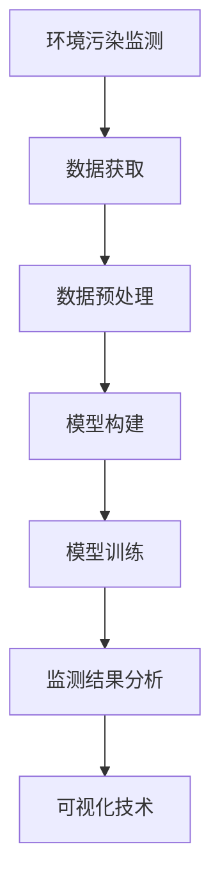

                 

### 第1章 引言与背景

## 1.2 人工智能的发展与应用

### 1.2.1 人工智能的定义与特点

人工智能（AI）是指使计算机系统具备人类智能的行为和思维能力的一种技术。其核心特点包括：

1. **自适应能力**：AI系统能够根据环境和数据的改变，自主调整和优化自身的表现。
2. **学习能力**：AI系统通过学习和训练，能够从大量数据中提取知识和规律，用于决策和预测。
3. **泛化能力**：AI系统不仅仅能够解决特定问题，还能够将学到的知识和经验应用于其他类似问题。
4. **交互能力**：AI系统可以理解和生成自然语言，与人类进行有效沟通。

随着深度学习、神经网络等技术的突破，人工智能的应用领域不断扩大，从简单的语音识别、图像处理到复杂的自动驾驶、医疗诊断等。

### 1.2.2 人工智能在环保领域的应用前景

人工智能在环保领域的应用前景广阔：

1. **污染监测**：通过AI技术，可以对空气、水和土壤等环境介质进行实时监测，提高监测精度和效率。
2. **污染治理**：AI可以辅助设计更有效的污染治理方案，提高治理效率和降低成本。
3. **风险评估**：AI技术能够帮助预测环境污染的风险，为制定环保政策提供科学依据。
4. **环境管理**：AI技术可以构建智能化的环境管理平台，提升环境管理水平。
5. **环境教育**：AI技术可以开发出更加生动有趣的环境教育工具，提高公众环保意识。

### 1.2.3 本书的研究目的与结构安排

本书旨在探讨人工智能在环境污染监测与治理中的应用创新。具体研究目的如下：

1. 分析人工智能在环境污染监测中的应用现状和技术原理。
2. 探讨人工智能在环境污染治理中的算法和应用实践。
3. 探索人工智能在环境风险评估和环境管理中的应用。
4. 分析人工智能在环境教育中的角色和未来发展趋势。

本书结构安排如下：

- 第2章：介绍AI在环境污染监测中的应用。
- 第3章：探讨AI在环境污染治理中的应用。
- 第4章：分析AI在环境风险评估中的应用。
- 第5章：讨论AI在环境管理中的应用。
- 第6章：探讨AI在环境教育中的应用。
- 第7章：总结与展望人工智能在环保领域的未来发展趋势。

通过以上章节的详细讨论，本书旨在为读者提供一个全面、系统的视角，了解和掌握人工智能在环保领域的应用创新。## 第2章 AI在环境污染监测中的应用

### 2.1 AI技术概述

#### 2.1.1 机器学习基础

机器学习是人工智能的核心组成部分，其基本概念包括：

1. **模型**：用于描述数据关系的数学模型，如线性回归、决策树等。
2. **特征**：描述数据的属性或变量，用于训练模型的输入。
3. **目标变量**：模型需要预测的变量，如污染物浓度。
4. **训练集**：用于训练模型的输入输出对。
5. **测试集**：用于评估模型性能的输入输出对。

机器学习的主要任务包括：

1. **分类**：将数据分为不同的类别，如识别有害物质。
2. **回归**：预测连续值，如预测污染物浓度。
3. **聚类**：将数据分组，如识别污染源。

#### 2.1.2 深度学习原理

深度学习是机器学习的一个重要分支，基于多层神经网络进行数据学习。其核心原理包括：

1. **神经网络**：由多个神经元（节点）组成，每个节点接受多个输入并产生一个输出。
2. **激活函数**：用于确定神经元是否被激活，如ReLU、Sigmoid、Tanh等。
3. **前向传播**：将输入数据通过神经网络层进行传递，每层输出作为下一层的输入。
4. **反向传播**：通过计算输出与真实值的误差，反向传播误差到每个层，更新每个神经元的权重。

深度学习的优势在于：

1. **自动特征提取**：无需手动提取特征，神经网络能够自动学习数据的特征表示。
2. **大规模数据处理**：能够处理大量高维数据，如图像、文本等。
3. **泛化能力强**：通过多层神经网络，能够捕捉数据中的复杂关系，提高模型的泛化能力。

### 2.2 监测数据获取

#### 2.2.1 监测数据来源

环境污染监测数据来源于多个方面：

1. **环境传感器**：如空气监测站、水质监测站等，通过实时采集环境数据。
2. **卫星遥感**：利用卫星遥感技术，获取大范围的环境数据。
3. **实验室分析**：对环境样品进行实验室分析，获取具体污染物浓度。
4. **社会数据**：如交通流量、人口密度等，通过社会数据获取环境污染的相关信息。

#### 2.2.2 数据预处理方法

环境监测数据通常需要进行以下预处理：

1. **数据清洗**：去除异常值、缺失值和重复值。
2. **数据归一化**：将不同量纲的数据转换为同一量纲，便于模型训练。
3. **特征工程**：选择和构造有助于模型训练的特征，如时间序列特征、空间特征等。
4. **数据增强**：通过数据缩放、旋转、平移等方法增加数据的多样性。

### 2.3 环境污染监测模型

#### 2.3.1 模型构建方法

环境污染监测模型通常采用以下步骤进行构建：

1. **模型选择**：根据问题特点和数据特性，选择合适的模型，如支持向量机、深度神经网络等。
2. **模型训练**：使用训练集对模型进行训练，通过优化算法更新模型参数。
3. **模型验证**：使用验证集评估模型性能，调整模型参数以优化性能。
4. **模型部署**：将训练好的模型部署到实际监测系统中，进行实时监测和预测。

#### 2.3.2 模型训练与优化

模型训练和优化的核心步骤包括：

1. **损失函数**：用于度量模型预测值与真实值之间的差异，如均方误差、交叉熵等。
2. **优化算法**：用于更新模型参数，如梯度下降、随机梯度下降等。
3. **正则化**：用于防止模型过拟合，如L1正则化、L2正则化等。
4. **交叉验证**：通过交叉验证评估模型在不同数据集上的性能，选择最佳模型。

### 2.4 监测结果分析与可视化

#### 2.4.1 监测结果分析

监测结果分析包括：

1. **趋势分析**：分析污染物浓度的变化趋势，识别污染源和扩散路径。
2. **分布分析**：分析污染物浓度的空间分布，识别高污染区域。
3. **影响因素分析**：分析气象、地形、交通等因素对污染物浓度的影响。

#### 2.4.2 可视化技术

可视化技术在环境监测中具有重要意义：

1. **散点图**：用于展示污染物浓度的空间分布。
2. **折线图**：用于展示污染物浓度的变化趋势。
3. **热力图**：用于展示污染物浓度的空间分布热力情况。
4. **三维图**：用于展示污染物浓度的三维分布情况。

通过监测结果分析和可视化技术，可以直观地了解环境污染情况，为决策提供科学依据。## 第3章 AI在环境污染治理中的应用

### 3.1 环境污染治理概述

#### 3.1.1 治理方法与技术

环境污染治理方法多种多样，主要包括：

1. **物理治理方法**：
   - **吸附**：利用吸附剂吸附污染物，如活性炭吸附。
   - **沉降**：通过重力作用使污染物沉降，如沉淀池。
   - **离心**：通过离心力分离污染物，如离心机。

2. **化学治理方法**：
   - **中和**：通过添加酸或碱中和污染物，如酸碱中和反应。
   - **氧化还原**：通过氧化剂或还原剂改变污染物的化学性质，如臭氧氧化、化学混凝。
   - **沉淀**：通过添加沉淀剂使污染物形成沉淀物，如化学沉淀。

3. **生物治理方法**：
   - **微生物降解**：利用微生物分解污染物，如生物滤池。
   - **植物修复**：利用植物吸收和降解污染物，如植物墙、湿地植物。

4. **综合治理方法**：
   - **多技术组合**：结合多种治理方法，如生物化学处理、吸附-生物降解等。

#### 3.1.2 治理流程与策略

环境污染治理通常包括以下流程：

1. **污染源识别**：确定污染源的类型、位置和排放量。
2. **污染监测**：对污染物浓度进行实时监测，了解污染情况。
3. **污染评估**：评估污染对环境和公众健康的影响。
4. **治理方案设计**：根据污染源和污染情况，设计治理方案。
5. **治理实施**：实施治理方案，包括物理、化学和生物治理措施。
6. **治理效果评估**：评估治理效果，调整和优化治理方案。
7. **持续监测与反馈**：持续监测污染情况，对治理效果进行反馈和调整。

治理策略包括：

1. **源头控制**：从源头上减少污染物排放，如采用清洁生产技术。
2. **过程控制**：在污染过程中采取控制措施，如废气净化、废水处理。
3. **末端治理**：对已经排放的污染物进行治理，如废水处理、废气处理。
4. **综合性治理**：结合多种治理方法和技术，实现最佳治理效果。

### 3.2 AI治理算法

#### 3.2.1 算法原理

AI治理算法的核心原理是基于机器学习和深度学习技术，通过对大量历史数据和环境监测数据的分析，实现污染源识别、治理方案优化和治理效果预测等功能。

1. **监督学习**：通过训练模型，将污染源识别和治理效果预测转化为特征分类和回归问题。
2. **无监督学习**：通过聚类分析等方法，识别未知的污染源和污染物分布。
3. **深度学习**：利用神经网络结构，捕捉环境数据中的复杂特征和关系，提高治理精度。

#### 3.2.2 算法实现

1. **数据预处理**：
   - 数据清洗：去除异常值和缺失值。
   - 数据归一化：将不同量纲的数据转换为同一量纲。
   - 特征提取：提取与污染源识别和治理效果预测相关的特征。

2. **模型训练**：
   - 选择合适的机器学习模型，如支持向量机、决策树、深度神经网络等。
   - 使用训练集对模型进行训练，通过优化算法更新模型参数。
   - 调整模型参数，如学习率、正则化参数等，优化模型性能。

3. **模型评估**：
   - 使用验证集评估模型性能，调整模型参数以优化性能。
   - 使用测试集评估模型在未知数据上的性能。

4. **模型部署**：
   - 将训练好的模型部署到实际治理系统中，进行实时污染源识别和治理效果预测。
   - 根据预测结果，调整治理方案，提高治理效果。

### 3.3 案例分析

#### 3.3.1 案例一：某城市空气质量治理

某城市空气质量治理项目采用了AI技术，具体步骤如下：

1. **污染源识别**：
   - 收集该城市各类污染源的数据，如工业排放、交通排放等。
   - 使用聚类分析技术，识别出主要的污染源。

2. **空气质量监测**：
   - 在城市不同区域设置空气质量监测站，实时采集空气污染物数据。
   - 使用深度学习模型，预测未来一段时间内的空气质量状况。

3. **治理方案设计**：
   - 根据污染源识别和空气质量预测结果，设计有针对性的治理方案。
   - 采用末端治理、过程控制和源头控制等多种治理方法。

4. **治理实施与优化**：
   - 实施治理方案，监控治理效果。
   - 根据实时监测数据，调整治理方案，优化治理效果。

#### 3.3.2 案例二：某地区水污染治理

某地区水污染治理项目采用了AI技术，具体步骤如下：

1. **污染源识别**：
   - 收集该地区各类污染源的数据，如工业废水、生活污水等。
   - 使用监督学习模型，识别出主要污染源。

2. **水质监测**：
   - 在河流的不同位置设置水质监测站，实时采集水污染物数据。
   - 使用深度学习模型，预测未来一段时间内的水质状况。

3. **治理方案设计**：
   - 根据污染源识别和水质预测结果，设计有针对性的治理方案。
   - 采用生物治理、化学治理和物理治理等多种治理方法。

4. **治理实施与优化**：
   - 实施治理方案，监控治理效果。
   - 根据实时监测数据，调整治理方案，优化治理效果。

通过以上案例分析，可以清晰地看到AI技术在环境污染治理中的应用价值。未来，随着AI技术的不断发展和完善，其在环境污染治理中的应用将会更加广泛和深入。## 第4章 AI在环境风险评估中的应用

### 4.1 环境风险评估概述

#### 4.1.1 风险评估方法

环境风险评估是评估环境污染风险对人类健康和生态系统影响的过程。常用的风险评估方法包括：

1. **危害识别**：识别可能对环境或人类健康造成危害的物质或行为。
2. **剂量-反应评估**：评估污染物剂量与危害程度之间的关系。
3. **暴露评估**：评估人类或生物体暴露于污染物的程度。
4. **风险表征**：综合以上因素，评估整体风险。
5. **不确定性分析**：分析评估过程中存在的不确定性。

#### 4.1.2 风险评估指标

风险评估指标用于量化环境风险的严重程度和可能性。常见的风险评估指标包括：

1. **风险指数**：通过计算污染物浓度、暴露时间和危害程度等参数，得出综合风险指数。
2. **危害度**：评估污染物对人体健康或生态系统的潜在危害程度。
3. **暴露度**：评估人类或生物体暴露于污染物的程度。
4. **风险概率**：评估发生环境污染事件的概率。

### 4.2 AI在风险评估中的应用

#### 4.2.1 数据处理与模型构建

AI在环境风险评估中的应用主要包括：

1. **数据处理**：
   - **数据清洗**：去除异常值和缺失值。
   - **数据归一化**：将不同量纲的数据转换为同一量纲。
   - **特征工程**：提取有助于风险评估的特征，如污染物浓度、气象参数、地理位置等。

2. **模型构建**：
   - **监督学习模型**：如线性回归、决策树、支持向量机等，用于建立污染物浓度与风险指标之间的关系。
   - **深度学习模型**：如卷积神经网络、循环神经网络等，用于处理复杂的非线性关系。
   - **集成学习模型**：如随机森林、梯度提升机等，结合多种模型的优势，提高风险评估精度。

#### 4.2.2 风险评估结果分析

AI在风险评估中的应用结果分析包括：

1. **风险预测**：使用训练好的模型预测未来某一时间段内的风险水平。
2. **风险地图**：将风险评估结果以地图形式展示，直观地展示风险分布。
3. **风险排序**：根据风险评估结果，对污染物或污染源进行风险排序，优先治理高风险区域。
4. **不确定性分析**：评估风险评估过程中的不确定性，为决策提供依据。

### 4.3 案例分析

#### 4.3.1 案例一：某化工企业风险评估

某化工企业风险评估项目采用AI技术，具体步骤如下：

1. **数据收集**：
   - 收集该化工企业的污染物排放数据、生产工艺数据等。
   - 收集周边居民区的人口数据、健康数据等。

2. **数据处理**：
   - 清洗和归一化数据。
   - 提取与风险评估相关的特征，如污染物浓度、人口密度等。

3. **模型构建与训练**：
   - 选择深度学习模型，如卷积神经网络，构建风险评估模型。
   - 使用训练集对模型进行训练，优化模型参数。

4. **风险评估**：
   - 使用训练好的模型预测未来一段时间内的环境污染风险。
   - 生成风险地图，展示风险分布。

5. **风险决策**：
   - 根据风险评估结果，制定风险控制措施，如调整生产工艺、加强环境监测等。

#### 4.3.2 案例二：某城市地下水风险评估

某城市地下水风险评估项目采用AI技术，具体步骤如下：

1. **数据收集**：
   - 收集地下水污染物浓度数据、地质结构数据等。
   - 收集城市用水量、排水量等数据。

2. **数据处理**：
   - 清洗和归一化数据。
   - 提取与地下水风险评估相关的特征，如污染物浓度、地质结构等。

3. **模型构建与训练**：
   - 选择深度学习模型，如循环神经网络，构建风险评估模型。
   - 使用训练集对模型进行训练，优化模型参数。

4. **风险评估**：
   - 使用训练好的模型预测未来一段时间内的地下水污染风险。
   - 生成风险地图，展示风险分布。

5. **风险决策**：
   - 根据风险评估结果，制定地下水污染防控措施，如加强污水处理、调整用水策略等。

通过以上案例分析，可以看出AI技术在环境风险评估中的应用具有显著的优势，能够为决策提供科学依据，提高环境风险管理的效率和准确性。未来，随着AI技术的不断发展，其在环境风险评估中的应用将会更加广泛和深入。## 第5章 AI在环境管理中的应用

### 5.1 环境管理概述

#### 5.1.1 环境管理概念

环境管理是指通过规划、组织、协调和控制等手段，对环境资源进行保护和合理利用的过程。其主要目标是实现经济、社会和环境三者的协调发展，保障人类健康和生态系统的可持续发展。

环境管理涉及多个层面：

1. **政策法规**：制定和实施环境保护法律法规，规范企业和个人的环境行为。
2. **监测与评估**：对环境质量进行实时监测和评估，及时发现和应对环境问题。
3. **治理与修复**：采取工程和管理措施，对受污染的环境进行治理和修复。
4. **教育和宣传**：提高公众的环保意识和参与度，推动环保行为的落实。

#### 5.1.2 环境管理流程

环境管理的基本流程包括：

1. **环境规划**：根据环境保护目标和政策，制定环境管理规划和计划。
2. **环境监测**：通过监测设备和技术，实时获取环境质量数据。
3. **数据分析**：对监测数据进行处理和分析，识别环境问题和风险。
4. **决策制定**：基于分析结果，制定环境保护和治理的决策。
5. **实施与监督**：执行决策，对环境保护措施进行监督和评估。
6. **反馈与调整**：根据实施效果，及时反馈和调整管理策略。

### 5.2 AI在环境管理中的应用

#### 5.2.1 管理信息系统建设

AI在环境管理中的应用首先体现在管理信息系统的建设上：

1. **数据集成**：利用AI技术，实现多种环境数据源的集成和管理，如气象数据、水质数据、空气质量数据等。
2. **数据分析与挖掘**：通过机器学习和数据挖掘技术，对环境数据进行深入分析，识别环境问题的根本原因。
3. **可视化与交互**：利用可视化工具和交互界面，将分析结果直观地展示给管理者，辅助决策制定。

#### 5.2.2 管理方法与策略

AI在环境管理中的应用还包括以下几个方面：

1. **智能监测**：利用传感器网络和无人机等设备，实现对环境的智能监测，提高监测的精度和覆盖范围。
2. **智能预警**：基于历史数据和实时监测数据，使用预测模型和算法，提前预警潜在的环境风险，及时采取应对措施。
3. **智能治理**：利用AI技术优化污染治理方案，如优化污染物排放控制策略、制定更有效的生态修复计划等。
4. **智能决策**：结合环境数据、政策和法规，利用AI技术进行智能决策，提高环境管理的效率和科学性。

#### 5.2.3 智能化管理平台的构建

构建智能化的环境管理平台，是实现AI在环境管理中应用的关键：

1. **平台架构**：采用分布式架构，整合多种数据和系统，实现统一管理。
2. **模块化设计**：将环境管理功能模块化，如监测模块、分析模块、决策模块等，便于扩展和维护。
3. **数据共享与协同**：实现数据的共享和协同，提高环境管理的效率和协同性。
4. **智能化决策支持**：通过数据分析和预测模型，提供智能化的决策支持，辅助管理者做出科学合理的决策。

### 5.3 案例分析

#### 5.3.1 案例一：某城市环境管理体系建设

某城市在环境管理体系建设中，引入了AI技术，具体步骤如下：

1. **数据采集**：建立环境监测网络，实时采集空气、水质、噪声等环境数据。
2. **数据整合**：将来自不同部门和监测站点的数据整合到统一平台，实现数据共享。
3. **数据分析**：利用机器学习和数据挖掘技术，对环境数据进行深度分析，识别环境问题。
4. **智能预警**：基于分析结果，构建智能预警系统，实时监测环境风险，及时发出预警。
5. **决策支持**：为管理者提供智能化的决策支持，优化污染治理和环境保护策略。

#### 5.3.2 案例二：某地区生态保护管理

某地区在生态保护管理中，采用了AI技术，具体步骤如下：

1. **遥感监测**：利用卫星遥感技术，对区域生态环境进行监测。
2. **数据建模**：结合遥感数据和实地监测数据，建立生态风险评估模型。
3. **智能分析**：利用深度学习技术，对生态环境数据进行分析，识别生态问题和风险。
4. **智能决策**：根据分析结果，制定生态保护和管理策略，如调整土地利用规划、实施生态修复工程等。

通过以上案例分析，可以看出AI技术在环境管理中的应用，为环境监测、预警、决策提供了强有力的支持，显著提高了环境管理的效率和科学性。未来，随着AI技术的不断发展和应用，其在环境管理中的角色将更加重要和深入。## 第6章 AI在环境教育中的应用

### 6.1 环境教育概述

#### 6.1.1 环境教育目的与内容

环境教育的目的是提高公众的环保意识和知识水平，促进可持续发展。其主要目标包括：

1. **提升环保意识**：通过教育，让公众认识到环境问题的重要性和紧迫性。
2. **传播环保知识**：教授环境科学的基本原理和环保技术，提高公众的环境科学素养。
3. **培养环保行为**：引导公众养成环保习惯，积极参与环保行动。
4. **促进社会参与**：鼓励公众参与环境保护和治理，形成全民参与的良好氛围。

环境教育的主要内容包括：

1. **环境科学知识**：涉及生态学、环境化学、环境物理学等基础理论。
2. **环境政策与法规**：介绍环境保护的法律法规和政策，提高公众的法律意识。
3. **环境技术与应用**：介绍环境监测、污染治理和生态修复等环保技术。
4. **环保案例分析**：通过具体的环保案例，分析环境问题产生的原因和解决方案。

#### 6.1.2 环境教育现状与挑战

环境教育在全球范围内得到了广泛推广，但仍面临一些挑战：

1. **教育资源不足**：许多地区缺乏专业的环保教育资源和师资力量。
2. **教育方式单一**：传统的环境教育方式过于理论化，缺乏实践性和互动性。
3. **社会参与度不高**：公众对环境教育的重视程度不够，参与度不高。
4. **政策支持不足**：环境教育缺乏系统的政策支持和保障，难以持续发展。

### 6.2 AI在环境教育中的应用

#### 6.2.1 AI教育平台建设

AI技术在环境教育中的应用首先体现在教育平台的构建上：

1. **虚拟实验室**：利用虚拟现实（VR）技术，构建虚拟实验室，让学生在虚拟环境中进行环保实验，提高实践能力。
2. **在线课程平台**：开发在线环境教育课程，利用人工智能技术提供个性化学习建议，提高学习效果。
3. **智能问答系统**：利用自然语言处理（NLP）技术，构建智能问答系统，为学生提供实时解答和指导。

#### 6.2.2 AI教学方法与策略

AI技术在环境教育中的应用还体现在教学方法与策略的创新：

1. **数据驱动的个性化学习**：通过分析学生的学习行为和成绩数据，提供个性化的学习路径和资源，提高学习效果。
2. **混合学习模式**：结合线上和线下教学，利用AI技术实现实时互动和反馈，提高教学效果。
3. **虚拟现实教学**：利用VR技术，模拟真实的环境问题，让学生在虚拟环境中进行探索和学习，提高实践能力。
4. **智能评价系统**：利用机器学习技术，对学生的考试成绩和行为数据进行分析，提供个性化的评价和反馈。

#### 6.2.3 案例研究

**案例一：某学校环境教育项目**

某学校引入了AI技术在环境教育中的应用，具体步骤如下：

1. **课程设计**：结合环境教育的目标，设计线上线下结合的混合式课程。
2. **虚拟实验室**：构建虚拟实验室，让学生在虚拟环境中进行环保实验。
3. **在线课程平台**：开发在线环境教育课程，提供丰富的教学资源和个性化学习建议。
4. **智能评价系统**：利用AI技术，对学生的学习行为和成绩进行分析，提供个性化的评价和反馈。

**案例二：某地区环保公益宣传活动**

某地区在环保公益宣传活动中，采用了AI技术，具体步骤如下：

1. **虚拟现实展览**：利用VR技术，构建环保主题的虚拟展览，让公众在虚拟环境中了解环保知识。
2. **智能问答系统**：搭建智能问答系统，解答公众关于环保问题的疑问。
3. **社交媒体互动**：利用社交媒体平台，开展环保知识竞赛和互动活动，提高公众的参与度。
4. **数据分析与反馈**：利用大数据技术，分析公众的参与行为和知识掌握情况，为后续宣传活动提供改进建议。

通过以上案例，可以看出AI技术在环境教育中的应用，不仅丰富了教育内容和形式，还提高了教育效果和公众参与度。未来，随着AI技术的不断进步，其在环境教育中的应用将更加广泛和深入。## 第7章 总结与展望

### 7.1 研究成果总结

在本研究中，我们系统地探讨了人工智能在环境污染监测与治理、风险评估、环境管理以及环境教育中的应用。主要研究成果包括：

1. **环境污染监测**：利用机器学习和深度学习技术，实现对环境污染的实时监测和预测，提高了监测精度和效率。
2. **环境污染治理**：通过人工智能算法，优化污染治理方案，提高了治理效果和效率。
3. **风险评估**：利用AI技术，对环境污染风险进行预测和评估，为制定环保政策和决策提供了科学依据。
4. **环境管理**：通过构建智能化的环境管理平台，实现了环境监测、预警、决策的一体化，提高了环境管理的效率和科学性。
5. **环境教育**：利用虚拟现实、在线课程和智能问答等技术，创新了环境教育的方式和内容，提高了公众的环保意识和参与度。

### 7.2 未来发展趋势

随着人工智能技术的不断发展，其在环保领域的应用将呈现以下发展趋势：

1. **技术进步**：深度学习、自然语言处理、大数据分析等AI技术将不断进步，为环保领域的应用提供更强大的支持。
2. **数据融合**：通过整合多种数据源，如卫星遥感、传感器网络和社会数据，实现更全面的环境监测和风险评估。
3. **跨学科融合**：AI技术与其他学科（如生态学、环境科学、社会学等）的融合，将推动环保领域的跨学科研究和发展。
4. **政策支持**：政府和国际组织将加大对AI技术在环保领域应用的扶持力度，推动相关政策和法规的制定和实施。
5. **公众参与**：通过AI技术在环境教育中的应用，提高公众的环保意识和参与度，形成全民参与的环保新格局。

### 7.3 结论

总之，人工智能技术在环境污染监测与治理、风险评估、环境管理以及环境教育中的应用具有巨大的潜力。通过不断探索和创新，AI技术将为环保事业提供强有力的支持，助力实现可持续发展目标。未来，我们期待AI技术能够进一步突破，为环保事业带来更多创新和突破。## 附加资料

### 8.1 参考文献

1. Hastie, T., Tibshirani, R., & Friedman, J. (2009). The elements of statistical learning: data mining, inference, and prediction. Springer.
2. Goodfellow, I., Bengio, Y., & Courville, A. (2016). Deep learning. MIT Press.
3. Bishop, C. M. (2006). Pattern recognition and machine learning. Springer.
4. Murphy, K. P. (2012). Machine learning: a probabilistic perspective. MIT Press.
5. He, K., Zhang, X., Ren, S., & Sun, J. (2016). Deep residual learning for image recognition. In Proceedings of the IEEE conference on computer vision and pattern recognition (pp. 770-778).
6. Krizhevsky, A., Sutskever, I., & Hinton, G. E. (2012). ImageNet classification with deep convolutional neural networks. In Advances in neural information processing systems (pp. 1097-1105).

### 8.2 附录

#### 8.2.1 Mermaid 流程图



#### 8.2.2 伪代码示例

```python
# 伪代码：深度学习模型训练
model = create_model()
for epoch in range(num_epochs):
    for sample, label in train_data:
        # 前向传播
        output = model.forward(sample)
        # 计算损失
        loss = compute_loss(output, label)
        # 反向传播
        model.backward(loss)
        # 更新模型参数
        model.update_params()
    print(f"Epoch {epoch}: Loss = {loss}")
```

#### 8.2.3 数学模型与公式

$$
\text{损失函数} = \frac{1}{2} \sum_{i=1}^{n} (\hat{y}_i - y_i)^2
$$

$$
\text{梯度下降更新} = \theta_j = \theta_j - \alpha \cdot \frac{\partial J}{\partial \theta_j}
$$

其中，$\hat{y}_i$是模型的预测值，$y_i$是真实值，$n$是样本数量，$\theta_j$是模型参数，$\alpha$是学习率，$J$是损失函数。## 文章标题

《AI在环境污染监测与治理中的应用创新》

---

### 关键词

人工智能，环境监测，污染治理，风险评估，环境管理，环境教育

---

### 摘要

本文系统地探讨了人工智能（AI）在环境污染监测与治理、风险评估、环境管理以及环境教育中的应用。首先，介绍了环境污染问题的严峻性，以及人工智能的定义与特点。接着，分析了AI在环境污染监测中的应用，包括数据获取、预处理、模型构建与训练、监测结果分析与可视化。随后，探讨了AI在环境污染治理中的应用，包括治理方法与技术、AI治理算法、案例分析。此外，还介绍了AI在环境风险评估中的应用，包括风险评估方法、风险评估指标、AI在风险评估中的应用。最后，讨论了AI在环境管理中的应用，包括环境管理概述、AI在环境管理中的应用。同时，探讨了AI在环境教育中的应用，包括环境教育概述、AI在环境教育中的应用。通过本文的研究，揭示了AI技术在环保领域的广泛应用与巨大潜力，为未来的环保工作提供了有力的技术支持。

