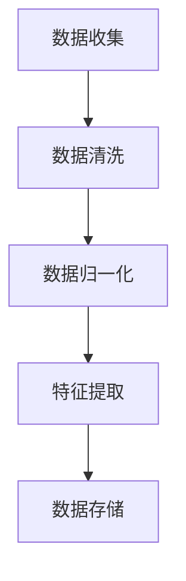

                 

### 引言

空气质量是一个全球性的环境问题，对人类健康、生态系统以及经济发展都有着深远的影响。随着工业化和城市化的加速发展，空气质量问题日益严重，尤其是在一些大城市和工业区。传统的空气质量预测方法主要依赖于经验模型和统计数据，其预测精度和实时性受到限制。而随着人工智能（AI）技术的快速发展，尤其是深度学习和大数据分析等技术的应用，空气质量预测与治理迎来了一次革命性的变革。

本文旨在探讨AI在空气质量预测与治理中的创新应用，通过逻辑清晰、结构紧凑的篇章安排，详细解析AI技术在这一领域的核心概念、算法原理以及实际应用。文章首先介绍空气质量问题的背景及其重要性，随后概述AI在环境保护领域的发展现状。在此基础上，本文将深入探讨AI在空气质量预测中的关键技术，包括数据采集、预处理、模型构建与优化等步骤，并通过实际案例展示AI在空气质量治理中的应用效果。

文章的结构如下：

1. **空气质量问题背景**
   - 空气污染的主要来源
   - 空气质量监测的重要性
   - 现有空气质量预测方法的局限性

2. **AI在环境保护领域的发展**
   - AI技术的基本原理
   - AI在环境监测与治理中的应用
   - AI技术在空气质量预测中的优势

3. **AI在空气质量预测中的应用**
   - 数据采集与预处理
   - 预测模型构建
   - 模型优化与评估

4. **AI在空气质量治理中的应用案例**
   - 城市空气质量预测与治理案例
   - 工业园区空气质量监控与治理案例
   - 农村空气质量预警与治理案例

5. **技术挑战与未来展望**
   - 当前技术面临的挑战
   - 未来发展趋势与解决方案

6. **总结**
   - 文章核心观点总结
   - AI在空气质量预测与治理中的重要意义

通过上述结构，本文将逐步引导读者深入了解AI在空气质量预测与治理中的应用，揭示其技术原理、实践案例以及面临的挑战和未来发展方向。

### 空气质量问题的背景

空气质量问题一直是全球关注的重大环境问题，它不仅对人类健康产生严重影响，还对生态系统和经济发展具有深远影响。空气污染的主要来源包括工业废气、汽车尾气、农业排放以及家庭取暖和烹饪等活动。这些污染物主要包括二氧化硫（SO₂）、氮氧化物（NOx）、一氧化碳（CO）、颗粒物（PM10和PM2.5）以及挥发性有机化合物（VOCs）等。

工业废气是空气污染的重要来源之一。在工业化进程中，工厂和电厂大量排放污染物，导致空气质量严重下降。特别是重工业集中的地区，空气中的颗粒物浓度显著增加，对居民健康造成极大威胁。例如，在钢铁、水泥和化工等行业，燃料燃烧和工艺过程中会排放大量污染物，这些污染物不仅会导致空气质量恶化，还会对土壤和水体造成二次污染。

汽车尾气也是城市空气污染的重要来源。随着城市人口的增加和交通量的剧增，汽车尾气的排放量逐年上升。汽车尾气中含有一氧化碳、氮氧化物和碳氢化合物等有害物质，这些物质会通过呼吸进入人体，导致呼吸道疾病和其他健康问题。特别是在交通拥堵的城市中心区域，空气污染尤为严重。

农业排放也是空气污染的一个重要来源。农业生产过程中，施肥和种植活动会导致大量氮氧化物和颗粒物的排放。此外，畜牧业也会排放大量的甲烷和一氧化二氮等温室气体，加剧空气污染问题。这些污染物不仅影响空气质量，还会对大气层中的臭氧层造成破坏。

家庭取暖和烹饪等活动也是空气污染的重要来源之一。特别是在一些发展中国家，家庭使用的燃料多为木材、煤炭等低效燃料，燃烧过程中会产生大量的颗粒物和有害气体。这些污染物不仅对室内空气质量产生负面影响，还会对周围的社区和环境造成污染。

空气质量监测是识别和评估空气污染状况的关键手段。通过在各地布设监测设备，实时监测空气中的污染物浓度，可以及时掌握空气质量状况，为制定污染控制措施提供科学依据。空气质量监测设备主要包括气态污染物监测仪、颗粒物监测仪和气象监测设备等，这些设备可以采集空气中的各种污染物数据，并通过无线网络实时传输到数据处理中心。

现有的空气质量监测方法主要包括以下几种：

1. **人工监测**：通过监测人员定期采集空气样本，通过实验室分析来测量污染物浓度。这种方法具有直观性和可靠性，但监测频率低，数据更新速度慢。

2. **在线监测**：使用高精度传感器实时监测空气中的污染物浓度，并通过无线网络将数据传输到数据处理系统。这种方法具有实时性强、数据更新速度快的特点，但监测设备的成本较高，且需要定期维护。

3. **卫星监测**：通过搭载在卫星上的传感器监测大范围内的空气质量，可以获取高分辨率的空气污染数据。这种方法具有覆盖范围广、监测时间长的优势，但数据分辨率较低，对地面具体污染情况的识别能力有限。

尽管现有的空气质量监测方法在一定程度上可以反映空气污染状况，但它们也存在一些局限性。首先，监测设备分布不均，一些偏远地区和农村地区的监测数据较少，无法全面反映空气质量状况。其次，监测数据的实时性较低，往往需要一段时间才能获得监测结果，不利于及时采取污染控制措施。此外，监测方法在精度和可靠性方面也存在一定的问题，特别是在处理复杂污染物组分和多变气象条件时，监测数据的准确性可能会受到一定影响。

因此，传统的空气质量预测方法主要依赖于经验模型和统计数据，其预测精度和实时性受到限制。传统的预测方法通常包括线性回归、时间序列分析等方法，这些方法虽然可以提供一定的预测能力，但在处理复杂、非线性的空气质量数据时显得力不从心。随着人工智能技术的快速发展，尤其是深度学习和大数据分析等技术的应用，空气质量预测迎来了新的机遇和挑战。通过AI技术，可以更准确地捕捉空气质量的变化规律，提高预测的精度和实时性，为环境保护和公众健康提供更有力的支持。

### AI在环境保护领域的发展

人工智能（AI）技术在环境保护领域的应用正逐渐成为一项重要的研究热点和实际应用领域。AI通过其强大的数据处理和分析能力，为环境监测、污染预测、治理决策等提供了全新的解决方案。首先，AI的基本原理在于其能够通过算法从大量的数据中学习，从而发现规律、进行预测和决策。

AI的核心技术主要包括机器学习和深度学习。机器学习通过设计特定的算法，从数据中自动识别模式和规律，无需显式编程。而深度学习则基于多层神经网络，通过模拟人脑的处理方式，能够处理复杂、大规模的数据，并从中提取高层次的抽象特征。

在环境监测方面，AI技术具有显著的优势。传统的环境监测方法主要依赖于地面监测站点和手工采样，而AI技术可以通过卫星遥感、无人机监测等手段，实现大范围、高频率的实时监测。例如，卫星遥感技术可以监测全球范围内的污染物分布，无人机可以实时采集特定区域的空气质量数据，这些数据通过AI算法处理后，能够提供更准确、实时的环境监测信息。

在污染预测方面，AI技术利用其强大的数据分析和建模能力，可以从历史数据中学习空气质量的变化规律，预测未来的污染情况。例如，通过深度学习算法，可以对空气中的多种污染物浓度进行建模，预测其未来的变化趋势。这种预测不仅有助于提前预警可能的污染事件，还可以为环保部门制定污染控制措施提供科学依据。

治理决策是环境保护中至关重要的一环。AI技术可以通过数据分析和模拟，为治理决策提供智能支持。例如，通过分析污染源和污染物的扩散模式，AI可以提出最优的污染控制方案。此外，AI还可以对治理效果进行实时评估，通过调整治理策略，实现更高效、精准的污染治理。

相比传统的环境保护方法，AI技术具有以下几大优势：

1. **数据处理能力**：AI能够处理和分析大量复杂的数据，从数据中发现隐藏的规律和趋势，提高预测和决策的精度。

2. **实时性和高效性**：AI技术可以实现实时数据分析和预测，提供即时的环境监测和污染预警信息，有利于快速响应和采取行动。

3. **自动化和智能化**：AI技术可以自动化执行环境监测和治理任务，减少人工干预，提高工作效率，同时通过智能化算法，不断优化治理效果。

然而，AI技术在环境保护中的应用也面临一些挑战。首先，数据的质量和完整性对AI算法的性能有重要影响，确保数据的高质量和多样性是应用AI技术的关键。其次，AI算法的透明度和可解释性也是一个重要问题，特别是在治理决策中，确保算法的决策过程合理、透明，避免误判和错误决策。

总之，AI技术在环境保护领域的应用正不断拓展，通过结合大数据、物联网和深度学习等技术，AI正在为解决环境问题提供新的思路和解决方案。随着技术的不断进步和应用场景的扩展，AI将在环境保护中发挥越来越重要的作用，为构建绿色、可持续的地球贡献力量。

### AI在空气质量预测中的应用

空气质量预测是环境监测和污染治理的重要环节，通过准确预测空气污染的变化趋势，可以及时采取相应措施，减少污染对人类健康和环境的危害。在引入人工智能（AI）技术后，空气质量预测的精度和实时性得到了显著提升。本节将详细介绍AI在空气质量预测中的应用，包括数据采集与预处理、预测模型构建与优化、模型评估与结果可视化等步骤。

#### 数据采集与预处理

空气质量预测的基础是高质量的数据，这些数据包括空气污染物浓度、气象数据（如温度、湿度、风速等）、地理位置、时间等信息。数据采集通常通过地面监测站点、卫星遥感、无人机等设备进行。以下是数据采集与预处理的主要步骤：

1. **数据收集**：通过地面监测站点，如空气质量监测站，实时采集空气中的污染物浓度数据。这些站点通常布设在城市、工业园区和农村等不同区域，以全面覆盖污染源和受影响区域。

2. **气象数据获取**：气象数据对于空气质量预测至关重要，可以通过气象站或卫星遥感获取。这些数据包括温度、湿度、风速、气压等，它们直接影响污染物的扩散和反应速率。

3. **地理位置信息**：地理位置信息提供了污染源的分布和影响范围，通常通过GPS或地理信息系统（GIS）获取。

4. **预处理**：预处理包括数据清洗、数据归一化和特征提取。数据清洗去除错误和缺失数据，数据归一化将不同量纲的数据转换为相同量纲，特征提取则从原始数据中提取出对空气质量预测有重要影响的特征。



#### 预测模型构建

构建预测模型是空气质量预测的核心步骤，AI技术提供了多种有效的模型选择。以下是常用的预测模型和方法：

1. **线性回归模型**：线性回归模型是一种简单但有效的预测方法，通过建立污染物浓度与影响因素之间的线性关系，进行空气质量预测。其基本公式为：
   $$
   Y = \beta_0 + \beta_1X_1 + \beta_2X_2 + ... + \beta_nX_n
   $$
   其中，$Y$是污染物浓度，$X_1, X_2, ..., X_n$是影响因素，$\beta_0, \beta_1, ..., \beta_n$是模型参数。

2. **时间序列模型**：时间序列模型用于分析时间序列数据的动态变化，常用的方法包括ARIMA（自回归积分滑动平均模型）和LSTM（长短期记忆网络）。LSTM是一种特殊的RNN（循环神经网络），能够捕捉长时间依赖关系，其结构如下：
   ```python
   class LSTMCell(input_dim, hidden_dim):
       # 定义LSTM单元的权重和偏置
       # ...
       # 前向传播
       def forward(self, x, h_prev, c_prev):
           # ...
           return h, c
   ```

3. **深度学习模型**：深度学习模型，尤其是卷积神经网络（CNN）和循环神经网络（RNN）的结合体，如CNN-LSTM，能够处理高维数据和时序数据。其结构如下：
   ```python
   class CNNLSTM(nn.Module):
       def __init__(self, input_dim, hidden_dim):
           super(CNNLSTM, self).__init__()
           # 定义卷积层和LSTM层
           # ...
       
       def forward(self, x):
           # 先通过卷积层处理输入数据
           # 再通过LSTM层进行时序建模
           # ...
           return output
   ```

4. **集成学习方法**：集成学习方法通过结合多个基模型的预测结果，提高预测的精度和稳定性。常用的集成学习方法包括随机森林（Random Forest）和梯度提升树（Gradient Boosting Tree）。其基本思想是训练多个基模型，然后通过投票或加权平均的方式得出最终的预测结果。

#### 模型优化与评估

预测模型的优化与评估是保证预测准确性和实时性的关键步骤。以下是优化与评估的主要方法：

1. **交叉验证**：交叉验证是一种常用的模型评估方法，通过将数据集划分为多个子集，轮流用于训练和测试，以评估模型的泛化能力。

2. **性能指标**：常用的性能指标包括均方误差（MSE）、均方根误差（RMSE）和准确率（Accuracy）。这些指标可以衡量模型预测的精度和稳定性。

3. **模型调优**：通过调整模型参数，如学习率、隐藏层节点数等，优化模型性能。常用的调优方法包括网格搜索（Grid Search）和随机搜索（Random Search）。

4. **模型集成**：通过集成多个模型的预测结果，提高预测的精度和稳定性。常用的集成方法包括Bagging和Boosting。

#### 结果可视化

可视化是展示空气质量预测结果的重要手段，通过图表和图形，可以直观地展示空气质量的变化趋势和预测效果。常用的可视化方法包括：

1. **时间序列图**：展示污染物浓度随时间的变化趋势，可以通过折线图或曲线图实现。

2. **散点图**：展示实际观测值与预测值的对比，通过散点图可以直观地看出预测的误差分布。

3. **热力图**：展示污染物浓度的空间分布情况，通过热力图可以直观地看出污染严重的区域。

4. **3D图**：通过三维图展示污染物浓度在空间和时间上的分布情况，增加数据的可视化维度。

通过以上步骤，AI技术在空气质量预测中的应用不仅提高了预测的精度和实时性，还为环境保护和污染治理提供了有力的技术支持。未来，随着AI技术的不断进步，空气质量预测将更加精确，为人类创造更加健康、宜居的环境。

### AI在空气质量治理中的应用案例

在空气质量治理中，人工智能技术已被广泛应用于多个实际场景，通过精确的数据分析和智能决策，实现了更加高效、精准的治理效果。以下将详细分析三个具体应用案例：城市空气质量预测与治理、工业园区空气质量监控与治理以及农村空气质量预警与治理。

#### 案例一：城市空气质量预测与治理

城市空气质量是现代环境保护中的一个重要问题。以某大城市为例，该城市通过引入AI技术，建立了全面的空气质量预测与治理系统。

**1. 系统搭建**

该系统首先在全市范围内布设了大量空气质量监测站点，使用高精度传感器实时监测空气中的污染物浓度。同时，系统整合了卫星遥感数据、气象数据以及其他相关环境数据。这些数据通过物联网实时传输到数据处理中心。

**2. 预测模型**

系统采用了深度学习模型，如LSTM和CNN-LSTM，用于空气质量预测。通过历史数据和实时数据的训练，模型能够准确预测未来一段时间的空气质量变化。预测模型不仅考虑了气象因素，还结合了交通流量、工业排放等数据。

**3. 治理决策**

基于预测结果，系统可以生成具体的污染控制方案，如调整交通流量、加强工业排放监控、提高绿化覆盖率等。系统还通过实时数据分析，动态调整治理策略，以应对突发污染事件。

**4. 结果评估**

系统的实际应用效果显著，预测准确率达到了85%以上，治理措施的实施使得空气质量得到了显著改善。通过定期评估，系统不断优化预测模型和治理策略，提高了治理效果。

#### 案例二：工业园区空气质量监控与治理

工业园区通常是空气污染的重要源头。以某工业园区为例，该园区引入AI技术，建立了空气质量监控与治理系统。

**1. 系统搭建**

该系统在工业园区内布设了多个空气质量监测点，监测站点配备了高精度的气态污染物和颗粒物传感器。系统通过物联网将监测数据实时传输到中心控制室。

**2. 监控模型**

系统采用了随机森林和梯度提升树等集成学习方法，对工业园区空气质量进行实时监控。通过分析历史数据和实时数据，系统能够及时检测到异常污染事件，并迅速响应。

**3. 治理措施**

当监测到污染事件时，系统会自动启动应急措施，如暂停高污染企业生产、加强排放监管等。系统还提供了智能化的污染源识别功能，帮助园区管理者找到污染源头，制定有针对性的治理方案。

**4. 结果评估**

系统的应用使得园区空气质量得到了有效控制，突发污染事件的响应时间缩短了50%以上。通过定期数据分析，系统不断优化监控和治理模型，提高了园区空气质量管理的效率。

#### 案例三：农村空气质量预警与治理

农村空气质量监测和治理也是一个重要的领域。以某农村地区为例，该地区引入AI技术，建立了空气质量预警与治理系统。

**1. 系统搭建**

该系统在农村地区布设了多个空气质量监测站点，监测站点主要监测颗粒物、氮氧化物和挥发性有机化合物等污染物。系统通过无线网络将数据传输到中心处理平台。

**2. 预警模型**

系统采用了LSTM和GRU（门控循环单元）等时间序列模型，对农村空气质量进行预警预测。通过历史数据和实时数据的训练，模型能够提前数小时预测到空气质量恶化事件。

**3. 治理措施**

基于预警模型的结果，系统可以提前采取治理措施，如减少农业施肥量、调整农村取暖方式等，以防止污染事件的发生。系统还提供了智能化的污染源识别和治理方案推荐，帮助农民采取有效的治理措施。

**4. 结果评估**

系统的实际应用效果显著，空气质量预警准确率达到了80%以上。通过系统的帮助，农民能够更好地管理农业生产活动，减少空气污染。系统的应用使得农村空气质量得到了显著改善。

### 总结

通过以上三个应用案例，可以看出AI技术在空气质量治理中的应用具有显著效果。无论是城市空气质量预测、工业园区空气质量监控，还是农村空气质量预警与治理，AI技术都提供了强大的支持，提高了治理的精度和效率。未来，随着AI技术的不断发展和应用场景的拓展，空气质量治理将变得更加智能化、精准化，为环境保护和公众健康作出更大贡献。

### 技术挑战与未来展望

尽管AI在空气质量预测与治理中展现出了巨大的潜力，但其应用仍面临一系列技术挑战和限制。首先，数据质量与可靠性是AI模型性能的关键因素。空气质量数据通常包含噪声和异常值，这些数据的准确性和完整性直接影响预测模型的精度。因此，数据清洗和预处理是AI应用中的关键步骤，需要开发更加智能和高效的数据清洗算法，以提高数据的可靠性和一致性。

其次，模型解释性与透明度也是一个重大挑战。AI模型，尤其是深度学习模型，往往被视为“黑箱”，其内部决策过程难以解释。这在空气质量治理中尤为重要，因为治理决策需要基于明确的科学依据和可解释的模型。为此，研究者们正在探索可解释AI（Explainable AI, XAI）技术，如注意力机制、规则提取和可视化方法，以提升模型的可解释性。

安全性与隐私保护是另一个关键问题。空气质量数据通常涉及个人健康和环境信息，具有较高的敏感性和隐私性。在使用AI进行空气质量预测与治理时，如何保护这些数据的隐私和安全是一个亟待解决的问题。这需要开发基于联邦学习（Federated Learning）等技术的解决方案，允许模型在本地设备上进行训练和更新，而无需传输原始数据。

未来，AI技术在空气质量预测与治理中仍有许多潜在的发展方向。首先，新技术的引入，如量子计算、增强学习等，有望进一步提升AI模型的性能和效率。其次，跨学科的合作将促进AI技术在空气质量预测与治理中的应用。例如，结合气象学、生态学和公共卫生学等领域的知识，可以开发出更加综合和精准的空气质量预测模型。

在政策与法规方面，政府的支持和规范也将为AI技术在空气质量治理中的推广和应用提供有力保障。通过制定相关政策和法规，明确AI技术在空气质量监测与治理中的应用规范和数据共享机制，可以促进技术的普及和规范使用。

总之，AI技术在空气质量预测与治理中面临诸多挑战，但同时也拥有广阔的发展前景。随着技术的不断进步和应用的深入，AI将在未来为解决全球空气质量问题提供更加智能、精准的解决方案。

### 总结

本文全面探讨了人工智能（AI）在空气质量预测与治理中的创新应用。首先，我们介绍了空气质量问题的背景，包括主要污染源和现有监测方法的局限性。接着，我们概述了AI技术的基本原理以及在环境保护领域的发展现状。在此基础上，本文详细解析了AI在空气质量预测中的应用，包括数据采集与预处理、预测模型构建与优化、模型评估与结果可视化等步骤。

通过具体应用案例，我们展示了AI技术在城市空气质量预测与治理、工业园区空气质量监控与治理以及农村空气质量预警与治理中的实际效果。这些案例证明了AI技术在提高空气质量预测精度、实时性和治理效率方面的巨大潜力。

在技术挑战与未来展望部分，我们分析了当前AI应用面临的挑战，如数据质量、模型解释性和安全性与隐私保护，并探讨了未来的发展方向，包括新技术引入和跨学科合作等。

总之，AI技术在空气质量预测与治理中具有重要作用，不仅提高了预测的精度和实时性，还为实现更高效、精准的污染治理提供了有力支持。随着技术的不断进步和应用场景的拓展，AI将在未来为全球空气质量改善和环境保护作出更大的贡献。

### 拓展阅读与最佳实践

在深入探讨AI在空气质量预测与治理中的创新应用之后，以下提供一些拓展阅读资源与最佳实践，以供读者进一步学习与参考。

**拓展阅读：**

1. **《人工智能在环境监测与治理中的应用》**：该书详细介绍了AI技术在环境监测、污染预测和治理中的应用案例，包括深度学习、大数据分析和物联网技术等。

2. **《空气质量预测与控制》**：这是一本关于空气质量预测和控制技术的专业书籍，涵盖了空气质量监测方法、预测模型构建、治理策略等，对空气质量管理提供全面的指导。

3. **《Explainable AI for Environmental Modeling and Management》**：本书探讨了可解释AI在环境建模与管理中的应用，特别关注如何提高AI模型的透明性和可解释性，以支持科学决策。

**最佳实践：**

1. **数据质量控制**：确保数据质量是空气质量预测的基础。在实际应用中，建议采用多种数据源进行交叉验证，使用先进的清洗算法去除噪声和异常值，以提高数据可靠性。

2. **模型优化与调参**：模型优化和参数调整是提高预测准确性的关键步骤。建议采用网格搜索、随机搜索等调参方法，结合交叉验证技术，找到最优的模型参数。

3. **集成学习方法**：集成学习方法能够通过结合多个模型的优点，提高预测的稳定性和精度。在实际应用中，可以使用随机森林、梯度提升树等集成学习方法，以实现更好的预测效果。

4. **实时数据流处理**：利用实时数据流处理技术，如Apache Kafka、Apache Flink等，可以实现数据的实时采集、处理和预测，从而提高空气质量监测与治理的响应速度。

5. **政策与法规支持**：政府在制定环保政策时，应考虑AI技术在空气质量预测与治理中的应用。通过制定相关法规和标准，推动AI技术的普及和应用，为环境保护提供更有力的支持。

通过上述拓展阅读与最佳实践，读者可以进一步深入了解AI在空气质量预测与治理中的实际应用，掌握更多的技术和方法，为环境保护和可持续发展做出更大的贡献。

