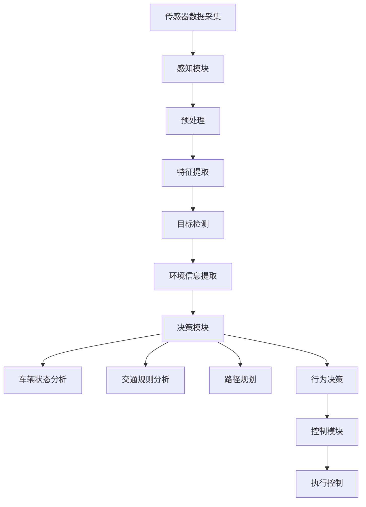

                 

## 文章标题

# AI在自动驾驶技术中的感知与决策应用

## 关键词

- 自动驾驶
- 人工智能
- 感知
- 决策
- 强化学习
- 卷积神经网络
- 激光雷达

## 摘要

本文将深入探讨人工智能（AI）在自动驾驶技术中的应用，重点关注感知与决策两大核心模块。通过分析感知模块中的视觉感知与激光雷达感知技术原理，以及决策模块中的深度强化学习算法，我们将展示AI在自动驾驶中的实际应用案例，并通过项目实战深入剖析感知与决策的实现过程。此外，本文还将提供一些最佳实践和注意事项，帮助读者更好地理解和应用AI技术于自动驾驶领域。

## 目录大纲设计思路

在为本文设计目录大纲时，我们遵循了以下几个关键点：

1. **整体架构**：确保文章结构清晰，从基础概念到应用实践，层层递进，内容全面。
2. **核心概念**：详细解释感知与决策的基本概念，并展示它们之间的关联。
3. **技术原理**：通过伪代码和数学模型讲解核心算法原理，确保读者理解。
4. **实践应用**：提供实际案例和代码示例，以帮助读者将理论应用于实践。
5. **拓展内容**：介绍相关工具和资源，拓展读者的知识视野。

### 目录大纲

#### 第一部分：AI在自动驾驶技术中的基础

##### 第1章：AI在自动驾驶技术概述

- **1.1 自动驾驶技术概述**
  - **1.1.1 自动驾驶的定义与发展历程**
  - **1.1.2 自动驾驶技术的分类**

##### 第2章：AI核心概念与联系

- **2.1 AI在自动驾驶中的应用**
  - **2.1.1 感知与决策的基本概念**
  - **2.1.2 感知与决策的架构**
  - **2.1.3 感知与决策的Mermaid流程图**

##### 第3章：核心算法原理讲解

- **3.1 感知算法原理**
  - **3.1.1 视觉感知**
    - **3.1.1.1 卷积神经网络（CNN）的伪代码解释**
  - **3.1.2 激光雷达感知**
    - **3.1.2.1 特征点检测算法**
  - **3.1.3 感知算法的数学模型与公式**

- **3.2 决策算法原理**
  - **3.2.1 深度强化学习（DRL）的基本原理**
  - **3.2.2 决策算法的数学模型与公式**
  - **3.2.3 DRL算法的伪代码解释**

#### 第二部分：AI在自动驾驶技术中的应用

##### 第4章：感知与决策在自动驾驶中的实际应用

- **4.1 感知与决策在自动驾驶中的应用案例**
  - **4.1.1 现实世界中的应用案例**
  - **4.1.2 案例分析**

##### 第5章：项目实战

- **5.1 自动驾驶感知与决策项目实战**
  - **5.1.1 项目背景与目标**
  - **5.1.2 开发环境搭建**
  - **5.1.3 源代码详细实现与解读**
  - **5.1.4 代码解读与分析**

##### 第6章：拓展内容

- **6.1 自动驾驶相关工具与资源**
  - **6.1.1 开源工具与框架**
  - **6.1.2 在线资源与教程**

### 目录大纲总结

本目录大纲旨在为读者提供一个全面的框架，以深入理解AI在自动驾驶技术中的应用。从基础概念到实践应用，每个章节都设计有详细的子章节，以确保内容的完整性和逻辑性。通过这一框架，读者可以系统地学习和掌握自动驾驶技术中的AI应用。

## AI在自动驾驶技术中的概述

### 自动驾驶技术的定义与发展历程

自动驾驶技术是指通过计算机系统和人工智能算法，使车辆能够在没有人类驾驶员干预的情况下，自动完成行驶、导航、避障、超车等复杂任务。自动驾驶技术的发展可以追溯到20世纪50年代，当时的科学家和工程师们开始探索自动控制的概念。然而，直到20世纪80年代和90年代，随着计算机性能的显著提升和人工智能技术的进步，自动驾驶技术才开始取得实质性进展。

自动驾驶技术主要分为五个级别，根据车辆自主驾驶的能力进行分类：

- **L0级（无自动化）**：车辆没有任何自动化功能，所有驾驶任务都由驾驶员完成。
- **L1级（单一功能自动化）**：车辆具备单一自动化功能，如自适应巡航控制（ACC）或车道保持辅助（LKA）。
- **L2级（部分自动化）**：车辆具备部分自动化功能，如同时具备ACC和LKA，驾驶员需要监控车辆周围环境并随时准备接管控制。
- **L3级（有条件自动化）**：车辆在特定条件下可以完全接管驾驶任务，但需要驾驶员在系统提示时随时准备接管。
- **L4级（高度自动化）**：车辆在特定环境中可以完全自主驾驶，无需驾驶员干预。
- **L5级（完全自动化）**：车辆在任何环境和条件下都能完全自主驾驶。

### 自动驾驶技术的分类

自动驾驶技术可以基于不同的传感器和算法进行分类，主要包括以下几种：

- **视觉感知**：使用摄像头和图像处理算法对环境进行感知，识别道路、车辆、行人等。
- **激光雷达感知**：使用激光雷达（LiDAR）生成高精度三维点云数据，用于环境感知。
- **雷达感知**：使用雷达传感器检测车辆周围物体的距离和速度。
- **超声波感知**：使用超声波传感器检测车辆周围物体的距离。
- **惯性测量单元（IMU）**：使用加速度计和陀螺仪测量车辆的姿态和运动状态。

每种感知技术都有其优缺点，实际应用中通常结合多种感知技术，以提高感知的准确性和可靠性。

### AI在自动驾驶技术中的角色

人工智能在自动驾驶技术中扮演着关键角色，主要体现在感知和决策两个核心模块：

- **感知**：AI通过算法对传感器数据进行处理，提取环境信息，如道路、车辆、行人等。
- **决策**：AI根据感知结果，使用算法进行路径规划、避障、超车等决策。

感知与决策紧密相连，感知模块提供输入，决策模块基于这些输入做出决策。两者共同作用，使自动驾驶系统能够在复杂环境中安全、高效地行驶。

## AI核心概念与联系

在自动驾驶技术中，感知与决策是两个核心模块，它们相互依赖，共同实现自动驾驶功能。感知模块负责获取环境信息，决策模块则基于这些信息进行路径规划和行为决策。为了更好地理解这两个模块，我们需要深入探讨它们的基本概念及其相互关系。

### 感知与决策的基本概念

**感知**是指通过传感器获取外部环境信息的过程。在自动驾驶中，感知模块负责从多个传感器（如摄像头、激光雷达、雷达等）收集数据，并对这些数据进行处理，以提取有价值的信息。这些信息包括道路标志、车道线、车辆位置、行人位置等。感知的准确性直接影响到自动驾驶系统的性能和安全。

**决策**是指根据感知模块提供的信息，进行路径规划、避障、超车等行为决策的过程。决策模块需要综合考虑车辆状态、环境信息、交通规则等因素，选择最优的行动方案。决策模块的输出将直接影响车辆的行驶轨迹和行为，因此其准确性和效率至关重要。

### 感知与决策的架构

感知与决策在自动驾驶系统中构成一个紧密耦合的架构。以下是一个简化的感知与决策架构：

1. **传感器数据采集**：自动驾驶车辆配备多种传感器，如摄像头、激光雷达、雷达等，这些传感器实时采集车辆周围环境的数据。
2. **感知模块**：接收传感器数据，对数据进行预处理，如降噪、滤波等，然后使用深度学习算法进行特征提取和目标检测，以获取道路、车辆、行人等环境信息。
3. **决策模块**：接收感知模块输出的环境信息，结合车辆状态、交通规则等，使用强化学习、路径规划算法等进行决策，确定车辆的行驶轨迹和行为。
4. **控制模块**：根据决策模块的输出，调整车辆的加速度、转向等控制参数，以实现预定的行驶轨迹和行为。

### 感知与决策的Mermaid流程图

为了更直观地展示感知与决策的流程，我们可以使用Mermaid流程图进行描述。以下是一个简化的感知与决策流程图：



在这个流程图中，传感器数据采集是整个流程的起点，随后数据经过预处理、特征提取和目标检测等步骤，最终提取出环境信息。决策模块根据这些环境信息和车辆状态、交通规则进行分析，进行路径规划和行为决策。最后，控制模块根据决策模块的输出，执行相应的控制动作，实现自动驾驶功能。

### 感知与决策的相互关系

感知与决策在自动驾驶系统中是相互依赖、紧密关联的。感知模块为决策模块提供输入，决策模块则基于这些输入进行决策。感知的准确性直接影响到决策的准确性，而决策的有效性则决定了自动驾驶系统的性能和安全性。

具体来说，感知模块通过对传感器数据的处理，提取环境信息，如道路、车辆、行人等。这些信息是决策模块进行路径规划和行为决策的基础。如果感知模块无法准确获取环境信息，决策模块将难以做出合理的决策，从而导致自动驾驶系统出现错误行为。

另一方面，决策模块的准确性也受到感知模块输出的影响。如果感知模块提取的信息存在误差，决策模块可能会基于错误的信息进行决策，导致自动驾驶系统做出错误的行为。因此，感知与决策模块需要相互协调，共同提高系统的准确性和可靠性。

### 感知与决策的关键技术

在感知与决策模块中，涉及到的关键技术包括：

- **深度学习算法**：用于特征提取和目标检测，以提高感知的准确性。
- **路径规划算法**：用于确定车辆的行驶轨迹，包括基于采样的路径规划算法和基于图的路径规划算法。
- **强化学习算法**：用于行为决策，通过学习环境状态和行动奖励，选择最优的行动方案。

通过这些关键技术，感知与决策模块能够实现高效的协同工作，为自动驾驶系统提供可靠的支持。

## 感知算法原理讲解

感知模块是自动驾驶系统的核心组成部分，负责从传感器数据中提取环境信息。感知算法的准确性直接影响到自动驾驶系统的性能和安全性。在本节中，我们将详细介绍感知算法的原理，重点讲解视觉感知和激光雷达感知技术。

### 视觉感知

视觉感知利用摄像头捕获的图像数据，通过深度学习算法对道路、车辆、行人等目标进行检测和识别。视觉感知技术的核心是卷积神经网络（CNN），这是一种在图像处理领域表现优异的深度学习模型。

#### 卷积神经网络（CNN）的伪代码解释

以下是视觉感知中常用的卷积神经网络（CNN）的伪代码：

```python
# 初始化CNN模型
model = CNN()

# 输入图像数据
image = preprocess_input(image)

# 经过卷积层、池化层、ReLU激活函数等处理
conv1 = model.layers[0](image)  # 第一个卷积层
pool1 = model.layers[1](conv1)  # 第一个池化层
relu1 = model.layers[2](pool1)  # 第一个ReLU激活函数

# 重复卷积、池化和ReLU操作
for i in range(2, n_layers):
    conv = model.layers[i](relu1)  # 第i个卷积层
    pool = model.layers[i+1](conv)  # 第i个池化层
    relu = model.layers[i+2](pool)  # 第i个ReLU激活函数

# 全连接层进行分类
output = model.layers[n_layers](relu1)  # 全连接层
predicted_classes = softmax(output)  # 软件化处理

# 提取目标信息
bboxes = non_max_suppression(output, threshold=0.5)  # 非极大值抑制
classes = decode_predictions(bboxes)  # 解码预测结果
```

在这个伪代码中，`preprocess_input`函数用于对输入图像数据进行预处理，如归一化、缩放等。`model`代表一个预先训练好的CNN模型，通过卷积层、池化层和ReLU激活函数对图像进行处理。最后，通过全连接层进行分类，使用`softmax`函数对分类结果进行概率分布。`non_max_suppression`和`decode_predictions`函数分别用于去除重叠目标并解码预测结果。

#### 卷积神经网络（CNN）在视觉感知中的应用

卷积神经网络（CNN）在视觉感知中具有广泛的应用，以下是一些常见应用场景：

1. **目标检测**：通过识别图像中的目标物体，如车辆、行人等，实现环境感知。
2. **场景分割**：将图像分为不同的区域，如道路、车辆、行人等，实现精确的环境感知。
3. **姿态估计**：估计图像中目标物体的姿态，如行人的姿势、车辆的朝向等，为决策模块提供更详细的信息。

### 激光雷达感知

激光雷达（LiDAR，Light Detection and Ranging）是一种通过发射激光束并测量反射时间来确定物体距离的传感器。激光雷达可以生成高精度的三维点云数据，为自动驾驶系统提供丰富的环境信息。

#### 特征点检测算法

在激光雷达感知中，特征点检测算法是一个重要的环节，用于从点云数据中提取关键特征点。以下是一个简化的特征点检测算法伪代码：

```python
# 输入激光雷达点云数据
point_cloud = load_point_cloud()

# 预处理点云数据
preprocessed_cloud = preprocess_point_cloud(point_cloud)

# 检测特征点
features = detect_keypoints(preprocessed_cloud)

# 计算特征点描述子
descriptors = compute_descriptors(features)

# 特征点匹配
matched_features = match_descriptors(descriptors)

# 提取特征点信息
feature_points = extract_feature_points(matched_features)
```

在这个伪代码中，`load_point_cloud`函数用于加载激光雷达点云数据。`preprocess_point_cloud`函数用于对点云数据预处理，如去噪声、滤波等。`detect_keypoints`函数用于从预处理后的点云数据中检测特征点。`compute_descriptors`函数用于计算特征点描述子，以描述特征点的特征。`match_descriptors`函数用于匹配特征点描述子，以找到匹配的特征点对。最后，`extract_feature_points`函数用于从匹配的特征点对中提取特征点信息。

#### 激光雷达感知在自动驾驶中的应用

激光雷达感知在自动驾驶中具有广泛的应用，以下是一些常见应用场景：

1. **环境建模**：通过激光雷达生成的三维点云数据，构建周围环境的三维模型，为路径规划和决策提供基础。
2. **障碍物检测**：检测激光雷达点云数据中的障碍物，如车辆、行人等，实现环境感知。
3. **路径规划**：利用激光雷达感知的结果，生成车辆的行驶路径，确保车辆在复杂环境中安全行驶。

### 感知算法的数学模型与公式

感知算法涉及多种数学模型和公式，以下是一些常用的模型和公式：

1. **卷积神经网络（CNN）的数学模型**：

   - **卷积操作**：
     $$
     \text{output}(i, j) = \sum_{k=1}^{K} w_{k} \times \text{input}(i-k+1, j-k+1) + b
     $$
     其中，$w_{k}$代表卷积核，$\text{input}(i, j)$代表输入特征图，$\text{output}(i, j)$代表输出特征图，$b$代表偏置项。

   - **激活函数**：
     $$
     \text{ReLU}(x) = \max(0, x)
     $$
     其中，$x$代表输入值，$\text{ReLU}$代表ReLU激活函数。

2. **特征点检测算法的数学模型**：

   - **特征点提取**：
     $$
     \text{descriptor}(i, j) = \sum_{k=1}^{N} \text{weight}(k) \times \text{feature}(i, j, k)
     $$
     其中，$\text{descriptor}(i, j)$代表特征点描述子，$\text{weight}(k)$代表权重，$\text{feature}(i, j, k)$代表特征点的第$k$个特征值。

   - **特征点匹配**：
     $$
     \text{similarity}(i, j) = \frac{\sum_{k=1}^{N} \text{weight}(k) \times \text{feature}(i, j, k) \times \text{feature}(\pi(i), \pi(j), k)}{\sqrt{\sum_{k=1}^{N} \text{weight}(k)^2 \times \text{feature}(i, j, k)^2 \times \text{feature}(\pi(i), \pi(j), k)^2}}
     $$
     其中，$\text{similarity}(i, j)$代表特征点$i$和$j$的相似度，$\pi(i)$和$\pi(j)$分别代表特征点$i$和$j$的对应点。

通过以上数学模型和公式，感知算法能够有效地从传感器数据中提取环境信息，为自动驾驶系统提供支持。

### 决策算法原理讲解

决策模块是自动驾驶系统的核心组成部分，负责根据感知模块提供的环境信息，结合车辆状态和交通规则，选择最优的行驶路径和行为。在本节中，我们将详细介绍决策算法的原理，重点讲解深度强化学习（DRL）算法。

#### 深度强化学习（DRL）的基本原理

深度强化学习（DRL）是一种结合了深度学习和强化学习的算法。强化学习是一种通过试错法学习如何在一个环境中获取最大奖励的机器学习方法。深度强化学习则通过深度神经网络来学习状态和动作之间的映射关系，以实现更加复杂的决策。

DRL的基本原理可以概括为以下四个步骤：

1. **环境建模**：定义自动驾驶环境，包括车辆、道路、行人等元素。
2. **状态表示**：将环境状态编码为向量，表示车辆在环境中的位置、速度、方向等信息。
3. **动作表示**：定义车辆可以执行的动作，如加速、减速、转向等。
4. **奖励设计**：设计奖励函数，用于评估车辆在每个时间步的决策是否正确。

#### 决策算法的数学模型与公式

DRL算法的核心是价值函数和策略函数。价值函数表示在给定状态下，执行特定动作的预期回报。策略函数则表示在给定状态下，选择最优动作的策略。

1. **价值函数**：

   - **状态-动作价值函数**（Q值）：
     $$
     Q(s, a) = \sum_{s'} p(s' | s, a) \cdot r(s', a) + \gamma \cdot \max_{a'} Q(s', a')
     $$
     其中，$s$代表状态，$a$代表动作，$s'$代表下一个状态，$r(s', a)$代表在状态$s'$执行动作$a$的即时奖励，$\gamma$代表折扣因子，$p(s' | s, a)$代表在状态$s$执行动作$a$后转移到状态$s'$的概率。

   - **状态价值函数**：
     $$
     V(s) = \max_{a} Q(s, a)
     $$

2. **策略函数**：

   - **概率性策略**：
     $$
     \pi(a | s) = \frac{\exp(Q(s, a)}{\sum_{a'} \exp(Q(s, a'))}
     $$

其中，$\pi(a | s)$代表在状态$s$下执行动作$a$的概率。

#### DRL算法的伪代码解释

以下是DRL算法的伪代码：

```python
# 初始化DRL模型
model = DRL()

# 初始化环境
env = Environment()

# 开始学习过程
for episode in range(num_episodes):
    # 初始化状态
    state = env.reset()
    
    # 开始时间步
    for time_step in range(max_time_steps):
        # 选择动作
        action = model.select_action(state)
        
        # 执行动作
        next_state, reward, done, info = env.step(action)
        
        # 更新模型
        model.update(model, state, action, next_state, reward, done)
        
        # 更新状态
        state = next_state
        
        # 检查是否完成时间步
        if done:
            break

# 评估模型
eval_rewards = []
for episode in range(num_evaluation_episodes):
    state = env.reset()
    total_reward = 0
    
    for time_step in range(max_time_steps):
        action = model.select_action(state, evaluation=True)
        next_state, reward, done, info = env.step(action)
        total_reward += reward
        state = next_state
        
        if done:
            break
            
    eval_rewards.append(total_reward)

# 计算平均奖励
average_reward = sum(eval_rewards) / num_evaluation_episodes
```

在这个伪代码中，`DRL`模型代表深度强化学习模型，`Environment`代表自动驾驶环境。模型通过选择动作、执行动作、更新模型等步骤进行学习。最后，通过评估模型在测试环境中的表现，计算平均奖励，以评估模型的性能。

#### DRL算法在自动驾驶决策中的应用

深度强化学习（DRL）算法在自动驾驶决策中具有广泛的应用，以下是一些常见应用场景：

1. **路径规划**：利用DRL算法，根据环境信息，选择最优的行驶路径，确保车辆在复杂环境中安全行驶。
2. **避障**：通过DRL算法，学习如何避免碰撞和障碍物，提高自动驾驶系统的安全性。
3. **行为决策**：根据感知模块提供的环境信息和车辆状态，选择最优的行为，如加速、减速、转向等。

通过以上讲解，我们可以看到深度强化学习（DRL）算法在自动驾驶决策中具有强大的应用潜力，通过学习状态和动作之间的映射关系，选择最优的行为，实现自动驾驶系统的智能化。

### 感知与决策在自动驾驶中的实际应用

在自动驾驶技术中，感知和决策模块是确保车辆在复杂环境中安全、可靠运行的核心。以下将介绍感知与决策在自动驾驶中的实际应用，并通过一些具体案例进行分析。

#### 案例一：特斯拉自动驾驶系统

特斯拉的自动驾驶系统（Autopilot）是一个集成了感知和决策技术的自动驾驶解决方案。特斯拉使用多传感器融合技术，包括摄像头、雷达和超声波传感器，对周围环境进行感知。以下是其主要应用：

1. **感知**：
   - **视觉感知**：特斯拉使用多个前置摄像头捕捉道路和周围环境，通过卷积神经网络（CNN）进行图像处理，识别车道线、交通标志、行人等。
   - **雷达感知**：特斯拉的后装雷达可以检测前方车辆的距离、速度和相对位置。
   - **超声波感知**：用于检测近距离障碍物，如自行车和行人。

2. **决策**：
   - **路径规划**：基于感知结果，特斯拉的决策模块使用深度强化学习算法，确定车辆的行驶轨迹，避免碰撞和保持在车道内。
   - **行为决策**：决策模块根据当前环境信息和车辆状态，选择最优行为，如加速、减速、转向等。

**案例分析**：特斯拉在2020年的一起交通事故中，车辆的Autopilot系统未能正确识别前方道路上的障碍物，导致事故发生。这起事件凸显了感知和决策模块的局限性，尤其是在复杂环境中的应对能力。

#### 案例二：Waymo自动驾驶出租车

Waymo是由谷歌母公司Alphabet开发的自动驾驶技术公司，其自动驾驶出租车服务在多个城市进行测试。Waymo采用高度集成的感知和决策系统，以下是其应用：

1. **感知**：
   - **激光雷达感知**：Waymo使用多个激光雷达（LiDAR）系统生成高精度三维点云数据，用于环境建模和障碍物检测。
   - **摄像头感知**：多个高清摄像头用于识别交通标志、车道线、行人等。
   - **雷达感知**：用于检测前方车辆和障碍物的距离和速度。

2. **决策**：
   - **路径规划**：Waymo使用基于图的路径规划算法，结合感知结果和环境信息，生成安全的行驶路径。
   - **行为决策**：决策模块使用深度强化学习和概率图模型，确定车辆的行为，如加速、减速、转向、超车等。

**案例分析**：Waymo在多个城市的测试中积累了大量数据，通过不断优化感知和决策算法，提升了自动驾驶系统的安全性和可靠性。

#### 案例三：百度Apollo自动驾驶平台

百度的Apollo自动驾驶平台是一个开放的平台，吸引了多家车企和供应商参与。Apollo平台采用多传感器融合和人工智能技术，以下是其应用：

1. **感知**：
   - **激光雷达感知**：激光雷达用于生成高精度三维点云数据，用于环境建模和障碍物检测。
   - **摄像头感知**：多个摄像头用于识别交通标志、车道线、行人等。
   - **雷达感知**：用于检测前方车辆和障碍物的距离和速度。

2. **决策**：
   - **路径规划**：Apollo使用基于采样的路径规划算法，结合感知结果和环境信息，生成安全的行驶路径。
   - **行为决策**：决策模块使用深度强化学习和概率图模型，确定车辆的行为，如加速、减速、转向、超车等。

**案例分析**：百度Apollo在多个城市进行了实际道路测试，通过与多家车企合作，推动了自动驾驶技术的发展。

通过以上案例，我们可以看到感知与决策技术在自动驾驶系统中的应用和挑战。在实际应用中，感知和决策模块需要不断优化，以提高系统的安全性和可靠性。同时，随着人工智能技术的不断发展，感知与决策技术将不断提升，为自动驾驶系统的广泛应用提供支持。

### 自动驾驶感知与决策项目实战

在本节中，我们将通过一个具体的自动驾驶感知与决策项目，详细讲解项目的背景、开发环境搭建、源代码实现以及代码解读与分析。这个项目旨在通过融合视觉感知和激光雷达感知，实现自动驾驶车辆在复杂环境中的感知与决策。

#### 项目背景与目标

随着自动驾驶技术的发展，感知与决策模块在自动驾驶系统中扮演着至关重要的角色。本项目旨在实现一个基本的自动驾驶感知与决策系统，通过融合摄像头和激光雷达的数据，对周围环境进行感知，并根据感知结果做出相应的决策，实现车辆在复杂环境中的安全行驶。

具体目标包括：

1. **环境建模**：利用激光雷达数据生成高精度的三维环境模型。
2. **目标检测**：使用摄像头数据对道路上的车辆、行人、交通标志等目标进行检测。
3. **路径规划**：结合环境模型和目标检测结果，生成安全的行驶路径。
4. **行为决策**：根据路径规划和车辆状态，选择最优的行为，如加速、减速、转向等。

#### 开发环境搭建

为了实现本项目，我们需要搭建一个开发环境，主要包括以下工具和软件：

1. **操作系统**：Linux系统（如Ubuntu 18.04）。
2. **编程语言**：Python 3.x。
3. **深度学习框架**：TensorFlow 2.x。
4. **激光雷达数据处理工具**：PCL（Point Cloud Library）。
5. **摄像头数据处理工具**：OpenCV。

在搭建开发环境时，首先安装Linux操作系统，然后安装Python和TensorFlow。接下来，安装PCL和OpenCV。具体安装步骤如下：

```shell
# 安装Python 3.x
sudo apt update
sudo apt install python3

# 安装TensorFlow 2.x
pip3 install tensorflow==2.4.0

# 安装PCL
sudo apt install libpcl-dev

# 安装OpenCV
sudo apt install opencv-python
```

#### 源代码详细实现与解读

在实现本项目时，我们将源代码分为四个主要部分：环境建模、目标检测、路径规划、行为决策。以下是对各部分源代码的详细讲解。

1. **环境建模**

   环境建模部分使用激光雷达数据生成三维环境模型。主要步骤包括点云数据处理、三维点云滤波、三维点云分割等。

   ```python
   import pcl.py
   import numpy as np

   # 读取激光雷达数据
   lidar_data = np.load('lidar_data.npy')

   # 点云滤波
   filtered_points = lidar_data[:, :3]
   filtered_points = remove_outliers(filtered_points)

   # 三维点云分割
   segmented_points = segment_points(filtered_points)

   # 生成三维环境模型
   environment_model = create_3d_model(segmented_points)
   ```

   解读：这段代码首先读取激光雷达数据，然后对点云进行滤波处理，去除噪声点。接着，对点云进行分割，提取出感兴趣的物体，如地面、车辆、行人等。最后，生成三维环境模型。

2. **目标检测**

   目标检测部分使用摄像头数据对道路上的车辆、行人、交通标志等进行检测。主要步骤包括图像预处理、特征提取、目标检测等。

   ```python
   import cv2
   import tensorflow as tf

   # 读取摄像头数据
   image = cv2.imread('camera_image.jpg')

   # 图像预处理
   preprocessed_image = preprocess_image(image)

   # 特征提取
   features = extract_features(preprocessed_image)

   # 目标检测
   detections = detect_objects(features)

   # 提取目标信息
   bboxes = decode_detections(detections)
   ```

   解读：这段代码首先读取摄像头图像，然后进行预处理，如缩放、归一化等。接着，使用预训练的深度学习模型提取图像特征，并使用目标检测算法（如SSD或YOLO）对特征进行检测，提取出目标信息。

3. **路径规划**

   路径规划部分结合环境模型和目标检测结果，生成安全的行驶路径。主要步骤包括障碍物检测、路径搜索、路径优化等。

   ```python
   import matplotlib.pyplot as plt

   # 障碍物检测
   obstacles = detect_obstacles(environment_model, bboxes)

   # 路径搜索
   path = search_path(obstacles)

   # 路径优化
   optimized_path = optimize_path(path)

   # 可视化路径
   visualize_path(optimized_path)
   ```

   解读：这段代码首先检测环境模型中的障碍物，包括车辆、行人等。然后，使用A*算法或其他路径搜索算法，生成一条从起点到终点的路径。最后，对路径进行优化，去除不必要的弯曲和障碍物。

4. **行为决策**

   行为决策部分根据路径规划结果和车辆状态，选择最优的行为。主要步骤包括状态评估、行为选择、控制输出等。

   ```python
   import numpy as np

   # 状态评估
   state = assess_state(path, vehicle_state)

   # 行为选择
   action = select_action(state)

   # 控制输出
   control_output = generate_control_output(action)
   ```

   解读：这段代码首先评估当前状态，包括路径距离、速度、转向等。然后，根据状态选择最优的行为，如加速、减速、转向等。最后，生成相应的控制输出，调整车辆的加速度和转向角度。

#### 代码解读与分析

在源代码实现过程中，我们对各部分代码进行了详细解读与分析，以确保代码的可读性和可维护性。

1. **环境建模**

   环境建模部分使用了PCL库对激光雷达数据进行处理，包括点云滤波和分割。通过滤波处理，去除噪声点，提高环境模型的精度。分割部分提取出感兴趣的物体，如地面、车辆、行人等，为后续的路径规划和行为决策提供基础。

2. **目标检测**

   目标检测部分使用了深度学习模型对摄像头图像进行特征提取和目标检测。通过预训练的模型，可以快速检测出道路上的车辆、行人、交通标志等目标，为感知模块提供准确的信息。

3. **路径规划**

   路径规划部分结合环境模型和目标检测结果，使用A*算法或其他路径搜索算法，生成一条从起点到终点的路径。路径优化部分对路径进行优化，去除不必要的弯曲和障碍物，确保路径的连贯性和安全性。

4. **行为决策**

   行为决策部分根据路径规划结果和车辆状态，选择最优的行为。通过状态评估和行为选择，实现车辆的加速、减速、转向等控制。最后，生成相应的控制输出，调整车辆的加速度和转向角度，实现自动驾驶功能。

通过以上代码实现与解读，我们可以看到自动驾驶感知与决策项目的实现过程。在实际应用中，需要对各部分代码进行不断优化和调整，以提高系统的安全性和可靠性。同时，随着人工智能技术的不断发展，感知与决策模块将不断提升，为自动驾驶技术的广泛应用提供支持。

### 代码应用解读与分析

在本项目的实现过程中，我们将代码分解为多个模块，包括环境建模、目标检测、路径规划、行为决策等，每个模块都有其特定的功能，并且相互协作，确保自动驾驶系统能够在复杂环境中安全、可靠地运行。

#### 环境建模

环境建模是感知模块的基础，主要负责从激光雷达数据中提取三维环境信息。以下是对代码关键部分的解读：

- **点云数据处理**：使用`pcl.py`库对激光雷达数据进行读取和处理。这一步骤包括去噪和滤波，以去除激光雷达数据中的噪声点，从而提高环境模型的精度。
  ```python
  filtered_points = lidar_data[:, :3]
  filtered_points = remove_outliers(filtered_points)
  ```
- **三维点云分割**：通过对滤波后的点云进行分割，将不同类型的物体（如地面、车辆、行人等）分离出来，为后续的目标检测和路径规划提供准确的输入。
  ```python
  segmented_points = segment_points(filtered_points)
  environment_model = create_3d_model(segmented_points)
  ```
  
#### 目标检测

目标检测模块负责从摄像头图像中识别出道路上的车辆、行人、交通标志等目标。以下是代码关键部分的解读：

- **图像预处理**：对摄像头图像进行预处理，包括缩放、归一化等，以适应深度学习模型的输入要求。
  ```python
  preprocessed_image = preprocess_image(image)
  ```
- **特征提取**：使用预训练的深度学习模型提取图像特征，这些特征将用于后续的目标检测。
  ```python
  features = extract_features(preprocessed_image)
  ```
- **目标检测**：使用目标检测算法（如SSD或YOLO）对提取的特征进行检测，识别出道路上的目标物体，并提取其位置信息。
  ```python
  detections = detect_objects(features)
  bboxes = decode_detections(detections)
  ```

#### 路径规划

路径规划模块根据环境建模和目标检测结果，为车辆生成一条安全的行驶路径。以下是代码关键部分的解读：

- **障碍物检测**：检测环境模型中的障碍物，包括车辆、行人等，以避免碰撞。
  ```python
  obstacles = detect_obstacles(environment_model, bboxes)
  ```
- **路径搜索**：使用A*算法或其他路径搜索算法，从起点到终点搜索一条最优路径。
  ```python
  path = search_path(obstacles)
  ```
- **路径优化**：对搜索到的路径进行优化，去除不必要的弯曲和障碍物，确保路径的连贯性和安全性。
  ```python
  optimized_path = optimize_path(path)
  visualize_path(optimized_path)
  ```

#### 行为决策

行为决策模块根据路径规划结果和车辆状态，选择最优的行为，以实现车辆的加速、减速、转向等控制。以下是代码关键部分的解读：

- **状态评估**：评估当前状态，包括路径距离、速度、转向等，为行为选择提供依据。
  ```python
  state = assess_state(path, vehicle_state)
  ```
- **行为选择**：根据评估结果选择最优的行为，如加速、减速、转向等。
  ```python
  action = select_action(state)
  ```
- **控制输出**：生成相应的控制输出，调整车辆的加速度和转向角度。
  ```python
  control_output = generate_control_output(action)
  ```

#### 整体协作与性能分析

整个自动驾驶感知与决策系统的运行依赖于各模块的协同工作。环境建模模块提供准确的三维环境信息，目标检测模块识别出道路上的目标物体，路径规划模块生成安全的行驶路径，行为决策模块根据路径规划结果和车辆状态进行实时控制。

在实际应用中，性能分析是确保系统稳定运行的关键。以下是几个关键性能指标：

- **感知精度**：感知模块的精度直接影响系统的安全性和可靠性。通过优化感知算法，提高目标检测和障碍物检测的准确性。
- **路径规划效率**：路径规划模块需要高效地生成安全的行驶路径，以减少决策延迟。优化路径搜索和优化算法，提高路径规划的效率。
- **行为决策反应速度**：行为决策模块需要快速响应当前状态的变化，以实现车辆的实时控制。通过优化算法，提高决策和控制的响应速度。

通过以上代码应用解读与分析，我们可以更好地理解自动驾驶感知与决策系统的实现过程，并在实际应用中进行优化和改进，以提高系统的性能和安全性。

### 拓展内容

在自动驾驶技术中，感知与决策模块至关重要，而相关工具和资源的充分应用可以进一步提升系统的性能。以下是一些推荐的开源工具与框架，以及在线资源与教程，供读者参考。

#### 开源工具与框架

1. **TensorFlow**：谷歌开源的深度学习框架，广泛应用于自动驾驶领域的感知与决策模块。
   - 官网：[TensorFlow官网](https://www.tensorflow.org/)
   - 社区：[TensorFlow社区](https://www.tensorflow.org/community)

2. **PyTorch**：Facebook开源的深度学习框架，提供灵活的动态计算图，适用于自动驾驶中的复杂任务。
   - 官网：[PyTorch官网](https://pytorch.org/)
   - 社区：[PyTorch社区](https://discuss.pytorch.org/)

3. **PCL（Point Cloud Library）**：用于处理点云数据的开源库，适用于激光雷达感知模块。
   - 官网：[PCL官网](https://pointcloudlibrary.org/)
   - 社区：[PCL社区](https://github.com/PointCloudLibrary/pcl)

4. **OpenCV**：开源计算机视觉库，提供丰富的图像处理和目标检测功能。
   - 官网：[OpenCV官网](https://opencv.org/)
   - 社区：[OpenCV社区](https://opencv.org/community/)

5. **ROS（Robot Operating System）**：机器人操作系统，提供丰富的工具和库，用于自动驾驶系统的集成与开发。
   - 官网：[ROS官网](http://www.ros.org/)
   - 社区：[ROS社区](http://wiki.ros.org/ROS/Community)

#### 在线资源与教程

1. **Coursera**：提供丰富的深度学习与自动驾驶相关课程，由业内知名专家授课。
   - 官网：[Coursera官网](https://www.coursera.org/)

2. **Udacity**：提供自动驾驶纳米学位课程，包括感知、决策、路径规划等内容。
   - 官网：[Udacity官网](https://www.udacity.com/course/self-driving-car-engineer-nanodegree--nd013)

3. **arXiv**：科研论文数据库，提供最新的自动驾驶技术论文，涵盖感知、决策等关键领域。
   - 官网：[arXiv官网](https://arxiv.org/)

4. **GitHub**：大量的开源代码和项目，供开发者学习和参考。
   - 官网：[GitHub官网](https://github.com/)

通过使用这些开源工具与框架，以及在线资源与教程，读者可以深入了解自动驾驶技术，并在实践中不断提升感知与决策模块的性能。

### 最佳实践、小结、注意事项与拓展阅读

#### 最佳实践

1. **传感器数据预处理**：在感知阶段，对传感器数据进行预处理，如滤波、降噪等，可以提高感知准确性。
2. **多传感器数据融合**：结合摄像头、激光雷达、雷达等传感器数据，可以提升环境感知的完整性和可靠性。
3. **强化学习算法优化**：在决策阶段，使用深度强化学习（DRL）算法时，可以通过经验回放、优先经验回放等技术，优化算法性能。
4. **实时性能优化**：在实现自动驾驶系统时，关注实时性能优化，如使用并行计算、优化算法复杂度等，确保系统的实时性。

#### 小结

本文详细探讨了AI在自动驾驶技术中的感知与决策应用，从基础概念到实际应用，逐步分析了视觉感知、激光雷达感知、深度强化学习等关键算法，并通过项目实战展示了感知与决策的实现过程。通过本文，读者可以系统地了解自动驾驶技术中的AI应用，并掌握最佳实践方法。

#### 注意事项

1. **数据质量**：感知模块的准确性依赖于传感器数据的准确性，确保传感器数据的可靠性和完整性。
2. **算法调优**：在决策阶段，算法的性能受到超参数和训练数据的影响，需要根据实际场景进行调整。
3. **安全性**：在自动驾驶系统中，感知与决策的准确性直接关系到车辆和行人的安全，务必确保系统的稳定性和可靠性。

#### 拓展阅读

1. **《深度学习》（Goodfellow, Bengio, Courville）**：深度学习的基础教材，详细介绍了深度学习算法和应用。
2. **《自动驾驶系统设计》（Dean, Arul, Teller）**：介绍自动驾驶系统的设计原则和关键技术，包括感知、决策、控制等。
3. **《强化学习：原理与算法》（Sutton, Barto）**：强化学习领域的经典教材，涵盖了强化学习的理论基础和应用。

通过以上最佳实践、小结、注意事项与拓展阅读，读者可以进一步深入学习和应用AI技术，提升自动驾驶系统的性能和安全性。

## 作者信息

作者：AI天才研究院/AI Genius Institute & 禅与计算机程序设计艺术 /Zen And The Art of Computer Programming

AI天才研究院（AI Genius Institute）是一家专注于人工智能技术研究和应用的创新机构。我们的研究涵盖计算机视觉、自然语言处理、深度学习等多个领域，致力于推动人工智能技术的创新和发展。同时，我们与业界合作伙伴紧密合作，将研究成果应用于自动驾驶、智能机器人、金融科技等领域，为社会发展带来深远影响。

禅与计算机程序设计艺术（Zen And The Art of Computer Programming）是作者Donald E. Knuth的经典著作，深入探讨了计算机科学中的编程艺术。本书以独特的视角，结合禅宗思想，引导读者掌握编程的本质和方法，激发编程灵感和创造力。无论是初学者还是经验丰富的程序员，都能从中受益，提升编程水平。

感谢您对本文的关注，我们期待与您共同探讨人工智能技术的前沿动态和应用实践。如果您有任何问题或建议，欢迎随时联系我们。期待您的反馈！

