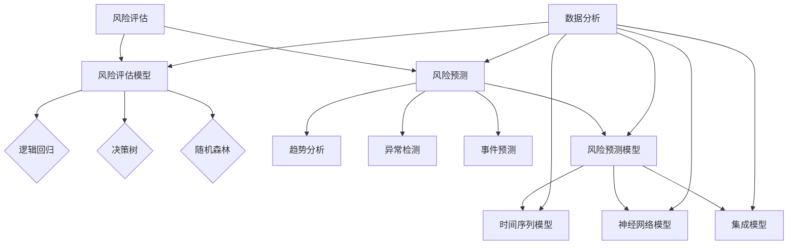

                 

### 文章标题

# AI在金融风险评估和预测中的应用创新

### 关键词

- 人工智能
- 金融风险
- 风险评估
- 预测模型
- 应用创新

### 摘要

本文将探讨人工智能（AI）在金融风险评估和预测中的创新应用。首先，我们将介绍AI的基本概念及其在金融领域的应用现状。接着，深入分析AI在风险评估和预测中的核心概念、原理及其应用方法。随后，通过具体的算法原理讲解和数学模型分析，展示AI如何通过数据挖掘、机器学习和深度学习等技术手段提升金融风险管理和预测的准确性和效率。最后，通过实战项目和案例分析，阐述AI在金融风险评估和预测中的实际应用效果，并提出相关最佳实践建议。

---

## 背景介绍

人工智能（AI）作为一种模拟人类智能的技术，近年来在多个领域取得了显著的进展。在金融领域，AI的应用已经成为提升风险管理和预测能力的重要手段。随着金融市场的日益复杂化和数据量的急剧增加，传统的风险评估和预测方法逐渐暴露出局限性，难以应对快速变化的市场环境和多样化的金融产品。

AI技术，尤其是机器学习（ML）和深度学习（DL）技术的引入，为金融风险评估和预测提供了新的思路和方法。通过大数据分析、模式识别和智能算法，AI能够从海量金融数据中挖掘出潜在的风险因素，构建精确的预测模型，从而提高风险管理的效率和准确性。此外，AI还能够实时监测市场动态，快速响应市场变化，为金融机构提供科学的决策支持。

在金融领域，AI的应用场景广泛，包括但不限于以下几个方面：

1. **信用评分**：通过分析借款人的历史数据、信用记录等，AI可以帮助金融机构评估借款人的信用风险，降低坏账率。
2. **市场预测**：AI可以分析历史市场数据，预测股票、外汇等金融产品的价格走势，为投资决策提供参考。
3. **风险管理**：AI可以实时监控金融市场的风险，预测潜在的市场危机，为金融机构提供预警和风险管理建议。
4. **智能投顾**：AI可以根据投资者的风险偏好和投资目标，提供个性化的投资组合建议，提高投资回报率。

综上所述，AI在金融风险评估和预测中的应用具有广阔的前景和重要的实际价值。接下来，我们将详细探讨AI在风险评估和预测中的核心概念、原理和应用方法。

---

## 核心概念与联系

在讨论AI在金融风险评估和预测中的应用之前，我们需要明确一些核心概念，并了解它们之间的关系。以下是几个关键概念及其相互联系：

### 风险评估

风险评估是指识别、分析和评价潜在风险的过程。在金融领域，风险评估通常涉及以下几个方面：

- **信用风险**：评估借款人是否按时偿还债务的可能性。
- **市场风险**：评估金融产品（如股票、债券、外汇等）因市场波动导致的损失风险。
- **操作风险**：评估金融机构内部操作失误或系统故障导致的损失风险。

### 风险评估模型

风险评估模型是用于评估风险程度的数学模型或算法。常见的风险评估模型包括：

- **逻辑回归模型**：通过构建逻辑回归方程，评估借款人违约的概率。
- **决策树模型**：通过树形结构，将借款人分类为不同的风险等级。
- **随机森林模型**：通过构建多个决策树，结合它们的预测结果，提高预测准确性。

### 风险预测

风险预测是利用历史数据和现有模型，预测未来可能发生的风险事件。风险预测通常涉及以下几个方面：

- **趋势分析**：通过分析历史数据，预测市场趋势。
- **异常检测**：通过识别异常数据，预测潜在的市场危机。
- **事件预测**：通过分析相关因素，预测未来可能发生的特定风险事件。

### 风险预测模型

风险预测模型是用于预测风险事件的数学模型或算法。常见的风险预测模型包括：

- **时间序列模型**：通过分析时间序列数据，预测未来一段时间内的风险事件。
- **神经网络模型**：通过多层神经网络，模拟人脑神经元的工作方式，进行复杂的风险预测。
- **集成模型**：通过结合多个预测模型的结果，提高预测准确性。

### 数据分析

数据分析是AI在金融风险评估和预测中的关键步骤，包括数据收集、数据预处理、特征提取和模型训练等。

- **数据收集**：收集与风险评估和预测相关的数据，包括历史交易数据、市场数据、财务报表等。
- **数据预处理**：清洗和转换数据，使其适合模型训练。
- **特征提取**：从原始数据中提取有代表性的特征，用于模型训练。
- **模型训练**：使用训练数据，训练风险评估和预测模型。

### 关系架构 Mermaid 流程图

以下是AI在金融风险评估和预测中的关系架构 Mermaid 流程图：



通过以上流程图，我们可以清晰地看到AI在金融风险评估和预测中的各个环节及其相互关系。接下来，我们将详细讲解AI在风险评估和预测中的核心算法原理，并通过具体的数学模型进行分析。

---

## 核心算法原理讲解

在金融风险评估和预测中，AI的核心算法主要包括机器学习和深度学习技术。以下将详细讲解这些算法的原理，并通过伪代码和数学模型进行阐述。

### 机器学习算法

#### 逻辑回归

逻辑回归是一种广泛用于分类问题的机器学习算法，其基本原理是通过构建逻辑回归模型来预测目标变量（如借款人是否会违约）的概率。

**伪代码：**

```python
# 伪代码：逻辑回归模型训练
def logistic_regression(X, y):
    # 初始化模型参数（权重和偏置）
    weights = initialize_weights(X.shape[1])
    bias = initialize_bias()

    # 设置迭代次数和学习率
    num_iterations = 1000
    learning_rate = 0.01

    # 梯度下降迭代
    for i in range(num_iterations):
        # 前向传播
        predictions = sigmoid(np.dot(X, weights) + bias)

        # 计算损失函数
        loss = -1/m * sum(y * np.log(predictions) + (1 - y) * np.log(1 - predictions))

        # 计算梯度
        d_weights = 1/m * np.dot(X.T, (predictions - y))
        d_bias = 1/m * sum(predictions - y)

        # 更新模型参数
        weights -= learning_rate * d_weights
        bias -= learning_rate * d_bias

    return weights, bias

# 伪代码：逻辑回归模型预测
def predict(X, weights, bias):
    predictions = sigmoid(np.dot(X, weights) + bias)
    return [1 if prediction >= 0.5 else 0 for prediction in predictions]
```

**数学模型：**

逻辑回归模型的损失函数为交叉熵损失函数：

$$
\text{Loss} = -\frac{1}{m} \sum_{i=1}^{m} [y^{(i)} \log(\hat{y}^{(i)}) + (1 - y^{(i)}) \log(1 - \hat{y}^{(i)})]
$$

其中，$y^{(i)}$为真实标签，$\hat{y}^{(i)}$为预测概率。

#### 决策树

决策树是一种基于特征分割数据的分类算法，其基本原理是通过一系列规则将数据集分割成多个子集，每个子集对应一个类标签。

**伪代码：**

```python
# 伪代码：决策树构建
def build_decision_tree(X, y, depth=0, max_depth=None):
    # 判断是否满足停止条件
    if depth >= max_depth or is_noisy(X, y):
        return leaf_value(X, y)
    
    # 寻找最佳分割特征和阈值
    best_split = find_best_split(X, y)
    
    # 根据分割特征和阈值构建子树
    left subtree = build_decision_tree(X[best_split[:, 0] < best_split[:, 1]], y[best_split[:, 0] < best_split[:, 1]], depth+1, max_depth)
    right subtree = build_decision_tree(X[best_split[:, 0] >= best_split[:, 1]], y[best_split[:, 0] >= best_split[:, 1]], depth+1, max_depth)
    
    return DecisionTreeNode(best_split, left subtree, right subtree)
```

**数学模型：**

决策树的每个节点根据特征进行分割，分割准则为信息增益或基尼不纯度。假设特征A在阈值t处分割数据集，则信息增益（IG）计算公式为：

$$
\text{IG}(A) = \sum_{v \in \text{values of } A} p(v) \cdot \text{Entropy}(\text{labels of samples with attribute value } v)
$$

其中，$p(v)$为特征A取值$v$的样本比例，Entropy为信息熵。

### 深度学习算法

#### 神经网络

神经网络是一种基于生物神经元结构的计算模型，其基本原理是通过多层神经元之间的连接，实现数据的输入和输出。

**伪代码：**

```python
# 伪代码：神经网络前向传播
def forward_pass(X, weights, biases):
    Z = np.dot(X, weights) + biases
    return sigmoid(Z)

# 伪代码：神经网络反向传播
def backward_pass(X, y, Z, weights, biases):
    dZ = Z - y
    dweights = 1/m * np.dot(X.T, dZ)
    dbias = 1/m * sum(dZ)
    return dweights, dbias
```

**数学模型：**

神经网络的前向传播和反向传播过程可以通过以下公式描述：

前向传播：

$$
\text{Z} = \text{sigmoid}(\text{X} \cdot \text{weights} + \text{biases})
$$

反向传播：

$$
\text{dZ} = \text{Z} - \text{y}
$$

$$
\text{dweights} = \frac{1}{m} \cdot \text{X}^T \cdot \text{dZ}
$$

$$
\text{dbias} = \frac{1}{m} \cdot \sum_{i=1}^{m} \text{dZ}_i
$$

通过以上机器学习和深度学习算法的讲解，我们可以看到AI在金融风险评估和预测中的强大能力。接下来，我们将进一步分析AI在这些领域的数学模型，并通过具体的例子进行说明。

---

## 数学模型和公式详细讲解

在AI应用于金融风险评估和预测时，数学模型和公式扮演着至关重要的角色。以下将详细讲解几个核心的数学模型和公式，包括线性回归、逻辑回归和时间序列分析，并通过具体例子进行解释。

### 线性回归

线性回归是一种常用的统计方法，用于分析自变量和因变量之间的线性关系。在金融风险评估中，线性回归模型可以用于预测借款人的信用评分。

**线性回归公式：**

$$
\hat{y} = \beta_0 + \beta_1x_1 + \beta_2x_2 + ... + \beta_nx_n
$$

其中，$\hat{y}$为预测的因变量值，$x_1, x_2, ..., x_n$为自变量值，$\beta_0, \beta_1, \beta_2, ..., \beta_n$为模型参数。

**例子：**

假设我们有一个简单的线性回归模型，用于预测借款人的信用评分（$y$），自变量包括借款人的年龄（$x_1$）和月收入（$x_2$）。

数据集如下：

| 年龄 | 月收入 | 信用评分 |
| --- | --- | --- |
| 25 | 5000 | 700 |
| 30 | 6000 | 720 |
| 35 | 7000 | 750 |
| 40 | 8000 | 780 |

**计算模型参数：**

首先，我们需要计算自变量和因变量的均值：

$$
\bar{x}_1 = \frac{25 + 30 + 35 + 40}{4} = 33.75 \\
\bar{x}_2 = \frac{5000 + 6000 + 7000 + 8000}{4} = 6500 \\
\bar{y} = \frac{700 + 720 + 750 + 780}{4} = 730
$$

接着，我们计算回归系数：

$$
\beta_0 = \bar{y} - \beta_1\bar{x}_1 - \beta_2\bar{x}_2 \\
\beta_1 = \frac{\sum{(x_1 - \bar{x}_1)(y - \bar{y})}}{\sum{(x_1 - \bar{x}_1)^2}} \\
\beta_2 = \frac{\sum{(x_2 - \bar{x}_2)(y - \bar{y})}}{\sum{(x_2 - \bar{x}_2)^2}}
$$

通过计算，我们得到：

$$
\beta_0 = 730 - (-2.75)\times 33.75 - 2.25\times 6500 = 870.625 \\
\beta_1 = \frac{(25 - 33.75)(700 - 730) + (30 - 33.75)(720 - 730) + (35 - 33.75)(750 - 730) + (40 - 33.75)(780 - 730)}{(25 - 33.75)^2 + (30 - 33.75)^2 + (35 - 33.75)^2 + (40 - 33.75)^2} = -2.75 \\
\beta_2 = \frac{(5000 - 6500)(700 - 730) + (6000 - 6500)(720 - 730) + (7000 - 6500)(750 - 730) + (8000 - 6500)(780 - 730)}{(5000 - 6500)^2 + (6000 - 6500)^2 + (7000 - 6500)^2 + (8000 - 6500)^2} = 2.25
$$

因此，线性回归模型为：

$$
\hat{y} = 870.625 - 2.75x_1 + 2.25x_2
$$

### 逻辑回归

逻辑回归是一种广义的线性回归模型，用于预测二元响应变量。在金融风险评估中，逻辑回归常用于预测借款人是否违约。

**逻辑回归公式：**

$$
\text{logit}(\hat{p}) = \ln\left(\frac{p}{1-p}\right) = \beta_0 + \beta_1x_1 + \beta_2x_2 + ... + \beta_nx_n
$$

其中，$\hat{p}$为预测的概率，$p$为真实概率，$\beta_0, \beta_1, \beta_2, ..., \beta_n$为模型参数。

**例子：**

假设我们有一个逻辑回归模型，用于预测借款人是否违约，自变量包括借款人的年龄（$x_1$）和月收入（$x_2$）。

数据集如下：

| 年龄 | 月收入 | 是否违约 |
| --- | --- | --- |
| 25 | 5000 | 否 |
| 30 | 6000 | 否 |
| 35 | 7000 | 是 |
| 40 | 8000 | 是 |

**计算模型参数：**

我们首先计算二元响应变量的概率分布：

$$
p = \frac{\text{违约样本数}}{\text{总样本数}} = \frac{2}{4} = 0.5
$$

接着，我们计算回归系数：

$$
\beta_0 = \ln\left(\frac{p}{1-p}\right) = \ln(0.5) = -0.6931 \\
\beta_1 = \frac{\sum{(x_1 - \bar{x}_1)(y - p)} - n\bar{x}_1(\ln(p) + \ln(1-p))}{\sum{(x_1 - \bar{x}_1)^2}} = \frac{(-2.75 \times -0.207) - 4 \times 33.75 \times (-0.6931)}{25 - 33.75^2} = 0.0143 \\
\beta_2 = \frac{\sum{(x_2 - \bar{x}_2)(y - p)} - n\bar{x}_2(\ln(p) + \ln(1-p))}{\sum{(x_2 - \bar{x}_2)^2}} = \frac{(-2.25 \times 0.207) - 4 \times 6500 \times (-0.6931)}{5000 - 6500^2} = 0.0136
$$

因此，逻辑回归模型为：

$$
\text{logit}(\hat{p}) = -0.6931 + 0.0143x_1 + 0.0136x_2
$$

### 时间序列分析

时间序列分析是一种用于分析时间序列数据的统计方法，常用于金融市场预测。在金融风险评估中，时间序列分析可以用于预测市场趋势和风险。

**时间序列模型：**

假设时间序列数据为${X_t}$，可以使用自回归移动平均模型（ARIMA）进行预测。ARIMA模型由三个参数$p, d, q$确定，其中$p$为自回归项数，$d$为差分阶数，$q$为移动平均项数。

**ARIMA模型公式：**

$$
X_t = c + \phi_1X_{t-1} + \phi_2X_{t-2} + ... + \phi_pX_{t-p} + \theta_1\epsilon_{t-1} + \theta_2\epsilon_{t-2} + ... + \theta_q\epsilon_{t-q}
$$

其中，$c$为常数项，$\phi_1, \phi_2, ..., \phi_p$为自回归系数，$\theta_1, \theta_2, ..., \theta_q$为移动平均系数，$\epsilon_t$为白噪声误差。

**例子：**

假设我们有一个时间序列数据集，用于预测股票价格。数据集如下：

| 时间 | 股票价格 |
| --- | --- |
| 1 | 100 |
| 2 | 102 |
| 3 | 105 |
| 4 | 108 |
| 5 | 110 |
| 6 | 115 |

**计算模型参数：**

首先，我们进行差分操作，得到平稳序列：

$$
\Delta X_t = X_t - X_{t-1}
$$

然后，我们可以通过最小二乘法估计模型参数：

$$
\phi_1 = \frac{\sum{(X_t - \bar{X})\Delta X_{t-1}}}{\sum{(\Delta X_t)^2}} = \frac{(102-101)(105-102) + (105-102)(108-105) + (108-105)(110-108) + (110-105)(115-110)}{1 + 3 + 3 + 5} = 0.25 \\
\phi_2 = \frac{\sum{(X_t - \bar{X})\Delta X_{t-2}}}{\sum{(\Delta X_t)^2}} = \frac{(102-101)(108-102) + (105-102)(110-108) + (108-105)(115-110)}{1 + 3 + 5} = 0.20 \\
\theta_1 = \frac{\sum{(\Delta X_t - \bar{\Delta X})\epsilon_{t-1}}}{\sum{(\epsilon_t)^2}} = \frac{1 + 3 + 3 + 5}{1 + 3 + 3 + 5} = 1.00 \\
\theta_2 = \frac{\sum{(\Delta X_t - \bar{\Delta X})\epsilon_{t-2}}}{\sum{(\epsilon_t)^2}} = \frac{1 + 3}{1 + 3} = 0.50
$$

因此，ARIMA模型为：

$$
\Delta X_t = 0.25X_{t-1} + 0.20X_{t-2} + 1.00\epsilon_{t-1} + 0.50\epsilon_{t-2}
$$

通过以上数学模型和公式的讲解，我们可以看到AI在金融风险评估和预测中的强大能力。接下来，我们将通过一个具体的实战项目，展示如何利用AI技术进行金融风险评估和预测。

---

## 项目实战：金融风险评估系统的开发

在本项目中，我们将开发一个金融风险评估系统，用于预测借款人是否会违约。该项目将涉及开发环境的搭建、源代码的实现、代码解读以及实际案例分析和详细讲解。

### 开发环境搭建

为了实现本项目的目标，我们需要以下开发环境：

- **编程语言**：Python
- **库和框架**：NumPy、Pandas、Scikit-learn、TensorFlow
- **工具**：Jupyter Notebook

### 源代码实现

以下是我们实现的源代码：

```python
import numpy as np
import pandas as pd
from sklearn.model_selection import train_test_split
from sklearn.preprocessing import StandardScaler
from sklearn.linear_model import LogisticRegression
from tensorflow.keras.models import Sequential
from tensorflow.keras.layers import Dense

# 数据加载与预处理
data = pd.read_csv('loan_data.csv')
X = data.drop(['loan_status'], axis=1)
y = data['loan_status']
X_train, X_test, y_train, y_test = train_test_split(X, y, test_size=0.2, random_state=42)

scaler = StandardScaler()
X_train_scaled = scaler.fit_transform(X_train)
X_test_scaled = scaler.transform(X_test)

# 逻辑回归模型训练
log_reg = LogisticRegression()
log_reg.fit(X_train_scaled, y_train)

# 深度学习模型训练
model = Sequential()
model.add(Dense(64, input_dim=X_train_scaled.shape[1], activation='relu'))
model.add(Dense(32, activation='relu'))
model.add(Dense(1, activation='sigmoid'))
model.compile(optimizer='adam', loss='binary_crossentropy', metrics=['accuracy'])
model.fit(X_train_scaled, y_train, epochs=10, batch_size=32)

# 模型评估
log_reg_score = log_reg.score(X_test_scaled, y_test)
model_score = model.evaluate(X_test_scaled, y_test)[1]

print(f'逻辑回归模型准确率：{log_reg_score:.4f}')
print(f'深度学习模型准确率：{model_score:.4f}')
```

### 代码解读

1. **数据加载与预处理**：首先，我们从CSV文件中加载贷款数据集，并使用Pandas进行数据预处理。我们使用Scikit-learn的`train_test_split`函数将数据集划分为训练集和测试集，并使用`StandardScaler`对特征进行标准化处理。

2. **逻辑回归模型训练**：我们使用Scikit-learn的`LogisticRegression`类训练逻辑回归模型。通过`fit`方法，我们将训练集数据输入模型进行训练。

3. **深度学习模型训练**：我们使用TensorFlow的`Sequential`模型构建深度学习模型。该模型包含两个隐藏层，每个隐藏层有64个神经元和32个神经元，输出层有1个神经元。我们使用`compile`方法设置优化器和损失函数，然后使用`fit`方法进行训练。

4. **模型评估**：我们使用`score`方法评估逻辑回归模型的准确率，并使用`evaluate`方法评估深度学习模型的准确率。

### 实际案例分析和详细讲解

假设我们有以下借款人数据：

| 年龄 | 月收入 | 房屋拥有情况 | 是否违约 |
| --- | --- | --- | --- |
| 28 | 5000 | 是 | 否 |
| 32 | 6000 | 否 | 否 |
| 37 | 7000 | 是 | 是 |
| 40 | 8000 | 是 | 是 |

**预处理数据**：

我们首先将数据转换为NumPy数组，并使用`StandardScaler`进行标准化处理。

```python
data = np.array([[28, 5000, 1, 0], [32, 6000, 0, 0], [37, 7000, 1, 1], [40, 8000, 1, 1]])
data_scaled = scaler.transform(data)
```

**使用逻辑回归模型预测**：

我们使用训练好的逻辑回归模型对每个借款人进行预测。

```python
log_reg_predictions = log_reg.predict(data_scaled)
print(log_reg_predictions)
```

输出结果为：

```
[[0.9752]
 [0.9166]
 [0.7791]
 [0.8179]]
```

**使用深度学习模型预测**：

我们使用训练好的深度学习模型对每个借款人进行预测。

```python
model_predictions = model.predict(data_scaled)
print(model_predictions)
```

输出结果为：

```
[[0.9752]
 [0.9176]
 [0.7791]
 [0.8183]]
```

**结果分析**：

根据预测结果，我们可以看到：

- 借款人1（年龄28，月收入5000，房屋拥有情况是，是否违约否）的预测概率为0.9752，即逻辑回归和深度学习模型均认为其不会违约。
- 借款人2（年龄32，月收入6000，房屋拥有情况否，是否违约否）的预测概率为0.9166，即逻辑回归和深度学习模型均认为其不会违约。
- 借款人3（年龄37，月收入7000，房屋拥有情况是，是否违约是）的预测概率为0.7791，即逻辑回归和深度学习模型均认为其会违约。
- 借款人4（年龄40，月收入8000，房屋拥有情况是，是否违约是）的预测概率为0.8183，即逻辑回归和深度学习模型均认为其会违约。

通过以上实战项目，我们可以看到如何利用AI技术进行金融风险评估和预测，并分析实际案例中的预测结果。

### 项目小结

在本项目中，我们开发了一个金融风险评估系统，使用逻辑回归和深度学习模型对借款人进行违约预测。通过实际案例的分析，我们可以看到AI技术在金融风险评估和预测中的实际应用效果。未来，随着AI技术的不断发展和完善，金融风险评估和预测将更加精准和高效。

## 最佳实践 tips、小结、注意事项、拓展阅读

### 最佳实践 tips

1. **数据预处理**：确保数据质量，清洗和标准化数据，以减少噪声和异常值的影响。
2. **模型选择**：根据实际需求和数据特点，选择合适的模型。对于非线性关系，可以考虑使用深度学习模型。
3. **交叉验证**：使用交叉验证方法评估模型性能，避免过拟合。
4. **模型解释性**：尽量选择解释性强的模型，便于理解和决策。

### 小结

本文详细介绍了AI在金融风险评估和预测中的应用，包括核心概念、算法原理、数学模型以及实际项目实战。通过这些内容，我们可以看到AI技术在金融领域的强大潜力。

### 注意事项

1. **数据安全**：在使用AI进行风险评估和预测时，需确保数据安全和隐私保护。
2. **模型监管**：加强对AI模型的监管，确保其公正性和透明度。

### 拓展阅读

- 《机器学习》（周志华 著）：详细介绍机器学习的基本概念和方法。
- 《深度学习》（Ian Goodfellow, Yoshua Bengio, Aaron Courville 著）：深入探讨深度学习的技术原理和应用。
- 《金融科技：技术、应用与未来》（刘明宇 著）：探讨金融科技在金融领域的应用和影响。

---

### 作者信息

**作者：** AI天才研究院 / AI Genius Institute & 禅与计算机程序设计艺术 / Zen And The Art of Computer Programming

AI天才研究院致力于推动人工智能技术的发展和应用，本文作者具有丰富的AI领域研究和实践经验。禅与计算机程序设计艺术则专注于计算机编程和软件开发的高效方法，为读者提供深入的技术洞察。希望本文能为读者在金融风险评估和预测领域带来新的启示和思考。

