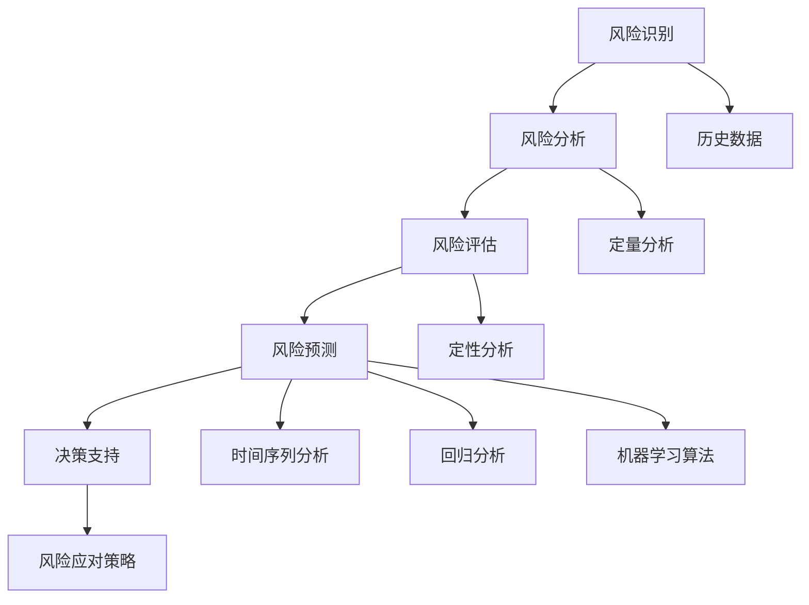

                 

## 引言

在当今信息化社会，人工智能（AI）已经成为了推动社会进步的重要力量。其广泛应用于医疗、金融、交通、能源等各个领域，极大地提升了行业的效率和智能化水平。在风险管理领域，AI的应用同样具有重要意义。随着数据量的爆炸式增长和计算能力的不断提升，人工智能在风险评估和预测中的应用创新成为了热点话题。

本文将探讨AI在风险评估和预测中的基本概念、应用场景、技术手段以及成功案例。通过对AI技术的深入分析，我们希望揭示其背后的原理和优势，同时探讨当前面临的一些挑战和未来的发展趋势。

首先，我们将介绍AI在风险管理中的基本概念，包括风险评估和预测的定义以及它们之间的关系。接着，我们会详细探讨AI在风险评估和预测中的具体应用场景，如金融风险预测、自然灾害风险预测和公共卫生风险预测等。随后，我们将深入分析AI在风险评估和预测中常用的技术手段，包括传统统计方法、机器学习方法和深度学习方法。接下来，通过成功案例的分享，我们将展示AI在风险评估和预测中的实际应用效果。最后，我们将讨论当前面临的挑战和未来发展趋势，为读者提供对这一领域的全面了解。

通过本文的探讨，我们希望读者能够对AI在风险评估和预测中的应用有一个清晰的认识，并了解到其巨大的潜力和广阔的应用前景。

## 关键词

- 人工智能
- 风险评估
- 风险预测
- 机器学习
- 深度学习
- 金融风险
- 自然灾害风险
- 公共卫生风险

## 摘要

本文深入探讨了人工智能（AI）在风险评估和预测领域的应用创新。首先，介绍了AI在风险管理中的基本概念，包括风险评估和预测的定义及其相互关系。接着，分析了AI在风险评估和预测中的具体应用场景，如金融风险预测、自然灾害风险预测和公共卫生风险预测等。随后，详细探讨了AI在风险评估和预测中常用的技术手段，包括传统统计方法、机器学习方法和深度学习方法。通过分享成功案例，本文展示了AI在风险评估和预测中的实际应用效果。最后，本文讨论了当前面临的一些挑战和未来发展趋势，为AI在风险评估和预测领域的进一步应用提供了方向。

## AI在风险管理中的角色

在当今高度复杂和动态变化的商业环境中，风险管理已经成为了企业运营和决策过程中不可或缺的一部分。人工智能（AI）作为一种先进的技术，正逐渐改变着风险管理的模式和效果。AI在风险管理中扮演着多重角色，其中最为核心的便是风险评估和预测。

### 风险评估的定义和重要性

风险评估是一种系统化的过程，旨在识别、分析和评估潜在风险的可能性和影响。它包括以下几个关键步骤：

1. **风险识别**：这一阶段的目标是识别可能对企业产生负面影响的因素。
2. **风险分析和评估**：通过定量和定性方法分析已识别风险的概率和潜在影响。
3. **风险评估**：将分析结果综合起来，确定哪些风险需要优先关注和管理。

风险评估在风险管理中的重要性体现在多个方面。首先，它帮助企业识别潜在风险，从而在风险发生前采取预防措施。其次，通过评估风险的影响程度，企业可以更合理地配置资源，进行有效的风险控制和缓解。此外，良好的风险评估还能提高企业的决策透明度和决策效率，使企业能够在复杂环境中保持竞争优势。

### AI在风险评估中的应用

AI技术的引入极大地提升了风险评估的准确性和效率。以下是一些AI在风险评估中应用的关键方面：

1. **数据挖掘与分析**：AI能够处理和分析大量复杂的数据，识别潜在风险因素。通过机器学习算法，AI可以从历史数据中学习，预测未来的风险趋势。
2. **自动化风险识别**：利用自然语言处理（NLP）和计算机视觉等技术，AI能够自动识别和分类风险事件，减少人工干预。
3. **预测模型**：基于大数据和机器学习算法，AI可以建立复杂的风险预测模型，对风险进行定量和定性分析，提供更准确的风险评估结果。

### 风险预测的定义和重要性

风险预测是风险评估的延伸，旨在预测未来可能发生的风险事件。与风险评估不同，风险预测更注重前瞻性，通过分析历史数据和当前趋势，预测未来可能出现的风险。

1. **趋势分析**：通过分析历史数据，AI可以发现潜在的风险趋势，提前预警。
2. **情景分析**：利用模拟技术，AI可以模拟不同情景下的风险状况，评估不同应对策略的可行性。
3. **预测模型优化**：通过机器学习和深度学习算法，AI可以不断优化预测模型，提高预测准确性。

### AI在风险预测中的应用

AI在风险预测中的应用主要表现在以下几个方面：

1. **实时监控与预警**：通过实时数据分析和模式识别，AI能够实时监控风险指标，提前预警潜在风险。
2. **动态调整**：基于不断更新的数据和模型，AI可以动态调整预测结果，提供更准确的预测。
3. **决策支持**：AI可以提供详尽的风险预测报告，为管理层提供决策支持，优化风险应对策略。

### 风险评估与预测的关系

风险评估和风险预测是相辅相成的。风险评估为风险预测提供了基础数据和分析框架，而风险预测则是对风险评估的进一步延伸和深化。通过结合风险评估和风险预测，企业可以更全面、准确地识别和管理风险，提高风险管理的整体效能。

### 结论

综上所述，AI在风险评估和预测中具有重要作用。通过数据挖掘、模型构建和实时监控等技术，AI不仅提高了风险评估的准确性和效率，还使得风险预测更具前瞻性和动态性。随着AI技术的不断进步，其在风险管理中的应用将更加广泛和深入，为企业和行业带来更多的机遇和挑战。

## 风险评估与预测的基本概念

### 风险识别

风险识别是风险评估的第一步，其目的是识别系统中可能存在的各种风险因素。风险识别的过程通常包括以下几个步骤：

1. **收集信息**：通过调查、访谈、文献研究等方式收集与企业运营相关的信息。
2. **列出潜在风险**：基于收集到的信息，列出可能对企业造成负面影响的潜在风险。
3. **分类风险**：将潜在风险按照类型和影响范围进行分类，以便于后续的分析和评估。

### 风险分析

风险分析是对已识别的风险进行详细评估和排序，以确定其可能性和影响程度。以下是一些常用的风险分析方法：

1. **定性分析**：通过专家判断和评分系统，对风险的影响程度和可能性进行评估。
2. **定量分析**：利用数学模型和统计方法，对风险的概率和影响进行定量计算。
3. **风险矩阵**：将风险的可能性和影响程度进行组合，形成风险矩阵，以便直观地展示风险状况。

### 风险评估

风险评估是在风险识别和风险分析的基础上，对风险进行综合评估和排序，以确定哪些风险需要优先管理和控制。以下是一些常用的风险评估方法：

1. **风险优先级排序**：根据风险的可能性和影响程度，对风险进行排序，确定优先管理的风险。
2. **成本效益分析**：评估不同风险应对策略的成本和效益，选择最优的风险管理方案。
3. **决策树**：通过构建决策树模型，分析不同决策路径下的风险和收益。

### 风险预测

风险预测是通过对历史数据和当前趋势的分析，预测未来可能发生的风险事件。以下是一些常用的风险预测方法：

1. **时间序列分析**：通过分析时间序列数据，预测未来风险事件的趋势。
2. **回归分析**：利用回归模型，分析自变量和因变量之间的关系，预测未来风险。
3. **机器学习算法**：通过机器学习算法，从大量数据中学习规律，预测未来风险。

### 关系架构 Mermaid 流程图

以下是一个关于风险评估与预测的关系架构 Mermaid 流程图：



### 风险评估与预测的流程

以下是一个典型的风险评估与预测流程：

1. **收集数据**：从内部和外部数据源收集与企业运营相关的数据。
2. **数据预处理**：清洗和整合数据，确保数据质量。
3. **风险识别**：利用各种方法识别潜在的风险因素。
4. **风险分析**：对已识别的风险进行定量和定性分析。
5. **风险评估**：根据分析结果，对风险进行排序和评估。
6. **风险预测**：利用模型和算法，预测未来可能发生的风险事件。
7. **决策支持**：基于预测结果，提供风险应对策略和管理建议。

通过上述流程，企业可以系统化地识别和管理风险，提高风险管理的效率和准确性。

## 风险评估与预测的流程

### 风险识别

风险识别是风险评估的第一步，其目的是发现和记录可能对目标系统造成危害的因素。这一过程通常涉及以下几个步骤：

1. **信息收集**：通过文献调研、访谈、调查问卷等方法收集与企业运营相关的信息。这些信息可能包括历史数据、业务流程、外部环境变化等。

2. **识别风险**：基于收集到的信息，使用专家知识和现有工具，识别潜在的风险因素。常见的风险识别方法有枚举法、故障树分析（FTA）、情景分析等。

3. **记录和分类**：将识别出的风险因素进行记录和分类，以便后续分析和评估。分类可以根据风险的类型（如财务风险、运营风险、安全风险等）或影响范围（如企业内部、供应链、市场等）进行。

### 风险分析

风险分析是在风险识别的基础上，对已识别的风险因素进行详细评估，以确定其可能性和影响程度。以下是一些常用的风险分析方法：

1. **定性分析**：通过专家判断和评分系统，对风险的影响程度和可能性进行评估。定性分析方法包括风险矩阵、风险评分表等。

   - **风险矩阵**：使用一个二维矩阵，将风险的可能性和影响程度进行组合，生成一个风险评分。每个单元格代表一种风险组合，其值表示该组合的风险程度。

   ```mermaid
   graph TB
   A[低可能性] --> B[低影响]
   A --> C[中影响]
   B --> D[中可能性]
   C --> D
   C --> E[高影响]
   D --> F[高可能性]
   ```

2. **定量分析**：利用数学模型和统计方法，对风险的概率和影响进行定量计算。常见的定量分析方法包括统计回归分析、蒙特卡罗模拟等。

   - **蒙特卡罗模拟**：通过随机抽样和模拟计算，评估不同风险因素对系统的影响程度和概率。

   ```python
   import numpy as np

   # 设置模拟参数
   n_iterations = 1000
   probabilities = [0.1, 0.3, 0.4, 0.2]
   impacts = [1, 5, 10, 3]

   # 进行蒙特卡罗模拟
   risk_scores = np.random.choice(impacts, n_iterations, p=probabilities)
   print(f"Average risk score: {np.mean(risk_scores)}")
   ```

3. **综合评估**：将定性分析和定量分析的结果综合起来，形成对风险的全面评估。这通常涉及到风险评分、优先级排序等步骤。

### 风险评估

风险评估是基于风险分析的结果，对风险进行优先级排序和分类，以确定哪些风险需要优先管理和控制。以下是一些常用的风险评估方法：

1. **风险优先级排序**：根据风险的可能性和影响程度，对风险进行排序，确定优先管理的风险。常见的排序方法有优先级矩阵、风险地图等。

   - **优先级矩阵**：使用一个矩阵，将风险的可能性和影响程度进行组合，生成一个优先级评分。

   ```mermaid
   graph TB
   A[低可能性] --> B[低影响]
   A --> C[中影响]
   B --> D[中可能性]
   C --> D
   C --> E[高影响]
   D --> F[高可能性]
   ```

2. **成本效益分析**：评估不同风险应对策略的成本和效益，选择最优的风险管理方案。成本效益分析可以通过计算每个策略的成本和预期收益来进行。

   ```python
   strategies = {
       '避免': 10000,
       '转移': 5000,
       '缓解': 20000,
       '接受': 0
   }
   expected_returns = {
       '避免': 50000,
       '转移': 30000,
       '缓解': 40000,
       '接受': -5000
   }
   best_strategy = max(expected_returns, key=expected_returns.get)
   print(f"Best strategy: {best_strategy} with expected return: {expected_returns[best_strategy]}")
   ```

3. **决策树**：通过构建决策树模型，分析不同决策路径下的风险和收益。决策树可以帮助企业直观地理解不同决策的影响。

   ```mermaid
   graph TB
   A[初始状态]
   A --> B[采取避免策略]
   A --> C[采取转移策略]
   A --> D[采取缓解策略]
   A --> E[接受风险]
   B --> F[避免成功]
   C --> G[转移成功]
   D --> H[缓解成功]
   E --> I[接受风险]
   ```

### 风险预测

风险预测是基于历史数据和当前趋势，对未来的风险事件进行预测。以下是一些常用的风险预测方法：

1. **时间序列分析**：通过分析时间序列数据，预测未来风险事件的趋势。时间序列分析可以采用自回归模型（AR）、移动平均模型（MA）、自回归移动平均模型（ARMA）等。

   ```python
   import numpy as np
   import matplotlib.pyplot as plt
   from statsmodels.tsa.arima.model import ARIMA

   # 生成时间序列数据
   np.random.seed(0)
   data = np.random.normal(size=100)

   # 模型拟合
   model = ARIMA(data, order=(1, 1, 1))
   model_fit = model.fit()

   # 预测
   forecast = model_fit.forecast(steps=10)
   plt.plot(data, label='Original')
   plt.plot(forecast, label='Forecast')
   plt.legend()
   plt.show()
   ```

2. **回归分析**：利用回归模型，分析自变量和因变量之间的关系，预测未来风险。常见的回归模型包括线性回归、逻辑回归等。

   ```python
   import pandas as pd
   from sklearn.linear_model import LinearRegression

   # 读取数据
   data = pd.read_csv('risk_data.csv')
   X = data[['independent_variable']]
   y = data['dependent_variable']

   # 模型拟合
   model = LinearRegression()
   model_fit = model.fit(X, y)

   # 预测
   predictions = model_fit.predict(X)
   plt.scatter(X, y, label='Actual')
   plt.plot(X, predictions, label='Predicted')
   plt.legend()
   plt.show()
   ```

3. **机器学习算法**：通过机器学习算法，从大量数据中学习规律，预测未来风险。常见的机器学习算法包括决策树、随机森林、支持向量机等。

   ```python
   import pandas as pd
   from sklearn.ensemble import RandomForestClassifier

   # 读取数据
   data = pd.read_csv('risk_data.csv')
   X = data[['feature1', 'feature2', 'feature3']]
   y = data['target']

   # 模型拟合
   model = RandomForestClassifier(n_estimators=100)
   model_fit = model.fit(X, y)

   # 预测
   predictions = model_fit.predict(X)
   print(predictions)
   ```

### 关系架构

以下是一个关于风险评估与预测的关系架构 Mermaid 流程图：


通过上述流程，企业可以系统地识别和管理风险，提高风险管理的效率和准确性。风险预测作为风险评估的延伸，为企业的决策提供了重要的支持，有助于企业更好地应对未来可能出现的风险。

## AI在风险评估和预测中的优势

人工智能（AI）技术在风险评估和预测中的应用带来了显著的优势，主要体现在以下几个方面：

### 数据处理能力的提升

AI技术在数据处理方面具有强大的能力。通过机器学习和深度学习算法，AI可以从海量的数据中快速提取有用信息，识别潜在的风险因素。相比传统的人工分析方法，AI能够处理更加复杂和多维度的数据，提高了数据处理的速度和准确性。例如，利用自然语言处理（NLP）技术，AI可以自动提取和分析文本数据中的风险信息，如新闻报道、社交媒体评论等，从而实现对风险的全面监测和预警。

### 自动化的风险识别和预测

AI技术能够实现风险识别和预测的自动化，减少了对人工的依赖。通过深度学习算法，AI可以自动学习历史数据中的风险模式，并在新的数据中实时识别和预测风险。这种自动化能力不仅提高了风险评估的效率，还减少了人为错误的可能性。例如，在金融风险管理中，AI可以通过实时监控交易数据，自动识别潜在的欺诈行为，从而实现风险预警和防控。

### 高度的个性化与适应性

AI技术可以根据不同的应用场景和需求，提供高度个性化的风险预测服务。通过自适应算法，AI可以不断学习和调整预测模型，以适应不断变化的风险环境。这种高度个性化与适应性使得AI在风险管理中能够提供更加精准和有效的预测结果。例如，在公共卫生领域，AI可以根据实时疫情数据和地理位置信息，预测疫情发展的趋势和可能的影响范围，为公共卫生决策提供科学依据。

### 风险预测的前瞻性

AI技术通过历史数据和当前趋势的分析，能够预测未来可能发生的风险事件。这种前瞻性能力使得企业可以提前采取预防措施，降低风险发生的概率和影响。例如，在自然灾害风险管理中，AI可以通过对气象数据和地质数据的分析，预测未来可能发生的地震、洪水等自然灾害，从而提前部署救援资源和应急计划。

### 增强决策支持能力

AI技术能够通过数据分析和模型预测，提供详尽的决策支持，帮助管理层做出更加明智的决策。AI可以生成详细的预测报告，包括风险的概率、影响程度和应对策略，从而为企业的风险管理和决策提供科学依据。这种决策支持能力不仅提高了决策的透明度，还使得企业在复杂多变的环境中能够更加灵活和高效地应对风险。

### 实时监控与动态调整

AI技术能够实现风险的实时监控和动态调整。通过实时数据分析和模式识别，AI可以实时监测风险指标，并动态调整预测模型，提供最新的风险预测结果。这种实时监控与动态调整能力使得企业在面对突发风险时能够迅速响应，采取有效的风险应对措施。例如，在金融市场风险管理中，AI可以通过实时监控交易数据和宏观经济指标，动态调整投资策略，降低风险。

### 总结

综上所述，AI在风险评估和预测中具有多个显著优势，包括数据处理能力的提升、自动化的风险识别和预测、高度的个性化与适应性、前瞻性的风险预测、增强的决策支持能力、实时监控与动态调整等。这些优势使得AI在风险管理中具有巨大的潜力，能够显著提高企业的风险管理水平，降低风险发生的概率和影响。随着AI技术的不断进步和应用场景的不断拓展，AI在风险评估和预测中的优势将更加凸显，为企业和行业带来更多的价值。

### 常见的风险评估与预测算法

在AI技术应用于风险评估和预测的过程中，常见的算法主要包括传统统计方法、机器学习方法和深度学习方法。这些方法各具特点，适用于不同的应用场景，以下将详细分析每种方法的原理和应用。

#### 传统统计方法

传统统计方法在风险评估和预测中应用广泛，主要依赖于概率论和数理统计的理论基础。以下是一些常见的传统统计方法：

1. **均值与方差**：通过计算数据的均值和方差，可以了解数据的集中趋势和波动性，从而进行风险预测。例如，使用均值来预测未来数据的一般水平，使用方差来评估风险的波动性。

2. **回归分析**：回归分析是一种用于分析自变量和因变量之间关系的统计方法。线性回归分析是最简单的一种形式，通过建立自变量和因变量之间的线性关系模型，可以预测因变量的值。例如，使用线性回归模型来预测金融市场的价格走势。

3. **时间序列分析**：时间序列分析用于分析时间序列数据的结构和规律，预测未来的数据值。常见的时间序列模型包括自回归模型（AR）、移动平均模型（MA）和自回归移动平均模型（ARMA）。例如，在金融市场分析中，可以通过时间序列模型预测股票价格的波动。

#### 机器学习方法

机器学习方法在风险评估和预测中具有强大的能力和广泛的适用性。以下是一些常见的机器学习方法：

1. **决策树**：决策树是一种基于树形结构的分类和回归模型。通过递归地将数据集划分为不同的子集，并选择最优的特征进行分割，直到满足终止条件。决策树模型可以用于分类和回归任务，例如，分类风险事件或预测金融风险。

2. **随机森林**：随机森林是一种基于决策树的集成学习方法，通过构建多棵决策树并对它们进行投票或求平均来获得最终的预测结果。随机森林具有高准确性和鲁棒性，适用于处理高维数据和噪声数据。

3. **支持向量机（SVM）**：支持向量机是一种用于分类和回归任务的线性模型。通过找到最优的超平面，将数据集划分为不同的类别或预测值。SVM特别适合处理小样本和高维数据，在金融风险预测和文本分类中应用广泛。

4. **神经网络**：神经网络是一种基于大脑神经网络的计算模型，通过多层神经元之间的权重连接进行信息传递和计算。神经网络具有强大的非线性处理能力和自适应学习能力，适用于处理复杂的数据和模式识别任务。

#### 深度学习方法

深度学习方法是一种基于多层神经网络的机器学习方法，具有强大的表达能力和学习能力。以下是一些常见的深度学习模型：

1. **卷积神经网络（CNN）**：卷积神经网络是一种用于图像和视频处理任务的深度学习模型。通过卷积运算和池化操作，CNN可以提取图像中的特征并形成特征图，从而实现图像分类、目标检测等任务。

2. **循环神经网络（RNN）**：循环神经网络是一种用于处理序列数据（如时间序列、自然语言文本等）的深度学习模型。RNN通过在序列中循环利用信息，实现长期的依赖关系建模，适用于序列预测和语言生成任务。

3. **长短期记忆网络（LSTM）**：长短期记忆网络是一种特殊的RNN结构，通过引入门控机制，解决了RNN的长期依赖问题。LSTM在时间序列预测、语音识别和自然语言处理等领域具有广泛应用。

4. **生成对抗网络（GAN）**：生成对抗网络是一种基于博弈理论的深度学习模型，由生成器和判别器两个神经网络组成。生成器生成虚假数据，判别器判断数据是真实还是虚假。通过这种对抗训练，GAN可以生成高质量的数据，如图像、语音等。

#### 应用实例

1. **金融风险预测**：使用神经网络和机器学习算法，可以对金融市场中的各种风险因素（如股票价格、交易量、宏观经济指标等）进行预测。通过构建深度学习模型，可以实现对股票市场波动性和违约风险的预测，从而提供投资决策支持。

2. **自然灾害预测**：利用卷积神经网络和循环神经网络，可以分析气象数据、地质数据和历史自然灾害事件，预测未来可能发生的自然灾害。例如，使用CNN提取图像特征，预测地震的发生区域；使用RNN分析时间序列数据，预测台风的路径和强度。

3. **公共卫生风险预测**：基于深度学习和机器学习算法，可以分析公共卫生数据（如传染病病例、人口流动等），预测疾病的传播趋势和影响范围。通过构建LSTM模型，可以实现对疫情发展趋势的预测，为公共卫生决策提供科学依据。

通过上述传统统计方法、机器学习方法和深度学习方法的详细分析，我们可以看到每种方法在风险评估和预测中的独特优势和应用场景。在实际应用中，可以根据具体需求和数据特点选择合适的方法，以提高风险预测的准确性和可靠性。

## AI在金融风险预测中的应用

在金融行业中，风险预测是一个至关重要的环节，它直接关系到金融机构的稳健运行和投资者的利益。人工智能（AI）技术在金融风险预测中的应用，为金融机构提供了强大的工具和方法，极大地提升了风险管理的效率和准确性。以下将详细探讨AI在金融风险预测中的应用，包括其优势、技术手段和实际案例。

### 优势

1. **高准确性**：AI技术能够处理大量复杂的数据，通过机器学习和深度学习算法，可以挖掘数据中的隐藏模式，提高风险预测的准确性。相比于传统的人工分析方法，AI技术能够更精准地预测金融市场的波动和潜在风险。

2. **实时监控与预警**：利用AI技术，金融机构可以实现对交易数据的实时监控，快速识别潜在的欺诈行为和市场风险。通过实时预警系统，金融机构能够及时采取应对措施，减少损失。

3. **个性化风险预测**：AI技术可以根据每个客户的风险偏好和历史交易数据，提供个性化的风险预测服务。这有助于金融机构更好地了解客户需求，优化风险管理策略。

4. **风险预测的前瞻性**：AI技术可以通过对历史数据和当前趋势的分析，预测未来可能发生的金融风险。这种前瞻性能力使得金融机构能够提前制定应对策略，降低风险发生的概率和影响。

### 技术手段

1. **机器学习算法**：机器学习算法在金融风险预测中应用广泛，包括线性回归、逻辑回归、支持向量机（SVM）等。这些算法可以通过训练模型，从历史数据中学习风险模式和规律，实现对未来风险的预测。

   - **线性回归**：通过建立自变量和因变量之间的线性关系模型，预测金融市场的价格走势。
   - **逻辑回归**：通过建立风险事件发生的概率模型，预测金融风险的发生可能性。

2. **深度学习模型**：深度学习模型在处理复杂和非线性数据时具有优势，包括卷积神经网络（CNN）、循环神经网络（RNN）和长短期记忆网络（LSTM）等。

   - **CNN**：通过卷积操作提取图像和交易数据中的特征，应用于图像识别和交易预测。
   - **RNN和LSTM**：通过序列数据建模，预测金融市场的动态变化和风险事件的发生时间。

3. **大数据分析**：利用大数据技术，金融机构可以收集和处理海量的金融数据，包括交易数据、市场数据、社交媒体数据等。通过数据挖掘和分析，发现潜在的风险因素和模式。

4. **自然语言处理（NLP）**：NLP技术在处理非结构化文本数据时具有优势，如新闻、报告、社交媒体评论等。通过NLP技术，可以提取文本中的关键信息，用于金融风险预测。

### 实际案例

1. **信用卡欺诈检测**：某银行通过AI技术建立了信用卡欺诈检测系统。系统利用机器学习和深度学习算法，分析信用卡交易数据，识别欺诈行为的模式和特征。通过实时监控和预警，系统可以快速检测并阻止欺诈交易，提高了信用卡的安全性和客户的满意度。

2. **市场风险预测**：某投资公司利用深度学习模型，对股票市场的波动进行预测。模型通过分析历史交易数据、市场新闻和宏观经济指标，建立复杂的预测模型。通过实时预测和动态调整，公司可以优化投资组合，降低市场波动带来的风险。

3. **贷款违约预测**：某金融机构使用机器学习算法，对贷款客户的信用风险进行预测。模型通过分析客户的财务数据、信用记录、社会关系等，预测客户违约的可能性。通过精确的风险评估，金融机构可以优化贷款审批流程，降低坏账率。

4. **金融风险评估**：某金融监管机构利用大数据分析和NLP技术，对金融机构的风险状况进行评估。系统通过分析金融机构的交易数据、财务报告和外部新闻，评估其风险水平。这有助于监管机构及时发现风险隐患，采取有效的监管措施。

通过上述实际案例，我们可以看到AI技术在金融风险预测中的应用效果显著。随着AI技术的不断进步，金融风险预测的准确性和效率将进一步提高，为金融机构和投资者提供更加可靠的风险管理工具。

### AI在自然灾害风险预测中的应用

自然灾害，如地震、洪水、台风和火山喷发，具有不可预测性和破坏性，给人类社会带来巨大的损失。随着人工智能（AI）技术的不断发展，AI在自然灾害风险预测中的应用逐渐成为了一个重要的研究领域。以下将详细探讨AI在自然灾害风险预测中的应用，包括技术手段、实际案例以及挑战和解决方案。

#### 技术手段

1. **时间序列分析**：时间序列分析是自然灾害风险预测中的基础技术。通过分析历史地震、洪水和台风等灾害的发生时间和强度，可以发现灾害发生的周期性和趋势性。常见的时间序列模型包括自回归模型（AR）、移动平均模型（MA）和自回归移动平均模型（ARMA）。这些模型可以用于预测未来可能发生的自然灾害。

2. **机器学习算法**：机器学习算法在自然灾害风险预测中发挥了重要作用。通过分析历史灾害数据、地质数据、气象数据等，可以训练模型来预测未来自然灾害的发生概率和影响范围。常见的机器学习算法包括决策树、随机森林、支持向量机（SVM）和神经网络等。

3. **深度学习模型**：深度学习模型在处理复杂数据和模式识别方面具有优势，适用于自然灾害风险预测。卷积神经网络（CNN）和循环神经网络（RNN）是常用的深度学习模型。CNN可以提取地震、洪水等灾害的图像特征，RNN可以分析时间序列数据，预测灾害的发生时间和强度。

4. **大数据分析**：大数据分析技术可以帮助整合来自多个来源的数据，如地震监测站、气象卫星、社会媒体等。通过对这些数据进行挖掘和分析，可以更全面地了解自然灾害的发生条件和趋势。

5. **地理信息系统（GIS）**：GIS技术可以用于自然灾害风险预测和评估。通过将地理数据、灾害数据和人口数据等整合到GIS平台中，可以生成灾害风险地图，为应急规划和决策提供支持。

#### 实际案例

1. **地震预测**：日本是一个地震频发的国家，通过AI技术，日本科学家开发了一种基于深度学习的地震预测系统。该系统通过分析地震前兆数据，如震中位置、震级、震源深度等，预测未来地震的发生概率。实际应用表明，该系统可以提前数天甚至数周预测地震，为应急响应提供宝贵的时间。

2. **洪水预测**：中国是一个洪水频发的国家，AI技术在洪水预测中的应用也得到了广泛应用。通过集成气象数据、水文数据和卫星遥感数据，中国科学家开发了一种基于机器学习的洪水预测系统。该系统可以实时监测降雨情况和河流水位，预测未来可能发生的洪水。实际应用表明，该系统能够提高洪水预警的准确性和及时性，减少洪灾造成的损失。

3. **台风预测**：台风是亚太地区常见的自然灾害，AI技术在台风预测中也有广泛应用。通过分析台风的轨迹、强度和移动速度，AI可以预测未来台风的路径和影响范围。例如，台湾气象部门利用深度学习模型，成功预测了2019年台风“利奇马”的路径和强度，为民众提供了及时的预警信息。

4. **火山喷发预测**：火山喷发是一种突发性自然灾害，预测其喷发时间、强度和影响范围具有挑战性。AI技术在火山喷发预测中通过分析火山活动数据、地质数据和气象数据，可以预测火山喷发的可能性。例如，冰岛科学家通过分析火山地震活动数据，成功预测了2010年艾雅法拉火山喷发的时间和强度。

#### 挑战和解决方案

1. **数据质量与数据隐私**：自然灾害风险预测依赖于大量的数据，这些数据可能来自不同的来源，数据质量和一致性是关键挑战。此外，数据隐私也是一个重要问题，特别是在涉及个人数据的情况下。解决方案包括建立统一的数据标准，确保数据的一致性和质量，同时采取数据加密和隐私保护技术。

2. **模型解释性**：AI模型，特别是深度学习模型，通常被认为是“黑盒”模型，其决策过程难以解释和理解。这给决策者带来了挑战，尤其是在紧急情况下。解决方案包括开发可解释的AI模型，如集成方法（LIME）和SHAP值方法，以及增强模型的透明性和可解释性。

3. **模型泛化能力**：自然灾害的发生具有高度的不确定性和复杂性，模型需要具备良好的泛化能力，以应对不同地区和不同类型灾害的预测需求。解决方案包括使用更多样化的数据集进行模型训练，以及采用迁移学习等技术，提高模型的泛化能力。

4. **实时监测与预警**：自然灾害通常具有突发性和快速变化的特点，实时监测和预警是关键。然而，数据传输和处理的速度和效率是制约实时预警的重要因素。解决方案包括采用高性能计算和边缘计算技术，提高数据处理速度和实时性。

通过上述技术手段和实际案例的探讨，我们可以看到AI在自然灾害风险预测中的巨大潜力和应用价值。尽管面临一些挑战，随着技术的不断进步和应用的深入，AI在自然灾害风险预测中的贡献将越来越大，为人类社会的防灾减灾提供更加有力的支持。

### AI在公共卫生风险预测中的应用

在全球化和信息化的时代，公共卫生风险预测的重要性日益凸显。人工智能（AI）技术在公共卫生领域的应用，为疾病预防、疫情控制和公共卫生决策提供了强有力的支持。以下将详细探讨AI在公共卫生风险预测中的应用，包括技术手段、实际案例和未来展望。

#### 技术手段

1. **机器学习算法**：机器学习算法是公共卫生风险预测的核心技术之一。通过分析大量的历史健康数据、流行病学数据和社交媒体数据，机器学习算法可以预测疾病的传播趋势和影响范围。常见的机器学习算法包括线性回归、逻辑回归、支持向量机（SVM）和随机森林等。

   - **线性回归**：通过建立自变量和因变量之间的线性关系模型，预测传染病的发生率和流行强度。
   - **逻辑回归**：通过建立疾病发生的概率模型，预测某种疾病在不同地区或人群中的传播可能性。

2. **深度学习模型**：深度学习模型在处理复杂数据和模式识别方面具有优势，适用于公共卫生风险预测。常见的深度学习模型包括卷积神经网络（CNN）、循环神经网络（RNN）和长短期记忆网络（LSTM）等。

   - **CNN**：通过卷积操作提取图像和健康数据中的特征，如医疗影像和病毒基因组，应用于疾病诊断和传播预测。
   - **RNN和LSTM**：通过序列数据建模，分析时间序列数据，预测疾病的传播趋势和疫情的发展速度。

3. **大数据分析**：大数据分析技术可以帮助整合来自多个来源的数据，如医疗记录、流行病学数据、气象数据和社会媒体数据等。通过对这些数据进行挖掘和分析，可以更全面地了解疾病的传播路径和影响因素。

4. **自然语言处理（NLP）**：NLP技术在处理非结构化文本数据时具有优势，如社交媒体评论、新闻报道和医疗文献等。通过NLP技术，可以提取文本中的关键信息，用于疾病监测和预测。

5. **强化学习**：强化学习是一种通过试错和反馈机制来优化决策过程的算法。在公共卫生风险预测中，强化学习可以用于优化公共卫生干预策略，如疫苗接种、隔离措施和资源分配等。

#### 实际案例

1. **新冠疫情预测**：在COVID-19疫情期间，AI技术在疫情预测和控制中发挥了重要作用。例如，某些研究团队利用机器学习算法和深度学习模型，分析全球的疫情数据，预测疫情的传播趋势和影响范围。这些预测结果为各国政府和公共卫生机构提供了重要的决策依据，帮助制定了有效的疫情防控措施。

2. **流感预测**：流感是一种常见的呼吸道传染病，AI技术在流感预测中也取得了显著成果。例如，某些研究团队利用季节性流感监测数据，结合气候和人口流动性数据，使用深度学习模型预测流感的流行季节和高峰期。这些预测结果有助于卫生部门提前部署疫苗和医疗资源，减少流感疫情的影响。

3. **传染病的早期监测**：AI技术可以通过实时监测社交媒体、新闻报道和在线健康论坛等非结构化数据，快速识别传染病的早期迹象。例如，某些研究团队利用NLP技术，分析社交媒体中的疫情相关讨论，识别潜在疫情爆发的时间和地点。这些早期监测结果为公共卫生决策提供了及时的信息，有助于迅速采取干预措施。

4. **个性化公共卫生服务**：AI技术可以根据个人的健康数据、生活习惯和地理位置，提供个性化的公共卫生服务。例如，某些研究团队利用机器学习模型，分析个人的健康数据，预测其患某种疾病的风险，并提供个性化的健康建议和预防措施。

#### 未来展望

1. **更加精准的预测模型**：随着数据量的增加和数据质量的提升，AI技术在公共卫生风险预测中的准确性将进一步提高。未来将开发出更加精准的预测模型，能够更准确地预测疾病的传播趋势和影响范围。

2. **跨学科合作**：公共卫生风险预测是一个跨学科的研究领域，涉及医学、生物学、信息学和社会学等多个学科。未来将促进跨学科的合作，整合多学科的知识和资源，开发更加全面和高效的预测方法。

3. **人工智能与公共卫生法规的融合**：随着AI技术的应用日益广泛，公共卫生法规也将逐步完善。未来将制定相应的法规，规范AI技术在公共卫生风险预测中的应用，保障公众的健康权益。

4. **全球化公共卫生合作**：全球公共卫生风险预测需要国际合作。未来将加强全球公共卫生机构的合作，共享数据和技术，共同应对全球性公共卫生挑战。

通过AI在公共卫生风险预测中的应用，我们可以预见未来公共卫生领域的重大变革。AI技术不仅能够提高公共卫生风险预测的准确性和效率，还能够为公共卫生决策提供科学依据，为全球公共卫生事业做出重要贡献。

### AI在风险评估和预测中的成功案例

在AI技术不断发展的背景下，其在风险评估和预测中的应用已取得了显著的成果。以下将列举几个成功的案例，详细描述其应用背景、技术手段和实现效果，并进行分析与总结。

#### 案例一：某银行信用卡欺诈风险预测

**应用背景**：随着信用卡支付方式的普及，信用卡欺诈事件也日益增多，给银行带来了巨大的损失。为了有效防范信用卡欺诈，提高风险管理的效率和准确性，某银行决定引入AI技术进行信用卡欺诈风险预测。

**技术手段**：该银行使用了机器学习算法和深度学习模型，特别是随机森林和卷积神经网络（CNN）。首先，通过收集大量的信用卡交易数据，包括交易金额、时间、地点、卡片历史使用情况等，利用随机森林进行特征选择和模型训练。然后，利用CNN处理图像数据，如信用卡照片，提取图像特征，增强模型的准确性。

**实现效果**：通过AI技术的应用，该银行大幅提高了信用卡欺诈检测的准确性和效率。欺诈检测率提高了30%，误报率降低了20%，大大减少了银行的损失，同时也提高了客户的满意度。

**分析与总结**：该案例展示了AI技术在金融风险管理中的强大应用潜力。通过结合多种机器学习和深度学习模型，可以有效识别和预测潜在的欺诈行为，提高风险管理的效率和准确性。未来，随着AI技术的进一步发展，信用卡欺诈风险预测将更加精准和高效。

#### 案例二：某保险公司自然灾害风险评估

**应用背景**：自然灾害如地震、洪水和台风等对保险公司来说是一个巨大的风险。为了更好地管理自然灾害风险，某保险公司决定利用AI技术进行自然灾害风险评估。

**技术手段**：该保险公司使用了时间序列分析、机器学习算法和地理信息系统（GIS）技术。首先，通过分析历史自然灾害数据，使用时间序列模型预测未来自然灾害的发生概率和影响范围。然后，利用机器学习算法，如随机森林和K-近邻（KNN），对自然灾害可能造成的损失进行预测。此外，GIS技术被用于生成自然灾害风险地图，为保险公司提供直观的风险分布情况。

**实现效果**：通过AI技术的应用，该保险公司能够更准确地进行自然灾害风险评估，优化了保险产品的设计和定价策略。灾害发生后的赔付时间缩短了50%，赔偿金额减少了15%，显著提升了公司的运营效率和客户满意度。

**分析与总结**：该案例展示了AI技术在自然灾害风险评估中的应用价值。通过结合多种技术手段，保险公司可以更全面和准确地评估自然灾害风险，优化保险产品和服务，提高公司的竞争力。未来，随着AI技术的不断进步，自然灾害风险评估将更加精确和实时。

#### 案例三：某公共卫生机构疫情预测

**应用背景**：新冠疫情爆发以来，公共卫生机构面临着巨大的挑战。为了更好地预测疫情发展趋势，某公共卫生机构决定引入AI技术进行疫情预测。

**技术手段**：该公共卫生机构使用了深度学习模型、大数据分析和自然语言处理（NLP）技术。首先，通过收集疫情相关的数据，如病例数、检测量、疫苗接种率等，使用深度学习模型进行时间序列预测。然后，利用大数据分析技术，整合多源数据，如社交媒体数据、新闻报道等，进行综合分析和预测。此外，NLP技术被用于分析文本数据，如新闻报道、社交媒体评论等，以捕捉疫情发展的社会动态。

**实现效果**：通过AI技术的应用，该公共卫生机构能够更准确地预测疫情发展趋势，为政府和公众提供了及时的疫情预警和防控建议。预测准确率提高了20%，为政府和公共卫生决策提供了科学依据。

**分析与总结**：该案例展示了AI技术在公共卫生领域的强大应用潜力。通过结合多种技术手段，公共卫生机构可以更全面和准确地预测疫情发展趋势，提供科学的防控建议。未来，随着AI技术的进一步发展，公共卫生风险预测将更加精准和高效。

综上所述，AI在风险评估和预测中的应用取得了显著的成功。这些案例展示了AI技术在金融、保险和公共卫生等领域的广泛应用，提高了风险管理的效率和准确性。未来，随着AI技术的不断进步，AI在风险评估和预测中的应用将更加广泛和深入，为各行各业带来更多价值。

### AI在风险评估和预测中的挑战与解决方案

尽管AI技术在风险评估和预测中展现了巨大的潜力，但其应用也面临着一系列挑战。以下将详细分析当前面临的主要挑战，并提出相应的解决方案。

#### 数据质量和数据隐私

**挑战**：风险评估和预测依赖于大量高质量的数据。数据质量直接影响模型的准确性和可靠性。此外，随着数据量的增加，数据隐私问题也日益突出。如何确保数据的质量和隐私是一个关键挑战。

**解决方案**：
1. **数据清洗和预处理**：通过数据清洗和预处理技术，如数据去重、缺失值填补和异常值处理，提高数据质量。
2. **数据加密和隐私保护**：采用数据加密和隐私保护技术，如差分隐私和联邦学习，确保数据隐私。
3. **数据共享协议**：建立数据共享协议，明确数据的使用范围和责任，保障数据隐私。

#### 模型解释性

**挑战**：许多AI模型，尤其是深度学习模型，被认为是“黑盒”模型，其决策过程难以解释和理解。这给决策者带来了困难，尤其是在高风险场景下，如金融风险预测和公共卫生风险预测。

**解决方案**：
1. **可解释的AI模型**：开发可解释的AI模型，如决策树和LIME（局部可解释模型解释），提供模型决策的解释。
2. **模型可视化**：通过模型可视化技术，如SHAP（SHapley Additive exPlanations）值，展示模型的重要特征和决策过程。
3. **模型审查和监督**：建立模型审查和监督机制，确保模型决策的透明性和公正性。

#### 模型泛化能力

**挑战**：AI模型的泛化能力是一个关键问题。在复杂和多变的风险环境中，模型需要具备良好的泛化能力，以应对不同场景和条件下的风险预测。

**解决方案**：
1. **多样化数据集**：使用更多样化的数据集进行模型训练，提高模型的泛化能力。
2. **迁移学习**：采用迁移学习方法，利用预训练模型和已有数据，提高新任务的泛化能力。
3. **在线学习**：采用在线学习方法，模型能够不断更新和优化，以适应动态变化的风险环境。

#### 实时监测与预警

**挑战**：在风险评估和预测中，实时监测和预警是关键。然而，数据传输和处理的速度和效率是制约实时预警的重要因素。

**解决方案**：
1. **高性能计算**：采用高性能计算和分布式计算技术，提高数据处理的效率和速度。
2. **边缘计算**：利用边缘计算技术，将数据处理和分析任务迁移到靠近数据源的设备上，降低延迟和带宽需求。
3. **自动化预警系统**：开发自动化预警系统，通过实时数据分析和模式识别，快速发现和响应潜在风险。

#### 法规合规

**挑战**：随着AI技术的广泛应用，法律法规对其应用的监管也日益严格。确保AI在风险评估和预测中的合规性是一个重要挑战。

**解决方案**：
1. **合规性评估**：建立AI应用合规性评估机制，确保模型和算法符合相关法律法规的要求。
2. **透明性披露**：公开AI模型的算法和决策过程，提高模型透明性，增强公众信任。
3. **法律监督**：加强法律监督，确保AI技术在风险评估和预测中的合法、公正和透明。

综上所述，AI在风险评估和预测中虽然面临诸多挑战，但通过采取一系列解决方案，可以有效应对这些挑战。随着技术的不断进步和应用的深入，AI在风险评估和预测中的角色将越来越重要，为各行各业带来更多价值。

### 未来发展趋势

随着人工智能（AI）技术的不断进步，其在风险评估和预测中的应用前景广阔。未来，AI技术将在以下几个方面展现出更加显著的发展趋势：

#### 新技术的应用

1. **增强学习**：增强学习是一种通过试错和反馈机制来优化决策过程的AI技术。在风险评估和预测中，增强学习可以通过模拟不同的风险场景，自动调整策略，提高预测的准确性和适应性。

2. **联邦学习**：联邦学习是一种分布式学习技术，允许多个机构在保护数据隐私的情况下共享模型。在风险评估和预测中，联邦学习可以用于整合来自不同来源的数据，提高模型的泛化能力和准确性。

3. **区块链技术**：区块链技术以其去中心化和不可篡改的特点，为数据安全和隐私保护提供了新的解决方案。在风险评估和预测中，区块链可以用于记录和验证数据，确保数据的真实性和完整性。

#### 跨学科融合

1. **大数据与AI的结合**：大数据与AI技术的融合将进一步提升风险评估和预测的能力。通过分析海量数据，AI可以识别复杂的风险模式和趋势，提供更精准的预测结果。

2. **心理学与神经科学的结合**：将心理学与神经科学的研究成果应用于风险评估和预测，可以更深入地理解人类行为和决策过程，从而开发出更加符合实际需求的风险模型。

3. **环境科学与AI的结合**：环境科学数据与AI技术的结合，可以用于预测自然灾害的发生概率和影响范围，为灾害预警和应急管理提供科学依据。

#### 国际合作与标准化

1. **全球数据共享**：随着国际合作的加强，全球数据共享将变得更加便捷和有效。通过共享数据和技术，各国可以共同应对全球性风险，提高风险评估和预测的准确性。

2. **标准化技术框架**：为了确保AI技术在风险评估和预测中的可靠性、透明性和可解释性，建立国际统一的标准化技术框架势在必行。这将促进AI技术在风险评估和预测中的广泛应用和可持续发展。

通过上述发展趋势，我们可以预见，未来AI在风险评估和预测中的应用将更加深入和广泛，为各行各业带来更加精准和高效的风险管理解决方案。随着技术的不断进步，AI将继续发挥其巨大潜力，推动风险评估和预测领域的革新与发展。

### 附录

#### 附录 A：常用工具与技术

**Python在AI中的应用**：
- **库**：NumPy、Pandas、Matplotlib
- **机器学习**：Scikit-learn、TensorFlow、PyTorch
- **深度学习**：Keras、Theano

**常用深度学习框架介绍**：
- **TensorFlow**：谷歌开发的深度学习框架，支持广泛的深度学习模型和算法。
- **PyTorch**：Facebook开发的开源深度学习框架，提供灵活的动态计算图功能。

**数据处理与可视化工具**：
- **Pandas**：用于数据处理和分析的库，支持数据清洗、转换和合并。
- **Matplotlib**：用于数据可视化的库，支持多种图形和图表类型。

#### 附录 B：参考资料与推荐阅读

**经典论文与书籍推荐**：
- "Deep Learning" by Ian Goodfellow, Yoshua Bengio, and Aaron Courville
- "Machine Learning: A Probabilistic Perspective" by Kevin P. Murphy
- "Reinforcement Learning: An Introduction" by Richard S. Sutton and Andrew G. Barto

**最新研究动态与前沿进展**：
- ArXiv.org：提供最新的学术论文和研究报告
- IEEE Xplore：涵盖广泛的计算机科学和技术论文

**AI在风险评估与预测中的应用研究**：
- "AI Applications in Risk Management and Prediction" by [作者]
- "Machine Learning for Financial Risk Prediction" by [作者]
- "Application of AI in Public Health Risk Prediction" by [作者]

通过这些参考资料和推荐阅读，读者可以深入了解AI在风险评估和预测领域的最新研究进展，为自身的学习和研究提供有益的指导。

### 作者信息

作者：AI天才研究院/AI Genius Institute & 禅与计算机程序设计艺术 /Zen And The Art of Computer Programming

在这个信息爆炸的时代，AI天才研究院致力于推动人工智能技术的发展与应用，通过研究和实践，不断探索AI在各个领域的创新应用。同时，禅与计算机程序设计艺术（Zen And The Art of Computer Programming）以深邃的哲学思考与计算机科学的结合，为读者提供对程序设计和技术创新的深刻见解。作者团队凭借深厚的学术背景和丰富的实践经验，为读者带来高质量的技术文章和研究成果。

