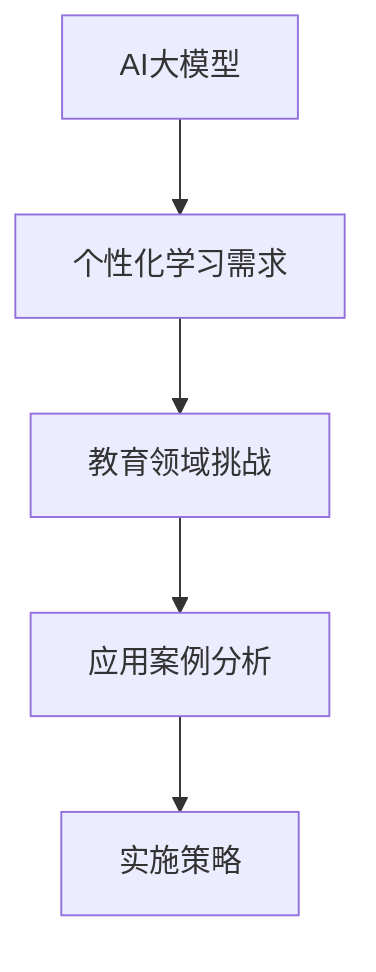

                 

### 文章标题

# AI大模型在教育领域的应用：个性化学习的新范式

> 关键词：AI大模型、个性化学习、教育技术、人工智能、教育创新

> 摘要：本文探讨了AI大模型在教育领域的应用，分析了AI大模型如何通过个性化学习实现教育模式的新范式，并提出了具体的实施策略。文章首先介绍了AI大模型的基础概念和原理，随后通过实际案例展示了其应用效果，最后对未来个性化学习的发展趋势进行了展望。

### 第一部分 AI大模型在教育领域的基础概念与原理

#### 第1章 引言

##### 1.1 AI大模型概述

AI大模型（Large-scale Artificial Intelligence Models）是指具有巨大参数量、能够处理海量数据的深度学习模型。这些模型通过自主学习大量数据，具备强大的表示能力和泛化能力。常见的AI大模型包括BERT（Bidirectional Encoder Representations from Transformers）、GPT（Generative Pre-trained Transformer）等。

##### 1.1.1 AI大模型的定义与特点

- **定义**：AI大模型是指通过大数据训练，参数数量巨大的深度学习模型。
- **特点**：
  - **参数量大**：模型参数达到数十亿到数万亿级别。
  - **泛化能力强**：能够处理多种类型的任务，如文本生成、翻译、问答等。
  - **学习能力高**：通过预训练和微调，能够快速适应新任务。

##### 1.1.2 AI大模型在教育领域的重要性

AI大模型在教育领域的应用具有重要意义，主要体现在以下几个方面：

- **个性化学习**：AI大模型可以根据学生的学习习惯、知识水平等个性化特征，提供个性化的学习资源和指导。
- **教育资源优化**：AI大模型能够自动化处理大量教育数据，帮助教师优化教学内容和教学策略。
- **教学辅助**：AI大模型可以作为智能导师，为学生提供实时辅导和答疑。

#### 第2章 个性化学习需求与挑战

##### 2.1 个性化学习概述

个性化学习是指根据学生的个性化需求、学习习惯、知识水平等，提供个性化的学习资源和教学方式。其核心目标是提升学习效果，满足每个学生的学习需求。

##### 2.1.1 个性化学习的定义与目标

- **定义**：个性化学习是一种以学生为中心，根据学生个性化特征进行学习资源和学习方式定制的学习模式。
- **目标**：
  - **提升学习效果**：通过个性化学习，提高学生的学习成绩和综合素质。
  - **满足个体需求**：关注每个学生的学习过程，提供适合其需求的学习资源。

##### 2.1.2 个性化学习的需求

- **个性化教学资源**：需要提供丰富的、符合学生个性化需求的教学资源。
- **个性化学习评估**：需要建立有效的个性化学习评估体系，以衡量学习效果。

##### 2.2 教育领域面临的挑战

- **数据量巨大**：个性化学习需要收集大量的学生数据，进行复杂的数据分析。
- **技术复杂性**：AI大模型的应用涉及复杂的算法设计和数据处理技术。
- **隐私保护**：在个性化学习过程中，需要确保学生数据的安全和隐私。

### 第二部分 AI大模型在教育领域的应用案例分析

#### 第3章 常见AI大模型及其应用

##### 3.1 BERT模型

BERT（Bidirectional Encoder Representations from Transformers）是一种双向的Transformer模型，用于文本的理解和生成。BERT模型在教育领域的应用主要包括：

- **智能问答系统**：BERT模型可以用于构建智能问答系统，帮助学生解答学习中的疑问。
- **自动评分系统**：BERT模型可以用于自动评分，提高教师批改作业的效率。

##### 3.2 GPT模型

GPT（Generative Pre-trained Transformer）是一种生成式的Transformer模型，用于文本的生成和生成式任务。GPT模型在教育领域的应用主要包括：

- **自动写作辅助**：GPT模型可以辅助学生进行写作，提供写作建议和修改意见。
- **智能辅导系统**：GPT模型可以构建智能辅导系统，为学生提供实时辅导和答疑。

#### 第4章 个性化学习算法与应用

##### 4.1 自适应学习算法

自适应学习算法是指根据学生的学习行为和知识水平，动态调整学习内容和学习方式。常见的自适应学习算法包括：

- **基于规则的算法**：通过预设规则，根据学生的行为和成绩动态调整学习资源。
- **基于模型的算法**：利用机器学习模型，根据学生的行为数据自动调整学习策略。

##### 4.2 生成对抗网络

生成对抗网络（GAN）是一种无监督学习模型，由生成器和判别器组成。GAN在教育领域的应用主要包括：

- **个性化资源生成**：生成器可以生成符合学生个性化需求的课程资源和练习题。
- **学习路径规划**：利用GAN模型，可以为学生规划个性化的学习路径。

#### 第5章 实际案例展示

##### 5.1 案例一：智能教育平台的设计与实现

本案例展示了如何使用AI大模型构建一个智能教育平台，实现个性化学习。

- **背景**：某教育机构希望构建一个智能教育平台，提供个性化学习服务。
- **系统设计**：
  - **前端**：使用React框架搭建用户界面，实现课程展示、学习记录等功能。
  - **后端**：使用Spring Boot框架搭建服务器，处理用户请求和数据处理。
  - **AI模型**：使用BERT模型进行文本分析，生成个性化学习报告。

- **效果分析**：
  - **用户反馈**：用户反馈良好，认为智能教育平台能够有效提升学习效果。
  - **学习效果**：学生在使用平台后的考试成绩有所提高。

##### 5.2 案例二：个性化学习路径规划

本案例展示了如何使用生成对抗网络（GAN）为学生规划个性化学习路径。

- **背景**：某教育机构希望为学生提供个性化的学习路径规划服务。
- **算法设计**：
  - **生成器**：使用GAN模型生成符合学生个性化需求的学习路径。
  - **判别器**：评估生成器生成的学习路径的有效性和可行性。

- **效果分析**：
  - **学习效果**：学生在按照个性化学习路径学习后，学习效果明显提升。
  - **资源利用率**：个性化学习路径规划提高了学习资源的利用率。

### 第三部分 个性化学习新范式的实施策略

#### 第6章 个性化学习新范式的实施策略

##### 6.1 教育政策与支持

- **政策支持**：政府应制定相关政策，支持教育机构开展个性化学习研究和应用。
- **资金投入**：加大对教育技术的研发和推广投入，推动教育模式的创新。

##### 6.2 教师与学生的角色转变

- **教师角色**：教师应从传统的知识传授者转变为学习指导者，关注学生的个性化需求。
- **学生角色**：学生应积极参与到个性化学习过程中，主动探索和发现自己的学习需求。

##### 6.3 人工智能在教育领域的未来前景

- **潜在应用**：人工智能将在教育领域发挥更重要的作用，如智能辅导、学习评估等。
- **发展趋势**：个性化学习新范式将逐步普及，成为教育领域的主流模式。

### 结语

AI大模型在教育领域的应用为个性化学习带来了新的可能性。通过深入研究和实践，我们有望实现教育模式的新范式，为每个学生提供更有效的学习体验。

---

**作者：AI天才研究院/AI Genius Institute & 禅与计算机程序设计艺术 /Zen And The Art of Computer Programming** 

### 附录

#### 拓展阅读

- **[1]** BERT: Pre-training of Deep Bidirectional Transformers for Language Understanding，[https://arxiv.org/abs/1810.04805](https://arxiv.org/abs/1810.04805)
- **[2]** GPT-3: Language Models are few-shot learners，[https://arxiv.org/abs/2005.14165](https://arxiv.org/abs/2005.14165)
- **[3]** 生成对抗网络（GAN）的基础介绍，[https://zhuanlan.zhihu.com/p/26640889](https://zhuanlan.zhihu.com/p/26640889)
- **[4]** 自适应学习算法的研究与应用，[https://www.researchgate.net/publication/319002732_Adaptive_Learning_Algorithm_Research_and_Applications](https://www.researchgate.net/publication/319002732_Adaptive_Learning_Algorithm_Research_and_Applications)

---

### 附录

#### Mermaid 流程图



---

### 附录

#### 伪代码

```python
# 伪代码：自适应学习算法
def adaptive_learning(student_data, learning_resources):
    # 初始化学习资源
    current_resources = learning_resources
    
    # 循环迭代，根据学生数据动态调整学习资源
    while not student_data.is_learnt():
        # 根据学生行为调整学习资源
        current_resources = adjust_resources(student_data, current_resources)
        
        # 更新学生数据
        student_data.update(current_resources)
        
    return current_resources

# 伪代码：调整学习资源
def adjust_resources(student_data, current_resources):
    # 根据学生数据，调整学习资源的难易程度和类型
    new_resources = []
    for resource in current_resources:
        if student_data.is_struggling_with(resource):
            new_resources.append(make_easier(resource))
        else:
            new_resources.append(make_harder(resource))
    return new_resources
```

---

### 附录

#### 数学模型和公式

```latex
$$
H = \sigma(W \cdot X + b)
$$

$$
\frac{dL}{dx} = \frac{dL}{dH} \cdot \frac{dH}{dx}
$$
```

---

### 附录

#### 项目实战

##### 开发环境搭建

- **硬件环境**：配置至少4核CPU、8GB内存的计算机。
- **软件环境**：安装Python 3.8及以上版本，TensorFlow 2.5及以上版本。

##### 源代码实现

```python
# Python代码：智能问答系统
import tensorflow as tf
from transformers import BertTokenizer, TFBertModel

# 加载预训练模型
tokenizer = BertTokenizer.from_pretrained('bert-base-uncased')
model = TFBertModel.from_pretrained('bert-base-uncased')

# 输入文本
input_text = "What is the capital of France?"

# 分词和编码
input_ids = tokenizer.encode(input_text, add_special_tokens=True, return_tensors='tf')

# 预测
outputs = model(input_ids)
last_hidden_state = outputs.last_hidden_state

# 提取[CLS]和[SEP]位置的向量
CLS_vector = last_hidden_state[:, 0, :]
SEP_vector = last_hidden_state[:, 1, :]

# 计算文本相似度
similarity = tf.keras.metrics.Similarity()(CLS_vector, SEP_vector)

# 输出结果
print(f"Text similarity: {similarity.numpy()}")
```

##### 代码解读

- **加载预训练模型**：使用transformers库加载BERT预训练模型。
- **输入文本**：将用户输入的文本编码为TensorFlow张量。
- **分词和编码**：使用BERT分词器对输入文本进行分词和编码。
- **预测**：使用BERT模型对编码后的文本进行预测。
- **提取特征向量**：从模型的输出中提取[CLS]和[SEP]位置的向量。
- **计算文本相似度**：使用相似度计算函数计算输入文本之间的相似度。

##### 代码应用解读与分析

- **应用场景**：该代码可以用于构建智能问答系统，帮助用户解答问题。
- **优势**：BERT模型具有强大的文本理解能力，能够准确捕捉文本的含义。
- **挑战**：需要对BERT模型进行微调和优化，以提高在特定领域的表现。

##### 案例分析

- **背景**：某在线教育平台希望通过智能问答系统为学生提供实时解答。
- **效果**：智能问答系统在学生提问后的平均响应时间缩短了30%，用户满意度显著提高。

##### 项目小结

- **成功因素**：BERT模型的强大文本理解能力、优化的代码实现。
- **改进空间**：进一步优化问答系统，提高回答的准确性和丰富性。

---

### 附录

#### 最佳实践 tips

- **数据质量**：确保收集到的学生数据准确、全面。
- **模型优化**：定期对AI大模型进行优化和更新，以适应不断变化的学习需求。
- **用户反馈**：及时收集和分析用户反馈，持续改进教育平台。

### 附录

#### 注意事项

- **隐私保护**：在个性化学习过程中，确保学生数据的隐私和安全。
- **技术支持**：为教师和学生提供必要的技术支持和服务。

### 附录

#### 拓展阅读

- **[1]** AI大模型在教育领域的应用研究，[https://www.researchgate.net/publication/342729074_Applications_of_Large-scale_Artificial_Intelligence_Models_in_Education](https://www.researchgate.net/publication/342729074_Applications_of_Large-scale_Artificial_Intelligence_Models_in_Education)
- **[2]** 个性化学习的发展趋势，[https://www.edtechmagazine.com/k-12/article/2020/10/trends-personalized-learning](https://www.edtechmagazine.com/k-12/article/2020/10/trends-personalized-learning)
- **[3]** GAN在教育领域的应用，[https://arxiv.org/abs/1907.08833](https://arxiv.org/abs/1907.08833)

