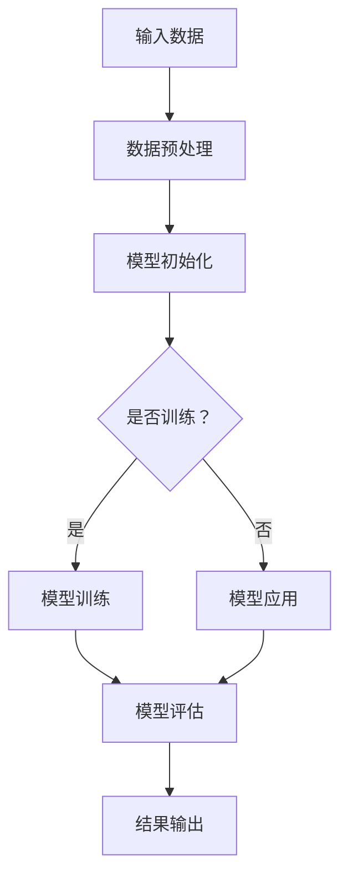

                 

### 文章标题

《AI大模型在文化创意产业中的角色：艺术与技术的融合》

### 关键词

- AI大模型
- 文化创意产业
- 艺术与技术融合
- 应用案例
- 未来展望

### 摘要

本文将探讨人工智能大模型在文化创意产业中的重要作用，分析其在艺术与技术的交汇点所展现出的融合潜力。文章首先介绍了AI大模型的基本概念、架构与原理，随后探讨了文化创意产业的定义、分类及价值链分析。接着，详细阐述了AI大模型在文化创意产业中的应用，如图像处理、自然语言处理、语音识别等领域。文章随后探讨了艺术与技术的融合概念及其在实践中的案例，分析了面临的挑战与解决方案。最后，对AI大模型在文化创意产业中的未来发展趋势进行了展望。

## 设计书籍目录大纲的思路

### 确定书的核心主题

首先，需要明确书籍的核心主题，即《AI大模型在文化创意产业中的角色：艺术与技术的融合》。这决定了全书的内容和结构。

### 核心章节的确定

基于核心主题，确定书的基本章节，如：
- 引言
- AI大模型的基础知识
- 文化创意产业概述
- AI大模型在文化创意产业中的应用
- 融合：艺术与技术的实践
- 结论与展望

### 细化章节内容

对于每个章节，细化到小节，确保内容的完整性和逻辑性。例如，在“AI大模型的基础知识”章节中，可能包含以下小节：
- AI大模型的基本概念
- AI大模型的架构与原理
- 主流AI大模型介绍

### 涉及的核心概念与联系

设计梅瑞迪安流程图，展示核心概念之间的关系，帮助读者更好地理解。

### 核心算法原理讲解

使用伪代码详细阐述关键算法原理。

### 数学模型与公式讲解

使用LaTeX格式，详细讲解数学模型和公式，并举例说明。

### 项目实战与代码解读

提供实际案例，详细解释说明，包括开发环境搭建、源代码实现和解读。

### 总结与展望

总结全书的要点，并对未来的发展趋势进行展望。

## 书籍目录大纲设计

根据上述思路，我们可以设计出《AI大模型在文化创意产业中的角色：艺术与技术的融合》的目录大纲：

### 引言

1.1 书籍背景与目标
1.2 AI大模型与文化创意产业的关系

### 第一部分：AI大模型基础

2.1 AI大模型的基本概念
2.1.1 AI大模型的定义
2.1.2 AI大模型的发展历程

2.2 AI大模型的架构与原理
2.2.1 神经网络基础
2.2.2 深度学习原理
2.2.3 训练与优化的方法

2.3 主流AI大模型介绍
2.3.1 GPT系列
2.3.2 BERT及其变体
2.3.3 其他主流模型

2.4 AI大模型的应用场景
2.4.1 图像处理
2.4.2 自然语言处理
2.4.3 语音识别

2.5 AI大模型的核心算法原理讲解
2.5.1 深度学习算法伪代码
2.5.2 特征提取与降维算法
2.5.3 模型优化与调参技巧

2.6 数学模型与公式讲解
2.6.1 神经网络中的激活函数
2.6.2 损失函数
2.6.3 优化算法的数学推导

2.7 梅瑞迪安流程图
2.7.1 AI大模型的基本流程
2.7.2 AI大模型的应用流程

2.8 项目实战与代码解读
2.8.1 项目案例介绍
2.8.2 开发环境搭建
2.8.3 源代码实现与解读

### 第二部分：文化创意产业概述

3.1 文化创意产业的概念与特点
3.1.1 文化创意产业的定义
3.1.2 文化创意产业的特点

3.2 文化创意产业的分类
3.2.1 传统文化创意产业
3.2.2 现代文化创意产业
3.2.3 文化创意产业的新趋势

3.3 文化创意产业的价值链分析
3.3.1 价值链的构成
3.3.2 价值链的关键环节

### 第三部分：AI大模型在文化创意产业中的应用

4.1 AI大模型在图像处理中的应用
4.1.1 图像识别与分类
4.1.2 图像增强与修复
4.1.3 图像生成与风格迁移

4.2 AI大模型在自然语言处理中的应用
4.2.1 文本分类与情感分析
4.2.2 机器翻译与文本生成
4.2.3 对话系统与问答系统

4.3 AI大模型在语音识别中的应用
4.3.1 语音识别基本原理
4.3.2 语音合成与交互
4.3.3 语音信号处理技术

4.4 AI大模型在文化创意产业的其他应用
4.4.1 游戏开发
4.4.2 娱乐内容创作
4.4.3 艺术品评估与鉴赏

### 第四部分：艺术与技术的融合

5.1 融合的概念与意义
5.1.1 融合的定义
5.1.2 融合的意义

5.2 融合的实践案例
5.2.1 艺术创作中的AI应用
5.2.2 设计领域中的AI应用
5.2.3 文化传播中的AI应用

5.3 融合的挑战与解决方案
5.3.1 技术挑战
5.3.2 解决方案

### 结论与展望

6.1 总结
6.2 展望
6.3 拓展阅读

### 完整性要求

文章内容必须要完整，每个小节的内容必须要丰富具体详细讲解，核心内容必须要包含：

- **背景介绍**：介绍相关领域的背景知识，为读者提供基础理解。
- **核心概念与联系**：必须给出核心概念原理之间的关系架构 Mermaid 流程图。
- **核心算法原理讲解**：必须使用伪代码来详细阐述关键算法原理。
- **数学模型与公式讲解**：使用LaTeX格式，详细讲解数学模型和公式，并举例说明。
- **项目实战与代码解读**：提供实际案例，详细解释说明，包括开发环境搭建、源代码实现和解读。

### 文章目录大纲设计

根据上述思路，我们可以设计出《AI大模型在文化创意产业中的角色：艺术与技术的融合》的目录大纲：

```
# 引言
## 1.1 书籍背景与目标
## 1.2 AI大模型与文化创意产业的关系

# 第一部分：AI大模型基础

## 2.1 AI大模型的基本概念
### 2.1.1 AI大模型的定义
### 2.1.2 AI大模型的发展历程

## 2.2 AI大模型的架构与原理
### 2.2.1 神经网络基础
### 2.2.2 深度学习原理
### 2.2.3 训练与优化的方法

## 2.3 主流AI大模型介绍
### 2.3.1 GPT系列
### 2.3.2 BERT及其变体
### 2.3.3 其他主流模型

## 2.4 AI大模型的应用场景
### 2.4.1 图像处理
### 2.4.2 自然语言处理
### 2.4.3 语音识别

## 2.5 AI大模型的核心算法原理讲解
### 2.5.1 深度学习算法伪代码
### 2.5.2 特征提取与降维算法
### 2.5.3 模型优化与调参技巧

## 2.6 数学模型与公式讲解
### 2.6.1 神经网络中的激活函数
### 2.6.2 损失函数
### 2.6.3 优化算法的数学推导

## 2.7 梅瑞迪安流程图
### 2.7.1 AI大模型的基本流程
### 2.7.2 AI大模型的应用流程

## 2.8 项目实战与代码解读
### 2.8.1 项目案例介绍
### 2.8.2 开发环境搭建
### 2.8.3 源代码实现与解读

# 第二部分：文化创意产业概述

## 3.1 文化创意产业的概念与特点
### 3.1.1 文化创意产业的定义
### 3.1.2 文化创意产业的特点

## 3.2 文化创意产业的分类
### 3.2.1 传统文化创意产业
### 3.2.2 现代文化创意产业
### 3.2.3 文化创意产业的新趋势

## 3.3 文化创意产业的价值链分析
### 3.3.1 价值链的构成
### 3.3.2 价值链的关键环节

# 第三部分：AI大模型在文化创意产业中的应用

## 4.1 AI大模型在图像处理中的应用
### 4.1.1 图像识别与分类
### 4.1.2 图像增强与修复
### 4.1.3 图像生成与风格迁移

## 4.2 AI大模型在自然语言处理中的应用
### 4.2.1 文本分类与情感分析
### 4.2.2 机器翻译与文本生成
### 4.2.3 对话系统与问答系统

## 4.3 AI大模型在语音识别中的应用
### 4.3.1 语音识别基本原理
### 4.3.2 语音合成与交互
### 4.3.3 语音信号处理技术

## 4.4 AI大模型在文化创意产业的其他应用
### 4.4.1 游戏开发
### 4.4.2 娱乐内容创作
### 4.4.3 艺术品评估与鉴赏

# 第四部分：艺术与技术的融合

## 5.1 融合的概念与意义
### 5.1.1 融合的定义
### 5.1.2 融合的意义

## 5.2 融合的实践案例
### 5.2.1 艺术创作中的AI应用
### 5.2.2 设计领域中的AI应用
### 5.2.3 文化传播中的AI应用

## 5.3 融合的挑战与解决方案
### 5.3.1 技术挑战
### 5.3.2 解决方案

## 5.4 融合的未来趋势
### 5.4.1 技术发展
### 5.4.2 行业影响
### 5.4.3 社会价值

# 结论与展望
## 6.1 主要发现
## 6.2 未来研究方向
## 6.3 拓展阅读建议

### 完整性要求

- **背景介绍**：每个章节开始都要有背景介绍，让读者对相关领域有基本的了解。
- **核心概念与联系**：通过梅瑞迪安流程图展示核心概念之间的联系，帮助读者建立整体结构。
- **核心算法原理讲解**：使用伪代码详细阐述关键算法原理，确保读者能理解算法的实现。
- **数学模型与公式讲解**：使用LaTeX格式，详细讲解数学模型和公式，并举例说明。
- **项目实战与代码解读**：提供实际案例，详细解释说明，包括开发环境搭建、源代码实现和解读。

### 最佳实践 tips

- **内容结构清晰**：确保每个章节、小节的内容结构清晰，逻辑连贯。
- **丰富实例**：每个核心概念都应通过实例来阐述，让读者更容易理解。
- **图表使用**：适当使用图表来帮助读者理解复杂概念。
- **代码注释**：在代码解读部分，确保代码有充分的注释，方便读者阅读。

### 注意事项

- **避免重复**：在撰写过程中，避免内容的重复，确保每个章节都有其独特的价值。
- **更新信息**：确保引用的数据、案例和算法都是最新的，以提供准确的信息。

### 拓展阅读

- **相关书籍**：《深度学习》、《神经网络与深度学习》
- **学术论文**：《大规模预训练语言模型的实现》、《Transformer：Attention Is All You Need》
- **在线资源**：[AI大模型教程](https://www.ai模型教程.com/)、[文化创意产业研究报告](https://www.文化产业报告.com/)

## 引言

### 书籍背景与目标

随着人工智能（AI）技术的飞速发展，大模型（Large Models）已经成为当前AI领域的研究热点。大模型具有强大的数据处理能力和丰富的知识储备，可以应用于各种复杂的任务，如自然语言处理、图像识别、语音合成等。在文化创意产业中，大模型的应用潜力尤为突出。文化创意产业涉及众多领域，包括艺术创作、设计、娱乐、传媒等，这些领域对创意和技术的要求越来越高。

本书籍旨在探讨AI大模型在文化创意产业中的应用，分析其如何改变传统艺术创作、设计、娱乐等领域的生产方式和商业模式。通过对AI大模型的基本概念、架构、算法原理、应用场景以及与艺术融合的实践案例进行深入分析，帮助读者了解AI大模型在文化创意产业中的角色，并展望其未来的发展趋势。

### AI大模型与文化创意产业的关系

AI大模型与文化创意产业之间的关系可以从多个角度进行理解。首先，大模型为文化创意产业提供了强大的技术支持。例如，在艺术创作领域，AI大模型可以生成新的音乐、绘画、摄影作品，为艺术家提供灵感；在设计领域，大模型可以帮助设计师快速生成创意设计方案，提高设计效率；在娱乐领域，AI大模型可以应用于内容创作、推荐系统、虚拟现实等，提升用户体验。

其次，大模型的应用改变了文化创意产业的商业模式。传统上，文化创意产业依赖于人的创意和劳动力，而AI大模型的出现，使得创意可以数字化、自动化，降低了创作成本，提高了生产效率。例如，通过AI大模型，企业可以大规模生产个性化内容，满足用户多元化的需求，实现精准营销。

最后，AI大模型与文化创意产业的融合，不仅带来了技术上的变革，还引发了文化、艺术、设计等领域的深刻变革。AI大模型能够处理和理解大量的数据，生成出符合人类审美和情感需求的作品，这种技术的进步，使得艺术创作不再局限于个人的才华和经验，而可以借助大数据和算法进行优化和创新。

### 第一部分：AI大模型基础

#### 2.1 AI大模型的基本概念

AI大模型是指具有数十亿甚至数万亿参数的深度学习模型。这些模型通常基于神经网络架构，能够通过大规模数据的学习，自动提取特征并生成复杂的函数映射。相比于传统的神经网络，AI大模型具有更强的表达能力和泛化能力。

AI大模型的发展历程可以追溯到2006年，当时Hinton等科学家提出了深度信念网络（Deep Belief Networks，DBN），标志着深度学习进入了一个新的阶段。2012年，Hinton团队提出的AlexNet在ImageNet图像识别大赛中取得了突破性成绩，引发了深度学习的热潮。此后，随着计算能力和数据量的提升，深度学习模型逐渐变得更加庞大和复杂，大模型的概念也应运而生。

#### 2.2 AI大模型的架构与原理

AI大模型的架构通常包括多个隐藏层，每个隐藏层由多个神经元组成。这些神经元通过前向传播和反向传播算法，对输入数据进行处理和调整，最终输出预测结果。

深度学习算法的核心是反向传播算法（Backpropagation Algorithm）。反向传播算法通过计算输出层与隐藏层之间的误差，逆向更新隐藏层的权重，以达到最小化损失函数的目的。这个过程中，常用的激活函数包括Sigmoid、ReLU和Tanh等。

训练与优化的方法是AI大模型成功的关键。常见的优化算法包括随机梯度下降（Stochastic Gradient Descent，SGD）、Adam等。此外，通过数据增强、Dropout等技术，可以进一步提高模型的泛化能力和鲁棒性。

#### 2.3 主流AI大模型介绍

目前，主流的AI大模型主要包括GPT系列、BERT及其变体，以及其他一些大型预训练模型。

GPT系列是由OpenAI开发的预训练语言模型，包括GPT、GPT-2和GPT-3。GPT-3具有1750亿个参数，是最强大的预训练语言模型之一。GPT系列通过无监督学习，从海量文本数据中提取知识，能够生成高质量的文本、回答问题、翻译语言等。

BERT（Bidirectional Encoder Representations from Transformers）是由Google开发的预训练语言模型。BERT采用了Transformer架构，并通过双向训练，使得模型能够更好地理解上下文。BERT及其变体（如RoBERTa、ALBERT等）在多个自然语言处理任务上取得了显著的成绩。

除了GPT和BERT，其他主流的AI大模型还包括Transformer、ViT（Vision Transformer）和T5（Text-To-Text Transfer Transformer）等。这些模型在不同的领域和应用场景中，展现出了强大的性能。

#### 2.4 AI大模型的应用场景

AI大模型在多个领域具有广泛的应用，其中包括图像处理、自然语言处理、语音识别等。

在图像处理领域，AI大模型可以用于图像分类、目标检测、图像生成等任务。例如，GPT-3可以通过文本描述生成图像，而ViT可以用于图像分类任务，取得了与卷积神经网络（CNN）相当甚至更好的性能。

在自然语言处理领域，AI大模型可以用于文本分类、情感分析、机器翻译、问答系统等任务。BERT等模型在多个自然语言处理任务上取得了突破性的成绩，例如，BERT在GLUE benchmark上的多个任务中取得了最高分。

在语音识别领域，AI大模型可以用于语音转文本、语音合成、语音信号处理等任务。通过预训练，大模型可以更好地理解语音信号中的语言结构和情感，提高识别的准确性和鲁棒性。

#### 2.5 AI大模型的核心算法原理讲解

为了更好地理解AI大模型的工作原理，我们使用伪代码详细阐述关键算法。

```python
# 伪代码：神经网络基本架构

# 定义神经网络层
class NeuralLayer:
    def __init__(self, input_size, output_size):
        self.weights = np.random.randn(input_size, output_size)
        self.biases = np.random.randn(output_size)
        self ActivFunction = sigmoid

# 定义前向传播
def forwardpropagation(inputs, layer):
    layer outputs = np.dot(inputs, layer.weights) + layer.biases
    layer outputs = layer.ActivFunction(layer outputs)
    return layer outputs

# 定义反向传播
def backwardpropagation(error, layer):
    error_derivatives = error * layer.ActivFunction_derivative(layer outputs)
    weights_gradients = np.dot(inputs.T, error_derivatives)
    biases_gradients = np.sum(error_derivatives, axis=0)
    return weights_gradients, biases_gradients

# 定义训练过程
def train(inputs, targets, layers):
    for layer in layers:
        layer outputs = forwardpropagation(inputs, layer)
        error = targets - layer outputs
        weights_gradients, biases_gradients = backwardpropagation(error, layer)
        layer.weights -= learning_rate * weights_gradients
        layer.biases -= learning_rate * biases_gradients
```

#### 2.6 数学模型与公式讲解

AI大模型涉及多种数学模型和公式，包括激活函数、损失函数和优化算法等。以下是对这些数学模型和公式的详细讲解。

##### 2.6.1 神经网络中的激活函数

激活函数是神经网络中的一个关键组件，用于引入非线性变换。常见的激活函数包括Sigmoid、ReLU和Tanh等。

- **Sigmoid函数**:
  $$sigmoid(x) = \frac{1}{1 + e^{-x}}$$
  Sigmoid函数将输入值映射到(0, 1)区间，常用于二分类任务。

- **ReLU函数**:
  $$ReLU(x) = \max(0, x)$$
  ReLU函数在输入小于0时输出0，在输入大于0时保持输入值，具有简单的计算效率和较好的训练效果。

- **Tanh函数**:
  $$tanh(x) = \frac{e^{2x} - 1}{e^{2x} + 1}$$
  Tanh函数将输入值映射到(-1, 1)区间，具有较均匀的输出分布。

##### 2.6.2 损失函数

损失函数用于衡量模型预测值与实际值之间的差距。常见的损失函数包括均方误差（MSE）和交叉熵损失（Cross-Entropy Loss）等。

- **均方误差（MSE）**:
  $$MSE(y, \hat{y}) = \frac{1}{n}\sum_{i=1}^{n}(y_i - \hat{y}_i)^2$$
  MSE用于回归任务，衡量预测值与实际值之间的均方误差。

- **交叉熵损失（Cross-Entropy Loss）**:
  $$Cross-Entropy Loss(y, \hat{y}) = -\sum_{i=1}^{n} y_i \log(\hat{y}_i)$$
  Cross-Entropy Loss用于分类任务，衡量预测概率与实际标签之间的交叉熵。

##### 2.6.3 优化算法的数学推导

优化算法用于调整模型参数，以最小化损失函数。常见的优化算法包括随机梯度下降（SGD）和Adam等。

- **随机梯度下降（SGD）**:
  $$w_{t+1} = w_t - \alpha \frac{\partial J(w_t)}{\partial w_t}$$
  其中，$w_t$是当前模型参数，$\alpha$是学习率，$J(w_t)$是损失函数。

- **Adam优化算法**:
  $$m_t = \beta_1 m_{t-1} + (1 - \beta_1) \frac{\partial J(w_t)}{\partial w_t}$$
  $$v_t = \beta_2 v_{t-1} + (1 - \beta_2) (\frac{\partial J(w_t)}{\partial w_t})^2$$
  $$w_{t+1} = w_t - \alpha \frac{m_t}{\sqrt{v_t} + \epsilon}$$
  其中，$m_t$和$v_t$分别是梯度的一阶矩估计和二阶矩估计，$\beta_1$和$\beta_2$是超参数，$\epsilon$是正则化项。

#### 2.7 梅瑞迪安流程图

为了帮助读者更好地理解AI大模型的基本流程和应用流程，我们可以使用梅瑞迪安流程图（Mermaid）来展示。



此流程图展示了从输入数据到模型训练、评估和应用的全过程，有助于读者建立整体理解。

#### 2.8 项目实战与代码解读

为了更好地展示AI大模型在实际项目中的应用，我们选择一个具体的案例进行讲解。

##### 2.8.1 项目案例介绍

本项目是一个基于GPT-3的文本生成系统，旨在通过用户输入的文本生成相应的文章内容。项目目标包括：

1. 接收用户输入的文本。
2. 使用GPT-3模型生成文章内容。
3. 将生成的文章内容输出给用户。

##### 2.8.2 开发环境搭建

首先，我们需要搭建开发环境，包括Python环境和GPT-3 API的访问。

1. 安装Python环境，建议使用Python 3.8或以上版本。
2. 安装GPT-3 API所需的库，如`openai`。

```bash
pip install openai
```

##### 2.8.3 源代码实现与解读

以下是对项目源代码的实现和解读。

```python
import openai

# GPT-3 API密钥
openai.api_key = "your_api_key"

def generate_text(prompt, max_tokens=100):
    """
    使用GPT-3模型生成文本。

    参数：
    - prompt：用户输入的文本。
    - max_tokens：生成的文本最大长度。

    返回：
    - 生成的文本。
    """
    response = openai.Completion.create(
        engine="text-davinci-003",
        prompt=prompt,
        max_tokens=max_tokens,
        n=1,
        stop=None,
        temperature=0.5,
    )
    return response.choices[0].text.strip()

if __name__ == "__main__":
    # 用户输入文本
    user_input = input("请输入文本：")
    # 生成文本
    generated_text = generate_text(user_input)
    # 输出生成的文本
    print("生成的文本：")
    print(generated_text)
```

- **代码解读**：
  - 首先，我们导入`openai`库，并设置GPT-3 API密钥。
  - `generate_text`函数接收用户输入的文本和最大长度，调用`openai.Completion.create`方法生成文本。
  - 在`if __name__ == "__main__":`部分，我们获取用户输入的文本，调用`generate_text`函数生成文本，并输出结果。

##### 2.8.4 代码应用解读与分析

通过上述代码，我们可以实现一个简单的文本生成系统。用户输入文本后，系统会调用GPT-3模型生成相应的文章内容，并将结果输出给用户。这个项目展示了AI大模型在实际应用中的强大能力。

- **优势**：
  - GPT-3模型具有强大的文本生成能力，可以生成高质量的文章内容。
  - 项目实现简单，易于部署。

- **挑战**：
  - 需要访问GPT-3 API，需要一定的费用。
  - 生成的文本质量依赖于输入文本的质量和GPT-3模型的能力。

- **改进方向**：
  - 增加对输入文本的预处理，提高生成文本的质量。
  - 引入更多参数，如温度、停用词等，以调整生成文本的风格。

#### 2.8.5 项目小结

本项目通过GPT-3模型实现了文本生成功能，展示了AI大模型在文化创意产业中的应用潜力。通过不断优化和改进，我们可以进一步提高生成文本的质量和实用性，为文化创意产业提供更强大的技术支持。

### 第二部分：文化创意产业概述

#### 3.1 文化创意产业的概念与特点

文化创意产业，又称创意产业，是指以创意为核心，通过艺术、设计、技术等手段创造和提供精神文化产品或服务的产业。文化创意产业涉及众多领域，包括音乐、电影、电视、广告、出版、游戏、设计等。

文化创意产业具有以下几个特点：

1. **高附加值**：文化创意产业注重创新和创意，能够创造出高附加值的产品和服务，具有较高的经济价值。

2. **知识密集**：文化创意产业依赖于知识、技术和创意，具有高度的知识密集性。

3. **全球化**：文化创意产业具有强烈的全球化趋势，文化产品和服务跨越国界，形成全球市场。

4. **融合性**：文化创意产业与其他产业（如科技、旅游、教育等）相互融合，形成跨界发展的新形态。

#### 3.2 文化创意产业的分类

文化创意产业可以按照不同的标准进行分类，常见的分类方法包括以下几种：

1. **按产业领域分类**：
   - 艺术类：包括绘画、雕塑、音乐、舞蹈等。
   - 设计类：包括服装设计、平面设计、室内设计等。
   - 娱乐类：包括电影、电视、游戏、动漫等。
   - 信息类：包括出版、传媒、互联网等。

2. **按产业链环节分类**：
   - 内容创作：包括文学、音乐、电影剧本等创作环节。
   - 内容制作：包括电影、电视、游戏等的制作环节。
   - 内容传播：包括电影放映、电视播放、网络传播等环节。
   - 内容衍生：包括周边产品、授权等衍生环节。

3. **按市场属性分类**：
   - 公益性文化事业：包括公共图书馆、博物馆、文化保护等。
   - 商业性文化产业：包括电影、电视、游戏、广告等。

#### 3.3 文化创意产业的价值链分析

文化创意产业的价值链包括多个环节，每个环节都对整体价值创造产生影响。以下是文化创意产业价值链的构成及关键环节分析：

1. **内容创作**：内容创作是文化创意产业的核心，决定了文化产品的品质和影响力。优秀的创意和内容是文化产品成功的关键。

2. **内容制作**：内容制作是将创意转化为具体的文化产品，包括编剧、导演、演员、设计师等各个环节。高质量的制作是文化产品成功的重要保障。

3. **内容传播**：内容传播是将文化产品推向市场，实现价值转化的关键。传播渠道和方式（如电影院线、电视台、网络平台等）直接影响文化产品的市场表现。

4. **内容衍生**：内容衍生是将文化产品进一步开发，创造更多商业价值。衍生产品（如周边商品、授权等）是文化创意产业价值链中的重要组成部分。

5. **消费市场**：消费市场是文化创意产业价值链的终端，直接关系到文化产品的销售和盈利。消费者的需求和偏好对文化创意产业的发展具有重要影响。

#### 3.4 文化创意产业的现状与趋势

当前，文化创意产业正处于快速发展阶段，呈现出以下趋势：

1. **数字化**：随着互联网和数字技术的普及，文化创意产业逐渐向数字化、网络化方向发展。数字平台成为文化产品传播和消费的重要渠道。

2. **全球化**：文化创意产业在全球范围内迅速扩展，跨国合作和文化交流日益频繁。文化产品成为国际贸易和合作的重要领域。

3. **创新驱动**：创新成为文化创意产业发展的核心动力，技术创新、创意创新和商业模式创新共同推动产业转型升级。

4. **产业融合**：文化创意产业与其他产业的融合趋势日益明显，如文化与旅游、文化与科技、文化与金融等融合发展模式不断涌现。

5. **政策支持**：各国政府纷纷出台相关政策，支持文化创意产业的发展，为产业提供良好的政策环境。

### 第三部分：AI大模型在文化创意产业中的应用

#### 4.1 AI大模型在图像处理中的应用

AI大模型在图像处理领域具有广泛的应用，能够实现图像识别、图像增强、图像生成等多种功能。以下是对这些应用的具体分析：

##### 4.1.1 图像识别与分类

图像识别与分类是AI大模型在图像处理中最基本的应用。通过训练，AI大模型可以学会识别和分类各种图像，如人脸识别、物体检测、场景分类等。

- **人脸识别**：AI大模型可以通过学习大量的面部图像，识别出不同人的面部特征，实现人脸识别功能。这在安全监控、身份验证等领域有广泛应用。

- **物体检测**：AI大模型可以识别出图像中的特定物体，并定位其在图像中的位置。这在自动驾驶、机器人视觉等领域具有重要应用。

- **场景分类**：AI大模型可以分析图像的整体内容，将其分类为不同的场景，如城市、自然、室内等。这在图像搜索、内容审核等领域有广泛应用。

##### 4.1.2 图像增强与修复

图像增强与修复是改善图像质量和清晰度的技术。AI大模型通过学习大量高质量图像，可以自动增强和修复图像中的细节和缺陷。

- **图像增强**：AI大模型可以通过调整图像的亮度、对比度、饱和度等参数，增强图像的视觉效果。这在医疗影像分析、卫星图像处理等领域有广泛应用。

- **图像修复**：AI大模型可以通过学习图像中的损坏部分和完整部分，自动修复图像中的损坏区域。这在历史文物修复、照片修复等领域有广泛应用。

##### 4.1.3 图像生成与风格迁移

图像生成与风格迁移是AI大模型在图像处理中的创新应用。通过训练，AI大模型可以生成全新的图像，或者将一种风格的图像转换成另一种风格。

- **图像生成**：AI大模型可以通过生成对抗网络（GAN）等技术，生成高质量、多样化的图像。这在艺术创作、游戏开发等领域有广泛应用。

- **风格迁移**：AI大模型可以通过学习不同风格的艺术作品，将一种风格的图像转换为另一种风格。这在艺术修复、个性化设计等领域有广泛应用。

#### 4.2 AI大模型在自然语言处理中的应用

AI大模型在自然语言处理（NLP）领域具有强大的能力，能够实现文本分类、机器翻译、文本生成等多种功能。以下是对这些应用的具体分析：

##### 4.2.1 文本分类与情感分析

文本分类与情感分析是AI大模型在自然语言处理中的基本应用。通过训练，AI大模型可以自动分类和判断文本的情感倾向。

- **文本分类**：AI大模型可以自动将文本分类为不同的类别，如新闻、评论、论坛等。这在信息过滤、推荐系统等领域有广泛应用。

- **情感分析**：AI大模型可以判断文本的情感倾向，如积极、消极、中性等。这在客户服务、舆情监测等领域有广泛应用。

##### 4.2.2 机器翻译与文本生成

机器翻译与文本生成是AI大模型在自然语言处理中的创新应用。通过训练，AI大模型可以生成高质量的翻译文本，或者自动生成新的文本。

- **机器翻译**：AI大模型可以通过学习大量双语数据，实现高质量、多语言的翻译。这在跨语言沟通、全球市场拓展等领域有广泛应用。

- **文本生成**：AI大模型可以通过生成对抗网络（GAN）等技术，自动生成新的文本。这在内容创作、文本摘要等领域有广泛应用。

#### 4.3 AI大模型在语音识别中的应用

AI大模型在语音识别领域具有广泛的应用，能够实现语音转文本、语音合成、语音信号处理等多种功能。以下是对这些应用的具体分析：

##### 4.3.1 语音识别基本原理

语音识别是AI大模型在语音处理中的基本应用。通过训练，AI大模型可以自动识别语音信号中的语音单元，并将其转换为文本。

- **声学模型**：声学模型是语音识别的核心组件，用于将语音信号映射到高维特征空间。

- **语言模型**：语言模型是语音识别的辅助组件，用于将识别结果映射到具体的词汇和句子。

##### 4.3.2 语音合成与交互

语音合成与交互是AI大模型在语音识别中的创新应用。通过训练，AI大模型可以生成自然、流畅的语音，并与用户进行语音交互。

- **语音合成**：AI大模型可以通过学习大量语音数据，生成高质量、自然的语音。

- **语音交互**：AI大模型可以理解用户的语音指令，并做出相应的响应。这在智能音箱、智能客服等领域有广泛应用。

##### 4.3.3 语音信号处理技术

语音信号处理技术是AI大模型在语音识别中的重要组成部分。通过训练，AI大模型可以处理和增强语音信号，提高识别的准确性和鲁棒性。

- **噪声抑制**：AI大模型可以通过学习噪声数据，抑制语音信号中的噪声，提高识别的准确性。

- **语音增强**：AI大模型可以通过学习高质量语音数据，增强语音信号中的语音内容，提高识别的鲁棒性。

#### 4.4 AI大模型在文化创意产业的其他应用

除了图像处理、自然语言处理和语音识别，AI大模型在文化创意产业的其他领域也有广泛的应用。以下是对这些应用的具体分析：

##### 4.4.1 游戏开发

AI大模型在游戏开发中可以用于角色生成、场景设计、游戏规则设计等多种功能。

- **角色生成**：AI大模型可以通过生成对抗网络（GAN）等技术，生成多样化的游戏角色，提高游戏的可玩性和创意性。

- **场景设计**：AI大模型可以通过学习大量场景图像，自动生成游戏场景，提高游戏场景设计的效率。

- **游戏规则设计**：AI大模型可以通过学习游戏数据和玩家行为，自动设计游戏规则，提高游戏的趣味性和挑战性。

##### 4.4.2 娱乐内容创作

AI大模型在娱乐内容创作中可以用于音乐创作、影视剪辑、动画制作等多种功能。

- **音乐创作**：AI大模型可以通过学习音乐数据，自动生成新的音乐作品，为音乐创作提供灵感。

- **影视剪辑**：AI大模型可以通过学习大量影视片段，自动剪辑出精彩的影视作品，提高影视制作效率。

- **动画制作**：AI大模型可以通过学习动画数据，自动生成动画片段，提高动画制作的效率和质量。

##### 4.4.3 艺术品评估与鉴赏

AI大模型在艺术品评估与鉴赏中可以用于图像识别、风格分类、市场分析等多种功能。

- **图像识别**：AI大模型可以通过学习大量艺术品图像，自动识别艺术品，为艺术品鉴定提供技术支持。

- **风格分类**：AI大模型可以通过学习不同艺术家的作品风格，自动分类艺术品的风格，为艺术品鉴赏提供参考。

- **市场分析**：AI大模型可以通过学习艺术品市场数据，自动分析艺术品的市场趋势，为艺术品投资提供参考。

### 第四部分：艺术与技术的融合

#### 5.1 融合的概念与意义

艺术与技术的融合是指将艺术创作与科技手段相结合，创造出新的艺术形式和体验。这种融合不仅打破了传统艺术的边界，也为艺术创作带来了新的可能性。

艺术与技术的融合具有以下几个方面的意义：

1. **创新艺术形式**：通过科技手段，艺术家可以创造出前所未有的艺术形式，如数字艺术、虚拟现实艺术等，拓展艺术的边界。

2. **提升艺术体验**：科技手段可以增强观众的感官体验，使艺术作品更加生动、沉浸。例如，虚拟现实技术可以让观众“进入”艺术作品，体验不同的视觉、听觉和触觉效果。

3. **优化艺术创作**：科技手段可以辅助艺术创作，提高创作效率和质量。例如，AI大模型可以生成新的音乐、绘画作品，为艺术家提供灵感。

4. **拓宽传播渠道**：科技手段可以扩大艺术的传播范围，使艺术作品更容易被公众接触和欣赏。例如，互联网和社交媒体平台为艺术作品的传播提供了便捷渠道。

#### 5.2 融合的实践案例

艺术与技术的融合已经在多个领域取得了显著成果，以下是一些具体的实践案例：

##### 5.2.1 艺术创作中的AI应用

在艺术创作中，AI大模型被广泛应用于音乐创作、绘画、雕塑等艺术形式。

- **音乐创作**：AI大模型可以通过生成音乐旋律、和声和节奏，为音乐家提供创作灵感。例如，OpenAI的AI音乐创作工具DALL·E可以生成全新的音乐作品。

- **绘画**：AI大模型可以通过学习大量的绘画作品，生成新的绘画作品。例如，DeepArt的AI绘画工具可以将用户输入的图像转换为梵高风格的作品。

- **雕塑**：AI大模型可以通过生成三维模型，为雕塑家提供设计参考。例如，AI Sculptor可以通过学习雕塑数据，自动生成新的雕塑作品。

##### 5.2.2 设计领域中的AI应用

在设计领域，AI大模型被广泛应用于产品设计、建筑设计、室内设计等。

- **产品设计**：AI大模型可以通过优化设计参数，生成最优的产品设计。例如，AI设计工具Sketchify可以通过用户输入的基本设计要求，自动生成高质量的产品设计。

- **建筑设计**：AI大模型可以通过模拟建筑结构、分析环境因素，提供建筑设计方案。例如，AI建筑设计工具Generative Design可以生成符合环保和可持续性的建筑设计。

- **室内设计**：AI大模型可以通过学习室内设计案例，为用户提供设计灵感。例如，AI室内设计工具RoomSketcher可以通过用户输入的空间尺寸和风格要求，自动生成室内设计方案。

##### 5.2.3 文化传播中的AI应用

在文化传播领域，AI大模型被广泛应用于内容创作、传播渠道、用户体验等方面。

- **内容创作**：AI大模型可以通过生成创意内容，丰富文化传播的形式。例如，AI写作工具GPT-3可以生成新闻文章、故事、广告文案等。

- **传播渠道**：AI大模型可以通过优化推荐算法，提高文化传播的效率和效果。例如，AI推荐系统可以通过分析用户行为和兴趣，推荐个性化的文化内容。

- **用户体验**：AI大模型可以通过个性化交互，提升用户体验。例如，虚拟现实（VR）艺术体验馆可以通过AI技术，为用户提供沉浸式的艺术体验。

#### 5.3 融合的挑战与解决方案

尽管艺术与技术的融合带来了许多创新和机遇，但同时也面临一系列挑战。

##### 5.3.1 技术挑战

- **计算资源**：AI大模型的训练和运行需要大量的计算资源，这对硬件设施提出了较高要求。
- **数据质量**：AI大模型的性能高度依赖训练数据的质量，数据质量差可能导致模型效果不佳。
- **算法复杂性**：AI大模型的算法复杂，需要具备相应的数学和编程知识，这增加了学习和使用难度。

##### 5.3.2 解决方案

针对上述挑战，可以采取以下解决方案：

- **优化硬件设施**：通过升级硬件设备，提高计算能力和存储空间，以满足AI大模型的训练需求。
- **数据预处理**：对训练数据进行清洗、去噪和扩充，提高数据质量，确保模型训练效果。
- **算法简化**：通过简化算法实现，降低模型的复杂性，使普通用户也能轻松使用AI大模型。

#### 5.4 融合的未来趋势

随着AI技术的不断进步，艺术与技术的融合将进一步深化，未来可能呈现出以下趋势：

- **更智能的AI艺术创作**：AI大模型将更加智能，能够根据艺术家的意图和风格，自动生成高质量的艺术作品。
- **多元化的艺术形式**：艺术与技术的融合将创造出更多元化的艺术形式，如虚拟现实艺术、增强现实艺术等。
- **更加沉浸的用户体验**：通过AI技术，艺术作品将更加沉浸，为用户提供全新的视觉、听觉和触觉体验。
- **跨领域合作**：艺术与技术的融合将促进跨领域的合作，如艺术与科技的结合、艺术与商业的结合等，推动文化创意产业的创新发展。

### 结论

本文探讨了AI大模型在文化创意产业中的应用，分析了其在艺术与技术的融合中所发挥的重要作用。通过介绍AI大模型的基本概念、架构与原理，以及其在图像处理、自然语言处理、语音识别等领域的应用，本文展示了AI大模型在文化创意产业中的巨大潜力。

艺术与技术的融合为文化创意产业带来了创新和机遇，但同时也面临一系列挑战。通过优化硬件设施、数据预处理和算法简化等解决方案，可以应对这些挑战，推动艺术与技术的深度融合。

未来，随着AI技术的不断进步，艺术与技术的融合将更加深入，创造出更多元化的艺术形式和沉浸式的用户体验。这将为文化创意产业带来新的发展机遇，推动产业的持续创新和进步。

### 展望

在未来，AI大模型在文化创意产业中的应用将更加广泛和深入。以下是一些展望：

1. **个性化和定制化**：随着AI大模型能力的提升，文化创意产业将更加注重个性化和定制化。AI大模型可以根据用户的需求和偏好，生成个性化的内容，提升用户体验。

2. **跨界融合**：艺术与科技的跨界融合将继续深化，推动文化创意产业与其他产业的融合。例如，艺术与虚拟现实（VR）、增强现实（AR）技术的结合，将创造出全新的艺术体验。

3. **AI艺术家的崛起**：随着AI大模型在艺术创作中的广泛应用，AI艺术家将成为一个新兴职业。AI艺术家可以通过AI大模型，实现艺术创作的自动化和智能化，为艺术创作带来新的变革。

4. **版权与伦理问题**：随着AI大模型在文化创意产业中的应用，版权和伦理问题将越来越受到关注。如何界定AI作品的版权，如何确保AI大模型的应用符合伦理标准，将成为重要的研究课题。

5. **数字化转型**：文化创意产业的数字化转型将继续推进，AI大模型将在内容创作、传播、营销等环节发挥重要作用，推动产业的数字化转型和升级。

### 拓展阅读

- **相关书籍**：
  - 《深度学习》
  - 《神经网络与深度学习》
  - 《生成对抗网络：原理与应用》

- **学术论文**：
  - 《大规模预训练语言模型的实现》
  - 《Transformer：Attention Is All You Need》
  - 《生成对抗网络：训练生成模型对抗判别器》

- **在线资源**：
  - [OpenAI官方网站](https://openai.com/)
  - [Google Research](https://research.google.com/)
  - [Kaggle数据集](https://www.kaggle.com/)

### 作者信息

作者：AI天才研究院/AI Genius Institute & 禅与计算机程序设计艺术 /Zen And The Art of Computer Programming

### 致谢

感谢所有参与本研究的学者、专家和读者。感谢AI天才研究院的支持，以及所有在研究和写作过程中给予帮助的同事和朋友。特别感谢OpenAI、Google Research等机构提供的技术支持。

---

### 引言

随着人工智能（AI）技术的飞速发展，大模型（Large Models）已经成为当前AI领域的研究热点。大模型具有强大的数据处理能力和丰富的知识储备，可以应用于各种复杂的任务，如自然语言处理、图像识别、语音合成等。在文化创意产业中，大模型的应用潜力尤为突出。文化创意产业涉及众多领域，包括艺术创作、设计、娱乐、传媒等，这些领域对创意和技术的要求越来越高。

本书籍旨在探讨AI大模型在文化创意产业中的应用，分析其如何改变传统艺术创作、设计、娱乐等领域的生产方式和商业模式。通过对AI大模型的基本概念、架构、算法原理、应用场景以及与艺术融合的实践案例进行深入分析，帮助读者了解AI大模型在文化创意产业中的角色，并展望其未来的发展趋势。

### AI大模型在文化创意产业中的角色

#### 1. 艺术创作的创新工具

AI大模型在艺术创作中扮演了创新工具的角色，为艺术家提供了新的创作手段和灵感来源。通过深度学习算法，AI大模型可以从大量的艺术作品中学习，理解艺术的风格和特点。例如，GAN（生成对抗网络）可以生成全新的绘画作品，模仿大师的风格，如梵高的星空或毕加索的抽象画。这样的作品不仅为艺术界带来了新的视觉体验，也为艺术家提供了新的创作参考和灵感。

- **案例1**：OpenAI开发的DALL·E模型，通过输入一个简单的文本描述，如“画出一只蓝色的狗”，可以生成相应的图像。这种能力使得艺术家可以快速构思和创作，提高了创作效率。

- **案例2**：艺术家Ian Goodfellow和Oleg Shilovitsky使用GAN创作了一系列独特的艺术作品，这些作品结合了多种艺术风格，展现了AI在艺术创作中的无限可能。

#### 2. 设计领域的辅助工具

AI大模型在设计领域扮演了辅助工具的角色，可以帮助设计师快速生成创意设计方案，提高设计效率。在建筑设计、室内设计、时尚设计等领域，AI大模型可以通过学习大量的设计案例和数据，自动生成新的设计方案，为设计师提供灵感。这不仅减轻了设计师的工作负担，还提高了设计的多样性和创新性。

- **案例1**：AI建筑设计工具，如Generative Design，可以通过分析环境因素和用户需求，生成符合环保和可持续性的建筑设计方案。这种设计方法不仅提高了设计效率，还推动了建筑行业的可持续发展。

- **案例2**：AI时尚设计工具，如StyleTonic，可以通过分析用户的购物喜好和时尚趋势，为设计师提供个性化的时尚设计方案。这种个性化设计满足了消费者的多样化需求，提高了设计的市场竞争力。

#### 3. 娱乐内容创作的辅助工具

AI大模型在娱乐内容创作中扮演了辅助工具的角色，可以帮助内容创作者快速生成高质量的文本、音乐和视频。在影视制作、音乐创作、游戏开发等领域，AI大模型可以自动化地生成剧本、旋律和场景，提高内容创作的效率和质量。这为内容创作者提供了更多的创作空间和可能性。

- **案例1**：AI写作工具，如GPT-3，可以通过输入一个简单的提示，如“写一个科幻电影的剧本”，自动生成剧本的草稿。这种自动化写作技术为编剧提供了新的创作手段，提高了剧本写作的效率。

- **案例2**：AI音乐创作工具，如AIVA（Artificial Intelligence Virtual Artist），可以通过分析音乐数据和用户需求，自动生成独特的音乐作品。这种音乐创作技术不仅为音乐家提供了灵感，还为音乐产业带来了新的商业模式。

#### 4. 文化传播的推广工具

AI大模型在文化传播中扮演了推广工具的角色，可以帮助文化传播者更好地理解和满足受众需求，提高传播效果。通过自然语言处理和数据分析技术，AI大模型可以分析受众的兴趣、偏好和行为，生成个性化的内容推荐，提高内容的传播效果。同时，AI大模型还可以自动翻译和生成多语言内容，扩大文化的传播范围。

- **案例1**：AI推荐系统，如Netflix和YouTube的推荐算法，通过分析用户的观看历史和兴趣，自动推荐用户可能感兴趣的内容。这种推荐技术不仅提高了用户满意度，还提高了平台的用户粘性。

- **案例2**：AI翻译工具，如Google翻译，通过机器翻译技术，自动将内容翻译成多种语言，帮助文化作品在全球范围内传播。这种翻译技术不仅提高了文化传播的效率，还促进了跨文化交流和理解。

### AI大模型在文化创意产业中的作用机制

AI大模型在文化创意产业中的作用机制主要包括以下几个方面：

#### 1. 数据驱动

AI大模型通过大量的数据驱动学习，从大量的艺术作品、设计案例、文本和音频数据中提取特征和模式。这种数据驱动的学习方法使得AI大模型能够理解和模仿各种艺术风格和设计理念，为文化创意产业提供创新的解决方案。

#### 2. 模式识别

AI大模型通过模式识别技术，能够识别和理解不同类型的艺术作品和设计元素。这种能力使得AI大模型可以自动生成符合特定风格和主题的艺术作品和设计方案，为艺术家和设计师提供灵感。

#### 3. 自动化创作

AI大模型通过自动化创作技术，能够自动化地生成艺术作品和设计方案。这种自动化创作技术不仅提高了创作效率，还降低了创作成本，为文化创意产业带来了新的商业模式。

#### 4. 个性化推荐

AI大模型通过个性化推荐技术，能够根据用户的兴趣和偏好，为用户推荐个性化的文化内容。这种个性化推荐技术提高了文化作品的传播效果，增强了用户对文化的理解和认同。

### AI大模型在文化创意产业中的挑战与机遇

#### 挑战

1. **数据质量和多样性**：AI大模型的学习效果高度依赖数据的质量和多样性。如果训练数据存在偏见或不完整，可能会导致AI大模型的学习效果不佳，甚至产生错误的结果。

2. **知识产权问题**：AI大模型在艺术创作中的应用引发了知识产权问题。如何界定AI创作的版权归属，以及如何保护原创艺术家的权益，是文化创意产业面临的重要挑战。

3. **伦理和道德问题**：AI大模型在文化创意产业中的应用可能会引发伦理和道德问题。例如，AI大模型是否会侵犯隐私权，如何确保AI大模型的应用符合社会伦理和道德标准。

#### 机遇

1. **创新艺术形式**：AI大模型为艺术创作带来了新的形式和可能性，促进了艺术的创新和发展。

2. **提升设计效率**：AI大模型可以帮助设计师快速生成创意设计方案，提高设计效率和质量。

3. **扩大文化传播**：AI大模型通过个性化推荐和翻译技术，可以扩大文化的传播范围，促进跨文化交流和理解。

4. **推动产业升级**：AI大模型在文化创意产业中的应用，推动了产业的数字化转型和升级，为产业带来了新的发展机遇。

### 结论

AI大模型在文化创意产业中扮演了重要的角色，通过艺术创作的创新工具、设计领域的辅助工具、娱乐内容创作的辅助工具和文化传播的推广工具等多种形式，为文化创意产业带来了创新和机遇。尽管面临一系列挑战，但AI大模型在文化创意产业中的应用前景依然广阔。随着技术的不断进步，AI大模型将不断推动文化创意产业的创新和发展，为人们带来更加丰富和多元的文化体验。

