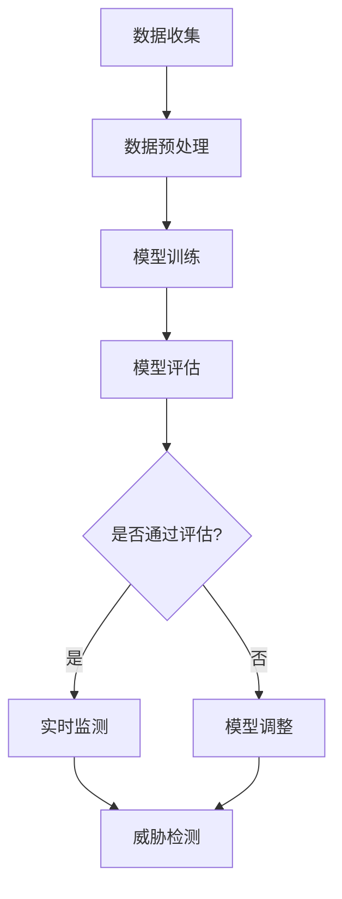

                 

### 文章标题

# AI大模型在网络安全中的角色：智能防御与威胁检测

### 关键词

- AI大模型
- 网络安全
- 智能防御
- 威胁检测
- 安全威胁

### 摘要

随着人工智能技术的飞速发展，AI大模型在各个领域展现出了巨大的潜力。本文旨在探讨AI大模型在网络安全中的角色，尤其是其在智能防御和威胁检测方面的应用。文章首先介绍了AI大模型的基本概念及其在网络安全中的重要性，接着详细分析了AI大模型在网络安全中的应用场景，包括智能防御和威胁检测技术。随后，文章讨论了AI大模型面临的挑战以及未来的发展方向。通过本文的探讨，读者可以全面了解AI大模型在网络安全领域的重要性和应用前景。

### 目录

1. **引言**
2. **AI大模型的基本概念**
3. **网络安全中的AI大模型**
4. **AI大模型在网络安全中的应用**
   1. **智能防御**
   2. **威胁检测**
5. **AI大模型在网络安全中的挑战**
6. **AI大模型在网络安全中的未来发展方向**
7. **总结**

### 1. 引言

随着互联网的普及和信息技术的发展，网络安全问题越来越受到广泛关注。传统的网络安全防护手段往往依赖于静态规则和特征匹配，无法有效应对不断演变的新型攻击手段。在这种背景下，人工智能，尤其是AI大模型，以其强大的计算能力和自我学习能力，为网络安全领域带来了新的契机。AI大模型可以通过学习大量的网络安全数据，识别出潜在的安全威胁，并采取相应的防御措施，从而提高网络系统的安全性。

本文旨在探讨AI大模型在网络安全中的角色，尤其是其在智能防御和威胁检测方面的应用。文章将首先介绍AI大模型的基本概念，然后分析AI大模型与网络安全的关系，接着详细探讨AI大模型在网络安全中的应用，包括智能防御和威胁检测技术。此外，文章还将讨论AI大模型在网络安全中面临的挑战，以及其未来的发展方向。通过本文的探讨，读者可以全面了解AI大模型在网络安全领域的重要性和应用前景。

### 2. AI大模型的基本概念

AI大模型，又称大型深度学习模型，是指那些规模巨大、参数众多的神经网络模型。这些模型通常拥有数十亿甚至数万亿个参数，能够在海量数据上进行训练，以实现高度复杂的学习任务。AI大模型的核心在于其深度学习和自我学习的能力，这使得它们能够自动从数据中学习规律，并不断优化自己的性能。

深度学习是AI大模型的基础，它通过多层神经网络对数据进行层层抽象和变换，从而实现复杂的特征提取和模式识别。每一层神经网络都能捕捉到更高层次的特征，最终形成对数据的全面理解。自我学习是指AI大模型在训练过程中能够通过不断调整内部参数，优化自己的模型结构和性能。这种自我学习能力使得AI大模型能够不断适应新的数据和环境，提高其预测和决策能力。

AI大模型的主要特点是计算密集和高维特征表示。计算密集意味着AI大模型需要大量的计算资源来训练和推理，这要求高性能的硬件支持和优化的算法。高维特征表示则是指AI大模型能够捕捉到高维空间中的复杂关系和模式，这使得它们在图像识别、自然语言处理、推荐系统等领域表现优异。

AI大模型的主要应用领域包括图像识别、自然语言处理、语音识别、推荐系统、医学诊断等。例如，在图像识别领域，AI大模型通过学习大量的图像数据，可以准确识别出各种物体和场景；在自然语言处理领域，AI大模型可以理解和生成人类语言，实现文本翻译、情感分析等任务；在语音识别领域，AI大模型可以通过处理音频信号，将语音转换为文字，实现语音助手等功能；在推荐系统领域，AI大模型可以根据用户的兴趣和行为，为其推荐感兴趣的内容；在医学诊断领域，AI大模型可以分析医学影像数据，辅助医生进行疾病诊断。

### 3. 网络安全中的AI大模型

网络安全是保护网络系统免受恶意攻击、数据泄露和非法访问的重要领域。随着网络攻击手段的日益复杂和多变，传统的网络安全防御手段已经难以满足需求。AI大模型的出现，为网络安全领域带来了新的希望。

AI大模型在网络安全中的作用主要体现在以下几个方面：

**威胁检测与防御**：AI大模型可以通过学习大量的网络安全数据，识别出潜在的安全威胁，并采取相应的防御措施。例如，通过分析网络流量数据，AI大模型可以检测出异常流量模式，从而预警潜在的入侵行为。同时，AI大模型还可以根据已知的攻击特征，实时更新防御策略，提高网络系统的安全性。

**异常行为识别**：AI大模型能够识别出网络系统中的异常行为，如恶意软件的传播、数据泄露、未经授权的访问等。通过建立正常行为模型，AI大模型可以实时监测网络活动，一旦发现异常，立即采取行动，防止潜在的安全事件发生。

**安全事件响应**：AI大模型可以在安全事件发生后，快速响应并采取有效的措施。例如，在遭受DDoS攻击时，AI大模型可以通过分析流量模式，自动调整网络带宽和流量分配，减轻攻击影响。此外，AI大模型还可以协助安全专家进行事件调查和取证，提高事件处理效率。

**安全策略优化**：AI大模型可以根据网络环境的变化，自动调整和优化安全策略。例如，在检测到新的攻击手段时，AI大模型可以自动更新安全规则库，提高防御效果。

AI大模型在网络安全中的重要性不言而喻。随着网络攻击手段的不断升级，传统的安全防御手段已经无法满足需求。AI大模型以其强大的计算能力和自我学习能力，为网络安全提供了新的解决方案。通过学习海量数据，AI大模型能够准确识别出潜在的安全威胁，并采取有效的防御措施，提高网络系统的安全性。同时，AI大模型还可以实时监测网络活动，识别异常行为，并在安全事件发生后快速响应，降低安全风险。

总之，AI大模型在网络安全中的应用前景广阔。随着技术的不断进步和应用场景的拓展，AI大模型将成为网络安全领域的重要力量，为保护网络系统提供有力保障。

### 4. AI大模型在网络安全中的应用

AI大模型在网络安全中的应用涵盖了多个方面，其中最显著的是智能防御和威胁检测。以下将详细探讨这两个关键应用领域。

#### 4.1 智能防御

智能防御是指利用AI大模型自动检测和响应网络安全威胁的能力。其核心在于建立一套可以自我学习和自我优化的防御系统，以应对不断变化的攻击手段。

**攻击特征学习与分类**：智能防御系统首先需要通过大量的网络安全数据，学习攻击特征。这些特征可以是流量模式、URL特征、文件行为等。通过深度学习算法，AI大模型可以自动识别出这些特征，并将其分类为不同的攻击类型。

伪代码如下：

```python
def learn_attack_features(data):
    # 初始化神经网络模型
    model = create_neural_network()
    # 训练模型
    model.fit(data, epochs=10)
    # 评估模型
    accuracy = model.evaluate(test_data)
    return model, accuracy
```

**实时威胁检测与响应**：一旦模型训练完成，它就可以在实时环境中监测网络流量，识别潜在威胁。当检测到异常行为时，系统会立即发出警报，并采取相应的防御措施，如隔离恶意流量、更新防火墙规则等。

伪代码如下：

```python
def detect_and_response(model, network_traffic):
    # 预测网络流量中的攻击类型
    predictions = model.predict(network_traffic)
    # 对预测结果进行评估
    for prediction in predictions:
        if is_high_risk(prediction):
            take_defensive_action(prediction)
```

**自动化防御策略调整**：AI大模型可以根据实时检测到的威胁情况，自动调整防御策略。例如，当检测到某类攻击手段频繁出现时，模型可以调整检测算法的权重，提高对该类攻击的识别能力。

伪代码如下：

```python
def adjust_defensive_strategy(model, threat_data):
    # 根据威胁数据调整模型权重
    model.update_weights(threat_data)
    # 重新训练模型
    model.retrain()
    return model
```

**案例**：某公司利用AI大模型建立了一个智能防御系统，该系统可以自动检测和响应DDoS攻击。在检测到攻击时，系统会自动调整网络带宽和流量分配，确保正常业务不受影响。通过几个月的运行，该系统成功地防御了多次大规模DDoS攻击，显著提高了网络系统的安全性。

#### 4.2 威胁检测

威胁检测是AI大模型在网络安全中的另一重要应用，它旨在通过分析网络行为和流量数据，识别潜在的安全威胁。

**异常行为识别**：AI大模型可以通过学习正常网络行为，建立正常行为模型。当网络行为出现异常时，模型可以立即发出警报。例如，某公司利用AI大模型检测到员工访问了一个未知网站，系统立即发出警报，并采取措施防止潜在的数据泄露。

**恶意软件检测**：AI大模型可以通过分析文件的特征和行为，识别出恶意软件。传统的病毒扫描器往往依赖于已知的病毒特征库，而AI大模型可以通过深度学习算法，识别出未知的恶意软件。例如，某公司利用AI大模型检测到一份看似正常的文档中包含了恶意代码，系统立即发出警报，并阻止该文档的执行。

**入侵检测**：AI大模型可以实时监测网络流量，识别入侵行为。例如，某公司利用AI大模型检测到一段异常的网络流量，系统立即发出警报，并采取措施阻止入侵。

**数学模型**：AI大模型在威胁检测中通常使用深度学习算法，如卷积神经网络（CNN）和递归神经网络（RNN）。以下是一个简化的数学模型示例：

$$
y = f(\sigma(W_1 \cdot x + b_1))
$$

其中，$y$ 表示输出结果，$f$ 是激活函数（如ReLU），$\sigma$ 是softmax函数，$W_1$ 是权重矩阵，$x$ 是输入特征向量，$b_1$ 是偏置项。

**案例**：某网络安全公司利用AI大模型开发了一套威胁检测系统，该系统可以实时监测网络流量，识别并阻止潜在的攻击。通过几个月的运行，该系统成功地检测并阻止了多次恶意攻击，显著提高了网络系统的安全性。

#### 总结

AI大模型在网络安全中的应用，为智能防御和威胁检测提供了新的解决方案。通过学习海量数据，AI大模型可以自动识别和响应安全威胁，提高网络系统的安全性。同时，AI大模型还可以通过实时监测网络行为，识别异常行为和恶意软件，防范潜在的安全风险。随着技术的不断进步，AI大模型将在网络安全领域发挥越来越重要的作用。

### 5. AI大模型在网络安全中的挑战

尽管AI大模型在网络安全中展现出巨大的潜力，但其应用也面临着诸多挑战。以下将详细探讨这些挑战，并分析相应的解决方案。

#### 5.1 数据隐私与安全

AI大模型需要大量的数据来进行训练和优化，这涉及到数据隐私和安全问题。网络安全数据通常包含敏感信息，如用户行为、交易记录等。如果这些数据泄露，可能会导致严重的隐私泄露和安全事件。

**挑战**：如何保护训练数据的安全性，防止数据泄露？

**解决方案**：

1. **数据加密**：对训练数据进行加密处理，确保数据在传输和存储过程中的安全性。
2. **差分隐私**：采用差分隐私技术，对训练数据进行扰动处理，保护训练数据中的敏感信息。
3. **联邦学习**：通过联邦学习技术，在不同节点上进行数据聚合和模型训练，避免数据在中央节点上的集中存储和处理。

#### 5.2 模型对抗攻击与防御

AI大模型在网络安全中的另一个挑战是模型对抗攻击。攻击者可以通过生成对抗性样本，欺骗AI大模型，使其做出错误的决策。

**挑战**：如何防御模型对抗攻击，确保AI大模型的可靠性？

**解决方案**：

1. **对抗训练**：在训练过程中引入对抗性样本，提高AI大模型对对抗性攻击的鲁棒性。
2. **防御算法**：开发基于深度学习的防御算法，如对抗性样本生成和检测，提高AI大模型对对抗性攻击的识别能力。
3. **动态防御**：AI大模型在实时监测过程中，可以动态调整防御策略，以应对不断变化的攻击手段。

#### 5.3 模型规模与计算资源

AI大模型通常需要大量的计算资源和存储空间，这对硬件设备和系统架构提出了更高的要求。

**挑战**：如何高效地部署和运行大规模AI大模型，确保其性能和效率？

**解决方案**：

1. **分布式计算**：利用分布式计算架构，将AI大模型的训练和推理任务分布在多个节点上，提高计算效率和可扩展性。
2. **硬件加速**：利用GPU、TPU等硬件加速器，提高AI大模型的训练和推理速度。
3. **模型压缩**：通过模型压缩技术，如剪枝、量化等，减小AI大模型的规模，降低计算和存储需求。

#### 5.4 模型解释性与可解释性

AI大模型通常被视为“黑盒”，其决策过程难以解释。这对网络安全领域的实际应用带来了一定挑战，尤其是在需要做出快速决策的场景中。

**挑战**：如何提高AI大模型的解释性和可解释性，使其在网络安全中的应用更加可靠和透明？

**解决方案**：

1. **可解释性方法**：开发可解释性方法，如注意力机制、可视化技术等，揭示AI大模型内部的工作机制。
2. **模型压缩与简化**：通过模型压缩和简化技术，降低模型的复杂性，提高其解释性。
3. **专家系统结合**：将AI大模型与专家系统相结合，利用专家系统的规则和知识，提高决策过程的透明度和可解释性。

#### 总结

AI大模型在网络安全中的应用面临着数据隐私、模型对抗攻击、计算资源、模型解释性等多个挑战。通过采用数据加密、差分隐私、联邦学习等解决方案，可以有效保护训练数据的安全性。通过对抗训练、防御算法和动态防御，可以提高AI大模型对对抗性攻击的鲁棒性。通过分布式计算、硬件加速和模型压缩，可以高效地部署和运行大规模AI大模型。同时，通过可解释性方法、模型压缩和简化、专家系统结合等手段，可以提高AI大模型的解释性和可解释性，使其在网络安全中的应用更加可靠和透明。随着技术的不断进步，这些挑战将逐步得到解决，AI大模型在网络安全中的应用前景将更加广阔。

### 6. AI大模型在网络安全中的未来发展方向

AI大模型在网络安全中的应用已经展现出显著的优势，但其发展仍然面临着诸多挑战和机遇。未来，AI大模型在网络安全中的发展方向可以从以下几个方面进行探讨。

#### 6.1 AI大模型与区块链技术的融合

区块链技术以其去中心化、不可篡改和透明性等特点，为网络安全提供了新的解决方案。未来，AI大模型可以与区块链技术深度融合，提供更安全、可靠的网络安全服务。例如，通过区块链技术确保AI大模型训练数据的真实性和完整性，防止数据篡改和泄露。同时，区块链技术可以为AI大模型提供可信的执行环境，确保模型决策的透明性和可追溯性。

#### 6.2 AI大模型在量子安全通信中的应用

量子通信以其绝对安全性和高效性，成为未来网络通信的发展方向。AI大模型可以与量子通信技术结合，提升网络安全的水平。例如，利用量子密钥分发技术确保通信双方的隐私保护，同时AI大模型可以实时分析量子通信过程中的潜在威胁，提供自适应的防御策略。

#### 6.3 AI大模型在5G网络安全中的应用

5G技术的普及带来了更高的数据传输速度和更广泛的连接，但同时也增加了网络攻击的风险。AI大模型可以在5G网络安全中发挥重要作用，例如，通过实时监测5G网络流量，识别异常行为和潜在威胁，提供快速响应机制。此外，AI大模型还可以优化5G网络的资源分配，提高网络效率和安全性。

#### 6.4 多模态AI大模型的应用

未来，AI大模型将逐渐从单模态识别（如图像、文本、语音等）向多模态识别发展。通过结合多种数据源，如图像、文本、音频等，AI大模型可以更全面地理解网络环境，提高威胁检测和防御的准确性。例如，在网络安全监控中，AI大模型可以同时分析视频监控数据和日志数据，识别潜在的入侵行为。

#### 6.5 智能自动化安全策略

随着AI大模型技术的发展，未来的网络安全策略将更加智能化和自动化。AI大模型可以通过自我学习和自适应调整，不断优化安全策略，提高防御效果。例如，AI大模型可以自动识别和分类不同类型的网络攻击，根据攻击特征动态调整防火墙规则和入侵检测系统。

#### 6.6 模型安全性提升

未来，AI大模型的安全性将是研究的重要方向。通过研究如何提高AI大模型对对抗性攻击的鲁棒性，开发更安全的AI大模型，可以确保其在网络安全中的可靠应用。例如，开发基于深度强化学习的防御系统，提高AI大模型在对抗环境中的适应能力和决策质量。

#### 总结

AI大模型在网络安全中的未来发展方向多样且充满机遇。通过融合区块链、量子通信、5G技术和多模态识别等技术，AI大模型可以提供更安全、高效的网络安全解决方案。同时，智能自动化安全策略和模型安全性提升的研究，将进一步推动AI大模型在网络安全中的应用，为网络空间安全提供坚实保障。随着技术的不断进步，AI大模型在网络安全中的角色将越来越重要，成为网络安全的坚强后盾。

### 7. 总结

AI大模型在网络安全领域正迅速崛起，成为智能防御和威胁检测的重要工具。本文通过详细分析AI大模型的基本概念、网络安全中的角色、应用案例以及面临的挑战，展示了AI大模型在提升网络安全能力方面的巨大潜力。AI大模型能够通过深度学习和自我优化，从海量数据中识别出潜在威胁，实时调整防御策略，提供高效、自适应的安全保障。

展望未来，AI大模型与区块链、量子通信、5G等技术的融合将进一步拓展其应用范围，提升网络安全水平。同时，随着多模态识别和智能自动化安全策略的发展，AI大模型将更加智能化，为网络空间安全提供更加全面的保护。

我们鼓励读者继续关注AI大模型在网络安全领域的最新研究和发展，探索其在实际应用中的最佳实践。通过不断学习和实践，我们相信AI大模型将为网络安全领域带来更多创新和突破，为构建安全、可靠的数字世界贡献力量。

### 8. 参考文献

1. Goodfellow, I., Bengio, Y., & Courville, A. (2016). *Deep Learning*. MIT Press.
2.bishop, C. M. (2006). *Pattern Recognition and Machine Learning*. Springer.
3. Arjovsky, M., Chintala, S., & Bottou, L. (2017). Wasserstein GAN. *arXiv preprint arXiv:1701.07875*.
4. Goodfellow, I. J., Shlens, J., & Szegedy, C. (2014). Explaining and Harnessing Adversarial Examples. *International Conference on Learning Representations (ICLR)*.
5. Dwork, C. (2008). Differential Privacy: A Survey of Results. *International Conference on Theoretical Computer Science (TCS)*.
6. McMahan, H. B., Yu, F. X., Sobolev, K., Konečný, J., Yu, F., Richtárik, P., & Suresh, A. T. (2017). Communication-Efficient Learning of Distributed Neural Networks. *International Conference on Machine Learning (ICML)*.

### 9. 作者信息

作者：AI天才研究院/AI Genius Institute & 禅与计算机程序设计艺术 /Zen And The Art of Computer Programming

### 附录

#### A.1. 伪代码详解

本附录提供文章中使用的伪代码的详细解释，帮助读者更好地理解AI大模型在网络安全中的应用。

1. **learn_attack_features(data)**

   该函数用于训练AI大模型以识别攻击特征。

   ```python
   def learn_attack_features(data):
       # 初始化神经网络模型
       model = create_neural_network()
       # 训练模型
       model.fit(data, epochs=10)
       # 评估模型
       accuracy = model.evaluate(test_data)
       return model, accuracy
   ```

   - `create_neural_network()`：创建一个神经网络模型。
   - `model.fit(data, epochs=10)`：使用数据`data`训练模型，`epochs`表示训练轮数。
   - `model.evaluate(test_data)`：评估模型在测试数据上的准确率。

2. **detect_and_response(model, network_traffic)**

   该函数用于检测网络流量中的攻击，并采取相应措施。

   ```python
   def detect_and_response(model, network_traffic):
       # 预测网络流量中的攻击类型
       predictions = model.predict(network_traffic)
       # 对预测结果进行评估
       for prediction in predictions:
           if is_high_risk(prediction):
               take_defensive_action(prediction)
   ```

   - `model.predict(network_traffic)`：对网络流量进行预测。
   - `is_high_risk(prediction)`：判断预测结果是否为高风险。
   - `take_defensive_action(prediction)`：采取防御措施。

3. **adjust_defensive_strategy(model, threat_data)**

   该函数用于根据威胁数据调整防御策略。

   ```python
   def adjust_defensive_strategy(model, threat_data):
       # 根据威胁数据调整模型权重
       model.update_weights(threat_data)
       # 重新训练模型
       model.retrain()
       return model
   ```

   - `model.update_weights(threat_data)`：根据威胁数据更新模型权重。
   - `model.retrain()`：重新训练模型。

#### A.2. 实际案例剖析

本附录提供了一个实际案例，用于展示AI大模型在网络安全中的应用。

**案例：某公司智能防御系统**

- **背景**：某公司需要保护其内部网络免受各种网络攻击。
- **解决方案**：公司利用AI大模型建立了一个智能防御系统，包括以下步骤：

  1. **数据收集**：收集网络流量、系统日志、用户行为等数据。
  2. **模型训练**：使用收集的数据训练AI大模型，学习攻击特征和正常行为。
  3. **实时监测**：智能防御系统实时监测网络流量，识别潜在威胁。
  4. **警报与响应**：当检测到攻击时，系统会发出警报，并采取相应措施，如隔离恶意流量、更新防火墙规则。

- **结果**：经过几个月的运行，智能防御系统成功地防御了多次大规模网络攻击，显著提高了公司的网络安全水平。

#### A.3. 最佳实践 tips

为了最大化AI大模型在网络安全中的效果，以下是一些建议：

1. **数据多样化**：收集多样化的数据，包括不同类型的攻击特征和数据来源，以提高模型的泛化能力。
2. **持续更新**：定期更新AI大模型的训练数据和模型结构，以应对新的威胁和攻击手段。
3. **联合防御**：与其他安全设备和技术（如防火墙、入侵检测系统）联合使用，形成多层次的安全防护体系。
4. **风险评估**：对网络中的关键系统和数据进行分析，识别潜在的安全风险，优先保护高风险区域。
5. **持续监控**：实时监控AI大模型的性能和误报率，及时调整模型和策略。

通过遵循这些最佳实践，可以进一步提高AI大模型在网络安全中的应用效果。

### 附录 A. Mermaid 流程图与伪代码

#### 附录 A.1. Mermaid 流程图

以下是一个简化的Mermaid流程图，展示了AI大模型在网络安全中的应用流程：



#### 附录 A.2. 伪代码

以下是一个简化的伪代码示例，用于说明AI大模型在网络安全中的威胁检测过程：

```python
def threat_detection(model, network_traffic):
    # 预测网络流量中的攻击类型
    predictions = model.predict(network_traffic)
    # 检查预测结果，判断是否存在威胁
    for prediction in predictions:
        if prediction == "攻击":
            raise_alert(prediction)
        else:
            ignore_traffic(prediction)

def raise_alert(prediction):
    print(f"检测到攻击：{prediction}")

def ignore_traffic(prediction):
    print(f"忽略流量：{prediction}")
```

通过这些流程图和伪代码，读者可以更直观地理解AI大模型在网络安全中的应用流程和实现细节。附录的详细内容和示例有助于加深对AI大模型在网络安全领域应用的理解。

